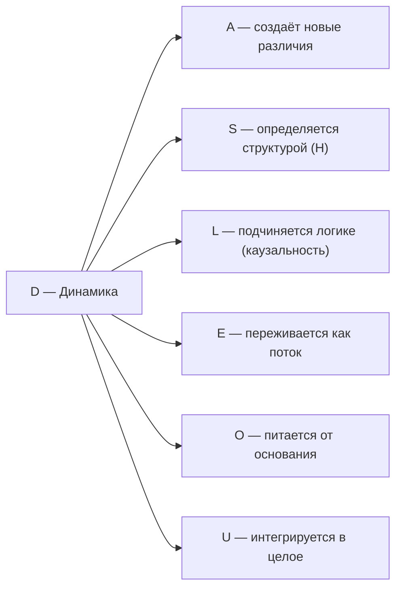

# Измерение III: Динамика (D)

## Функция

**Изменяться, эволюционировать, течь.**

## Описание

Динамика — это непрерывная трансформация Голонома.

:::info Онтологический статус
Динамика — **аспект** конфигурации $\Gamma$, не отдельная сущность. "Голоном динамичен" означает: матрица когерентности $\Gamma$ изменяется во [внутреннем времени](../../proofs/dynamics/emergent-time) τ, и существует унитарный оператор $U(\tau)$, описывающий эту эволюцию.
:::

:::warning Связь с аксиомами
При удалении измерения $D$ нарушаются **(AP)** и **(QG)**:
- **(AP):** Нет процесса → нет самовоспроизведения → нет автопоэзиса
- **(QG):** Нет эволюции → уравнение Линдблада не определено

Без динамики Голоном — "замороженный снимок", не живая система. См. [доказательство](../../proofs/minimality/theorem-minimality-7#случай-n--2-удаление-динамики-d).
:::

**Время возникает из структуры Γ:** Динамика не "происходит во времени" — время **выводится** из корреляций между измерениями. Согласно [теореме об эмерджентном времени](../../proofs/dynamics/emergent-time), внутреннее время τ возникает как параметр условных состояний относительно [измерения O](./dimension-o).

:::tip Ключевое следствие [П]
Скорость течения внутреннего времени определяется когерентностями D с другими измерениями:

$$
\frac{d\tau}{d\sigma} \propto \sum_{i \neq D} |\gamma_{Di}|^2
$$

где $\sigma$ — внешний аффинный параметр (координатное время наблюдателя), $\tau$ — [внутреннее эмерджентное время](../../proofs/dynamics/emergent-time).

При $\gamma_{Di} \to 0$ для всех $i \neq D$ время "замораживается".

**Статус:** Формула — **структурный анзац [П]**, мотивированный Page-Wootters механизмом. Строгий вывод требует установления связи между когерентностями $\gamma_{Di}$ и параметром условных состояний τ в расширенном формализме; в минимальном 7D-формализме такая связь не доказана.
:::

## Математическое представление

Унитарный оператор эволюции во [внутреннем времени](../../proofs/dynamics/emergent-time) τ (в единицах $\hbar = 1$):

$$
U(\tau) = e^{-iH_{eff}\tau}
$$

Эволюция матрицы когерентности:

$$
\Gamma(\tau) = U(\tau) \Gamma(0) U^\dagger(\tau)
$$

**Связь с гамильтонианом:** Оператор $U(\tau)$ полностью определяется эффективным гамильтонианом $H_{eff}$ из ограничения Page-Wootters. Это **дуальность S ↔ D** — структура и динамика суть два аспекта одного гамильтониана:
- $S$: спектр $\{E_n\}$ (что сохраняется)
- $D$: эволюция $U(\tau) = e^{-iH_{eff}\tau}$ (как изменяется)

## Полное уравнение эволюции

С внутренним временем τ ([теорема об эмерджентном времени](../../proofs/dynamics/emergent-time)):

$$
\frac{d\Gamma(\tau)}{d\tau} = -i[H_{eff}, \Gamma(\tau)] + \mathcal{D}[\Gamma(\tau)] + \mathcal{R}[\Gamma(\tau), E]
$$

где:
- τ — параметр условных состояний (Page-Wootters)
- $H_{eff}$ — эффективный гамильтониан, возникающий из ограничения $\hat{C}$
- Уравнение — **следствие** структуры $\Gamma_{total}$, не постулат

### Компоненты:

**1. Унитарная часть** (замкнутая система):

$$
-i[H, \Gamma] = -i(H\Gamma - \Gamma H)
$$

- Сохраняет чистоту $P = \mathrm{Tr}(\Gamma^2)$
- Детерминистическая, обратимая

**2. Диссипативная часть** (открытая система):

$$
\mathcal{D}[\Gamma] = \sum_k \gamma_k \left( L_k \Gamma L_k^\dagger - \frac{1}{2}\{L_k^\dagger L_k, \Gamma\} \right)
$$

- Уменьшает $P$ (декогеренция)
- $L_k$ — операторы Линдблада, $\gamma_k > 0$ — скорости декогеренции

**3. Регенеративная часть** [Т] (восстановление):

$$
\mathcal{R}[\Gamma, E] = \kappa(\Gamma) \cdot (\rho_* - \Gamma) \cdot \Theta(\Delta F)
$$

- Может увеличивать $P$ (регенерация)
- Форма **полностью выведена** из аксиом A1–A5 + стандартной термодинамики ([вывод](../dynamics/evolution#вывод-формы-регенерации))
- $\kappa(\Gamma) = \kappa_{\text{bootstrap}} + \kappa_0 \cdot \mathrm{Coh}_E(\Gamma)$ — скорость регенерации [Т], $\kappa_0$ — [категориальный вывод](../foundations/axiom-septicity#структурный-анзац-kappa0)
- $(\rho_* - \Gamma)$ — единственная CPTP-релаксация [Т], $\rho_*$ — единственное стационарное состояние ([примитивность](/docs/core/operators/lindblad-operators#примитивность-ℒω))
- $\Theta(\Delta F)$ — термодинамический затвор из принципа Ландауэра [Т]
- Нелинейность $\mathcal{R}$ по $\Gamma$ **не нарушает** запрет сигнализации — см. [доказательство](../dynamics/evolution#запрет-сигнализации)

## Типы динамики

| Тип | Уравнение | Характеристика | $dP/d\tau$ |
|-----|-----------|----------------|---------|
| Унитарная | $\frac{d\Gamma}{d\tau} = -i[H, \Gamma]$ | Замкнутая система | $= 0$ |
| Диссипативная | $+ \mathcal{D}[\Gamma]$ | Открытая система | $< 0$ |
| Регенеративная | $+ \mathcal{R}[\Gamma, E]$ | Живая система | $\gtrless 0$ |

## Примеры

| Уровень | Пример | Тип динамики |
|---------|--------|--------------|
| Физический | Колебания маятника | Унитарная (периодическая) |
| Физический | Распад частицы | Диссипативная (необратимая) |
| Биологический | Метаболизм | Регенеративная |
| Биологический | Рост организма | Регенеративная |
| Когнитивный | Поток сознания | Смешанная |
| Когнитивный | Обучение | Регенеративная (изменение структуры) |

## Стрела времени

:::info Теорема о стреле времени [Т]
Направление времени — **категорное следствие** структуры CPTP-каналов, не постулат:

$$
\sigma(\gamma) \cdot \Delta S_{vN}(\gamma) \geq 0
$$

где σ(γ) = +1 для физически реализуемых путей (CPTP).

[Полное доказательство →](../../proofs/dynamics/emergent-time#7-теорема-о-стреле-времени)
:::

Направление времени определяется асимметрией динамики:

$$
\frac{dS_{vN}}{d\tau} \geq 0 \quad \text{(второй закон — следствие CPTP)}
$$

где $S_{vN} = -\mathrm{Tr}(\Gamma \log \Gamma)$ — энтропия фон Неймана.

Для живых систем возможно локальное уменьшение энтропии за счёт регенерации:

$$
\frac{dS_{vN}^{\text{local}}}{d\tau} < 0 \quad \text{при} \quad \Delta F > 0 \text{ и } \frac{dS_{vN}^{\text{total}}}{d\tau} \geq 0
$$

## Связь с другими измерениями

## Когерентность с D

Элементы $\gamma_{Di}$ матрицы когерентности описывают связь динамики с другими измерениями:

| Когерентность | Интерпретация |
|---------------|---------------|
| $\gamma_{DA}$ | Артикулированность изменений (чёткость переходов) |
| $\gamma_{DS}$ | Структурированность эволюции (устойчивость траекторий) |
| $\gamma_{DL}$ | Причинность (логическая связь состояний) |
| $\gamma_{DE}$ | Интериорный аспект динамики (связь процесса с опытом) |
| $\gamma_{DO}$ | Связь с источником (питание от основания) |
| $\gamma_{DU}$ | Телеология (интегрированное направленное изменение) |

### Октонионный контекст {#октонионный-контекст}

:::note Октонионное соответствие [И]
Измерению соответствует $e_3 \in \mathrm{Im}(\mathbb{O})$. Детали, $G_2$-оговорка и Фано-триплеты: [Октонионная интерпретация](./dimensions#октонионная-интерпретация), [структурный вывод](../../proofs/minimality/theorem-octonionic-derivation).
:::

---

**Связанные документы:**
- [Структура (S)](./dimension-s) — предыдущее измерение, дуальность S ↔ D
- [Логика (L)](./dimension-l) — следующее измерение
- [Теорема об эмерджентном времени](../../proofs/dynamics/emergent-time) — вывод времени из структуры Γ
- [Основание (O)](./dimension-o) — роль внутренних часов
- [Эволюция](../dynamics/evolution) — детальное описание динамики
- [Пространство-время](../cosmology/spacetime) — эмерджентная геометрия
- [Теорема о минимальности](../../proofs/minimality/theorem-minimality-7) — доказательство необходимости D
