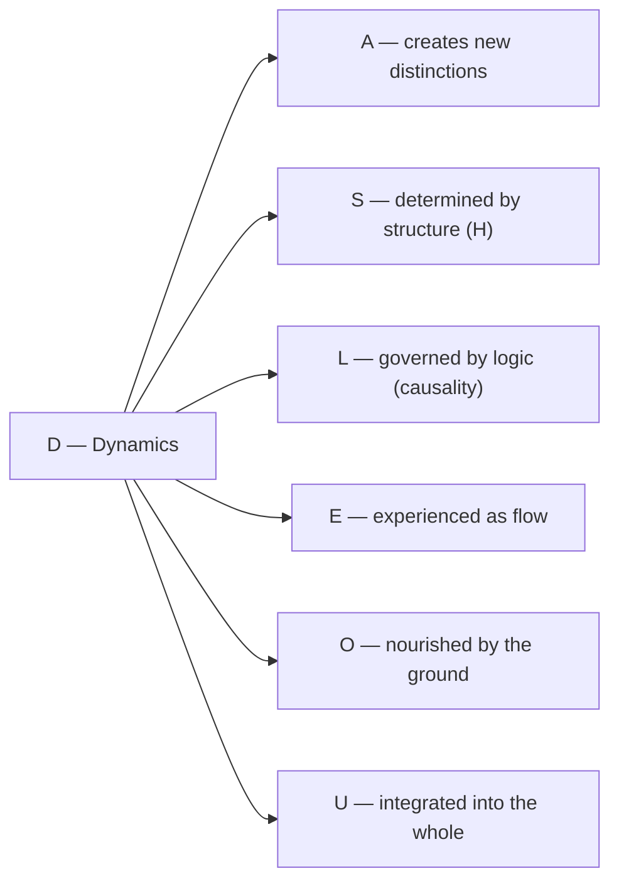

# Dimension III: Dynamics (D)

:::info Who this chapter is for
Dimension D: change, process, unitary operator. Familiarity with the [seven dimensions](/docs/core/structure/dimensions) and [evolution of Γ](/docs/core/dynamics/evolution) is assumed.
:::

## Why this chapter

Everything real **moves**. An atom oscillates, a cell divides, one thought gives way to another. But where does motion itself come from? In classical physics, time and change are taken as given: objects "simply" move in a pre-existing spacetime. In the Unitary Holonomic Monism (UHM) the position is radically different: **time does not exist as a background** — it **emerges** from the very structure of the Holon. Dimension D (Dynamics) is that aspect of reality which makes any change possible.

In this chapter you will learn:
- why dynamics is not "something happening in time", but the source of time itself;
- what three fundamental types of dynamics exist and how they relate to physics, biology, and consciousness;
- why time goes "forward" (the arrow of time) — and how this is proved mathematically;
- how purity $P$ — the key measure of coherence — behaves in each of the three regimes;
- how dynamics connects to the other six dimensions of the Holon and to the geometry of the Fano plane.

## Historical precursor

The idea that change is a fundamental feature of reality is as old as philosophy.

**Heraclitus** (c. 535–475 BCE) was the first to formulate the principle: *«Πάντα ῥεῖ»* — "everything flows". One cannot step into the same river twice, because the river is already different, and so is the person. In UHM this is a direct analogue: the coherence matrix $\Gamma$ changes continuously, and even an "immobile" system is in fact oscillating around its stationary state.

**Isaac Newton** (1643–1727) gave change a mathematical language — **differential equations**. Velocity is the derivative of a coordinate with respect to time, acceleration is the second derivative. The equation $F = ma$ links cause (force) to dynamics (acceleration). But for Newton time is an absolute background, "flowing uniformly", independent of anything whatsoever.

**Erwin Schrödinger** (1887–1961) discovered that at the quantum level dynamics is described not by coordinates and velocities, but by a **wave function** obeying the equation $i\hbar \partial_t |\psi\rangle = H|\psi\rangle$. This is unitary evolution — deterministic, reversible, lossless. But real quantum systems interact with their environment, and unitarity alone is insufficient.

**Göran Lindblad** (1940–2022) derived in 1976 the general form of the evolution equation for **open quantum systems** — systems that exchange information with their environment. The Lindblad equation adds dissipative terms to the unitary part, describing decoherence and information loss. This form is the foundation of the UHM evolution equation.

:::tip Key step of UHM
In UHM a **third** — **regenerative** — term $\mathcal{R}$ is added to the unitary and dissipative parts, describing the ability of living systems to restore coherence. This is not an arbitrary addition: the form of $\mathcal{R}$ is **fully derived** from axioms [A1–A5](/docs/core/foundations/axiom-omega) and standard thermodynamics.
:::

:::note Logic of historical development
Note the pattern: Heraclitus → Newton → Schrödinger → Lindblad → UHM. Each step broadened the understanding of dynamics. Heraclitus asserted *that* the world changes. Newton showed *how* to describe changes mathematically. Schrödinger discovered that the dynamics of the quantum world are fundamentally different — unitary. Lindblad accounted for interaction with the environment — open dynamics. UHM adds **regeneration** and removes the **last crutch** — external time — showing that it itself emerges from dynamics.
:::

## Intuitive explanation

### Analogy with a river

Imagine a mountain river. **Water** flows, churns, changes direction — this is dynamics. **The banks** and **the channel** determine where the water can flow — this is [structure (S)](./dimension-s). Remove the banks — and instead of a river there is a shapeless flood. Remove the water — and dry stones remain, a dead landscape. The river exists only as a unity of flow and form.

In UHM this correspondence is exact:
- **D** (Dynamics) — "water": the capacity to change, flow, evolve
- **S** (Structure) — "banks": what is preserved through changes
- **The Hamiltonian** $H_{eff}$ — "the terrain": it simultaneously determines both the spectrum of structure ($S$: eigenvalues — what is preserved) and the law of evolution ($D$: unitary operator — how it changes)

This is the **S ↔ D duality**: structure and dynamics are two faces of the same Hamiltonian.

But the river analogy reveals one more important point. An ordinary river flows *in* time — water moves *in the direction* from source to mouth in an already existing spacetime. In UHM everything is different: the "river" of dynamics does not flow *in* time — it **creates** time itself. The flow of water is not motion in a ready-made channel, but the emergence of the channel in the process of flowing. Hard to picture? That is precisely why the emergence of time is one of the most counter-intuitive, yet also the most profound results of UHM.

### Three types of dynamics: pendulum, friction, life

Think of three situations:

1. **A pendulum in vacuum.** It swings forever, losing not a drop of energy. Each moment fully determines the next, and if you "rewind the film", everything looks equally natural. This is **unitary dynamics** — ideal motion without loss.

2. **A pendulum in water.** It gradually slows and stops: friction converts ordered motion into chaotic heat. This is **dissipative dynamics** — irreversible loss of order. If you rewind the film, the pendulum would begin to swing up from rest — this looks impossible.

3. **A living organism.** It too is subject to "friction" (entropy grows, cells wear out), but unlike the pendulum it **eats**, **breathes**, **recovers**. The living organism draws order from its environment (negentropy) and uses it for self-repair. This is **regenerative dynamics** — the capacity to resist dissipation by drawing on resources.

<!-- DRY: Canonical definition of the evolution equation in /docs/core/dynamics/evolution -->
In UHM all three types are represented by the terms of the full evolution equation:

$$
\frac{d\Gamma}{d\tau} = \underbrace{-i[H_{eff}, \Gamma]}_{\text{pendulum}} + \underbrace{\mathcal{D}[\Gamma]}_{\text{friction}} + \underbrace{\mathcal{R}[\Gamma, E]}_{\text{life}}
$$

:::info Why exactly three, and not two or four?
Three terms are not an arbitrary choice. The unitary part follows from quantum mechanics (the von Neumann equation). The dissipative part follows from Lindblad's theorem: for any CPTP generator the dissipative correction has precisely this form. The regenerative part is the unique addition compatible with CPTP, autopoiesis, and standard thermodynamics. There simply is no fourth independent term: any other addition either violates CPTP (physically inadmissible) or reduces to a combination of the three already present.
:::

## Function

**To change, to evolve, to flow.**

## Description

Dynamics is the continuous transformation of the Holon.

:::info Ontological status
Dynamics is an **aspect** of the configuration $\Gamma$, not a separate entity. "The Holon is dynamic" means: the coherence matrix $\Gamma$ changes in [internal time](../../proofs/dynamics/emergent-time) τ, and there exists a unitary operator $U(\tau)$ describing this evolution.
:::

:::warning Connection with the axioms
Removing dimension $D$ violates **(AP)** and **(QG)**:
- **(AP):** No process → no self-reproduction → no autopoiesis
- **(QG):** No evolution → the Lindblad equation is undefined

Without dynamics the Holon is a "frozen snapshot", not a living system. See [proof](../../proofs/minimality/theorem-minimality-7#случай-n--2-удаление-динамики-d).
:::

**Time emerges from the structure of Γ:** Dynamics does not "happen in time" — time is **derived** from correlations between dimensions. According to the [emergent time theorem](../../proofs/dynamics/emergent-time), internal time τ arises as the parameter of conditional states relative to [dimension O](./dimension-o).

:::tip Key consequence [Т]
The rate of flow of internal time is determined by the coherences of D with the other dimensions:

$$
\frac{d\tau}{d\sigma} \propto \sum_{i \neq D} |\gamma_{Di}|^2
$$

where $\sigma$ is the external affine parameter (coordinate time of the observer) and $\tau$ is the [internal emergent time](../../proofs/dynamics/emergent-time).

When $\gamma_{Di} \to 0$ for all $i \neq D$, time "freezes".

**Status:** **[Т]** — consequence of the [finite spectral triple](/docs/core/foundations/spacetime#теорема-спектральная-тройка) $(A_{\text{int}}, H_{\text{int}}, D_{\text{int}})$: from the spectral triple $d\tau/d\sigma = \|D_O\Gamma\|_{\text{HS}} = \omega_0\sqrt{\sum_{i \neq O}|\gamma_{Oi}|^2 \cdot \text{Gap}(O,i)^2} \propto \sqrt{\sum_i |\gamma_{Di}|^2}$.
:::

## Mathematical representation

Unitary evolution operator in [internal time](../../proofs/dynamics/emergent-time) τ (in units $\hbar = 1$):

$$
U(\tau) = e^{-iH_{eff}\tau}
$$

Evolution of the coherence matrix:

$$
\Gamma(\tau) = U(\tau) \Gamma(0) U^\dagger(\tau)
$$

**Connection with the Hamiltonian:** The operator $U(\tau)$ is fully determined by the effective Hamiltonian $H_{eff}$ from the Page–Wootters constraint. This is the **S ↔ D duality** — structure and dynamics are two aspects of the same Hamiltonian:
- $S$: spectrum $\{E_n\}$ (what is preserved)
- $D$: evolution $U(\tau) = e^{-iH_{eff}\tau}$ (how it changes)

## Full evolution equation

<!-- DRY: Canonical definition of the evolution equation in /docs/core/dynamics/evolution -->
With internal time τ ([emergent time theorem](../../proofs/dynamics/emergent-time)):

$$
\frac{d\Gamma(\tau)}{d\tau} = -i[H_{eff}, \Gamma(\tau)] + \mathcal{D}[\Gamma(\tau)] + \mathcal{R}[\Gamma(\tau), E]
$$

where:
- τ is the parameter of conditional states (Page–Wootters)
- $H_{eff}$ is the effective Hamiltonian arising from the constraint $\hat{C}$
- The equation is a **consequence** of the structure of $\Gamma_{total}$, not a postulate

### Components:

**1. Unitary part** (closed system):

$$
-i[H, \Gamma] = -i(H\Gamma - \Gamma H)
$$

- Preserves purity $P = \mathrm{Tr}(\Gamma^2)$
- Deterministic, reversible

:::info Why purity is preserved
The unitary transformation $\Gamma \mapsto U\Gamma U^\dagger$ is a "rotation" in state space. Just as rotating a three-dimensional object does not change its shape, unitary evolution does not change the degree of order of the system. Mathematically: $\mathrm{Tr}((U\Gamma U^\dagger)^2) = \mathrm{Tr}(U\Gamma^2 U^\dagger) = \mathrm{Tr}(\Gamma^2)$ — the cyclic property of the trace.
:::

**2. Dissipative part** (open system):

$$
\mathcal{D}[\Gamma] = \sum_k \gamma_k \left( L_k \Gamma L_k^\dagger - \frac{1}{2}\{L_k^\dagger L_k, \Gamma\} \right)
$$

- Decreases $P$ (decoherence)
- $L_k$ — Lindblad operators, $\gamma_k > 0$ — decoherence rates

:::info Decoherence in plain terms
Imagine a carefully constructed house of cards (high coherence). Wind (interaction with the environment) gradually destabilises the cards — the house loses structure. This is decoherence: the loss of quantum correlations through interaction with a "noisy" environment. The larger $\gamma_k$, the stronger the "wind".
:::

**3. Regenerative part** [Т] (restoration):

$$
\mathcal{R}[\Gamma, E] = \kappa(\Gamma) \cdot (\rho_* - \Gamma) \cdot g_V(P)
$$

- Can increase $P$ (regeneration)
- Form **fully derived** from axioms A1–A5 + standard thermodynamics ([derivation](../dynamics/evolution#вывод-формы-регенерации))
- $\kappa(\Gamma) = \kappa_{\text{bootstrap}} + \kappa_0 \cdot \mathrm{Coh}_E(\Gamma)$ — regeneration rate [Т], $\kappa_0$ — [categorical derivation](../foundations/axiom-septicity#структурный-анзац-kappa0)
- $(\rho_* - \Gamma)$ — unique CPTP relaxation [Т], $\rho_* = \varphi(\Gamma)$ — categorical self-model ([φ operator](/docs/core/operators/phi-operator))
- $g_V(P)$ — V-preservation gate [Т] (Landauer + V-invariance, [derivation](../dynamics/evolution#теорема-v-preservation-gate))
- The nonlinearity of $\mathcal{R}$ in $\Gamma$ **does not violate** the no-signalling constraint — see [proof](../dynamics/evolution#запрет-сигнализации)

:::info Regeneration: why life is not merely complex physics
The regenerative part $\mathcal{R}$ is the fundamental distinction of living systems from non-living ones. A stone is subject only to unitary and dissipative dynamics: wind and rain gradually erode it. A living tree **actively resists** destruction: it draws energy from sunlight, nutrients from the soil, and uses them to restore its structure. In the mathematics of UHM this is expressed in the fact that $\mathcal{R}$ can **increase** purity $P$, compensating the losses from $\mathcal{D}$.

But regeneration is possible only in the presence of a **resource** $E$ (from the environment) and when $\kappa(\Gamma) > 0$ — the system needs at least minimal "selfhood" ($\kappa_{\text{bootstrap}}$) to begin recovering.
:::

### Three components and their parallels {#три-компоненты-параллели}

For clarity, let us gather the three types of dynamics into a unified table of parallels:

| Property | Unitary $-i[H,\Gamma]$ | Dissipative $\mathcal{D}$ | Regenerative $\mathcal{R}$ |
|----------|--------------------------|------------------------------|-------------------------------|
| **Analogy** | Pendulum in vacuum | Pendulum in water | Living organism |
| **Reversibility** | Fully reversible | Irreversible | Irreversible (but constructive) |
| **Effect on $P$** | Does not change | Decreases | Can increase |
| **Physical meaning** | Coherent evolution | Loss of information | Restoration of order |
| **Mathematical source** | Von Neumann equation | Lindblad theorem | Axioms A1–A5 + thermodynamics |
| **Requires resource?** | No | No | Yes ($E$ from environment) |
| **Exists in isolation in nature?** | Only as approximation | Yes (non-living matter) | Only together with $\mathcal{D}$ |

## Types of dynamics

| Type | Equation | Characteristic | $dP/d\tau$ |
|------|-----------|----------------|---------|
| Unitary | $\frac{d\Gamma}{d\tau} = -i[H, \Gamma]$ | Closed system | $= 0$ |
| Dissipative | $+ \mathcal{D}[\Gamma]$ | Open system | $< 0$ |
| Regenerative | $+ \mathcal{R}[\Gamma, E]$ | Living system | $\gtrless 0$ |

### Dynamics and viability: how P changes in each regime

Purity $P = \mathrm{Tr}(\Gamma^2)$ is the central measure of the Holon's coherence. Each type of dynamics affects $P$ differently:

**Unitary regime** ($\mathcal{D} = 0, \mathcal{R} = 0$): $P$ = const. The system "rotates" in state space, neither losing nor gaining order. This is an idealisation, analogous to a pendulum in a vacuum — useful for analysis but unrealistic for real systems.

**Dissipative regime** ($\mathcal{R} = 0$): $dP/d\tau \leq 0$. Purity decreases monotonically; the system "blurs". In the limit $\tau \to \infty$ the state tends to the maximally mixed $\Gamma \to I/7$ ($P = 1/7$). This is "heat death" — complete loss of structure.

**Regenerative regime** (full equation): The balance between $\mathcal{D}$ and $\mathcal{R}$ determines the fate of the system:
- If $\mathcal{R}$ dominates: $P$ grows, the system accumulates coherence
- If $\mathcal{D}$ dominates: $P$ falls, the system degrades
- At equilibrium ($dP/d\tau = 0$): the system rests on an **attractor** — a stable stationary state with $P > P_{\text{crit}} = 2/7$ [Т]

:::warning Critical threshold
Viability requires $P > P_{\text{crit}} = 2/7$ [Т]. Below this threshold the system cannot maintain sufficient distinguishability between dimensions and "crumbles" into an indistinguishable mixture. Details: [critical purity theorem](/docs/proofs/dynamics/theorem-purity-critical).
:::

### Viability as dynamic balance {#жизнеспособность-баланс}

The stationary state of a living Holon is not "rest", but **dynamic equilibrium**: dissipation continuously destroys coherence while regeneration continuously restores it. This resembles a cyclist: stable only while pedalling. Stopping the pedals ($\mathcal{R} \to 0$) = falling ($P \to 1/7$) = death.

Quantitatively, the stationarity condition gives a **flux balance**:

$$
\left.\frac{dP}{d\tau}\right|_{\mathcal{D}} + \left.\frac{dP}{d\tau}\right|_{\mathcal{R}} = 0
$$

This equation defines the **attractor** $\Gamma_*$ — the stationary state towards which the system tends. For a viable Holon $P(\Gamma_*) > 2/7$ [Т], with the upper boundary of the "Goldilocks zone" being $P = 3/7$ [Т] (T-124): $P \in (2/7, 3/7]$ — the [consciousness window](/docs/proofs/dynamics/theorem-purity-critical).

## Emergent time {#эмерджентность-времени}

### Why time does not exist as a background

In classical physics (and even in quantum mechanics) time is an **external parameter**, given in advance. The Universe is "placed" inside a temporal container. But in quantum gravity and in UHM this approach is unacceptable: if the Holon describes **all** of reality, there is nothing "outside" that could provide time.

The solution is the **Page–Wootters mechanism** (1983): globally the state $\Gamma_{\text{total}}$ is **stationary** (does not change!), but internal correlations between subsystems create the **illusion of the flow of time**.

:::info The Page–Wootters mechanism in plain terms
Imagine an eternal, unchanging book where each page holds one frame of a film. The book *as a whole* does not change: all pages always exist. But if you leaf through the book, you experience a *story* — a sequence of events. The Page–Wootters mechanism says: the Universe is that "book" ($\Gamma_{\text{total}}$ is stationary), and the "leafing" is the quantum correlations between the "content" (dimensions A, S, D, L, E, U) and the "page numbers" (dimension O). Time arises not because something *changes*, but because different "pages" *correlate* differently.
:::

### How time arises from D and O correlations

In UHM [dimension O (Ground)](./dimension-o) plays the role of "internal clock". Time $\tau$ is defined as the **parameter of conditional states** $\Gamma$ relative to the O-projection:

$$
\Gamma(\tau) := \frac{\langle\tau_O|\Gamma_{\text{total}}|\tau_O\rangle}{\mathrm{Tr}(\langle\tau_O|\Gamma_{\text{total}}|\tau_O\rangle)}
$$

where $|\tau_O\rangle$ is the "clock reading" in the O-dimension. Thus time **arises** from quantum correlations between the dynamic content ($D$ and other dimensions) and the "clock" dimension ($O$).

:::note Film-projector analogy
Imagine a film reel wound into a loop — the entire reel "exists" simultaneously. But the projector, illuminating frame after frame, creates the illusion of motion. In UHM the O-dimension is the "projector", and D is the "content of the frames". Time is the order in which the "projector" illuminates the correlations.
:::

### Rate of time flow

An important consequence of emergence: the rate of time flow is **not the same** for all systems. It depends on how strongly the D-dimension is coupled to the others:

$$
\frac{d\tau}{d\sigma} \propto \sum_{i \neq D} |\gamma_{Di}|^2
$$

This means:
- **Strongly coupled system** (large $|\gamma_{Di}|$): time flows fast, events succeed one another rapidly. Example: the brain in a waking state — high coherence between dynamics and other dimensions.
- **Weakly coupled system** (small $|\gamma_{Di}|$): time "slows down". Example: deep dreamless sleep, anaesthesia — subjective time nearly stops.
- **Completely isolated** ($\gamma_{Di} = 0$ for all $i$): time freezes. The system is "outside of time" — eternal, but dead.

Detailed derivation: [Theorem on emergent time](../../proofs/dynamics/emergent-time).

## Arrow of time

:::info Theorem on the arrow of time [Т]
The direction of time is a **categorical consequence** of the structure of CPTP channels, not a postulate:

$$
\sigma(\gamma) \cdot \Delta S_{vN}(\gamma) \geq 0
$$

where σ(γ) = +1 for physically realisable paths (CPTP).

[Full proof →](../../proofs/dynamics/emergent-time#7-теорема-о-стреле-времени)
:::

The direction of time is determined by the asymmetry of dynamics:

$$
\frac{dS_{vN}}{d\tau} \geq 0 \quad \text{(second law — consequence of CPTP)}
$$

where $S_{vN} = -\mathrm{Tr}(\Gamma \log \Gamma)$ is the von Neumann entropy.

### Why time moves "forward"

The arrow of time is one of the deepest questions in physics. Newton's laws, the Schrödinger equation — all of them are **symmetric** with respect to time reversal. So where does irreversibility come from?

In UHM the answer is elegant: **CPTP channels are irreversible by construction**. CPTP (Completely Positive Trace-Preserving) is a class of maps describing the physically admissible evolution of quantum systems. The key property: a CPTP channel can "smear" a pure state into a mixed state, but the **reverse process** (reassembling the mixed state back into a pure one) is **not** CPTP.

Simply put: breaking a glass is easy (CPTP), but reassembling the shards would require an "anti-CPTP" process, which is physically forbidden. The arrow of time is not a mystery, but a **consequence** of the mathematical structure of admissible quantum channels.

:::note The arrow of time and the three types of dynamics
Unitary dynamics is **by itself** reversible — it has no arrow of time. The arrow arises from the **dissipative** part $\mathcal{D}$: it is decoherence that creates irreversibility. But here is a paradox: the **regenerative** part $\mathcal{R}$ is also irreversible, even though it acts "in the opposite direction" — it increases $P$ instead of decreasing it. Is there not a contradiction here?

No. Regeneration is irreversible in a **different sense**: it uses the resource $E$ from the environment, creating a **global** increase in entropy $dS_{vN}^{\text{total}}/d\tau \geq 0$, even when **locally** $P$ grows. A living being decreases its own entropy, but at the cost of increasing the entropy of the environment — exactly like a refrigerator that cools its interior but heats the room.
:::

### Local decrease in entropy

For living systems a local decrease in entropy is possible through regeneration:

$$
\frac{dS_{vN}^{\text{local}}}{d\tau} < 0 \quad \text{при} \quad \Delta F > 0 \text{ и } \frac{dS_{vN}^{\text{total}}}{d\tau} \geq 0
$$

A living being **locally** defeats entropy (becomes more ordered), but **globally** the total entropy (organism + environment) increases. The refrigerator cools its interior but heats the room — the second law of thermodynamics is not violated.

## Dynamics at different strata {#динамика-на-стратах}

The character of dynamics changes qualitatively as one moves from simple systems to complex ones:

| Stratum | System | Dominant type | Characteristic |
|---------|--------|---------------|----------------|
| I | Matter | Unitary + dissipative | No regeneration. A stone weathers, a radioactive isotope decays. $P$ decreases monotonically (or is preserved in idealisation) |
| II | Life | All three | Regeneration balances dissipation. A cell consumes ATP to maintain $P > P_{\text{crit}}$. Death = $\mathcal{R} \to 0$ |
| III | Mind | All three + Bayesian | Dynamics is **optimised**: the brain minimises free energy $F$ ([active inference](/docs/consciousness/foundations/two-aspect-monism)). Learning = directed regeneration |
| IV | Consciousness | All three + reflexive | The system observes **its own** dynamics ($R \geq 1/3$). The stream of consciousness is a continuous evolution $\Gamma(\tau)$ accessible to self-observation |

:::note Key distinction
At strata I–II dynamics "just happens". At strata III–IV the system **knows** that it is changing, and can **direct** its changes. This is the transition from passive evolution to active — from a river flowing along its bed to a boat choosing its course.
:::

### More detail: strata I and II {#страты-i-ii}

**Stratum I (Matter).** Dynamics is fully determined by the laws of physics. An electron in an atomic orbit — unitary evolution: the state "rotates" in Hilbert space at a frequency determined by the level energy. A heated metal emitting photons — dissipative evolution: thermal energy is dispersed into the environment, $P$ drops. No object at stratum I can *itself* be restored — it has no $\mathcal{R}$.

**Stratum II (Life).** A bacterium, an amoeba, a tree — all of them continuously "fight" dissipation. A cell consumes ATP (adenosine triphosphate — the "energy currency" of life) to restore proteins, replicate DNA, maintain the membrane. While $\mathcal{R}$ keeps pace with $\mathcal{D}$, the organism is alive: $P > 2/7$. When $\mathcal{R}$ weakens (illness, exhaustion of resources), $P$ falls below the critical threshold — this is biological death.

### More detail: strata III and IV {#страты-iii-iv}

**Stratum III (Mind).** Dynamics acquires **purposefulness**. The brain does not merely react to stimuli — it builds internal models of the world and **minimises free energy** $F$ (Friston's active inference theory). Learning is *directed* regeneration: new neural connections form not randomly, but so as to reduce the discrepancy between prediction and reality.

**Stratum IV (Consciousness).** The deepest level: the system not only changes, but also **observes its own changes**. The reflection measure $R \geq 1/3$ [Т] means that the Holon "sees" its own dynamics — the stream of consciousness ($\Gamma(\tau)$ as a function of internal time) is accessible to self-observation. This is what we experience as "the flow of thoughts", "the stream of impressions", "the sense of time".

## Examples

| Level | Example | Type of dynamics | Details |
|-------|---------|------------------|---------|
| Physical | Pendulum oscillations | Unitary (periodic) | $P$ = const: an ideal oscillator loses no energy |
| Physical | Particle decay | Dissipative (irreversible) | $P$ decreases: neutron → proton + electron + antineutrino |
| Physical | Freezing of water | Unitary + dissipative | Local ordering as heat is given off to the environment |
| Biological | Metabolism | Regenerative | The organism consumes glucose to restore structure |
| Biological | Organism growth | Regenerative | $P$ grows: embryo → adult — increasing coherence |
| Biological | Ageing | Dissipative (predominant) | $\mathcal{D}$ begins to dominate over $\mathcal{R}$: regeneration weakens |
| Cognitive | Stream of consciousness | Mixed | Thoughts succeed one another: unitary (associations) + regenerative (focusing) |
| Cognitive | Learning | Regenerative (structural change) | New neural connections — growth of coherence in the L-subsystem |
| Cognitive | Forgetting | Dissipative | Loss of coherences $\gamma_{ij}$ without active reinforcement |
| Social | Development of science | Regenerative | The scientific community is a "collective Holon" that accumulates $P$ through experiments |

### More detail: three types of dynamics in one person's life

Let us consider a typical person's day through the lens of three types of dynamics:

**Morning (waking).** Regenerative dynamics dominates. During sleep the organism restored coherence: damaged proteins replaced, neural connections consolidated, $P$ increased. Morning coffee — supply of resource $E$ (caffeine stimulates $\kappa(\Gamma)$, accelerating regeneration).

**Day (work).** Mixed dynamics. Solving problems — the unitary component (associative thinking: one idea leads to another without losses). Fatigue — the dissipative component ($P$ gradually drops, coherences $\gamma_{ij}$ weaken). Lunch break — regeneration (new resources $E$).

**Evening (rest and sleep).** Dissipation has accumulated: it is hard to concentrate, thoughts "blur" ($\gamma_{DL} \downarrow$). Falling asleep — transition to a mode of deep regeneration: the brain disconnects external inputs and directs all resources to restoring coherence.

### More detail: dynamics on the scale of a lifetime {#динамика-масштаб-жизни}

The three types of dynamics also manifest on the scale of an entire lifetime:

**Childhood and youth (0–25 years).** Regeneration dominates. The organism grows, neural networks become more complex, $P$ increases. A child learns at an extraordinary speed — $\kappa(\Gamma)$ is maximal, regeneration far exceeds dissipation.

**Maturity (25–60 years).** Dynamic equilibrium. $\mathcal{R} \approx \mathcal{D}$ — the organism maintains $P$ above the critical level, but with a gradual slowing of regeneration. Wisdom (high $\gamma_{DL}$) partially compensates for physical decline.

**Ageing (60+ years).** Dissipation begins to dominate: $\mathcal{D} > \mathcal{R}$. Coherence slowly drops. In the limit $\mathcal{R} \to 0$ — biological death: $P \to 1/7$.

:::info Death in UHM terms
Biological death is not an "instantaneous event" but a process: $\mathcal{R}$ gradually weakens, $P$ crosses the threshold $P_{\text{crit}} = 2/7$ from above to below, and the system ceases to be viable. This explains why the "moment of death" is so hard to determine medically — it is not a point but a **gradual transition**.
:::

## Connection with other dimensions

```mermaid
graph LR
    D["D — Dynamics"] --> A["A — creates new distinctions"]
    D --> S["S — determined by structure (H)"]
    D --> L["L — governed by logic (causality)"]
    D --> E["E — experienced as flow"]
    D --> O["O — nourished by the ground"]
    D --> U["U — integrated into the whole"]
```

### S ↔ D duality: two faces of the same coin

The connection between [Structure (S)](./dimension-s) and Dynamics (D) deserves special attention. These are not simply "two different dimensions", but **two perspectives on one object** — the Hamiltonian $H_{eff}$:

$$
H_{eff} \xrightarrow{\text{spectrum}} S \quad \text{and} \quad H_{eff} \xrightarrow{\text{exponential}} D
$$

The spectrum of the Hamiltonian (eigenvalues $\{E_n\}$) determines **what** is preserved — structure. The exponential of the Hamiltonian ($e^{-iH\tau}$) determines **how** the system changes — dynamics. Removing one without the other is impossible: there is no spectrum without the operator, no evolution without the spectrum.

This duality has a deep analogy in music: the **score** (S) defines the notes, intervals, harmony — the static structure of a piece. **Performance** (D) is the unfolding of the score in time: sounds, rhythm, dynamics of volume. A score without performance is dead; a performance without a score is chaos.

### More detail on each connection

**D ↔ S (Dynamics ↔ Structure):** Fundamental duality. The Hamiltonian $H_{eff}$ determines both the spectrum (S) and the evolution (D). Without structure dynamics is chaotic; without dynamics structure is dead. Analogy: chess rules (S) define the admissible moves (D), and a game (D) realises the rules (S).

**D ↔ L (Dynamics ↔ Logic):** Logic determines **which** trajectories are admissible, dynamics — **how** the system moves along admissible trajectories. Inadmissible evolutions (violating CPTP) are filtered out by the L-dimension. See: [Logic (L)](./dimension-l).

**D ↔ E (Dynamics ↔ Interiority):** Dynamics is experienced "from the inside" as **flow** — a continuous succession of subjective states. Coherence $\gamma_{DE}$ links the objective process ($D$) with its interior aspect ($E$). High $|\gamma_{DE}|$ — a vivid, rich experience of change.

**D ↔ O (Dynamics ↔ Ground):** The O-dimension is the source of emergent time. D↔O correlations determine the **rate** of flow of internal time. When the connection with O is lost ($\gamma_{DO} \to 0$), dynamics "detaches" from its temporal ground.

**D ↔ A (Dynamics ↔ Articulation):** Dynamics generates new distinctions. The evolution Γ(τ) can create new non-zero components $\gamma_{ij}$ that were previously absent — this is "articulation through change".

**D ↔ U (Dynamics ↔ Unity):** Coherence $\gamma_{DU}$ is responsible for the **directionality** of changes — the teleological aspect. High $|\gamma_{DU}|$ means that the dynamics is **integrated** — all parts of the system change coherently, as a single whole.

## Coherence with D

The elements $\gamma_{Di}$ of the coherence matrix describe the connection of dynamics with other dimensions:

| Coherence | Interpretation |
|-----------|----------------|
| $\gamma_{DA}$ | Articulatedness of changes (sharpness of transitions) |
| $\gamma_{DS}$ | Structuredness of evolution (stability of trajectories) |
| $\gamma_{DL}$ | Causality (logical connection of states) |
| $\gamma_{DE}$ | Interior aspect of dynamics (connection of process with experience) |
| $\gamma_{DO}$ | Connection with the source (nourishment from the ground) |
| $\gamma_{DU}$ | Teleology (integrated directed change) |

## Dynamics and the Fano plane {#динамика-и-фано}

Dimension D ($e_3$ in the octonionic correspondence) belongs to three [Fano lines](/docs/core/structure/dimensions#октонионная-интерпретация):

| Fano line | Sector type | Physical meaning |
|-----------|-------------|-----------------|
| $\{S, D, E\}$ | **3**–**3**–$\bar{\mathbf{3}}$ | Structural dynamics connected with interiority |
| $\{D, L, U\}$ | **3**–$\bar{\mathbf{3}}$–$\bar{\mathbf{3}}$ | Dynamic logic of unity: causal integration |
| $\{O, A, D\}$ | $1_O$–**3**–**3** | Observable articulated dynamics: direct O-connection |

:::info Combinatorial profile of D
Of the seven dimensions D is the only element of the **3**-sector connected with O through another element of **3** ($A$) via the line $\{O, A, D\}$. This defines the unique role of D: dynamics is **directly visible** through the ground, through the "lens" of articulation. By [theorem T-177](/docs/core/structure/dimensions#комбинаторная-единственность) the semantic role of D is combinatorially unique.
:::

### What the Fano lines say about dynamics {#фано-линии-динамика}

Each of the three Fano lines containing D reveals a separate aspect of dynamics:

**Line $\{S, D, E\}$ — "the body of dynamics".** Structure ($S$) sets the form, dynamics ($D$) creates motion, interiority ($E$) "experiences" this motion from within. This line connects three dimensions that together describe *embodied* dynamics — not abstract change, but concrete, structured, experienced change. Example: heartbeat. The structure of the heart ($S$) determines the rhythm, dynamics ($D$) — the actual muscle contraction, and interiority ($E$) — the sensation of "beating" during introspection.

**Line $\{D, L, U\}$ — "the mind of dynamics".** Dynamics ($D$), logical admissibility ($L$) and integration ($U$) form an **inseparable triad**. Change is possible ($D$) only if it is logically admissible ($L$) and integrated into the whole ($U$). This line is the foundation of causality: from one coherent state to another, while preserving unity. Example: logical reasoning. Each inferential step ($D$) must be correct ($L$) and fit into a coherent picture ($U$).

**Line $\{O, A, D\}$ — "the eye of dynamics".** The ground ($O$) observes dynamics ($D$) through the lens of articulation ($A$). This is precisely the line that makes dynamics *visible*: without the O-connection, changes would occur "in the dark" — without generating emergent time. This is exactly why $\tau$ arises from D↔O correlations: these two dimensions are connected at the level of Fano geometry.

Each Fano line $\ell = \{i,j,k\}$ defines a [Lindblad operator](/docs/core/operators/lindblad-operators) $L_\ell^{\text{Fano}} = \frac{1}{\sqrt{3}}\Pi_\ell$, which describes decoherence in the corresponding associative subalgebra. The three lines containing D define three dissipation channels that directly affect the dynamical dimension.

### Octonionic context {#октонионный-контекст}

:::note Octonionic correspondence [Т]
The dimension corresponds to $e_3 \in \mathrm{Im}(\mathbb{O})$. This identification is a **theorem** [Т]: the [T15 bridge chain](/docs/core/foundations/axiom-septicity#мост-p1p2) (all steps [Т]) derives the octonionic structure from (AP)+(PH)+(QG)+(V); [T-177 [Т]](/docs/reference/status-registry) and [T-183 [Т]](/docs/reference/status-registry) prove the combinatorial and functional uniqueness of each role. The specific assignment $D = e_3$ is fixed up to $G_2$-gauge equivalence ([T-42a [Т]](/docs/proofs/categorical/uniqueness-theorem)). Details and $G_2$-caveat: [Octonionic interpretation](./dimensions#октонионная-интерпретация), [structural derivation](../../proofs/minimality/theorem-octonionic-derivation).
:::

## Key conclusions of the chapter {#ключевые-выводы}

1. **Dynamics is not motion in time, but the source of time.** Time $\tau$ arises from D↔O correlations via the Page–Wootters mechanism.
2. **Three types of dynamics exhaust all possibilities.** Unitary (reversible), dissipative (irreversible, destructive) and regenerative (irreversible, constructive) — there are no others.
3. **The arrow of time is a consequence, not a postulate.** CPTP channels are irreversible by construction; entropy increases automatically.
4. **Life is dynamic balance.** Living systems maintain $P > 2/7$ through the equilibrium between $\mathcal{D}$ and $\mathcal{R}$.
5. **D is combinatorially unique.** On the Fano plane D is the only **3**-dimension with a direct O-connection, which explains its role as the source of emergent time.

---

**Related documents:**
- [Structure (S)](./dimension-s) — previous dimension, S ↔ D duality
- [Logic (L)](./dimension-l) — next dimension
- [Theorem on emergent time](../../proofs/dynamics/emergent-time) — derivation of time from the structure of Γ
- [Ground (O)](./dimension-o) — role of the internal clock
- [Evolution](../dynamics/evolution) — detailed description of dynamics
- [Spacetime](../foundations/spacetime) — emergent geometry
- [Minimality theorem](../../proofs/minimality/theorem-minimality-7) — proof of the necessity of D
- [Lindblad operators](../operators/lindblad-operators) — formalism of dissipation
- [Holon dimensions](./dimensions) — overview of all 7 dimensions
