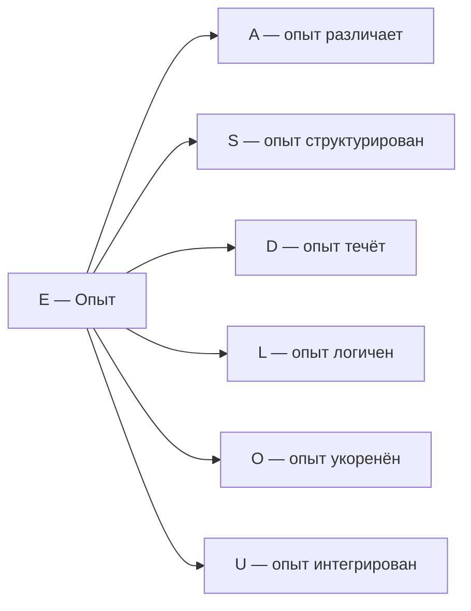

# Измерение V: Опыт (E)

## Функция

**Переживать, чувствовать, осознавать.**

## Описание

Опыт — это **внутренняя сторона Голонома**. Каждая конфигурация $\Gamma$ не только "есть" объективно, но и "переживается" субъективно. Измерение $E$ определяет [трёхуровневую иерархию интериорности](../../proofs/interiority-hierarchy): L0 (интериорность) → L1 (феноменальная геометрия) → L2 (когнитивные квалиа).

:::info Онтологический статус
Измерение $E$ — **аспект** конфигурации $\Gamma$, не отдельная сущность. "Голоном переживает" означает: в матрице когерентности $\Gamma$ активна проекция на базисный вектор $|E\rangle$, и определена редуцированная матрица плотности $\rho_E$ с нетривиальным спектром.
:::

:::warning Связь с феноменологией
При удалении измерения $E$ нарушается **(PH)** — нет внутренней стороны, нет опыта. Это единственное измерение, удаление которого напрямую нарушает именно аксиому феноменологии. См. [доказательство](../../proofs/theorem-minimality-7#случай-n--5-удаление-опыта-e).
:::

**Опыт обеспечивает феноменологический аспект (M,R)-системы:** В терминологии Розена измерение $E$ отвечает за "внутреннюю перспективу" замкнутого каузального цикла — без неё система функциональна, но "пуста изнутри" (философский зомби).

## Математическое представление

### Подматрица опыта

$$
\rho_E = \mathrm{Tr}_{\bar{E}}(\Gamma)
$$

где $\mathrm{Tr}_{\bar{E}}$ — частичный след по всем измерениям кроме $E$, а $\Gamma$ рассматривается как оператор на тензорном произведении $\mathcal{H} = \mathcal{H}_E \otimes \mathcal{H}_{\bar{E}}$.

:::note Техническое замечание
Здесь $\mathcal{H}_E$ — гильбертово пространство, ассоциированное с измерением Опыта. Размерность $\mathcal{H}_E$ определяется сложностью системы и не фиксирована a priori.
:::

### Спектральное разложение

$$
\rho_E \vert q_i\rangle = \lambda_i \vert q_i\rangle
$$

где:
- $\lambda_i \in [0, 1]$, $\sum_i \lambda_i = 1$ — **интенсивности** компонентов опыта
- $\vert q_i\rangle \in \mathcal{H}_E$ — **качества** компонентов

### Феноменальный вектор

Полное описание опыта в момент $t$:

$$
\text{FV}(\rho_E) := \{(\lambda_i, [\vert q_i\rangle]) : \rho_E \vert q_i\rangle = \lambda_i \vert q_i\rangle\}
$$

где $[\vert q_i\rangle] \in \mathbb{P}(\mathcal{H}_E)$ — класс эквивалентности в проективном пространстве.

## Экспериенциальное содержание

Экспериенциальное содержание (для всех уровней L0-L2) определяется четырьмя компонентами:

$$
\text{Exp}(\rho_E, t) := (\text{Intensity}, \text{Quality}, \text{Context}, \text{History})
$$

:::note Терминология
Функция $\text{Exp}$ применима ко всем уровням. Термин **"квалиа"** (Quale) резервируется исключительно для **L2** — когнитивных квалиа с рефлексивным доступом.
:::

| Компонент | Определение | Интерпретация |
|-----------|-------------|---------------|
| **Intensity** | $\{\lambda_i\}$ — спектр $\rho_E$ | Сила переживания |
| **Quality** | $\{[\vert q_i\rangle]\} \subset \mathbb{P}(\mathcal{H}_E)$ | Характер переживания |
| **Context** | $\rho_{\bar{E}} = \mathrm{Tr}_E(\Gamma)$ | Модуляция опыта другими измерениями |
| **History** | $\{\rho_E(t') : t' < t\}$ | Адаптация и память |

:::note О функции Exp
Формула задаёт **структурное соответствие** между математическими объектами и экспериенциальным содержанием. Это не вычислительная функция, а декларация изоморфизма.
:::

## Проективное пространство качеств

Качества живут в **проективном пространстве**:

$$
\mathbb{P}(\mathcal{H}_E) := (\mathcal{H}_E \setminus \{0\}) / \sim
$$

где $\vert\psi\rangle \sim \vert\phi\rangle \Leftrightarrow \exists c \in \mathbb{C}^*: \vert\psi\rangle = c\vert\phi\rangle$.

### Метрика Фубини-Штуди

Расстояние между качествами:

$$
d_{FS}([\vert\psi\rangle], [\vert\phi\rangle]) := \arccos(\lvert\langle\psi\vert\phi\rangle\rvert) \in [0, \pi/2]
$$

Интерпретация:
- $d_{FS} = 0$ — одинаковые качества
- $d_{FS} = \pi/2$ — максимально различные (ортогональные)

## Типы опыта по иерархии

| Уровень | Название | Условие | Что существует | Примеры |
|---------|----------|---------|----------------|---------|
| **L0** | Интериорность | $\exists \rho_E$ | Внутреннее состояние | Атом, кристалл |
| **L1** | Феноменальная геометрия | $\mathrm{rank}(\rho_E) > 1$ | Структура качеств с $d_{FS}$ | Нейрон, сетчатка |
| **L2** | Когнитивные квалиа | $R \geq R_{th}$, $\Phi \geq \Phi_{th}$ | Рефлексивный доступ | Человек, высшие млекопитающие |

где $R_{\text{th}} = 1/3$, $\Phi_{\text{th}} = 1$ — [геометрически мотивированные значения](../foundations/axiom-septicity#пороги-l2-геометрическая-мотивация).

## Примеры

### L1: Феноменальная геометрия (без рефлексивного доступа)

| Система | Описание | Параметры |
|---------|----------|-----------|
| Сетчатка глаза | Спектральный профиль $\rho_E$ различает цвета | $R < R_{th}$ |
| Отдельный нейрон | Локальная геометрия в $\mathbb{P}(\mathcal{H}_E)$ | $\Phi < \Phi_{th}$ |
| Простейший организм | Множество сенсорных состояний | $R \approx 0.1$, $\Phi \approx 1$ |

### L2: Когнитивные квалиа (с рефлексивным доступом)

| Система | Описание | Параметры |
|---------|----------|-----------|
| Бодрствующий человек | Полный набор квалиа: цвет, боль, эмоции | $R \approx 0.7$, $\Phi \approx 4$ |
| Высшие приматы | Самоузнавание в зеркале | $R \geq R_{th}$, $\Phi \approx 2$ |
| REM-сон | Сновидения с частичной рефлексией | $R \approx 0.4$, $\Phi \approx 3$ |

## Связь с другими измерениями

**Ключевая связь E ↔ U:** Опыт и единство взаимосвязаны:
- $E$ определяет *что* переживается
- $U$ определяет *как* переживания интегрируются в единое "Я"

При $\gamma_{EU} \to 0$ опыт фрагментируется (диссоциация).

## Когерентность с E

| Когерентность | Интерпретация |
|---------------|---------------|
| $\gamma_{EA}$ | Внимание (осознанность различий) |
| $\gamma_{ES}$ | Узнавание (осознанность структуры) |
| $\gamma_{ED}$ | Поток сознания (переживание времени) |
| $\gamma_{EL}$ | Рациональность (логичность опыта) |
| $\gamma_{EO}$ | Глубина переживания (связь с основанием) |
| $\gamma_{EU}$ | Единство сознания (интеграция опыта) |

## Формула сознательности

Измерение $E$ входит в формулу сознательности через рефлексию:

$$
C = \Phi \times D \times R
$$

где:
- $\Phi$ — интеграция (связь с $U$)
- $D$ — дифференциация: $D = \exp(S_{vN}(\rho_E))$
- $R$ — рефлексия: $R = 1 - \|\Gamma - \varphi(\Gamma)\|^2 / \|\Gamma\|^2$

Когнитивные квалиа (L2) возникают при $C \geq C_{th} := \Phi_{th} \times D_{\min} \times R_{th}$.

---

**Связанные документы:**
- [Логика (L)](./dimension-l) — предыдущее измерение
- [Основание (O)](./dimension-o) — следующее измерение
- [Иерархия интериорности](../../proofs/interiority-hierarchy) — формальные определения L0→L1→L2
- [Теория интериорности](../consciousness/interiority) — полная математическая теория
