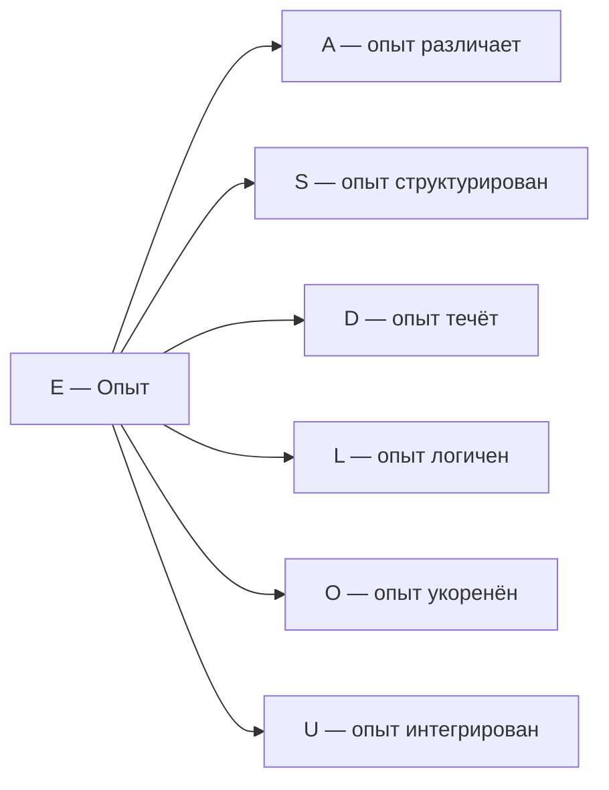

# Измерение V: Опыт (E)

## Функция

**Переживать, чувствовать, осознавать.**

## Описание

Опыт — это **внутренняя сторона Голонома**. Каждая конфигурация $\Gamma$ не только "есть" объективно, но и "переживается" субъективно. Измерение $E$ определяет [пятиуровневую иерархию интериорности](../../proofs/consciousness/interiority-hierarchy): L0 (интериорность) → L1 (феноменальная геометрия) → L2 (когнитивные квалиа) → L3 (сетевое сознание) → L4 (унитарное сознание).

:::info Онтологический статус
Измерение $E$ — **аспект** конфигурации $\Gamma$, не отдельная сущность. "Голоном переживает" означает: в матрице когерентности $\Gamma$ активна проекция на базисный вектор $|E\rangle$, и определена редуцированная матрица плотности $\rho_E$ с нетривиальным спектром.
:::

:::tip Функциональная единственность E [Т]
Измерение $E$ **необходимо и функционально единственно** по трём независимым аргументам:

1. **Аксиоматический:** (PH) — аксиоматическое требование для холона. При удалении E нарушается (PH). [Доказательство →](../../proofs/minimality/theorem-minimality-7#единственность-e)
2. **Категориальный (κ₀):** Формула $\kappa_0 = \omega_0 \cdot |\gamma_{OE}| \cdot |\gamma_{OU}| / \gamma_{OO}$ (Th. 15.3.1, [Т]) явно использует E как отдельный объект категории через $\mathrm{Hom}(O, E)$. При удалении E: κ₀ не определён, скорость регенерации $\kappa(\Gamma) = \kappa_{\text{bootstrap}} + \kappa_0 \cdot \mathrm{Coh}_E$ теряет оба E-зависимых фактора.
3. **Математический:** Только E ассоциируется с матрицей плотности $\rho \in \mathcal{D}(\mathcal{H})$ — единственным математическим объектом с $\mathrm{rank} > 1$ (требование L1). Метрика Фубини—Штуди на проективном пространстве качеств — единственная согласованная риманова метрика.

Статус: **[Т]** | [Полное доказательство →](../../proofs/minimality/theorem-minimality-7#единственность-e)
:::

**Опыт обеспечивает феноменологический аспект (M,R)-системы:** В терминологии Розена измерение $E$ отвечает за "внутреннюю перспективу" замкнутого каузального цикла — без неё система функциональна, но "пуста изнутри" (философский зомби).

## Математическое представление

### Подматрица опыта

$$
\rho_E = \mathrm{Tr}_{\bar{E}}(\Gamma)
$$

где $\mathrm{Tr}_{\bar{E}}$ — частичный след по всем измерениям кроме $E$.

:::warning Важно: тензорная структура
Частичный след определён только при **тензорной структуре** пространства состояний:
$$
\mathcal{H} = \mathcal{H}_E \otimes \mathcal{H}_{\bar{E}}
$$

Это соответствует **расширенному формализму** УГМ (см. [Два уровня формализации](../dynamics/coherence-matrix#два-уровня-формализации)). В минимальном 7D-формализме ($\mathcal{H} = \mathbb{C}^7$) частичный след не определён, поскольку 7 — простое число и $\mathbb{C}^7$ не факторизуется как тензорное произведение.

**Доступные операции в 7D-формализме:**
- $\gamma_{EE}$ — диагональный элемент (населённость E) — **доступно**
- $\gamma_{Ei}$ — когерентности с другими измерениями — **доступно**
- $\mathrm{Coh}_E(\Gamma) := \|\pi_E(\Gamma)\|_{\mathrm{HS}}^2 / \|\Gamma\|_{\mathrm{HS}}^2 = (\gamma_{EE}^2 + 2\sum_{i \neq E}|\gamma_{Ei}|^2) / \mathrm{Tr}(\Gamma^2)$ — [E-когерентность (HS-проекция)](/docs/core/foundations/axiom-septicity#e-coherence-definition) **[Т]**, $\mathrm{Coh}_E \in [1/7, 1]$ — **точная мера**
- $\rho_E = \mathrm{Tr}_{-E}(\Gamma)$ — полная редуцированная матрица — **недоступно** (требует расширенный формализм)
- $D_{\text{diff}} = \exp(S_{vN}(\rho_E))$ — дифференциация — **недоступно** (требует расширенный формализм)
:::

:::note Техническое замечание
Здесь $\mathcal{H}_E$ — гильбертово пространство, ассоциированное с измерением Опыта. Размерность $\mathcal{H}_E$ определяется сложностью системы и не фиксирована a priori. Для систем с богатым феноменальным содержанием $\dim(\mathcal{H}_E) \gg 1$.
:::

### Спектральное разложение

$$
\rho_E \vert q_i\rangle = \lambda_i \vert q_i\rangle
$$

где:
- $\lambda_i \in [0, 1]$, $\sum_i \lambda_i = 1$ — **интенсивности** компонентов опыта
- $\vert q_i\rangle \in \mathcal{H}_E$ — **качества** компонентов

### Феноменальный вектор

Полное описание опыта в момент $\tau$:

$$
\text{FV}(\rho_E) := \{(\lambda_i, [\vert q_i\rangle]) : \rho_E \vert q_i\rangle = \lambda_i \vert q_i\rangle\}
$$

где $[\vert q_i\rangle] \in \mathbb{P}(\mathcal{H}_E)$ — класс эквивалентности в проективном пространстве.

## Экспериенциальное содержание

Экспериенциальное содержание (для всех уровней L0-L2) определяется четырьмя компонентами:

$$
\text{Exp}(\rho_E, \tau) := (\text{Intensity}, \text{Quality}, \text{Context}, \text{History})
$$

:::note Терминология
Функция $\text{Exp}$ применима ко всем уровням. Термин **"квалиа"** (Quale) резервируется исключительно для **L2** — когнитивных квалиа с рефлексивным доступом.
:::

| Компонент | Определение | Интерпретация |
|-----------|-------------|---------------|
| **Интенсивность** | $\{\lambda_i\}$ — спектр $\rho_E$ | Сила интериорного состояния |
| **Качество** | $\{[\vert q_i\rangle]\} \subset \mathbb{P}(\mathcal{H}_E)$ | Характер интериорного состояния |
| **Контекст** | $\rho_{\bar{E}} = \mathrm{Tr}_E(\Gamma)$ | Модуляция опыта другими измерениями |
| **История** | $\{\rho_E(\tau') : \tau' < \tau\}$ | Адаптация и память |

:::note Структурная необходимость
Формула задаёт **структурное соответствие** между математическими объектами и экспериенциальным содержанием. Это соответствие **не произвольный постулат**, а [единственный функтор](/docs/consciousness/foundations/two-aspect-monism#теорема-единственность-фв), совместимый с аксиоматикой: частичный след единствен, спектральное разложение единственно, метрика Фубини—Штуди единственна (теорема Ченцова—Пеца).
:::

## Проективное пространство качеств

Качества живут в **проективном пространстве**:

$$
\mathbb{P}(\mathcal{H}_E) := (\mathcal{H}_E \setminus \{0\}) / \sim
$$

где $\vert\psi\rangle \sim \vert\phi\rangle \Leftrightarrow \exists c \in \mathbb{C}^*: \vert\psi\rangle = c\vert\phi\rangle$.

### Метрика Фубини—Штуди

Расстояние между качествами:

$$
d_{FS}([\vert\psi\rangle], [\vert\phi\rangle]) := \arccos(\lvert\langle\psi\vert\phi\rangle\rvert) \in [0, \pi/2]
$$

Интерпретация:
- $d_{FS} = 0$ — одинаковые качества
- $d_{FS} = \pi/2$ — максимально различные (ортогональные)

## Типы опыта по иерархии

| Уровень | Название | Условие | Что существует | Примеры |
|---------|----------|---------|----------------|---------|
| **L0** | Интериорность | $\exists \rho_E$ | Внутреннее состояние | Атом, кристалл |
| **L1** | Феноменальная геометрия | $\mathrm{rank}(\rho_E) > 1$ | Структура качеств с $d_{FS}$ | Нейрон, сетчатка |
| **L2** | Когнитивные квалиа | $R \geq R_{th}$, $\Phi \geq \Phi_{th}$ | Рефлексивный доступ | Человек, высшие млекопитающие |
| **L3** | Сетевое сознание | $R^{(2)} \geq 1/4$ | Метарефлексия (метастабильно) | Мицелий, рой, глубокая медитация |
| **L4** | Унитарное сознание | $\lim_{n \to \infty} R^{(n)} > 0$, $P > 6/7$ | Полная ∞-структура | Теоретический предел |

где $R_{\text{th}} = 1/3$, $\Phi_{\text{th}} = 1$, $R^{(2)}_{\text{th}} = 1/4$ — [строго выводятся из ПИР](../foundations/axiom-septicity#пороги-l2-строгий-вывод). L4 требует $P > 6/7$ — недостижимо для биологических систем.

## Примеры

### L1: Феноменальная геометрия (без рефлексивного доступа)

| Система | Описание | Параметры |
|---------|----------|-----------|
| Сетчатка глаза | Спектральный профиль $\rho_E$ различает цвета | $R < R_{th}$ |
| Отдельный нейрон | Локальная геометрия в $\mathbb{P}(\mathcal{H}_E)$ | $\Phi < \Phi_{th}$ |
| Простейший организм | Множество сенсорных состояний | $R \approx 0.1$, $\Phi \approx 1$ |

### L2: Когнитивные квалиа (с рефлексивным доступом)

| Система | Описание | Параметры |
|---------|----------|-----------|
| Бодрствующий человек | Полный набор квалиа: цвет, боль, эмоции | $R \approx 0.7$, $\Phi \approx 4$ |
| Высшие приматы | Самоузнавание в зеркале | $R \geq R_{th}$, $\Phi \approx 2$ |
| REM-сон | Сновидения с частичной рефлексией | $R \approx 0.4$, $\Phi \approx 3$ |

## Связь с другими измерениями

**Ключевая связь E ↔ U:** Опыт и единство взаимосвязаны:
- $E$ определяет *что* составляет интериорное содержание
- $U$ определяет *как* интериорные состояния интегрируются в единое целое

При $\gamma_{EU} \to 0$ опыт фрагментируется (диссоциация).

## Когерентность с E

| Когерентность | Интерпретация |
|---------------|---------------|
| $\gamma_{EA}$ | Апперцепция (различение, вошедшее в интериорность) |
| $\gamma_{ES}$ | Репрезентация (структура в интериорности) |
| $\gamma_{ED}$ | Аффекция (действие процесса на интериорность) |
| $\gamma_{EL}$ | Эвиденция (логическая связность в интериорности) |
| $\gamma_{EO}$ | Имманентность (основание внутри интериорности) |
| $\gamma_{EU}$ | Синтез (интеграция интериорного содержания в целое) |

## Формула сознательности

Измерение $E$ входит в формулу сознательности через рефлексию и дифференциацию:

$$
C = \Phi \times D_{\text{diff}} \times R
$$

:::note О нотации
$D_{\text{diff}}$ — мера **дифференциации** опыта. Не путать с измерением **D (Динамика)**. Мы используем subscript для различения.
:::

где:
- $\Phi$ — [интеграция](./dimension-u#мера-интеграции-φ): $\Phi = \sum_{i \neq j} |\gamma_{ij}|^2 / \sum_i \gamma_{ii}^2$
- $D_{\text{diff}}$ — дифференциация: $D_{\text{diff}} = \exp(S_{vN}(\rho_E))$, где $S_{vN} = -\mathrm{Tr}(\rho_E \log \rho_E)$
- $R$ — [рефлексия](/docs/consciousness/foundations/self-observation#мера-рефлексии-r): $R = 1 - \|\Gamma - \varphi(\Gamma)\|_F^2 / \|\Gamma\|_F^2$

### Тензорная факторизация для D_diff {#tensor-factorization-ddiff}

:::warning Ограничение 7D-формализма
Формула $D_{\text{diff}} = \exp(S_{vN}(\rho_E))$ требует вычисления частичного следа $\rho_E = \mathrm{Tr}_{\bar{E}}(\Gamma)$, который определён **только при тензорной структуре** пространства состояний. В минимальном 7D-формализме ($\mathcal{H} = \mathbb{C}^7$) частичный след **не определён**, поскольку 7 — простое число и $\mathbb{C}^7$ не факторизуется как тензорное произведение.

Для операционального использования $D_{\text{diff}}$ требуется **расширенный формализм** — см. [Два уровня формализации](../dynamics/coherence-matrix#два-уровня-формализации).

**Решение для 7D-формализма:**

В минимальном формализме используется **редуцированная мера сознательности**:

$$
C_{\min} := \Phi \times R
$$

где $D_{\text{diff}}$ исключается (эквивалентно $D_{\text{diff}} := 2$, минимальное значение для L2).

**Обоснование:** При $D_{\text{diff}} = D_{\min} = 2$ (пороговое значение) редуцированная мера корректно классифицирует системы:
- $C_{\min} \geq 1/3 \Leftrightarrow \Phi \geq 1$ и $R \geq 1/3$ ⟹ L2
- $C_{\min} < 1/3$ ⟹ L0 или L1

**Альтернативная 7D-аппроксимация $D_{\text{diff}}$:**

Вычисление $D_{\text{diff}}$ через E-когерентность:

$$
D_{\text{diff}}^{7D} := 1 + \frac{\mathrm{Coh}_E(\Gamma)}{\mathrm{Coh}_E^{\max}} \cdot (N - 1)
$$

где $\mathrm{Coh}_E(\Gamma)$ — [E-когерентность](/docs/core/foundations/axiom-septicity#e-coherence-definition) (HS-проекция, **[Т]**).

Это линейная интерполяция: $D_{\text{diff}}^{7D} \in [1, 7]$, где минимум при $\mathrm{Coh}_E = 0$ (нет связей E с другими измерениями), максимум при полной когерентности.
:::

**Диапазон $D_{\text{diff}}$:**
- $S_{vN} \in [0, \log N]$ для $N$-мерной системы
- $D_{\text{diff}} = \exp(S_{vN}) \in [1, N]$
- Минимум ($D_{\text{diff}} = 1$): чистое состояние, один компонент опыта
- Максимум ($D_{\text{diff}} = N$): максимально смешанное состояние, равновероятные компоненты

### Порог дифференциации $D_{\min} = 2$

**Обоснование:** Когнитивные квалиа требуют **различения** — минимум два различимых компонента опыта.

$$
D_{\text{diff}} \geq D_{\min} = 2 \Leftrightarrow S_{vN}(\rho_E) \geq \log 2
$$

**Геометрическая интерпретация:** $S_{vN} = \log 2$ соответствует состоянию с эффективной размерностью 2 (два равновероятных компонента). Это минимум для:
1. **Различения** — должно быть что различать (минимум 2 качества)
2. **Выбора** — должна быть возможность выбора между альтернативами
3. **Информации** — минимум 1 бит феноменального содержания

:::note Связь с теорией информации
$D_{\min} = 2$ означает, что когнитивный доступ требует минимум 1 бит информации в феноменальном содержании. Система, переживающая только одно неразличимое качество ($D_{\text{diff}} = 1$), не имеет материала для рефлексии.
:::

**Порог сознательности:**

$$
C \geq C_{th} := \Phi_{th} \times D_{\min} \times R_{th} = 1 \times 2 \times \frac{1}{3} = \frac{2}{3} \approx 0.67
$$

### Октонионный контекст {#октонионный-контекст}

:::note Октонионное соответствие [И]
Измерению соответствует $e_5 \in \mathrm{Im}(\mathbb{O})$. Детали, $G_2$-оговорка и Фано-триплеты: [Октонионная интерпретация](./dimensions#октонионная-интерпретация), [структурный вывод](../../proofs/minimality/theorem-octonionic-derivation).
:::

---

**Связанные документы:**
- [Логика (L)](./dimension-l) — предыдущее измерение
- [Основание (O)](./dimension-o) — следующее измерение
- [Иерархия интериорности](../../proofs/consciousness/interiority-hierarchy) — формальные определения L0→L1→L2→L3→L4
- [Теория интериорности](/docs/consciousness/foundations/interiority-theory) — полная математическая теория
