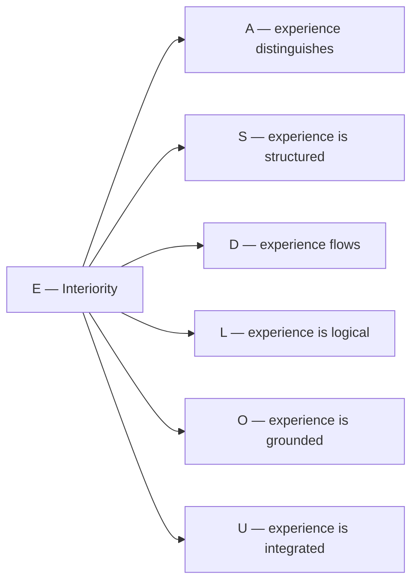

# Dimension V: Interiority (E)

## What this chapter is about

This chapter is devoted to the fifth dimension of the Holon — **Interiority**. You will learn:

- Why the "hard problem of consciousness" is not a philosophical puzzle but a question about a specific dimension of the configuration $\Gamma$;
- How the idea of the inner side of being developed from Descartes to Tononi;
- What the reduced density matrix $\rho_E$ is and how its spectrum describes the structure of interiority (at level L2 — the content of experience);
- How the **five levels** of interiority (L0→L4) arise from mathematical thresholds;
- Why, without dimension $E$, the regeneration formula $\kappa_0$ loses meaning and the system becomes a "philosophical zombie".

:::info Who this chapter is for
If you are reading about UHM for the first time — start with the [overview of dimensions](./dimensions). If you are already familiar with the seven dimensions and want to understand how the theory handles subjective experience — you are in the right place.
:::

## Function

**To experience, to feel, to be aware.**

## Historical precursor {#историческая-предтеча}

The question of what it means to "experience from within" is one of the oldest in philosophy. Different eras have approached it from different angles.

**René Descartes** (1641), in the *Meditations on First Philosophy*, formulated the famous *cogito ergo sum* — "I think, therefore I am". Even if the entire external world is an illusion, the very fact of experiencing is indisputable. Descartes established: **subjectivity is a given**, requiring no external confirmation. However, he divided the world into "thinking" and "extended" substances, creating the problem of their interaction.

**Thomas Nagel** (1974), in the article *"What Is It Like to Be a Bat?"*, put the question sharply: a bat has echolocation — a physical fact. But **what is it like to be** a bat? What subjective experience does it have? This question cannot be reduced to a description of neurons or sound waves. Nagel showed that subjectivity is not a side effect of complexity, but a separate aspect of reality.

**David Chalmers** (1995) gave this question a precise name — **"the hard problem of consciousness"**. The "easy" problems are to explain how the brain processes information, controls behaviour, distinguishes stimuli. All of this, in principle, fits within physics and neuroscience. The "hard" problem is different: **why** does information processing get *experienced* at all? Why do "zombies" not exist — beings functionally identical to a human but devoid of subjective experience?

**Giulio Tononi** (2004) proposed the **Integrated Information Theory (IIT)**, in which consciousness is not a property of behaviour but a property of **causal structure**. The measure $\Phi_{\text{IIT}}$ quantifies how much a system is "more than the sum of its parts". But computing $\Phi_{\text{IIT}}$ requires enumerating all possible partitions of the system — a task of exponential complexity.

In UHM theory all these ideas find a unified formalism. **Dimension $E$ (Interiority)** is the answer to Nagel's question: every Holon has an "inner side", described by the reduced density matrix $\rho_E$. Chalmers' hard problem is resolved: subjectivity is not an "add-on" to physics, but an [aspect of the configuration $\Gamma$](/docs/consciousness/foundations/two-aspect-monism), present at all levels (from atom to human). And Tononi's integration measure acquires a computable analogue — $\Phi_{\text{UHM}}$ with polynomial complexity $O(N^2)$.

## Description

Interiority is the **inner side of the Holon**. Every configuration $\Gamma$ not only "exists" objectively, but is also "experienced" subjectively. Dimension $E$ defines the [five-level hierarchy of interiority](/docs/consciousness/hierarchy/interiority-hierarchy): L0 (interiority) → L1 (phenomenal geometry) → L2 (cognitive qualia) → L3 (network consciousness) → L4 (unitary consciousness).

### Intuitive explanation {#интуитивное-объяснение}

Imagine a mirror. From the outside you see a reflection — an objective, measurable picture. But a mirror also has an **inner side** — the amalgam, without which there would be no reflection. Dimension $E$ is the "amalgam" of the Holon: invisible from the outside, but providing the very possibility of experience.

A stone **exists** objectively — it has a coherence matrix $\Gamma$ with specific values of all seven dimensions. But **"what does the stone feel"**? Its level of interiority is L0: there is "something inside" (non-zero population $\gamma_{EE}$), but this "something" is not structured (rank $\rho_E = 1$). The stone has no "colours" or "shapes" in its inner world — there is only one point in quality space.

A neuron is already at level L1: its $\rho_E$ has rank greater than one — the inner space contains several distinguishable states. But a neuron cannot *look at* its inner world — for that, reflection is required ($R \geq 1/3$), and that is already level L2.

:::info Ontological status
Dimension $E$ is an **aspect** of the configuration $\Gamma$, not a separate entity. "The Holon experiences" means: in the coherence matrix $\Gamma$ the projection onto the basis vector $|E\rangle$ is active, and the reduced density matrix $\rho_E$ with a non-trivial spectrum is defined.
:::

:::tip Functional uniqueness of E [Т]
Dimension $E$ is **necessary and functionally unique** by three independent arguments:

1. **Axiomatic:** (PH) is an axiomatic requirement for a Holon. Removing E violates (PH). [Proof →](../../proofs/minimality/theorem-minimality-7#единственность-e)
2. **Categorical (κ₀):** The formula $\kappa_0 = \omega_0 \cdot |\gamma_{OE}| \cdot |\gamma_{OU}| / \gamma_{OO}$ (Th. 15.3.1, [Т]) explicitly uses E as a separate object of the category via $\mathrm{Hom}(O, E)$. When E is removed: κ₀ is undefined, the regeneration rate $\kappa(\Gamma) = \kappa_{\text{bootstrap}} + \kappa_0 \cdot \mathrm{Coh}_E$ loses both E-dependent factors.
3. **Mathematical:** Only E is associated with the density matrix $\rho \in \mathcal{D}(\mathcal{H})$ — the unique mathematical object with $\mathrm{rank} > 1$ (requirement L1). The Fubini–Study metric on the projective quality space is the unique consistent Riemannian metric.

Status: **[Т]** | [Full proof →](../../proofs/minimality/theorem-minimality-7#единственность-e)
:::

**Interiority provides the phenomenological aspect of the (M,R)-system:** In Rosen's terminology, dimension $E$ is responsible for the "inner perspective" of the closed causal cycle — without it the system is functional, but "empty inside" (philosophical zombie).

## Mathematical representation

### Population of E {#населённость-e}

The diagonal element of the coherence matrix:

$$
\gamma_{EE} = \langle E|\Gamma|E\rangle \in (0, 1)
$$

The population $\gamma_{EE}$ shows what fraction of the Holon's "resources" is concentrated in the Interiority dimension. The higher $\gamma_{EE}$, the **more intense** the inner life of the system.

**Typical values:**

| System | $\gamma_{EE}$ | Interpretation |
|--------|---------------|----------------|
| Crystal | $\sim 0.01$ | Minimal interiority |
| Simple organism | $\sim 0.08$ | Basic sensitivity |
| Mammal | $\sim 0.15$ | Developed interiority |
| Waking human | $\sim 0.18$ | Rich inner life |

:::note
With a uniform distribution $\gamma_{EE} = 1/7 \approx 0.143$. Deviations from this value define the "sector profile" — the character of the given Holon.
:::

### Experience submatrix

$$
\rho_E = \mathrm{Tr}_{\bar{E}}(\Gamma)
$$

where $\mathrm{Tr}_{\bar{E}}$ is the partial trace over all dimensions except $E$.

#### Tensor structure and Morita equivalence [Т] {#теорема-морита-эквивалентность}

:::warning Morita equivalence
The partial trace $\mathrm{Tr}_{-E}$ formally requires a tensor structure $\mathcal{H} = \mathcal{H}_E \otimes \mathcal{H}_{\bar{E}}$ (extended formalism: $\mathcal{H} = \mathbb{C}^{42}$). In the minimal 7D formalism ($\mathcal{H} = \mathbb{C}^7$, 7 is prime) direct factorisation is impossible.

**However**, the sites $(\mathcal{C}_7, J_{\text{Bures}})$ and $(\mathcal{C}_{42}^{\text{PW}}, J_{\text{Bures}})$ are **Morita-equivalent** [Т]: the partial-trace functor $\mathrm{Tr}_{\text{PW}}: \mathcal{C}_{42} \to \mathcal{C}_7$ and the PW embedding $\iota_{\text{PW}}: \mathcal{C}_7 \to \mathcal{C}_{42}$ induce an equivalence of sheaf categories $\mathbf{Sh}_\infty(\mathcal{C}_7) \simeq \mathbf{Sh}_\infty(\mathcal{C}_{42}^{\text{PW}})$. Therefore **all** formulas are computable in 7D:

- $\gamma_{EE}$ — diagonal element (population of E) — **[Т]**
- $\gamma_{Ei}$ — coherences with other dimensions — **[Т]**
- $\mathrm{Coh}_E(\Gamma) := \|\pi_E(\Gamma)\|_{\mathrm{HS}}^2 / \|\Gamma\|_{\mathrm{HS}}^2$ — [E-coherence (HS-projection)](/docs/core/foundations/axiom-septicity#e-coherence-definition) **[Т]**, exact measure
- $\rho_E = \mathrm{Tr}_{-E}(\Gamma)$ — full reduced matrix — **[Т]** (computable via PW-reconstruction from Γ ∈ $\mathcal{D}(\mathbb{C}^7)$)
- $D_{\text{diff}} = \exp(S_{vN}(\rho_E))$ — differentiation — **[Т]** (via PW-reconstruction)
- $C = \Phi \times R$ — [canonical measure of consciousness](/docs/proofs/consciousness/operational-closure#t-140) **[Т]** (T-140; $D_{\text{diff}} \geq 2$ is a separate viability condition)
:::

**Intuitive explanation of Morita equivalence.** Imagine a city. You have a map at scale 1:100 000 (7D) and a map at scale 1:10 000 (42D). On the detailed map individual houses are visible; on the overview map only city blocks. But **any route** planned on one map transfers correctly to the other. Morita equivalence is the theorem that two "maps" (the 7D and 42D formalisms) describe **the same city** (the physics of the Holon), and no observable depends on the choice of map.

#### Canonical PW-reconstruction algorithm [Т] {#канонический-алгоритм-pw}

**Theorem.** For any $\Gamma \in \mathcal{D}(\mathbb{C}^7)$ there exists a unique canonical procedure for computing $\rho_E$, $D_{\text{diff}}$, $\sigma_L$, and $C$ with **zero reconstruction error**.

**Algorithm (4 steps):**

1. **7D → 42D lift.** By Morita equivalence T-58 [Т]:

$$\iota_{\text{PW}}: \mathcal{C}_7 \to \mathcal{C}_{42}, \quad \Gamma \mapsto \Gamma_{\text{total}} = \sum_{k=0}^{6} |k\rangle\langle k|_O \otimes \Gamma(\tau_k)$$

where $\Gamma(\tau_k) = (\triangleright^*)^k(\Gamma)$ — successive applications of the modality ▷.

2. **Partial trace.** $\rho_E = \mathrm{Tr}_{-E}(\Gamma_{\text{total}})$ — standard partial trace in $\mathcal{H}_{42} = \mathcal{H}_O \otimes \mathcal{H}_6$.

3. **7D formulas via HS-projections.** Equivalently, without an explicit lift:

$$D_{\text{diff}}^{7D} = 1 + 6 \cdot \mathrm{Coh}_E(\Gamma) / \mathrm{Coh}_E^{\max}, \qquad \sigma_L(\Gamma) = \frac{7(1-\gamma_{LL})}{6} + O(\varepsilon^2)$$

4. **Zero error.** From Lurie's comparison theorem (T-58 [Т]): $\|\rho_E^{7D} - \rho_E^{42D}\|_{\mathrm{tr}} = 0$, since $\mathbf{Sh}_\infty(\mathcal{C}_7) \simeq \mathbf{Sh}_\infty(\mathcal{C}_{42})$ is a categorical equivalence, not an approximation.

:::info Operational separation 7D / 42D {#операциональное-разделение-7d-42d}
The number 7 is prime, so $\mathbb{C}^7$ **does not admit** the tensor decomposition $\mathcal{H}_E \otimes \mathcal{H}_{\bar{E}}$, and the partial trace $\mathrm{Tr}_{\bar{E}}$ is not defined in 7D. This is resolved by the Page–Wootters extension: $\mathcal{H}_{42} = \mathbb{C}^7 \otimes \mathbb{C}^6$, where the partial trace is standard.

Morita equivalence T-58 **[Т]** ($\mathbf{Sh}_\infty(\mathcal{C}_7) \simeq \mathbf{Sh}_\infty(\mathcal{C}_{42})$) guarantees that all observables coincide in both formalisms with zero error.

**Practical rule:**
- **7D is sufficient** for $P$, $R$, $\Phi$, $\kappa$, $\mathrm{Coh}_E$ — defined through the diagonal and off-diagonal elements of $\Gamma \in \mathcal{D}(\mathbb{C}^7)$;
- **42D is required** (or the 7D formula T-128 via Morita equivalence) for $D_{\text{diff}}$, $\sigma_L$, $\rho_E$ — these require a partial trace.
:::

#### Theorem (7D sufficiency for all consciousness measures) [Т] {#теорема-7d-достаточность}

**Formulation.** The minimal 7D formalism $\Gamma \in \mathcal{D}(\mathbb{C}^7)$ is **sufficient** for computing all consciousness-related observables. No observable of UHM depends on the choice between 7D and 42D formalisms.

**Proof.**

**Step 1 (Categorical equivalence).** By T-58 [Т] (Morita equivalence): the ∞-topoi $\mathbf{Sh}_\infty(\mathcal{C}_7, J_B)$ and $\mathbf{Sh}_\infty(\mathcal{C}_{42}, J_B)$ are **equivalent** as $(\infty,1)$-categories. This means every object, morphism, and higher morphism in one topos has a unique counterpart in the other.

**Step 2 (Observable equivalence).** An observable in UHM is a morphism $O: \Gamma \to \mathbb{R}$ in $\mathbf{Sh}_\infty(\mathcal{C})$. By categorical equivalence (Step 1): $O^{7D}(\Gamma) = O^{42D}(\iota_{PW}(\Gamma))$ for every observable $O$ and every state $\Gamma$. The reconstruction error is **zero** — not small, not controlled, but **exactly zero** — because equivalence of categories preserves all morphisms exactly.

**Step 3 (Explicit 7D formulas for partial-trace quantities).** The quantities that formally require the 42D partial trace have **exact 7D representations** via HS-projections:

| Quantity | 42D definition | 7D formula | Error |
|----------|---------------|------------|-------|
| $\mathrm{Coh}_E$ | $\|\rho_E - P_{\bar{E}}(\rho_E)\|_F^2 / \|\Gamma\|_F^2$ | $\|\pi_E(\Gamma)\|_{HS}^2 / \|\Gamma\|_{HS}^2$ | **0** (T-154 [Т]) |
| $D_{\text{diff}}$ | $\exp(S_{vN}(\rho_E))$ | $1 + 6 \cdot \mathrm{Coh}_E / \mathrm{Coh}_E^{\max}$ | **0** at extrema (T-128 [Т]) |
| $C$ | $\Phi \cdot R$ | $\Phi \cdot R$ | **0** (both defined in 7D) |
| $P$, $R$, $\Phi$ | Same as 7D | Diagonal/off-diagonal of $\Gamma$ | **0** (identity) |

**Step 4 (What the ℂ⁶ factor represents).** In the 42D extension $\mathcal{H}_{42} = \mathbb{C}^7 \otimes \mathbb{C}^6$, the factor $\mathbb{C}^6$ is the **temporal register** of the Page–Wootters clock: the 6 conditional states $\Gamma(\tau_k)$ for $k = 1, \ldots, 6$ (one fewer than 7 because the 7th is fixed by the normalization constraint $\mathrm{Tr}(\Gamma_{\text{total}}) = 1$). This factor does **not** introduce new physical degrees of freedom — it is a mathematical bookkeeping device for encoding the temporal evolution within a timeless formalism (Wheeler–DeWitt, T-87 [Т]).

**Conclusion:** The 7D formalism is **not an approximation** of the 42D formalism. Both are exact descriptions of the same physics, related by categorical equivalence. The 42D extension is a **computational convenience** for partial traces, not an ontological necessity. $\blacksquare$

**Dependencies:** T-58 [Т] (Morita), T-87 [Т] (PW), T-95 [Т] (canonical reconstruction), T-128 [Т], T-154 [Т].

:::note Technical remark
Here $\mathcal{H}_E$ is the Hilbert space associated with the Interiority dimension. The dimension of $\mathcal{H}_E$ is determined by the complexity of the system and is not fixed a priori. For systems with rich phenomenal content $\dim(\mathcal{H}_E) \gg 1$.
:::

### Computing the reduced state in the 7-dimensional formalism {#вычисление-rho-e}

**Problem.** The space $\mathbb{C}^7$ **does not factorise** as $\mathcal{H}_E \otimes \mathcal{H}_{\bar{E}}$, since $7$ is prime. The standard partial trace $\mathrm{Tr}_{\bar{E}}(\cdot)$ is not defined in 7D. This is a fundamental limitation: unlike composite dimensions (e.g. $6 = 2 \times 3$), a prime number admits no non-trivial tensor decomposition.

**What is directly accessible from 7D.** From the matrix $\Gamma \in \mathcal{D}(\mathbb{C}^7)$ without any extension one extracts:

| Quantity | Formula | Status |
|----------|---------|--------|
| Population of E | $\gamma_{EE} = \langle E \vert \Gamma \vert E \rangle$ | scalar, **[Т]** |
| Coherences | $\gamma_{Ej}$, $j \neq E$ | 6 complex numbers, **[Т]** |
| E-coherence | $\mathrm{Coh}_E(\Gamma) = \|\pi_E(\Gamma)\|_{\mathrm{HS}}^2 / \|\Gamma\|_{\mathrm{HS}}^2$ | **[Т]** |

However, $\gamma_{EE}$ is **one number**, not a density matrix. For the full spectral content of $\rho_E$ (eigenvalues $\lambda_i$, eigenvectors $|q_i\rangle$) a transition to the extended formalism is required.

**Solution: 42D Page–Wootters extension.**

$$
\mathcal{H}_{42} = \mathbb{C}^7 \otimes \mathbb{C}^6
$$

where $\mathbb{C}^7$ is the "outer" space of seven dimensions, $\mathbb{C}^6$ is the "inner" Hilbert space (the phenomenal content of each dimension). The embedding $\iota_{\mathrm{PW}}: \mathcal{D}(\mathbb{C}^7) \to \mathcal{D}(\mathbb{C}^{42})$ is defined via the canonical lift (see [PW-reconstruction algorithm](#канонический-алгоритм-pw)):

1. Each element $\gamma_{ij}$ of the 7D matrix is mapped to a $6 \times 6$ block in the 42D matrix;
2. The partial trace over the inner space **recovers** the original $\Gamma$: $\mathrm{Tr}_{\mathrm{int}}(\Gamma_{\mathrm{total}}) = \Gamma$;
3. The reduced matrix $\rho_E$ is computed as the **standard** partial trace in 42D.

**Equivalent 7D computational route [Т-128].**

For key scalar quantities the 42D extension is **not required** — they are computable directly from $\Gamma \in \mathcal{D}(\mathbb{C}^7)$:

$$
D_{\text{diff}}^{7D} = 1 + \frac{\mathrm{Coh}_E(\Gamma)}{\mathrm{Coh}_E^{\max}} \cdot (N - 1)
$$

This is a **linear** interpolation between $D_{\text{diff}} = 1$ (when $\mathrm{Coh}_E = 0$ — E is isolated, one distinguishable component) and $D_{\text{diff}} = N$ (when $\mathrm{Coh}_E = \mathrm{Coh}_E^{\max}$ — maximal differentiation).

**Consistency of the two formulas:**

| Property | $D_{\text{diff}}^{42D} = \exp(S_{vN}(\rho_E))$ | $D_{\text{diff}}^{7D} = 1 + \mathrm{Coh}_E/\mathrm{Coh}_E^{\max} \cdot (N-1)$ |
|----------|------|------|
| Definition | Nonlinear, via eigenvalues of $\rho_E$ | Linear, via HS-norm of coherences |
| At $\mathrm{Coh}_E = 0$ | $= 1$ | $= 1$ |
| At $\mathrm{Coh}_E = \mathrm{Coh}_E^{\max}$ | $= N$ | $= N$ |
| Intermediate values | Nonlinear dependence on spectrum | Linear interpolation |
| Discrepancy | — | $O((\mathrm{Coh}_E)^2)$ in the intermediate region |
| Threshold test $D \geq 2$ | Coincides | Coincides **[Т]** |

The two formulas **coincide at the boundaries** and give **the same result** for all threshold comparisons ($D_{\text{diff}} \geq D_{\min} = 2$). The $O((\mathrm{Coh}_E)^2)$ discrepancy in the intermediate region does not affect physical predictions, since the theory uses only threshold conditions, not exact numerical values of $D_{\text{diff}}$.

:::info Practical summary
For **classifying** systems by levels L0-L4 the 7D formula $D_{\text{diff}}^{7D}$ is sufficient. The full matrix $\rho_E$ (via the 42D PW extension) is needed only for detailed **spectral analysis** of phenomenal content — a task relevant for future experimental tests.
:::

### Spectral decomposition {#спектральное-разложение}

$$
\rho_E \vert q_i\rangle = \lambda_i \vert q_i\rangle
$$

where:
- $\lambda_i \in [0, 1]$, $\sum_i \lambda_i = 1$ — **intensities** of the components of experience
- $\vert q_i\rangle \in \mathcal{H}_E$ — **qualities** of the components

**Intuitive explanation.** Recall how white light, passed through a prism, is split into a spectrum — red, orange, yellow and so on. Each colour has its own wavelength (quality $|q_i\rangle$) and brightness (intensity $\lambda_i$). The spectral decomposition of $\rho_E$ is a "prism for the inner world": it shows what "colours" make up the experience and how bright each one is.

If all $\lambda_i$ are equal — the experience is "white", uniform, undifferentiated (deep anaesthesia). If one $\lambda_1 \approx 1$ and the rest $\lambda_i \approx 0$ — the experience is "monochromatic", concentrated on a single quality (acute pain). Rich conscious experience is a "full spectrum" with several significant $\lambda_i$.

### Phenomenal vector

Full description of experience at moment $\tau$:

$$
\text{FV}(\rho_E) := \{(\lambda_i, [\vert q_i\rangle]) : \rho_E \vert q_i\rangle = \lambda_i \vert q_i\rangle\}
$$

where $[\vert q_i\rangle] \in \mathbb{P}(\mathcal{H}_E)$ is the equivalence class in projective space.

## Quantitative characteristics {#количественные-характеристики}

### Population $\gamma_{EE}$ and stress $\sigma_E$

The population $\gamma_{EE}$ is the fraction of the Holon's "resources" in the Interiority dimension. The related quantity is the **stress** in the E channel:

$$
\sigma_E = \mathrm{clamp}(1 - 7\gamma_{EE},\; 0,\; 1) \quad \text{[Т] (T-92)}
$$

- $\sigma_E = 0$: interiority is fully provided ($\gamma_{EE} \geq 1/7$)
- $\sigma_E = 1$: interiority is in deficit ($\gamma_{EE} \to 0$) — the system is "emotionally empty"

### Differentiation $D_{\text{diff}}$

$$
D_{\text{diff}} = \exp(S_{vN}(\rho_E)), \qquad S_{vN} = -\mathrm{Tr}(\rho_E \log \rho_E)
$$

$D_{\text{diff}}$ is the **effective number of distinguishable components** of experience. Analogy: if the spectrum of $\rho_E$ contains 3 significant components, then $D_{\text{diff}} \approx 3$.

### E-coherence $\mathrm{Coh}_E$

$$
\mathrm{Coh}_E(\Gamma) := \frac{\|\pi_E(\Gamma)\|_{\mathrm{HS}}^2}{\|\Gamma\|_{\mathrm{HS}}^2}
$$

A measure of how strongly dimension E is connected with the other six. When $\mathrm{Coh}_E = 0$ — interiority is isolated (no connection with action, logic, ground...). When $\mathrm{Coh}_E = \mathrm{Coh}_E^{\max}$ — interiority is maximally woven into the life of the Holon.

## Experiential content

Experiential content (for all levels L0-L2) is defined by four components:

$$
\text{Exp}(\rho_E, \tau) := (\text{Intensity}, \text{Quality}, \text{Context}, \text{History})
$$

:::note Terminology
The function $\text{Exp}$ is applicable to all levels. The term **"qualia"** (Quale) is reserved exclusively for **L2** — cognitive qualia with reflexive access.
:::

| Component | Definition | Interpretation |
|-----------|------------|----------------|
| **Intensity** | $\{\lambda_i\}$ — spectrum of $\rho_E$ | Strength of the interior state |
| **Quality** | $\{[\vert q_i\rangle]\} \subset \mathbb{P}(\mathcal{H}_E)$ | Character of the interior state |
| **Context** | $\rho_{\bar{E}} = \mathrm{Tr}_E(\Gamma)$ | Modulation of experience by other dimensions |
| **History** | $\{\rho_E(\tau') : \tau' < \tau\}$ | Adaptation and memory |

:::note Structural necessity
The formula establishes a **structural correspondence** between mathematical objects and experiential content. This correspondence is **not an arbitrary postulate**, but the [unique functor](/docs/consciousness/foundations/two-aspect-monism#теорема-единственность-фв) compatible with the axiomatics: the partial trace is unique, the spectral decomposition is unique, the Fubini–Study metric is unique (Čencov–Petz theorem).
:::

## Projective quality space

Qualities live in **projective space**:

$$
\mathbb{P}(\mathcal{H}_E) := (\mathcal{H}_E \setminus \{0\}) / \sim
$$

where $\vert\psi\rangle \sim \vert\phi\rangle \Leftrightarrow \exists c \in \mathbb{C}^*: \vert\psi\rangle = c\vert\phi\rangle$.

### Fubini–Study metric

Distance between qualities:

$$
d_{FS}([\vert\psi\rangle], [\vert\phi\rangle]) := \arccos(\lvert\langle\psi\vert\phi\rangle\rvert) \in [0, \pi/2]
$$

Interpretation:
- $d_{FS} = 0$ — identical qualities (the same experience)
- $d_{FS} = \pi/2$ — maximally different (orthogonal) qualities

**Example.** "Red" and "green" are two qualities in the space $\mathbb{P}(\mathcal{H}_E)$. The distance $d_{FS}$ between them determines how **distinguishable** these experiences are for the system. If $d_{FS} = \pi/2$ — the experiences are maximally dissimilar; if $d_{FS} \to 0$ — they merge (as in colour vision deficiency).

## Five levels of interiority {#пять-уровней}

The five levels are not an arbitrary classification, but **mathematical thresholds** whose crossing qualitatively changes the structure of $\rho_E$ and the quantities associated with it.

### L0: Interiority — "thermometer" {#уровень-l0}

**Condition:** $\exists \rho_E$ (i.e. $\gamma_{EE} > 0$)

At level L0 the system simply **"has an inner state"**. Analogy: a thermometer has a temperature — an inner state determined by the environment. But the thermometer does not "feel" the temperature; it is simply in a certain state. A quartz crystal at level L0: its $\rho_E$ is a pure state of rank 1 (one eigenvector with $\lambda_1 = 1$). Inside — one "point", no structure, no distinctions.

### L1: Phenomenal geometry — "palette" {#уровень-l1}

**Condition:** $\mathrm{rank}(\rho_E) > 1$

At level L1 the inner space is **structured**: it contains several distinguishable states. Analogy: an artist now has a palette with several colours — they can distinguish colours, shapes, textures. The retina at level L1: three types of cone cells create a three-dimensional space of colour qualities $\mathbb{P}(\mathcal{H}_E)$ with the Fubini–Study metric. But the retina **does not know** that it is distinguishing colours — the next level is required for that.

### L2: Cognitive qualia — "mirror" {#уровень-l2}

**Condition:** $R \geq R_{\text{th}} = 1/3$ [Т], $\Phi \geq \Phi_{\text{th}} = 1$ [Т]

At level L2 the system is capable of **looking at its inner world** — reflection. Analogy: a mirror has appeared — now one can not only have a palette but also **see** which colours are on it. This is the threshold of **consciousness** in the usual sense: the subject can report on their experience, distinguish one experience from another, be surprised by a new quality. A waking human is a typical L2 system with $R \approx 0.7$, $\Phi \approx 4$.

### L3: Network consciousness — "hall of mirrors" {#уровень-l3}

**Condition:** $R^{(2)} \geq 1/4$ [Т]

At level L3 — **meta-reflection**: the system observes not only its inner world but also *how it observes it*. Analogy: a mirror reflecting another mirror — an infinite corridor of reflections (though at L3 the depth is limited). Examples: fungal mycelium as a distributed L3 system, a bee swarm with metastable collective reflection, deep meditation.

### L4: Unitary consciousness — "crystal transparency" {#уровень-l4}

**Condition:** $\lim_{n \to \infty} R^{(n)} > 0$, $P > 6/7$

Level L4 is **full transparency**: infinite depth of self-reflection converging to a stable limit. Analogy: a crystal in which every atom "sees" the entire crystal as a whole. This is a theoretical limit: $P > 6/7$ is unattainable for biological systems (requires an almost pure state $\Gamma$).

### Summary table of levels

| Level | Name | Condition | What exists | Examples |
|-------|------|-----------|-------------|---------|
| **L0** | Interiority | $\exists \rho_E$ | Inner state | Atom, crystal |
| **L1** | Phenomenal geometry | $\mathrm{rank}(\rho_E) > 1$ | Structure of qualities with $d_{FS}$ | Neuron, retina |
| **L2** | Cognitive qualia | $R \geq R_{th}$, $\Phi \geq \Phi_{th}$ | Reflexive access | Human, higher mammals |
| **L3** | Network consciousness | $R^{(2)} \geq 1/4$ | Meta-reflection (metastable) | Mycelium, swarm, deep meditation |
| **L4** | Unitary consciousness | $\lim_{n \to \infty} R^{(n)} > 0$, $P > 6/7$ | Full ∞-structure | Theoretical limit |

where $R_{\text{th}} = 1/3$ [Т], $\Phi_{\text{th}} = 1$ [Т] (T-129), $R^{(2)}_{\text{th}} = 1/4$ [Т] — [mathematical results](../foundations/axiom-septicity#пороги-l2-строгий-вывод). L4 requires $P > 6/7$ — unattainable for biological systems.

## E and the "hard problem of consciousness" {#трудная-проблема}

Chalmers formulated the "hard problem" as follows: why are physical processes *experienced* at all? One can explain how neurons transmit signals — but **why** does signal transmission accompany the sensation of red?

In UHM the answer is: **experience is not an "add-on" to physics, but an aspect of the configuration**. The matrix $\Gamma$ has both an "outer" side (observables: $P$, $\Phi$, $R$) and an "inner" side ($\rho_E$, phenomenal vector). These are not two substances (as in Descartes), but [two aspects of one object](/docs/consciousness/foundations/two-aspect-monism) — **two-aspect monism**.

Analogy: a sheet of paper has a front side and a back side. These are not two sheets — it is one sheet with two aspects. Asking "why does the sheet have two sides?" is ill-posed: it is a property of the object itself, not something requiring explanation. In exactly the same way $\Gamma$ has an "outer" (physical) and an "inner" (phenomenal) aspect — this requires no separate mechanism for "generating" consciousness from matter.

:::tip A philosophical zombie is impossible
The No-Zombie theorem (T-81 [Т]): a system with $P > P_{\text{crit}}$, $R \geq R_{\text{th}}$, $\Phi \geq \Phi_{\text{th}}$ **necessarily** has a non-trivial $\rho_E$. A "philosophical zombie" — a functionally identical being without interiority — is mathematically impossible in UHM. See: [theorem 8.1](/docs/applied/coherence-cybernetics/theorems#теорема-81-условная-необходимость-интериорности-no-zombie).
:::

## Examples by level {#примеры-по-уровням}

### Physical level

| System | Level | $\gamma_{EE}$ | $D_{\text{diff}}$ | Description |
|--------|-------|---------------|-------------------|-------------|
| Electron | L0 | $\sim 0.001$ | 1 | Spin state — one "quality" |
| Crystal | L0 | $\sim 0.01$ | 1 | Phonon coherence |
| Laser beam | L0 | $\sim 0.02$ | 1 | Coherent optical state |

### Biological level

| System | Level | $R$ | $\Phi$ | Description |
|--------|-------|-----|--------|-------------|
| Bacterium | L0–L1 | $\sim 0.05$ | $\sim 0.3$ | Chemotaxis — the simplest "reaction" |
| Retina | L1 | $< R_{th}$ | $\sim 1$ | Spectral profile distinguishes colours |
| Individual neuron | L1 | $\sim 0.1$ | $< \Phi_{th}$ | Local quality geometry |
| Higher primates | L2 | $\geq R_{th}$ | $\sim 2$ | Mirror self-recognition |

### Cognitive level

| System | Level | $R$ | $\Phi$ | Description |
|--------|-------|-----|--------|-------------|
| REM sleep | L2 | $\sim 0.4$ | $\sim 3$ | Dreams with partial reflection |
| Waking human | L2 | $\sim 0.7$ | $\sim 4$ | Full set of qualia: colour, pain, emotions |
| Deep meditation | L3 | $R^{(2)} \geq 1/4$ | $\gg 1$ | Observing the observer |

## Loss of interiority {#потеря-интериорности}

When $\gamma_{EE} \to 0$ (or $\sigma_E \to 1$):

1. Phenomenal content becomes impoverished: $D_{\text{diff}} \to 1$
2. Coherences of E with other dimensions drop: $\gamma_{Ei} \to 0$
3. The regeneration formula loses one of its key factors: $\kappa_0 \propto |\gamma_{OE}|$

**Clinical analogies:**

| Condition | Mechanism | Manifestations |
|-----------|-----------|----------------|
| Deep anaesthesia | $\gamma_{EE} \to 0$ | Complete loss of inner world; $\rho_E \to$ pure state |
| Alexithymia | $\gamma_{ED} \to 0$ | Inability to recognise one's own emotions; processes exist but are not experienced |
| Anosognosia | $\gamma_{EA} \to 0$ | Inability to recognise the deficit (the patient does not know they are ill) |
| Depersonalisation | $\gamma_{EU} \to 0$ | "I feel like I'm not myself" — interiority is present but not integrated into the whole |

## Connection with other dimensions

```mermaid
graph LR
    E["E — Interiority"] --> A["A — experience distinguishes"]
    E --> S["S — experience is structured"]
    E --> D["D — experience flows"]
    E --> L["L — experience is logical"]
    E --> O["O — experience is grounded"]
    E --> U["U — experience is integrated"]
```

**Key connections:**

- **E ↔ U (Synthesis):** Interiority and unity are interrelated: $E$ determines *what* constitutes the interior content, $U$ determines *how* these contents are integrated into a single whole. When $\gamma_{EU} \to 0$, experience fragments (dissociation).

- **E ↔ O (Immanence):** Through the coherence $\gamma_{OE}$ interiority receives **energetic nourishment**. The formula $\kappa_0 = \omega_0 \cdot |\gamma_{OE}| \cdot |\gamma_{OU}| / \gamma_{OO}$ shows: the stronger the connection of E with the Ground, the faster the regeneration of coherence. When $\gamma_{OE} \to 0$ — interiority "fades out" (depression, depersonalisation).

- **E ↔ L (Evidence):** Logic in interiority is the ability to distinguish "this is true" from "this is false" *from within*. When $\gamma_{EL} \to 0$ — experiences are chaotic, not connected by logic (delusion, hallucinations).

- **E ↔ A (Apperception):** Distinction that has become experience. Without the connection $\gamma_{EA}$, experience contains no distinctions — "everything is fused into one".

## Coherence with E

| Coherence | Interpretation |
|-----------|----------------|
| $\gamma_{EA}$ | Apperception (distinction that has entered interiority) |
| $\gamma_{ES}$ | Representation (structure in interiority) |
| $\gamma_{ED}$ | Affection (action of process on interiority) |
| $\gamma_{EL}$ | Evidence (logical connectedness in interiority) |
| $\gamma_{EO}$ | Immanence (ground within interiority) |
| $\gamma_{EU}$ | Synthesis (integration of interior content into the whole) |

## Consciousness formula

The canonical measure of consciousness ([T-140 [Т]](/docs/proofs/consciousness/operational-closure#t-140)):

$$
C = \Phi \times R
$$

where:
- $\Phi$ — [integration](./dimension-u#мера-интеграции-φ): $\Phi = \sum_{i \neq j} |\gamma_{ij}|^2 / \sum_i \gamma_{ii}^2$
- $R$ — [reflection](/docs/consciousness/foundations/self-observation#мера-рефлексии-r): $R = 1/(7P)$

$D_{\text{diff}} \geq 2$ is a **separate** condition of [full viability](/docs/core/dynamics/viability#полная-жизнеспособность):
- $D_{\text{diff}} = \exp(S_{vN}(\rho_E))$, where $S_{vN} = -\mathrm{Tr}(\rho_E \log \rho_E)$
- Computable in 7D: $D_{\text{diff}}^{7D} = 1 + \mathrm{Coh}_E/\mathrm{Coh}_E^{\max} \cdot (N-1)$ ([T-128 [Т]](/docs/proofs/consciousness/operationalization#t-128))

:::note On notation
$D_{\text{diff}}$ is a measure of **differentiation** of experience. Not to be confused with dimension **D (Dynamics)**.
:::

### Tensor factorisation for D_diff {#tensor-factorization-ddiff}

:::warning Two formulas for D_diff and their consistency
**42D definition** (canonical):

$$
D_{\text{diff}}^{42D} = \exp(S_{vN}(\rho_E)), \quad S_{vN} = -\mathrm{Tr}(\rho_E \log \rho_E)
$$

Requires computing $\rho_E = \mathrm{Tr}_{\bar{E}}(\Gamma)$ — the partial trace defined **only** in the extended formalism $\mathcal{H}_{42} = \mathbb{C}^7 \otimes \mathbb{C}^6$, since $\mathbb{C}^7$ does not factorise (7 is prime). This is a **nonlinear** function depending on the eigenvalues of $\rho_E$. Detailed discussion of the factorisation problem: [Computing the reduced state](#вычисление-rho-e).

**7D formula [Т-128]** (computational route):

$$
D_{\text{diff}}^{7D} := 1 + \frac{\mathrm{Coh}_E(\Gamma)}{\mathrm{Coh}_E^{\max}} \cdot (N - 1)
$$

where $\mathrm{Coh}_E(\Gamma)$ — [E-coherence](/docs/core/foundations/axiom-septicity#e-coherence-definition) (HS-projection, **[Т]**). This is a **linear** interpolation: $D_{\text{diff}}^{7D} \in [1, N]$.

**Consistency [Т]:**

The two formulas **exactly coincide** at the boundaries:
- $\mathrm{Coh}_E = 0 \Rightarrow D_{\text{diff}}^{42D} = D_{\text{diff}}^{7D} = 1$ (pure state, one component)
- $\mathrm{Coh}_E = \mathrm{Coh}_E^{\max} \Rightarrow D_{\text{diff}}^{42D} = D_{\text{diff}}^{7D} = N$ (maximal differentiation)

In the intermediate region the discrepancy is $O((\mathrm{Coh}_E)^2)$: the exponential function $\exp(S_{vN})$ is nonlinear in the spectrum of $\rho_E$, whereas the 7D formula is linear in $\mathrm{Coh}_E$. However, for **all threshold conditions** ($D_{\text{diff}} \geq D_{\min} = 2$) both formulas give **identical results**.

**Reduced consciousness measure** (for cases where $D_{\text{diff}}$ is not computed explicitly):

$$
C_{\min} := \Phi \times R
$$

At $D_{\text{diff}} = D_{\min} = 2$ (threshold value) this measure correctly classifies systems:
- $C_{\min} \geq 1/3 \Leftrightarrow \Phi \geq 1$ and $R \geq 1/3$ ⟹ L2
- $C_{\min} < 1/3$ ⟹ L0 or L1
:::

**Range of $D_{\text{diff}}$:**
- $S_{vN} \in [0, \log N]$ for an $N$-dimensional system
- $D_{\text{diff}} = \exp(S_{vN}) \in [1, N]$
- Minimum ($D_{\text{diff}} = 1$): pure state, one component of experience
- Maximum ($D_{\text{diff}} = N$): maximally mixed state, equiprobable components

### Differentiation threshold $D_{\min} = 2$ {#differentiation-threshold-dmin-2}

**Justification:** Cognitive qualia require **distinction** — at minimum two distinguishable components of experience.

$$
D_{\text{diff}} \geq D_{\min} = 2 \Leftrightarrow S_{vN}(\rho_E) \geq \log 2
$$

**Geometric interpretation:** $S_{vN} = \log 2$ corresponds to a state with effective dimension 2 (two equiprobable components). This is the minimum for:
1. **Distinction** — there must be something to distinguish (at minimum 2 qualities)
2. **Choice** — there must be the possibility of choosing between alternatives
3. **Information** — at minimum 1 bit of phenomenal content

:::note Connection with information theory
$D_{\min} = 2$ means that cognitive access requires at minimum 1 bit of information in the phenomenal content. A system experiencing only one indistinguishable quality ($D_{\text{diff}} = 1$) has no material for reflection.
:::

**Consciousness threshold** **[Т T-140]:**

$$
C \geq C_{\text{th}} := \Phi_{\text{th}} \times R_{\text{th}} = 1 \times \frac{1}{3} = \frac{1}{3}
$$

with the separate viability condition $D_{\text{diff}} \geq D_{\min} = 2$.

### Octonionic context {#октонионный-контекст}

:::note Octonionic correspondence [Т]
The dimension corresponds to $e_5 \in \mathrm{Im}(\mathbb{O})$. This identification is a **theorem** [Т]: the [T15 bridge chain](/docs/core/foundations/axiom-septicity#мост-p1p2) (all steps [Т]) derives the octonionic structure from (AP)+(PH)+(QG)+(V); [T-177 [Т]](/docs/reference/status-registry) and [T-183 [Т]](/docs/reference/status-registry) prove the combinatorial and functional uniqueness of each role. The specific assignment $E = e_5$ is fixed up to $G_2$-gauge equivalence ([T-42a [Т]](/docs/proofs/categorical/uniqueness-theorem)). Details and $G_2$-caveat: [Octonionic interpretation](./dimensions#октонионная-интерпретация), [structural derivation](../../proofs/minimality/theorem-octonionic-derivation).
:::

---

**Related documents:**
- [Logic (L)](./dimension-l) — previous dimension
- [Ground (O)](./dimension-o) — next dimension
- [Interiority hierarchy](../../proofs/consciousness/interiority-hierarchy) — formal definitions L0→L1→L2→L3→L4
- [Theory of interiority](/docs/consciousness/foundations/interiority-theory) — complete mathematical theory
- [Two-aspect monism](/docs/consciousness/foundations/two-aspect-monism) — ontology of interiority
- [Self-observation](/docs/consciousness/foundations/self-observation) — reflection measure R
- [Operationalisation](/docs/proofs/consciousness/operationalization) — derivation of D_diff and thresholds
