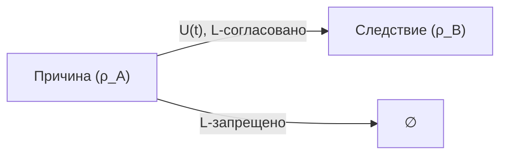
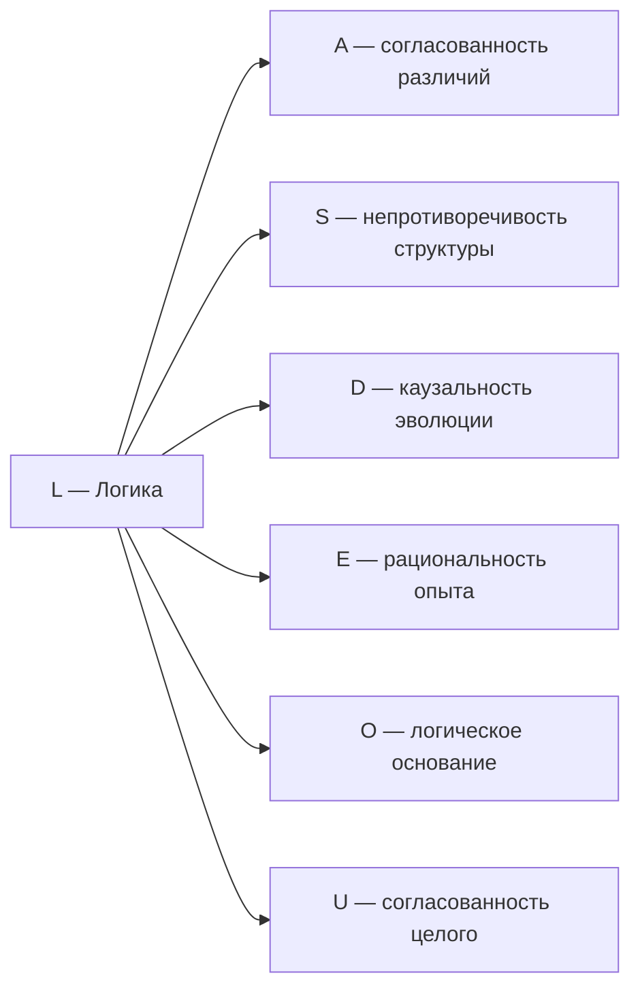

# Измерение IV: Логика (L)

## Функция

**Связывать, согласовывать, проверять непротиворечивость.**

## Описание

Логика — это измерение **самосогласованности**. Она определяет, какие конфигурации $\Gamma$ возможны, а какие противоречивы. Логика — фильтр реальности: состояния с $\gamma_{LL} \to 0$ не могут существовать устойчиво.

:::info Онтологический статус
Логика — **аспект** конфигурации $\Gamma$, не отдельная сущность. "Голоном логичен" означает: в матрице когерентности $\Gamma$ активна проекция на базисный вектор $|L\rangle$, и алгебра операторов удовлетворяет соотношениям коммутации.
:::

:::warning Связь с автопоэзисом
При удалении измерения $L$ нарушается **(AP)** — нет логического замыкания, нет самосогласованности. Без $L$ противоречивые конфигурации $\Gamma$ не отсеиваются, и система может эволюционировать в логически невозможные состояния. См. [доказательство](../../proofs/theorem-minimality-7#случай-n--3-удаление-логики-l).
:::

**Логика обеспечивает замыкание по Розену:** В (M,R)-системе Розена $\beta$-замыкание требует, чтобы причины были согласованы со следствиями. Измерение $L$ реализует эту функцию — без него каузальный цикл разрывается.

## Математическое представление

### Алгебра операторов

Логические отношения между измерениями описываются **коммутатором**:

$$
[A, B] := AB - BA
$$

Коммутатор — это мера некоммутативности операторов:
- $[A, B] = 0$ — порядок операций не важен (совместимость)
- $[A, B] \neq 0$ — порядок важен (некоммутативность)

### Связь с базисным состоянием

Проекция на $|L\rangle$ определяет **степень логической связности** конфигурации:

$$
\gamma_{LL} = \langle L|\Gamma|L\rangle
$$

Физическая интерпретация: $\gamma_{LL}$ — мера того, насколько система согласована внутренне.

### Логическая согласованность как инвариант

Для жизнеспособной системы требуется:

$$
\sigma_L := \frac{I_{\text{verify}}}{\theta_L} < 1
$$

где:
- $I_{\text{verify}}$ — информационная нагрузка на верификацию
- $\theta_L$ — пропускная способность логического измерения

При $\sigma_L \geq 1$ система теряет способность поддерживать непротиворечивость.

## Типы логических отношений

| Отношение | Условие | Интерпретация | Следствие |
|-----------|---------|---------------|-----------|
| Совместимость | $[A, B] = 0$ | Одновременная измеримость | Определённые совместные значения |
| Несовместимость | $[A, B] \neq 0$ | Принцип неопределённости | $\Delta A \cdot \Delta B \geq \frac{1}{2}\lvert\langle[A,B]\rangle\rvert$ |
| Следование | $P_A \leq P_B$ | $A$ имплицирует $B$ | $\langle A \rangle \leq \langle B \rangle$ |
| Противоречие | $P_A \cdot P_B = 0$ | Несовместимые подпространства | Взаимоисключение |

где $P_A$, $P_B$ — проекторы на соответствующие подпространства.

## Логические ограничения на $\Gamma$

Измерение $L$ обеспечивает выполнение фундаментальных ограничений на матрицу когерентности:

### Эрмитовость

$$
\Gamma^\dagger = \Gamma
$$

Математически: все собственные значения вещественны. Интерпретация: вероятности — вещественные числа.

### Положительность

$$
\langle\psi|\Gamma|\psi\rangle \geq 0 \quad \forall |\psi\rangle \in \mathcal{H}
$$

Математически: все собственные значения неотрицательны. Интерпретация: вероятности не могут быть отрицательными.

### Нормировка

$$
\mathrm{Tr}(\Gamma) = 1
$$

Математически: сумма собственных значений равна 1. Интерпретация: полная вероятность — единица.

### Неравенство Коши-Шварца

$$
|\gamma_{ij}|^2 \leq \gamma_{ii} \cdot \gamma_{jj}
$$

Ограничивает величину когерентностей относительно диагональных элементов.

## Примеры

| Уровень | Пример | Логическая функция |
|---------|--------|-------------------|
| Физический | Принцип неопределённости | $[x, p] = i\hbar$ |
| Физический | Законы сохранения | $[A, H] = 0 \Rightarrow dA/dt = 0$ |
| Физический | Запрет Паули | Антисимметрия фермионов |
| Биологический | Генетический код | Однозначность трансляции |
| Биологический | Метаболические циклы | Замкнутость биохимических путей |
| Когнитивный | Правила вывода | Modus ponens, modus tollens |
| Когнитивный | Рациональность | Транзитивность предпочтений |

## Связь с каузальностью

Логика определяет причинно-следственные связи через структуру динамики:

$$
\text{Cause}(A \to B) \Leftrightarrow \exists\, U(t): U(t)\rho_A U^\dagger(t) \cap \text{supp}(\rho_B) \neq \emptyset
$$

где:
- $\rho_A$, $\rho_B$ — состояния, соответствующие событиям $A$ и $B$
- $U(t)$ — унитарный оператор эволюции
- $\text{supp}(\rho)$ — носитель матрицы плотности

## Связь с другими измерениями

**Ключевая связь L ↔ D:** Логика и динамика взаимосвязаны:
- $D$ определяет *как* система эволюционирует
- $L$ определяет *какие* траектории допустимы

## Когерентность с L

Элементы $\gamma_{Li}$ матрицы когерентности описывают связь логики с другими измерениями:

| Когерентность | Интерпретация |
|---------------|---------------|
| $\gamma_{LA}$ | Логичность различений (непротиворечивость категорий) |
| $\gamma_{LS}$ | Законы структуры (аксиомы системы) |
| $\gamma_{LD}$ | Каузальность (причинно-следственная связь) |
| $\gamma_{LE}$ | Рациональность опыта (логичность переживаний) |
| $\gamma_{LO}$ | Фундаментальность логики (укоренённость в основании) |
| $\gamma_{LU}$ | Согласованность целого (глобальная непротиворечивость) |

## Неполнота и непротиворечивость

### Применимость теорем Гёделя

Теоремы Гёделя применяются к **формальным системам**, оперирующим в измерении $L$. Но $\Gamma$ имеет 7 измерений, и $L \subsetneq \Gamma$.

:::warning О границах применимости
Теоремы Гёделя доказаны для формальных систем, удовлетворяющих определённым условиям (формальность, выразительность, непротиворечивость). Применение их к $\Gamma$ в целом — категориальная ошибка, поскольку $\Gamma$ не является формальной системой.
:::

### Два типа истины

| Тип | Определение | Область |
|-----|-------------|---------|
| **Логическая доказуемость** | $p \in \text{Prov}(L)$ — $p$ выводимо из аксиом | Измерение $L$ |
| **Когерентность-истина** | $\langle p \vert \Gamma \vert p \rangle > 0$ — $p$ согласовано с $\Gamma$ | Все 7 измерений |

Формально:

$$
\text{Prov}(L) \subsetneq \text{Coh}(\Gamma)
$$

где:
- $\text{Prov}(L)$ — множество утверждений, доказуемых в формальной системе, ассоциированной с $L$
- $\text{Coh}(\Gamma)$ — множество состояний, когерентных с полной матрицей $\Gamma$

### Непротиворечивость через автопоэзис

Вторая теорема Гёделя запрещает *логическое* доказательство непротиворечивости. УГМ демонстрирует непротиворечивость **экзистенциально**:

Существование жизнеспособного Голонома $\mathbb{H}$ с $P(\Gamma) > P_{\text{critical}}$ демонстрирует, что конфигурация $\Gamma$ непротиворечива — противоречивые конфигурации не могут поддерживать когерентность выше критического порога.

:::tip Принцип
**Consistency is enacted, not proven** — непротиворечивость **исполняется** существованием функционирующей системы, а не доказывается логически.
:::

### Неполнота как ресурс

Гёделева неполнота в $L$ — не ограничение, а **механизм эволюции**:

1. Неразрешимые проблемы создают "сингулярности" в логическом пространстве
2. Система обращается к [Основанию (O)](./dimension-o) за новой информацией
3. Расширение аксиоматики восстанавливает когерентность на новом уровне

См. [Теоремы Гёделя и полнота УГМ](../foundations/consequences#8-теоремы-гёделя-и-полнота-угм) для полного анализа.

---

**Связанные документы:**
- [Динамика (D)](./dimension-d) — предыдущее измерение
- [Опыт (E)](./dimension-e) — следующее измерение
- [Теорема о минимальности](../../proofs/theorem-minimality-7#случай-n--3-удаление-логики-l) — доказательство необходимости L
