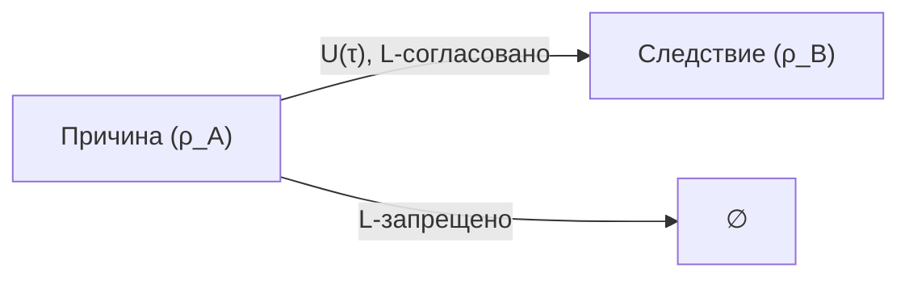
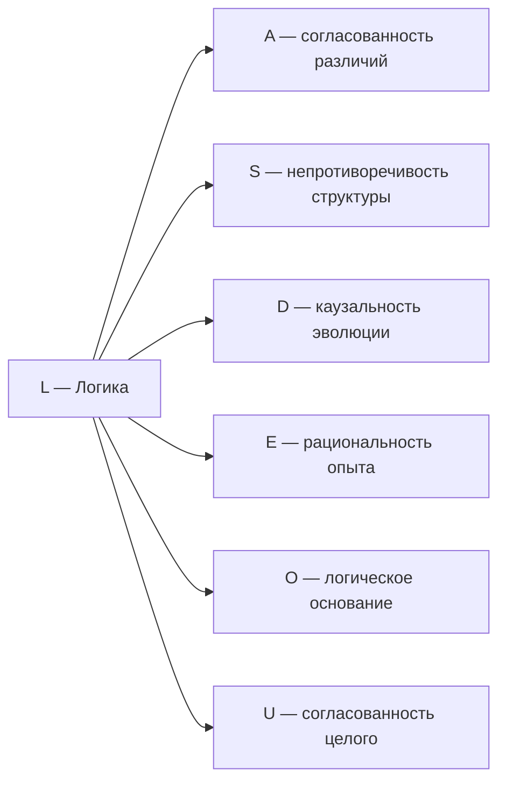

# Измерение IV: Логика (L)

## Функция

**Связывать, согласовывать, проверять непротиворечивость.**

## Описание

Логика — это измерение **самосогласованности**. Она определяет, какие конфигурации $\Gamma$ возможны, а какие противоречивы. Логика — фильтр реальности: состояния с $\gamma_{LL} \to 0$ не могут существовать устойчиво.

:::info Онтологический статус
Логика — **аспект** конфигурации $\Gamma$, не отдельная сущность. "Голоном логичен" означает: в матрице когерентности $\Gamma$ активна проекция на базисный вектор $|L\rangle$, и алгебра операторов удовлетворяет соотношениям коммутации.
:::

## Категориальное определение (L-унификация) {#категориальное-определение}

:::warning Ключевая теорема
Измерение L **тождественно** проекции классификатора подобъектов Ω на состояние Γ:

$$
L = \Omega \cap \Gamma
$$

Из этой идентификации **выводятся** операторы Линдблада $L_k$.
:::

### L как проекция классификатора

В ∞-топосе $\mathbf{Sh}_\infty(\mathcal{C})$ (построенном на [топологии Гротендика](/docs/core/foundations/axiom-omega#топология-гротендика)) существует [классификатор подобъектов](/docs/core/foundations/axiom-omega#внутренняя-логика) Ω, определяющий **внутреннюю логику** теории.

**Определение (L-измерение категориально):**

$$
L := \{\chi \in \Omega : \chi(\Gamma) = \text{true}\}
$$

— множество логических предикатов, истинных для данного состояния Γ.

:::tip Формализация L-измерения [Т]
L-измерение — **внутренняя логика** ∞-топоса через подобъектный классификатор Ω. Формально:

$$
L(\Gamma) := \{p \in \Omega : p(\Gamma) = \top\}
$$

— множество предикатов, истинных на $\Gamma$. Логическая структура имеет **три уровня** [Т]:

| Уровень | Логика | Структура | Роль |
|---------|--------|-----------|------|
| ∞-категорный | **HoTT** (гомотопическая теория типов) | Полный $\Omega \in \mathbf{Sh}_\infty(\mathcal{C})$ | [Иерархия интериорности](/docs/consciousness/hierarchy/interiority-hierarchy) (n-усечения) |
| 1-категорный | **Гейтинговая алгебра** (интуиционистская) | $\tau_{\leq 0}(\Omega)$ — 0-усечение | Стандартная теория топосов |
| Решающий (decidable) | **Булева** (классическая) | $\mathrm{Dec}(\Omega) \cong 2^7$ | [L-унификация](/docs/core/foundations/axiom-omega#lk-из-omega): вывод $L_k$ |

Полная внутренняя логика ∞-топоса $\mathbf{Sh}_\infty(\mathcal{C})$ — HoTT, с темпоральной модальностью $\triangleright$ ([эмерджентное время](../../proofs/dynamics/emergent-time#время-в-hott)). Её 0-усечение $\tau_{\leq 0}(\Omega)$ — Гейтинговая алгебра (стандартный результат теории топосов). **Решающий фрагмент** $\mathrm{Dec}(\Omega)$ — булева подалгебра, порождённая 7 ортогональными проекторами $S_k = |k\rangle\langle k|$. L-унификация использует именно этот решающий фрагмент.
:::

### Вывод операторов Линдблада L_k

**Теорема (L_k из Ω):**

Операторы диссипации в [уравнении эволюции](/docs/core/dynamics/evolution) определяются [базисными предикатами](/docs/core/foundations/axiom-omega#атомы-классификатора) классификатора:

$$
L_k := \sqrt{\chi_{S_k}}
$$

где $S_k$ — k-й канонический базисный предикат классификатора Ω.

**Следствие (TP автоматически):**

$$
\sum_k L_k^\dagger L_k = \sum_k \chi_{S_k} = \mathbb{1}
$$

:::info CPTP из представления Краусса (Sol.58) [Т]
[Фано-операторы](/docs/core/operators/lindblad-operators) $L_p^{\mathrm{Fano}} = \frac{1}{\sqrt{3}}\Pi_p$ определяют CPTP-канал в представлении Краусса. По [теореме Хои](https://en.wikipedia.org/wiki/Choi%27s_theorem_on_completely_positive_maps) (1975): канал в форме Краусса $\Phi(\rho) = \sum_k A_k \rho A_k^\dagger$ **вполне положителен** автоматически. Сохранение следа: $\sum_p L_p^\dagger L_p = \frac{1}{3}\sum_p \Pi_p = \frac{1}{3} \cdot 3\mathbb{I}_7 = \mathbb{I}_7$ ✓ (каждое измерение принадлежит ровно 3 Фано-линиям, T-41b [Т]). Полная положительность **не зависит** от стратификации.
:::

### Иерархия L_k по стратам {#иерархия-lk}

| Страта | Тип системы | Классификатор | L_k оператор | Интерпретация |
|--------|-------------|---------------|--------------|---------------|
| I | Материя | $\Omega_{sym}$ — инварианты группы | $P_{Casimir}$ | Симметрия |
| II | Жизнь | $\Omega_{viable}$ — P > [P_crit](/docs/proofs/dynamics/theorem-purity-critical) | $\sum_j R_j P_j$ | QECC |
| III | Разум | $\Omega_{pred}$ — min F | $\nabla_\Gamma F$ | Байес |
| IV | Сознание | $\Omega_{coh}$ — H¹ = 0 | $\check{\delta}$ | Склейка |

**Важно:** L_k **не произвольны** — они определяются стратой, на которой существует система.

### Связь L и времени

Темпоральная модальность ▷ на Ω порождает [дискретное время](/docs/proofs/dynamics/emergent-time):

$$
\tau_n := \triangleright^n(\text{now})
$$

Эволюция предикатов χ ∈ L под действием ▷ **есть** динамика системы.

:::warning Связь с автопоэзисом
При удалении измерения $L$ нарушается **(AP)** — нет логического замыкания, нет самосогласованности. Без $L$ противоречивые конфигурации $\Gamma$ не отсеиваются, и система может эволюционировать в логически невозможные состояния. См. [доказательство](../../proofs/minimality/theorem-minimality-7#случай-n--3-удаление-логики-l).
:::

**Логика обеспечивает замыкание по Розену:** В (M,R)-системе Розена $\beta$-замыкание требует, чтобы причины были согласованы со следствиями. Измерение $L$ реализует эту функцию — без него каузальный цикл разрывается.

## Математическое представление

### Алгебра операторов

Логические отношения между измерениями описываются **коммутатором**:

$$
[A, B] := AB - BA
$$

Коммутатор — это мера некоммутативности операторов:
- $[A, B] = 0$ — порядок операций не важен (совместимость)
- $[A, B] \neq 0$ — порядок важен (некоммутативность)

### Связь с базисным состоянием

Проекция на $|L\rangle$ определяет **степень логической связности** конфигурации:

$$
\gamma_{LL} = \langle L|\Gamma|L\rangle
$$

Физическая интерпретация: $\gamma_{LL}$ — мера того, насколько система согласована внутренне.

### Логическая согласованность как инвариант {#логическая-согласованность}

:::info Статус: [О] Определения; 7D-формула σ_L — [С]
Определения $I_{\text{verify}}$, $\theta_L$ и $\sigma_L$ заданы через классификатор подобъектов Ω и энтропию фон Неймана. Приближённая формула $\sigma_L$ для 7D — условная [С] (зависит от допущения $\gamma_{LL} \ll 1$).
:::

Для жизнеспособной системы требуется, чтобы нагрузка на логическую верификацию не превышала пропускную способность:

$$
\sigma_L := \frac{I_{\text{verify}}}{\theta_L} < 1
$$

#### Определение I_verify (информация верификации) {#определение-i-verify}

**Определение (I_verify через взаимную информацию):**

$$
I_{\text{verify}}(\Gamma) := S_{vN}(\rho) - S_{vN}(\rho | L) = I(\Gamma : L)
$$

где:
- $S_{vN}(\rho) = -\mathrm{Tr}(\rho \log \rho)$ — энтропия фон Неймана
- $I(\Gamma : L)$ — квантовая взаимная информация между состоянием Γ и L-измерением
- $\rho | L$ — условное состояние при известном значении L-проекции

**Интерпретация:** $I_{\text{verify}}$ — количество информации, извлекаемое из Γ при логической проверке через L-измерение.

#### Определение θ_L (пропускная способность) {#определение-theta-l}

**Определение (θ_L через максимальную энтропию):**

$$
\theta_L(\Gamma) := \gamma_{LL} \cdot \log(N)
$$

где:
- $\gamma_{LL}$ — населённость L-измерения (диагональный элемент матрицы когерентности)
- $\log(N) = \log(7)$ — максимальная энтропия $N$-мерной системы

**Интерпретация:** $\theta_L$ — пропускная способность L-измерения, определяемая как произведение населённости на максимально возможную энтропию.

#### Определение σ_L [С] {#строгое-определение-sigma-l}

**Определение (σ_L через редуцированную матрицу):**

$$
\sigma_L(\Gamma) := \frac{S_{vN}(\rho_L)}{\gamma_{LL} \cdot \log(N)}
$$

где $\rho_L = \mathrm{Tr}_{-L}(\Gamma)$ — редуцированная матрица плотности L-измерения в расширенном формализме.

**Для минимального 7D-формализма** (одноуровневая матрица $7 \times 7$):

$$
\sigma_L(\Gamma) \approx \frac{7(1 - \gamma_{LL})}{6}
$$

:::warning Статус: [С] Условная формула
Приближённая формула для 7D получена при допущении $\gamma_{LL} \ll 1$ и равномерного распределения остальных населённостей. Приближение **не является строгим выводом**: переход $\rho_L \approx \gamma_{LL}$ (скаляр) корректен только в расширенном формализме, а в 7D (7 — простое число) частичный след $\mathrm{Tr}_{-L}$ не определён из-за отсутствия тензорной факторизации.
:::

**Приближённый вывод формулы для 7D:**

В минимальном формализме $\rho_L \approx \gamma_{LL}$ (скаляр), поэтому:

$$
S_{vN}(\rho_L) \approx -\gamma_{LL} \log(\gamma_{LL}) - (1-\gamma_{LL})\log\left(\frac{1-\gamma_{LL}}{6}\right)
$$

При $\gamma_{LL} \ll 1$:

$$
\sigma_L \approx \frac{1 - \gamma_{LL}}{\gamma_{LL}} \cdot \frac{1}{\log 7} \approx \frac{7(1-\gamma_{LL})}{6}
$$

**Определения компонентов (сводка):**

| Параметр | Определение | Статус |
|----------|-------------|--------|
| $I_{\text{verify}}$ | $I(\Gamma : L) = S_{vN}(\rho) - S_{vN}(\rho \| L)$ — взаимная информация | [О] Определение |
| $\theta_L$ | $\gamma_{LL} \cdot \log(N)$ — пропускная способность | [О] Определение |
| $\gamma_{LL}$ | Населённость измерения L | [О] Определение |
| $\sigma_L$ | $S_{vN}(\rho_L) / (\gamma_{LL} \cdot \log N)$ — логическая нагрузка | [О] Определение; 7D-формула [С] |

**Интерпретация:** $\sigma_L \in [0, \infty)$ — мера **логической нагруженности** системы:
- $\sigma_L < 1$: логическая верификация успевает за динамикой
- $\sigma_L \geq 1$: узкое место — система теряет согласованность

**Связь с условием жизнеспособности:**

При $\sigma_L \to 1$ система приближается к границе логической когерентности. Это соответствует ситуации, когда L-измерение перегружено — проверка непротиворечивости становится узким местом.

:::note Связь с ПИР
Условие $\sigma_L < 1$ — следствие [Принципа Информационной Различимости](/docs/core/foundations/axiom-omega#примитив): система должна быть способна различать согласованные и несогласованные конфигурации.
:::

## Типы логических отношений

| Отношение | Условие | Интерпретация | Следствие |
|-----------|---------|---------------|-----------|
| Совместимость | $[A, B] = 0$ | Одновременная измеримость | Определённые совместные значения |
| Несовместимость | $[A, B] \neq 0$ | Принцип неопределённости | $\Delta A \cdot \Delta B \geq \frac{1}{2}\lvert\langle[A,B]\rangle\rvert$ |
| Следование | $P_A \leq P_B$ | $A$ имплицирует $B$ | $\langle A \rangle \leq \langle B \rangle$ |
| Противоречие | $P_A \cdot P_B = 0$ | Несовместимые подпространства | Взаимоисключение |

где $P_A$, $P_B$ — проекторы на соответствующие подпространства.

## Логические ограничения на $\Gamma$

Измерение $L$ обеспечивает выполнение фундаментальных ограничений на матрицу когерентности:

### Эрмитовость

$$
\Gamma^\dagger = \Gamma
$$

Математически: все собственные значения вещественны. Интерпретация: вероятности — вещественные числа.

### Положительность

$$
\langle\psi|\Gamma|\psi\rangle \geq 0 \quad \forall |\psi\rangle \in \mathcal{H}
$$

Математически: все собственные значения неотрицательны. Интерпретация: вероятности не могут быть отрицательными.

### Нормировка

$$
\mathrm{Tr}(\Gamma) = 1
$$

Математически: сумма собственных значений равна 1. Интерпретация: полная вероятность — единица.

### Неравенство Коши-Шварца

$$
|\gamma_{ij}|^2 \leq \gamma_{ii} \cdot \gamma_{jj}
$$

Ограничивает величину когерентностей относительно диагональных элементов.

## Примеры

| Уровень | Пример | Логическая функция |
|---------|--------|-------------------|
| Физический | Принцип неопределённости | $[x, p] = i\hbar$ |
| Физический | Законы сохранения | $[A, H] = 0 \Rightarrow dA/d\tau = 0$ |
| Физический | Запрет Паули | Антисимметрия фермионов |
| Биологический | Генетический код | Однозначность трансляции |
| Биологический | Метаболические циклы | Замкнутость биохимических путей |
| Когнитивный | Правила вывода | Modus ponens, modus tollens |
| Когнитивный | Рациональность | Транзитивность предпочтений |

## Связь с каузальностью

Логика определяет причинно-следственные связи через структуру динамики:

$$
\text{Cause}(A \to B) \Leftrightarrow \exists\, U(\tau): \text{supp}\!\left(U(\tau)\rho_A U^\dagger(\tau)\right) \cap \text{supp}(\rho_B) \neq \emptyset
$$

где:
- $\rho_A$, $\rho_B$ — состояния, соответствующие событиям $A$ и $B$
- $U(\tau)$ — унитарный оператор эволюции во [внутреннем времени](../../proofs/dynamics/emergent-time)
- $\text{supp}(\rho)$ — носитель (support) матрицы плотности — подпространство, на которое $\rho$ проецирует ненулевой вес

## Связь с другими измерениями

**Ключевая связь L ↔ D:** Логика и динамика взаимосвязаны:
- $D$ определяет *как* система эволюционирует
- $L$ определяет *какие* траектории допустимы

## Когерентность с L

Элементы $\gamma_{Li}$ матрицы когерентности описывают связь логики с другими измерениями:

| Когерентность | Интерпретация |
|---------------|---------------|
| $\gamma_{LA}$ | Логичность различений (непротиворечивость категорий) |
| $\gamma_{LS}$ | Законы структуры (аксиомы системы) |
| $\gamma_{LD}$ | Каузальность (причинно-следственная связь) |
| $\gamma_{LE}$ | Рациональность опыта (логичность интериорных состояний) |
| $\gamma_{LO}$ | Фундаментальность логики (укоренённость в основании) |
| $\gamma_{LU}$ | Согласованность целого (глобальная непротиворечивость) |

## Неполнота и непротиворечивость

### Применимость теорем Гёделя

Теоремы Гёделя применяются к **формальным системам**, оперирующим в измерении $L$. Но $\Gamma$ имеет 7 измерений, и $L \subsetneq \Gamma$.

:::warning О границах применимости
Теоремы Гёделя доказаны для формальных систем, удовлетворяющих определённым условиям (формальность, выразительность, непротиворечивость). Применение их к $\Gamma$ в целом — категориальная ошибка, поскольку $\Gamma$ не является формальной системой.
:::

### Два типа истины

| Тип | Определение | Область |
|-----|-------------|---------|
| **Логическая доказуемость** | $p \in \text{Prov}(L)$ — $p$ выводимо из аксиом | Измерение $L$ |
| **Когерентность-истина** | $\langle p \vert \Gamma \vert p \rangle > 0$ — $p$ согласовано с $\Gamma$ | Все 7 измерений |

Формально:

$$
\text{Prov}(L) \subsetneq \text{Coh}(\Gamma)
$$

где:
- $\text{Prov}(L)$ — множество утверждений, доказуемых в формальной системе, ассоциированной с $L$
- $\text{Coh}(\Gamma)$ — множество состояний, когерентных с полной матрицей $\Gamma$

### Непротиворечивость через автопоэзис

Вторая теорема Гёделя запрещает *логическое* доказательство непротиворечивости. УГМ демонстрирует непротиворечивость **экзистенциально**:

Существование жизнеспособного Голонома $\mathbb{H}$ с $P(\Gamma) > P_{\text{crit}}$ демонстрирует, что конфигурация $\Gamma$ непротиворечива — противоречивые конфигурации не могут поддерживать когерентность выше критического порога.

:::tip Принцип
**Consistency is enacted, not proven** — непротиворечивость **исполняется** существованием функционирующей системы, а не доказывается логически.
:::

### Неполнота как ресурс

Гёделева неполнота в $L$ — не ограничение, а **механизм эволюции**:

1. Неразрешимые проблемы создают "сингулярности" в логическом пространстве
2. Система обращается к [Основанию (O)](./dimension-o) за новой информацией
3. Расширение аксиоматики восстанавливает когерентность на новом уровне

См. [Теоремы Гёделя и полнота УГМ](../foundations/consequences#10-теоремы-гёделя-и-полнота-угм) для полного анализа.

### Октонионный контекст {#октонионный-контекст}

:::note Октонионное соответствие [И]
Измерению соответствует $e_4 \in \mathrm{Im}(\mathbb{O})$. Детали, $G_2$-оговорка и Фано-триплеты: [Октонионная интерпретация](./dimensions#октонионная-интерпретация), [структурный вывод](../../proofs/minimality/theorem-octonionic-derivation).
:::

---

**Связанные документы:**
- [Динамика (D)](./dimension-d) — предыдущее измерение
- [Интериорность (E)](./dimension-e) — следующее измерение
- [Теорема о минимальности](../../proofs/minimality/theorem-minimality-7#случай-n--3-удаление-логики-l) — доказательство необходимости L
- [Эмерджентное время](../../proofs/dynamics/emergent-time) — τ из структуры Γ
- [Внутренняя логика Ω](../foundations/axiom-omega#внутренняя-логика) — категориальный источник L
- [Уравнение эволюции](../dynamics/evolution) — использование L_k операторов
- [Категорный формализм](../../proofs/categorical/categorical-formalism) — ∞-топос и классификатор
