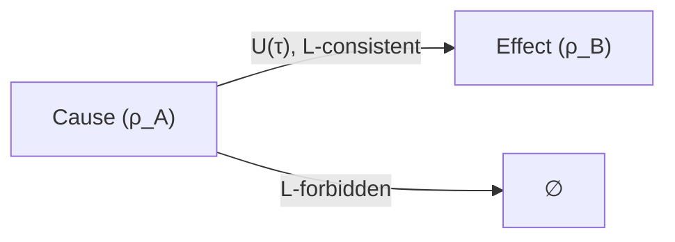
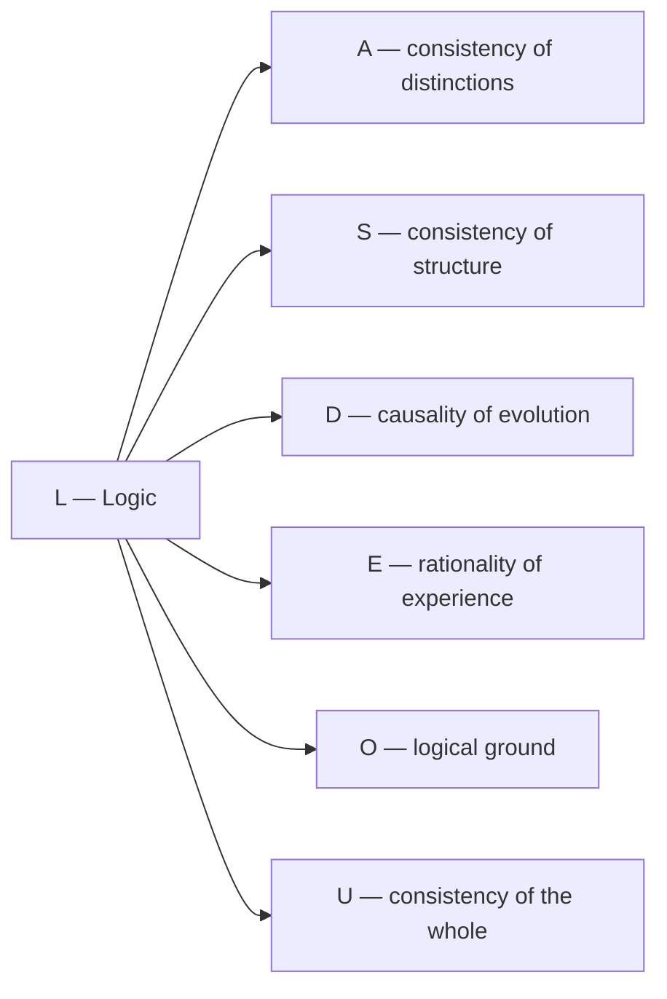

# Dimension IV: Logic (L)

:::info Who this chapter is for
Dimension L: coordination, commutators, logical closure. Assumes familiarity with the [seven dimensions](/docs/core/structure/dimensions) and the basics of categorical logic.
:::

## Why this chapter

We are accustomed to thinking of logic as something abstract — a set of rules for "correct thinking". At school one learns: if A then B; if B then C; therefore, if A then C. But in the Unitary Holonomic Monism (UHM) logic is something far more fundamental. It is an **aspect of reality itself**, determining which configurations are possible and which are contradictory and therefore cannot exist.

In this chapter you will learn:
- why logic in UHM is not a tool of human thinking but a **filter of reality**, sieving out the impossible;
- how three completely different meanings of the letter "L" (dimension, Lindblad operator, logical Liouvillian) turn out to be the same object;
- what three levels of logic exist — from the full (HoTT) to the classical (Boolean);
- why Gödel's incompleteness theorem is not a problem but a **resource** for evolution;
- how logic is connected with causal relations and the other dimensions of the Holon;
- on which Fano lines L lies and why its combinatorial profile is unique.

## Historical precursor

Logic as a science has one of the longest histories.

**Aristotle** (384–322 BC) created **formal logic** — a system of syllogisms enabling reliable conclusions to be drawn from premises. "All men are mortal; Socrates is a man; therefore Socrates is mortal." This was the first attempt to formalise **the rules of thinking**, separating them from content. Aristotelian logic is bivalent: every statement is either true or false. There is no third option.

**George Boole** (1815–1864) translated logic into the language of **algebra**. He showed that "AND", "OR", "NOT" obey the same formal laws as multiplication and addition. Boolean algebra is the foundation of digital computers: every transistor implements a Boolean operation. But Boolean logic remains bivalent.

**Luitzen Brouwer** (1881–1966) questioned the law of the excluded middle. He founded **intuitionism** — a movement asserting that a statement is true only when we can **construct** its proof. "Statement P is true or false" is not an axiom but something that must be proved for each particular P. There are statements that are neither true nor false — they are **undetermined**.

**Arend Heyting** (1898–1980), Brouwer's student, formalised intuitionism as **Heyting algebra** — a generalisation of Boolean algebra in which the law of the excluded middle ($P \lor \neg P = \top$) is not obligatory. It was precisely Heyting algebra that turned out to be the natural logic of **toposes** — categorical generalisations of spaces. Every topos has a subobject classifier $\Omega$, and its logical structure is a Heyting algebra.

**Homotopy Type Theory (HoTT)** is a modern (2013+) development unifying logic, type theory and homotopy theory. In HoTT a "proof" is not simply "yes/no" but an entire **space of proofs** that can have non-trivial topology. This is ∞-categorical logic, the most complete known. In UHM it is precisely HoTT that is the full internal logic of the ∞-topos $\mathbf{Sh}_\infty(\mathcal{C})$.

:::note The path of deepening
Aristotle → Boole → Brouwer → Heyting → HoTT — this is not simply "progress". Each step is a recognition that logic is **richer** than it seemed. Bivalent → many-valued → constructive → ∞-categorical. UHM uses this entire spectrum: Boolean logic for decisive dimensions, Heyting algebra for the standard topos, HoTT for the full ∞-structure.
:::

:::info Why the history of logic matters for understanding UHM
Note: each historical step **expanded** the space of logically admissible. Aristotle allowed only "yes/no". Brouwer added "undetermined". HoTT added an infinite hierarchy of "ways of being true". UHM claims that reality uses **all** these levels simultaneously: elementary particles "live" in Boolean logic (spin up or down), borderline states of consciousness — in Heyting logic (neither waking nor sleeping), and the full ∞-topos structure — in HoTT. The deeper the level of reality, the richer the logic.
:::

:::warning Notation conventions: three meanings of the letter L {#конвенции-l}
In UHM the letter **L** is used for three related but distinct objects:

| Notation | Font | Meaning |
|----------|------|---------|
| $L$ (upright, no index) | Roman | **Logic dimension** — component of $\Gamma$, population $\gamma_{LL}$ |
| $L_k$ (with index) | Italic | **Lindblad operators** — dissipative channels |
| $\mathcal{L}_\Omega$ (calligraphic) | Script | **Liouvillian** — full generator of evolution |

This is **not a notational coincidence**, but a manifestation of L-unification [Т]: the subobject classifier $\Omega$ generates the logical structure (the L-dimension), from whose atoms the operators $L_k$ are derived, forming the generator $\mathcal{L}_\Omega$:

$$\Omega \xrightarrow{\text{logic}} L \xrightarrow{\text{atoms}} L_k \xrightarrow{\text{generator}} \mathcal{L}_\Omega$$

More details: [L-unification](/docs/core/operators/lindblad-operators#примитивность-ℒω).
:::

## Intuitive explanation

### L-unification: three meanings of one letter

In UHM the letter "L" appears in three seemingly completely different contexts:

1. **L-dimension** — the fourth column/row of the coherence matrix $\Gamma$, describing the logical consistency of the system
2. **$L_k$ (Lindblad operators)** — dissipation operators in the evolution equation, determining how the system loses coherence when interacting with the environment
3. **$\mathcal{L}$ (logical Liouvillian)** — the generator of evolution in the space of density operators

At first glance this looks like a notational coincidence. But UHM proves that all three are **manifestations of one object**: the subobject classifier $\Omega$ of the ∞-topos.

:::info Analogy: three meanings of the word "key"
Imagine the word "key". It can mean:
1. **A door key** — a tool for opening a lock
2. **A musical clef** — a symbol on a staff
3. **A spring** — an underground water source

These are homonyms — words that happen to sound the same. But imagine someone proved: a door key, a musical clef, and a spring are **the same object**, merely observed from different sides. This is precisely what L-unification does: the three "meanings" of the letter L turn out to be the same mathematical object — the projection of $\Omega$ onto $\Gamma$.
:::

### How L-unification works: from abstract to concrete {#как-работает-l-унификация}

To understand L-unification intuitively, imagine a **water filter**. The filter is one object, but it performs three functions simultaneously:

1. **Determines what is admissible** (which molecules pass through) — this is the L-dimension: it determines which configurations $\Gamma$ are consistent.
2. **Sets the flow rate** (membrane throughput) — this is the Liouvillian $\mathcal{L}$: it determines how quickly the system evolves.
3. **Creates waste** (retained impurities) — these are the Lindblad operators $L_k$: they determine what information is *lost* in filtration.

The filter is one, but it can be described in three ways. The subobject classifier $\Omega$ is the "filter of reality", and its three "descriptions" are the three meanings of the letter L.

## Function

**To connect, to coordinate, to verify consistency.**

## Description

Logic is the dimension of **self-consistency**. It determines which configurations $\Gamma$ are possible and which are contradictory. Logic is the filter of reality: states with $\gamma_{LL} \to 0$ cannot exist stably.

:::info Ontological status
Logic is an **aspect** of the configuration $\Gamma$, not a separate entity. "The Holon is logical" means: in the coherence matrix $\Gamma$ the projection onto the basis vector $|L\rangle$ is active, and the algebra of operators satisfies the commutation relations.
:::

:::info Clarification: L as aspect, not filter
The L-dimension **is not a filter** acting on Γ from outside. L is an **aspect** of Γ itself, reflecting the degree of internal consistency:

- **Population $\gamma_{LL}$** — the fraction of the system's "resource" directed toward maintaining logical coherence
- **High $\gamma_{LL} \gg 1/7$:** the system strictly applies internal rules (dogmatism, rigidity)
- **Low $\gamma_{LL} \ll 1/7$:** the system weakly applies rules (creativity, but potential incoherence)
- **$\gamma_{LL} = 1/7$:** equilibrium — the logical function receives its "fair share" of resource

Stress of the L-dimension: $\sigma_L = \mathrm{clamp}(1 - 7\gamma_{LL}, 0, 1)$ — [formula T-92 [Т]](/docs/core/structure/dimension-a#вывод-формулы-напряжения).
:::

## Categorical definition (L-unification) {#категориальное-определение}

:::warning Key theorem
Dimension L is **identical** to the projection of the subobject classifier Ω onto the state Γ:

$$
L = \Omega \cap \Gamma
$$

From this identification the Lindblad operators $L_k$ are **derived**.
:::

### L as a projection of the classifier

In the ∞-topos $\mathbf{Sh}_\infty(\mathcal{C})$ (built on the [Grothendieck topology](/docs/core/foundations/axiom-omega#топология-гротендика)) there exists a [subobject classifier](/docs/core/foundations/axiom-omega#внутренняя-логика) Ω, which determines the **internal logic** of the theory.

**Definition (L-dimension categorically):**

$$
L := \{\chi \in \Omega : \chi(\Gamma) = \text{true}\}
$$

— the set of logical predicates that are true for the given state Γ.

:::tip Formalisation of the L-dimension [Т]
The L-dimension is the **internal logic** of the ∞-topos via the subobject classifier Ω. Formally:

$$
L(\Gamma) := \{p \in \Omega : p(\Gamma) = \top\}
$$

— the set of predicates true on $\Gamma$. The logical structure has **three levels** [Т]:

| Level | Logic | Structure | Role |
|-------|-------|-----------|------|
| ∞-categorical | **HoTT** (homotopy type theory) | Full $\Omega \in \mathbf{Sh}_\infty(\mathcal{C})$ | [Interiority hierarchy](/docs/consciousness/hierarchy/interiority-hierarchy) (n-truncations) |
| 1-categorical | **Heyting algebra** (intuitionistic) | $\tau_{\leq 0}(\Omega)$ — 0-truncation | Standard topos theory |
| Decidable | **Boolean** (classical) | $\mathrm{Dec}(\Omega) \cong 2^7$ | [L-unification](/docs/core/foundations/axiom-omega#lk-из-omega): derivation of $L_k$ |

The full internal logic of the ∞-topos $\mathbf{Sh}_\infty(\mathcal{C})$ is HoTT, with temporal modality $\triangleright$ ([emergent time](../../proofs/dynamics/emergent-time#время-в-hott)). Its 0-truncation $\tau_{\leq 0}(\Omega)$ is Heyting algebra (standard result of topos theory). The **decidable fragment** $\mathrm{Dec}(\Omega)$ is a Boolean subalgebra generated by 7 orthogonal projectors $S_k = |k\rangle\langle k|$. L-unification uses precisely this decidable fragment.
:::

### Three levels of logic: in detail {#три-уровня-логики}

The three levels of logic are not an arbitrary classification, but a **mathematical consequence** of the structure of the ∞-topos. Each level "sees" reality with a certain depth.

#### Level 1: Boolean logic (decidable fragment)

This is the logic familiar to everyone: every statement is either **true** or **false**. In UHM Boolean logic arises in the **decidable fragment** $\mathrm{Dec}(\Omega)$, generated by 7 orthogonal projectors $S_k = |k\rangle\langle k|$.

**Example.** "Is the population $\gamma_{LL}$ above the threshold 0.1?" — a Boolean predicate. Answer: yes or no. There are $2^7 = 128$ Boolean predicates (all yes/no combinations for 7 projectors).

**Role in UHM:** from this level the Lindblad operators $L_k$ are derived. It is Boolean logic that determines the **dissipation channels** — through which "gaps" exactly the system loses coherence.

:::info Analogy: Boolean logic as a black-and-white photo
Boolean logic is like a black-and-white photograph: every pixel is either black or white. Coarse, but useful for many tasks. It is precisely in "black-and-white" mode that reality determines *through which channels* decoherence flows. This coarseness is not a flaw but a feature: the Boolean level is sufficient for deriving concrete physical operators.
:::

#### Level 2: Heyting algebra (intuitionistic logic)

This is a logic in which a statement can be **true**, **false**, or **undetermined**. The law of the excluded middle ($P \lor \neg P = \top$) is **not** an axiom — it must be proved for each particular case.

**Example.** "Is the system conscious?" In Boolean logic the answer is: yes or no. In Heyting logic — it may be **undetermined**: if $P$ is close to $P_{\text{crit}} = 2/7$, the system is in a "borderline" state that cannot be unambiguously classified. This is not the observer's ignorance, but **objective indeterminacy**.

**Role in UHM:** describes the standard topos theory in which most of the mathematical constructions of UHM operate. The 0-truncation $\tau_{\leq 0}(\Omega)$ gives Heyting algebra.

:::info Analogy: Heyting logic as a greyscale photo
If Boolean logic is a black-and-white photo, Heyting logic is a photograph in shades of grey. Intermediate tones, nuances, half-tones appear. "Is this pixel black?" — may not have a definite answer if it is grey. Borderline states of consciousness, transitional phases, "twilight zones" between waking and sleep — all of this lives in Heyting logic.
:::

#### Level 3: HoTT (full ∞-categorical logic)

The deepest level. In HoTT "truth" is not a point but an entire **space of proofs**. Two proofs of the same statement can be **non-equivalent**, and between them there can be non-trivial paths (homotopies), between the paths — paths of paths, and so on to infinity.

**Example.** "In what way is dimension A connected with dimension E?" At the Boolean level — simply: connected ($\gamma_{AE} \neq 0$) or not ($\gamma_{AE} = 0$). At the HoTT level — each particular path of connection (through different Fano lines, through different chains of intermediate coherences) is a **separate element** of the proof space. The topology of this space carries information about the [interiority hierarchy](/docs/consciousness/hierarchy/interiority-hierarchy).

**Role in UHM:** the full logic of the ∞-topos, including the temporal modality $\triangleright$ (time) and n-truncations (levels of reflection). HoTT is the "native language" of UHM at the deepest level.

:::info Analogy: HoTT as a full-colour photo with depth
HoTT is a full-colour three-dimensional photograph with infinite resolution. Each "pixel" is not just a colour, but an entire space of shades with its own topology. At this level the statement "A is connected with E" contains **all** the information about *exactly how*, *through what*, *by how many paths*, and *how deeply* they are connected. It is precisely HoTT that is needed to describe the **full** interiority hierarchy: the levels of self-awareness (SAD-depth, [depth tower](/docs/consciousness/hierarchy/interiority-hierarchy)) are n-truncations of the proof space.
:::

### Derivation of the Lindblad operators L_k

**Theorem (L_k from Ω):**

The dissipation operators in the [evolution equation](/docs/core/dynamics/evolution) are determined by the [basis predicates](/docs/core/foundations/axiom-omega#атомы-классификатора) of the classifier:

$$
L_k := \sqrt{\chi_{S_k}}
$$

where $S_k$ is the k-th canonical basis predicate of the classifier Ω.

**Corollary (TP automatically):**

$$
\sum_k L_k^\dagger L_k = \sum_k \chi_{S_k} = \mathbb{1}
$$

:::info CPTP from Kraus representation [Т]
[Fano operators](/docs/core/operators/lindblad-operators) $L_p^{\mathrm{Fano}} = \frac{1}{\sqrt{3}}\Pi_p$ define a CPTP channel in the Kraus representation. By [Choi's theorem](https://en.wikipedia.org/wiki/Choi%27s_theorem_on_completely_positive_maps) (1975): a channel in Kraus form $\Phi(\rho) = \sum_k A_k \rho A_k^\dagger$ is **completely positive** automatically. Trace preservation: $\sum_p L_p^\dagger L_p = \frac{1}{3}\sum_p \Pi_p = \frac{1}{3} \cdot 3\mathbb{I}_7 = \mathbb{I}_7$ ✓ (each dimension belongs to exactly 3 Fano lines, T-41b [Т]). Complete positivity **does not depend** on stratification.
:::

### Hierarchy of L_k by strata {#иерархия-lk}

| Stratum | System type | Classifier | L_k operator | Interpretation |
|---------|-------------|-----------|--------------|----------------|
| I | Matter | $\Omega_{sym}$ — group invariants | $P_{Casimir}$ | Symmetry |
| II | Life | $\Omega_{viable}$ — P > [P_crit](/docs/proofs/dynamics/theorem-purity-critical) | $\sum_j R_j P_j$ | QECC |
| III | Mind | $\Omega_{pred}$ — min F | $\nabla_\Gamma F$ | Bayes |
| IV | Consciousness | $\Omega_{coh}$ — H¹ = 0 | $\check{\delta}$ | Gluing |

**Important:** L_k are **not arbitrary** — they are determined by the stratum on which the system exists.

:::info What each stratum means
- **Stratum I (Matter):** Logic is **symmetry**. Conservation laws ($[A, H] = 0$), Pauli exclusion, rotational invariance — these are all logical constraints determining the admissible states of physical matter.
- **Stratum II (Life):** Logic is **error correction**. A living system must maintain $P > P_{\text{crit}}$, and the operators $L_k$ implement a quantum error-correcting code (QECC), "repairing" damaged coherences.
- **Stratum III (Mind):** Logic is **Bayesian inference**. The operators $L_k$ minimise the free energy $F$ — systematically updating beliefs as new data arrives.
- **Stratum IV (Consciousness):** Logic is **gluing**. The cohomological condition $H^1 = 0$ means that all local descriptions can be **globally reconciled** — there are no "gaps" in conscious experience.
:::

### Examples of each level of logic in everyday life {#примеры-уровней-логики}

To make the three levels of logic truly comprehensible, let us examine them in familiar situations:

#### Boolean logic in everyday life

- **Traffic light:** red = stop, green = go. Two states, no third option. This is a Boolean predicate: "May one go?" — yes or no.
- **Light switch:** on or off. The entire digital world (computers, smartphones, the internet) is built on this elementary logic.
- **Court verdict:** "Guilty" or "not guilty". The court *must* give a Boolean answer, even if reality is more complex.

#### Heyting logic in everyday life

- **Doctor's diagnosis:** "You may have an allergy" — neither "yes" nor "no", but **indeterminacy**, which requires additional tests. The doctor operates in Heyting logic: the truth of a statement depends on whether it can be *verified*.
- **Weather:** "Will it rain tomorrow?" — for the distant future this is *objectively* undetermined, not merely "we don't know". The chaotic dynamics of the atmosphere makes the statement undecidable.
- **Transitional states of consciousness:** falling asleep, meditation, the state of "flow". "Am I asleep?" — may not have a definite answer.

#### HoTT in everyday life

- **"How did you get to work?"** At the Boolean level — "got there" or "didn't". At the HoTT level — each route (metro, bus, on foot, bicycle) is a **separate element of the path space**. Two metro routes are different if one goes via the circle line and the other via the radial. Between routes there are "paths between paths" — ways of deforming one route into another (if there is a transfer at one station).
- **Proofs of the Pythagorean theorem:** Hundreds of different proofs exist. In Boolean logic they are all "the same" — the theorem is true, end of story. In HoTT each proof is a separate element of the space, and **the relations between them** carry information.

### Connection between L and time

The temporal modality ▷ on Ω generates [discrete time](/docs/proofs/dynamics/emergent-time):

$$
\tau_n := \triangleright^n(\text{now})
$$

The evolution of predicates χ ∈ L under the action of ▷ **is** the dynamics of the system.

:::warning Connection with autopoiesis
Removing dimension $L$ violates **(AP)** — there is no logical closure, no self-consistency. Without $L$, contradictory configurations $\Gamma$ are not filtered out, and the system can evolve into logically impossible states. See [proof](../../proofs/minimality/theorem-minimality-7#случай-n--3-удаление-логики-l).
:::

**Logic provides Rosen closure:** In Rosen's (M,R)-system, $\beta$-closure requires that causes be consistent with effects. Dimension $L$ implements this function — without it the causal cycle breaks.

## Mathematical representation

### Operator algebra

Logical relations between dimensions are described by the **commutator**:

$$
[A, B] := AB - BA
$$

The commutator is a measure of the non-commutativity of operators:
- $[A, B] = 0$ — the order of operations does not matter (compatibility)
- $[A, B] \neq 0$ — the order matters (non-commutativity)

:::info Simple example of non-commutativity
Put on socks, then shoes — fine. Put on shoes, then socks — problem. The operations "put on socks" (A) and "put on shoes" (B) are non-commutative: $AB \neq BA$. In quantum mechanics the non-commutativity of position and momentum ($[x, p] = i\hbar$) gives rise to the Heisenberg uncertainty principle.
:::

### Connection with the basis state

The projection onto $|L\rangle$ determines the **degree of logical connectedness** of the configuration:

$$
\gamma_{LL} = \langle L|\Gamma|L\rangle
$$

Physical interpretation: $\gamma_{LL}$ is a measure of how internally consistent the system is.

:::info What high and low γ_LL mean
- **High $\gamma_{LL}$ (close to 1/7 or above):** The system is logically integral. All its parts are consistent with one another, there are no internal contradictions. Example: a well-functioning mathematical theory, a healthy brain in a state of clear thinking.
- **Low $\gamma_{LL}$ (close to 0):** The system is logically "disintegrating". Its parts contradict each other, there is no consistency. Example: a delusional state in which a person simultaneously believes incompatible things; a malfunctioning computer program; a contradictory scientific theory.
- **$\gamma_{LL} = 0$:** Logic is completely absent. Such a system cannot exist stably — without a logical "framework" any configuration immediately falls apart.
:::

### Logical consistency as an invariant {#логическая-согласованность}

:::info Status: [О] Definitions; 7D formula σ_L — [С]
The definitions of $I_{\text{verify}}$, $\theta_L$, and $\sigma_L$ are given via the subobject classifier Ω and the von Neumann entropy. The approximate formula for $\sigma_L$ in 7D is conditional [С] (depends on the assumption $\gamma_{LL} \ll 1$).
:::

For a viable system it is required that the load on logical verification does not exceed the throughput:

$$
\sigma_L := \frac{I_{\text{verify}}}{\theta_L} < 1
$$

#### Definition of I_verify (verification information) {#определение-i-verify}

**Definition (I_verify via mutual information):**

$$
I_{\text{verify}}(\Gamma) := S_{vN}(\rho) - S_{vN}(\rho | L) = I(\Gamma : L)
$$

where:
- $S_{vN}(\rho) = -\mathrm{Tr}(\rho \log \rho)$ — von Neumann entropy
- $I(\Gamma : L)$ — quantum mutual information between the state Γ and the L-dimension
- $\rho | L$ — conditional state for a known value of the L-projection

**Interpretation:** $I_{\text{verify}}$ is the amount of information extractable from Γ in logical verification through the L-dimension.

#### Definition of θ_L (throughput) {#определение-theta-l}

**Definition (θ_L via maximum entropy):**

$$
\theta_L(\Gamma) := \gamma_{LL} \cdot \log(N)
$$

where:
- $\gamma_{LL}$ — population of the L-dimension (diagonal element of the coherence matrix)
- $\log(N) = \log(7)$ — maximum entropy of an $N$-dimensional system

**Interpretation:** $\theta_L$ is the throughput of the L-dimension, defined as the product of the population by the maximum possible entropy.

#### Definition of σ_L [С] {#строгое-определение-sigma-l}

**Definition (σ_L via reduced matrix):**

$$
\sigma_L(\Gamma) := \frac{S_{vN}(\rho_L)}{\gamma_{LL} \cdot \log(N)}
$$

where $\rho_L = \mathrm{Tr}_{-L}(\Gamma)$ is the reduced density matrix of the L-dimension in the extended formalism.

**For the minimal 7D formalism** (single-level $7 \times 7$ matrix):

$$
\sigma_L(\Gamma) \approx \frac{7(1 - \gamma_{LL})}{6}
$$

:::warning Status: [С] Conditional formula
The approximate formula for 7D is obtained under the assumption $\gamma_{LL} \ll 1$ and a uniform distribution of the remaining populations. The approximation **is not a rigorous derivation**: the transition $\rho_L \approx \gamma_{LL}$ (scalar) is correct only in the extended formalism, and in 7D (7 is prime) the partial trace $\mathrm{Tr}_{-L}$ is not defined due to the absence of tensor factorisation.
:::

**Approximate derivation of the formula for 7D:**

In the minimal formalism $\rho_L \approx \gamma_{LL}$ (scalar), therefore:

$$
S_{vN}(\rho_L) \approx -\gamma_{LL} \log(\gamma_{LL}) - (1-\gamma_{LL})\log\left(\frac{1-\gamma_{LL}}{6}\right)
$$

For $\gamma_{LL} \ll 1$:

$$
\sigma_L \approx \frac{1 - \gamma_{LL}}{\gamma_{LL}} \cdot \frac{1}{\log 7} \approx \frac{7(1-\gamma_{LL})}{6}
$$

**Definitions of components (summary):**

| Parameter | Definition | Status |
|-----------|------------|--------|
| $I_{\text{verify}}$ | $I(\Gamma : L) = S_{vN}(\rho) - S_{vN}(\rho \| L)$ — mutual information | [О] Definition |
| $\theta_L$ | $\gamma_{LL} \cdot \log(N)$ — throughput | [О] Definition |
| $\gamma_{LL}$ | Population of dimension L | [О] Definition |
| $\sigma_L$ | $S_{vN}(\rho_L) / (\gamma_{LL} \cdot \log N)$ — logical load | [О] Definition; 7D formula [С] |

**Interpretation:** $\sigma_L \in [0, \infty)$ — a measure of the **logical load** on the system:
- $\sigma_L < 1$: logical verification keeps pace with dynamics
- $\sigma_L \geq 1$: bottleneck — the system loses consistency

**Connection with the viability condition:**

As $\sigma_L \to 1$ the system approaches the boundary of logical coherence. This corresponds to a situation where the L-dimension is overloaded — the verification of consistency becomes a bottleneck.

:::note Connection with PID
The condition $\sigma_L < 1$ is a consequence of the [Principle of Informational Distinguishability](/docs/core/foundations/axiom-omega#примитив): the system must be capable of distinguishing consistent from inconsistent configurations.
:::

:::info Analogy: σ_L as processor load
Imagine a computer. $\sigma_L$ is the "load on the logic processor". When $\sigma_L < 1$ the processor copes: it verifies the consistency of all data and keeps pace with the information flow. When $\sigma_L \to 1$ the processor is at its limit: "lags" appear, the system begins to "hang". When $\sigma_L > 1$ — overload: the system "freezes", loses consistency. In a living organism this can manifest as cognitive collapse (information overload), a nervous breakdown, or loss of consciousness.
:::

## Types of logical relations

| Relation | Condition | Interpretation | Consequence |
|----------|-----------|----------------|-------------|
| Compatibility | $[A, B] = 0$ | Simultaneous measurability | Definite joint values |
| Incompatibility | $[A, B] \neq 0$ | Uncertainty principle | $\Delta A \cdot \Delta B \geq \frac{1}{2}\lvert\langle[A,B]\rangle\rvert$ |
| Implication | $P_A \leq P_B$ | $A$ implies $B$ | $\langle A \rangle \leq \langle B \rangle$ |
| Contradiction | $P_A \cdot P_B = 0$ | Incompatible subspaces | Mutual exclusion |

where $P_A$, $P_B$ are projectors onto the corresponding subspaces.

## Logical constraints on $\Gamma$

Dimension $L$ ensures that the fundamental constraints on the coherence matrix are satisfied:

### Hermiticity

$$
\Gamma^\dagger = \Gamma
$$

Mathematically: all eigenvalues are real. Interpretation: probabilities are real numbers.

### Positivity

$$
\langle\psi|\Gamma|\psi\rangle \geq 0 \quad \forall |\psi\rangle \in \mathcal{H}
$$

Mathematically: all eigenvalues are non-negative. Interpretation: probabilities cannot be negative.

### Normalisation

$$
\mathrm{Tr}(\Gamma) = 1
$$

Mathematically: the sum of eigenvalues equals 1. Interpretation: the total probability is unity.

### Cauchy–Schwarz inequality

$$
|\gamma_{ij}|^2 \leq \gamma_{ii} \cdot \gamma_{jj}
$$

Constrains the magnitude of coherences relative to the diagonal elements.

:::info Why these constraints are needed
The four constraints above are not arbitrary rules, but **necessary conditions** for $\Gamma$ to make sense as a density matrix (a probabilistic description of the system). Violation of any of them leads to physically meaningless results: negative probabilities, complex mean values, or probabilities that do not sum to unity. The L-dimension "watches over" compliance with these conditions.
:::

:::note Logical constraints — like the walls of a building
Imagine a building. The walls are the logical constraints. They do not "restrict" life inside the building — they **make it possible**. Without walls there is no roof, no protection from rain, no rooms. The L-constraints work the same way: they do not narrow the space of admissible states — they **create** that space, cutting off meaningless (negative probabilities, normalisation violation) configurations.
:::

## Connection with causality {#связь-с-каузальностью}

Logic determines causal relations through the structure of dynamics:

$$
\text{Cause}(A \to B) \Leftrightarrow \exists\, U(\tau): \text{supp}\!\left(U(\tau)\rho_A U^\dagger(\tau)\right) \cap \text{supp}(\rho_B) \neq \emptyset
$$

where:
- $\rho_A$, $\rho_B$ — states corresponding to events $A$ and $B$
- $U(\tau)$ — unitary evolution operator in [internal time](../../proofs/dynamics/emergent-time)
- $\text{supp}(\rho)$ — support of the density matrix — the subspace onto which $\rho$ projects non-zero weight

```mermaid
graph LR
    C["Cause (ρ_A)"] -->|"U(τ), L-consistent"| E["Effect (ρ_B)"]
    C -->|"L-forbidden"| X["∅"]
```

### Causality in detail {#каузальность-подробнее}

Causality in UHM is not a postulate, but a **consequence** of the structure of the L-dimension. Cause $A$ can lead to effect $B$ **only** if there exists an admissible (CPTP) evolution that transfers the support of $\rho_A$ to a region intersecting with the support of $\rho_B$.

This gives three important properties:

**1. Causal order.** If $A$ is a cause of $B$, and $B$ is a cause of $C$, then $A$ is a cause of $C$ (transitivity). This follows from the fact that the composition of CPTP channels is also a CPTP channel.

**2. Prohibition of causal loops.** If $A$ is a cause of $B$ and $B$ is a cause of $A$, then $A$ and $B$ are **the same event** (in the sense of indistinguishability by $\Gamma$). There are no causal loops, because a CPTP channel is irreversible — it increases entropy.

**3. Logical filter.** Not all evolutions that "can be imagined" are actually admissible. The L-dimension cuts off those that violate CPTP, Hermiticity, or positivity. This is the **physical** realisation of the principle of non-contradiction: from true premises only true conclusions follow.

:::note Example: why information cannot be sent to the past
In UHM "sending information to the past" would mean: there exists a CPTP channel $\Phi$ such that $\Phi(\rho_{\text{future}})$ has non-zero overlap with $\rho_{\text{past}}$ for $\tau < 0$. But the arrow of time (a consequence of CPTP, see [Dynamics (D)](./dimension-d)) forbids this: physically realisable paths have $\sigma(\gamma) = +1$, meaning monotonic growth of entropy.
:::

### Causality and free will {#каузальность-и-свобода}

The connection of logic with causality raises a deep question: if causal relations are **fully** determined by the L-dimension, is there room for free will?

In UHM the answer is non-trivial: at the **Boolean** level of logic causality is deterministic (a given cause inevitably leads to a given effect). But at the **Heyting** and especially the **HoTT level** causality acquires new properties:

- **Heyting level:** there are causes with an *undetermined* effect — not because we do not know the result, but because the result is objectively undetermined.
- **HoTT level:** one cause can lead to an effect *by many paths*, and the choice of path is information not contained in the cause. At stratum IV (consciousness) the system can *observe* the space of possible paths and choose between them.

This is not classical free will ("I could have done otherwise"), but something deeper: **navigation in the space of causal paths**, accessible only to systems with sufficiently deep reflection ($R \geq 1/3$).

## Examples

| Level | Example | Logical function | Details |
|-------|---------|------------------|---------|
| Physical | Uncertainty principle | $[x, p] = i\hbar$ | It is impossible to simultaneously know position and momentum exactly — this is not a technical limitation but a **logical** property of reality |
| Physical | Conservation laws | $[A, H] = 0 \Rightarrow dA/d\tau = 0$ | If operator $A$ commutes with the Hamiltonian, the corresponding quantity does not change in time |
| Physical | Pauli exclusion | Antisymmetry of fermions | Two identical fermions cannot occupy the same quantum state — a logical prohibition at the level of wave-function symmetry |
| Biological | Genetic code | Uniqueness of translation | Each codon encodes **exactly one** amino acid — logical unambiguity ensures reproducibility |
| Biological | Metabolic cycles | Closure of biochemical pathways | The Krebs cycle is closed: each intermediate product is regenerated, ensuring **self-consistency** of metabolism |
| Cognitive | Inference rules | Modus ponens, modus tollens | "If rain then wet; it is raining; therefore it is wet" — a basic logical rule at the level of mind |
| Cognitive | Rationality | Transitivity of preferences | If you prefer A over B and B over C, logic requires preferring A over C. Violation is a sign of a "malfunction" in the L-dimension |
| Cognitive | Cognitive dissonance | Overload of the L-dimension | Simultaneously holding contradictory beliefs — $\sigma_L \to 1$, logical verification at its limit |

### Expanded examples {#развёрнутые-примеры}

#### The uncertainty principle as a logical property

The Heisenberg uncertainty principle ($\Delta x \cdot \Delta p \geq \hbar/2$) is often explained as "disturbance by measurement": to know the position of a particle, one must "illuminate" it with a photon, which changes the momentum. But this is the **wrong** interpretation. In UHM the uncertainty principle is a **logical** property: the operators of position and momentum are *non-commutative* ($[x, p] = i\hbar$), and this means that simultaneous exact values of both are **logically impossible**. This is not a limitation of our instruments — it is a limitation of *reality*.

#### Cognitive dissonance as σ_L overload

When a person simultaneously holds two incompatible beliefs (for example, "smoking is harmful" and "I smoke because I enjoy it"), their L-dimension is overloaded: $\sigma_L$ grows, approaching 1. The brain experiences discomfort — this is the subjective experience of logical overload. Resolving the dissonance (changing one of the beliefs) is a decrease of $\sigma_L$ back into the safe zone.

#### The genetic code as a logical invariant

The genetic code is one of the clearest examples of the L-function in biology. Each nucleotide triplet (codon) encodes **exactly one** amino acid. If one codon could encode *different* amino acids depending on context, proteins would be synthesised unpredictably — logical consistency would be violated. The unambiguity of the genetic code is Boolean logic ($L_k$ at stratum II): each predicate "codon X encodes amino acid Y" is strictly true or false.

## Connection with other dimensions

```mermaid
graph LR
    L["L — Logic"] --> A["A — consistency of distinctions"]
    L --> S["S — consistency of structure"]
    L --> D["D — causality of evolution"]
    L --> E["E — rationality of experience"]
    L --> O["O — logical ground"]
    L --> U["U — consistency of the whole"]
```

**Key connection L ↔ D:** Logic and dynamics are interrelated:
- $D$ determines *how* the system evolves
- $L$ determines *which* trajectories are admissible

**L ↔ S (Logic ↔ Structure):** Logic ensures the **consistency** of structure. Coherence $\gamma_{LS}$ — "laws of structure": axioms determining admissible configurations. If $\gamma_{LS} \to 0$, the structure may be internally contradictory.

**L ↔ E (Logic ↔ Interiority):** Coherence $\gamma_{LE}$ is responsible for the **rationality of experience**. High $|\gamma_{LE}|$ — logically coherent subjective experience. Low — chaotic, incoherent experiences (as in delirium or the early stages of dreaming).

**L ↔ O (Logic ↔ Ground):** Coherence $\gamma_{LO}$ — "fundamentality of logic". The O-dimension supplies "new information" that expands the logical space of L. This is the mechanism for overcoming Gödelian incompleteness (see below).

**L ↔ U (Logic ↔ Unity):** Coherence $\gamma_{LU}$ — "global consistency". High $|\gamma_{LU}|$ means that all parts of the system are **logically compatible** with one another. This is the cohomological condition $H^1 = 0$ at stratum IV.

**L ↔ A (Logic ↔ Articulation):** Coherence $\gamma_{LA}$ — "logicality of distinctions". Every distinction drawn by the A-dimension must be **consistent** with the others. L "checks" distinctions for consistency.

## Coherence with L

The elements $\gamma_{Li}$ of the coherence matrix describe the connection of logic with other dimensions:

| Coherence | Interpretation |
|-----------|----------------|
| $\gamma_{LA}$ | Logicality of distinctions (consistency of categories) |
| $\gamma_{LS}$ | Laws of structure (axioms of the system) |
| $\gamma_{LD}$ | Causality (causal connection) |
| $\gamma_{LE}$ | Rationality of experience (logical coherence of interior states) |
| $\gamma_{LO}$ | Fundamentality of logic (rootedness in the ground) |
| $\gamma_{LU}$ | Consistency of the whole (global non-contradiction) |

## Incompleteness and consistency

### Gödel's theorems: a simple explanation {#теоремы-гёделя}

Kurt Gödel in 1931 proved two results that overturned the understanding of logic:

**First incompleteness theorem:** In any sufficiently rich consistent formal system there exist true statements that **cannot be proved** within that system.

:::info Analogy
Imagine a city map. The map can be very detailed, but it **cannot contain itself** — for then it would have to show a map of the map, and on that a map of the map of the map, and so on. A formal system is like a map: it describes truths, but cannot describe **all** truths about itself.
:::

**Second incompleteness theorem:** A consistent formal system cannot prove its **own** consistency.

This seems catastrophic: we can never be **logically** certain that our logic contains no contradictions!

:::info Even simpler: a mirror and a photograph
First theorem: You cannot photograph **everything**, including the camera itself *at the moment of shooting*. There will always be something "behind the camera". A formal system "photographs" truths, but cannot capture itself whole.

Second theorem: You cannot look in a mirror and verify that the mirror does not distort. For that you need **another** mirror to check the first. But who checks the second? A formal system cannot verify its own consistency — an *external* viewpoint is required.
:::

### Applicability of Gödel's theorems

Gödel's theorems apply to **formal systems** operating in dimension $L$. But $\Gamma$ has 7 dimensions, and $L \subsetneq \Gamma$.

:::warning On the limits of applicability
Gödel's theorems are proved for formal systems satisfying certain conditions (formality, expressiveness, consistency). Applying them to $\Gamma$ as a whole is a categorical error, since $\Gamma$ is not a formal system.
:::

### Two types of truth

| Type | Definition | Domain |
|------|------------|--------|
| **Logical provability** | $p \in \text{Prov}(L)$ — $p$ is derivable from axioms | Dimension $L$ |
| **Coherence-truth** | $\langle p \vert \Gamma \vert p \rangle > 0$ — $p$ is consistent with $\Gamma$ | All 7 dimensions |

Formally:

$$
\text{Prov}(L) \subsetneq \text{Coh}(\Gamma)
$$

where:
- $\text{Prov}(L)$ — the set of statements provable in the formal system associated with $L$
- $\text{Coh}(\Gamma)$ — the set of states coherent with the full matrix $\Gamma$

:::info What this means in practice
There exist statements that **cannot be proved** by purely logical means (through L), but that are **true** in the full sense of coherence with $\Gamma$. Example: "I exist" cannot be proved formally (it would lead to infinite regress), but it is coherent with $\Gamma$ of any living Holon ($P > P_{\text{crit}}$ → the system exists → the statement is coherent).
:::

:::note More examples of two types of truth
- **"Red differs from blue"** — cannot be *proved* logically, but is coherent with $\Gamma$ of any sighted observer ($\gamma_{AE} > 0$, distinctions are articulated and experienced).
- **Arithmetic axioms** — the consistency of Peano arithmetic is *not provable* within arithmetic itself (Gödel's second theorem), but is *coherent* with $\Gamma$ — arithmetic works, bridges do not fall, computers calculate.
- **Ethical intuitions** — "torturing the innocent is evil" is not derivable from the axioms of L, but is coherent with $\Gamma$ of a healthy conscious Holon (through the E and U dimensions).
:::

### Consistency through autopoiesis

Gödel's second theorem forbids *logical* proof of consistency. UHM demonstrates consistency **existentially**:

The existence of a viable Holon $\mathbb{H}$ with $P(\Gamma) > P_{\text{crit}}$ demonstrates that the configuration $\Gamma$ is consistent — contradictory configurations cannot sustain coherence above the critical threshold.

:::tip Principle
**Consistency is enacted, not proven** — consistency is **enacted** by the existence of a functioning system, not proved logically.
:::

### Incompleteness as a resource

Gödelian incompleteness in $L$ is not a limitation but a **mechanism of evolution**:

1. Undecidable problems create "singularities" in logical space
2. The system turns to [Ground (O)](./dimension-o) for new information
3. Expansion of the axiomatics restores coherence at a new level

:::info Analogy with scientific revolutions
Gödelian incompleteness in UHM works like the mechanism of scientific revolutions according to Kuhn. Normal science (working within the framework of L) accumulates "anomalies" — facts that cannot be explained within the current paradigm. When anomalies become too numerous ($\sigma_L \to 1$), a "revolution" occurs: the system turns to O for new information, expands the axiomatics, and moves to a new level. Incompleteness is the **engine** of evolution, not a bug.
:::

### Incompleteness in everyday experience {#неполнота-повседневность}

Gödelian incompleteness may seem remote from life, but in fact we encounter it constantly:

**A child and rules.** A child learns rules: "No hitting", "You must share". But sooner or later they encounter a situation the *rules do not cover*: "What if another child is hitting my friend — can I hit back in defence?" This is a Gödelian sentence: within the current axiomatics (rules of behaviour) the question is *undecidable*. The child turns to the "ground" (parent, teacher) for new information, expands their "axiomatics", and moves to a deeper level of moral reasoning.

**The liar paradox.** "This sentence is false." If it is true, then it is false. If false, then true. At the Boolean level — an unsolvable paradox. At the Heyting level — simply an *undefined* predicate. At the HoTT level — an element with non-trivial homotopic structure: the space of "proofs" of this statement has a loop.

See [Gödel's theorems and the completeness of UHM](../foundations/consequences#10-теоремы-гёделя-и-полнота-угм) for a full analysis.

## Logic and the Fano plane {#логика-и-фано}

Dimension L ($e_4$ in the octonionic correspondence) belongs to three [Fano lines](/docs/core/structure/dimensions#октонионная-интерпретация):

| Fano line | Sector type | Physical meaning |
|-----------|-------------|-----------------|
| $\{A, S, L\}$ | **3**–**3**–$\bar{\mathbf{3}}$ | Structural articulation regulated by logic |
| $\{D, L, U\}$ | **3**–$\bar{\mathbf{3}}$–$\bar{\mathbf{3}}$ | Dynamic logic of unity: causal integration |
| $\{L, E, O\}$ | $\bar{\mathbf{3}}$–$\bar{\mathbf{3}}$–$1_O$ | Logic of interiority, rooted in the ground |

:::info Combinatorial profile of L
Of the seven dimensions, L is the **only** element of the $\bar{\mathbf{3}}$-sector that does **not** lie on the Higgs line $\{E, U, A\}$. This gives L a unique role: while E and U are connected to the "interiority" and "unifying" aspects through the Higgs channel, L stands "apart", providing an **independent** consistency check. It is like a referee who is not a participant in the game.

By [theorem T-177](/docs/core/structure/dimensions#комбинаторная-единственность) the semantic role of L is combinatorially unique [Т].
:::

### What the Fano lines say about logic {#фано-линии-логика}

Each of the three Fano lines containing L reveals a distinct aspect of logic:

**Line $\{A, S, L\}$ — "the foundation of logic".** Articulation ($A$) draws distinctions, structure ($S$) fixes them, logic ($L$) checks consistency. This is the "construction" triad: distinguish → fix → verify. Example: formulating a scientific law. Observation identifies a pattern ($A$), formalisation fixes it in an equation ($S$), verification checks whether the new law contradicts already known ones ($L$).

**Line $\{D, L, U\}$ — "causal integration".** The same line that contains [Dynamics (D)](./dimension-d). Logic ($L$) determines admissible trajectories, dynamics ($D$) realises movement along them, unity ($U$) ensures the integrity of the process. This is the triad of *action*: admissible → realisable → integrated. Example: a chess game. Rules ($L$) determine which moves are possible, a move ($D$) performs the action, strategy ($U$) unites the moves into a single plan.

**Line $\{L, E, O\}$ — "the root of logic".** Logic ($L$), interiority ($E$), and ground ($O$) are connected directly. This is the "deep" triad: logic is rooted in the ground and experienced from within. Through $O$, logic gains access to new information, overcoming Gödelian incompleteness. Through $E$, logical operations are experienced as "understanding", "insight", "self-evidence". Example: the moment of illumination when "everything falls into place" — the L-E-O correlation is maximal.

Note that L shares Fano line $\{D, L, U\}$ with [dimension D (Dynamics)](./dimension-d) — this is the mathematical expression of a fundamental connection: **logic and dynamics are inseparable**. Admissible trajectories (L) and actual trajectories (D) are determined by the same associative subalgebra.

### Octonionic context {#октонионный-контекст}

:::note Octonionic correspondence [Т]
The dimension corresponds to $e_4 \in \mathrm{Im}(\mathbb{O})$. This identification is a **theorem** [Т]: the [T15 bridge chain](/docs/core/foundations/axiom-septicity#мост-p1p2) (all steps [Т]) derives the octonionic structure from (AP)+(PH)+(QG)+(V); [T-177 [Т]](/docs/reference/status-registry) and [T-183 [Т]](/docs/reference/status-registry) prove the combinatorial and functional uniqueness of each role. The specific assignment $L = e_4$ is fixed up to $G_2$-gauge equivalence ([T-42a [Т]](/docs/proofs/categorical/uniqueness-theorem)). Details and $G_2$-caveat: [Octonionic interpretation](./dimensions#октонионная-интерпретация), [structural derivation](../../proofs/minimality/theorem-octonionic-derivation).
:::

## Key conclusions of the chapter {#ключевые-выводы}

1. **Logic is an aspect of reality, not a tool of thought.** The L-dimension determines which configurations $\Gamma$ are consistent and which cannot exist.
2. **L-unification: three = one.** The L-dimension, Lindblad operators $L_k$, and the Liouvillian $\mathcal{L}$ are manifestations of a single object: the subobject classifier $\Omega$.
3. **Three levels of logic.** Boolean (for concrete physical operators) → Heyting (for boundary states) → HoTT (for the full ∞-structure of reality).
4. **Incompleteness is an engine, not a bug.** Gödelian incompleteness of the L-dimension forces the system to turn to O for new information, ensuring evolution.
5. **Causality is derived.** Cause-and-effect relations are a consequence of the CPTP structure filtered by the L-dimension.
6. **L is combinatorially unique.** The only $\bar{\mathbf{3}}$-element outside the Higgs line — the "independent referee" of the system.

---

**Related documents:**
- [Dynamics (D)](./dimension-d) — previous dimension
- [Interiority (E)](./dimension-e) — next dimension
- [Minimality theorem](../../proofs/minimality/theorem-minimality-7#случай-n--3-удаление-логики-l) — proof of the necessity of L
- [Emergent time](../../proofs/dynamics/emergent-time) — τ from the structure of Γ
- [Internal logic Ω](../foundations/axiom-omega#внутренняя-логика) — categorical source of L
- [Evolution equation](../dynamics/evolution) — use of $L_k$ operators
- [Categorical formalism](../../proofs/categorical/categorical-formalism) — ∞-topos and the classifier
- [Dimensions of the Holon](./dimensions) — overview of all 7 dimensions
- [Lindblad operators](../operators/lindblad-operators) — $L_k$ formalism
