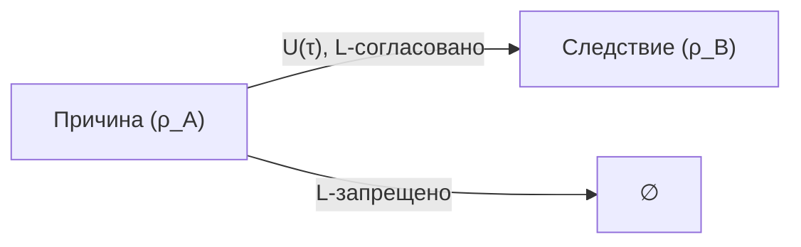
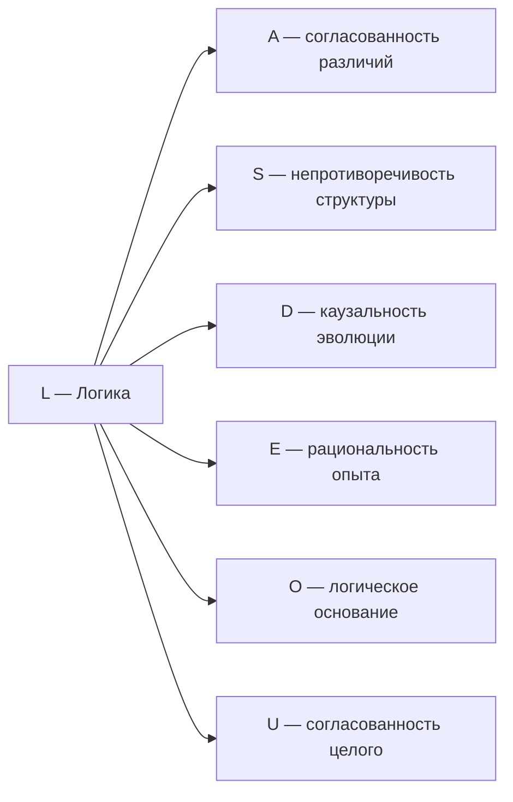

# Измерение IV: Логика (L)

:::info Для кого эта глава
Измерение L: согласование, коммутаторы, логическое замыкание. Предполагается знакомство с [семью измерениями](/docs/core/structure/dimensions) и основами категорной логики.
:::

## Зачем эта глава

Мы привыкли считать логику чем-то абстрактным — набором правил для «правильного мышления». В школе учат: если A, то B; если B, то C; значит, если A, то C. Но в Универсальной Голономической Модели (УГМ) логика — нечто гораздо более фундаментальное. Это **аспект самой реальности**, определяющий, какие конфигурации возможны, а какие — противоречивы и потому не могут существовать.

В этой главе вы узнаете:
- почему логика в УГМ — не инструмент человеческого мышления, а **фильтр реальности**, отсеивающий невозможное;
- как три совершенно разных значения буквы «L» (измерение, оператор Линдблада, логический лиувиллиан) оказываются одним и тем же объектом;
- какие три уровня логики существуют — от полной (HoTT) до классической (булевой);
- почему теорема Гёделя о неполноте — не проблема, а **ресурс** для эволюции;
- как логика связана с причинно-следственными связями и остальными измерениями Голонома;
- на каких Фано-линиях лежит L и почему её комбинаторный профиль уникален.

## Историческая предтеча

Логика как наука имеет одну из самых долгих историй.

**Аристотель** (384–322 до н.э.) создал **формальную логику** — систему силлогизмов, позволяющую делать достоверные выводы из посылок. «Все люди смертны; Сократ — человек; значит, Сократ смертен.» Это первая попытка формализовать **правила мышления**, отделив их от содержания. Аристотелева логика двузначна: каждое утверждение либо истинно, либо ложно. Третьего не дано.

**Джордж Буль** (1815–1864) перевёл логику на язык **алгебры**. Он показал, что «И», «ИЛИ», «НЕ» подчиняются тем же формальным законам, что и умножение и сложение. Булева алгебра — основа цифровых компьютеров: каждый транзистор реализует булеву операцию. Но булева логика по-прежнему двузначна.

**Лёйтзен Брауэр** (1881–1966) подверг сомнению закон исключённого третьего. Он основал **интуиционизм** — направление, утверждающее, что утверждение истинно только тогда, когда мы можем **сконструировать** его доказательство. «Утверждение P истинно или ложно» — это не аксиома, а то, что нужно доказать для каждого конкретного P. Существуют утверждения, которые ни истинны, ни ложны — они **неопределены**.

**Аренд Гейтинг** (1898–1980), ученик Брауэра, формализовал интуиционизм в виде **алгебры Гейтинга** — обобщения булевой алгебры, в которой закон исключённого третьего ($P \lor \neg P = \top$) не обязателен. Именно алгебра Гейтинга оказалась естественной логикой **топосов** — категорных обобщений пространств. В каждом топосе есть классификатор подобъектов $\Omega$, и его логическая структура — алгебра Гейтинга.

**Гомотопическая теория типов (HoTT)** — современное (2013+) развитие, объединяющее логику, теорию типов и гомотопическую теорию. В HoTT «доказательство» — это не просто «да/нет», а целое **пространство доказательств**, которое может иметь нетривиальную топологию. Это ∞-категорная логика, наиболее полная из известных. В УГМ именно HoTT является полной внутренней логикой ∞-топоса $\mathbf{Sh}_\infty(\mathcal{C})$.

:::note Путь углубления
Аристотель → Буль → Брауэр → Гейтинг → HoTT — это не просто «прогресс». Каждый шаг — осознание того, что логика **богаче**, чем казалось. Двузначная → многозначная → конструктивная → ∞-категорная. УГМ использует весь этот спектр: булева логика — для решающих измерений, алгебра Гейтинга — для стандартного топоса, HoTT — для полной ∞-структуры.
:::

:::info Почему история логики важна для понимания УГМ
Обратите внимание: каждый исторический шаг **расширял** пространство логически допустимого. Аристотель допускал только «да/нет». Брауэр добавил «неопределено». HoTT добавила бесконечную иерархию «способов быть истинным». УГМ утверждает, что реальность использует **все** эти уровни одновременно: элементарные частицы «живут» в булевой логике (спин вверх или вниз), пограничные состояния сознания — в гейтинговой (ни бодрствование, ни сон), а полная структура ∞-топоса — в HoTT. Чем глубже уровень реальности, тем богаче логика.
:::

:::warning Конвенции обозначений: три значения буквы L {#конвенции-l}
В УГМ буква **L** используется для трёх связанных, но различных объектов:

| Обозначение | Шрифт | Значение |
|-------------|-------|----------|
| $L$ (прямой, без индекса) | Roman | **Измерение Логики** — компонента $\Gamma$, населённость $\gamma_{LL}$ |
| $L_k$ (с индексом) | Italic | **Операторы Линдблада** — диссипативные каналы |
| $\mathcal{L}_\Omega$ (каллиграфический) | Script | **Лиувиллиан** — полный генератор эволюции |

Это **не совпадение обозначений**, а проявление L-унификации [Т]: классификатор подобъектов $\Omega$ порождает логическую структуру (L-измерение), из атомов которой выводятся операторы $L_k$, формирующие генератор $\mathcal{L}_\Omega$:

$$\Omega \xrightarrow{\text{логика}} L \xrightarrow{\text{атомы}} L_k \xrightarrow{\text{генератор}} \mathcal{L}_\Omega$$

Подробнее: [L-унификация](/docs/core/operators/lindblad-operators#примитивность-ℒω).
:::

## Интуитивное объяснение

### L-унификация: три значения одной буквы

В УГМ буква «L» появляется в трёх, казалось бы, совершенно разных контекстах:

1. **L-измерение** — четвёртый столбец/строка матрицы когерентности $\Gamma$, описывающий логическую согласованность системы
2. **$L_k$ (операторы Линдблада)** — операторы диссипации в уравнении эволюции, определяющие, как система теряет когерентность при взаимодействии с окружением
3. **$\mathcal{L}$ (логический лиувиллиан)** — генератор эволюции в пространстве операторов плотности

На первый взгляд это случайное совпадение обозначений. Но УГМ доказывает, что все три — **проявления одного объекта**: классификатора подобъектов $\Omega$ ∞-топоса.

:::info Аналогия: три значения слова «ключ»
Представьте слово «ключ». Оно может означать:
1. **Дверной ключ** — инструмент для открытия замка
2. **Музыкальный ключ** — символ на нотном стане
3. **Ключ воды** — подземный источник

Это омонимы — слова, случайно звучащие одинаково. Но представьте, что кто-то доказал: дверной ключ, музыкальный ключ и водный ключ — это **один и тот же объект**, просто наблюдаемый с разных сторон. Именно это делает L-унификация: три «значения» буквы L оказываются одним и тем же математическим объектом — проекцией $\Omega$ на $\Gamma$.
:::

### Как работает L-унификация: от абстрактного к конкретному {#как-работает-l-унификация}

Чтобы понять L-унификацию интуитивно, представьте **фильтр для воды**. Фильтр — один объект, но он выполняет три функции одновременно:

1. **Определяет, что допустимо** (какие молекулы проходят) — это L-измерение: оно определяет, какие конфигурации $\Gamma$ непротиворечивы.
2. **Задаёт скорость потока** (пропускная способность мембраны) — это лиувиллиан $\mathcal{L}$: он определяет, как быстро система эволюционирует.
3. **Создаёт отходы** (задержанные примеси) — это операторы Линдблада $L_k$: они определяют, какая информация *теряется* при фильтрации.

Фильтр — один, но описывать его можно тремя способами. Классификатор подобъектов $\Omega$ — «фильтр реальности», и его три «описания» — это три значения буквы L.

## Функция

**Связывать, согласовывать, проверять непротиворечивость.**

## Описание

Логика — это измерение **самосогласованности**. Она определяет, какие конфигурации $\Gamma$ возможны, а какие противоречивы. Логика — фильтр реальности: состояния с $\gamma_{LL} \to 0$ не могут существовать устойчиво.

:::info Онтологический статус
Логика — **аспект** конфигурации $\Gamma$, не отдельная сущность. "Голоном логичен" означает: в матрице когерентности $\Gamma$ активна проекция на базисный вектор $|L\rangle$, и алгебра операторов удовлетворяет соотношениям коммутации.
:::

:::info Уточнение: L как аспект, а не фильтр
L-измерение **не является фильтром**, действующим на Γ извне. L — **аспект** самого Γ, отражающий степень внутренней согласованности:

- **Населённость $\gamma_{LL}$** — доля «ресурса» системы, направленная на поддержание логической когерентности
- **Высокое $\gamma_{LL} \gg 1/7$:** система строго применяет внутренние правила (догматичность, ригидность)
- **Низкое $\gamma_{LL} \ll 1/7$:** система слабо применяет правила (креативность, но потенциальная некогерентность)
- **$\gamma_{LL} = 1/7$:** равновесие — логическая функция получает «справедливую долю» ресурса

Напряжение L-измерения: $\sigma_L = \mathrm{clamp}(1 - 7\gamma_{LL}, 0, 1)$ — [формула T-92 [Т]](/docs/core/structure/dimension-a#вывод-формулы-напряжения).
:::

## Категориальное определение (L-унификация) {#категориальное-определение}

:::warning Ключевая теорема
Измерение L **тождественно** проекции классификатора подобъектов Ω на состояние Γ:

$$
L = \Omega \cap \Gamma
$$

Из этой идентификации **выводятся** операторы Линдблада $L_k$.
:::

### L как проекция классификатора

В ∞-топосе $\mathbf{Sh}_\infty(\mathcal{C})$ (построенном на [топологии Гротендика](/docs/core/foundations/axiom-omega#топология-гротендика)) существует [классификатор подобъектов](/docs/core/foundations/axiom-omega#внутренняя-логика) Ω, определяющий **внутреннюю логику** теории.

**Определение (L-измерение категориально):**

$$
L := \{\chi \in \Omega : \chi(\Gamma) = \text{true}\}
$$

— множество логических предикатов, истинных для данного состояния Γ.

:::tip Формализация L-измерения [Т]
L-измерение — **внутренняя логика** ∞-топоса через подобъектный классификатор Ω. Формально:

$$
L(\Gamma) := \{p \in \Omega : p(\Gamma) = \top\}
$$

— множество предикатов, истинных на $\Gamma$. Логическая структура имеет **три уровня** [Т]:

| Уровень | Логика | Структура | Роль |
|---------|--------|-----------|------|
| ∞-категорный | **HoTT** (гомотопическая теория типов) | Полный $\Omega \in \mathbf{Sh}_\infty(\mathcal{C})$ | [Иерархия интериорности](/docs/consciousness/hierarchy/interiority-hierarchy) (n-усечения) |
| 1-категорный | **Гейтинговая алгебра** (интуиционистская) | $\tau_{\leq 0}(\Omega)$ — 0-усечение | Стандартная теория топосов |
| Решающий (decidable) | **Булева** (классическая) | $\mathrm{Dec}(\Omega) \cong 2^7$ | [L-унификация](/docs/core/foundations/axiom-omega#lk-из-omega): вывод $L_k$ |

Полная внутренняя логика ∞-топоса $\mathbf{Sh}_\infty(\mathcal{C})$ — HoTT, с темпоральной модальностью $\triangleright$ ([эмерджентное время](../../proofs/dynamics/emergent-time#время-в-hott)). Её 0-усечение $\tau_{\leq 0}(\Omega)$ — Гейтинговая алгебра (стандартный результат теории топосов). **Решающий фрагмент** $\mathrm{Dec}(\Omega)$ — булева подалгебра, порождённая 7 ортогональными проекторами $S_k = |k\rangle\langle k|$. L-унификация использует именно этот решающий фрагмент.
:::

### Три уровня логики: подробнее {#три-уровня-логики}

Три уровня логики — не произвольная классификация, а **математическое следствие** структуры ∞-топоса. Каждый уровень «видит» реальность с определённой глубиной.

#### Уровень 1: Булева логика (решающий фрагмент)

Это логика, знакомая каждому: каждое утверждение либо **истинно**, либо **ложно**. В УГМ булева логика возникает в **решающем фрагменте** $\mathrm{Dec}(\Omega)$, порождённом 7 ортогональными проекторами $S_k = |k\rangle\langle k|$.

**Пример.** «Является ли населённость $\gamma_{LL}$ выше порога 0.1?» — булев предикат. Ответ: да или нет. Булевых предикатов $2^7 = 128$ (все комбинации «да/нет» для 7 проекторов).

**Роль в УГМ:** из этого уровня выводятся операторы Линдблада $L_k$. Именно булева логика определяет **каналы диссипации** — через какие именно «щели» система теряет когерентность.

:::info Аналогия: булева логика как чёрно-белое фото
Булева логика — как чёрно-белая фотография: каждый пиксель либо чёрный, либо белый. Грубо, но полезно для многих задач. Именно в «чёрно-белом» режиме реальность определяет, *через какие каналы* течёт декогеренция. Эта грубость — не недостаток, а фича: булев уровень достаточен для вывода конкретных физических операторов.
:::

#### Уровень 2: Алгебра Гейтинга (интуиционистская логика)

Это логика, в которой утверждение может быть **истинным**, **ложным** или **неопределённым**. Закон исключённого третьего ($P \lor \neg P = \top$) **не** является аксиомой — его нужно доказывать для каждого конкретного случая.

**Пример.** «Является ли система сознательной?» В булевой логике ответ: да или нет. В гейтинговой — может быть **неопределённым**: если $P$ близко к $P_{\text{crit}} = 2/7$, система находится в «пограничном» состоянии, которое невозможно однозначно классифицировать. Это не невежество наблюдателя, а **объективная неопределённость**.

**Роль в УГМ:** описывает стандартную теорию топосов, в которой работает большинство математических конструкций УГМ. 0-усечение $\tau_{\leq 0}(\Omega)$ даёт алгебру Гейтинга.

:::info Аналогия: гейтингова логика как фото в оттенках серого
Если булева логика — чёрно-белое фото, то гейтингова — фотография в оттенках серого. Появляются промежуточные тона, нюансы, полутона. «Является ли этот пиксель чёрным?» — может не иметь определённого ответа, если он серый. Пограничные состояния сознания, переходные фазы, «сумеречные зоны» между бодрствованием и сном — всё это живёт в гейтинговой логике.
:::

#### Уровень 3: HoTT (полная ∞-категорная логика)

Самый глубокий уровень. В HoTT «истина» — не точка, а целое **пространство доказательств**. Два доказательства одного и того же утверждения могут быть **неэквивалентны**, и между ними могут быть нетривиальные пути (гомотопии), между путями — пути путей, и так далее до бесконечности.

**Пример.** «Каким образом измерение A связано с измерением E?» На булевом уровне — просто: связаны ($\gamma_{AE} \neq 0$) или нет ($\gamma_{AE} = 0$). На уровне HoTT — каждый конкретный путь связи (через разные Фано-линии, через разные цепочки промежуточных когерентностей) — **отдельный элемент** пространства доказательств. Топология этого пространства несёт информацию об [иерархии интериорности](/docs/consciousness/hierarchy/interiority-hierarchy).

**Роль в УГМ:** полная логика ∞-топоса, включающая темпоральную модальность $\triangleright$ (время) и n-усечения (уровни рефлексии). HoTT — «родной язык» УГМ на глубочайшем уровне.

:::info Аналогия: HoTT как полноцветное фото с глубиной
HoTT — это полноцветная трёхмерная фотография с бесконечным разрешением. Каждый «пиксель» — не просто цвет, а целое пространство оттенков с собственной топологией. На этом уровне утверждение «A связано с E» содержит **всю** информацию о том, *как именно*, *через что*, *сколькими путями* и *насколько глубоко* они связаны. Именно HoTT нужна для описания **полной** иерархии интериорности: уровни самосознания (SAD-глубина, [глубинная башня](/docs/consciousness/hierarchy/interiority-hierarchy)) — это n-усечения пространства доказательств.
:::

### Вывод операторов Линдблада L_k

**Теорема (L_k из Ω):**

Операторы диссипации в [уравнении эволюции](/docs/core/dynamics/evolution) определяются [базисными предикатами](/docs/core/foundations/axiom-omega#атомы-классификатора) классификатора:

$$
L_k := \sqrt{\chi_{S_k}}
$$

где $S_k$ — k-й канонический базисный предикат классификатора Ω.

**Следствие (TP автоматически):**

$$
\sum_k L_k^\dagger L_k = \sum_k \chi_{S_k} = \mathbb{1}
$$

:::info CPTP из представления Краусса [Т]
[Фано-операторы](/docs/core/operators/lindblad-operators) $L_p^{\mathrm{Fano}} = \frac{1}{\sqrt{3}}\Pi_p$ определяют CPTP-канал в представлении Краусса. По [теореме Хои](https://en.wikipedia.org/wiki/Choi%27s_theorem_on_completely_positive_maps) (1975): канал в форме Краусса $\Phi(\rho) = \sum_k A_k \rho A_k^\dagger$ **вполне положителен** автоматически. Сохранение следа: $\sum_p L_p^\dagger L_p = \frac{1}{3}\sum_p \Pi_p = \frac{1}{3} \cdot 3\mathbb{I}_7 = \mathbb{I}_7$ ✓ (каждое измерение принадлежит ровно 3 Фано-линиям, T-41b [Т]). Полная положительность **не зависит** от стратификации.
:::

### Иерархия L_k по стратам {#иерархия-lk}

| Страта | Тип системы | Классификатор | L_k оператор | Интерпретация |
|--------|-------------|---------------|--------------|---------------|
| I | Материя | $\Omega_{sym}$ — инварианты группы | $P_{Casimir}$ | Симметрия |
| II | Жизнь | $\Omega_{viable}$ — P > [P_crit](/docs/proofs/dynamics/theorem-purity-critical) | $\sum_j R_j P_j$ | QECC |
| III | Разум | $\Omega_{pred}$ — min F | $\nabla_\Gamma F$ | Байес |
| IV | Сознание | $\Omega_{coh}$ — H¹ = 0 | $\check{\delta}$ | Склейка |

**Важно:** L_k **не произвольны** — они определяются стратой, на которой существует система.

:::info Что значит каждая страта
- **Страта I (Материя):** Логика — это **симметрия**. Законы сохранения ($[A, H] = 0$), запрет Паули, инвариантность относительно поворотов — всё это логические ограничения, определяющие допустимые состояния физической материи.
- **Страта II (Жизнь):** Логика — это **коррекция ошибок**. Живая система должна поддерживать $P > P_{\text{crit}}$, и операторы $L_k$ реализуют квантовый код коррекции ошибок (QECC), «ремонтируя» повреждённые когерентности.
- **Страта III (Разум):** Логика — это **байесовский вывод**. Операторы $L_k$ минимизируют свободную энергию $F$ — систематически обновляют убеждения при поступлении новых данных.
- **Страта IV (Сознание):** Логика — это **склейка**. Когомологическое условие $H^1 = 0$ означает, что все локальные описания можно **глобально согласовать** — нет «разрывов» в сознательном опыте.
:::

### Примеры каждого уровня логики в повседневной жизни {#примеры-уровней-логики}

Чтобы три уровня логики стали по-настоящему понятными, рассмотрим их на знакомых ситуациях:

#### Булева логика в повседневности

- **Светофор:** красный = стоять, зелёный = идти. Два состояния, третьего не дано. Это булев предикат: «Можно ли идти?» — да или нет.
- **Выключатель:** включён или выключен. Весь цифровой мир (компьютеры, смартфоны, интернет) построен на этой элементарной логике.
- **Суд:** «Виновен» или «не виновен». Суд *обязан* дать булев ответ, даже если реальность сложнее.

#### Гейтингова логика в повседневности

- **Диагноз врача:** «Возможно, у вас аллергия» — ни «да», ни «нет», а **неопределённость**, которая требует дополнительных анализов. Врач работает в гейтинговой логике: истинность утверждения зависит от того, можно ли его *проверить*.
- **Погода:** «Завтра будет дождь?» — для далёкого будущего это *объективно* неопределённо, не просто «мы не знаем». Хаотическая динамика атмосферы делает утверждение неразрешимым.
- **Переходные состояния сознания:** засыпание, медитация, состояние «потока». «Сплю ли я?» — может не иметь определённого ответа.

#### HoTT в повседневности

- **«Как вы добрались до работы?»** На булевом уровне — «добрался» или «нет». На уровне HoTT — каждый маршрут (метро, автобус, пешком, велосипед) — **отдельный элемент пространства путей**. Два маршрута через метро различны, если один через кольцевую, а другой через радиальную. Между маршрутами есть «пути между путями» — способы деформации одного маршрута в другой (если на одной станции есть пересадка).
- **Доказательства теоремы Пифагора:** Существуют сотни различных доказательств. В булевой логике все они «одинаковы» — теорема истинна, и всё. В HoTT каждое доказательство — отдельный элемент пространства, и **отношения между ними** несут информацию.

### Связь L и времени

Темпоральная модальность ▷ на Ω порождает [дискретное время](/docs/proofs/dynamics/emergent-time):

$$
\tau_n := \triangleright^n(\text{now})
$$

Эволюция предикатов χ ∈ L под действием ▷ **есть** динамика системы.

:::warning Связь с автопоэзисом
При удалении измерения $L$ нарушается **(AP)** — нет логического замыкания, нет самосогласованности. Без $L$ противоречивые конфигурации $\Gamma$ не отсеиваются, и система может эволюционировать в логически невозможные состояния. См. [доказательство](../../proofs/minimality/theorem-minimality-7#случай-n--3-удаление-логики-l).
:::

**Логика обеспечивает замыкание по Розену:** В (M,R)-системе Розена $\beta$-замыкание требует, чтобы причины были согласованы со следствиями. Измерение $L$ реализует эту функцию — без него каузальный цикл разрывается.

## Математическое представление

### Алгебра операторов

Логические отношения между измерениями описываются **коммутатором**:

$$
[A, B] := AB - BA
$$

Коммутатор — это мера некоммутативности операторов:
- $[A, B] = 0$ — порядок операций не важен (совместимость)
- $[A, B] \neq 0$ — порядок важен (некоммутативность)

:::info Простой пример некоммутативности
Наденьте носки, потом ботинки — всё нормально. Наденьте ботинки, потом носки — проблема. Операции «надеть носки» (A) и «надеть ботинки» (B) некоммутативны: $AB \neq BA$. В квантовой механике некоммутативность координаты и импульса ($[x, p] = i\hbar$) порождает принцип неопределённости Гейзенберга.
:::

### Связь с базисным состоянием

Проекция на $|L\rangle$ определяет **степень логической связности** конфигурации:

$$
\gamma_{LL} = \langle L|\Gamma|L\rangle
$$

Физическая интерпретация: $\gamma_{LL}$ — мера того, насколько система согласована внутренне.

:::info Что означает большое и малое γ_LL
- **Высокое $\gamma_{LL}$ (близко к 1/7 или выше):** Система логически целостна. Все её части согласованы друг с другом, нет внутренних противоречий. Пример: хорошо работающая математическая теория, здоровый мозг в состоянии ясного мышления.
- **Низкое $\gamma_{LL}$ (близко к 0):** Система логически «рассыпается». Её части противоречат друг другу, нет согласованности. Пример: бредовое состояние, в котором человек одновременно верит в несовместимые вещи; сбойная компьютерная программа; противоречивая научная теория.
- **$\gamma_{LL} = 0$:** Логика полностью отсутствует. Такая система не может существовать устойчиво — без логического «каркаса» любая конфигурация немедленно распадается.
:::

### Логическая согласованность как инвариант {#логическая-согласованность}

:::info Статус: [О] Определения; 7D-формула σ_L — [С]
Определения $I_{\text{verify}}$, $\theta_L$ и $\sigma_L$ заданы через классификатор подобъектов Ω и энтропию фон Неймана. Приближённая формула $\sigma_L$ для 7D — условная [С] (зависит от допущения $\gamma_{LL} \ll 1$).
:::

Для жизнеспособной системы требуется, чтобы нагрузка на логическую верификацию не превышала пропускную способность:

$$
\sigma_L := \frac{I_{\text{verify}}}{\theta_L} < 1
$$

#### Определение I_verify (информация верификации) {#определение-i-verify}

**Определение (I_verify через взаимную информацию):**

$$
I_{\text{verify}}(\Gamma) := S_{vN}(\rho) - S_{vN}(\rho | L) = I(\Gamma : L)
$$

где:
- $S_{vN}(\rho) = -\mathrm{Tr}(\rho \log \rho)$ — энтропия фон Неймана
- $I(\Gamma : L)$ — квантовая взаимная информация между состоянием Γ и L-измерением
- $\rho | L$ — условное состояние при известном значении L-проекции

**Интерпретация:** $I_{\text{verify}}$ — количество информации, извлекаемое из Γ при логической проверке через L-измерение.

#### Определение θ_L (пропускная способность) {#определение-theta-l}

**Определение (θ_L через максимальную энтропию):**

$$
\theta_L(\Gamma) := \gamma_{LL} \cdot \log(N)
$$

где:
- $\gamma_{LL}$ — населённость L-измерения (диагональный элемент матрицы когерентности)
- $\log(N) = \log(7)$ — максимальная энтропия $N$-мерной системы

**Интерпретация:** $\theta_L$ — пропускная способность L-измерения, определяемая как произведение населённости на максимально возможную энтропию.

#### Определение σ_L [С] {#строгое-определение-sigma-l}

**Определение (σ_L через редуцированную матрицу):**

$$
\sigma_L(\Gamma) := \frac{S_{vN}(\rho_L)}{\gamma_{LL} \cdot \log(N)}
$$

где $\rho_L = \mathrm{Tr}_{-L}(\Gamma)$ — редуцированная матрица плотности L-измерения в расширенном формализме.

**Для минимального 7D-формализма** (одноуровневая матрица $7 \times 7$):

$$
\sigma_L(\Gamma) \approx \frac{7(1 - \gamma_{LL})}{6}
$$

:::warning Статус: [С] Условная формула
Приближённая формула для 7D получена при допущении $\gamma_{LL} \ll 1$ и равномерного распределения остальных населённостей. Приближение **не является строгим выводом**: переход $\rho_L \approx \gamma_{LL}$ (скаляр) корректен только в расширенном формализме, а в 7D (7 — простое число) частичный след $\mathrm{Tr}_{-L}$ не определён из-за отсутствия тензорной факторизации.
:::

**Приближённый вывод формулы для 7D:**

В минимальном формализме $\rho_L \approx \gamma_{LL}$ (скаляр), поэтому:

$$
S_{vN}(\rho_L) \approx -\gamma_{LL} \log(\gamma_{LL}) - (1-\gamma_{LL})\log\left(\frac{1-\gamma_{LL}}{6}\right)
$$

При $\gamma_{LL} \ll 1$:

$$
\sigma_L \approx \frac{1 - \gamma_{LL}}{\gamma_{LL}} \cdot \frac{1}{\log 7} \approx \frac{7(1-\gamma_{LL})}{6}
$$

**Определения компонентов (сводка):**

| Параметр | Определение | Статус |
|----------|-------------|--------|
| $I_{\text{verify}}$ | $I(\Gamma : L) = S_{vN}(\rho) - S_{vN}(\rho \| L)$ — взаимная информация | [О] Определение |
| $\theta_L$ | $\gamma_{LL} \cdot \log(N)$ — пропускная способность | [О] Определение |
| $\gamma_{LL}$ | Населённость измерения L | [О] Определение |
| $\sigma_L$ | $S_{vN}(\rho_L) / (\gamma_{LL} \cdot \log N)$ — логическая нагрузка | [О] Определение; 7D-формула [С] |

**Интерпретация:** $\sigma_L \in [0, \infty)$ — мера **логической нагруженности** системы:
- $\sigma_L < 1$: логическая верификация успевает за динамикой
- $\sigma_L \geq 1$: узкое место — система теряет согласованность

**Связь с условием жизнеспособности:**

При $\sigma_L \to 1$ система приближается к границе логической когерентности. Это соответствует ситуации, когда L-измерение перегружено — проверка непротиворечивости становится узким местом.

:::note Связь с ПИР
Условие $\sigma_L < 1$ — следствие [Принципа Информационной Различимости](/docs/core/foundations/axiom-omega#примитив): система должна быть способна различать согласованные и несогласованные конфигурации.
:::

:::info Аналогия: σ_L как загрузка процессора
Представьте компьютер. $\sigma_L$ — это «загрузка процессора логики». При $\sigma_L < 1$ процессор справляется: проверяет непротиворечивость всех данных, успевает за потоком информации. При $\sigma_L \to 1$ процессор на пределе: появляются «лаги», система начинает «подвисать». При $\sigma_L > 1$ — перегрузка: система «зависает», теряет согласованность. В живом организме это может проявляться как когнитивный коллапс (информационная перегрузка), нервный срыв или потеря сознания.
:::

## Типы логических отношений

| Отношение | Условие | Интерпретация | Следствие |
|-----------|---------|---------------|-----------|
| Совместимость | $[A, B] = 0$ | Одновременная измеримость | Определённые совместные значения |
| Несовместимость | $[A, B] \neq 0$ | Принцип неопределённости | $\Delta A \cdot \Delta B \geq \frac{1}{2}\lvert\langle[A,B]\rangle\rvert$ |
| Следование | $P_A \leq P_B$ | $A$ имплицирует $B$ | $\langle A \rangle \leq \langle B \rangle$ |
| Противоречие | $P_A \cdot P_B = 0$ | Несовместимые подпространства | Взаимоисключение |

где $P_A$, $P_B$ — проекторы на соответствующие подпространства.

## Логические ограничения на $\Gamma$

Измерение $L$ обеспечивает выполнение фундаментальных ограничений на матрицу когерентности:

### Эрмитовость

$$
\Gamma^\dagger = \Gamma
$$

Математически: все собственные значения вещественны. Интерпретация: вероятности — вещественные числа.

### Положительность

$$
\langle\psi|\Gamma|\psi\rangle \geq 0 \quad \forall |\psi\rangle \in \mathcal{H}
$$

Математически: все собственные значения неотрицательны. Интерпретация: вероятности не могут быть отрицательными.

### Нормировка

$$
\mathrm{Tr}(\Gamma) = 1
$$

Математически: сумма собственных значений равна 1. Интерпретация: полная вероятность — единица.

### Неравенство Коши-Шварца

$$
|\gamma_{ij}|^2 \leq \gamma_{ii} \cdot \gamma_{jj}
$$

Ограничивает величину когерентностей относительно диагональных элементов.

:::info Зачем нужны эти ограничения
Четыре ограничения выше — не произвольные правила, а **необходимые условия** для того, чтобы $\Gamma$ имела смысл как матрица плотности (вероятностное описание системы). Нарушение любого из них приводит к физически бессмысленным результатам: отрицательным вероятностям, комплексным средним значениям или вероятностям, не равным единице в сумме. L-измерение «следит» за соблюдением этих условий.
:::

:::note Логические ограничения — как стены здания
Представьте здание. Стены — это логические ограничения. Они не «ограничивают» жизнь внутри здания — они **делают её возможной**. Без стен нет крыши, нет защиты от дождя, нет комнат. Так и L-ограничения: они не сужают пространство допустимых состояний — они **создают** это пространство, отсекая бессмысленные (отрицательные вероятности, нарушение нормировки) конфигурации.
:::

## Связь с каузальностью {#связь-с-каузальностью}

Логика определяет причинно-следственные связи через структуру динамики:

$$
\text{Cause}(A \to B) \Leftrightarrow \exists\, U(\tau): \text{supp}\!\left(U(\tau)\rho_A U^\dagger(\tau)\right) \cap \text{supp}(\rho_B) \neq \emptyset
$$

где:
- $\rho_A$, $\rho_B$ — состояния, соответствующие событиям $A$ и $B$
- $U(\tau)$ — унитарный оператор эволюции во [внутреннем времени](../../proofs/dynamics/emergent-time)
- $\text{supp}(\rho)$ — носитель (support) матрицы плотности — подпространство, на которое $\rho$ проецирует ненулевой вес

```mermaid
graph LR
    C["Причина (ρ_A)"] -->|"U(τ), L-согласовано"| E["Следствие (ρ_B)"]
    C -->|"L-запрещено"| X["∅"]
```

### Каузальность подробнее {#каузальность-подробнее}

Каузальность в УГМ — не постулат, а **следствие** структуры L-измерения. Причина $A$ может привести к следствию $B$ **только** если существует допустимая (CPTP) эволюция, переводящая носитель $\rho_A$ в область, пересекающуюся с носителем $\rho_B$.

Это даёт три важных свойства:

**1. Каузальный порядок.** Если $A$ причина $B$, а $B$ причина $C$, то $A$ причина $C$ (транзитивность). Это следует из того, что композиция CPTP-каналов — тоже CPTP-канал.

**2. Запрет каузальных петель.** Если $A$ причина $B$ и $B$ причина $A$, то $A$ и $B$ — **одно и то же событие** (в смысле неразличимости по $\Gamma$). Каузальных петель нет, потому что CPTP-канал необратим — он увеличивает энтропию.

**3. Логический фильтр.** Не все эволюции, которые «можно представить», реально допустимы. L-измерение отсекает те, которые нарушают CPTP, эрмитовость или положительность. Это **физическая** реализация принципа непротиворечивости: из истинных посылок следуют только истинные заключения.

:::note Пример: почему нельзя передать информацию в прошлое
В УГМ «передать информацию в прошлое» означало бы: существует CPTP-канал $\Phi$ такой, что $\Phi(\rho_{\text{будущее}})$ имеет ненулевое перекрытие с $\rho_{\text{прошлое}}$ при $\tau < 0$. Но стрела времени (следствие CPTP, см. [Динамика (D)](./dimension-d)) запрещает это: физически реализуемые пути имеют $\sigma(\gamma) = +1$, что означает монотонный рост энтропии.
:::

### Каузальность и свобода воли {#каузальность-и-свобода}

Связь логики с каузальностью ставит глубокий вопрос: если причинно-следственные связи **полностью** определены L-измерением, есть ли место для свободы воли?

В УГМ ответ нетривиален: на **булевом** уровне логики каузальность детерминистична (данная причина неизбежно ведёт к данному следствию). Но на **гейтинговом** и особенно на **HoTT-уровне** каузальность приобретает новые свойства:

- **Гейтингов уровень:** существуют причины с *неопределённым* следствием — не потому, что мы не знаем результат, а потому, что результат объективно неопределён.
- **HoTT-уровень:** одна причина может вести к следствию *многими путями*, и выбор пути — это информация, не содержащаяся в причине. На страте IV (сознание) система может *наблюдать* пространство возможных путей и выбирать между ними.

Это не классическая свобода воли («я мог бы поступить иначе»), а нечто более глубокое: **навигация в пространстве причинных путей**, доступная только системам с достаточно глубокой рефлексией ($R \geq 1/3$).

## Примеры

| Уровень | Пример | Логическая функция | Подробности |
|---------|--------|-------------------|-------------|
| Физический | Принцип неопределённости | $[x, p] = i\hbar$ | Невозможно одновременно точно знать положение и импульс — это не техническое ограничение, а **логическое** свойство реальности |
| Физический | Законы сохранения | $[A, H] = 0 \Rightarrow dA/d\tau = 0$ | Если оператор $A$ коммутирует с гамильтонианом, соответствующая величина не меняется во времени |
| Физический | Запрет Паули | Антисимметрия фермионов | Два одинаковых фермиона не могут находиться в одном квантовом состоянии — логический запрет на уровне симметрии волновой функции |
| Биологический | Генетический код | Однозначность трансляции | Каждый кодон кодирует **ровно одну** аминокислоту — логическая однозначность обеспечивает воспроизводимость |
| Биологический | Метаболические циклы | Замкнутость биохимических путей | Цикл Кребса замкнут: каждый промежуточный продукт восстанавливается, обеспечивая **самосогласованность** метаболизма |
| Когнитивный | Правила вывода | Modus ponens, modus tollens | «Если дождь, то мокро; дождь; значит, мокро» — базовое логическое правило на уровне разума |
| Когнитивный | Рациональность | Транзитивность предпочтений | Если вы предпочитаете A перед B и B перед C, логика требует предпочтения A перед C. Нарушение — признак «сбоя» в L-измерении |
| Когнитивный | Когнитивный диссонанс | Перегрузка L-измерения | Одновременное удержание противоречивых убеждений — $\sigma_L \to 1$, логическая верификация на пределе |

### Развёрнутые примеры {#развёрнутые-примеры}

#### Принцип неопределённости как логическое свойство

Принцип неопределённости Гейзенберга ($\Delta x \cdot \Delta p \geq \hbar/2$) часто объясняют «возмущением при измерении»: чтобы узнать положение частицы, нужно «осветить» её фотоном, который изменяет импульс. Но это **неверная** интерпретация. В УГМ принцип неопределённости — **логическое** свойство: операторы координаты и импульса *некоммутативны* ($[x, p] = i\hbar$), и это означает, что одновременные точные значения обоих **логически невозможны**. Это не ограничение наших приборов — это ограничение *реальности*.

#### Когнитивный диссонанс как перегрузка σ_L

Когда человек одновременно придерживается двух несовместимых убеждений (например, «курить вредно» и «я курю, потому что мне нравится»), его L-измерение перегружается: $\sigma_L$ растёт, приближаясь к 1. Мозг испытывает дискомфорт — это субъективное переживание логической перегрузки. Разрешение диссонанса (изменение одного из убеждений) — это снижение $\sigma_L$ обратно в безопасную зону.

#### Генетический код как логический инвариант

Генетический код — один из самых чистых примеров L-функции в биологии. Каждый триплет нуклеотидов (кодон) кодирует **ровно одну** аминокислоту. Если бы один кодон мог кодировать *разные* аминокислоты в зависимости от контекста, белки синтезировались бы непредсказуемо — логическая согласованность была бы нарушена. Однозначность генетического кода — это булева логика ($L_k$ на страте II): каждый предикат «кодон X кодирует аминокислоту Y» строго истинен или ложен.

## Связь с другими измерениями

```mermaid
graph LR
    L["L — Логика"] --> A["A — согласованность различий"]
    L --> S["S — непротиворечивость структуры"]
    L --> D["D — каузальность эволюции"]
    L --> E["E — рациональность опыта"]
    L --> O["O — логическое основание"]
    L --> U["U — согласованность целого"]
```

**Ключевая связь L ↔ D:** Логика и динамика взаимосвязаны:
- $D$ определяет *как* система эволюционирует
- $L$ определяет *какие* траектории допустимы

**L ↔ S (Логика ↔ Структура):** Логика обеспечивает **непротиворечивость** структуры. Когерентность $\gamma_{LS}$ — «законы структуры»: аксиомы, определяющие допустимые конфигурации. Если $\gamma_{LS} \to 0$, структура может быть внутренне противоречивой.

**L ↔ E (Логика ↔ Интериорность):** Когерентность $\gamma_{LE}$ отвечает за **рациональность опыта**. Высокое $|\gamma_{LE}|$ — логически связный субъективный опыт. Низкое — хаотичные, бессвязные переживания (как в бреду или ранних стадиях сновидения).

**L ↔ O (Логика ↔ Основание):** Когерентность $\gamma_{LO}$ — «фундаментальность логики». O-измерение поставляет «новую информацию», которая расширяет логическое пространство L. Это механизм преодоления гёделевой неполноты (см. ниже).

**L ↔ U (Логика ↔ Единство):** Когерентность $\gamma_{LU}$ — «глобальная согласованность». Высокое $|\gamma_{LU}|$ означает, что все части системы **логически совместимы** друг с другом. Это когомологическое условие $H^1 = 0$ на страте IV.

**L ↔ A (Логика ↔ Артикуляция):** Когерентность $\gamma_{LA}$ — «логичность различений». Каждое различие, проведённое A-измерением, должно быть **непротиворечивым** с остальными. L «проверяет» различия на согласованность.

## Когерентность с L

Элементы $\gamma_{Li}$ матрицы когерентности описывают связь логики с другими измерениями:

| Когерентность | Интерпретация |
|---------------|---------------|
| $\gamma_{LA}$ | Логичность различений (непротиворечивость категорий) |
| $\gamma_{LS}$ | Законы структуры (аксиомы системы) |
| $\gamma_{LD}$ | Каузальность (причинно-следственная связь) |
| $\gamma_{LE}$ | Рациональность опыта (логичность интериорных состояний) |
| $\gamma_{LO}$ | Фундаментальность логики (укоренённость в основании) |
| $\gamma_{LU}$ | Согласованность целого (глобальная непротиворечивость) |

## Неполнота и непротиворечивость

### Теоремы Гёделя: простое объяснение {#теоремы-гёделя}

Курт Гёдель в 1931 году доказал два результата, перевернувших представление о логике:

**Первая теорема о неполноте:** В любой достаточно богатой непротиворечивой формальной системе существуют истинные утверждения, которые **невозможно доказать** в рамках этой системы.

:::info Аналогия
Представьте карту города. Карта может быть очень подробной, но она **не может содержать саму себя** — ведь тогда на ней должна быть карта карты, а на ней — карта карты карты, и так далее. Формальная система — как карта: она описывает истины, но не может описать **все** истины о себе самой.
:::

**Вторая теорема о неполноте:** Непротиворечивая формальная система не может доказать **собственную** непротиворечивость.

Это кажется катастрофой: мы никогда не можем быть **логически** уверены, что наша логика не содержит противоречий!

:::info Ещё проще: зеркало и фотография
Первая теорема: Вы не можете сфотографировать **всё**, включая сам фотоаппарат *в момент съёмки*. Всегда останется то, что находится «за камерой». Формальная система «фотографирует» истины, но не может захватить саму себя целиком.

Вторая теорема: Вы не можете посмотреть в зеркало и убедиться, что зеркало не искажает. Для этого нужно **другое** зеркало, которое проверит первое. Но кто проверит второе? Формальная система не может проверить собственную непротиворечивость — для этого нужна *внешняя* точка зрения.
:::

### Применимость теорем Гёделя

Теоремы Гёделя применяются к **формальным системам**, оперирующим в измерении $L$. Но $\Gamma$ имеет 7 измерений, и $L \subsetneq \Gamma$.

:::warning О границах применимости
Теоремы Гёделя доказаны для формальных систем, удовлетворяющих определённым условиям (формальность, выразительность, непротиворечивость). Применение их к $\Gamma$ в целом — категориальная ошибка, поскольку $\Gamma$ не является формальной системой.
:::

### Два типа истины

| Тип | Определение | Область |
|-----|-------------|---------|
| **Логическая доказуемость** | $p \in \text{Prov}(L)$ — $p$ выводимо из аксиом | Измерение $L$ |
| **Когерентность-истина** | $\langle p \vert \Gamma \vert p \rangle > 0$ — $p$ согласовано с $\Gamma$ | Все 7 измерений |

Формально:

$$
\text{Prov}(L) \subsetneq \text{Coh}(\Gamma)
$$

где:
- $\text{Prov}(L)$ — множество утверждений, доказуемых в формальной системе, ассоциированной с $L$
- $\text{Coh}(\Gamma)$ — множество состояний, когерентных с полной матрицей $\Gamma$

:::info Что это значит на практике
Существуют утверждения, которые **невозможно доказать** чисто логически (через L), но которые **истинны** в полном смысле когерентности с $\Gamma$. Пример: «Я существую» невозможно доказать формально (это привело бы к бесконечному регрессу), но это когерентно с $\Gamma$ любого живого Голонома ($P > P_{\text{crit}}$ → система существует → утверждение когерентно).
:::

:::note Ещё примеры двух типов истины
- **«Красное отличается от синего»** — невозможно *доказать* логически, но когерентно с $\Gamma$ любого зрячего наблюдателя ($\gamma_{AE} > 0$, различия артикулированы и переживаются).
- **Аксиомы арифметики** — непротиворечивость арифметики Пеано *не доказуема* внутри самой арифметики (вторая теорема Гёделя), но *когерентна* с $\Gamma$ — арифметика работает, мосты не падают, компьютеры считают.
- **Этические интуиции** — «пытка невинных — зло» не выводимо из аксиом L, но когерентно с $\Gamma$ здорового сознательного Голонома (через E- и U-измерения).
:::

### Непротиворечивость через автопоэзис

Вторая теорема Гёделя запрещает *логическое* доказательство непротиворечивости. УГМ демонстрирует непротиворечивость **экзистенциально**:

Существование жизнеспособного Голонома $\mathbb{H}$ с $P(\Gamma) > P_{\text{crit}}$ демонстрирует, что конфигурация $\Gamma$ непротиворечива — противоречивые конфигурации не могут поддерживать когерентность выше критического порога.

:::tip Принцип
**Consistency is enacted, not proven** — непротиворечивость **исполняется** существованием функционирующей системы, а не доказывается логически.
:::

### Неполнота как ресурс

Гёделева неполнота в $L$ — не ограничение, а **механизм эволюции**:

1. Неразрешимые проблемы создают "сингулярности" в логическом пространстве
2. Система обращается к [Основанию (O)](./dimension-o) за новой информацией
3. Расширение аксиоматики восстанавливает когерентность на новом уровне

:::info Аналогия с научными революциями
Неполнота Гёделя в УГМ работает как механизм научных революций по Куну. Нормальная наука (работа в рамках L) накапливает «аномалии» — факты, которые невозможно объяснить в текущей парадигме. Когда аномалий становится слишком много ($\sigma_L \to 1$), происходит «революция»: система обращается к O за новой информацией, расширяет аксиоматику и переходит на новый уровень. Неполнота — **двигатель** эволюции, а не баг.
:::

### Неполнота в повседневном опыте {#неполнота-повседневность}

Гёделева неполнота может показаться далёкой от жизни, но на самом деле мы сталкиваемся с ней постоянно:

**Ребёнок и правила.** Ребёнок усваивает правила: «Нельзя бить», «Нужно делиться». Но рано или поздно он встречает ситуацию, которую *правила не покрывают*: «А если другой ребёнок бьёт моего друга, можно ли ударить в защиту?» Это гёделево предложение: в рамках текущей аксиоматики (правила поведения) вопрос *неразрешим*. Ребёнок обращается к «основанию» (родитель, учитель) за новой информацией, расширяет свою «аксиоматику» и переходит на более глубокий уровень морального рассуждения.

**Парадокс лжеца.** «Это предложение ложно.» Если оно истинно, то оно ложно. Если ложно, то истинно. На булевом уровне — неразрешимый парадокс. На гейтинговом уровне — просто *неопределённый* предикат. На уровне HoTT — элемент с нетривиальной гомотопической структурой: пространство «доказательств» этого утверждения имеет петлю.

См. [Теоремы Гёделя и полнота УГМ](../foundations/consequences#10-теоремы-гёделя-и-полнота-угм) для полного анализа.

## Логика и Фано-плоскость {#логика-и-фано}

Измерение L ($e_4$ в октонионном соответствии) принадлежит трём [Фано-линиям](/docs/core/structure/dimensions#октонионная-интерпретация):

| Фано-линия | Секторный тип | Физический смысл |
|------------|---------------|------------------|
| $\{A, S, L\}$ | **3**–**3**–$\bar{\mathbf{3}}$ | Структурная артикуляция, регулируемая логикой |
| $\{D, L, U\}$ | **3**–$\bar{\mathbf{3}}$–$\bar{\mathbf{3}}$ | Динамическая логика единства: каузальная интеграция |
| $\{L, E, O\}$ | $\bar{\mathbf{3}}$–$\bar{\mathbf{3}}$–$1_O$ | Логика интериорности, укоренённая в основании |

:::info Комбинаторный профиль L
Из семи измерений L — **единственный** элемент $\bar{\mathbf{3}}$-сектора, **не** лежащий на Хиггсовой линии $\{E, U, A\}$. Это придаёт L уникальную роль: в то время как E и U связаны с «интериорным» и «объединяющим» аспектами через Хиггсовый канал, L стоит «в стороне», обеспечивая **независимую** проверку согласованности. Это как судья, который не является участником игры.

По [теореме T-177](/docs/core/structure/dimensions#комбинаторная-единственность) семантическая роль L комбинаторно единственна [Т].
:::

### Что говорят Фано-линии о логике {#фано-линии-логика}

Каждая из трёх Фано-линий, содержащих L, раскрывает отдельный аспект логики:

**Линия $\{A, S, L\}$ — «фундамент логики».** Артикуляция ($A$) проводит различия, структура ($S$) фиксирует их, логика ($L$) проверяет непротиворечивость. Это «строительная» триада: различи → закрепи → проверь. Пример: формулировка научного закона. Наблюдение выделяет закономерность ($A$), формализация фиксирует её в уравнении ($S$), проверка показывает, не противоречит ли новый закон уже известным ($L$).

**Линия $\{D, L, U\}$ — «каузальная интеграция».** Та же линия, что содержит [Динамику (D)](./dimension-d). Логика ($L$) определяет допустимые траектории, динамика ($D$) реализует движение по ним, единство ($U$) обеспечивает целостность процесса. Это триада *действия*: допустимо → реализуемо → интегрировано. Пример: шахматная партия. Правила ($L$) определяют, какие ходы возможны, ход ($D$) совершает действие, стратегия ($U$) объединяет ходы в единый план.

**Линия $\{L, E, O\}$ — «корень логики».** Логика ($L$), интериорность ($E$) и основание ($O$) соединены напрямую. Это «глубинная» триада: логика укоренена в основании и переживается изнутри. Через $O$ логика получает доступ к новой информации, преодолевая гёделеву неполноту. Через $E$ логические операции переживаются как «понимание», «инсайт», «очевидность». Пример: момент озарения, когда «всё встаёт на место» — L-E-O корреляция максимальна.

Заметим, что L делит Фано-линию $\{D, L, U\}$ с [измерением D (Динамика)](./dimension-d) — это математическое выражение фундаментальной связи: **логика и динамика неразрывны**. Допустимые траектории (L) и реальные траектории (D) определяются одной и той же ассоциативной подалгеброй.

### Октонионный контекст {#октонионный-контекст}

:::note Октонионное соответствие [И]
Измерению соответствует $e_4 \in \mathrm{Im}(\mathbb{O})$. Детали, $G_2$-оговорка и Фано-триплеты: [Октонионная интерпретация](./dimensions#октонионная-интерпретация), [структурный вывод](../../proofs/minimality/theorem-octonionic-derivation).
:::

## Ключевые выводы главы {#ключевые-выводы}

1. **Логика — аспект реальности, не инструмент мышления.** L-измерение определяет, какие конфигурации $\Gamma$ непротиворечивы, а какие не могут существовать.
2. **L-унификация: три = одно.** L-измерение, операторы Линдблада $L_k$ и лиувиллиан $\mathcal{L}$ — проявления единого объекта: классификатора подобъектов $\Omega$.
3. **Три уровня логики.** Булева (для конкретных физических операторов) → Гейтингова (для пограничных состояний) → HoTT (для полной ∞-структуры реальности).
4. **Неполнота — двигатель, не баг.** Гёделева неполнота L-измерения заставляет систему обращаться к O за новой информацией, обеспечивая эволюцию.
5. **Каузальность выводится.** Причинно-следственные связи — следствие CPTP-структуры, фильтруемой L-измерением.
6. **L комбинаторно уникальна.** Единственный $\bar{\mathbf{3}}$-элемент вне Хиггсовой линии — «независимый судья» системы.

---

**Связанные документы:**
- [Динамика (D)](./dimension-d) — предыдущее измерение
- [Интериорность (E)](./dimension-e) — следующее измерение
- [Теорема о минимальности](../../proofs/minimality/theorem-minimality-7#случай-n--3-удаление-логики-l) — доказательство необходимости L
- [Эмерджентное время](../../proofs/dynamics/emergent-time) — τ из структуры Γ
- [Внутренняя логика Ω](../foundations/axiom-omega#внутренняя-логика) — категориальный источник L
- [Уравнение эволюции](../dynamics/evolution) — использование L_k операторов
- [Категорный формализм](../../proofs/categorical/categorical-formalism) — ∞-топос и классификатор
- [Измерения Голонома](./dimensions) — обзор всех 7 измерений
- [Операторы Линдблада](../operators/lindblad-operators) — формализм L_k
