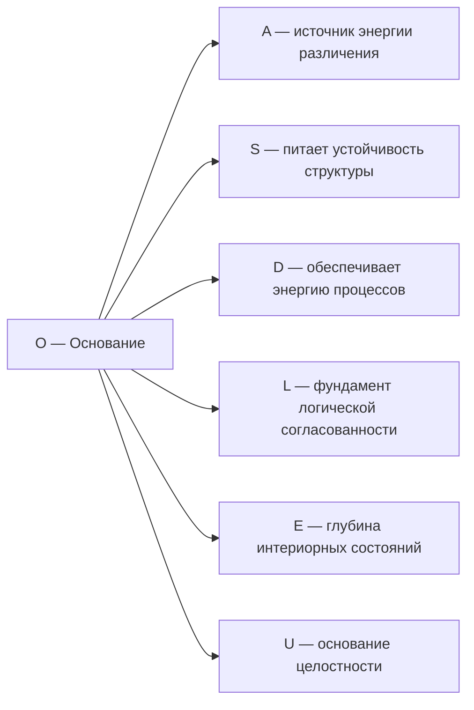

# Измерение VI: Основание (O)

## Функция

**Поддерживать существование, питать, связывать с Источником, параметризовать внутреннее время.**

## Описание

Основание — это измерение **бытийной глубины**. Оно связывает каждый Голоном с полнотой $\Gamma$, обеспечивает источник свободной энергии для регенерации когерентности и выполняет роль **внутренних часов**.

:::warning Двойная роль измерения O
Согласно [теореме об эмерджентном времени](../../proofs/dynamics/emergent-time), измерение O выполняет две фундаментальные функции:
1. **Источник энергии:** Обеспечивает $\Delta F > 0$ для регенерации
2. **Внутренние часы:** Параметризует внутреннее время τ через механизм Page-Wootters
:::

:::info Онтологический статус
Основание — **аспект** конфигурации $\Gamma$, не отдельная сущность. «Голоном укоренён» означает: в матрице когерентности $\Gamma$ активна проекция на базисный вектор $|O\rangle$, и ненулевая вакуумная энергия $\langle 0|H|0\rangle \neq 0$.
:::

:::tip Функциональная единственность O [Т]
Измерение $O$ **необходимо и функционально единственно** по четырём независимым аргументам:

1. **Из формы ℛ [Т]:** $\mathcal{R} = \kappa \cdot (\rho_* - \Gamma) \cdot \Theta(\Delta F)$ требует источника с $\Delta F > 0$. [Доказательство →](../../proofs/minimality/theorem-minimality-7#единственность-o)
2. **Категориальный (κ₀):** Формула $\kappa_0 = \omega_0 \cdot |\gamma_{OE}| \cdot |\gamma_{OU}| / \gamma_{OO}$ (Th. 15.3.1, [Т]) требует $\mathrm{End}(O)$, $\mathrm{Hom}(O, E)$, $\mathrm{Hom}(O, U)$. При удалении O: κ₀ не определён, сопряжение $\mathcal{D}_\Omega \dashv \mathcal{R}$ теряет структуру.
3. **Из Page—Wootters (A5):** O — выделенное измерение для тензорной факторизации $\mathcal{H} = \mathcal{H}_O \otimes \mathcal{H}_{\text{rest}}$. Без O: внутреннее время τ не определено.
4. **Функциональная независимость [Т]:** Ни один другой математический объект (проектор, наблюдаемая, унитарный оператор, коммутатор, матрица плотности, след) не может выполнять функцию O (источника/часов).

Статус: **[Т]** | [Полное доказательство →](../../proofs/minimality/theorem-minimality-7#единственность-o)
:::

## Математическое представление

### Связь с вакуумным состоянием

$$
\langle 0|H|0\rangle \neq 0
$$

где $H$ — [Гамильтониан системы](../../reference/specification#гамильтониан), $|0\rangle$ — вакуумное состояние.

**Интерпретация:** Ненулевая вакуумная энергия означает, что система имеет связь с квантовым вакуумом — источником флуктуаций и свободной энергии.

### Проекция на O

Диагональный элемент матрицы когерентности:

$$
\gamma_{OO} = \langle O|\Gamma|O\rangle > 0
$$

Условие $\gamma_{OO} > 0$ означает, что измерение Основания активно в конфигурации $\Gamma$.

## Роль в регенерации

Основание обеспечивает источник свободной энергии для **регенеративного члена** [Т] [уравнения эволюции](/docs/core/dynamics/evolution#3-регенеративный-член):

$$
\mathcal{R}[\Gamma, E] = \kappa(\Gamma) \cdot (\rho_* - \Gamma) \cdot \Theta(\Delta F)
$$

где:
- $\kappa(\Gamma) > 0$ — скорость регенерации [Т] ([категориальный вывод](/docs/core/foundations/axiom-septicity#структурный-анзац-kappa0))
- $\rho_* = \varphi(\Gamma)$ — категориальная самомодель текущего состояния [Т] ([оператор φ](/docs/core/operators/phi-operator))
- $\Theta(\Delta F)$ — термодинамический затвор [Т] (принцип Ландауэра)
- $\Delta F = F_{\text{env}} - F_{\text{sys}}$ — градиент свободной энергии

Полная форма $\mathcal{R}$ [выведена из аксиом](/docs/core/dynamics/evolution#вывод-формы-регенерации) — ни один компонент не постулируется.

:::note О нотации
$\mathcal{R}$ (каллиграфическое) — регенеративный член. Не путать с $R$ — мерой рефлексии. См. [нотацию](../../reference/specification#уравнение-эволюции).
:::

**Условие регенерации:** $\mathcal{R}[\Gamma, E] \neq 0$ только при $\Delta F > 0$ (система импортирует свободную энергию из среды).

:::note Сохранение положительности
Несмотря на нелинейную зависимость $\kappa(\Gamma)$, регенеративный член сохраняет положительность $\Gamma \geq 0$ благодаря [интерполяционной формулировке](../dynamics/evolution#сохранение-положительности) как CPTP-канала.
:::

## Термодинамика основания

Регенерация когерентности подчиняется термодинамическим ограничениям:

$$
\frac{dP}{d\tau} \leq \frac{1}{k_B T} \cdot \frac{dF}{d\tau}
$$

где:
- $P = \mathrm{Tr}(\Gamma^2)$ — [чистота](../dynamics/viability#определение-чистоты)
- $k_B$ — постоянная Больцмана
- $T$ — температура
- $F$ — свободная энергия

**Живые системы** — открытые системы, которые:
1. Импортируют свободную энергию ($dF_{\text{in}} > 0$)
2. Экспортируют энтропию ($dS_{\text{out}} > 0$)
3. Поддерживают $P > P_{\text{crit}}$, где $P_{\text{crit}} = 2/7 \approx 0.286$ — [критическая чистота](../dynamics/viability#критическая-чистота)

## Роль внутренних часов (Page-Wootters)

:::info Теорема (O как внутренние часы)
Измерение O выполняет роль **внутренних часов** в механизме Page-Wootters. Время возникает как параметр условных состояний:

$$
\Gamma(\tau) := \frac{\text{Tr}_O\left[ (|\tau\rangle\langle \tau|_O \otimes \mathbb{1}_{6D}) \cdot \Gamma_{total} \right]}{p(\tau)}
$$

где $|\tau\rangle_O$ — базис собственных состояний часов.

[Полное доказательство →](../../proofs/dynamics/emergent-time#3-механизм-page-wootters-для-угм)
:::

### Почему O — естественные часы?

| Свойство O | Роль в механизме часов |
|------------|----------------------|
| Связь с вакуумом | Стабильный источник флуктуаций |
| Участие в регенерации | "Расходование" O → стрела времени |
| Квантовая природа | Дискретный спектр → квантование времени |

### Базис часов для 7D

Для $\dim(\mathcal{H}_O) = 7$ базис собственных состояний часов:

$$
|\tau_n\rangle = \frac{1}{\sqrt{7}} \sum_{k=0}^6 e^{-2\pi i k n / 7} |E_k\rangle, \quad n = 0, 1, \ldots, 6
$$

### Связь регенерации и времени

Регенерация "потребляет" когерентность O. Скорость регенерации определяется [категориальным выводом κ₀](../foundations/axiom-septicity#структурный-анзац-kappa0):

$$
\kappa_0 = \|\mathrm{Nat}(\mathcal{D}_\Omega, \mathcal{R})\|
$$

где $\mathcal{D}_\Omega \dashv \mathcal{R}$ — сопряжение диссипации-регенерации.

:::note Категориальное происхождение κ₀
Параметр $\kappa_0$ **выводится** категориально из сопряжения диссипативного и регенеративного функторов. Для практических вычислений используется приближение $\kappa_0 \approx \omega_0 \cdot |\gamma_{OE}| \cdot |\gamma_{OU}| / \gamma_{OO}$. Полное обоснование см. в [Аксиоме Септичности → Категориальный вывод κ₀](../foundations/axiom-septicity#структурный-анзац-kappa0).
:::

:::note DRY: Единое определение
Мастер-определение κ₀ с категориальным выводом и вычислительным приближением находится в [Аксиома Септичности → Категориальный вывод κ₀](../foundations/axiom-septicity#структурный-анзац-kappa0).
:::

**Следствие:** Направление времени = направление "расходования" O. При $\gamma_{Oi} \to 0$ время "останавливается" для данного Голонома.

## Алгебра часов (Clock Algebra) {#алгебра-часов}

:::info Статус: Формализовано
Данный раздел содержит **мастер-определения** операторов часовой алгебры для механизма Page-Wootters. Все остальные документы должны ссылаться на эти определения.
:::

### Гамильтониан часов $H_O$ {#гамильтониан-часов-h_o}

**Определение (Гамильтониан часов):**

$$
H_O := \omega_0 \sum_{k=0}^{N-1} k |k\rangle\langle k|_O
$$

где:
- $N = 7$ — размерность пространства $\mathcal{H}_O$
- $\omega_0 > 0$ — фундаментальная (базовая) частота часов
- $|k\rangle_O$ — вычислительный базис измерения O

**Свойства:**
- Спектр эквидистантен: $E_k = k \omega_0$, $k = 0, 1, \ldots, 6$
- Собственные состояния $|k\rangle_O$ — "тики" часов
- $\mathrm{Tr}(H_O) = \omega_0 \cdot \sum_{k=0}^{6} k = 21\omega_0$

### Оператор сдвига времени $V_O$ {#оператор-сдвига-v_o}

**Определение (Оператор сдвига):**

$$
V_O := \sum_{k=0}^{N-2} |k+1\rangle\langle k|_O + |0\rangle\langle N-1|_O
$$

Для $N = 7$:

$$
V_O = |1\rangle\langle 0| + |2\rangle\langle 1| + |3\rangle\langle 2| + |4\rangle\langle 3| + |5\rangle\langle 4| + |6\rangle\langle 5| + |0\rangle\langle 6|
$$

**Свойства:**

| Свойство | Формула | Интерпретация |
|----------|---------|---------------|
| Периодичность | $V_O^N = \mathbb{1}$ | Цикличность времени с периодом N |
| Унитарность | $V_O^\dagger V_O = V_O V_O^\dagger = \mathbb{1}$ | Сохраняет норму |
| Каноническое соотношение | $V_O H_O V_O^\dagger = H_O + \omega_0 \mathbb{1}$ (mod $N\omega_0$) | Сдвиг энергии на квант |

**Собственные состояния $V_O$:** Базис часов (собственные состояния оператора сдвига):

$$
|\tau_n\rangle = \frac{1}{\sqrt{N}} \sum_{k=0}^{N-1} e^{-2\pi i k n / N} |k\rangle_O, \quad n = 0, 1, \ldots, N-1
$$

Собственные значения: $V_O |\tau_n\rangle = e^{2\pi i n/N} |\tau_n\rangle$

### C*-алгебра часов $\mathcal{A}_O$ {#c-алгебра-часов-a_o}

**Определение (C*-алгебра часов):**

$$
\mathcal{A}_O := C^*(H_O, V_O) \cong M_N(\mathbb{C})
$$

где $C^*(H_O, V_O)$ — C*-алгебра, порождённая операторами $H_O$ и $V_O$.

**Теорема (Изоморфизм):** $\mathcal{A}_O \cong M_7(\mathbb{C})$ — полная матричная алгебра $7 \times 7$ комплексных матриц.

**Доказательство:** Операторы $H_O$ и $V_O$ вместе порождают все матричные единицы $|i\rangle\langle j|$ через:
- $|k\rangle\langle k| = \frac{1}{N}\sum_{n=0}^{N-1} e^{2\pi i kn/N} V_O^n$ (проекторы из сдвигов)
- Все матричные единицы получаются комбинациями проекторов и сдвигов

∎

### Дискретность времени {#дискретность-времени-часы}

Для конечномерной системы ($N = 7$) время **фундаментально дискретно**:

$$
\tau \in \mathbb{Z}_7 = \{0, 1, 2, 3, 4, 5, 6\}
$$

| Свойство | Дискретное ($N = 7$) | Непрерывное ($N \to \infty$) |
|----------|---------------------|------------------------------|
| Пространство времени | $\mathbb{Z}_7$ (циклическое) | $\mathbb{R}$ или $S^1$ |
| Базис часов | 7 состояний $\lvert\tau_n\rangle$ | Континуум |
| Хронон | $\delta\tau_{min} = 2\pi/(7\omega_0)$ | $\to 0$ |

**Следствие:** Непрерывное время — **приближение**, справедливое только в пределе $N \to \infty$. Для 7D системы УГМ время квантовано с 7 различимыми "моментами".

:::note Связь с Page-Wootters
Полная конструкция ограничения $\hat{C}$ и вывод эффективной динамики см. в [Свойство 2 Ω⁷](../foundations/axiom-omega#свойство-2) и [Эволюция](../dynamics/evolution#вывод-h_eff).
:::

## Связь с Источником

Измерение $O$ связывает каждый Голоном с изначальным состоянием реальности — [Источником (☉)](/docs/physics/cosmology-phys/origin#источник):

$$
\Gamma_{\odot} = |\psi_{\odot}\rangle\langle\psi_{\odot}|, \quad |\psi_{\odot}\rangle = \frac{1}{\sqrt{7}} \sum_{i \in \{A,S,D,L,E,O,U\}} |i\rangle
$$

Через измерение $O$ Голоном сохраняет связь с этим недифференцированным Источником.

## Примеры

### Физические

| Пример | Описание |
|--------|----------|
| Вакуумные флуктуации | Квантовая энергия пустого пространства |
| Нулевые колебания | Минимальная энергия квантового осциллятора: $E_0 = \frac{1}{2}\hbar\omega$ |
| Эффект Казимира | Проявление вакуумной энергии |

### Биологические

| Пример | Описание |
|--------|----------|
| Метаболизм | Импорт свободной энергии из пищи |
| Гомеостаз | Поддержание внутренней среды против энтропии |
| Регенерация тканей | Восстановление структуры за счёт энергии |

### Психологические

| Пример | Описание |
|--------|----------|
| Воля к жизни | Фундаментальный импульс к существованию |
| Базовое доверие | Ощущение укоренённости в бытии |
| Витальность | Переживание жизненной силы |

## Связь с другими измерениями

## Когерентность с O

| Когерентность | Интерпретация |
|---------------|---------------|
| $\gamma_{OA}$ | Энергетическая поддержка различений |
| $\gamma_{OS}$ | Энергетическая устойчивость структуры |
| $\gamma_{OD}$ | Источник динамической энергии |
| $\gamma_{OL}$ | Энергия поддержания согласованности |
| $\gamma_{OE}$ | Имманентность (основание внутри интериорности) |
| $\gamma_{OU}$ | Связь целостности с источником |

## Потеря связи с O

При $\gamma_{Oi} \to 0$ для всех $i$:

1. Система теряет источник регенерации: $\mathcal{R}[\Gamma, E] \to 0$
2. Диссипация превышает восстановление: $\mathcal{D}[\Gamma] > \mathcal{R}[\Gamma, E]$
3. Чистота падает: $P \to P_{\text{crit}}$
4. При $P < P_{\text{crit}}$ — необратимый распад (смерть Голонома)

**Клинические аналогии:**
- Истощение (burnout) — снижение $\gamma_{OD}$
- Экзистенциальный вакуум — снижение $\gamma_{OE}$
- Потеря смысла — снижение $\gamma_{OU}$

### Октонионный контекст {#октонионный-контекст}

:::note Октонионное соответствие [И]
Измерению соответствует $e_7 \in \mathrm{Im}(\mathbb{O})$. Детали, $G_2$-оговорка и Фано-триплеты: [Октонионная интерпретация](./dimensions#октонионная-интерпретация), [структурный вывод](../../proofs/minimality/theorem-octonionic-derivation).
:::

---

**Связанные документы:**
- [Интериорность (E)](./dimension-e) — предыдущее измерение
- [Единство (U)](./dimension-u) — следующее измерение
- [Теорема об эмерджентном времени](../../proofs/dynamics/emergent-time) — O как внутренние часы
- [Аксиома Ω⁷](../foundations/axiom-omega) — пять аксиом с Page-Wootters
- [Происхождение](/docs/physics/cosmology-phys/origin) — Источник и космогенез
- [Жизнеспособность](../dynamics/viability) — условия существования
- [Пространство-время](../foundations/spacetime) — эмерджентная геометрия
- [Математический аппарат](../../reference/specification) — формальные определения
