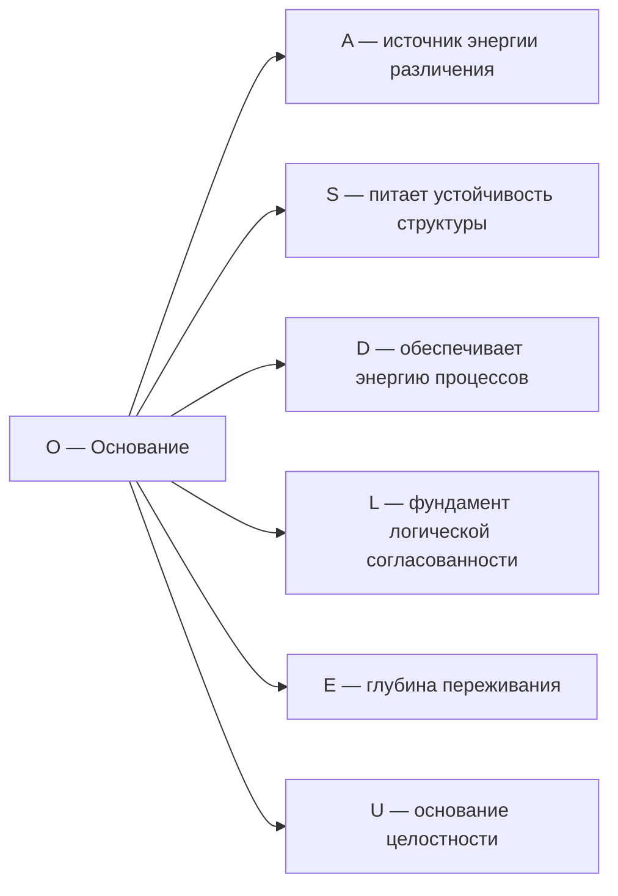

# Измерение VI: Основание (O)

## Функция

**Поддерживать существование, питать, связывать с Источником.**

## Описание

Основание — это измерение **бытийной глубины**. Оно связывает каждый Голоном с полнотой $\Gamma$ и обеспечивает источник свободной энергии для регенерации когерентности.

:::info Онтологический статус
Основание — **аспект** конфигурации $\Gamma$, не отдельная сущность. «Голоном укоренён» означает: в матрице когерентности $\Gamma$ активна проекция на базисный вектор $|O\rangle$, и ненулевая вакуумная энергия $\langle 0|H|0\rangle \neq 0$.
:::

:::warning Связь с квантовым основанием
При удалении измерения $O$ нарушается **(QG)** — нет источника регенерации, нет восстановления когерентности. Без $O$ система не может противостоять декогеренции и неизбежно распадается. См. [доказательство](../../proofs/theorem-minimality-7#случай-n--4-удаление-основания-o).
:::

## Математическое представление

### Связь с вакуумным состоянием

$$
\langle 0|H|0\rangle \neq 0
$$

где $H$ — [Гамильтониан системы](../../formal/specification#гамильтониан), $|0\rangle$ — вакуумное состояние.

**Интерпретация:** Ненулевая вакуумная энергия означает, что система имеет связь с квантовым вакуумом — источником флуктуаций и свободной энергии.

### Проекция на O

Диагональный элемент матрицы когерентности:

$$
\gamma_{OO} = \langle O|\Gamma|O\rangle > 0
$$

Условие $\gamma_{OO} > 0$ означает, что измерение Основания активно в конфигурации $\Gamma$.

## Роль в регенерации

Основание обеспечивает источник свободной энергии для **регенеративного члена** [уравнения эволюции](../../formal/specification#уравнение-эволюции):

$$
\mathcal{R}[\Gamma, E] = \kappa \cdot (\Gamma_{\text{target}} - \Gamma) \cdot \Theta(\Delta F)
$$

где:
- $\kappa > 0$ — скорость регенерации
- $\Gamma_{\text{target}}$ — целевая конфигурация (аттрактор)
- $\Theta$ — функция Хевисайда
- $\Delta F = F_{\text{env}} - F_{\text{sys}}$ — градиент свободной энергии между средой и системой

:::note О нотации
$\mathcal{R}$ (каллиграфическое) — регенеративный член. Не путать с $R$ — мерой рефлексии. См. [нотацию](../../formal/specification#уравнение-эволюции).
:::

**Условие регенерации:** $\mathcal{R}[\Gamma, E] \neq 0$ только при $\Delta F > 0$ (система импортирует свободную энергию из среды).

## Термодинамика основания

Регенерация когерентности подчиняется термодинамическим ограничениям:

$$
\frac{dP}{dt} \leq \frac{1}{k_B T} \cdot \frac{dF}{dt}
$$

где:
- $P = \mathrm{Tr}(\Gamma^2)$ — [чистота](../dynamics/viability#определение-чистоты)
- $k_B$ — постоянная Больцмана
- $T$ — температура
- $F$ — свободная энергия

**Живые системы** — открытые системы, которые:
1. Импортируют свободную энергию ($dF_{\text{in}} > 0$)
2. Экспортируют энтропию ($dS_{\text{out}} > 0$)
3. Поддерживают $P > P_{\text{critical}}$, где $P_{\text{critical}} \approx 0.3$ — [критическая чистота](../dynamics/viability#критическая-чистота)

## Связь с Источником

Измерение $O$ связывает каждый Голоном с изначальным состоянием реальности — [Источником (☉)](../cosmology/origin#источник):

$$
\Gamma_{\odot} = |\psi_{\odot}\rangle\langle\psi_{\odot}|, \quad |\psi_{\odot}\rangle = \frac{1}{\sqrt{7}} \sum_{i \in \{A,S,D,L,E,O,U\}} |i\rangle
$$

Через измерение $O$ Голоном сохраняет связь с этим недифференцированным Источником.

## Примеры

### Физические

| Пример | Описание |
|--------|----------|
| Вакуумные флуктуации | Квантовая энергия пустого пространства |
| Нулевые колебания | Минимальная энергия квантового осциллятора: $E_0 = \frac{1}{2}\hbar\omega$ |
| Эффект Казимира | Проявление вакуумной энергии |

### Биологические

| Пример | Описание |
|--------|----------|
| Метаболизм | Импорт свободной энергии из пищи |
| Гомеостаз | Поддержание внутренней среды против энтропии |
| Регенерация тканей | Восстановление структуры за счёт энергии |

### Психологические

| Пример | Описание |
|--------|----------|
| Воля к жизни | Фундаментальный импульс к существованию |
| Базовое доверие | Ощущение укоренённости в бытии |
| Витальность | Переживание жизненной силы |

## Связь с другими измерениями

## Когерентность с O

| Когерентность | Интерпретация |
|---------------|---------------|
| $\gamma_{OA}$ | Энергетическая поддержка различений |
| $\gamma_{OS}$ | Энергетическая устойчивость структуры |
| $\gamma_{OD}$ | Источник динамической энергии |
| $\gamma_{OL}$ | Энергия поддержания согласованности |
| $\gamma_{OE}$ | Глубина и интенсивность переживания |
| $\gamma_{OU}$ | Связь целостности с источником |

## Потеря связи с O

При $\gamma_{Oi} \to 0$ для всех $i$:

1. Система теряет источник регенерации: $\mathcal{R}[\Gamma, E] \to 0$
2. Диссипация превышает восстановление: $\mathcal{D}[\Gamma] > \mathcal{R}[\Gamma, E]$
3. Чистота падает: $P \to P_{\text{critical}}$
4. При $P < P_{\text{critical}}$ — необратимый распад (смерть Голонома)

**Клинические аналогии:**
- Истощение (burnout) — снижение $\gamma_{OD}$
- Экзистенциальный вакуум — снижение $\gamma_{OE}$
- Потеря смысла — снижение $\gamma_{OU}$

---

**Связанные документы:**
- [Опыт (E)](./dimension-e) — предыдущее измерение
- [Единство (U)](./dimension-u) — следующее измерение
- [Происхождение](../cosmology/origin) — Источник и космогенез
- [Жизнеспособность](../dynamics/viability) — условия существования
- [Математический аппарат](../../formal/specification) — формальные определения
