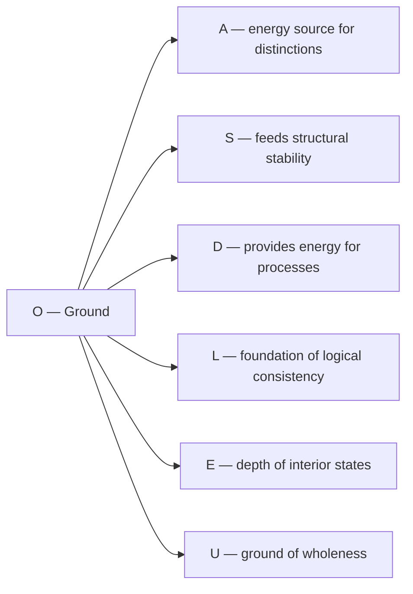

# Dimension VI: Ground (O)

## What this chapter is about

This chapter is devoted to the sixth dimension of the Holon — the **Ground**. You will learn:

- Why every system must have a **source of energy**, and how philosophers from Aristotle to Heidegger searched for "the foundation of everything";
- How one and the same dimension performs **two functions** simultaneously — feeding the system and setting its internal clock;
- What the **Page–Wootters** mechanism is and why time is not a backdrop but a property of the Holon itself;
- How the regeneration formula $\kappa_0 = \omega_0 \cdot |\gamma_{OE}| \cdot |\gamma_{OU}| / \gamma_{OO}$ ties three dimensions into a single node;
- What happens when **connection with the Ground is lost** — from physical exhaustion to existential crisis.

:::info Who this chapter is for
If you are reading about UHM for the first time — start with the [overview of dimensions](./dimensions). If you are already familiar with the seven dimensions and want to understand where the Holon gets its energy and time — you are in the right place.
:::

## Function

**To sustain existence, to feed, to connect with the Source, to parameterise internal time.**

## Historical precursor {#историческая-предтеча}

The question "what holds everything together?" has arisen in all cultures and epochs.

**Aristotle** (4th century BCE) in the *Metaphysics* introduced the concept of the **first cause** (causa prima) — that which exists "in its own right" and gives existence to everything else. Without a first cause the chain of causes recedes to infinity and nothing has a foundation. Aristotle insisted: there must be something that **moves** without being moved — the "unmoved mover". In UHM this role is assigned to dimension $O$: it provides free energy ($\Delta F > 0$) without "spending" itself completely.

**Martin Heidegger** (1927) in *Being and Time* distinguished **beings** (what is) from **Being** (that *by virtue of which* beings are). Being is not yet another thing among things, but the **ground** of all things. Heidegger also showed that being and time are inseparable: to be means to be *in* time, and the understanding of being is always temporal. In UHM this connection is realised literally: dimension $O$ is simultaneously the source of energy *and* the internal clock.

**Don Page and William Wootters** (1983) proposed a radical solution to the "problem of time" in quantum gravity. The universe as a whole is described by a stationary state ($H|\Psi\rangle = 0$) — there is **no** external time in it. But if one subsystem is singled out as the "clock" and the rest is viewed *conditionally* (via partial trace) — dynamics emerges that is indistinguishable from ordinary quantum-mechanical motion. Time is **not a backdrop** but a parameter of the correlations between the clock and the observer. In UHM the role of the clock is played precisely by dimension $O$.

**Ludwig Boltzmann** (19th century) showed that all processes in nature are driven by the **free-energy gradient** $\Delta F$. Without free energy there is no work, no order, no life. The second law of thermodynamics — the arrow of time — points from order to chaos. Living systems temporarily **reverse** this arrow by importing free energy from outside. In UHM this is formalised through the regenerative term $\mathcal{R}$, fed by dimension $O$.

In UHM theory all these ideas converge in a single dimension: **Ground ($O$)** — Aristotle's first cause, Heidegger's Being-as-ground, the Page–Wootters clock, and Boltzmann's source of free energy.

## Description

The Ground is the dimension of **ontological depth**. It connects each Holon to the fullness of $\Gamma$, provides the source of free energy for the regeneration of coherence, and serves as the **internal clock**.

### Intuitive explanation {#интуитивное-объяснение}

Imagine a tree. Its crown is the visible part: leaves (distinctions, $A$), branches (structure, $S$), growth (dynamics, $D$). But all of this is nourished through the **roots** — the invisible underground part that draws water and minerals from the soil. Dimension $O$ is the roots of the Holon.

But roots do something else: they set the **rhythm of growth**. In spring the roots begin actively absorbing water — and the tree "awakens". In autumn root activity decreases — and the tree "falls asleep". The roots are both the source of nourishment and the internal clock. In exactly the same way, dimension $O$ simultaneously provides energy ($\Delta F > 0$) and parameterises internal time ($\tau$).

:::warning Dual role of dimension O
According to the [emergent-time theorem](../../proofs/dynamics/emergent-time), dimension O performs two fundamental functions:
1. **Energy source:** Provides $\Delta F > 0$ for regeneration
2. **Internal clock:** Parameterises internal time τ via the Page–Wootters mechanism
:::

### Why one dimension — two functions? {#двойная-роль}

This is not a coincidence but a mathematical necessity. Consider the regeneration formula:

$$
\kappa_0 = \omega_0 \cdot \frac{|\gamma_{OE}| \cdot |\gamma_{OU}|}{\gamma_{OO}}
$$

In this formula $\omega_0$ is the fundamental clock frequency and $\gamma_{OO}$ is the population of the Ground. The numerator contains the coherences of $O$ with Interiority ($E$) and Unity ($U$): regeneration requires that the Ground be **connected** to the inner world and to the integrity of the system. If the "clock" function were assigned to a separate dimension, that dimension would not be connected to $E$ and $U$ in the required way — the formula $\kappa_0$ would lose its structure. If the "energy source" function were separated out — $\omega_0$ would disappear.

**The dual role of O is a consequence of the $\kappa_0$ formula:** the only way to provide both the frequency ($\omega_0$) and the energetic connections ($|\gamma_{OE}|$, $|\gamma_{OU}|$) is through one and the same dimension.

:::info Ontological status
The Ground is an **aspect** of configuration $\Gamma$, not a separate entity. "The Holon is grounded" means: in the coherence matrix $\Gamma$ the projection onto the basis vector $|O\rangle$ is active, and the vacuum energy is non-zero: $\langle 0|H|0\rangle \neq 0$.
:::

:::tip Functional uniqueness of O [Т]
Dimension $O$ is **necessary and functionally unique** by four independent arguments:

1. **From the form of ℛ [Т]:** $\mathcal{R} = \kappa \cdot (\rho_* - \Gamma) \cdot g_V(P)$ requires a source with $\Delta F > 0$ for $g_V > 0$. [Proof →](../../proofs/minimality/theorem-minimality-7#единственность-o)
2. **Categorical (κ₀):** The formula $\kappa_0 = \omega_0 \cdot |\gamma_{OE}| \cdot |\gamma_{OU}| / \gamma_{OO}$ (Th. 15.3.1, [Т]) requires $\mathrm{End}(O)$, $\mathrm{Hom}(O, E)$, $\mathrm{Hom}(O, U)$. On removal of O: κ₀ is undefined, the adjunction $\mathcal{D}_\Omega \dashv \mathcal{R}$ loses its structure.
3. **From Page–Wootters (A5):** O is the distinguished dimension for the tensor factorisation $\mathcal{H} = \mathcal{H}_O \otimes \mathcal{H}_{\text{rest}}$. Without O: internal time τ is undefined.
4. **Functional independence [Т]:** No other mathematical object (projector, observable, unitary operator, commutator, density matrix, trace) can perform the function of O (source/clock).

Status: **[Т]** | [Full proof →](../../proofs/minimality/theorem-minimality-7#единственность-o)
:::

## Mathematical representation

### Population of O {#населённость-o}

The diagonal element of the coherence matrix:

$$
\gamma_{OO} = \langle O|\Gamma|O\rangle > 0
$$

The condition $\gamma_{OO} > 0$ means that the Ground dimension is active in configuration $\Gamma$. The population $\gamma_{OO}$ is the "root reserve": the more resources invested in the Ground, the more stable the system.

**Typical values:**

| System | $\gamma_{OO}$ | Interpretation |
|--------|---------------|----------------|
| Vacuum fluctuations | $\sim 1/7$ | Uniform distribution |
| Healthy organism | $\sim 0.12$ | Stable energy reserve |
| Depleted system | $\sim 0.05$ | Ground deficit |
| Meditative state | $\sim 0.20$ | Enhanced connection with the ground |

### Stress in the O channel

$$
\sigma_O = \mathrm{clamp}(1 - 7\gamma_{OO},\; 0,\; 1) \quad \text{[Т] (T-92)}
$$

- $\sigma_O = 0$: ground is provided ($\gamma_{OO} \geq 1/7$)
- $\sigma_O = 1$: critical ground deficit ($\gamma_{OO} \to 0$) — the system loses its energy source

### Connection with the vacuum state

$$
\langle 0|H|0\rangle \neq 0
$$

where $H$ is the [system Hamiltonian](../../reference/specification#гамильтониан) and $|0\rangle$ is the vacuum state.

**Interpretation:** Non-zero vacuum energy means that the system has a connection with the quantum vacuum — the source of fluctuations and free energy. Even "empty" space contains energy (confirmed experimentally via the Casimir effect). Dimension $O$ formalises this connection.

## Role in regeneration {#роль-в-регенерации}

The Ground provides the source of free energy for the **regenerative term** [Т] of the [evolution equation](/docs/core/dynamics/evolution#3-регенеративный-член):

$$
\mathcal{R}[\Gamma, E] = \kappa(\Gamma) \cdot (\rho_* - \Gamma) \cdot g_V(P)
$$

where:
- $\kappa(\Gamma) > 0$ — regeneration rate [Т] ([categorical derivation](/docs/core/foundations/axiom-septicity#структурный-анзац-kappa0))
- $\rho_* = \varphi(\Gamma)$ — categorical self-model of the current state [Т] ([operator φ](/docs/core/operators/phi-operator))
- $g_V(P) = \mathrm{clamp}\!\bigl(\frac{P - P_{\mathrm{crit}}}{P_{\mathrm{opt}} - P_{\mathrm{crit}}}\bigr)$ — V-preservation gate [Т] ([derivation](/docs/core/dynamics/evolution#теорема-v-preservation-gate))
- $\Delta F = F_{\text{env}} - F_{\text{sys}}$ — free-energy gradient (necessary condition: $g_V > 0 \Rightarrow \Delta F > 0$)

The full form of $\mathcal{R}$ is [derived from axioms](/docs/core/dynamics/evolution#вывод-формы-регенерации) — no component is postulated.

**Intuitive explanation.** Imagine a campfire. It burns (the system lives) as long as wood is added ($\Delta F > 0$). The rate of burning ($\kappa$) depends not only on the amount of wood, but also on the **connection** of the fire with the air (coherence $\gamma_{OE}$) and the structural integrity of the fire (coherence $\gamma_{OU}$). If wood is available but there is no draught (air is cut off) — the fire goes out. The formula $\kappa_0$ formalises precisely this.

:::note On notation
$\mathcal{R}$ (calligraphic) — the regenerative term. Not to be confused with $R$ — the reflection measure. See [notation](../../reference/specification#уравнение-эволюции).
:::

**Regeneration condition:** $\mathcal{R}[\Gamma, E] \neq 0$ only when $\Delta F > 0$ (the system imports free energy from the environment).

:::note Preservation of positivity
Despite the nonlinear dependence of $\kappa(\Gamma)$, the regenerative term preserves the positivity $\Gamma \geq 0$ through the [interpolation formulation](../dynamics/evolution#сохранение-положительности) as a CPTP channel.
:::

## Thermodynamics of the Ground

Regeneration of coherence obeys thermodynamic constraints:

$$
\frac{dP}{d\tau} \leq \frac{1}{k_B T} \cdot \frac{dF}{d\tau}
$$

where:
- $P = \mathrm{Tr}(\Gamma^2)$ — [purity](../dynamics/viability#определение-чистоты)
- $k_B$ — Boltzmann constant
- $T$ — temperature
- $F$ — free energy

**Living systems** are open systems that:
1. Import free energy ($dF_{\text{in}} > 0$)
2. Export entropy ($dS_{\text{out}} > 0$)
3. Maintain $P > P_{\text{crit}}$, where $P_{\text{crit}} = 2/7 \approx 0.286$ — [critical purity](../dynamics/viability#критическая-чистота)

**Example.** A person consumes food (import of free energy), dissipates heat and waste (export of entropy), and maintains the orderliness of the organism ($P > 2/7$). If eating stops — $\Delta F \to 0$, regeneration halts, $P$ falls below $P_{\text{crit}}$ — irreversible collapse.

## Role as internal clock (Page–Wootters) {#роль-часов}

:::info Theorem (O as internal clock)
Dimension O serves as the **internal clock** in the Page–Wootters mechanism. Time emerges as the parameter of conditional states:

$$
\Gamma(\tau) := \frac{\text{Tr}_O\left[ (|\tau\rangle\langle \tau|_O \otimes \mathbb{1}_{6D}) \cdot \Gamma_{total} \right]}{p(\tau)}
$$

where $|\tau\rangle_O$ is the basis of clock eigenstates.

[Full proof →](../../proofs/dynamics/emergent-time#3-механизм-page-wootters-для-угм)
:::

### Intuitive explanation of the clock mechanism {#интуиция-часов}

Imagine being locked in a room **with no windows and no clock**. You have no external time. But if the room contains a pendulum — you can **determine time through the pendulum**: "5 swings have passed". Time for you is not something external, but a parameter of the correlation between the pendulum and your state.

The Page–Wootters mechanism works in exactly the same way. The universe as a whole is "a room without a clock" (global Hamiltonian $H|\Psi\rangle = 0$, no external time). But inside there is a clock subsystem (dimension $O$) and the rest of the system ($\bar{O}$). Time $\tau$ is the parameter of the correlations between $O$ and $\bar{O}$. When we say "the Holon at moment $\tau$", we mean: "the state of the Holon given that the clock reads $\tau$".

### Why is O the natural clock?

| Property of O | Role in the clock mechanism |
|---------------|-----------------------------|
| Connection with the vacuum | Stable source of fluctuations — "the pendulum does not stop" |
| Participation in regeneration | "Expenditure" of O → arrow of time (irreversibility) |
| Quantum nature | Discrete spectrum → quantisation of time |
| Connection with all dimensions | The clock "sees" the whole system through $\gamma_{Oi}$ |

### Clock basis for 7D

For $\dim(\mathcal{H}_O) = 7$ the basis of clock eigenstates is:

$$
|\tau_n\rangle = \frac{1}{\sqrt{7}} \sum_{k=0}^6 e^{-2\pi i k n / 7} |E_k\rangle, \quad n = 0, 1, \ldots, 6
$$

This is a discrete Fourier transform: states $|E_k\rangle$ are clock "ticks" with a definite energy, and $|\tau_n\rangle$ are states with a definite "time". Energy and time are dual quantities (as in ordinary quantum mechanics) and cannot be known simultaneously with arbitrary precision.

### Connection between regeneration and time

Regeneration "consumes" the coherence of O. The regeneration rate is determined by the [categorical derivation of κ₀](../foundations/axiom-septicity#структурный-анзац-kappa0):

$$
\kappa_0 = \|\mathrm{Nat}(\mathcal{D}_\Omega, \mathcal{R})\|
$$

where $\mathcal{D}_\Omega \dashv \mathcal{R}$ is the dissipation-regeneration adjunction.

:::note Categorical origin of κ₀
The parameter $\kappa_0$ is **derived** categorically from the adjunction of the dissipative and regenerative functors. The exact formula **[Т]** (T-88): $\kappa_0 = \omega_0 \cdot |\gamma_{OE}| \cdot |\gamma_{OU}| / \gamma_{OO}$ — unique via the Čencov–Petz theorem. Full justification in [Axiom of Septicity → Categorical derivation of κ₀](../foundations/axiom-septicity#структурный-анзац-kappa0).
:::

:::note DRY: Single definition
The master definition of κ₀ with categorical derivation and computational approximation is in [Axiom of Septicity → Categorical derivation of κ₀](../foundations/axiom-septicity#структурный-анзац-kappa0).
:::

**Corollary:** The direction of time = the direction of "expenditure" of O. When $\gamma_{Oi} \to 0$ time "stops" for the given Holon. This is not a metaphor: if all coherences of $O$ with other dimensions go to zero, the conditional states $\Gamma(\tau)$ cease to depend on $\tau$ — dynamics freezes.

## Clock Algebra {#алгебра-часов}

:::info Status: Formalised
This section contains the **master definitions** of clock-algebra operators for the Page–Wootters mechanism. All other documents should reference these definitions.
:::

### Clock Hamiltonian $H_O$ {#гамильтониан-часов-h_o}

**Definition (Clock Hamiltonian):**

$$
H_O := \omega_0 \sum_{k=0}^{N-1} k |k\rangle\langle k|_O
$$

where:
- $N = 7$ — dimension of the space $\mathcal{H}_O$
- $\omega_0 > 0$ — fundamental (base) clock frequency
- $|k\rangle_O$ — computational basis of dimension O

**Intuitive explanation.** $H_O$ is the Holon's "metronome". It defines 7 "positions" of the metronome ($|0\rangle, |1\rangle, \ldots, |6\rangle$), each with energy $E_k = k\omega_0$. Just as a metronome counts beats in music, $H_O$ counts the "ticks" of internal time. The frequency $\omega_0$ is the metronome's "tempo".

**Properties:**
- The spectrum is equidistant: $E_k = k \omega_0$, $k = 0, 1, \ldots, 6$
- Eigenstates $|k\rangle_O$ are clock "ticks"
- $\mathrm{Tr}(H_O) = \omega_0 \cdot \sum_{k=0}^{6} k = 21\omega_0$

### Time-shift operator $V_O$ {#оператор-сдвига-v_o}

**Definition (Shift operator):**

$$
V_O := \sum_{k=0}^{N-2} |k+1\rangle\langle k|_O + |0\rangle\langle N-1|_O
$$

For $N = 7$:

$$
V_O = |1\rangle\langle 0| + |2\rangle\langle 1| + |3\rangle\langle 2| + |4\rangle\langle 3| + |5\rangle\langle 4| + |6\rangle\langle 5| + |0\rangle\langle 6|
$$

**Intuitive explanation.** $V_O$ is the "tick-tock": it moves the clock from one state to the next. After $|0\rangle$ comes $|1\rangle$, after $|1\rangle$ — $|2\rangle$, and so on. And after $|6\rangle$ — back to $|0\rangle$ (the cycle closes). This is like a clock hand that, upon reaching 12, returns to 1. Each application of $V_O$ is one "tick" of time.

**Properties:**

| Property | Formula | Interpretation |
|----------|---------|----------------|
| Periodicity | $V_O^N = \mathbb{1}$ | Cyclicity of time with period N |
| Unitarity | $V_O^\dagger V_O = V_O V_O^\dagger = \mathbb{1}$ | Preserves norm |
| Canonical relation | $V_O H_O V_O^\dagger = H_O + \omega_0 \mathbb{1}$ (mod $N\omega_0$) | Energy shift by one quantum |

**Eigenstates of $V_O$:** Clock basis (eigenstates of the shift operator):

$$
|\tau_n\rangle = \frac{1}{\sqrt{N}} \sum_{k=0}^{N-1} e^{-2\pi i k n / N} |k\rangle_O, \quad n = 0, 1, \ldots, N-1
$$

Eigenvalues: $V_O |\tau_n\rangle = e^{2\pi i n/N} |\tau_n\rangle$

### C*-algebra of the clock $\mathcal{A}_O$ {#c-алгебра-часов-a_o}

**Definition (C*-algebra of the clock):**

$$
\mathcal{A}_O := C^*(H_O, V_O) \cong M_N(\mathbb{C})
$$

where $C^*(H_O, V_O)$ is the C*-algebra generated by operators $H_O$ and $V_O$.

**Theorem (Isomorphism):** $\mathcal{A}_O \cong M_7(\mathbb{C})$ — the full matrix algebra of $7 \times 7$ complex matrices.

**Intuitive explanation.** From the metronome ($H_O$) and the tick-tock ($V_O$) one can "assemble" any operator on the clock space. This is like a Lego set: two basic pieces are enough to build everything. Mathematically: $H_O$ and $V_O$ generate **all** $7 \times 7$ matrices, so the clock algebra is maximally rich.

**Proof:** The operators $H_O$ and $V_O$ together generate all matrix units $|i\rangle\langle j|$ via:
- $|k\rangle\langle k| = \frac{1}{N}\sum_{n=0}^{N-1} e^{2\pi i kn/N} V_O^n$ (projectors from shifts)
- All matrix units are obtained from combinations of projectors and shifts

∎

### Discreteness of time {#дискретность-времени-часы}

For a finite-dimensional system ($N = 7$) time is **fundamentally discrete**:

$$
\tau \in \mathbb{Z}_7 = \{0, 1, 2, 3, 4, 5, 6\}
$$

| Property | Discrete ($N = 7$) | Continuous ($N \to \infty$) |
|----------|--------------------|-----------------------------|
| Time space | $\mathbb{Z}_7$ (cyclic) | $\mathbb{R}$ or $S^1$ |
| Clock basis | 7 states $\lvert\tau_n\rangle$ | Continuum |
| Chronon | $\delta\tau_{min} = 2\pi/(7\omega_0)$ | $\to 0$ |

**Corollary:** Continuous time is an **approximation**, valid only in the limit $N \to \infty$. For the 7D UHM system, time is quantised with 7 distinguishable "moments". This is like frames in a film: with a sufficient number of frames per second motion appears continuous, but in reality it is discrete.

:::note Connection with Page–Wootters
For the full construction of the constraint $\hat{C}$ and derivation of the effective dynamics, see [Property 2 of Ω⁷](../foundations/axiom-omega#свойство-2) and [Evolution](../dynamics/evolution#вывод-h_eff).
:::

## The κ₀ formula: three dimensions in one node {#формула-kappa0}

The regeneration formula is one of the central formulas in UHM:

$$
\kappa_0 = \omega_0 \cdot \frac{|\gamma_{OE}| \cdot |\gamma_{OU}|}{\gamma_{OO}}
$$

Let us break down each component:

| Component | Meaning | Intuition |
|-----------|---------|-----------|
| $\omega_0$ | Base clock frequency | "Metronome tempo" — how often the system "ticks" |
| $|\gamma_{OE}|$ | Coherence of O with Interiority | "How connected the roots are to the leaves" — feeding the inner world |
| $|\gamma_{OU}|$ | Coherence of O with Unity | "How connected the roots are to the trunk" — feeding wholeness |
| $\gamma_{OO}$ | Population of the Ground | "Size of the root system" — O's own resources |

**Why exactly these three coherences?** Regeneration is the restoration of the Holon's coherence. This requires:
1. **Energy** ($\omega_0$, $\gamma_{OO}$) — without energy there is nothing to restore with;
2. **Connection with the inner world** ($\gamma_{OE}$) — one must "know" what to restore;
3. **Connection with wholeness** ($\gamma_{OU}$) — a "blueprint" for restoration is needed (what to strive towards).

The formula is **not postulated** but derived from the Čencov–Petz theorem as the unique metric compatible with quantum statistics. Details: [categorical derivation of κ₀](../foundations/axiom-septicity#структурный-анзац-kappa0).

## Connection with the Source

Dimension $O$ connects each Holon to the primordial state of reality — the [Source (☉)](/docs/physics/cosmology-phys/origin#источник):

$$
\Gamma_{\odot} = |\psi_{\odot}\rangle\langle\psi_{\odot}|, \quad |\psi_{\odot}\rangle = \frac{1}{\sqrt{7}} \sum_{i \in \{A,S,D,L,E,O,U\}} |i\rangle
$$

Through dimension $O$ the Holon maintains its connection with this undifferentiated Source. This is like an umbilical cord: even after "birth" (differentiation from the Source) the connection is preserved through $\gamma_{OO} > 0$.

## Arrow of time and irreversibility {#стрела-времени}

Why does time move "forward" and not "backward"? In ordinary physics the answer is the second law of thermodynamics (entropy increases). In UHM the arrow of time has a **deeper** explanation through dimension $O$.

Regeneration "consumes" the coherence of $O$: at each "tick" of the clock, part of O's resources is spent on maintaining the coherence of the other dimensions. This creates an **asymmetry**: the state "before the tick" ($\gamma_{OO}$ higher) differs from the state "after the tick" ($\gamma_{OO}$ lower, if $\Delta F$ does not compensate the expenditure). This asymmetry is precisely the arrow of time.

**If** the system imports sufficient free energy ($\Delta F > 0$), the expenditure is compensated — and the system can exist indefinitely (like a living organism). **If** $\Delta F = 0$ — O's resources are depleted, coherences fall, and the Holon "dies". Death is the stopping of the internal clock.

:::note Connection with cosmology
At the scale of the universe, the arrow of time is connected to the expansion from the initial state of the Source $\Gamma_\odot$ (maximum coherence) towards equilibrium (maximum entropy). Details: [Origin](/docs/physics/cosmology-phys/origin).
:::

## Examples {#примеры}

### Physical level

| System | $\gamma_{OO}$ | Description |
|--------|---------------|-------------|
| Vacuum fluctuations | $\sim 1/7$ | Quantum energy of empty space — zero-point oscillations |
| Quantum oscillator | — | Minimum energy: $E_0 = \frac{1}{2}\hbar\omega$ |
| Casimir effect | — | Manifestation of vacuum energy: two plates attract |

### Biological level

| System | Manifestation of O | Description |
|--------|--------------------|-------------|
| Metabolism | $\Delta F > 0$ | Import of free energy from food |
| Homeostasis | $\kappa > 0$ | Maintaining the internal environment against entropy |
| Tissue regeneration | $\mathcal{R} > 0$ | Restoration of structure at the cost of energy |
| Circadian rhythms | $\omega_0$ | Internal clock with period ~24 hours |

### Cognitive level

| System | Manifestation of O | Description |
|--------|--------------------|-------------|
| Will to live | $\gamma_{OO} \gg 0$ | Fundamental impulse towards existence |
| Basic trust | $\gamma_{OE} > 0$ | Sense of being rooted in being |
| Vitality | $\kappa(\Gamma) > 0$ | Experience of vital force |
| Sense of time | $H_O$ | Subjective experience of duration |

## Connection with other dimensions

```mermaid
graph LR
    O[O — Ground] --> A[A — energy source for distinctions]
    O --> S[S — feeds structural stability]
    O --> D[D — provides energy for processes]
    O --> L[L — foundation of logical consistency]
    O --> E[E — depth of interior states]
    O --> U[U — ground of wholeness]
```

**Key connections:**

- **O ↔ E (Immanence):** Through $\gamma_{OE}$ the Ground feeds Interiority. Without this connection — interiority "fades" (existential vacuum). $\gamma_{OE}$ enters the numerator of $\kappa_0$.

- **O ↔ U (Connection with wholeness):** Through $\gamma_{OU}$ the Ground sustains Unity. Without this connection — the system loses integrity (fragmentation). $\gamma_{OU}$ also enters the numerator of $\kappa_0$.

- **O ↔ D (Dynamic energy):** Through $\gamma_{OD}$ the Ground provides energy for processes. When $\gamma_{OD} \to 0$ — processes slow down (exhaustion, burnout).

## Coherence with O

| Coherence | Interpretation |
|-----------|----------------|
| $\gamma_{OA}$ | Energetic support of distinctions |
| $\gamma_{OS}$ | Energetic stability of structure |
| $\gamma_{OD}$ | Source of dynamic energy |
| $\gamma_{OL}$ | Energy for maintaining consistency |
| $\gamma_{OE}$ | Immanence (ground within interiority) |
| $\gamma_{OU}$ | Connection of wholeness with the source |

## Loss of connection with O {#потеря-связи}

When $\gamma_{Oi} \to 0$ for all $i$:

1. The system loses its regeneration source: $\mathcal{R}[\Gamma, E] \to 0$
2. Dissipation exceeds restoration: $\mathcal{D}[\Gamma] > \mathcal{R}[\Gamma, E]$
3. Purity falls: $P \to P_{\text{crit}}$
4. When $P < P_{\text{crit}}$ — irreversible collapse (death of the Holon)

**Intuitive explanation.** Loss of connection with the Ground is like a tree with severed roots. The crown is still green (the system still functions), but nourishment has ceased. After some time the leaves begin to yellow ($P$ decreases), the branches dry out (coherences fall), and the tree dies ($P < P_{\text{crit}}$). The rate of death depends on accumulated reserves ($\gamma_{OO}$ at the moment of severance) and the intensity of dissipation ($\mathcal{D}$).

### Clinical analogies (expanded)

| Condition | What decreases | Mechanism | Manifestations |
|-----------|----------------|-----------|----------------|
| **Physical exhaustion (burnout)** | $\gamma_{OD}$ | Process energy runs out | Chronic fatigue, inability to act; like an engine without fuel |
| **Severe burn** | $\gamma_{OO}$ globally | Massive loss of resources | The organism cannot cope with tissue regeneration; $\mathcal{R} < \mathcal{D}$ |
| **Clinical depression** | $\gamma_{OE}$ | Ground loses connection with interiority | "Everything is grey", loss of interest; the inner world is no longer nourished |
| **Existential vacuum** | $\gamma_{OE}$, $\gamma_{OU}$ | Loss of both immanence and wholeness | "What's the point?"; by Frankl — loss of meaning |
| **Loss of meaning** | $\gamma_{OU}$ | Wholeness loses its ground | Fragmentation of the life project; "I cannot see the whole picture" |

### Octonionic context {#октонионный-контекст}

:::note Octonionic correspondence [Т]
The dimension corresponds to $e_7 \in \mathrm{Im}(\mathbb{O})$. This identification is a **theorem** [Т]: the [T15 bridge chain](/docs/core/foundations/axiom-septicity#мост-p1p2) (all steps [Т]) derives the octonionic structure from (AP)+(PH)+(QG)+(V); [T-177 [Т]](/docs/reference/status-registry) and [T-183 [Т]](/docs/reference/status-registry) prove the combinatorial and functional uniqueness of each role. The specific assignment $O = e_7$ is fixed up to $G_2$-gauge equivalence ([T-42a [Т]](/docs/proofs/categorical/uniqueness-theorem)). Details and $G_2$-caveat: [Octonionic interpretation](./dimensions#октонионная-интерпретация), [structural derivation](../../proofs/minimality/theorem-octonionic-derivation).
:::

---

**Related documents:**
- [Interiority (E)](./dimension-e) — previous dimension
- [Unity (U)](./dimension-u) — next dimension
- [Emergent-time theorem](../../proofs/dynamics/emergent-time) — O as internal clock
- [Axiom Ω⁷](../foundations/axiom-omega) — five axioms with Page–Wootters
- [Origin](/docs/physics/cosmology-phys/origin) — Source and cosmogenesis
- [Viability](../dynamics/viability) — conditions of existence
- [Spacetime](../foundations/spacetime) — emergent geometry
- [Mathematical apparatus](../../reference/specification) — formal definitions
- [Categorical derivation of κ₀](../foundations/axiom-septicity#структурный-анзац-kappa0) — regeneration formula
