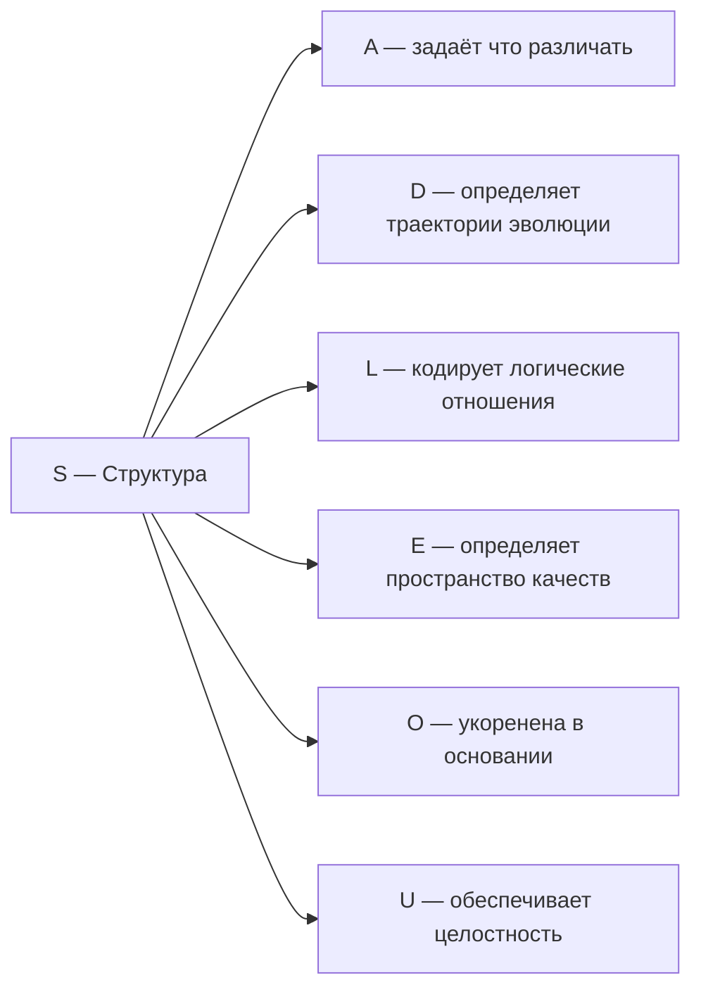

# Измерение II: Структура (S)

## Функция

**Удерживать форму, сохранять конфигурацию.**

## Описание

Структура — это то, что остаётся неизменным при изменениях. Это инварианты, законы сохранения, топологические свойства.

:::info Онтологический статус
Структура — **аспект** конфигурации $\Gamma$, не отдельная сущность. "Голоном имеет структуру" означает: в матрице когерентности $\Gamma$ активна проекция на базисный вектор $|S\rangle$, и существует гамильтониан $H$ с нетривиальным спектром.
:::

:::warning Связь с автопоэзисом
При удалении измерения $S$ нарушается **(AP)** — нет идентичности, нет самотождественности. Без структуры нельзя определить, что такое "та же самая система". См. [доказательство](../../proofs/theorem-minimality-7#случай-n--1-удаление-структуры-s).
:::

**Структура обеспечивает идентичность Голонома во времени:** пока динамика ($D$) изменяет состояние, структура ($S$) определяет, *что именно* остаётся инвариантным — и тем самым позволяет говорить о "том же" Голономе в разные моменты времени.

## Математическое представление

Гамильтониан $H$ — эрмитов оператор, определяющий структуру системы:

$$
H^\dagger = H
$$

Собственные векторы гамильтониана — **стационарные состояния**:

$$
H|\psi_n\rangle = E_n|\psi_n\rangle
$$

Структура определяется:
- **Спектром** $\{E_n\}$ — набор собственных значений (энергий)
- **Собственными векторами** $\{|\psi_n\rangle\}$ — стационарные конфигурации

## Гамильтониан в базисе измерений

В базисе $\{|A\rangle, |S\rangle, |D\rangle, |L\rangle, |E\rangle, |O\rangle, |U\rangle\}$:

$$
H = \sum_{i} \omega_i |i\rangle\langle i| + \sum_{i \neq j} J_{ij} |i\rangle\langle j|
$$

где:
- $\omega_i$ — собственные частоты базисных состояний (диагональные элементы)
- $J_{ij}$ — коэффициенты связи между измерениями (недиагональные элементы)

## Инварианты и законы сохранения

Структура выражается через **сохраняющиеся величины**:

$$
\frac{d\langle A \rangle}{d\tau} = 0 \quad \Leftrightarrow \quad [A, H] = 0
$$

Оператор $A$ сохраняется тогда и только тогда, когда он коммутирует с гамильтонианом. Это **теорема Нётер** в квантовой форме.

## Типы структур

| Тип | Математический инвариант | Пример |
|-----|--------------------------|--------|
| Топологическая | Гомотопические классы | Число дырок в торе |
| Алгебраическая | Группы симметрии | Кристаллографические группы |
| Метрическая | Расстояния, углы | Геометрия риманова многообразия |
| Информационная | Паттерны, корреляции | ДНК-последовательность |

## Примеры

| Уровень | Пример | Структурный инвариант |
|---------|--------|----------------------|
| Физический | Кристаллическая решётка | Трансляционная симметрия |
| Физический | Атомные орбитали | Квантовые числа $(n, l, m)$ |
| Биологический | ДНК | Последовательность нуклеотидов |
| Биологический | Белок | Третичная структура укладки |
| Когнитивный | Грамматика | Синтаксические правила |
| Когнитивный | Долговременная память | Устойчивые нейронные паттерны |

## Связь с другими измерениями

**Ключевая связь S ↔ D:** Структура и динамика дуальны. $H$ одновременно определяет:
- **Структуру** — через свой спектр $\{E_n\}$
- **Динамику** — через эволюцию $U(\tau) = e^{-iH_{eff}\tau}$ во [внутреннем времени](../../proofs/emergent-time)

## Когерентность с S

Элементы $\gamma_{Si}$ матрицы когерентности описывают связь структуры с другими измерениями:

| Когерентность | Интерпретация |
|---------------|---------------|
| $\gamma_{SA}$ | Артикулированность структуры (чёткость границ) |
| $\gamma_{SD}$ | Устойчивость при эволюции (стабильность) |
| $\gamma_{SL}$ | Логическая согласованность (непротиворечивость) |
| $\gamma_{SE}$ | Осознанность структуры (восприятие формы) |
| $\gamma_{SO}$ | Укоренённость в основании (фундаментальность) |
| $\gamma_{SU}$ | Интегрированность структуры (вклад в целое) |

### Октонионный контекст {#октонионный-контекст}

:::note Октонионное соответствие [И]
Измерению соответствует $e_2 \in \mathrm{Im}(\mathbb{O})$. Детали, $G_2$-оговорка и Фано-триплеты: [Октонионная интерпретация](./dimensions#октонионная-интерпретация), [структурный вывод](../../proofs/theorem-octonionic-derivation).
:::

---

**Связанные документы:**
- [Артикуляция (A)](./dimension-a) — предыдущее измерение
- [Динамика (D)](./dimension-d) — следующее измерение
- [Теорема о минимальности](../../proofs/theorem-minimality-7) — доказательство необходимости S
- [Эмерджентное время](../../proofs/emergent-time) — τ из структуры Γ
