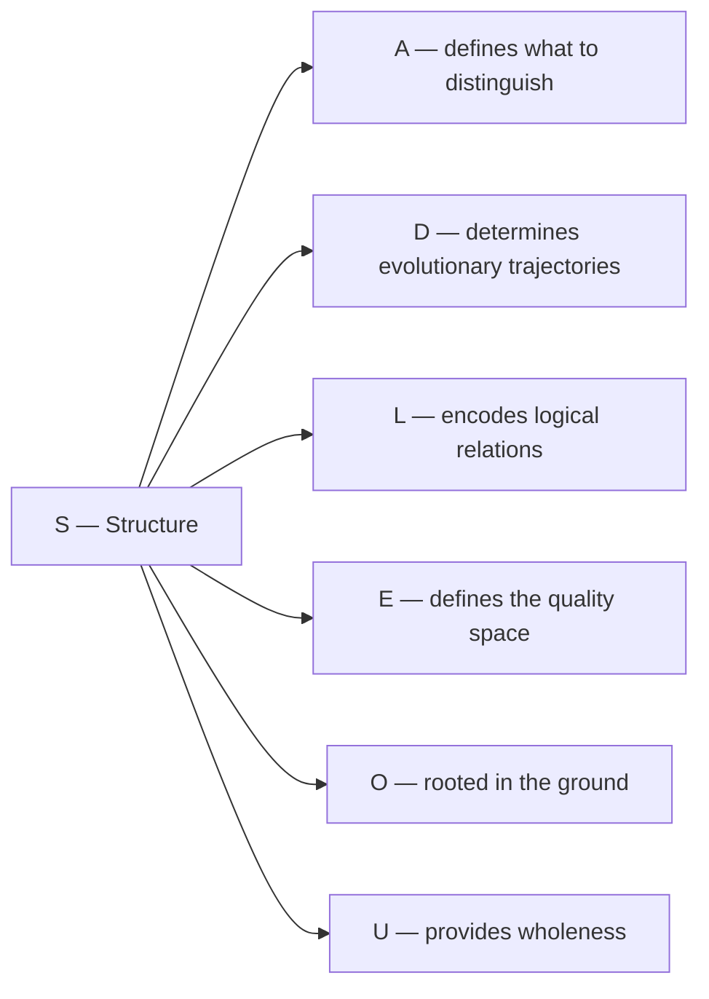
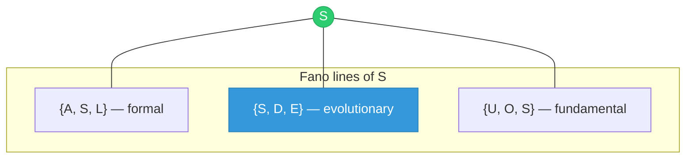

# Dimension II: Structure (S)

## What this chapter is about

This chapter is devoted to the second dimension of the Holon — **Structure**. You will learn:

- Why **preservation of form** is a necessary condition for the existence of anything in time;
- How the idea of invariants developed from Galois through Noether to modern physics;
- What a Hamiltonian is and why its spectrum is the system's "fingerprint";
- How the population $\gamma_{SS}$ determines the rigidity of a configuration;
- Why Structure and Dynamics are two sides of the same coin;
- What place S occupies on the Fano plane.

:::info Who this chapter is for
If you are reading about UHM for the first time — start with the [overview of dimensions](./dimensions). If you want to understand where the stability of form comes from — you are in the right place. Familiarity with [Articulation (A)](./dimension-a) is assumed.
:::

## Function

**To hold form, to preserve configuration.**

## Historical precursor {#историческая-предтеча}

The idea that behind the mutability of the world lie unchanging structures is one of the oldest in human thought.

**Plato** (4th century BCE) taught that behind changeable things stand unchanging **eide** — forms. A chair will break, but the "idea of a chair" is eternal. Although Platonic idealism is no longer taken literally, the intuition is correct: behind the flux of the world lie invariants.

**Évariste Galois** (1832) — a young genius who died in a duel at the age of 20 — made one of the greatest discoveries in mathematics. Studying which equations can be solved in radicals, he found that the answer depends not on the specific coefficients, but on the **structure of the symmetries** of the roots. This gave birth to **group theory** — the mathematics of invariants. The main lesson of Galois: what matters is not the content (specific numbers), but the **structure** (how elements are related to each other).

**Claude Lévi-Strauss** (1958) in *Structural Anthropology* showed that behind the diversity of myths, rituals, and kinship systems lie **invariant structures**. The flood myth looks different in Mesopotamia and among the Navajo, but the **structure** of the myth (threat → trial → rebirth) is the same. Structuralism is the search for what remains unchanged under variations.

**Emmy Noether** (1918) proved one of the most beautiful theorems in physics: **every continuous symmetry** of a physical system corresponds to a **conserved quantity**. Rotational symmetry → conservation of angular momentum. Translational symmetry → conservation of momentum. Temporal symmetry → conservation of energy. Noether's theorem formalised the connection between structure (symmetry) and invariants (conservation laws).

In UHM theory all these ideas converge in the dimension **Structure ($S$)** — the aspect of configuration $\Gamma$ responsible for the preservation of form, the retention of invariants, and the provision of identity in time.

## Why does form persist at all? {#почему-форма-сохраняется}

The question seems naïve, but it is deep. Why does anything remain unchanged? Why is an electron after a billion years still the same electron? Why does DNA copy itself with an error rate of just one mistake per billion base pairs?

Physics answers: because **symmetries** exist. If a law of nature does not change under some transformation (rotation, translation, reflection), then there exists a quantity that **cannot** change. This is not a postulate — it is a mathematical theorem (Noether). Conservation is not a property of things, but a **consequence of the symmetries** of the laws to which things are subject.

In UHM theory this principle is deepened: symmetries are not "imposed from outside", but **emerge** from the structure of the configuration $\Gamma$ itself. The Hamiltonian $H_\Omega$ is determined by axioms [A1–A5](../../core/foundations/axiom-omega), and its symmetries are a mathematical consequence of those axioms. Thus the stability of form is not a mysterious property of reality, but a **derivable** consequence of the fundamental structure.

## Description

Structure is what remains unchanged through changes. It is invariants, conservation laws, topological properties.

:::info Ontological status
Structure is an **aspect** of configuration $\Gamma$, not a separate entity. "The Holon has structure" means: in the coherence matrix $\Gamma$ the projection onto the basis vector $|S\rangle$ is active, and there exists a Hamiltonian $H$ with a non-trivial spectrum.
:::

:::warning Connection with autopoiesis
Removal of dimension $S$ violates **(AP)** — there is no identity, no self-sameness. Without structure one cannot define what "the same system" means. See [proof](../../proofs/minimality/theorem-minimality-7#случай-n--1-удаление-структуры-s).
:::

**Structure provides the Holon's identity in time:** while dynamics ($D$) changes the state, structure ($S$) determines *what exactly* remains invariant — and thereby allows one to speak of "the same" Holon at different moments in time.

## Intuitive explanation {#интуитивное-объяснение}

### Analogy with a building frame

Imagine a building. The walls can be repainted, the windows replaced, the furniture rearranged — and it is still "the same building". What makes it the same? The **frame** — the load-bearing structure that is preserved through all cosmetic changes. Remove the frame and the building collapses, no matter how good the walls are.

The Structure of a Holon is its "frame": what is preserved during evolution. The diagonal elements $\gamma_{kk}$ may fluctuate, the coherences $\gamma_{ij}$ may oscillate, but certain combinations remain invariant. These invariants define the **identity** of the system.

### Analogy with DNA

When a cell divides, all its contents are rearranged: the membrane ruptures, proteins are distributed, the cytoplasm divides. But **DNA is copied exactly** — it is the structure that is preserved across generations of cells. DNA is the invariant of cellular dynamics, the "frame" of biological identity.

Moreover, DNA is an example of an **informational** structure: what matters is not the physical molecule (atoms are replaced), but the **sequence** of nucleotides. Analogously, the Structure of a Holon is not the specific values of $\gamma_{ij}$, but the **pattern** of their relationships.

### Analogy with stellar spectra

Astronomers determine the chemical composition of a star millions of light-years away from its **spectrum** — the set of frequencies of emitted light. Each chemical element leaves a unique "spectral fingerprint" — a set of absorption and emission lines.

In exactly the same way, the Hamiltonian $H$ of a Holon has a **spectrum** — the set of eigenvalues $\{E_n\}$ that uniquely characterises the structure of the system. From the spectrum one can determine which symmetries the system has, which transitions are possible, and what the "architecture" of the configuration is — even without knowing the details of the state.

## Mathematical representation

### Hamiltonian — the structure operator

The Hamiltonian $H$ is a Hermitian operator that determines the structure of the system:

$$
H^\dagger = H
$$

The eigenvectors of the Hamiltonian are the **stationary states**:

$$
H|\psi_n\rangle = E_n|\psi_n\rangle
$$

Structure is determined by:
- **Spectrum** $\{E_n\}$ — the set of eigenvalues (energies)
- **Eigenvectors** $\{|\psi_n\rangle\}$ — stationary configurations

**Why $H$ specifically?** The Hamiltonian is the unique operator that simultaneously determines:
1. **What is conserved** — through commuting observables ($[A, H] = 0$ ⟹ $A$ is conserved)
2. **How the system evolves** — through $U(\tau) = e^{-iH_{eff}\tau}$

This dual role makes $H$ the ideal mathematical representation of structure.

## Hamiltonian in the dimension basis

In the basis $\{|A\rangle, |S\rangle, |D\rangle, |L\rangle, |E\rangle, |O\rangle, |U\rangle\}$:

$$
H = \sum_{i} \omega_i |i\rangle\langle i| + \sum_{i \neq j} J_{ij} |i\rangle\langle j|
$$

where:
- $\omega_i$ — natural frequencies of the basis states (diagonal elements)
- $J_{ij}$ — coupling coefficients between dimensions (off-diagonal elements)

The diagonal elements $\omega_i$ define the "energy landscape" — which states are preferred. The off-diagonal elements $J_{ij}$ define **connectivity** — how easily the system transitions between dimensions.

## Population $\gamma_{SS}$ — measure of rigidity {#населённость}

The diagonal element of the [coherence matrix](../../core/dynamics/coherence-matrix) $\gamma_{SS}$ is the **population** of the Structure dimension. It shows what fraction of the Holon's "resource" is directed towards holding form.

$$
\gamma_{SS} = \langle S | \Gamma | S \rangle \in [0, 1], \quad \sum_{k} \gamma_{kk} = 1
$$

### What the value of $\gamma_{SS}$ means

| Value of $\gamma_{SS}$ | Interpretation | Example |
|------------------------|----------------|---------|
| High ($\gg 1/7$) | Rigid system, resists change | Crystal, dogma, obsessiveness |
| Around $1/7$ | Balanced stability | Healthy adaptability: form is preserved but allows plasticity |
| Low ($\ll 1/7$) | Weak structuredness, amorphousness | Gas, stream of consciousness without focus, disorganisation |
| $\to 0$ | Loss of all structure | Heat death, complete destructuration |

:::warning Structure ≠ rigidity
High $\gamma_{SS}$ is not always good. Excessive structuredness (rigidity) impedes adaptation. Living systems maintain $\gamma_{SS}$ in a range that combines stability with plasticity. This is consistent with the [Goldilocks zone](../../core/foundations/axiom-septicity) $P \in (2/7, 3/7]$ **[Т]** — consciousness requires a balance between order and chaos.
:::

## Structural stress $\sigma_S$ {#стресс-структуры}

The [stress variable](../../core/operators/lindblad-operators) $\sigma_S$ (T-92 **[Т]**) characterises the **deficit** of structural stability:

$$
\sigma_S = \mathrm{clamp}(1 - 7\gamma_{SS},\; 0,\; 1)
$$

| $\sigma_S$ | State | Interpretation |
|------------|-------|----------------|
| $0$ | $\gamma_{SS} \geq 1/7$ | Structure is sufficient or in excess |
| $0.5$ | $\gamma_{SS} \approx 1/14$ | Moderate deficit — the system is "shaky" |
| $1$ | $\gamma_{SS} \to 0$ | Critical deficit — form is lost |

:::info Stress and experience
At the cognitive level, high $\sigma_S$ is experienced as **disorientation**, **loss of ground**, **a sense of chaos** — the world has ceased to be predictable, familiar structures have collapsed. Low $\sigma_S$ feels like **confidence**, **reliability**, **understanding the rules of the game**. Stress $\sigma_S$ affects the [hedonic signal](../../consciousness/foundations/self-observation#мера-рефлексии-r) and motivates the system to seek stable patterns.
:::

## Structure in dynamics {#структура-в-динамике}

The population $\gamma_{SS}$ evolves in [internal time](../../proofs/dynamics/emergent-time) $\tau$ according to the full equation:

$$
\frac{d\gamma_{SS}}{d\tau} = -i[H_\Omega, \Gamma]_{SS} + \mathcal{D}_{SS}[\Gamma] + \mathcal{R}_{SS}
$$

where $\mathcal{D}$ is the dissipative part ([Lindblad operators](../../core/operators/lindblad-operators)) and $\mathcal{R}$ is the [replacement operator](../../core/operators/lindblad-operators).

### Processes that change structure

| Process | What happens to $\gamma_{SS}$ | Consequence |
|---------|-------------------------------|-------------|
| Crystallisation | Sharp increase | A liquid acquires long-range order — phase transition |
| Skill learning | Gradual increase | Repetition consolidates neural patterns (myelination) |
| Trauma, shock | Sharp decrease | Familiar structures destroyed, the world has become unpredictable |
| Ageing | Chronic decrease | Cellular repair mechanisms weaken |
| Revolution | Decrease + subsequent increase | Old institutions destroyed, new ones not yet formed |

:::tip Structural plasticity
A healthy system does not merely hold structure — it is capable of **restructuring itself**. This means: $\gamma_{SS}$ temporarily decreases (the old form is dismantled), then increases in a new configuration ($\gamma_{Sk}$ are redistributed). This dynamic is the basis of adaptation. A system incapable of temporarily "releasing" its structure cannot learn anything new.
:::

## Invariants and conservation laws

Structure is expressed through **conserved quantities**:

$$
\frac{d\langle A \rangle}{d\tau} = 0 \quad \Leftrightarrow \quad [A, H] = 0
$$

An operator $A$ is conserved if and only if it commutes with the Hamiltonian. This is **Noether's theorem** in quantum form.

### Noether's theorem in detail {#теорема-нётер}

The classical Noether theorem states: if the equations of motion are invariant under a continuous transformation, then there exists a conserved quantity. In quantum mechanics this takes an elegant form:

| Symmetry | Transformation | Conserved quantity |
|----------|---------------|-------------------|
| Spatial translation | $x \to x + a$ | Momentum $p$ |
| Time translation | $t \to t + \Delta t$ | Energy $E$ |
| Rotation | $\theta \to \theta + \alpha$ | Angular momentum $L$ |
| Phase transformation | $\psi \to e^{i\alpha}\psi$ | Charge $Q$ |

In the context of the Holon: the symmetries of the Hamiltonian $H_\Omega$ determine which combinations of populations and coherences are conserved during evolution. The complete set of such invariants is precisely the **structure** of the system.

:::info Generator of symmetry = conserved quantity
In quantum mechanics the generator of a symmetry (the operator that produces the transformation) and the conserved quantity are **one and the same operator**. Momentum $\hat{p}$ simultaneously generates translations and is conserved under translational symmetry. This deep unity — "two sides of the same coin" — is reflected in the S ↔ D duality.
:::

## Structure and memory {#структура-и-память}

Structure provides the system's **memory** — the capacity to retain information. Without invariants, all information would be instantly lost in the flux of dynamics.

| Memory type | Structural invariant | Lifetime |
|-------------|---------------------|----------|
| DNA | Nucleotide sequence | $\sim 10^9$ years (species) |
| Crystal structure | Lattice parameters | $\sim 10^{10}$ years |
| Long-term memory | Synaptic weights | $\sim 10^1$ years |
| Short-term memory | Activity patterns | $\sim 10^1$ seconds |
| Quantum coherence | Phase $\gamma_{ij}$ | $\sim 10^{-12}$ seconds (at room $T$) |

The higher $\gamma_{SS}$ relative to $\gamma_{DD}$, the longer the system's "memory" lives. When $\gamma_{SS} \to 0$ the system loses the ability to store information and becomes "memoryless" — each moment begins from a blank slate.

## Types of structures

| Type | Mathematical invariant | Example |
|------|----------------------|---------|
| Topological | Homotopy classes | Number of holes in a torus |
| Algebraic | Symmetry groups | Crystallographic groups |
| Metric | Distances, angles | Riemannian manifold geometry |
| Informational | Patterns, correlations | DNA sequence |

## S ↔ D duality {#дуальность-sd}

Structure and [Dynamics](./dimension-d) are two aspects of one object: **the Hamiltonian $H$**.

**One operator — two faces:**

| Aspect | What $H$ describes | Mathematical operation |
|--------|-------------------|----------------------|
| **Structure (S)** | Spectrum $\{E_n\}$ — stationary states | Eigenvalues: $H\|\psi_n\rangle = E_n\|\psi_n\rangle$ |
| **Dynamics (D)** | Evolution $U(\tau) = e^{-iH_{eff}\tau}$ | Exponential map |

This is not a metaphor — it is a precise mathematical statement. Knowing the spectrum of $H$ (structure), you completely determine the evolution (dynamics), and vice versa: knowing all possible evolutions, one can recover the spectrum.

**Music analogy:** A score (structure) and a performance (dynamics) are two aspects of the same work. The score is a set of notes (spectrum); the performance is sound in time (evolution). One score determines all possible performances; one complete performance allows the score to be recovered.

:::tip Consequence of duality
The coherence $\gamma_{SD}$ is the **stability under evolution**. High $\gamma_{SD}$ means that structure and dynamics are "aligned": the system evolves without destroying its own form. Low $\gamma_{SD}$ is a sign of instability: dynamics destroys structure (chaotic collapse) or structure suppresses dynamics (freezing).
:::

## Examples

| Level | Example | Structural invariant |
|-------|---------|---------------------|
| Physical | Crystal lattice | Translational symmetry |
| Physical | Atomic orbitals | Quantum numbers $(n, l, m)$ |
| Biological | DNA | Nucleotide sequence |
| Biological | Protein | Tertiary folding structure |
| Cognitive | Grammar | Syntactic rules |
| Cognitive | Long-term memory | Stable neural patterns |
| Social | Constitution | Fundamental legal norms |
| Social | Language | Phonological system |
| Mathematical | Symmetry group | Group multiplication table |
| Mathematical | Topological space | Homeomorphism type |

## Structure at different levels of organisation {#уровни-организации}

Structure manifests at every level of complexity, but the form of the invariants differs:

### Physical level
At the level of elementary particles, structure is **quantum numbers** (spin, charge, colour) that are conserved in interactions. A crystal is an example of macroscopic structure: the translational symmetry of the lattice determines the electronic bands and all physical properties of the material.

### Biological level
The genetic code is an informational structure preserved across billions of years of evolution. The triplet code (3 nucleotides → 1 amino acid) is an invariant shared by all living organisms on Earth. Morphogenesis is the process in which structure (the body plan) is realised through dynamics (cell division and differentiation).

### Cognitive level
Grammar is the structure of language. Specific words (the dynamics of speech) change, but grammatical rules (structure) are preserved across generations. A child acquires grammar without memorising rules — they recover the **structure** from the flow of speech, demonstrating the fundamentality of $S$.

### Social level
Institutions are social structures that persist across generations. A constitution is the structural invariant of a state: governments change, but the fundamental rules remain. When structure is destroyed (revolution, chaos), the social system loses its identity — exactly as a Holon does when $\gamma_{SS} \to 0$.

## Connection with other dimensions

```mermaid
graph LR
    S["S — Structure"] --> A["A — defines what to distinguish"]
    S --> D["D — determines evolutionary trajectories"]
    S --> L["L — encodes logical relations"]
    S --> E["E — defines the quality space"]
    S --> O["O — rooted in the ground"]
    S --> U["U — provides wholeness"]
```

### Expanded connections {#развёрнутые-связи}

**S ↔ A (Structure ↔ Articulation):** Structure and distinction are mutually necessary. [Articulation](./dimension-a) creates the elements from which structure is built, and structure determines **which** distinctions are stable. The grammar of a language (structure) determines which phonemic distinctions (articulations) are meaningful: in Russian "р" and "л" are different phonemes, in Japanese they are not. The coherence $\gamma_{SA}$ is the **articulatedness of structure**: how sharply the boundaries of form are expressed.

**S ↔ D (Structure ↔ Dynamics):** The central duality of the theory (details [above](#дуальность-sd)). $H$ simultaneously determines the spectrum (structure) and the evolution (dynamics). The coherence $\gamma_{SD}$ is **stability under evolution**: high means the system evolves without destroying its own form. Analogy: a river flows (D), but the riverbed (S) is preserved — this is high $\gamma_{SD}$.

**S → L (Structure → Logic):** Structure defines the **relations** between elements, while [Logic](./dimension-l) defines the **rules** of those relations. A crystal lattice (structure) determines which chemical bonds (logical relations) are possible. The coherence $\gamma_{SL}$ is the **logical consistency** of form: the non-contradictoriness of structure.

**S → E (Structure → Interiority):** Structure determines the **space of possible experiences**. The architecture of the visual cortex (structure) determines which colours, shapes, and motions can be perceived (interiority). The coherence $\gamma_{SE}$ is the **awareness of structure**: whether the system experiences its own form.

**S → O (Structure → Ground):** Structure is rooted in the [Ground](./dimension-o) — the source from which it draws resources for self-maintenance. The coherence $\gamma_{SO}$ is **fundamentality**: how much the structure is connected to the deep source rather than being a superficial overlay.

**S → U (Structure → Unity):** Structure is not a chaotic set of invariants but an **organised whole**. The coherence $\gamma_{SU}$ is the **integration of structure**: the contribution of form to the unity of the Holon. On the Fano plane this connection is expressed by the line $\{U, O, S\}$: structure emerges from the ground through integration.

## Coherence with S

The elements $\gamma_{Si}$ of the coherence matrix describe the connection of structure with other dimensions:

| Coherence | Interpretation |
|-----------|----------------|
| $\gamma_{SA}$ | Articulatedness of structure (sharpness of boundaries) |
| $\gamma_{SD}$ | Stability under evolution (robustness) |
| $\gamma_{SL}$ | Logical consistency (non-contradictoriness) |
| $\gamma_{SE}$ | Awareness of structure (perception of form) |
| $\gamma_{SO}$ | Rootedness in the ground (fundamentality) |
| $\gamma_{SU}$ | Integration of structure (contribution to the whole) |

## Structure and the Fano plane {#структура-и-фано}

In the [octonionic structure](./dimensions#октонионная-интерпретация) of UHM, dimension $S$ corresponds to the imaginary unit $e_2 \in \mathrm{Im}(\mathbb{O})$. Structure lies in the **3** sector of the triplet decomposition $7 = 1_O \oplus \mathbf{3} \oplus \bar{\mathbf{3}}$ (T-48a [Т]).

On the [Fano plane](../../physics/gauge-symmetry/fano-selection-rules) $\mathrm{PG}(2,2)$, structure $S$ ($= e_2$) belongs to **three Fano lines**:

| Fano line | Dimensions | Interpretation |
|-----------|------------|----------------|
| $\{A, S, L\}$ = $\{1, 2, 4\}$ | Articulation + Structure + Logic | **Formal line**: distinction + form + logic — the triad of rational cognition |
| $\{S, D, E\}$ = $\{2, 3, 5\}$ | Structure + Dynamics + Interiority | **Evolutionary line**: form + change + experience — the triad of lived experience |
| $\{U, O, S\}$ = $\{6, 7, 2\}$ | Unity + Ground + Structure | **Fundamental line**: $S$ is connected to $O$ through the $\bar{\mathbf{3}}$ element ($U$) — form through integration |

:::tip Uniqueness of S on the Fano plane (T-177) [Т]
Structure is the only element of the **3** sector that is connected to Ground ($O$) through a $\bar{\mathbf{3}}$ element (Unity, $U$) on the line $\{U, O, S\}$. By comparison: $A$ is connected to $O$ directly (line $\{O, A, D\}$), and $D$ — through a **3** element ($A$).

This means that the path from the Ground to Structure passes through **integration** ($U$) — form arises not directly from the source, but through unification.
:::

```mermaid
graph TD
    subgraph "Fano lines of S"
        ASL["{A, S, L} — formal"]
        SDE["{S, D, E} — evolutionary"]
        UOS["{U, O, S} — fundamental"]
    end
    S((S)) --- ASL
    S --- SDE
    S --- UOS
    style S fill:#2ecc71,color:#fff,stroke:#27ae60
    style SDE fill:#3498db,color:#fff,stroke:#2980b9
```

### Octonionic context {#октонионный-контекст}

:::note Octonionic correspondence [Т]
The dimension corresponds to $e_2 \in \mathrm{Im}(\mathbb{O})$. This identification is a **theorem** [Т]: the [T15 bridge chain](/docs/core/foundations/axiom-septicity#мост-p1p2) (all steps [Т]) derives the octonionic structure from (AP)+(PH)+(QG)+(V); [T-177 [Т]](/docs/reference/status-registry) and [T-183 [Т]](/docs/reference/status-registry) prove the combinatorial and functional uniqueness of each role. The specific assignment $S = e_2$ is fixed up to $G_2$-gauge equivalence ([T-42a [Т]](/docs/proofs/categorical/uniqueness-theorem)). Details and $G_2$-caveat: [Octonionic interpretation](./dimensions#октонионная-интерпретация), [structural derivation](../../proofs/minimality/theorem-octonionic-derivation).
:::

## Gradations of structure {#градации-структуры}

Like [Articulation](./dimension-a#градации-артикуляции), Structure is not a binary property but a **continuous scale**:

#### Level 0: Amorphousness ($\gamma_{SS} \approx 0$)

No invariants are distinguished — complete chaos. The physical analogue is an ideal gas at infinite temperature: each moment is unconnected to the previous, there is no "memory". At the cognitive level — delirium, where no thought is held for longer than an instant.

#### Level 1: Local order ($\gamma_{SS} \sim 0.05$)

There is short-range order but no long-range order. A liquid: neighbouring molecules are still correlated, but correlations disappear beyond a few molecular radii. The cognitive analogue is drowsiness, where thoughts are locally connected but the overall structure of reasoning is absent.

#### Level 2: Stable form ($\gamma_{SS} \sim 1/7$)

Balanced structure: invariants are strong enough to ensure identity, but flexible enough to allow adaptation. This is the level of a healthy organism, a functioning society, a working theory.

#### Level 3: Crystalline order ($\gamma_{SS} > 1/7$)

High long-range order. Crystal, bureaucracy, rigid character. Stability is guaranteed, but at the cost of flexibility. New information is difficult to integrate — structure "rejects" what does not fit existing frameworks.

#### Level 4: Ossification ($\gamma_{SS} \gg 1/7$)

Pathological rigidity. The system is incapable of adaptation: any deviation from form is suppressed. Fanaticism, institutional sclerosis, "the dead letter of the law". Structure turns from a means of survival into an obstacle to it.

## Summary

Structure is the second dimension of the Holon, providing its identity in time. Without structure there are no invariants, no memory, no self-sameness. Mathematically, structure is described by the Hamiltonian — the operator whose spectrum defines the "architecture" of the system and whose exponential defines its evolution. The S ↔ D duality (spectrum ↔ evolution) is one of the central relations of the theory. On the Fano plane, S occupies a unique position: it is connected to the Ground through Unity, reflecting the path "from the source through integration to form".

---

**Related documents:**
- [Articulation (A)](./dimension-a) — previous dimension
- [Dynamics (D)](./dimension-d) — next dimension
- [Coherence matrix](../../core/dynamics/coherence-matrix) — full description of Γ
- [Minimality theorem](../../proofs/minimality/theorem-minimality-7) — proof of the necessity of S
- [Emergent time](../../proofs/dynamics/emergent-time) — τ from the structure of Γ
