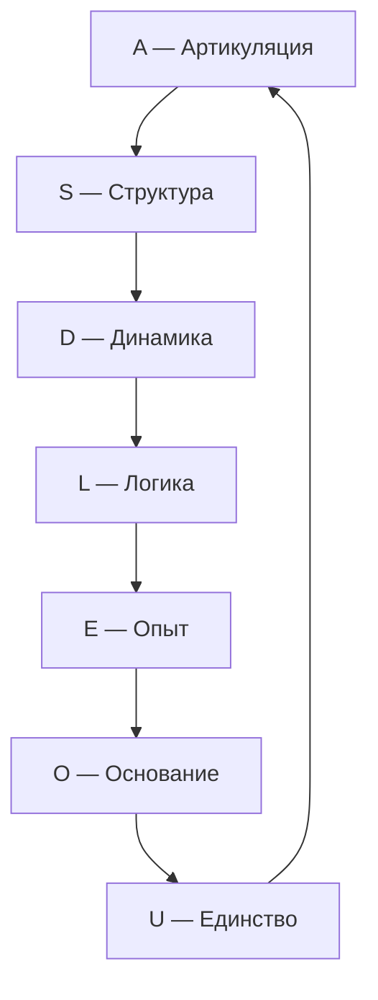
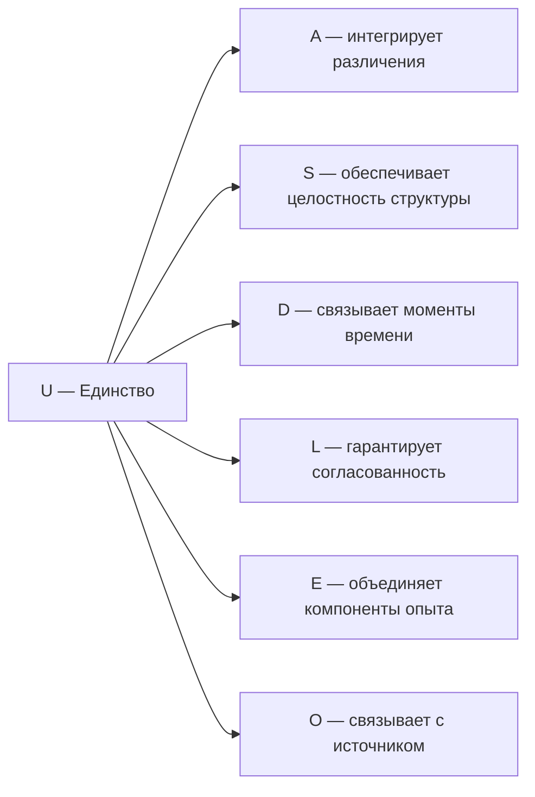

# Измерение VII: Единство (U)

## Функция

**Интегрировать, замыкать, возвращать к целому.**

## Описание

Единство — это измерение, которое связывает все остальные шесть в один неразрывный Голоном. Оно обеспечивает **целостность и идентичность** системы $\mathbb{H}$.

:::info Онтологический статус
Единство — **аспект** конфигурации $\Gamma$, не отдельная сущность. «Голоном един» означает: в матрице когерентности $\Gamma$ активна проекция на базисный вектор $|U\rangle$, и выполняется условие нормировки $\mathrm{Tr}(\Gamma) = 1$.
:::

:::warning Связь с автопоэзисом
При удалении измерения $U$ нарушается **(AP)** — нет интеграции, нет целостности. Без $U$ система фрагментируется и не может поддерживать когерентность как единое целое. См. [доказательство](../../proofs/theorem-minimality-7#случай-n--6-удаление-единства-u).
:::

## Математическое представление

### Условие нормировки

Единство формализуется через **условие нормировки** [матрицы когерентности](../../formal/specification#матрица-когерентности):

$$
\mathrm{Tr}(\Gamma) = \sum_{i \in \{A,S,D,L,E,O,U\}} \gamma_{ii} = 1
$$

Это условие гарантирует, что сумма всех диагональных элементов (вероятностей) равна 1 — система существует как целое.

### Проекция на U

Диагональный элемент матрицы когерентности:

$$
\gamma_{UU} = \langle U|\Gamma|U\rangle > 0
$$

Условие $\gamma_{UU} > 0$ означает, что измерение Единства активно в конфигурации $\Gamma$.

### Мера интеграции Φ

Единство связано с **мерой интеграции** $\Phi$, определённой в [иерархии интериорности](../../proofs/interiority-hierarchy#определение-24-мера-интеграции):

$$
\Phi(\Gamma) = \frac{\sum_{i \neq j} |\gamma_{ij}|^2}{\sum_i \gamma_{ii}^2}
$$

где:
- Числитель — сумма квадратов модулей **когерентностей** (недиагональных элементов)
- Знаменатель — сумма квадратов **диагональных элементов**

**Интерпретация:**
- $\Phi = 0$: классический ансамбль без когерентностей
- $\Phi \to \infty$: максимально интегрированное (запутанное) состояние

## Роль в интеграции

### Интеграция опыта (L2)

При уровне L2 ([когнитивные квалиа](../../proofs/interiority-hierarchy#уровень-2-когнитивные-квалиа-cognitive-qualia)) субъективное единство опыта («Я») возникает при выполнении условий:

$$
R \geq R_{th} \approx 0.3, \quad \Phi \geq \Phi_{th} \approx 1.0
$$

где $R$ — [мера рефлексии](../consciousness/self-observation#мера-рефлексии-r), $R_{th}$ и $\Phi_{th}$ — [эмпирические пороги](../../proofs/interiority-hierarchy#обоснование-порогов).

### Замыкание причинности

Единство замыкает каузальный цикл (M,R)-системы:

Замыкание $U \to A$ обеспечивает **самосогласованность**: результат интеграции возвращается в артикуляцию, порождая новый цикл.

## Связь с сознательностью

Единство через $\Phi$ входит в [формулу сознательности](../../proofs/interiority-hierarchy#35-мера-сознательности-c):

$$
C = \Phi \times D_{\text{diff}} \times R
$$

где:
- $\Phi$ — интеграция (связана с $U$)
- $D_{\text{diff}} = \exp(S_{vN}(\rho_E))$ — дифференциация (не путать с измерением Динамики)
- $R$ — рефлексия

:::note О нотации
$D_{\text{diff}}$ — мера **дифференциации** экспериенциального содержания. Это **не** измерение Динамики $D$, а отдельная величина.
:::

## Примеры

### Физические

| Пример | Описание |
|--------|----------|
| Нормировка | $\mathrm{Tr}(\Gamma) = 1$ — полная вероятность |
| Центр масс | Интеграция распределённой массы в одну точку |
| Связанное состояние | Атом как целое, не набор частиц |

### Биологические

| Пример | Описание |
|--------|----------|
| Организм | Интеграция органов в единую систему |
| Нервная система | Интеграция сенсорной информации |
| Гомеостаз | Поддержание целостности внутренней среды |

### Психологические

| Пример | Описание |
|--------|----------|
| Самосознание | Знание себя как целого |
| Идентичность | Постоянство «Я» во времени |
| Синтез восприятия | Объединение модальностей в единый опыт |

## Распад единства

При $\gamma_{Ui} \to 0$ для всех $i$:

1. Потеря интеграции: $\Phi \to 0$
2. Диссоциация сознания: разрыв между измерениями
3. Фрагментация опыта: «Я» распадается на части

**Клинические аналогии:**

| Состояние | Описание | Параметры |
|-----------|----------|-----------|
| Диссоциативное расстройство | Множественные «Я» | $\gamma_{UE} \approx 0$ |
| Дереализация | Отчуждение от реальности | $\gamma_{UA} \approx 0$ |
| Деперсонализация | Отчуждение от себя | $\gamma_{UU} \to P_{\text{critical}}$ |

## Связь с другими измерениями

## Когерентность с U

| Когерентность | Интерпретация |
|---------------|---------------|
| $\gamma_{UA}$ | Интегрированность различений |
| $\gamma_{US}$ | Целостность структуры |
| $\gamma_{UD}$ | Непрерывность бытия во времени |
| $\gamma_{UL}$ | Логическая согласованность целого |
| $\gamma_{UE}$ | Единство сознания |
| $\gamma_{UO}$ | Связь целостности с источником |

## Связь с чистотой

[Чистота](../dynamics/viability#определение-чистоты) $P$ связана с когерентностями:

$$
P = \mathrm{Tr}(\Gamma^2) = \sum_{i} \gamma_{ii}^2 + \sum_{i \neq j} |\gamma_{ij}|^2
$$

Высокая когерентность с $U$ (большие $|\gamma_{Ui}|$) коррелирует с высокой общей чистотой $P$, поскольку когерентности вносят положительный вклад в $P$.

---

**Связанные документы:**
- [Основание (O)](./dimension-o) — предыдущее измерение
- [Семь измерений](./dimensions) — обзор всех измерений
- [Самонаблюдение](../consciousness/self-observation) — связь с сознанием
- [Жизнеспособность](../dynamics/viability) — условия существования
- [Иерархия интериорности](../../proofs/interiority-hierarchy) — формальные определения
