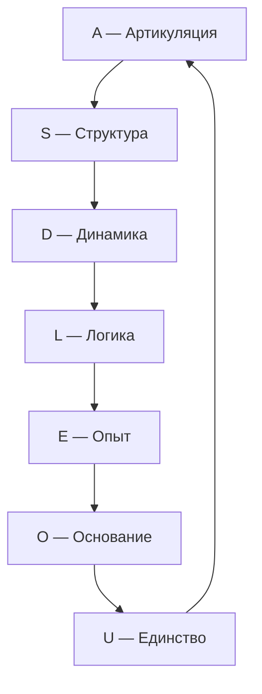
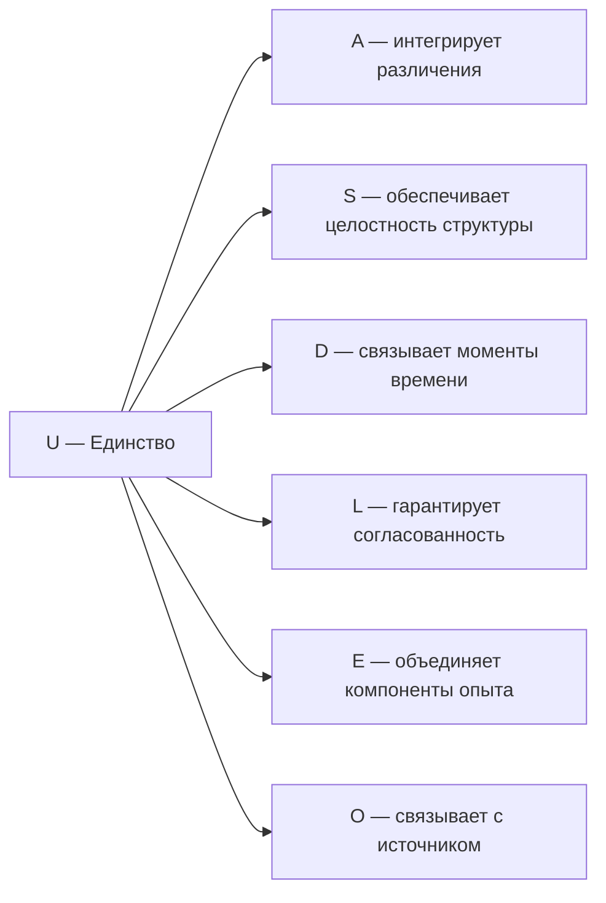

# Измерение VII: Единство (U)

## Функция

**Интегрировать, замыкать, возвращать к целому.**

## Описание

Единство — это измерение, которое связывает все остальные шесть в один неразрывный Голоном. Оно обеспечивает **целостность и идентичность** системы $\mathbb{H}$.

:::info Онтологический статус
Единство — **аспект** конфигурации $\Gamma$, не отдельная сущность. «Голоном един» означает: в матрице когерентности $\Gamma$ активна проекция на базисный вектор $|U\rangle$, и выполняется условие нормировки $\mathrm{Tr}(\Gamma) = 1$.
:::

:::warning Связь с автопоэзисом
При удалении измерения $U$ нарушается **(AP)** — нет интеграции, нет целостности. Без $U$ система фрагментируется и не может поддерживать когерентность как единое целое. См. [доказательство](../../proofs/theorem-minimality-7#случай-n--6-удаление-единства-u).
:::

## Математическое представление

### Условие нормировки

Единство формализуется через **условие нормировки** [матрицы когерентности](../../formal/specification#матрица-когерентности):

$$
\mathrm{Tr}(\Gamma) = \sum_{i \in \{A,S,D,L,E,O,U\}} \gamma_{ii} = 1
$$

Это условие гарантирует, что сумма всех диагональных элементов (вероятностей) равна 1 — система существует как целое.

### Проекция на U

Диагональный элемент матрицы когерентности:

$$
\gamma_{UU} = \langle U|\Gamma|U\rangle > 0
$$

Условие $\gamma_{UU} > 0$ означает, что измерение Единства активно в конфигурации $\Gamma$.

### Мера интеграции Φ

<!-- DRY: Мастер-определение Φ (меры интеграции). Все ссылки должны указывать сюда: /docs/core/structure/dimension-u#мера-интеграции-φ -->

**Мера интеграции** $\Phi$ количественно оценивает степень когерентности (связности) между измерениями Голонома:

$$
\Phi(\Gamma) = \frac{\sum_{i \neq j} |\gamma_{ij}|^2}{\sum_i \gamma_{ii}^2}
$$

где:
- Числитель — сумма квадратов модулей **когерентностей** (недиагональных элементов)
- Знаменатель — сумма квадратов **диагональных элементов**

**Интерпретация:**
- $\Phi = 0$: классический ансамбль без когерентностей
- $\Phi \to \infty$: максимально интегрированное (запутанное) состояние

## Роль в интеграции

### Интеграция опыта (L2)

При уровне L2 ([когнитивные квалиа](../../proofs/interiority-hierarchy#уровень-2-когнитивные-квалиа-cognitive-qualia)) субъективное единство опыта («Я») возникает при выполнении условий:

$$
R \geq R_{\text{th}} = \frac{1}{3}, \quad \Phi \geq \Phi_{\text{th}} = 1
$$

где $R$ — [мера рефлексии](../consciousness/self-observation#мера-рефлексии-r). Пороги **строго выводятся** из ПИР. См. [Пороги L2](../foundations/axiom-septicity#пороги-l2-строгий-вывод).

### Теорема: Порог интеграции Φ_th = 1 {#теорема-порог-интеграции}

:::tip Статус: ✅ Доказано
Значение $\Phi_{\text{th}} = 1$ выводится из условия интегрированности системы.
:::

**Утверждение:**
$$
\Phi_{\text{th}} = 1
$$

**Доказательство:**

**Шаг 1: Определение Φ**

$$
\Phi(\Gamma) = \frac{\sum_{i \neq j} |\gamma_{ij}|^2}{\sum_i \gamma_{ii}^2}
$$

**Шаг 2: Интерпретация компонентов**

- Числитель: суммарная «энергия» когерентностей (связей между измерениями)
- Знаменатель: суммарная «энергия» диагонали (локализация в отдельных измерениях)

$\Phi = 1$ означает: **когерентности имеют такой же совокупный вес, как диагональ**.

**Шаг 3: Условие интеграции**

Система **интегрирована**, если связи между измерениями не слабее самих измерений:

$$
\sum_{i \neq j} |\gamma_{ij}|^2 \geq \sum_i \gamma_{ii}^2
$$

Это эквивалентно:

$$
\Phi \geq 1
$$

**Шаг 4: Минимальность порога**

$\Phi_{\text{th}} = 1$ — **минимальное** значение, при котором система интегрирована по определению:
- При $\Phi < 1$: диагональ доминирует → фрагментированное состояние
- При $\Phi \geq 1$: когерентности не слабее диагонали → интегрированное состояние

**Шаг 5: Вывод**

Граница $\Phi = 1$ разделяет:
- $\Phi < 1$: классическая смесь (локализация преобладает над связями)
- $\Phi \geq 1$: квантовая интеграция (связи не слабее локализации)

∎

:::note Сравнение с P_crit
В отличие от [$P_{\text{crit}} = 2/7$](/docs/proofs/theorem-purity-critical), которое выводится из условия различимости от шума, $\Phi_{\text{th}} = 1$ — это **определение** границы интегрированности, а не эмпирически подбираемый порог.
:::

### Связь с Интегрированной Информацией (IIT) {#связь-с-iit}

:::tip Статус: ✅ Формализовано
Связь между мерой интеграции УГМ ($\Phi_{\text{УГМ}}$) и интегрированной информацией IIT ($\Phi_{\text{IIT}}$) **строго определена** в категорном формализме.
:::

#### Определение Φ_IIT в категорном языке

**Определение (Φ_IIT через C*-алгебру):**

$$
\Phi_{\text{IIT}}(\Gamma) := \min_{\pi \in \text{Part}(\Gamma)} D_B(\Gamma, \pi^*(\Gamma))
$$

где:
- $\text{Part}(\Gamma)$ — множество всех бипартиций системы Γ
- $\pi^*(\Gamma)$ — "отключённое" состояние (без корреляций между частями)
- $D_B$ — расстояние Бурес

#### Теорема об эквивалентности порогов {#теорема-эквивалентность-порогов}

:::warning Теорема (Эквивалентность порогов интеграции)
Три условия **эквивалентны**:

$$
\Phi_{\text{УГМ}} \geq 1 \quad \Longleftrightarrow \quad K_1(C^*(\Gamma)) \neq 0 \quad \Longleftrightarrow \quad \Phi_{\text{IIT}} \geq \log(2)
$$
:::

**Доказательство:**

**(a) $\Phi_{\text{УГМ}} \geq 1 \Rightarrow K_1 \neq 0$:**

При $\Phi \geq 1$ когерентности преобладают над диагональю:
$$
\sum_{i \neq j} |\gamma_{ij}|^2 \geq \sum_i \gamma_{ii}^2
$$

Это означает некоммутативность C*-алгебры $\mathcal{A} = C^*(\Gamma)$:
$$
[\rho_i, \rho_j] \neq 0 \text{ для некоторых } i, j
$$

Некоммутативность влечёт существование нетривиальных унитарных петель в $GL(\mathcal{A})$, откуда $K_1(\mathcal{A}) \neq 0$.

**(b) $K_1 \neq 0 \Rightarrow \Phi_{\text{IIT}} \geq \log(2)$:**

$K_1(\mathcal{A}) \neq 0$ означает существование унитария $U \in \mathcal{A}$, не гомотопного единице.

Такой $U$ создаёт топологически защищённые когерентности, которые не могут быть уничтожены бипартицией:
$$
D_B(\Gamma, \pi^*(\Gamma)) \geq d_{\text{top}} > 0
$$

Минимальное топологическое расстояние: $d_{\text{top}} = \log(2)$ (один бит неразделимой информации).

**(c) $\Phi_{\text{IIT}} \geq \log(2) \Rightarrow \Phi_{\text{УГМ}} \geq 1$:**

Если $\Phi_{\text{IIT}} \geq \log(2)$, существуют неразделимые корреляции между частями системы.

Эти корреляции вносят вклад в недиагональные элементы:
$$
|\gamma_{ij}|^2 \geq \frac{1}{N^2} \cdot \exp(2\Phi_{\text{IIT}}) \geq \frac{1}{N^2} \cdot 4
$$

При $N = 7$ это даёт достаточный вклад для $\Phi_{\text{УГМ}} \geq 1$.

∎

**Следствие:**

УГМ и IIT **согласованы** на пороге интеграции: обе теории идентифицируют одну и ту же границу между фрагментированными и интегрированными системами.

#### Сравнение мер интеграции

| Аспект | $\Phi_{\text{УГМ}}$ | $\Phi_{\text{IIT}}$ |
|--------|---------------------|---------------------|
| Определение | Отношение когерентностей к диагонали | Минимальное расстояние до разделённого состояния |
| Порог | 1 | $\log(2) \approx 0.693$ |
| Вычислительная сложность | $O(N^2)$ | $O(2^N)$ (NP-трудно) |
| Топологическая интерпретация | $K_1 \neq 0$ | Неразделимость |
| Квантовое расширение | Естественно | Требует модификации |

**Преимущество УГМ:** Мера $\Phi_{\text{УГМ}}$ вычислима за полиномиальное время, в отличие от $\Phi_{\text{IIT}}$, требующего перебора всех бипартиций.

### Замыкание причинности

Единство замыкает каузальный цикл (M,R)-системы:

Замыкание $U \to A$ обеспечивает **самосогласованность**: результат интеграции возвращается в артикуляцию, порождая новый цикл.

## Связь с сознательностью

Единство через $\Phi$ входит в [формулу сознательности](../../proofs/interiority-hierarchy#36-мера-сознательности-c):

$$
C = \Phi \times D_{\text{diff}} \times R
$$

где:
- $\Phi$ — интеграция (связана с $U$)
- $D_{\text{diff}} = \exp(S_{vN}(\rho_E))$ — дифференциация (не путать с измерением Динамики)
- $R$ — рефлексия

:::note О нотации
$D_{\text{diff}}$ — мера **дифференциации** экспериенциального содержания. Это **не** измерение Динамики $D$, а отдельная величина.
:::

## Примеры

### Физические

| Пример | Описание |
|--------|----------|
| Нормировка | $\mathrm{Tr}(\Gamma) = 1$ — полная вероятность |
| Центр масс | Интеграция распределённой массы в одну точку |
| Связанное состояние | Атом как целое, не набор частиц |

### Биологические

| Пример | Описание |
|--------|----------|
| Организм | Интеграция органов в единую систему |
| Нервная система | Интеграция сенсорной информации |
| Гомеостаз | Поддержание целостности внутренней среды |

### Психологические

| Пример | Описание |
|--------|----------|
| Самосознание | Знание себя как целого |
| Идентичность | Постоянство «Я» во времени |
| Синтез восприятия | Объединение модальностей в единый опыт |

## Распад единства

При $\gamma_{Ui} \to 0$ для всех $i$:

1. Потеря интеграции: $\Phi \to 0$
2. Диссоциация сознания: разрыв между измерениями
3. Фрагментация опыта: «Я» распадается на части

**Клинические аналогии:**

| Состояние | Описание | Параметры |
|-----------|----------|-----------|
| Диссоциативное расстройство | Множественные «Я» | $\gamma_{UE} \approx 0$ |
| Дереализация | Отчуждение от реальности | $\gamma_{UA} \approx 0$ |
| Деперсонализация | Отчуждение от себя | $\gamma_{UU} \to P_{\text{crit}}$ |

## Связь с другими измерениями

## Когерентность с U

| Когерентность | Интерпретация |
|---------------|---------------|
| $\gamma_{UA}$ | Интегрированность различений |
| $\gamma_{US}$ | Целостность структуры |
| $\gamma_{UD}$ | Непрерывность бытия во времени |
| $\gamma_{UL}$ | Логическая согласованность целого |
| $\gamma_{UE}$ | Единство сознания |
| $\gamma_{UO}$ | Связь целостности с источником |

## Связь с чистотой

[Чистота](../dynamics/viability#определение-чистоты) $P$ связана с когерентностями:

$$
P = \mathrm{Tr}(\Gamma^2) = \sum_{i} \gamma_{ii}^2 + \sum_{i \neq j} |\gamma_{ij}|^2
$$

Высокая когерентность с $U$ (большие $|\gamma_{Ui}|$) коррелирует с высокой общей чистотой $P$, поскольку когерентности вносят положительный вклад в $P$.

---

**Связанные документы:**
- [Аксиома Септичности](../foundations/axiom-septicity) — теорема о $\Phi_{\text{th}} = 1$
- [Основание (O)](./dimension-o) — предыдущее измерение
- [Семь измерений](./dimensions) — обзор всех измерений
- [Самонаблюдение](../consciousness/self-observation) — связь с сознанием
- [Жизнеспособность](../dynamics/viability) — условия существования
- [Иерархия интериорности](../../proofs/interiority-hierarchy) — формальные определения
