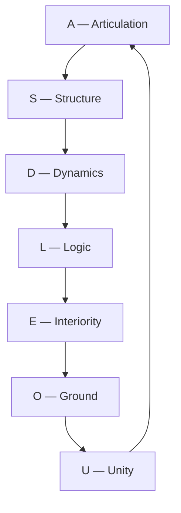
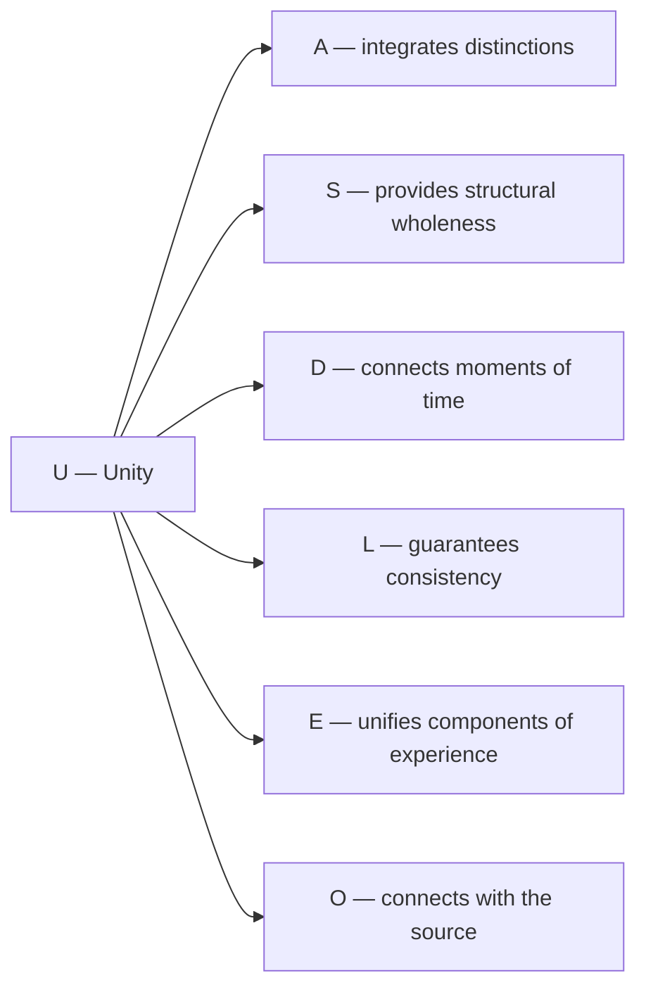

# Dimension VII: Unity (U)

## What this chapter is about

This chapter is devoted to the seventh dimension of the Holon — **Unity**. You will learn:

- Why the idea of unity — from Parmenides to Tononi — occupies a central place in the understanding of reality;
- How dimension $U$ works as a **conductor of the orchestra**, ensuring the coherence of the other six dimensions;
- What the integration measure $\Phi$ is and how it is computed in a **concrete numerical example**;
- Why the threshold $\Phi_{\text{th}} = 1$ is not an arbitrary number but the **unique self-consistent** value;
- How $\Phi_{\text{UHM}}$ differs from Tononi's $\Phi_{\text{IIT}}$ and why the UHM measure is **orders of magnitude** faster;
- What happens when **unity collapses** — from dissociative disorders to depersonalisation.

:::info Who this chapter is for
If you are reading about UHM for the first time — start with the [overview of dimensions](./dimensions). If you are already familiar with the seven dimensions and want to understand what makes a Holon *a unified whole* — you are in the right place.
:::

## Function

**To integrate, to close, to return to the whole.**

## Historical precursor {#историческая-предтеча}

The question "what turns a multiplicity into a unity?" has arisen at every stage in the development of thought.

**Parmenides** (5th century BCE) claimed: being is **one**. There is no void, no non-being, no multiplicity in the genuine sense. Everything that is — is one continuous whole. This radical thesis seems absurd (we do see many things!), but it captured a key intuition: **unity is not a property of things but a condition of their existence**. If a thing is not unified — it is not a thing, but a collection of pieces.

**Gottfried Leibniz** (1714) in the *Monadology* went further: each **monad** is an indivisible unity that "reflects" the entire universe from its own viewpoint. Monads have no "windows" (they do not interact directly), but are coordinated by "pre-established harmony". In UHM the role of "pre-established harmony" is played by the coherences $\gamma_{ij}$: dimensions do not exist in isolation — they are connected, and $U$ ensures that those connections form a whole.

**Giulio Tononi** (2004) in the **Integrated Information Theory (IIT)** gave the first mathematical formalisation of unity: the measure $\Phi_{\text{IIT}}$ assesses how much the system is "more than the sum of its parts". If a system can be cut into two subsystems without loss of information — $\Phi_{\text{IIT}} = 0$, the system is not unified. The more information is lost at any cut — the larger $\Phi_{\text{IIT}}$. The problem: computing $\Phi_{\text{IIT}}$ requires enumerating **all** possible bipartitions — this is $O(2^N)$, an exponentially hard task.

**Daniel Kahneman** (2011) in *Thinking, Fast and Slow* described two "modes" of thinking: **System 1** (fast, automatic) and **System 2** (slow, reflective). From the UHM perspective these are two modes of *integration*: System 1 operates at moderate $\Phi$ (sufficient for a quick response), System 2 requires high $\Phi$ (deep integration of all information sources). The transition between systems is a change in $\Phi$ in real time.

In UHM theory all these ideas converge in a single dimension: **Unity ($U$)** — the Parmenidean One, Leibnizean harmony, Tononovian integrated information, and Kahneman's integration — formalised through the measure $\Phi$ with polynomial computability.

## Description

Unity is the dimension that binds all the other six into one inseparable Holon. It provides the **wholeness and identity** of the system $\mathbb{H}$.

### Intuitive explanation {#интуитивное-объяснение}

Imagine a symphony orchestra. Each musician ($A$, $S$, $D$, $L$, $E$, $O$) plays their own part. The violins distinguish notes ($A$), the cellos create structure ($S$), the percussion sets the rhythm ($D$), the logic of the score connects the parts ($L$), the emotion of the music is experienced ($E$), the energy of breath sustains the playing ($O$). But what turns six parts into **one work**? The **conductor** — dimension $U$.

Without a conductor each musician plays technically correctly, but the result is cacophony. With a conductor — a symphony. The measure $\Phi$ quantifies how "coordinated" the orchestra is: at $\Phi < 1$ the musicians play separately (each hears only themselves), at $\Phi \geq 1$ — a single work sounds (each hears the whole).

:::info Ontological status
Unity is an **aspect** of configuration $\Gamma$, not a separate entity. "The Holon is unified" means: in the coherence matrix $\Gamma$ the projection onto the basis vector $|U\rangle$ is active, and the normalisation condition $\mathrm{Tr}(\Gamma) = 1$ is satisfied.
:::

:::warning Connection with autopoiesis
Removal of dimension $U$ violates **(AP)** — there is no integration, no wholeness. Without $U$ the system fragments and cannot maintain coherence as a unified whole. See [proof](../../proofs/minimality/theorem-minimality-7#случай-n--6-удаление-единства-u).
:::

## Mathematical representation

### Population of U {#населённость-u}

The diagonal element of the coherence matrix:

$$
\gamma_{UU} = \langle U|\Gamma|U\rangle > 0
$$

The condition $\gamma_{UU} > 0$ means that the Unity dimension is active in configuration $\Gamma$. The population $\gamma_{UU}$ is the "strength of the conductor": the more resources allocated to Unity, the more robust the integrity of the system.

**Typical values:**

| System | $\gamma_{UU}$ | Interpretation |
|--------|---------------|----------------|
| Set of disconnected parts | $\sim 0.02$ | Minimal unity |
| Simple organism | $\sim 0.10$ | Basic integrity |
| Healthy human | $\sim 0.16$ | Developed integration |
| Deep meditation | $\sim 0.22$ | Enhanced unity |

:::note
With uniform distribution $\gamma_{UU} = 1/7 \approx 0.143$. Deviation upward — the system emphasises wholeness; downward — tendency towards fragmentation.
:::

### Stress in the U channel

$$
\sigma_U = \mathrm{clamp}(1 - 7\gamma_{UU},\; 0,\; 1) \quad \text{[Т] (T-92)}
$$

- $\sigma_U = 0$: unity is provided ($\gamma_{UU} \geq 1/7$)
- $\sigma_U = 1$: critical unity deficit ($\gamma_{UU} \to 0$) — the system is on the verge of fragmentation

### Normalisation condition

Unity is also formalised through the **normalisation condition** of the [coherence matrix](../../reference/specification#матрица-когерентности):

$$
\mathrm{Tr}(\Gamma) = \sum_{i \in \{A,S,D,L,E,O,U\}} \gamma_{ii} = 1
$$

This condition guarantees that the sum of all diagonal elements (probabilities) equals 1 — the system exists as a whole. Normalisation is the simplest manifestation of unity: all parts together make up 100%.

### Integration measure Φ {#мера-интеграции-φ}

<!-- DRY: Master definition of Φ (integration measure). All references should point here: /docs/core/structure/dimension-u#мера-интеграции-φ -->

The **integration measure** $\Phi$ quantifies the degree of coherence (connectedness) between the dimensions of the Holon:

$$
\Phi(\Gamma) = \frac{\sum_{i \neq j} |\gamma_{ij}|^2}{\sum_i \gamma_{ii}^2}
$$

where:
- Numerator — sum of squared moduli of **coherences** (off-diagonal elements)
- Denominator — sum of squares of **diagonal elements**

**Interpretation:**
- $\Phi = 0$: classical ensemble without coherences (orchestra without a conductor — each on their own)
- $\Phi = 1$: phase-transition point — connections are equal in strength to localisation
- $\Phi \to \infty$: maximally integrated (entangled) state

### Numerical example of computing Φ {#числовой-пример}

Consider a concrete matrix $\Gamma$ for illustration. Let $N = 3$ (simplified, for three dimensions):

$$
\Gamma = \begin{pmatrix} 0.4 & 0.2 & 0.1 \\ 0.2 & 0.35 & 0.15 \\ 0.1 & 0.15 & 0.25 \end{pmatrix}
$$

**Step 1.** Diagonal elements: $\gamma_{11} = 0.4$, $\gamma_{22} = 0.35$, $\gamma_{33} = 0.25$.

**Step 2.** Denominator (sum of squares of the diagonal):

$$
\sum_i \gamma_{ii}^2 = 0.4^2 + 0.35^2 + 0.25^2 = 0.16 + 0.1225 + 0.0625 = 0.345
$$

**Step 3.** Off-diagonal elements: $\gamma_{12} = 0.2$, $\gamma_{13} = 0.1$, $\gamma_{23} = 0.15$ (the matrix is Hermitian, so $\gamma_{ji} = \overline{\gamma_{ij}}$; here all are real for simplicity).

**Step 4.** Numerator (sum of squares of off-diagonal elements — each element counted twice, $i \neq j$):

$$
\sum_{i \neq j} |\gamma_{ij}|^2 = 2(0.2^2 + 0.1^2 + 0.15^2) = 2(0.04 + 0.01 + 0.0225) = 0.145
$$

**Step 5.** Result:

$$
\Phi = \frac{0.145}{0.345} \approx 0.42
$$

Conclusion: $\Phi < 1$ — the system is **not integrated**. The connections between dimensions are weaker than the "weight" of the dimensions themselves. This is like an orchestra where each musician hears themselves more than their neighbour.

If $\gamma_{12} = 0.35$, $\gamma_{13} = 0.25$, $\gamma_{23} = 0.3$ (strong connections), one would obtain:

$$
\Phi = \frac{2(0.35^2 + 0.25^2 + 0.3^2)}{0.345} = \frac{2(0.1225 + 0.0625 + 0.09)}{0.345} = \frac{0.55}{0.345} \approx 1.59
$$

Now $\Phi > 1$ — the system is **integrated**. Connections dominate.

## Role in integration

### Integration of experience (L2)

At level L2 ([cognitive qualia](../../proofs/consciousness/interiority-hierarchy#уровень-2-когнитивные-квалиа-cognitive-qualia)) the subjective unity of experience ("I") arises when the following conditions are satisfied:

$$
R \geq R_{\text{th}} = \frac{1}{3}, \quad \Phi \geq \Phi_{\text{th}} = 1
$$

where $R$ is the [reflection measure](/docs/consciousness/foundations/self-observation#мера-рефлексии-r). The thresholds are proved mathematically: $P_{\text{crit}}$ [Т], $R_{\text{th}}$ [Т], $\Phi_{\text{th}}$ **[Т]** ([T-129](/docs/proofs/consciousness/operationalization#t-129)); PW constraint [О] (T16) gives their ontological interpretation. See [L2 thresholds](../foundations/axiom-septicity#пороги-l2-строгий-вывод).

### Theorem: Integration threshold Φ_th = 1 [Т] {#теорема-порог-интеграции}

:::info Status: [Т] Theorem (elevated from [О], T-129)
The value $\Phi_{\text{th}} = 1$ is the **unique self-consistent** value of the integration threshold with $P_{\text{crit}} = 2/7$ on the extremal uniform-diagonal state. Previously — a definitional convention; now derived from first principles ([T-129 [Т]](/docs/proofs/consciousness/operationalization#t-129)).
:::

**Statement:**
$$
\Phi_{\text{th}} = 1
$$

**Motivation for the threshold:**

**Step 1: Definition of Φ**

$$
\Phi(\Gamma) = \frac{\sum_{i \neq j} |\gamma_{ij}|^2}{\sum_i \gamma_{ii}^2}
$$

**Step 2: Interpretation of components**

- Numerator: total "energy" of coherences (connections between dimensions)
- Denominator: total "energy" of the diagonal (localisation in individual dimensions)

$\Phi = 1$ means: **coherences carry the same aggregate weight as the diagonal**.

**Step 3: Geometric intuition**

Returning to the orchestra analogy. Each musician has a "volume" ($\gamma_{ii}$) and a "hearability of neighbours" ($|\gamma_{ij}|$). The threshold $\Phi = 1$ is the moment when **the total volume of all connections between musicians becomes no less than the total volume of the musicians themselves**. It is precisely at this moment that the orchestra begins to sound as a unified whole, not as a collection of soloists.

**Step 4: Integration condition**

A system is **integrated** if the connections between dimensions are no weaker than the dimensions themselves:

$$
\sum_{i \neq j} |\gamma_{ij}|^2 \geq \sum_i \gamma_{ii}^2
$$

This is equivalent to:

$$
\Phi \geq 1
$$

**Step 5: Minimality of the threshold**

$\Phi_{\text{th}} = 1$ is the **minimal** value at which the system is integrated by definition:
- At $\Phi < 1$: the diagonal dominates → fragmented state
- At $\Phi \geq 1$: coherences are no weaker than the diagonal → integrated state

**Step 6: Summary**

The boundary $\Phi = 1$ separates:
- $\Phi < 1$: classical mixture (localisation dominates over connections)
- $\Phi \geq 1$: quantum integration (connections are no weaker than localisation)

The value $\Phi_{\text{th}} = 1$ **[Т]** (T-129) — the unique self-consistent value at $P_{\text{crit}} = 2/7$. See [proof](/docs/proofs/consciousness/operationalization#t-129).

### Connection with Integrated Information (IIT) {#связь-с-iit}

:::info Status: [О] Definitions formalised; [Т] threshold Φ_th = 1 (T-129)
The connection between the UHM integration measure ($\Phi_{\text{UHM}}$) and IIT integrated information ($\Phi_{\text{IIT}}$) is defined in the categorical formalism. The exact numerical correspondence of the thresholds is a [Г] hypothesis.
:::

#### Definition of Φ_IIT in categorical language

**Definition (Φ_IIT via C*-algebra):**

$$
\Phi_{\text{IIT}}(\Gamma) := \min_{\pi \in \text{Part}(\Gamma)} D_B(\Gamma, \pi^*(\Gamma))
$$

where:
- $\text{Part}(\Gamma)$ — the set of all bipartitions of system Γ
- $\pi^*(\Gamma)$ — the "disconnected" state (without correlations between parts)
- $D_B$ — the Bures distance

**Intuitive explanation.** $\Phi_{\text{IIT}}$ answers the question: "If the system is cut in half in the best possible way, how much information is lost?" One must check **all possible cuts** and choose the one at which the loss is minimal. For a system of $N$ elements the number of bipartitions is $2^{N-1}$, making computation practically impossible for large $N$.

#### Definition of the integration threshold {#теорема-эквивалентность-порогов}

:::info Definition (Threshold of coherent integration)
A system is **coherently integrated** if coherences dominate over populations:

$$
\Phi(\Gamma) \geq \Phi_{\text{th}} = 1 \quad \Longleftrightarrow \quad \underbrace{\sum_{i \neq j} |\gamma_{ij}|^2}_{P_{\text{coh}}} \geq \underbrace{\sum_i \gamma_{ii}^2}_{P_{\text{diag}}}
$$
:::

**Structural meaning.** The value $\Phi_{\text{th}} = 1$ **[Т]** (T-129) — the unique self-consistent value at $P_{\text{crit}} = 2/7$. Substantive motivation:

1. **Purity normalisation:** $P = \mathrm{Tr}(\Gamma^2) = P_{\text{diag}} + P_{\text{coh}}$, so $\Phi \geq 1 \Leftrightarrow P_{\text{coh}} \geq P/2$ — at least half of [purity](/docs/core/dynamics/viability#определение-чистоты) is determined by coherences.

2. **Structural phase transition:** At $\Phi < 1$ the state is "quasi-diagonal" — subsystems are quasi-independent. At $\Phi \geq 1$ inter-dimension coherences dominate — subsystems are causally connected through the [coherence matrix](/docs/core/dynamics/coherence-matrix).

3. **Connection with (AP):** [Closure of the (M,R)-system](/docs/core/foundations/axiom-septicity#предварительное-условие-автономность) requires causal paths between dimensions encoded in the coherences $\gamma_{ij}$. The condition $\Phi \geq 1$ guarantees that these paths are structurally significant (not small perturbations of the diagonal state).

4. **Categorical justification:** In the category **Hol** [Hom-sets](/docs/proofs/categorical/categorical-formalism) between dimensions $i, j$ are identified with coherences: $\mathrm{Hom}(i,j) \leftrightarrow \gamma_{ij}$ ([L-unification](/docs/proofs/categorical/categorical-formalism#l-унификация) [Т]). The condition $\Phi \geq 1$ means that the **morphism structure** dominates over the **object structure** — the category is "non-trivially connected".

#### Comparison with Φ_IIT {#сравнение-с-iit}

:::warning Hypothesis (Correspondence of UHM–IIT thresholds) [Г]
$$
\Phi_{\text{UHM}} \geq 1 \quad \Longleftrightarrow \quad \Phi_{\text{IIT}} \geq \log(2)
$$
The exact numerical correspondence of thresholds is an **open hypothesis**, since $\Phi_{\text{UHM}}$ (ratio of coherences to diagonal in $\mathbb{C}^7$) and $\Phi_{\text{IIT}}$ (minimisation of Bures distance over bipartitions) are defined on different spaces in different ways. Qualitative correspondence (both measures separate fragmented and integrated regimes) is supported by the structure of both theories.
:::

| Aspect | $\Phi_{\text{UHM}}$ | $\Phi_{\text{IIT}}$ |
|--------|---------------------|---------------------|
| Definition | Ratio of coherences to diagonal | Minimum distance to separated state |
| Threshold | 1 **[Т]** (T-129) | $\log(2) \approx 0.693$ (hypothesis) |
| Computational complexity | $O(N^2)$ — **polynomial** | $O(2^N)$ — **exponential** (NP-hard) |
| Structural interpretation | Coherent domination | Inseparability |
| Quantum extension | Natural (already quantum) | Requires modification |

**Advantage of UHM:** The measure $\Phi_{\text{UHM}}$ is computable in polynomial time. For a system of $N = 7$ dimensions: $\Phi_{\text{UHM}}$ requires $7^2 = 49$ operations. $\Phi_{\text{IIT}}$ for 7 elements would require $2^6 = 64$ bipartitions, each with a Bures distance computation — **orders of magnitude** slower. For $N = 100$: $\Phi_{\text{UHM}}$ — 10,000 operations, $\Phi_{\text{IIT}}$ — $2^{99} \approx 10^{30}$ bipartitions (practically impossible).

#### Why $O(N^2)$ vs $O(2^N)$ matters {#вычислительная-сложность}

For practical applications (AI, neuroscience, clinical diagnostics) computational complexity is not an abstract question, but a question of **feasibility**.

| $N$ (number of elements) | $\Phi_{\text{UHM}}$: $N^2$ operations | $\Phi_{\text{IIT}}$: $2^N$ bipartitions |
|---|---|---|
| 7 | 49 | 64 |
| 20 | 400 | 1 048 576 ($\sim 10^6$) |
| 100 | 10 000 | $\sim 10^{30}$ (impossible) |
| 1000 | 1 000 000 | $\sim 10^{301}$ (absurd) |

For a brain with $\sim 10^{11}$ neurons: $\Phi_{\text{IIT}}$ is uncomputable in principle. $\Phi_{\text{UHM}}$ (with adequate coarse-graining to $N = 7$ dimensions) is computable instantly. This makes UHM a **practically applicable** theory of consciousness, unlike IIT, which remains mathematically elegant but computationally inaccessible.

### Closure of causality

Unity closes the causal cycle of the (M,R)-system:

```mermaid
graph TD
    A[A — Articulation] --> S[S — Structure]
    S --> D[D — Dynamics]
    D --> L[L — Logic]
    L --> E[E — Interiority]
    E --> O[O — Ground]
    O --> U[U — Unity]
    U --> A
```

The closure $U \to A$ ensures **self-consistency**: the result of integration returns to articulation, generating a new cycle. Without this closure the chain $A \to S \to D \to L \to E \to O$ breaks — the system is "open" and cannot sustain itself.

## Connection with consciousness

The consciousness measure $C = \Phi \times R$ **[Т T-140]** (definition see [self-observation](/docs/consciousness/foundations/self-observation#мера-сознательности-c)). Differentiation $D_{\text{diff}} \geq D_{\min}$ is a separate viability condition.

**Role of U in consciousness:** $\Phi$ is the direct contribution of dimension $U$ to the consciousness measure $C$. Without integration ($\Phi < 1$) there is no consciousness, even if reflection is high ($R \geq 1/3$): the system "sees" its inner world, but it is **fragmented** — like a dream in which the scenes are not connected to each other.

## Examples {#примеры}

### Physical level

| System | $\Phi$ | Description |
|--------|--------|-------------|
| Ideal gas | $\approx 0$ | No correlations — $\mathrm{Tr}(\Gamma) = 1$, but all "purity" is in the diagonal |
| Centre of mass of a body | — | Integration of distributed mass into a single point |
| Bound state (atom) | $\gg 1$ | Electron and nucleus — a unified whole, not a collection of particles |
| Superconductor | $\gg 1$ | Macroscopic coherence — all electrons in one state |

### Biological level

| System | $\Phi$ | Description |
|--------|--------|-------------|
| Bacterial colony | $< 1$ | Weak integration — each bacterium is nearly independent |
| Organism | $\geq 1$ | Integration of organs into a unified system |
| Nervous system | $\gg 1$ | Integration of sensory information into unified perception |
| Homeostasis | $\geq 1$ | Maintenance of the integrity of the internal environment |

### Cognitive level

| System | $\Phi$ | Description |
|--------|--------|-------------|
| Scattered attention | $\sim 0.8$ | Thoughts "jump" — incomplete integration |
| Self-awareness | $\geq 1$ | Knowledge of oneself as a whole |
| Identity | $\gg 1$ | Continuity of the "I" in time |
| Perceptual synthesis | $\geq 1$ | Unification of modalities (vision+hearing+touch) into a single experience |
| Flow state | $\gg 1$ | Maximum integration — "all is one" |

## Collapse of unity {#распад-единства}

When $\gamma_{Ui} \to 0$ for all $i$:

1. Loss of integration: $\Phi \to 0$
2. Dissociation of consciousness: rupture between dimensions
3. Fragmentation of experience: the "I" breaks into parts

**Intuitive explanation.** Imagine the conductor leaving the orchestra. At first the musicians continue to play by inertia (for a time $\Phi$ is still high). But gradually each begins to play at their own tempo and volume. The violins can no longer hear the cellos, the percussion loses the rhythm. Music turns into noise. This is what the collapse of unity looks like in a Holon: the dimensions "drift apart", and the whole ceases to exist.

### Clinical analogies (expanded)

| Condition | What decreases | Mechanism | Manifestations |
|-----------|----------------|-----------|----------------|
| **Dissociative identity disorder** | $\gamma_{UE} \approx 0$ | Rupture between unity and interiority | Multiple "I"s — each with its own $\rho_E$, but without a shared $U$ |
| **Derealisation** | $\gamma_{UA} \approx 0$ | Unity loses connection with distinctions | "The world is unreal" — distinctions exist, but are not integrated into unified perception |
| **Depersonalisation** | $\gamma_{UU} \to P_{\text{crit}}$ | Unity loses resources | "I am unreal" — the feeling that the "I" is dissolving; $U$ is on the verge of disappearing |
| **Schizophrenia (positive symptoms)** | $\gamma_{UL} \approx 0$ | Unity loses connection with logic | Integration without logical consistency — "everything is connected, but meaningless" |
| **Personality splitting under trauma** | $\gamma_{Ui} \to 0$ | Global decrease of U coherence | Defensive mechanism: the system "sacrifices" unity to preserve the other dimensions |

## Connection with other dimensions

```mermaid
graph LR
    U[U — Unity] --> A[A — integrates distinctions]
    U --> S[S — provides structural wholeness]
    U --> D[D — connects moments of time]
    U --> L[L — guarantees consistency]
    U --> E[E — unifies components of experience]
    U --> O[O — connects with the source]
```

**Key connections:**

- **U ↔ E (Synthesis):** Through $\gamma_{UE}$ Unity integrates the components of experience into a single experience. Without this connection — dissociation (multiple "I"s).

- **U ↔ O (Connection with the source):** Through $\gamma_{UO}$ Unity receives energy from the Ground. The coherence $\gamma_{OU}$ enters the numerator of $\kappa_0$ — wholeness literally "feeds" from the source. Without this connection — existential fragmentation.

- **U ↔ A (Cycle closure):** Through $\gamma_{UA}$ Unity returns the integrated result back to Articulation, closing the (M,R)-cycle. Without this connection — derealisation.

- **U ↔ L (Logical coherence):** Through $\gamma_{UL}$ unity ensures that integration is **logically consistent**. Without this connection — delusional connections (as in schizophrenia: "everything is connected to everything", but illogically).

## Coherence with U

| Coherence | Interpretation |
|-----------|----------------|
| $\gamma_{UA}$ | Integration of distinctions |
| $\gamma_{US}$ | Wholeness of structure |
| $\gamma_{UD}$ | Continuity of being in time |
| $\gamma_{UL}$ | Logical consistency of the whole |
| $\gamma_{UE}$ | Synthesis (integration of interior content into the whole) |
| $\gamma_{UO}$ | Connection of wholeness with the source |

## Φ and phase transitions {#фазовые-переходы}

The transition through $\Phi = 1$ is a **phase transition** in the configuration of the Holon, analogous to phase transitions in physics.

| Physical analogue | $\Phi < 1$ (fragmented) | $\Phi \geq 1$ (integrated) |
|-------------------|------------------------|---------------------------|
| Water | Steam (molecules independent) | Liquid (molecules coherent) |
| Magnet | Paramagnet (spins chaotic) | Ferromagnet (spins aligned) |
| Orchestra | Warm-up (each on their own) | Concert (single work) |
| Consciousness | Deep anaesthesia | Wakefulness |

In physics, phase transitions are accompanied by a **qualitative** change in properties: water-as-steam looks completely different from water-as-liquid. In exactly the same way, the transition through $\Phi = 1$ is a qualitative change: the system ceases to be a "collection of parts" and becomes a "whole".

:::note Connection with the consciousness threshold
The phase transition $\Phi = 1$ is one of the two necessary conditions for L2 (consciousness). The second is $R \geq 1/3$ (reflection). Only when both conditions are satisfied does conscious experience arise. Details: [L2 thresholds](../foundations/axiom-septicity#пороги-l2-строгий-вывод).
:::

## Connection with purity

[Purity](../dynamics/viability#определение-чистоты) $P$ is connected to coherences:

$$
P = \mathrm{Tr}(\Gamma^2) = \sum_{i} \gamma_{ii}^2 + \sum_{i \neq j} |\gamma_{ij}|^2
$$

High coherence with $U$ (large $|\gamma_{Ui}|$) correlates with high overall purity $P$, since coherences make a positive contribution to $P$.

**Corollary:** Unity not only "connects" the dimensions, but also **raises the overall orderliness** of the system. A connected orchestra plays "more cleanly" (higher $P$) than a disconnected one.

### Octonionic context {#октонионный-контекст}

:::note Octonionic correspondence [Т]
The dimension corresponds to $e_6 \in \mathrm{Im}(\mathbb{O})$. This identification is a **theorem** [Т]: the [T15 bridge chain](/docs/core/foundations/axiom-septicity#мост-p1p2) (all steps [Т]) derives the octonionic structure from (AP)+(PH)+(QG)+(V); [T-177 [Т]](/docs/reference/status-registry) and [T-183 [Т]](/docs/reference/status-registry) prove the combinatorial and functional uniqueness of each role. The specific assignment $U = e_6$ is fixed up to $G_2$-gauge equivalence ([T-42a [Т]](/docs/proofs/categorical/uniqueness-theorem)). Details and $G_2$-caveat: [Octonionic interpretation](./dimensions#октонионная-интерпретация), [structural derivation](../../proofs/minimality/theorem-octonionic-derivation).
:::

---

**Related documents:**
- [Axiom of Septicity](../foundations/axiom-septicity) — theorem on $\Phi_{\text{th}} = 1$
- [Ground (O)](./dimension-o) — previous dimension
- [Seven dimensions](./dimensions) — overview of all dimensions
- [Self-observation](/docs/consciousness/foundations/self-observation) — connection with consciousness
- [Viability](../dynamics/viability) — conditions of existence
- [Interiority hierarchy](../../proofs/consciousness/interiority-hierarchy) — formal definitions
- [Integrated Information Theory (comparison)](/docs/consciousness/comparative/consciousness-theories) — UHM vs IIT
- [Operationalisation](/docs/proofs/consciousness/operationalization) — derivation of T-129
