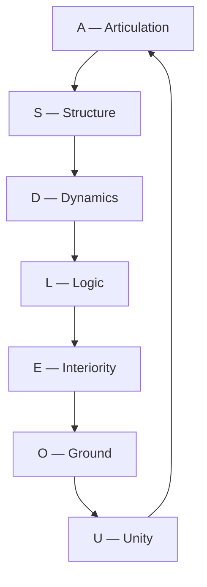
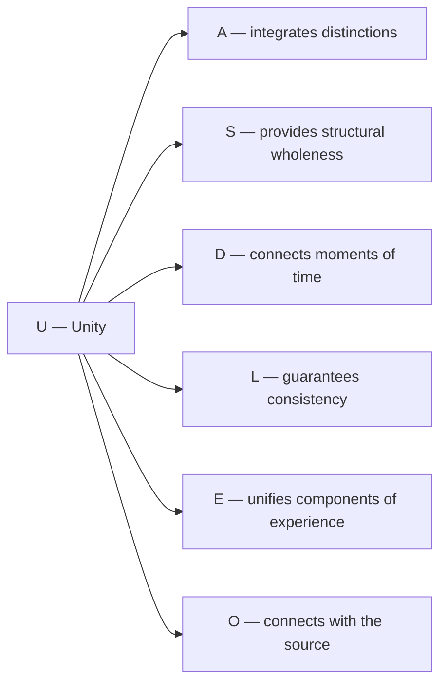

# Dimension VII: Unity (U)

## What this chapter is about

This chapter is devoted to the seventh dimension of the Holon — **Unity**. You will learn:

- Why the idea of unity — from Parmenides to Tononi — occupies a central place in the understanding of reality;
- How dimension $U$ works as a **conductor of the orchestra**, ensuring the coherence of the other six dimensions;
- What the integration measure $\Phi$ is and how it is computed in a **concrete numerical example**;
- Why the threshold $\Phi_{\text{th}} = 1$ is not an arbitrary number but the **unique self-consistent** value;
- How $\Phi_{\text{UHM}}$ differs from Tononi's $\Phi_{\text{IIT}}$ and why the UHM measure is **orders of magnitude** faster;
- What happens when **unity collapses** — from dissociative disorders to depersonalisation.

:::info Who this chapter is for
If you are reading about UHM for the first time — start with the [overview of dimensions](./dimensions). If you are already familiar with the seven dimensions and want to understand what makes a Holon *a unified whole* — you are in the right place.
:::

## Function

**To integrate, to close, to return to the whole.**

## Historical precursor {#историческая-предтеча}

The question "what turns a multiplicity into a unity?" has arisen at every stage in the development of thought.

**Parmenides** (5th century BCE) claimed: being is **one**. There is no void, no non-being, no multiplicity in the genuine sense. Everything that is — is one continuous whole. This radical thesis seems absurd (we do see many things!), but it captured a key intuition: **unity is not a property of things but a condition of their existence**. If a thing is not unified — it is not a thing, but a collection of pieces.

**Gottfried Leibniz** (1714) in the *Monadology* went further: each **monad** is an indivisible unity that "reflects" the entire universe from its own viewpoint. Monads have no "windows" (they do not interact directly), but are coordinated by "pre-established harmony". In UHM the role of "pre-established harmony" is played by the coherences $\gamma_{ij}$: dimensions do not exist in isolation — they are connected, and $U$ ensures that those connections form a whole.

**Giulio Tononi** (2004) in the **Integrated Information Theory (IIT)** gave the first mathematical formalisation of unity: the measure $\Phi_{\text{IIT}}$ assesses how much the system is "more than the sum of its parts". If a system can be cut into two subsystems without loss of information — $\Phi_{\text{IIT}} = 0$, the system is not unified. The more information is lost at any cut — the larger $\Phi_{\text{IIT}}$. The problem: computing $\Phi_{\text{IIT}}$ requires enumerating **all** possible bipartitions — this is $O(2^N)$, an exponentially hard task.

**Daniel Kahneman** (2011) in *Thinking, Fast and Slow* described two "modes" of thinking: **System 1** (fast, automatic) and **System 2** (slow, reflective). From the UHM perspective these are two modes of *integration*: System 1 operates at moderate $\Phi$ (sufficient for a quick response), System 2 requires high $\Phi$ (deep integration of all information sources). The transition between systems is a change in $\Phi$ in real time.

In UHM theory all these ideas converge in a single dimension: **Unity ($U$)** — the Parmenidean One, Leibnizean harmony, Tononovian integrated information, and Kahneman's integration — formalised through the measure $\Phi$ with polynomial computability.

## Description

Unity is the dimension that binds all the other six into one inseparable Holon. It provides the **wholeness and identity** of the system $\mathbb{H}$.

### Intuitive explanation {#интуитивное-объяснение}

Imagine a symphony orchestra. Each musician ($A$, $S$, $D$, $L$, $E$, $O$) plays their own part. The violins distinguish notes ($A$), the cellos create structure ($S$), the percussion sets the rhythm ($D$), the logic of the score connects the parts ($L$), the emotion of the music is experienced ($E$), the energy of breath sustains the playing ($O$). But what turns six parts into **one work**? The **conductor** — dimension $U$.

Without a conductor each musician plays technically correctly, but the result is cacophony. With a conductor — a symphony. The measure $\Phi$ quantifies how "coordinated" the orchestra is: at $\Phi < 1$ the musicians play separately (each hears only themselves), at $\Phi \geq 1$ — a single work sounds (each hears the whole).

:::info Ontological status
Unity is an **aspect** of configuration $\Gamma$, not a separate entity. "The Holon is unified" means: in the coherence matrix $\Gamma$ the projection onto the basis vector $|U\rangle$ is active, and the normalisation condition $\mathrm{Tr}(\Gamma) = 1$ is satisfied.
:::

:::warning Connection with autopoiesis
Removal of dimension $U$ violates **(AP)** — there is no integration, no wholeness. Without $U$ the system fragments and cannot maintain coherence as a unified whole. See [proof](../../proofs/minimality/theorem-minimality-7#случай-n--6-удаление-единства-u).
:::

## Mathematical representation

### Population of U {#населённость-u}

The diagonal element of the coherence matrix:

$$
\gamma_{UU} = \langle U|\Gamma|U\rangle > 0
$$

The condition $\gamma_{UU} > 0$ means that the Unity dimension is active in configuration $\Gamma$. The population $\gamma_{UU}$ is the "strength of the conductor": the more resources allocated to Unity, the more robust the integrity of the system.

**Typical values:**

| System | $\gamma_{UU}$ | Interpretation |
|--------|---------------|----------------|
| Set of disconnected parts | $\sim 0.02$ | Minimal unity |
| Simple organism | $\sim 0.10$ | Basic integrity |
| Healthy human | $\sim 0.16$ | Developed integration |
| Deep meditation | $\sim 0.22$ | Enhanced unity |

:::note
With uniform distribution $\gamma_{UU} = 1/7 \approx 0.143$. Deviation upward — the system emphasises wholeness; downward — tendency towards fragmentation.
:::

### Stress in the U channel

$$
\sigma_U = \mathrm{clamp}(1 - 7\gamma_{UU},\; 0,\; 1) \quad \text{[T] (T-92)}
$$

- $\sigma_U = 0$: unity is provided ($\gamma_{UU} \geq 1/7$)
- $\sigma_U = 1$: critical unity deficit ($\gamma_{UU} \to 0$) — the system is on the verge of fragmentation

### Normalisation condition

Unity is also formalised through the **normalisation condition** of the [coherence matrix](../../reference/specification#матрица-когерентности):

$$
\mathrm{Tr}(\Gamma) = \sum_{i \in \{A,S,D,L,E,O,U\}} \gamma_{ii} = 1
$$

This condition guarantees that the sum of all diagonal elements (probabilities) equals 1 — the system exists as a whole. Normalisation is the simplest manifestation of unity: all parts together make up 100%.

### Integration measure Φ {#мера-интеграции-φ}

<!-- DRY: Master definition of Φ (integration measure). All references should point here: /docs/core/structure/dimension-u#мера-интеграции-φ -->

The **integration measure** $\Phi$ quantifies the degree of coherence (connectedness) between the dimensions of the Holon:

$$
\Phi(\Gamma) = \frac{\sum_{i \neq j} |\gamma_{ij}|^2}{\sum_i \gamma_{ii}^2}
$$

where:
- Numerator — sum of squared moduli of **coherences** (off-diagonal elements)
- Denominator — sum of squares of **diagonal elements**

**Interpretation:**
- $\Phi = 0$: classical ensemble without coherences (orchestra without a conductor — each on their own)
- $\Phi = 1$: phase-transition point — connections are equal in strength to localisation
- $\Phi \to \infty$: maximally integrated (entangled) state

### Numerical example of computing Φ {#числовой-пример}

Consider a concrete matrix $\Gamma$ for illustration. Let $N = 3$ (simplified, for three dimensions):

$$
\Gamma = \begin{pmatrix} 0.4 & 0.2 & 0.1 \\ 0.2 & 0.35 & 0.15 \\ 0.1 & 0.15 & 0.25 \end{pmatrix}
$$

**Step 1.** Diagonal elements: $\gamma_{11} = 0.4$, $\gamma_{22} = 0.35$, $\gamma_{33} = 0.25$.

**Step 2.** Denominator (sum of squares of the diagonal):

$$
\sum_i \gamma_{ii}^2 = 0.4^2 + 0.35^2 + 0.25^2 = 0.16 + 0.1225 + 0.0625 = 0.345
$$

**Step 3.** Off-diagonal elements: $\gamma_{12} = 0.2$, $\gamma_{13} = 0.1$, $\gamma_{23} = 0.15$ (the matrix is Hermitian, so $\gamma_{ji} = \overline{\gamma_{ij}}$; here all are real for simplicity).

**Step 4.** Numerator (sum of squares of off-diagonal elements — each element counted twice, $i \neq j$):

$$
\sum_{i \neq j} |\gamma_{ij}|^2 = 2(0.2^2 + 0.1^2 + 0.15^2) = 2(0.04 + 0.01 + 0.0225) = 0.145
$$

**Step 5.** Result:

$$
\Phi = \frac{0.145}{0.345} \approx 0.42
$$

Conclusion: $\Phi < 1$ — the system is **not integrated**. The connections between dimensions are weaker than the "weight" of the dimensions themselves. This is like an orchestra where each musician hears themselves more than their neighbour.

If $\gamma_{12} = 0.35$, $\gamma_{13} = 0.25$, $\gamma_{23} = 0.3$ (strong connections), one would obtain:

$$
\Phi = \frac{2(0.35^2 + 0.25^2 + 0.3^2)}{0.345} = \frac{2(0.1225 + 0.0625 + 0.09)}{0.345} = \frac{0.55}{0.345} \approx 1.59
$$

Now $\Phi > 1$ — the system is **integrated**. Connections dominate.

**Corollary — integration forces voice-multiplicity.** The total purity $P = \mathrm{Tr}(\Gamma^2) = \sum_{i \neq j}|\gamma_{ij}|^2 + \sum_i \gamma_{ii}^2$ is *exactly* the numerator plus the denominator of $\Phi$, so the diagonal weight is pinned:

$$
\sum_i \gamma_{ii}^2 = \frac{P}{1+\Phi}.
$$

Since $P \leq 1$ (eigenvalues lie in $[0,1]$, so $\sum \lambda^2 \leq \sum \lambda = 1$), the integration gate forces the diagonal to spread:

$$
\Phi \geq 1 \;\Longrightarrow\; \sum_i \gamma_{ii}^2 \leq \tfrac{1}{2} \;\Longrightarrow\; \frac{1}{\sum_i \gamma_{ii}^2} \geq 2.
$$

**An integrated holon is never localised on a single voice**: $\Phi \geq 1$ necessarily distributes the diagonal weight over at least two effective voices (participation ratio $\geq 2$). This *diagonal* (voice-weight) multiplicity is distinct from — and not implied by — the E-sector differentiation $D_{\mathrm{diff}} = e^{S_{vN}} \geq 2$ (T-151), which is **independent** of $\Phi$: a state can be integrated yet have $D_{\mathrm{diff}} < 2$ (see [conscious-window](/docs/proofs/consciousness/conscious-window), Counterexample 4). Integration compels voice-multiplicity, not phenomenal richness — two distinct "at-least-two" conditions, exact and cheap to check.

Within the **consciousness window** this sharpens. Reflection $R \geq 1/3$ forces $P \leq 3/7$, so a conscious holon (also $\Phi \geq 1$) has participation

$$
\frac{1}{\sum_i \gamma_{ii}^2} = \frac{1+\Phi}{P} \geq \frac{2}{3/7} = \frac{14}{3} \approx 4.67.
$$

**Consciousness engages nearly five of the seven voices**: it is structurally broad, never a single-voice specialist. (The bound is tight at the window edge $\Phi = 1$, $P = 3/7$; real charts, with $\Phi \approx 1.03$ and $P \approx 0.34$, sit near $1/d^2 \approx 6$.)

## Role in integration

### Integration of experience (L2)

At level L2 ([cognitive qualia](../../proofs/consciousness/interiority-hierarchy#уровень-2-когнитивные-квалиа-cognitive-qualia)) the subjective unity of experience ("I") arises when the following conditions are satisfied:

$$
R \geq R_{\text{th}} = \frac{1}{3}, \quad \Phi \geq \Phi_{\text{th}} = 1
$$

where $R$ is the [reflection measure](/docs/consciousness/foundations/self-observation#мера-рефлексии-r). The thresholds are proved mathematically: $P_{\text{crit}}$ [T], $R_{\text{th}}$ [T], $\Phi_{\text{th}}$ **[T]** ([T-129](/docs/proofs/consciousness/operationalization#t-129)); PW constraint [D] (T16) gives their ontological interpretation. See [L2 thresholds](../foundations/axiom-septicity#пороги-l2-строгий-вывод).

### Theorem: Integration threshold Φ_th = 1 [T] {#теорема-порог-интеграции}

:::info Status: [T] Theorem (T-129)
The value $\Phi_{\text{th}} = 1$ is the **unique self-consistent** value of the integration threshold with $P_{\text{crit}} = 2/7$ on the extremal uniform-diagonal state. Previously — a definitional convention; now derived from first principles ([T-129 [T]](/docs/proofs/consciousness/operationalization#t-129)).
:::

**Statement:**
$$
\Phi_{\text{th}} = 1
$$

**Motivation for the threshold:**

**Step 1: Definition of Φ**

$$
\Phi(\Gamma) = \frac{\sum_{i \neq j} |\gamma_{ij}|^2}{\sum_i \gamma_{ii}^2}
$$

**Step 2: Interpretation of components**

- Numerator: total "energy" of coherences (connections between dimensions)
- Denominator: total "energy" of the diagonal (localisation in individual dimensions)

$\Phi = 1$ means: **coherences carry the same aggregate weight as the diagonal**.

**Step 3: Geometric intuition**

Returning to the orchestra analogy. Each musician has a "volume" ($\gamma_{ii}$) and a "hearability of neighbours" ($|\gamma_{ij}|$). The threshold $\Phi = 1$ is the moment when **the total volume of all connections between musicians becomes no less than the total volume of the musicians themselves**. It is precisely at this moment that the orchestra begins to sound as a unified whole, not as a collection of soloists.

**Step 4: Integration condition**

A system is **integrated** if the connections between dimensions are no weaker than the dimensions themselves:

$$
\sum_{i \neq j} |\gamma_{ij}|^2 \geq \sum_i \gamma_{ii}^2
$$

This is equivalent to:

$$
\Phi \geq 1
$$

**Step 5: Minimality of the threshold**

$\Phi_{\text{th}} = 1$ is the **minimal** value at which the system is integrated by definition:
- At $\Phi < 1$: the diagonal dominates → fragmented state
- At $\Phi \geq 1$: coherences are no weaker than the diagonal → integrated state

**Step 6: Summary**

The boundary $\Phi = 1$ separates:
- $\Phi < 1$: classical mixture (localisation dominates over connections)
- $\Phi \geq 1$: quantum integration (connections are no weaker than localisation)

The value $\Phi_{\text{th}} = 1$ **[T]** (T-129) — the unique self-consistent value at $P_{\text{crit}} = 2/7$. See [proof](/docs/proofs/consciousness/operationalization#t-129).

### Which contents can cross the threshold {#какое-содержание-берёт-порог}

The threshold theorem says *when* a holon is integrated. It does not say **what it must be holding** to get there, and that turns out to be a far narrower thing than the definition of $\Phi$ suggests. The answer is exact, and it is worth deriving in full, because it changes what the twenty-one coherences of a holon are for.

Fix the diagonal flat — every dimension carrying the same weight $\gamma_{ii} = 1/7$, so that nothing is decided by localisation — and let the content live entirely in the *signs* of the coherences. Write $S$ for that pattern of signs: $S_{ij} = +1$ where two dimensions agree, $S_{ij} = -1$ where they disagree, and $S_{ii} = 0$. A state with this content and coherence strength $c$ is

$$
\Gamma = \tfrac{1}{7} I + c\,S
$$

**Step 1 — what $\Phi$ becomes.** The denominator is $\sum_i \gamma_{ii}^2 = 7 \cdot (1/7)^2 = 1/7$. The numerator counts each of the $21$ pairs twice, each contributing $c^2$, so it is $42c^2$. Hence

$$
\Phi = \frac{42c^2}{1/7} = 294\,c^2
$$

Integration therefore grows with the strength of the coherences and with nothing else — so the question becomes how strong they are *allowed* to be.

**Step 2 — how far the content can be pushed.** A state must stay positive: no dimension may carry negative weight in any basis. The eigenvalues of $\Gamma$ are $1/7 + c\,\mu$ where $\mu$ runs over the eigenvalues of $S$, so the binding constraint comes from the most negative one, $\lambda_{\min}(S)$. Positivity holds exactly while

$$
c \le \frac{1}{7\,|\lambda_{\min}(S)|}
$$

**Step 3 — the identity.** Substituting that ceiling into Step 1:

$$
\Phi_{\max} = 294 \cdot \frac{1}{49\,\lambda_{\min}(S)^2} = \frac{6}{\lambda_{\min}(S)^2}
$$

This is an identity, not an approximation; measured against direct computation it holds to $8.9 \cdot 10^{-16}$, which is machine precision. And it converts the integration gate into a **spectral condition on the shape of the content**:

$$
\Phi \ge 1 \iff |\lambda_{\min}(S)| \le \sqrt{6} \approx 2.449
$$

**Step 4 — which patterns pass.** Suppose each dimension carries a single orientation $s_i = \pm 1$ — call it a *polarity* — and two dimensions agree exactly when their orientations match, so $S_{ij} = s_i s_j$. Then $S = ss^{\top} - I$, whose eigenvalues are $6$ (once, along $s$ itself) and $-1$ (six times). So $\lambda_{\min} = -1$ and $\Phi = 6$: the largest value any sign pattern can reach, and six times over the threshold.

Now flip a single one of the twenty-one agreements. The smallest eigenvalue moves to $-2.5311$, and

$$
\Phi = \frac{6}{2.5311^2} = 0.9365
$$

The gate closes. **One disagreement out of twenty-one costs a factor of six and misses the threshold by three percent.** A second flip gives $0.7151$, a third $0.5185$; nothing recovers.

**Step 5 — why, in one word.** A signed graph is called *balanced* when the product of signs around every cycle is positive; Harary's theorem states that a complete graph is balanced precisely when its signs factor as $S_{ij} = s_i s_j$. The product of signs around a triangle is the real limit of the [holonomy](/docs/applied/research/holarch) that carries quality around a Fano line. So the integration gate and the balance condition are not two facts but one: **a holon integrates exactly when its content is unfrustrated.** Checked pattern by pattern rather than in aggregate, the gate and balance disagreed in $0$ of $600$ cases.

The consequence for capacity is sharp. The twenty-one coherences of a holon look like twenty-one independent bits, but only $2^7 = 128$ sign patterns are balanced, and $s$ and $-s$ give the same pattern. **Integrable content is seven polarities, not twenty-one bits, and there are exactly $2^7/2 = 64$ integrable states.** The twenty-one cells are not twenty-one facts; they are the pairwise agreement of seven orientations.

**Step 6 — what this buys.** Because integrable content is so constrained, most of it is redundant: seven orientations determine all twenty-one pairs, so a holon told about some pairs has, in principle, been told about the rest. And the mechanism that collects on this is already present, unbidden — it is positivity itself. A frustrated pattern does not fit near the boundary of positivity, since its $\lambda_{\min}$ is too negative; so a write that pushes the state past that boundary and is then **projected back onto the state manifold** is pulled towards the nearest balanced pattern, and in being pulled it fills in pairs it was never told.

This is measurable. Teach a holon seven of its twenty-one pairs and never mention the other fourteen. A write that projects afterwards holds a non-zero opinion about $100\%$ of the fourteen it never saw, and that opinion is correct $85.7\%$ of the time — $28.6$ percentage points above the best constant answer available in hindsight. The same write *without* the projection reaches $0\%$ of them: it knows only what it was told, exactly as a lookup table does. And the effect is specific rather than general: strip the polarity out of the content, giving each pair an independent random sign, and accuracy falls to $50.0\%$ — a coin. What the projection propagates is a polarity and nothing else.

So generalisation, in this architecture, is not a rule added on top. **It is positivity**, which is to say it is the same requirement that makes a state a state at all.

### Connection with Integrated Information (IIT) {#связь-с-iit}

:::info Status: [D] Definitions formalised; [T] threshold Φ_th = 1 (T-129)
The connection between the UHM integration measure ($\Phi_{\text{UHM}}$) and IIT integrated information ($\Phi_{\text{IIT}}$) is defined in the categorical formalism. The exact numerical correspondence of the thresholds is a [H] hypothesis.
:::

#### Definition of Φ_IIT in categorical language

**Definition (Φ_IIT via C*-algebra):**

$$
\Phi_{\text{IIT}}(\Gamma) := \min_{\pi \in \text{Part}(\Gamma)} D_B(\Gamma, \pi^*(\Gamma))
$$

where:
- $\text{Part}(\Gamma)$ — the set of all bipartitions of system Γ
- $\pi^*(\Gamma)$ — the "disconnected" state (without correlations between parts)
- $D_B$ — the Bures distance

**Intuitive explanation.** $\Phi_{\text{IIT}}$ answers the question: "If the system is cut in half in the best possible way, how much information is lost?" One must check **all possible cuts** and choose the one at which the loss is minimal. For a system of $N$ elements the number of bipartitions is $2^{N-1}$, making computation practically impossible for large $N$.

#### Definition of the integration threshold {#теорема-эквивалентность-порогов}

:::info Definition (Threshold of coherent integration)
A system is **coherently integrated** if coherences dominate over populations:

$$
\Phi(\Gamma) \geq \Phi_{\text{th}} = 1 \quad \Longleftrightarrow \quad \underbrace{\sum_{i \neq j} |\gamma_{ij}|^2}_{P_{\text{coh}}} \geq \underbrace{\sum_i \gamma_{ii}^2}_{P_{\text{diag}}}
$$
:::

**Structural meaning.** The value $\Phi_{\text{th}} = 1$ **[T]** (T-129) — the unique self-consistent value at $P_{\text{crit}} = 2/7$. Substantive motivation:

1. **Purity normalisation:** $P = \mathrm{Tr}(\Gamma^2) = P_{\text{diag}} + P_{\text{coh}}$, so $\Phi \geq 1 \Leftrightarrow P_{\text{coh}} \geq P/2$ — at least half of [purity](/docs/core/dynamics/viability#определение-чистоты) is determined by coherences.

2. **Structural phase transition:** At $\Phi < 1$ the state is "quasi-diagonal" — subsystems are quasi-independent. At $\Phi \geq 1$ inter-dimension coherences dominate — subsystems are causally connected through the [coherence matrix](/docs/core/dynamics/coherence-matrix).

3. **Connection with (AP):** [Closure of the (M,R)-system](/docs/core/foundations/axiom-septicity#предварительное-условие-автономность) requires causal paths between dimensions encoded in the coherences $\gamma_{ij}$. The condition $\Phi \geq 1$ guarantees that these paths are structurally significant (not small perturbations of the diagonal state).

4. **Categorical justification:** In the category **Hol** [Hom-sets](/docs/proofs/categorical/categorical-formalism) between dimensions $i, j$ are identified with coherences: $\mathrm{Hom}(i,j) \leftrightarrow \gamma_{ij}$ ([L-unification](/docs/proofs/categorical/categorical-formalism#l-унификация) [T]). The condition $\Phi \geq 1$ means that the **morphism structure** dominates over the **object structure** — the category is "non-trivially connected".

#### Comparison with Φ_IIT {#сравнение-с-iit}

:::warning Hypothesis (Correspondence of UHM–IIT thresholds) [H]
$$
\Phi_{\text{UHM}} \geq 1 \quad \Longleftrightarrow \quad \Phi_{\text{IIT}} \geq \log(2)
$$
The exact numerical correspondence of thresholds is an **open hypothesis**, since $\Phi_{\text{UHM}}$ (ratio of coherences to diagonal in $\mathbb{C}^7$) and $\Phi_{\text{IIT}}$ (minimisation of Bures distance over bipartitions) are defined on different spaces in different ways. Qualitative correspondence (both measures separate fragmented and integrated regimes) is supported by the structure of both theories.
:::

| Aspect | $\Phi_{\text{UHM}}$ | $\Phi_{\text{IIT}}$ |
|--------|---------------------|---------------------|
| Definition | Ratio of coherences to diagonal | Minimum distance to separated state |
| Threshold | 1 **[T]** (T-129) | $\log(2) \approx 0.693$ (hypothesis) |
| Computational complexity | $O(N^2)$ — **polynomial** | $O(2^N)$ — **exponential** (NP-hard) |
| Structural interpretation | Coherent domination | Inseparability |
| Quantum extension | Natural (already quantum) | Requires modification |

**Advantage of UHM:** The measure $\Phi_{\text{UHM}}$ is computable in polynomial time. For a system of $N = 7$ dimensions: $\Phi_{\text{UHM}}$ requires $7^2 = 49$ operations. $\Phi_{\text{IIT}}$ for 7 elements would require $2^6 = 64$ bipartitions, each with a Bures distance computation — **orders of magnitude** slower. For $N = 100$: $\Phi_{\text{UHM}}$ — 10,000 operations, $\Phi_{\text{IIT}}$ — $2^{99} \approx 10^{30}$ bipartitions (practically impossible).

#### Why $O(N^2)$ vs $O(2^N)$ matters {#вычислительная-сложность}

For practical applications (AI, neuroscience, clinical diagnostics) computational complexity is not an abstract question, but a question of **feasibility**.

| $N$ (number of elements) | $\Phi_{\text{UHM}}$: $N^2$ operations | $\Phi_{\text{IIT}}$: $2^N$ bipartitions |
|---|---|---|
| 7 | 49 | 64 |
| 20 | 400 | 1 048 576 ($\sim 10^6$) |
| 100 | 10 000 | $\sim 10^{30}$ (impossible) |
| 1000 | 1 000 000 | $\sim 10^{301}$ (absurd) |

For a brain with $\sim 10^{11}$ neurons: $\Phi_{\text{IIT}}$ is uncomputable in principle. $\Phi_{\text{UHM}}$ (with adequate coarse-graining to $N = 7$ dimensions) is computable instantly. This makes UHM a **practically applicable** theory of consciousness, unlike IIT, which remains mathematically elegant but computationally inaccessible.

### Closure of causality

Unity closes the causal cycle of the (M,R)-system:

```mermaid
graph TD
    A[A — Articulation] --> S[S — Structure]
    S --> D[D — Dynamics]
    D --> L[L — Logic]
    L --> E[E — Interiority]
    E --> O[O — Ground]
    O --> U[U — Unity]
    U --> A
```

The closure $U \to A$ ensures **self-consistency**: the result of integration returns to articulation, generating a new cycle. Without this closure the chain $A \to S \to D \to L \to E \to O$ breaks — the system is "open" and cannot sustain itself.

### The gate is one inequality {#ворота-суть-одно-неравенство}

There is a way of writing a state that makes all of this fall out at once. Positivity
of each two-by-two minor already caps every coherence at

$$
|\gamma_{ij}| \;\le\; \sqrt{d_i d_j},
$$

so each pair has a ceiling set by how populated its two axes are — a pair of axes that
barely carries anything cannot be strongly bound, no matter what the rest of the state
does. Divide each coherence by its own ceiling and the state factors:

$$
\Gamma \;=\; D^{1/2}\, K\, D^{1/2},
$$

with $D$ the diagonal and $K$ a correlation matrix — ones down the diagonal, and off it
the *fraction of the ceiling actually used*. The factorisation earns its keep by
separating two things that had been read together. Multiplying on both sides by the
positive definite $D^{1/2}$ cannot change a signature, so $\Gamma$ is admissible exactly
when $K$ is: **positivity lives entirely in $K$ and does not mention the diagonal at
all**. Whatever pattern of binding the geometry permits at one distribution of
population, it permits at every other. The diagonal carries no constraint — it carries
only weight.

Integration is then a single ratio. Writing $p = \sum_i d_i^2$ for the purity of the
diagonal, and $c_{\text{eff}}$ for the ceiling fraction averaged with each pair weighted
by $d_i d_j$,

$$
\Phi \;=\; c_{\text{eff}}^{\,2}\;\frac{1-p}{p}.
$$

That identity is exact. So the threshold $\Phi \ge 1$ is one inequality,
$c_{\text{eff}} \ge \sqrt{p/(1-p)}$, and it can be met in exactly three ways: bind
harder everywhere, spread the population out, or spend the binding where the population
already is. Only the third is free — it costs no additional coherence and no flattening,
and it is the one measured states use.

The same factorisation settles what such a state may contradict. If every pair used the
same fraction of its ceiling, $K$ would be $(1-c)I + c\Sigma$ for a pure sign pattern
$\Sigma$, positivity would read $\lambda_{\min}(\Sigma) \ge -1/c$, and the gate would
force $\lambda_{\min} \ge -\sqrt{(1-p)/p}$ — which at a flat diagonal is exactly
$-\sqrt 6$, the balance criterion of the previous section. Under uniform saturation the
frustration compatible with an open gate is zero **at every diagonal**, flat or not. So
unevenness is not a wrinkle on the theorem; it is the whole of what lets a real state
hold a contradiction and stay integrated. The contradiction has to live in the pairs
whose ceiling is barely used, and those pairs have to sit on axes that carry little —
which is the precise form of a familiar observation, that what a person can be
inconsistent about is whatever they are not, at that moment, actually doing.

### What the gate does not read {#чего-ворота-не-читают}

The splitting has an uncomfortable consequence, and it is worth stating before anything
softens it. In these coordinates a state is forty-eight numbers: six of population,
twenty-one coherence moduli, twenty-one coherence phases. Now read the four gates off
their own definitions —

$$
P=\sum_{i\neq j}|\gamma_{ij}|^2+\sum_i d_i^2,\quad R=\frac{1}{7P},\quad
\Phi=c_{\text{eff}}^2\frac{1-p}{p},\quad
D=1+6\,\frac{d_E^2+2\sum_i|\gamma_{Ei}|^2}{P}
$$

— and every one of them is a function of moduli and populations alone. **Not one gate
reads a phase.** This is not an approximation or a limiting case; phases appear in the
theory in exactly one place, the positivity condition, and there they act as a
constraint on what is admissible rather than as something anybody looks at. The verdict
that decides whether a holon is alive is a function of twenty-seven of its
forty-eight numbers.

Whether that costs anything depends on whether the other twenty-one carry information,
and there the answer has two halves that must not be run together. They are not free to
vary: computed states turn out to be rank-deficient boundary points — a typical spectrum
is $[0,0,0,0.052,0.158,0.289,0.482]$, three exact zeros — and at such a point no phase
moves while everything else stands still. Uniform rephasing was admissible zero times in
two thousand attempts, and the freedom of a single phase measured zero to four decimal
places, for every phase in every state tried.

But locked is not the same as empty. The test that settles it is to erase the phases
*before* the repair rather than after: make every raw coherence real and positive, then
project as usual. The output comes back with a median of zero broken triangles where the
untouched output has twelve of thirty-five, and the two agree on barely one chart in a
hundred. So the phase content is carried in from outside, survives the repair, and lands
in the state — and then no gate looks at it.

What the gate misses is not a leftover. It is exactly consistency: which triangles close
and which fight, how much quality a line carries, whether the state is balanced at all.
A holon can therefore pass every viability test the theory states while being as
self-contradictory as positivity permits, and nothing in the verdict will register the
difference. Whether that is a defect or a correct division of labour — a viability
criterion measuring aliveness and leaving coherence to another instrument — is a real
question, and it cannot be answered by adding conditions to the gates as they stand,
because there is nothing in them to add a condition to. It would take a fifth reading,
one that looks at phase.

The size of the gap can be stated exactly, and it is smaller than twenty-one and larger
than nothing. Six of the phases are pure gauge: rephasing an axis, $\gamma_{ij} \mapsto
e^{i(\theta_i - \theta_j)}\gamma_{ij}$, moves the numbers without moving the state, and
that action has rank six — seven axis phases with the global shift acting trivially. What
is left is **fifteen genuine invariants that nothing in the verdict reads**, which is also
the number of independent triangle holonomies among the thirty-five. The theory is not
empty-handed about them: its seven Fano lines are independent, and each pair of axes lies
on exactly one line, so the lines organise the phases without remainder. But seven of
fifteen is $46.7\%$. Even a fifth gate that read every line perfectly would leave more
than half of what the state knows about its own consistency unread.

One provenance note belongs here rather than in a footnote, because it changes what an
earlier observation means. The rank deficiency and the position at the edge are not
discoveries about states; they are what the repair step does. The matrix before repair
lies outside the cone of admissible states in every single case measured, with a typical
$\lambda_{\min}$ of $-0.28$, and a projection of an infeasible point lands on the
boundary by definition. So "every state sits at the edge of positivity" is a restatement
of the repair, and any argument resting on it is resting on a choice of machinery.

### Three sums {#три-суммы}

Reading the definitions to the bottom rather than most of the way down turns the
previous section's twenty-one into an understatement. Write

$$
s_1=\sum_i d_i^2,\qquad s_2=\sum_{i\neq j}|\gamma_{ij}|^2,\qquad
s_3=d_E^2+2\sum_i|\gamma_{Ei}|^2
$$

— the purity of the diagonal, the total weight of the binding, and Interiority's
share of the whole. Every gate is then a formula in these three and nothing else:

$$
P=s_1+s_2,\qquad R=\frac{1}{7(s_1+s_2)},\qquad \Phi=\frac{s_2}{s_1},\qquad
D=1+\frac{6\,s_3}{s_1+s_2}.
$$

The state has forty-eight numbers. **Three of them reach the verdict.** The other
forty-five may be changed at will — permute six of the seven axes, shuffle the
fifteen moduli among the pairs that do not touch Interiority, turn every phase to
anything positivity allows — and all four gates hold to fifteen decimal places.

Say plainly what this rules out. The gate does not see which axis binds to which.
It does not see whether a line closes. It does not see the Fano plane at all — not
the seven lines, not the parity checks, not the balance that the previous sections
were about. And of the seven axes it distinguishes exactly one, Interiority; the
remaining six are interchangeable to it, in the strict sense that permuting them
changes nothing it reads.

This is not automatically a fault. A criterion of viability is entitled to be
coarse: a doctor checking whether someone is alive takes a pulse rather than an
inventory. But the coarseness has to be known, because it settles a whole class of
arguments in advance. Whenever it is said that the gate *responds* to some
structure — a broken line, a role, a pattern of binding — the claim is false until
somebody shows which of $s_1$, $s_2$ or $s_3$ that structure moves. Most patterns
move none of them, and a pattern that moves one of them moves it as a sum, which
any number of unrelated patterns move equally.

### A floor the diagonal cannot cross {#пол-которого-диагональ-не-перейдёт}

The three sums have a consequence that decides what a living system can and
cannot fix about itself. Start from the one inequality that always holds. The
diagonal $d$ is a probability vector, so Cauchy–Schwarz gives

$$
s_1=\sum_i d_i^2 \;\ge\; \frac{\left(\sum_i d_i\right)^2}{7}=\frac{1}{7},
$$

with equality exactly when the diagonal is perfectly flat. A flat diagonal is not
merely one option among many: it is **the least $s_1$ there is**. Since
$P=s_1+s_2$, this means

$$
P \;\ge\; \frac{1}{7}+s_2 \qquad\text{for every state.}
$$

Now recall that the window has a ceiling as well as a floor — $R=1/(7P)$ clears
$1/3$ exactly when $P\le 3/7$. Put the two together and something sharp falls
out: **once the binding alone carries more than $2/7$, the state is above the
ceiling no matter what the diagonal does.** Flatten it completely and purity is
still $1/7+s_2>3/7$. There is nowhere left to go.

Why this matters practically. A system that has to hold itself inside the window
needs some way of shedding purity when it gets too pure, and levelling the
diagonal is the natural first choice, because lowering $s_1$ lowers $P$ and
*raises* $\Phi=s_2/s_1$ at the same time — the one direction in which two
criteria improve together. Damping the binding instead lowers $P$ but takes
$\Phi$ down with it. So the gentle move is to level.

The inequality says the gentle move has a hard limit, and not a limit of degree.
On the set where $s_2>2/7$ levelling is not weak, it is **powerless**: no diagonal
whatsoever puts that state back in the window. And the set is not exotic. Drawn
uniformly it is rare — about one state in twenty thousand — but a process that
concentrates a state, pushing it toward purity, walks straight into it, because
concentration is precisely what puts weight into the binding.

What that costs, measured in a running loop across twenty-four situations: with
no purity regulation at all, **not one** situation ever reaches the window — the
drive over-purifies every time. Levelling the diagonal rescues eleven of the
twenty-four. Levelling *and then* damping the binding for whatever the levelling
could not take rescues twenty. The second move is what covers exactly the set the
first one cannot reach, and nothing else changes: on a loop whose content never
drives $s_2$ past $2/7$ the two are indistinguishable, holding the window for the
same $4998$ consecutive turns.

The landing point is worth naming. Level to flat, so $s_1=1/7$, then damp the
binding to $s_2=2/7$: purity sits exactly on the ceiling at $3/7$, integration at
$\Phi=2$, reflexivity at $R=1/3$. That is not a coincidence of arithmetic but the
maximum the theory already names — the regulator, pushed to its limit, lands on
the best point available.

One more band follows for free. Integration needs $s_2\ge s_1\ge 1/7$, and the
ceiling with $s_1\ge 1/7$ needs $s_2\le 2/7$. So

$$
\text{alive}\;\Longrightarrow\; s_2\in\left[\tfrac{1}{7},\,\tfrac{2}{7}\right],
$$

a band exactly twice as wide as the diagonal's $[1/7,\,3/14]$. Both sums are
confined, and the binding is given twice the room.

### The one channel structure has {#единственный-канал-структуры}

That leaves a question the previous sections have to answer or one of them is
wrong. If the gate reads $s_2/s_1$ and cannot see a pattern, how does $\Phi$
decide balance? It does, provably, and the section before last measured it.

The answer is that a sign pattern does not move $s_2$. It moves the **largest
$s_2$ positivity permits**. Put a state at a flat diagonal with every coherence at
the same fraction $c$ of its ceiling and push it to the edge of admissibility;
then $c = 1/|\lambda_{\min}|$ of the sign matrix, and integration is

$$
\Phi \;=\; 6c^2 \;=\; \frac{6}{\lambda_{\min}^2}.
$$

A balanced pattern is $uu^{\mathsf T} - I$ for some assignment of signs to axes,
and that matrix has exactly two eigenvalues, $6$ once and $-1$ six times. So
*every* balanced pattern — all sixty-four of them — gives $\lambda_{\min} = -1$
exactly, and $\Phi = 6$. Harary's criterion forces every frustrated pattern to
$|\lambda_{\min}| > \sqrt 6$, hence $c < 1/\sqrt 6$, hence $\Phi < 1$. Two
hundred thousand sign patterns were drawn to find the best frustrated one: it
reaches $0.9365$, at five broken triangles and $\lambda_{\min} = -2.5311$.

**Between $0.9365$ and $6$ there is nothing.** Not a sparse region — an empty one.
Integration under these conditions is not a continuum with a line drawn across it;
it takes one of two widely separated values, and the threshold at $1$ falls in the
gap between them. That is worth saying plainly because it changes the standing of
a number that reads as stipulated: any threshold between $0.937$ and $6$ sorts
every state identically, and $1$ is simply the roundest number in an empty
interval of width five.

And then it is worth immediately taking most of it back, because the gap belongs
to the stratum and not to the world. Computed states meet one of the three
conditions, and their integration is unimodal and tight: over four hundred of
them the quantiles run from $0.863$ to $1.757$ about a median of $1.238$, one
state in five sits inside $[0.9,\,1.1]$ — exactly the interval the idealisation
calls empty — the nearest states on either side of the threshold are $0.9998$ and
$1.0003$, and **not one** reaches $5$, though the idealisation puts every balanced
state at precisely $6$. Where the theory is actually applied, then, the threshold
is not robust at all; it is the most consequential number in the gate, and its
value is a real choice that a fifth of all cases turn on. The robustness is a fact
about a clean stratum, and the clean stratum is not where anything lives.

And the general form of the mechanism is the useful part. Structure influences the
verdict **only** by changing what positivity permits — never by being read. So the
check the previous section handed over has a sharper version: to show that some
structure moves a gate, show that it changes the ceiling. If it does not change
the ceiling, it does not reach the verdict at all.

### What each instrument can see {#что-видит-каждый-прибор}

The last three sections read like an indictment, and they are not one. The gate is
coarse; the theory is not the gate. It is worth laying the whole suite out, because
once each observable is read off its own definition the map is exact and it can be
used.

| instrument | what it reads | numbers |
|---|---|---|
| $P$, $R$ | $s_1+s_2$ | 1 |
| $\Phi$ | adds $s_2/s_1$ | +1 |
| $\mathrm{Coh}_E$, $D$ | adds $s_3$ | +1 |
| **the verdict** $P \wedge R \wedge \Phi \wedge D$ | **these three and nothing else** | **3** |
| $C = \Phi R$ | the same three | +0 |
| stress $\sigma$ | the seven diagonal entries, one by one | +6 |
| gap, pairwise moduli | the twenty-one binding magnitudes | +21 |
| line holonomies | seven independent phase invariants | +7 |
| **the whole suite** | | **34** |

A state carries forty-eight numbers, six of which are pure gauge and mean nothing,
so forty-two are real. The verdict reaches three of them — **seven per cent**. The
suite reaches thirty-four — **eighty-one per cent**. Both figures matter and they
say opposite things: a system can pass every viability test while differing wildly
from another that also passes, and yet the theory is perfectly able to tell the two
apart if it is asked with the right instrument.

What no instrument reaches is small enough to name exactly. The cycle space of the
complete graph on seven axes has dimension fifteen; the seven canonical lines span
seven of it; **eight triangle holonomies are covered by no line and read by
nothing**. That is the honest size of the dark region, and it is a specification
rather than a complaint: an instrument that read those eight would be reading
something genuinely new, and one that claims to read structure while computing only
sums is reading nothing at all.

The instrument was built, and the reading is worth having even though it is a null.
Two things came out of it. The first is exact and was not looked for: **every** one
of the twenty-eight non-collinear triples lies at $\sqrt{2/3}$ of its norm outside
the span of the seven lines — the same figure for all of them, the minimum equal to
the maximum — so the plane sees precisely one third of any triangle it does not
contain, and two thirds of it is dark, uniformly and without exception. The second
is the reading itself. Over three hundred computed states the eight dark
holonomies are **indistinguishable** from the seven canonical ones: median $0.9727$
against $0.9999$ radians, means $1.1807$ against $1.1832$, shares above $\pi/2$ of
$0.325$ against $0.318$, and the dark eight the more variable in $50.3\%$ of states,
which is a coin.

So the dark region is not a reservoir of anything. The plane's privilege is a
choice about which triples to read, not a discovery about which triples carry more,
and the eight numbers nobody was reading turn out to look exactly like the seven
everybody was.

## Connection with consciousness

The consciousness measure $C = \Phi \times R$ **[Т T-140]** (definition see [self-observation](/docs/consciousness/foundations/self-observation#мера-сознательности-c)). Differentiation $D_{\text{diff}} \geq D_{\min}$ is a separate viability condition.

**Role of U in consciousness:** $\Phi$ is the direct contribution of dimension $U$ to the consciousness measure $C$. Without integration ($\Phi < 1$) there is no consciousness, even if reflection is high ($R \geq 1/3$): the system "sees" its inner world, but it is **fragmented** — like a dream in which the scenes are not connected to each other.

## Examples {#примеры}

### Physical level

| System | $\Phi$ | Description |
|--------|--------|-------------|
| Ideal gas | $\approx 0$ | No correlations — $\mathrm{Tr}(\Gamma) = 1$, but all "purity" is in the diagonal |
| Centre of mass of a body | — | Integration of distributed mass into a single point |
| Bound state (atom) | $\gg 1$ | Electron and nucleus — a unified whole, not a collection of particles |
| Superconductor | $\gg 1$ | Macroscopic coherence — all electrons in one state |

### Biological level

| System | $\Phi$ | Description |
|--------|--------|-------------|
| Bacterial colony | $< 1$ | Weak integration — each bacterium is nearly independent |
| Organism | $\geq 1$ | Integration of organs into a unified system |
| Nervous system | $\gg 1$ | Integration of sensory information into unified perception |
| Homeostasis | $\geq 1$ | Maintenance of the integrity of the internal environment |

### Cognitive level

| System | $\Phi$ | Description |
|--------|--------|-------------|
| Scattered attention | $\sim 0.8$ | Thoughts "jump" — incomplete integration |
| Self-awareness | $\geq 1$ | Knowledge of oneself as a whole |
| Identity | $\gg 1$ | Continuity of the "I" in time |
| Perceptual synthesis | $\geq 1$ | Unification of modalities (vision+hearing+touch) into a single experience |
| Flow state | $\gg 1$ | Maximum integration — "all is one" |

## Collapse of unity {#распад-единства}

When $\gamma_{Ui} \to 0$ for all $i$:

1. Loss of integration: $\Phi \to 0$
2. Dissociation of consciousness: rupture between dimensions
3. Fragmentation of experience: the "I" breaks into parts

**Intuitive explanation.** Imagine the conductor leaving the orchestra. At first the musicians continue to play by inertia (for a time $\Phi$ is still high). But gradually each begins to play at their own tempo and volume. The violins can no longer hear the cellos, the percussion loses the rhythm. Music turns into noise. This is what the collapse of unity looks like in a Holon: the dimensions "drift apart", and the whole ceases to exist.

### Clinical analogies (expanded)

| Condition | What decreases | Mechanism | Manifestations |
|-----------|----------------|-----------|----------------|
| **Dissociative identity disorder** | $\gamma_{UE} \approx 0$ | Rupture between unity and interiority | Multiple "I"s — each with its own $\rho_E$, but without a shared $U$ |
| **Derealisation** | $\gamma_{UA} \approx 0$ | Unity loses connection with distinctions | "The world is unreal" — distinctions exist, but are not integrated into unified perception |
| **Depersonalisation** | $\gamma_{UU} \to P_{\text{crit}}$ | Unity loses resources | "I am unreal" — the feeling that the "I" is dissolving; $U$ is on the verge of disappearing |
| **Schizophrenia (positive symptoms)** | $\gamma_{UL} \approx 0$ | Unity loses connection with logic | Integration without logical consistency — "everything is connected, but meaningless" |
| **Personality splitting under trauma** | $\gamma_{Ui} \to 0$ | Global decrease of U coherence | Defensive mechanism: the system "sacrifices" unity to preserve the other dimensions |

## Connection with other dimensions

```mermaid
graph LR
    U[U — Unity] --> A[A — integrates distinctions]
    U --> S[S — provides structural wholeness]
    U --> D[D — connects moments of time]
    U --> L[L — guarantees consistency]
    U --> E[E — unifies components of experience]
    U --> O[O — connects with the source]
```

**Key connections:**

- **U ↔ E (Synthesis):** Through $\gamma_{UE}$ Unity integrates the components of experience into a single experience. Without this connection — dissociation (multiple "I"s).

- **U ↔ O (Connection with the source):** Through $\gamma_{UO}$ Unity receives energy from the Ground. The coherence $\gamma_{OU}$ enters the numerator of $\kappa_0$ — wholeness literally "feeds" from the source. Without this connection — existential fragmentation.

- **U ↔ A (Cycle closure):** Through $\gamma_{UA}$ Unity returns the integrated result back to Articulation, closing the (M,R)-cycle. Without this connection — derealisation.

- **U ↔ L (Logical coherence):** Through $\gamma_{UL}$ unity ensures that integration is **logically consistent**. Without this connection — delusional connections (as in schizophrenia: "everything is connected to everything", but illogically).

## Coherence with U

| Coherence | Interpretation |
|-----------|----------------|
| $\gamma_{UA}$ | Integration of distinctions |
| $\gamma_{US}$ | Wholeness of structure |
| $\gamma_{UD}$ | Continuity of being in time |
| $\gamma_{UL}$ | Logical consistency of the whole |
| $\gamma_{UE}$ | Synthesis (integration of interior content into the whole) |
| $\gamma_{UO}$ | Connection of wholeness with the source |

## Φ and phase transitions {#фазовые-переходы}

The transition through $\Phi = 1$ is a **phase transition** in the configuration of the Holon, analogous to phase transitions in physics.

| Physical analogue | $\Phi < 1$ (fragmented) | $\Phi \geq 1$ (integrated) |
|-------------------|------------------------|---------------------------|
| Water | Steam (molecules independent) | Liquid (molecules coherent) |
| Magnet | Paramagnet (spins chaotic) | Ferromagnet (spins aligned) |
| Orchestra | Warm-up (each on their own) | Concert (single work) |
| Consciousness | Deep anaesthesia | Wakefulness |

In physics, phase transitions are accompanied by a **qualitative** change in properties: water-as-steam looks completely different from water-as-liquid. In exactly the same way, the transition through $\Phi = 1$ is a qualitative change: the system ceases to be a "collection of parts" and becomes a "whole".

:::note Connection with the consciousness threshold
The phase transition $\Phi = 1$ is one of the two necessary conditions for L2 (consciousness). The second is $R \geq 1/3$ (reflection). Only when both conditions are satisfied does conscious experience arise. Details: [L2 thresholds](../foundations/axiom-septicity#пороги-l2-строгий-вывод).
:::

## Connection with purity

[Purity](../dynamics/viability#определение-чистоты) $P$ is connected to coherences:

$$
P = \mathrm{Tr}(\Gamma^2) = \sum_{i} \gamma_{ii}^2 + \sum_{i \neq j} |\gamma_{ij}|^2
$$

High coherence with $U$ (large $|\gamma_{Ui}|$) correlates with high overall purity $P$, since coherences make a positive contribution to $P$.

**Corollary:** Unity not only "connects" the dimensions, but also **raises the overall orderliness** of the system. A connected orchestra plays "more cleanly" (higher $P$) than a disconnected one.

### Octonionic context {#октонионный-контекст}

:::note Octonionic correspondence [T]
The dimension corresponds to $e_6 \in \mathrm{Im}(\mathbb{O})$. This identification is a **theorem** [T]: the [T15 bridge chain](/docs/core/foundations/axiom-septicity#мост-p1p2) (all steps [T]) derives the octonionic structure from (AP)+(PH)+(QG)+(V); [T-177 [T]](/docs/reference/status-registry) and [T-183 [T]](/docs/reference/status-registry) prove the combinatorial and functional uniqueness of each role. The specific assignment $U = e_6$ is fixed up to $G_2$-gauge equivalence ([T-42a [T]](/docs/proofs/categorical/uniqueness-theorem)). Details and $G_2$-caveat: [Octonionic interpretation](./dimensions#октонионная-интерпретация), [structural derivation](../../proofs/minimality/theorem-octonionic-derivation).
:::

---

**Related documents:**
- [Axiom of Septicity](../foundations/axiom-septicity) — theorem on $\Phi_{\text{th}} = 1$
- [Ground (O)](./dimension-o) — previous dimension
- [Seven dimensions](./dimensions) — overview of all dimensions
- [Self-observation](/docs/consciousness/foundations/self-observation) — connection with consciousness
- [Viability](../dynamics/viability) — conditions of existence
- [Interiority hierarchy](../../proofs/consciousness/interiority-hierarchy) — formal definitions
- [Integrated Information Theory (comparison)](/docs/consciousness/comparative/consciousness-theories) — UHM vs IIT
- [Operationalisation](/docs/proofs/consciousness/operationalization) — derivation of T-129
