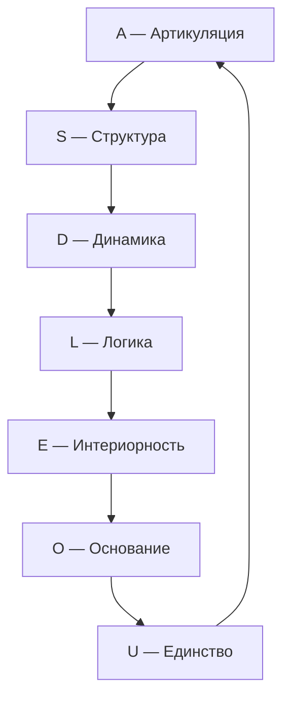

# Измерение VII: Единство (U)

## Функция

**Интегрировать, замыкать, возвращать к целому.**

## Описание

Единство — это измерение, которое связывает все остальные шесть в один неразрывный Голоном. Оно обеспечивает **целостность и идентичность** системы $\mathbb{H}$.

:::info Онтологический статус
Единство — **аспект** конфигурации $\Gamma$, не отдельная сущность. «Голоном един» означает: в матрице когерентности $\Gamma$ активна проекция на базисный вектор $|U\rangle$, и выполняется условие нормировки $\mathrm{Tr}(\Gamma) = 1$.
:::

:::warning Связь с автопоэзисом
При удалении измерения $U$ нарушается **(AP)** — нет интеграции, нет целостности. Без $U$ система фрагментируется и не может поддерживать когерентность как единое целое. См. [доказательство](../../proofs/minimality/theorem-minimality-7#случай-n--6-удаление-единства-u).
:::

## Математическое представление

### Условие нормировки

Единство формализуется через **условие нормировки** [матрицы когерентности](../../reference/specification#матрица-когерентности):

$$
\mathrm{Tr}(\Gamma) = \sum_{i \in \{A,S,D,L,E,O,U\}} \gamma_{ii} = 1
$$

Это условие гарантирует, что сумма всех диагональных элементов (вероятностей) равна 1 — система существует как целое.

### Проекция на U

Диагональный элемент матрицы когерентности:

$$
\gamma_{UU} = \langle U|\Gamma|U\rangle > 0
$$

Условие $\gamma_{UU} > 0$ означает, что измерение Единства активно в конфигурации $\Gamma$.

### Мера интеграции Φ {#мера-интеграции-φ}

<!-- DRY: Мастер-определение Φ (меры интеграции). Все ссылки должны указывать сюда: /docs/core/structure/dimension-u#мера-интеграции-φ -->

**Мера интеграции** $\Phi$ количественно оценивает степень когерентности (связности) между измерениями Голонома:

$$
\Phi(\Gamma) = \frac{\sum_{i \neq j} |\gamma_{ij}|^2}{\sum_i \gamma_{ii}^2}
$$

где:
- Числитель — сумма квадратов модулей **когерентностей** (недиагональных элементов)
- Знаменатель — сумма квадратов **диагональных элементов**

**Интерпретация:**
- $\Phi = 0$: классический ансамбль без когерентностей
- $\Phi \to \infty$: максимально интегрированное (запутанное) состояние

## Роль в интеграции

### Интеграция опыта (L2)

При уровне L2 ([когнитивные квалиа](../../proofs/consciousness/interiority-hierarchy#уровень-2-когнитивные-квалиа-cognitive-qualia)) субъективное единство опыта («Я») возникает при выполнении условий:

$$
R \geq R_{\text{th}} = \frac{1}{3}, \quad \Phi \geq \Phi_{\text{th}} = 1
$$

где $R$ — [мера рефлексии](/docs/consciousness/foundations/self-observation#мера-рефлексии-r). Пороги определены через ПИР [Т] (T16): $P_{\text{crit}}$ — [Т], $R_{\text{th}}$ — [Т], $\Phi_{\text{th}}$ — [О]. См. [Пороги L2](../foundations/axiom-septicity#пороги-l2-строгий-вывод).

### Определение: Порог интеграции Φ_th = 1 [О] {#теорема-порог-интеграции}

:::info Статус: [О] Определение по соглашению
Значение $\Phi_{\text{th}} = 1$ — **определение по соглашению** (когерентная доминация), а не выводимая величина. Это нормировочная точка, структурно мотивированная: при $\Phi = 1$ когерентности начинают доминировать над населённостями.
:::

**Утверждение:**
$$
\Phi_{\text{th}} = 1
$$

**Мотивация выбора порога:**

**Шаг 1: Определение Φ**

$$
\Phi(\Gamma) = \frac{\sum_{i \neq j} |\gamma_{ij}|^2}{\sum_i \gamma_{ii}^2}
$$

**Шаг 2: Интерпретация компонентов**

- Числитель: суммарная «энергия» когерентностей (связей между измерениями)
- Знаменатель: суммарная «энергия» диагонали (локализация в отдельных измерениях)

$\Phi = 1$ означает: **когерентности имеют такой же совокупный вес, как диагональ**.

**Шаг 3: Условие интеграции**

Система **интегрирована**, если связи между измерениями не слабее самих измерений:

$$
\sum_{i \neq j} |\gamma_{ij}|^2 \geq \sum_i \gamma_{ii}^2
$$

Это эквивалентно:

$$
\Phi \geq 1
$$

**Шаг 4: Минимальность порога**

$\Phi_{\text{th}} = 1$ — **минимальное** значение, при котором система интегрирована по определению:
- При $\Phi < 1$: диагональ доминирует → фрагментированное состояние
- При $\Phi \geq 1$: когерентности не слабее диагонали → интегрированное состояние

**Шаг 5: Итог**

Граница $\Phi = 1$ разделяет:
- $\Phi < 1$: классическая смесь (локализация преобладает над связями)
- $\Phi \geq 1$: квантовая интеграция (связи не слабее локализации)

Это определение по соглашению [О], не выводимое утверждение.

:::note Сравнение с P_crit
В отличие от [$P_{\text{crit}} = 2/7$](/docs/proofs/dynamics/theorem-purity-critical), которое выводится из условия различимости от шума, $\Phi_{\text{th}} = 1$ — это **определение** границы интегрированности, а не эмпирически подбираемый порог.
:::

### Связь с Интегрированной Информацией (IIT) {#связь-с-iit}

:::info Статус: [О] Определения формализованы
Связь между мерой интеграции УГМ ($\Phi_{\text{УГМ}}$) и интегрированной информацией IIT ($\Phi_{\text{IIT}}$) определена в категорном формализме. Точное числовое соответствие порогов — [Г] гипотеза.
:::

#### Определение Φ_IIT в категорном языке

**Определение (Φ_IIT через C*-алгебру):**

$$
\Phi_{\text{IIT}}(\Gamma) := \min_{\pi \in \text{Part}(\Gamma)} D_B(\Gamma, \pi^*(\Gamma))
$$

где:
- $\text{Part}(\Gamma)$ — множество всех бипартиций системы Γ
- $\pi^*(\Gamma)$ — "отключённое" состояние (без корреляций между частями)
- $D_B$ — расстояние Бурес

#### Определение порога интеграции {#теорема-эквивалентность-порогов}

:::info Определение (Порог когерентной интеграции)
Система **когерентно-интегрирована**, если когерентности доминируют над населённостями:

$$
\Phi(\Gamma) \geq \Phi_{\text{th}} = 1 \quad \Longleftrightarrow \quad \underbrace{\sum_{i \neq j} |\gamma_{ij}|^2}_{P_{\text{coh}}} \geq \underbrace{\sum_i \gamma_{ii}^2}_{P_{\text{diag}}}
$$
:::

**Структурный смысл.** Значение $\Phi_{\text{th}} = 1$ — **определение по соглашению**, содержательно мотивированное:

1. **Нормировка чистоты:** $P = \mathrm{Tr}(\Gamma^2) = P_{\text{diag}} + P_{\text{coh}}$, так что $\Phi \geq 1 \Leftrightarrow P_{\text{coh}} \geq P/2$ — не менее половины [чистоты](/docs/core/dynamics/viability#определение-чистоты) определяется когерентностями.

2. **Структурный фазовый переход:** При $\Phi < 1$ состояние «квазидиагонально» — подсистемы квазинезависимы. При $\Phi \geq 1$ межмерные когерентности доминируют — подсистемы каузально связаны через [матрицу когерентности](/docs/core/dynamics/coherence-matrix).

3. **Связь с (AP):** [Замыкание (M,R)-системы](/docs/core/foundations/axiom-septicity#предварительное-условие-автономность) требует каузальных путей между измерениями, закодированных в когерентностях $\gamma_{ij}$. Условие $\Phi \geq 1$ гарантирует, что эти пути структурно значимы (не являются малыми возмущениями диагонального состояния).

4. **Категорное обоснование:** В категории **Hol** [Hom-множества](/docs/proofs/categorical/categorical-formalism) между измерениями $i, j$ отождествляются с когерентностями: $\mathrm{Hom}(i,j) \leftrightarrow \gamma_{ij}$ ([L-унификация](/docs/proofs/categorical/categorical-formalism#l-унификация) [Т]). Условие $\Phi \geq 1$ означает, что **морфизменная структура** доминирует над **объектной** — категория «нетривиально связна».

#### Сравнение с Φ_IIT

:::warning Гипотеза (Соответствие порогов УГМ–IIT) [Г]
$$
\Phi_{\text{УГМ}} \geq 1 \quad \Longleftrightarrow \quad \Phi_{\text{IIT}} \geq \log(2)
$$
Точное числовое соответствие порогов — **открытая гипотеза**, поскольку $\Phi_{\text{УГМ}}$ (отношение когерентностей к диагонали в $\mathbb{C}^7$) и $\Phi_{\text{IIT}}$ (минимизация расстояния Бурес по бипартициям) определены на разных пространствах различными способами. Качественное соответствие (обе меры разделяют фрагментированные и интегрированные режимы) подтверждается структурой обеих теорий.
:::

| Аспект | $\Phi_{\text{УГМ}}$ | $\Phi_{\text{IIT}}$ |
|--------|---------------------|---------------------|
| Определение | Отношение когерентностей к диагонали | Минимальное расстояние до разделённого состояния |
| Порог | 1 (определение) | $\log(2) \approx 0.693$ (гипотеза) |
| Вычислительная сложность | $O(N^2)$ | $O(2^N)$ (NP-трудно) |
| Структурная интерпретация | Когерентная доминация | Неразделимость |
| Квантовое расширение | Естественно | Требует модификации |

**Преимущество УГМ:** Мера $\Phi_{\text{УГМ}}$ вычислима за полиномиальное время, в отличие от $\Phi_{\text{IIT}}$, требующего перебора всех бипартиций.

### Замыкание причинности

Единство замыкает каузальный цикл (M,R)-системы:

Замыкание $U \to A$ обеспечивает **самосогласованность**: результат интеграции возвращается в артикуляцию, порождая новый цикл.

## Связь с сознательностью

Мера сознательности $C = \Phi \times D_{\text{diff}} \times R$ (определение см. [самонаблюдение](/docs/consciousness/foundations/self-observation#мера-сознательности-c)).

## Примеры

### Физические

| Пример | Описание |
|--------|----------|
| Нормировка | $\mathrm{Tr}(\Gamma) = 1$ — полная вероятность |
| Центр масс | Интеграция распределённой массы в одну точку |
| Связанное состояние | Атом как целое, не набор частиц |

### Биологические

| Пример | Описание |
|--------|----------|
| Организм | Интеграция органов в единую систему |
| Нервная система | Интеграция сенсорной информации |
| Гомеостаз | Поддержание целостности внутренней среды |

### Психологические

| Пример | Описание |
|--------|----------|
| Самосознание | Знание себя как целого |
| Идентичность | Постоянство «Я» во времени |
| Синтез восприятия | Объединение модальностей в единый опыт |

## Распад единства

При $\gamma_{Ui} \to 0$ для всех $i$:

1. Потеря интеграции: $\Phi \to 0$
2. Диссоциация сознания: разрыв между измерениями
3. Фрагментация опыта: «Я» распадается на части

**Клинические аналогии:**

| Состояние | Описание | Параметры |
|-----------|----------|-----------|
| Диссоциативное расстройство | Множественные «Я» | $\gamma_{UE} \approx 0$ |
| Дереализация | Отчуждение от реальности | $\gamma_{UA} \approx 0$ |
| Деперсонализация | Отчуждение от себя | $\gamma_{UU} \to P_{\text{crit}}$ |

## Связь с другими измерениями

## Когерентность с U

| Когерентность | Интерпретация |
|---------------|---------------|
| $\gamma_{UA}$ | Интегрированность различений |
| $\gamma_{US}$ | Целостность структуры |
| $\gamma_{UD}$ | Непрерывность бытия во времени |
| $\gamma_{UL}$ | Логическая согласованность целого |
| $\gamma_{UE}$ | Синтез (интеграция интериорного содержания в целое) |
| $\gamma_{UO}$ | Связь целостности с источником |

## Связь с чистотой

[Чистота](../dynamics/viability#определение-чистоты) $P$ связана с когерентностями:

$$
P = \mathrm{Tr}(\Gamma^2) = \sum_{i} \gamma_{ii}^2 + \sum_{i \neq j} |\gamma_{ij}|^2
$$

Высокая когерентность с $U$ (большие $|\gamma_{Ui}|$) коррелирует с высокой общей чистотой $P$, поскольку когерентности вносят положительный вклад в $P$.

### Октонионный контекст {#октонионный-контекст}

:::note Октонионное соответствие [И]
Измерению соответствует $e_6 \in \mathrm{Im}(\mathbb{O})$. Детали, $G_2$-оговорка и Фано-триплеты: [Октонионная интерпретация](./dimensions#октонионная-интерпретация), [структурный вывод](../../proofs/minimality/theorem-octonionic-derivation).
:::

---

**Связанные документы:**
- [Аксиома Септичности](../foundations/axiom-septicity) — теорема о $\Phi_{\text{th}} = 1$
- [Основание (O)](./dimension-o) — предыдущее измерение
- [Семь измерений](./dimensions) — обзор всех измерений
- [Самонаблюдение](/docs/consciousness/foundations/self-observation) — связь с сознанием
- [Жизнеспособность](../dynamics/viability) — условия существования
- [Иерархия интериорности](../../proofs/consciousness/interiority-hierarchy) — формальные определения
