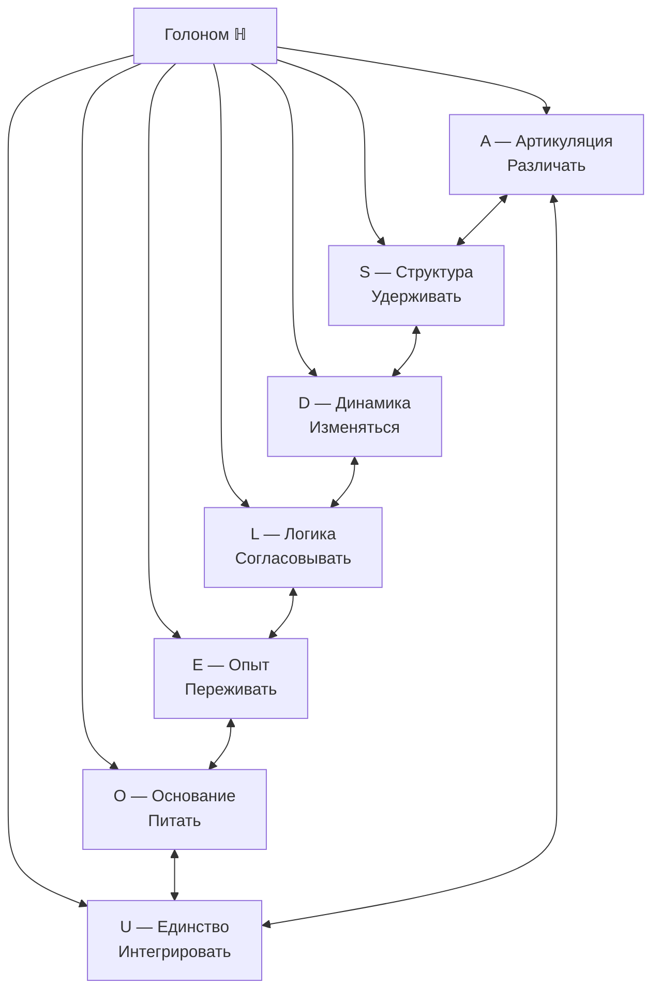
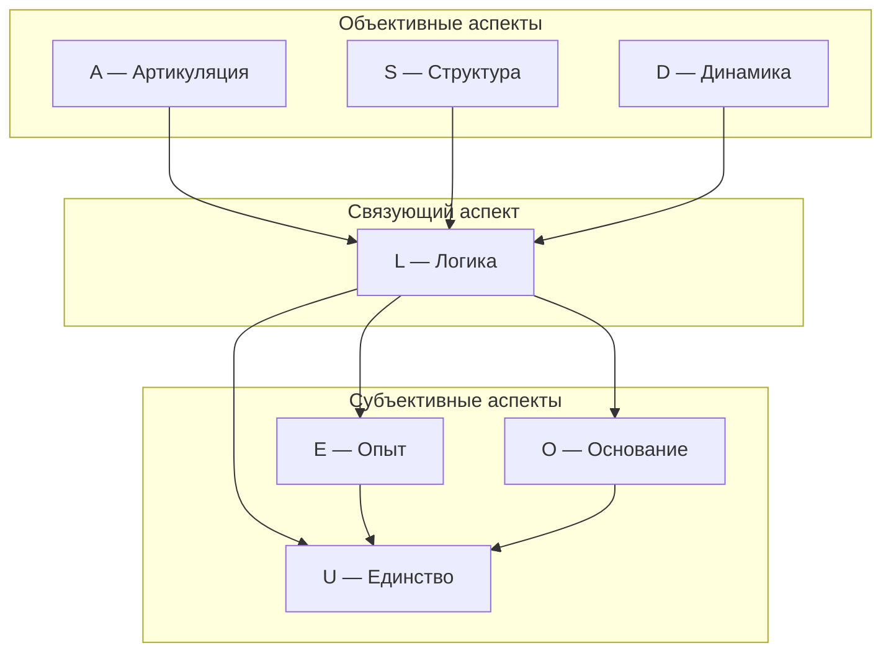

# Семь Измерений Голонома

## Обзор

:::info Онтологический статус
Измерения — **не отдельные сущности**, а неразделимые аспекты единой конфигурации $\Gamma$. Говорить "Голоном имеет 7 измерений" означает: "конфигурация $\Gamma$, удовлетворяющая [(AP)+(PH)+(QG)](../foundations/axiom-septicity), требует минимум 7 функционально независимых компонент".
:::

Число 7 — **следствие** из аксиом, не произвольный выбор. См. [Теорема S: доказательство минимальности](../../proofs/theorem-minimality-7).

### Единственность базиса

:::tip Статус единственности ([доказательство](../../proofs/theorem-minimality-7#часть-vii-теорема-о-единственности-базиса))
Базис $\{A, S, D, L, E, O, U\}$ является **единственным** (с точностью до изоморфизма) 7-мерным разбиением, удовлетворяющим (AP)+(PH)+(QG):
- ✅ **A, S, D, L, U** — алгебраическая единственность (строго доказано)
- ⚠️ **E** — функциональная единственность (условно, при интерпретации феноменологии)
- ⚠️ **O** — функциональная единственность (условно, при допущении о форме регенерации)
:::

## Таблица измерений

| № | Измерение | Символ | Функция | Оператор | Физический аналог |
|---|-----------|--------|---------|----------|-------------------|
| I | [Артикуляция](./dimension-a) | $A$ | Различать | Проектор $P$ | Измерение |
| II | [Структура](./dimension-s) | $S$ | Удерживать | Гамильтониан $H$ | Энергия |
| III | [Динамика](./dimension-d) | $D$ | Изменяться | Унитарный $U(t)$ | Время |
| IV | [Логика](./dimension-l) | $L$ | Согласовывать | Коммутатор $[\cdot, \cdot]$ | Каузальность |
| V | [Опыт](./dimension-e) | $E$ | Переживать | Плотность $\rho$ | Информация |
| VI | [Основание](./dimension-o) | $O$ | Питать | Вакуум $\vert 0\rangle$ | Квантовое поле |
| VII | [Единство](./dimension-u) | $U$ | Интегрировать | След $\mathrm{Tr}$ | Нормировка |

:::warning Физические аналоги — это эвристика
Столбец "Физический аналог" указывает на **концептуальные соответствия**, не строгие тождества. Например, измерение $D$ связано с унитарной эволюцией, которая параметризуется временем — но $D$ **не есть** время.
:::

## Необходимость каждого измерения

Удаление любого измерения нарушает условия [(AP)+(PH)+(QG)](../foundations/axiom-septicity):

| Без измерения | Нарушается | Следствие |
|---------------|------------|-----------|
| $A$ | (AP), (PH), (QG) | Нет различений → нет формы |
| $S$ | (AP) | Нет идентичности → нет самотождественности |
| $D$ | (AP), (QG) | Нет эволюции → нет процесса |
| $L$ | (AP) | Нет замыкания → нет самосогласованности |
| $E$ | (PH) | Нет интериорности → нет феноменологии |
| $O$ | (QG) | Нет регенерации → необратимая декогеренция |
| $U$ | (AP) | Нет интеграции → система фрагментирована |

**Доказательство:** [Теорема о минимальности 7D](../../proofs/theorem-minimality-7).

## Матричное представление

В базисе $\{|A\rangle, |S\rangle, |D\rangle, |L\rangle, |E\rangle, |O\rangle, |U\rangle\}$:

$$
\Gamma = \begin{pmatrix}
\gamma_{AA} & \gamma_{AS} & \gamma_{AD} & \gamma_{AL} & \gamma_{AE} & \gamma_{AO} & \gamma_{AU} \\
\gamma_{SA} & \gamma_{SS} & \gamma_{SD} & \gamma_{SL} & \gamma_{SE} & \gamma_{SO} & \gamma_{SU} \\
\gamma_{DA} & \gamma_{DS} & \gamma_{DD} & \gamma_{DL} & \gamma_{DE} & \gamma_{DO} & \gamma_{DU} \\
\gamma_{LA} & \gamma_{LS} & \gamma_{LD} & \gamma_{LL} & \gamma_{LE} & \gamma_{LO} & \gamma_{LU} \\
\gamma_{EA} & \gamma_{ES} & \gamma_{ED} & \gamma_{EL} & \gamma_{EE} & \gamma_{EO} & \gamma_{EU} \\
\gamma_{OA} & \gamma_{OS} & \gamma_{OD} & \gamma_{OL} & \gamma_{OE} & \gamma_{OO} & \gamma_{OU} \\
\gamma_{UA} & \gamma_{US} & \gamma_{UD} & \gamma_{UL} & \gamma_{UE} & \gamma_{UO} & \gamma_{UU}
\end{pmatrix}
$$

## Свойства элементов

Матрица когерентности $\Gamma$ удовлетворяет:

$$
\Gamma^\dagger = \Gamma \quad \text{(эрмитовость)}
$$

$$
\gamma_{ii} \geq 0 \quad \text{(диагональные элементы — вероятности)}
$$

$$
\sum_{i=1}^{7} \gamma_{ii} = 1 \quad \text{(нормировка)}
$$

$$
|\gamma_{ij}|^2 \leq \gamma_{ii} \cdot \gamma_{jj} \quad \text{(неравенство Коши-Шварца)}
$$

Из эрмитовости следует: $\gamma_{ij} = \gamma_{ji}^*$.

## Семантика когерентностей

Недиагональные элементы $\gamma_{ij}$ ($i \neq j$) описывают **связи между измерениями**:

| Когерентность | Интерпретация | Пример |
|---------------|---------------|--------|
| $\gamma_{AE}$ | Артикуляция ↔ Опыт | Внимание (осознанное различение) |
| $\gamma_{SL}$ | Структура ↔ Логика | Законы (логически согласованные инварианты) |
| $\gamma_{DU}$ | Динамика ↔ Единство | Целенаправленность (интегрированное изменение) |
| $\gamma_{EO}$ | Опыт ↔ Основание | Глубина переживания (связь с источником) |
| $\gamma_{SE}$ | Структура ↔ Опыт | Узнавание (переживание формы) |
| $\gamma_{LU}$ | Логика ↔ Единство | Самосогласованность целого |

:::note Полный набор когерентностей
Матрица $7 \times 7$ содержит $\binom{7}{2} = 21$ независимых недиагональных элементов. Каждый описывает связь между парой измерений.
:::

## Связь с (M,R)-системами Розена

Семь измерений УГМ **обобщают** (M,R)-систему Розена, добавляя феноменологию и квантовое основание:

| Розен | УГМ | Функция |
|-------|-----|---------|
| $M$ (метаболизм) | $D$ (Динамика) | Преобразование субстратов |
| $\Phi$ (репарация) | $A + L$ (Артикуляция + Логика) | Восстановление структуры |
| $\beta$ (замыкание) | $U$ (Единство) | Интеграция, самозамыкание |
| — | $E$ (Опыт) | Расширение: интериорность |
| — | $O$ (Основание) | Расширение: квантовый источник |
| — | $S$ (Структура) | Расширение: инварианты |

**Формально:** $7 = 3_{\text{Розен}} + 4_{\text{расширения}}$.

См. [Теорема 5.1: Изоморфизм с (M,R)-системами](../../proofs/theorem-minimality-7#часть-v-связь-с-mr-системами-розена).

## Группировка измерений

:::warning Группировка — эвристика
Деление на "объективные" и "субъективные" аспекты — **педагогическое упрощение**. Все семь измерений неразделимы в $\Gamma$. Двухаспектный монизм означает: объективное и субъективное — две стороны одной конфигурации, не разные части.
:::

Логика ($L$) выделена как "связующий аспект", поскольку коммутатор $[A, B]$ определяет **отношения** между операторами всех остальных измерений.

---

**Детальные страницы:**
- [Артикуляция (A)](./dimension-a)
- [Структура (S)](./dimension-s)
- [Динамика (D)](./dimension-d)
- [Логика (L)](./dimension-l)
- [Опыт (E)](./dimension-e)
- [Основание (O)](./dimension-o)
- [Единство (U)](./dimension-u)

**Связанные документы:**
- [Голоном](./holon) — что такое конфигурация $\Gamma$
- [Теорема S](../../proofs/theorem-minimality-7) — доказательство минимальности 7D
- [Теорема о единственности](../../proofs/theorem-minimality-7#часть-vii-теорема-о-единственности-базиса) — доказательство уникальности базиса
- [Аксиома (AP+PH+QG)](../foundations/axiom-septicity) — условия на Голоном
