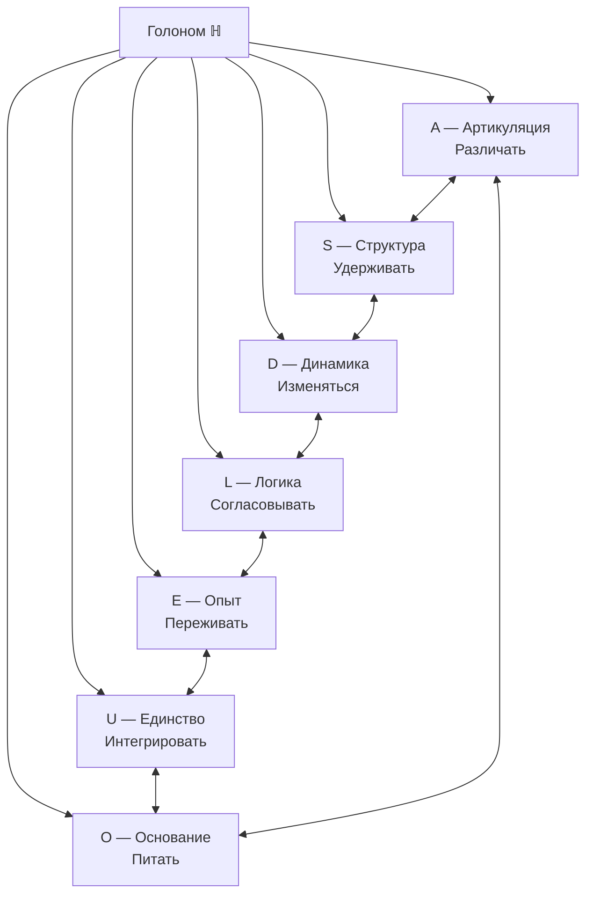
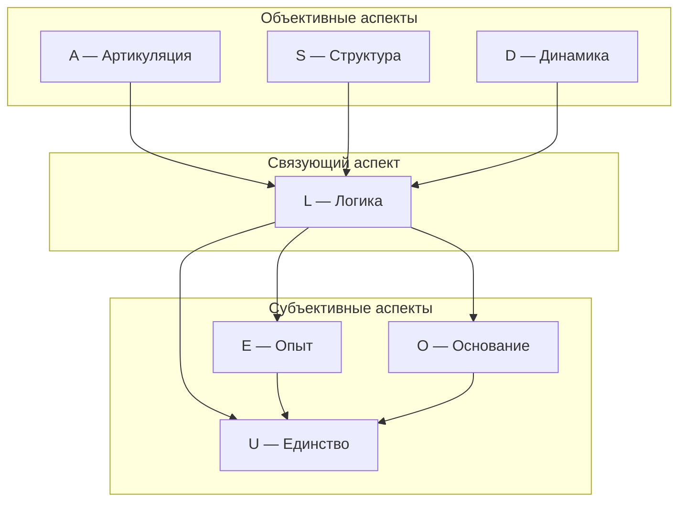

# Семь Измерений Голонома

## Обзор

:::info Онтологический статус
Измерения — **не отдельные сущности**, а неразделимые аспекты единой конфигурации $\Gamma$. Говорить "Голоном имеет 7 измерений" означает: "конфигурация $\Gamma$, удовлетворяющая [(AP)+(PH)+(QG)](../foundations/axiom-septicity), требует минимум 7 функционально независимых компонент".
:::

Число 7 — **аксиома** ([Аксиома 3](/docs/core/foundations/axiom-omega#аксиоматика)), характеризующая класс изучаемых систем. [Теорема S](../../proofs/minimality/theorem-minimality-7) объясняет, *почему этот класс интересен*: 7 — минимальная размерность для (AP)+(PH)+(QG).

### Единственность базиса

:::tip Статус единственности ([доказательство](../../proofs/minimality/theorem-minimality-7#часть-vii-теорема-о-единственности-базиса))
Базис $\{A, S, D, L, E, O, U\}$ является **единственным** (с точностью до изоморфизма) 7-мерным разбиением, удовлетворяющим (AP)+(PH)+(QG):
- [Т] **A, S, D, L, U** — алгебраическая единственность (строго доказано)
- [Т] **E** — функциональная единственность: аксиоматическое обоснование (PH) + категориальное ($\kappa_0$ требует Hom(O,E)) + математическое (rank > 1). [Доказательство →](../../proofs/minimality/theorem-minimality-7#единственность-e)
- [Т] **O** — функциональная единственность: форма ℛ [Т] + $\kappa_0$ (End(O), Hom(O,E), Hom(O,U)) + PW (A5) + функциональная независимость. [Доказательство →](../../proofs/minimality/theorem-minimality-7#единственность-o)
:::

## Таблица измерений

| № | Измерение | Символ | Функция | Оператор | Физический аналог | Октонионный базис |
|---|-----------|--------|---------|----------|-------------------|-------------------|
| I | [Артикуляция](./dimension-a) | $A$ | Различать | Проектор $P$ | Измерение | $e_1$ |
| II | [Структура](./dimension-s) | $S$ | Удерживать | Гамильтониан $H$ | Энергия | $e_2$ |
| III | [Динамика](./dimension-d) | $D$ | Изменяться | Унитарный $U(\tau)$ | Эволюция | $e_3$ |
| IV | [Логика](./dimension-l) | $L$ | Согласовывать | Коммутатор $[\cdot, \cdot]$ | Каузальность | $e_4$ |
| V | [Опыт](./dimension-e) | $E$ | Переживать | Плотность $\rho$ | Информация | $e_5$ |
| VI | [Основание](./dimension-o) | $O$ | Питать + Измерять время | Вакуум $\vert 0\rangle$, Часы | Квантовое поле + Часы | $e_7$ |
| VII | [Единство](./dimension-u) | $U$ | Интегрировать | След $\mathrm{Tr}$ | Нормировка | $e_6$ |

:::warning Физические аналоги — это эвристика
Столбец "Физический аналог" указывает на **концептуальные соответствия**, не строгие тождества. Например, измерение $D$ связано с унитарной эволюцией — но $D$ **не есть** время.
:::

:::info Функциональный, а не антропоморфный базис
Семантические метки {A, S, D, L, E, O, U} — **мнемоники** для математически определённых функциональных ролей, не проекция когнитивных функций человека на реальность. Каждое измерение определяется **оператором и ролью в аксиомах**:

| Измерение | Оператор | Аксиоматическая роль | Необходимость |
|-----------|----------|---------------------|---------------|
| $e_1$ (A) | Проектор $P^2 = P$ | Различение подобъектов | (AP): без проекторов нет автопоэзиса |
| $e_2$ (S) | $H = H^\dagger$ | Спектр инвариантов | (AP): без гамильтониана нет стабильности |
| $e_3$ (D) | $U(\tau) = e^{-iH\tau}$ | Унитарная эволюция | (QG): без динамики нет процесса |
| $e_4$ (L) | $[\cdot, \cdot]$ | Замыкание алгебры | (AP): без коммутаторов нет согласованности |
| $e_5$ (E) | $\rho_E = \mathrm{Tr}_{-E}(\Gamma)$ | Феноменология | (PH): без редуцированной матрицы нет интериорности |
| $e_6$ (U) | $\mathrm{Tr}(\cdot)$ | Нормировка | (AP): без следа нет интеграции |
| $e_7$ (O) | $H_O$, $\vert 0\rangle$ | Часы + источник | (QG): без часов нет времени |

Теория идентична при замене меток на $\{e_1, \ldots, e_7\}$. Семантические имена облегчают навигацию — аналогично тому, как «цвет» и «аромат» кварков суть мнемоники для квантовых чисел $SU(3)_C$ и не делают КХД антропоморфной.

**Математическая единственность:** [Теорема о единственности базиса](../../proofs/minimality/theorem-minimality-7#часть-vii-теорема-о-единственности-базиса) доказывает, что функциональное разбиение единственно (с точностью до изоморфизма) для всех 7 измерений [Т]: A, S, D, L, U — алгебраически; E, O — категориально (через κ₀ и функциональную независимость).
:::

:::info Эмерджентное время
Время в УГМ — не внешний параметр, а **эмерджентное свойство**. Внутреннее время τ возникает из корреляций между измерением $O$ (Основание) и остальными измерениями через механизм Page-Wootters. Измерение $O$ выполняет двойную роль: источник регенерации **и** внутренние часы системы.

[Подробнее: Теорема об эмерджентном времени →](../../proofs/dynamics/emergent-time)
:::

:::info Согласование 7D и 42D формализмов
Теория использует **два формализма**:

- **7D** ($\mathbb{C}^7$): структурные теоремы (Теорема S, единственность базиса, пороги), E-когерентность $\mathrm{Coh}_E$ через [HS-проекцию](/docs/core/foundations/axiom-septicity#hs-projection) **[Т]**, меры $R$ и $\Phi$.
- **42D** ($\mathcal{H}_O \otimes \mathcal{H}_{6D} \cong \mathbb{C}^{42}$): механизм Page-Wootters (эмерджентное время), калибровочные симметрии электрослабого сектора, тензорная запутанность.

**Разрешённая часть [Т]:** Тензорный разрыв для $\mathrm{Coh}_E$ полностью разрешён — [C*-алгебраическая проекция Гильберта–Шмидта](/docs/core/foundations/axiom-septicity#hs-projection) определяет $\mathrm{Coh}_E$ в 7D **точно**, не прибегая к частичному следу. Определение подсистемы реализуется через вложение C*-подалгебры и [условное ожидание Умегаки](/docs/core/foundations/axiom-septicity#теорема-условное-ожидание). Это стандартный аппарат алгебраической квантовой теории (Haag, 1996; Bratteli–Robinson, 1987).

**Открытая часть [С]:** Полная редуцированная матрица $\rho_E = \mathrm{Tr}_{-E}(\Gamma)$ и мера дифференциации $D_{\text{diff}} = \exp(S_{vN}(\rho_E))$ по-прежнему требуют тензорной факторизации (42D-формализм), поскольку частичный след $\mathrm{Tr}_{\bar{E}}$ не определён в $\mathbb{C}^7$ (7 — простое число). Утверждения, использующие $D_{\text{diff}}$, имеют статус **[С]** — условные на 42D-расширение.
:::

## Октонионная интерпретация {#октонионная-интерпретация}

:::info Структурный вывод N = 7 через октонионы
Число 7 измерений получает **второе, независимое обоснование** через [структурный вывод](../../proofs/minimality/theorem-octonionic-derivation): если пространство внутренних степеней свободы изоморфно Im(𝕆) (мнимой части октонионов), то $N = \dim(\text{Im}(\mathbb{O})) = 7$.
:::

Семь мнимых единиц октонионов $e_1, \ldots, e_7$ соответствуют семи измерениям Голонома. Это соответствие привносит:

- **$G_2$-симметрию:** Aut(𝕆) = $G_2$ ⊂ SO(7) — 14-параметрическая группа, сохраняющая структуру умножения
- **Плоскость Фано:** 7 триплетов $(e_i, e_j, e_k)$ определяют ассоциативные подтройки измерений
- **Альтернативность:** Любые два измерения порождают ассоциативную подалгебру (теорема Артина [Т]), неассоциативность проявляется только при взаимодействии трёх и более

:::info $G_2$-оговорка [Т]
Конкретное отождествление $e_i$ ↔ измерение — **теорема** [Т] (T15): мост полностью замкнут (теоремы T1–T15). $G_2$ действует на Im(𝕆); вопрос о том, является ли эта симметрия физически реализованной в пространстве {A,S,D,L,E,O,U}, остаётся [открытой проблемой](../../proofs/minimality/theorem-octonionic-derivation#открытые-проблемы).
:::

## Необходимость каждого измерения

Удаление любого измерения нарушает условия [(AP)+(PH)+(QG)](../foundations/axiom-septicity):

| Без измерения | Нарушается | Следствие |
|---------------|------------|-----------|
| $A$ | (AP), (PH), (QG) | Нет различений → нет формы |
| $S$ | (AP) | Нет идентичности → нет самотождественности |
| $D$ | (AP), (QG) | Нет эволюции → нет процесса |
| $L$ | (AP) | Нет замыкания → нет самосогласованности |
| $E$ | (PH) | Нет интериорности → нет феноменологии |
| $O$ | (QG) | Нет регенерации, нет внутренних часов → нет времени |
| $U$ | (AP) | Нет интеграции → система фрагментирована |

**Доказательство:** [Теорема о минимальности 7D](../../proofs/minimality/theorem-minimality-7).

## Матричное представление

:::note DRY: Мастер-определение
Полное матричное представление $\Gamma$ с формальными свойствами см. в [Матрица когерентности](../dynamics/coherence-matrix#матричное-представление).
:::

В базисе $\{|A\rangle, |S\rangle, |D\rangle, |L\rangle, |E\rangle, |O\rangle, |U\rangle\}$ матрица когерентности — эрмитова $7 \times 7$ матрица с элементами $\gamma_{ij}$:
- **Диагональ** $\gamma_{ii} \in [0,1]$ — населённости измерений, $\sum_i \gamma_{ii} = 1$
- **Когерентности** $\gamma_{ij}$ ($i \neq j$) — связи между измерениями, $|\gamma_{ij}|^2 \leq \gamma_{ii} \cdot \gamma_{jj}$

## Семантика когерентностей

Недиагональные элементы $\gamma_{ij}$ ($i \neq j$) описывают **связи между измерениями**:

| Когерентность | Интерпретация | Пример |
|---------------|---------------|--------|
| $\gamma_{AE}$ | Артикуляция ↔ Интериорность | Апперцепция (различение, вошедшее в интериорность) |
| $\gamma_{SL}$ | Структура ↔ Логика | Номос (структура с логической необходимостью) |
| $\gamma_{DU}$ | Динамика ↔ Единство | Телеология (интегрированное направленное изменение) |
| $\gamma_{EO}$ | Интериорность ↔ Основание | Имманентность (основание внутри интериорности) |
| $\gamma_{SE}$ | Структура ↔ Интериорность | Репрезентация (структура, представленная в интериорности) |
| $\gamma_{LU}$ | Логика ↔ Единство | Консистентность (логическая непротиворечивость целого) |

:::note Полный набор когерентностей
Матрица $7 \times 7$ содержит $\binom{7}{2} = 21$ независимых недиагональных элементов. Каждый описывает связь между парой измерений.
:::

## Связь с (M,R)-системами Розена

Семь измерений УГМ **обобщают** (M,R)-систему Розена, добавляя феноменологию и квантовое основание:

| Розен | УГМ | Функция |
|-------|-----|---------|
| $M$ (метаболизм) | $D$ (Динамика) | Преобразование субстратов |
| $\Phi$ (репарация) | $A + L$ (Артикуляция + Логика) | Восстановление структуры |
| $\beta$ (замыкание) | $U$ (Единство) | Интеграция, самозамыкание |
| — | $E$ (Опыт) | Расширение: интериорность |
| — | $O$ (Основание) | Расширение: квантовый источник |
| — | $S$ (Структура) | Расширение: инварианты |

**Формально:** $7 = 3_{\text{Розен}} + 4_{\text{расширения}}$.

См. [Теорема 5.1: Изоморфизм с (M,R)-системами](../../proofs/minimality/theorem-minimality-7#часть-v-связь-с-mr-системами-розена).

## Группировка измерений

:::warning Группировка — эвристика
Деление на "объективные" и "субъективные" аспекты — **педагогическое упрощение**. Все семь измерений неразделимы в $\Gamma$. Двухаспектный монизм означает: объективное и субъективное — две стороны одной конфигурации, не разные части.
:::

Логика ($L$) выделена как "связующий аспект", поскольку коммутатор $[A, B]$ определяет **отношения** между операторами всех остальных измерений.

---

**Детальные страницы:**
- [Артикуляция (A)](./dimension-a)
- [Структура (S)](./dimension-s)
- [Динамика (D)](./dimension-d)
- [Логика (L)](./dimension-l)
- [Опыт (E)](./dimension-e)
- [Основание (O)](./dimension-o)
- [Единство (U)](./dimension-u)

**Связанные документы:**
- [Голоном](./holon) — что такое конфигурация $\Gamma$
- [Теорема S](../../proofs/minimality/theorem-minimality-7) — доказательство минимальности 7D (Трек A)
- [Структурный вывод через октонионы](../../proofs/minimality/theorem-octonionic-derivation) — P1+P2 → 𝕆 → N=7 (Трек B)
- [Теорема о единственности](../../proofs/minimality/theorem-minimality-7#часть-vii-теорема-о-единственности-базиса) — доказательство уникальности базиса
- [Аксиома (AP+PH+QG+V)](../foundations/axiom-septicity) — условия на Голоном
- [Эмерджентное время](../../proofs/dynamics/emergent-time) — время из структуры Γ
