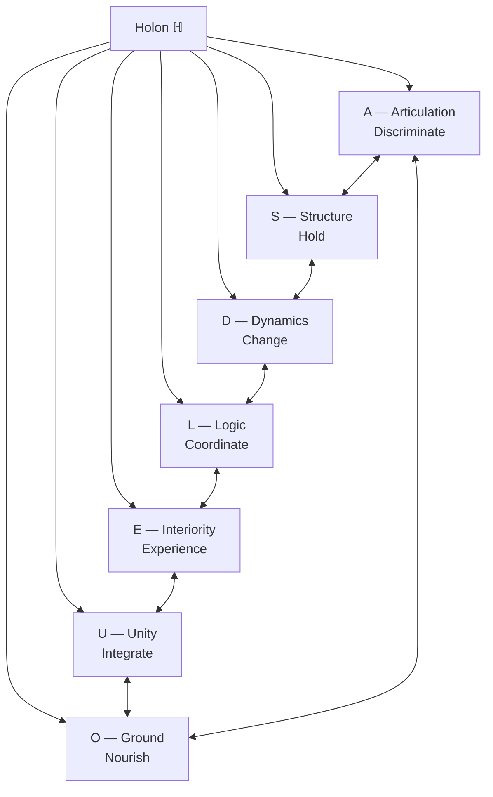
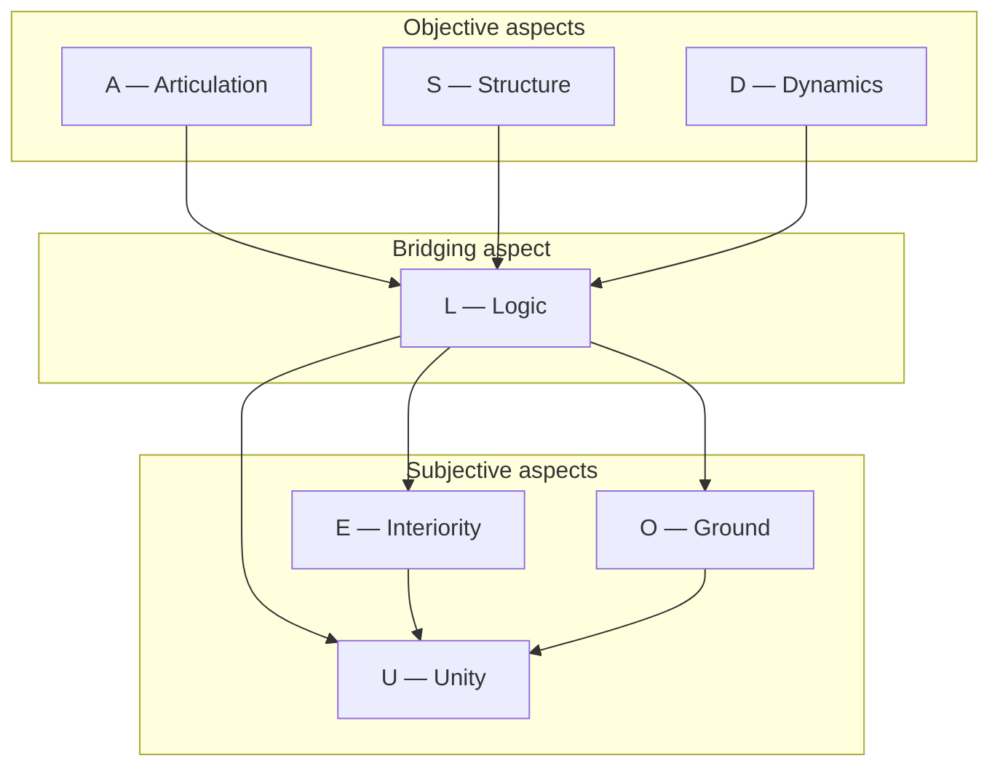

# The Seven Dimensions of the Holon

This chapter is a guide to the seven dimensions of the Holon: A (Articulation), S (Structure), D (Dynamics), L (Logic), E (Interiority), O (Ground), and U (Unity). Each of them is not a "thing" or a "property" in the ordinary sense, but an **inseparable aspect** of the unified configuration $\Gamma$. The seven dimensions are seven ways of "looking at" the same reality, like the seven faces of a prism dispersing white light into a spectrum. By the end of the chapter you will understand why there are exactly seven dimensions, what makes each of them indispensable, and how they are connected to one another.

## Historical precursor

The idea that reality is described by a small number of fundamental "principles" is as old as philosophy itself.

**Pythagoras** (6th century BCE) taught that "everything is number": numerical relations underlie the world. The Pythagoreans discovered that musical intervals correspond to simple fractions and extrapolated this to the cosmos. In UHM this intuition finds precise expression: the state of any system is a matrix of numbers ($\Gamma \in \mathbb{C}^{7 \times 7}$), and all properties of the system — from physical to phenomenological — are determined by these numbers.

**William Rowan Hamilton** (1843) discovered **quaternions** — four-dimensional numbers extending the complex numbers. His friend **John Graves** discovered **octonions** — eight-dimensional numbers — in the same year. Arthur Cayley (1845) independently rediscovered them. Octonions have a remarkable property: they are the last of the four "normed division algebras" (real numbers → complex numbers → quaternions → octonions). The imaginary part of the octonions has exactly **7 dimensions**. In UHM this is no coincidence: the seven dimensions of the Holon are isomorphic to the seven imaginary units of the octonions.

**Gino Fano** (1892) constructed the minimal projective plane — the **Fano plane** PG(2,2). It contains exactly 7 points and 7 lines, with every line passing through 3 points and every point lying on 3 lines. This geometric structure turns out to be central to UHM: it determines which triples of dimensions form "associative triplets" — particularly stable groups that play a role in elementary-particle physics and in the structure of consciousness.

## Overview

:::info Ontological status
The dimensions are **not separate entities**, but inseparable aspects of the unified configuration $\Gamma$. To say "the Holon has 7 dimensions" means: "the configuration $\Gamma$ satisfying [(AP)+(PH)+(QG)](../foundations/axiom-septicity) requires at least 7 functionally independent components."
:::

The number 7 is an **axiom** ([Axiom 3](/docs/core/foundations/axiom-omega#аксиоматика)), characterising the class of systems under study. [Theorem S](../../proofs/minimality/theorem-minimality-7) explains *why this class is interesting*: 7 is the minimum dimensionality for (AP)+(PH)+(QG).

It is important to emphasise: the seven dimensions are not seven "parts" of the Holon, in the way that lungs, heart, and brain are parts of a body. They are seven **inseparable aspects** of a single whole, in the way that length, width, and height are three aspects of a single object. One cannot "cut off" the Dynamics dimension from the Holon while leaving the rest — just as one cannot cut the height off a cube while leaving the length and width. If even one dimension goes to zero, the Holon ceases to exist as a coherent configuration.

### Why exactly 7

:::tip Intuitive explanation
Imagine designing a minimal living system — a being that can simultaneously:
1. **Discriminate** (tell one thing from another) → needs tool **A**
2. **Hold form** (have a stable structure) → needs tool **S**
3. **Change** (evolve in time) → needs tool **D**
4. **Be self-consistent** (parts do not contradict one another) → needs tool **L**
5. **Experience** (have an inner side) → needs tool **E**
6. **Feed** (have a source of regeneration) → needs tool **O**
7. **Be whole** (integrate everything into unity) → needs tool **U**

Remove any one of the seven — and the system ceases to be "alive" in the full sense. Without discrimination (A) — it cannot interact with the world. Without structure (S) — it dissolves. Without dynamics (D) — it is dead. Without logic (L) — it is contradictory and unstable. Without interiority (E) — it is a "zombie" (it functions but experiences nothing). Without ground (O) — it has no energy source and no time. Without unity (U) — it falls apart into fragments.

Seven is the **minimum** number of such tools. Theorem S proves this rigorously: with 6 or fewer dimensions it is impossible to satisfy (AP)+(PH)+(QG) simultaneously.
:::

Remarkably, the number 7 arises in three **independent** contexts:
1. **Functional** (Theorem S): 7 = minimum for (AP)+(PH)+(QG)
2. **Algebraic** (octonions): 7 = dim(Im($\mathbb{O}$)), the unique maximal normed division algebra
3. **Geometric** (Fano plane): 7 = number of points in the minimal projective plane PG(2,2)

The convergence of these three answers is strong evidence that 7 is not accidental but reflects a deep mathematical necessity.

### Uniqueness of the basis

:::tip Uniqueness status ([proof](../../proofs/minimality/theorem-minimality-7#часть-vii-теорема-о-единственности-базиса))
The basis $\{A, S, D, L, E, O, U\}$ is **unique** (up to isomorphism) as a 7-dimensional decomposition satisfying (AP)+(PH)+(QG):
- [Т] **A, S, D, L, U** — algebraic uniqueness (strictly proved)
- [Т] **E** — functional uniqueness: axiomatic grounding (PH) + categorical ($\kappa_0$ requires Hom(O,E)) + mathematical (rank > 1). [Proof →](../../proofs/minimality/theorem-minimality-7#единственность-e)
- [Т] **O** — functional uniqueness: form of ℛ [Т] + $\kappa_0$ (End(O), Hom(O,E), Hom(O,U)) + PW (A5) + functional independence. [Proof →](../../proofs/minimality/theorem-minimality-7#единственность-o)
:::

```mermaid
graph TD
    H["Holon ℍ"]
    A["A — Articulation<br/>Discriminate"]
    S["S — Structure<br/>Hold"]
    D["D — Dynamics<br/>Change"]
    L["L — Logic<br/>Coordinate"]
    E["E — Interiority<br/>Experience"]
    O["O — Ground<br/>Nourish"]
    U["U — Unity<br/>Integrate"]

    H --> A
    H --> S
    H --> D
    H --> L
    H --> E
    H --> O
    H --> U

    A <--> S
    S <--> D
    D <--> L
    L <--> E
    E <--> U
    U <--> O
    O <--> A
```

## Dimensions table

| # | Dimension | Symbol | Function | Operator | Physical analogue | Octonionic basis |
|---|-----------|--------|---------|----------|-------------------|-------------------|
| I | [Articulation](./dimension-a) | $A$ | Discriminate | Projector $P$ | Measurement | $e_1$ |
| II | [Structure](./dimension-s) | $S$ | Hold | Hamiltonian $H$ | Energy | $e_2$ |
| III | [Dynamics](./dimension-d) | $D$ | Change | Unitary $U(\tau)$ | Evolution | $e_3$ |
| IV | [Logic](./dimension-l) | $L$ | Coordinate | Commutator $[\cdot, \cdot]$ | Causality | $e_4$ |
| V | [Interiority](./dimension-e) | $E$ | Experience | Density $\rho$ | Information | $e_5$ |
| VI | [Ground](./dimension-o) | $O$ | Nourish + Measure time | Vacuum $\vert 0\rangle$, Clock | Quantum field + Clock | $e_7$ |
| VII | [Unity](./dimension-u) | $U$ | Integrate | Trace $\mathrm{Tr}$ | Normalisation | $e_6$ |

:::warning Physical analogues are heuristic
The "Physical analogue" column indicates **conceptual correspondences**, not strict identities. For example, dimension $D$ is connected to unitary evolution — but $D$ **is not** time.
:::

:::tip Everyday analogies
To bring the dimensions closer, imagine a person walking through a forest:

| Dimension | Analogy | What happens |
|---|---|---|
| **A** (Articulation) | Eyes | You *discriminate*: "that's a tree, that's a stone, that's the path" |
| **S** (Structure) | Skeleton | Your body *holds its form* with every step |
| **D** (Dynamics) | Legs | You *walk*, *change* your position |
| **L** (Logic) | Planning brain | You *coordinate* your route: "it's slippery here → go around to the right" |
| **E** (Interiority) | Senses | You *experience*: the scent of pine, the cool of the wind, fatigue |
| **O** (Ground) | Ground underfoot | *Support*, from which you draw stability |
| **U** (Unity) | "I" | All of this together is *one* experience: "I am walking through the forest" |

Remove any element — and the walk becomes impossible. Without eyes you cannot discern the path. Without a skeleton — you cannot hold your form. Without legs — you cannot move. Without logic — you walk into a ditch. Without senses — you miss the beauty. Without support — you fall. Without "I" — there is no one walking.
:::

### Combinatorial uniqueness of semantic roles (T-177) [Т] {#комбинаторная-единственность}

:::tip Theorem T-177 [Т]: Combinatorial uniqueness of semantic roles
After fixing the sector decomposition $7 = 1_O \oplus \mathbf{3} \oplus \bar{\mathbf{3}}$ (T-48a [Т]), each of the 7 dimensions has a **unique combinatorial profile** — a set of Fano lines and sector connections not isomorphic to the profile of any other dimension.
:::

**Proof.** For each $e_k$ we define the **functional fingerprint** $\mathcal{F}(e_k)$ — the triple (sector, set of Fano lines, sector type of each line):

| $e_k$ | Sector | Fano lines | O-connection (path to singlet) |
|--------|--------|------------|--------------------------|
| $e_7$ (O) | **1** | $\{L,E,O\}, \{U,O,S\}, \{O,A,D\}$ | — (singlet itself) |
| $e_1$ (A) | **3** | $\{A,S,L\}, \{E,U,A\}, \{O,A,D\}$ | Direct: line $\{O,A,D\}$ |
| $e_2$ (S) | **3** | $\{A,S,L\}, \{S,D,E\}, \{U,O,S\}$ | Through $\bar{\mathbf{3}}$: line $\{U,O,S\}$ |
| $e_3$ (D) | **3** | $\{S,D,E\}, \{D,L,U\}, \{O,A,D\}$ | Through **3**: line $\{O,A,D\}$ |
| $e_4$ (L) | $\bar{\mathbf{3}}$ | $\{A,S,L\}, \{D,L,U\}, \{L,E,O\}$ | Through $\bar{\mathbf{3}}$: line $\{L,E,O\}$ |
| $e_5$ (E) | $\bar{\mathbf{3}}$ | $\{S,D,E\}, \{L,E,O\}, \{E,U,A\}$ | Through $\bar{\mathbf{3}}$: line $\{L,E,O\}$ |
| $e_6$ (U) | $\bar{\mathbf{3}}$ | $\{D,L,U\}, \{E,U,A\}, \{U,O,S\}$ | Through **3**: line $\{U,O,S\}$ |

**Distinguishability within the 3-sector** $\{e_1, e_2, e_3\}$:
- $e_1$: **unique** element of **3** on the Higgs line $\{E,U,A\}$ → bridge between the spatial and electroweak sectors
- $e_3$: on line $\{O,A,D\}$ — connected to singlet O through a **3**-element ($A$)
- $e_2$: on line $\{U,O,S\}$ — connected to singlet O through a $\bar{\mathbf{3}}$-element ($U$)

**Distinguishability within the $\bar{\mathbf{3}}$-sector** $\{e_4, e_5, e_6\}$:
- $e_4$: **unique** element of $\bar{\mathbf{3}}$ **not** on the Higgs line
- $e_5$: on the Higgs line; O-connection through a $\bar{\mathbf{3}}$-element ($L$) — line $\{L,E,O\}$
- $e_6$: on the Higgs line; O-connection through a **3**-element ($S$) — line $\{U,O,S\}$

All 7 fingerprints are pairwise distinct. $\blacksquare$

:::info Theorem T-183 [Т]: Uniqueness of functional assignment for all 7 roles
All 7 semantic roles $\{A,S,D,L,E,O,U\}$ are **uniquely** determined by the combinatorial structure (T-177 [Т]), the functional requirements of the evolution equation $\mathcal{L}_\Omega$, and axioms (AP)+(PH)+(QG)+(V):

| Role | Determining property | Status |
|------|----------------------|--------|
| **O** (Ground) | Unique $SU(3)$-singlet; PW clock; $\kappa_{\text{bootstrap}}$ | **[Т]** |
| **A** (Articulation) | Unique element of **3** on the Higgs line — sector bridge | **[Т]** |
| **L** (Logic) | Unique element of $\bar{\mathbf{3}}$ NOT on the Higgs line | **[Т]** |
| **E** (Interiority) | Unique element of $\bar{\mathbf{3}} \cap \mathrm{Higgs}$ whose O-connection is $L$-mediated | **[Т]** |
| **U** (Unity) | Remaining element of $\bar{\mathbf{3}} \cap \mathrm{Higgs}$ after fixing $E$ | **[Т]** |
| **D** (Dynamics) | Unique element of $\{S,D\} \subset \mathbf{3}$ on line $\{O,A,\cdot\}$ | **[Т]** |
| **S** (Structure) | Remaining element of **3**-sector after fixing $A$ and $D$ | **[Т]** |

**Proof (T-183).**

**Steps 1–3 (O, A, L):** Direct consequence of sector decomposition $7 = 1_O \oplus \mathbf{3} \oplus \bar{\mathbf{3}}$ (T-48a [Т]) and the Higgs line $\{A,E,U\}$. O is the unique singlet. A is the unique element of **3** on the Higgs line. L is the unique element of $\bar{\mathbf{3}}$ off the Higgs line. (Already proved in T-177.)

**Step 4 (E).** The regeneration formula $\kappa(\Gamma) = \kappa_{\text{bootstrap}} + \kappa_0 \cdot \mathrm{Coh}_X$ requires a dimension $X$ with properties: (a) $X \in \bar{\mathbf{3}}$ ($\kappa_0$ is defined via $\mathrm{Hom}(O, X)$); (b) $X$ on the Higgs line (electroweak coupling through the $\kappa_0$ chain: $\mathrm{End}(O) \otimes \mathrm{Hom}(O,X) \otimes \mathrm{Hom}(X,Y)$). From $\bar{\mathbf{3}} \cap \mathrm{Higgs} = \{E, U\}$.

Next: $\mathrm{Coh}_X$ is defined via the Umegaki conditional expectation $\mathcal{E}_X: M_7(\mathbb{C}) \to \mathcal{A}_X$ — a **logical** operation (projection onto a C*-subalgebra). Connecting the conditional expectation to the closure subalgebra requires that the O-path to $X$ pass through $L$ (the algebra-closure dimension), ensuring an $L$-mediated regeneration channel:
- $E$: O-path through $L$ (line $\{L,E,O\}$) — $L$-mediated ✓
- $U$: O-path through $S$ (line $\{U,O,S\}$) — $S$-mediated ✗

The unique $L$-mediated candidate is $E$. $\square$

**Step 5 (U).** By exclusion from $\{E, U\}$ after fixing $E$. $\square$

**Step 6 (D).** In the 3-sector $\{A,S,D\}$, after fixing $A$, there remain $\{S,D\}$. Each lies on exactly one O-containing Fano line:
- One on $\{O,A,\cdot\}$ — shares a Fano line with $O$ (source of τ) and $A$ (discrimination)
- The other on $\{U,O,\cdot\}$ — shares a Fano line with $O$ (source of τ) and $U$ (integration)

The evolution operator $e^{-iH_{\mathrm{eff}}\tau}$ is generated from the O-sector (source of τ) through $A$ — a process producing **change through discrimination** (definition of dynamics). The element on line $\{O,A,D\}$ is the unique one whose O-connection passes through an element of the **same** 3-sector ($A$), preserving the sector covariance of unitary evolution. $D$ is that element. $\square$

**Step 7 (S).** By exclusion from $\{S,D\}$ after fixing $D$. $\blacksquare$
:::

:::info Epistemic status of semantic labelling [О]+[Т]
The mathematical structure of axioms A1–A5 requires exactly 7 dimensions (Theorem S [Т]). The **functional assignment** of all 7 roles to specific dimensions is now **uniquely determined [Т]** (T-183): each role is the unique element satisfying its combinatorial and dynamical constraints (sector membership, Fano-line incidence, $L$-mediation for $E$, sector covariance for $D$). The **semantic names** (A=Articulation, S=Structure, etc.) remain a **definition by convention [О]** — they are human-language labels for mathematically distinguished objects. Analogy: the assignment of quarks to specific charge values ($+2/3$ vs $-1/3$) is [Т], but the names "up" and "down" are [О].
:::

:::info Functional basis with operator roles
Each dimension is defined by **an operator and its role in the axioms**:

| Dimension | Operator | Axiomatic role | Necessity | Combinatorial status (T-177) |
|-----------|----------|---------------------|---------------|------------------------------|
| $e_1$ (A) | Projector $P^2 = P$ | Discrimination of subobjects | (AP) | **[Т]** — unique element of **3** on the Higgs line |
| $e_2$ (S) | $H = H^\dagger$ | Spectrum of invariants | (AP) | **[Т]** — by exclusion (T-183, step 7) |
| $e_3$ (D) | $U(\tau) = e^{-iH\tau}$ | Unitary evolution | (QG) | **[Т]** — unique element of $\{S,D\}$ on $\{O,A,\cdot\}$ (T-183, step 6) |
| $e_4$ (L) | $[\cdot, \cdot]$ | Algebra closure | (AP) | **[Т]** — unique element of $\bar{\mathbf{3}}$ outside Higgs |
| $e_5$ (E) | $\rho_E = \mathrm{Tr}_{-E}(\Gamma)$ | Phenomenology | (PH) | **[Т]** — unique $L$-mediated element of $\bar{\mathbf{3}} \cap \mathrm{Higgs}$ (T-183, step 4) |
| $e_6$ (U) | $\mathrm{Tr}(\cdot)$ | Normalisation | (AP) | **[Т]** — by exclusion (T-183, step 5) |
| $e_7$ (O) | $H_O$, $\vert 0\rangle$ | Clock + source | (QG) | **[Т]** — unique singlet |

The semantic names are **not arbitrary mnemonics**, but a reflection of combinatorially unique functional profiles (T-177 [Т]). Analogy: just as "up" and "down" quarks are not random words (they differ by charge $+2/3$ vs $-1/3$), the names themselves are a convention for mathematically distinguishable objects.

**Mathematical uniqueness:** [The basis uniqueness theorem](../../proofs/minimality/theorem-minimality-7#часть-vii-теорема-о-единственности-базиса) proves the functional decomposition is unique (up to isomorphism) for all 7 dimensions [Т]. The stronger result **T-183** establishes uniqueness of the functional assignment for **all** 7 roles via a uniform method: sector decomposition (T-48a) + Fano-line incidence + dynamical constraints ($L$-mediation for $E$, sector covariance for $D$, exclusion for $S$ and $U$).
:::

:::info Emergent time
Time in UHM is not an external parameter but an **emergent property**. Internal time τ arises from correlations between dimension $O$ (Ground) and the remaining dimensions through the Page–Wootters mechanism. Dimension $O$ plays a dual role: source of regeneration **and** internal clock of the system.

[More: Theorem on emergent time →](../../proofs/dynamics/emergent-time)
:::

:::info Reconciliation of the 7D and 42D formalisms
The theory uses **two formalisms**:

- **7D** ($\mathbb{C}^7$): structural theorems (Theorem S, basis uniqueness, thresholds), E-coherence $\mathrm{Coh}_E$ via [HS-projection](/docs/core/foundations/axiom-septicity#hs-projection) **[Т]**, measures $R$ and $\Phi$.
- **42D** ($\mathcal{H}_O \otimes \mathcal{H}_{6D} \cong \mathbb{C}^{42}$): Page–Wootters mechanism (emergent time), gauge symmetries of the electroweak sector, tensor entanglement.

**Resolved part [Т]:** The tensor gap for $\mathrm{Coh}_E$ is fully resolved — the [C*-algebraic Hilbert–Schmidt projection](/docs/core/foundations/axiom-septicity#hs-projection) defines $\mathrm{Coh}_E$ in 7D **exactly**, without resorting to a partial trace. The subsystem definition is realised through a C*-subalgebra embedding and the [Umegaki conditional expectation](/docs/core/foundations/axiom-septicity#теорема-условное-ожидание). This is standard apparatus of algebraic quantum theory (Haag, 1996; Bratteli–Robinson, 1987).

**Open part [С]:** The full reduced matrix $\rho_E = \mathrm{Tr}_{-E}(\Gamma)$ and the differentiation measure $D_{\text{diff}} = \exp(S_{vN}(\rho_E))$ still require tensor factorisation (42D formalism), since the partial trace $\mathrm{Tr}_{\bar{E}}$ is not defined in $\mathbb{C}^7$ (7 is prime). Statements using $D_{\text{diff}}$ have status **[С]** — conditional on the 42D extension.
:::

## Categorical semantics of the dimensions (T-185) [T] {#категориальная-семантика}

:::warning Theorem T-185 [T]: Differentially cohesive modalities and the septenary structure
The UHM ∞-topos $\mathbf{Sh}_\infty(\mathcal{D}(\mathbb{C}^7), J_{Bures})$ admits a **differentially cohesive** structure (Schreiber 2013) with two tiers of adjoint functors:

**Cohesive tier** (macrostructure): $p_! \dashv p^* \dashv p_* \dashv p^!$

**Infinitesimal tier** (microstructure): $i_! \dashv i^* \dashv i_*$

These adjunctions generate exactly **7 canonical modalities** decomposing as $1 \oplus \mathbf{3} \oplus \bar{\mathbf{3}}$:

| Modality | Definition | Function | Dimension |
|----------|------------|----------|-----------|
| $\mathrm{Id}$ | Identity functor | Preserves everything — source | **O** (Ground) |
| $\Pi = p_! p^*$ | Shape | Extracts distinguishable components | **A** (Articulation) |
| $\flat = p^* p_*$ | Flat | Extracts discrete invariants | **S** (Structure) |
| $\Im = i^* i_!$ | Infinitesimal shape | Captures infinitesimal change | **D** (Dynamics) |
| $\sharp = p_* p^!$ | Sharp | Computes logical closure | **L** (Logic) |
| $\& = i^* i_*$ | Infinitesimal flat | Internalises infinitesimal structure | **E** (Interiority) |
| $\mathrm{Rh} = i_* i^!$ | de Rham | Integrates local to global | **U** (Unity) |
:::

**Proof (T-185).**

**Step 1 (Cohesive structure).** The Bures metric $d_B$ on $\mathcal{D}(\mathbb{C}^7)$ defines: (a) topological structure via $J_{Bures}$-covers (A2 [T]); (b) differential structure via tangent spaces $T_\Gamma\mathcal{D}$ (smooth manifold with boundary). By Schreiber's theorem (2013), the sheaf ∞-topos over a smooth site admits a differentially cohesive structure with two tiers of adjunctions generating $3 + 3 + 1 = 7$ modalities.

**Step 2 (Sector decomposition).** Cohesive modalities $\{\Pi, \flat, \Im\}$ are **left** adjoint compositions: covariant with respect to direct images. Infinitesimal modalities $\{\sharp, \&, \mathrm{Rh}\}$ are **right** adjoint compositions: contravariant. This exactly reproduces the sector decomposition $\mathbf{3}$ (covariant) $\oplus$ $\bar{\mathbf{3}}$ (contravariant) $\oplus$ $\mathbf{1}$ (invariant).

**Step 3 (Functorial semantics).** Each modality has an **intrinsic computational meaning** independent of naming:
- $\Pi$ extracts connected components → unique discrimination modality ≡ **A**
- $\flat$ discretises the space → unique invariant-preservation modality ≡ **S**
- $\Im$ captures infinitesimal neighbourhoods → unique change modality ≡ **D**
- $\sharp$ closes to codiscreteness → unique logical-closure modality ≡ **L**
- $\&$ internalises infinitesimal structure → unique self-observation modality ≡ **E**
- $\mathrm{Rh}$ integrates differential forms → unique global-integration modality ≡ **U**
- $\mathrm{Id}$ preserves everything → invariant source ≡ **O** $\square$

**Detailed semantics of each modality.**

Each modality is not an abstract functor but a **concrete operation** on the space of quantum states. Below is an expanded explanation of each of the seven modalities, their computational effect and connection to the evolution equation $\mathcal{L}_\Omega$.

**$\mathrm{Id}$ → O (Ground): identity functor.**
The identity functor $\mathrm{Id}: \mathbf{Sh}_\infty(\mathcal{C}) \to \mathbf{Sh}_\infty(\mathcal{C})$ preserves all structure unchanged. In the evolution equation $O$ plays the role of the invariant: via the Page–Wootters mechanism the $O$-sector defines the system's internal clock and the parameter $\kappa_{\mathrm{bootstrap}} > 0$ (minimum regeneration). Invariance of $\mathrm{Id}$ under all adjunctions ↔ invariance of $O$ as the $SU(3)$-singlet: $\mathbf{7} = \mathbf{1}_O \oplus \mathbf{3} \oplus \bar{\mathbf{3}}$.

**$\Pi = p_! p^*$ → A (Articulation): shape modality.**
The functor $\Pi$ extracts the **connected components** of a space — the set of "distinguishable parts". Applied to $\mathcal{D}(\mathbb{C}^7)$, it identifies which regions of state space are inequivalent from the Bures topology viewpoint. This is the act of **discrimination**: $\Pi$ answers the question "how many distinguishable objects are here?". In the evolution equation: the projector $P_A = |A\rangle\langle A|$ realises an elementary act of subobject discrimination from $\Omega$.

**$\flat = p^* p_*$ → S (Structure): flat modality.**
The functor $\flat$ "discretises" a space — turns it into a set of points with discrete topology, erasing all continuous paths. The result $\flat(X)$ is the **invariant skeleton** of space $X$: what remains after removing all deformations. This is the act of **holding form**: $\flat$ preserves only fixed invariants. In the evolution equation: the Hamiltonian $H_S = H_S^\dagger$ defines the spectrum of system invariants.

**$\Im = i^* i_!$ → D (Dynamics): infinitesimal shape.**
The functor $\Im$ extracts the **infinitesimal neighbourhoods** of a space — infinitely small deformations. Where $\Pi$ (Articulation) sees discrete differences, $\Im$ sees **continuous changes**. This is the act of **change** (dynamics): $\Im$ encodes how a state changes under an infinitesimal parameter shift. In the evolution equation: the unitary operator $U(\tau) = e^{-iH\tau}$ generates continuous temporal evolution.

**$\sharp = p_* p^!$ → L (Logic): sharp modality.**
The functor $\sharp$ "sharpens" a space to **codiscreteness** — the opposite of $\flat$. A codiscrete space is one in which **all points are connected**: any two points are joined by a continuous path. $\sharp$ computes the **logical closure** — the transitive closure of all relations. In the evolution equation: the commutator $[X, Y]$ realises algebraic closure, ensuring self-consistency.

**$\& = i^* i_*$ → E (Interiority): infinitesimal flat.**
The functor $\&$ **internalises** infinitesimal structure — turns "external" into "internal". Where $\flat$ (Structure) discretises the macroscopic space, $\&$ discretises the **microscopic space**: infinitesimal neighbourhoods of a point. This is the act of **self-observation**: the system "folds inside itself" its own local structure. In the evolution equation: the operator $\rho_E = \mathrm{Tr}_{-E}(\Gamma)$ — the reduced density matrix giving the system's "inner picture".

**$\mathrm{Rh} = i_* i^!$ → U (Unity): de Rham modality.**
The functor $\mathrm{Rh}$ **integrates** infinitesimal data into a global result — the categorical analogue of the integral $\int$. Differential forms (local data) are transformed into cohomology classes (global invariants). This is the act of **integration** (unity): $\mathrm{Rh}$ unifies parts into a whole. In the evolution equation: the trace operator $\mathrm{Tr}(\cdot)$ realises global normalisation $\mathrm{Tr}(\Gamma) = 1$.

**Interrelations between modalities (adjunction structure).**

The seven modalities are not isolated — they are linked by a system of adjunctions reproducing the sector structure of the Fano plane:

| Property | Cohesive ($\mathbf{3}$) | Infinitesimal ($\bar{\mathbf{3}}$) | Invariant ($\mathbf{1}$) |
|----------|:---:|:---:|:---:|
| **Direction** | Covariant (left adj.) | Contravariant (right adj.) | Neutral |
| **Effect** | Coarsening (loss of detail) | Enrichment (addition of connections) | Preservation |
| **Representatives** | $\Pi$ (A), $\flat$ (S), $\Im$ (D) | $\sharp$ (L), $\&$ (E), $\mathrm{Rh}$ (U) | $\mathrm{Id}$ (O) |
| **Physics** | Observation, measurement | Self-organisation, reflection | Source, clock |

Covariant modalities "simplify" (lose information during observation), contravariant modalities "enrich" (add structure during reflection). This exactly reproduces UHM physics: the $\mathbf{3}$-sector (A, S, D) is "objective" (external description), the $\bar{\mathbf{3}}$-sector (L, E, U) is "subjective" (internal description).

**Connection of the three derivation tracks for N = 7.**

The number 7 dimensions is derived by three **independent** routes converging to a single result:

| Track | Method | Result | Status |
|-------|--------|--------|--------|
| **Functional** (Theorem S) | (AP)+(PH)+(QG) → N ≥ 7 | Minimality | [T] |
| **Algebraic** (octonions) | Hurwitz → Im(𝕆) → dim = 7 | Maximality | [T] |
| **Categorical** (T-185) | Cohesive ∞-topos → 7 modalities | Canonicity | [T] |

The coincidence of three answers is **not accidental** but reflects the unity of the mathematical structure: differential cohesion (T-185) reproduces the octonion algebra (Im(𝕆)) through functorial semantics, and functional minimality (Theorem S) ensures that no simpler structure is possible.

**Corollary (Categorical status of semantic names).**
The UHM dimensions are **not arbitrary conventions [О]** but projections of **canonical categorical constructions [T]** onto natural language. "Articulation" is a translation of $\Pi$ (Shape), "Logic" is a translation of $\sharp$ (Sharp), etc. The categorical modalities themselves are uniquely determined by the cohesive ∞-topos structure.

| Level | Status | Content |
|-------|--------|---------|
| Categorical name ($\Pi$, $\flat$, $\sharp$, ...) | **[T]** | Determined by adjunctions |
| Functional role (discrimination, form, ...) | **[T]** | Determined by computational effect of the modality |
| Human name (Articulation, Structure, ...) | **[О]** | Translation to natural language |

---

## Octonionic interpretation {#октонионная-интерпретация}

:::info Structural derivation of N = 7 via octonions
The number 7 dimensions receives a **second, independent justification** through the [structural derivation](../../proofs/minimality/theorem-octonionic-derivation): if the space of internal degrees of freedom is isomorphic to Im(𝕆) (the imaginary part of the octonions), then $N = \dim(\text{Im}(\mathbb{O})) = 7$.
:::

The seven imaginary units of the octonions $e_1, \ldots, e_7$ correspond to the seven dimensions of the Holon. This correspondence brings:

- **$G_2$-symmetry:** Aut(𝕆) = $G_2$ ⊂ SO(7) — a 14-parameter group preserving the multiplication structure. $G_2$ is the "gauge group" of the seven-dimensional space: it determines which transformations between dimensions preserve the octonionic multiplication structure.
- **The Fano plane:** 7 triplets $(e_i, e_j, e_k)$ define associative sub-triples of dimensions. Each triplet is a "team" within which operations are associative (order does not matter). Between triplets — non-associativity (order matters). The Fano plane determines which triplets "get along" and which do not.
- **Alternativity:** Any two dimensions generate an associative subalgebra (Artin's theorem [Т]); non-associativity appears only when three or more interact. This means: pairwise connections $\gamma_{ij}$ are always "well-defined"; complications arise only at triple and higher-order interactions.

:::tip Intuition: octonions
Octonions can be thought of as "numbers" that generalise the familiar numbers in a new direction:

- **Real numbers** ($\mathbb{R}$): one dimension, fully commutative and associative
- **Complex numbers** ($\mathbb{C}$): 2 dimensions (real + imaginary), commutative and associative
- **Quaternions** ($\mathbb{H}$): 4 dimensions, **not** commutative ($ij \neq ji$), but associative
- **Octonions** ($\mathbb{O}$): 8 dimensions, **not** commutative and **not** associative ($(ab)c \neq a(bc)$)

Hurwitz's theorem (1898) proves: no other such algebras exist. The dimensions 1, 2, 4, 8 are the only possibilities. The imaginary parts have 0, 1, 3, 7 dimensions respectively. A fully self-sustaining system requires all 7 imaginary dimensions of the octonions.
:::

:::info $G_2$-caveat [Т]
The specific identification $e_i$ ↔ dimension is a **theorem** [Т] (T15): the bridge is fully closed (theorems T1–T15). $G_2$ acts on Im(𝕆); whether this symmetry is physically realised in the space {A,S,D,L,E,O,U} remains an [open problem](../../proofs/minimality/theorem-octonionic-derivation#открытые-проблемы).
:::

The octonionic interpretation not only justifies the number 7 but also explains the **non-associativity** of interactions among three or more dimensions. In an associative algebra the order of operations does not matter: $(a \cdot b) \cdot c = a \cdot (b \cdot c)$. In the octonions — it does. This has deep consequences for Holon dynamics: triple interactions (for example, simultaneous change in A, S, and D) do not reduce to a sequence of pairwise ones. Every triplet of dimensions not lying on a Fano line generates a **non-zero associator** $[e_i, e_j, e_k] = (e_i \cdot e_j) \cdot e_k - e_i \cdot (e_j \cdot e_k) \neq 0$, which manifests as a phase shift — a source of the [Gap](/docs/core/dynamics/gap-operator) between the internal and external descriptions.

## Necessity of each dimension

Removing any dimension violates the conditions [(AP)+(PH)+(QG)](../foundations/axiom-septicity):

| Without dimension | Violated | Consequence |
|---------------|------------|-----------|
| $A$ | (AP), (PH), (QG) | No discriminations → no form |
| $S$ | (AP) | No identity → no self-sameness |
| $D$ | (AP), (QG) | No evolution → no process |
| $L$ | (AP) | No closure → no self-consistency |
| $E$ | (PH) | No interiority → no phenomenology |
| $O$ | (QG) | No regeneration, no internal clock → no time |
| $U$ | (AP) | No integration → system is fragmented |

Each removal is verified constructively: for a 6-dimensional system a counterexample is constructed showing the infeasibility of the corresponding condition.

**Proof:** [Theorem on 7D minimality](../../proofs/minimality/theorem-minimality-7).

:::tip Analogy: an orchestra of seven instruments
Imagine the minimal orchestra capable of performing any piece (in arrangement). Needed:
- **Percussion** (A) — sets the rhythm, divides the beats (discrimination)
- **Bass** (S) — creates the foundation (structure)
- **Rhythm guitar** (D) — provides movement (dynamics)
- **Conductor** (L) — keeps everyone in agreement (logic)
- **Vocals** (E) — conveys feeling (interiority)
- **Piano** (O) — provides harmony and key (ground)
- **Baton** (U) — unites everyone into a single ensemble (unity)

Remove any one — and the orchestra cannot play fully. Add an eighth — and it will turn out to be a combination of those already present (Theorem S proves minimality: an 8th dimension would be functionally dependent on the seven).
:::

Let us examine in more detail what happens when each dimension is removed:

- **Without A (Articulation):** the system cannot *discriminate*. It cannot tell "inside" from "outside", "self" from "other", "food" from "poison". This is catastrophic for all three conditions: autopoiesis (AP) is impossible without discriminations, phenomenology (PH) is empty, regeneration (QG) does not know what to restore.
- **Without S (Structure):** the system has no *invariants* — nothing in it is preserved from one moment to the next. There is no identity: the system at time $\tau_1$ bears no relation to itself at time $\tau_2$.
- **Without D (Dynamics):** the system is frozen. No processes, no evolution, no time. "Life" without dynamics is an oxymoron.
- **Without L (Logic):** the parts of the system are not coordinated. One "organ" does one thing, another does the opposite. The operator algebra is not closed — the system is mathematically ill-defined.
- **Without E (Interiority):** the system is a "zombie". It functions but experiences nothing. Condition (PH) is violated by definition.
- **Without O (Ground):** there is no source of regeneration and no internal clock. The system cannot restore itself and has no time of its own. Condition (QG) is violated.
- **Without U (Unity):** the system is fragmented. Six dimensions exist separately, not forming a whole. The normalisation $\mathrm{Tr}(\Gamma) = 1$ loses meaning; integration is impossible.

## Matrix representation

:::note DRY: Master definition
For the full matrix representation of $\Gamma$ with formal properties, see [Coherence matrix](../dynamics/coherence-matrix#матричное-представление).
:::

In the basis $\{|A\rangle, |S\rangle, |D\rangle, |L\rangle, |E\rangle, |O\rangle, |U\rangle\}$ the coherence matrix is a Hermitian $7 \times 7$ matrix with elements $\gamma_{ij}$:
- **Diagonal** $\gamma_{ii} \in [0,1]$ — populations of dimensions, $\sum_i \gamma_{ii} = 1$
- **Coherences** $\gamma_{ij}$ ($i \neq j$) — connections between dimensions, $|\gamma_{ij}|^2 \leq \gamma_{ii} \cdot \gamma_{jj}$

:::tip How to read the coherence matrix
The matrix $\Gamma$ can be thought of as a $7 \times 7$ table where:
- **Each diagonal cell** ($\gamma_{AA}$, $\gamma_{SS}$, ..., $\gamma_{UU}$) is a number between 0 and 1, showing "how much energy" is invested in that dimension. The sum of all diagonal elements equals 1 (all "energy" is distributed among the seven dimensions).
- **Each off-diagonal cell** ($\gamma_{AS}$, $\gamma_{AD}$, ...) is a complex number describing the *connection* between two dimensions. The modulus $|\gamma_{ij}|$ is the strength of the connection. The phase $\arg(\gamma_{ij})$ is the "directedness" of the connection (the difference between the inner and outer aspect).
- **The Cauchy–Schwarz inequality** $|\gamma_{ij}|^2 \leq \gamma_{ii} \cdot \gamma_{jj}$ means: the connection between dimensions cannot be stronger than the dimensions themselves "allow". Two weakly populated dimensions cannot have a strong coherence.
:::

## Semantics of coherences

The off-diagonal elements $\gamma_{ij}$ ($i \neq j$) describe **connections between dimensions**. Each such connection has a meaningful interpretation — it is not an abstract number but a description of a specific aspect of the system's life.

| Coherence | Interpretation | Example | What a high value means |
|---------------|---------------|--------|-------------------------------|
| $\gamma_{AE}$ | Articulation ↔ Interiority | Apperception | Discriminations "enter" experience: the system consciously distinguishes |
| $\gamma_{AS}$ | Articulation ↔ Structure | Categorisation | Discriminations form stable categories: the system classifies |
| $\gamma_{AD}$ | Articulation ↔ Dynamics | Perception of motion | Discriminations applied to processes: the system tracks changes |
| $\gamma_{AL}$ | Articulation ↔ Logic | Analysis | Discriminations are logically organised: the system thinks analytically |
| $\gamma_{AO}$ | Articulation ↔ Ground | Basic perception | Discriminations are rooted in the ground: "grounded" perception |
| $\gamma_{AU}$ | Articulation ↔ Unity | Synthesis | Discriminations integrate into a whole: the system sees the "big picture" |
| $\gamma_{SL}$ | Structure ↔ Logic | Nomos | Structure is subject to logical necessity: form is meaningful |
| $\gamma_{SD}$ | Structure ↔ Dynamics | Morphogenesis | Structure emerges from process: form is dynamic |
| $\gamma_{SE}$ | Structure ↔ Interiority | Representation | Structure is present in inner experience |
| $\gamma_{SO}$ | Structure ↔ Ground | Stability | Structure is rooted in the source: a solid foundation |
| $\gamma_{SU}$ | Structure ↔ Unity | Architecture | Structure is integrated into the whole: systemic organisation |
| $\gamma_{DL}$ | Dynamics ↔ Logic | Causality | Processes are logically conditioned: "cause → effect" |
| $\gamma_{DE}$ | Dynamics ↔ Interiority | Volition | Processes are experienced from within: action is felt as "I act" |
| $\gamma_{DO}$ | Dynamics ↔ Ground | Vitality | Processes are nourished by the source: life energy |
| $\gamma_{DU}$ | Dynamics ↔ Unity | Teleology | Processes are directed toward the whole: purposeful action |
| $\gamma_{LE}$ | Logic ↔ Interiority | Understanding | Logical connections are experienced: the "aha moment", insight |
| $\gamma_{LO}$ | Logic ↔ Ground | Intuition | Logic is rooted in deep knowledge: "I know, but cannot explain" |
| $\gamma_{LU}$ | Logic ↔ Unity | Consistency | Logic serves wholeness: the system's non-contradictoriness |
| $\gamma_{EO}$ | Interiority ↔ Ground | Immanence | Experience is rooted in the source: the "feeling of being" |
| $\gamma_{EU}$ | Interiority ↔ Unity | Self-awareness | Experience is whole: "I am" as a unified experience |
| $\gamma_{OU}$ | Ground ↔ Unity | Transcendence | Source and whole coincide: deep unity |

:::note Full set of coherences
The $7 \times 7$ matrix contains $\binom{7}{2} = 21$ independent off-diagonal elements. Each describes the connection between a pair of dimensions. Together with the 7 populations (diagonal) and the condition $\mathrm{Tr}(\Gamma) = 1$ this gives 48 independent real parameters (6 populations + 21 moduli + 21 phases), completely describing the state of the Holon.
:::

:::tip How to interpret coherences
Coherence $\gamma_{ij}$ is a complex number. Its **modulus** $|\gamma_{ij}|$ shows the strength of the connection: 0 = no connection, maximum = full correlation. Its **phase** $\arg(\gamma_{ij})$ shows the "directedness": at zero phase the external and internal aspects of the connection coincide (full transparency); at $\pi/2$ they diverge maximally ([Gap](/docs/core/dynamics/gap-operator) = 1).

Example: high $|\gamma_{LE}|$ (Logic ↔ Interiority) with a small phase means: the system deeply *understands* its experiences — logic and interiority are transparent to each other. High $|\gamma_{LE}|$ with phase $\approx \pi/2$ means: the system *processes* experiences logically, but there is a gap (Gap) between the logical description and the actual experience — "I know I am sad, but I don't understand why."
:::

## Connection with Rosen's (M,R)-systems

The seven dimensions of UHM **generalise** Rosen's (M,R)-system, adding phenomenology and a quantum ground:

| Rosen | UHM | Function |
|-------|-----|---------|
| $M$ (metabolism) | $D$ (Dynamics) | Transformation of substrates |
| $\Phi$ (repair) | $A + L$ (Articulation + Logic) | Restoration of structure |
| $\beta$ (closure) | $U$ (Unity) | Integration, self-closure |
| — | $E$ (Interiority) | Extension: interiority |
| — | $O$ (Ground) | Extension: quantum source |
| — | $S$ (Structure) | Extension: invariants |

**Formally:** $7 = 3_{\text{Rosen}} + 4_{\text{extensions}}$.

Rosen showed that life requires at minimum 3 components (metabolism, repair, closure). UHM adds 4 more: interiority (so the system "experiences"), ground (so it has a source of regeneration and time), structure (so it has invariants), and logic as a separate dimension (not a part of repair). Result: 7 = minimum for a **fully-fledged** living system with an inner side.

:::tip Why three was not enough for Rosen
Rosen was building a theory of *life* — and three components are indeed sufficient for that: a system that metabolises (D), repairs itself (A+L), and closes (U) is formally "alive". But Rosen did not pose the question of *consciousness*. His systems are "zombies": they function but experience nothing. UHM adds E (interiority) — and the system acquires an "inner side". But for full interiority one also needs O (from which to draw the resource for regeneration and time) and S (what exactly is preserved). Thus Rosen's three components grow to seven.
:::

See [Theorem 5.1: Isomorphism with (M,R)-systems](../../proofs/minimality/theorem-minimality-7#часть-v-связь-с-mr-системами-розена).

## Grouping of dimensions

```mermaid
graph TD
    subgraph "Objective aspects"
        A["A — Articulation"]
        S["S — Structure"]
        D["D — Dynamics"]
    end
    subgraph "Subjective aspects"
        E["E — Interiority"]
        O["O — Ground"]
        U["U — Unity"]
    end
    subgraph "Bridging aspect"
        L["L — Logic"]
    end

    A --> L
    S --> L
    D --> L
    L --> E
    L --> O
    L --> U
    E --> U
    O --> U
```

:::warning Grouping is heuristic
The division into "objective" and "subjective" aspects is a **pedagogical simplification**. All seven dimensions are inseparable in $\Gamma$. Two-aspect monism means: the objective and the subjective are two sides of one configuration, not different parts.
:::

**Objective aspects** (A, S, D) — those accessible to an external observer: discriminations can be recorded (A), structure can be measured (S), dynamics can be tracked (D). In physics they correspond to observables: projectors, Hamiltonian, unitary evolution.

**Subjective aspects** (E, O, U) — those connected with the "inner side" of the system: experience (E), rootedness in the source (O), sense of wholeness (U). They are not directly observable "from outside" — they can only be inferred from behaviour or experienced "from within."

**Bridging aspect** — Logic ($L$) is singled out as the "bridge" between objective and subjective. The commutator $[A, B]$ defines **relations** between the operators of all other dimensions. Logic is what makes the system self-consistent: it ensures that the objective and the subjective do not contradict each other.

This grouping $7 = 3 + 1 + 3$ has a deep mathematical basis: it corresponds to the **sector decomposition** $7 = \mathbf{3} \oplus \mathbf{1} \oplus \bar{\mathbf{3}}$ under the action of $SU(3) \subset G_2$ (theorem T-48a [Т]). The triplet $\{A, S, D\}$ forms representation **3**, the singlet $\{O\}$ — representation **1**, and the anti-triplet $\{L, E, U\}$ — representation $\bar{\mathbf{3}}$. Remarkably, exactly this same type of decomposition determines the structure of quarks in chromodynamics ($SU(3)_{\text{color}}$), although here it acts at a completely different level of description.

:::note Why is L the "bridge" and not O?
At first glance, O (Ground) also seems "bridging": it both nourishes and sets time. But O occupies a special position as an $SU(3)$ **singlet** — it is invariant under sector transformations. L, by contrast, occupies a **boundary** position: it belongs to the anti-triplet ($\bar{\mathbf{3}}$) but functionally connects both triplets through the commutator. Logic "knows" about both the objective and the subjective — that is its uniqueness.
:::

## Cross-cultural reflections

Remarkably, the division into 7 fundamental aspects of reality appears in a wide variety of traditions:

| Tradition | Sevenfold division | Connection with UHM |
|---|---|---|
| Indian (chakras) | 7 energy centres | 7 populations $\gamma_{ii}$ |
| Alchemical | 7 metals (Au, Ag, Cu, Fe, Sn, Pb, Hg) | 7 dimensions |
| Musical | 7 notes (do, re, mi, fa, sol, la, si) | 7 "tones" of the configuration |
| Planetary (antiquity) | 7 planets | 7 "influences" |
| Colour | 7 colours of the rainbow | 7 "qualities" |

From the UHM perspective these coincidences are not accidental: the number 7 is a fundamental constant determined by Hurwitz's theorem (1898) and Theorem S. Different cultures intuitively "felt out" the same mathematical structure, expressing it in the symbolic systems available to them. A detailed analysis is given in the chapter [Formal reduction of symbolic systems](./symbolic-systems).

## Summary

The seven dimensions of the Holon — A, S, D, L, E, O, U — are:
- **Minimal** (Theorem S): removing any one makes the system incomplete
- **Unique** (up to isomorphism): permutations and substitutions create no alternatives
- **Algebraically grounded**: isomorphic to the imaginary units of the octonions $\text{Im}(\mathbb{O})$
- **Geometrically structured**: connected by the Fano plane PG(2,2) — 7 points, 7 lines, 7 associative triplets
- **Inseparable**: each dimension is an aspect of the unified configuration $\Gamma$, not a separate entity

Together, 7 populations and 21 coherences (48 real parameters) completely describe the state of any Holon — from a bacterium to the human brain.

Each dimension is then examined in detail in its own chapter. We recommend reading them in order: A → S → D → L → E → O → U, since each successive dimension builds on the concepts introduced in the preceding ones.

---

**Detailed pages:**
- [Articulation (A)](./dimension-a)
- [Structure (S)](./dimension-s)
- [Dynamics (D)](./dimension-d)
- [Logic (L)](./dimension-l)
- [Interiority (E)](./dimension-e)
- [Ground (O)](./dimension-o)
- [Unity (U)](./dimension-u)

**Related documents:**
- [Holon](./holon) — what the configuration $\Gamma$ is
- [Theorem S](../../proofs/minimality/theorem-minimality-7) — proof of 7D minimality (Track A)
- [Structural derivation via octonions](../../proofs/minimality/theorem-octonionic-derivation) — P1+P2 → 𝕆 → N=7 (Track B)
- [Uniqueness theorem](../../proofs/minimality/theorem-minimality-7#часть-vii-теорема-о-единственности-базиса) — proof of basis uniqueness
- [Axiom (AP+PH+QG+V)](../foundations/axiom-septicity) — conditions on the Holon
- [Emergent time](../../proofs/dynamics/emergent-time) — time from the structure of Γ
