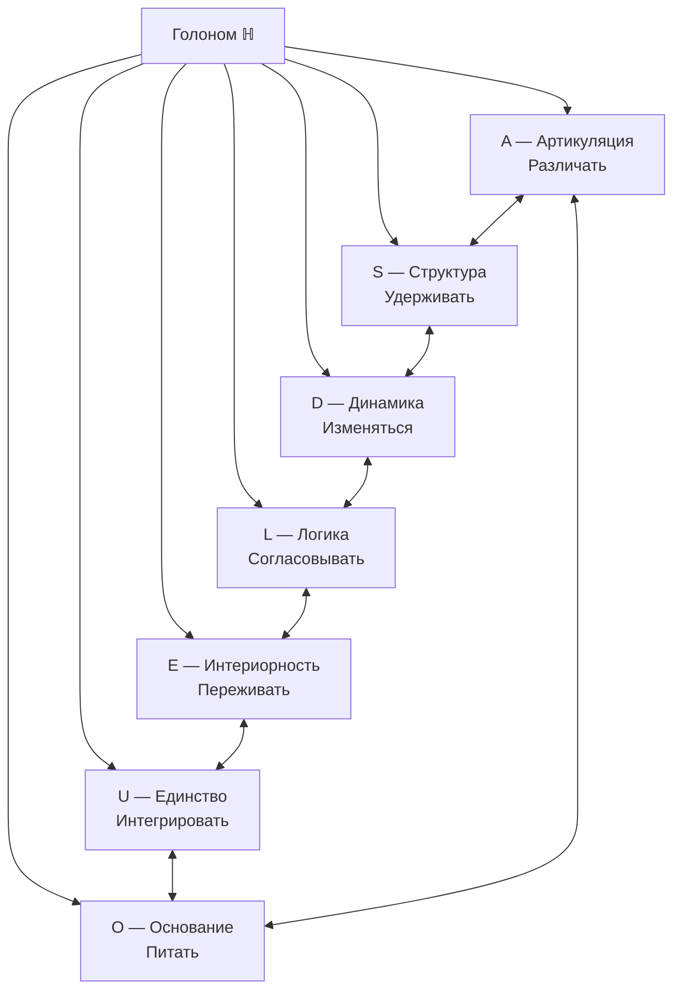
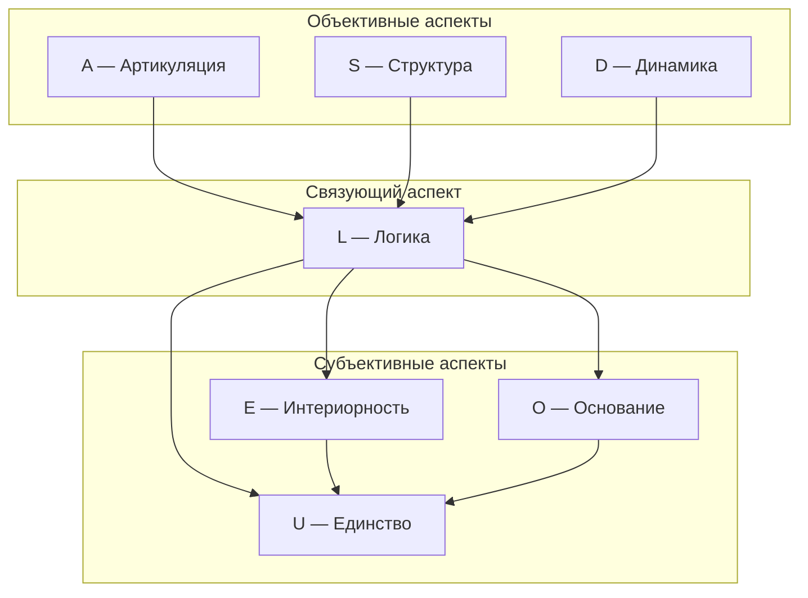

# Семь Измерений Голонома

## Обзор

:::info Онтологический статус
Измерения — **не отдельные сущности**, а неразделимые аспекты единой конфигурации $\Gamma$. Говорить "Голоном имеет 7 измерений" означает: "конфигурация $\Gamma$, удовлетворяющая [(AP)+(PH)+(QG)](../foundations/axiom-septicity), требует минимум 7 функционально независимых компонент".
:::

Число 7 — **аксиома** ([Аксиома 3](/docs/core/foundations/axiom-omega#аксиоматика)), характеризующая класс изучаемых систем. [Теорема S](../../proofs/minimality/theorem-minimality-7) объясняет, *почему этот класс интересен*: 7 — минимальная размерность для (AP)+(PH)+(QG).

### Единственность базиса

:::tip Статус единственности ([доказательство](../../proofs/minimality/theorem-minimality-7#часть-vii-теорема-о-единственности-базиса))
Базис $\{A, S, D, L, E, O, U\}$ является **единственным** (с точностью до изоморфизма) 7-мерным разбиением, удовлетворяющим (AP)+(PH)+(QG):
- [Т] **A, S, D, L, U** — алгебраическая единственность (строго доказано)
- [Т] **E** — функциональная единственность: аксиоматическое обоснование (PH) + категориальное ($\kappa_0$ требует Hom(O,E)) + математическое (rank > 1). [Доказательство →](../../proofs/minimality/theorem-minimality-7#единственность-e)
- [Т] **O** — функциональная единственность: форма ℛ [Т] + $\kappa_0$ (End(O), Hom(O,E), Hom(O,U)) + PW (A5) + функциональная независимость. [Доказательство →](../../proofs/minimality/theorem-minimality-7#единственность-o)
:::

```mermaid
graph TD
    H["Голоном ℍ"]
    A["A — Артикуляция<br/>Различать"]
    S["S — Структура<br/>Удерживать"]
    D["D — Динамика<br/>Изменяться"]
    L["L — Логика<br/>Согласовывать"]
    E["E — Интериорность<br/>Переживать"]
    O["O — Основание<br/>Питать"]
    U["U — Единство<br/>Интегрировать"]

    H --> A
    H --> S
    H --> D
    H --> L
    H --> E
    H --> O
    H --> U

    A <--> S
    S <--> D
    D <--> L
    L <--> E
    E <--> U
    U <--> O
    O <--> A
```

## Таблица измерений

| № | Измерение | Символ | Функция | Оператор | Физический аналог | Октонионный базис |
|---|-----------|--------|---------|----------|-------------------|-------------------|
| I | [Артикуляция](./dimension-a) | $A$ | Различать | Проектор $P$ | Измерение | $e_1$ |
| II | [Структура](./dimension-s) | $S$ | Удерживать | Гамильтониан $H$ | Энергия | $e_2$ |
| III | [Динамика](./dimension-d) | $D$ | Изменяться | Унитарный $U(\tau)$ | Эволюция | $e_3$ |
| IV | [Логика](./dimension-l) | $L$ | Согласовывать | Коммутатор $[\cdot, \cdot]$ | Каузальность | $e_4$ |
| V | [Интериорность](./dimension-e) | $E$ | Переживать | Плотность $\rho$ | Информация | $e_5$ |
| VI | [Основание](./dimension-o) | $O$ | Питать + Измерять время | Вакуум $\vert 0\rangle$, Часы | Квантовое поле + Часы | $e_7$ |
| VII | [Единство](./dimension-u) | $U$ | Интегрировать | След $\mathrm{Tr}$ | Нормировка | $e_6$ |

:::warning Физические аналоги — это эвристика
Столбец "Физический аналог" указывает на **концептуальные соответствия**, не строгие тождества. Например, измерение $D$ связано с унитарной эволюцией — но $D$ **не есть** время.
:::

### Комбинаторная единственность семантических ролей (T-177) [Т] {#комбинаторная-единственность}

:::tip Теорема T-177 [Т]: Комбинаторная единственность семантических ролей
После фиксации секторной декомпозиции $7 = 1_O \oplus \mathbf{3} \oplus \bar{\mathbf{3}}$ (T-48a [Т]) каждое из 7 измерений имеет **уникальный комбинаторный профиль** — набор Фано-линий и секторных связей, не изоморфный профилю ни одного другого измерения.
:::

**Доказательство.** Для каждого $e_k$ определим **функциональный отпечаток** $\mathcal{F}(e_k)$ — тройку (сектор, множество Фано-линий, секторный тип каждой линии):

| $e_k$ | Сектор | Фано-линии | O-связь (путь к синглету) |
|--------|--------|------------|--------------------------|
| $e_7$ (O) | **1** | $\{L,E,O\}, \{U,O,S\}, \{O,A,D\}$ | — (сам синглет) |
| $e_1$ (A) | **3** | $\{A,S,L\}, \{E,U,A\}, \{O,A,D\}$ | Прямая: линия $\{O,A,D\}$ |
| $e_2$ (S) | **3** | $\{A,S,L\}, \{S,D,E\}, \{U,O,S\}$ | Через $\bar{\mathbf{3}}$: линия $\{U,O,S\}$ |
| $e_3$ (D) | **3** | $\{S,D,E\}, \{D,L,U\}, \{O,A,D\}$ | Через **3**: линия $\{O,A,D\}$ |
| $e_4$ (L) | $\bar{\mathbf{3}}$ | $\{A,S,L\}, \{D,L,U\}, \{L,E,O\}$ | Через $\bar{\mathbf{3}}$: линия $\{L,E,O\}$ |
| $e_5$ (E) | $\bar{\mathbf{3}}$ | $\{S,D,E\}, \{L,E,O\}, \{E,U,A\}$ | Через $\bar{\mathbf{3}}$: линия $\{L,E,O\}$ |
| $e_6$ (U) | $\bar{\mathbf{3}}$ | $\{D,L,U\}, \{E,U,A\}, \{U,O,S\}$ | Через **3**: линия $\{U,O,S\}$ |

**Различимость внутри 3-сектора** $\{e_1, e_2, e_3\}$:
- $e_1$: **единственный** элемент **3** на Хиггсовой линии $\{E,U,A\}$ → мост между пространственным и электрослабым секторами
- $e_3$: на линии $\{O,A,D\}$ — связан с синглетом O через элемент **3** ($A$)
- $e_2$: на линии $\{U,O,S\}$ — связан с синглетом O через элемент $\bar{\mathbf{3}}$ ($U$)

**Различимость внутри $\bar{\mathbf{3}}$-сектора** $\{e_4, e_5, e_6\}$:
- $e_4$: **единственный** элемент $\bar{\mathbf{3}}$ **не** на Хиггсовой линии
- $e_5$: на Хиггсовой линии; O-связь через $\bar{\mathbf{3}}$-элемент ($L$) — линия $\{L,E,O\}$
- $e_6$: на Хиггсовой линии; O-связь через **3**-элемент ($S$) — линия $\{U,O,S\}$

Все 7 отпечатков попарно различны. $\blacksquare$

:::info Следствие: статус семантических назначений
Семантические роли A, S, D, L, E, O, U — **не произвольные мнемоники** [И]. Три роли полностью выведены из комбинаторики [Т], четыре — обосновано привязаны к Фано-путям [С]:

| Роль | Комбинаторное основание | Статус |
|------|------------------------|--------|
| **O** (Основание) | Единственный $SU(3)$-синглет; PW-часы; $\kappa_{\text{bootstrap}}$ | **[Т]** |
| **A** (Артикуляция) | Единственный из **3** на Хиггсовой линии — мост секторов | **[Т]** |
| **L** (Логика) | Единственный из $\bar{\mathbf{3}}$ НЕ на Хиггсовой линии | **[Т]** |
| **E** (Интериорность) | На Хиггсовой линии; $\mathrm{Coh}_E$ в формуле $\kappa(\Gamma)$; O-связь через $L$ | **[С]** |
| **U** (Единство) | На Хиггсовой линии; O-связь через $S$; $\Phi$-интеграция | **[С]** |
| **D** (Динамика) | Связан с $O$ через $A$ (линия $\{O,A,D\}$) — время через различение | **[С]** |
| **S** (Структура) | Связан с $O$ через $U$ (линия $\{U,O,S\}$) — форма через интеграцию | **[С]** |
:::

:::info Эпистемический статус семантической маркировки [О]
Математическая структура аксиом A1–A5 требует ровно 7 измерений (Теорема S [Т]), однако отождествление конкретных измерений с семантическими функциями (A=Артикуляция, S=Структура, D=Динамика, L=Логика, E=Интериорность, O=Основание, U=Единство) — **определение по соглашению [О]**. G₂-ригидность (T-42a [Т]) фиксирует представление с точностью до G₂-калибровки, но не фиксирует конкретную маркировку. Выбор обоснован: (a) семантической когерентностью с (AP)+(PH)+(QG)+(V), (b) внутренней согласованностью всей документации, (c) однозначностью определений пороговых мер.
:::

:::info Функциональный базис с операторными ролями
Каждое измерение определяется **оператором и ролью в аксиомах**:

| Измерение | Оператор | Аксиоматическая роль | Необходимость | Комбинаторный статус (T-177) |
|-----------|----------|---------------------|---------------|------------------------------|
| $e_1$ (A) | Проектор $P^2 = P$ | Различение подобъектов | (AP) | **[Т]** — единственный из **3** на Higgs-линии |
| $e_2$ (S) | $H = H^\dagger$ | Спектр инвариантов | (AP) | **[С]** — O-связь через $\bar{\mathbf{3}}$ |
| $e_3$ (D) | $U(\tau) = e^{-iH\tau}$ | Унитарная эволюция | (QG) | **[С]** — O-связь через **3** |
| $e_4$ (L) | $[\cdot, \cdot]$ | Замыкание алгебры | (AP) | **[Т]** — единственный из $\bar{\mathbf{3}}$ вне Higgs |
| $e_5$ (E) | $\rho_E = \mathrm{Tr}_{-E}(\Gamma)$ | Феноменология | (PH) | **[С]** — $\mathrm{Coh}_E$ в $\kappa$; O-путь через L |
| $e_6$ (U) | $\mathrm{Tr}(\cdot)$ | Нормировка | (AP) | **[С]** — O-путь через S |
| $e_7$ (O) | $H_O$, $\vert 0\rangle$ | Часы + источник | (QG) | **[Т]** — единственный синглет |

Семантические имена — **не произвольные мнемоники**, а отражение комбинаторно уникальных функциональных профилей (T-177 [Т]). Аналогия: как «верхний» и «нижний» кварки — не случайные слова (различаются зарядом $+2/3$ vs $-1/3$), но сами слова — конвенция для математически различимых объектов.

**Математическая единственность:** [Теорема о единственности базиса](../../proofs/minimality/theorem-minimality-7#часть-vii-теорема-о-единственности-базиса) доказывает, что функциональное разбиение единственно (с точностью до изоморфизма) для всех 7 измерений [Т]: A, S, D, L, U — алгебраически; E, O — категориально (через κ₀ и функциональную независимость).
:::

:::info Эмерджентное время
Время в УГМ — не внешний параметр, а **эмерджентное свойство**. Внутреннее время τ возникает из корреляций между измерением $O$ (Основание) и остальными измерениями через механизм Пейдж–Вуттерс. Измерение $O$ выполняет двойную роль: источник регенерации **и** внутренние часы системы.

[Подробнее: Теорема об эмерджентном времени →](../../proofs/dynamics/emergent-time)
:::

:::info Согласование 7D и 42D формализмов
Теория использует **два формализма**:

- **7D** ($\mathbb{C}^7$): структурные теоремы (Теорема S, единственность базиса, пороги), E-когерентность $\mathrm{Coh}_E$ через [HS-проекцию](/docs/core/foundations/axiom-septicity#hs-projection) **[Т]**, меры $R$ и $\Phi$.
- **42D** ($\mathcal{H}_O \otimes \mathcal{H}_{6D} \cong \mathbb{C}^{42}$): механизм Пейдж–Вуттерс (эмерджентное время), калибровочные симметрии электрослабого сектора, тензорная запутанность.

**Разрешённая часть [Т]:** Тензорный разрыв для $\mathrm{Coh}_E$ полностью разрешён — [C*-алгебраическая проекция Гильберта–Шмидта](/docs/core/foundations/axiom-septicity#hs-projection) определяет $\mathrm{Coh}_E$ в 7D **точно**, не прибегая к частичному следу. Определение подсистемы реализуется через вложение C*-подалгебры и [условное ожидание Умегаки](/docs/core/foundations/axiom-septicity#теорема-условное-ожидание). Это стандартный аппарат алгебраической квантовой теории (Haag, 1996; Bratteli–Robinson, 1987).

**Открытая часть [С]:** Полная редуцированная матрица $\rho_E = \mathrm{Tr}_{-E}(\Gamma)$ и мера дифференциации $D_{\text{diff}} = \exp(S_{vN}(\rho_E))$ по-прежнему требуют тензорной факторизации (42D-формализм), поскольку частичный след $\mathrm{Tr}_{\bar{E}}$ не определён в $\mathbb{C}^7$ (7 — простое число). Утверждения, использующие $D_{\text{diff}}$, имеют статус **[С]** — условные на 42D-расширение.
:::

## Октонионная интерпретация {#октонионная-интерпретация}

:::info Структурный вывод N = 7 через октонионы
Число 7 измерений получает **второе, независимое обоснование** через [структурный вывод](../../proofs/minimality/theorem-octonionic-derivation): если пространство внутренних степеней свободы изоморфно Im(𝕆) (мнимой части октонионов), то $N = \dim(\text{Im}(\mathbb{O})) = 7$.
:::

Семь мнимых единиц октонионов $e_1, \ldots, e_7$ соответствуют семи измерениям Голонома. Это соответствие привносит:

- **$G_2$-симметрию:** Aut(𝕆) = $G_2$ ⊂ SO(7) — 14-параметрическая группа, сохраняющая структуру умножения
- **Плоскость Фано:** 7 триплетов $(e_i, e_j, e_k)$ определяют ассоциативные подтройки измерений
- **Альтернативность:** Любые два измерения порождают ассоциативную подалгебру (теорема Артина [Т]), неассоциативность проявляется только при взаимодействии трёх и более

:::info $G_2$-оговорка [Т]
Конкретное отождествление $e_i$ ↔ измерение — **теорема** [Т] (T15): мост полностью замкнут (теоремы T1–T15). $G_2$ действует на Im(𝕆); вопрос о том, является ли эта симметрия физически реализованной в пространстве {A,S,D,L,E,O,U}, остаётся [открытой проблемой](../../proofs/minimality/theorem-octonionic-derivation#открытые-проблемы).
:::

## Необходимость каждого измерения

Удаление любого измерения нарушает условия [(AP)+(PH)+(QG)](../foundations/axiom-septicity):

| Без измерения | Нарушается | Следствие |
|---------------|------------|-----------|
| $A$ | (AP), (PH), (QG) | Нет различений → нет формы |
| $S$ | (AP) | Нет идентичности → нет самотождественности |
| $D$ | (AP), (QG) | Нет эволюции → нет процесса |
| $L$ | (AP) | Нет замыкания → нет самосогласованности |
| $E$ | (PH) | Нет интериорности → нет феноменологии |
| $O$ | (QG) | Нет регенерации, нет внутренних часов → нет времени |
| $U$ | (AP) | Нет интеграции → система фрагментирована |

**Доказательство:** [Теорема о минимальности 7D](../../proofs/minimality/theorem-minimality-7).

## Матричное представление

:::note DRY: Мастер-определение
Полное матричное представление $\Gamma$ с формальными свойствами см. в [Матрица когерентности](../dynamics/coherence-matrix#матричное-представление).
:::

В базисе $\{|A\rangle, |S\rangle, |D\rangle, |L\rangle, |E\rangle, |O\rangle, |U\rangle\}$ матрица когерентности — эрмитова $7 \times 7$ матрица с элементами $\gamma_{ij}$:
- **Диагональ** $\gamma_{ii} \in [0,1]$ — населённости измерений, $\sum_i \gamma_{ii} = 1$
- **Когерентности** $\gamma_{ij}$ ($i \neq j$) — связи между измерениями, $|\gamma_{ij}|^2 \leq \gamma_{ii} \cdot \gamma_{jj}$

## Семантика когерентностей

Недиагональные элементы $\gamma_{ij}$ ($i \neq j$) описывают **связи между измерениями**:

| Когерентность | Интерпретация | Пример |
|---------------|---------------|--------|
| $\gamma_{AE}$ | Артикуляция ↔ Интериорность | Апперцепция (различение, вошедшее в интериорность) |
| $\gamma_{SL}$ | Структура ↔ Логика | Номос (структура с логической необходимостью) |
| $\gamma_{DU}$ | Динамика ↔ Единство | Телеология (интегрированное направленное изменение) |
| $\gamma_{EO}$ | Интериорность ↔ Основание | Имманентность (основание внутри интериорности) |
| $\gamma_{SE}$ | Структура ↔ Интериорность | Репрезентация (структура, представленная в интериорности) |
| $\gamma_{LU}$ | Логика ↔ Единство | Консистентность (логическая непротиворечивость целого) |

:::note Полный набор когерентностей
Матрица $7 \times 7$ содержит $\binom{7}{2} = 21$ независимых недиагональных элементов. Каждый описывает связь между парой измерений.
:::

## Связь с (M,R)-системами Розена

Семь измерений УГМ **обобщают** (M,R)-систему Розена, добавляя феноменологию и квантовое основание:

| Розен | УГМ | Функция |
|-------|-----|---------|
| $M$ (метаболизм) | $D$ (Динамика) | Преобразование субстратов |
| $\Phi$ (репарация) | $A + L$ (Артикуляция + Логика) | Восстановление структуры |
| $\beta$ (замыкание) | $U$ (Единство) | Интеграция, самозамыкание |
| — | $E$ (Интериорность) | Расширение: интериорность |
| — | $O$ (Основание) | Расширение: квантовый источник |
| — | $S$ (Структура) | Расширение: инварианты |

**Формально:** $7 = 3_{\text{Розен}} + 4_{\text{расширения}}$.

См. [Теорема 5.1: Изоморфизм с (M,R)-системами](../../proofs/minimality/theorem-minimality-7#часть-v-связь-с-mr-системами-розена).

## Группировка измерений

```mermaid
graph TD
    subgraph "Объективные аспекты"
        A["A — Артикуляция"]
        S["S — Структура"]
        D["D — Динамика"]
    end
    subgraph "Субъективные аспекты"
        E["E — Интериорность"]
        O["O — Основание"]
        U["U — Единство"]
    end
    subgraph "Связующий аспект"
        L["L — Логика"]
    end

    A --> L
    S --> L
    D --> L
    L --> E
    L --> O
    L --> U
    E --> U
    O --> U
```

:::warning Группировка — эвристика
Деление на "объективные" и "субъективные" аспекты — **педагогическое упрощение**. Все семь измерений неразделимы в $\Gamma$. Двухаспектный монизм означает: объективное и субъективное — две стороны одной конфигурации, не разные части.
:::

Логика ($L$) выделена как "связующий аспект", поскольку коммутатор $[A, B]$ определяет **отношения** между операторами всех остальных измерений.

---

**Детальные страницы:**
- [Артикуляция (A)](./dimension-a)
- [Структура (S)](./dimension-s)
- [Динамика (D)](./dimension-d)
- [Логика (L)](./dimension-l)
- [Интериорность (E)](./dimension-e)
- [Основание (O)](./dimension-o)
- [Единство (U)](./dimension-u)

**Связанные документы:**
- [Голоном](./holon) — что такое конфигурация $\Gamma$
- [Теорема S](../../proofs/minimality/theorem-minimality-7) — доказательство минимальности 7D (Трек A)
- [Структурный вывод через октонионы](../../proofs/minimality/theorem-octonionic-derivation) — P1+P2 → 𝕆 → N=7 (Трек B)
- [Теорема о единственности](../../proofs/minimality/theorem-minimality-7#часть-vii-теорема-о-единственности-базиса) — доказательство уникальности базиса
- [Аксиома (AP+PH+QG+V)](../foundations/axiom-septicity) — условия на Голоном
- [Эмерджентное время](../../proofs/dynamics/emergent-time) — время из структуры Γ
