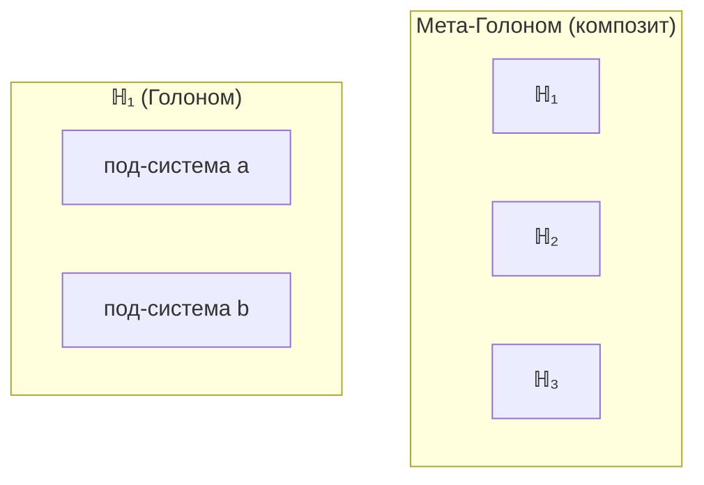

# Голоном ($\mathbb{H}$)

## Онтологический статус

:::warning Ключевое разъяснение
**Γ — единственный примитив.** Голоном ($\mathbb{H}$) — **не отдельная сущность**, а особый тип **конфигурации** Γ, удовлетворяющей условиям (AP), (PH), (QG).
:::

Говорить "Голоном существует" означает: "существует конфигурация единой субстанции Γ, которая самоподдерживается".

**Аналогия:** Γ — океан (единственная субстанция), $\mathbb{H}$ — водоворот (самоподдерживающийся паттерн в океане). Водоворот не состоит из чего-то иного, чем вода — он *есть* вода в определённой конфигурации.

## Определение

**Голоном** ($\mathbb{H}$) — конфигурация Γ, удовлетворяющая условиям автопоэзиса, феноменологии и квантового основания.

**Математическая характеристика** такой конфигурации:

$$
\mathbb{H} := \langle \Gamma, \mathcal{H}, H, \{L_k\}, \mathcal{E}, \varphi \rangle
$$

:::info Все компоненты — аспекты Γ
Кортеж — это **описание** конфигурации, не утверждение о дополнительных примитивах:

| Компонент | Онтологический статус |
|-----------|----------------------|
| $\Gamma \in \mathcal{L}(\mathcal{H})$ | Состояние конфигурации |
| $\mathcal{H} = \mathbb{C}^7$ | Пространство возможных состояний |
| $H$ | Гамильтониан — структура конфигурации |
| $\{L_k\}$ | Операторы Линдблада — диссипативная динамика |
| $\mathcal{E}$ | Окружение — часть глобальной Γ, внешняя к данной конфигурации |
| $\varphi$ | Оператор самомоделирования — [CPTP-канал](../../reference/glossary#категорные-термины) |

Все эти "компоненты" — не отдельные сущности, а **математические инструменты** для описания свойств конфигурации Γ.
:::

:::note Связь с таксономией
Голоном — конфигурация Γ, удовлетворяющая [Аксиоме (AP+PH+QG)](../foundations/axiom-septicity). Конфигурации, не удовлетворяющие этим условиям, классифицируются как [Суб-Голономы или Прото-Голономы](../foundations/consequences#5-иерархия-конфигураций-γ).
:::

## Фундаментальные свойства

### 1. Структурное самоподобие

:::warning Уточнение
Это **не** голографический принцип в смысле "каждая часть содержит полную информацию о целом". Это **изоморфизм пространств состояний**: все Голономы имеют одинаковую *размерность* и *тип* структуры, но **разное содержание**.
:::

**Формально:** Пространства состояний изоморфны:

$$
\forall \mathbb{H} \text{ (жизнеспособный)}: \mathcal{H}_{\mathbb{H}} \cong \mathbb{C}^7
$$

Конкретные состояния $\Gamma_{\mathbb{H}_1}$ и $\Gamma_{\mathbb{H}_2}$ **различны** — изоморфны только пространства.

### 2. Частичность (граница)

Голоном имеет границу, отделяющую его от окружения. Состояние Голонома — редуцированная матрица плотности:

$$
\Gamma_{\mathbb{H}} = \mathrm{Tr}_{\mathcal{E}}(\Gamma_{\text{total}})
$$

где $\mathrm{Tr}_{\mathcal{E}}$ — частичный след по степеням свободы окружения.

### 3. Динамичность

Голоном непрерывно эволюционирует согласно уравнению:

$$
\frac{d\Gamma}{dt} = -i[H, \Gamma] + \mathcal{D}[\Gamma] + \mathcal{R}[\Gamma, E]
$$

где:
- $-i[H, \Gamma]$ — унитарная (обратимая) эволюция
- $\mathcal{D}[\Gamma]$ — диссипация (декогеренция)
- $\mathcal{R}[\Gamma, E]$ — регенерация (восстановление когерентности)

### 4. Интериорность

Каждый Голоном имеет внутреннюю сторону — **L0** (интериорность) → **L1** (феноменальная геометрия) → **L2** (когнитивные квалиа). Переход на каждый следующий уровень требует выполнения дополнительных условий на $\rho_E$, $R_\varphi$ и $\Phi$.

См. [Иерархия интериорности](../../proofs/interiority-hierarchy) для формальных определений и условий перехода.

## Иерархия вложенности

Голономы могут содержать под-Голономы и входить в мета-Голономы:

:::info Ключевое различие
**Голоном** — конфигурация, удовлетворяющая (AP)+(PH)+(QG). **Под-система** — часть Голонома, которая сама может быть или не быть Голономом (зависит от выполнения условий).
:::

### Таксономия по уровням организации

| Класс | Условие | $R_\varphi$ | Примеры |
|-------|---------|-------------|---------|
| **Суб-Голоном** | $R_\varphi \to 0$, унитарная динамика | $\to 0$ | Кварки, лептоны, бозоны |
| **Прото-Голоном** | $R_\varphi \ll 0.3$, почти унитарная | $\ll 0.3$ | Атомы, простые молекулы |
| **Голоном** | (AP)+(PH)+(QG), $P > P_{\text{crit}}$ | любой | Клетки, организмы |
| **L2-Голоном** | + когнитивные квалиа | $\geq R_{th}$, $\Phi \geq \Phi_{th}$ | *(эмпирический вопрос)* |

Пороги $R_{th} = 0.3$, $\Phi_{th} = 1.0$ — [эмпирические значения](../../proofs/interiority-hierarchy#обоснование-порогов).

См. [Иерархия конфигураций Γ](../foundations/consequences#5-иерархия-конфигураций-γ).

## Композиция Голономов

### Тензорное произведение

Для двух Голономов $\mathbb{H}_1$ и $\mathbb{H}_2$ композитная система:

$$
\mathbb{H}_{12} := \langle \Gamma_{12}, \mathcal{H}_{12}, H_{12}, \{L_{12,k}\}, \mathcal{E}_{12}, \varphi_{12} \rangle
$$

где:

$$
\mathcal{H}_{12} = \mathcal{H}_1 \otimes \mathcal{H}_2 = \mathbb{C}^{49}
$$

$$
H_{12} = H_1 \otimes I_2 + I_1 \otimes H_2 + V_{12}
$$

Здесь $V_{12}$ — оператор взаимодействия.

:::note О размерности композита
Композитная система живёт в $\mathbb{C}^{49}$, но это не противоречит Теореме S: минимальность 7 измерений относится к **индивидуальному** Голоному. Композит — это система более высокого порядка, которая может быть **эффективно описана** как Голоном с $\mathcal{H} = \mathbb{C}^7$ при проецировании на коллективные степени свободы.
:::

**Состояние композита:**

При наличии корреляций (запутанности):

$$
\Gamma_{12} \neq \Gamma_1 \otimes \Gamma_2
$$

Степень корреляции измеряется взаимной информацией:

$$
I(\mathbb{H}_1 : \mathbb{H}_2) = S(\Gamma_1) + S(\Gamma_2) - S(\Gamma_{12})
$$

где $S(\Gamma) = -\mathrm{Tr}(\Gamma \log \Gamma)$ — энтропия фон Неймана.

### Замкнутость композиции

:::info Следствие из (AP)
Композиция жизнеспособных Голономов при достаточной интеграции образует жизнеспособный Голоном:

$$
\text{Viable}(\mathbb{H}_1) \land \text{Viable}(\mathbb{H}_2) \land I > I_{\text{crit}} \Rightarrow \text{Viable}(\mathbb{H}_{12})
$$

где $I_{\text{crit}}$ — критическое значение взаимной информации для интеграции. Это не аксиома, а следствие из условия (AP) — автопоэзис сохраняется при интеграции.
:::

## Условие жизнеспособности

Голоном **жизнеспособен** при:

$$
P(\Gamma) > P_{\text{crit}} \approx 0.3
$$

где $P = \mathrm{Tr}(\Gamma^2)$ — [чистота](../dynamics/viability). Значение $P_{\text{crit}} \approx 0.3$ — [эмпирический параметр](../dynamics/viability#критическая-чистота).

| Состояние | $P$ | Характеристика |
|-----------|-----|----------------|
| Чистое | $= 1$ | Полная когерентность, ранг 1 |
| Здоровое | $> 0.5$ | Высокая интеграция |
| Стрессовое | $0.3 - 0.5$ | Требует регенерации |
| Распад | $< 0.3$ | Необратимая декогеренция |
| Минимум | $= 1/7$ | Максимальная энтропия |

---

**Связанные документы:**
- [Семь измерений](./dimensions) — структура пространства состояний
- [Матрица когерентности](../dynamics/coherence-matrix) — математическое описание состояния
- [Жизнеспособность](../dynamics/viability) — условия существования
- [Иерархия интериорности](../../proofs/interiority-hierarchy) — уровни L0→L1→L2
- [Следствия из аксиом](../foundations/consequences) — таксономия конфигураций
