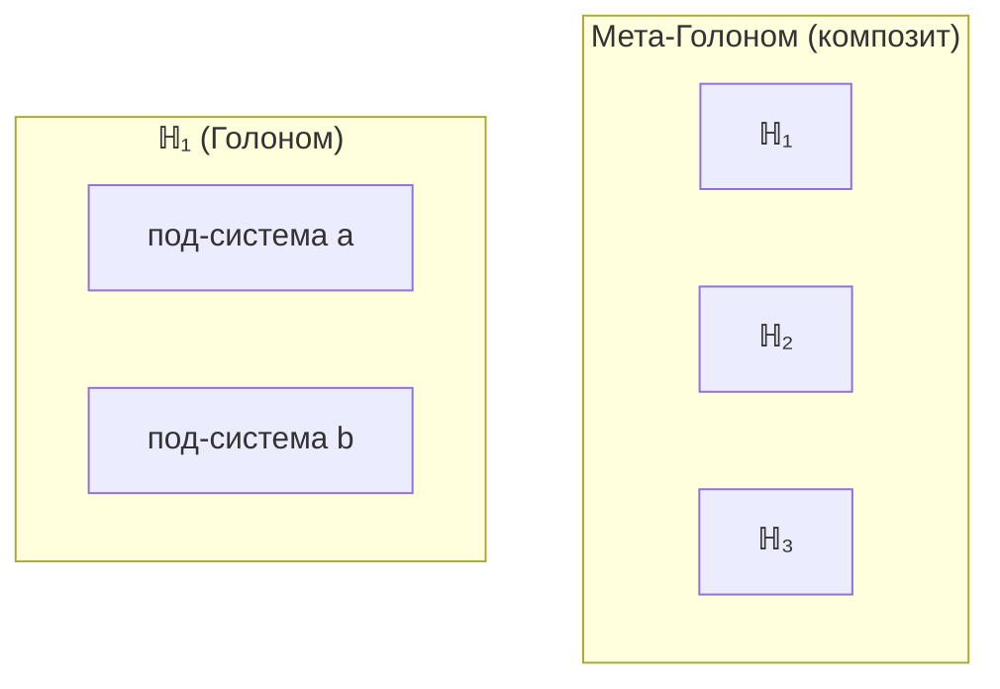

# Голоном ($\mathbb{H}$)

## Онтологический статус

:::warning Ключевое разъяснение
**Категория 𝒞 — единственный примитив.** Матрица когерентности $\Gamma$ — **объект** этой категории. Голоном ($\mathbb{H}$) — **не отдельная сущность**, а особый тип конфигурации $\Gamma \in \text{Ob}(\mathcal{C})$, удовлетворяющей условиям (AP)+(PH)+(QG)+(V).
:::

:::info Таксономия: иерархия конфигураций Γ
Все конфигурации Γ образуют иерархию по степени автономности:
- **Фундаментальная мода Γ:** унитарная динамика, R = 0, пассивная стабильность
- **Составная конфигурация Γ:** квази-автономная, 0 < R ≪ 1, пассивная стабильность
- **Голоном:** полное замыкание (AP)+(PH)+(QG)+(V), активная стабильность (автопоэзис)
- **L2-Голоном:** + когнитивные квалиа (R ≥ R_th, Φ ≥ Φ_th)

Только конфигурации с полным автопоэтическим замыканием называются «Голономами». Фундаментальные моды и составные конфигурации — объекты категории **Hol**, но **не** Голономы: они не удовлетворяют условиям (AP)+(QG). См. [Таксономию](#таксономия-по-уровням-организации) ниже.
:::

Говорить "Голоном существует" означает: "существует конфигурация единой субстанции Γ, которая самоподдерживается".

**Аналогия:** Γ — океан (единственная субстанция), $\mathbb{H}$ — водоворот (самоподдерживающийся паттерн в океане). Водоворот не состоит из чего-то иного, чем вода — он *есть* вода в определённой конфигурации.

## Иерархическое определение

Определение Голонома стратифицировано по уровням, где каждый уровень зависит только от предыдущих.

### Уровень 0: Глобальная Γ

По [Аксиоме Ω](../foundations/axiom-omega):
$$
\exists! \, \Gamma_{\text{global}} \in \mathcal{L}(\mathcal{H}_{\text{global}}): \Gamma_{\text{global}}^\dagger = \Gamma_{\text{global}}, \; \Gamma_{\text{global}} \geq 0, \; \mathrm{Tr}(\Gamma_{\text{global}}) = 1
$$

### Уровень 1: Подсистема

Пусть $\mathcal{H}_{\text{global}} = \mathcal{H}_S \otimes \mathcal{H}_E$ — тензорное разложение. **Подсистема** $S$:
$$
\Gamma_S := \mathrm{Tr}_E(\Gamma_{\text{global}})
$$

### Уровень 2: Автономность

Подсистема является **автономной**, если выполнены условия (A1)+(A2)+(A3). См. [Предварительное условие: Автономность](../foundations/axiom-septicity#предварительное-условие-автономность).

### Уровень 3: 7D-структура

Автономная подсистема обладает **7D-структурой**, если:
$$
\mathcal{H}_S \cong \mathbb{C}^7 \otimes \mathcal{H}_{\text{internal}}
$$

Эффективная 7D-матрица:
$$
\Gamma_S^{(7)} := \mathrm{Tr}_{\text{internal}}(\Gamma_S) \in \mathcal{L}(\mathbb{C}^7)
$$

### Соотношение с квантовой механикой

:::info Статус: Эффективная теория
$\mathbb{C}^7$ УГМ — это **эффективное описание** для автономных систем. Связь со стандартной КМ ($L^2(\mathbb{R}^3)$ — бесконечномерное пространство) устанавливается через проекцию.
:::

**Определение (Эффективный Голоном):**

Для системы с полным гильбертовым пространством $\mathcal{H}_{\text{full}} = L^2(\mathbb{R}^3)$ (стандартная КМ), **эффективный Голоном** определяется как проекция на 7-мерное подпространство релевантных степеней свободы:

$$
\Gamma_{\text{eff}} = \Pi_7 \, \rho_{\text{full}} \, \Pi_7^\dagger
$$

где $\Pi_7: \mathcal{H}_{\text{full}} \to \mathbb{C}^7$ — проекция на 7 выбранных мод.

**Интерпретация измерений для квантовой системы:**

| Измерение | Стандартная КМ | Пример (атом H) |
|-----------|----------------|-----------------|
| **A** (Артикуляция) | Проекторы на подпространства | $P_{1s}, P_{2s}, P_{2p}$ |
| **S** (Структура) | Гамильтониан | $H = -\nabla^2/2m - e^2/r$ |
| **D** (Динамика) | Унитарная эволюция | $U(\tau) = e^{-iH\tau}$ |
| **L** (Логика) | Коммутаторы | $[L_x, L_y] = i\hbar L_z$ |
| **E** (Опыт) | Редуцированная матрица | $\rho_{\text{spin}}$ |
| **O** (Основание) | Вакуум/основное состояние | $\vert 1s\rangle$ |
| **U** (Единство) | Нормировка | $\mathrm{Tr}(\rho) = 1$ |

**Важно:** УГМ **не претендует** на воспроизведение всех предсказаний стандартной КМ (спектры, сечения и т.д.). $\mathbb{C}^7$ — достаточное описание для:
- Автономных агентов
- Феноменологии сознания
- Динамики самомоделирования

Полное вложение стандартной КМ в УГМ — **открытое направление исследований**.

### Уровень 4: Голоном (определение)

**Голоном** ($\mathbb{H}$) — автономная подсистема с 7D-структурой, удовлетворяющая условиям [(AP)+(PH)+(QG)+(V)](../foundations/axiom-septicity):

$$
\mathbb{H} := \langle \Gamma_S^{(7)}, \mathcal{H}_S, H_S, \{L_k\}, \mathcal{E}, \varphi_S \rangle
$$

:::info Все компоненты — аспекты Γ
Кортеж — это **описание** конфигурации, не утверждение о дополнительных примитивах:

| Компонент | Онтологический статус |
|-----------|----------------------|
| $\Gamma_S^{(7)} \in \mathcal{L}(\mathbb{C}^7)$ | Эффективная 7D-матрица состояния |
| $\mathcal{H}_S$ | Пространство состояний подсистемы |
| $H_S$ | Гамильтониан — структура конфигурации |
| $\{L_k\}$ | Операторы Линдблада — диссипативная динамика |
| $\mathcal{E}$ | Окружение — часть глобальной Γ, внешняя к данной конфигурации |
| $\varphi_S$ | Оператор самомоделирования — [CPTP-канал](../../reference/glossary#категорные-термины) |

Все эти "компоненты" — не отдельные сущности, а **математические инструменты** для описания свойств конфигурации Γ.
:::

:::note Непротиворечивость определения
Иерархическое определение не содержит круговых зависимостей: каждый уровень (0→1→2→3→4) зависит только от предыдущих. См. [Теорема о непротиворечивости](../foundations/axiom-septicity#теорема-непротиворечивость-иерархии-определений).
:::

## Фундаментальные свойства

### 1. Структурное самоподобие

:::warning Уточнение
Это **не** голографический принцип в смысле "каждая часть содержит полную информацию о целом". Это **изоморфизм пространств состояний**: все Голономы имеют одинаковую *размерность* и *тип* структуры, но **разное содержание**.
:::

**Формально:** Пространства состояний изоморфны:

$$
\forall \mathbb{H} \text{ (жизнеспособный)}: \mathcal{H}_{\mathbb{H}} \cong \mathbb{C}^7
$$

Конкретные состояния $\Gamma_{\mathbb{H}_1}$ и $\Gamma_{\mathbb{H}_2}$ **различны** — изоморфны только пространства.

### 2. Частичность (граница)

Голоном имеет границу, отделяющую его от окружения. Состояние Голонома — редуцированная матрица плотности:

$$
\Gamma_{\mathbb{H}} = \mathrm{Tr}_{\mathcal{E}}(\Gamma_{\text{total}})
$$

где $\mathrm{Tr}_{\mathcal{E}}$ — частичный след по степеням свободы окружения.

### 3. Динамичность

Голоном непрерывно эволюционирует согласно уравнению с [эмерджентным внутренним временем](../../proofs/dynamics/emergent-time) τ:

$$
\frac{d\Gamma(\tau)}{d\tau} = -i[H_{eff}, \Gamma(\tau)] + \mathcal{D}[\Gamma(\tau)] + \mathcal{R}[\Gamma(\tau), E]
$$

> Каноническое определение и вывод членов уравнения см. [Эволюция Γ](../dynamics/evolution#полное-уравнение-движения).

где:
- $\tau$ — внутреннее время, возникающее из корреляций с измерением O
- $H_{eff}$ — эффективный гамильтониан из ограничения Page-Wootters
- $-i[H_{eff}, \Gamma(\tau)]$ — унитарная (обратимая) эволюция
- $\mathcal{D}[\Gamma(\tau)]$ — диссипация (декогеренция)
- $\mathcal{R}[\Gamma(\tau), E]$ — регенерация (восстановление когерентности)

### 4. Интериорность

Каждый Голоном имеет внутреннюю сторону:
- **L0** (интериорность): $\exists \rho_E \neq 0$
- **L1** (феноменальная геометрия): $\mathrm{rank}(\rho_E) > 1$
- **L2** (когнитивные квалиа): $R \geq 1/3$, $\Phi \geq 1$

Пороги L2 **строго выводятся** из Принципа Информационной Различимости. См. [Иерархия интериорности](../../proofs/consciousness/interiority-hierarchy) и [Пороги L2](../foundations/axiom-septicity#пороги-l2-строгий-вывод).

:::note Полная иерархия
Полная иерархия интериорности L0→L4 определена в [Уровни интериорности](/docs/consciousness/foundations/interiority-theory). Здесь показаны L0-L2 как базовые уровни. Уровни L3 (сетевое сознание, метастабильно) и L4 (унитарное сознание, теоретический предел) описаны в [Иерархия интериорности](../../proofs/consciousness/interiority-hierarchy).
:::

## Иерархия вложенности

Голономы могут содержать под-Голономы и входить в мета-Голономы:

:::info Ключевое различие
**Голоном** — автономная подсистема с 7D-структурой, удовлетворяющая (AP)+(PH)+(QG)+(V). **Под-система** — любая часть, полученная частичным следом. Подсистема является Голономом тогда и только тогда, когда выполнены условия автономности (A1-A3) и условия (AP)+(PH)+(QG)+(V).
:::

### Таксономия по уровням организации

| Класс | Ур. иерархии | Формальное условие | Стабильность | Примеры |
|-------|---|---|---|---|
| **Фундаментальная мода Γ** | 0–1 | $R = 0$, чисто унитарная | Пассивная (симметрии) | Кварки, лептоны, бозоны |
| **Составная конфигурация Γ** | 1–2 | $0 < R \ll 1$, квази-автономная | Пассивная (связи) | Атомы, простые молекулы |
| **Голоном** (ℍ) | 2–4 | (AP)+(PH)+(QG)+(V), $P > P_{\text{crit}}$ | Активная (автопоэзис) | Клетки, организмы |
| **L2-Голоном** | 4+ | + $R \geq R_{\text{th}}$, $\Phi \geq \Phi_{\text{th}}$ | + рефлексия | *(эмпирический вопрос)* |
| **L3-Голоном** | 4+ | + $R^{(2)} \geq 1/4$ (метастабильно) | + мета-рефлексия | Глубокая медитация, рой |
| **L4-Голоном** | 4+ | + $P > 6/7$, полная ∞-структура | + полная интеграция | Теоретический предел |

:::warning Терминологическая конвенция
Термин «Голоном» зарезервирован для конфигураций с **полным автопоэтическим замыканием** (AP)+(PH)+(QG)+(V). Фундаментальные моды и составные конфигурации — **не** Голономы: у них отсутствует автопоэзис (AP) и регенерация (QG). Они являются объектами категории **Hol**, но в вырожденном режиме $R \to 0$, где уравнение эволюции [редуцируется к уравнению Шрёдингера](../../proofs/physics/physics-correspondence#3-редукция-к-квантовой-механике).
:::

**Пороги ([статусы порогов](../foundations/axiom-septicity#пороги-l2-строгий-вывод)):**
- $P_{\text{crit}} = 2/7$ — [Т] [Теорема о критической чистоте](../../proofs/dynamics/theorem-purity-critical)
- $R_{\text{th}} = 1/3$ — [Т] [Порог рефлексии](../foundations/axiom-septicity#теорема-порог-рефлексии) ($K=3$ из [триадной декомпозиции](/docs/core/operators/lindblad-operators#триадная-декомпозиция))
- $\Phi_{\text{th}} = 1$ — [О] [Порог интеграции](../foundations/axiom-septicity#теорема-порог-интеграции) (когерентная доминация)

См. [Иерархия конфигураций Γ](../foundations/consequences#6-иерархия-конфигураций-γ).

## Композиция Голономов

### Тензорное произведение

Для двух Голономов $\mathbb{H}_1$ и $\mathbb{H}_2$ композитная система:

$$
\mathbb{H}_{12} := \langle \Gamma_{12}, \mathcal{H}_{12}, H_{12}, \{L_{12,k}\}, \mathcal{E}_{12}, \varphi_{12} \rangle
$$

где:

$$
\mathcal{H}_{12} = \mathcal{H}_1 \otimes \mathcal{H}_2 = \mathbb{C}^{49}
$$

$$
H_{12} = H_1 \otimes I_2 + I_1 \otimes H_2 + V_{12}
$$

Здесь $V_{12}$ — оператор взаимодействия.

:::note О размерности композита
Композитная система живёт в $\mathbb{C}^{49}$, но это не противоречит Теореме S: минимальность 7 измерений относится к **индивидуальному** Голоному. Композит — это система более высокого порядка, которая может быть **эффективно описана** как Голоном с $\mathcal{H} = \mathbb{C}^7$ при проецировании на коллективные степени свободы.
:::

**Состояние композита:**

При наличии корреляций (запутанности):

$$
\Gamma_{12} \neq \Gamma_1 \otimes \Gamma_2
$$

Степень корреляции измеряется взаимной информацией:

$$
I(\mathbb{H}_1 : \mathbb{H}_2) = S(\Gamma_1) + S(\Gamma_2) - S(\Gamma_{12})
$$

где $S(\Gamma) = -\mathrm{Tr}(\Gamma \log \Gamma)$ — энтропия фон Неймана.

### Замкнутость композиции

:::info Следствие из (AP)
Композиция жизнеспособных Голономов при достаточной интеграции образует жизнеспособный Голоном:

$$
\text{Viable}(\mathbb{H}_1) \land \text{Viable}(\mathbb{H}_2) \land I > I_{\text{crit}} \Rightarrow \text{Viable}(\mathbb{H}_{12})
$$

где $I_{\text{crit}}$ — критическое значение взаимной информации для интеграции. Это не аксиома, а следствие из условия (AP) — автопоэзис сохраняется при интеграции.
:::

## Условие жизнеспособности

Голоном **жизнеспособен** при:

$$
P(\Gamma) > P_{\text{crit}} = \frac{2}{7} \approx 0.286
$$

где $P = \mathrm{Tr}(\Gamma^2)$ — [чистота](../dynamics/viability). Значение $P_{\text{crit}} = 2/N$ — **доказанная теорема** о минимальной различимости от шума. См. [Теорема о критической чистоте](../../proofs/dynamics/theorem-purity-critical).

| Состояние | $P$ | Характеристика |
|-----------|-----|----------------|
| Чистое | $= 1$ | Полная когерентность, ранг 1 |
| Здоровое | $> 0.5$ | Высокая интеграция |
| Стрессовое | $0.29 - 0.5$ | Требует регенерации |
| Распад | $< 2/7$ | Необратимая декогеренция |
| Минимум | $= 1/7$ | Максимальная энтропия |

---

**Связанные документы:**
- [Аксиома Септичности](../foundations/axiom-septicity) — критерий автономности (A1-A3) и условия (AP+PH+QG+V)
- [Семь измерений](./dimensions) — структура пространства состояний
- [Матрица когерентности](../dynamics/coherence-matrix) — математическое описание состояния
- [Эмерджентное время](../../proofs/dynamics/emergent-time) — τ из структуры Γ
- [Жизнеспособность](../dynamics/viability) — условия существования
- [Иерархия интериорности](../../proofs/consciousness/interiority-hierarchy) — уровни L0→L1→L2→L3→L4
- [Следствия из аксиом](../foundations/consequences) — таксономия конфигураций
