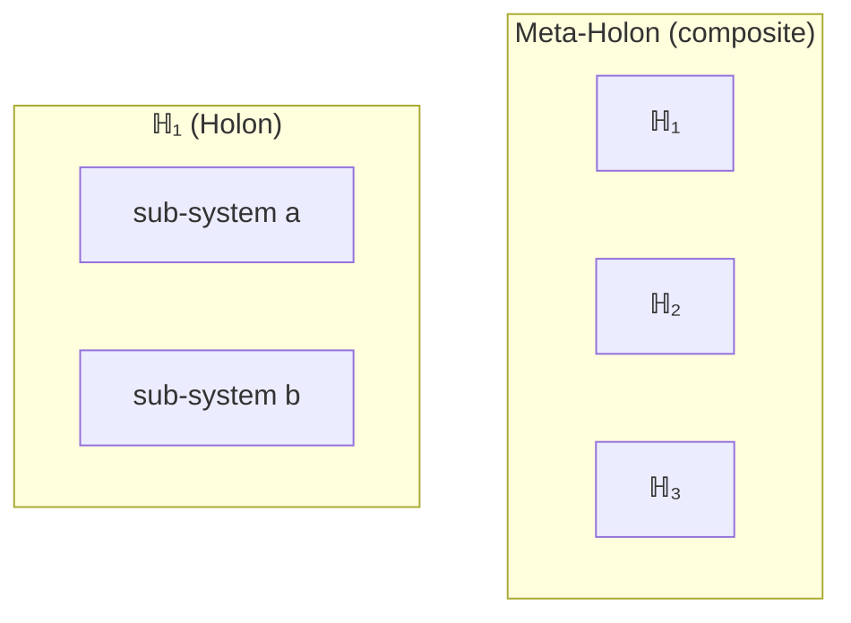

# Holon ($\mathbb{H}$)

:::info Who this chapter is for
The central concept of UHM: the self-sustaining configuration Γ. A basic familiarity with the [coherence matrix](/docs/core/dynamics/coherence-matrix) and [Axiom Ω⁷](/docs/core/foundations/axiom-omega) is assumed.
:::

This chapter is the heart of the Unitary Holonomic Monism. Here we learn what a Holon is — the central concept of the theory around which everything else is built. A Holon is not a thing or a particle, but a **self-sustaining pattern** in the unified substance of reality $\Gamma$. To understand this idea, one must abandon the habit of thinking about the world as a set of separate objects and see reality as a unified field of configurations in which stable structures arise. By the end of the chapter you will understand what makes a configuration $\Gamma$ "alive", how Holons nest inside one another, and why there is a sharp mathematical boundary between "life" and "noise".

## Historical precursors

The idea of self-sustaining wholes has deep roots in the scientific thought of the twentieth century.

**Arthur Koestler** (1967) introduced the term **"holon"** in his book *The Ghost in the Machine*. Koestler noticed a paradox: every entity in nature is simultaneously a **whole** (a self-contained unit) and a **part** of something larger. A cell is a whole with respect to its molecules, but a part of an organ. An organ is a whole with respect to cells, but a part of an organism. Koestler called this duality a "holon" (from Greek *holos* — whole + the suffix *-on* denoting a constituent, as in "proton", "neutron"). UHM inherits this intuition, giving it precise mathematical meaning.

**Humberto Maturana and Francisco Varela** (1972) formulated the concept of **autopoiesis** — self-production. An autopoietic system is a system that continuously produces the components of which it is itself composed. A living cell is the classic example: it is constantly being broken down and rebuilt, yet preserves its organisation. In UHM this corresponds to condition **(AP)** — autopoietic closure.

**Robert Rosen** (1991), in his theory of **(M,R)-systems**, showed that the living cannot be reduced to a mechanism: it requires a special type of closure in which the "repair" function of the system is itself part of the system. In UHM this is formalised through the regeneration operator $\mathcal{R}$ and condition **(QG)**.

The Holon in UHM **unifies and formalises** all three ideas: the whole/part duality (Koestler), self-production (Maturana/Varela), and functional closure (Rosen) — within a single mathematical object.

| Precursor | Key idea | What is formalised in UHM |
|---|---|---|
| Koestler (1967) | Holon = whole and part | Nesting hierarchy of Holons; $\mathrm{Tr}_E$ — part, $\Gamma_{\text{global}}$ — whole |
| Maturana/Varela (1972) | Autopoiesis = self-production | Condition (AP): closure of the autopoietic cycle |
| Rosen (1991) | (M,R)-closure = repair of the repairer | Condition (QG): operator $\mathcal{R}$ regenerates itself as well |

## Intuitive explanation

:::tip Analogy: a whirlpool in a river
Imagine a whirlpool in a river. It **exists** — you can see it, point to it, describe its shape, size, speed of rotation. But what is it "made of"? Of water. The very same water that flows around it. The whirlpool is not an object distinct from the water; it is a **configuration** of water.

Yet the whirlpool is something more than "just water". It has:
- **Shape** — it is round, not square
- **Direction** — it rotates clockwise or counter-clockwise
- **Size** — it has a boundary
- **Lifetime** — it arises and disappears
- **Stability** — it resists small perturbations
- **Self-sustenance** — it exists as long as there is flow

A Holon is the "whirlpool" in $\Gamma$. The unified substance of reality ($\Gamma$) is the "river". A Holon is a stable configuration of that substance which sustains itself. A cell is a Holon: it is composed of molecules, but it is not "just a set of molecules" — it has organisation, a boundary, internal time, the capacity for self-repair. A brain is a Holon: it is composed of neurons, but it is not "just a set of neurons" — it has holistic states that individual neurons do not possess.
:::

The key difference from an ordinary whirlpool: a Holon in UHM possesses an **interior side** (interiority). A whirlpool in a river does not "experience" its own existence. A Holon does, and the degree of that experience is determined by precise mathematical measures.

## Ontological status

:::warning Key clarification
**Category $\mathcal{C}$ is the only primitive.** The coherence matrix $\Gamma$ is an **object** of that category. A Holon ($\mathbb{H}$) is **not a separate entity**, but a special type of configuration $\Gamma \in \text{Ob}(\mathcal{C})$ satisfying conditions (AP)+(PH)+(QG)+(V).
:::

:::info Taxonomy: hierarchy of Γ configurations
All Γ configurations form a hierarchy by degree of autonomy:
- **Fundamental mode Γ:** unitary dynamics, R = 0, passive stability
- **Composite configuration Γ:** quasi-autonomous, 0 < R ≪ 1, passive stability
- **Holon:** full closure (AP)+(PH)+(QG)+(V), active stability (autopoiesis)
- **L2-Holon:** + cognitive qualia (R ≥ R_th, Φ ≥ Φ_th)

Only configurations with full autopoietic closure are called "Holons". Fundamental modes and composite configurations are objects of category **Hol**, but are **not** Holons: they do not satisfy conditions (AP)+(QG). See [Taxonomy](#таксономия-по-уровням-организации) below.
:::

To say "a Holon exists" means: "there exists a configuration of the unified substance Γ that sustains itself".

**Analogy:** Γ is the ocean (the unique substance), $\mathbb{H}$ is the whirlpool (a self-sustaining pattern in the ocean). The whirlpool is not composed of anything other than water — it *is* water in a particular configuration.

## Hierarchical definition

The definition of a Holon is stratified into levels, where each level depends only on the preceding ones. This is like building a house: first the foundation, then the walls, then the roof — each storey rests on the previous one, with no circular dependencies.

### Level 0: Global Γ

Everything begins with unified reality. By [Axiom Ω](../foundations/axiom-omega), there exists one and only one coherence matrix describing **all** of reality as a whole:

$$
\exists! \, \Gamma_{\text{global}} \in \mathcal{L}(\mathcal{H}_{\text{global}}): \Gamma_{\text{global}}^\dagger = \Gamma_{\text{global}}, \; \Gamma_{\text{global}} \geq 0, \; \mathrm{Tr}(\Gamma_{\text{global}}) = 1
$$

Intuitively: this is "the entire ocean". A single whole that completely describes everything that exists. The three conditions — Hermiticity ($\Gamma^\dagger = \Gamma$), positive semidefiniteness ($\Gamma \geq 0$), and normalisation ($\mathrm{Tr}(\Gamma) = 1$) — guarantee that $\Gamma$ is a valid quantum density matrix.

:::note Why a density matrix and not a wave function?
In quantum mechanics there are two ways to describe a state: the wave function $|\psi\rangle$ (for "pure" states) and the density matrix $\rho$ (for arbitrary, including "mixed", states). UHM uses the density matrix because:
1. A Holon is an **open system** interacting with its environment. Such systems are almost always in a mixed state.
2. The density matrix naturally describes **subsystems** via the partial trace.
3. The density matrix contains information about both populations (diagonal) and coherences (off-diagonal) — which is necessary for describing connections between dimensions.
:::

### Level 1: Subsystem

Within the global $\Gamma$ one can single out a **part** — a subsystem. Mathematically this is done by splitting the full space into "system" and "environment" and taking the partial trace:

Let $\mathcal{H}_{\text{global}} = \mathcal{H}_S \otimes \mathcal{H}_E$ be the tensor decomposition. **Subsystem** $S$:
$$
\Gamma_S := \mathrm{Tr}_E(\Gamma_{\text{global}})
$$

What does "partial trace" mean? Imagine looking at a city from above. You see everything: every house, every tree, every car. Now imagine you decide to focus on one neighbourhood, "forgetting" everything else. The partial trace is the mathematical operation of such "forgetting": we average over everything that does not belong to the subsystem of interest.

### Level 2: Autonomy

Not every subsystem "has a life of its own". A stone in a river is a subsystem of the river, but it is not autonomous in the sense that a living cell is autonomous. A subsystem is **autonomous** if conditions (A1)+(A2)+(A3) are satisfied, which define a sufficient degree of separation from the environment. See [Prerequisite: Autonomy](../foundations/axiom-septicity#предварительное-условие-автономность).

Autonomy means: the subsystem has its own dynamics that are not entirely determined by the environment. It can "act" on its own, not merely "react".

The three autonomy conditions at the intuitive level:
- **(A1) Separability**: the subsystem can be meaningfully separated from the environment. A cell is separated by a membrane. The brain — by the skull and the blood–brain barrier. An electron in an atom, by contrast, is not fully separable — its "boundary" is diffuse.
- **(A2) Stability**: the subsystem preserves its identity under small perturbations. If you poke a whirlpool with a stick, it recovers. If you destroy half a cell membrane, the cell dies. Autonomy requires that the system "knows" how to restore itself.
- **(A3) Dynamical closure**: the subsystem generates its own processes. A cell synthesises proteins itself rather than receiving them from outside. The brain generates neural activity on its own rather than merely responding to stimuli.

### Level 3: 7D structure

An autonomous subsystem possesses a **7D structure** if:
$$
\mathcal{H}_S \cong \mathbb{C}^7 \otimes \mathcal{H}_{\text{internal}}
$$

Effective 7D matrix:
$$
\Gamma_S^{(7)} := \mathrm{Tr}_{\text{internal}}(\Gamma_S) \in \mathcal{L}(\mathbb{C}^7)
$$

The seven dimensions — A (Articulation), S (Structure), D (Dynamics), L (Logic), E (Interiority), O (Ground), U (Unity) — are the minimal set of "tools" required for self-sustenance. A detailed description of each is given in the chapter [Seven Dimensions](./dimensions).

### Relation to quantum mechanics

:::info Status: Effective theory
The $\mathbb{C}^7$ of UHM is an **effective description** for autonomous systems. The connection to standard QM ($L^2(\mathbb{R}^3)$ — an infinite-dimensional space) is established via projection.
:::

**Definition (Effective Holon):**

For a system with the full Hilbert space $\mathcal{H}_{\text{full}} = L^2(\mathbb{R}^3)$ (standard QM), the **effective Holon** is defined as the projection onto the 7-dimensional subspace of relevant degrees of freedom:

$$
\Gamma_{\text{eff}} = \Pi_7 \, \rho_{\text{full}} \, \Pi_7^\dagger
$$

where $\Pi_7: \mathcal{H}_{\text{full}} \to \mathbb{C}^7$ is the projection onto the 7 selected modes.

**Interpretation of dimensions for a quantum system:**

| Dimension | Standard QM | Example (H atom) |
|-----------|-------------|------------------|
| **A** (Articulation) | Projectors onto subspaces | $P_{1s}, P_{2s}, P_{2p}$ |
| **S** (Structure) | Hamiltonian | $H = -\nabla^2/2m - e^2/r$ |
| **D** (Dynamics) | Unitary evolution | $U(\tau) = e^{-iH\tau}$ |
| **L** (Logic) | Commutators | $[L_x, L_y] = i\hbar L_z$ |
| **E** (Interiority) | Reduced matrix | $\rho_{\text{spin}}$ |
| **O** (Ground) | Vacuum/ground state | $\vert 1s\rangle$ |
| **U** (Unity) | Normalisation | $\mathrm{Tr}(\rho) = 1$ |

**Important:** UHM **does not claim** to reproduce all predictions of standard QM (spectra, cross-sections, etc.). $\mathbb{C}^7$ is a sufficient description for:
- Autonomous agents
- Phenomenology of consciousness
- Dynamics of self-modelling

The full embedding of standard QM into UHM is an **open research direction**.

### Level 4: Holon (definition)

A **Holon** ($\mathbb{H}$) is an autonomous subsystem with 7D structure satisfying conditions [(AP)+(PH)+(QG)+(V)](../foundations/axiom-septicity):

$$
\mathbb{H} := \langle \Gamma_S^{(7)}, \mathcal{H}_S, H_S, \{L_k\}, \mathcal{E}, \varphi_S \rangle
$$

What each of the four conditions means in intuitive terms:

- **(AP) — Autopoiesis**: the system reproduces itself. Just as a cell continuously renews its proteins, a Holon continuously "reassembles" its configuration.
- **(PH) — Phenomenology**: the system has an interior side. Not everything about it reduces to an external description — there is "what it is like" to be that system.
- **(QG) — Quantum ground**: the system has a regeneration mechanism from a deep source (the O dimension).
- **(V) — Viability**: the system is sufficiently "coherent" to be distinguished from noise. Formally: $P > 2/7$.

:::info All components are aspects of Γ
The tuple is a **description** of the configuration, not a claim about additional primitives:

| Component | Ontological status |
|-----------|-------------------|
| $\Gamma_S^{(7)} \in \mathcal{L}(\mathbb{C}^7)$ | Effective 7D state matrix |
| $\mathcal{H}_S$ | State space of the subsystem |
| $H_S$ | Hamiltonian — structure of the configuration |
| $\{L_k\}$ | Lindblad operators — dissipative dynamics |
| $\mathcal{E}$ | Environment — the part of the global Γ external to the given configuration |
| $\varphi_S$ | Self-modelling operator — [CPTP channel](../../reference/glossary#категорные-термины) |

All these "components" are not separate entities, but **mathematical tools** for describing the properties of the configuration Γ.
:::

:::note Consistency of the definition
The hierarchical definition contains no circular dependencies: each level (0→1→2→3→4) depends only on the preceding ones. See [Consistency Theorem](../foundations/axiom-septicity#теорема-непротиворечивость-иерархии-определений).
:::

## Fundamental properties

### 1. Structural self-similarity

:::warning Clarification
This is **not** the holographic principle in the sense of "every part contains complete information about the whole". This is **isomorphism of state spaces**: all Holons have the same *dimension* and *type* of structure, but **different content**.
:::

**Formally:** State spaces are isomorphic:

$$
\forall \mathbb{H} \text{ (viable)}: \mathcal{H}_{\mathbb{H}} \cong \mathbb{C}^7
$$

The concrete states $\Gamma_{\mathbb{H}_1}$ and $\Gamma_{\mathbb{H}_2}$ **differ** — only the spaces are isomorphic.

Analogy: all chessboards have the same structure (8×8 squares), but the positions on them differ. In the same way, all Holons "live" in the same type of space ($\mathbb{C}^7$), but each has its own concrete configuration $\Gamma$. A cell and a brain are both described by a $7 \times 7$ matrix, but the numbers in those matrices are entirely different.

This property is deeply non-obvious. It means that a bacterium and a human brain, for all their difference in complexity, are described by **the same type** of mathematical object. The difference lies not in the structure of the space, but in the concrete state: in the values of the populations $\gamma_{ii}$, the coherences $\gamma_{ij}$, and in the measures $R$, $\Phi$, $P$ that determine the level of reflexion, integration, and viability.

### 2. Partiality (boundary)

A Holon has a boundary separating it from its environment. The state of the Holon is the reduced density matrix:

$$
\Gamma_{\mathbb{H}} = \mathrm{Tr}_{\mathcal{E}}(\Gamma_{\text{total}})
$$

where $\mathrm{Tr}_{\mathcal{E}}$ is the partial trace over the degrees of freedom of the environment.

The boundary of a Holon is not a "wall", but a mathematical operation: we separate what is "inside" from what is "outside". For a cell the boundary is the membrane. For an organism — the skin. For an ecosystem — the landscape. In each case the boundary defines where one Holon ends and its environment begins.

### 3. Dynamicity

<!-- DRY: Canonical definition of the evolution equation in /docs/core/dynamics/evolution -->
A Holon continuously evolves according to the equation with [emergent internal time](../../proofs/dynamics/emergent-time) τ:

$$
\frac{d\Gamma(\tau)}{d\tau} = -i[H_{eff}, \Gamma(\tau)] + \mathcal{D}[\Gamma(\tau)] + \mathcal{R}[\Gamma(\tau), E]
$$

> For the canonical definition and derivation of the equation's terms see [Evolution of Γ](../dynamics/evolution#полное-уравнение-движения).

where:
- $\tau$ — internal time arising from correlations with the O dimension
- $H_{eff}$ — effective Hamiltonian from the Page–Wootters constraint
- $-i[H_{eff}, \Gamma(\tau)]$ — unitary (reversible) evolution
- $\mathcal{D}[\Gamma(\tau)]$ — dissipation (decoherence)
- $\mathcal{R}[\Gamma(\tau), E]$ — regeneration (restoration of coherence)

A Holon is not a static object, but a **process**. It exists only as long as it evolves. Cessation of evolution = cessation of existence (dissolution of the configuration). This accords deeply with intuition: the living is always a process, never a thing.

The three terms of the evolution equation describe three fundamental processes:
- **Unitary evolution** $-i[H_{eff}, \Gamma]$ — "ideal" dynamics without loss. Like a frictionless pendulum: it oscillates forever, losing no energy.
- **Dissipation** $\mathcal{D}[\Gamma]$ — "friction". The environment destroys coherence; the system "forgets" its structure. Without a counterweight — inevitable decay.
- **Regeneration** $\mathcal{R}[\Gamma, E]$ — "counterweight to friction". The Holon restores coherence, drawing resources from the environment (via the O dimension). This term is precisely what distinguishes the living from the non-living: non-living systems have only $-i[H, \Gamma] + \mathcal{D}[\Gamma]$ and inevitably degrade to thermal equilibrium.

### 4. Interiority

Every Holon has an interior side — **interiority**. This is perhaps the most radical claim of UHM: not only the brain, but also a cell, and any Holon, possesses an "inner" aspect. The difference lies not in the presence or absence of interiority, but in its **level**:

- **L0** (interiority): $\exists \rho_E \neq 0$ — the system has a non-zero E dimension. This is minimal interiority: "something is happening inside", but without distinctions. Analogy: dreamless deep sleep — you "exist", but distinguish nothing.
- **L1** (phenomenal geometry): $\mathrm{rank}(\rho_E) > 1$ — there are **distinctions** inside. Not merely "something", but "something red and something warm". Analogy: dreaming sleep — you see images, distinguish colours, hear sounds.
- **L2** (cognitive qualia): $R \geq 1/3$, $\Phi \geq 1$ — the system **knows** that it has an inner world. Reflexion: "I see red and I know that it is I who sees". Analogy: wakefulness — you are aware of your experience.

The L2 thresholds are mathematically proven; PIR [О] provides the ontological interpretation. The key point: the transition from L1 to L2 is not gradual, but **threshold-like**. The reflexion measure $R$ must reach the critical value $1/3$, and the integration measure $\Phi$ the value $1$. Below the thresholds — the system "experiences" (L1), but does not "know" (L2). Above — consciousness in the full sense arises.

See [Interiority hierarchy](../../proofs/consciousness/interiority-hierarchy) and [L2 thresholds](../foundations/axiom-septicity#пороги-l2-строгий-вывод).

:::note Full hierarchy
The full interiority hierarchy L0→L4 is defined in [Levels of interiority](/docs/consciousness/foundations/interiority-theory). Here L0–L2 are shown as the basic levels. Levels L3 (network consciousness, metastable) and L4 (unitary consciousness, theoretical limit) are described in [Interiority hierarchy](../../proofs/consciousness/interiority-hierarchy).
:::

## Examples of Holons

To give flesh to the abstract definition, let us consider concrete examples of systems that (within UHM) are interpreted as Holons of various levels.

### Cell

A living cell is the canonical example of a Holon. It satisfies all four conditions:

- **(AP)**: the cell continuously produces its components (proteins, membrane, organelles) from incoming substrates. The protein machinery produces proteins which, in turn, support the protein machinery. This is autopoietic closure.
- **(PH)**: the cell possesses internal states (ion concentrations, gene expression levels) that do not reduce to an external description.
- **(QG)**: the cell regenerates — damaged components are replaced by new ones, the membrane is restored, DNA is repaired.
- **(V)**: the cell maintains purity $P > 2/7$ — its internal organisation is sufficiently coherent to be distinguished from thermal noise.

In terms of the seven dimensions: $A$ — discrimination of molecular signals (receptors); $S$ — stable structure (cytoskeleton, membrane); $D$ — metabolic processes; $L$ — genetic regulation (logic of expression); $E$ — internal states (ion balance, pH); $O$ — energy substrate (ATP, NADH); $U$ — integrity of the cell as a unit.

### Brain

The brain is an example of an **L2-Holon**: it not only sustains itself, but also possesses reflexion ($R \geq 1/3$) and high integration ($\Phi \geq 1$). The brain models *itself* — this is precisely what makes conscious experience possible. The key difference from a cell: the brain does not merely "experience" (L0/L1), but **knows that it experiences** (L2). This "knowledge about knowledge" is formalised through the reflexion measure $R$ — the ability of the self-modelling operator $\varphi$ to accurately reflect its own state.

### Ecosystem

A forest, a coral reef, a savanna — these are examples of **meta-Holons**: composite systems in which individual Holons (organisms) form a connected whole. An ecosystem sustains itself (regenerates species, recycles matter), has a stable structure, and evolves. However, its level of interiority is an open question.

### What is NOT a Holon

For contrast, it is useful to understand which systems are **not** Holons:

- **A stone.** A stone has structure (a crystal lattice), but no autopoiesis: it does not recover after damage, does not produce its own components, and has no internal dynamics. A stone is a composite configuration $\Gamma$ with $R = 0$: its stability is passive (provided by chemical bonds, not by active regeneration).
- **A thermostat.** A thermostat maintains temperature, but does not produce its own components. It responds to the environment (feedback), but lacks autopoietic closure. In UHM terms: a thermostat has D (dynamics) and rudiments of L (feedback logic), but does not have the full set of 7 dimensions with conditions (AP)+(QG).
- **A computer program.** A program can model itself (reflexion), but it is not self-sustaining physically: switch off the power — and it "dies". A program is not a Holon; it exists **inside** a Holon (computer + operator) that provides its physical existence.

:::note Limits of applicability
The question "is a given specific system a Holon?" is **empirical**, not purely theoretical. UHM specifies the formal conditions (AP)+(PH)+(QG)+(V); verifying their fulfilment for specific systems requires measurement. The examples above are motivating illustrations, not formal proofs.
:::

## Nesting hierarchy

Holons can contain sub-Holons and be part of meta-Holons:

```mermaid
graph TB
    subgraph "Meta-Holon (composite)"
        H1["ℍ₁"]
        H2["ℍ₂"]
        H3["ℍ₃"]
    end
    subgraph "ℍ₁ (Holon)"
        h1a[sub-system a]
        h1b[sub-system b]
    end
```

:::info Key distinction
A **Holon** is an autonomous subsystem with 7D structure satisfying (AP)+(PH)+(QG)+(V). A **sub-system** is any part obtained by partial trace. A subsystem is a Holon if and only if the autonomy conditions (A1–A3) and the conditions (AP)+(PH)+(QG)+(V) are satisfied.
:::

This nesting is not merely a convenient classification, but a fundamental property of the theory. It explains why reality is organised hierarchically: atoms → molecules → cells → organs → organisms → ecosystems → planet. At each level new Holons arise, containing the previous ones as subsystems.

:::tip Analogy: a matryoshka
The nesting hierarchy is easy to picture as a matryoshka doll. The smallest — an elementary particle (a fundamental mode, not yet a Holon). Inside a larger one — an atom (a composite configuration). Inside a still larger one — a cell (the first true Holon, with autopoiesis). Larger still — an organism. And then — an ecosystem.

But the matryoshka analogy is incomplete: unlike matryoshkas, Holons **interact** at every level. Cells are not merely "nested" inside an organ — they exchange signals, form correlations (entanglement), creating new degrees of freedom that individual cells do not possess.
:::

### Taxonomy by levels of organisation {#таксономия-по-уровням-организации}

| Class | Hierarchy level | Formal condition | Stability | Examples |
|-------|---|---|---|---|
| **Fundamental mode Γ** | 0–1 | $R = 0$, purely unitary | Passive (symmetries) | Quarks, leptons, bosons |
| **Composite configuration Γ** | 1–2 | $0 < R \ll 1$, quasi-autonomous | Passive (bonds) | Atoms, simple molecules |
| **Holon** (ℍ) | 2–4 | (AP)+(PH)+(QG)+(V), $P > P_{\text{crit}}$ | Active (autopoiesis) | Cells, organisms |
| **L2-Holon** | 4+ | + $R \geq R_{\text{th}}$, $\Phi \geq \Phi_{\text{th}}$ | + reflexion | *(empirical question)* |
| **L3-Holon** | 4+ | + $R^{(2)} \geq 1/4$ (metastable) | + meta-reflexion | Deep meditation, swarm |
| **L4-Holon** | 4+ | + $P > 6/7$, full ∞-structure | + full integration | Theoretical limit |

:::warning Terminological convention
The term "Holon" is reserved for configurations with **full autopoietic closure** (AP)+(PH)+(QG)+(V). Fundamental modes and composite configurations are **not** Holons: they lack autopoiesis (AP) and regeneration (QG). They are objects of the category **Hol**, but in the degenerate regime $R \to 0$, where the evolution equation [reduces to the Schrödinger equation](../../proofs/physics/physics-correspondence#3-редукция-к-квантовой-механике).
:::

**Thresholds ([threshold statuses](../foundations/axiom-septicity#пороги-l2-строгий-вывод)):**
- $P_{\text{crit}} = 2/7$ — [Т] [Critical purity theorem](../../proofs/dynamics/theorem-purity-critical)
- $R_{\text{th}} = 1/3$ — [Т] [Reflexion threshold](../foundations/axiom-septicity#теорема-порог-рефлексии) ($K=3$ from [triadic decomposition](/docs/core/operators/lindblad-operators#триадная-декомпозиция))
- $\Phi_{\text{th}} = 1$ — [Т] [Integration threshold](../foundations/axiom-septicity#теорема-порог-интеграции) (T-129)

See [Hierarchy of Γ configurations](../foundations/consequences#6-иерархия-конфигураций-γ).

## Life cycle of a Holon

A Holon is not a static construction. It is born, lives, and can die. The life cycle of a Holon is determined by the dynamics of purity $P(\tau)$:

1. **Birth (emergence)**: when a configuration with $P > P_{\text{crit}}$ and closure (AP)+(QG) spontaneously arises in some region of $\Gamma$. Analogy: the formation of the first living cell from a "chemical soup". Mathematically — a bifurcation: a new stable attractor appears in the system.

2. **Life (stable existence)**: the Holon maintains $P > P_{\text{crit}}$ through the balance between dissipation $\mathcal{D}$ (destroying coherence) and regeneration $\mathcal{R}$ (restoring it). The equilibrium purity $P^*$ depends on the parameters of the environment: abundance of resources, strength of external perturbations, efficiency of regeneration.

3. **Stress (risk zone)**: under unfavourable conditions $P$ drops towards the critical threshold. The system enters a "stress regeneration" regime — all resources are directed towards maintaining coherence. Analogy: an organism under illness redirects energy away from growth and reproduction towards the immune response.

4. **Death (dissolution)**: if $P$ falls below $2/7$, regeneration is impossible and the system irreversibly degrades to maximum entropy ($P \to 1/7$). The configuration dissolves into the surrounding $\Gamma$. Analogy: the death of an organism — its matter returns to the environment.

## Composition of Holons

### Tensor product

When two Holons interact, they form a **composite system**. Mathematically this is described by the tensor product — an operation that combines two state spaces into one.

:::tip Intuition: tensor product
Imagine two people. Each can be described by a set of 7 characteristics (one per dimension). When they meet and begin to interact, their joint description is no longer just "the set of characteristics of the first + the set of characteristics of the second". **Correlations** arise between them: the state of one influences the state of the other. The tensor product is the mathematical formalism that accounts for all such correlations.

For one Holon the state space is $\mathbb{C}^7$ (7 dimensions). For two — $\mathbb{C}^7 \otimes \mathbb{C}^7 = \mathbb{C}^{49}$ (49 dimensions). The additional $49 - 14 = 35$ degrees of freedom describe precisely the correlations (entanglement) between the two Holons.
:::

For two Holons $\mathbb{H}_1$ and $\mathbb{H}_2$ the composite system is:

$$
\mathbb{H}_{12} := \langle \Gamma_{12}, \mathcal{H}_{12}, H_{12}, \{L_{12,k}\}, \mathcal{E}_{12}, \varphi_{12} \rangle
$$

where:

$$
\mathcal{H}_{12} = \mathcal{H}_1 \otimes \mathcal{H}_2 = \mathbb{C}^{49}
$$

$$
H_{12} = H_1 \otimes I_2 + I_1 \otimes H_2 + V_{12}
$$

Here $V_{12}$ is the interaction operator. The first two terms describe the "independent" evolution of each Holon, $V_{12}$ — their mutual influence.

:::note On the dimension of the composite
The composite system lives in $\mathbb{C}^{49}$, but this does not contradict Theorem S: the minimality of 7 dimensions refers to an **individual** Holon. The composite is a higher-order system that can be **effectively described** as a Holon with $\mathcal{H} = \mathbb{C}^7$ when projected onto the collective degrees of freedom.
:::

**State of the composite:**

In the presence of correlations (entanglement):

$$
\Gamma_{12} \neq \Gamma_1 \otimes \Gamma_2
$$

The degree of correlation is measured by mutual information:

$$
I(\mathbb{H}_1 : \mathbb{H}_2) = S(\Gamma_1) + S(\Gamma_2) - S(\Gamma_{12})
$$

where $S(\Gamma) = -\mathrm{Tr}(\Gamma \log \Gamma)$ is the von Neumann entropy.

Mutual information $I$ shows "how much" two Holons know about each other. If $I = 0$ — they are completely independent (no correlations). If $I$ is large — they are strongly entangled, and the state of one cannot be described without the other. This is precisely the measure that determines whether two Holons can form a meta-Holon: if their mutual information $I > I_{\text{crit}}$, the composite becomes a new whole object, not merely "two objects side by side".

### Closure of composition

:::info Consequence of (AP)
The composition of viable Holons with sufficient integration forms a viable Holon:

$$
\text{Viable}(\mathbb{H}_1) \land \text{Viable}(\mathbb{H}_2) \land I > I_{\text{crit}} \Rightarrow \text{Viable}(\mathbb{H}_{12})
$$

where $I_{\text{crit}}$ is the critical value of mutual information for integration. This is not an axiom, but a consequence of condition (AP) — autopoiesis is preserved under integration.
:::

## Viability condition

A Holon is **viable** when:

$$
P(\Gamma) > P_{\text{crit}} = \frac{2}{7} \approx 0.286
$$

where $P = \mathrm{Tr}(\Gamma^2)$ is the [purity](../dynamics/viability). The value $P_{\text{crit}} = 2/N$ is a **proven theorem** about the minimal distinguishability from noise. See [Critical purity theorem](../../proofs/dynamics/theorem-purity-critical).

:::tip Analogy: body temperature
The viability condition $P > 2/7$ can be compared with body temperature. A healthy person has a temperature of about 36.6°C. If it falls below 35°C — hypothermia sets in, life-threatening. If it falls below 28°C — cardiac arrest.

Analogously, purity $P$ is the "temperature" of a Holon (only in reverse: the higher, the "healthier"):
- $P = 1$ — ideal state (full coherence)
- $P > 0.5$ — healthy state
- $P \approx 0.29$ — threshold, "hypothermia"
- $P < 2/7 \approx 0.286$ — irreversible dissolution, "death"
- $P = 1/7 \approx 0.143$ — maximum chaos (thermal noise)

As with temperature, the transition through the critical value $P_{\text{crit}}$ is not gradual, but **sharp**: below the threshold the system loses the capacity for regeneration and degrades irreversibly.
:::

:::warning Irreversibility of dissolution
The transition through $P_{\text{crit}}$ is **irreversible**. If purity has fallen below $2/7$, regeneration $\mathcal{R}$ cannot bring the system back: it is already indistinguishable from noise, and the self-modelling operator $\varphi$ has nothing to work from. This is the analogue of biological death: below a certain damage threshold a cell cannot recover, and the degradation process becomes self-accelerating.
:::

The mathematical meaning of the threshold $P_{\text{crit}} = 2/7$ is profound: it is the **minimal purity at which a state is statistically distinguishable from noise**. If $P \leq 1/7$, the state $\Gamma$ is indistinguishable from "white noise" (the maximally mixed state $I/7$). At $P = 2/7$ the system for the first time acquires sufficient structure to carry information. Below this threshold the regeneration operator $\mathcal{R}$ cannot "grip" the structure — it has nothing to work from — and the system irreversibly degrades to maximum entropy.

| State | $P$ | Characteristic |
|-------|-----|----------------|
| Pure | $= 1$ | Full coherence, rank 1 |
| Healthy | $> 0.5$ | High integration |
| Stressed | $0.29 - 0.5$ | Requires regeneration |
| Dissolving | $< 2/7$ | Irreversible decoherence |
| Minimum | $= 1/7$ | Maximum entropy |

## Open questions

Despite the mathematical rigour of the definitions, a number of questions about Holons remain open:

1. **Empirical identification.** How do we measure $P$, $R$, $\Phi$ for a specific biological system? What experimental protocols allow us to distinguish a Holon from a composite configuration? This is the central question of applied UHM — without it the theory remains "beautiful mathematics".

2. **The boundary between L1 and L2.** Is the transition to consciousness (L2) continuous or discrete? The theorems give threshold values ($R \geq 1/3$, $\Phi \geq 1$), but real systems may fluctuate near the threshold. What happens to a system that "flickers" between L1 and L2?

3. **Minimal Holon.** What is the simplest physical system that is a Holon? A cell is an uncontested candidate. But are viruses Holons? Mitochondria? Ribosomes? The answer depends on whether conditions (AP)+(QG) are satisfied for them — and that is an empirical question.

4. **Meta-Holons.** Under what conditions does a group of Holons form a meta-Holon? Is the critical value $I_{\text{crit}}$ of mutual information a single number, or does it depend on context? Is human society a meta-Holon?

5. **The golden zone of consciousness.** Theorem T-124 [Т] establishes that a conscious Holon lives in a "golden zone" of purity: $P \in (2/7, \, 3/7]$. Too low purity — dissolution. Too high — loss of complexity (the system becomes "frozen" in a pure state). Why precisely this range? How does it relate to observed neurobiological data?

These questions define the **research programme** of UHM for the coming years. More on predictions and verification paths — in [Research programme](/docs/applied/research/symbolic-correspondence#программа).

---

**Related documents:**
- [Axiom of Septicity](../foundations/axiom-septicity) — autonomy criterion (A1–A3) and conditions (AP+PH+QG+V)
- [Seven dimensions](./dimensions) — structure of the state space
- [Coherence matrix](../dynamics/coherence-matrix) — mathematical description of the state
- [Emergent time](../../proofs/dynamics/emergent-time) — τ from the structure of Γ
- [Viability](../dynamics/viability) — conditions of existence
- [Interiority hierarchy](../../proofs/consciousness/interiority-hierarchy) — levels L0→L1→L2→L3→L4
- [Consequences of the axioms](../foundations/consequences) — taxonomy of configurations
