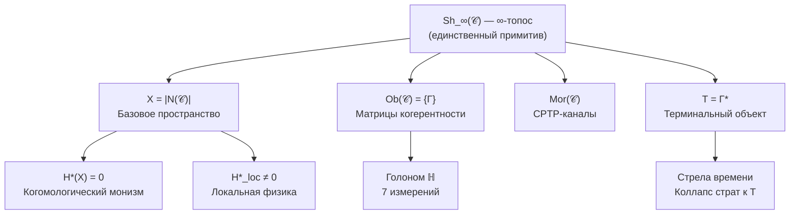

# Унитарный Голономный Монизм

## Формальная Теория Реальности и Сознания

**Унитарный Голономный Монизм (УГМ)** — формальная мета-теория, описывающая структуру, динамику и феноменологию реальности через единый математический примитив — **∞-топос Sh_∞(𝒞)**.

Теория:
- **Выводит** пространство, время и метрику из категорной структуры
- Формализует связь между физикой и сознанием
- Определяет условия возникновения субъективного опыта (иерархия L0→L1→L2)
- Выводит минимальную структуру самоподдерживающейся системы (7 измерений)
- Устанавливает [границы объяснения](./reference/falsifiability) — что теория объясняет и что принимает как примитив

### Этимология названия

- **Унитарный** — от лат. *unus* (единый): реальность описывается единым ∞-топосом Sh_∞(𝒞); базовая унитарная эволюция сохраняет информацию
- **Голономный** — от греч. *holon* (целое) + *nomos* (закон): каждая часть (Голоном) содержит образ целого и подчиняется общим законам
- **Монизм** — **математическая теорема** H*(X) = 0, а не философский выбор

## Структура теории

## Пять структурных свойств единственного примитива (Ω⁷)

:::info Единственный примитив
**∞-топос Sh_∞(𝒞)** — единственный примитив теории УГМ. Понятие «пучка» в ∞-топосе определяется через [топологию Гротендика](./core/foundations/axiom-omega#топология-гротендика) на категории 𝒞.
:::

| № | Свойство | Формулировка |
|---|----------|--------------|
| 1 | **[Конечномерность](./core/foundations/axiom-omega#свойство-1)** | $\text{Ob}(\mathcal{C}) \subset \mathcal{D}(\mathbb{C}^{42})$ |
| 2 | **[Constraint](./core/foundations/axiom-omega#свойство-2)** | $\hat{C} \cdot \Gamma = 0$ (Page-Wootters) |
| 3 | **[Терминальный объект](./core/foundations/axiom-omega#свойство-3)** | $\forall \Gamma, \exists! f: \Gamma \to T$ |
| 4 | **[Вариационный принцип](./core/foundations/axiom-omega#свойство-4)** | $\varphi = \arg\min \mathbb{E}[K + D_{KL}]$ |
| 5 | **[Стратификация](./core/foundations/axiom-omega#свойство-5)** | $X = \bigsqcup_\alpha S_\alpha$, $S_0 = \{T\}$ |

:::note Связь с Аксиомой Септичности
[Аксиома Септичности](./core/foundations/axiom-septicity) (AP+PH+QG+V) является набором **следствий** из Ω⁷ — операциональных требований, которые должна удовлетворять любая жизнеспособная система.
:::

:::info Теорема о свободе воли (следствие из Ω⁷)
Свобода воли выводится как теорема из структуры ∞-топоса: агент с достаточной когерентностью обладает подлинной каузальной автономией.
:::

:::info Теорема S (следствие из аксиом)
Минимальное число функционально независимых аспектов системы = 7. [Доказательство →](./proofs/theorem-minimality-7)
:::

## Ключевые результаты

| Конструкция | Формула | Статус |
|-------------|---------|--------|
| **Базовое пространство** | $X = \|N(\mathcal{C})\|$ | ✅ Выводится |
| **Когомологический монизм** | $H^n(X) = 0$ для $n > 0$ | ✅ Теорема |
| **Локальная физика** | $H^*_{loc}(X, T) \neq 0$ | ✅ Теорема |
| **Время** | $\tau \in \mathbb{Z}_7$ (Page-Wootters) | ✅ Выводится |
| **Стрела времени** | $\dim(X_\tau) \geq \dim(X_{\tau+1})$ | ✅ Теорема |
| **Метрика** | $d_{strat}$ (Конн на стратах) | ✅ Выводится |

## 7 измерений Голонома

| Символ | Измерение | Функция | Математический оператор |
|--------|-----------|---------|------------------------|
| **A** | Артикуляция | Различение, границы | Проектор $P: P^2 = P$ |
| **S** | Структура | Удержание формы | Гамильтониан $H: H^\dagger = H$ |
| **D** | Динамика | Изменение | Унитарный оператор $U(\tau) = e^{-iH_{eff}\tau}$ |
| **L** | Логика | Согласование | Коммутатор $[A,B] = AB - BA$ |
| **E** | Опыт | Переживание | Матрица плотности $\rho_E$ |
| **O** | Основание | Связь с вакуумом + **внутренние часы** | Page-Wootters, $H_O$, $V_O$ |
| **U** | Единство | Интеграция | След $\mathrm{Tr}$ |

Пространство состояний:
$$
\mathcal{H}_{total} = \mathcal{H}_O \otimes \mathcal{H}_{6D} = \mathbb{C}^7 \otimes \mathbb{C}^6 = \mathbb{C}^{42}
$$

:::warning Два формализма: 7D и 42D
Теория использует **два связанных формализма**:

| Формализм | Размерность | Применение |
|-----------|-------------|------------|
| **Минимальный** | $\mathbb{C}^7$ | Концептуальный базис, теоремы минимальности |
| **Page-Wootters** | $\mathbb{C}^{42} = \mathbb{C}^7 \otimes \mathbb{C}^6$ | Операциональные вычисления, эмерджентное время |

В минимальном формализме $\mathcal{H}_O$ — **одно из 7 измерений** (базисный вектор $|O\rangle$).
В расширенном формализме $\mathcal{H}_O \cong \mathbb{C}^7$ — **внутреннее пространство часов** с 7 состояниями времени τ ∈ ℤ₇.

Формализмы связаны **концептуально**, но не через строгое математическое вложение. См. [Матрица когерентности](/docs/core/dynamics/coherence-matrix#согласование-формализмов).
:::

## Центральные понятия

### Матрица Когерентности Γ (объект категории 𝒞)

$$
\Gamma \in \text{Ob}(\mathcal{C}), \quad \Gamma^\dagger = \Gamma, \quad \Gamma \geq 0, \quad \mathrm{Tr}(\Gamma) = 1
$$

- **Диагональные элементы** $\gamma_{ii}$: вероятности нахождения в измерении $i$
- **Недиагональные элементы** $\gamma_{ij}$: когерентности (квантовые корреляции) между измерениями

### Чистота (Purity)

$$
P = \mathrm{Tr}(\Gamma^2) \in \left[\frac{1}{7}, 1\right]
$$

- $P = 1$: чистое состояние (максимальная когерентность)
- $P = 1/7$: полностью смешанное состояние (полная декогеренция)
- $P > P_{\text{crit}} = 2/7 \approx 0.286$: условие жизнеспособности ([теорема](./proofs/theorem-purity-critical))

### Терминальный объект T

$$
T = \Gamma^* : \varphi(T) = T, \quad \forall \Gamma \in \mathcal{C}, \exists! f: \Gamma \to T
$$

**Интерпретация:** T — глобальный аттрактор, к которому сходятся все траектории. Стрела времени — это **коллапс страт** к T.

### Уравнение эволюции

С [эмерджентным внутренним временем](./proofs/emergent-time) τ:

$$
\frac{d\Gamma(\tau)}{d\tau} = \underbrace{-i[H_{eff}, \Gamma]}_{\text{унитарная}} + \underbrace{\mathcal{D}[\Gamma]}_{\text{диссипация}} + \underbrace{\mathcal{R}[\Gamma, E]}_{\text{регенерация}}
$$

где:
- τ — внутреннее время (параметр условных состояний относительно O)
- $H_{eff} = H_{6D} + \langle\tau|H_{int}|\tau\rangle_O$ — эффективный гамильтониан (из ограничения Page-Wootters)
- $\mathcal{D}[\Gamma]$ — диссипатор Линдблада
- $\mathcal{R}[\Gamma, E] = \kappa(\Gamma) \cdot (\Gamma_{\text{target}} - \Gamma) \cdot \Theta(\Delta F)$ — [регенеративный член](./core/dynamics/evolution) (CPTP-канал, [сохраняет положительность](./core/dynamics/evolution#сохранение-положительности))

## Иерархия интериорности

| Уровень | Название | Условие | Что есть |
|---------|----------|---------|----------|
| **L0** | Интериорность | $\exists \rho_E$ | Внутреннее состояние существует |
| **L1** | Феноменальная геометрия | $\mathrm{rank}(\rho_E) > 1$ | Структура качеств с метрикой $d_{FS}$ |
| **L2** | Когнитивные квалиа | $R \geq 1/3$, $\Phi \geq 1$, $D_{\text{diff}} \geq 2$ | Рефлексивный доступ к опыту |

**Пороговые значения L2 ([теоремы из ПИР](./core/foundations/axiom-septicity#пороги-l2-строгий-вывод)):**
- **R** (рефлексия) — мера самомоделирования: $R = 1 - \|\Gamma - \varphi(\Gamma)\|_F^2 / \|\Gamma\|_F^2$
- **Φ** (интеграция) — мера связности: $\Phi = \sum_{i \neq j} |\gamma_{ij}|^2 / \sum_i \gamma_{ii}^2$
- **D_diff** (дифференциация) — богатство репертуара: $D_{\text{diff}} = e^{S_{vN}(\rho_E)}$
- Значения $R_{\text{th}} = 1/3$, $\Phi_{\text{th}} = 1$, $D_{\min} = 2$ **выведены** из геометрии пространства состояний

## Формальные результаты

| Теорема | Утверждение | Статус | Ссылка |
|---------|-------------|--------|--------|
| **Когомологический монизм** | $H^n(X) = 0$ для $n > 0$ | ✅ | [Следствия](./core/foundations/consequences#когомологический-монизм) |
| **Локальная нетривиальность** | $H^*_{loc}(X, T) \neq 0$ | ✅ | [Следствия](./core/foundations/consequences#локально-глобальная-дихотомия) |
| **Минимальность 7D** | $n < 7 \Rightarrow$ нарушение (AP), (PH) или (QG) | ✅ | [Доказательство](./proofs/theorem-minimality-7) |
| **Неподвижная точка φ** | $\exists! \Gamma^* : \varphi(\Gamma^*) = \Gamma^*$ | ✅ | [Доказательство](./proofs/formalization-phi#3-теорема-о-существовании-неподвижной-точки) |
| **Эмерджентное время** | τ выводится из 𝒞 (Page-Wootters, Бурес, ∞-группоид) | ✅ | [Теорема](./proofs/emergent-time) |
| **Стрела времени** | Коллапс страт: $\dim(X_\tau) \geq \dim(X_{\tau+1})$ | ✅ | [Теорема](./proofs/emergent-time#10-стратификационное-время) |
| **Критическая чистота** | $P_{\text{crit}} = 2/N = 2/7$ | ✅ | [Теорема](./proofs/theorem-purity-critical) |
| **Необходимость интериорности** | $\text{Viable}(\mathbb{H}) \Rightarrow \text{Spectrum}(\Gamma_E) \neq \{0\}$ | ⚠️ | [Теорема 8.1](./applied/coherence-cybernetics/theorems#теорема-81-необходимость-интериорности-no-zombie) |

:::note Легенда статусов
- ✅ **СТРОГО** — математически доказано без дополнительных допущений
- ⚠️ **УСЛОВНО** — доказано при явных интерпретационных допущениях
- 🔬 **ПРОГРАММА** — направление исследований
:::

## Что теория выводит

### Из ∞-топоса Sh_∞(𝒞):
1. **Базовое пространство** X = |N(𝒞)| — геометрическая реализация нерва
2. **Монизм** — H*(X) = 0 как математическая теорема
3. **Локальную физику** — H*_loc(X, T) ≠ 0 вблизи терминального объекта
4. **Время** — τ ∈ ℤ₇ через механизм Page-Wootters
5. **Стрелу времени** — коллапс страт к терминальному T
6. **Метрику** — d_strat (стратифицированная метрика Конна)
7. **Размерность** — dim(X) = 6 из N = 7

### Программа исследований:
- **Компактификация 6D → 4D** — связь с наблюдаемым пространством
- **Уравнения Эйнштейна** — вывод из d_strat
- Связь с Стандартной моделью — [формализованная программа](./proofs/physics-correspondence)

### Принимает как примитив ([категориальный разрыв](./core/consciousness/hard-problem)):
- Почему ∞-топос Sh_∞(𝒞) имеет "внутреннюю сторону"
- Почему именно эта математическая структура, а не другая

## Навигация

| Раздел | Содержание |
|--------|------------|
| **[Аксиома Ω⁷](./core/foundations/axiom-omega)** | Пять структурных свойств с ∞-топосом Sh_∞(𝒞) как примитивом |
| **[Следствия](./core/foundations/consequences)** | Когомологический монизм, локально-глобальная дихотомия |
| **[Структура](./core/structure/holon)** | Голоном и 7 измерений |
| **[Динамика](./core/dynamics/evolution)** | Уравнения эволюции с терминальным объектом T |
| **[Пространство-время](./core/cosmology/spacetime)** | Базовое пространство X, метрика d_strat |
| **[Сознание](./core/consciousness/self-observation)** | Иерархия L0→L1→L2 |
| **[Эмерджентное время](./proofs/emergent-time)** | Page-Wootters, стратификационное время |
| **[Категорный формализм](./proofs/categorical-formalism)** | ∞-топос, производные категории, IC-когомологии |
| **[Глоссарий](./reference/glossary)** | Определения терминов |
| **[Нотация](./reference/notation)** | Математические обозначения |
