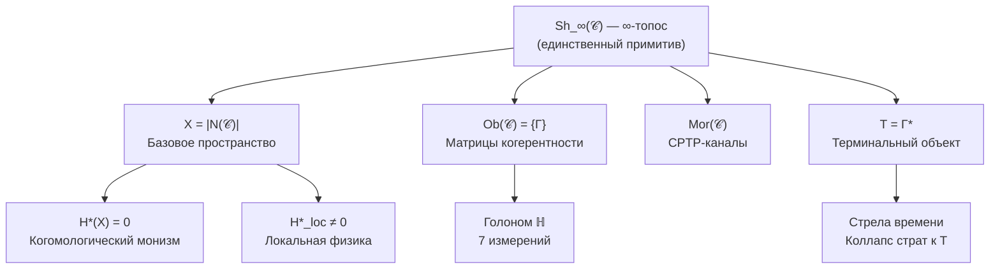

# Унитарный Голономный Монизм

## Формальная Теория Реальности и Сознания

**Унитарный Голономный Монизм (УГМ)** — формальная мета-теория, описывающая структуру, динамику и феноменологию реальности через единый математический примитив — **∞-топос Sh_∞(𝒞)**.

Теория:
- **Выводит** пространство, время и метрику из категорной структуры
- Формализует связь между физикой и сознанием
- Определяет условия возникновения субъективного опыта (иерархия L0→L1→L2→L3→L4)
- Выводит минимальную структуру самоподдерживающейся системы (7 измерений)
- Устанавливает [границы объяснения](./reference/falsifiability) — что теория объясняет и что принимает как примитив

### Этимология названия

- **Унитарный** — от лат. *unus* (единый): реальность описывается единым ∞-топосом Sh_∞(𝒞); базовая унитарная эволюция сохраняет информацию
- **Голономный** — от греч. *holon* (целое) + *nomos* (закон): каждая часть (Голоном) содержит образ целого и подчиняется общим законам
- **Монизм** — от греч. *monos* (один): реальность едина — не существует независимых «слоёв» или «субстанций». В УГМ это математическая теорема (H*(X) = 0), а не философский выбор

## Структура теории

## Пять структурных свойств единственного примитива (Ω⁷)

:::info Единственный примитив
**∞-топос Sh_∞(𝒞)** — единственный примитив теории УГМ. Понятие «пучка» в ∞-топосе определяется через [топологию Гротендика](./core/foundations/axiom-omega#топология-гротендика) на категории 𝒞.
:::

| № | Свойство | Формулировка |
|---|----------|--------------|
| 1 | **[Конечномерность](./core/foundations/axiom-omega#свойство-1)** | $\text{Ob}(\mathcal{C}) \subset \mathcal{D}(\mathbb{C}^{42})$ |
| 2 | **[Ограничение](./core/foundations/axiom-omega#свойство-2)** | $\hat{C} \cdot \Gamma = 0$ (Page-Wootters) |
| 3 | **[Терминальный объект](./core/foundations/axiom-omega#свойство-3)** | $\forall \Gamma, \exists! f: \Gamma \to T$ |
| 4 | **[Самомоделирование](./core/foundations/axiom-omega#свойство-4)** | $\varphi \dashv i: \text{Sub}(\Gamma) \hookrightarrow \mathbf{Sh}_\infty$ (сопряжение)* |
| 5 | **[Стратификация](./core/foundations/axiom-omega#свойство-5)** | $X = \bigsqcup_\alpha S_\alpha$, $S_0 = \{T\}$ |

*Вариационная характеризация $\varphi = \arg\min \mathbb{E}[S_{spec} + D_{KL}]$ — **теорема** о свойствах категориально определённого φ.

:::note Связь с Аксиомой Септичности
[Аксиома Септичности](./core/foundations/axiom-septicity) (AP+PH+QG+V) является набором **следствий** из Ω⁷ — операциональных требований, которые должна удовлетворять любая жизнеспособная система.
:::

:::info Теорема о свободе воли (следствие из Ω⁷)
Свобода воли выводится как теорема из структуры ∞-топоса: агент с достаточной когерентностью обладает подлинной каузальной автономией.
:::

:::info Теорема S (обоснование Аксиомы 3) [Т]
N = 7 (Аксиома 3) — **минимальная** размерность для выполнения (AP)+(PH)+(QG). Все 7 измерений **необходимы и функционально единственны** [Т]: A, S, D, L, U — алгебраически; E, O — категориально (через формулу κ₀). [Доказательство →](./proofs/minimality/theorem-minimality-7)

**Второе, независимое обоснование:** теоремы P1+P2 [Т] (выводятся из (AP)+(PH)+(QG)+(V) по цепочке T15) через теорему Гурвица дают $N = \dim(\mathrm{Im}(\mathbb{O})) = 7$. [Структурный вывод →](./proofs/minimality/theorem-octonionic-derivation)
:::

## Ключевые результаты

| Конструкция | Формула | Статус |
|-------------|---------|--------|
| **Базовое пространство** | $X = \|N(\mathcal{C})\|$ | [Т] Выводится |
| **Когомологический монизм** | $H^n(X) = 0$ для $n > 0$ | [Т] Теорема |
| **Локальная физика** | $H^*_{loc}(X, T) \neq 0$ | [Т] Теорема |
| **Время** | $\tau \in \mathbb{Z}_7$ (Page-Wootters) | [Т] Выводится |
| **Стрела времени** | $\dim(X_\tau) \geq \dim(X_{\tau+1})$ | [Т] Теорема |
| **Метрика** | $d_{strat}$ (Конн на стратах) | [Т] Выводится |
| **Уравнение эволюции** | Все 3 члена ($H_{\text{eff}}$, $\mathcal{D}_\Omega$, $\mathcal{R}$) выведены из аксиом | [Т] Полностью |
| **Октонионная структура** | (AP)+(PH)+(QG) →[T1–T10]→ $\mathbb{O}$ → N=7, $G_2$, Фано, H(7,4) | [Т] |

## 7 измерений Голонома

| Символ | Измерение | Функция | Математический оператор |
|--------|-----------|---------|------------------------|
| **A** | Артикуляция | Различение, границы | Проектор $P: P^2 = P$ |
| **S** | Структура | Удержание формы | Гамильтониан $H: H^\dagger = H$ |
| **D** | Динамика | Изменение | Унитарный оператор $U(\tau) = e^{-iH_{eff}\tau}$ |
| **L** | Логика | Согласование | Коммутатор $[A,B] = AB - BA$ |
| **E** | Интериорность | Переживание | Матрица плотности $\rho_E$ |
| **O** | Основание | Связь с вакуумом + **внутренние часы** | Page-Wootters, $H_O$, $V_O$ |
| **U** | Единство | Интеграция | След $\mathrm{Tr}$ |

Пространство состояний:
$$
\mathcal{H}_{total} = \mathcal{H}_O \otimes \mathcal{H}_{6D} = \mathbb{C}^7 \otimes \mathbb{C}^6 = \mathbb{C}^{42}
$$

:::warning Два формализма: 7D и 42D
Теория использует **два связанных формализма**:

| Формализм | Размерность | Применение |
|-----------|-------------|------------|
| **Минимальный** | $\mathbb{C}^7$ | Концептуальный базис, теоремы минимальности |
| **Page-Wootters** | $\mathbb{C}^{42} = \mathbb{C}^7 \otimes \mathbb{C}^6$ | Операциональные вычисления, эмерджентное время |

В минимальном формализме $\mathcal{H}_O$ — **одно из 7 измерений** (базисный вектор $|O\rangle$).
В расширенном формализме $\mathcal{H}_O \cong \mathbb{C}^7$ — **внутреннее пространство часов** с 7 состояниями времени τ ∈ ℤ₇.

Формализмы связаны **Морита-эквивалентностью** [Т]: $\mathrm{Sh}_\infty(\mathcal{C}|_7) \simeq \mathrm{Sh}_\infty(\mathcal{C}|_{42})$ (теорема сравнения Лури). Все 7D формулы точны, не приближения. См. [Матрица когерентности](/docs/core/dynamics/coherence-matrix#согласование-формализмов).
:::

## Центральные понятия

### Матрица Когерентности Γ (объект категории 𝒞)

$$
\Gamma \in \text{Ob}(\mathcal{C}), \quad \Gamma^\dagger = \Gamma, \quad \Gamma \geq 0, \quad \mathrm{Tr}(\Gamma) = 1
$$

- **Диагональные элементы** $\gamma_{ii}$: вероятности нахождения в измерении $i$
- **Недиагональные элементы** $\gamma_{ij}$: когерентности (квантовые корреляции) между измерениями

### Чистота (Purity)

$$
P = \mathrm{Tr}(\Gamma^2) \in \left[\frac{1}{7}, 1\right]
$$

- $P = 1$: чистое состояние (максимальная когерентность)
- $P = 1/7$: полностью смешанное состояние (полная декогеренция)
- $P > P_{\text{crit}} = 2/7 \approx 0.286$: условие жизнеспособности ([теорема](./proofs/dynamics/theorem-purity-critical))

### Терминальный объект T

$$
T = \Gamma^* : \varphi(T) = T, \quad \forall \Gamma \in \mathcal{C}, \exists! f: \Gamma \to T
$$

**Интерпретация:** T — глобальный аттрактор, к которому сходятся все траектории. Стрела времени — это **коллапс страт** к T.

### Уравнение эволюции

С [эмерджентным внутренним временем](./proofs/dynamics/emergent-time) τ:

$$
\frac{d\Gamma(\tau)}{d\tau} = \underbrace{-i[H_{eff}, \Gamma]}_{\text{унитарная}} + \underbrace{\mathcal{D}[\Gamma]}_{\text{диссипация}} + \underbrace{\mathcal{R}[\Gamma, E]}_{\text{регенерация}}
$$

где:
- τ — внутреннее время (параметр условных состояний относительно O)
- $H_{eff} = H_{6D} + \langle\tau|H_{int}|\tau\rangle_O$ — эффективный гамильтониан (из ограничения Page-Wootters)
- $\mathcal{D}[\Gamma]$ — диссипатор Линдблада
- $\mathcal{R}[\Gamma, E] = \kappa(\Gamma) \cdot (\rho_* - \Gamma) \cdot g_V(P)$ — [регенеративный член](./core/dynamics/evolution#3-регенеративный-член) [Т] ([полный вывод](./core/dynamics/evolution#вывод-формы-регенерации) из аксиом)

## Иерархия интериорности

| Уровень | Название | Условие | n-усечение |
|---------|----------|---------|------------|
| **L0** | Интериорность | $\exists \rho_E$ | $\tau_{\leq 0}$ (множество) |
| **L1** | Феноменальная геометрия | $\mathrm{rank}(\rho_E) > 1$ | $\tau_{\leq 1}$ (группоид) |
| **L2** | Когнитивные квалиа | $R \geq 1/3$, $\Phi \geq 1$, $D_{\text{diff}} \geq 2$ | $\tau_{\leq 2}$ (бикатегория) |
| **L3** | Сетевое сознание | $R^{(2)} \geq 1/4$ (метастабильно) | $\tau_{\leq 3}$ (трикатегория) |
| **L4** | Унитарное сознание | $\lim_{n \to \infty} R^{(n)} > 0$, $P > 6/7$ | $\tau_{\leq \infty}$ (∞-группоид) |

**Пороговые значения ([пороги L2](./core/foundations/axiom-septicity#пороги-l2-строгий-вывод)):**
- **R** (рефлексия) — мера самомоделирования: $R = 1 - \|\Gamma - \varphi(\Gamma)\|_F^2 / \|\Gamma\|_F^2$
- **Φ** (интеграция) — мера связности: $\Phi = \sum_{i \neq j} |\gamma_{ij}|^2 / \sum_i \gamma_{ii}^2$
- **$R^{(n)}$** (рефлексия n-го порядка) — мера метарефлексии: $R^{(n)} = \mathrm{Fid}(\varphi^{(n-1)}(\Gamma), \varphi^{(n)}(\Gamma))$

**Статусы пороговых значений:**
- $P_{\text{crit}} = 2/7$ **[Т]** — различимость по норме Фробениуса
- $R_{\text{th}} = 1/3$ **[Т]** — $K = 3$ из [триадной декомпозиции](/docs/core/operators/lindblad-operators#триадная-декомпозиция) + байесовское доминирование
- $\Phi_{\text{th}} = 1$ **[О]** — определение по конвенции когерентной доминации
- $D_{\min} = 2$ **[С]** — следует из $\Phi_{\text{th}}$

:::note Статус уровней
- **L0–L2**: стабильные состояния для биологических систем
- **L3**: метастабильное состояние (конечное время жизни $\tau_3$); порог $K = 4$ **[Т]** из квадратичной декомпозиции ([T-67](/docs/consciousness/hierarchy/interiority-hierarchy#теорема-l3-k4))
- **L4**: теоретический предел **[С]**, недостижим для систем с ненулевой декогеренцией ($R^{(n)} \to 0$); аттрактор, не физическое состояние ([C19](/docs/consciousness/hierarchy/interiority-hierarchy#теорема-l4-недостижимость))
- **SAD-метрика** [С]: обобщение L0–L4 на непрерывный случай через репрезентационную башню; SAD = max{k : R^(k) > 1/(k+2)}, спектральная формула [С], стресс-зависимый режим [Т] — [Башня глубины](/docs/consciousness/hierarchy/depth-tower#sad)
:::

## Формальные результаты

| Теорема | Утверждение | Статус | Ссылка |
|---------|-------------|--------|--------|
| **Когомологический монизм** | $H^n(X) = 0$ для $n > 0$ | [Т] | [Следствия](./core/foundations/consequences#когомологический-монизм) |
| **Локальная нетривиальность** | $H^*_{loc}(X, T) \neq 0$ | [Т] | [Следствия](./core/foundations/consequences#локально-глобальная-дихотомия) |
| **Минимальность 7D** | $n < 7 \Rightarrow$ нарушение (AP), (PH) или (QG) | [Т] | [Доказательство](./proofs/minimality/theorem-minimality-7) |
| **Неподвижная точка φ** | $\exists! \Gamma^* : \varphi(\Gamma^*) = \Gamma^*$ | [Т] | [Доказательство](./proofs/categorical/formalization-phi#3-теорема-о-существовании-неподвижной-точки) |
| **Эмерджентное время** | τ выводится из 𝒞 (Page-Wootters, Бурес, ∞-группоид) | [Т] | [Теорема](./proofs/dynamics/emergent-time) |
| **Стрела времени** | Коллапс страт: $\dim(X_\tau) \geq \dim(X_{\tau+1})$ | [Т] | [Теорема](./proofs/dynamics/emergent-time#10-стратификационное-время) |
| **Критическая чистота** | $P_{\text{crit}} = 2/N = 2/7$ | [Т] | [Теорема](./proofs/dynamics/theorem-purity-critical) |
| **Необходимость интериорности** | $\text{Viable}(\mathbb{H}) \land \mathcal{D}_\Omega \neq 0 \Rightarrow \mathrm{Coh}_E \geq \mathrm{Coh}_{\min} > 1/7$ | [Т] | [Теорема 8.1](./applied/coherence-cybernetics/theorems#теорема-81-условная-необходимость-интериорности-no-zombie) |
| **$G_2$-ригидность** | Голономное представление единственно с точностью до $G_2 = \mathrm{Aut}(\mathbb{O})$; 34 физических параметра | [Т] | [Теорема](./proofs/categorical/uniqueness-theorem#g2-ригидность) |
| **Единственность электрослабого сектора** | $SU(2)_L \times U(1)_Y$ — единственная конструкция rank 4 из $\kappa_0$ и аксиом A1–A5 | [Т] | [Теорема](./physics/gauge-symmetry/standard-model#теорема-единственности-фэ) |
| **Ровно 3 поколения** | $N_{\text{gen}} = 3$: $\leq 3$ из swallowtail $A_4$ + $\geq 3$ из $(1,2,4) \subset \mathbb{Z}_7^*$ | [Т] | [Теорема](./physics/particle-physics/fermion-generations#теорема-ровно-три-генерации) |
| **Фано-отбор Юкавы** | $y_k = g_W \cdot f_{k,E,U} \cdot |\gamma_{\text{vac}}^{(EU)}|$ через октонионные $f_{ijk}$ | [Т] | [Теорема](./physics/gauge-symmetry/fano-selection-rules#теорема-фано-отбор-fijk) |
| **Нестабильность Источника** | $\Gamma_\odot = I/7$ нестационарен: $F_0 \neq 0$, дрейф к $\rho^*$, самоусиление | [Т] | [Доказательство](./physics/cosmology-phys/origin#доказательство-нестабильности) |
| **Свобода воли** | $\mathrm{Freedom}(\Gamma) = \dim\ker(H_\Gamma) + 1$; монотонность под CPTP, $G_2$-инвариантность | [Т] | [Теорема](./core/foundations/consequences#freedom-конечномерное) |
| **$A_4$-бифуркация** | Swallowtail из 3 параметров $(\kappa, \alpha, \Delta F)$ + $\mathbb{Z}_2$-симметрия пурити | [Т] | [Теорема](./consciousness/hierarchy/interiority-hierarchy#теорема-a4-бифуркация) |
| **Gap-инъекция L-уровней** | $L(\Gamma_1) \neq L(\Gamma_2) \Rightarrow [\mathrm{Gap}(\Gamma_1)] \neq [\mathrm{Gap}(\Gamma_2)]$ | [Т] | [Теорема](./consciousness/hierarchy/interiority-hierarchy#теорема-gap-инъекция) |
| **Назначение поколений** | $k=1 \to$ 3-е [Т], $k=4 \to$ 2-е, $k=2 \to$ 1-е [Т] | [Т] | [Теорема](./physics/particle-physics/fermion-generations#thm-gen-4-1) |
| **Суперпотенциал** | $W = \mu_W \sum f_{ijk}\Theta\Theta\Theta$ — единственный $G_2$-инвариантный (лемма Шура) | [Т] | [Теорема](./physics/particle-physics/susy#теорема-суперпотенциал) |
| **Масса правых нейтрино** | $M_R \sim 2.9 \times 10^{14}$ ГэВ из PW-часов + жизнеспособности | [Т] | [Теорема](./physics/particle-physics/neutrino-masses#теорема-mr-из-gap) |
| **3+1 из секторной декомпозиции** | $7 = 1_O \oplus 3_{A,S,D} \oplus \bar{3}_{L,E,U}$; $\dim(\text{простр.}) = 3$ | [Т] | [Теорема](./core/foundations/spacetime#теорема-секторная-декомпозиция) |
| **Секторная иерархия $\varepsilon$** | Единственный самосогласованный вакуум; $\bar{\varepsilon} \approx 0.023$ из секторной структуры | [Т] | [Теорема](./core/dynamics/gap-thermodynamics#теорема-единственный-вакуум) |
| **Когомологическое обнуление $\Lambda$** | $\Lambda_{\text{global}} = 0$ из $H^n(X) = 0$; наблюдаемая $\Lambda$ — локальный эффект | [Т] | [Теорема](./proofs/gap/lambda-budget#когомологическое-обнуление) |
| **Уравнения Эйнштейна из спектрального действия** | Полная тройка (T-53) → $S = \mathrm{Tr}(f(D_A/\Lambda))$ → EH + SM, $G_N = 3\pi/(7f_2\Lambda^2)$ | [Т] | [Теорема](./physics/gravity/quantum-gravity#теорема-полное-спектральное-действие) |
| **УФ-конечность Gap-теории** | Компактность $(S^1)^{21}$ + $G_2$-Уорд ($21 \to 7$) + SUSY ($7-7=0$) + APS-индекс | [Т] | [Теорема](./physics/gravity/quantum-gravity#теорема-уф-конечность) |
| **Лоренцева сигнатура** | Конечная спектральная тройка $(A_{\text{int}}, H_{\text{int}}, D_{\text{int}})$, KO-размерность 6 → (+,−,−,−) | [Т] | [Теорема](./core/foundations/spacetime#теорема-спектральная-тройка) |
| **Морита-эквивалентность 7D↔42D** | $\mathrm{Sh}_\infty(\mathcal{C}|_7) \simeq \mathrm{Sh}_\infty(\mathcal{C}|_{42})$; все 7D формулы точны | [Т] | [Теорема](./core/structure/dimension-e) |
| **Спектральный зазор Фано-диссипатора** | $\lambda_{\text{deco}} = 5\gamma/(3N)$ (BIBD-симметрия); $\kappa_{\text{bootstrap}} = \omega_0/N \gg \lambda_{\text{gap}}/N$ | [Т] | [Теорема](./core/foundations/axiom-omega#теорема-kappa-bootstrap-bound) |
| **φ-оператор (замещающий канал)** | $\varphi_k(\Gamma) = (1-k)\Gamma + k\rho_*$ — CPTP, монотонность, неподвижная точка $\rho_*$ | [Т] | [Теорема](./consciousness/foundations/self-observation#теорема-физическая-реализация-phi) |
| **Глобальная минимизация $V_{\text{Gap}}$** | $G_2$-орбитная редукция $21D \to 5D$; единственный минимум; гессиан $> 0$ | [Т] | [Теорема](./core/dynamics/gap-thermodynamics#теорема-глобальная-минимизация) |
| **Нейтринная O-секторная Юкавская** | $m_D^{(k)} \propto \varepsilon_0 \sin(2\pi k/7)$; расхождение $m_2/m_3$: $\times 50 \to \times 1.8$ | [С] | [Теорема](./physics/particle-physics/neutrino-masses#теорема-нейтрино-o-сектор) |
| **PMNS из анархической $M_R$** | O-изотропия → плотная $M_R$ → углы $O(30°\text{–}60°)$ | [С] | [Теорема](./physics/particle-physics/neutrino-masses#теорема-pmns-анархия) |
| **Обоснование $K=4$ для L3** | Квадратичная декомпозиция $3+1=4$; байесовское доминирование $R^{(2)} \geq 1/4$ | [Т] | [Теорема](./consciousness/hierarchy/interiority-hierarchy#теорема-l3-k4) |
| **Недостижимость L4 для биосистем** | $R^{(n)} \sim R^n \to 0$ при $\varepsilon_{\text{dec}} > 0$; L4 = аттрактор | [С] | [Теорема](./consciousness/hierarchy/interiority-hierarchy#теорема-l4-недостижимость) |
| **КК-5: Фрактальное замыкание** | Нетривиальность аттрактора композита $P > 1/7$ [Т]; жизнеспособность $P > 2/7$ [С] (зависит от C20) | [С] | [Теорема](./applied/coherence-cybernetics/theorems#теорема-91-фрактальное-замыкание) |
| **Топологическая защита Gap-вакуума** | $\pi_2(G_2/T^2) \cong \mathbb{Z}^2$; барьер $\geq 6\mu^2$; вакуум отделён от $\text{Gap}=0$ | [Т] | [Теорема](./core/dynamics/composite-systems#теорема-тополог-защита) |
| **Каноническое определение $f_0$** | $f_0\Lambda^4 = \frac{1}{7}[V_{\text{Gap}}^{\min} + \frac{1}{2}\zeta'_{H_{\text{Gap}}}(0)]$; UV-конечность + единственный вакуум | [Т] | [Теорема](./physics/particle-physics/higgs-sector#теорема-f0-канонический) |
| **Структурная необходимость $\Lambda > 0$** | Автопоэзис + локальная когомология → $\rho_{\text{vac}} > 0$; неполнота Ловера | [Т] | [Теорема](./core/foundations/consequences#теорема-лямбда-положительна) |
| **КК-6: Масштабная инвариантность** | Бюрес-контрактивность CPTP + КК-5 (нетривиальность [Т]) → структура сохраняется при агрегации | [Т] | [Теорема](./applied/coherence-cybernetics/theorems#теорема-92-масштабная-инвариантность) |
| **Gap = кривизна расслоения Серра** | Спектральная тройка T-53 + NCG-кривизна → точное отождествление | [Т] | [Теорема](./core/dynamics/gap-operator#теорема-gap-серра) |
| **Внутренняя теория** (T-54) | $\mathrm{Th}_{\mathrm{UHM}} = \mathrm{Sub}_{\mathrm{closed}}(\Omega)$ — φ-инвариантные предикаты | [Т] | [Теорема](./core/foundations/consequences#внутренняя-теория) |
| **Неполнота Ловера** (T-55) | $\mathrm{Th}_{\mathrm{UHM}} \subsetneq \Omega$ — из декартовой замкнутости + нетривиальности φ | [Т] | [Теорема](./core/foundations/consequences#неполнота-ловера) |
| **Структурная ToE** (T-56) | φ-замкнута, конечно аксиоматизируема, принципиально неполна, эволюционно открыта | [Т] | [Теорема](./core/foundations/consequences#структурная-toe) |
| **Полнота триадной декомпозиции** (T-57) | LGKS-теорема: единственное разложение $\mathcal{L} = \mathrm{Ham} + \mathrm{diss} + \mathrm{reg}$ | [Т] | [Теорема](./core/operators/lindblad-operators#полнота-триадной-декомпозиции) |
| **∞-группоид $\mathbf{Exp}_\infty$** (T-91) | $\mathrm{Sing}(\mathcal{E})$ — комплекс Кана (теорема Милнора); + T-76 → HoTT-логика, усечения Постникова | [Т] | [Теорема](./proofs/categorical/categorical-formalism#10-infty-группоид-и-infty-топос-для-эмерджентного-времени) |
| **Параметр сжатия $k = 1 - R$** (T-62, Sol.77) | $k$ не свободен: $k = 1 - R$, $R = 1 - \|\Gamma - \rho^*\|_F^2/\|\Gamma\|_F^2$; адаптивное самомоделирование | [Т] | [Теорема](./consciousness/foundations/self-observation#теорема-k-из-r) |
| **Алгоритм PW-реконструкции** (T-95, Sol.67) | 4-шаговая процедура $\Gamma \to \rho_E, D_{\text{diff}}, \sigma_L, C$ с нулевой ошибкой | [Т] | [Теорема](./core/structure/dimension-e#канонический-алгоритм-pw) |
| **Структурное $\theta_{\mathrm{QCD}} = 0$** (T-99) | 7-шаговое доказательство: реальность $f_{ijk} \in \mathbb{R}$ (A1) + единственный вакуум (T-64) → $\theta_{\mathrm{QCD}} = 0$ точно. Аксион — чисто DM | [Т] | [Теорема](./physics/gauge-symmetry/confinement#теорема-структурное-theta-qcd) |
| **Кодирование среды** (T-100) | CPTP-функтор Enc: ObsSpace → End(D(C⁷)), единственный до G₂. 3-канальная декомпозиция из T-57 | [Т] | [Теорема](./applied/coherence-cybernetics/sensorimotor#теорема-кодирование-среды) |
| **Оптимальное действие** (T-101) | $a^* = \arg\min \|\sigma_{\mathrm{sys}}\|_\infty$ — из T-92 (эквивалентность P и σ) | [Т] | [Теорема](./applied/coherence-cybernetics/sensorimotor#теорема-оптимальное-действие) |
| **Полнота 3-членного уравнения** (T-102) | $h^{\text{ext}} = h^{(H)} + h^{(D)} + h^{(R)}$, 4-й тип невозможен (из T-57 LGKS) | [Т] | [Теорема](./applied/coherence-cybernetics/sensorimotor#теорема-полнота-трёх-членов) |
| **Гедоническая валентность** (T-103) | $\mathcal{V}_{\text{hed}} = dP/d\tau\|_{\mathcal{R}}$: формула [Т], наблюдаемость при L2 [Т] (T-77), феноменальная интерпретация [И] | [Т]+[И] | [Теорема](./applied/coherence-cybernetics/sensorimotor#теорема-гедоническая-валентность) |
| **Радиус устойчивости** (T-104) | $r_{\text{stab}} = \sqrt{P(\rho^*_\Omega) - 2/7}$ (метрика Бюреса); наиболее опасный канал — $h^{(D)}$ | [Т] | [Теорема](./applied/coherence-cybernetics/stability#радиус-устойчивости) |
| **Энергетический баланс Ландауэра** (T-105) | $\Delta F_{\min} = k_B T_{\text{eff}} \cdot \ln 2 \cdot \dot{S}_{\text{diss}}$; три метаболических режима | [Т] | [Теорема](./applied/coherence-cybernetics/stability#энергетический-баланс) |
| **Информационная ёмкость Enc** (T-107) | $C_{\text{Enc}} \leq \log_2 7 \approx 2.81$ бит/наблюдение (граница Холево + T-102) | [Т] | [Теорема](./applied/coherence-cybernetics/sensorimotor#информационная-ёмкость) |
| **Композициональность Enc/Dec** (T-108) | $\text{Enc}_{12} = \Phi_{\text{agg}} \circ (\text{Enc}_1 \otimes \text{Enc}_2)$ из T-100 + T-72 + T-58 | [Т] | [Теорема](./applied/coherence-cybernetics/sensorimotor#композициональность-enc-dec) |
| **Информационная граница обучения** (T-109) | $n \geq \ln(1/(2\delta))/\xi_{\text{QCB}}$, $\xi_{\text{QCB}} \leq \ln 7$ (квантовая граница Чернова + T-107) | [Т] | [Теорема](./applied/coherence-cybernetics/learning-bounds#теорема-информационная-граница) |
| **Оптимальная граница обучения** (T-112) | $n_{\text{opt}} = \max(n_{\text{info}}, n_{\text{dyn}}, n_{\text{stab}})$ — три режима | [Т] | [Теорема](./applied/coherence-cybernetics/learning-bounds#теорема-оптимальная-граница) |
| **Минимальность N=7 для обучения** (T-113) | Обучение через регенерацию невозможно при $N < 7$; $N = 7$ Парето-оптимально | [Т] | [Теорема](./applied/coherence-cybernetics/learning-bounds#теорема-минимальность-n7) |
| **Фано-грамматика** (T-114) | Марковская цепь на PG(2,2) эргодическая, стационарное распределение $\pi_i = 1/7$ | [Т] | [Теорема](./core/operators/lindblad-operators#теорема-фано-грамматика) |
| **Различимость композиций** (T-115) | $|\mathrm{Comp}(n)| = 7^n$ для generic $\Gamma$ (алгебраическая различимость) | [Т] | [Теорема](./core/operators/lindblad-operators#теорема-различимость-композиций) |
| **PW Suzuki-Trotter** (T-116) | $\varepsilon(T) \leq C_p \cdot T \cdot (\delta\tau)^{2p+1}$, при $p=2$: $\varepsilon \leq 10^{-5}$ | [Т] | [Теорема](./core/foundations/axiom-omega#теорема-pw-suzuki-trotter) |
| **Ландауэровская калибровка** (C22) | $\Delta F^{(k)} \geq k_B T_\mathrm{eff} \ln(2) \cdot k$ — линейный рост | [С] | [Теорема](./consciousness/hierarchy/depth-tower#ландауэровская-калибровка) |

:::note Легенда статусов
- **[Т] СТРОГО** — математически доказано без дополнительных допущений
- **[С] УСЛОВНО** — доказано при явных интерпретационных допущениях
- **[П] ПРОГРАММА** — направление исследований
:::

## Что теория выводит

### Из ∞-топоса Sh_∞(𝒞):
1. **Базовое пространство** X = |N(𝒞)| — геометрическая реализация нерва
2. **Монизм** — H*(X) = 0 как математическая теорема
3. **Локальную физику** — H*_loc(X, T) ≠ 0 вблизи терминального объекта
4. **Время** — τ ∈ ℤ₇ через механизм Page-Wootters
5. **Стрелу времени** — коллапс страт к терминальному T
6. **Метрику** — d_strat (стратифицированная метрика Конна)
7. **Размерность** — dim(X) = 6 из N = 7
8. **Октонионную структуру** — P1+P2 → 𝕆 → N=7, $G_2$-симметрия, плоскость Фано, код Хэмминга ([Трек B](./proofs/minimality/theorem-octonionic-derivation))

### Программа исследований:
- **Компактификация 6D → 4D** — связь с наблюдаемым пространством
- ~~**Уравнения Эйнштейна**~~ — **[Т]** (Sol.40): полное спектральное действие из T-53, см. [теорему](./physics/gravity/quantum-gravity#теорема-полное-спектральное-действие)
- Связь с Стандартной моделью — [формализованная программа](./proofs/physics/physics-correspondence)

### Принимает как примитив ([категориальный разрыв](/docs/consciousness/foundations/two-aspect-monism#теорема-нетривиальность)):
- Почему ∞-топос Sh_∞(𝒞) имеет "внутреннюю сторону"
- Почему именно эта математическая структура, а не другая

:::info Минимальность примитива
Примитив УГМ — **минимальный** среди всех возможных аксиоматических выборов: одна аксиома вместо двух-трёх ([обоснование](/docs/consciousness/foundations/two-aspect-monism#минимальность-аксиомы)). Из него **выводится**: форма содержания опыта ([единственный функтор](/docs/consciousness/foundations/two-aspect-monism#теорема-единственность-фв)), идентичность квалиа ([лемма Ёнеды](/docs/consciousness/foundations/two-aspect-monism#реляционная-идентичность)), имманентность описания ([замкнутость через φ](/docs/consciousness/foundations/two-aspect-monism#самореферентная-замкнутость)).
:::

## Навигация

| Раздел | Содержание |
|--------|------------|
| **[Аксиома Ω⁷](./core/foundations/axiom-omega)** | Пять структурных свойств с ∞-топосом Sh_∞(𝒞) как примитивом |
| **[Следствия](./core/foundations/consequences)** | Когомологический монизм, локально-глобальная дихотомия |
| **[Структура](./core/structure/holon)** | Голоном и 7 измерений |
| **[Динамика](./core/dynamics/evolution)** | Уравнения эволюции с терминальным объектом T |
| **[Пространство-время](./core/foundations/spacetime)** | Базовое пространство X, метрика d_strat |
| **[Сознание](/docs/consciousness/hierarchy/interiority-hierarchy)** | Иерархия L0→L1→L2→L3→L4 |
| **[Эмерджентное время](./proofs/dynamics/emergent-time)** | Page-Wootters, стратификационное время |
| **[Категорный формализм](./proofs/categorical/categorical-formalism)** | ∞-топос, производные категории, IC-когомологии |
| **[Теорема единственности](./proofs/categorical/uniqueness-theorem)** | G₂-ригидность: 34 физических параметра |
| **[Стандартная модель](./physics/gauge-symmetry/standard-model)** | SM из G₂: электрослабый сектор [Т], 3 поколения [Т] |
| **[Физика](/docs/physics/overview)** | Калибровочная симметрия, частицы, гравитация, космология |
| **[Нейтринные массы](./physics/particle-physics/neutrino-masses)** | Seesaw из Gap, $M_R$ [Т], O-секторная Юкавская [Т], PMNS [С] |
| **[SUSY из $G_2$](./physics/particle-physics/susy)** | Суперпотенциал [Т] (Шур), суперпартнёрный спектр, гравитино |
| **[Термодинамика Gap](./core/dynamics/gap-thermodynamics)** | Потенциал $V_{\text{Gap}}$, глобальная минимизация [Т], секторная иерархия $\varepsilon$ |
| **[Квантовая гравитация](./physics/gravity/quantum-gravity)** | Спектральное действие [Т], UV-конечность [Т], уравнения Эйнштейна [Т] |
| **[Космологическая постоянная](./physics/gravity/cosmological-constant)** | $\Lambda > 0$ [Т] (Sol.50), спектральная формула [Т], бюджет $\sim 10^{-120\pm10}$ [С] |
| **[Композитные системы](./core/dynamics/composite-systems)** | КК-5 (нетривиальность [Т], жизнеспособность [С]), топологическая защита Gap [Т], эмерджентная геометрия |
| **[Иерархия интериорности](/docs/consciousness/hierarchy/interiority-hierarchy)** | L0–L4, $K=4$ для L3 [Т], недостижимость L4 [С] |
| **[Башня глубины](/docs/consciousness/hierarchy/depth-tower)** | SAD-метрика [С], динамика глубины (A₄-бифуркация, энергия, стресс, социальная), морфологическая агностичность [Г] |
| **[Глоссарий](./reference/glossary)** | Определения терминов |
| **[Нотация](./reference/notation)** | Математические обозначения |
