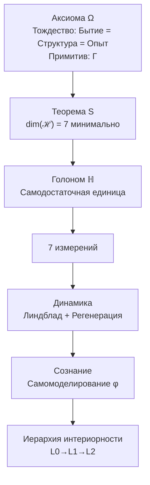

# Унитарный Голономный Монизм

## Формальная Теория Реальности и Сознания

**Унитарный Голономный Монизм (УГМ)** — это формальная теория, описывающая структуру, динамику и феноменологию реальности через единый математический объект — Матрицу Когерентности (Γ).

Теория:
- Формализует связь между физикой и сознанием
- Определяет условия возникновения субъективного опыта (иерархия L0→L1→L2)
- Выводит минимальную структуру самоподдерживающейся системы (7 измерений)
- Устанавливает [границы объяснения](./reference/falsifiability) — что теория объясняет и что принимает как примитив

### Этимология названия

- **Унитарный** — от лат. *unus* (единый): реальность описывается единой субстанцией Γ; базовая унитарная эволюция $-i[H,Γ]$ сохраняет информацию
- **Голономный** — от греч. *holon* (целое) + *nomos* (закон): каждая часть (Голоном) содержит образ целого и подчиняется общим законам
- **Монизм** — существует только одна субстанция, проявляющаяся во множестве форм

## Структура теории

## Две аксиомы

| Аксиома | Формулировка |
|---------|--------------|
| **[Аксиома Ω](./core/foundations/axiom-omega)** | Существует единственный примитив — Матрица Когерентности Γ. Бытие, структура и опыт тождественны как аспекты Γ |
| **[Аксиома Септичности](./core/foundations/axiom-septicity)** | Система обладает автопоэзисом (AP), феноменологией (PH) и квантовым основанием (QG) |

:::info Теорема S (следствие из аксиом)
Минимальная размерность пространства состояний, удовлетворяющая (AP), (PH), (QG), равна 7. [Доказательство →](./proofs/theorem-minimality-7)
:::

## 7 измерений Голонома

| Символ | Измерение | Функция | Математический оператор |
|--------|-----------|---------|------------------------|
| **A** | Артикуляция | Различение, границы | Проектор $P: P^2 = P$ |
| **S** | Структура | Удержание формы | Гамильтониан $H: H^\dagger = H$ |
| **D** | Динамика | Изменение | Унитарный оператор $U(t) = e^{-iHt}$ |
| **L** | Логика | Согласование | Коммутатор $[A,B] = AB - BA$ |
| **E** | Опыт | Переживание | Матрица плотности $\rho_E$ |
| **O** | Основание | Связь с вакуумом | Вакуумное состояние $\vert 0\rangle$ |
| **U** | Единство | Интеграция | След $\mathrm{Tr}$ |

Пространство состояний:
$$
\mathcal{H} = \mathbb{C}^7 = \mathrm{span}\{|A\rangle, |S\rangle, |D\rangle, |L\rangle, |E\rangle, |O\rangle, |U\rangle\}
$$

## Центральные понятия

### Матрица Когерентности Γ

$$
\Gamma \in \mathcal{L}(\mathcal{H}), \quad \Gamma^\dagger = \Gamma, \quad \Gamma \geq 0, \quad \mathrm{Tr}(\Gamma) = 1
$$

- **Диагональные элементы** $\gamma_{ii}$: вероятности нахождения в измерении $i$
- **Недиагональные элементы** $\gamma_{ij}$: когерентности (квантовые корреляции) между измерениями

### Чистота (Purity)

$$
P = \mathrm{Tr}(\Gamma^2) \in \left[\frac{1}{7}, 1\right]
$$

- $P = 1$: чистое состояние (максимальная когерентность)
- $P = 1/7$: полностью смешанное состояние (полная декогеренция)
- $P > P_{\text{crit}} = 2/7 \approx 0.286$: условие жизнеспособности ([теорема](./core/foundations/axiom-septicity#критическая-чистота-геометрический-критерий))

### Уравнение эволюции

$$
\frac{d\Gamma}{dt} = \underbrace{-i[H, \Gamma]}_{\text{унитарная}} + \underbrace{\sum_k \gamma_k \left( L_k \Gamma L_k^\dagger - \frac{1}{2}\{L_k^\dagger L_k, \Gamma\} \right)}_{\text{диссипация } \mathcal{D}[\Gamma]} + \underbrace{\mathcal{R}[\Gamma, E]}_{\text{регенерация}}
$$

где:
- $H$ — гамильтониан системы (самосопряжённый оператор)
- $L_k$ — операторы Линдблада (описывают взаимодействие с окружением)
- $\gamma_k \geq 0$ — скорости декогеренции
- $\mathcal{R}[\Gamma, E] = \kappa(\Gamma) \cdot (\Gamma_{\text{target}} - \Gamma) \cdot \Theta(\Delta F)$ — [регенеративный член](./core/dynamics/evolution), где $\kappa(\Gamma) = \kappa_0 \cdot \mathrm{Coh}_E(\Gamma)$

## Иерархия интериорности

| Уровень | Название | Условие | Что есть |
|---------|----------|---------|----------|
| **L0** | Интериорность | $\exists \rho_E$ | Внутреннее состояние существует |
| **L1** | Феноменальная геометрия | $\mathrm{rank}(\rho_E) > 1$ | Структура качеств с метрикой $d_{FS}$ |
| **L2** | Когнитивные квалиа | $R \geq 1/3$, $\Phi \geq 1$ | Рефлексивный доступ к опыту |

**Пороговые значения L2 ([теоремы](./core/foundations/axiom-septicity#пороги-l2-геометрическая-мотивация)):**
- **R** (рефлексия) — мера самомоделирования: $R = 1 - \|\Gamma - \varphi(\Gamma)\|^2 / \|\Gamma\|^2$
- **Φ** (интеграция) — мера связности: $\Phi = \sum_{i \neq j} |\gamma_{ij}|^2 / \sum_i \gamma_{ii}^2$
- Значения $R_{\text{th}} = 1/3$ и $\Phi_{\text{th}} = 1$ **выведены** из геометрии пространства состояний

## Формальные результаты

| Теорема | Утверждение | Ссылка |
|---------|-------------|--------|
| **Минимальность 7D** | $\dim(\mathcal{H}) < 7 \Rightarrow$ нарушение (AP), (PH) или (QG) | [Доказательство](./proofs/theorem-minimality-7) |
| **Неподвижная точка φ** | $\exists! \Gamma^* : \varphi(\Gamma^*) = \Gamma^*$ для сжимающего φ | [Доказательство](./proofs/formalization-phi#3-теорема-о-существовании-неподвижной-точки) |
| **Функториальность F** | $F: \mathbf{DensityMat} \to \mathbf{Exp}$ — функтор | [Доказательство](./proofs/categorical-formalism#5-доказательство-функториальности) |
| **Необходимость интериорности** | $\text{Viable}(\mathbb{H}) \Rightarrow \text{Spectrum}(\Gamma_E) \neq \{0\}$ | [Теорема 8.1](./applied/coherence-cybernetics/theorems#теорема-81-необходимость-интериорности-no-zombie) |
| **Критическая чистота** | $P_{\text{crit}} = 2/N = 2/7$ | [Геометрический критерий](./core/foundations/axiom-septicity#критическая-чистота-геометрический-критерий) |
| **Скорость регенерации κ₀** | $\kappa_0 = \|\gamma_{OE}\| \cdot \|\gamma_{OU}\| / \gamma_{OO}$ | [Структурный анзац](./core/foundations/axiom-septicity#структурный-анзац-kappa0) |
| **Редукция к КМ** | $\mathbf{Hol}_{R=0} \simeq \mathbf{QM}$ (эквивалентность категорий) | [Доказательство](./proofs/physics-correspondence#2-редукция-к-квантовой-механике) |

## Что теория объясняет и что принимает как примитив

### Объясняет (формально):
1. Структуру феноменального пространства (метрика Фубини-Штуди на $\mathbb{P}(\mathcal{H}_E)$)
2. Минимальную структуру живой системы (7 измерений, [Теорема S](./proofs/theorem-minimality-7))
3. Связь физики и опыта (функтор $F: \mathbf{DensityMat} \to \mathbf{Exp}$)
4. Динамику Голонома (уравнение эволюции Γ)
5. [Феноменальную полноту](./proofs/categorical-formalism#8-феноменальная-полнота) — структура достаточна для описания любого физически реализуемого опыта

### Мотивирует из структуры:
- Критическую чистоту $P_{\text{crit}} = 2/7$ — [геометрический критерий различимости](./core/foundations/axiom-septicity#критическая-чистота-геометрический-критерий)
- Пороги L2: $R_{\text{th}} = 1/3$, $\Phi_{\text{th}} = 1$ — [геометрическая мотивация](./core/foundations/axiom-septicity#пороги-l2-геометрическая-мотивация)
- Базовую скорость регенерации $\kappa_0 = |\gamma_{OE}| \cdot |\gamma_{OU}| / \gamma_{OO}$ — [структурный анзац](./core/foundations/axiom-septicity#структурный-анзац-kappa0)

### Программа исследований ([эвристический статус](./core/cosmology/spacetime)):
- Эмерджентность пространства-времени — концептуально, не выведено
- Связь с квантовой гравитацией — формулы эвристические
- Связь с ОТО и Стандартной моделью — [формализованная программа](./proofs/physics-correspondence)

### Принимает как примитив ([категориальный разрыв](./core/consciousness/hard-problem)):
- Почему Γ имеет "внутреннюю сторону" — [Аксиома Ω](./core/foundations/axiom-omega)
- Почему именно эта математическая структура, а не другая

## Навигация

| Раздел | Содержание |
|--------|------------|
| **[Основания](./core/foundations/axiom-omega)** | Аксиомы Ω и (AP+PH+QG) |
| **[Структура](./core/structure/holon)** | Голоном и 7 измерений |
| **[Динамика](./core/dynamics/coherence-matrix)** | Уравнения эволюции |
| **[Сознание](./core/consciousness/self-observation)** | Иерархия L0→L1→L2 |
| **[Доказательства](./proofs/theorem-minimality-7)** | Формальные теоремы |
| **[Соответствие с физикой](./proofs/physics-correspondence)** | Связь с КМ, ОТО, СМ |
| **[Глоссарий](./reference/glossary)** | Определения терминов |
| **[Фальсифицируемость](./reference/falsifiability)** | Критерии проверки |
