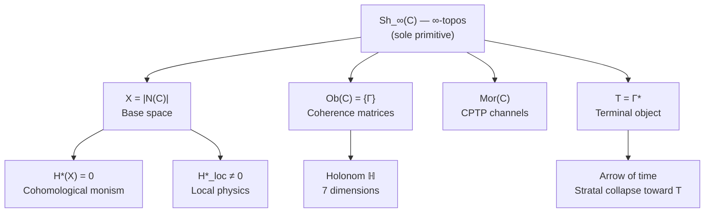

# Unitary Holonomic Monism

## A Formal Theory of Reality and Consciousness

**Unitary Holonomic Monism (UHM)** is a formal theory describing the structure, dynamics, and phenomenology of reality through a single mathematical primitive — the **∞-topos $\mathrm{Sh}_\infty(\mathcal{C})$**.

:::info Meta-theory status
UHM claims the role of a **meta-theory** (unifying physics, consciousness, and information within a single axiomatic framework). Rigidity of the primitive is proven [T] (T-173): the construction is unique up to $G_2 \times \mathbb{R}_{>0}$ given the axioms. **The universal property in the category of physical theories is proven [T] (T-174)**: for any physical theory $(E, \mathcal{A}, D)$ with $A_{\text{int}} \subset \mathcal{A}$, CPTP dynamics, and $\leq 7$ observables, there exists an essentially unique receiving morphism into $\mathfrak{T}$. **All 4 foundational theorems are proven [T]**: **T-170 [T]** (recovery of the M-theory limit at levels of M-theory definedness): T-170' [T] (perturbative correspondence) + T-170'' [T] (non-perturbative correctness of the UHM integral). **T-171 [T]** (LQG embedding for bounded spin networks $j_e \leq 3$) + **T-171' [T]** (unbounded spin via cluster construction). **T-172 [T]** (causal set embedding) via Lemma C30. The "meta" status is a **proven theorem** for physical theories of the specified class.
:::

The theory:
- **Derives** space, time, and metric from categorical structure
- Formalizes the connection between physics and consciousness
- Defines an interiority hierarchy (L0→L4): from minimal internal structure to reflective consciousness
- Derives the minimal structure of a self-sustaining system (7 dimensions)
- Establishes [bounds of explanation](./reference/falsifiability) — what the theory explains and what it takes as primitive

### Etymology of the Name

- **Unitary** — from Lat. *unus* (one): reality is described by a single ∞-topos $\mathrm{Sh}_\infty(\mathcal{C})$; the underlying unitary evolution preserves information
- **Holonomic** — from Gr. *holon* (whole) + *nomos* (law): every part (Holonom) contains an image of the whole and obeys universal laws
- **Monism** — from Gr. *monos* (one): reality is one — there are no independent "layers" or "substances." In UHM this is a mathematical theorem (H*(X) = 0), not a philosophical choice

## Theory Structure

```mermaid
graph TB
    C["Sh_∞(C) — ∞-topos<br/>(sole primitive)"] --> X["X = |N(C)|<br/>Base space"]
    C --> Ob["Ob(C) = {Γ}<br/>Coherence matrices"]
    C --> Mor["Mor(C)<br/>CPTP channels"]
    X --> H0["H*(X) = 0<br/>Cohomological monism"]
    X --> Hloc["H*_loc ≠ 0<br/>Local physics"]
    C --> T["T = Γ*<br/>Terminal object"]
    T --> Arrow["Arrow of time<br/>Stratal collapse toward T"]
    Ob --> Holon["Holonom ℍ<br/>7 dimensions"]
```

## Five Structural Properties of the Sole Primitive (Ω⁷)

:::info Sole primitive
The **∞-topos $\mathrm{Sh}_\infty(\mathcal{C})$** is the sole primitive of UHM theory. The notion of a "sheaf" in the ∞-topos is defined via a [Grothendieck topology](./core/foundations/axiom-omega#топология-гротендика) on the category $\mathcal{C}$.
:::

| # | Property | Formulation |
|---|----------|-------------|
| 1 | **[Finite-dimensionality](./core/foundations/axiom-omega#свойство-1)** | $\text{Ob}(\mathcal{C}) \subset \mathcal{D}(\mathbb{C}^{42})$ |
| 2 | **[Constraint](./core/foundations/axiom-omega#свойство-2)** | $\hat{C} \cdot \Gamma = 0$ (Page–Wootters) |
| 3 | **[Terminal object](./core/foundations/axiom-omega#свойство-3)** | $\forall \Gamma, \exists! f: \Gamma \to T$ |
| 4 | **[Self-modeling](./core/foundations/axiom-omega#свойство-4)** | $\varphi \dashv i: \text{Sub}(\Gamma) \hookrightarrow \mathbf{Sh}_\infty$ (adjunction)* |
| 5 | **[Stratification](./core/foundations/axiom-omega#свойство-5)** | $X = \bigsqcup_\alpha S_\alpha$, $S_0 = \{T\}$ |

*The variational characterization $\varphi = \arg\min \mathbb{E}[S_{spec} + D_{KL}]$ is a **theorem** about properties of the categorically defined φ.

:::note Connection to the Septicity Axiom
The [Septicity Axiom](./core/foundations/axiom-septicity) (AP+PH+QG+V) is a set of **consequences** of Ω⁷ — operational requirements that any viable system must satisfy.
:::

:::info Theorem on degrees of freedom (consequence of Ω⁷)
The number of structurally distinct directions of development of a configuration $\Gamma$ — $\mathrm{Freedom}(\Gamma) = \dim\ker(\mathcal{H}_\Gamma) + 1$ — is a topological invariant. Systems with sufficient coherence possess a nontrivial choice space ($\mathrm{Freedom} > 1$).
:::

:::info Theorem S (justification of Axiom 3) [T]
N = 7 (Axiom 3) is the **minimal** dimension for satisfying (AP)+(PH)+(QG). All 7 dimensions are **necessary and functionally unique** [T]: A, S, D, L, U — algebraically; E, O — categorically (via the κ₀ formula). [Proof →](./proofs/minimality/theorem-minimality-7)

**Second, independent justification:** theorems P1+P2 [T] (derived from (AP)+(PH)+(QG)+(V) via the T15 chain) yield $N = \dim(\mathrm{Im}(\mathbb{O})) = 7$ through the Hurwitz theorem. [Structural derivation →](./proofs/minimality/theorem-octonionic-derivation)
:::

## Key Results

| Construction | Formula | Status |
|-------------|---------|--------|
| **Base space** | $X = \|N(\mathcal{C})\|$ | [T] Derived |
| **Cohomological monism** | $H^n(X) = 0$ for $n > 0$ | [T] Theorem |
| **Local physics** | $H^*_{loc}(X, T) \neq 0$ | [T] Theorem |
| **Time** | $\tau \in \mathbb{Z}_7$ (Page–Wootters) | [T] Derived |
| **Arrow of time** | $\dim(X_\tau) \geq \dim(X_{\tau+1})$ | [T] Theorem |
| **Metric** | $d_{strat}$ (Connes on strata) | [T] Derived |
| **Evolution equation** | All 3 terms ($H_{\text{eff}}$, $\mathcal{D}_\Omega$, $\mathcal{R}$) derived from axioms | [T] Fully |
| **Conscious window (Goldilocks zone)** | $P \in (2/7, 3/7]$: viability $\wedge$ reflexivity ($R \geq 1/3$ when $P \leq 3/7$) | [T] ([T-124](./proofs/consciousness/conscious-window#t-124)) |
| **Octonionic structure** | (AP)+(PH)+(QG) →[T1–T10]→ $\mathbb{O}$ → N=7, $G_2$, Fano, H(7,4) | [T] |

## 7 Dimensions of the Holonom

| Symbol | Dimension | Function | Mathematical operator |
|--------|-----------|---------|----------------------|
| **A** | Articulation | Distinction, boundaries | Projector $P: P^2 = P$ |
| **S** | Structure | Form retention | Hamiltonian $H: H^\dagger = H$ |
| **D** | Dynamics | Change | Unitary operator $U(\tau) = e^{-iH_{eff}\tau}$ |
| **L** | Logic | Coordination | Commutator $[A,B] = AB - BA$ |
| **E** | Interiority | Experience | Density matrix $\rho_E$ |
| **O** | Foundation | Vacuum coupling + **internal clock** | Page–Wootters, $H_O$, $V_O$ |
| **U** | Unity | Integration | Trace $\mathrm{Tr}$ |

State space:
$$
\mathcal{H}_{total} = \mathcal{H}_O \otimes \mathcal{H}_{6D} = \mathbb{C}^7 \otimes \mathbb{C}^6 = \mathbb{C}^{42}
$$

:::warning Two formalisms: 7D and 42D
The theory uses **two related formalisms**:

| Formalism | Dimension | Application |
|-----------|-----------|------------|
| **Minimal** | $\mathbb{C}^7$ | Conceptual basis, minimality theorems |
| **Page–Wootters** | $\mathbb{C}^{42} = \mathbb{C}^7 \otimes \mathbb{C}^6$ | Operational calculations, emergent time |

In the minimal formalism, $\mathcal{H}_O$ is **one of the 7 dimensions** (basis vector $|O\rangle$).
In the extended formalism, $\mathcal{H}_O \cong \mathbb{C}^7$ is the **internal clock space** with 7 time states τ ∈ ℤ₇.

The formalisms are related by **Morita equivalence** [T]: $\mathrm{Sh}_\infty(\mathcal{C}|_7) \simeq \mathrm{Sh}_\infty(\mathcal{C}|_{42})$ (Lurie comparison theorem). All 7D formulas are exact, not approximations. See [Coherence matrix](/docs/core/dynamics/coherence-matrix#согласование-формализмов).
:::

## Central Concepts

### Coherence Matrix Γ (object of category $\mathcal{C}$)

$$
\Gamma \in \text{Ob}(\mathcal{C}), \quad \Gamma^\dagger = \Gamma, \quad \Gamma \geq 0, \quad \mathrm{Tr}(\Gamma) = 1
$$

- **Diagonal elements** $\gamma_{ii}$: probabilities of being in dimension $i$
- **Off-diagonal elements** $\gamma_{ij}$: coherences (quantum correlations) between dimensions

### Purity

$$
P = \mathrm{Tr}(\Gamma^2) \in \left[\frac{1}{7}, 1\right]
$$

- $P = 1$: pure state (maximal coherence)
- $P = 1/7$: maximally mixed state (complete decoherence)
- $P > P_{\text{crit}} = 2/7 \approx 0.286$: viability condition ([theorem](./proofs/dynamics/theorem-purity-critical))
- $P \in (2/7,\, 3/7]$: **conscious window** (Goldilocks zone) — viability $\wedge$ reflexivity $R \geq 1/3$; $P = 3/7$ is the **upper** bound ([T-124](./proofs/consciousness/conscious-window#t-124))

### Terminal Object T

$$
T = \Gamma^* : \varphi(T) = T, \quad \forall \Gamma \in \mathcal{C}, \exists! f: \Gamma \to T
$$

**Interpretation:** T is the global attractor toward which all trajectories converge. The arrow of time is the **stratal collapse** toward T.

### Evolution Equation

With [emergent internal time](./proofs/dynamics/emergent-time) τ:

$$
\frac{d\Gamma(\tau)}{d\tau} = \underbrace{-i[H_{eff}, \Gamma]}_{\text{unitary}} + \underbrace{\mathcal{D}[\Gamma]}_{\text{dissipation}} + \underbrace{\mathcal{R}[\Gamma, E]}_{\text{regeneration}}
$$

where:
- τ — internal time (parameter of conditional states relative to O)
- $H_{eff} = H_{6D} + \langle\tau|H_{int}|\tau\rangle_O$ — effective Hamiltonian (from the Page–Wootters constraint)
- $\mathcal{D}[\Gamma]$ — Lindblad dissipator
- $\mathcal{R}[\Gamma, E] = \kappa(\Gamma) \cdot (\rho_* - \Gamma) \cdot g_V(P)$ — [regenerative term](./core/dynamics/evolution#3-регенеративный-член) [T] ([full derivation](./core/dynamics/evolution#вывод-формы-регенерации) from axioms)

## Interiority Hierarchy

| Level | Name | Condition | n-truncation |
|-------|------|-----------|-------------|
| **L0** | Interiority | $\exists \rho_E$ | $\tau_{\leq 0}$ (set) |
| **L1** | Phenomenal geometry | $\mathrm{rank}(\rho_E) > 1$ | $\tau_{\leq 1}$ (groupoid) |
| **L2** | Cognitive qualia | $R \geq 1/3$, $\Phi \geq 1$, $D_{\text{diff}} \geq 2$ | $\tau_{\leq 2}$ (bicategory) |
| **L3** | Network consciousness | $R^{(2)} \geq 1/4$ (metastable) | $\tau_{\leq 3}$ (tricategory) |
| **L4** | Unitary consciousness | $\lim_{n \to \infty} R^{(n)} > 0$, $P > 6/7$ | $\tau_{\leq \infty}$ (∞-groupoid) |

**Threshold values ([L2 thresholds](./core/foundations/axiom-septicity#пороги-l2-строгий-вывод)):**
- **R** (reflexivity) — measure of proximity to the dissipative attractor: $R = 1/(7P)$, where $P = \mathrm{Tr}(\Gamma^2)$
- **Φ** (integration) — connectivity measure: $\Phi = \sum_{i \neq j} |\gamma_{ij}|^2 / \sum_i \gamma_{ii}^2$
- **$R^{(n)}$** (n-th order reflexivity) — meta-reflexivity measure: $R^{(n)} = \mathrm{Fid}(\varphi^{(n-1)}(\Gamma), \varphi^{(n)}(\Gamma))$

**Threshold value statuses:**
- $P_{\text{crit}} = 2/7$ **[T]** — lower bound of viability (Frobenius norm distinguishability)
- $P_{\text{max}} = 3/7$ **[T]** — **upper** bound of the conscious window: $R = 1/(7P) \geq 1/3$ holds if and only if $P \leq 3/7$; the Goldilocks zone $P \in (2/7, 3/7]$ is nonempty ([T-124](/docs/proofs/consciousness/conscious-window#t-124))
- $R_{\text{th}} = 1/3$ **[T]** — $K = 3$ from the [triadic decomposition](/docs/core/operators/lindblad-operators#триадная-декомпозиция) + Bayesian dominance
- $\Phi_{\text{th}} = 1$ **[T]** — the unique self-consistent value at $P_{\text{crit}} = 2/7$ ([T-129](/docs/proofs/consciousness/operationalization#t-129))
- $D_{\min} = 2$ **[T]** — unconditional consequence of $\Phi_{\text{th}} = 1$ [T] ([T-151](/docs/proofs/consciousness/substrate-closure#t-151))

:::note Level statuses
- **L0–L2**: stable states for biological systems
- **L3**: metastable state (finite lifetime $\tau_3$); threshold $K = 4$ **[T]** from quadratic decomposition ([T-67](/docs/consciousness/hierarchy/interiority-hierarchy#теорема-l3-k4))
- **L4**: theoretical limit **[C]**, unattainable for systems with nonzero decoherence ($R^{(n)} \to 0$); an attractor, not a physical state ([C19](/docs/consciousness/hierarchy/interiority-hierarchy#теорема-l4-недостижимость))
- **SAD metric** [T], SAD_MAX = 3 [T] (T-142): generalization of L0–L4 to the continuous case via the representational tower; SAD = max{k : R^(k) > 1/(k+2)}, spectral formula [T], stress-dependent regime [T] — [Depth tower](/docs/consciousness/hierarchy/depth-tower#sad)
:::

## Formal Results

| Theorem | Statement | Status | Reference |
|---------|-----------|--------|-----------|
| **Cohomological monism** | $H^n(X) = 0$ for $n > 0$ | [T] | [Consequences](./core/foundations/consequences#когомологический-монизм) |
| **Local nontriviality** | $H^*_{loc}(X, T) \neq 0$ | [T] | [Consequences](./core/foundations/consequences#локально-глобальная-дихотомия) |
| **7D minimality** | $n < 7 \Rightarrow$ violation of (AP), (PH), or (QG) | [T] | [Proof](./proofs/minimality/theorem-minimality-7) |
| **Fixed point of φ** | $\exists! \Gamma^* : \varphi(\Gamma^*) = \Gamma^*$ | [T] | [Proof](./proofs/categorical/formalization-phi#3-теорема-о-существовании-неподвижной-точки) |
| **Emergent time** | τ derived from $\mathcal{C}$ (Page–Wootters, Bures, ∞-groupoid) | [T] | [Theorem](./proofs/dynamics/emergent-time) |
| **Arrow of time** | Stratal collapse: $\dim(X_\tau) \geq \dim(X_{\tau+1})$ | [T] | [Theorem](./proofs/dynamics/emergent-time#10-стратификационное-время) |
| **Critical purity** | $P_{\text{crit}} = 2/N = 2/7$ | [T] | [Theorem](./proofs/dynamics/theorem-purity-critical) |
| **Necessity of interiority** | $\text{Viable}(\mathbb{H}) \land \mathcal{D}_\Omega \neq 0 \Rightarrow \mathrm{Coh}_E \geq \mathrm{Coh}_{\min} > 1/7$ | [T] | [Theorem 8.1](./applied/coherence-cybernetics/theorems#теорема-81-условная-необходимость-интериорности-no-zombie) |
| **$G_2$-rigidity** | The holonomic representation is unique up to $G_2 = \mathrm{Aut}(\mathbb{O})$; 34 physical parameters | [T] | [Theorem](./proofs/categorical/uniqueness-theorem#g2-ригидность) |
| **Electroweak sector uniqueness** | $SU(2)_L \times U(1)_Y$ is the unique rank-4 construction from $\kappa_0$ and axioms A1–A5 | [T] | [Theorem](./physics/gauge-symmetry/standard-model#теорема-единственности-фэ) |
| **Exactly 3 generations** | $N_{\text{gen}} = 3$: $\leq 3$ from swallowtail $A_4$ + $\geq 3$ from $(1,2,4) \subset \mathbb{Z}_7^*$ | [T] | [Theorem](./physics/particle-physics/fermion-generations#теорема-ровно-три-генерации) |
| **Fano Yukawa selection** | $y_k = g_W \cdot f_{k,E,U} \cdot |\gamma_{\text{vac}}^{(EU)}|$ via octonionic $f_{ijk}$ | [T] | [Theorem](./physics/gauge-symmetry/fano-selection-rules#теорема-фано-отбор-fijk) |
| **Source instability** | $\Gamma_\odot = I/7$ is non-stationary: $F_0 \neq 0$, drift toward $\rho^*$, self-amplification | [T] | [Proof](./physics/cosmology-phys/origin#доказательство-нестабильности) |
| **Free will** | $\mathrm{Freedom}(\Gamma) = \dim\ker(H_\Gamma) + 1$; monotonicity under CPTP, $G_2$-invariance | [T] | [Theorem](./core/foundations/consequences#freedom-конечномерное) |
| **$A_4$-bifurcation** | Swallowtail from 3 parameters $(\kappa, \alpha, \Delta F)$ + $\mathbb{Z}_2$-purity symmetry | [T] | [Theorem](./consciousness/hierarchy/interiority-hierarchy#теорема-a4-бифуркация) |
| **Gap-injection of L-levels** | $L(\Gamma_1) \neq L(\Gamma_2) \Rightarrow [\mathrm{Gap}(\Gamma_1)] \neq [\mathrm{Gap}(\Gamma_2)]$ | [T] | [Theorem](./consciousness/hierarchy/interiority-hierarchy#теорема-gap-инъекция) |
| **Generation assignment** | $k=1 \to$ 3rd [T], $k=4 \to$ 2nd, $k=2 \to$ 1st [T] | [T] | [Theorem](./physics/particle-physics/fermion-generations#thm-gen-4-1) |
| **Superpotential** | $W = \mu_W \sum f_{ijk}\Theta\Theta\Theta$ — unique $G_2$-invariant (Schur's lemma) | [T] | [Theorem](./physics/particle-physics/susy#теорема-суперпотенциал) |
| **Right-handed neutrino mass** | $M_R \sim 2.9 \times 10^{14}$ GeV from PW clock + viability | [T] | [Theorem](./physics/particle-physics/neutrino-masses#теорема-mr-из-gap) |
| **3+1 from sector decomposition** | $7 = 1_O \oplus 3_{A,S,D} \oplus \bar{3}_{L,E,U}$; $\dim(\text{space}) = 3$ | [T] | [Theorem](./core/foundations/spacetime#теорема-секторная-декомпозиция) |
| **Sector hierarchy $\varepsilon$** | Unique self-consistent vacuum; $\bar{\varepsilon} \approx 0.023$ from sector structure | [T] | [Theorem](./core/dynamics/gap-thermodynamics#теорема-единственный-вакуум) |
| **Cohomological vanishing of $\Lambda$** | $\Lambda_{\text{global}} = 0$ from $H^n(X) = 0$; observed $\Lambda$ is a local effect | [T] | [Theorem](./proofs/gap/lambda-budget#когомологическое-обнуление) |
| **Einstein equations from spectral action** | Full triple (T-53) → $S = \mathrm{Tr}(f(D_A/\Lambda))$ → EH + SM, $G_N = 3\pi/(7f_2\Lambda^2)$ | [T] | [Theorem](./physics/gravity/quantum-gravity#теорема-полное-спектральное-действие) |
| **UV-finiteness of Gap theory** | Compactness of $(S^1)^{21}$ + $G_2$-Ward ($21 \to 7$) + SUSY ($7-7=0$) + APS index | [T] | [Theorem](./physics/gravity/quantum-gravity#теорема-уф-конечность) |
| **Lorentzian signature** | Finite spectral triple $(A_{\text{int}}, H_{\text{int}}, D_{\text{int}})$, KO-dimension 6 → (+,−,−,−) | [T] | [Theorem](./core/foundations/spacetime#теорема-спектральная-тройка) |
| **Morita equivalence 7D↔42D** | $\mathrm{Sh}_\infty(\mathcal{C}|_7) \simeq \mathrm{Sh}_\infty(\mathcal{C}|_{42})$; all 7D formulas are exact | [T] | [Theorem](./core/structure/dimension-e) |
| **Spectral gap of Fano dissipator** | $\lambda_{\text{deco}} = 5\gamma/(3N)$ (BIBD symmetry); $\kappa_{\text{bootstrap}} = \omega_0/N \gg \lambda_{\text{gap}}/N$ | [T] | [Theorem](./core/foundations/axiom-omega#теорема-kappa-bootstrap-bound) |
| **φ-operator (replacement channel)** | $\varphi_k(\Gamma) = (1-k)\Gamma + k\rho_*$ — CPTP, monotonicity, fixed point $\rho_*$ | [T] | [Theorem](./consciousness/foundations/self-observation#теорема-физическая-реализация-phi) |
| **Global minimization of $V_{\text{Gap}}$** | $G_2$-orbit reduction $21D \to 5D$; unique minimum; Hessian $> 0$ | [T] | [Theorem](./core/dynamics/gap-thermodynamics#теорема-глобальная-минимизация) |
| **Neutrino O-sector Yukawa** | $m_D^{(k)} \propto \varepsilon_0 \sin(2\pi k/7)$; discrepancy $m_2/m_3$: $\times 50 \to \times 1.8$ | [C] | [Theorem](./physics/particle-physics/neutrino-masses#теорема-нейтрино-o-сектор) |
| **PMNS from anarchic $M_R$** | O-isotropy → dense $M_R$ → angles $O(30°\text{–}60°)$ | [C] | [Theorem](./physics/particle-physics/neutrino-masses#теорема-pmns-анархия) |
| **Justification of $K=4$ for L3** | Quadratic decomposition $3+1=4$; Bayesian dominance $R^{(2)} \geq 1/4$ | [T] | [Theorem](./consciousness/hierarchy/interiority-hierarchy#теорема-l3-k4) |
| **Unattainability of L4 for biosystems** | $R^{(n)} \sim R^n \to 0$ for $\varepsilon_{\text{dec}} > 0$; L4 = attractor | [C] | [Theorem](./consciousness/hierarchy/interiority-hierarchy#теорема-l4-недостижимость) |
| **CC-5: Fractal closure** | Nontriviality of composite attractor $P > 1/7$ [T]; viability $P > 2/7$ [T for embodied] (T-149) | [T]+[C] | [Theorem](./applied/coherence-cybernetics/theorems#теорема-91-фрактальное-замыкание) |
| **Topological protection of Gap vacuum** | $\pi_2(G_2/T^2) \cong \mathbb{Z}^2$; barrier $\geq 6\mu^2$; vacuum separated from $\text{Gap}=0$ | [T] | [Theorem](./core/dynamics/composite-systems#теорема-тополог-защита) |
| **Canonical definition of $f_0$** | $f_0\Lambda^4 = \frac{1}{7}[V_{\text{Gap}}^{\min} + \frac{1}{2}\zeta'_{H_{\text{Gap}}}(0)]$; UV-finiteness + unique vacuum | [T] | [Theorem](./physics/particle-physics/higgs-sector#теорема-f0-канонический) |
| **Structural necessity of $\Lambda > 0$** | Autopoiesis + local cohomology → $\rho_{\text{vac}} > 0$; Lawvere incompleteness | [T] | [Theorem](./core/foundations/consequences#теорема-лямбда-положительна) |
| **CC-6: Scale invariance** | Bures contractivity of CPTP + CC-5 (nontriviality [T]) → structure preserved under aggregation | [T] | [Theorem](./applied/coherence-cybernetics/theorems#теорема-92-масштабная-инвариантность) |
| **Gap = curvature of Serre fibration** | Spectral triple T-53 + NCG curvature → exact identification | [T] | [Theorem](./core/dynamics/gap-operator#теорема-gap-серра) |
| **Internal theory** (T-54) | $\mathrm{Th}_{\mathrm{UHM}} = \mathrm{Sub}_{\mathrm{closed}}(\Omega)$ — φ-invariant predicates | [T] | [Theorem](./core/foundations/consequences#внутренняя-теория) |
| **Lawvere incompleteness** (T-55) | $\mathrm{Th}_{\mathrm{UHM}} \subsetneq \Omega$ — from Cartesian closedness + nontriviality of φ | [T] | [Theorem](./core/foundations/consequences#неполнота-ловера) |
| **Structural ToE** (T-56) | φ-closed, finitely axiomatizable, principally incomplete, evolutionarily open | [T] | [Theorem](./core/foundations/consequences#структурная-toe) |
| **Completeness of triadic decomposition** (T-57) | LGKS theorem: unique decomposition $\mathcal{L} = \mathrm{Ham} + \mathrm{diss} + \mathrm{reg}$ | [T] | [Theorem](./core/operators/lindblad-operators#полнота-триадной-декомпозиции) |
| **∞-groupoid $\mathbf{Exp}_\infty$** (T-91) | $\mathrm{Sing}(\mathcal{E})$ — Kan complex (Milnor's theorem); + T-76 → HoTT logic, Postnikov truncations | [T] | [Theorem](./proofs/categorical/categorical-formalism#10-infty-группоид-и-infty-топос-для-эмерджентного-времени) |
| **Compression parameter $k = 1 - R$** (T-62) | $k$ is not free: $k = 1 - R$, $R = 1 - \|\Gamma - \rho^*\|_F^2/\|\Gamma\|_F^2$; adaptive self-modeling | [T] | [Theorem](./consciousness/foundations/self-observation#теорема-k-из-r) |
| **PW reconstruction algorithm** (T-95) | 4-step procedure $\Gamma \to \rho_E, D_{\text{diff}}, \sigma_L, C$ with zero error | [T] | [Theorem](./core/structure/dimension-e#канонический-алгоритм-pw) |
| **Structural $\theta_{\mathrm{QCD}} = 0$** (T-99) | 7-step proof: reality of $f_{ijk} \in \mathbb{R}$ (A1) + unique vacuum (T-64) → $\theta_{\mathrm{QCD}} = 0$ exactly. Axion is purely DM | [T] | [Theorem](./physics/gauge-symmetry/confinement#теорема-структурное-theta-qcd) |
| **Environment encoding** (T-100) | CPTP functor Enc: ObsSpace → End(D(C⁷)), unique up to G₂. 3-channel decomposition from T-57 | [T] | [Theorem](./applied/coherence-cybernetics/sensorimotor#теорема-кодирование-среды) |
| **Optimal action** (T-101) | $a^* = \arg\min \|\sigma_{\mathrm{sys}}\|_\infty$ — from T-92 (equivalence of P and σ) | [T] | [Theorem](./applied/coherence-cybernetics/sensorimotor#теорема-оптимальное-действие) |
| **Completeness of the 3-term equation** (T-102) | $h^{\text{ext}} = h^{(H)} + h^{(D)} + h^{(R)}$, 4th type impossible (from T-57 LGKS) | [T] | [Theorem](./applied/coherence-cybernetics/sensorimotor#теорема-полнота-трёх-членов) |
| **Hedonic valence** (T-103) | $\mathcal{V}_{\text{hed}} = dP/d\tau\|_{\mathcal{R}}$: formula [T], observability at L2 [T] (T-77), phenomenal interpretation [I] | [T]+[I] | [Theorem](./applied/coherence-cybernetics/sensorimotor#теорема-гедоническая-валентность) |
| **Stability radius** (T-104) | $r_{\text{stab}} = \sqrt{P(\rho^*_\Omega) - 2/7}$ (Bures metric); most dangerous channel is $h^{(D)}$ | [T] | [Theorem](./applied/coherence-cybernetics/stability#радиус-устойчивости) |
| **Landauer energy balance** (T-105) | $\Delta F_{\min} = k_B T_{\text{eff}} \cdot \ln 2 \cdot \dot{S}_{\text{diss}}$; three metabolic regimes | [T] | [Theorem](./applied/coherence-cybernetics/stability#энергетический-баланс) |
| **Information capacity of Enc** (T-107) | $C_{\text{Enc}} \leq \log_2 7 \approx 2.81$ bits/observation (Holevo bound + T-102) | [T] | [Theorem](./applied/coherence-cybernetics/sensorimotor#информационная-ёмкость) |
| **Compositionality of Enc/Dec** (T-108) | $\text{Enc}_{12} = \Phi_{\text{agg}} \circ (\text{Enc}_1 \otimes \text{Enc}_2)$ from T-100 + T-72 + T-58 | [T] | [Theorem](./applied/coherence-cybernetics/sensorimotor#композициональность-enc-dec) |
| **Information learning bound** (T-109) | $n \geq \ln(1/(2\delta))/\xi_{\text{QCB}}$, $\xi_{\text{QCB}} \leq \ln 7$ (quantum Chernoff bound + T-107) | [T] | [Theorem](./applied/coherence-cybernetics/learning-bounds#теорема-информационная-граница) |
| **Optimal learning bound** (T-112) | $n_{\text{opt}} = \max(n_{\text{info}}, n_{\text{dyn}}, n_{\text{stab}})$ — three regimes | [T] | [Theorem](./applied/coherence-cybernetics/learning-bounds#теорема-оптимальная-граница) |
| **N=7 minimality for learning** (T-113) | Learning via regeneration is impossible for $N < 7$; $N = 7$ is Pareto-optimal | [T] | [Theorem](./applied/coherence-cybernetics/learning-bounds#теорема-минимальность-n7) |
| **Fano grammar** (T-114) | Markov chain on PG(2,2) is ergodic, stationary distribution $\pi_i = 1/7$ | [T] | [Theorem](./core/operators/lindblad-operators#теорема-фано-грамматика) |
| **Composition distinguishability** (T-115) | $|\mathrm{Comp}(n)| = 7^n$ for generic $\Gamma$ (algebraic distinguishability) | [T] | [Theorem](./core/operators/lindblad-operators#теорема-различимость-композиций) |
| **PW Suzuki-Trotter** (T-116) | $\varepsilon(T) \leq C_p \cdot T \cdot (\delta\tau)^{2p+1}$, for $p=2$: $\varepsilon \leq 10^{-5}$ | [T] | [Theorem](./core/foundations/axiom-omega#теорема-pw-suzuki-trotter) |
| **Landauer calibration** (C22) | $\Delta F^{(k)} \geq k_B T_\mathrm{eff} \ln(2) \cdot k$ — linear growth | [C] | [Theorem](./consciousness/hierarchy/depth-tower#ландауэровская-калибровка) |

:::note Status legend
- **[T] STRICT** — mathematically proven without additional assumptions
- **[C] CONDITIONAL** — proven under explicit interpretational assumptions
- **[P] PROGRAM** — research direction
:::

## What the Theory Derives

### From the ∞-topos $\mathrm{Sh}_\infty(\mathcal{C})$:
1. **Base space** X = $|N(\mathcal{C})|$ — geometric realization of the nerve
2. **Monism** — H*(X) = 0 as a mathematical theorem
3. **Local physics** — H*_loc(X, T) ≠ 0 near the terminal object
4. **Time** — τ ∈ ℤ₇ via the Page–Wootters mechanism
5. **Arrow of time** — stratal collapse toward the terminal T
6. **Metric** — d_strat (stratified Connes metric)
7. **Dimensionality** — dim(X) = 6 from N = 7
8. **Octonionic structure** — P1+P2 → $\mathbb{O}$ → N=7, $G_2$-symmetry, Fano plane, Hamming code ([Track B](./proofs/minimality/theorem-octonionic-derivation))

### Research program:
- **Compactification 6D → 4D** — connection to observed spacetime
- **Einstein equations** — **[T]** (T-53): full spectral action, see [theorem](./physics/gravity/quantum-gravity#теорема-полное-спектральное-действие)
- Connection to the Standard Model — [formalized program](./proofs/physics/physics-correspondence)

### Takes as primitive ([categorical gap](/docs/consciousness/foundations/two-aspect-monism#теорема-нетривиальность)):
- Why the ∞-topos $\mathrm{Sh}_\infty(\mathcal{C})$ has an "inner side"
- Why this particular mathematical structure and not another

:::info Minimality of the primitive
UHM's primitive is **minimal** among all possible axiomatic choices: one axiom instead of two or three ([justification](/docs/consciousness/foundations/two-aspect-monism#минимальность-аксиомы)). From it are **derived**: the form of experiential content ([unique functor](/docs/consciousness/foundations/two-aspect-monism#теорема-единственность-фв)), identity of qualia ([Yoneda lemma](/docs/consciousness/foundations/two-aspect-monism#реляционная-идентичность)), immanence of description ([closure via φ](/docs/consciousness/foundations/two-aspect-monism#самореферентная-замкнутость)).
:::

## Navigation

| Section | Contents |
|---------|----------|
| **[Axiom Ω⁷](./core/foundations/axiom-omega)** | Five structural properties with the ∞-topos $\mathrm{Sh}_\infty(\mathcal{C})$ as primitive |
| **[Consequences](./core/foundations/consequences)** | Cohomological monism, local-global dichotomy |
| **[Structure](./core/structure/holon)** | Holonom and 7 dimensions |
| **[Dynamics](./core/dynamics/evolution)** | Evolution equations with terminal object T |
| **[Spacetime](./core/foundations/spacetime)** | Base space X, metric d_strat |
| **[Consciousness](/docs/consciousness/hierarchy/interiority-hierarchy)** | Hierarchy L0→L1→L2→L3→L4 |
| **[Emergent time](./proofs/dynamics/emergent-time)** | Page–Wootters, stratificational time |
| **[Categorical formalism](./proofs/categorical/categorical-formalism)** | ∞-topos, derived categories, IC cohomologies |
| **[Uniqueness theorem](./proofs/categorical/uniqueness-theorem)** | G₂-rigidity: 34 physical parameters |
| **[Standard Model](./physics/gauge-symmetry/standard-model)** | SM from G₂: electroweak sector [T], 3 generations [T] |
| **[Physics](/docs/physics/overview)** | Gauge symmetry, particles, gravity, cosmology |
| **[Neutrino masses](./physics/particle-physics/neutrino-masses)** | Seesaw from Gap, $M_R$ [T], O-sector Yukawa [T], PMNS [C] |
| **[SUSY from $G_2$](./physics/particle-physics/susy)** | Superpotential [T] (Schur), superpartner spectrum, gravitino |
| **[Gap thermodynamics](./core/dynamics/gap-thermodynamics)** | Potential $V_{\text{Gap}}$, global minimization [T], sector hierarchy $\varepsilon$ |
| **[Quantum gravity](./physics/gravity/quantum-gravity)** | Spectral action [T], UV-finiteness [T], Einstein equations [T] |
| **[Cosmological constant](./physics/gravity/cosmological-constant)** | $\Lambda > 0$ [T], spectral formula [T], budget $\sim 10^{-120\pm10}$ [C] |
| **[Composite systems](./core/dynamics/composite-systems)** | CC-5 (nontriviality [T], viability [C]), topological protection of Gap [T], emergent geometry |
| **[Interiority hierarchy](/docs/consciousness/hierarchy/interiority-hierarchy)** | L0–L4, $K=4$ for L3 [T], unattainability of L4 [C] |
| **[Depth tower](/docs/consciousness/hierarchy/depth-tower)** | SAD metric [T], depth dynamics (A₄-bifurcation, energy, stress, social), morphological agnosticism [H] |
| **[Glossary](./reference/glossary)** | Term definitions |
| **[Notation](./reference/notation)** | Mathematical notation |
