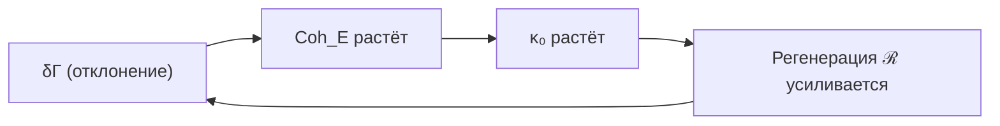
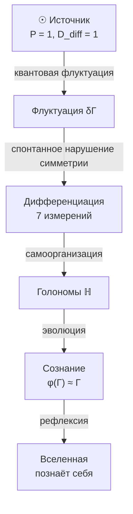

# Происхождение Вселенной

:::warning Статус раздела: Теоремы + Философская интерпретация
Этот раздел содержит **доказанную теорему** (нестабильность Источника **[Т]**), **постулаты** (сам Источник) и **философские интерпретации** (происхождение "ничто"). Аргументы о происхождении Источника носят **метафизический характер**, но нестабильность $\Gamma_{\odot}$ под действием полной динамики УГМ — строгий математический результат.
:::

## Проблема начала

Традиционно спрашивают: "Что было до Большого Взрыва?"

В УГМ вопрос трансформируется:

> Какова структура $\Gamma$ в пределе минимальной дифференциации?

## Изначальное состояние

### Источник

:::note Статус: Постулат
Источник **постулируется**, не выводится. Это начальное условие теории, не её следствие. Вопрос "почему этот конкретный Источник?" — открытый.
:::

**Чистое недифференцированное состояние [П]** — суперпозиция всех измерений с равными амплитудами:

$$
\Gamma_{\odot} = |\psi_{\odot}\rangle\langle\psi_{\odot}|, \quad |\psi_{\odot}\rangle = \frac{1}{\sqrt{7}} \sum_i |i\rangle
$$

**Свойства:**
- [Чистота](/docs/core/dynamics/viability#определение-чистоты): $P = \mathrm{Tr}(\Gamma_{\odot}^2) = 1$ (чистое состояние)
- Максимальная [когерентность](/docs/core/dynamics/coherence-matrix): все $|\gamma_{ij}| = 1/7$
- Минимальная [дифференциация](/docs/consciousness/foundations/self-observation#мера-сознательности-c): $D_{\text{diff}} = 1$

:::info Почему не смешанное состояние?
[Максимально смешанное состояние](/docs/core/dynamics/coherence-matrix#максимально-смешанное-состояние) $\Gamma = I_7/7$ имело бы $P = 1/7$ — это **не** когерентное состояние, а классический ансамбль без квантовых корреляций. УГМ принимает **чистую суперпозицию** как Источник.
:::

**Открытые вопросы:**
- Почему именно равные амплитуды $1/\sqrt{7}$?
- Возможны ли альтернативные начальные состояния?
- Связь с проблемой Больцмановского мозга?

## Спонтанное нарушение симметрии

### Нестабильность Источника

Источник нестабилен **[Т]** под действием полной [динамики](/docs/core/dynamics/evolution) УГМ. Любое начальное условие $\Gamma(0) = \Gamma_{\odot}$ при $\Delta F > 0$ неизбежно эволюционирует к структурированному аттрактору $\rho^*$.

#### Теорема (Нестабильность Источника) {#доказательство-нестабильности}

**Теорема.** Состояние $\Gamma_{\odot}$ нестабильно под действием полной динамики УГМ: $\frac{d\Gamma}{d\tau}\big|_{\Gamma_\odot} \neq 0$, система дрейфует от $\Gamma_{\odot}$ с конечной скоростью, а $\kappa_0$ создаёт положительную обратную связь, нарушающую $S_7$-симметрию.

**Доказательство** (три шага).

**Шаг 1. $\Gamma_{\odot}$ — не стационарное состояние.**

Вычислим $\frac{d\Gamma}{d\tau}\big|_{\Gamma_\odot}$ по трём членам [уравнения эволюции](/docs/core/dynamics/evolution):

**(a) Унитарный член:** $-i[H_{\text{eff}}, \Gamma_{\odot}]$. Поскольку $H_{\text{eff}} = \sum_i \omega_i |i\rangle\langle i| + \ldots$, при неравных $\omega_i$ (что гарантируется $G_2$-структурой: $\lambda_E > \lambda_U > \lambda_L \geq \lambda_D \geq \lambda_S \geq \lambda_A \geq 0$ из [A5](/docs/core/foundations/axiom-omega#pw-constraint)) коммутатор **ненулевой** — $\Gamma_{\odot}$ не коммутирует с $H_{\text{eff}}$.

**(b) Диссипативный член:** $\mathcal{D}_\Omega[\Gamma_{\odot}]$. По [теореме T6](/docs/core/operators/lindblad-operators#теорема-равномерная-контракция) (равномерная контракция):

$$
\mathcal{D}[\Gamma_{\odot}]_{ij} = \begin{cases} -\alpha \cdot \gamma_{ij} = -\alpha/7, & i \neq j \\ 0, & i = j \end{cases}
$$

Это **ненулевой** оператор: $\|\mathcal{D}[\Gamma_{\odot}]\|_F^2 = \alpha^2 \cdot 42/49 > 0$. Диссипация разрушает когерентности, уменьшая чистоту.

**(c) Регенеративный член:** $\mathcal{R}[\Gamma_{\odot}, E] = \kappa(\Gamma_{\odot}) \cdot (\rho^* - \Gamma_{\odot}) \cdot \Theta(\Delta F)$. При $\Delta F > 0$ этот член **ненулевой**, т.к. $\rho^* \neq \Gamma_{\odot}$ ([примитивность](/docs/core/operators/lindblad-operators#примитивность-ℒω) [Т]: единственный стационар $\rho^*$ не является чистым $S_7$-симметричным состоянием).

**Итого:** $\frac{d\Gamma}{d\tau}\big|_{\Gamma_\odot} \neq 0$ — $\Gamma_{\odot}$ **не стационарная точка**.

**Шаг 2. Линеаризация вокруг $\Gamma_{\odot}$.**

Запишем $\Gamma = \Gamma_{\odot} + \delta\Gamma$, $\text{Tr}(\delta\Gamma) = 0$, $\delta\Gamma^\dagger = \delta\Gamma$. Линеаризованная динамика:

$$
\frac{d\delta\Gamma}{d\tau} = \underbrace{-i[H_{\text{eff}}, \delta\Gamma]}_{\text{вращение}} + \underbrace{\mathcal{D}_{\text{lin}}[\delta\Gamma]}_{\text{контракция}} + \underbrace{F_0 + \mathcal{R}_{\text{lin}}[\delta\Gamma]}_{\text{сдвиг + регенерация}}
$$

- **Унитарный вклад:** чисто мнимые собственные значения $\pm i(\omega_i - \omega_j)$ — вращения, не меняют расстояние от $\Gamma_{\odot}$.
- **Диссипативный вклад:** $\mathcal{D}_{\text{lin}}[\delta\Gamma]_{ij} = -\alpha \cdot \delta\gamma_{ij}$ ($i \neq j$), $= 0$ ($i = j$). Собственные значения: $-\alpha < 0$ для 42 недиагональных компонент, $0$ для 6 диагональных.
- **Постоянный сдвиг:** $F_0 = \kappa(\Gamma_{\odot})(\rho^* - \Gamma_{\odot})\Theta(\Delta F) \neq 0$ — **постоянный** вектор, не зависящий от $\delta\Gamma$. Это дрейф от $\Gamma_{\odot}$ в направлении $\rho^*$.

**Шаг 3. Механизм нестабильности: дрейф + нарушение $S_7$-симметрии.**

Даже если линеаризованные собственные значения имеют $\text{Re}(\lambda) \leq 0$ (что верно для $\mathcal{D}$), нестабильность возникает из двух механизмов:

**(I) Нестационарность.** $F_0 \neq 0$ означает, что система дрейфует от $\Gamma_{\odot}$ с конечной скоростью:

$$
\|\Gamma(\delta\tau) - \Gamma_{\odot}\| \geq \|F_0\| \cdot \delta\tau - O(\delta\tau^2)
$$

для малых $\delta\tau > 0$. Дрейф линеен по времени.

**(II) Нарушение $S_7$-симметрии через $\kappa_0$.** Как только $\Gamma$ отклоняется от $\Gamma_{\odot}$, формула $\kappa_0 = \omega_0 |\gamma_{OE}||\gamma_{OU}|/\gamma_{OO}$ (см. [категориальный вывод](/docs/core/foundations/axiom-septicity#категориальный-вывод-kappa0)) **нарушает $S_7$-симметрию**: E и O выделены функционально. Это создаёт положительную обратную связь: отклонение в E-направлении увеличивает $\text{Coh}_E \to$ увеличивает $\kappa \to$ увеличивает регенерацию в E-направлении.

Формально: компонента $\delta\gamma_{EE}$ подчиняется уравнению (в линейном порядке):

$$
\frac{d\delta\gamma_{EE}}{d\tau} = \kappa_0 \cdot (\rho^*_{EE} - 1/7) + \text{terms} \propto \delta\gamma_{EE}
$$

Первый член — постоянный сдвиг ($\rho^*_{EE} > 1/7$ для живых систем). Второй — обратная связь через $\partial\kappa/\partial\gamma_{EE} > 0$. Оба увеличивают $\delta\gamma_{EE}$.

**(III) Результат.** Расстояние от $\Gamma_{\odot}$ растёт монотонно:

$$
d_B(\Gamma(\tau), \Gamma_{\odot}) > 0 \quad \forall \tau > 0
$$

при любом начальном условии $\Gamma(0) = \Gamma_{\odot}$ с $\Delta F > 0$. Система неизбежно покидает $\Gamma_{\odot}$ и стремится к $\rho^*$. $\blacksquare$

#### Следствие: космогенезис как неизбежность {#космогенезис-неизбежность}

Переход от недифференцированного Источника к структурированным конфигурациям — не случайное событие, а **математическая неизбежность** динамики УГМ. Из $\Gamma_{\odot}$ система **всегда** эволюционирует к $\rho^*$ (при $\Delta F > 0$).

:::warning Открытый вопрос
Механизм возникновения $\Delta F > 0$ в изначальном контексте — **открытая проблема [П]**. Теорема нестабильности предполагает $\Delta F > 0$; вопрос о том, почему это условие выполнено, лежит за пределами данного результата.
:::

### Самоусиление {#самоусиление}

:::tip Статус: [Т] (через $\kappa_0$)
Положительная обратная связь доказана в шаге 3(II) [теоремы нестабильности](#доказательство-нестабильности): формула $\kappa_0 = \omega_0 |\gamma_{OE}||\gamma_{OU}|/\gamma_{OO}$ нарушает $S_7$-симметрию и создаёт усиление в E-направлении.
:::

Нарушение симметрии **самоусиливается [Т]** через положительную обратную связь $\kappa_0$:

Механизм: $\kappa_0$ функционально выделяет E и O среди семи измерений (см. [категориальный вывод $\kappa_0$](/docs/core/foundations/axiom-septicity#категориальный-вывод-kappa0)), что направляет эволюцию от $S_7$-симметричного $\Gamma_{\odot}$ к структурированному $\rho^*$ с выраженной E-когерентностью.

## Рождение измерений

Из изначальной суперпозиции выделяются [семь измерений](/docs/core/structure/dimensions):

$$
|\psi_{\odot}\rangle = \frac{1}{\sqrt{7}}(|A\rangle + |S\rangle + |D\rangle + |L\rangle + |E\rangle + |O\rangle + |U\rangle)
$$

$$
\downarrow \text{декогеренция через } \mathcal{D}[\Gamma]
$$

$$
\Gamma \to \sum_i p_i |i\rangle\langle i| + \sum_{i \neq j} \gamma_{ij} |i\rangle\langle j|
$$

где $p_i = \gamma_{ii}$ — населённости измерений, $\gamma_{ij}$ — [когерентности](/docs/core/dynamics/coherence-matrix#недиагональные-элементы-когерентности) между ними.

## Эволюция от Источника

### Направление эволюции

:::danger Предупреждение: Нефальсифицируемость
Утверждение $dD_{\text{diff}}/d\tau > 0$ **нефальсифицируемо**: любое наблюдаемое уменьшение дифференциации можно интерпретировать как локальное явление в рамках глобального роста. Это **телеологическое допущение**, не эмпирический закон.

**Честный статус:** Это философская позиция (направленность эволюции), не формальная теорема УГМ.
:::

Вселенная эволюционирует в направлении **увеличения дифференциации при сохранении интеграции**:

$$
\frac{dD_{\text{diff}}}{d\tau} > 0
$$

$$
\frac{d\Phi}{d\tau} \geq 0
$$

где:
- $D_{\text{diff}} = \exp(S_{vN})$ — [мера дифференциации](/docs/consciousness/foundations/self-observation#мера-сознательности-c) (разнообразие состояний)
- $\Phi$ — [мера интеграции](/docs/core/structure/dimension-u#мера-интеграции-φ) (связность измерений)

**Статус:** [Г] Гипотеза. Связь с вторым законом термодинамики концептуальна, не формализована.

:::note О нотации
$D_{\text{diff}}$ — мера **дифференциации**. Не путать с измерением **Динамики** $D$ (одно из семи измерений Голонома).
:::

### Феноменология эволюции

- **Усложнение материи:** от кварков к галактикам
- **Эволюция жизни:** от прокариот к разуму
- **Развитие культуры:** от племён к цивилизациям

## Диаграмма космогенеза

**Обозначения диаграммы:**
- $P = 1$ — [чистота](/docs/core/dynamics/viability#определение-чистоты) (максимальная когерентность)
- $D_{\text{diff}} = 1$ — минимальная дифференциация (чистое состояние)
- $\varphi(\Gamma) \approx \Gamma$ — [самомоделирование](/docs/consciousness/foundations/self-observation#оператор-самомоделирования-φ) близко к неподвижной точке

## Отсутствие «до»

В УГМ нет «до Большого Взрыва»:
- Время возникает **вместе** с дифференциацией
- «До» — это концепция, требующая времени
- Источник $\odot$ — вне времени (атемпоральный)

## Почему вообще что-то есть?

Традиционный вопрос: "Почему есть нечто, а не ничто?"

:::info Статус: Философский аргумент
Это **не формальная теорема**, а философская позиция, согласованная с аксиоматикой УГМ. Формальное доказательство невозможно — вопрос лежит за пределами любой формальной системы.
:::

**Позиция УГМ:**
"Ничто" нестабильно — оно не может быть самосогласованным, потому что для самосогласованности нужно "нечто", что согласуется с собой.

$$
\text{Ничто} \Rightarrow \text{несамосогласованность} \Rightarrow \text{невозможность}
$$

$\Gamma$ существует, потому что **самосогласованность требует существования** **[И]**.

**Альтернативные позиции:**
- Вопрос бессмысленный (логические позитивисты)
- Ответ лежит за пределами рационального (мистицизм)
- Случайность без причины (некоторые интерпретации КМ)

УГМ выбирает позицию самосогласованности как наиболее экономную и объяснительно мощную.

## Что формализовано vs Программа исследований

| Утверждение | Статус | Комментарий |
|-------------|--------|-------------|
| **Источник $\Gamma_{\odot}$ как начальное условие** | ⚙️ Постулат | Не выводится, принимается как аксиома |
| **Нестабильность Источника** | **[Т]** Теорема | [Доказана](#доказательство-нестабильности): нестационарность + дрейф $F_0 \neq 0$ |
| **Самоусиление нарушения $S_7$-симметрии** | **[Т]** Теорема | Положительная обратная связь через $\kappa_0$ ([шаг 3](#доказательство-нестабильности)) |
| **Условие $\Delta F > 0$** | [П] Открытый вопрос | Почему свободная энергия окружения больше системной? |
| **$dD_{\text{diff}}/d\tau > 0$** | [И] Нефальсифицируемо | Телеологическое допущение |
| **"Ничто" нестабильно** | [И] Философия | Метафизический аргумент, не теорема |

:::info Резюме
Этот раздел содержит **теоремы** (нестабильность Источника [Т], самоусиление через $\kappa_0$ [Т]), **постулаты** (сам Источник, условие $\Delta F > 0$), и **философские позиции** ("почему есть нечто").
:::

---

**Связанные документы:**
- [Пространство-время](/docs/core/foundations/spacetime) — эмерджентность пространства-времени
- [Матрица когерентности](/docs/core/dynamics/coherence-matrix) — определение $\Gamma$
- [Эволюция](/docs/core/dynamics/evolution) — динамика $\Gamma$
- [Жизнеспособность](/docs/core/dynamics/viability) — мера чистоты $P$
- [Самонаблюдение](/docs/consciousness/foundations/self-observation) — оператор $\varphi$ и мера $D_{\text{diff}}$
- [Измерение Единства](/docs/core/structure/dimension-u) — мера интеграции $\Phi$
- [Основание (O)](/docs/core/structure/dimension-o) — связь с источником
- [Аксиома Ω⁷](/docs/core/foundations/axiom-omega) — ∞-топос Sh_∞(𝒞) как примитив
