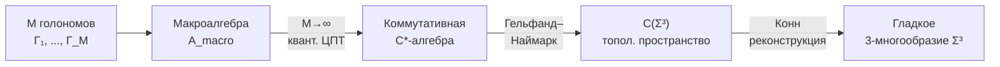

# Эмерджентная геометрия

:::info Для кого эта глава
Эта глава показывает, как из матрицы когерентности $\Gamma$ — чисто алгебраического объекта — **возникает** привычное нам пространство-время с метрикой, расстояниями и кривизной. Пространство в УГМ — не контейнер, в который помещены объекты, а **структура различий** между конфигурациями когерентности. Читатель узнает: как метрика Фробениуса на $\mathcal{D}(\mathbb{C}^7)$ порождает предметрику; как информационная геометрия Фишера-Рао связывает квантовые различимости с пространственными расстояниями; как размерность 3+1 **выводится** из секторного разложения $G_2$; и как из этого следуют уравнения Эйнштейна.

**Одно предложение.** Геометрия пространства-времени — не фундаментальная данность, а эмерджентное свойство матрицы когерентности: расстояние между точками = информационная различимость соответствующих конфигураций $\Gamma$.
:::

:::note Историческая предтеча
Идея эмерджентности геометрии восходит к нескольким традициям:

- **Бернхард Риман** (1854) предположил, что метрика пространства может определяться физическим содержимым — «связующая сила» определяет геометрию.
- **Джон Уилер** (1960-е) сформулировал программу «геометродинамики»: пространство-время — это не арена, а участник физики.
- **Ален Конн** (1994) показал, что вся геометрия (метрика, дифференциальная структура, интегрирование) может быть восстановлена из **алгебраических данных** — спектральной тройки $(\mathcal{A}, \mathcal{H}, D)$.
- **Тед Якобсон** (1995) вывел уравнения Эйнштейна из термодинамики горизонта — первый пример «гравитации из энтропии».

УГМ синтезирует эти подходы: метрика определяется квантовой информационной геометрией (Фишер-Рао / Бюрес), размерность фиксируется алгеброй октонионов, а уравнения Эйнштейна следуют из спектрального действия Конна.
:::

## Обзор

В УГМ пространство-время не является фундаментальной структурой, а **эмерджирует** из матрицы когерентности $\Gamma$. Метрика отражает «логическое расстояние» между конфигурациями $\Gamma$ — геометрия пространства определяется **структурой различений**, задаваемой классификатором $\Omega$.

:::tip Статус: полностью выведено [Т]
Пространственное многообразие $\Sigma^3$ выведено из категорной структуры (T-119 [Т]), произведение $M^4 = \mathbb{R} \times \Sigma^3$ доказано (T-120 [Т]), уравнения Эйнштейна получены из спектрального действия (T-65 [Т]). Подробности: [Эмерджентное многообразие $M^4$](/docs/proofs/physics/emergent-manifold).
:::

---

## 1. Пространство как структура различий

:::note Интуитивное объяснение
Представьте огромный зал, заполненный людьми. Каждый человек — голоном с собственной матрицей $\Gamma_m$. «Расстояние» между двумя людьми определяется не тем, где они стоят (пространства ещё нет!), а тем, насколько **различны** их внутренние состояния. Двое близнецов с похожими $\Gamma$ — «рядом». Человек в экстазе и человек в депрессии — «далеко», даже если физически в одной комнате. Пространство **возникает** как карта этих различий.
:::

### 1.1 Предметрика из когерентности

Для композитной системы $M$ голономов определяется **предметрика** — расстояние между голономами, из которого в термодинамическом пределе эмерджирует пространственная метрика:

$$
d_{\mathcal{G}}(m, n) := \|\Gamma_m - \Gamma_n\|_F = \sqrt{\mathrm{Tr}\!\left((\Gamma_m - \Gamma_n)^2\right)}
$$

Ключевое ограничение: расстояние определяется только через когерентности **пространственного сектора** $\{A,S,D\}$. Это не произвольный выбор — он следует из секторного разложения (§4.3).

### 1.2 От предметрики к метрике: термодинамический предел

:::warning Теорема T-117 (Коммутативность макроалгебры) [Т]
В термодинамическом пределе $M \to \infty$, алгебра макроскопических наблюдаемых $\mathcal{A}_{\text{macro}}$ в $\{A,S,D\}$-секторе становится **коммутативной**:

$$
[a, b] = O(1/\sqrt{M}) \to 0 \quad \text{для } a, b \in \mathcal{A}_{\{A,S,D\}}
$$

Это следует из квантовой ЦПТ (центральной предельной теоремы): флуктуации некоммутативности подавляются как $1/\sqrt{M}$.

[Доказательство →](/docs/proofs/physics/emergent-manifold#теорема-коммутативность) | Статус: **[Т]**
:::

:::warning Теорема T-119 (Эмерджентное пространство) [Т]
Из коммутативности $\mathcal{A}_{\text{macro}}$ по **дуальности Гельфанда–Наймарка** следует:

$$
\mathcal{A}_{\text{macro}} \cong C(\Sigma^3)
$$

для единственного (с точностью до гомеоморфизма) компактного хаусдорфова пространства $\Sigma^3$. По **теореме реконструкции Конна** (2008), спектральная тройка $(\mathcal{A}_{\text{macro}}, \mathcal{H}, D)$ восстанавливает $\Sigma^3$ как **гладкое** 3-многообразие.

[Доказательство →](/docs/proofs/physics/emergent-manifold#теорема-эмерджентное-пространство) | Статус: **[Т]**
:::

**Цепочка вывода:**

Геометрия пространства определяется тем, насколько **различны** конфигурации когерентности в соседних точках. Расстояние Конна на $\Sigma^3$:

$$
d_{\text{Connes}}(x, y) = \sup\{|f(x) - f(y)| : \|[D, f]\| \leq 1, \; f \in \mathcal{A}_{\text{macro}}\}
$$

---

## 2. Предметрика на пространстве состояний

### 2.1 Метрика Фробениуса

:::tip Теорема 4.1 [Т]
Пространство $\mathcal{D}(\mathcal{H})$ матриц плотности с метрикой

$$
d_F(\rho_1, \rho_2) := \|\rho_1 - \rho_2\|_F = \sqrt{\mathrm{Tr}\!\left((\rho_1 - \rho_2)^2\right)}
$$

является полным метрическим пространством.
:::

**Доказательство.** Норма Фробениуса — норма Гильберта-Шмидта, индуцирующая полную метрику на $\mathcal{L}(\mathcal{H})$. Ограничение на $\mathcal{D}(\mathcal{H})$ (замкнутое подмножество) сохраняет полноту. $\blacksquare$

Метрика Фробениуса задаёт **предметрику** — расстояние между квантовыми состояниями, из которого эмерджирует пространственная метрика при локализации $\Gamma$.

---

## 3. Информационная геометрия

### 3.1 Метрика Фишера-Рао

:::tip [Т] Квантовая метрика Фишера (стандартный результат)
Естественная риманова метрика на $\mathcal{D}(\mathcal{H})$ — квантовая метрика Фишера:

$$
g_{ij}^{(F)}(\rho) = \frac{1}{2}\mathrm{Tr}\!\left(\rho\{L_i, L_j\}\right)
$$

где $L_i$ — логарифмические производные: $\partial_i \rho = \frac{1}{2}\{\rho, L_i\}$.
:::

Эта метрика определяет «расстояние» между квантовыми состояниями и связана с квантовыми оценками через неравенство Крамера-Рао:

$$
\mathrm{Var}(\hat{\theta}_i) \geq [g^{(F)}(\rho)]^{-1}_{ii}
$$

### 3.2 Единственность метрики Бюреса

В **классическом** случае метрика Фишера-Рао — единственная (с точностью до нормировки) монотонная риманова метрика на симплексе вероятностных распределений (теорема Ченцова, 1982). В **квантовом** случае уникальность нарушается: по теореме Петца (1996), на $\mathcal{D}(\mathcal{H})$ существует целое **семейство** монотонных метрик, параметризованных операторно-монотонными функциями $f$.

:::warning Теорема (Привилегированность метрики Бюреса) [Т]
Метрика Бюреса (Аксиома A2 УГМ) выделена внутри класса Петца как **минимальная** монотонная метрика:

$$g_{\text{Bures}}(\rho) \leq g_f(\rho) \quad \text{для любой монотонной } g_f \text{ (Petz, 1996)}$$

Явная формула:
$$d_B(\rho_1, \rho_2) = \sqrt{2\left(1 - \mathrm{Tr}\sqrt{\sqrt{\rho_1}\rho_2\sqrt{\rho_1}}\right)}$$
:::

**Физический смысл минимальности.** Бюрес — наиболее «консервативная» метрика: она даёт наименьшее расстояние между состояниями. Это означает, что эмерджентная геометрия пространства-времени определяется **минимальной различимостью** — расстояние между точками пространства = минимальное информационное различие между соответствующими конфигурациями $\Gamma$.

### 3.3 От информационной геометрии к метрике пространства-времени

Связь между квантовой информационной геометрией на $\mathcal{D}(\mathbb{C}^7)$ и метрикой пространства-времени на $M^4$ реализуется через **спектральную тройку**:

$$
(\mathcal{A}_{\text{int}}, \mathcal{H}_{\text{int}}, D_{\text{int}}) = \left(\mathbb{C} \oplus M_3(\mathbb{C}) \oplus M_3(\mathbb{C}), \; \mathbb{C}^7, \; D_{\text{Gap}}\right)
$$

где $D_{\text{Gap}}$ — оператор Дирака, элементы которого определяются [Gap-параметрами](/docs/core/dynamics/gap-operator). Формула расстояния Конна транслирует информационную метрику в пространственную:

| Уровень | Метрика | Пространство | Определяет |
|---------|---------|--------------|------------|
| Квантовый | $d_B(\rho_1, \rho_2)$ | $\mathcal{D}(\mathbb{C}^7)$ | Различимость состояний |
| Спектральный | $d_{\text{Connes}}(x, y)$ | $\Sigma^3$ | Пространственное расстояние |
| Полный | $ds^2 = g_{\mu\nu}dx^\mu dx^\nu$ | $M^4$ | Метрика пространства-времени |

---

## 4. Эмерджентная размерность

### 4.1 Вывод размерности 3+1 [Т]

:::tip [Т] Размерность из реконструкции Гельфанда–Конна (T-119)
Размерность макроскопического пространства **выведена**: коммутативность макроалгебры (T-117 [Т]) + спектральная размерность $\{A,S,D\}$-сектора = 3 + реконструкция Конна (2008) $\Rightarrow$ $\Sigma^3$ — гладкое 3-многообразие. Подробности: [Эмерджентное многообразие $M^4$](/docs/proofs/physics/emergent-manifold#теорема-эмерджентное-пространство).
:::

:::tip Статус вывода размерности 3+1: [Т] (T-119, T-120)
Разложение $\mathrm{Im}(\mathbb{O}) \cong \mathbb{R}^7 = \mathbb{R}^1 \oplus \mathbb{R}^3 \oplus \mathbb{R}^3$ следует из $\mathrm{SU}(3) \subset G_2$ — стабилизатора O-направления. Выбор вложения **однозначен** — фиксируется PW-механизмом (A5): O определяет временно́е направление [Т] (T-87). Компактификация $\bar{\mathbf{3}}$-сектора обеспечивается массивностью $W,Z$ [Т]. Произведение $M^4 = \mathbb{R} \times \Sigma^3$ **выведено** из категорной структуры ([T-120](/docs/proofs/physics/emergent-manifold#теорема-произведение-троек)).
:::

### 4.2 Решённые вопросы

| Вопрос | Ответ | Теорема |
|--------|-------|---------|
| Почему $\dim_{\mathrm{eff}} = 3$ для пространства? | Из $\{A,S,D\}$-сектора: $\dim(\mathbf{3}) = 3$ | T-119 [Т] |
| Как возникает лоренцева сигнатура $(+,-,-,-)$? | Из KO-dim 6 спектральной тройки | T-53 [Т] |
| Как 3+1 связано с 7 измерениями голонома? | Секторная декомпозиция + реконструкция Гельфанда–Конна | T-120 [Т] |

### 4.3 Секторное разложение

Разложение $\mathrm{SU}(3) \subset G_2$:

$$
\mathrm{Im}(\mathbb{O}) \cong \mathbb{R}^7 = \mathbb{R}^1_{\mathrm{time}} \oplus \mathbb{R}^3_{\mathrm{space}} \oplus \mathbb{R}^3_{\mathrm{gap}}
$$

где $\mathbb{R}^1_{\mathrm{time}}$ — $O$-измерение (эмерджентное время), $\mathbb{R}^3_{\mathrm{space}}$ — вещественная часть $\mathbb{C}^3$ (пространственные координаты), $\mathbb{R}^3_{\mathrm{gap}}$ — мнимая часть $\mathbb{C}^3$ (Gap-импульсные сопряжённые). Подробнее это разложение используется при [выводе уравнений Эйнштейна](/docs/physics/gravity/einstein-equations).

---

## 5. Связь с общей теорией относительности

### 5.1 Спектральное действие

Уравнения Эйнштейна **не постулируются** — они следуют из **спектрального действия** Шамседдина–Конна на полной спектральной тройке $M^4 \times F_{\text{int}}$:

$$
S_{\text{spec}}[\mathcal{A}, D] = \mathrm{Tr}\!\left(f(D^2/\Lambda^2)\right) + \frac{1}{2}\langle\psi, D\psi\rangle
$$

где $f$ — гладкая функция обрезки, $\Lambda$ — масштаб. Разложение в ряд по $\Lambda$ даёт:

$$
S_{\text{spec}} = \frac{1}{16\pi G}\int_{M^4}\!(R - 2\Lambda_{\text{CC}})\sqrt{g}\,d^4x + S_{\text{SM}} + O(\Lambda^{-2})
$$

Первый член — **действие Эйнштейна-Гильберта** с космологической постоянной. Второй — действие Стандартной модели. Все константы ($G$, $\Lambda_{\text{CC}}$, массы бозонов) определяются спектром оператора Дирака $D_{\text{int}}$, который в свою очередь определяется Gap-параметрами.

### 5.2 Сводка результатов

| Результат | Статус | Теорема |
|-----------|--------|---------|
| Многообразие $M^4 = \mathbb{R} \times \Sigma^3$ выведено | **[Т]** | [T-120](/docs/proofs/physics/emergent-manifold#теорема-произведение-троек) |
| Уравнения Эйнштейна из спектрального действия | **[Т]** | [T-65](/docs/physics/gravity/einstein-equations) |
| Космологическая постоянная $\Lambda_{\text{CC}} > 0$ | **[Т]** | [T-71](/docs/core/foundations/consequences#теорема-лямбда-положительна) |
| Пробелы Лавлока закрыты | **[Т]** | [T-121](/docs/proofs/physics/emergent-manifold#теорема-лавлок-замыкание) |
| Вакуумная топология $\Sigma^3 \cong S^3$ | **[Т]** | [T-120b](/docs/proofs/physics/emergent-manifold#следствие-вакуумная-топология) |

### 5.3 Пробелы Лавлока и их закрытие

Теорема Лавлока (1971) утверждает: единственный тензор второго порядка, строящийся из метрики и её производных до второго порядка, дивергенционно свободный — это тензор Эйнштейна $G_{\mu\nu} + \Lambda g_{\mu\nu}$. Но теорема **не объясняет**:

| Пробел | Вопрос | Ответ УГМ | Теорема |
|--------|--------|-----------|---------|
| 1 | Почему $d = 4$? | Секторное разложение $7 = 1 + 3 + 3$ | T-120 [Т] |
| 2 | Почему лоренцева сигнатура? | KO-размерность 6 спектральной тройки | T-53 [Т] |
| 3 | Почему $\Lambda > 0$? | Автопоэзис требует $\rho_{\text{vac}} > 0$ | T-71 [Т] |

---

## 6. Связь с другими разделами

| Тема | Страница | Связь |
|------|----------|-------|
| Эмерджентное многообразие $M^4$ | [Эмерджентное многообразие](/docs/proofs/physics/emergent-manifold) | Вывод $M^4$ из категорной структуры (T-117 — T-121) |
| Уравнения Эйнштейна | [Уравнения Эйнштейна из Gap](/docs/physics/gravity/einstein-equations) | Вывод $G_{\mu\nu}$ из спектрального действия |
| Космологическая постоянная | [Космологическая постоянная](/docs/physics/gravity/cosmological-constant) | Вычисление $\Lambda$ и механизмы подавления |
| Фаза Берри | [Фаза Берри и топологическая защита](/docs/physics/cosmology-phys/berry-phase) | Топологическая защита Gap и эмерджентная геометрия |
| $G_2$-структура | [$G_2$-структура и плоскость Фано](/docs/physics/gauge-symmetry/g2-structure) | Алгебраическая основа разложения 7 = 1 + 3 + 3 |
| Матрица когерентности | [Матрица когерентности](/docs/core/dynamics/coherence-matrix) | Определение $\Gamma$ и когерентностей $\gamma_{ij}$ |

---

**Связанные документы:**
- [Уравнения Эйнштейна из Gap](/docs/physics/gravity/einstein-equations)
- [Квантовая гравитация](/docs/physics/gravity/quantum-gravity)
- [Пространство-время](/docs/core/foundations/spacetime)
- [Эмерджентное многообразие $M^4$](/docs/proofs/physics/emergent-manifold)
