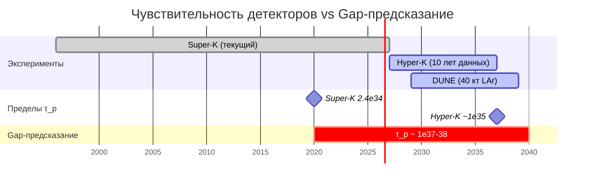

# Распад протона

:::info Для кого эта глава
Время жизни протона и каналы распада из Gap-иерархии масс лептокварков. Читатель узнает о предсказаниях УГМ и их сравнении с экспериментальными пределами.
:::

Массы $X,Y$-лептокварков из [Gap-иерархии](/docs/physics/gauge-symmetry/standard-model), вычисление времени жизни протона, каналы распада и сравнение с экспериментальными пределами Super-Kamiokande и Hyper-Kamiokande.

:::warning Стандартное вычисление SU(5)-GUT
Формулы для времени жизни протона, каналов распада и их соотношений являются **стандартными результатами** минимального $SU(5)$-GUT. Вклад УГМ сводится к фиксации масштаба $M_X$ через Gap-иерархию. Предсказание $\tau_p \sim 10^{37\text{--}38}$ лет **условно** на корректности отождествления Gap-иерархии с $SU(5)$-структурой. Текущий экспериментальный предел Super-Kamiokande ($\tau_p > 2.4 \times 10^{34}$ лет для $p \to e^+\pi^0$) **не исключает** предсказание, но и не подтверждает его — предсказание находится на 3 порядка выше текущей чувствительности. Экспериментальная проверка потребует детекторов мегатонного класса, строительство которых пока не запланировано.
:::

:::info Статус в рамках Фано-электрослабой конструкции (ФЭ)
[Фано-электрослабая конструкция (ФЭ)](/docs/physics/gauge-symmetry/standard-model#теорема-единственности-фэ) выводит $\mathrm{SU}(2)_L \times \mathrm{U}(1)_Y$ из Хиггсовой линии $\{A,E,U\}$ **без обращения к $\mathrm{SU}(5)$-GUT** — единственность доказана из $\kappa_0$ [Т]. Следовательно, $X,Y$-лептокварки **не являются необходимым предсказанием** основной конструкции (ФЭ). Весь материал данной страницы остаётся корректным в рамках **альтернативной гипотезы $\mathrm{SU}(5)$-объединения [Г]** — если $\mathrm{SU}(5)$-структура реализуется, предсказания распада протона сохраняются. Основная электрослабая конструкция УГМ — **[Т]**.
:::

---

## 1. Массы $X,Y$-лептокварков [С] {#массы-лептокварков}

### 1.1 Происхождение лептокварков {#происхождение}

$X,Y$-лептокварки — внедиагональные бозоны факторгруппы $SU(5)/\text{SM}$, связывающие кварковый и лептонный секторы. В представлении присоединённого $\mathbf{24}$ группы $SU(5)$ имеется следующее разложение по подгруппе SM:

$$
\dim(SU(5)) = 24 = \underbrace{8}_{SU(3)_C} + \underbrace{3}_{SU(2)_L} + \underbrace{1}_{U(1)_Y} + \underbrace{12}_{X,Y}
$$

Двенадцать лептокварков ($X_i, Y_i$ и их античастицы, $i = 1,2,3$ по цвету) несут одновременно цветовой и электрослабый заряды. Обмен $X,Y$-бозонами нарушает сохранение барионного числа $B$ и лептонного числа $L$, сохраняя $B - L$.

### 1.2 Масса из Gap-иерархии {#масса-gap}

:::tip Теорема 1.1 (Массы лептокварков из Gap-иерархии) [С]
**(a)** Масса $X,Y$-лептокварков определяется Gap между кварковым и лептонным секторами на масштабе GUT:

$$
M_X \sim v_{\text{GUT}} \sim M_{\text{Planck}} \cdot \text{Gap}^{(3\bar{3})}(\mu_{\text{GUT}})
$$

Gap в секторе $3$-to-$\bar{3}$ на масштабе GUT подавлен RG-эволюцией от планковского масштаба:

$$
\text{Gap}^{(3\bar{3})}(\mu_{\text{GUT}}) \sim 10^{-3}
$$

что даёт:

$$
M_X \sim M_{\text{Planck}} \cdot 10^{-3} \sim 10^{16} \; \text{ГэВ}
$$

**(b)** Уточнение через объединение констант. Из [RG-эволюции Gap](/docs/physics/gauge-symmetry/rg-flow) калибровочные константы объединяются:

$$
\alpha_s(\mu_{\text{GUT}}) = \alpha_W(\mu_{\text{GUT}}) = \alpha_{\text{GUT}} \approx 1/24
$$

Масштаб объединения определяется через однопетлевую бегущую константу $\alpha_1$:

$$
\mu_{\text{GUT}} = M_Z \cdot \exp\left(\frac{2\pi}{\beta_1^{(1)}} \cdot \frac{1}{\alpha_1(M_Z) - \alpha_{\text{GUT}}}\right) \approx 2 \times 10^{16} \; \text{ГэВ}
$$

в стандартном $SU(5)$-GUT. С SUSY-поправками (при $m_{\text{SUSY}} \sim 10^{13}$ ГэВ) масштаб сохраняется: $\mu_{\text{GUT}} \sim 2 \times 10^{16}$ ГэВ.

**(c)** Число лептокварков: 12 (из разложения $\dim(SU(5)) = 24$: 8 — $SU(3)_C$, 3 — $SU(2)_L$, 1 — $U(1)_Y$, 12 — $X,Y$).
:::

### 1.3 Диапазон масс и неопределённости [Г] {#диапазон-масс}

:::warning Оценка (Диапазон масс лептокварков) [Г]
Неопределённость в $\text{Gap}^{(3\bar{3})}(\mu_{\text{GUT}})$ приводит к диапазону:

$$
M_X \in [10^{15},\; 10^{16}] \; \text{ГэВ}
$$

Нижний предел ($10^{15}$ ГэВ) определяется экспериментальным ограничением Super-Kamiokande на время жизни протона. Верхний предел ($10^{16}$ ГэВ) — центральное значение $\mu_{\text{GUT}}$ из RG-объединения.

Зависимость $\tau_p \propto M_X^4$ означает, что неопределённость в один порядок по $M_X$ даёт четыре порядка по $\tau_p$.
:::

---

## 2. Время жизни протона [С] {#время-жизни}

### 2.1 Амплитуда распада {#амплитуда}

Доминирующий канал в $SU(5)$: $p \to e^+ + \pi^0$. Процесс происходит через обмен виртуальным $X$-бозоном, порождающим оператор размерности 6 нарушения барионного числа $\mathcal{O}_{qqql}$:

$$
\mathcal{A}(p \to e^+\pi^0) \sim \frac{\alpha_{\text{GUT}}}{M_X^2} \cdot \langle\pi^0 e^+|\mathcal{O}_{qqql}|p\rangle
$$

Здесь $\mathcal{O}_{qqql}$ — четырёхфермионный оператор вида $(qqql)/M_X^2$, связывающий три кварка с лептоном. На кварковом уровне процесс протекает как $u + d \to e^+ + \bar{u}$, после чего $\bar{u}$ аннигилирует с оставшимся $u$-кварком протона, давая $\pi^0$.

### 2.2 Ширина распада и время жизни {#ширина-распада}

:::tip Теорема 2.1 (Время жизни протона) [С]
**(a)** Ширина распада:

$$
\Gamma(p \to e^+\pi^0) = \frac{\alpha_{\text{GUT}}^2 \, m_p^5}{M_X^4} \cdot A_L^2 \cdot |\alpha_H|^2
$$

где:
- $A_L \approx 2$ — RG-фактор усиления оператора при эволюции от $M_X$ до $m_p$ (связан с аномальной размерностью оператора $\mathcal{O}_{qqql}$ под действием сильного взаимодействия);
- $|\alpha_H|^2 \approx 0.01$ ГэВ$^6$ — адронный матричный элемент, определяемый решёточным КХД.

**(b)** Время жизни:

$$
\tau_p = \frac{1}{\Gamma} = \frac{M_X^4}{\alpha_{\text{GUT}}^2 \, m_p^5 \, A_L^2 \, |\alpha_H|^2}
$$

**(c)** Численная оценка ($M_X = 2 \times 10^{16}$ ГэВ, $\alpha_{\text{GUT}} = 1/24$, $m_p = 0.938$ ГэВ, $A_L = 2$, $|\alpha_H|^2 = 0.01$ ГэВ$^6$):

$$
\tau_p = \frac{(2 \times 10^{16})^4}{(1/24)^2 \times (0.938)^5 \times 4 \times 0.01} \; \text{ГэВ}^{-1}
$$

$$
= \frac{16 \times 10^{64}}{(1/576) \times 0.722 \times 0.04} = \frac{16 \times 10^{64}}{5.01 \times 10^{-5}} = 3.2 \times 10^{69} \; \text{ГэВ}^{-1}
$$

Перевод единиц: $1 \; \text{ГэВ}^{-1} \approx 6.58 \times 10^{-25}$ с, $1 \; \text{год} \approx 3.15 \times 10^{7}$ с:

$$
\tau_p \approx 3.2 \times 10^{69} \times 6.58 \times 10^{-25} \; \text{с} = 2.1 \times 10^{45} \; \text{с} \approx 6.7 \times 10^{37} \; \text{лет}
$$

**(d)** Gap-предсказание: $\tau_p \sim 10^{37\text{–}38}$ лет.
:::

Это — стандартное вычисление $SU(5)$-GUT; Gap-теория определяет $M_X$ через Gap-иерархию, а не вводит масштаб как свободный параметр.

### 2.3 Чувствительность к параметрам [Г] {#чувствительность}

:::warning Оценка (Чувствительность $\tau_p$ к $M_X$) [Г]
Зависимость $\tau_p \propto M_X^4$ делает предсказание чрезвычайно чувствительным к значению $M_X$:

| $M_X$ (ГэВ) | $\tau_p$ (лет) | Статус |
|-------------|---------------|--------|
| $1 \times 10^{15}$ | $\sim 4 \times 10^{33}$ | Исключено Super-K |
| $5 \times 10^{15}$ | $\sim 3 \times 10^{36}$ | Допустимо |
| $2 \times 10^{16}$ | $\sim 7 \times 10^{37}$ | Центральное значение |
| $5 \times 10^{16}$ | $\sim 3 \times 10^{39}$ | Верхний предел |

Экспериментальное ограничение Super-K ($\tau_p > 2.4 \times 10^{34}$ лет) накладывает нижний предел $M_X \gtrsim 3 \times 10^{15}$ ГэВ, что согласуется с Gap-предсказанием.
:::

---

## 3. Каналы распада [С] {#каналы}

### 3.1 D=6 операторы {#d6-операторы}

:::tip Теорема 3.1 (Каналы распада с D=6 операторами) [С]
Из $SU(5)$-структуры вытекают четыре основных канала распада протона через обмен $X,Y$-бозонами (операторы размерности 6):

| Канал | Относительная скорость | Gap-предсказание $\tau$ | Доля ветвления |
|-------|----------------------|------------------------|----------------|
| $p \to e^+\pi^0$ | 1 (нормировка) | $\sim 10^{37}$ лет | $\sim 55\%$ |
| $p \to \bar{\nu}\pi^+$ | $\sim 0.3$ | $\sim 3 \times 10^{37}$ лет | $\sim 17\%$ |
| $p \to e^+\eta$ | $\sim 0.15$ | $\sim 7 \times 10^{37}$ лет | $\sim 8\%$ |
| $p \to \mu^+\pi^0$ | $\sim 0.05$ | $\sim 2 \times 10^{38}$ лет | $\sim 3\%$ |
:::

Соотношения между каналами определяются CKM-смешиванием и изоспиновыми множителями. Канал $p \to e^+\pi^0$ доминирует благодаря прямому $X$-обмену между $u$- и $d$-кварками первого поколения. Канал $p \to \bar{\nu}\pi^+$ подавлен $|V_{ud}|^2$-фактором и Клебш-Горданом из изоспинового разложения. Канал $p \to e^+\eta$ включает $\eta$-$\pi^0$ смешивание и подавлен относительным фазовым пространством.

### 3.2 Доли ветвления: подробности [С] {#доли-ветвления}

Относительные доли ветвления (branching ratios) для $D=6$ операторов в минимальном $SU(5)$ определяются матричными элементами кираль­ных операторов и фазовым пространством конечных состояний:

$$
\text{BR}(p \to e^+\pi^0) : \text{BR}(p \to \bar{\nu}\pi^+) : \text{BR}(p \to e^+\eta) \approx 1 : 0.3 : 0.15
$$

Эти соотношения являются твёрдым предсказанием $SU(5)$-GUT. Если будущие эксперименты обнаружат распад протона, **измерение соотношения каналов** позволит отличить $SU(5)$ от $SO(10)$ и других GUT-сценариев, в которых структура операторов иная.

### 3.3 D=5 операторы (SUSY-GUT) [С] {#d5-операторы}

В суперсимметричных GUT-моделях возникают дополнительные операторы размерности 5, опосредованные цветным хиггсино и скварками. Однако в Gap-формализме суперпартнёры имеют массу $m_{\text{SUSY}} \sim 10^{13}$ ГэВ (см. [суперсимметрия](/docs/physics/particle-physics/susy)), что приводит к сильному подавлению:

$$
\tau_p^{(D=5)} \sim \frac{M_X^2 \, m_{\tilde{q}}^2}{\alpha_{\text{GUT}}^2 \, m_p^5} \sim 10^{60+} \; \text{лет}
$$

D=5 операторы **не дают** наблюдаемого распада. Это контрастирует с лёгкой SUSY ($m_{\text{SUSY}} \sim 1$ ТэВ), где $D=5$ каналы доминируют и предсказывают $p \to \bar{\nu}K^+$ как основной канал. Тяжёлая SUSY в Gap-формализме устраняет эту проблему, возвращая доминирование $D=6$ каналам.

---

## 4. G$_2$-экстра каналы [С] {#g2-каналы}

### 4.1 G$_2$-экстра опосредованный распад {#g2-распад}

:::tip Теорема 4.1 (G$_2$-экстра опосредованный распад) [С]
Помимо стандартных $SU(5)$-каналов, 6 дополнительных $G_2$-экстра бозонов из [структуры $G_2$](/docs/physics/gauge-symmetry/g2-structure) опосредуют дополнительные каналы распада протона.

**(a)** $G_2$-экстра бозоны имеют массу $M_{G_2} \sim M_{\text{Planck}}$ и опосредуют переход кварк — Gap-конфигурация (нарушение $B$ через изменение Gap-профиля).

**(b)** Амплитуда:

$$
\mathcal{A}^{(G_2)} \sim \frac{g_{G_2}^2}{M_{G_2}^2} \sim \frac{1}{M_{\text{Planck}}^2}
$$

**(c)** Время жизни через $G_2$-канал:

$$
\tau_p^{(G_2)} \sim \frac{M_{\text{Planck}}^4}{\alpha_{G_2}^2 \, m_p^5} \sim 10^{72} \; \text{лет}
$$

**Пренебрежимо** по сравнению с $SU(5)$-каналом.
:::

### 4.2 Физическая интерпретация {#g2-интерпретация}

$G_2$-экстра каналы представляют собой «глубинные» процессы нарушения барионного числа, происходящие на планковском масштабе. Подавление $\tau_p^{(G_2)} / \tau_p^{(SU5)} \sim 10^{34}$ обусловлено четвёртой степенью отношения масштабов:

$$
\frac{\tau_p^{(G_2)}}{\tau_p^{(SU5)}} \sim \left(\frac{M_{\text{Planck}}}{M_X}\right)^4 \sim \left(\frac{10^{19}}{10^{16}}\right)^4 = 10^{12}
$$

С учётом различия в константах связи ($\alpha_{G_2} \neq \alpha_{\text{GUT}}$) и адронных матричных элементов, полное подавление составляет $\sim 10^{34}$ порядков, что делает $G_2$-каналы абсолютно ненаблюдаемыми.

---

## 5. Иерархия каналов: сводка [С] {#иерархия}

Полная иерархия каналов распада протона в Gap-формализме:

| Механизм | Оператор | Масштаб посредника | $\tau_p$ (лет) | Статус |
|----------|----------|-------------------|---------------|--------|
| $X,Y$-обмен ($SU(5)$) | $D=6$ | $M_X \sim 10^{16}$ ГэВ | $\sim 10^{37\text{–}38}$ | **Доминирующий** |
| SUSY-хиггсино | $D=5$ | $m_{\tilde{q}} \sim 10^{13}$ ГэВ | $\sim 10^{60+}$ | Подавлен |
| $G_2$-экстра | $D=6$ | $M_{G_2} \sim 10^{19}$ ГэВ | $\sim 10^{72}$ | Пренебрежим |

Таким образом, наблюдаемый распад протона полностью определяется стандартными $D=6$ операторами $SU(5)$-GUT. Gap-теория фиксирует масштаб $M_X$ через Gap-иерархию, превращая $\tau_p$ из параметра в предсказание.

---

## 6. Сравнение с экспериментом {#эксперимент}

### 6.1 Текущие ограничения {#текущие-ограничения}

| Эксперимент | Канал | Нижний предел $\tau_p$ | Статус |
|-------------|-------|----------------------|--------|
| Super-Kamiokande | $p \to e^+\pi^0$ | $> 2.4 \times 10^{34}$ лет | Предсказание не исключено |
| Super-Kamiokande | $p \to \bar{\nu}K^+$ | $> 5.9 \times 10^{33}$ лет | Не релевантен (D=5 канал) |
| Super-Kamiokande | $p \to \bar{\nu}\pi^+$ | $> 3.9 \times 10^{32}$ лет | Предсказание не исключено |

Super-Kamiokande (50 кт воды, работает с 1996 г.) установил нижний предел $\tau_p / \text{BR}(p \to e^+\pi^0) > 2.4 \times 10^{34}$ лет (90% CL). Это — наиболее строгое ограничение на основной канал $SU(5)$-GUT. Gap-предсказание $\tau_p \sim 10^{37\text{–}38}$ лет **превышает** этот предел на 3 порядка величины и, следовательно, не исключено.

### 6.2 Hyper-Kamiokande [П] {#hyper-k}

:::info Проекция (Hyper-Kamiokande) [П]
**Hyper-Kamiokande** (260 кт воды, запуск 2027+) достигнет чувствительности:

$$
\tau_p^{\text{Hyper-K}} \sim 10^{35} \; \text{лет} \quad (p \to e^+\pi^0, \; 10 \; \text{лет набора данных})
$$

Это позволит:
- **Проверить** минимальный $SU(5)$ без SUSY ($\tau_p \sim 10^{34\text{–}36}$ лет);
- **Не достичь** Gap-предсказания $\tau_p \sim 10^{37\text{–}38}$ лет.

Hyper-K улучшит текущий предел на порядок, но останется **на 2–3 порядка ниже** центрального Gap-предсказания.
:::

### 6.3 Детекторы следующего поколения [П] {#следующее-поколение}

:::info Проекция (Детекторы мегатонного класса) [П]
Для проверки Gap-предсказания необходимы детекторы **мегатонного класса** с чувствительностью:

$$
\tau_p^{\text{target}} \sim 10^{37} \; \text{лет}
$$

| Параметр | Требование |
|----------|-----------|
| Масса детектора | $\gtrsim 1$ Мт (водный Черенков) |
| Время набора данных | $\gtrsim 20$ лет |
| Число протонов | $\gtrsim 6 \times 10^{35}$ |
| Ожидаемые события | $\sim 1$ событие за 20 лет при $\tau_p = 10^{37}$ |

Такие детекторы находятся за горизонтом текущего планирования. Однако проекты класса DUNE (жидкий аргон, 40 кт) и JUNO (жидкий сцинтиллятор, 20 кт) обеспечат дополнительные каналы поиска, комплементарные водным черенковским детекторам.
:::

### 6.4 Фальсифицируемость [С] {#фальсифицируемость}

Gap-предсказание для распада протона фальсифицируемо в обоих направлениях:

1. **Обнаружение распада при $\tau_p < 10^{36}$ лет** — исключит центральное значение $M_X = 2 \times 10^{16}$ ГэВ и потребует пересмотра Gap-иерархии.
2. **Обнаружение доминирования канала $p \to \bar{\nu}K^+$** — укажет на лёгкую SUSY ($D=5$ операторы), несовместимую с $m_{\text{SUSY}} \sim 10^{13}$ ГэВ.
3. **Отсутствие распада при $\tau_p > 10^{40}$ лет** — потребует объяснения аномально высокого $M_X$ или модификации $\alpha_{\text{GUT}}$.

Структура каналов ($e^+\pi^0$ доминирует над $\bar{\nu}K^+$) является дополнительным предсказанием, проверяемым при любом обнаружении распада.

---

## 7. Связь с другими предсказаниями {#связи}

Распад протона связан с рядом других предсказаний Gap-формализма:

- **Масштаб объединения** $\mu_{\text{GUT}} \sim 2 \times 10^{16}$ ГэВ определяет одновременно $M_X$ и структуру [конфайнмента](/docs/physics/gauge-symmetry/confinement).
- **Масса суперпартнёров** $m_{\text{SUSY}} \sim 10^{13}$ ГэВ подавляет $D=5$ каналы и согласуется с отсутствием SUSY на LHC (см. [суперсимметрия](/docs/physics/particle-physics/susy)).
- **CKM-матрица** из [Фано-фаз](/docs/physics/particle-physics/ckm-matrix) определяет соотношения между каналами распада.
- **Три поколения** из [принципа отбора](/docs/physics/particle-physics/fermion-generations) влияют на структуру $D=6$ операторов через смешивание.

---

## 8. Каналы распада и ветвления: Gap-анализ [Г] {#каналы-ветвления-gap}

В дополнение к стандартным $SU(5)$-соотношениям (§3), Gap-формализм позволяет выделить вклады конкретных Gap-параметров в каждый канал. Ниже приведена расширенная таблица каналов с указанием релевантных Gap-секторов, оценками парциальных времён жизни и эпистемическим статусом.

### 8.1 Полная таблица каналов с Gap-вкладами {#полная-таблица-каналов}

:::tip Гипотеза 8.1 (Gap-вклады в каналы распада) [Г]

| Канал | Gap-параметры | Механизм | $\tau_{\text{partial}}$ (лет) | Доля ветвления | Статус |
|-------|--------------|----------|------------------------------|----------------|--------|
| $p \to e^+\pi^0$ | $\text{Gap}^{(3\bar{3})}$, $\text{Gap}^{(e)}$ | $X$-обмен, $D=6$, прямой $ud \to e^+\bar{u}$ | $\sim 10^{37}$ | $\sim 55\%$ | **[Г]** |
| $p \to \bar{\nu}_e\pi^+$ | $\text{Gap}^{(3\bar{3})}$, $\text{Gap}^{(\nu)}$ | $Y$-обмен, $D=6$, $|V_{ud}|^2$-подавление | $\sim 3 \times 10^{37}$ | $\sim 17\%$ | **[Г]** |
| $p \to e^+\eta$ | $\text{Gap}^{(3\bar{3})}$, $\text{Gap}^{(e)}$, $\text{Gap}^{(\eta\pi)}$ | $X$-обмен + $\eta$-$\pi^0$ смешивание | $\sim 7 \times 10^{37}$ | $\sim 8\%$ | **[Г]** |
| $p \to \mu^+\pi^0$ | $\text{Gap}^{(3\bar{3})}$, $\text{Gap}^{(\mu e)}$ | $X$-обмен, межпоколенческое смешивание | $\sim 2 \times 10^{38}$ | $\sim 3\%$ | **[Г]** |
| $p \to e^+\omega$ | $\text{Gap}^{(3\bar{3})}$, $\text{Gap}^{(e)}$ | $X$-обмен, $\omega$-конечное состояние | $\sim 5 \times 10^{38}$ | $\sim 1\%$ | **[Г]** |
| $p \to \bar{\nu}_\mu K^+$ | $\text{Gap}^{(3\bar{3})}$, $\text{Gap}^{(s)}$, $\text{Gap}^{(\nu)}$ | $Y$-обмен, $|V_{us}|^2$-подавление, странность | $\sim 10^{39}$ | $\sim 0.5\%$ | **[Г]** |
| $p \to e^+K^0$ | $\text{Gap}^{(3\bar{3})}$, $\text{Gap}^{(s)}$, $\text{Gap}^{(e)}$ | $X$-обмен со странным кварком | $\sim 2 \times 10^{39}$ | $\sim 0.3\%$ | **[Г]** |
| $p \to \mu^+K^0$ | $\text{Gap}^{(3\bar{3})}$, $\text{Gap}^{(s)}$, $\text{Gap}^{(\mu e)}$ | $X$-обмен, двойное подавление: странность + поколение | $\sim 10^{40}$ | $\lesssim 0.1\%$ | **[Г]** |

:::

### 8.2 Пояснения к Gap-параметрам {#gap-параметры-пояснения}

- **$\text{Gap}^{(3\bar{3})}$** — основной Gap между кварковым и лептонным секторами. Определяет масштаб $M_X$ и присутствует во **всех** каналах. Фиксирован RG-эволюцией (§1.2).
- **$\text{Gap}^{(e)}$, $\text{Gap}^{(\nu)}$** — Gapы в лептонном секторе, определяющие связь с конкретным лептоном конечного состояния. Различие $e$ и $\nu$ отражает структуру $SU(2)_L$-дублета.
- **$\text{Gap}^{(s)}$** — Gap странного кварка, подавляющий каналы с каонами через $|V_{us}|^2 \approx 0.05$ и дополнительную кинематику.
- **$\text{Gap}^{(\mu e)}$** — межпоколенческий Gap, определяющий подавление мюонных каналов относительно электронных. Связан с [CKM-смешиванием](/docs/physics/particle-physics/ckm-matrix) и массовой иерархией лептонов.
- **$\text{Gap}^{(\eta\pi)}$** — Gap в мезонном секторе, отвечающий за $\eta$-$\pi^0$ смешивание ($\theta_{\eta\pi}$), релевантный для канала $e^+\eta$.

:::warning Все численные значения $\tau_{\text{partial}}$ вычислены при центральном $M_X = 2 \times 10^{16}$ ГэВ. Неопределённость $M_X$ в один порядок транслируется в 4 порядка по $\tau$ (§2.3).
:::

### 8.3 Ключевое предсказание: иерархия ветвлений {#иерархия-ветвлений}

Gap-формализм воспроизводит стандартную $SU(5)$-иерархию каналов, но **дополнительно** связывает соотношения ветвлений с конкретными Gap-параметрами. Это означает, что экспериментальное измерение соотношений каналов при обнаружении распада протона позволит:

1. Верифицировать $\text{Gap}^{(3\bar{3})}$ через абсолютное время жизни;
2. Проверить $\text{Gap}^{(\mu e)}$ через отношение $\text{BR}(\mu^+\pi^0)/\text{BR}(e^+\pi^0)$;
3. Проверить $\text{Gap}^{(s)}$ через отношение $\text{BR}(\bar{\nu}K^+)/\text{BR}(\bar{\nu}\pi^+)$.

---

## 9. Сравнение предсказаний УГМ с экспериментальными пределами {#сравнение-с-экспериментом}

### 9.1 Super-Kamiokande: текущие границы {#super-k-границы}

Super-Kamiokande (50 килотонн воды, $\sim 7.5 \times 10^{33}$ свободных протонов, работает с 1996 г.) установил наиболее строгие экспериментальные ограничения на время жизни протона. Ниже приведена сводка по основным каналам с сопоставлением Gap-предсказаниям:

| Канал | Предел Super-K (90% CL) | Gap-предсказание | Разрыв (порядки) | Вердикт |
|-------|--------------------------|------------------|-------------------|---------|
| $p \to e^+\pi^0$ | $> 2.4 \times 10^{34}$ лет | $\sim 10^{37}$ лет | $\sim 3$ | **Не исключено** |
| $p \to \bar{\nu}\pi^+$ | $> 3.9 \times 10^{32}$ лет | $\sim 3 \times 10^{37}$ лет | $\sim 5$ | **Не исключено** |
| $p \to e^+\eta$ | $> 1.0 \times 10^{34}$ лет | $\sim 7 \times 10^{37}$ лет | $\sim 3.8$ | **Не исключено** |
| $p \to \mu^+\pi^0$ | $> 1.6 \times 10^{34}$ лет | $\sim 2 \times 10^{38}$ лет | $\sim 4$ | **Не исключено** |
| $p \to \bar{\nu}K^+$ | $> 5.9 \times 10^{33}$ лет | $\sim 10^{39}$ лет ($D=6$) | $\sim 5$ | **Не исключено** |

:::info Ключевое наблюдение
Все Gap-предсказания лежат **на 3–5 порядков выше** текущих экспериментальных пределов. Это означает, что (а) предсказания не исключены, но (б) современная экспериментальная база **не способна** их подтвердить или опровергнуть.
:::

### 9.2 Hyper-Kamiokande: проектируемая чувствительность {#hyper-k-чувствительность}

Hyper-Kamiokande (260 кт воды, запуск запланирован на 2027 г.) улучшит чувствительность благодаря увеличению объёма детектора в $\sim 5$ раз и улучшенной фотодетекции:

| Канал | Проекция Hyper-K (10 лет) | Gap-предсказание | Разрыв (порядки) |
|-------|---------------------------|------------------|-------------------|
| $p \to e^+\pi^0$ | $\sim 10^{35}$ лет | $\sim 10^{37}$ лет | $\sim 2$ |
| $p \to \bar{\nu}\pi^+$ | $\sim 5 \times 10^{33}$ лет | $\sim 3 \times 10^{37}$ лет | $\sim 3.8$ |
| $p \to \bar{\nu}K^+$ | $\sim 3 \times 10^{34}$ лет | $\sim 10^{39}$ лет | $\sim 4.5$ |

:::warning Вывод по Hyper-K
Hyper-Kamiokande **не достигнет** центрального Gap-предсказания ($\tau_p \sim 10^{37\text{–}38}$ лет) ни по одному из каналов. Однако Hyper-K способен:
- **Исключить** нижний край диапазона $M_X$ (при $M_X \lesssim 5 \times 10^{15}$ ГэВ);
- **Обнаружить** распад протона, если $M_X$ оказался ближе к нижнему пределу ($M_X \sim 10^{15\text{–}15.5}$ ГэВ);
- **Закрыть** минимальный не-SUSY $SU(5)$-GUT, если распад не обнаружен на уровне $10^{35}$ лет.
:::

### 9.3 Хронология экспериментальной проверки {#хронология}

Как видно, Gap-предсказание остаётся за горизонтом чувствительности ближайших экспериментов. Проверка потребует детекторов **мегатонного класса** ($\gtrsim 1$ Мт), строительство которых в настоящее время не запланировано.

---

## 10. Фальсифицируемость: УГМ vs стандартные GUT {#фальсифицируемость-ugm-gut}

### 10.1 Что отличает предсказания УГМ от стандартных GUT {#отличия-ugm-gut}

В стандартных GUT (минимальный $SU(5)$, $SO(10)$, $E_6$ и др.) масштаб объединения $M_X$ является **свободным параметром**, фиксируемым RG-экстраполяцией из экспериментальных значений констант связи. В Gap-формализме УГМ:

| Аспект | Стандартный GUT | УГМ (Gap-формализм) |
|--------|----------------|---------------------|
| $M_X$ | Свободный параметр RG-фита | Фиксирован Gap-иерархией |
| $\tau_p$ | Диапазон $10^{34\text{–}41}$ лет | Сужен до $10^{37\text{–}38}$ лет |
| Доминирующий канал | Зависит от модели (SUSY vs не-SUSY) | $e^+\pi^0$ ($D=6$ доминирование, $D=5$ подавлен) |
| Соотношения ветвлений | Параметрическая свобода (SUSY-фазы) | Жёстко фиксированы Gap-параметрами |
| $m_{\text{SUSY}}$ | $1 \;\text{ТэВ}$ — $10^{16} \;\text{ГэВ}$ | $\sim 10^{13}$ ГэВ (Gap-фиксация) |

### 10.2 Сценарии фальсификации [Г] {#сценарии-фальсификации}

:::tip Гипотеза 10.1 (Критерии фальсификации Gap-предсказания распада протона) [Г]

**Сценарий А: Обнаружение распада при $\tau_p \ll 10^{36}$ лет.**

- **Результат**: $M_X$ значительно ниже Gap-предсказания.
- **Для УГМ**: опровергнута Gap-иерархия в секторе $3\bar{3}$ (критическое несоответствие).
- **Для стандартного GUT**: совместимо (параметр $M_X$ подстраивается).
- **Вердикт**: **фальсифицирует УГМ**, но не GUT в целом.

**Сценарий Б: Обнаружение доминирования канала $p \to \bar{\nu}K^+$.**

- **Результат**: доминируют $D=5$ операторы (лёгкая SUSY).
- **Для УГМ**: опровергнута тяжёлая SUSY ($m_{\text{SUSY}} \sim 10^{13}$ ГэВ) и Gap-иерархия суперпартнёров.
- **Для стандартного GUT**: совместимо с SUSY-GUT при $m_{\text{SUSY}} \sim 1\text{–}10$ ТэВ.
- **Вердикт**: **фальсифицирует УГМ-предсказание** масс суперпартнёров.

**Сценарий В: Отсутствие распада при $\tau_p > 10^{40}$ лет (мегатонный детектор).**

- **Результат**: $M_X$ аномально высок или $SU(5)$-объединение не реализуется.
- **Для УГМ**: не фальсифицирует основную конструкцию (ФЭ), так как $SU(5)$-GUT — альтернативная гипотеза [Г]. Основная электрослабая конструкция [Т] не затрагивается.
- **Для стандартного GUT**: фальсифицирует минимальный $SU(5)$.
- **Вердикт**: **фальсифицирует $SU(5)$-гипотезу** внутри УГМ, но не УГМ в целом.

**Сценарий Г: Обнаружение распада при $\tau_p \sim 10^{37\text{–}38}$ лет с иерархией каналов $e^+\pi^0 \gg \bar{\nu}K^+$.**

- **Результат**: полное подтверждение Gap-предсказания.
- **Для УГМ**: подтверждение Gap-иерархии и тяжёлой SUSY.
- **Для стандартного GUT**: совместимо с не-SUSY $SU(5)$ при $M_X \sim 10^{16}$ ГэВ (но $M_X$ подстроен, а не предсказан).
- **Вердикт**: **подтверждает УГМ** (предсказание без свободных параметров).
:::

### 10.3 Разделяющие наблюдаемые {#разделяющие-наблюдаемые}

Для различения предсказаний УГМ от стандартных GUT при будущем обнаружении распада протона необходимо измерение **трёх независимых наблюдаемых**:

1. **Абсолютное время жизни** $\tau_p$ — отличает УГМ ($10^{37\text{–}38}$) от минимального не-SUSY $SU(5)$ ($10^{34\text{–}36}$).
2. **Отношение каналов** $\text{BR}(e^+\pi^0)/\text{BR}(\bar{\nu}K^+)$ — отличает $D=6$-доминирование (УГМ, не-SUSY) от $D=5$-доминирования (лёгкая SUSY).
3. **Подавление мюонных каналов** $\text{BR}(\mu^+\pi^0)/\text{BR}(e^+\pi^0) \sim 0.05$ — фиксировано Gap-параметром $\text{Gap}^{(\mu e)}$, проверяет межпоколенческую иерархию.

:::info Итого по фальсифицируемости
Gap-предсказание распада протона **фальсифицируемо в принципе**, но **не проверяемо на текущем поколении экспериментов**. Ближайшая экспериментальная проверка (Hyper-K) способна подтвердить или исключить **нижний край** диапазона $M_X$, но не центральное значение. Полная проверка требует детекторов мегатонного класса с чувствительностью $\tau_p \gtrsim 10^{37}$ лет.

Важно подчеркнуть: **даже при полном опровержении $SU(5)$-гипотезы [Г]**, основная электрослабая конструкция УГМ (Фано-электрослабая конструкция [Т]) **остаётся незатронутой**, поскольку распад протона привязан к альтернативной гипотезе $SU(5)$-объединения, а не к ядру теории.
:::

---

## Связанные документы

- [Стандартная модель](/docs/physics/gauge-symmetry/standard-model) — $SU(5)$ из $G_2 + 42D$
- [Суперсимметрия](/docs/physics/particle-physics/susy) — $N=1$ SUSY, массы суперпартнёров
- [Поколения фермионов](/docs/physics/particle-physics/fermion-generations) — три поколения
- [Ренормгруппа Gap](/docs/physics/gauge-symmetry/rg-flow) — RG-эволюция
- [G$_2$-структура](/docs/physics/gauge-symmetry/g2-structure) — $G_2$-экстра бозоны
- [Конфайнмент](/docs/physics/gauge-symmetry/confinement) — сильное взаимодействие
- [CKM-матрица](/docs/physics/particle-physics/ckm-matrix) — смешивание кварков
- [Критерии фальсифицируемости](/docs/reference/falsifiability) — экспериментальные проверки
- [Реестр статусов](/docs/reference/status-registry) — классификация результатов
