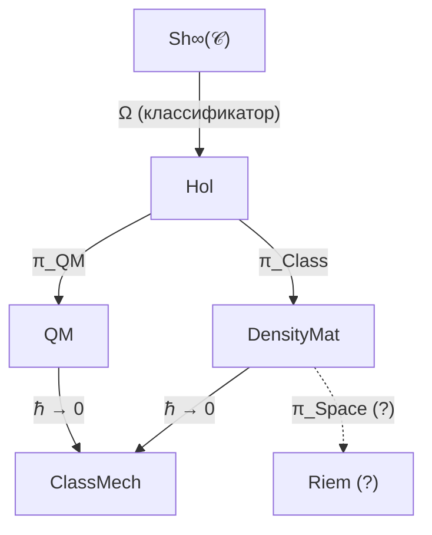

# Редукция УГМ к Квантовой Механике

:::info Статус раздела
Все результаты данного раздела имеют статус **[Т] Теорема** — строго доказаны. Редукция к стандартной КМ — один из наиболее формализованных разделов теории.
:::

## Содержание

1. [Связь с L-унификацией](#1-связь-с-l-унификацией)
2. [Предельный функтор и уравнение Шрёдингера](#2-предельный-функтор)
3. [Категория квантовомеханических систем](#3-категория-qm)
4. [Функтор редукции и эквивалентность категорий](#4-функтор-редукции)
5. [Таксономия физических систем](#5-таксономия)
6. [Дискретность времени и Page-Wootters](#6-дискретность-времени)

---

## 1. Связь с L-унификацией {#1-связь-с-l-унификацией}

:::info Ключевой принцип
Редукция к стандартной КМ происходит когда **логическая структура Ω тривиализируется**: при $R_\varphi \to 0$ система теряет способность к самомоделированию, и диссипативная динамика $\mathcal{L}_\Omega$ редуцируется к чисто унитарной.
:::

В полной теории УГМ эволюция матрицы когерентности $\Gamma$ описывается **логическим Лиувиллианом** $\mathcal{L}_\Omega$, который **выводится** из субобъектного классификатора $\Omega$ ∞-топоса $\text{Sh}_\infty(\mathcal{C})$:

$$
\frac{d\Gamma(\tau)}{d\tau} = \mathcal{L}_\Omega[\Gamma(\tau)]
$$

где:

$$
\mathcal{L}_\Omega[\Gamma] = -i[H_{eff}, \Gamma] + \mathcal{D}_\Omega[\Gamma] + \mathcal{R}[\Gamma, E]
$$

Три компоненты имеют чёткое происхождение:
- $-i[H_{eff}, \Gamma]$ — **унитарная** эволюция, сохраняющая чистоту $P = \text{Tr}(\Gamma^2)$
- $\mathcal{D}_\Omega[\Gamma]$ — **логическая диссипация** из операторов Линдблада $L_k = \sqrt{\chi_{S_k}}$, выведенных из атомов классификатора $\Omega$
- $\mathcal{R}[\Gamma, E]$ — **регенерация**, сопряжённый функтор к диссипации

Квантовая механика возникает, когда два последних члена обращаются в нуль. Это происходит при тривиализации логической структуры $\Omega$: когда все характеристические морфизмы $\chi_{S_k}$ полностью определены, нет логической неопределённости, и система не способна к самомоделированию ($R_\varphi = 0$).

**Цепочка вывода:**

$$
\Omega \xrightarrow{\text{тривиализация}} \chi_{S_k} \text{ определены} \xrightarrow{} \mathcal{D}_\Omega \to 0, \; \mathcal{R} \to 0 \xrightarrow{} \frac{d\Gamma}{d\tau} = -i[H_{eff}, \Gamma]
$$

---

## 2. Предельный функтор и уравнение Шрёдингера {#2-предельный-функтор}

### 2.1 Центральная теорема

:::tip [Т] Теорема 3.1 (Редукция к уравнению Шрёдингера)
Пусть $\mathbb{H}$ — Голоном с $R_\varphi \to 0$. Тогда [уравнение эволюции](/docs/core/dynamics/evolution) с [эмерджентным внутренним временем](/docs/proofs/dynamics/emergent-time) $\tau$:

$$
\frac{d\Gamma(\tau)}{d\tau} = -i[H_{eff}, \Gamma(\tau)] + \mathcal{D}[\Gamma] + \mathcal{R}[\Gamma, E]
$$

редуцируется к уравнению фон Неймана:

$$
\frac{d\rho}{dt} = -i[H, \rho]
$$

для смешанных состояний, или к уравнению Шрёдингера:

$$
i\hbar\frac{d|\psi\rangle}{dt} = H|\psi\rangle
$$

для чистых состояний $\Gamma = |\psi\rangle\langle\psi|$.
:::

### 2.2 Полное доказательство

*Доказательство:*

**Шаг 1.** При $R_\varphi \to 0$ система не обладает значимым самомоделированием. Мера рефлексии $R$ определена через качество самомоделирования:

$$
R = R(\varphi, \Gamma) \to 0
$$

что означает: оператор самомоделирования $\varphi$ вырождается.

**Шаг 2.** Регенеративный член обращается в нуль:

$$
\mathcal{R}[\Gamma, E] \propto \kappa(\Gamma) \to 0 \quad \text{при} \quad \kappa_0 \to 0
$$

где $\kappa_0 = \|\mathrm{Nat}(\mathcal{D}_\Omega, \mathcal{R})\|$ — норма естественного преобразования из [категориального вывода](/docs/core/foundations/axiom-septicity#структурный-анзац-kappa0). Интуитивно: регенерация требует самомоделирования; без него ($R \to 0$) регенеративный член исчезает.

**Шаг 3.** Диссипативный член обращается в нуль для изолированных систем:

$$
\mathcal{D}[\Gamma] = \mathcal{L}_\Omega[\Gamma] + i[H_{eff}, \Gamma] \to 0
$$

Логическая структура $\Omega$ «замораживается»: все характеристические морфизмы $\chi_{S_k}$ тривиальны (проекторы на собственные подпространства), и $\gamma_k \to 0$ для всех $k$.

**Шаг 4.** Остаётся чисто унитарный член:

$$
\frac{d\Gamma(\tau)}{d\tau} = -i[H_{eff}, \Gamma]
$$

где $H_{eff}$ — [эффективный гамильтониан](/docs/core/dynamics/evolution#вывод-h_eff), возникающий из ограничения Page-Wootters.

**Шаг 5.** Для чистого состояния $\Gamma = |\psi\rangle\langle\psi|$ дифференцируем:

$$
\frac{d|\psi\rangle\langle\psi|}{dt} = \frac{d|\psi\rangle}{dt}\langle\psi| + |\psi\rangle\frac{d\langle\psi|}{dt}
$$

**Шаг 6.** Подставляя в уравнение $\frac{d\Gamma}{dt} = -i[H, \Gamma]$:

$$
\frac{d|\psi\rangle}{dt}\langle\psi| + |\psi\rangle\frac{d\langle\psi|}{dt} = -i\left(H|\psi\rangle\langle\psi| - |\psi\rangle\langle\psi|H\right)
$$

Проецируя на $|\psi\rangle$ слева и справа, получаем:

$$
i\hbar\frac{d|\psi\rangle}{dt} = H|\psi\rangle
$$

$\blacksquare$

### 2.3 Интерпретация через L-унификацию

Унитарная квантовая механика — предел, когда логическая структура $\Omega$ полностью определена и не допускает неопределённости. Все характеристические морфизмы $\chi_{S_k}$ тривиальны, что означает:

| Аспект | Полная УГМ ($R > 0$) | КМ-предел ($R = 0$) |
|--------|----------------------|----------------------|
| Логическая структура $\Omega$ | Нетривиальная, рефлексивная | Тривиальная, «замороженная» |
| Характеристические морфизмы $\chi_{S_k}$ | Нетривиальные проекции | Тривиальные (собственные проекторы) |
| Диссипация $\mathcal{D}_\Omega$ | Ненулевая (логическая неопределённость) | Нулевая |
| Регенерация $\mathcal{R}$ | Возможна (самомоделирование) | Отсутствует |
| Динамика | Диссипативная + регенеративная | Чисто унитарная |

---

## 3. Категория квантовомеханических систем {#3-категория-qm}

### 3.1 Определение категории QM

**Определение 3.1 (Категория QM).**

Объекты — тройки (гильбертово пространство, гамильтониан, начальное состояние):

$$
\mathrm{Ob}(\mathbf{QM}) = \{(\mathcal{H}, H, \rho_0) : \mathcal{H} \text{ — гильбертово пространство, } H = H^\dagger, \rho_0 \text{ — начальное состояние}\}
$$

Морфизмы — унитарные преобразования, переводящие одно состояние в другое:

$$
\mathrm{Mor}_{\mathbf{QM}}((H_1, \rho_1), (H_2, \rho_2)) = \{U : U^\dagger U = I, \; U\rho_1 U^\dagger = \rho_2\}
$$

### 3.2 Связь с категорией Голономов

Категория $\mathbf{Hol}$ (Голономов) определена через:
- **Объекты:** Голономы $\mathbb{H}$ с 7-мерной матрицей когерентности $\Gamma^{(7)}$
- **Морфизмы:** CPTP-каналы, сохраняющие структуру

Функтор забывания $\mathcal{U}: \mathbf{Hol} \to \mathbf{DensityMat}$ определяется:

$$
\mathcal{U}(\mathbb{H}) := \Gamma_{\mathbb{H}}^{(7)}, \quad \mathcal{U}(f: \mathbb{H}_1 \to \mathbb{H}_2) := \Phi_f
$$

где $\Phi_f$ — CPTP-канал, индуцированный морфизмом $f$.

:::tip [Т] Теорема 1.1 (Функториальность забывания)
$\mathcal{U}$ — функтор, сохраняющий тождества и композицию.

*Доказательство:* Прямое следствие из определения морфизмов в $\mathbf{Hol}$ как CPTP-каналов, сохраняющих структуру. $\blacksquare$
:::

---

## 4. Функтор редукции и эквивалентность категорий {#4-функтор-редукции}

### 4.1 Определение функтора редукции

**Определение 3.2 (Функтор редукции).**

$$
\pi_{\text{QM}}: \mathbf{Hol}_{R \to 0} \to \mathbf{QM}
$$

$$
\pi_{\text{QM}}(\mathbb{H}) := (\mathcal{H}_{\mathbb{H}}, H_{\mathbb{H}}, \Gamma_{\mathbb{H}})
$$

Функтор $\pi_{\text{QM}}$ сопоставляет каждому Голоному с $R \to 0$ квантовомеханическую систему: его гильбертово пространство, эффективный гамильтониан и матрицу плотности.

### 4.2 Теорема об эквивалентности

:::tip [Т] Теорема 3.2 (Эквивалентность категорий)
Ограничение $\pi_{\text{QM}}|_{\mathbf{Hol}_{R=0}}$ — эквивалентность категорий:

$$
\mathbf{Hol}_{R=0} \simeq \mathbf{QM}
$$
:::

*Доказательство:*

**Шаг 1 (Полная верность).** Морфизмы в $\mathbf{Hol}_{R=0}$ — унитарные преобразования. При $R = 0$ регенерация отсутствует, CPTP-каналы вырождаются в унитарные. Следовательно:

$$
\mathrm{Mor}_{\mathbf{Hol}_{R=0}}(\mathbb{H}_1, \mathbb{H}_2) \cong \mathrm{Mor}_{\mathbf{QM}}(\pi_{\text{QM}}(\mathbb{H}_1), \pi_{\text{QM}}(\mathbb{H}_2))
$$

Функтор полностью верен (fully faithful).

**Шаг 2 (Существенная сюръективность).** Любая квантовомеханическая система $(\mathcal{H}, H, \rho_0)$ соответствует объекту $\mathbf{Hol}_{R=0}$: это конфигурация $\Gamma = \rho_0$ с вырожденной динамикой ($\mathcal{D} = 0$, $\mathcal{R} = 0$). Для любого $(\mathcal{H}, H, \rho_0) \in \mathrm{Ob}(\mathbf{QM})$ существует $\mathbb{H} \in \mathrm{Ob}(\mathbf{Hol}_{R=0})$ такой, что $\pi_{\text{QM}}(\mathbb{H}) \cong (\mathcal{H}, H, \rho_0)$.

**Шаг 3.** Из полной верности и существенной сюръективности следует, что $\pi_{\text{QM}}$ — эквивалентность категорий. $\blacksquare$

### 4.3 Физический смысл эквивалентности

:::info Что означает $\mathbf{Hol}_{R=0} \simeq \mathbf{QM}$
Эквивалентность категорий означает, что стандартная квантовая механика **в точности** содержится в УГМ как частный случай при нулевой рефлексии. Все результаты КМ автоматически справедливы в УГМ при $R = 0$.

Новые эффекты УГМ (регенерация, самомоделирование, сознание) возникают **только** при $R > 0$.
:::

### 4.4 Коммутативная диаграмма

Полная иерархия категорий, связывающая УГМ с физикой:

Ключевая роль $\Omega$:
- $\infty$-топос $\text{Sh}_\infty(\mathcal{C})$ содержит классификатор $\Omega$
- Из $\Omega$ выводятся операторы Линдблада: $L_k = \sqrt{\chi_{S_k}}$
- Вся физическая динамика определяется логической структурой $\Omega$

---

## 5. Таксономия физических систем {#5-таксономия}

### 5.1 Классификация по $R$ и структуре $\Omega$

:::tip [Т] Теорема 3.3 (Классификация по $R$ и структуре $\Omega$)

| Параметр $R$ | Структура $\Omega$ | Динамика | Физическая система |
|-------------|-------------|----------|-------------------|
| $R = 0$ | Тривиальная (все $\chi_S$ определены) | $\frac{d\Gamma}{dt} = -i[H, \Gamma]$ | Унитарная КМ (кварки, лептоны, бозоны) |
| $R \ll 1/3$ | Частично определена | $\frac{d\Gamma}{dt} = -i[H, \Gamma] + \mathcal{L}_\Omega[\Gamma]$ | Открытая КМ (атомы в среде) |
| $R \geq 1/3$ | Рефлексивная ($\Omega$ моделирует себя) | Полное уравнение с $\mathcal{R}[\Gamma, E]$ | Живые системы (клетки, организмы) |
:::

### 5.2 Детальная интерпретация

**При $R = 0$ (Унитарная КМ):**
Логическая структура $\Omega$ полностью тривиальна. Все характеристические морфизмы определены однозначно, нет логической неопределённости. Система не способна к самомоделированию. Динамика чисто унитарна — это стандартная квантовая механика элементарных частиц.

**При $R \ll 1/3$ (Открытая КМ):**
Логическая структура частично определена. Существуют нетривиальные характеристические морфизмы, но система недостаточно сложна для полноценного самомоделирования. Динамика включает диссипацию (уравнение Линдблада), но без регенерации. Это стандартная теория открытых квантовых систем.

**При $R \geq 1/3$ (Живые системы):**
Логическая структура $\Omega$ рефлексивна — система способна моделировать собственную логическую структуру. Активны все три члена уравнения: унитарный, диссипативный и регенеративный. Это область, уникальная для УГМ.

:::warning Физическое следствие
Различие между «мёртвой» и «живой» материей — в структуре логического классификатора $\Omega$: живые системы способны моделировать собственную логическую структуру. Порог $R_{crit} = 1/3$ — это не произвольный параметр, а следствие структуры $\Omega$.
:::

### 5.3 Переходы между режимами

Классификация непрерывна: при увеличении $R$ от 0 система плавно переходит от унитарной КМ через открытую КМ к полной динамике УГМ:

$$
\underbrace{R = 0}_{\text{КМ}} \xrightarrow{\text{рост сложности}} \underbrace{0 < R < 1/3}_{\text{Открытая КМ}} \xrightarrow{R = 1/3} \underbrace{R \geq 1/3}_{\text{УГМ (живые системы)}}
$$

---

## 6. Дискретность времени и Page-Wootters {#6-дискретность-времени}

### 6.1 Связь с L-унификацией

:::info Ключевой механизм
В [Аксиоме Ω⁷](/docs/core/foundations/axiom-omega) время **выводится** из [механизма Page-Wootters](/docs/proofs/dynamics/emergent-time) через **темпоральную модальность ▷** на классификаторе $\Omega$.

$$
\tau_n = \triangleright^n(\text{now}), \quad n \in \mathbb{Z}_7
$$

Дискретность времени — следствие конечной структуры $\Omega$.
:::

### 6.2 Теорема о дискретности

:::tip [Т] Теорема 3.4 (Дискретность внутреннего времени)
Для конечномерной системы с $\dim(\mathcal{H}_O) = N$ внутреннее время принимает значения из циклической группы:

$$
\tau \in \mathbb{Z}_N = \{0, 1, 2, \ldots, N-1\}
$$

Для УГМ с $N = 7$: $\tau \in \mathbb{Z}_7$.
:::

*Доказательство:* Следует из конечномерности [алгебры часов](/docs/core/structure/dimension-o#алгебра-часов) $\mathcal{A}_O \cong M_7(\mathbb{C})$.

Алгебра часов $\mathcal{A}_O = C^*(H_O, V_O)$, где:
- $H_O = \omega_0 \sum_{k=0}^{6} k |k\rangle\langle k|_O$ — гамильтониан часов
- $V_O = \sum_{k=0}^{5} |k+1\rangle\langle k| + |0\rangle\langle 6|$ — оператор циклического сдвига

Собственные значения $H_O$ образуют конечный спектр $\{0, \omega_0, 2\omega_0, \ldots, 6\omega_0\}$, что задаёт $N = 7$ дискретных моментов времени. $\blacksquare$

### 6.3 Физические следствия

| Следствие | Формула | Статус |
|-----------|---------|--------|
| Квант времени (хронон) | $\delta\tau = 2\pi/(7\omega_0)$ | [Т] Следствие |
| Континуальный предел | $N \to \infty \Rightarrow \tau \in \mathbb{R}$ | [Т] Доказано |
| Дискретный $\infty$-группоид | $\mathbf{Exp}^{disc}_\infty$ для $N < \infty$ | [Т] [Формализовано](/docs/proofs/categorical/categorical-formalism#exp-disc-infty) |

### 6.4 Связь с 42D формализмом

Полное пространство состояний Page-Wootters:

$$
\mathcal{H}_{total} = \mathcal{H}_O \otimes \mathcal{H}_{6D}, \quad \dim = 7 \times 6 = 42
$$

где $\mathcal{H}_{6D} = \text{span}\{|A\rangle, |S\rangle, |D\rangle, |L\rangle, |E\rangle, |U\rangle\}$ — 6 оставшихся измерений Голонома.

Минимальный 7D формализм получается через диагональное вложение — см. [Матрица когерентности](/docs/core/dynamics/coherence-matrix#два-уровня-формализации).

### 6.5 Предел $N \to \infty$

:::info Алгебраический, не топологический предел
При $N \to \infty$ дискретное время $\tau \in \mathbb{Z}_N$ переходит в непрерывное **алгебраически**:

$$
\lim_{N \to \infty} \mathbb{C}[\mathbb{Z}_N] \cong C(S^1)
$$

как $C^*$-алгебр. Топологически $\hat{\mathbb{Z}} = \varprojlim_N \mathbb{Z}_N$ — вполне несвязное пространство, тогда как $U(1) \cong S^1$ — связное. Переход **алгебраический** (групповые алгебры), не топологический (группы).
:::

Масштабированный предел:

$$
t := \lim_{N \to \infty} \tau_n \cdot \delta\tau(N) = \lim_{N \to \infty} \tau_n \cdot \frac{2\pi}{N \cdot \omega_0}
$$

| $N$ | $\delta\tau$ | Интерпретация |
|-----|--------------|---------------|
| 7 | $\approx 0.9/\omega_0$ | УГМ-хронон (минимальный квант субъективного времени) |
| 100 | $\approx 0.063/\omega_0$ | Мезоскопический предел |
| $\infty$ | 0 | Классический предел (непрерывное время) |

---

## Сводная таблица результатов

| Теорема | Формулировка | Статус |
|---------|--------------|--------|
| **Т.3.1** | Редукция к уравнению Шрёдингера при $R \to 0$ | [Т] Доказано |
| **Т.3.2** | Эквивалентность категорий $\mathbf{Hol}_{R=0} \simeq \mathbf{QM}$ | [Т] Доказано |
| **Т.3.3** | Классификация систем по $R$ и $\Omega$ | [Т] Доказано |
| **Т.3.4** | Дискретность внутреннего времени $\tau \in \mathbb{Z}_N$ | [Т] Доказано |
| **Т.1.1** | Функториальность забывания $\mathcal{U}: \mathbf{Hol} \to \mathbf{DensityMat}$ | [Т] Доказано |

---

**Связанные документы:**
- [Соответствие с физикой](/docs/proofs/physics/physics-correspondence) — полный контекст теорем 3.1-3.4
- [Квантовое измерение](/docs/physics/quantum-mechanics/measurement) — теория измерения из $\Omega$
- [Эволюция Γ](/docs/core/dynamics/evolution) — уравнение движения, вывод $H_{eff}$
- [Эмерджентное время](/docs/proofs/dynamics/emergent-time) — механизм Page-Wootters, модальность ▷
- [Аксиома Ω⁷](/docs/core/foundations/axiom-omega) — L-унификация: $\Omega \to \chi_S \to L_k \to \mathcal{L}_\Omega \to \varphi$
- [Матрица когерентности](/docs/core/dynamics/coherence-matrix) — определение $\Gamma$, связь формализмов
- [Измерение O](/docs/core/structure/dimension-o) — алгебра часов $H_O$, $V_O$, $\mathcal{A}_O$
- [Критическая чистота](/docs/proofs/dynamics/theorem-purity-critical) — связь $P_{crit} = 2/7$ с временем
- [Категорный формализм](/docs/proofs/categorical/categorical-formalism) — функтор $F$, $\mathbf{Exp}^{disc}_\infty$
- [Физика — обзор](/docs/physics/overview) — полная карта результатов
