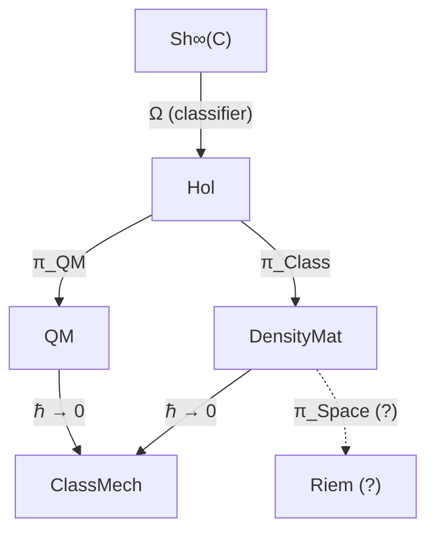

# Reduction of UHM to Quantum Mechanics

:::info Section Status
All results in this section have the status **[T] Theorem** — strictly proved. Reduction to standard QM is one of the most formalized sections of the theory.
:::

## Contents

1. [Connection to L-Unification](#1-связь-с-l-унификацией)
2. [Limit Functor and the Schrödinger Equation](#2-предельный-функтор)
3. [Category of Quantum-Mechanical Systems](#3-категория-qm)
4. [Reduction Functor and Category Equivalence](#4-функтор-редукции)
5. [Taxonomy of Physical Systems](#5-таксономия)
6. [Time Discreteness and Page–Wootters](#6-дискретность-времени)

---

## 1. Connection to L-Unification {#1-связь-с-l-унификацией}

:::info Key Principle
Reduction to standard QM occurs when **the logical structure Ω trivializes**: at $R_\varphi \to 0$ the system loses the capacity for self-modeling, and the dissipative dynamics $\mathcal{L}_\Omega$ reduces to purely unitary.
:::

In the full UHM theory, the evolution of the coherence matrix $\Gamma$ is described by the **logical Liouvillian** $\mathcal{L}_\Omega$, which is **derived** from the subobject classifier $\Omega$ of the ∞-topos $\text{Sh}_\infty(\mathcal{C})$:

$$
\frac{d\Gamma(\tau)}{d\tau} = \mathcal{L}_\Omega[\Gamma(\tau)]
$$

where:

$$
\mathcal{L}_\Omega[\Gamma] = -i[H_{eff}, \Gamma] + \mathcal{D}_\Omega[\Gamma] + \mathcal{R}[\Gamma, E]
$$

The three components have a clear origin:
- $-i[H_{eff}, \Gamma]$ — **unitary** evolution, preserving purity $P = \text{Tr}(\Gamma^2)$
- $\mathcal{D}_\Omega[\Gamma]$ — **logical dissipation** from Lindblad operators $L_k = \sqrt{\chi_{S_k}}$, derived from atoms of the classifier $\Omega$
- $\mathcal{R}[\Gamma, E]$ — **regeneration**, the adjoint functor to dissipation

Quantum mechanics arises when the last two terms vanish. This occurs upon trivialization of the logical structure $\Omega$: when all characteristic morphisms $\chi_{S_k}$ are fully determined, there is no logical uncertainty, and the system is incapable of self-modeling ($R_\varphi = 0$).

**Derivation chain:**

$$
\Omega \xrightarrow{\text{trivialization}} \chi_{S_k} \text{ defined} \xrightarrow{} \mathcal{D}_\Omega \to 0, \; \mathcal{R} \to 0 \xrightarrow{} \frac{d\Gamma}{d\tau} = -i[H_{eff}, \Gamma]
$$

---

## 2. Limit Functor and the Schrödinger Equation {#2-предельный-функтор}

### 2.1 The Central Theorem

:::tip [T] Theorem 3.1 (Reduction to the Schrödinger equation)
Let $\mathbb{H}$ be a Holon with $R_\varphi \to 0$. Then the [evolution equation](/docs/core/dynamics/evolution) with [emergent internal time](/docs/proofs/dynamics/emergent-time) $\tau$:

$$
\frac{d\Gamma(\tau)}{d\tau} = -i[H_{eff}, \Gamma(\tau)] + \mathcal{D}[\Gamma] + \mathcal{R}[\Gamma, E]
$$

reduces to the von Neumann equation:

$$
\frac{d\rho}{dt} = -i[H, \rho]
$$

for mixed states, or to the Schrödinger equation:

$$
i\hbar\frac{d|\psi\rangle}{dt} = H|\psi\rangle
$$

for pure states $\Gamma = |\psi\rangle\langle\psi|$.
:::

### 2.2 Full Proof

*Proof:*

**Step 1.** At $R_\varphi \to 0$ the system has no significant self-modeling. The reflection measure $R$ is defined through the quality of self-modeling:

$$
R = R(\varphi, \Gamma) \to 0
$$

which means: the self-modeling operator $\varphi$ degenerates.

**Step 2.** The regenerative term vanishes:

$$
\mathcal{R}[\Gamma, E] \propto \kappa(\Gamma) \to 0 \quad \text{at} \quad \kappa_0 \to 0
$$

where $\kappa_0 = \|\mathrm{Nat}(\mathcal{D}_\Omega, \mathcal{R})\|$ is the norm of the natural transformation from the [categorical derivation](/docs/core/foundations/axiom-septicity#структурный-анзац-kappa0). Intuitively: regeneration requires self-modeling; without it ($R \to 0$) the regenerative term disappears.

**Step 3.** The dissipative term vanishes for isolated systems:

$$
\mathcal{D}[\Gamma] = \mathcal{L}_\Omega[\Gamma] + i[H_{eff}, \Gamma] \to 0
$$

The logical structure $\Omega$ "freezes": all characteristic morphisms $\chi_{S_k}$ are trivial (projectors onto eigenspaces), and $\gamma_k \to 0$ for all $k$.

**Step 4.** Only the purely unitary term remains:

$$
\frac{d\Gamma(\tau)}{d\tau} = -i[H_{eff}, \Gamma]
$$

where $H_{eff}$ is the [effective Hamiltonian](/docs/core/dynamics/evolution#вывод-h_eff) arising from the Page–Wootters constraint.

**Step 5.** For a pure state $\Gamma = |\psi\rangle\langle\psi|$, differentiating:

$$
\frac{d|\psi\rangle\langle\psi|}{dt} = \frac{d|\psi\rangle}{dt}\langle\psi| + |\psi\rangle\frac{d\langle\psi|}{dt}
$$

**Step 6.** Substituting into $\frac{d\Gamma}{dt} = -i[H, \Gamma]$:

$$
\frac{d|\psi\rangle}{dt}\langle\psi| + |\psi\rangle\frac{d\langle\psi|}{dt} = -i\left(H|\psi\rangle\langle\psi| - |\psi\rangle\langle\psi|H\right)
$$

Projecting onto $|\psi\rangle$ from the left and right, we obtain:

$$
i\hbar\frac{d|\psi\rangle}{dt} = H|\psi\rangle
$$

$\blacksquare$

### 2.3 Interpretation via L-Unification

Unitary quantum mechanics is the limit where the logical structure $\Omega$ is fully determined and admits no uncertainty. All characteristic morphisms $\chi_{S_k}$ are trivial, which means:

| Aspect | Full UHM ($R > 0$) | QM limit ($R = 0$) |
|--------|--------------------|--------------------|
| Logical structure $\Omega$ | Nontrivial, reflexive | Trivial, "frozen" |
| Characteristic morphisms $\chi_{S_k}$ | Nontrivial projections | Trivial (eigenprojectors) |
| Dissipation $\mathcal{D}_\Omega$ | Nonzero (logical uncertainty) | Zero |
| Regeneration $\mathcal{R}$ | Possible (self-modeling) | Absent |
| Dynamics | Dissipative + regenerative | Purely unitary |

---

## 3. Category of Quantum-Mechanical Systems {#3-категория-qm}

### 3.1 Definition of the Category QM

**Definition 3.1 (Category QM).**

Objects are triples (Hilbert space, Hamiltonian, initial state):

$$
\mathrm{Ob}(\mathbf{QM}) = \{(\mathcal{H}, H, \rho_0) : \mathcal{H} \text{ — Hilbert space, } H = H^\dagger, \rho_0 \text{ — initial state}\}
$$

Morphisms are unitary transformations mapping one state to another:

$$
\mathrm{Mor}_{\mathbf{QM}}((H_1, \rho_1), (H_2, \rho_2)) = \{U : U^\dagger U = I, \; U\rho_1 U^\dagger = \rho_2\}
$$

### 3.2 Connection to the Category of Holons

The category $\mathbf{Hol}$ (of Holons) is defined via:
- **Objects:** Holons $\mathbb{H}$ with 7-dimensional coherence matrix $\Gamma^{(7)}$
- **Morphisms:** Structure-preserving CPTP channels

The forgetful functor $\mathcal{U}: \mathbf{Hol} \to \mathbf{DensityMat}$ is defined by:

$$
\mathcal{U}(\mathbb{H}) := \Gamma_{\mathbb{H}}^{(7)}, \quad \mathcal{U}(f: \mathbb{H}_1 \to \mathbb{H}_2) := \Phi_f
$$

where $\Phi_f$ is the CPTP channel induced by morphism $f$.

:::tip [T] Theorem 1.1 (Functoriality of the forgetful functor)
$\mathcal{U}$ is a functor preserving identities and composition.

*Proof:* Direct consequence of the definition of morphisms in $\mathbf{Hol}$ as structure-preserving CPTP channels. $\blacksquare$
:::

---

## 4. Reduction Functor and Category Equivalence {#4-функтор-редукции}

### 4.1 Definition of the Reduction Functor

**Definition 3.2 (Reduction functor).**

$$
\pi_{\text{QM}}: \mathbf{Hol}_{R \to 0} \to \mathbf{QM}
$$

$$
\pi_{\text{QM}}(\mathbb{H}) := (\mathcal{H}_{\mathbb{H}}, H_{\mathbb{H}}, \Gamma_{\mathbb{H}})
$$

The functor $\pi_{\text{QM}}$ assigns to each Holon with $R \to 0$ a quantum-mechanical system: its Hilbert space, effective Hamiltonian, and density matrix.

### 4.2 The Equivalence Theorem

:::tip [T] Theorem 3.2 (Category equivalence)
The restriction $\pi_{\text{QM}}|_{\mathbf{Hol}_{R=0}}$ is a category equivalence:

$$
\mathbf{Hol}_{R=0} \simeq \mathbf{QM}
$$
:::

*Proof:*

**Step 1 (Full faithfulness).** Morphisms in $\mathbf{Hol}_{R=0}$ are unitary transformations. At $R = 0$ regeneration is absent, and CPTP channels degenerate to unitary ones. Therefore:

$$
\mathrm{Mor}_{\mathbf{Hol}_{R=0}}(\mathbb{H}_1, \mathbb{H}_2) \cong \mathrm{Mor}_{\mathbf{QM}}(\pi_{\text{QM}}(\mathbb{H}_1), \pi_{\text{QM}}(\mathbb{H}_2))
$$

The functor is fully faithful.

**Step 2 (Essential surjectivity).** Any quantum-mechanical system $(\mathcal{H}, H, \rho_0)$ corresponds to an object of $\mathbf{Hol}_{R=0}$: this is the configuration $\Gamma = \rho_0$ with degenerate dynamics ($\mathcal{D} = 0$, $\mathcal{R} = 0$). For any $(\mathcal{H}, H, \rho_0) \in \mathrm{Ob}(\mathbf{QM})$ there exists $\mathbb{H} \in \mathrm{Ob}(\mathbf{Hol}_{R=0})$ such that $\pi_{\text{QM}}(\mathbb{H}) \cong (\mathcal{H}, H, \rho_0)$.

**Step 3.** From full faithfulness and essential surjectivity it follows that $\pi_{\text{QM}}$ is a category equivalence. $\blacksquare$

### 4.3 Physical Meaning of the Equivalence

:::info What $\mathbf{Hol}_{R=0} \simeq \mathbf{QM}$ means
The category equivalence means that standard quantum mechanics is **exactly** contained in UHM as a special case at zero reflection. All results of QM automatically hold in UHM at $R = 0$.

New UHM effects (regeneration, self-modeling, consciousness) arise **only** at $R > 0$.
:::

### 4.4 Commutative Diagram

The full category hierarchy connecting UHM to physics:

```mermaid
graph TD
    Sh["Sh∞(C)"] -->|"Ω (classifier)"| Hol["Hol"]
    Hol -->|"π_QM"| QM["QM"]
    Hol -->|"π_Class"| DM["DensityMat"]
    QM -->|"ℏ → 0"| CM["ClassMech"]
    DM -->|"ℏ → 0"| CM
    DM -.->|"π_Space (?)"| Riem["Riem (?)"]
```

Key role of $\Omega$:
- The $\infty$-topos $\text{Sh}_\infty(\mathcal{C})$ contains the classifier $\Omega$
- The Lindblad operators are derived from $\Omega$: $L_k = \sqrt{\chi_{S_k}}$
- All physical dynamics is determined by the logical structure of $\Omega$

---

## 5. Taxonomy of Physical Systems {#5-таксономия}

### 5.1 Classification by $R$ and the Structure of $\Omega$

:::tip [T] Theorem 3.3 (Classification by $R$ and the structure of $\Omega$)

| Parameter $R$ | $\Omega$ Structure | Dynamics | Physical system |
|---------------|--------------------|----------|-----------------|
| $R = 0$ | Trivial (all $\chi_S$ defined) | $\frac{d\Gamma}{dt} = -i[H, \Gamma]$ | Unitary QM (quarks, leptons, bosons) |
| $R \ll 1/3$ | Partially defined | $\frac{d\Gamma}{dt} = -i[H, \Gamma] + \mathcal{L}_\Omega[\Gamma]$ | Open QM (atoms in a medium) |
| $R \geq 1/3$ | Reflexive ($\Omega$ models itself) | Full equation with $\mathcal{R}[\Gamma, E]$ | Living systems (cells, organisms) |
:::

### 5.2 Detailed Interpretation

**At $R = 0$ (Unitary QM):**
The logical structure $\Omega$ is completely trivial. All characteristic morphisms are determined unambiguously; there is no logical uncertainty. The system is incapable of self-modeling. The dynamics is purely unitary — this is standard quantum mechanics of elementary particles.

**At $R \ll 1/3$ (Open QM):**
The logical structure is partially defined. Nontrivial characteristic morphisms exist, but the system is insufficiently complex for full self-modeling. The dynamics includes dissipation (Lindblad equation) but no regeneration. This is the standard theory of open quantum systems.

**At $R \geq 1/3$ (Living systems):**
The logical structure $\Omega$ is reflexive — the system is capable of modeling its own logical structure. All three terms of the equation are active: unitary, dissipative, and regenerative. This is the domain unique to UHM.

:::warning Physical consequence
The distinction between systems with $R = 0$ and $R > 0$ (colloquially — "dead" and "living" matter) lies in the structure of the logical classifier $\Omega$: systems with nonzero regeneration are capable of modeling their own logical structure. The threshold $R_{crit} = 1/3$ is not an arbitrary parameter but a consequence of the structure of $\Omega$.
:::

### 5.3 Transitions Between Regimes

The classification is continuous: as $R$ increases from 0, the system smoothly transitions from unitary QM through open QM to the full UHM dynamics:

$$
\underbrace{R = 0}_{\text{QM}} \xrightarrow{\text{growing complexity}} \underbrace{0 < R < 1/3}_{\text{Open QM}} \xrightarrow{R = 1/3} \underbrace{R \geq 1/3}_{\text{UHM (living systems)}}
$$

---

## 6. Time Discreteness and Page–Wootters {#6-дискретность-времени}

### 6.1 Connection to L-Unification

:::info Key Mechanism
In [Axiom Ω⁷](/docs/core/foundations/axiom-omega), time is **derived** from the [Page–Wootters mechanism](/docs/proofs/dynamics/emergent-time) via the **temporal modality ▷** on the classifier $\Omega$.

$$
\tau_n = \triangleright^n(\text{now}), \quad n \in \mathbb{Z}_7
$$

Time discreteness is a consequence of the finite structure of $\Omega$.
:::

### 6.2 The Discreteness Theorem

:::tip [T] Theorem 3.4 (Discreteness of internal time)
For a finite-dimensional system with $\dim(\mathcal{H}_O) = N$, internal time takes values from the cyclic group:

$$
\tau \in \mathbb{Z}_N = \{0, 1, 2, \ldots, N-1\}
$$

For UHM with $N = 7$: $\tau \in \mathbb{Z}_7$.
:::

*Proof:* Follows from the finite-dimensionality of the [clock algebra](/docs/core/structure/dimension-o#алгебра-часов) $\mathcal{A}_O \cong M_7(\mathbb{C})$.

The clock algebra $\mathcal{A}_O = C^*(H_O, V_O)$, where:
- $H_O = \omega_0 \sum_{k=0}^{6} k |k\rangle\langle k|_O$ — clock Hamiltonian
- $V_O = \sum_{k=0}^{5} |k+1\rangle\langle k| + |0\rangle\langle 6|$ — cyclic shift operator

The eigenvalues of $H_O$ form the finite spectrum $\{0, \omega_0, 2\omega_0, \ldots, 6\omega_0\}$, defining $N = 7$ discrete time steps. $\blacksquare$

### 6.3 Physical Consequences

| Consequence | Formula | Status |
|-------------|---------|--------|
| Time quantum (chronon) | $\delta\tau = 2\pi/(7\omega_0)$ | [T] Consequence |
| Continuum limit | $N \to \infty \Rightarrow \tau \in \mathbb{R}$ | [T] Proved |
| Discrete $\infty$-groupoid | $\mathbf{Exp}^{disc}_\infty$ for $N < \infty$ | [T] [Formalized](/docs/proofs/categorical/categorical-formalism#exp-disc-infty) |

### 6.4 Connection to the 42D Formalism

Full Page–Wootters state space:

$$
\mathcal{H}_{total} = \mathcal{H}_O \otimes \mathcal{H}_{6D}, \quad \dim = 7 \times 6 = 42
$$

where $\mathcal{H}_{6D} = \text{span}\{|A\rangle, |S\rangle, |D\rangle, |L\rangle, |E\rangle, |U\rangle\}$ — the 6 remaining Holon dimensions.

The minimal 7D formalism is obtained via diagonal embedding — see [Coherence Matrix](/docs/core/dynamics/coherence-matrix#two-levels-of-formalization).

### 6.5 The $N \to \infty$ Limit

:::info Algebraic, not topological limit
As $N \to \infty$, discrete time $\tau \in \mathbb{Z}_N$ passes to continuous time **algebraically**:

$$
\lim_{N \to \infty} \mathbb{C}[\mathbb{Z}_N] \cong C(S^1)
$$

as $C^*$-algebras. Topologically $\hat{\mathbb{Z}} = \varprojlim_N \mathbb{Z}_N$ is a totally disconnected space, whereas $U(1) \cong S^1$ is connected. The transition is **algebraic** (group algebras), not topological (groups).
:::

Scaled limit:

$$
t := \lim_{N \to \infty} \tau_n \cdot \delta\tau(N) = \lim_{N \to \infty} \tau_n \cdot \frac{2\pi}{N \cdot \omega_0}
$$

| $N$ | $\delta\tau$ | Interpretation |
|-----|--------------|----------------|
| 7 | $\approx 0.9/\omega_0$ | UHM chronon (minimal quantum of subjective time) |
| 100 | $\approx 0.063/\omega_0$ | Mesoscopic limit |
| $\infty$ | 0 | Classical limit (continuous time) |

---

## Summary Table of Results

| Theorem | Statement | Status |
|---------|-----------|--------|
| **T.3.1** | Reduction to the Schrödinger equation at $R \to 0$ | [T] Proved |
| **T.3.2** | Category equivalence $\mathbf{Hol}_{R=0} \simeq \mathbf{QM}$ | [T] Proved |
| **T.3.3** | Classification of systems by $R$ and $\Omega$ | [T] Proved |
| **T.3.4** | Discreteness of internal time $\tau \in \mathbb{Z}_N$ | [T] Proved |
| **T.1.1** | Functoriality of the forgetful functor $\mathcal{U}: \mathbf{Hol} \to \mathbf{DensityMat}$ | [T] Proved |

---

**Related Documents:**
- [Physics Correspondence](/docs/proofs/physics/physics-correspondence) — full context of theorems 3.1-3.4
- [Quantum Measurement](/docs/physics/quantum-mechanics/measurement) — theory of measurement from $\Omega$
- [Evolution of Γ](/docs/core/dynamics/evolution) — equation of motion, derivation of $H_{eff}$
- [Emergent Time](/docs/proofs/dynamics/emergent-time) — Page–Wootters mechanism, modality ▷
- [Axiom Ω⁷](/docs/core/foundations/axiom-omega) — L-unification: $\Omega \to \chi_S \to L_k \to \mathcal{L}_\Omega \to \varphi$
- [Coherence Matrix](/docs/core/dynamics/coherence-matrix) — definition of $\Gamma$, connection between formalisms
- [Dimension O](/docs/core/structure/dimension-o) — clock algebra $H_O$, $V_O$, $\mathcal{A}_O$
- [Critical Purity](/docs/proofs/dynamics/theorem-purity-critical) — connection of $P_{crit} = 2/7$ to time
- [Categorical Formalism](/docs/proofs/categorical/categorical-formalism) — functor $F$, $\mathbf{Exp}^{disc}_\infty$
- [Physics — Overview](/docs/physics/overview) — complete results map
