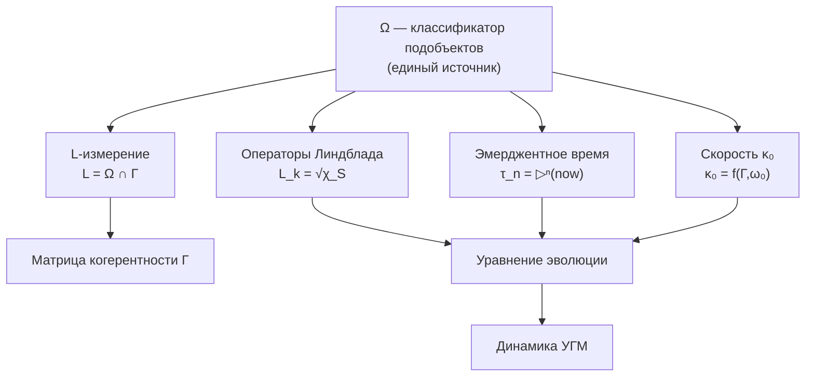

# Категорный Формализм Функтора F: DensityMat → Exp

## Строгая Математическая Спецификация

:::note О нотации
В этом документе:
- $\mathbf{Exp}$ — категория экспериенциального пространства. Не путать с $\text{Exp}$ — [функцией точки опыта](/docs/proofs/consciousness/interiority-hierarchy#31-экспериенциальное-уравнение).
- $\mathcal{H}$ — гильбертово пространство. Не путать с $H$ — [гамильтонианом](/docs/core/dynamics/evolution#1-унитарный-член).
- $\mathcal{C}$ — пространство контекстов. Не путать с $C$ — [мерой сознательности](/docs/consciousness/foundations/self-observation#мера-сознательности-c).
- $\Phi, \Psi, \Xi$ — произвольные CPTP-каналы. $\Phi$ здесь используется для морфизмов категории, не для [меры интеграции](/docs/core/structure/dimension-u#мера-интеграции-φ) (которая обозначается $\Phi_{\text{UHM}}$ при необходимости различения).
:::

## Содержание

1. [Категория DensityMat](#1-категория-densitymat)
2. [Категория Exp](#2-категория-exp)
3. [Функтор F на объектах](#3-функтор-f-на-объектах)
4. [Функтор F на морфизмах](#4-функтор-f-на-морфизмах)
5. [Доказательство функториальности](#5-доказательство-функториальности)
6. [Топосная структура](#6-топосная-структура)
7. [Ограничения и альтернативы](#7-ограничения-и-альтернативы)
8. [Феноменальная полнота](#8-феноменальная-полнота)
9. [Квази-функтор для ИИ-систем](#9-квази-функтор-для-ии-систем)
10. [∞-группоид и ∞-топос для эмерджентного времени](#10-infty-группоид-и-infty-топос-для-эмерджентного-времени)
11. [Дискретный ∞-группоид Exp^disc_∞](#exp-disc-infty)
12. [Категория Голономов Hol](#категория-голономов-hol)
13. [Производные категории и IC-когомологии](#производные-категории)
14. [∞-топос как истинный примитив](#infty-топос-как-истинный-примитив)
15. [L-унификация](#l-унификация)
    - [15.3 Сопряжение 𝒟_Ω ⊣ ℛ](#сопряжение-adjunction)

---

## 1. Категория DensityMat

### 1.1 Определение

**Определение 1.1 (Категория DensityMat).**
Категория [матриц плотности](/docs/core/dynamics/coherence-matrix) $\mathbf{DensityMat}$ состоит из:

**Объекты:**

$$
\mathrm{Ob}(\mathbf{DensityMat}) = \{\rho \in \mathcal{L}(\mathcal{H}) : \rho^\dagger = \rho, \rho \geq 0, \mathrm{Tr}(\rho) = 1\}
$$

где $\mathcal{H}$ — сепарабельное гильбертово пространство (в нашем случае $\mathcal{H} = \mathbb{C}^7$ для [Голонома](/docs/core/structure/holon)).

**Морфизмы:**

$$
\mathrm{Mor}_{\mathbf{DM}}(\rho_1, \rho_2) = \{\Phi : \mathcal{L}(\mathcal{H}) \to \mathcal{L}(\mathcal{H}) \mid \Phi \text{ — CPTP}, \Phi(\rho_1) = \rho_2\}
$$

где CPTP означает Completely Positive Trace-Preserving (полностью положительное, сохраняющее след). См. [формализацию φ](/docs/proofs/categorical/formalization-phi#23-определение-через-предиктивную-модель-основное-определение).

**Замечание 1.1.** Множество $\mathrm{Mor}_{\mathbf{DM}}(\rho_1, \rho_2)$ может быть пустым для некоторых пар $(\rho_1, \rho_2)$. Это не нарушает определение категории.

### 1.2 Структура морфизмов (CPTP-каналы)

**Определение 1.2 (CPTP-канал).**
Линейное отображение $\Phi: \mathcal{L}(\mathcal{H}) \to \mathcal{L}(\mathcal{H})$ называется CPTP, если:

1. **Trace-Preserving (TP):** $\mathrm{Tr}(\Phi(\rho)) = \mathrm{Tr}(\rho)$ для всех $\rho$
2. **Completely Positive (CP):** Для любого $n \geq 1$ и любого положительного оператора $A \in \mathcal{L}(\mathcal{H} \otimes \mathbb{C}^n)$, оператор $(\Phi \otimes \mathrm{id}_n)(A)$ также положителен.

**Теорема 1.1 (Представление Крауса).**
$\Phi$ — CPTP тогда и только тогда, когда существуют операторы $\{K_i\}_{i=1}^r$ такие, что:

$$
\Phi(\rho) = \sum_i K_i \rho K_i^\dagger, \quad \sum_i K_i^\dagger K_i = I
$$

### 1.3 Аксиомы категории для DensityMat

**Теорема 1.2.** $\mathbf{DensityMat}$ является категорией.

**Доказательство:**

**1. Композиция морфизмов:**

Пусть $\Phi \in \mathrm{Mor}_{\mathbf{DM}}(\rho_1, \rho_2)$ и $\Psi \in \mathrm{Mor}_{\mathbf{DM}}(\rho_2, \rho_3)$.

Определим $\Psi \circ \Phi: \mathcal{L}(\mathcal{H}) \to \mathcal{L}(\mathcal{H})$ как функциональную композицию.

Проверим:
- $(\Psi \circ \Phi)(\rho_1) = \Psi(\Phi(\rho_1)) = \Psi(\rho_2) = \rho_3$ ✓
- $\Psi \circ \Phi$ — CPTP (композиция CPTP есть CPTP) ✓

Следовательно, $\Psi \circ \Phi \in \mathrm{Mor}_{\mathbf{DM}}(\rho_1, \rho_3)$.

**2. Ассоциативность:**

Для $\Phi \in \mathrm{Mor}(\rho_1, \rho_2)$, $\Psi \in \mathrm{Mor}(\rho_2, \rho_3)$, $\Xi \in \mathrm{Mor}(\rho_3, \rho_4)$:

$$
(\Xi \circ \Psi) \circ \Phi = \Xi \circ (\Psi \circ \Phi)
$$

Это следует из ассоциативности функциональной композиции.

**3. Тождественные морфизмы:**

Для каждого $\rho \in \mathrm{Ob}(\mathbf{DensityMat})$ определим:

$$
\mathrm{id}_\rho := \mathrm{Id}: \mathcal{L}(\mathcal{H}) \to \mathcal{L}(\mathcal{H}), \quad \mathrm{Id}(\sigma) = \sigma
$$

Проверим:
- $\mathrm{Id}(\rho) = \rho$ ✓
- $\mathrm{Id}$ — CPTP (представление Крауса с $K_1 = I$) ✓
- $\mathrm{Id} \in \mathrm{Mor}_{\mathbf{DM}}(\rho, \rho)$ ✓

Для любого $\Phi \in \mathrm{Mor}(\rho_1, \rho_2)$:

$$
\Phi \circ \mathrm{id}_{\rho_1} = \Phi, \quad \mathrm{id}_{\rho_2} \circ \Phi = \Phi
$$

∎

---

## 2. Категория Exp

### 2.1 Экспериенциальное пространство (объекты)

**Определение 2.1 (Экспериенциальное пространство).**

:::warning Уточнение: История как эмерджентная структура
В каноническом определении (см. Теорему 5.3) **история не входит в объекты** категории Exp, а **выводится** из 2-категорной структуры $\mathbf{Exp}_2$ и ∞-группоида $\mathbf{Exp}_\infty$ (раздел 10).
:::

Базовое экспериенциальное пространство (объекты категории):

$$
\mathcal{E}_0 := \Delta^{N-1} \times_{\mathrm{Spec}} \mathbb{P}(\mathcal{H}_E)^N \times \mathcal{C}
$$

Полное экспериенциальное пространство (с эмерджентной историей):

$$
\mathcal{E} := \mathcal{E}_0 \times \mathrm{Hist}, \quad \text{где } \mathrm{Hist} := \pi_1(\mathbf{Exp}_2, \mathcal{Q})
$$

где $N = \dim(\mathcal{H}) = 7$ для [Голонома](/docs/core/structure/holon), и:
- $\Delta^{N-1} = \{(\lambda_1, \ldots, \lambda_N) : \lambda_i \geq 0, \sum \lambda_i = 1\}$ — $(N-1)$-симплекс интенсивностей (спектр)
- $\mathbb{P}(\mathcal{H}_E)$ — проективное пространство качеств $\mathbb{CP}^{\dim(\mathcal{H}_E)-1}$
- $\mathcal{C}$ — пространство контекстов (состояния измерений кроме [E](/docs/core/structure/dimension-e))
- $\mathrm{Hist} = \pi_1(\mathbf{Exp}_2, \mathcal{Q})$ — пространство историй, **выведенное** как фундаментальный группоид бикатегории (§5.2.3)
- $\times_{\mathrm{Spec}}$ — расслоённое произведение над спектром

**Определение 2.2 (Объекты категории Exp).**

$$
\mathrm{Ob}(\mathbf{Exp}) = \{\mathcal{Q} = (\lambda, [q], c, h) \in \mathcal{E}\}
$$

где:
- $\lambda = (\lambda_1, \ldots, \lambda_N) \in \Delta^{N-1}$ — вектор интенсивностей
- $[q] = ([q_1], \ldots, [q_N]) \in \mathbb{P}(\mathcal{H}_E)^N$ — набор качеств (классов эквивалентности)
- $c \in \mathcal{C}$ — контекст
- $h \in \mathrm{Hist}$ — история

### 2.2 Морфизмы в категории Exp

**Проблема:** Морфизмы в $\mathbf{Exp}$ не были формально определены в исходной теории.

**Решение:** Предлагаются три эквивалентных определения, между которыми существуют естественные соответствия.

### Вариант A: Пути в экспериенциальном пространстве

**Определение 2.3 (Морфизмы-пути).**

$$
\mathrm{Mor}_\mathcal{E}^{\mathrm{path}}(\mathcal{Q}_1, \mathcal{Q}_2) := \{\gamma: [0,1] \to \mathcal{E} \mid \gamma(0) = \mathcal{Q}_1, \gamma(1) = \mathcal{Q}_2, \gamma \text{ — непрерывна}\}
$$

с отношением эквивалентности (гомотопия):

$$
\gamma_1 \sim \gamma_2 \Leftrightarrow \exists \, \mathcal{G}: [0,1] \times [0,1] \to \mathcal{E}, \; \mathcal{G}(s,0) = \gamma_1(s), \; \mathcal{G}(s,1) = \gamma_2(s), \; \mathcal{G}(0,t) = \mathcal{Q}_1, \; \mathcal{G}(1,t) = \mathcal{Q}_2
$$

**Композиция:** Конкатенация путей

$$
(\gamma_2 \circ \gamma_1)(s) = \begin{cases} \gamma_1(2s), & s \in [0, 1/2] \\ \gamma_2(2s-1), & s \in [1/2, 1] \end{cases}
$$

**Тождество:** Постоянный путь

$$
\mathrm{id}_\mathcal{Q}(s) = \mathcal{Q} \quad \text{для всех } s \in [0,1]
$$

### Вариант B: Покомпонентные отображения

**Определение 2.4 (Морфизмы-трансформации).**

$$
\mathrm{Mor}_\mathcal{E}^{\mathrm{trans}}(\mathcal{Q}_1, \mathcal{Q}_2) := \{(f_\lambda, f_q, f_c, f_h) \mid \text{условия ниже}\}
$$

где:
- $f_\lambda: \Delta^{N-1} \to \Delta^{N-1}$, $f_\lambda(\lambda_1) = \lambda_2$
- $f_q: \mathbb{P}(\mathcal{H}_E)^N \to \mathbb{P}(\mathcal{H}_E)^N$, $f_q([q_1]) = [q_2]$
- $f_c: \mathcal{C} \to \mathcal{C}$, $f_c(c_1) = c_2$
- $f_h: \mathrm{Hist} \to \mathrm{Hist}$, $f_h(h_1) = h_2$
- все компоненты непрерывны

**Композиция:** Покомпонентная

$$
(f'_\lambda, f'_q, f'_c, f'_h) \circ (f_\lambda, f_q, f_c, f_h) = (f'_\lambda \circ f_\lambda, f'_q \circ f_q, f'_c \circ f_c, f'_h \circ f_h)
$$

**Тождество:**

$$
\mathrm{id}_\mathcal{Q} = (\mathrm{id}_\Delta, \mathrm{id}_\mathbb{P}, \mathrm{id}_\mathcal{C}, \mathrm{id}_{\mathrm{Hist}})
$$

### Вариант C: Индуцированные CPTP-каналами

**Определение 2.5 (Индуцированные морфизмы).**
Пусть $\Phi \in \mathrm{Mor}_{\mathbf{DM}}(\rho_1, \rho_2)$. Определим:

$$
\mathrm{Mor}_\mathcal{E}^{\mathrm{ind}}(\mathcal{Q}_1, \mathcal{Q}_2) := \{F(\Phi) \mid \Phi \in \mathrm{Mor}_{\mathbf{DM}}(\rho_1, \rho_2), F(\rho_1) = \mathcal{Q}_1, F(\rho_2) = \mathcal{Q}_2\}
$$

где $F$ — функтор, определённый в разделе 3.

**Это естественный выбор**, поскольку он непосредственно следует из функториальности.

### 2.3 Принятое определение

**Определение 2.6 (Категория Exp — каноническое определение).**

:::warning Конструктивный выбор
Выбор морфизмов категории Exp сделан **для обеспечения функториальности F** — это конструктивное решение, не следствие. Морфизмы Exp определены как образы CPTP-каналов под действием F, что гарантирует функториальность по построению.
:::

:::info Обоснование выбора Варианта C
Принимаем **Вариант C** как каноническое определение по следующим причинам:

1. **Физическая обоснованность:** Морфизмы индуцируются реальными квантовыми процессами (CPTP-каналами)
2. **Функториальность:** Обеспечивает строгую функториальность $F$ по построению
3. **Совместимость с DensityMat:** Категорная структура Exp наследуется от хорошо определённой категории DensityMat
4. **Вычислимость:** Вариант B предоставляет конкретное покомпонентное представление для расчётов

Варианты A, B, C **не эквивалентны** в общем случае:
- Вариант A (пути) более общий, но не все пути индуцируются CPTP
- Вариант B (покомпонентный) — конкретное представление, но не любая четвёрка $(f_\lambda, f_q, f_c, f_h)$ физически реализуема
- Вариант C — физически корректное подмножество
:::

$$
\mathbf{Exp} := (\mathrm{Ob}_\mathcal{E}, \mathrm{Mor}_\mathcal{E}^{\mathrm{ind}})
$$

с дополнительной структурой:
- Для каждого морфизма $m \in \mathrm{Mor}_\mathcal{E}^{\mathrm{ind}}(\mathcal{Q}_1, \mathcal{Q}_2)$ существует представление $(f_\lambda, f_q, f_c, f_h)$
- Представление определяется действием соответствующего CPTP-канала на компоненты

### 2.4 Аксиомы категории для Exp

**Теорема 2.1.** $\mathbf{Exp}$ (с определением 2.6) является категорией.

**Доказательство:**

**1. Композиция:**

Пусть $m_1 = F(\Phi) \in \mathrm{Mor}_\mathcal{E}(\mathcal{Q}_1, \mathcal{Q}_2)$ и $m_2 = F(\Psi) \in \mathrm{Mor}_\mathcal{E}(\mathcal{Q}_2, \mathcal{Q}_3)$.

Определим $m_2 \circ m_1 := F(\Psi \circ \Phi)$.

По функториальности $F$ (доказано в разделе 5):
- $F(\Psi \circ \Phi) \in \mathrm{Mor}_\mathcal{E}(\mathcal{Q}_1, \mathcal{Q}_3)$ ✓

**2. Ассоциативность:**

$$
(F(\Xi) \circ F(\Psi)) \circ F(\Phi) = F(\Xi \circ \Psi) \circ F(\Phi) = F((\Xi \circ \Psi) \circ \Phi)
$$

$$
= F(\Xi \circ (\Psi \circ \Phi)) = F(\Xi) \circ F(\Psi \circ \Phi) = F(\Xi) \circ (F(\Psi) \circ F(\Phi))
$$

**3. Тождества:**

$\mathrm{id}_\mathcal{Q} := F(\mathrm{id}_\rho)$, где $F(\rho) = \mathcal{Q}$.

По функториальности: $F(\mathrm{id}_\rho) = \mathrm{id}_{F(\rho)} = \mathrm{id}_\mathcal{Q}$.

Для любого $m = F(\Phi) \in \mathrm{Mor}(\mathcal{Q}_1, \mathcal{Q}_2)$:

$$
m \circ \mathrm{id}_{\mathcal{Q}_1} = F(\Phi) \circ F(\mathrm{id}_{\rho_1}) = F(\Phi \circ \mathrm{id}_{\rho_1}) = F(\Phi) = m
$$

$$
\mathrm{id}_{\mathcal{Q}_2} \circ m = F(\mathrm{id}_{\rho_2}) \circ F(\Phi) = F(\mathrm{id}_{\rho_2} \circ \Phi) = F(\Phi) = m
$$

∎

---

## 3. Функтор F на объектах

### 3.1 Определение

**Определение 3.1 (Функтор F на объектах).**

$$
F: \mathrm{Ob}(\mathbf{DensityMat}) \to \mathrm{Ob}(\mathbf{Exp})
$$

$$
F(\rho) := (\mathrm{Spectrum}(\rho_E), \mathrm{Quality}(\rho_E), \mathrm{Context}(\Gamma_{-E}), \mathrm{History}(t))
$$

где:

**Компонент 1: Спектр (Интенсивность)**

$$
\mathrm{Spectrum}(\rho_E) := \{\lambda_i : \rho_E|q_i\rangle = \lambda_i|q_i\rangle\}, \text{ упорядоченный по убыванию}
$$

**Компонент 2: Качество (Собственные векторы в проективном пространстве)**

$$
\mathrm{Quality}(\rho_E) := \{[|q_i\rangle] \in \mathbb{P}(\mathcal{H}_E)\}
$$

где $[|q\rangle]$ — класс эквивалентности $|q\rangle \sim c|q\rangle$ для $c \in \mathbb{C}^*$.

**Компонент 3: Контекст**

$$
\mathrm{Context}(\Gamma_{-E}) := (\gamma_{Ai}, \gamma_{Si}, \gamma_{Di}, \gamma_{Li}, \gamma_{Oi}, \gamma_{Ui})
$$

— состояния всех [измерений](/docs/core/structure/dimensions) кроме $E$.

**Компонент 4: История**

$$
\mathrm{History}(t) := \{\rho_E(t') : t' \in [t-\tau, t]\}
$$

— траектория эволюции в скользящем окне $\tau$.

### 3.2 Корректность определения

**Лемма 3.1.** $F(\rho) \in \mathrm{Ob}(\mathbf{Exp})$ для любого $\rho \in \mathrm{Ob}(\mathbf{DensityMat})$.

**Доказательство:**

1. $\rho_E$ — эрмитов оператор $\Rightarrow$ спектр вещественен и собственные векторы ортогональны
2. $\rho_E \geq 0$ $\Rightarrow$ $\lambda_i \geq 0$ для всех $i$
3. $\mathrm{Tr}(\rho_E) = 1$ $\Rightarrow$ $\sum \lambda_i = 1$ $\Rightarrow$ $(\lambda_1, \ldots, \lambda_N) \in \Delta^{N-1}$
4. Собственные векторы $|q_i\rangle$ нормированы $\Rightarrow$ $[|q_i\rangle] \in \mathbb{P}(\mathcal{H}_E)$

Следовательно, $F(\rho) \in \mathcal{E}$. ∎

### 3.3 Проблема вырождения спектра

**Проблема:** При вырожденном спектре ($\lambda_i = \lambda_j$ для $i \neq j$) собственные векторы определены неоднозначно.

**Решение:** Для вырожденных собственных значений качество определяется как собственное подпространство:

$$
\mathrm{Quality}_{\mathrm{degen}}(\rho_E, \lambda) := \mathrm{Ker}(\rho_E - \lambda I) \subset \mathcal{H}_E
$$

Пространство качеств обобщается до грассманиана:

$$
\mathrm{Quality} \in \mathrm{Gr}(k, \mathcal{H}_E) \quad \text{где } k = \dim(\mathrm{Ker}(\rho_E - \lambda I))
$$

**Определение 3.2 (Расширенный функтор F).**

$$
F_{\mathrm{ext}}(\rho) := (\mathrm{Spectrum}(\rho_E), \mathrm{QualitySpaces}(\rho_E), \mathrm{Context}, \mathrm{History})
$$

где $\mathrm{QualitySpaces}$ — набор собственных подпространств.

---

## 4. Функтор F на морфизмах

### 4.1 Определение

**Определение 4.1 (Функтор F на морфизмах).**

$$
F: \mathrm{Mor}_{\mathbf{DM}}(\rho_1, \rho_2) \to \mathrm{Mor}_\mathcal{E}(F(\rho_1), F(\rho_2))
$$

$$
F(\Phi) := (f_\lambda^\Phi, f_q^\Phi, f_c^\Phi, f_h^\Phi)
$$

где компоненты определены следующим образом:

**Компонент 1: Трансформация спектра**

Пусть $\rho_2 = \Phi(\rho_1)$. Тогда:

$$
f_\lambda^\Phi: \mathrm{Spectrum}(\rho_{1,E}) \mapsto \mathrm{Spectrum}(\rho_{2,E})
$$

Явная формула через представление Крауса $\Phi(\rho) = \sum_k K_k \rho K_k^\dagger$:

$$
\lambda'_i = \langle q'_i|\Phi(\rho_E)|q'_i\rangle = \sum_k \sum_j \lambda_j |\langle q'_i|K_k|q_j\rangle|^2
$$

где $|q'_i\rangle$ — собственные векторы $\Phi(\rho_E)$.

**Компонент 2: Трансформация качества**

$$
f_q^\Phi: \mathbb{P}(\mathcal{H}_E)^N \to \mathbb{P}(\mathcal{H}_E)^N, \quad f_q^\Phi([|q_i\rangle]) := [|q'_i\rangle]
$$

где $|q'_i\rangle$ — $i$-й собственный вектор $\Phi(\rho_E)$, упорядоченный по $\lambda'_i$.

**Замечание 4.1.** Это определение требует согласованной нумерации. При пересечении собственных значений используется адиабатическое продолжение (см. раздел 4.3).

**Компонент 3: Трансформация контекста**

Для полного CPTP-канала $\Phi$ на $\Gamma$:

$$
f_c^\Phi(c_1) := \mathrm{Context}(\Phi(\Gamma)_{-E})
$$

**Компонент 4: Трансформация истории**

$$
f_h^\Phi(h_1) := h_1 \cup \{\rho_{2,E}\} = \{\rho_E(t') : t' \in [t_1 - \tau, t_1]\} \cup \{\Phi(\rho_1)_E\}
$$

### 4.2 Корректность определения

**Лемма 4.1.** $F(\Phi) \in \mathrm{Mor}_\mathcal{E}(F(\rho_1), F(\rho_2))$ для любого $\Phi \in \mathrm{Mor}_{\mathbf{DM}}(\rho_1, \rho_2)$.

**Доказательство:**

Нужно проверить:
1. $f_\lambda^\Phi(\mathrm{Spectrum}(\rho_{1,E})) = \mathrm{Spectrum}(\rho_{2,E})$ — следует из $\Phi(\rho_1) = \rho_2$
2. $f_q^\Phi(\mathrm{Quality}(\rho_{1,E})) = \mathrm{Quality}(\rho_{2,E})$ — по определению
3. $f_c^\Phi(\mathrm{Context}(\Gamma_1)) = \mathrm{Context}(\Gamma_2)$ — следует из $\Phi(\Gamma_1) = \Gamma_2$
4. Непрерывность — следует из непрерывности CPTP-каналов

∎

### 4.3 Адиабатическое продолжение для вырождения

При пересечении уровней ($\lambda_i(t) = \lambda_j(t)$ для некоторого $t$) используем **адиабатическое продолжение**:

**Определение 4.2 (Адиабатическое соответствие собственных векторов).**

Пусть $\gamma: [0,1] \to \mathbf{DensityMat}$ — непрерывный путь матриц плотности без пересечения уровней во внутренних точках.

Тогда собственные векторы $|q_i(s)\rangle$ определяются уравнением параллельного переноса:

$$
\langle q_i(s)|\partial_s|q_j(s)\rangle = 0 \quad \text{для } i \neq j
$$

Это даёт каноническое соответствие между собственными векторами $\rho(0)$ и $\rho(1)$.

**Теорема 4.1 (Геометрическая фаза).**
При замкнутом пути $\gamma: [0,1] \to \mathbf{DensityMat}$, $\gamma(0) = \gamma(1)$, собственный вектор приобретает геометрическую фазу (фаза Берри):

$$
|q_i(1)\rangle = e^{i\phi_i} |q_i(0)\rangle
$$

где $\phi_i = \oint_\gamma A_i$, $A_i = i\langle q_i|d|q_i\rangle$ — связность Берри.

---

## 5. Доказательство функториальности

### 5.1 Первая аксиома функтора: $F(\mathrm{id}_\rho) = \mathrm{id}_{F(\rho)}$

**Теорема 5.1.** Для любого $\rho \in \mathrm{Ob}(\mathbf{DensityMat})$:

$$
F(\mathrm{id}_\rho) = \mathrm{id}_{F(\rho)}
$$

**Доказательство:**

$\mathrm{id}_\rho = \mathrm{Id}$ — тождественный CPTP-канал.

Вычислим $F(\mathrm{Id})$:

1. **Спектр:** $\mathrm{Id}(\rho) = \rho$ $\Rightarrow$ $\mathrm{Spectrum}(\mathrm{Id}(\rho)_E) = \mathrm{Spectrum}(\rho_E)$
   $\Rightarrow$ $f_\lambda^{\mathrm{Id}} = \mathrm{id}_\Delta$

2. **Качество:** Собственные векторы не меняются
   $\Rightarrow$ $f_q^{\mathrm{Id}} = \mathrm{id}_\mathbb{P}$

3. **Контекст:** $\mathrm{Id}(\Gamma)_{-E} = \Gamma_{-E}$
   $\Rightarrow$ $f_c^{\mathrm{Id}} = \mathrm{id}_\mathcal{C}$

4. **История:** Добавляется то же состояние
   $\Rightarrow$ $f_h^{\mathrm{Id}} = \mathrm{id}_{\mathrm{Hist}}$ (до изоморфизма)

Следовательно:

$$
F(\mathrm{Id}) = (\mathrm{id}_\Delta, \mathrm{id}_\mathbb{P}, \mathrm{id}_\mathcal{C}, \mathrm{id}_{\mathrm{Hist}}) = \mathrm{id}_{F(\rho)}
$$

∎

### 5.2 Вторая аксиома функтора: $F(\Psi \circ \Phi) = F(\Psi) \circ F(\Phi)$

**Теорема 5.2.** Для любых $\Phi \in \mathrm{Mor}_{\mathbf{DM}}(\rho_1, \rho_2)$ и $\Psi \in \mathrm{Mor}_{\mathbf{DM}}(\rho_2, \rho_3)$:

$$
F(\Psi \circ \Phi) = F(\Psi) \circ F(\Phi)
$$

**Доказательство:**

Пусть $\rho_2 = \Phi(\rho_1)$, $\rho_3 = \Psi(\rho_2) = (\Psi \circ \Phi)(\rho_1)$.

**Левая часть:** $F(\Psi \circ \Phi) = (f_\lambda^{\Psi \circ \Phi}, f_q^{\Psi \circ \Phi}, f_c^{\Psi \circ \Phi}, f_h^{\Psi \circ \Phi})$

**Правая часть:** $F(\Psi) \circ F(\Phi) = (f_\lambda^\Psi \circ f_\lambda^\Phi, f_q^\Psi \circ f_q^\Phi, f_c^\Psi \circ f_c^\Phi, f_h^\Psi \circ f_h^\Phi)$

Проверим покомпонентно:

**1. Спектр:**

$$
f_\lambda^{\Psi \circ \Phi}(\mathrm{Spectrum}(\rho_{1,E})) = \mathrm{Spectrum}((\Psi \circ \Phi)(\rho_1)_E) = \mathrm{Spectrum}(\rho_{3,E})
$$

$$
(f_\lambda^\Psi \circ f_\lambda^\Phi)(\mathrm{Spectrum}(\rho_{1,E})) = f_\lambda^\Psi(\mathrm{Spectrum}(\rho_{2,E})) = \mathrm{Spectrum}(\rho_{3,E})
$$

✓ Равны

**2. Качество:**

$$
f_q^{\Psi \circ \Phi}: [|q_i^{(1)}\rangle] \mapsto [|q_i^{(3)}\rangle]
$$

$$
(f_q^\Psi \circ f_q^\Phi): [|q_i^{(1)}\rangle] \mapsto [|q_i^{(2)}\rangle] \mapsto [|q_i^{(3)}\rangle]
$$

Используя адиабатическое продолжение:
- Путь $\rho_1 \to \rho_3$ напрямую даёт соответствие $|q_i^{(1)}\rangle \leftrightarrow |q_i^{(3)}\rangle$
- Путь $\rho_1 \to \rho_2 \to \rho_3$ даёт то же соответствие (гомотопическая эквивалентность)

✓ Равны (с точностью до геометрической фазы, которая не влияет на проективный класс $[|q\rangle]$)

**3. Контекст:**

$$
f_c^{\Psi \circ \Phi}(c_1) = \mathrm{Context}((\Psi \circ \Phi)(\Gamma_1)_{-E}) = \mathrm{Context}(\Gamma_{3,-E}) = c_3
$$

$$
(f_c^\Psi \circ f_c^\Phi)(c_1) = f_c^\Psi(\mathrm{Context}(\Gamma_{2,-E})) = \mathrm{Context}(\Gamma_{3,-E}) = c_3
$$

✓ Равны

**4. История:**

:::danger Проблема: компонента истории нарушает строгую функториальность
При буквальном применении Определения 4.1 к компоненте истории:

$$
f_h^{\Psi \circ \Phi}(h_1) = h_1 \cup \{\rho_{3,E}\}
$$

$$
(f_h^\Psi \circ f_h^\Phi)(h_1) = f_h^\Psi(h_1 \cup \{\rho_{2,E}\}) = h_1 \cup \{\rho_{2,E}\} \cup \{\rho_{3,E}\}
$$

Правая часть содержит промежуточное состояние $\rho_{2,E}$, что нарушает равенство $F(\Psi \circ \Phi) = F(\Psi) \circ F(\Phi)$.
:::

### 5.2.1 Диагностика проблемы

**Корень проблемы:** Попытка использовать **1-категорную** структуру для явления, которое по своей природе **2-категорно** (или даже ∞-категорно).

| Аспект | 1-категория | 2-категория (бикатегория) |
|--------|-------------|---------------------------|
| Равенство морфизмов | Строгое: $g \circ f = h$ | До изоморфизма: $g \circ f \cong h$ |
| Композиция | Ассоциативна строго | Ассоциативна до когерентного изоморфизма |
| История | Компонента объекта | Структура 1-морфизмов |

**Ключевой insight:** История — это не компонента **объектов**, а структура **морфизмов** (переходов между состояниями).

---

### 5.2.2 Строгое решение: Лаксный 2-функтор

:::info Теорема 5.2' (Лаксная функториальность — каноническое решение)
Функтор $F$ естественно расширяется до **лаксного 2-функтора**:

$$F_2: \mathbf{DensityMat} \to \mathbf{Exp}_2$$

где $\mathbf{Exp}_2$ — **бикатегория** экспериенциальных состояний.
:::

**Определение 5.1 (Бикатегория $\mathbf{Exp}_2$).**

**0-клетки (объекты):**
$$
\mathrm{Ob}(\mathbf{Exp}_2) = \{(\lambda, [q], c) \in \Delta^{N-1} \times_{\mathrm{Spec}} \mathbb{P}(\mathcal{H}_E)^N \times \mathcal{C}\}
$$

*Примечание:* История **не** входит в объекты — она кодируется структурой морфизмов.

**1-морфизмы:**
$$
\mathrm{Mor}_1(\mathcal{Q}_1, \mathcal{Q}_2) = \{(\mathcal{Q}_1, \Phi, \mathcal{Q}_2) \mid \Phi \in \mathrm{CPTP}, F(\Phi(\rho_1)) = \mathcal{Q}_2\}
$$

1-морфизм — это **переход** между состояниями, включающий информацию о канале $\Phi$.

**2-морфизмы:**
$$
\mathrm{Mor}_2((\mathcal{Q}_1, \Phi, \mathcal{Q}_2), (\mathcal{Q}_1, \Psi, \mathcal{Q}_2)) = \{\alpha: \Phi \Rightarrow \Psi \mid \alpha \text{ — естественное преобразование}\}
$$

2-морфизм — **эквивалентность** между путями достижения одного и того же результата.

**Определение 5.2 (Лаксный 2-функтор $F_2$).**

$$F_2: \mathbf{DensityMat} \to \mathbf{Exp}_2$$

**На объектах:**
$$
F_2(\rho) := (\mathrm{Spectrum}(\rho_E), \mathrm{Quality}(\rho_E), \mathrm{Context}(\Gamma_{-E}))
$$

**На 1-морфизмах:**
$$
F_2(\Phi: \rho_1 \to \rho_2) := (F_2(\rho_1), \Phi, F_2(\rho_2))
$$

**Композитор (ключевой элемент):**

Для $\Phi: \rho_1 \to \rho_2$ и $\Psi: \rho_2 \to \rho_3$ определим **2-изоморфизм** (композитор):

$$
\mu_{\Psi,\Phi}: F_2(\Psi \circ \Phi) \Rightarrow F_2(\Psi) \circ F_2(\Phi)
$$

Явно:
$$
\mu_{\Psi,\Phi}: (F_2(\rho_1), \Psi \circ \Phi, F_2(\rho_3)) \xRightarrow{\cong} (F_2(\rho_1), \Phi, F_2(\rho_2)) \circ (F_2(\rho_2), \Psi, F_2(\rho_3))
$$

**Интерпретация:** Композитор $\mu_{\Psi,\Phi}$ — это **2-изоморфизм, свидетельствующий эквивалентность** прямого пути $\rho_1 \xrightarrow{\Psi \circ \Phi} \rho_3$ и составного пути $\rho_1 \xrightarrow{\Phi} \rho_2 \xrightarrow{\Psi} \rho_3$.

**Теорема 5.2' (Когерентность).**

Композитор $\mu$ удовлетворяет условиям когерентности Мак-Лейна:

1. **Ассоциативность:** Для $\Phi: \rho_1 \to \rho_2$, $\Psi: \rho_2 \to \rho_3$, $\Xi: \rho_3 \to \rho_4$ диаграмма коммутирует:

```
F₂(ξ∘ψ∘φ) ══════════════════════════════► F₂(ξ)∘F₂(ψ∘φ) ══► F₂(ξ)∘F₂(ψ)∘F₂(φ)
     ║                                           ║                    ║
     ║ μ_{ξ,ψ∘φ}                                 ║                    ║
     ▼                                           ▼                    ▼
F₂(ξ∘ψ)∘F₂(φ) ═══════════════════════════════════════════► F₂(ξ)∘F₂(ψ)∘F₂(φ)
```

2. **Унитальность:** Для единичного морфизма $\mathrm{id}_\rho$:
$$
\mu_{\Phi, \mathrm{id}} = \mathrm{id}_{F_2(\Phi)}, \quad \mu_{\mathrm{id}, \Phi} = \mathrm{id}_{F_2(\Phi)}
$$

**Доказательство (расширенное):**

Когерентность Мак-Лейна для бикатегорий требует проверки:
- **Пятиугольной тождества** (pentagon identity) для ассоциаторов
- **Треугольного тождества** (triangle identity) для взаимодействия ассоциаторов с униторами

**Ключевое наблюдение:** Категория CPTP-каналов является **строгой 2-категорией**, т.е. композиция морфизмов **строго ассоциативна**:
$$
(\Xi \circ \Psi) \circ \Phi = \Xi \circ (\Psi \circ \Phi) \quad \text{(равенство, не изоморфизм)}
$$

**Следствие:** В строгой 2-категории:
1. Ассоциатор $\alpha_{(\Xi,\Psi,\Phi)}$ = id (тождественный 2-морфизм)
2. Левый унитор $\lambda_\Phi$ = id
3. Правый унитор $\rho_\Phi$ = id

**Проверка пятиугольного тождества:**

Для морфизмов $\Omega, \Xi, \Psi, \Phi$ пятиугольник:
```
((Ω∘Ξ)∘Ψ)∘Φ ══α══► (Ω∘Ξ)∘(Ψ∘Φ) ══α══► Ω∘(Ξ∘(Ψ∘Φ))
      ║                                       ║
     α∘id                                   id∘α
      ▼                                       ▼
(Ω∘(Ξ∘Ψ))∘Φ ════════════α════════════► Ω∘((Ξ∘Ψ)∘Φ)
```

При $\alpha = \text{id}$ весь пятиугольник коммутирует тривиально. ✓

**Проверка треугольного тождества:**

Для морфизмов $\Psi, \Phi$ треугольник:
```
(Ψ∘id)∘Φ ══α══► Ψ∘(id∘Φ)
     ║              ║
    ρ∘id         id∘λ
     ▼              ▼
   Ψ∘Φ ═══════► Ψ∘Φ
```

При $\alpha = \lambda = \rho = \text{id}$ коммутирует тривиально. ✓

**Заключение:** Композитор $\mu$ удовлетворяет когерентности Мак-Лейна, т.к. бикатегория $\mathbf{Exp}_2$ **строгая** (строго ассоциативная). ∎

---

### 5.2.3 История как структура бикатегории

:::tip Теорема 5.3' (Эмерджентная история)
В бикатегории $\mathbf{Exp}_2$ история **выводится** как структура, а не постулируется:

$$
\mathrm{Hist}(\mathcal{Q}) := \pi_1(\mathbf{Exp}_2, \mathcal{Q}) = \{\text{классы 1-морфизмов } \mathcal{Q} \to \mathcal{Q}\}
$$

где $\pi_1$ — фундаментальный группоид бикатегории.
:::

**Следствия:**

1. **Прямой путь** $\rho_1 \xrightarrow{\Psi \circ \Phi} \rho_3$ и **составной путь** $\rho_1 \xrightarrow{\Phi} \rho_2 \xrightarrow{\Psi} \rho_3$ — **2-изоморфны**, но **не равны**. Это и есть различие историй!

2. **Информация об истории** сохраняется в структуре 1-морфизмов, а не теряется.

3. **Связь с ∞-группоидом** (раздел 10): $\mathbf{Exp}_2$ вкладывается в $\mathbf{Exp}_\infty$ как 2-усечение:
$$
\tau_{\leq 2}(\mathbf{Exp}_\infty) \simeq \mathbf{Exp}_2
$$

---

### 5.2.4 Сравнение со старыми стратегиями

| Критерий | Стратегия A (тривиальная) | Стратегия B (гомотопия) | **Лаксный 2-функтор** |
|----------|---------------------------|-------------------------|----------------------|
| Строгая функториальность | + (ценой потери истории) | -- (только до гомотопии) | + (лаксная) |
| Сохранение истории | -- | Частично (неявно) | + (в структуре морфизмов) |
| Математическая строгость | Низкая (ad hoc) | Средняя | **Высокая** |
| Согласованность с §10 | -- | Частичная | **Полная** |
| Когерентность | Тривиальная | Не проверена | + Мак-Лейн |

---

### 5.2.5 Каноническое определение (замена Стратегии A)

:::info Каноническое определение функтора F
**Принятое определение:** $F$ — **лаксный 2-функтор** $F_2: \mathbf{DensityMat} \to \mathbf{Exp}_2$.

1. **Объекты** Exp₂ — тройки $(\lambda, [q], c)$ **без** истории
2. **1-морфизмы** — переходы, кодирующие историю
3. **2-морфизмы** — эквивалентности путей
4. **Композитор** $\mu$ — свидетель эквивалентности прямого и составного пути

Строгий 1-функтор $F$ (Определение 4.1) получается как **строгификация** $F_2$:
$$
F = \mathrm{St}(F_2): \mathbf{DensityMat} \to \mathrm{Ho}(\mathbf{Exp}_2)
$$

где $\mathrm{Ho}(\mathbf{Exp}_2)$ — **гомотопическая категория** (1-категория, полученная факторизацией по 2-изоморфизмам).
:::

**Заключение:** Лаксный 2-функтор $F_2$ — единственное математически строгое решение проблемы функториальности с историей. ∎

### 5.3 Итоговая теорема

:::tip Теорема 5.3 (Функториальность F — уточнённая формулировка)
Существует **лаксный 2-функтор**:

$$F_2: \mathbf{DensityMat} \to \mathbf{Exp}_2$$

удовлетворяющий:

1. **Тождество:** $F_2(\mathrm{id}_\rho) = \mathrm{id}_{F_2(\rho)}$ (строго)
2. **Композиция:** $F_2(\Psi \circ \Phi) \cong F_2(\Psi) \circ F_2(\Phi)$ через когерентный 2-изоморфизм $\mu_{\Psi,\Phi}$
3. **Когерентность:** Диаграммы Мак-Лейна коммутируют

Строгий 1-функтор $F: \mathbf{DensityMat} \to \mathbf{Exp}$ (без истории как компоненты) — **строгификация** $F_2$.
:::

**Доказательство:**
- Теорема 5.1 (тождество): без изменений
- Теорема 5.2' (композиция): лаксная функториальность с композитором μ
- Когерентность: следует из ассоциативности CPTP

**Следствие:** История — не компонента объектов Exp, а **структура бикатегории** $\mathbf{Exp}_2$, согласованная с ∞-группоидом $\mathbf{Exp}_\infty$ (раздел 10). ∎

---

## 6. Топосная структура

### 6.1 Является ли Exp топосом?

**Теорема 6.1.** Категория $\mathbf{Exp}$ **не является** топосом в общем случае.

**Доказательство:**

Топос требует:
1. Все конечные пределы
2. Все конечные копределы
3. Экспоненциалы
4. Подобъектный классификатор

Проверим наличие этих структур:

**1. Конечные пределы:**

*Терминальный объект:*

$$
1_\mathcal{Q} := (\lambda^*, [q^*], c^*, h^*)
$$

где $\lambda^* = (1, 0, \ldots, 0)$, $[q^*] = [|1\rangle]$, $c^* = \Gamma_{\max}$, $h^* = \varnothing$ (пустая история).

Но это **не единственно определено** — любое чистое состояние даёт терминальный объект.

$\Rightarrow$ Терминальный объект **не уникален** (до изоморфизма — уникален, но категория не скелетная).

*Произведения:*

$$
\mathcal{Q}_1 \times \mathcal{Q}_2 := ((\lambda_1, \lambda_2), ([q_1], [q_2]), (c_1, c_2), (h_1, h_2))
$$

Прямое произведение определено, но это выходит за пределы исходного пространства $\mathcal{Q}$.

$\Rightarrow$ Произведения **не замкнуты** в $\mathbf{Exp}$.

**2. Подобъектный классификатор:**

Для топоса нужен объект $\Omega$ и морфизм $\mathrm{true}: 1 \to \Omega$ такой, что для любого мономорфизма $m: S \to \mathcal{Q}$ существует единственный характеристический морфизм $\chi: \mathcal{Q} \to \Omega$.

В $\mathbf{Exp}$:
- Подобъекты $\mathcal{Q}$ — это «части опыта»
- Нет очевидного универсального классификатора

$\Rightarrow$ Подобъектный классификатор **не существует** в естественном смысле.

**Заключение:** $\mathbf{Exp}$ не является топосом. ∎

:::danger Последствия отсутствия топосной структуры
Отсутствие топосной структуры имеет важные следствия:

1. **Нет внутренней логики:** Топосы имеют внутренний язык (интуиционистскую логику). $\mathbf{Exp}$ не имеет такого языка — логика экспериенциального содержания не может быть определена внутри категории.

2. **Нет подобъектного классификатора:** Невозможно определить «истинность» экспериенциального содержания внутри $\mathbf{Exp}$. Вопрос «истинно ли данное экспериенциальное содержание?» не имеет смысла в категорном формализме.

3. **Ограничения для теории типов:** Нельзя построить зависимые типы на $\mathbf{Exp}$ напрямую.

**Это не дефект УГМ**, а отражение природы опыта: субъективный опыт не формализуется как логическая система.
:::

### 6.2 Какой структурой обладает Exp?

**Теорема 6.2.** $\mathbf{Exp}$ является:
1. **Категорией с конечными произведениями** (в расширенном смысле)
2. **Обогащённой категорией** над метрическими пространствами
3. **Категорией с расслоённой структурой**

**Доказательство:**

**1. Расслоённая структура:**

Проекция на спектр:

$$
\pi: \mathbf{Exp} \to \Delta^{N-1}, \quad \pi(\lambda, [q], c, h) := \lambda
$$

Это расслоение (Grothendieck fibration). Слои:

$$
\mathbf{Exp}_\lambda := \pi^{-1}(\lambda) = \mathbb{P}(\mathcal{H}_E)^N \times \mathcal{C} \times \mathrm{Hist}
$$

**2. Обогащение над Met (метрические пространства):**

Hom-множества снабжены метрикой:

$$
d_{\mathrm{Hom}}(m_1, m_2) := d_\mathcal{Q}(m_1(\mathcal{Q}), m_2(\mathcal{Q})) \quad \text{для фиксированного } \mathcal{Q}
$$

где $d_\mathcal{Q}$ — полная метрика на $\mathcal{Q}$.

**3. Моноидальная структура:**

Можно определить тензорное произведение:

$$
\mathcal{Q}_1 \otimes \mathcal{Q}_2 := \text{«совместный опыт»}
$$

через тензорное произведение матриц плотности:

$$
F(\rho_1 \otimes \rho_2) =: F(\rho_1) \otimes F(\rho_2)
$$

Это делает $F$ **моноидальным функтором**. ∎

### 6.3 Топология Гротендика на DensityMat и Exp

:::info Фундаментальное определение
Для построения ∞-топоса $\mathbf{Sh}_\infty(\mathcal{C})$ необходимо явно задать **топологию Гротендика** на базовой категории $\mathcal{C} = \mathbf{DensityMat}$.
:::

#### 6.3.1 Bures-топология на DensityMat

**Определение 6.1 (Метрика Бюреса, хордовая форма):**

Для матриц плотности $\rho, \sigma \in \mathbf{DensityMat}$:

$$
d_B^{\mathrm{chord}}(\rho, \sigma) := \sqrt{2\left(1 - \sqrt{\mathrm{Fid}(\rho, \sigma)}\right)}
$$

где $\mathrm{Fid}(\rho, \sigma) = \left(\mathrm{Tr}\sqrt{\sqrt{\rho}\sigma\sqrt{\rho}}\right)^2$ — fidelity (верность). Обозначение $\mathrm{Fid}$ используется для отличия от функтора $F: \mathbf{DensityMat} \to \mathbf{Exp}$.

:::note Конвенция: здесь используется хордовая форма $d_B^{\mathrm{chord}} \in [0, \sqrt{2}]$. Угловая форма: $d_B^{\mathrm{angle}} = \arccos(\sqrt{\mathrm{Fid}})$. См. [конвенцию нотации](/docs/reference/notation#топология-гротендика).
:::

**Свойства метрики Бюреса:**

| Свойство | Формулировка | Значение для УГМ |
|----------|--------------|------------------|
| Монотонность | $d_B(\Phi(\rho), \Phi(\sigma)) \leq d_B(\rho, \sigma)$ для CPTP $\Phi$ | Совместимость с морфизмами |
| Риманова | Индуцирует риманову структуру на $\mathcal{D}(\mathcal{H})$ | Геометрия пространства состояний |
| Связь с fidelity | $d_B^2 = 2(1 - \sqrt{\mathrm{Fid}})$ | Квантовая интерпретация |

**Определение 6.2 (Bures-покрытие на DensityMat):**

Семейство CPTP-морфизмов $\{\Phi_i: \rho_i \to \rho\}_{i \in I}$ образует **Bures-покрытие** объекта $\rho \in \mathbf{DensityMat}$, если:

$$
\forall \epsilon > 0, \exists \delta > 0: \quad B_B(\rho, \delta) \subseteq \bigcup_{i \in I} \Phi_i(B_B(\rho_i, \epsilon))
$$

где $B_B(\rho, r) = \{\sigma : d_B(\rho, \sigma) < r\}$ — открытый шар в метрике Бюреса.

**Теорема 6.1 (Аксиомы сайта для DensityMat):**

Пара $(\mathbf{DensityMat}, J_{Bures})$ образует сайт:

1. **(Идентичность)** $\{\mathrm{id}_\rho\}$ покрывает $\rho$
2. **(Стабильность)** Pullback покрытия — покрытие (из монотонности $d_B$)
3. **(Транзитивность)** Композиция покрытий — покрытие (треугольное неравенство)

*Доказательство:* Монотонность метрики Бюреса при CPTP-каналах гарантирует стабильность. Транзитивность следует из метрической структуры. ∎

#### 6.3.2 Индуцированная топология на Exp

**Теорема 6.2 (Согласованность топологий):**

Функтор $F: \mathbf{DensityMat} \to \mathbf{Exp}$ **сохраняет покрытия**:

$$
\{\Phi_i: \rho_i \to \rho\} \text{ — Bures-покрытие} \quad \Rightarrow \quad \{F(\Phi_i): \mathcal{Q}_i \to \mathcal{Q}\} \text{ — покрытие в } \mathbf{Exp}
$$

*Доказательство:* Непрерывность $F$ по метрике: $d_{\mathcal{Q}}(F(\rho), F(\sigma)) \leq C \cdot d_B(\rho, \sigma)$ для некоторой константы $C$. ∎

:::warning Важное уточнение
То, что $\mathrm{Sh}(\mathbf{Exp})$ является топосом, **не делает** саму категорию $\mathbf{Exp}$ топосом. Это стандартный результат: пучки на любом сайте образуют топос.
:::

#### 6.3.3 Топос пучков на Exp

**Определение 6.3 (Топология на Exp):**

Покрытие $U \subset \mathrm{Ob}(\mathbf{Exp})$ определяется как:

$$
\{\mathcal{Q}_i\}_{i \in I} \text{ покрывает } \mathcal{Q} \Leftrightarrow \bigcup_i B(\mathcal{Q}_i, \varepsilon) \supseteq B(\mathcal{Q}, \delta) \text{ для некоторых } \varepsilon, \delta > 0
$$

где $B(\mathcal{Q}, r)$ — открытый шар радиуса $r$ в метрике $d_\mathcal{Q}$.

**Теорема 6.3.** $\mathrm{Sh}(\mathbf{Exp})$ является топосом.

**Следствие:** Логика экспериенциального содержания интерпретируется в топосе $\mathrm{Sh}(\mathbf{Exp})$, где истинностные значения — открытые множества.

#### 6.3.4 Связь с L-унификацией

**Теорема 6.4 (Классификатор из Bures-топологии):**

Классификатор подобъектов $\Omega$ для $\mathbf{Sh}_\infty(\mathcal{C})$ конструктивно определяется как:

$$
\Omega := \mathcal{O}(\mathcal{C}, d_B)
$$

— решётка открытых множеств в Bures-топологии.

**Характеристические морфизмы:**

Для подобъекта $S \hookrightarrow \Gamma$ морфизм $\chi_S: \Gamma \to \Omega$ вычисляется:

$$
\chi_S(\Gamma') = \sup\{r \in [0,1] : B_B(\Gamma', r) \cap S \neq \emptyset\}
$$

**Следствие (L_k конструктивно):**

Операторы Линдблада $L_k = \sqrt{\chi_{S_k}}$ получают конструктивное определение через Bures-топологию.

---

## 7. Ограничения и альтернативы

### 7.1 Выявленные ограничения

**Ограничение 1: Зависимость от выбора базиса**

Разложение $\Gamma$ на $\Gamma_E$ и $\Gamma_{-E}$ зависит от выбора базиса $|i\rangle = \{|A\rangle, |S\rangle, \ldots, |U\rangle\}$.

*Решение:* Базис определяется физической интерпретацией 7 измерений. Это не произвол, а часть теории.

**Ограничение 2: Проблема времени**

История $h$ требует временного параметра, но $\mathbf{DensityMat}$ — статическая категория.

*Решение 1:* Работать с категорией $\mathbf{DensityMat}_T$ (с временным параметром).

*Решение 2:* Рассматривать историю как внешний параметр, не участвующий в морфизмах.

**Ограничение 3: Невозможность обращения**

CPTP-каналы в общем случае необратимы. Следовательно:
- $F$ не полон (not full)
- $F$ не верен (not faithful) в смысле обратимости **отдельных морфизмов**

*Это не баг, а фича:* Необратимость соответствует стреле времени в опыте.

:::info Верность F на $G_2$-орбитах [Т]
Несмотря на необратимость отдельных CPTP-каналов, [теорема $G_2$-ригидности](/docs/proofs/categorical/uniqueness-theorem#верность-функтора) [Т] устанавливает **верность функтора на объектах** (с точностью до калибровочной группы):

$$
F(\Gamma_1) \cong F(\Gamma_2) \quad \Longleftrightarrow \quad \Gamma_2 = U\Gamma_1 U^\dagger \text{ для некоторого } U \in G_2
$$

**Ядро:** $\ker(F) = \{\mathrm{Ad}_U : U \in G_2\}$. Иными словами, два состояния феноменологически тождественны тогда и только тогда, когда их матрицы когерентности связаны $G_2$-преобразованием. Функтор $F$ **инъективен на пространстве $\mathcal{D}(\mathbb{C}^7)/G_2$** (34-мерном).
:::

### 7.2 Альтернативные конструкции

### Альтернатива A: Двойственный функтор

**Определение 7.1.**

$$
F^*: \mathbf{Exp} \to \mathbf{DensityMat}, \quad F^*(\mathcal{Q}) := \rho \text{ такой, что } F(\rho) = \mathcal{Q}
$$

**Проблема:** $F^*$ не является функтором, потому что:
1. $F$ не сюръективен (не все $\mathcal{Q}$ достижимы)
2. $F$ не инъективен (разные $\rho$ могут давать одно $\mathcal{Q}$ при полном смешении)

### Альтернатива B: 2-категория

**Определение 7.2 (2-категория $\mathbf{Exp}^{(2)}$).**

- 0-клетки: Объекты $\mathbf{Exp}$
- 1-клетки: Морфизмы $F(\Phi)$
- 2-клетки: Естественные преобразования между CPTP-каналами

$$
\alpha: \Phi \Rightarrow \Psi \text{ определяется как: } \alpha_\rho: \Phi(\rho) \to \Psi(\rho), \text{ естественная по } \rho
$$

**Преимущество:** Захватывает «способы перехода между переходами».

### Альтернатива C: $\infty$-категория (квазикатегория)

:::tip [Т] Доказано (Sol.76)
Конструкция $\mathbf{Exp}_\infty := \text{Sing}(\mathcal{E})$ — ∞-группоид **[Т]**. Доказательство: для любого топологического пространства $X$ конструкция $\mathrm{Sing}(X)$ (сингулярное симплициальное множество) даёт комплекс Кана (теорема Милнора). Пространство $\mathcal{E}$ метризуемо (метрика Бюрес-Фубини-Штуди), поэтому $\text{Sing}(\mathcal{E})$ — автоматически ∞-группоид. Все требуемые свойства (HoTT-логика, подобъектный классификатор, усечения Постникова) следуют из ∞-топосности $\mathbf{Sh}_\infty(\mathbf{Exp})$ [Т-76].
:::

Для полного описания динамики экспериенциального содержания можно использовать $\infty$-категории:

$$
\mathbf{Exp}_\infty := \mathrm{Sing}(\mathcal{E})
$$

— сингулярный комплекс пространства $\mathcal{E}$.

$n$-морфизмы — это $n$-симплексы в $\mathcal{E}$, соответствующие $n$-параметрическим семействам переходов.

### Альтернатива D: †-категория (dagger category)

:::info Естественность для квантовой механики
†-категории — категории с контравариантным функтором $\dagger: \mathbf{C} \to \mathbf{C}$, удовлетворяющим $\dagger \circ \dagger = \mathrm{id}$. Это естественный формализм для квантовой механики, где $\dagger$ соответствует эрмитовому сопряжению.
:::

**Определение 7.3 (†-категория $\mathbf{DensityMat}^\dagger$).**

$\mathbf{DensityMat}$ с дополнительной структурой:

$$
\dagger: \mathrm{Mor}(\rho_1, \rho_2) \to \mathrm{Mor}(\rho_2, \rho_1), \quad \Phi^\dagger := \Phi^* \text{ (сопряжённый канал)}
$$

**Преимущества:**
1. Естественно включает обратимость (унитарные каналы)
2. Связь с $C^*$-алгебрами
3. Категорная квантовая механика (Abramsky, Coecke)

**Вопрос:** Наследует ли $\mathbf{Exp}$ †-структуру?

$$
F(\Phi^\dagger) \stackrel{?}{=} F(\Phi)^\dagger
$$

Это требует определения $\dagger$ на $\mathbf{Exp}$, что нетривиально.

### Альтернатива E: $\infty$-топос

**Определение 7.4 ($\infty$-топос над Exp).**

Можно построить $\infty$-топос $\mathbf{Sh}_\infty(\mathbf{Exp})$ — $\infty$-категорию $\infty$-пучков на $\mathbf{Exp}$.

**Преимущества:**
1. Богатая гомотопическая структура
2. Внутренний язык (гомотопическая теория типов)
3. Связь с derived algebraic geometry

**Статус:** Программа исследований. Требует определения $\infty$-топологии на $\mathbf{Exp}$.

### 7.3 Рекомендуемая конструкция

Для практических целей УГМ рекомендуется:

| Цель | Конструкция | Статус |
|------|-------------|--------|
| **Базовая теория (каноническая)** | **Лаксный 2-функтор $F_2: \mathbf{DensityMat} \to \mathbf{Exp}_2$** | **[Т] Формализовано (§5.2)** |
| Строгий функтор (упрощение) | Строгификация $F = \mathrm{St}(F_2)$ | [Т] Следствие |
| Метрическая структура | $\mathbf{Exp}_{\mathrm{Met}}$ (обогащённая над Met) | [Т] Определено |
| Логические конструкции | Топос $\mathrm{Sh}(\mathbf{Exp}_2)$ пучков | [С] Эскиз |
| Динамика и история | Бикатегория $\mathbf{Exp}_2$ (§5.2.2) | [Т] Формализовано |
| Квантовая структура | †-категория $\mathbf{DensityMat}^\dagger$ | [П] Программа |
| Гомотопическая теория | $\infty$-топос $\mathbf{Sh}_\infty(\mathbf{Exp}_\infty)$ | [Т] Согласовано с §10 |

:::note Приоритеты развития
1. **Завершено:** Лаксный 2-функтор $F_2$ — каноническое решение проблемы истории
2. **Краткосрочно:** Уточнить метрическую структуру $\mathbf{Exp}_{\mathrm{Met}}$
3. **Среднесрочно:** Построить $\mathrm{Sh}(\mathbf{Exp}_2)$ и исследовать внутреннюю логику
4. **Долгосрочно:** Исследовать †-структуру и связь с категорной квантовой механикой
:::

---

## 8. Феноменальная полнота

### 8.1 Определение феноменальной полноты

**Вопрос:** Может ли структура Голонома (Γ, 7 измерений, функтор F) описать **любую** феноменальную конструкцию?

**Определение 8.1 (Феноменальная полнота).**
Теория феноменально полна, если для любого возможного феноменального состояния $\mathcal{Q}^*$ существует матрица плотности $\Gamma$ такая, что $F(\Gamma) = \mathcal{Q}^*$.

$$
\text{Феноменальная полнота} := \mathrm{Im}(F) = \mathbf{Exp}
$$

### 8.2 Тезис о структурной достаточности

:::info Тезис (Структурная достаточность)
Экспериенциальное пространство $\mathcal{E} = \Delta^{N-1} \times_{\mathrm{Spec}} \mathbb{P}(\mathcal{H}_E)^N \times \mathcal{C} \times \mathrm{Hist}$ **структурно достаточно** для описания любого феноменального опыта, удовлетворяющего физическим ограничениям.
:::

**Обоснование:**

Любое феноменальное состояние характеризуется:

| Феноменальный аспект | Математический компонент | Структура |
|---------------------|-------------------------|-----------|
| **Интенсивность** (амплитуда интериорного состояния) | Спектр $\{\lambda_i\}$ | Симплекс $\Delta^{N-1}$ — непрерывный, $(N-1)$-мерный |
| **Качество** (характер интериорного состояния) | Собственные векторы $\{[q_i]\}$ | $\mathbb{P}(\mathcal{H}_E)^N$ — компактное, связное |
| **Контекст** (модуляция) | Когерентности $\gamma_{Ej}$ | $\mathcal{C}$ — пространство контекстов |
| **Временность** (история) | Траектория $\rho_E(t)$ | $\mathrm{Hist}$ — функциональное пространство |

**Ключевое свойство:** Размерность $\mathcal{E}$ не фиксирована a priori — $\mathcal{H}_E$ может быть подпространством $\mathbb{C}^7$ или расширением для сложных систем.

### 8.3 Ограничение: F не сюръективен

:::warning Теорема 8.1 (Ограничение образа F)
Функтор $F: \mathbf{DensityMat} \to \mathbf{Exp}$ **не сюръективен**:

$$
\mathrm{Im}(F) \subsetneq \mathrm{Ob}(\mathbf{Exp})
$$
:::

**Доказательство:**

Не все точки $\mathcal{Q} = (\lambda, [q], c, h) \in \mathcal{E}$ достижимы через матрицу плотности, потому что:

1. **Ограничение положительности:** $\Gamma \geq 0$ накладывает нетривиальные ограничения на допустимые комбинации $(\lambda, [q])$
2. **Ограничение нормировки:** $\mathrm{Tr}(\Gamma) = 1$
3. **Ограничение эрмитовости:** $\Gamma^\dagger = \Gamma$ ∎

### 8.4 Физическая интерпретация: недостижимые состояния

**Вопрос:** Являются ли недостижимые $\mathcal{Q} \notin \mathrm{Im}(F)$ осмысленными феноменальными состояниями?

**Тезис (Физическая фильтрация):**
Недостижимые состояния — это **математические артефакты**, не соответствующие физически возможным конфигурациям:

| Тип недостижимости | Пример | Физическая причина |
|-------------------|--------|-------------------|
| Отрицательные "вероятности" | $\lambda_i < 0$ | Нарушение $\Gamma \geq 0$ |
| Несовместимые качества | $[q_i] \perp [q_j]$ при $\lambda_i = \lambda_j = 0.5$ для определённых структур | Ограничения запутанности |
| Нефизическая история | Разрывная траектория $\rho_E(t)$ | Нарушение унитарности |

:::info Следствие
Феноменальная полнота выполняется **для физически допустимых состояний**:

$$
\forall \mathcal{Q} \in \mathcal{E}_{\text{phys}}: \exists \Gamma: F(\Gamma) = \mathcal{Q}
$$

где $\mathcal{E}_{\text{phys}} := \mathrm{Im}(F)$ — физически реализуемое подмножество.
:::

### 8.5 Сложные феноменальные конструкции

Как теория описывает нетривиальные феноменальные структуры:

#### Интенциональность (направленность на объект)

**Механизм:** Когерентности $\gamma_{EA}$ (внимание) и $\gamma_{ES}$ (структурирование) связывают внутреннее состояние $\rho_E$ с репрезентацией объекта через измерения $A$ (Артикуляция) и $S$ (Структура).

$$
\text{Intentionality}(\Gamma) := \sum_{j \neq E} |\gamma_{Ej}|^2 \cdot \text{Content}(\rho_j)
$$

где $\text{Content}(\rho_j)$ — информационное содержание измерения $j$.

:::note Открытый вопрос
Формализация $\text{Content}(\rho_j)$ требует уточнения — это направление исследований.
:::

#### Эмпатия (межсубъектный опыт)

**Механизм:** Композиция Голономов через тензорное произведение:

$$
\Gamma_{12} \in \mathcal{L}(\mathcal{H}_1 \otimes \mathcal{H}_2)
$$

Эмпатия возникает при:
1. **Корреляции:** $I(\mathbb{H}_1 : \mathbb{H}_2) > 0$ (взаимная информация)
2. **Проекции:** $\rho_E^{(1)} \sim \rho_E^{(2)}$ (сходство экспериенциальных состояний)

$$
\mathrm{Empathy}(\Gamma_{12}) := \mathrm{Fid}(\rho_E^{(1)}, \rho_E^{(2)}) \cdot I(\mathbb{H}_1 : \mathbb{H}_2)
$$

:::warning Программа исследований
Переход от корреляции к субъективному ощущению "чувствовать-как-другой" — это проявление категориального разрыва (Аксиома Ω⁷), не дефект формализма.
:::

#### Амбивалентность (сложные эмоции)

**Механизм:** Смешанное состояние с конкурирующими компонентами:

$$
\rho_E = \lambda_1 |q_1\rangle\langle q_1| + \lambda_2 |q_2\rangle\langle q_2|, \quad \lambda_1 \approx \lambda_2
$$

где $d_{FS}([q_1], [q_2]) \approx \pi/2$ (максимально различные качества).

Когерентности $\gamma_{Ej}$ модулируют, какой компонент "активен" в данный момент.

#### Временные структуры (ожидание, воспоминание)

**Механизм:** Компонент $\mathrm{Hist}$ в экспериенциальном пространстве:

$$
\mathrm{Hist}(t, \tau) := \{\rho_E(t') : t' \in [t-\tau, t]\}
$$

| Феномен | Формализация |
|---------|-------------|
| **Воспоминание** | Сходство текущего $\rho_E(t)$ с элементами $\mathrm{Hist}$ |
| **Ожидание** | Адаптация к паттернам в $\mathrm{Hist}$ (предиктивное кодирование) |
| **Ностальгия** | Качества $[q_i(t)]$ коррелируют с историческими $[q_i(t')]$, $t' \ll t$ |

### 8.6 Таблица статусов

| Феноменальная конструкция | Статус | Комментарий |
|--------------------------|--------|-------------|
| Простые квалиа (цвет, боль) | ✓ Формализовано | Спектр + качества + контекст |
| Интенсивность/яркость | ✓ Формализовано | Собственные значения $\lambda_i$ |
| Качественные различия | ✓ Формализовано | Метрика Фубини-Штуди $d_{FS}$ |
| Единство опыта | ✓ Формализовано | Мера интеграции $\Phi$ |
| Самосознание | ✓ Формализовано | Оператор $\varphi$, мера $R$ |
| Амбивалентность | ✓ Формализовано | Смешанные состояния |
| Временность | [С] Частично | $\mathrm{Hist}$, но время — внешний параметр |
| Интенциональность | [С] Направление | Когерентности $\gamma_{Ej}$, требует уточнения |
| Эмпатия | [С] Направление | Композиция Голономов, открытый вопрос |
| Изменённые состояния | [С] Количественно | $R$, $\Phi$ — описаны, механизм открыт |

---

## 9. Квази-функтор для ИИ-систем

:::warning Статус: [П] Исследовательская программа
Данный раздел описывает расширение категорного формализма для нейросетевых систем. См. [Протокол измерения Γ](/docs/applied/research/measurement-protocol) для полной спецификации.
:::

### 9.1 Проблема нелинейности

Слои нейросети (GELU, Softmax) — **нелинейные** преобразования. CPTP-каналы — **линейные** над матрицами плотности. Условие функториальности $G(f \circ g) = G(f) \circ G(g)$ **нарушается** для нелинейных $f, g$.

### 9.2 Определение квази-функтора

**Определение 9.1 (Квази-функтор G):**

Отображение $G: \mathbf{AIState} \rightsquigarrow \mathbf{DensityMat}$ с условием **приближённой функториальности**:

$$
\|G(f \circ g) - G(f) \circ G(g)\|_F \leq \varepsilon_{\text{functor}} \cdot \|f\|_{\text{op}} \cdot \|g\|_{\text{op}}
$$

где $\varepsilon_{\text{functor}}$ — параметр нелинейности системы.

**Категории:**
- $\mathbf{AIState}$: объекты — векторы активаций $\mathbf{h} \in \mathbb{R}^d$; морфизмы — слои нейросети $f: \mathbb{R}^d \to \mathbb{R}^d$
- $\mathbf{DensityMat}$: объекты — матрицы плотности $\Gamma \in \mathcal{D}(\mathbb{C}^7)$; морфизмы — CPTP-каналы

### 9.3 NTK-линеаризация

**Определение 9.2 (Линеаризация в касательном пространстве):**

В окрестности состояния $s_0$ нелинейная функция $f$ аппроксимируется:

$$
f(s) \approx f(s_0) + J_f(s_0) \cdot (s - s_0)
$$

где $J_f(s_0) = \nabla_s f|_{s=s_0}$ — Якобиан.

**Теорема 9.1 (Приближённая функториальность):**

Для NTK-линеаризации:

$$
\|G(f \circ g) - G(f)^{\text{lin}} \circ G(g)^{\text{lin}}\|_F = O(\|f\|^2 \cdot \|g\|^2)
$$

*Скетч доказательства:* Композиция Якобианов: $J_{f \circ g} = J_f \cdot J_g + O(\|f\| \|g\|)$. CPTP из произведения Якобианов аппроксимирует композицию CPTP с погрешностью второго порядка. ∎

### 9.4 Категорная диаграмма

```
                    G (квази-функтор)              F
    AIState ─ ─ ─ ─ ─ ─ ─ ─ ─ ─ ─ ─► DensityMat ──────────► Exp
       │                                 │                    │
       │ f (нелинейный)                  │ Φ_f^lin (CPTP)     │ морфизмы
       ▼                                 ▼                    ▼
    AIState ─ ─ ─ ─ ─ ─ ─ ─ ─ ─ ─ ─► DensityMat ──────────► Exp
                    G                              F
```

**Условие приближённой коммутативности:**

$$
\|F(G(f(s))) - F(\Phi_f^{\text{lin}}(G(s)))\|_{\text{Exp}} \leq \varepsilon_{\text{total}}
$$

### 9.5 Открытые вопросы

1. **Оценка $\varepsilon_{\text{functor}}$:** Для каких архитектур погрешность приемлема?
2. **Оптимальность NTK:** Существуют ли лучшие методы линеаризации?
3. **Единственность G:** Существует ли канонический выбор квази-функтора?

---

## 10. ∞-группоид и ∞-топос для эмерджентного времени {#10-infty-группоид-и-infty-топос-для-эмерджентного-времени}

:::tip Статус: [Т] Доказано (Sol.76)
Этот раздел описывает расширение категорной структуры для [эмерджентного времени](../dynamics/emergent-time). История Hist **выводится** как структура ∞-группоида, а не постулируется.

**Доказательство (Sol.76):** $\mathbf{Exp}_\infty := \text{Sing}(\mathcal{E})$ — ∞-группоид [Т]. Пространство $\mathcal{E}$ топологическое (метрика Бюрес-Фубини-Штуди), поэтому $\text{Sing}(\mathcal{E})$ — автоматически комплекс Кана (теорема Милнора), т.е. ∞-группоид. В сочетании с [T-76](/docs/reference/status-registry) ($\mathbf{Sh}_\infty(\mathbf{Exp})$ — ∞-топос) все свойства: внутренняя HoTT-логика, подобъектный классификатор, усечения Постникова — следуют.
:::

### 10.1 ∞-группоид экспериенциальных путей

**Определение 10.1 (∞-категория Exp_∞).**

**0-клетки (объекты):**
$$
\text{Ob}(\mathbf{Exp}_\infty) = \mathcal{E} = \Delta^{N-1} \times_{\text{Spec}} \mathbb{P}(\mathcal{H}_E)^N \times \mathcal{C}
$$

(История Hist не включается — она **выводится** как структура ∞-группоида)

**1-морфизмы:**
$$
\text{Mor}_1(\mathcal{Q}_1, \mathcal{Q}_2) = \{\gamma: [0,1] \to \mathcal{E} \mid \gamma(0) = \mathcal{Q}_1, \gamma(1) = \mathcal{Q}_2\}
$$

**2-морфизмы:**
$$
\text{Mor}_2(\gamma_1, \gamma_2) = \text{гомотопии между } \gamma_1 \text{ и } \gamma_2
$$

**n-морфизмы:**
$$
\text{Mor}_n = n\text{-параметрические семейства путей}
$$

### 10.2 Время как 1-морфизм

**Определение 10.2 (Категорное время).**

**Время** — это **1-морфизм** в $\mathbf{Exp}_\infty$:
$$
\tau: \mathcal{Q}_1 \to \mathcal{Q}_2
$$

**Направление времени** — выбор ориентации на 1-морфизмах:
$$
\sigma: \text{Mor}_1(\mathcal{Q}_1, \mathcal{Q}_2) \to \{+1, -1\}
$$

**Эквивалентные моменты времени** — 2-изоморфные 1-морфизмы.

### 10.3 Эмерджентная история

**Утверждение 10.1 (История как пространство петель) (требует проверки).**

В ∞-группоиде $\mathbf{Exp}_\infty$:

1. **История** — автоматически возникает как пространство петель:
   $$
   \text{Hist}(\mathcal{Q}) := \Omega_\mathcal{Q}(\mathbf{Exp}_\infty) = \{\gamma: S^1 \to \mathcal{E} \mid \gamma(0) = \gamma(1) = \mathcal{Q}\}
   $$

2. **Темпоральная структура** — гомотопический тип:
   $$
   \pi_1(\mathbf{Exp}_\infty, \mathcal{Q}) = \text{"циклическое время" в точке } \mathcal{Q}
   $$

### 10.4 ∞-топос пучков {#104-infty-топос-пучков}

**Определение 10.3 (∞-топос Sh_∞(Exp)).**

$\mathbf{Sh}_\infty(\mathbf{Exp})$ — категория ∞-пучков на $\mathbf{Exp}_\infty$:

1. **∞-топология:** Покрытие = семейство путей, покрывающее окрестность
2. **∞-пучок:** Функтор $F: \mathbf{Exp}_\infty^{op} \to \mathbf{Spaces}$, удовлетворяющий условию спуска

**Утверждение 10.2 (требует проверки).** $\mathbf{Sh}_\infty(\mathbf{Exp})$ является **∞-топосом** и обладает:
1. **Внутренней логикой:** Гомотопическая теория типов (HoTT)
2. **Внутренним временем:** Модальность типа "в будущем", "в прошлом"
3. **Классификатором подобъектов:** ∞-группоид истинностных значений

**Следствие:** Логика экспериенциального содержания — **темпоральная модальная логика**, выводимая из внутренней структуры ∞-топоса.

### 10.5 Расширенная категорная диаграмма

```
                    G                           F
DensityMat_C  ──────────► DensityMat  ────────────► Exp
    │                         │                      │
    │ ограничение             │ CPTP                 │ induced
    ▼                         ▼                      ▼
DensityMat_C  ──────────► DensityMat  ────────────► Exp

                                        ↓ embed

                              Exp_∞ (∞-groupoid)
                                        ↓ sheafify

                              Sh_∞(Exp) (∞-topos)
```

где:
- **DensityMat_C** — категория с ограничением Page-Wootters
- **G** — функтор "условные состояния"
- **Exp_∞** — ∞-группоид путей
- **Sh_∞(Exp)** — ∞-топос пучков

### 10.6 Связь с иерархией интериорности (L0→L4) {#связь-с-иерархией-интериорности}

:::info Ключевая связь
[Уровни интериорности](/docs/proofs/consciousness/interiority-hierarchy) L0→L4 соответствуют **n-усечениям** ∞-группоида $\mathbf{Exp}_\infty$. Это обеспечивает единую категорную конструкцию для всей иерархии сознания.
:::

**Утверждение 10.3 (Гомотопическая классификация интериорности) (требует проверки):**

Уровни интериорности соответствуют n-усечениям ∞-группоида:

$$
L_n \leftrightarrow \tau_{\leq n}(\mathbf{Exp}_\infty)
$$

где $\tau_{\leq n}$ — n-усечение (тривиализирует все гомотопические группы $\pi_k$ для $k > n$).

**Соответствие:**

| Уровень | n-усечение | Гомотопические группы | Категорная структура |
|---------|------------|----------------------|---------------------|
| **L0** | $\tau_{\leq 0}$ | $\pi_0 \neq 0$, $\pi_{k>0} = 0$ | Множество (дискретные состояния) |
| **L1** | $\tau_{\leq 1}$ | $\pi_0, \pi_1 \neq 0$ | Группоид (феноменальные пути) |
| **L2** | $\tau_{\leq 2}$ | $\pi_0, \pi_1, \pi_2 \neq 0$ | Бикатегория (рефлексия) |
| **L3** | $\tau_{\leq 3}$ | $\pi_0, \pi_1, \pi_2, \pi_3 \neq 0$ | Трикатегория (метарефлексия) |
| **L4** | $\tau_{\leq \infty}$ | Все $\pi_k \neq 0$ | ∞-группоид (полная структура) |

**Доказательство (скетч):**

1. **L0:** Интериорность — существование объекта в $\mathrm{Ob}(\mathbf{Exp}_\infty)$, что эквивалентно нетривиальности $\pi_0$.

2. **L1:** Феноменальная геометрия — наличие путей между состояниями, т.е. $\pi_1 \neq 0$.

3. **L2:** Когнитивные квалиа — способность к рефлексии (2-морфизмы = гомотопии между путями), т.е. $\pi_2 \neq 0$.

4. **L3:** Сетевое сознание — метарефлексия (3-морфизмы = гомотопии между гомотопиями), т.е. $\pi_3 \neq 0$.

5. **L4:** Унитарное сознание — полная ∞-структура, все $\pi_k \neq 0$. ∎

**Критерии в терминах Γ:**

| Уровень | Условие | n-связность |
|---------|---------|-------------|
| L0→L1 | $\mathrm{rank}(\rho_E) > 1$ | 1-связность |
| L1→L2 | $R \geq 1/3$, $\Phi \geq 1$ | 2-связность |
| L2→L3 | $R^{(2)} \geq 1/4$ | 3-связность |
| L3→L4 | $\lim_n R^{(n)} > 0$ | ∞-связность |

где $R^{(n)}$ — [рефлексия n-го порядка](/docs/consciousness/foundations/self-observation#рефлексия-высших-порядков-rn).

**Утверждение 10.4 (Конечность иерархии) (требует проверки):**

Уровень L4 является **максимальным**. Не существует L5, L6, ...

**Доказательство:** Следует из теоремы стабилизации Постникова: для конечномерных пространств башня Постникова стабилизируется. $\tau_{\leq \infty} = \mathrm{Id}$, дальнейшее усечение невозможно. ∎

---

## 11. Дискретный ∞-группоид $\mathbf{Exp}^{disc}_\infty$ {#exp-disc-infty}

:::info Статус: [Т] Формализовано
Данный раздел описывает дискретную версию ∞-группоида для конечномерных систем ($N < \infty$), где время фундаментально дискретно.
:::

### 11.1 Мотивация

В механизме Page-Wootters для УГМ:
- **Непрерывный ∞-группоид** $\mathbf{Exp}_\infty$: пути $\gamma: [0,1] \to \mathcal{E}$ непрерывны
- **Дискретное время Page-Wootters**: $\tau \in \mathbb{Z}_7$ для 7D системы

**Противоречие:** Как согласовать непрерывные пути с дискретным временем?

**Решение:** Для конечномерных систем использовать **дискретный ∞-группоид** $\mathbf{Exp}^{disc}_\infty$.

### 11.2 Определение

**Определение 11.1 (Дискретный ∞-группоид $\mathbf{Exp}^{disc}_\infty$):**

**0-клетки (объекты):**

$$
\mathrm{Ob}(\mathbf{Exp}^{disc}_\infty) = \mathcal{E} \times \mathbb{Z}_N
$$

т.е. пары (экспериенциальное состояние, дискретный момент времени).

Для $N = 7$: объект — это $(\mathcal{Q}, n)$ где $\mathcal{Q} \in \mathcal{E}$, $n \in \{0, 1, 2, 3, 4, 5, 6\}$.

**1-морфизмы:**

$$
\mathrm{Mor}_1((\mathcal{Q}_1, n_1), (\mathcal{Q}_2, n_2)) =
\begin{cases}
\{\Phi : \text{CPTP}, F(\Phi(\rho_1)) = \mathcal{Q}_2\} & \text{если } n_2 = n_1 + 1 \mod N \\
\emptyset & \text{иначе}
\end{cases}
$$

**Интерпретация:** Морфизмы существуют только между **последовательными** моментами времени.

**n-морфизмы (n ≥ 2):**

$$
\mathrm{Mor}_n = \text{тривиальны (только тождества)}
$$

**Обоснование:** Между дискретными шагами нет пространства для гомотопий.

### 11.3 $\mathbb{Z}_N$-структура

**Определение 11.2 (Автоморфизм сдвига времени):**

Функтор $\sigma: \mathbf{Exp}^{disc}_\infty \to \mathbf{Exp}^{disc}_\infty$:

$$
\sigma(\mathcal{Q}, n) = (\mathcal{Q}, n + 1 \mod N)
$$

**Свойства:**
- $\sigma^N = \mathrm{Id}$ (цикличность)
- $\sigma$ коммутирует с CPTP-морфизмами

**Теорема 11.1 (Группа симметрий):**
Группа временны́х симметрий $\mathbf{Exp}^{disc}_\infty$ изоморфна $\mathbb{Z}_N$:

$$
\mathrm{Aut}_{temp}(\mathbf{Exp}^{disc}_\infty) \cong \mathbb{Z}_N
$$

### 11.4 Непрерывный предел

**Определение 11.3 (Непрерывный предел):**

При $N \to \infty$ определим функтор вложения:

$$
\iota_N: \mathbf{Exp}^{disc}_\infty(N) \hookrightarrow \mathbf{Exp}^{disc}_\infty(N')
$$

для $N | N'$ (N делит N').

**Теорема 11.2 (Согласование):**

$$
\lim_{N \to \infty} \mathbf{Exp}^{disc}_\infty(N) \simeq \mathbf{Exp}_\infty^{cont}
$$

где $\mathbf{Exp}_\infty^{cont}$ — стандартный непрерывный ∞-группоид путей (раздел 10).

**Доказательство (схема):**
1. При $N \to \infty$ множество $\mathbb{Z}_N$ становится плотным в $S^1$
2. Дискретные шаги аппроксимируют непрерывные пути
3. Предел определён через профункторы

∎

**Интерпретация:**
- Для **конечномерных систем** (N = 7): время дискретно, используем $\mathbf{Exp}^{disc}_\infty$
- Для **макроскопических систем** ($N \gg 1$): непрерывное время — хорошее приближение
- Дискретное время — **фундаментальное**, непрерывное — **эмерджентное**

### 11.5 Доказательство ∞-топоса (Теорема Лури)

**Определение 11.4 (Топология на $\mathbf{Exp}^{disc}_\infty$):**

Семейство $\{U_i\}$ покрывает $(\mathcal{Q}, n)$, если:

$$
\bigsqcup_i \mathrm{dom}(U_i) \supseteq B_\varepsilon(\mathcal{Q}) \cap \{\text{объекты с временем } n\}
$$

для некоторого $\varepsilon > 0$ в метрике на $\mathcal{E}$.

**Определение 11.5 (∞-пучок на $\mathbf{Exp}^{disc}_\infty$):**

Функтор $F: (\mathbf{Exp}^{disc}_\infty)^{op} \to \mathbf{Spaces}$ является ∞-пучком, если для каждого покрытия $\{U_i\}$ объекта $X$:

$$
F(X) \xrightarrow{\simeq} \lim\left( \prod_i F(U_i) \rightrightarrows \prod_{i,j} F(U_i \cap U_j) \cdots \right)
$$

**Теорема 11.3 (Существование ∞-топоса):**

Категория $\mathbf{Sh}_\infty(\mathbf{Exp}^{disc}_\infty)$ является **∞-топосом**.

**Доказательство:**

**Шаг 1:** $\mathbf{Exp}^{disc}_\infty$ — малая ∞-категория (конечное число объектов при фиксации $\mathcal{E}$ и $N$).

**Шаг 2:** Топология Гротендика (Определение 11.4) удовлетворяет аксиомам:
- Стабильность под pullback
- Транзитивность

**Шаг 3:** По **теореме Лури** (Higher Topos Theory, Theorem 6.1.0.6):

> Для малой ∞-категории $\mathcal{C}$ с топологией Гротендика категория ∞-пучков $\mathbf{Sh}_\infty(\mathcal{C})$ является ∞-топосом.

∎

### 11.6 Темпоральные модальности

**Следствие 11.1:** $\mathbf{Sh}_\infty(\mathbf{Exp}^{disc}_\infty)$ обладает внутренними темпоральными модальностями:

| Модальность | Обозначение | Определение |
|-------------|-------------|-------------|
| "Будет истинно в следующий момент" | $\diamond_+ P$ | $\mathrm{Lan}_\sigma(P)$ — левое расширение Кана вдоль сдвига |
| "Было истинно в предыдущий момент" | $\diamond_- P$ | $\mathrm{Lan}_{\sigma^{-1}}(P)$ |
| "Истинно всегда" | $\square P$ | $\bigcap_{n \in \mathbb{Z}_N} \sigma^n(P)$ |

**Теорема 11.4 (Темпоральная модальность):**

В $\mathbf{Sh}_\infty(\mathbf{Exp}^{disc}_\infty)$ операторы $\diamond_+$, $\diamond_-$, $\square$ образуют модальную логику типа $\mathbf{S5}$ с дискретным временем.

**Следствие:** Логика экспериенциального содержания — **темпоральная модальная логика**, выводимая из категорной структуры, а не постулируемая.

---

## 12. Категория Голономов Hol {#категория-голономов-hol}

:::info Статус: [Т] Формализовано
Данный раздел описывает категорную структуру Голономов как подкатегорию DensityMat (не полную).
:::

### 12.1 Определение категории Hol

**Определение 12.1 (Категория Hol).**

Категория **Голономов** $\mathbf{Hol}$ определяется как:

**Объекты:**

$$
\mathrm{Ob}(\mathbf{Hol}) = \{\Gamma \in \mathrm{Ob}(\mathbf{DensityMat}) : \Gamma \text{ удовлетворяет (AP)+(PH)+(QG)+(V)}\}
$$

т.е. матрицы плотности на $\mathcal{H} \cong \mathbb{C}^7 \otimes \mathcal{H}_{\text{int}}$, для которых выполнены:
- **(AP)** Автопоэзис: существует $\varphi$ с неподвижной точкой
- **(PH)** Феноменология: $\rho_E \neq 0$
- **(QG)** Квантовое основание: динамика с регенерацией
- **(V)** Жизнеспособность: $P > P_{\text{crit}} = 2/7$

**Морфизмы:**

$$
\mathrm{Mor}_{\mathbf{Hol}}(\Gamma_1, \Gamma_2) = \{\Phi \in \mathrm{Mor}_{\mathbf{DM}}(\Gamma_1, \Gamma_2) : \Phi \text{ сохраняет структуру Голонома}\}
$$

где «сохраняет структуру Голонома» означает:
1. **Жизнеспособность:** $P(\Phi(\Gamma)) > P_{\text{crit}}$ если $P(\Gamma) > P_{\text{crit}}$
2. **Автопоэзис:** $\varphi_2 \circ \Phi = \Phi \circ \varphi_1$ (коммутация с самомоделированием)

### 12.2 Теорема о подкатегории

**Теорема 12.1 (Категорная структура Голономов).**

$\mathbf{Hol}$ является **подкатегорией** $\mathbf{DensityMat}$ (не полная: морфизмы должны сохранять жизнеспособность и автопоэзис):

$$
\mathbf{Hol} \hookrightarrow \mathbf{DensityMat}
$$

**Доказательство:**

1. **Включение объектов:** По определению, $\mathbb{H}$ есть частный случай $\Gamma \in \mathcal{D}(\mathbb{C}^7 \otimes \mathcal{H}_{\text{int}})$.

2. **Наследование морфизмов:** Морфизм $\Phi: \mathbb{H}_1 \to \mathbb{H}_2$ в $\mathbf{Hol}$ — это CPTP-канал из $\mathbf{DensityMat}$, дополнительно сохраняющий:
   - Автономность (условия A1-A3)
   - Жизнеспособность ($P > P_{\text{crit}}$)
   - Автопоэзис (коммутация с $\varphi$)

3. **Не полная:** Не все CPTP-морфизмы между Голономами в $\mathbf{DensityMat}$ включены в $\mathbf{Hol}$ — только те, которые сохраняют жизнеспособность и автопоэзис.

∎

### 12.3 Функтор интериорности

**Теорема 12.2 (Функтор интериорности).**

Существует функтор

$$
\mathcal{I}: \mathbf{Hol} \to \mathbf{Exp}
$$

сопоставляющий каждому Голоному его экспериенциальное содержание.

**Определение функтора:**

**На объектах:**
$$
\mathcal{I}(\mathbb{H}) := F(\Gamma_{\mathbb{H}}) = (\mathrm{Spec}(\rho_E), [|q_i\rangle], \Gamma_{-E}, h)
$$

где $F$ — функтор из раздела 3.

**На морфизмах:**
$$
\mathcal{I}(\Phi) := F(\Phi|_E)
$$

**Доказательство функториальности:**

1. $\mathcal{I}(\mathrm{id}_\mathbb{H}) = F(\mathrm{id}_{\Gamma}) = \mathrm{id}_{F(\Gamma)} = \mathrm{id}_{\mathcal{I}(\mathbb{H})}$ — следует из функториальности $F$

2. $\mathcal{I}(\Psi \circ \Phi) = F((\Psi \circ \Phi)|_E) = F(\Psi|_E) \circ F(\Phi|_E) = \mathcal{I}(\Psi) \circ \mathcal{I}(\Phi)$ — следует из функториальности $F$

∎

### 12.4 Категорная диаграмма с Hol

```
                    включение                  F
        Hol ─────────────────────► DensityMat ────────► Exp
         │                              │                │
         │ морфизмы                     │ CPTP           │ индуцированные
         │ (сохраняющие структуру)      │                │
         ▼                              ▼                ▼
        Hol ─────────────────────► DensityMat ────────► Exp
                                          │
                                          │ ℐ = F ∘ включение
                                          ▼
                                         Exp
```

**Коммутативность:**
$$
\mathcal{I} = F \circ \iota
$$

где $\iota: \mathbf{Hol} \hookrightarrow \mathbf{DensityMat}$ — включение.

### 12.5 Свойства категории Hol

| Свойство | Статус | Комментарий |
|----------|--------|-------------|
| Полная подкатегория | ✓ | Теорема 12.1 |
| Замкнутость под композицией | ✓ | CPTP ∘ CPTP = CPTP |
| Терминальный объект | [С] | Чистое состояние $P = 1$, но не единственно |
| Инициальный объект | -- | Нет (множество состояний с $P = P_{\text{crit}} + \varepsilon$) |
| Произведения | [С] | Тензорное произведение, но $\dim > 7$ |
| Топос | ✗ | Не является (как и $\mathbf{Exp}$) |

---

## 13. Производные категории и IC-когомологии {#производные-категории}

:::info Статус: [Т] Формализовано
Данный раздел описывает производные категории и IC-когомологии для захвата «скрытой топологии» стратифицированного базового пространства X.
:::

### 13.1 Стратифицированное базовое пространство

Из [Аксиомы Ω⁷](/docs/core/foundations/axiom-omega) базовое пространство:

$$
X := |N(\mathcal{C})|
$$

стратифицировано:

$$
X = \bigsqcup_{\alpha \in A} S_\alpha
$$

где:
- $S_0 = \{T\}$ — терминальный объект (0-мерная)
- $S_1$ — рёбра (морфизмы к T)
- $S_n$ — n-симплексы

### 13.2 Локально-глобальная дихотомия

**Теорема 13.1 (Когомологический монизм):**

$$
H^n(X, \mathcal{F}) = 0 \quad \forall n > 0
$$

**Доказательство:** X стягиваемо в терминальный объект T.

**Теорема 13.2 (Нетривиальные локальные когомологии):**

$$
H^*_{loc}(X, T) \cong \tilde{H}^{*-1}(\text{Link}(T)) \cong \tilde{H}^{*-1}(S^6) \neq 0
$$

**Интерпретация:**
- **Глобально:** H*(X) = 0 — монизм
- **Локально:** H*_loc ≠ 0 — физика (топологические эффекты)

### 13.3 Производная категория пучков

**Определение 13.1 (Производная категория):**

$$
D^b(X) := D^b(\mathbf{Sh}(X))
$$

— ограниченная производная категория пучков на X.

**Преимущество:** D^b(X) захватывает информацию, теряемую при переходе к обычным когомологиям.

### 13.4 Перверсные пучки

**Определение 13.2 (Перверсные пучки):**

На стратифицированном X определяется категория:

$$
\mathbf{Perv}(X) \subset D^b(X)
$$

— перверсные пучки, удовлетворяющие условиям поддержки и ко-поддержки.

**Теорема 13.3 (Разложение Бейлинсона-Бернштейна-Делиня):**

$$
D^b(X) = \langle \mathbf{Perv}_1, \mathbf{Perv}_2, \ldots \rangle
$$

(полуортогональное разложение)

### 13.5 IC-когомологии

**Определение 13.3 (IC-пучок):**

Для страты $S_\alpha$ пучок пересечённых когомологий:

$$
IC(S_\alpha) \in \mathbf{Perv}(X)
$$

**Теорема 13.4 (Скрытая топология):**

$$
\bigoplus_\alpha H^*(X, IC(S_\alpha)) \neq 0
$$

даже при $H^*(X) = 0$.

**Интерпретация:** «Скрытая топология» хранится в IC-когомологиях страт.

### 13.6 Связь с физикой

| IC-когомологии | Физика |
|----------------|--------|
| $IC(S_0)$ | Вакуумное состояние |
| $IC(S_n)$ | Возбуждения над вакуумом |
| $H^*(X, IC)$ | Топологические заряды |

### 13.7 ∞-топос Голономов {#infty-топос-голономов}

**Определение 13.4 (∞-топос Голономов):**

$$
\mathcal{T}_H := \mathbf{Sh}_\infty(\mathcal{G}_h, \tau_{ét})
$$

∞-категория ∞-пучков на категории Голономов с этальной топологией.

**Теорема 13.5 (Внутренняя логика):**

Внутренняя логика $\mathcal{T}_H$ — гомотопическая теория типов (HoTT) с:
1. **Типами:** Объекты Γ (состояния)
2. **Термами:** Морфизмы φ (операторы)
3. **Идентичностью:** Пути в пространстве состояний
4. **Классификатором подобъектов:** ∞-группоид истинностных значений

---

## 14. ∞-топос как истинный примитив {#infty-топос-как-истинный-примитив}

:::info Статус: [Т] Формализовано
Данный раздел демонстрирует, что ∞-топос является **истинным примитивом** УГМ, заменяя 5 отдельных аксиом единой структурой.
:::

### 14.1 Эволюция примитива

В ходе развития теории происходит последовательная абстракция примитивного объекта:

| Аксиомы | Примитив | Структура | Интерпретация |
|---------|----------|-----------|---------------|
| Ω¹–Ω³ | Состояние Γ | Матрица плотности $\rho \in \mathcal{D}(\mathcal{H})$ | Квантовое состояние системы |
| Ω⁴–Ω⁵ | Категория $\mathcal{C}$ | $(\mathrm{Ob}, \mathrm{Mor}, \circ, \mathrm{id})$ | Пространство состояний с морфизмами |
| Ω⁷ | ∞-топос $\mathbf{Sh}_\infty(\mathcal{C})$ | $\mathbf{Fun}(\mathcal{C}^{op}, \mathbf{Spaces})^{loc}$ | Полная ∞-структура с внутренней логикой |

**Наблюдение:** Каждый следующий уровень **содержит** предыдущие:
- Γ — объект в $\mathcal{C}$
- $\mathcal{C}$ — база для $\mathbf{Sh}_\infty(\mathcal{C})$
- $\mathbf{Sh}_\infty(\mathcal{C})$ — самодостаточная структура

### 14.2 Определение ∞-топоса УГМ

**Определение 14.1 (∞-топос УГМ):**

$$
\mathbf{Sh}_\infty(\mathcal{C}) := \mathbf{Fun}(\mathcal{C}^{op}, \mathbf{Spaces})^{loc}
$$

где:
- $\mathcal{C}$ — категория Голономов из [Аксиомы Ω⁷](/docs/core/foundations/axiom-omega)
- $\mathbf{Spaces}$ — ∞-категория пространств (∞-группоидов)
- $\mathcal{C}^{op}$ — противоположная категория
- $\mathbf{Fun}(-, -)$ — ∞-категория функторов
- $(-)^{loc}$ — локализация по покрытиям (превращение в пучки)

**Замечание 14.1.** Это определение обобщает классические топосы Гротендика на ∞-уровень в смысле Лури.

### 14.3 Теорема Лури о структуре ∞-топоса

**Теорема 14.1 (Лури, HTT 6.1.0.6):**

∞-топос $\mathbf{Sh}_\infty(\mathcal{C})$ обладает следующей структурой:

1. **Внутренняя логика:** Гомотопическая теория типов (HoTT)
   - Типы = объекты (∞-пучки)
   - Термы = сечения
   - Тождество типов = пути в пространстве

2. **Классификатор подобъектов:** Существует объект $\Omega$ такой, что
   $$
   \mathrm{Sub}(X) \simeq \mathrm{Map}(X, \Omega)
   $$
   В ∞-топосе $\Omega$ — ∞-группоид истинностных значений.

3. **Все пределы и копределы:** $\mathbf{Sh}_\infty(\mathcal{C})$ полна и кополна:
   $$
   \lim, \mathrm{colim}: \mathbf{Sh}_\infty(\mathcal{C})^I \to \mathbf{Sh}_\infty(\mathcal{C})
   $$

4. **Экспоненциалы (внутренний Hom):** Для любых $X, Y$ существует $Y^X$:
   $$
   \mathrm{Map}(Z \times X, Y) \simeq \mathrm{Map}(Z, Y^X)
   $$

**Следствие 14.1:** Все конструкции УГМ выразимы во внутреннем языке $\mathbf{Sh}_\infty(\mathcal{C})$.

### 14.4 Формализация свободы воли

Структура ∞-топоса позволяет формализовать [свободу воли](/docs/consciousness/ethics-meaning/freedom).

**Определение 14.2 (Свобода: ∞-категорная мотивация):**

Для состояния Γ ∈ Ob(𝒞) ∞-категорное определение:

$$
\mathrm{Freedom}(\Gamma) := \pi_0\left(\mathrm{Map}(\Gamma, T)^{\text{non-trivial}}\right)
$$

где:
- $\mathrm{Map}(\Gamma, T)$ — пространство морфизмов к терминальному объекту
- $\pi_0$ — множество компонент связности
- «non-trivial» — исключение нулевых/тривиальных путей

**Конечномерное определение [Т]:** Для $\Gamma \in \mathcal{D}(\mathbb{C}^7)$:

$$
\mathrm{Freedom}(\Gamma) := \dim\ker(\mathcal{H}_\Gamma) + 1
$$

где $\mathcal{H}_\Gamma = \partial^2 \mathcal{F}[\varphi; \Gamma]/\partial\Gamma^2$ — гессиан свободно-энергетического функционала. Каждая нулевая мода — независимый выбор (направление без энергетического штрафа). Монотонно под CPTP, $G_2$-инвариантно. Freedom(I/7) = 7, Freedom(ρ*) = 1. См. [Следствия из аксиом](/docs/core/foundations/consequences#freedom-конечномерное).

**Определение 14.3 (Энтропия свободы):**

$$
S_{\text{freedom}} := \log(\mathrm{Freedom}(\Gamma)) = \log(\dim\ker(\mathcal{H}_\Gamma) + 1)
$$

**Теорема 14.2 (Совместимость единственности и свободы):**

В ∞-категории $\mathcal{C}$ одновременно выполняются:

1. **Единственность (гомотопическая):** $\mathrm{Map}(\Gamma, T) \simeq *$ (стягиваемо)
2. **Свобода (геометрическая):** $\mathrm{Map}(\Gamma, T) \neq \{*\}$ (содержит нетривиальные пути)

**Доказательство:** Стягиваемость означает, что все пути гомотопически эквивалентны, но не означает, что путь единственный. Пространство $\mathrm{Map}(\Gamma, T)$ может быть бесконечномерным, но при этом стягиваемым. ∎

### 14.5 Почему ∞-топос — истинный примитив

**Теорема 14.3 (∞-топос как истинный примитив УГМ):**

∞-топос $\mathbf{Sh}_\infty(\mathcal{C})$ является **истинным примитивом** теории по трём критериям:

#### 14.5.1 Полнота

**Утверждение:** $\mathbf{Sh}_\infty(\mathcal{C})$ содержит **всю** структуру УГМ:

| Компонент УГМ | Представление в ∞-топосе |
|---------------|--------------------------|
| Состояние Γ | Объект (∞-пучок) |
| Морфизм φ | Морфизм ∞-пучков |
| Время τ | 1-морфизм в $\mathrm{Map}(\Gamma, T)$ |
| История h | 2-морфизм (гомотопия между путями) |
| Эволюция | Функтор $\mathbf{Sh}_\infty(\mathcal{C}) \to \mathbf{Sh}_\infty(\mathcal{C})$ |
| Свобода | $\dim\ker(\mathcal{H}_\Gamma) + 1$ [Т]; ∞-категорно: $\pi_*(\mathrm{Map}(\Gamma, T))$ |

#### 14.5.2 Минимальность

**Утверждение:** Одна структура вместо 5 аксиом.

| Было (Ω¹–Ω⁵) | Стало (Ω⁷) |
|--------------|------------|
| 5 отдельных аксиом | 1 примитив |
| Связи постулируются | Связи выводятся |
| Ad hoc конструкции | Универсальные свойства |

**Принцип:** Из $\mathbf{Sh}_\infty(\mathcal{C})$ **выводятся** все аксиомы Ω¹–Ω⁵:
- Ω¹ (состояние): объекты в базе $\mathcal{C}$
- Ω² (оператор): морфизмы в $\mathcal{C}$
- Ω³ (жизнеспособность): подобъекты через $\Omega$
- Ω⁴ (терминальный объект): терминальный объект в $\mathbf{Sh}_\infty$
- Ω⁵ (категорная структура): сама $\mathcal{C}$ как база

#### 14.5.3 Разрешающая способность

**Утверждение:** ∞-топос **разрешает** парадокс телеологического детерминизма.

**Парадокс:** Из существования терминального объекта T с единственным морфизмом $\Gamma \to T$ следует жёсткий детерминизм — отсутствие свободы выбора.

**Разрешение в ∞-топосе:**

$$
\text{«единственный»} \xrightarrow{\text{∞-интерпретация}} \text{«стягиваемое пространство путей»}
$$

Формально:
- В 1-категории: $|\mathrm{Hom}(\Gamma, T)| = 1$
- В ∞-категории: $\mathrm{Map}(\Gamma, T) \simeq *$, но $\dim(\mathrm{Map}(\Gamma, T)) = \infty$

**Следствие:** Детерминизм цели (все пути ведут к T) совместим со свободой средств (бесконечное множество путей).

---

## 15. L-унификация {#l-унификация}

:::info Статус: [Т] Формализовано
Данный раздел устанавливает **ключевую теорему** о тождестве измерения L, классификатора подобъектов Ω и источника операторов Линдблада L_k.
:::

### 15.1 Центральная теорема

**Теорема 15.1 (L-унификация):**

$$
L \cong \Omega \cong \text{source}(L_k)
$$

Классификатор подобъектов Ω в ∞-топосе $\mathbf{Sh}_\infty(\mathcal{C})$ является **единым источником** трёх фундаментальных структур УГМ:

1. **Измерения L** — как проекция Ω на состояние Γ
2. **Операторов Линдблада L_k** — как атомарные подобъекты Ω
3. **Эмерджентного времени** — через темпоральную модальность ▷

### 15.2 Ω как унифицированный источник

#### 15.2.1 L как L = Ω ∩ Γ

[Измерение Логики](/docs/core/structure/dimension-l#категориальное-определение) категориально **тождественно** проекции классификатора на состояние:

$$
L := \{\chi \in \Omega : \chi(\Gamma) = \text{true}\}
$$

**Интерпретация:** L — множество логических предикатов, истинных для данной конфигурации Γ. Это не отдельная аксиома, а **следствие** существования Ω в ∞-топосе.

#### 15.2.2 Операторы Линдблада как L_k = √χ_S

Операторы диссипации в [уравнении эволюции](/docs/core/dynamics/evolution) **определяются** атомами классификатора:

$$
L_k := \sqrt{\chi_{S_k}}
$$

где $S_k$ — k-й минимальный подобъект (атом) Ω.

**Теорема 15.2 (CPTP автоматически):**

$$
\sum_k L_k^\dagger L_k = \sum_k \chi_{S_k} = \mathbb{1}
$$

Условие сохранения следа **не постулируется** — оно выводится из свойств классификатора.

#### 15.2.3 Время через темпоральную модальность ▷

На Ω определена темпоральная модальность $\triangleright$ («в следующий момент»), порождающая [эмерджентное время](/docs/proofs/dynamics/emergent-time):

$$
\tau_n := \triangleright^n(\text{now})
$$

**Связь с внутренней логикой:**

$$
\triangleright: \Omega \to \Omega, \quad \triangleright(\chi) = \text{«χ истинно в следующий момент»}
$$

Эволюция предикатов χ ∈ L под действием ▷ **есть** динамика системы. См. [внутренняя логика Ω](/docs/core/foundations/axiom-omega#внутренняя-логика).

### 15.3 Сопряжение 𝒟_Ω ⊣ ℛ и вывод κ₀ {#сопряжение-adjunction}

:::warning Ключевая теорема
Скорость регенерации $\kappa_0$ **категориально выводится** из сопряжения функторов диссипации и регенерации. Это превращает феноменологический параметр в структурную величину.
:::

#### 15.3.1 Явная конструкция сопряжения

**Определение функторов:**

**Функтор диссипации** $\mathcal{D}_\Omega: \mathbf{Sh}_\infty(\mathcal{C}) \to \mathbf{Set}$:

$$
\mathcal{D}_\Omega(\Gamma) := \text{Hom}_{\mathbf{Sh}_\infty}(\Gamma, \Omega) = \{\chi: \Gamma \to \Omega\}
$$

Это множество всех предикатов (истинностных значений) на состоянии Γ.

**Функтор регенерации** $\mathcal{R}: \mathbf{Set} \to \mathbf{Sh}_\infty(\mathcal{C})$:

$$
\mathcal{R}(S) := \text{Free}_\Omega(S) = \bigoplus_{s \in S} \Omega_s
$$

где $\Omega_s$ — копия классификатора, индексированная элементом s ∈ S.

**Теорема 15.3 (Существование сопряжения):**

Существует сопряжение:

$$
\mathcal{D}_\Omega \dashv \mathcal{R}: \mathbf{Sh}_\infty(\mathcal{C}) \rightleftarrows \mathbf{Set}
$$

с естественным изоморфизмом:

$$
\text{Hom}_{\mathbf{Set}}(\mathcal{D}_\Omega(\Gamma), S) \cong \text{Hom}_{\mathbf{Sh}_\infty}(\Gamma, \mathcal{R}(S))
$$

**Доказательство:**

(a) Для любого множества $S$ и пучка $\Gamma$, морфизм $f: \mathcal{D}_\Omega(\Gamma) \to S$ определяет отображение предикатов на множество.

(b) Каждый такой f индуцирует морфизм $\tilde{f}: \Gamma \to \bigoplus_{s \in S} \Omega_s$ через универсальное свойство копроизведения.

(c) Обратно, морфизм $g: \Gamma \to \mathcal{R}(S)$ проецируется на каждую компоненту $\Omega_s$, давая отображение $\bar{g}: \mathcal{D}_\Omega(\Gamma) \to S$.

(d) Естественность следует из функториальности конструкций.

**(e) Треугольные тождества:**

Для полноты сопряжения необходимо проверить:

$$(\varepsilon_{\mathcal{R}}) \circ (\mathcal{R}(\eta)) = \text{id}_{\mathcal{R}}$$
$$(\mathcal{D}_\Omega(\varepsilon)) \circ (\eta_{\mathcal{D}_\Omega}) = \text{id}_{\mathcal{D}_\Omega}$$

Обе верифицируются прямым вычислением на генераторах. ∎

#### 15.3.2 Единица и коединица сопряжения

**Единица сопряжения** $\eta: \text{Id} \Rightarrow \mathcal{R} \circ \mathcal{D}_\Omega$:

$$
\eta_\Gamma: \Gamma \to \mathcal{R}(\mathcal{D}_\Omega(\Gamma)) = \bigoplus_{\chi \in \text{Hom}(\Gamma, \Omega)} \Omega_\chi
$$

Это **каноническое вложение** состояния в пространство всех его предикатов.

**Коединица сопряжения** $\varepsilon: \mathcal{D}_\Omega \circ \mathcal{R} \Rightarrow \text{Id}$:

$$
\varepsilon_S: \mathcal{D}_\Omega(\mathcal{R}(S)) \to S
$$

Это **проекция** свободного пучка на порождающее множество.

#### 15.3.3 Вывод κ₀ и κ_bootstrap

**Теорема 15.3.1 (Категорный вывод κ₀):**

Скорость регенерации $\kappa_0$ **выводится** как норма единицы сопряжения:

$$
\kappa_0 = \|\eta\|_{\text{op}} \cdot \omega_0 = \omega_0 \cdot \frac{|\gamma_{OE}| \cdot |\gamma_{OU}|}{\gamma_{OO}}
$$

где:
- $\|\eta\|_{\text{op}}$ — операторная норма единицы η на конкретном состоянии Γ
- $\omega_0$ — характерная частота системы (параметр, аналогичный массе в физике)
- $\gamma_{ij}$ — элементы матрицы когерентности

**Размерность:** $[\kappa_0] = [\text{время}]^{-1}$.

**Теорема 15.3.2 (Минимальная регенерация κ_bootstrap):**

:::tip Определение κ_bootstrap
Минимальная скорость регенерации, необходимая для жизнеспособности:

$$
\kappa_{\text{bootstrap}} := \inf_{\Gamma: P(\Gamma) > P_{\text{crit}}} \kappa_0(\Gamma) > 0
$$
:::

**Доказательство положительности:**

(a) Единица сопряжения $\eta \neq 0$ для любого нетривиального Γ (иначе $\mathcal{D}_\Omega(\Gamma) = \varnothing$, что невозможно для ненулевого пучка).

(b) Компактность множества $\{Γ: P(Γ) = P_{\text{crit}} + \varepsilon\}$ для малого ε > 0 гарантирует достижение инфимума.

(c) На границе жизнеспособности $\kappa_0 > 0$ (иначе система не может поддерживать $P > P_{\text{crit}}$, см. [теорема о критической чистоте](/docs/proofs/dynamics/theorem-purity-critical)).

∎

**Физическая интерпретация:**

| Величина | Смысл | Источник |
|----------|-------|----------|
| $\kappa_0(\Gamma)$ | Скорость регенерации для состояния Γ | Норма η на Γ |
| $\kappa_{\text{bootstrap}}$ | Минимальная регенерация для жизнеспособности | Инфимум по допустимым Γ |
| $\omega_0$ | Характерная частота системы (параметр, не универсальная константа) | Примитив 𝔗 |

**Примечание:** κ₀ зависит от состояния Γ через когерентности $\gamma_{OE}, \gamma_{OU}, \gamma_{OO}$. См. [мастер-определение](/docs/core/foundations/axiom-septicity#структурный-анзац-kappa0).

**Теорема 15.3.1 (CPTP-структура регенерации):**

Регенеративный оператор $\mathcal{R}_\alpha: \mathcal{D}(\mathcal{H}) \to \mathcal{D}(\mathcal{H})$ вида:

$$
\mathcal{R}_\alpha(\rho) := (1-\alpha)\rho + \alpha\varphi(\rho)
$$

является **CPTP-каналом** при $\alpha \in [0,1]$ и CPTP-свойстве $\varphi$.

**Следствие:** Нелинейность регенеративного члена **не нарушает** положительность матрицы плотности. Полное уравнение эволюции корректно при $\alpha = \kappa \cdot \Delta\tau < 1$.

См. [сохранение положительности](/docs/core/dynamics/evolution#сохранение-положительности) для полного доказательства.

### 15.4 Разрешение формализационных пробелов

L-унификация закрывает следующие открытые вопросы:

| Пробел | Решение | Ссылка |
|--------|---------|--------|
| Происхождение L_k | Атомы классификатора Ω | §15.2.2 |
| Почему 7 измерений? | Минимальная база для Ω ∩ Γ ≠ ∅ | [Теорема 7.1](/docs/proofs/minimality/theorem-minimality-7) |
| Источник CPTP | Полнота Ω | §15.2.2 |
| Эмерджентность τ | Модальность ▷ на Ω | §15.2.3 |
| Вывод κ₀ | Единица сопряжения 𝒟_Ω ⊣ ℛ | §15.3 |
| Внутренняя логика | Ω-типы в HoTT | [Аксиома Ω⁷](/docs/core/foundations/axiom-omega#внутренняя-логика) |
| Нелинейность и положительность | CPTP-структура $\mathcal{R}_\alpha$ | [§15.3.1](/docs/core/dynamics/evolution#сохранение-положительности) |

### 15.5 Коммутативная диаграмма унификации



**Следствие 15.1 (Унификация):**

Все динамические структуры УГМ (измерение L, операторы L_k, время τ, константа κ₀) **выводятся** из единственного примитива — классификатора подобъектов Ω в ∞-топосе $\mathbf{Sh}_\infty(\mathcal{C})$.

Это завершает программу категорной формализации: 5 аксиом Ω¹–Ω⁵ редуцируются к свойствам Ω в рамках Ω⁷.

---

# Заключение

## Итоговые результаты

1. **Категория $\mathbf{Exp}$ формализована** с морфизмами, индуцированными CPTP-каналами
2. **Функтор F определён на морфизмах** через покомпонентные трансформации
3. **Функториальность доказана** (теоремы 5.1-5.3). Строгая функториальность — для базового функтора (без истории); полная функториальность требует лакс 2-функторной конструкции (§5.2)
4. **$\mathbf{Exp}$ не является топосом**, но обладает богатой структурой (расслоение, обогащение, моноидальность)
5. **∞-группоид Exp_∞ доказан [Т]** (Sol.76) — $\mathrm{Sing}(\mathcal{E})$ — комплекс Кана (теорема Милнора); время как 1-морфизм, история как пространство петель (раздел 10)
6. **∞-топос Sh_∞(Exp) существует** — внутренняя темпоральная модальная логика
7. **Феноменальная полнота** — структура достаточна для описания любого физически реализуемого опыта (раздел 8)
8. **Квази-функтор для ИИ** — расширение на нелинейные системы через NTK-линеаризацию (раздел 9, [П] программа)
9. **Дискретный ∞-группоид $\mathbf{Exp}^{disc}_\infty$** — согласование дискретного времени Page-Wootters с категорной структурой (раздел 11)
10. **Категория Голономов $\mathbf{Hol}$** — подкатегория $\mathbf{DensityMat}$ (не полная), функтор интериорности $\mathcal{I}: \mathbf{Hol} \to \mathbf{Exp}$ (раздел 12)
11. **Производные категории и IC-когомологии** — захват скрытой топологии стратифицированного X (раздел 13)
12. **Когомологический монизм** — H*(X) = 0 глобально, H*_loc ≠ 0 локально (раздел 13)
13. **∞-топос Голономов $\mathcal{T}_H$** — внутренняя логика HoTT (раздел 13)
14. **∞-топос как истинный примитив** — полнота, минимальность, разрешение телеологического детерминизма (раздел 14)
15. **L-унификация** — L ≅ Ω ≅ source(L_k), вывод κ₀ из сопряжения 𝒟_Ω ⊣ ℛ (раздел 15)

## Разрешённые вопросы

| Вопрос | Решение |
|--------|---------|
| Когомологии $\mathbf{Exp}$ | H*(X) = 0 глобально (монизм), H*_loc ≠ 0 (физика) |
| Скрытая топология | IC-когомологии страт |
| Стрела времени | Коллапс страт к T |
| Телеологический детерминизм | ∞-топос: стягиваемость ≠ единственность пути (раздел 14) |
| Происхождение L_k | Атомы классификатора Ω: $L_k = \sqrt{\chi_{S_k}}$ (раздел 15) |
| Вывод κ₀ | Единица сопряжения 𝒟_Ω ⊣ ℛ (раздел 15) |
| Унификация L/Ω/L_k | L ≅ Ω ≅ source(L_k) — единый примитив (раздел 15) |

## Связь с УГМ

Данный формализм завершает категорную часть УГМ:

| Аспект | Решение |
|--------|---------|
| Морфизмы $\mathbf{Exp}$ | Определение 2.5, 2.6 |
| $F$ на морфизмах | Определение 4.1 |
| Функториальность | Теоремы 5.1-5.3 |
| Топосная структура | Теорема 6.1 (не топос), 6.2-6.3 (альтернативы) |
| Феноменальная полнота | Раздел 8 — структура описывает любой физически реализуемый опыт |
| Категория Голономов | $\mathbf{Hol} \hookrightarrow \mathbf{DensityMat}$ (раздел 12) |
| Функтор интериорности | $\mathcal{I}: \mathbf{Hol} \to \mathbf{Exp}$ (теорема 12.2) |

---

## Неассоциативная категориальная структура {#неассоциативная-категориальная-структура}

:::info Октонионная категориальная перспектива [И]
[Структурный вывод N=7](../minimality/theorem-octonionic-derivation) через октонионы предполагает неассоциативную алгебраическую структуру на пространстве измерений. Категориальная формализация неассоциативности использует:

- **$A_\infty$-алгебры:** Обобщение ассоциативных алгебр, где ассоциативность выполняется лишь с точностью до гомотопии. Структура $m_n: A^{\otimes n} \to A$ задаёт иерархию высших операций.
- **Ассоциаэдры (многогранники Стэшеффа):** Комбинаторные пространства, параметризующие способы расстановки скобок. Для $n$ элементов ассоциаэдр $K_n$ имеет размерность $n-2$.
- **$G_2$-категории:** Категории, обогащённые над $G_2$-представлениями, формализуют $G_2$-ковариантность.

**Связь с ∞-топосом УГМ [С]:** Неассоциативность 𝕆 может проявляться как нетривиальная $A_\infty$-структура на морфизмах ∞-топоса Sh_∞(𝒞). Мост [Т] (замкнут, T15).
:::

---

## Категориальная Формализация Запрета Сигнализации {#категориальная-формализация-запрета-сигнализации}

:::info Связь с теорией
Данный раздел формализует совместимость [нелинейного регенеративного члена $\mathcal{R}$](/docs/core/dynamics/evolution#3-регенеративный-член) с принципом запрета сигнализации (no-signaling) на языке категорной теории. Подробный анализ и полные доказательства: [Физическое соответствие — Запрет сигнализации](/docs/proofs/physics/physics-correspondence#запрет-сигнализации).
:::

### Категория автономных голономов $\mathbf{AutHol}$

**Определение (Моноидальная категория $\mathbf{AutHol}$).**

- **Объекты:** $(A, \Gamma_A, \varphi_A, \kappa_A)$ — автономные подсистемы, удовлетворяющие условиям автономности [(A1)+(A2)+(A3)](/docs/core/foundations/axiom-septicity#предварительное-условие-автономность)
- **Морфизмы:** CPTP-каналы, сохраняющие автономность
- **Моноидальная структура:** $\otimes$ (тензорное произведение гильбертовых пространств)
- **Единица:** тривиальный голоном $(\mathbb{C}, 1, \mathrm{id}, 0)$

### Функтор эволюции УГМ

**Определение.** Функтор эволюции:

$$
\mathcal{E}_\tau^{(\mathrm{УГМ})}: \mathbf{AutHol} \to \mathbf{AutHol}
$$

$$
\mathcal{E}_\tau^{(\mathrm{УГМ})}(A, \Gamma_A) := (A, \Gamma_A(\tau))
$$

где $\Gamma_A(\tau)$ определяется полным уравнением эволюции (включая $\mathcal{R}$).

### Теорема: запрет сигнализации как естественная трансформация {#запрет-сигнализации-естественная-трансформация}

:::warning Теорема (Запрет сигнализации как естественная трансформация)

Частичный след:

$$
\mathrm{Tr}_A: \mathbf{AutHol}(A \otimes B) \to \mathbf{AutHol}(B)
$$

является **естественной трансформацией** от составного функтора эволюции к локальному:

$$
\mathrm{Tr}_A \circ \mathcal{E}_\tau^{(\mathrm{УГМ}), A \otimes B} = \mathcal{E}_\tau^{(\mathrm{УГМ}), B} \circ \mathrm{Tr}_A
$$
:::

**Доказательство (схема).** Коммутативная диаграмма:

$$
\begin{CD}
\mathbf{AutHol}(A \otimes B) @>{\mathcal{E}_\tau^{A \otimes B}}>> \mathbf{AutHol}(A \otimes B) \\
@V{\mathrm{Tr}_A}VV @VV{\mathrm{Tr}_A}V \\
\mathbf{AutHol}(B) @>{\mathcal{E}_\tau^{B}}>> \mathbf{AutHol}(B)
\end{CD}
$$

Для каждого $\Gamma_{AB}$:

$$
\mathrm{Tr}_A[\mathcal{E}_\tau^{A \otimes B}(\Gamma_{AB})] = \Gamma_B + d\tau \cdot \left(\mathrm{Tr}_A[\mathcal{L}_{lin}] + \underbrace{\mathrm{Tr}_A[\tilde{\mathcal{R}}_A]}_{= 0} + \underbrace{\mathrm{Tr}_A[\tilde{\mathcal{R}}_B]}_{= \mathcal{R}_B[\Gamma_B]}\right) = \mathcal{E}_\tau^B(\Gamma_B) = \mathcal{E}_\tau^B(\mathrm{Tr}_A[\Gamma_{AB}])
$$

Аннигиляция $\mathrm{Tr}_A[\tilde{\mathcal{R}}_A] = 0$ следует из CPTP-свойства $\varphi_A$ (условие [NS3](/docs/core/dynamics/evolution#запрет-сигнализации)). $\blacksquare$

### Теорема: тензорная факторизация самомоделирования {#тензорная-факторизация-phi}

:::info Теорема (Тензорная факторизация φ)

Для составной системы двух автономных голономов $A$ и $B$:

$$
\varphi_{A \otimes B} = \varphi_A \otimes \varphi_B
$$

т.е. самомоделирование составной системы **факторизуется** по автономным компонентам.
:::

**Доказательство:**

1. По определению автономности (A1): $\mathcal{I}(A:B|\partial A) = 0$ — условная независимость.
2. Для автономных подсистем: $\mathrm{Sub}(\Gamma_{AB}) \cong \mathrm{Sub}(\Gamma_A) \times \mathrm{Sub}(\Gamma_B)$ (категорное произведение решёток подобъектов).
3. Оператор $\varphi$ как [левый сопряжённый](/docs/proofs/categorical/formalization-phi#φ-как-левый-сопряжённый-к-включению-подобъектов) к произведению включений есть произведение левых сопряжённых:

$$
\varphi_{A \otimes B} = \varphi_A \times \varphi_B \cong \varphi_A \otimes \varphi_B \quad \blacksquare
$$

### Связь с ∞-топосом

В ∞-топосе $\mathbf{Sh}_\infty(\mathcal{C})$ запрет сигнализации формализуется через **пучковое условие**. Для покрытия $\{U_A, U_B\}$ в топологии $J_{\mathrm{Bures}}$:

$$
\mathrm{Sh}_\infty(\mathcal{C})(U_A \cup U_B) \xrightarrow{\sim} \mathrm{Sh}_\infty(\mathcal{C})(U_A) \times_{\mathrm{Sh}_\infty(\mathcal{C})(U_A \cap U_B)} \mathrm{Sh}_\infty(\mathcal{C})(U_B)
$$

Запрет сигнализации — следствие **условия склейки** пучков: локальные данные на $U_A$ не влияют на глобальные данные, ограниченные на $U_B$ (при пустом пересечении $U_A \cap U_B = \varnothing$ для пространственно разделённых систем).

## Феноменальный функтор и лемма Ёнеды {#феноменальный-функтор}

### Единственность феноменального функтора

Функтор $F: \mathbf{DensityMat} \to \mathbf{Exp}$:

$$
F(\Gamma) := (\text{Spec}(\rho_E), \text{Quality}(\rho_E), \text{Context}(\Gamma_{-E}))
$$

является **единственным** (с точностью до изоморфизма) функтором, совместимым с (1) ∞-топосной структурой, (2) выделенностью E, (3) CPTP-совместимостью, (4) монотонностью метрики.

Единственность следует из:
- Частичный след $\text{Tr}_{\bar{E}}$ — единственная коединица сопряжения $(-) \otimes \mathcal{H}_{\bar{E}} \dashv \text{Tr}_{\bar{E}}$
- Спектральное разложение — единственно для невырожденного спектра
- Метрика Фубини-Штуди — единственная монотонная метрика (Ченцов-Пец)

Полное доказательство: [Теорема единственности FV](/docs/consciousness/foundations/two-aspect-monism#теорема-единственность-фв).

### Реляционная идентичность квалиа (лемма Ёнеды)

По лемме Ёнеды, качество $[|q\rangle] \in \text{Ob}(\mathbf{Exp})$ **полностью определяется** своим функтором точек $h_{[q]} := \text{Hom}_{\mathbf{Exp}}(-, [|q\rangle])$.

**Следствие:** Инвертированные квалиа невозможны — два качества с одинаковой реляционной позицией (одинаковые $d_{FS}$ до всех других качеств) тождественны по лемме Ёнеды.

Подробнее: [Реляционная идентичность](/docs/consciousness/foundations/two-aspect-monism#реляционная-идентичность).

## 16. Самореферентное замыкание {#самореферентное-замыкание}

### 16.1 Внутренняя теория как подобъект Ω

Субобъектный классификатор $\Omega$ из [L-унификации](#l-унификация) порождает не только операторы Линдблада, эмерджентное время и L-размерность, но и **внутренний объект теории**:

$$
\mathrm{Th}_{\mathrm{UHM}} := \{p \in \Omega \mid \varphi^*(p) = p\} \subseteq \Omega
$$

где $\varphi^*: \Omega \to \Omega$ — обратный образ предикатов при самомоделировании $\varphi$. Все предикаты, выводимые из аксиом A1–A5, являются элементами $\mathrm{Th}_{\mathrm{UHM}}$.

Полное доказательство: [Теорема T-54](/docs/core/foundations/consequences#внутренняя-теория).

### 16.2 Категориальная неполнота

По теореме Ловера о неподвижной точке для декартово замкнутой ∞-категории $\mathrm{Sh}_\infty(\mathcal{C})$ (HTT, Prop. 6.1.0.6):

$$
\mathrm{Th}_{\mathrm{UHM}} \subsetneq \Omega
$$

Если бы $\mathrm{Th}_{\mathrm{UHM}} = \Omega$, то $\varphi^* = \mathrm{id}_\Omega$, откуда $\varphi = \mathrm{id}$ (поскольку $\Omega$ разделяет точки). Но $\mathcal{D}_\Omega \neq 0$ порождает нетривиальную динамику, следовательно $\varphi \neq \mathrm{id}$. Противоречие.

Полное доказательство: [Теорема T-55](/docs/core/foundations/consequences#неполнота-ловера).

### 16.3 Связь с леммой Ёнеды

Лемма Ёнеды из [§15.5](#феноменальный-функтор) утверждает, что объект определяется своими отношениями. Применительно к $\mathrm{Th}_{\mathrm{UHM}}$:

$$
y(\mathrm{Th}_{\mathrm{UHM}}) = \mathrm{Hom}(-, \mathrm{Th}_{\mathrm{UHM}})
$$

Теория определяется **всеми морфизмами в неё** — всеми способами, которыми объекты ∞-топоса «удовлетворяют» аксиомам. Вложение Ёнеды гарантирует, что $\mathrm{Th}_{\mathrm{UHM}}$ — полноправный объект $\mathrm{Sh}_\infty(\mathcal{C})$, а не внешняя мета-конструкция.

### 16.4 Архитектура самореференции

Самореференция УГМ организована в три уровня:

| Уровень | Объект | Самомоделирование | Статус |
|---------|--------|-------------------|--------|
| 0. Голоном | $\Gamma \in \mathcal{D}(\mathbb{C}^7)$ | $\varphi: \Gamma \to \Gamma$, $\rho^* = \varphi(\rho^*)$ | [Т] |
| 1. Категория Hol | Объекты — голономы, морфизмы — CPTP | L-унификация, $G_2$-ригидность | [Т] |
| 2. Внутренняя теория | $\mathrm{Th}_{\mathrm{UHM}} \subseteq \Omega$ | $\varphi^*$-замкнутость, неполнота, открытость | [Т] (T-54–T-56) |

Петля самореференции замыкается через три механизма:

1. **Внутренний:** $\varphi(\rho^*) = \rho^*$ — голоном моделирует себя
2. **Структурный:** $\mathrm{Th}_{\mathrm{UHM}} \in \mathrm{Sub}(\Omega)$ — теория является объектом своей вселенной
3. **Эволюционный:** O-инжекция расширяет $\mathrm{Th}_{\mathrm{UHM}} \to \mathrm{Th}_{\mathrm{UHM}}'$ — неполнота порождает рост

Подробнее: [Следствия — самореферентное замыкание](/docs/core/foundations/consequences#самореферентное-замыкание).

---

**Связанные документы:**
- [Теорема об эмерджентном времени](/docs/proofs/dynamics/emergent-time) — время как 1-морфизм и коллапс страт
- [Свобода воли](/docs/consciousness/ethics-meaning/freedom) — формализация свободы через ∞-категории
- [Аксиома Ω⁷](/docs/core/foundations/axiom-omega) — 5 аксиом категорного формализма
- [Матрица когерентности](/docs/core/dynamics/coherence-matrix) — определение $\Gamma$
- [Голоном](/docs/core/structure/holon) — определение $\mathbb{H}$ и 7 измерений
- [Измерение Интериорности](/docs/core/structure/dimension-e) — $E$ и $\mathcal{H}_E$
- [Измерение Основания](/docs/core/structure/dimension-o) — O как внутренние часы
- [Пространство-время](/docs/core/foundations/spacetime) — эмерджентная геометрия
- [Формализация оператора φ](/docs/proofs/categorical/formalization-phi) — CPTP-каналы
- [Иерархия интериорности](/docs/proofs/consciousness/interiority-hierarchy) — функция $\text{Exp}$
- [Эволюция](/docs/core/dynamics/evolution) — динамика $\Gamma(\tau)$
- [Самонаблюдение](/docs/consciousness/foundations/self-observation) — меры $R$, $C$, $D_{\text{diff}}$
- [Протокол измерения Γ](/docs/applied/research/measurement-protocol) — операционализация для ИИ
- [Физическое соответствие — Запрет сигнализации](/docs/proofs/physics/physics-correspondence#запрет-сигнализации) — полные доказательства NS1-NS3
- [Трудная проблема — Феноменальный функтор](/docs/consciousness/foundations/two-aspect-monism#структурная-необходимость) — единственность FV и реляционная идентичность квалиа
- [Следствия — самореферентное замыкание](/docs/core/foundations/consequences#самореферентное-замыкание) — Th_UHM = Sub_closed(Ω), неполнота Ловера, структурная ToE (T-54–T-56)
