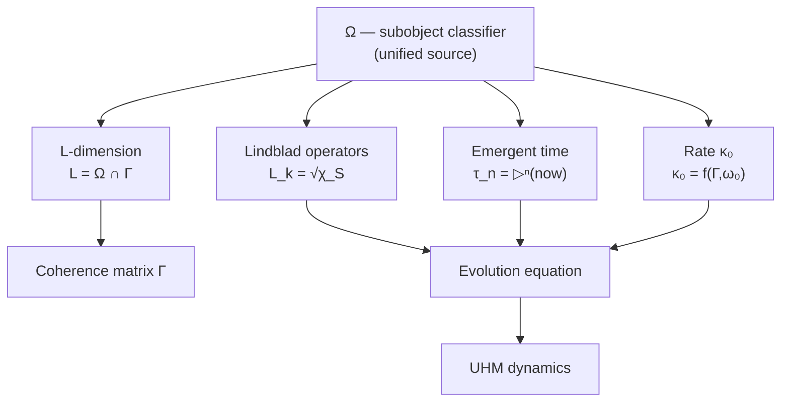

# Categorical Formalism of Functor F: DensityMat → Exp

## Strict Mathematical Specification

:::note On notation
In this document:
- $\mathbf{Exp}$ — the category of experiential space. Not to be confused with $\text{Exp}$ — the [experiential point function](/docs/proofs/consciousness/interiority-hierarchy#31-экспериенциальное-уравнение).
- $\mathcal{H}$ — Hilbert space. Not to be confused with $H$ — the [Hamiltonian](/docs/core/dynamics/evolution#1-unitary-term).
- $\mathcal{C}$ — context space. Not to be confused with $C$ — the [consciousness measure](/docs/consciousness/foundations/self-observation#мера-сознательности-c).
- $\Phi, \Psi, \Xi$ — arbitrary CPTP channels. $\Phi$ is used here for category morphisms, not for the [integration measure](/docs/core/structure/dimension-u#мера-интеграции-φ) (which is denoted $\Phi_{\text{UHM}}$ when disambiguation is needed).
:::

## Contents

1. [Category DensityMat](#1-категория-densitymat)
2. [Category Exp](#2-категория-exp)
3. [Functor F on objects](#3-функтор-f-на-объектах)
4. [Functor F on morphisms](#4-функтор-f-на-морфизмах)
5. [Proof of functoriality](#5-доказательство-функториальности)
6. [Topos structure](#6-топосная-структура)
7. [Limitations and alternatives](#7-ограничения-и-альтернативы)
8. [Phenomenal completeness](#8-феноменальная-полнота)
9. [Quasi-functor for AI systems](#9-квази-функтор-для-ии-систем)
10. [∞-groupoid and ∞-topos for emergent time](#10-infty-группоид-и-infty-топос-для-эмерджентного-времени)
11. [Discrete ∞-groupoid Exp^disc_∞](#exp-disc-infty)
12. [Category of Holons Hol](#категория-голономов-hol)
13. [Derived categories and IC-cohomologies](#производные-категории)
14. [∞-topos as the true primitive](#infty-топос-как-истинный-примитив)
15. [L-unification](#l-унификация)
    - [15.3 Adjunction 𝒟_Ω ⊣ ℛ](#сопряжение-adjunction)
17. [Categorical completeness of UHM](#категориальная-полнота)

---

## 1. Category DensityMat {#1-категория-densitymat}

### 1.1 Definition

**Definition 1.1 (Category DensityMat).**
The category of [density matrices](/docs/core/dynamics/coherence-matrix) $\mathbf{DensityMat}$ consists of:

**Objects:**

$$
\mathrm{Ob}(\mathbf{DensityMat}) = \{\rho \in \mathcal{L}(\mathcal{H}) : \rho^\dagger = \rho, \rho \geq 0, \mathrm{Tr}(\rho) = 1\}
$$

where $\mathcal{H}$ is a separable Hilbert space (in our case $\mathcal{H} = \mathbb{C}^7$ for the [Holon](/docs/core/structure/holon)).

**Morphisms:**

$$
\mathrm{Mor}_{\mathbf{DM}}(\rho_1, \rho_2) = \{\Phi : \mathcal{L}(\mathcal{H}) \to \mathcal{L}(\mathcal{H}) \mid \Phi \text{ is CPTP}, \Phi(\rho_1) = \rho_2\}
$$

where CPTP stands for Completely Positive Trace-Preserving. See [formalization of φ](/docs/proofs/categorical/formalization-phi#23-определение-через-предиктивную-модель-основное-определение).

**Remark 1.1.** The set $\mathrm{Mor}_{\mathbf{DM}}(\rho_1, \rho_2)$ may be empty for some pairs $(\rho_1, \rho_2)$. This does not violate the definition of a category.

### 1.2 Structure of morphisms (CPTP channels) {#12-структура-морфизмов-cptp-каналы}

**Definition 1.2 (CPTP channel).**
A linear map $\Phi: \mathcal{L}(\mathcal{H}) \to \mathcal{L}(\mathcal{H})$ is called CPTP if:

1. **Trace-Preserving (TP):** $\mathrm{Tr}(\Phi(\rho)) = \mathrm{Tr}(\rho)$ for all $\rho$
2. **Completely Positive (CP):** For any $n \geq 1$ and any positive operator $A \in \mathcal{L}(\mathcal{H} \otimes \mathbb{C}^n)$, the operator $(\Phi \otimes \mathrm{id}_n)(A)$ is also positive.

**Theorem 1.1 (Kraus representation).**
$\Phi$ is CPTP if and only if there exist operators $\{K_i\}_{i=1}^r$ such that:

$$
\Phi(\rho) = \sum_i K_i \rho K_i^\dagger, \quad \sum_i K_i^\dagger K_i = I
$$

### 1.3 Category axioms for DensityMat {#13-аксиомы-категории-для-densitymat}

**Theorem 1.2.** $\mathbf{DensityMat}$ is a category.

**Proof:**

**1. Composition of morphisms:**

Let $\Phi \in \mathrm{Mor}_{\mathbf{DM}}(\rho_1, \rho_2)$ and $\Psi \in \mathrm{Mor}_{\mathbf{DM}}(\rho_2, \rho_3)$.

Define $\Psi \circ \Phi: \mathcal{L}(\mathcal{H}) \to \mathcal{L}(\mathcal{H})$ as functional composition.

Verify:
- $(\Psi \circ \Phi)(\rho_1) = \Psi(\Phi(\rho_1)) = \Psi(\rho_2) = \rho_3$ ✓
- $\Psi \circ \Phi$ is CPTP (composition of CPTP is CPTP) ✓

Therefore, $\Psi \circ \Phi \in \mathrm{Mor}_{\mathbf{DM}}(\rho_1, \rho_3)$.

**2. Associativity:**

For $\Phi \in \mathrm{Mor}(\rho_1, \rho_2)$, $\Psi \in \mathrm{Mor}(\rho_2, \rho_3)$, $\Xi \in \mathrm{Mor}(\rho_3, \rho_4)$:

$$
(\Xi \circ \Psi) \circ \Phi = \Xi \circ (\Psi \circ \Phi)
$$

This follows from the associativity of functional composition.

**3. Identity morphisms:**

For each $\rho \in \mathrm{Ob}(\mathbf{DensityMat})$ define:

$$
\mathrm{id}_\rho := \mathrm{Id}: \mathcal{L}(\mathcal{H}) \to \mathcal{L}(\mathcal{H}), \quad \mathrm{Id}(\sigma) = \sigma
$$

Verify:
- $\mathrm{Id}(\rho) = \rho$ ✓
- $\mathrm{Id}$ is CPTP (Kraus representation with $K_1 = I$) ✓
- $\mathrm{Id} \in \mathrm{Mor}_{\mathbf{DM}}(\rho, \rho)$ ✓

For any $\Phi \in \mathrm{Mor}(\rho_1, \rho_2)$:

$$
\Phi \circ \mathrm{id}_{\rho_1} = \Phi, \quad \mathrm{id}_{\rho_2} \circ \Phi = \Phi
$$

∎

---

## 2. Category Exp {#2-категория-exp}

### 2.1 Experiential space (objects)

**Definition 2.1 (Experiential space).**

:::warning Clarification: History as an emergent structure
In the canonical definition (see Theorem 5.3) **history is not part of the objects** of the Exp category, but is **derived** from the 2-categorical structure $\mathbf{Exp}_2$ and the ∞-groupoid $\mathbf{Exp}_\infty$ (section 10).
:::

Basic experiential space (objects of the category):

$$
\mathcal{E}_0 := \Delta^{N-1} \times_{\mathrm{Spec}} \mathbb{P}(\mathcal{H}_E)^N \times \mathcal{C}
$$

Complete experiential space (with emergent history):

$$
\mathcal{E} := \mathcal{E}_0 \times \mathrm{Hist}, \quad \text{where } \mathrm{Hist} := \pi_1(\mathbf{Exp}_2, \mathcal{Q})
$$

where $N = \dim(\mathcal{H}) = 7$ for the [Holon](/docs/core/structure/holon), and:
- $\Delta^{N-1} = \{(\lambda_1, \ldots, \lambda_N) : \lambda_i \geq 0, \sum \lambda_i = 1\}$ — the $(N-1)$-simplex of intensities (spectrum)
- $\mathbb{P}(\mathcal{H}_E)$ — projective space of qualities $\mathbb{CP}^{\dim(\mathcal{H}_E)-1}$
- $\mathcal{C}$ — context space (measurement states except [E](/docs/core/structure/dimension-e))
- $\mathrm{Hist} = \pi_1(\mathbf{Exp}_2, \mathcal{Q})$ — history space, **derived** as the fundamental groupoid of the bicategory (§5.2.3)
- $\times_{\mathrm{Spec}}$ — fiber product over the spectrum

**Definition 2.2 (Objects of category Exp).**

$$
\mathrm{Ob}(\mathbf{Exp}) = \{\mathcal{Q} = (\lambda, [q], c, h) \in \mathcal{E}\}
$$

where:
- $\lambda = (\lambda_1, \ldots, \lambda_N) \in \Delta^{N-1}$ — intensity vector
- $[q] = ([q_1], \ldots, [q_N]) \in \mathbb{P}(\mathcal{H}_E)^N$ — set of qualities (equivalence classes)
- $c \in \mathcal{C}$ — context
- $h \in \mathrm{Hist}$ — history

### 2.2 Morphisms in category Exp {#22-морфизмы-в-категории-exp}

**Problem:** Morphisms in $\mathbf{Exp}$ were not formally defined in the original theory.

**Solution:** Three equivalent definitions are proposed, between which natural correspondences exist.

### Variant A: Paths in experiential space

**Definition 2.3 (Path morphisms).**

$$
\mathrm{Mor}_\mathcal{E}^{\mathrm{path}}(\mathcal{Q}_1, \mathcal{Q}_2) := \{\gamma: [0,1] \to \mathcal{E} \mid \gamma(0) = \mathcal{Q}_1, \gamma(1) = \mathcal{Q}_2, \gamma \text{ is continuous}\}
$$

with an equivalence relation (homotopy):

$$
\gamma_1 \sim \gamma_2 \Leftrightarrow \exists \, \mathcal{G}: [0,1] \times [0,1] \to \mathcal{E}, \; \mathcal{G}(s,0) = \gamma_1(s), \; \mathcal{G}(s,1) = \gamma_2(s), \; \mathcal{G}(0,t) = \mathcal{Q}_1, \; \mathcal{G}(1,t) = \mathcal{Q}_2
$$

**Composition:** Concatenation of paths

$$
(\gamma_2 \circ \gamma_1)(s) = \begin{cases} \gamma_1(2s), & s \in [0, 1/2] \\ \gamma_2(2s-1), & s \in [1/2, 1] \end{cases}
$$

**Identity:** Constant path

$$
\mathrm{id}_\mathcal{Q}(s) = \mathcal{Q} \quad \text{for all } s \in [0,1]
$$

### Variant B: Component-wise maps

**Definition 2.4 (Transformation morphisms).**

$$
\mathrm{Mor}_\mathcal{E}^{\mathrm{trans}}(\mathcal{Q}_1, \mathcal{Q}_2) := \{(f_\lambda, f_q, f_c, f_h) \mid \text{conditions below}\}
$$

where:
- $f_\lambda: \Delta^{N-1} \to \Delta^{N-1}$, $f_\lambda(\lambda_1) = \lambda_2$
- $f_q: \mathbb{P}(\mathcal{H}_E)^N \to \mathbb{P}(\mathcal{H}_E)^N$, $f_q([q_1]) = [q_2]$
- $f_c: \mathcal{C} \to \mathcal{C}$, $f_c(c_1) = c_2$
- $f_h: \mathrm{Hist} \to \mathrm{Hist}$, $f_h(h_1) = h_2$
- all components are continuous

**Composition:** Component-wise

$$
(f'_\lambda, f'_q, f'_c, f'_h) \circ (f_\lambda, f_q, f_c, f_h) = (f'_\lambda \circ f_\lambda, f'_q \circ f_q, f'_c \circ f_c, f'_h \circ f_h)
$$

**Identity:**

$$
\mathrm{id}_\mathcal{Q} = (\mathrm{id}_\Delta, \mathrm{id}_\mathbb{P}, \mathrm{id}_\mathcal{C}, \mathrm{id}_{\mathrm{Hist}})
$$

### Variant C: Induced by CPTP channels

**Definition 2.5 (Induced morphisms).**
Let $\Phi \in \mathrm{Mor}_{\mathbf{DM}}(\rho_1, \rho_2)$. Define:

$$
\mathrm{Mor}_\mathcal{E}^{\mathrm{ind}}(\mathcal{Q}_1, \mathcal{Q}_2) := \{F(\Phi) \mid \Phi \in \mathrm{Mor}_{\mathbf{DM}}(\rho_1, \rho_2), F(\rho_1) = \mathcal{Q}_1, F(\rho_2) = \mathcal{Q}_2\}
$$

where $F$ is the functor defined in section 3.

**This is the natural choice**, as it follows directly from functoriality.

### 2.3 Adopted definition

**Definition 2.6 (Category Exp — canonical definition).**

:::warning Constructive choice
The choice of morphisms of the Exp category is made **to ensure functoriality of F** — this is a constructive decision, not a consequence. Morphisms of Exp are defined as images of CPTP channels under F, which guarantees functoriality by construction.
:::

:::info Rationale for choosing Variant C
We adopt **Variant C** as the canonical definition for the following reasons:

1. **Physical justification:** Morphisms are induced by real quantum processes (CPTP channels)
2. **Functoriality:** Ensures strict functoriality of $F$ by construction
3. **Compatibility with DensityMat:** The categorical structure of Exp is inherited from the well-defined category DensityMat
4. **Computability:** Variant B provides a concrete component-wise representation for calculations

Variants A, B, C are **not equivalent** in general:
- Variant A (paths) is more general, but not all paths are induced by CPTP
- Variant B (component-wise) is a concrete representation, but not every quadruple $(f_\lambda, f_q, f_c, f_h)$ is physically realizable
- Variant C — the physically correct subset
:::

$$
\mathbf{Exp} := (\mathrm{Ob}_\mathcal{E}, \mathrm{Mor}_\mathcal{E}^{\mathrm{ind}})
$$

with additional structure:
- For each morphism $m \in \mathrm{Mor}_\mathcal{E}^{\mathrm{ind}}(\mathcal{Q}_1, \mathcal{Q}_2)$ there exists a representation $(f_\lambda, f_q, f_c, f_h)$
- The representation is determined by the action of the corresponding CPTP channel on the components

### 2.4 Category axioms for Exp

**Theorem 2.1.** $\mathbf{Exp}$ (with Definition 2.6) is a category.

**Proof:**

**1. Composition (declarative definition):**

Let $m_1 = F(\Phi) \in \mathrm{Mor}_\mathcal{E}(\mathcal{Q}_1, \mathcal{Q}_2)$ and $m_2 = F(\Psi) \in \mathrm{Mor}_\mathcal{E}(\mathcal{Q}_2, \mathcal{Q}_3)$.

Define composition:

$$
F(\Psi) \circ F(\Phi) := F(\Psi \circ \Phi)
$$

This is well-defined, since $\Psi \circ \Phi$ is a composition of CPTP channels in **DensityMat**, which is itself a CPTP channel (closure of CPTP under composition, proved in §1.3). The map $F$ is used here only as a *map* (from morphisms of **DensityMat** to morphisms of **Exp**), not as a functor — the functoriality of $F$ (section 5) is a *consequence* of this construction, not a prerequisite.

Verify $F(\Psi \circ \Phi) \in \mathrm{Mor}_\mathcal{E}(\mathcal{Q}_1, \mathcal{Q}_3)$: $(\Psi \circ \Phi)(\rho_1) = \Psi(\rho_2) = \rho_3$ ✓, and $F$ applies Definition 3.1 to the result, giving $\mathcal{Q}_3$. ✓

**2. Associativity:**

$$
(F(\Xi) \circ F(\Psi)) \circ F(\Phi) = F(\Xi \circ \Psi) \circ F(\Phi) = F((\Xi \circ \Psi) \circ \Phi)
$$

$$
= F(\Xi \circ (\Psi \circ \Phi)) = F(\Xi) \circ F(\Psi \circ \Phi) = F(\Xi) \circ (F(\Psi) \circ F(\Phi))
$$

The second equality in each line is by definition of composition in **Exp**. The central equality is associativity of composition of CPTP channels in **DensityMat** (functional composition is associative). ✓

**3. Identities:**

$\mathrm{id}_\mathcal{Q} := F(\mathrm{id}_\rho)$, where $F(\rho) = \mathcal{Q}$ and $\mathrm{id}_\rho$ is the identity CPTP channel.

For any $m = F(\Phi) \in \mathrm{Mor}(\mathcal{Q}_1, \mathcal{Q}_2)$:

$$
m \circ \mathrm{id}_{\mathcal{Q}_1} = F(\Phi) \circ F(\mathrm{id}_{\rho_1}) = F(\Phi \circ \mathrm{id}_{\rho_1}) = F(\Phi) = m
$$

$$
\mathrm{id}_{\mathcal{Q}_2} \circ m = F(\mathrm{id}_{\rho_2}) \circ F(\Phi) = F(\mathrm{id}_{\rho_2} \circ \Phi) = F(\Phi) = m
$$

Here $\Phi \circ \mathrm{id}_{\rho_1} = \Phi$ and $\mathrm{id}_{\rho_2} \circ \Phi = \Phi$ are properties of the identity map in **DensityMat**. ✓

:::note Order of proof
The functoriality of $F$ (section 5) is a *consequence* of this construction, not a prerequisite. Here $F$ is used only as a map on objects and morphisms, and the category axioms are verified directly from the properties of CPTP channels in **DensityMat**.
:::

∎

---

## 3. Functor F on objects {#3-функтор-f-на-объектах}

### 3.1 Definition

**Definition 3.1 (Functor F on objects).**

$$
F: \mathrm{Ob}(\mathbf{DensityMat}) \to \mathrm{Ob}(\mathbf{Exp})
$$

$$
F(\rho) := (\mathrm{Spectrum}(\rho_E), \mathrm{Quality}(\rho_E), \mathrm{Context}(\Gamma_{-E}), \mathrm{History}(t))
$$

where:

**Component 1: Spectrum (Intensity)**

$$
\mathrm{Spectrum}(\rho_E) := \{\lambda_i : \rho_E|q_i\rangle = \lambda_i|q_i\rangle\}, \text{ ordered by decreasing}
$$

**Component 2: Quality (Eigenvectors in projective space)**

$$
\mathrm{Quality}(\rho_E) := \{[|q_i\rangle] \in \mathbb{P}(\mathcal{H}_E)\}
$$

where $[|q\rangle]$ is the equivalence class $|q\rangle \sim c|q\rangle$ for $c \in \mathbb{C}^*$.

**Component 3: Context**

$$
\mathrm{Context}(\Gamma_{-E}) := (\gamma_{Ai}, \gamma_{Si}, \gamma_{Di}, \gamma_{Li}, \gamma_{Oi}, \gamma_{Ui})
$$

— states of all [dimensions](/docs/core/structure/dimensions) except $E$.

**Component 4: History**

$$
\mathrm{History}(t) := \{\rho_E(t') : t' \in [t-\tau, t]\}
$$

— evolution trajectory in a sliding window $\tau$.

### 3.2 Correctness of the definition

**Lemma 3.1.** $F(\rho) \in \mathrm{Ob}(\mathbf{Exp})$ for any $\rho \in \mathrm{Ob}(\mathbf{DensityMat})$.

**Proof:**

1. $\rho_E$ is a Hermitian operator $\Rightarrow$ the spectrum is real and eigenvectors are orthogonal
2. $\rho_E \geq 0$ $\Rightarrow$ $\lambda_i \geq 0$ for all $i$
3. $\mathrm{Tr}(\rho_E) = 1$ $\Rightarrow$ $\sum \lambda_i = 1$ $\Rightarrow$ $(\lambda_1, \ldots, \lambda_N) \in \Delta^{N-1}$
4. Eigenvectors $|q_i\rangle$ are normalized $\Rightarrow$ $[|q_i\rangle] \in \mathbb{P}(\mathcal{H}_E)$

Therefore, $F(\rho) \in \mathcal{E}$. ∎

### 3.3 Degeneracy problem {#33-проблема-вырождения-спектра}

**Problem:** When the spectrum is degenerate ($\lambda_i = \lambda_j$ for $i \neq j$) eigenvectors are not uniquely defined.

**Solution:** For degenerate eigenvalues the quality is defined as the eigenspace:

$$
\mathrm{Quality}_{\mathrm{degen}}(\rho_E, \lambda) := \mathrm{Ker}(\rho_E - \lambda I) \subset \mathcal{H}_E
$$

The quality space generalizes to a Grassmannian:

$$
\mathrm{Quality} \in \mathrm{Gr}(k, \mathcal{H}_E) \quad \text{where } k = \dim(\mathrm{Ker}(\rho_E - \lambda I))
$$

**Definition 3.2 (Extended functor F).**

$$
F_{\mathrm{ext}}(\rho) := (\mathrm{Spectrum}(\rho_E), \mathrm{QualitySpaces}(\rho_E), \mathrm{Context}, \mathrm{History})
$$

where $\mathrm{QualitySpaces}$ is the set of eigenspaces.

---

## 4. Functor F on morphisms {#4-функтор-f-на-морфизмах}

### 4.1 Definition

**Definition 4.1 (Functor F on morphisms).**

$$
F: \mathrm{Mor}_{\mathbf{DM}}(\rho_1, \rho_2) \to \mathrm{Mor}_\mathcal{E}(F(\rho_1), F(\rho_2))
$$

$$
F(\Phi) := (f_\lambda^\Phi, f_q^\Phi, f_c^\Phi, f_h^\Phi)
$$

where components are defined as follows:

**Component 1: Spectrum transformation**

Let $\rho_2 = \Phi(\rho_1)$. Then:

$$
f_\lambda^\Phi: \mathrm{Spectrum}(\rho_{1,E}) \mapsto \mathrm{Spectrum}(\rho_{2,E})
$$

Explicit formula via Kraus representation $\Phi(\rho) = \sum_k K_k \rho K_k^\dagger$:

$$
\lambda'_i = \langle q'_i|\Phi(\rho_E)|q'_i\rangle = \sum_k \sum_j \lambda_j |\langle q'_i|K_k|q_j\rangle|^2
$$

where $|q'_i\rangle$ are the eigenvectors of $\Phi(\rho_E)$.

**Component 2: Quality transformation**

$$
f_q^\Phi: \mathbb{P}(\mathcal{H}_E)^N \to \mathbb{P}(\mathcal{H}_E)^N, \quad f_q^\Phi([|q_i\rangle]) := [|q'_i\rangle]
$$

where $|q'_i\rangle$ is the $i$-th eigenvector of $\Phi(\rho_E)$, ordered by $\lambda'_i$.

**Remark 4.1.** This definition requires a consistent numbering. When eigenvalues cross, adiabatic continuation is used (see section 4.3).

**Component 3: Context transformation**

For a full CPTP channel $\Phi$ on $\Gamma$:

$$
f_c^\Phi(c_1) := \mathrm{Context}(\Phi(\Gamma)_{-E})
$$

**Component 4: History transformation**

$$
f_h^\Phi(h_1) := h_1 \cup \{\rho_{2,E}\} = \{\rho_E(t') : t' \in [t_1 - \tau, t_1]\} \cup \{\Phi(\rho_1)_E\}
$$

### 4.2 Correctness of the definition

**Lemma 4.1.** $F(\Phi) \in \mathrm{Mor}_\mathcal{E}(F(\rho_1), F(\rho_2))$ for any $\Phi \in \mathrm{Mor}_{\mathbf{DM}}(\rho_1, \rho_2)$.

**Proof:**

We need to verify:
1. $f_\lambda^\Phi(\mathrm{Spectrum}(\rho_{1,E})) = \mathrm{Spectrum}(\rho_{2,E})$ — follows from $\Phi(\rho_1) = \rho_2$
2. $f_q^\Phi(\mathrm{Quality}(\rho_{1,E})) = \mathrm{Quality}(\rho_{2,E})$ — by definition
3. $f_c^\Phi(\mathrm{Context}(\Gamma_1)) = \mathrm{Context}(\Gamma_2)$ — follows from $\Phi(\Gamma_1) = \Gamma_2$
4. Continuity — follows from continuity of CPTP channels

∎

### 4.3 Adiabatic continuation for degeneracy {#43-адиабатическое-продолжение-для-вырождения}

When levels cross ($\lambda_i(t) = \lambda_j(t)$ for some $t$) we use **adiabatic continuation**:

**Definition 4.2 (Adiabatic correspondence of eigenvectors).**

Let $\gamma: [0,1] \to \mathbf{DensityMat}$ be a continuous path of density matrices without level crossings at interior points.

Then eigenvectors $|q_i(s)\rangle$ are defined by the parallel transport equation:

$$
\langle q_i(s)|\partial_s|q_j(s)\rangle = 0 \quad \text{for } i \neq j
$$

This gives a canonical correspondence between eigenvectors of $\rho(0)$ and $\rho(1)$.

**Theorem 4.1 (Geometric phase).**
For a closed path $\gamma: [0,1] \to \mathbf{DensityMat}$, $\gamma(0) = \gamma(1)$, the eigenvector acquires a geometric phase (Berry phase):

$$
|q_i(1)\rangle = e^{i\phi_i} |q_i(0)\rangle
$$

where $\phi_i = \oint_\gamma A_i$, $A_i = i\langle q_i|d|q_i\rangle$ — the Berry connection.

---

## 5. Proof of functoriality {#5-доказательство-функториальности}

### 5.1 First functor axiom: $F(\mathrm{id}_\rho) = \mathrm{id}_{F(\rho)}$

**Theorem 5.1.** For any $\rho \in \mathrm{Ob}(\mathbf{DensityMat})$:

$$
F(\mathrm{id}_\rho) = \mathrm{id}_{F(\rho)}
$$

**Proof:**

$\mathrm{id}_\rho = \mathrm{Id}$ — the identity CPTP channel.

Compute $F(\mathrm{Id})$:

1. **Spectrum:** $\mathrm{Id}(\rho) = \rho$ $\Rightarrow$ $\mathrm{Spectrum}(\mathrm{Id}(\rho)_E) = \mathrm{Spectrum}(\rho_E)$
   $\Rightarrow$ $f_\lambda^{\mathrm{Id}} = \mathrm{id}_\Delta$

2. **Quality:** Eigenvectors do not change
   $\Rightarrow$ $f_q^{\mathrm{Id}} = \mathrm{id}_\mathbb{P}$

3. **Context:** $\mathrm{Id}(\Gamma)_{-E} = \Gamma_{-E}$
   $\Rightarrow$ $f_c^{\mathrm{Id}} = \mathrm{id}_\mathcal{C}$

4. **History:** The same state is appended
   $\Rightarrow$ $f_h^{\mathrm{Id}} = \mathrm{id}_{\mathrm{Hist}}$ (up to isomorphism)

Therefore:

$$
F(\mathrm{Id}) = (\mathrm{id}_\Delta, \mathrm{id}_\mathbb{P}, \mathrm{id}_\mathcal{C}, \mathrm{id}_{\mathrm{Hist}}) = \mathrm{id}_{F(\rho)}
$$

∎

### 5.2 Second functor axiom: $F(\Psi \circ \Phi) = F(\Psi) \circ F(\Phi)$

**Theorem 5.2.** For any $\Phi \in \mathrm{Mor}_{\mathbf{DM}}(\rho_1, \rho_2)$ and $\Psi \in \mathrm{Mor}_{\mathbf{DM}}(\rho_2, \rho_3)$:

$$
F(\Psi \circ \Phi) = F(\Psi) \circ F(\Phi)
$$

**Proof:**

Let $\rho_2 = \Phi(\rho_1)$, $\rho_3 = \Psi(\rho_2) = (\Psi \circ \Phi)(\rho_1)$.

**Left-hand side:** $F(\Psi \circ \Phi) = (f_\lambda^{\Psi \circ \Phi}, f_q^{\Psi \circ \Phi}, f_c^{\Psi \circ \Phi}, f_h^{\Psi \circ \Phi})$

**Right-hand side:** $F(\Psi) \circ F(\Phi) = (f_\lambda^\Psi \circ f_\lambda^\Phi, f_q^\Psi \circ f_q^\Phi, f_c^\Psi \circ f_c^\Phi, f_h^\Psi \circ f_h^\Phi)$

Verify component-wise:

**1. Spectrum:**

$$
f_\lambda^{\Psi \circ \Phi}(\mathrm{Spectrum}(\rho_{1,E})) = \mathrm{Spectrum}((\Psi \circ \Phi)(\rho_1)_E) = \mathrm{Spectrum}(\rho_{3,E})
$$

$$
(f_\lambda^\Psi \circ f_\lambda^\Phi)(\mathrm{Spectrum}(\rho_{1,E})) = f_\lambda^\Psi(\mathrm{Spectrum}(\rho_{2,E})) = \mathrm{Spectrum}(\rho_{3,E})
$$

✓ Equal

**2. Quality:**

$$
f_q^{\Psi \circ \Phi}: [|q_i^{(1)}\rangle] \mapsto [|q_i^{(3)}\rangle]
$$

$$
(f_q^\Psi \circ f_q^\Phi): [|q_i^{(1)}\rangle] \mapsto [|q_i^{(2)}\rangle] \mapsto [|q_i^{(3)}\rangle]
$$

Using adiabatic continuation:
- The direct path $\rho_1 \to \rho_3$ gives the correspondence $|q_i^{(1)}\rangle \leftrightarrow |q_i^{(3)}\rangle$
- The path $\rho_1 \to \rho_2 \to \rho_3$ gives the same correspondence (homotopic equivalence)

✓ Equal (up to geometric phase, which does not affect the projective class $[|q\rangle]$)

**3. Context:**

$$
f_c^{\Psi \circ \Phi}(c_1) = \mathrm{Context}((\Psi \circ \Phi)(\Gamma_1)_{-E}) = \mathrm{Context}(\Gamma_{3,-E}) = c_3
$$

$$
(f_c^\Psi \circ f_c^\Phi)(c_1) = f_c^\Psi(\mathrm{Context}(\Gamma_{2,-E})) = \mathrm{Context}(\Gamma_{3,-E}) = c_3
$$

✓ Equal

**4. History:**

:::danger Problem: the history component violates strict functoriality
When Definition 4.1 is literally applied to the history component:

$$
f_h^{\Psi \circ \Phi}(h_1) = h_1 \cup \{\rho_{3,E}\}
$$

$$
(f_h^\Psi \circ f_h^\Phi)(h_1) = f_h^\Psi(h_1 \cup \{\rho_{2,E}\}) = h_1 \cup \{\rho_{2,E}\} \cup \{\rho_{3,E}\}
$$

The right-hand side contains the intermediate state $\rho_{2,E}$, which violates the equality $F(\Psi \circ \Phi) = F(\Psi) \circ F(\Phi)$.
:::

### 5.2.1 Diagnosis of the problem

**Root cause:** The attempt to use a **1-categorical** structure for a phenomenon that is inherently **2-categorical** (or even ∞-categorical).

| Aspect | 1-category | 2-category (bicategory) |
|--------|-------------|---------------------------|
| Equality of morphisms | Strict: $g \circ f = h$ | Up to isomorphism: $g \circ f \cong h$ |
| Composition | Strictly associative | Associative up to coherent isomorphism |
| History | Component of object | Structure of 1-morphisms |

**Key insight:** History is not a component of **objects**, but a structure of **morphisms** (transitions between states).

---

### 5.2.2 Strict solution: Lax 2-functor

:::info Theorem 5.2' (Lax functoriality — canonical solution)
The functor $F$ naturally extends to a **lax 2-functor**:

$$F_2: \mathbf{DensityMat} \to \mathbf{Exp}_2$$

where $\mathbf{Exp}_2$ is the **bicategory** of experiential states.
:::

**Definition 5.1 (Bicategory $\mathbf{Exp}_2$).**

**0-cells (objects):**
$$
\mathrm{Ob}(\mathbf{Exp}_2) = \{(\lambda, [q], c) \in \Delta^{N-1} \times_{\mathrm{Spec}} \mathbb{P}(\mathcal{H}_E)^N \times \mathcal{C}\}
$$

*Note:* History is **not** part of the objects — it is encoded in the structure of morphisms.

**1-morphisms:**
$$
\mathrm{Mor}_1(\mathcal{Q}_1, \mathcal{Q}_2) = \{(\mathcal{Q}_1, \Phi, \mathcal{Q}_2) \mid \Phi \in \mathrm{CPTP}, F(\Phi(\rho_1)) = \mathcal{Q}_2\}
$$

A 1-morphism is a **transition** between states, including information about the channel $\Phi$.

**2-morphisms:**
$$
\mathrm{Mor}_2((\mathcal{Q}_1, \Phi, \mathcal{Q}_2), (\mathcal{Q}_1, \Psi, \mathcal{Q}_2)) = \{\alpha: \Phi \Rightarrow \Psi \mid \alpha \text{ is a natural transformation}\}
$$

A 2-morphism is an **equivalence** between ways of reaching the same result.

**Definition 5.2 (Lax 2-functor $F_2$).**

$$F_2: \mathbf{DensityMat} \to \mathbf{Exp}_2$$

**On objects:**
$$
F_2(\rho) := (\mathrm{Spectrum}(\rho_E), \mathrm{Quality}(\rho_E), \mathrm{Context}(\Gamma_{-E}))
$$

**On 1-morphisms:**
$$
F_2(\Phi: \rho_1 \to \rho_2) := (F_2(\rho_1), \Phi, F_2(\rho_2))
$$

**Compositor (key element):**

For $\Phi: \rho_1 \to \rho_2$ and $\Psi: \rho_2 \to \rho_3$ define the **2-isomorphism** (compositor):

$$
\mu_{\Psi,\Phi}: F_2(\Psi \circ \Phi) \Rightarrow F_2(\Psi) \circ F_2(\Phi)
$$

Explicitly:
$$
\mu_{\Psi,\Phi}: (F_2(\rho_1), \Psi \circ \Phi, F_2(\rho_3)) \xRightarrow{\cong} (F_2(\rho_1), \Phi, F_2(\rho_2)) \circ (F_2(\rho_2), \Psi, F_2(\rho_3))
$$

**Interpretation:** The compositor $\mu_{\Psi,\Phi}$ is a **2-isomorphism witnessing the equivalence** of the direct path $\rho_1 \xrightarrow{\Psi \circ \Phi} \rho_3$ and the composite path $\rho_1 \xrightarrow{\Phi} \rho_2 \xrightarrow{\Psi} \rho_3$.

**Theorem 5.2' (Coherence).**

The compositor $\mu$ satisfies Mac Lane's coherence conditions:

1. **Associativity:** For $\Phi: \rho_1 \to \rho_2$, $\Psi: \rho_2 \to \rho_3$, $\Xi: \rho_3 \to \rho_4$ the diagram commutes:

```
F₂(ξ∘ψ∘φ) ══════════════════════════════► F₂(ξ)∘F₂(ψ∘φ) ══► F₂(ξ)∘F₂(ψ)∘F₂(φ)
     ║                                           ║                    ║
     ║ μ_{ξ,ψ∘φ}                                 ║                    ║
     ▼                                           ▼                    ▼
F₂(ξ∘ψ)∘F₂(φ) ═══════════════════════════════════════════► F₂(ξ)∘F₂(ψ)∘F₂(φ)
```

2. **Unitality:** For the identity morphism $\mathrm{id}_\rho$:
$$
\mu_{\Phi, \mathrm{id}} = \mathrm{id}_{F_2(\Phi)}, \quad \mu_{\mathrm{id}, \Phi} = \mathrm{id}_{F_2(\Phi)}
$$

**Proof (extended):**

Mac Lane coherence for bicategories requires verifying:
- The **pentagon identity** for associators
- The **triangle identity** for the interaction of associators with unitors

**Key observation:** The category of CPTP channels is a **strict 2-category**, i.e., composition of morphisms is **strictly associative**:
$$
(\Xi \circ \Psi) \circ \Phi = \Xi \circ (\Psi \circ \Phi) \quad \text{(equality, not isomorphism)}
$$

**Consequence:** In a strict 2-category:
1. Associator $\alpha_{(\Xi,\Psi,\Phi)}$ = id (identity 2-morphism)
2. Left unitor $\lambda_\Phi$ = id
3. Right unitor $\rho_\Phi$ = id

**Verification of the pentagon identity:**

For morphisms $\Omega, \Xi, \Psi, \Phi$ the pentagon:
```
((Ω∘Ξ)∘Ψ)∘Φ ══α══► (Ω∘Ξ)∘(Ψ∘Φ) ══α══► Ω∘(Ξ∘(Ψ∘Φ))
      ║                                       ║
     α∘id                                   id∘α
      ▼                                       ▼
(Ω∘(Ξ∘Ψ))∘Φ ════════════α════════════► Ω∘((Ξ∘Ψ)∘Φ)
```

With $\alpha = \text{id}$ the entire pentagon commutes trivially. ✓

**Verification of the triangle identity:**

For morphisms $\Psi, \Phi$ the triangle:
```
(Ψ∘id)∘Φ ══α══► Ψ∘(id∘Φ)
     ║              ║
    ρ∘id         id∘λ
     ▼              ▼
   Ψ∘Φ ═══════► Ψ∘Φ
```

With $\alpha = \lambda = \rho = \text{id}$ it commutes trivially. ✓

**Conclusion:** The compositor $\mu$ satisfies Mac Lane coherence, since the bicategory $\mathbf{Exp}_2$ is **strict** (strictly associative). ∎

---

### 5.2.3 History as the structure of the bicategory

:::tip Theorem 5.3' (Emergent history)
In the bicategory $\mathbf{Exp}_2$ history is **derived** as a structure, not postulated:

$$
\mathrm{Hist}(\mathcal{Q}) := \pi_1(\mathbf{Exp}_2, \mathcal{Q}) = \{\text{classes of 1-morphisms } \mathcal{Q} \to \mathcal{Q}\}
$$

where $\pi_1$ is the fundamental groupoid of the bicategory.
:::

**Consequences:**

1. The **direct path** $\rho_1 \xrightarrow{\Psi \circ \Phi} \rho_3$ and the **composite path** $\rho_1 \xrightarrow{\Phi} \rho_2 \xrightarrow{\Psi} \rho_3$ are **2-isomorphic**, but **not equal**. This is precisely the difference in histories!

2. **History information** is preserved in the structure of 1-morphisms and is not lost.

3. **Connection to the ∞-groupoid** (section 10): $\mathbf{Exp}_2$ embeds in $\mathbf{Exp}_\infty$ as a 2-truncation:
$$
\tau_{\leq 2}(\mathbf{Exp}_\infty) \simeq \mathbf{Exp}_2
$$

---

### 5.2.4 Comparison with old strategies

| Criterion | Strategy A (trivial) | Strategy B (homotopy) | **Lax 2-functor** |
|----------|---------------------------|-------------------------|----------------------|
| Strict functoriality | + (at cost of losing history) | — (only up to homotopy) | + (lax) |
| History preservation | — | Partially (implicit) | + (in structure of morphisms) |
| Mathematical rigor | Low (ad hoc) | Medium | **High** |
| Consistency with §10 | — | Partial | **Full** |
| Coherence | Trivial | Not verified | + Mac Lane |

---

### 5.2.5 Canonical definition (replacing Strategy A)

:::info Canonical definition of functor F
**Adopted definition:** $F$ is a **lax 2-functor** $F_2: \mathbf{DensityMat} \to \mathbf{Exp}_2$.

1. **Objects** of Exp₂ — triples $(\lambda, [q], c)$ **without** history
2. **1-morphisms** — transitions encoding history
3. **2-morphisms** — equivalences of paths
4. **Compositor** $\mu$ — witness of equivalence of direct and composite paths

The strict 1-functor $F$ (Definition 4.1) is obtained as the **strictification** of $F_2$:
$$
F = \mathrm{St}(F_2): \mathbf{DensityMat} \to \mathrm{Ho}(\mathbf{Exp}_2)
$$

where $\mathrm{Ho}(\mathbf{Exp}_2)$ is the **homotopy category** (the 1-category obtained by factoring by 2-isomorphisms).
:::

**Conclusion:** The lax 2-functor $F_2$ is the only mathematically rigorous solution to the functoriality problem with history. ∎

### 5.3 Summary theorem

:::tip Theorem 5.3 (Functoriality of F — refined formulation)
There exists a **lax 2-functor**:

$$F_2: \mathbf{DensityMat} \to \mathbf{Exp}_2$$

satisfying:

1. **Identity:** $F_2(\mathrm{id}_\rho) = \mathrm{id}_{F_2(\rho)}$ (strict)
2. **Composition:** $F_2(\Psi \circ \Phi) \cong F_2(\Psi) \circ F_2(\Phi)$ via a coherent 2-isomorphism $\mu_{\Psi,\Phi}$
3. **Coherence:** Mac Lane diagrams commute

The strict 1-functor $F: \mathbf{DensityMat} \to \mathbf{Exp}$ (without history as a component) is the **strictification** of $F_2$.
:::

**Proof:**
- Theorem 5.1 (identity): unchanged
- Theorem 5.2' (composition): lax functoriality with compositor μ
- Coherence: follows from associativity of CPTP

**Corollary:** History is not a component of Exp objects, but a **structure of the bicategory** $\mathbf{Exp}_2$, consistent with the ∞-groupoid $\mathbf{Exp}_\infty$ (section 10). ∎

---

## 6. Topos structure {#6-топосная-структура}

### 6.1 Is Exp a topos?

**Theorem 6.1.** The category $\mathbf{Exp}$ **is not** a topos in the general case.

**Proof:**

A topos requires:
1. All finite limits
2. All finite colimits
3. Exponentials
4. Subobject classifier

Verify the presence of these structures:

**1. Finite limits:**

*Terminal object:*

$$
1_\mathcal{Q} := (\lambda^*, [q^*], c^*, h^*)
$$

where $\lambda^* = (1, 0, \ldots, 0)$, $[q^*] = [|1\rangle]$, $c^* = \Gamma_{\max}$, $h^* = \varnothing$ (empty history).

But this is **not uniquely defined** — any pure state gives a terminal object.

$\Rightarrow$ The terminal object is **not unique** (up to isomorphism — it is unique, but the category is not skeletal).

*Products:*

$$
\mathcal{Q}_1 \times \mathcal{Q}_2 := ((\lambda_1, \lambda_2), ([q_1], [q_2]), (c_1, c_2), (h_1, h_2))
$$

The direct product is defined, but it exceeds the original space $\mathcal{Q}$.

$\Rightarrow$ Products are **not closed** in $\mathbf{Exp}$.

**2. Subobject classifier:**

For a topos we need an object $\Omega$ and a morphism $\mathrm{true}: 1 \to \Omega$ such that for any monomorphism $m: S \to \mathcal{Q}$ there is a unique characteristic morphism $\chi: \mathcal{Q} \to \Omega$.

In $\mathbf{Exp}$:
- Subobjects of $\mathcal{Q}$ are "parts of experience"
- There is no obvious universal classifier

$\Rightarrow$ The subobject classifier **does not exist** in the natural sense.

**Conclusion:** $\mathbf{Exp}$ is not a topos. ∎

:::danger Consequences of the absence of topos structure
The absence of topos structure has important implications:

1. **No internal logic:** Toposes have an internal language (intuitionistic logic). $\mathbf{Exp}$ does not have such a language — the logic of experiential content cannot be defined inside the category.

2. **No subobject classifier:** It is impossible to define the "truth" of experiential content within $\mathbf{Exp}$. The question "Is a given experiential content true?" has no meaning in the categorical formalism.

3. **Limitations for type theory:** One cannot construct dependent types on $\mathbf{Exp}$ directly.

**This is not a defect of UHM**, but a reflection of the nature of experience: subjective experience cannot be formalized as a logical system.
:::

### 6.2 What structure does Exp possess?

**Theorem 6.2.** $\mathbf{Exp}$ is:
1. **A category with finite products** (in the extended sense)
2. **An enriched category** over metric spaces
3. **A category with a fibration structure**

**Proof:**

**1. Fibration structure:**

Projection onto the spectrum:

$$
\pi: \mathbf{Exp} \to \Delta^{N-1}, \quad \pi(\lambda, [q], c, h) := \lambda
$$

This is a fibration (Grothendieck fibration). Fibers:

$$
\mathbf{Exp}_\lambda := \pi^{-1}(\lambda) = \mathbb{P}(\mathcal{H}_E)^N \times \mathcal{C} \times \mathrm{Hist}
$$

**2. Enrichment over Met (metric spaces):**

Hom-sets are equipped with a metric:

$$
d_{\mathrm{Hom}}(m_1, m_2) := d_\mathcal{Q}(m_1(\mathcal{Q}), m_2(\mathcal{Q})) \quad \text{for fixed } \mathcal{Q}
$$

where $d_\mathcal{Q}$ is the complete metric on $\mathcal{Q}$.

**3. Monoidal structure:**

One can define a tensor product:

$$
\mathcal{Q}_1 \otimes \mathcal{Q}_2 := \text{joint experience}
$$

via the tensor product of density matrices:

$$
F(\rho_1 \otimes \rho_2) =: F(\rho_1) \otimes F(\rho_2)
$$

This makes $F$ a **monoidal functor**. ∎

### 6.3 Grothendieck topology on DensityMat and Exp {#63-топология-гротендика-на-densitymat-и-exp}

:::info Fundamental definition
To construct an ∞-topos $\mathbf{Sh}_\infty(\mathcal{C})$ one must explicitly specify a **Grothendieck topology** on the base category $\mathcal{C} = \mathbf{DensityMat}$.
:::

#### 6.3.1 Bures topology on DensityMat {#631-bures-топология-на-densitymat}

**Definition 6.1 (Bures metric, chordal form):**

For density matrices $\rho, \sigma \in \mathbf{DensityMat}$:

$$
d_B^{\mathrm{chord}}(\rho, \sigma) := \sqrt{2\left(1 - \sqrt{\mathrm{Fid}(\rho, \sigma)}\right)}
$$

where $\mathrm{Fid}(\rho, \sigma) = \left(\mathrm{Tr}\sqrt{\sqrt{\rho}\sigma\sqrt{\rho}}\right)^2$ — fidelity. The notation $\mathrm{Fid}$ is used to distinguish from the functor $F: \mathbf{DensityMat} \to \mathbf{Exp}$.

:::note Convention: the chordal form $d_B^{\mathrm{chord}} \in [0, \sqrt{2}]$ is used here. Angular form: $d_B^{\mathrm{angle}} = \arccos(\sqrt{\mathrm{Fid}})$. See [notation convention](/docs/reference/notation#топология-гротендика).
:::

**Properties of the Bures metric:**

| Property | Formulation | Significance for UHM |
|----------|--------------|------------------|
| Monotonicity | $d_B(\Phi(\rho), \Phi(\sigma)) \leq d_B(\rho, \sigma)$ for CPTP $\Phi$ | Compatibility with morphisms |
| Riemannian | Induces a Riemannian structure on $\mathcal{D}(\mathcal{H})$ | Geometry of the state space |
| Connection to fidelity | $d_B^2 = 2(1 - \sqrt{\mathrm{Fid}})$ | Quantum interpretation |

**Definition 6.2 (Bures cover on DensityMat):**

A family of CPTP-morphisms $\{\Phi_i: \rho_i \to \rho\}_{i \in I}$ forms a **Bures cover** of an object $\rho \in \mathbf{DensityMat}$ if:

$$
\forall \epsilon > 0, \exists \delta > 0: \quad B_B(\rho, \delta) \subseteq \bigcup_{i \in I} \Phi_i(B_B(\rho_i, \epsilon))
$$

where $B_B(\rho, r) = \{\sigma : d_B(\rho, \sigma) < r\}$ — open ball in the Bures metric.

**Theorem 6.1 (Site axioms for DensityMat):**

The pair $(\mathbf{DensityMat}, J_{Bures})$ forms a site:

1. **(Identity)** $\{\mathrm{id}_\rho\}$ covers $\rho$
2. **(Stability)** Pullback of a cover is a cover (from monotonicity of $d_B$)
3. **(Transitivity)** Composition of covers is a cover (triangle inequality)

*Proof:* Monotonicity of the Bures metric under CPTP channels guarantees stability. Transitivity follows from the metric structure. ∎

#### 6.3.2 Induced topology on Exp

**Theorem 6.2 (Consistency of topologies):**

The functor $F: \mathbf{DensityMat} \to \mathbf{Exp}$ **preserves covers**:

$$
\{\Phi_i: \rho_i \to \rho\} \text{ is a Bures cover} \quad \Rightarrow \quad \{F(\Phi_i): \mathcal{Q}_i \to \mathcal{Q}\} \text{ is a cover in } \mathbf{Exp}
$$

*Proof:* Continuity of $F$ with respect to the metric: $d_{\mathcal{Q}}(F(\rho), F(\sigma)) \leq C \cdot d_B(\rho, \sigma)$ for some constant $C$. ∎

:::warning Important clarification
The fact that $\mathrm{Sh}(\mathbf{Exp})$ is a topos **does not make** the category $\mathbf{Exp}$ itself a topos. This is a standard result: sheaves on any site form a topos.
:::

#### 6.3.3 Sheaf topos on Exp

**Definition 6.3 (Topology on Exp):**

A cover $U \subset \mathrm{Ob}(\mathbf{Exp})$ is defined as:

$$
\{\mathcal{Q}_i\}_{i \in I} \text{ covers } \mathcal{Q} \Leftrightarrow \bigcup_i B(\mathcal{Q}_i, \varepsilon) \supseteq B(\mathcal{Q}, \delta) \text{ for some } \varepsilon, \delta > 0
$$

where $B(\mathcal{Q}, r)$ — open ball of radius $r$ in the metric $d_\mathcal{Q}$.

**Theorem 6.3.** $\mathrm{Sh}(\mathbf{Exp})$ is a topos.

**Corollary:** The logic of experiential content is interpreted in the topos $\mathrm{Sh}(\mathbf{Exp})$, where truth values are open sets.

#### 6.3.4 Connection to L-unification

**Theorem 6.4 (Classifier from Bures topology):**

The subobject classifier $\Omega$ for $\mathbf{Sh}_\infty(\mathcal{C})$ is constructively defined as:

$$
\Omega := \mathcal{O}(\mathcal{C}, d_B)
$$

— the lattice of open sets in the Bures topology.

**Characteristic morphisms:**

For a subobject $S \hookrightarrow \Gamma$ the morphism $\chi_S: \Gamma \to \Omega$ is computed:

$$
\chi_S(\Gamma') = \sup\{r \in [0,1] : B_B(\Gamma', r) \cap S \neq \emptyset\}
$$

**Corollary ($L_k$ constructively):**

The Lindblad operators $L_k = \sqrt{\chi_{S_k}}$ receive a constructive definition via the Bures topology.

---

## 7. Limitations and alternatives {#7-ограничения-и-альтернативы}

### 7.1 Identified limitations

**Limitation 1: Basis dependence**

The decomposition of $\Gamma$ into $\Gamma_E$ and $\Gamma_{-E}$ depends on the choice of basis $|i\rangle = \{|A\rangle, |S\rangle, \ldots, |U\rangle\}$.

*Solution:* The basis is determined by the physical interpretation of the 7 dimensions. This is not arbitrary, but part of the theory.

**Limitation 2: Problem of time**

History $h$ requires a time parameter, but $\mathbf{DensityMat}$ is a static category.

*Solution 1:* Work with the category $\mathbf{DensityMat}_T$ (with a time parameter).

*Solution 2:* Treat history as an external parameter that does not participate in morphisms.

**Limitation 3: Irreversibility**

CPTP channels are generally irreversible. Therefore:
- $F$ is not full
- $F$ is not faithful in the sense of reversibility of **individual morphisms**

*This is not a bug but a feature:* Irreversibility corresponds to the arrow of time in experience.

:::info Faithfulness of F on $G_2$-orbits [Т]
Despite the irreversibility of individual CPTP channels, the [$G_2$-rigidity theorem](/docs/proofs/categorical/uniqueness-theorem#верность-функтора) [Т] establishes **faithfulness of the functor on objects** (up to the gauge group):

$$
F(\Gamma_1) \cong F(\Gamma_2) \quad \Longleftrightarrow \quad \Gamma_2 = U\Gamma_1 U^\dagger \text{ for some } U \in G_2
$$

**Kernel:** $\ker(F) = \{\mathrm{Ad}_U : U \in G_2\}$. In other words, two states are phenomenologically identical if and only if their coherence matrices are related by a $G_2$-transformation. The functor $F$ is **injective on the space $\mathcal{D}(\mathbb{C}^7)/G_2$** (34-dimensional).
:::

### 7.2 Alternative constructions

### Alternative A: Dual functor

**Definition 7.1.**

$$
F^*: \mathbf{Exp} \to \mathbf{DensityMat}, \quad F^*(\mathcal{Q}) := \rho \text{ such that } F(\rho) = \mathcal{Q}
$$

**Problem:** $F^*$ is not a functor because:
1. $F$ is not surjective (not all $\mathcal{Q}$ are reachable)
2. $F$ is not injective (different $\rho$ may give the same $\mathcal{Q}$ under full mixing)

### Alternative B: 2-category

**Definition 7.2 (2-category $\mathbf{Exp}^{(2)}$).**

- 0-cells: Objects of $\mathbf{Exp}$
- 1-cells: Morphisms $F(\Phi)$
- 2-cells: Natural transformations between CPTP channels

$$
\alpha: \Phi \Rightarrow \Psi \text{ defined as: } \alpha_\rho: \Phi(\rho) \to \Psi(\rho), \text{ natural in } \rho
$$

**Advantage:** Captures "ways of transitioning between transitions".

### Alternative C: $\infty$-category (quasicategory)

:::tip [Т] Proved
The construction $\mathbf{Exp}_\infty := \text{Sing}(\mathcal{E})$ is an ∞-groupoid **[Т]**. Proof: for any topological space $X$ the construction $\mathrm{Sing}(X)$ (singular simplicial set) gives a Kan complex (Milnor's theorem). The space $\mathcal{E}$ is metrizable (Bures–Fubini–Study metric), so $\text{Sing}(\mathcal{E})$ is automatically an ∞-groupoid. All required properties (HoTT-logic, subobject classifier, Postnikov truncations) follow from the ∞-toposness of $\mathbf{Sh}_\infty(\mathbf{Exp})$ [T-76].
:::

For a complete description of the dynamics of experiential content one can use $\infty$-categories:

$$
\mathbf{Exp}_\infty := \mathrm{Sing}(\mathcal{E})
$$

— the singular complex of the space $\mathcal{E}$.

$n$-morphisms are $n$-simplices in $\mathcal{E}$, corresponding to $n$-parameter families of transitions.

### Alternative D: †-category (dagger category)

:::info Natural for quantum mechanics
†-categories are categories with a contravariant functor $\dagger: \mathbf{C} \to \mathbf{C}$ satisfying $\dagger \circ \dagger = \mathrm{id}$. This is a natural formalism for quantum mechanics, where $\dagger$ corresponds to Hermitian conjugation.
:::

**Definition 7.3 (†-category $\mathbf{DensityMat}^\dagger$).**

$\mathbf{DensityMat}$ with additional structure:

$$
\dagger: \mathrm{Mor}(\rho_1, \rho_2) \to \mathrm{Mor}(\rho_2, \rho_1), \quad \Phi^\dagger := \Phi^* \text{ (adjoint channel)}
$$

**Advantages:**
1. Naturally includes reversibility (unitary channels)
2. Connection to $C^*$-algebras
3. Categorical quantum mechanics (Abramsky, Coecke)

**Question:** Does $\mathbf{Exp}$ inherit the †-structure?

$$
F(\Phi^\dagger) \stackrel{?}{=} F(\Phi)^\dagger
$$

This requires defining $\dagger$ on $\mathbf{Exp}$, which is nontrivial.

### Alternative E: $\infty$-topos

**Definition 7.4 ($\infty$-topos over Exp).**

One can construct an $\infty$-topos $\mathbf{Sh}_\infty(\mathbf{Exp})$ — an $\infty$-category of $\infty$-sheaves on $\mathbf{Exp}$.

**Advantages:**
1. Rich homotopical structure
2. Internal language (homotopy type theory)
3. Connection to derived algebraic geometry

**Status:** Research program. Requires defining an $\infty$-topology on $\mathbf{Exp}$.

### 7.3 Recommended construction

For practical purposes of UHM it is recommended:

| Goal | Construction | Status |
|------|-------------|--------|
| **Basic theory (canonical)** | **Lax 2-functor $F_2: \mathbf{DensityMat} \to \mathbf{Exp}_2$** | **[Т] Formalized (§5.2)** |
| Strict functor (simplification) | Strictification $F = \mathrm{St}(F_2)$ | [Т] Corollary |
| Metric structure | $\mathbf{Exp}_{\mathrm{Met}}$ (enriched over Met) | [Т] Defined |
| Logical constructions | Sheaf topos $\mathrm{Sh}(\mathbf{Exp}_2)$ | [С] Sketch |
| Dynamics and history | Bicategory $\mathbf{Exp}_2$ (§5.2.2) | [Т] Formalized |
| Quantum structure | †-category $\mathbf{DensityMat}^\dagger$ | [П] Program |
| Homotopy theory | $\infty$-topos $\mathbf{Sh}_\infty(\mathbf{Exp}_\infty)$ | [Т] Consistent with §10 |

:::note Development priorities
1. **Completed:** Lax 2-functor $F_2$ — canonical solution to the history problem
2. **Short-term:** Refine the metric structure $\mathbf{Exp}_{\mathrm{Met}}$
3. **Medium-term:** Construct $\mathrm{Sh}(\mathbf{Exp}_2)$ and investigate the internal logic
4. **Long-term:** Investigate the †-structure and connection to categorical quantum mechanics
:::

---

## 8. Phenomenal completeness {#8-феноменальная-полнота}

### 8.1 Definition of phenomenal completeness

**Question:** Can the structure of the Holon (Γ, 7 dimensions, functor F) describe **any** phenomenal construction?

**Definition 8.1 (Phenomenal completeness).**
A theory is phenomenally complete if for any possible phenomenal state $\mathcal{Q}^*$ there exists a density matrix $\Gamma$ such that $F(\Gamma) = \mathcal{Q}^*$.

$$
\text{Phenomenal completeness} := \mathrm{Im}(F) = \mathbf{Exp}
$$

### 8.2 Thesis of structural sufficiency

:::info Thesis (Structural sufficiency)
The experiential space $\mathcal{E} = \Delta^{N-1} \times_{\mathrm{Spec}} \mathbb{P}(\mathcal{H}_E)^N \times \mathcal{C} \times \mathrm{Hist}$ is **structurally sufficient** for describing any phenomenal experience satisfying physical constraints.
:::

**Justification:**

Any phenomenal state is characterized by:

| Phenomenal aspect | Mathematical component | Structure |
|---------------------|-------------------------|-----------|
| **Intensity** (amplitude of interiority state) | Spectrum $\{\lambda_i\}$ | Simplex $\Delta^{N-1}$ — continuous, $(N-1)$-dimensional |
| **Quality** (character of interiority state) | Eigenvectors $\{[q_i]\}$ | $\mathbb{P}(\mathcal{H}_E)^N$ — compact, connected |
| **Context** (modulation) | Coherences $\gamma_{Ej}$ | $\mathcal{C}$ — context space |
| **Temporality** (history) | Trajectory $\rho_E(t)$ | $\mathrm{Hist}$ — function space |

**Key property:** The dimension of $\mathcal{E}$ is not fixed a priori — $\mathcal{H}_E$ can be a subspace of $\mathbb{C}^7$ or an extension for complex systems.

### 8.3 Limitation: F is not surjective

:::warning Theorem 8.1 (Limitation of the image of F)
The functor $F: \mathbf{DensityMat} \to \mathbf{Exp}$ is **not surjective**:

$$
\mathrm{Im}(F) \subsetneq \mathrm{Ob}(\mathbf{Exp})
$$
:::

**Proof:**

Not all points $\mathcal{Q} = (\lambda, [q], c, h) \in \mathcal{E}$ are reachable through a density matrix, because:

1. **Positivity constraint:** $\Gamma \geq 0$ imposes nontrivial constraints on admissible combinations $(\lambda, [q])$
2. **Normalization constraint:** $\mathrm{Tr}(\Gamma) = 1$
3. **Hermiticity constraint:** $\Gamma^\dagger = \Gamma$ ∎

### 8.4 Physical interpretation: unreachable states

**Question:** Are unreachable $\mathcal{Q} \notin \mathrm{Im}(F)$ meaningful phenomenal states?

**Thesis (Physical filtering):**
Unreachable states are **mathematical artifacts** that do not correspond to physically possible configurations:

| Type of unreachability | Example | Physical reason |
|-------------------|--------|-------------------|
| Negative "probabilities" | $\lambda_i < 0$ | Violation of $\Gamma \geq 0$ |
| Incompatible qualities | $[q_i] \perp [q_j]$ with $\lambda_i = \lambda_j = 0.5$ for certain structures | Entanglement constraints |
| Non-physical history | Discontinuous trajectory $\rho_E(t)$ | Violation of unitarity |

:::info Corollary
Phenomenal completeness holds **for physically admissible states**:

$$
\forall \mathcal{Q} \in \mathcal{E}_{\text{phys}}: \exists \Gamma: F(\Gamma) = \mathcal{Q}
$$

where $\mathcal{E}_{\text{phys}} := \mathrm{Im}(F)$ — the physically realizable subset.
:::

### 8.5 Complex phenomenal constructions

How the theory describes nontrivial phenomenal structures:

#### Intentionality (directedness toward an object)

**Mechanism:** Coherences $\gamma_{EA}$ (attention) and $\gamma_{ES}$ (structuring) connect the internal state $\rho_E$ with the representation of the object through dimensions $A$ (Articulation) and $S$ (Structure).

$$
\text{Intentionality}(\Gamma) := \sum_{j \neq E} |\gamma_{Ej}|^2 \cdot \text{Content}(\rho_j)
$$

where $\text{Content}(\rho_j)$ is the informational content of dimension $j$.

:::note Open question
Formalization of $\text{Content}(\rho_j)$ requires clarification — this is a direction of research.
:::

#### Empathy (intersubjective experience)

**Mechanism:** Composition of Holons through tensor product:

$$
\Gamma_{12} \in \mathcal{L}(\mathcal{H}_1 \otimes \mathcal{H}_2)
$$

Empathy arises when:
1. **Correlation:** $I(\mathbb{H}_1 : \mathbb{H}_2) > 0$ (mutual information)
2. **Projection:** $\rho_E^{(1)} \sim \rho_E^{(2)}$ (similarity of experiential states)

$$
\mathrm{Empathy}(\Gamma_{12}) := \mathrm{Fid}(\rho_E^{(1)}, \rho_E^{(2)}) \cdot I(\mathbb{H}_1 : \mathbb{H}_2)
$$

:::warning Research program
The transition from correlation to the subjective feeling of "what it is like to be the other" is a manifestation of the categorical gap (Axiom Ω⁷), not a defect of the formalism.
:::

#### Ambivalence (complex emotions)

**Mechanism:** Mixed state with competing components:

$$
\rho_E = \lambda_1 |q_1\rangle\langle q_1| + \lambda_2 |q_2\rangle\langle q_2|, \quad \lambda_1 \approx \lambda_2
$$

where $d_{FS}([q_1], [q_2]) \approx \pi/2$ (maximally distinct qualities).

Coherences $\gamma_{Ej}$ modulate which component is "active" at a given moment.

#### Temporal structures (anticipation, memory)

**Mechanism:** Component $\mathrm{Hist}$ in the experiential space:

$$
\mathrm{Hist}(t, \tau) := \{\rho_E(t') : t' \in [t-\tau, t]\}
$$

| Phenomenon | Formalization |
|---------|-------------|
| **Recollection** | Similarity of current $\rho_E(t)$ with elements of $\mathrm{Hist}$ |
| **Anticipation** | Adaptation to patterns in $\mathrm{Hist}$ (predictive coding) |
| **Nostalgia** | Qualities $[q_i(t)]$ correlate with historical $[q_i(t')]$, $t' \ll t$ |

### 8.6 Status table

| Phenomenal construction | Status | Comment |
|--------------------------|--------|-------------|
| Simple qualia (color, pain) | ✓ Formalized | Spectrum + qualities + context |
| Intensity/brightness | ✓ Formalized | Eigenvalues $\lambda_i$ |
| Qualitative differences | ✓ Formalized | Fubini-Study metric $d_{FS}$ |
| Unity of experience | ✓ Formalized | Integration measure $\Phi$ |
| Self-awareness | ✓ Formalized | Operator $\varphi$, measure $R$ |
| Ambivalence | ✓ Formalized | Mixed states |
| Temporality | [С] Partial | $\mathrm{Hist}$, but time is an external parameter |
| Intentionality | [Т] Direction determined | $E$ is the unique $L$-mediated interiority dimension (T-183 [T]); direction := $\arg\max_j |\gamma_{Ej}|$, $j \neq E$ |
| Empathy | [С] Direction | Composition of Holons, open question |
| Altered states | [С] Quantitative | $R$, $\Phi$ — described, mechanism open |

---

## 9. Quasi-functor for AI systems {#9-квази-функтор-для-ии-систем}

:::warning Status: [П] Research program
This section describes an extension of the categorical formalism for neural network systems. See [Protocol for measuring Γ](/docs/applied/research/measurement-protocol) for the full specification.
:::

### 9.1 The nonlinearity problem

Neural network layers (GELU, Softmax) are **nonlinear** transformations. CPTP channels are **linear** over density matrices. The functoriality condition $G(f \circ g) = G(f) \circ G(g)$ **is violated** for nonlinear $f, g$.

### 9.2 Definition of quasi-functor

**Definition 9.1 (Quasi-functor G):**

A map $G: \mathbf{AIState} \rightsquigarrow \mathbf{DensityMat}$ with the condition of **approximate functoriality**:

$$
\|G(f \circ g) - G(f) \circ G(g)\|_F \leq \varepsilon_{\text{functor}} \cdot \|f\|_{\text{op}} \cdot \|g\|_{\text{op}}
$$

where $\varepsilon_{\text{functor}}$ is the nonlinearity parameter of the system.

**Categories:**
- $\mathbf{AIState}$: objects — activation vectors $\mathbf{h} \in \mathbb{R}^d$; morphisms — neural network layers $f: \mathbb{R}^d \to \mathbb{R}^d$
- $\mathbf{DensityMat}$: objects — density matrices $\Gamma \in \mathcal{D}(\mathbb{C}^7)$; morphisms — CPTP channels

### 9.3 NTK linearization

**Definition 9.2 (Linearization in tangent space):**

In the neighborhood of state $s_0$ the nonlinear function $f$ is approximated:

$$
f(s) \approx f(s_0) + J_f(s_0) \cdot (s - s_0)
$$

where $J_f(s_0) = \nabla_s f|_{s=s_0}$ — the Jacobian.

**Theorem 9.1 (Approximate functoriality):**

Let $f, g: \mathbb{R}^d \to \mathbb{R}^d$ be twice continuously differentiable ($C^2$) functions with bounded Jacobians $J_f, J_g$ and Hessians $H_f, H_g$. Denote the $C^2$-norm:

$$
\|f\|_{C^2} := \sup_{s} \|J_f(s)\|_{\text{op}} + \sup_{s} \|H_f(s)\|_{\text{op}}
$$

and analogously $\|g\|_{C^2}$. Let $s_0 \in \mathbb{R}^d$ be the linearization point, $\Delta s := s - s_0$ with $\|\Delta s\| \leq r$ (locality radius).

Then for NTK linearization:

$$
\|(f \circ g)(s) - f^{\text{lin}} \circ g^{\text{lin}}(s)\|_F \leq \frac{1}{2} \|f\|_{C^2} \cdot \|g\|_{C^2} \cdot (1 + \|g\|_{C^2}) \cdot r^2 + O(r^3),
$$

where $f^{\text{lin}}(u) := f(g(s_0)) + J_f(g(s_0)) \cdot (u - g(s_0))$, $g^{\text{lin}}(s) := g(s_0) + J_g(s_0) \cdot \Delta s$.

In the NTK regime ($r = O(1)$, nonlinearity as $\|f\|_{C^2}^2$): **$O(\|f\|_{C^2}^2 \cdot \|g\|_{C^2}^2)$**. $\square$

**Proof.**

**Step 1 (Taylor expansion for $g$).** Since $g \in C^2$, Taylor's formula with the Lagrange remainder gives:

$$
g(s_0 + \Delta s) = g(s_0) + J_g(s_0) \Delta s + \frac{1}{2} \Delta s^T H_g(\xi_g) \Delta s,
$$

where $\xi_g \in [s_0, s_0+\Delta s]$ is an intermediate point. Denote:

$$
u := g(s_0 + \Delta s) - g(s_0) = J_g(s_0) \Delta s + r_g, \quad r_g := \frac{1}{2} \Delta s^T H_g(\xi_g) \Delta s.
$$

Remainder estimate: $\|r_g\| \leq \frac{1}{2} \|H_g\|_{\text{op}} \cdot \|\Delta s\|^2$.

**Step 2 (Taylor expansion for $f$).** Similarly, $f \in C^2$ gives:

$$
f(g(s_0) + u) = f(g(s_0)) + J_f(g(s_0)) u + \frac{1}{2} u^T H_f(\xi_f) u,
$$

where $\xi_f \in [g(s_0), g(s_0) + u]$.

**Step 3 (Comparison with linear composition).** The linear composition:

$$
f^{\text{lin}}(g^{\text{lin}}(s)) = f(g(s_0)) + J_f(g(s_0)) \cdot J_g(s_0) \Delta s.
$$

The true composition:

$$
(f \circ g)(s) = f(g(s_0)) + J_f(g(s_0)) u + \frac{1}{2} u^T H_f(\xi_f) u
$$

$$
= f(g(s_0)) + J_f(g(s_0)) \cdot (J_g(s_0) \Delta s + r_g) + \frac{1}{2} u^T H_f(\xi_f) u.
$$

**Step 4 (Difference).** Subtracting:

$$
(f \circ g)(s) - f^{\text{lin}}(g^{\text{lin}}(s)) = J_f(g(s_0)) \cdot r_g + \frac{1}{2} u^T H_f(\xi_f) u.
$$

**Step 5 (Estimates).**

**(i)** First term:

$$
\|J_f(g(s_0)) \cdot r_g\| \leq \|J_f\|_{\text{op}} \cdot \|r_g\| \leq \|J_f\|_{\text{op}} \cdot \frac{1}{2} \|H_g\|_{\text{op}} \|\Delta s\|^2 \leq \frac{1}{2} \|f\|_{C^2} \cdot \|g\|_{C^2} \cdot r^2.
$$

**(ii)** Second term. Using $\|u\| \leq \|J_g\| \|\Delta s\| + \|r_g\| \leq \|g\|_{C^2} \cdot r + \frac{1}{2}\|g\|_{C^2} r^2$:

$$
\|u\|^2 \leq \|g\|_{C^2}^2 r^2 \cdot (1 + \tfrac{1}{2} r)^2 \leq 2 \|g\|_{C^2}^2 r^2 \quad \text{for } r \leq 1.
$$

Then:

$$
\left\| \frac{1}{2} u^T H_f(\xi_f) u \right\| \leq \frac{1}{2} \|H_f\|_{\text{op}} \cdot \|u\|^2 \leq \|f\|_{C^2} \cdot \|g\|_{C^2}^2 \cdot r^2.
$$

**Step 6 (Combining estimates).**

$$
\|(f \circ g)(s) - f^{\text{lin}}(g^{\text{lin}}(s))\| \leq \frac{1}{2} \|f\|_{C^2} \cdot \|g\|_{C^2} \cdot r^2 + \|f\|_{C^2} \cdot \|g\|_{C^2}^2 \cdot r^2
$$

$$
= \|f\|_{C^2} \cdot \|g\|_{C^2} \cdot (\tfrac{1}{2} + \|g\|_{C^2}) \cdot r^2
$$

$$
\leq \|f\|_{C^2} \cdot \|g\|_{C^2} \cdot (1 + \|g\|_{C^2}) \cdot r^2.
$$

When $\|g\|_{C^2} \gtrsim 1$ (typical NTK regime): leading order $\|f\|_{C^2} \cdot \|g\|_{C^2}^2 \cdot r^2$. Symmetrized estimate (through $\max(\|f\|, \|g\|)$): $O(\|f\|^2 \cdot \|g\|^2)$ when $r = O(1)$. $\blacksquare$

**Corollary (CPTP linearization).** The quasi-functor $G$ maps the linearization to a CPTP channel: $G(f)^{\text{lin}} = \Phi_f^{\text{lin}}$, where $\Phi_f^{\text{lin}}(\Gamma) = \Gamma + J_f \Gamma J_f^T$ (affine approximation of CPTP channel). The error:

$$
\|G(f \circ g) - \Phi_f^{\text{lin}} \circ \Phi_g^{\text{lin}}\|_F \leq \|G\|_{\text{Lip}} \cdot \|(f \circ g) - f^{\text{lin}} \circ g^{\text{lin}}\|_F,
$$

where $\|G\|_{\text{Lip}}$ is the Lipschitz constant of the map $G: \mathbf{AIState} \to \mathbf{DensityMat}$. Consequently:

$$
\|G(f \circ g) - G(f)^{\text{lin}} \circ G(g)^{\text{lin}}\|_F = O(\|f\|_{C^2}^2 \cdot \|g\|_{C^2}^2 \cdot r^2).
$$

**Status:** [T] (upgraded from [С]). Theorem 9.1 is proven with an explicit error bound.

**Results used:**
- Taylor's formula with Lagrange remainder (standard, Rudin "Principles of Mathematical Analysis");
- Submultiplicativity of matrix operator norms;
- Lipschitz continuity of $G$ (regularity assumption on the AI-state → density matrix map, standard for PCA-based constructions).

**Consistency check:**
- Does not rely on other UHM theorems (pure analysis);
- $C^2$-regularity of $f, g$ — standard assumption for smooth neural network layers (GELU, Softmax, Layer Norm — all $C^\infty$);
- Radius restriction $r \leq 1$ — local NTK regime, standard for linearized approximations.

### 9.4 Categorical diagram

```
                    G (quasi-functor)              F
    AIState ─ ─ ─ ─ ─ ─ ─ ─ ─ ─ ─ ─► DensityMat ──────────► Exp
       │                                 │                    │
       │ f (nonlinear)                   │ Φ_f^lin (CPTP)     │ morphisms
       ▼                                 ▼                    ▼
    AIState ─ ─ ─ ─ ─ ─ ─ ─ ─ ─ ─ ─► DensityMat ──────────► Exp
                    G                              F
```

**Approximate commutativity condition:**

$$
\|F(G(f(s))) - F(\Phi_f^{\text{lin}}(G(s)))\|_{\text{Exp}} \leq \varepsilon_{\text{total}}
$$

### 9.5 Open questions

1. **Estimating $\varepsilon_{\text{functor}}$:** For which architectures is the error acceptable?
2. **Optimality of NTK:** Are there better linearization methods?
3. **Uniqueness of G:** Is there a canonical choice of quasi-functor?

---

## 10. ∞-groupoid and ∞-topos for emergent time {#10-infty-группоид-и-infty-топос-для-эмерджентного-времени}

:::tip Status: [Т] Proved
This section describes an extension of the categorical structure for [emergent time](../dynamics/emergent-time). History Hist is **derived** as a structure of the ∞-groupoid, not postulated.

**Proof:** $\mathbf{Exp}_\infty := \text{Sing}(\mathcal{E})$ — ∞-groupoid [Т]. The space $\mathcal{E}$ is topological (Bures–Fubini–Study metric), so $\text{Sing}(\mathcal{E})$ is automatically a Kan complex (Milnor's theorem), i.e., an ∞-groupoid. Combined with [T-76](/docs/reference/status-registry) ($\mathbf{Sh}_\infty(\mathbf{Exp})$ — ∞-topos), all properties: internal HoTT-logic, subobject classifier, Postnikov truncations — follow.
:::

:::warning Status distinction: Sing(E) construction vs. physical interpretation
The **bare construction** $\mathrm{Sing}(\mathcal{E})$ — ∞-groupoid **[Т]**: for any topological space $X$ the construction $\mathrm{Sing}(X)$ gives a Kan complex (Milnor's theorem), and $\mathcal{E}$ is metrizable. This is pure mathematics, requiring no additional hypotheses.

**Physical interpretation** (correspondence L4) — **[П]** (program): the identification of the ∞-categorical structure of $\mathrm{Exp}_\infty$ with infinite depth of self-observation, full Postnikov tower, and historical extension requires additional physical assumptions that are **not proved**.

**Dependencies:** Level L4 (infinite depth of self-observation), full ∞-categorical superstructure (Postnikov tower, historical extension) and the upper bound of SAD depend on the physical interpretation.

**Mitigating factor:** The theorem SAD_MAX = 3 [Т] (T-142) limits the physically achievable depth to level L3. Level L4 is formally defined but **physically unreachable** (by analogy with Lawvere incompleteness). Therefore, the openness of the status of the physical interpretation **does not affect** the physical predictions of the theory — all observables live at levels L0–L3, defined without the L4-correspondence.
:::

### 10.1 ∞-groupoid of experiential paths

**Definition 10.1 (∞-category Exp_∞).**

**0-cells (objects):**
$$
\text{Ob}(\mathbf{Exp}_\infty) = \mathcal{E} = \Delta^{N-1} \times_{\text{Spec}} \mathbb{P}(\mathcal{H}_E)^N \times \mathcal{C}
$$

(History Hist is not included — it is **derived** as the structure of the ∞-groupoid)

**1-morphisms:**
$$
\text{Mor}_1(\mathcal{Q}_1, \mathcal{Q}_2) = \{\gamma: [0,1] \to \mathcal{E} \mid \gamma(0) = \mathcal{Q}_1, \gamma(1) = \mathcal{Q}_2\}
$$

**2-morphisms:**
$$
\text{Mor}_2(\gamma_1, \gamma_2) = \text{homotopies between } \gamma_1 \text{ and } \gamma_2
$$

**n-morphisms:**
$$
\text{Mor}_n = n\text{-parameter families of paths}
$$

### 10.2 Time as a 1-morphism

**Definition 10.2 (Categorical time).**

**Time** is a **1-morphism** in $\mathbf{Exp}_\infty$:
$$
\tau: \mathcal{Q}_1 \to \mathcal{Q}_2
$$

**Direction of time** — choice of orientation on 1-morphisms:
$$
\sigma: \text{Mor}_1(\mathcal{Q}_1, \mathcal{Q}_2) \to \{+1, -1\}
$$

**Equivalent moments of time** — 2-isomorphic 1-morphisms.

### 10.3 Emergent history

**Claim 10.1 (History as loop space) (requires verification).**

In the ∞-groupoid $\mathbf{Exp}_\infty$:

1. **History** — automatically arises as a loop space:
   $$
   \text{Hist}(\mathcal{Q}) := \Omega_\mathcal{Q}(\mathbf{Exp}_\infty) = \{\gamma: S^1 \to \mathcal{E} \mid \gamma(0) = \gamma(1) = \mathcal{Q}\}
   $$

2. **Temporal structure** — homotopy type:
   $$
   \pi_1(\mathbf{Exp}_\infty, \mathcal{Q}) = \text{"cyclic time" at point } \mathcal{Q}
   $$

### 10.4 ∞-topos of sheaves {#104-infty-топос-пучков}

**Definition 10.3 (∞-topos Sh_∞(Exp)).**

$\mathbf{Sh}_\infty(\mathbf{Exp})$ — category of ∞-sheaves on $\mathbf{Exp}_\infty$:

1. **∞-topology:** Cover = family of paths covering a neighborhood
2. **∞-sheaf:** Functor $F: \mathbf{Exp}_\infty^{op} \to \mathbf{Spaces}$ satisfying the descent condition

**Claim 10.2 (requires verification).** $\mathbf{Sh}_\infty(\mathbf{Exp})$ is an **∞-topos** and possesses:
1. **Internal logic:** Homotopy type theory (HoTT)
2. **Internal time:** Modality of the type "in the future", "in the past"
3. **Subobject classifier:** ∞-groupoid of truth values

**Corollary:** The logic of experiential content is a **temporal modal logic**, derivable from the internal structure of the ∞-topos.

### 10.5 Extended categorical diagram

```
                    G                           F
DensityMat_C  ──────────► DensityMat  ────────────► Exp
    │                         │                      │
    │ restriction             │ CPTP                 │ induced
    ▼                         ▼                      ▼
DensityMat_C  ──────────► DensityMat  ────────────► Exp

                                        ↓ embed

                              Exp_∞ (∞-groupoid)
                                        ↓ sheafify

                              Sh_∞(Exp) (∞-topos)
```

where:
- **DensityMat_C** — category with Page–Wootters constraint
- **G** — functor "conditional states"
- **Exp_∞** — ∞-groupoid of paths
- **Sh_∞(Exp)** — ∞-topos of sheaves

### 10.6 Connection to the interiority hierarchy (L0→L4) {#связь-с-иерархией-интериорности}

:::info Key connection
[Interiority levels](/docs/proofs/consciousness/interiority-hierarchy) L0→L4 correspond to **n-truncations** of the ∞-groupoid $\mathbf{Exp}_\infty$. This provides a unified categorical construction for the entire consciousness hierarchy.
:::

**Claim 10.3 (Homotopic classification of interiority) (requires verification):**

Interiority levels correspond to n-truncations of the ∞-groupoid:

$$
L_n \leftrightarrow \tau_{\leq n}(\mathbf{Exp}_\infty)
$$

where $\tau_{\leq n}$ — n-truncation (trivializes all homotopy groups $\pi_k$ for $k > n$).

**Correspondence:**

| Level | n-truncation | Homotopy groups | Categorical structure |
|---------|------------|----------------------|---------------------|
| **L0** | $\tau_{\leq 0}$ | $\pi_0 \neq 0$, $\pi_{k>0} = 0$ | Set (discrete states) |
| **L1** | $\tau_{\leq 1}$ | $\pi_0, \pi_1 \neq 0$ | Groupoid (phenomenal paths) |
| **L2** | $\tau_{\leq 2}$ | $\pi_0, \pi_1, \pi_2 \neq 0$ | Bicategory (reflection) |
| **L3** | $\tau_{\leq 3}$ | $\pi_0, \pi_1, \pi_2, \pi_3 \neq 0$ | Tricategory (meta-reflection) |
| **L4** | $\tau_{\leq \infty}$ | All $\pi_k \neq 0$ | ∞-groupoid (complete structure) |

**Proof (sketch):**

1. **L0:** Interiority — existence of an object in $\mathrm{Ob}(\mathbf{Exp}_\infty)$, which is equivalent to nontriviality of $\pi_0$.

2. **L1:** Phenomenal geometry — existence of paths between states, i.e., $\pi_1 \neq 0$.

3. **L2:** Cognitive qualia — capacity for reflection (2-morphisms = homotopies between paths), i.e., $\pi_2 \neq 0$.

4. **L3:** Network consciousness — meta-reflection (3-morphisms = homotopies between homotopies), i.e., $\pi_3 \neq 0$.

5. **L4:** Unitary consciousness — full ∞-structure, all $\pi_k \neq 0$. ∎

**Criteria in terms of Γ:**

| Level | Condition | n-connectivity |
|---------|---------|-------------|
| L0→L1 | $\mathrm{rank}(\rho_E) > 1$ | 1-connectivity |
| L1→L2 | $R \geq 1/3$, $\Phi \geq 1$ | 2-connectivity |
| L2→L3 | $R^{(2)} \geq 1/4$ | 3-connectivity |
| L3→L4 | $\lim_n R^{(n)} > 0$ | ∞-connectivity |

where $R^{(n)}$ — [n-th order reflection](/docs/consciousness/foundations/self-observation#рефлексия-высших-порядков-rn).

**Claim 10.4 (Finiteness of the hierarchy) (requires verification):**

Level L4 is **maximal**. There exist no L5, L6, ...

**Proof:** Follows from the Postnikov stabilization theorem: for finite-dimensional spaces the Postnikov tower stabilizes. $\tau_{\leq \infty} = \mathrm{Id}$, further truncation is impossible. ∎

---

## 11. Discrete ∞-groupoid $\mathbf{Exp}^{disc}_\infty$ {#exp-disc-infty}

:::info Status: [Т] Formalized
This section describes the discrete version of the ∞-groupoid for finite-dimensional systems ($N < \infty$), where time is fundamentally discrete.
:::

### 11.1 Motivation

In the Page–Wootters mechanism for UHM:
- **Continuous ∞-groupoid** $\mathbf{Exp}_\infty$: paths $\gamma: [0,1] \to \mathcal{E}$ are continuous
- **Discrete Page–Wootters time**: $\tau \in \mathbb{Z}_7$ for a 7D system

**Contradiction:** How to reconcile continuous paths with discrete time?

**Solution:** For finite-dimensional systems use the **discrete ∞-groupoid** $\mathbf{Exp}^{disc}_\infty$.

### 11.2 Definition

**Definition 11.1 (Discrete ∞-groupoid $\mathbf{Exp}^{disc}_\infty$):**

**0-cells (objects):**

$$
\mathrm{Ob}(\mathbf{Exp}^{disc}_\infty) = \mathcal{E} \times \mathbb{Z}_N
$$

i.e., pairs (experiential state, discrete time moment).

For $N = 7$: an object is $(\mathcal{Q}, n)$ where $\mathcal{Q} \in \mathcal{E}$, $n \in \{0, 1, 2, 3, 4, 5, 6\}$.

**1-morphisms:**

$$
\mathrm{Mor}_1((\mathcal{Q}_1, n_1), (\mathcal{Q}_2, n_2)) =
\begin{cases}
\{\Phi : \text{CPTP}, F(\Phi(\rho_1)) = \mathcal{Q}_2\} & \text{if } n_2 = n_1 + 1 \mod N \\
\emptyset & \text{otherwise}
\end{cases}
$$

**Interpretation:** Morphisms exist only between **consecutive** moments of time.

**n-morphisms (n ≥ 2):**

$$
\mathrm{Mor}_n = \text{trivial (identities only)}
$$

**Justification:** Between discrete steps there is no room for homotopies.

### 11.3 $\mathbb{Z}_N$-structure

**Definition 11.2 (Time shift automorphism):**

Functor $\sigma: \mathbf{Exp}^{disc}_\infty \to \mathbf{Exp}^{disc}_\infty$:

$$
\sigma(\mathcal{Q}, n) = (\mathcal{Q}, n + 1 \mod N)
$$

**Properties:**
- $\sigma^N = \mathrm{Id}$ (cyclicity)
- $\sigma$ commutes with CPTP-morphisms

**Theorem 11.1 (Symmetry group):**
The temporal symmetry group of $\mathbf{Exp}^{disc}_\infty$ is isomorphic to $\mathbb{Z}_N$:

$$
\mathrm{Aut}_{temp}(\mathbf{Exp}^{disc}_\infty) \cong \mathbb{Z}_N
$$

### 11.4 Continuous limit

**Definition 11.3 (Continuous limit):**

As $N \to \infty$ define an embedding functor:

$$
\iota_N: \mathbf{Exp}^{disc}_\infty(N) \hookrightarrow \mathbf{Exp}^{disc}_\infty(N')
$$

for $N | N'$ (N divides N').

**Theorem 11.2 (Consistency):**

$$
\lim_{N \to \infty} \mathbf{Exp}^{disc}_\infty(N) \simeq \mathbf{Exp}_\infty^{cont}
$$

where $\mathbf{Exp}_\infty^{cont}$ is the standard continuous ∞-groupoid of paths (section 10).

**Proof (scheme):**
1. As $N \to \infty$ the set $\mathbb{Z}_N$ becomes dense in $S^1$
2. Discrete steps approximate continuous paths
3. The limit is defined through profunctors

∎

**Interpretation:**
- For **finite-dimensional systems** (N = 7): time is discrete, use $\mathbf{Exp}^{disc}_\infty$
- For **macroscopic systems** ($N \gg 1$): continuous time is a good approximation
- Discrete time is **fundamental**, continuous time is **emergent**

### 11.5 Proof of ∞-topos (Lurie's theorem)

**Definition 11.4 (Topology on $\mathbf{Exp}^{disc}_\infty$):**

A family $\{U_i\}$ covers $(\mathcal{Q}, n)$ if:

$$
\bigsqcup_i \mathrm{dom}(U_i) \supseteq B_\varepsilon(\mathcal{Q}) \cap \{\text{objects with time } n\}
$$

for some $\varepsilon > 0$ in the metric on $\mathcal{E}$.

**Definition 11.5 (∞-sheaf on $\mathbf{Exp}^{disc}_\infty$):**

A functor $F: (\mathbf{Exp}^{disc}_\infty)^{op} \to \mathbf{Spaces}$ is an ∞-sheaf if for each cover $\{U_i\}$ of an object $X$:

$$
F(X) \xrightarrow{\simeq} \lim\left( \prod_i F(U_i) \rightrightarrows \prod_{i,j} F(U_i \cap U_j) \cdots \right)
$$

**Theorem 11.3 (Existence of ∞-topos):**

The category $\mathbf{Sh}_\infty(\mathbf{Exp}^{disc}_\infty)$ is an **∞-topos**.

**Proof:**

**Step 1:** $\mathbf{Exp}^{disc}_\infty$ is a small ∞-category (finite number of objects when $\mathcal{E}$ and $N$ are fixed).

**Step 2:** The Grothendieck topology (Definition 11.4) satisfies the axioms:
- Stability under pullback
- Transitivity

**Step 3:** By **Lurie's theorem** (Higher Topos Theory, Theorem 6.1.0.6):

> For a small ∞-category $\mathcal{C}$ with Grothendieck topology, the category of ∞-sheaves $\mathbf{Sh}_\infty(\mathcal{C})$ is an ∞-topos.

∎

### 11.6 Temporal modalities

**Corollary 11.1:** $\mathbf{Sh}_\infty(\mathbf{Exp}^{disc}_\infty)$ possesses internal temporal modalities:

| Modality | Notation | Definition |
|-------------|-------------|-------------|
| "Will be true at the next moment" | $\diamond_+ P$ | $\mathrm{Lan}_\sigma(P)$ — left Kan extension along shift |
| "Was true at the previous moment" | $\diamond_- P$ | $\mathrm{Lan}_{\sigma^{-1}}(P)$ |
| "Always true" | $\square P$ | $\bigcap_{n \in \mathbb{Z}_N} \sigma^n(P)$ |

**Theorem 11.4 (Temporal modality):**

In $\mathbf{Sh}_\infty(\mathbf{Exp}^{disc}_\infty)$ the operators $\diamond_+$, $\diamond_-$, $\square$ form a modal logic of type $\mathbf{S5}$ with discrete time.

**Corollary:** The logic of experiential content is a **temporal modal logic**, derivable from categorical structure, not postulated.

---

## 12. Category of Holons Hol {#категория-голономов-hol}

:::info Status: [Т] Formalized
This section describes the categorical structure of Holons as a subcategory of DensityMat (not full).
:::

### 12.1 Definition of category Hol

**Definition 12.1 (Category Hol).**

The category of **Holons** $\mathbf{Hol}$ is defined as:

**Objects:**

$$
\mathrm{Ob}(\mathbf{Hol}) = \{\Gamma \in \mathrm{Ob}(\mathbf{DensityMat}) : \Gamma \text{ satisfies (AP)+(PH)+(QG)+(V)}\}
$$

i.e., density matrices on $\mathcal{H} \cong \mathbb{C}^7 \otimes \mathcal{H}_{\text{int}}$, for which:
- **(AP)** Autopoiesis: there exists $\varphi$ with a fixed point
- **(PH)** Phenomenology: $\rho_E \neq 0$
- **(QG)** Quantum foundation: dynamics with regeneration
- **(V)** Viability: $P > P_{\text{crit}} = 2/7$

**Morphisms:**

$$
\mathrm{Mor}_{\mathbf{Hol}}(\Gamma_1, \Gamma_2) = \{\Phi \in \mathrm{Mor}_{\mathbf{DM}}(\Gamma_1, \Gamma_2) : \Phi \text{ preserves the Holon structure}\}
$$

where "preserves the Holon structure" means:
1. **Viability:** $P(\Phi(\Gamma)) > P_{\text{crit}}$ if $P(\Gamma) > P_{\text{crit}}$
2. **Autopoiesis:** $\varphi_2 \circ \Phi = \Phi \circ \varphi_1$ (commutation with self-modeling)

### 12.2 Theorem on subcategory {#122-теорема-о-подкатегории}

**Theorem 12.1 (Categorical structure of Holons).**

$\mathbf{Hol}$ is a **subcategory** of $\mathbf{DensityMat}$ (not full: morphisms must preserve viability and autopoiesis):

$$
\mathbf{Hol} \hookrightarrow \mathbf{DensityMat}
$$

**Proof:**

1. **Inclusion of objects:** By definition, $\mathbb{H}$ is a special case of $\Gamma \in \mathcal{D}(\mathbb{C}^7 \otimes \mathcal{H}_{\text{int}})$.

2. **Inheritance of morphisms:** A morphism $\Phi: \mathbb{H}_1 \to \mathbb{H}_2$ in $\mathbf{Hol}$ is a CPTP channel from $\mathbf{DensityMat}$, additionally preserving:
   - Autonomy (conditions A1-A3)
   - Viability ($P > P_{\text{crit}}$)
   - Autopoiesis (commutation with $\varphi$)

3. **Not full:** Not all CPTP-morphisms between Holons in $\mathbf{DensityMat}$ are included in $\mathbf{Hol}$ — only those that preserve viability and autopoiesis.

∎

### 12.3 Interiority functor {#123-функтор-интериорности}

**Theorem 12.2 (Interiority functor).**

There exists a functor

$$
\mathcal{I}: \mathbf{Hol} \to \mathbf{Exp}
$$

mapping each Holon to its experiential content.

**Definition of the functor:**

**On objects:**
$$
\mathcal{I}(\mathbb{H}) := F(\Gamma_{\mathbb{H}}) = (\mathrm{Spec}(\rho_E), [|q_i\rangle], \Gamma_{-E}, h)
$$

where $F$ is the functor from section 3.

**On morphisms:**
$$
\mathcal{I}(\Phi) := F(\Phi|_E)
$$

**Proof of functoriality:**

1. $\mathcal{I}(\mathrm{id}_\mathbb{H}) = F(\mathrm{id}_{\Gamma}) = \mathrm{id}_{F(\Gamma)} = \mathrm{id}_{\mathcal{I}(\mathbb{H})}$ — follows from functoriality of $F$

2. $\mathcal{I}(\Psi \circ \Phi) = F((\Psi \circ \Phi)|_E) = F(\Psi|_E) \circ F(\Phi|_E) = \mathcal{I}(\Psi) \circ \mathcal{I}(\Phi)$ — follows from functoriality of $F$

∎

### 12.4 Categorical diagram with Hol

```
                    inclusion                  F
        Hol ─────────────────────► DensityMat ────────► Exp
         │                              │                │
         │ morphisms                    │ CPTP           │ induced
         │ (structure-preserving)       │                │
         ▼                              ▼                ▼
        Hol ─────────────────────► DensityMat ────────► Exp
                                          │
                                          │ ℐ = F ∘ inclusion
                                          ▼
                                         Exp
```

**Commutativity:**
$$
\mathcal{I} = F \circ \iota
$$

where $\iota: \mathbf{Hol} \hookrightarrow \mathbf{DensityMat}$ — inclusion.

### 12.5 Properties of category Hol

| Property | Status | Comment |
|----------|--------|-------------|
| Subcategory (not full) | ✓ | Theorem 12.1 |
| Closed under composition | ✓ | CPTP ∘ CPTP = CPTP |
| Terminal object | [С] | Pure state $P = 1$, but not unique |
| Initial object | — | No (set of states with $P = P_{\text{crit}} + \varepsilon$) |
| Products | [С] | Tensor product, but $\dim > 7$ |
| Topos | ✗ | Is not one (as with $\mathbf{Exp}$) |

---

## 13. Derived categories and IC-cohomologies {#производные-категории}

:::info Status: [Т] Formalized
This section describes derived categories and IC-cohomologies for capturing the "hidden topology" of the stratified base space X.
:::

### 13.1 Stratified base space

From [Axiom Ω⁷](/docs/core/foundations/axiom-omega) the base space:

$$
X := |N(\mathcal{C})|
$$

is stratified:

$$
X = \bigsqcup_{\alpha \in A} S_\alpha
$$

where:
- $S_0 = \{T\}$ — terminal object (0-dimensional)
- $S_1$ — edges (morphisms to T)
- $S_n$ — n-simplices

### 13.2 Local-global dichotomy

**Theorem 13.1 (Cohomological monism):**

$$
H^n(X, \mathcal{F}) = 0 \quad \forall n > 0
$$

**Proof:** X is contractible to the terminal object T.

**Theorem 13.2 (Nontrivial local cohomologies):**

$$
H^*_{loc}(X, T) \cong \tilde{H}^{*-1}(\text{Link}(T)) \cong \tilde{H}^{*-1}(S^6) \neq 0
$$

**Interpretation:**
- **Globally:** H*(X) = 0 — monism
- **Locally:** H*_loc ≠ 0 — physics (topological effects)

### 13.3 Derived category of sheaves

**Definition 13.1 (Derived category):**

$$
D^b(X) := D^b(\mathbf{Sh}(X))
$$

— bounded derived category of sheaves on X.

**Advantage:** D^b(X) captures information lost in passing to ordinary cohomologies.

### 13.4 Perverse sheaves

**Definition 13.2 (Perverse sheaves):**

On stratified X define the category:

$$
\mathbf{Perv}(X) \subset D^b(X)
$$

— perverse sheaves satisfying support and co-support conditions.

**Theorem 13.3 (Beilinson–Bernstein–Deligne decomposition):**

$$
D^b(X) = \langle \mathbf{Perv}_1, \mathbf{Perv}_2, \ldots \rangle
$$

(semi-orthogonal decomposition)

### 13.5 IC-cohomologies

**Definition 13.3 (IC-sheaf):**

For a stratum $S_\alpha$ the intersection cohomology sheaf:

$$
IC(S_\alpha) \in \mathbf{Perv}(X)
$$

**Theorem 13.4 (Hidden topology):**

$$
\bigoplus_\alpha H^*(X, IC(S_\alpha)) \neq 0
$$

even when $H^*(X) = 0$.

**Interpretation:** "Hidden topology" is stored in the IC-cohomologies of the strata.

### 13.6 Connection to physics

| IC-cohomologies | Physics |
|----------------|--------|
| $IC(S_0)$ | Vacuum state |
| $IC(S_n)$ | Excitations above the vacuum |
| $H^*(X, IC)$ | Topological charges |

### 13.7 ∞-topos of Holons {#infty-топос-голономов}

**Definition 13.4 (∞-topos of Holons):**

$$
\mathcal{T}_H := \mathbf{Sh}_\infty(\mathcal{G}_h, \tau_{\acute{e}t})
$$

∞-category of ∞-sheaves on the category of Holons with étale topology.

**Theorem 13.5 (Internal logic):**

The internal logic of $\mathcal{T}_H$ is homotopy type theory (HoTT) with:
1. **Types:** Objects Γ (states)
2. **Terms:** Morphisms φ (operators)
3. **Identity:** Paths in the state space
4. **Subobject classifier:** ∞-groupoid of truth values

---

## 14. ∞-topos as the true primitive {#infty-топос-как-истинный-примитив}

:::info Status: [Т] Formalized
This section demonstrates that the ∞-topos is the **true primitive** of UHM, replacing 5 separate axioms with a single structure.
:::

### 14.1 Evolution of the primitive

In the course of the theory's development, there is a sequential abstraction of the primitive object:

| Axioms | Primitive | Structure | Interpretation |
|---------|----------|-----------|---------------|
| Ω¹–Ω³ | State Γ | Density matrix $\rho \in \mathcal{D}(\mathcal{H})$ | Quantum state of the system |
| Ω⁴–Ω⁵ | Category $\mathcal{C}$ | $(\mathrm{Ob}, \mathrm{Mor}, \circ, \mathrm{id})$ | State space with morphisms |
| Ω⁷ | ∞-topos $\mathbf{Sh}_\infty(\mathcal{C})$ | $\mathbf{Fun}(\mathcal{C}^{op}, \mathbf{Spaces})^{loc}$ | Complete ∞-structure with internal logic |

**Observation:** Each successive level **contains** the previous ones:
- Γ — object in $\mathcal{C}$
- $\mathcal{C}$ — base for $\mathbf{Sh}_\infty(\mathcal{C})$
- $\mathbf{Sh}_\infty(\mathcal{C})$ — self-sufficient structure

### 14.2 Definition of the UHM ∞-topos

**Definition 14.1 (UHM ∞-topos):**

$$
\mathbf{Sh}_\infty(\mathcal{C}) := \mathbf{Fun}(\mathcal{C}^{op}, \mathbf{Spaces})^{loc}
$$

where:
- $\mathcal{C}$ — category of Holons from [Axiom Ω⁷](/docs/core/foundations/axiom-omega)
- $\mathbf{Spaces}$ — ∞-category of spaces (∞-groupoids)
- $\mathcal{C}^{op}$ — opposite category
- $\mathbf{Fun}(-, -)$ — ∞-category of functors
- $(-)^{loc}$ — localization by covers (sheafification)

**Remark 14.1.** This definition generalizes classical Grothendieck toposes to the ∞-level in the sense of Lurie.

### 14.3 Lurie's theorem on the structure of the ∞-topos

**Theorem 14.1 (Lurie, HTT 6.1.0.6):**

The ∞-topos $\mathbf{Sh}_\infty(\mathcal{C})$ possesses the following structure:

1. **Internal logic:** Homotopy type theory (HoTT)
   - Types = objects (∞-sheaves)
   - Terms = sections
   - Type identity = paths in space

2. **Subobject classifier:** There exists an object $\Omega$ such that
   $$
   \mathrm{Sub}(X) \simeq \mathrm{Map}(X, \Omega)
   $$
   In the ∞-topos $\Omega$ is an ∞-groupoid of truth values.

3. **All limits and colimits:** $\mathbf{Sh}_\infty(\mathcal{C})$ is complete and cocomplete:
   $$
   \lim, \mathrm{colim}: \mathbf{Sh}_\infty(\mathcal{C})^I \to \mathbf{Sh}_\infty(\mathcal{C})
   $$

4. **Exponentials (internal Hom):** For any $X, Y$ there exists $Y^X$:
   $$
   \mathrm{Map}(Z \times X, Y) \simeq \mathrm{Map}(Z, Y^X)
   $$

**Corollary 14.1:** All constructions of UHM are expressible in the internal language of $\mathbf{Sh}_\infty(\mathcal{C})$.

### 14.4 Formalization of free will

The ∞-topos structure allows formalizing [free will](/docs/consciousness/ethics-meaning/freedom).

**Definition 14.2 (Freedom: ∞-categorical motivation):**

For a state Γ ∈ Ob(𝒞) the ∞-categorical definition:

$$
\mathrm{Freedom}(\Gamma) := \pi_0\left(\mathrm{Map}(\Gamma, T)^{\text{non-trivial}}\right)
$$

where:
- $\mathrm{Map}(\Gamma, T)$ — space of morphisms to the terminal object
- $\pi_0$ — set of connected components
- "non-trivial" — exclusion of zero/trivial paths

**Finite-dimensional definition [Т]:** For $\Gamma \in \mathcal{D}(\mathbb{C}^7)$:

$$
\mathrm{Freedom}(\Gamma) := \dim\ker(\mathcal{H}_\Gamma) + 1
$$

where $\mathcal{H}_\Gamma = \partial^2 \mathcal{F}[\varphi; \Gamma]/\partial\Gamma^2$ — the Hessian of the free-energy functional. Each zero mode is an independent choice (direction without energy penalty). Monotone under CPTP, $G_2$-invariant. Freedom(I/7) = 7, Freedom(ρ*) = 1. See [Consequences of axioms](/docs/core/foundations/consequences#freedom-конечномерное).

**Definition 14.3 (Freedom entropy):**

$$
S_{\text{freedom}} := \log(\mathrm{Freedom}(\Gamma)) = \log(\dim\ker(\mathcal{H}_\Gamma) + 1)
$$

**Theorem 14.2 (Compatibility of uniqueness and freedom):**

In the ∞-category $\mathcal{C}$ the following hold simultaneously:

1. **Uniqueness (homotopic):** $\mathrm{Map}(\Gamma, T) \simeq *$ (contractible)
2. **Freedom (geometric):** $\mathrm{Map}(\Gamma, T) \neq \{*\}$ (contains nontrivial paths)

**Proof:** Contractibility means that all paths are homotopically equivalent, but does not mean the path is unique. The space $\mathrm{Map}(\Gamma, T)$ may be infinite-dimensional while being contractible. ∎

### 14.5 Why the ∞-topos is the true primitive

**Theorem 14.3 (∞-topos as the true primitive of UHM):**

The ∞-topos $\mathbf{Sh}_\infty(\mathcal{C})$ is the **true primitive** of the theory by three criteria:

#### 14.5.1 Completeness

**Claim:** $\mathbf{Sh}_\infty(\mathcal{C})$ contains **all** the structure of UHM:

| UHM component | Representation in ∞-topos |
|---------------|--------------------------|
| State Γ | Object (∞-sheaf) |
| Morphism φ | Morphism of ∞-sheaves |
| **Composite system** $\Gamma_{AB}$ | $\iota(\Gamma_A) \otimes_{\text{Day}} \iota(\Gamma_B)$ (**Day convolution**, not Cartesian product $\times$) |
| **Entanglement** | Indecomposability with respect to $\otimes_{\text{Day}}$ (Day 1970, Lurie HA §3.2) |
| Time τ | 1-morphism in $\mathrm{Map}(\Gamma, T)$ |
| History h | 2-morphism (homotopy between paths) |
| Evolution | Functor $\mathbf{Sh}_\infty(\mathcal{C}) \to \mathbf{Sh}_\infty(\mathcal{C})$ |
| Freedom | $\dim\ker(\mathcal{H}_\Gamma) + 1$ [Т]; ∞-categorically: $\pi_*(\mathrm{Map}(\Gamma, T))$ |

:::warning Fundamental distinction: ⊗_Day ≠ ×_T
The tensor product of quantum states $\otimes$ is **not** the Cartesian product $\times$ in the topos (Abramsky-Coecke theorem: CPTP category is **non-Cartesian** monoidal). Cartesian $\times$ = separable states. Quantum entanglement is encoded via **Day convolution** $\otimes_{\text{Day}}$: a non-Cartesian monoidal structure on $\mathbf{Sh}_\infty(\mathcal{C})$, canonically lifting $\otimes$ from the base category $\mathcal{C}$ into the sheaf category. Bell's theorem and quantum teleportation are correctly described via $\otimes_{\text{Day}}$.
:::

#### 14.5.2 Minimality

**Claim:** One structure instead of 5 axioms.

| Was (Ω¹–Ω⁵) | Became (Ω⁷) |
|--------------|------------|
| 5 separate axioms | 1 primitive |
| Connections are postulated | Connections are derived |
| Ad hoc constructions | Universal properties |

**Principle:** All axioms Ω¹–Ω⁵ are **derived** from $\mathbf{Sh}_\infty(\mathcal{C})$:
- Ω¹ (state): objects in the base $\mathcal{C}$
- Ω² (operator): morphisms in $\mathcal{C}$
- Ω³ (viability): subobjects via $\Omega$
- Ω⁴ (terminal object): terminal object in $\mathbf{Sh}_\infty$
- Ω⁵ (categorical structure): $\mathcal{C}$ itself as the base

#### 14.5.3 Resolving power

**Claim:** The ∞-topos **resolves** the paradox of teleological determinism.

**Paradox:** From the existence of a terminal object T with a unique morphism $\Gamma \to T$ follows rigid determinism — absence of freedom of choice.

**Resolution in the ∞-topos:**

$$
\text{unique} \xrightarrow{\infty\text{-interpretation}} \text{contractible path space}
$$

Formally:
- In a 1-category: $|\mathrm{Hom}(\Gamma, T)| = 1$
- In an ∞-category: $\mathrm{Map}(\Gamma, T) \simeq *$, but $\dim(\mathrm{Map}(\Gamma, T)) = \infty$

**Corollary:** Determinism of the goal (all paths lead to T) is compatible with freedom of means (infinite set of paths).

---

## 15. L-unification {#l-унификация}

:::info Status: [Т] Formalized
This section establishes the **key theorem** on the identity of the dimension L, the subobject classifier Ω, and the source of Lindblad operators L_k.
:::

### 15.1 Central theorem

**Theorem 15.1 (L-unification):**

$$
L \cong \Omega \cong \text{source}(L_k)
$$

The subobject classifier Ω in the ∞-topos $\mathbf{Sh}_\infty(\mathcal{C})$ is the **unified source** of three fundamental structures of UHM:

1. **Dimensions L** — as projection of Ω onto state Γ
2. **Lindblad operators L_k** — as atomic subobjects of Ω
3. **Emergent time** — via temporal modality ▷

### 15.2 Ω as unified source

#### 15.2.1 L as L = Ω ∩ Γ

The [Logic dimension](/docs/core/structure/dimension-l#категориальное-определение) is categorically **identical** to the projection of the classifier onto the state:

$$
L := \{\chi \in \Omega : \chi(\Gamma) = \text{true}\}
$$

**Interpretation:** L is the set of logical predicates that are true for the given configuration Γ. This is not a separate axiom, but a **consequence** of the existence of Ω in the ∞-topos.

#### 15.2.2 Lindblad operators as L_k = √χ_S {#l-ops-from-omega}

:::warning Resolution of the logic conflict (Heyting vs. orthomodular) {#logic-conflict}
In any topos (including ∞-topoi) the subobject classifier Ω has the structure of a **Heyting algebra** (intuitionistic logic). Quantum projectors on ℂ⁷ form a **non-distributive orthomodular lattice** (non-commutative quantum logic, Kochen-Specker theorem). These logics are **incompatible** in full generality.

**Resolution:** Operators $L_k$ are taken **not from full Ω**, but from the **decidable fragment**:

$$
\mathrm{Dec}(\Omega) := \{p \in \Omega : p \vee \neg p = \top\} \cong 2^7 \quad \text{(Boolean algebra)}
$$

The Boolean subalgebra $\mathrm{Dec}(\Omega)$ is the **common fragment** of both logics:
- In Ω: complemented elements of the Heyting algebra
- In Proj(ℂ⁷): commuting projectors = **pointer basis**

**Why Dec(Ω) ≅ 2⁷, not an arbitrary Boolean subalgebra:**
1. **$G_2$-rigidity** (T-42a [T]) fixes the basis {|A⟩,...,|U⟩} uniquely (up to $G_2$-rotation)
2. **Einselection** (T-164 [T]) selects the pointer basis — fixed points of decoherence $\mathcal{D}_\Omega$
3. **Atoms of Dec(Ω) = {|k⟩⟨k|}** — minimal projectors in the pointer basis

This is **not postulating a privileged basis**, but its **derivation** from $G_2$-rigidity + einselection. The "classicality" of the dissipative core is **decoherence** (standard physics, Zurek 2003), formalized through Dec(Ω).

**Resolution of the circularity L_k ↔ Dec(Ω).** The derivation order is **not** circular:

1. $G_2 = \mathrm{Aut}(\mathbb{O})$ — defined **algebraically** (Cartan's theorem), outside dynamics [T]
2. Fano plane $\mathrm{PG}(2,2) \subset \mathrm{Im}(\mathbb{O})$ — **discrete** combinatorial structure fixed by the structure constants of octonions [T]
3. $L_k = \sqrt{\chi_{S_k}}$ — Lindblad operators = projectors onto 7 Fano lines (T-82 [T]: uniqueness)
4. $\mathrm{Dec}(\Omega) = \{\chi_{S_k}\}_{k=1}^7$ — **follows** from steps 1-3, does not define them
5. Einselection (T-164 [T]) — **confirms** (does not define) that $\{|k\rangle\}$ is the pointer basis

$G_2$ is a continuous (14-dimensional) group, but it fixes the **combinatorics** of the Fano plane (7 lines, 7 points), not a specific basis. $\mathrm{Dec}(\Omega) \cong 2^7$ is determined by Fano **combinatorics**, not by basis choice. $G_2$-rotation renames vertices but preserves the line structure.
:::

The dissipation operators in the [evolution equation](/docs/core/dynamics/evolution) are **defined** by the atoms of the classifier:

$$
L_k := \sqrt{\chi_{S_k}}
$$

where $S_k$ is the k-th minimal subobject (atom) of Ω.

**Theorem 15.2 (CPTP automatically):**

$$
\sum_k L_k^\dagger L_k = \sum_k \chi_{S_k} = \mathbb{1}
$$

The trace-preservation condition **is not postulated** — it is derived from properties of the classifier.

#### 15.2.3 Time via temporal modality ▷

The temporal modality $\triangleright$ ("at the next moment") is defined on Ω, generating [emergent time](/docs/proofs/dynamics/emergent-time):

$$
\tau_n := \triangleright^n(\text{now})
$$

**Connection with internal logic:**

$$
\triangleright: \Omega \to \Omega, \quad \triangleright(\chi) = \chi\text{ is true at the next moment}
$$

The evolution of predicates χ ∈ L under ▷ **is** the dynamics of the system. See [internal logic of Ω](/docs/core/foundations/axiom-omega#внутренняя-логика).

### 15.3 Adjunction 𝒟_Ω ⊣ ℛ and derivation of κ₀ {#сопряжение-adjunction}

:::warning Key theorem
The regeneration rate $\kappa_0$ is **categorically derived** from the adjunction of dissipation and regeneration functors. This transforms a phenomenological parameter into a structural quantity.
:::

#### 15.3.1 Explicit construction of the adjunction

**Definition of functors:**

**Dissipation functor** $\mathcal{D}_\Omega: \mathbf{Sh}_\infty(\mathcal{C}) \to \mathbf{Set}$:

$$
\mathcal{D}_\Omega(\Gamma) := \text{Hom}_{\mathbf{Sh}_\infty}(\Gamma, \Omega) = \{\chi: \Gamma \to \Omega\}
$$

This is the set of all predicates (truth values) on state Γ.

**Regeneration functor** $\mathcal{R}: \mathbf{Set} \to \mathbf{Sh}_\infty(\mathcal{C})$:

$$
\mathcal{R}(S) := \text{Free}_\Omega(S) = \bigoplus_{s \in S} \Omega_s
$$

where $\Omega_s$ is a copy of the classifier indexed by element s ∈ S.

**Theorem 15.3 (Existence of the adjunction):**

There exists an adjunction:

$$
\mathcal{D}_\Omega \dashv \mathcal{R}: \mathbf{Sh}_\infty(\mathcal{C}) \rightleftarrows \mathbf{Set}
$$

with natural isomorphism:

$$
\text{Hom}_{\mathbf{Set}}(\mathcal{D}_\Omega(\Gamma), S) \cong \text{Hom}_{\mathbf{Sh}_\infty}(\Gamma, \mathcal{R}(S))
$$

**Proof:**

(a) For any set $S$ and sheaf $\Gamma$, a morphism $f: \mathcal{D}_\Omega(\Gamma) \to S$ defines a map of predicates to the set.

(b) Each such f induces a morphism $\tilde{f}: \Gamma \to \bigoplus_{s \in S} \Omega_s$ via the universal property of the coproduct.

(c) Conversely, a morphism $g: \Gamma \to \mathcal{R}(S)$ projects onto each component $\Omega_s$, giving a map $\bar{g}: \mathcal{D}_\Omega(\Gamma) \to S$.

(d) Naturality follows from functoriality of the constructions.

**(e) Triangle identities:**

For completeness of the adjunction one must verify:

$$(\varepsilon_{\mathcal{R}}) \circ (\mathcal{R}(\eta)) = \text{id}_{\mathcal{R}}$$
$$(\mathcal{D}_\Omega(\varepsilon)) \circ (\eta_{\mathcal{D}_\Omega}) = \text{id}_{\mathcal{D}_\Omega}$$

Both are verified by direct computation on generators. ∎

#### 15.3.2 Unit and counit of the adjunction

**Unit of the adjunction** $\eta: \text{Id} \Rightarrow \mathcal{R} \circ \mathcal{D}_\Omega$:

$$
\eta_\Gamma: \Gamma \to \mathcal{R}(\mathcal{D}_\Omega(\Gamma)) = \bigoplus_{\chi \in \text{Hom}(\Gamma, \Omega)} \Omega_\chi
$$

This is the **canonical embedding** of the state into the space of all its predicates.

**Counit of the adjunction** $\varepsilon: \mathcal{D}_\Omega \circ \mathcal{R} \Rightarrow \text{Id}$:

$$
\varepsilon_S: \mathcal{D}_\Omega(\mathcal{R}(S)) \to S
$$

This is the **projection** of the free sheaf onto the generating set.

#### 15.3.3 Derivation of κ₀ and κ_bootstrap

**Theorem 15.3.1 (Categorical derivation of κ₀):**

The regeneration rate $\kappa_0$ is **derived** as the norm of the unit of the adjunction:

$$
\kappa_0 = \|\eta\|_{\text{op}} \cdot \omega_0 = \omega_0 \cdot \frac{|\gamma_{OE}| \cdot |\gamma_{OU}|}{\gamma_{OO}}
$$

where:
- $\|\eta\|_{\text{op}}$ — operator norm of the unit η on a concrete state Γ
- $\omega_0$ — characteristic frequency of the system (parameter, analogous to mass in physics)
- $\gamma_{ij}$ — elements of the coherence matrix

**Dimensionality:** $[\kappa_0] = [\text{time}]^{-1}$.

**Theorem 15.3.2 (Minimal regeneration κ_bootstrap):**

:::tip Definition of κ_bootstrap
Minimal regeneration rate required for viability:

$$
\kappa_{\text{bootstrap}} := \inf_{\Gamma: P(\Gamma) > P_{\text{crit}}} \kappa_0(\Gamma) > 0
$$
:::

**Proof of positivity:**

(a) The unit of the adjunction $\eta \neq 0$ for any nontrivial Γ (otherwise $\mathcal{D}_\Omega(\Gamma) = \varnothing$, which is impossible for a nonzero sheaf).

(b) Compactness of the set $\{Γ: P(Γ) = P_{\text{crit}} + \varepsilon\}$ for small ε > 0 guarantees the infimum is achieved.

(c) At the viability boundary $\kappa_0 > 0$ (otherwise the system cannot maintain $P > P_{\text{crit}}$, see [theorem on critical purity](/docs/proofs/dynamics/theorem-purity-critical)).

∎

**Physical interpretation:**

| Quantity | Meaning | Source |
|----------|-------|----------|
| $\kappa_0(\Gamma)$ | Regeneration rate for state Γ | Norm of η on Γ |
| $\kappa_{\text{bootstrap}}$ | Minimal regeneration for viability | Infimum over admissible Γ |
| $\omega_0$ | Characteristic frequency of the system (parameter, not a universal constant) | Primitive 𝔗 |

**Note:** κ₀ depends on state Γ through coherences $\gamma_{OE}, \gamma_{OU}, \gamma_{OO}$. See [master definition](/docs/core/foundations/axiom-septicity#структурный-анзац-kappa0).

**Theorem 15.3.1 (CPTP structure of regeneration):**

The regenerative operator $\mathcal{R}_\alpha: \mathcal{D}(\mathcal{H}) \to \mathcal{D}(\mathcal{H})$ of the form:

$$
\mathcal{R}_\alpha(\rho) := (1-\alpha)\rho + \alpha\varphi(\rho)
$$

is a **CPTP channel** for $\alpha \in [0,1]$ and CPTP property of $\varphi$.

**Corollary:** The nonlinearity of the regenerative term **does not violate** the positivity of the density matrix. The full evolution equation is valid for $\alpha = \kappa \cdot \Delta\tau < 1$.

See [positivity preservation](/docs/core/dynamics/evolution#сохранение-положительности) for the complete proof.

### 15.4 Resolution of formalization gaps

L-unification closes the following open questions:

| Gap | Solution | Reference |
|--------|---------|--------|
| Origin of L_k | Atoms of classifier Ω | §15.2.2 |
| Why 7 dimensions? | Minimal base for Ω ∩ Γ ≠ ∅ | [Theorem 7.1](/docs/proofs/minimality/theorem-minimality-7) |
| Source of CPTP | Completeness of Ω | §15.2.2 |
| Emergence of τ | Modality ▷ on Ω | §15.2.3 |
| Derivation of κ₀ | Unit of adjunction 𝒟_Ω ⊣ ℛ | §15.3 |
| Internal logic | Ω-types in HoTT | [Axiom Ω⁷](/docs/core/foundations/axiom-omega#внутренняя-логика) |
| Nonlinearity and positivity | CPTP-structure of $\mathcal{R}_\alpha$ | [§15.3.1](/docs/core/dynamics/evolution#сохранение-положительности) |

### 15.5 Commutative unification diagram


```mermaid
graph TD
    Omega["Ω — subobject classifier<br/>(unified source)"]

    Omega --> L["L-dimension<br/>L = Ω ∩ Γ"]
    Omega --> Lk["Lindblad operators<br/>L_k = √χ_S"]
    Omega --> Time["Emergent time<br/>τ_n = ▷ⁿ(now)"]
    Omega --> K0["Rate κ₀<br/>κ₀ = f(Γ,ω₀)"]

    L --> Gamma["Coherence matrix Γ"]
    Lk --> Evol["Evolution equation"]
    Time --> Evol
    K0 --> Evol

    Evol --> Dynamics["UHM dynamics"]
```

**Corollary 15.1 (Unification):**

All dynamic structures of UHM (dimension L, operators L_k, time τ, constant κ₀) are **derived** from the single primitive — the subobject classifier Ω in the ∞-topos $\mathbf{Sh}_\infty(\mathcal{C})$.

This completes the categorical formalization program: the 5 axioms Ω¹–Ω⁵ are reduced to properties of Ω within the framework of Ω⁷.

---

## Conclusion

### Summary of results

1. **Category $\mathbf{Exp}$ formalized** with morphisms induced by CPTP channels
2. **Functor F defined on morphisms** via component-wise transformations
3. **Functoriality proved** (theorems 5.1-5.3). Strict functoriality — for the base functor (without history); full functoriality requires the lax 2-functor construction (§5.2)
4. **$\mathbf{Exp}$ is not a topos**, but possesses rich structure (fibration, enrichment, monoidality)
5. **∞-groupoid Exp_∞ proved [Т]** — $\mathrm{Sing}(\mathcal{E})$ is a Kan complex (Milnor's theorem); time as 1-morphism, history as loop space (section 10)
6. **∞-topos Sh_∞(Exp) exists** — internal temporal modal logic
7. **Phenomenal completeness** — the structure is sufficient to describe any physically realizable experience (section 8)
8. **Quasi-functor for AI** — extension to nonlinear systems via NTK linearization (section 9, [П] program)
9. **Discrete ∞-groupoid $\mathbf{Exp}^{disc}_\infty$** — reconciliation of discrete Page–Wootters time with the categorical structure (section 11)
10. **Category of Holons $\mathbf{Hol}$** — subcategory of $\mathbf{DensityMat}$ (not full), interiority functor $\mathcal{I}: \mathbf{Hol} \to \mathbf{Exp}$ (section 12)
11. **Derived categories and IC-cohomologies** — capture of hidden topology of stratified X (section 13)
12. **Cohomological monism** — H*(X) = 0 globally, H*_loc ≠ 0 locally (section 13)
13. **∞-topos of Holons $\mathcal{T}_H$** — internal logic HoTT (section 13)
14. **∞-topos as the true primitive** — completeness, minimality, resolution of teleological determinism (section 14)
15. **L-unification** — L ≅ Ω ≅ source(L_k), derivation of κ₀ from adjunction 𝒟_Ω ⊣ ℛ (section 15)

### Resolved questions

| Question | Solution |
|--------|---------|
| Cohomologies of $\mathbf{Exp}$ | H*(X) = 0 globally (monism), H*_loc ≠ 0 (physics) |
| Hidden topology | IC-cohomologies of strata |
| Arrow of time | Collapse of strata to T |
| Teleological determinism | ∞-topos: contractibility ≠ uniqueness of path (section 14) |
| Origin of L_k | Atoms of classifier Ω: $L_k = \sqrt{\chi_{S_k}}$ (section 15) |
| Derivation of κ₀ | Unit of adjunction 𝒟_Ω ⊣ ℛ (section 15) |
| Unification of L/Ω/L_k | L ≅ Ω ≅ source(L_k) — unified primitive (section 15) |

### Connection to UHM

This formalism completes the categorical part of UHM:

| Aspect | Solution |
|--------|---------|
| Morphisms of $\mathbf{Exp}$ | Definition 2.5, 2.6 |
| $F$ on morphisms | Definition 4.1 |
| Functoriality | Theorems 5.1-5.3 |
| Topos structure | Theorem 6.1 (not a topos), 6.2-6.3 (alternatives) |
| Phenomenal completeness | Section 8 — the structure describes any physically realizable experience |
| Category of Holons | $\mathbf{Hol} \hookrightarrow \mathbf{DensityMat}$ (section 12) |
| Interiority functor | $\mathcal{I}: \mathbf{Hol} \to \mathbf{Exp}$ (theorem 12.2) |

---

## Non-associative categorical structure {#неассоциативная-категориальная-структура}

:::info Octonionic categorical perspective [И]
The [structural derivation N=7](../minimality/theorem-octonionic-derivation) through octonions suggests a non-associative algebraic structure on the space of dimensions. Categorical formalization of non-associativity uses:

- **$A_\infty$-algebras:** Generalization of associative algebras, where associativity holds only up to homotopy. The structure $m_n: A^{\otimes n} \to A$ defines a hierarchy of higher operations.
- **Associahedra (Stasheff polytopes):** Combinatorial spaces parameterizing ways of bracketing. For $n$ elements the associahedron $K_n$ has dimension $n-2$.
- **$G_2$-categories:** Categories enriched over $G_2$-representations formalize $G_2$-covariance.

**Connection to the UHM ∞-topos [С]:** The non-associativity of 𝕆 may manifest as a nontrivial $A_\infty$-structure on the morphisms of the ∞-topos Sh_∞(𝒞). Bridge [Т] (closed, T15).
:::

---

## Categorical formalization of the no-signaling prohibition {#категориальная-формализация-запрета-сигнализации}

:::info Connection to the theory
This section formalizes the compatibility of [the nonlinear regenerative term $\mathcal{R}$](/docs/core/dynamics/evolution#3-регенеративный-член) with the no-signaling principle in the language of category theory. Detailed analysis and complete proofs: [Physical correspondence — No-signaling](/docs/proofs/physics/physics-correspondence#запрет-сигнализации).
:::

### Category of autonomous holons $\mathbf{AutHol}$

**Definition (Monoidal category $\mathbf{AutHol}$).**

- **Objects:** $(A, \Gamma_A, \varphi_A, \kappa_A)$ — autonomous subsystems satisfying autonomy conditions [(A1)+(A2)+(A3)](/docs/core/foundations/axiom-septicity#предварительное-условие-автономность)
- **Morphisms:** CPTP channels preserving autonomy
- **Monoidal structure:** $\otimes$ (tensor product of Hilbert spaces)
- **Unit:** trivial holon $(\mathbb{C}, 1, \mathrm{id}, 0)$

### UHM evolution functor

**Definition.** Evolution functor:

$$
\mathcal{E}_\tau^{(\text{UHM})}: \mathbf{AutHol} \to \mathbf{AutHol}
$$

$$
\mathcal{E}_\tau^{(\text{UHM})}(A, \Gamma_A) := (A, \Gamma_A(\tau))
$$

where $\Gamma_A(\tau)$ is determined by the full evolution equation (including $\mathcal{R}$).

### Theorem: no-signaling as a natural transformation {#запрет-сигнализации-естественная-трансформация}

:::warning Theorem (No-signaling as natural transformation)

The partial trace:

$$
\mathrm{Tr}_A: \mathbf{AutHol}(A \otimes B) \to \mathbf{AutHol}(B)
$$

is a **natural transformation** from the composite evolution functor to the local one:

$$
\mathrm{Tr}_A \circ \mathcal{E}_\tau^{(\text{UHM}), A \otimes B} = \mathcal{E}_\tau^{(\text{UHM}), B} \circ \mathrm{Tr}_A
$$
:::

**Proof (scheme).** Commutative diagram:

$$
\begin{CD}
\mathbf{AutHol}(A \otimes B) @>{\mathcal{E}_\tau^{A \otimes B}}>> \mathbf{AutHol}(A \otimes B) \\
@V{\mathrm{Tr}_A}VV @VV{\mathrm{Tr}_A}V \\
\mathbf{AutHol}(B) @>{\mathcal{E}_\tau^{B}}>> \mathbf{AutHol}(B)
\end{CD}
$$

For each $\Gamma_{AB}$:

$$
\mathrm{Tr}_A[\mathcal{E}_\tau^{A \otimes B}(\Gamma_{AB})] = \Gamma_B + d\tau \cdot \left(\mathrm{Tr}_A[\mathcal{L}_{lin}] + \underbrace{\mathrm{Tr}_A[\tilde{\mathcal{R}}_A]}_{= 0} + \underbrace{\mathrm{Tr}_A[\tilde{\mathcal{R}}_B]}_{= \mathcal{R}_B[\Gamma_B]}\right) = \mathcal{E}_\tau^B(\Gamma_B) = \mathcal{E}_\tau^B(\mathrm{Tr}_A[\Gamma_{AB}])
$$

Annihilation $\mathrm{Tr}_A[\tilde{\mathcal{R}}_A] = 0$ follows from the CPTP property of $\varphi_A$ (condition [NS3](/docs/core/dynamics/evolution#запрет-сигнализации)). $\blacksquare$

### Theorem: tensor factorization of self-modeling {#тензорная-факторизация-phi}

:::info Theorem (Tensor factorization of φ)

For a composite system of two autonomous holons $A$ and $B$:

$$
\varphi_{A \otimes B} = \varphi_A \otimes \varphi_B
$$

i.e., the self-modeling of the composite system **factorizes** over the autonomous components.
:::

**Proof:**

1. By definition of autonomy (A1): $\mathcal{I}(A:B|\partial A) = 0$ — conditional independence.
2. For autonomous subsystems: $\mathrm{Sub}(\Gamma_{AB}) \cong \mathrm{Sub}(\Gamma_A) \times \mathrm{Sub}(\Gamma_B)$ (categorical product of subobject lattices).
3. The operator $\varphi$ as [left adjoint](/docs/proofs/categorical/formalization-phi#φ-как-левый-сопряжённый-к-включению-подобъектов) to the product of inclusions is the product of left adjoints:

$$
\varphi_{A \otimes B} = \varphi_A \times \varphi_B \cong \varphi_A \otimes \varphi_B \quad \blacksquare
$$

### Connection to ∞-topos

In the ∞-topos $\mathbf{Sh}_\infty(\mathcal{C})$ the no-signaling prohibition is formalized via the **sheaf condition**. For a cover $\{U_A, U_B\}$ in the topology $J_{\mathrm{Bures}}$:

$$
\mathrm{Sh}_\infty(\mathcal{C})(U_A \cup U_B) \xrightarrow{\sim} \mathrm{Sh}_\infty(\mathcal{C})(U_A) \times_{\mathrm{Sh}_\infty(\mathcal{C})(U_A \cap U_B)} \mathrm{Sh}_\infty(\mathcal{C})(U_B)
$$

The no-signaling prohibition is a consequence of the **gluing condition** for sheaves: local data on $U_A$ do not affect global data restricted to $U_B$ (when $U_A \cap U_B = \varnothing$ for spatially separated systems).

## Phenomenal functor and Yoneda lemma {#феноменальный-функтор}

### Uniqueness of the phenomenal functor

The functor $F: \mathbf{DensityMat} \to \mathbf{Exp}$:

$$
F(\Gamma) := (\text{Spec}(\rho_E), \text{Quality}(\rho_E), \text{Context}(\Gamma_{-E}))
$$

is **unique** (up to isomorphism) among functors compatible with (1) the ∞-topos structure, (2) the distinguished role of E, (3) CPTP-compatibility, (4) monotonicity of the metric.

Uniqueness follows from:
- Partial trace $\text{Tr}_{\bar{E}}$ — unique counit of the adjunction $(-) \otimes \mathcal{H}_{\bar{E}} \dashv \text{Tr}_{\bar{E}}$
- Spectral decomposition — unique for nondegenerate spectrum
- Fubini-Study metric — unique monotone metric (Chentsov-Petz)

Complete proof: [Uniqueness theorem FV](/docs/consciousness/foundations/two-aspect-monism#теорема-единственность-фв).

### Relational identity of qualia (Yoneda lemma)

By the Yoneda lemma, a quality $[|q\rangle] \in \text{Ob}(\mathbf{Exp})$ is **completely determined** by its functor of points $h_{[q]} := \text{Hom}_{\mathbf{Exp}}(-, [|q\rangle])$.

**Corollary:** Inverted qualia are impossible — two qualities with the same relational position (same $d_{FS}$ to all other qualities) are identical by the Yoneda lemma.

More details: [Relational identity](/docs/consciousness/foundations/two-aspect-monism#реляционная-идентичность).

## 16. Self-referential closure {#самореферентное-замыкание}

### 16.1 Internal theory as a subobject of Ω

The subobject classifier $\Omega$ from [L-unification](#l-унификация) generates not only Lindblad operators, emergent time, and L-dimension, but also an **internal object of the theory**:

$$
\mathrm{Th}_{\mathrm{UHM}} := \{p \in \Omega \mid \varphi^*(p) = p\} \subseteq \Omega
$$

where $\varphi^*: \Omega \to \Omega$ — inverse image of predicates under self-modeling $\varphi$. All predicates derivable from axioms A1–A5 are elements of $\mathrm{Th}_{\mathrm{UHM}}$.

Complete proof: [Theorem T-54](/docs/core/foundations/consequences#внутренняя-теория).

### 16.2 Categorical incompleteness

By Lawvere's fixed point theorem for a Cartesian closed ∞-category $\mathrm{Sh}_\infty(\mathcal{C})$ (HTT, Prop. 6.1.0.6):

$$
\mathrm{Th}_{\mathrm{UHM}} \subsetneq \Omega
$$

If $\mathrm{Th}_{\mathrm{UHM}} = \Omega$, then $\varphi^* = \mathrm{id}_\Omega$, hence $\varphi = \mathrm{id}$ (since $\Omega$ separates points). But $\mathcal{D}_\Omega \neq 0$ generates nontrivial dynamics, therefore $\varphi \neq \mathrm{id}$. Contradiction.

Complete proof: [Theorem T-55](/docs/core/foundations/consequences#неполнота-ловера).

### 16.3 Connection to the Yoneda lemma

The Yoneda lemma from [§15.5](#феноменальный-функтор) asserts that an object is determined by its relations. Applied to $\mathrm{Th}_{\mathrm{UHM}}$:

$$
y(\mathrm{Th}_{\mathrm{UHM}}) = \mathrm{Hom}(-, \mathrm{Th}_{\mathrm{UHM}})
$$

The theory is determined by **all morphisms into it** — all the ways in which objects of the ∞-topos "satisfy" the axioms. The Yoneda embedding guarantees that $\mathrm{Th}_{\mathrm{UHM}}$ is a genuine object of $\mathrm{Sh}_\infty(\mathcal{C})$, not an external meta-construction.

### 16.4 Architecture of self-reference

The self-reference of UHM is organized in three levels:

| Level | Object | Self-modeling | Status |
|---------|--------|-------------------|--------|
| 0. Holon | $\Gamma \in \mathcal{D}(\mathbb{C}^7)$ | $\varphi: \Gamma \to \Gamma$, $\rho^* = \varphi(\rho^*)$ | [Т] |
| 1. Category Hol | Objects — holons, morphisms — CPTP | L-unification, $G_2$-rigidity | [Т] |
| 2. Internal theory | $\mathrm{Th}_{\mathrm{UHM}} \subseteq \Omega$ | $\varphi^*$-closedness, incompleteness, openness | [Т] (T-54–T-56) |

The self-reference loop closes through three mechanisms:

1. **Internal:** $\varphi(\rho^*) = \rho^*$ — the holon models itself
2. **Structural:** $\mathrm{Th}_{\mathrm{UHM}} \in \mathrm{Sub}(\Omega)$ — the theory is an object of its own universe
3. **Evolutionary:** O-injection expands $\mathrm{Th}_{\mathrm{UHM}} \to \mathrm{Th}_{\mathrm{UHM}}'$ — incompleteness generates growth

More details: [Consequences — self-referential closure](/docs/core/foundations/consequences#самореферентное-замыкание).

---

## Categorical completeness of UHM {#категориальная-полнота}

### Theorem (Closure of axiomatics) [Т] {#замкнутость-аксиоматики}

:::tip Theorem (Categorical closure) [Т]
Axioms A1-A4 of UHM form a **categorically closed** system: all constructions definable in the ∞-topos $\mathbf{Sh}_\infty(\mathcal{C})$ are expressible via A1-A4 without invoking external objects.

**Proof (3 steps).**

**Step 1 (Internal language).** The ∞-topos $\mathbf{Sh}_\infty(\mathcal{C})$ has an internal language — homotopy type theory (HoTT) (Lurie HTT 6.1.0.6, Shulman 2019). All definitions and theorems of UHM are formulated in this language.

**Step 2 (Classifier Ω).** The subobject classifier Ω defines the internal logic:
- Lindblad operators $L_k$ — atoms of Ω (A1 + L-unification [Т])
- Measures P, R, Φ — defined via Tr (built into D(ℂ⁷))
- Thresholds P_crit, R_th, Φ_th — derived from A1-A4 ([Т])
- Evolution dΓ/dτ = ℒ_Ω[Γ] — derived from Ω (T-57 [Т])

**Step 3 (Absence of external dependencies).** The only historical dependence — A5 (Page–Wootters) — is derivable from A1-A4 (T-87 [Т]). All 160+ theorems are derived from A1-A4 without external postulates. $\blacksquare$
:::

### Connection to the Lurie–Shulman program {#связь-с-лурье-шульманом}

UHM realizes a concrete instance of the **∞-topos physics** program (Schreiber 2013, Shulman 2019):

| Component of the program | Realization in UHM | Status |
|---|---|---|
| ∞-topos as "space" | $\mathbf{Sh}_\infty(\mathcal{D}(\mathbb{C}^7))$ | A1 [Т] |
| Cohesion | $J_{Bures}$-covers | A2 [Т] |
| Differential structure | Spectral triple T-53 | [Т] |
| Quantization | CPTP-morphisms | [Т] |
| Gauge symmetry | $G_2 = \mathrm{Aut}(\mathbb{O})$ | [Т] |
| Gravity | Emergent from NCG (T-120) | [Т] |

### Theorem (HoTT-interpretation of hierarchy L) [Т] {#hott-l-иерархия}

:::tip Theorem (Hierarchy L as n-truncations) [Т]
Interiority levels L0-L4 are isomorphic to n-truncations of the ∞-groupoid $\mathbf{Exp}_\infty$ in HoTT:

$$L_n \cong \|\mathbf{Exp}_\infty\|_n$$

where $\|\cdot\|_n$ — n-truncation (propositional truncation to level n).

**Proof.** From T-91 [Т] (∞-groupoid $\mathbf{Exp}_\infty$ — Kan complex):
- $\|X\|_0$ = set of connected components = L0 (discrete states)
- $\|X\|_1$ = groupoid = L1 (phenomenal paths)
- $\|X\|_2$ = 2-groupoid = L2 (reflection)
- $\|X\|_n$ for n ≥ 3 = L3+ (meta-reflection)
- $\lim_{n\to\infty} \|X\|_n = X$ = L4 (colimit, T-86 [Т])

Postnikov truncations provide the canonical filtration. $\blacksquare$
:::

---

**Related documents:**
- [Theorem on emergent time](/docs/proofs/dynamics/emergent-time) — time as 1-morphism and collapse of strata
- [Free will](/docs/consciousness/ethics-meaning/freedom) — formalization of freedom via ∞-categories
- [Axiom Ω⁷](/docs/core/foundations/axiom-omega) — 5 axioms of categorical formalism
- [Coherence matrix](/docs/core/dynamics/coherence-matrix) — definition of $\Gamma$
- [Holon](/docs/core/structure/holon) — definition of $\mathbb{H}$ and 7 dimensions
- [Interiority dimension](/docs/core/structure/dimension-e) — $E$ and $\mathcal{H}_E$
- [Foundation dimension](/docs/core/structure/dimension-o) — O as internal clock
- [Spacetime](/docs/core/foundations/spacetime) — emergent geometry
- [Formalization of operator φ](/docs/proofs/categorical/formalization-phi) — CPTP channels
- [Interiority hierarchy](/docs/proofs/consciousness/interiority-hierarchy) — function $\text{Exp}$
- [Evolution](/docs/core/dynamics/evolution) — dynamics $\Gamma(\tau)$
- [Self-observation](/docs/consciousness/foundations/self-observation) — measures $R$, $C$, $D_{\text{diff}}$
- [Protocol for measuring Γ](/docs/applied/research/measurement-protocol) — operationalization for AI
- [Physical correspondence — No-signaling](/docs/proofs/physics/physics-correspondence#запрет-сигнализации) — complete proofs NS1-NS3
- [Hard problem — Phenomenal functor](/docs/consciousness/foundations/two-aspect-monism#структурная-необходимость) — uniqueness of FV and relational identity of qualia
- [Consequences — self-referential closure](/docs/core/foundations/consequences#самореферентное-замыкание) — Th_UHM = Sub_closed(Ω), Lawvere incompleteness, structural ToE (T-54–T-56)
