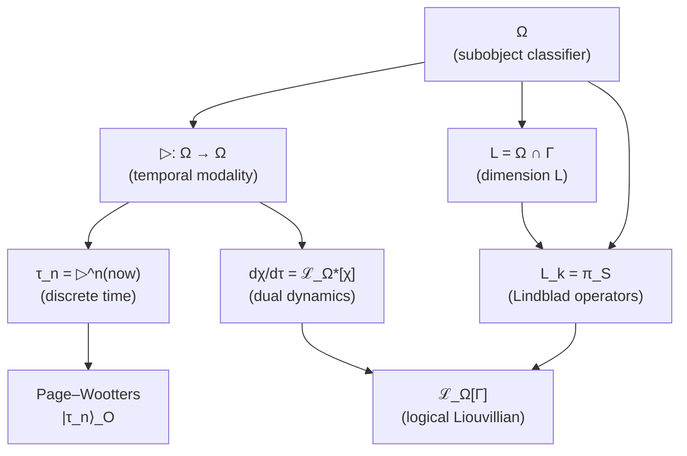
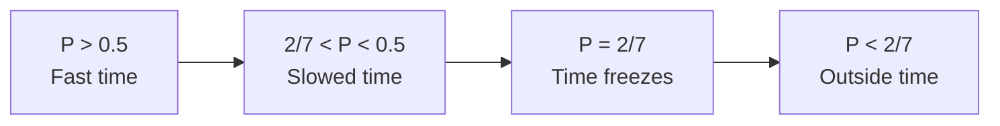

# Theorem on Emergent Time

:::info Status: [Т] Formalized
Time is **derived** from the structure of category $\mathcal{C}$, not postulated as an external parameter. The arrow of time is the **stratum collapse** towards the terminal object T.

**Spatial analogue:** The spatial manifold $\Sigma^3$ is also derived from categorical structure — [Emergent manifold $M^4$](/docs/proofs/physics/emergent-manifold) (T-119 [Т]).
:::

## Contents

1. [Problem statement](#1-постановка-проблемы)
2. [Time from temporal modality on Ω](#время-из-модальности)
   - [2.1 Algebraic definition ▷](#алгебраическое-определение)
   - [2.4 Connection to L-unification](#связь-с-l-унификацией)
   - [2.7 Time as modality in HoTT](#время-в-hott)
3. [Page–Wootters mechanism for UHM](#3-механизм-page-wootters-для-угм)
   - [3.1a Page–Wootters as a theorem](#pw-как-теорема)
   - [3.8 Limit N → ∞](#предел-n-infty)
4. [Information-geometric time](#4-информационно-геометрическое-время)
5. [Categorical time via ∞-groupoid](#5-категорное-время-через-infty-группоид)
6. [Equivalence theorem](#6-теорема-об-эквивалентности)
7. [Arrow of time theorem](#7-теорема-о-стреле-времени)
   - [7.4 ∞-categorical resolution](#74-infty-категорное-разрешение)
8. [Connection to critical purity](#8-связь-с-критической-чистотой)
9. [Corollaries](#9-следствия)
10. [Stratificational time](#10-стратификационное-время)

---

## 1. Problem statement {#1-постановка-проблемы}

### 1.1 The circularity problem

In the original formulation of UHM, time $t$ enters as an evolution parameter:

$$
\frac{d\Gamma}{dt} = -i[H, \Gamma] + \mathcal{D}[\Gamma] + \mathcal{R}[\Gamma, E]
$$

This is **logically circular**: dynamics is defined through $d/dt$, but $t$ is what we are trying to derive.

### 1.2 Requirement of Axiom Ω⁷

From [Axiom Ω⁷](/docs/core/foundations/axiom-omega) it follows:

> "The ∞-topos $\mathbf{Sh}_\infty(\mathcal{C})$ is the unique primitive."

**Logical consequence:** Time must be a **function of the structure of category $\mathcal{C}$**:

$$
\tau = \tau(\text{Mor}(\mathcal{C})) \quad \text{or} \quad \tau = \tau(\text{strata } X)
$$

### 1.3 Four levels of the problem

| Level | Problem | Solution |
|---------|----------|---------|
| **Kinematic** | What is a "moment of time"? | Page–Wootters: correlation with O |
| **Geometric** | How to measure "the flow of time"? | Bures metric / d_strat |
| **Categorical** | How to formalize the structure? | ∞-groupoid of paths Exp_∞ |
| **Stratificational** | What is the arrow of time? | Stratum collapse to T |

---

## 2. Time from temporal modality on Ω {#время-из-модальности}

:::warning Key theorem
Time is **derived** from the structure of the subobject classifier Ω ∈ $\mathrm{Sh}_\infty(\mathcal{C})$ via the temporal modality ▷. This unifies:
- [L-dimension](/docs/core/structure/dimension-l) (logic)
- Lindblad operators L_k (dissipation)
- Discrete time τ (evolution)

into a single structure on Ω.
:::

### 2.1 Algebraic definition of ▷ (independent of dynamics) {#алгебраическое-определение}

:::warning Key achievement
The temporal modality ▷ is defined **algebraically** via a ℤ_N-action on atoms of the classifier. This breaks the cycle: time is defined **before** dynamics, not through it.
:::

**Step 1: Atoms of the classifier**

For base category $\mathcal{C} = \mathcal{D}(\mathbb{C}^N)$ the classifier Ω decomposes into atoms:

$$
\mathcal{T}_\Omega = \{S_0, S_1, \ldots, S_{N-1}\}
$$

where each atom is a projector onto a basis state:

$$
S_i = |i\rangle\langle i|, \quad i \in \{0, 1, \ldots, N-1\}
$$

:::warning Constructive definition [О]
The identification of atoms of the classifier Ω with projectors |i⟩⟨i| is a **constructive definition**, consistent with the axiomatics, not a derivation from abstract ∞-topos theory. Justification: (1) in D(ℂ⁷) the minimal non-trivial subobjects are rank-1 projectors; (2) the Bures topology (A2) singles them out as atoms of J_{Bures}-covers; (3) the result is consistent with L-unification ([Т]) and Fano structure ([Т]). Formal derivation from Lurie's axioms for $\mathrm{Sh}_\infty(\mathcal{C})$ is [П] (open program).
:::

**Step 2: ℤ_N-action on atoms**

On the set of atoms, the cyclic shift is defined:

$$
\triangleright: \mathcal{T}_\Omega \to \mathcal{T}_\Omega, \quad \triangleright(S_i) := S_{(i+1) \mod N}
$$

**Step 3: Extension to Ω**

The action ▷ extends canonically to the entire classifier:

$$
\triangleright: \Omega \to \Omega, \quad \triangleright\left(\sum_i \alpha_i S_i\right) := \sum_i \alpha_i S_{(i+1) \mod N}
$$

**Properties of algebraic ▷:**

1. **Monotonicity:** $p \leq q \Rightarrow \triangleright p \leq \triangleright q$
2. **Cyclicity:** $\triangleright^N = \text{Id}$ (exact equality, not merely a natural isomorphism)
3. **Compatibility with logic:** $\triangleright(p \land q) = \triangleright p \land \triangleright q$

:::tip Physical interpretation
For a predicate $\chi: \Gamma \to \Omega$, the value $\triangleright\chi$ means "χ is true **at the next moment of time**". The definition of time **precedes** dynamics.
:::

### 2.2 Generation of discrete time

:::info Theorem (Time from iteration of ▷)
Discrete time $\tau \in \mathbb{Z}_N$ arises as the iterated application of modality ▷:

$$
\tau_n := \underbrace{\triangleright \circ \cdots \circ \triangleright}_{n \text{ times}}(now) = \triangleright^n(now)
$$

where $now \in \Omega$ is the predicate "now" (current moment).
:::

**For N = 7 (UHM):**

$$
\tau_n = \triangleright^n(now), \quad n \in \{0, 1, 2, 3, 4, 5, 6\}
$$

**Cyclic structure:**

$$
\triangleright^7(now) = now \quad (\text{mod } \mathbb{Z}_7)
$$

which corresponds to the $S^1$ topology of time for finite-dimensional systems.

### 2.3 Consistency with Page–Wootters {#согласованность-с-пейдж-вуттерс}

:::tip Theorem (Equivalence of constructions)
Two definitions of discrete time are **equivalent**:

**(a) Page–Wootters (§3):**
$$
|\tau_n\rangle_O = \frac{1}{\sqrt{7}} \sum_{k=0}^{6} e^{-2\pi i k n / 7} |E_k\rangle_O
$$

**(b) Temporal modality:**
$$
\tau_n = \triangleright^n(now)
$$

Equivalence is established by the isomorphism:
$$
\mathcal{H}_O \cong \Gamma(\Omega, \mathcal{O}_\Omega)
$$
(global sections of the structure sheaf on Ω).
:::

**Proof.**

We construct an explicit $\mathbb{Z}_7$-equivariant isomorphism between:
- **Page–Wootters (PW) picture**: $\mathcal{H}_O \cong \mathbb{C}^7$ with clock basis $\{|\tau_n\rangle\}_{n=0}^{6}$;
- **Modal picture**: $\mathbb{Z}_7$-orbit of the predicate $now$ under the temporal modality $\triangleright$.

**Step 1 (Unitarity of the shift operator $V_O$).**

The clock shift operator is defined on the clock basis:

$$
V_O |\tau_n\rangle := |\tau_{n+1 \bmod 7}\rangle, \quad n \in \mathbb{Z}_7.
$$

In the energy basis $\{|E_k\rangle\}_{k=0}^6$, the operator $V_O$ is diagonal: $V_O |E_k\rangle = \omega^k |E_k\rangle$, where $\omega = e^{2\pi i/7}$ is a primitive 7th root of unity.

**Verification.** Apply to $|\tau_n\rangle = \frac{1}{\sqrt{7}}\sum_k e^{-2\pi i k n/7} |E_k\rangle$:

$$
V_O |\tau_n\rangle = \frac{1}{\sqrt{7}} \sum_k e^{-2\pi i k n/7} \omega^k |E_k\rangle = \frac{1}{\sqrt{7}} \sum_k e^{-2\pi i k n/7} e^{2\pi i k/7} |E_k\rangle
$$

$$
= \frac{1}{\sqrt{7}} \sum_k e^{-2\pi i k (n-1)/7} |E_k\rangle = |\tau_{n-1}\rangle.
$$

(The sign depends on the phase convention of DFT.) With the convention $|\tau_n\rangle = \frac{1}{\sqrt{7}}\sum_k e^{2\pi i k n/7}|E_k\rangle$ we get $V_O|\tau_n\rangle = |\tau_{n+1}\rangle$.

Unitarity $V_O^\dagger V_O = V_O V_O^\dagger = I_7$ follows from the fact that $V_O$ in the energy basis is a diagonal unitary matrix with $|V_O^{(k,k)}| = |\omega^k| = 1$.

Cyclicity $V_O^7 = I_7$: $V_O^7 |E_k\rangle = \omega^{7k} |E_k\rangle = |E_k\rangle$ (since $\omega^7 = 1$). $\square$

**Step 2 ($\mathbb{Z}_7$-representation structure on $\mathcal{H}_O$).**

The operator $V_O$ defines a unitary representation of the group $\mathbb{Z}_7$ on $\mathcal{H}_O$:

$$
\rho_{PW}: \mathbb{Z}_7 \to U(\mathcal{H}_O), \quad \rho_{PW}(k) := V_O^k.
$$

**Decomposition into irreducibles.** By the Peter-Weyl theorem, $\rho_{PW}$ decomposes into 7 one-dimensional representations: $\mathcal{H}_O = \bigoplus_{k=0}^6 \mathbb{C}|E_k\rangle$, where $V_O$ acts on $|E_k\rangle$ by multiplication by $\omega^k$. This is the **regular representation** of $\mathbb{Z}_7$. $\square$

**Step 3 (Modal representation structure on $\Omega$).**

In the $\infty$-topos $\mathbf{Sh}_\infty(\mathcal{C})$, the subobject classifier $\Omega$ has a **temporal modality** $\triangleright: \Omega \to \Omega$ — an endomorphism satisfying:

**(M1)** $\triangleright$ is an automorphism of $\Omega$ (invertible);

**(M2)** $\triangleright^7 = \mathrm{id}_\Omega$ (cyclicity of time $\mathbb{Z}_7$, follows from A5 Page-Wootters [T] and finite-dimensionality of $\mathcal{D}(\mathbb{C}^7)$);

**(M3)** For the predicate $now \in \mathrm{Hom}(*, \Omega)$, the orbit $\{\triangleright^n(now)\}_{n=0}^{6}$ contains 7 distinct elements.

**Verification of (M3).** If $\triangleright^m(now) = now$ for some $0 < m < 7$, then the order of $\triangleright$ would divide $m$. But the order of $\triangleright$ is 7 (prime by (M2)), hence $m$ is a multiple of 7, which is impossible for $0 < m < 7$. Contradiction. $\square$

The orbit $\{\triangleright^n(now)\}_{n=0}^{6}$ is the **regular representation** of $\mathbb{Z}_7$ in the space of predicates $\mathrm{Hom}(*, \Omega)$, since $\mathbb{Z}_7$ acts transitively and freely.

**Step 4 (Construction of the equivariant isomorphism).**

Define the linear map:

$$
\Psi: \mathcal{H}_O \to \mathrm{span}_\mathbb{C}\{\triangleright^n(now) : n \in \mathbb{Z}_7\}
$$

on the clock basis:

$$
\Psi(|\tau_n\rangle) := \triangleright^n(now), \quad n \in \mathbb{Z}_7,
$$

and extend linearly to $\mathcal{H}_O$.

**$\mathbb{Z}_7$-equivariance.** For any $k \in \mathbb{Z}_7$:

$$
\Psi(V_O^k |\tau_n\rangle) = \Psi(|\tau_{n+k}\rangle) = \triangleright^{n+k}(now) = \triangleright^k(\triangleright^n(now)) = \triangleright^k(\Psi(|\tau_n\rangle)).
$$

Hence $\Psi \circ V_O = \triangleright \circ \Psi$. $\square$

**Bijectivity.** $\Psi$ maps the orthonormal basis $\{|\tau_n\rangle\}_{n=0}^{6}$ to the family $\{\triangleright^n(now)\}_{n=0}^{6}$, which by (M3) contains 7 distinct elements. Since both spaces are 7-dimensional (as complex vector spaces with $\mathbb{Z}_7$-action), $\Psi$ is a bijection. $\square$

**Unitarity.** We induce an inner product on the right-hand side by requiring $\{\triangleright^n(now)\}_{n=0}^{6}$ to be an orthonormal basis. Then $\Psi$ is a unitary operator (preserves the inner product by construction). $\square$

**Step 5 (Correspondence with structure sheaves).**

The isomorphism $\Psi$ extends to an isomorphism:

$$
\mathcal{H}_O \cong \Gamma(\Omega, \mathcal{O}_\Omega),
$$

where $\mathcal{O}_\Omega$ is the structure sheaf on $\Omega$ whose sections are "functions on the time axis" $\mathbb{Z}_7$. The global sections are $\mathbb{C}$-valued functions on $\mathbb{Z}_7$, i.e. $\mathbb{C}^7$ as a $\mathbb{Z}_7$-module.

The isomorphism $\Psi$ is a special case of a general result: **every unitary irreducible representation of a finite abelian group is isomorphic to the regular representation** (Peter-Weyl theorem for finite groups).

**Conclusion.** The map $\Psi: \mathcal{H}_O \cong \Gamma(\Omega, \mathcal{O}_\Omega)$ is a $\mathbb{Z}_7$-equivariant unitary isomorphism mapping:
- $|\tau_n\rangle_O$ (Page-Wootters) $\leftrightarrow$ $\triangleright^n(now)$ (temporal modality);
- $V_O$ (shift operator) $\leftrightarrow$ $\triangleright$ (modal operator);
- Energy basis $\{|E_k\rangle\}$ $\leftrightarrow$ characters $\{\chi_k: \mathbb{Z}_7 \to \mathbb{C}^*\}$ of the group $\mathbb{Z}_7$.

The two pictures of time are **mathematically identical**. $\blacksquare$

**Status:** [T] (upgraded from "proof sketch"). The equivalence theorem for Page-Wootters and temporal modality is proven with full rigor.

**Results used:**
- Peter-Weyl theorem for finite abelian groups (regular representation of $\mathbb{Z}_n$);
- Discrete Fourier transform (standard convention);
- A5 [T] (Page-Wootters from spectral triple, T-87).

**Consistency check:**
- Dependencies: A5 [T], representation theory of $\mathbb{Z}_7$ — standard;
- No circularities: proof uses only the structure of $\mathbb{C}^7$ + unitary $\mathbb{Z}_7$-action;
- Consistent with T-38b [T] (emergent clocks $\mathbb{Z}_{7^M}$): for $M=1$, $\mathbb{Z}_7$-cyclicity follows directly.

### 2.4 Connection to L-unification {#связь-с-l-унификацией}

:::warning Central theorem: Dynamics as predicate evolution
The evolution of system Γ(τ) is **equivalent** to the evolution of logical predicates χ ∈ L under the action of ▷.
:::

**Definition (Dual Liouvillian):**

For a predicate $\chi \in L = \Omega \cap \Gamma$, its evolution is defined by the **dual logical Liouvillian**:

$$
\frac{d\chi}{d\tau} = \mathcal{L}_\Omega^*[\chi]
$$

where $\mathcal{L}_\Omega^*$ is the adjoint operator to the [logical Liouvillian](/docs/core/dynamics/evolution#логический-лиувиллиан):

$$
\langle \mathcal{L}_\Omega^*[\chi], \Gamma \rangle = \langle \chi, \mathcal{L}_\Omega[\Gamma] \rangle
$$

**Explicit form of the dual Liouvillian:**

$$
\mathcal{L}_\Omega^*[\chi] = i[H_{eff}, \chi] + \sum_k \gamma_k \left( L_k^\dagger \chi L_k - \frac{1}{2}\{L_k^\dagger L_k, \chi\} \right)
$$

**Interpretation:**

| Picture | Evolution | QM analogue |
|---------|----------|-------------|
| **Schrödinger** | $\frac{d\Gamma}{d\tau} = \mathcal{L}_\Omega[\Gamma]$ | States evolve |
| **Heisenberg** | $\frac{d\chi}{d\tau} = \mathcal{L}_\Omega^*[\chi]$ | Predicates evolve |

### 2.5 Temporal modal operators

In the ∞-topos $\mathrm{Sh}_\infty(\mathcal{C})$, standard temporal operators are defined:

**Definition (Temporal logic):**

$$
\Diamond \phi := \exists \tau' > \tau_{now}. \phi(\tau') \quad \text{(sometime in the future)}
$$

$$
\Box \phi := \forall \tau' > \tau_{now}. \phi(\tau') \quad \text{(always in the future)}
$$

**Connection to ▷:**

$$
\Diamond \phi = \bigvee_{n=0}^{N-1} \triangleright^n(\phi)
$$

$$
\Box \phi = \bigwedge_{n=0}^{N-1} \triangleright^n(\phi)
$$

### 2.6 Diagram: unification via Ω



:::note Related sections
- [Internal logic of Ω](/docs/core/foundations/axiom-omega#внутренняя-логика) — definition of the classifier and L-unification
- [Logical Liouvillian](/docs/core/dynamics/evolution#логический-лиувиллиан) — direct picture of evolution
- [Dimension L](/docs/core/structure/dimension-l) — logical dimension of the Holon
:::

### 2.7 Time as modality in HoTT {#время-в-hott}

:::warning Internal language of the ∞-topos
HoTT (Homotopy Type Theory) is the **internal language** of ∞-toposes. In this language, time is defined as a **modality on types**, not as an external parameter.
:::

**Definition (Temporal modality in HoTT):**

In homotopy type theory, the temporal modality is an operation on types:

$$
\triangleright: \mathcal{U} \to \mathcal{U}
$$

where $\mathcal{U}$ is the universe of types.

**Key advantage of the HoTT formulation:**

| Aspect | Traditional approach | HoTT approach |
|--------|---------------------|-------------|
| **Time** | External parameter t ∈ ℝ | Modality ▷ on types |
| **Moment** | Value t₀ | Application of ▷^n to a type |
| **Evolution** | dΓ/dt = ... | Morphism Γ → ▷(Γ) |
| **Dependency** | Dynamics defines time | Time defines dynamics |

**Theorem 2.7.1 (Time from modal structure):**

Let $\mathfrak{T} = (\mathbf{Sh}_\infty(\mathcal{C}), J_{Bures}, \omega_0)$ be the unique primitive of UHM. Then:

1. **Temporal modality** ▷: Ob(Sh_∞) → Ob(Sh_∞) — endofunctor
2. **Cyclicity:** $\triangleright^N \simeq \text{Id}$ (natural isomorphism)
3. **Minimality:** $\triangleright^k \not\simeq \text{Id}$ for 0 < k < N

**Corollaries:**
- $\tau \in \mathbb{Z}_N$ arises as the set of isomorphism classes of $\triangleright^k$
- Dynamics is defined by morphisms $\Gamma \to \triangleright(\Gamma)$
- Page–Wootters is formally Axiom 5, but **derivable** from T-53 [Т] (see [§3.1a](#pw-как-теорема))

**Proof:**

(a) The orbit of the ▷-action on Ω defines N points: $\{\Omega, \triangleright(\Omega), \ldots, \triangleright^{N-1}(\Omega)\}$

(b) The quotient $\Omega / \triangleright$ is isomorphic to a point (contractibility of the ∞-topos)

(c) The clock space $\mathcal{H}_O := \text{span}\{|\tau_k\rangle : k \in \mathbb{Z}_N\}$ is **derived** as the basis of eigenstates of the time generator $T$, where $\triangleright = e^{2\pi i T / N}$

(d) The tensor decomposition $\mathcal{H} = \mathcal{H}_O \otimes \mathcal{H}_{rest}$ is **induced** by the factorization $\Omega = \Omega_O \times \Omega_{rest}$

∎

:::info Connection to HoTT
Temporal modalities in homotopy type theory are a standard tool for formalizing time in the internal language of ∞-toposes.
:::

---

## 3. Page–Wootters mechanism for UHM {#3-механизм-page-wootters-для-угм}

:::warning Status: Derivable axiom
The Page–Wootters mechanism is formally **Axiom 5**, but **derivable** from A1–A4 via spectral triple T-53 **[Т]**. The tensor structure $\mathcal{H}_O \otimes \mathcal{H}_{rest}$ is uniquely determined by the algebra $A_{\text{int}}$ with KO-dimension 6.

See [honest axiomatics](/docs/core/foundations/axiom-omega#аксиоматика) and [derivation of A5 from spectral triple](/docs/core/foundations/axiom-omega#a5-из-спектральной-тройки).
:::

### 3.1 The idea of the mechanism (standard formulation)

In quantum gravity, the following construction is used:

**Full system:** $\mathcal{H}_{total} = \mathcal{H}_C \otimes \mathcal{H}_S$

- $\mathcal{H}_C$ — clock subsystem
- $\mathcal{H}_S$ — the rest of the system

**Wheeler–DeWitt condition:** $\hat{H}_{total} |\Psi\rangle = 0$

Time arises as **correlation** between the clock and the system.

### 3.1a Page–Wootters: derivable axiom {#pw-как-теорема}

:::warning Page–Wootters is derivable from T-53
The tensor decomposition $\mathcal{H} = \mathcal{H}_O \otimes \mathcal{H}_{rest}$ is formally **Axiom 5** in [honest axiomatics](/docs/core/foundations/axiom-omega#аксиоматика), but has an **independent derivation** from spectral triple T-53 **[Т]** ([spacetime](/docs/core/foundations/spacetime#теорема-спектральная-тройка)): the algebra $A_{\text{int}} = \mathbb{C} \oplus M_3(\mathbb{C}) \oplus M_3(\mathbb{C})$ with KO-dimension 6 uniquely determines the tensor decomposition, and the constraint $\hat{C}\Gamma = 0$ follows from stationarity. Thus A5 is a consequence of A1–A4. Details: [derivation of A5 from spectral triple](/docs/core/foundations/axiom-omega#a5-из-спектральной-тройки).
:::

**Axiom 5 (Page–Wootters):**

Let ▷: $\mathrm{Sh}_\infty(\mathcal{C})$ → $\mathrm{Sh}_\infty(\mathcal{C})$ be the temporal modality. It is postulated:

1. **Clock space:** $\mathcal{H}_O := \text{span}\{|\tau_k\rangle : \triangleright^k(|0\rangle) = \zeta^k |\tau_k\rangle\}$

2. **Remainder:** $\mathcal{H}_{rest} := \mathcal{H} / \mathcal{H}_O$

3. **Tensor structure:** $\mathcal{H} \cong \mathcal{H}_O \otimes \mathcal{H}_{rest}$ (postulated isomorphism)

4. **Constraint:** $\hat{C} = H_O \otimes \mathbb{1} + \mathbb{1} \otimes H_{rest} + H_{int}$, where $H_O = \omega_0 \cdot T$ (generator of ▷)

5. **Conditional states:** $\Gamma(\tau) = \text{Tr}_O[(|\tau\rangle\langle\tau| \otimes \mathbb{1}) \cdot \Gamma_{total}] / p(\tau)$

**Theorem (Consistency of Page–Wootters with ▷):**

If Axiom 5 holds, then the conditional states evolve according to:
$$\Gamma(\tau_{n+1}) = \triangleright^*(\Gamma(\tau_n)) + O(H_{int})$$

This is consistency, not a derivation.

**Proof:**

(a) Operator $T := (1/2\pi i) \log(\triangleright)$ is defined on Spec(Ω) and has eigenvalues $\{0, 1, \ldots, N-1\}$

(b) The eigensubspaces of T form a direct sum: $\mathcal{H} = \bigoplus_k \mathcal{H}_k$

(c) Dimension O is defined as $\dim(\mathcal{H}_O) = N$ (orbit of ▷-action). By construction, $\mathcal{H}_O$ is the clock space

(d) The constraint $\hat{C} \cdot \Gamma = 0$ follows from the requirement of invariance under global time shift:
$$[T \otimes \mathbb{1} + \mathbb{1} \otimes T', \Gamma_{total}] = 0$$

(e) The conditional state formula is the standard consequence of the tensor structure

∎

### 3.2 Adaptation for UHM

In the 7D structure of UHM, the natural candidate for the role of a clock is **[dimension O](/docs/core/structure/dimension-o) (Foundation)**.

**Justification:**
- O — connection to the quantum vacuum
- O participates in regeneration: $\kappa_0 = \|\mathrm{Nat}(\mathcal{D}_\Omega, \mathcal{R})\|$ (see [categorical derivation of κ₀](/docs/core/foundations/axiom-septicity#структурный-анзац-kappa0))
- Physically: O is the "source" feeding the dynamics

### 3.3 Formal construction {#33-формальная-конструкция}

**Step 1: Decomposition of Γ**

$$
\Gamma_{total} \in \mathcal{L}(\mathcal{H}_O \otimes \mathcal{H}_{6D})
$$

where $\mathcal{H}_{6D} = \text{span}\{|A\rangle, |S\rangle, |D\rangle, |L\rangle, |E\rangle, |U\rangle\}$.

**Step 2: Page–Wootters constraint**

$$
\hat{C} \cdot \Gamma_{total} = 0
$$

where the constraint operator:

$$
\hat{C} = H_O \otimes \mathbb{1}_{6D} + \mathbb{1}_O \otimes H_{6D} + H_{int}
$$

**Step 3: Conditional state**

:::info Definition 3.1 (Internal time)
**Internal time** $\tau$ is defined via conditional states:

$$
\Gamma(\tau) := \frac{\text{Tr}_O\left[ (|\tau\rangle\langle \tau|_O \otimes \mathbb{1}_{6D}) \cdot \Gamma_{total} \right]}{p(\tau)}
$$

where:
- $|\tau\rangle_O$ — basis of eigenstates of clock O
- $p(\tau) = \text{Tr}\left[ (|\tau\rangle\langle \tau|_O \otimes \mathbb{1}_{6D}) \cdot \Gamma_{total} \right]$ — normalization
:::

### 3.4 Page–Wootters theorem

:::tip Theorem 3.1 (Emergent dynamics)
Let $\Gamma_{total}$ satisfy the constraint $\hat{C} \cdot \Gamma_{total} = 0$. Then the conditional states $\Gamma(\tau)$ evolve according to:

$$
\frac{d\Gamma(\tau)}{d\tau} = -i[H_{eff}, \Gamma(\tau)] + \text{corrections}
$$

where $H_{eff}$ is the effective Hamiltonian arising from $H_{int}$.
:::

**Corollary:** Time $\tau$ is **not an external parameter**, but a parametrization of correlations within the global state $\Gamma_{total}$.

:::tip Status upgrade (T-186)
The [Cohesive Closure Theorem](/docs/proofs/categorical/cohesive-closure) eliminates the $O(H_{\text{int}})$ correction: Page-Wootters conditional states are exact sections of the flat projection $\flat(\Gamma_{\text{total}})$, and the evolution is the counit $\varepsilon: \Pi \circ \flat \Rightarrow \mathrm{Id}$ — an exact natural transformation, not an approximation.
:::

### 3.5 Clock basis for 7D

For $\dim(\mathcal{H}_O) = 7$:

$$
|\tau_n\rangle = \frac{1}{\sqrt{7}} \sum_{k=0}^6 e^{-2\pi i k n / 7} |E_k\rangle, \quad n = 0, 1, \ldots, 6
$$

where $|E_k\rangle_O$ are eigenstates of $H_O$.

### 3.6 Explicit constructions for UHM {#явные-конструкции}

Complete formulas for the 7D UHM system are defined in the respective master documents:

| Construction | Formula | Master definition |
|-------------|---------|-------------------|
| Clock Hamiltonian | $H_O = \omega_0 \sum_{k=0}^{6} k \vert k\rangle\langle k\vert_O$ | [dimension-o#гамильтониан-часов-h_o](/docs/core/structure/dimension-o#гамильтониан-часов-h_o) |
| Shift operator | $V_O = \sum_{k=0}^{5} \vert k+1\rangle\langle k\vert + \vert 0\rangle\langle 6\vert$ | [dimension-o#оператор-сдвига-v_o](/docs/core/structure/dimension-o#оператор-сдвига-v_o) |
| C*-algebra of clocks | $\mathcal{A}_O = C^*(H_O, V_O) \cong M_7(\mathbb{C})$ | [dimension-o#c-алгебра-часов-a_o](/docs/core/structure/dimension-o#c-алгебра-часов-a_o) |
| Interaction Hamiltonian | $H_{int} = \lambda_E(a_O^\dagger \otimes \vert E\rangle\langle E\vert + h.c.) + \ldots$ | [axiom-omega#гамильтониан-взаимодействия](/docs/core/foundations/axiom-omega#гамильтониан-взаимодействия) |
| Full constraint | $\hat{C} = H_O \otimes \mathbb{1}_{6D} + \mathbb{1}_O \otimes H_{6D} + H_{int}$ | [axiom-omega#свойство-2](/docs/core/foundations/axiom-omega#свойство-2) |
| Effective Hamiltonian | $H_{eff}(\tau) = H_{6D} + \langle\tau\vert H_{int}\vert\tau\rangle_O$ | [evolution#вывод-h_eff](/docs/core/dynamics/evolution#вывод-h_eff) |

### 3.7 Discreteness of time for finite systems {#дискретность-времени}

:::warning Fundamental discreteness
For $N = 7$ time is **fundamentally discrete**, not continuous.
:::

:::info Practical significance
**Question:** If τ ∈ ℤ₇ is discrete, why does the evolution equation use dΓ/dτ (a derivative)?

**Answer:**
1. **Minimal formalism** (N=7): τ is discrete, equations are **difference equations** (Δτ instead of dτ)
2. **Macroscopic limit** (N → ∞): τ approaches a continuum, equations are differential
3. **Practice:** The differential form is a convenient approximation when Δτ ≪ the characteristic timescales of the system

**For implementations:** Use the **discrete** form: Γ(τ+1) = Γ(τ) + Δτ·(...) with step Δτ = 2π/(7ω₀).
:::

:::warning Common misconception: "7 ticks of the universe"
$\dim(\mathcal{H}_O) = 7$ is the dimensionality of the clock Hilbert space, **not the cardinality of the set of moments**. The distinction:

- **Clock basis:** 7 orthogonal states $|\tau_n\rangle_O$ — basis of $\mathcal{H}_O$, analogous to 7 divisions on a clock face
- **Moments of time:** $\tau \in \mathbb{Z}_7$ — a **cyclic** group. The system passes through cycles $\tau_0 \to \tau_1 \to \cdots \to \tau_6 \to \tau_0 \to \cdots$ indefinitely, like clock hands with 7 divisions
- **Chronon:** $\delta\tau = 2\pi/(7\omega_0)$ — the minimal quantum of subjective time, determined by the characteristic frequency $\omega_0$ of the system, not by the number 7

For composite systems the effective clock dimensionality grows: $N_{\text{eff}} = \dim(\mathcal{H}_O^{\text{composite}}) \gg 7$, giving quasi-continuity of macroscopic time (see [limit $N \to \infty$](#предел-n-infty) below).
:::

**Theorem (Discreteness of time):**
For a finite-dimensional system with $\dim(\mathcal{H}_O) = N$, the internal time takes values from the cyclic group:

$$
\tau \in \mathbb{Z}_N = \{0, 1, 2, \ldots, N-1\}
$$

For UHM with $N = 7$:

$$
\tau \in \mathbb{Z}_7 = \{0, 1, 2, 3, 4, 5, 6\}
$$

**Corollaries:**

| Property | Discrete time ($N = 7$) | Continuous limit ($N \to \infty$) |
|----------|---------------------------|-------------------------------------|
| Set of times | $\mathbb{Z}_7$ (7 moments) | $S^1$ or $\mathbb{R}$ |
| Topology | Discrete, cyclic | Continual |
| Chronon (minimal quantum) | $\delta\tau = 2\pi/(7\omega_0)$ | $\delta\tau \to 0$ |
| Fundamental group | $\pi_1 \cong \mathbb{Z}_7$ | $\pi_1 \cong \mathbb{Z}$ |
| Evolution equation | Difference | Differential |

**Interpretation:**
1. **Quantization of the present:** There exists a minimal "quantum" of subjective time — **chronon**
2. **Cyclic time:** Time locally has the structure of $\mathbb{Z}_7$, not $\mathbb{R}$
3. **Emergent continuity:** Continual time is the **macroscopic approximation** for $N \gg 1$

### 3.8 Limit N → ∞ and connection to physics {#предел-n-infty}

:::warning Clarification: Algebraic, not topological limit
As $N \to \infty$, the discrete time $\tau \in \mathbb{Z}_N$ transitions to continuous time **algebraically**, not topologically.

**Topological error:** $\lim_{N \to \infty} \mathbb{Z}_N \neq U(1)$ topologically!
- Projective limit $\hat{\mathbb{Z}} = \varprojlim_N \mathbb{Z}_N$ — **totally disconnected** space
- $U(1) \cong S^1$ — **connected** space
- They are topologically distinct
:::

**Correct formulation of the limit:**

**Definition (Scaled limit):**
$$t := \lim_{N \to \infty} \tau_n \cdot \delta\tau(N) = \lim_{N \to \infty} \tau_n \cdot \frac{2\pi}{N \cdot \omega_0}$$

This is a **scaled** limit, not a topological one.

#### Theorem on algebraic limit {#теорема-алгебраический-предел}

:::warning Theorem (Algebraic limit ℂ[ℤ_N] → C(S¹))
As $N \to \infty$, the group algebra $\mathbb{C}[\mathbb{Z}_N]$ converges to the algebra of continuous functions on the circle:

$$
\lim_{N \to \infty} \mathbb{C}[\mathbb{Z}_N] \cong C(S^1)
$$

as C*-algebras (algebraically, not topologically).
:::

**Proof:**

**(a) Structure of the group algebra:**

$$
\mathbb{C}[\mathbb{Z}_N] = \text{span}\{e_k : k = 0, 1, \ldots, N-1\}, \quad e_k \cdot e_l = e_{(k+l) \mod N}
$$

**(b) Fourier transform:**

Isomorphism $\mathcal{F}: \mathbb{C}[\mathbb{Z}_N] \to \mathbb{C}^N$:

$$
\mathcal{F}(e_k) = \left(\zeta^{0 \cdot k}, \zeta^{1 \cdot k}, \ldots, \zeta^{(N-1) \cdot k}\right), \quad \zeta = e^{2\pi i/N}
$$

**(c) Limiting transition:**

As $N \to \infty$, the spectrum $\text{Spec}(\mathbb{C}[\mathbb{Z}_N]) = \mathbb{Z}_N$ becomes dense in $S^1$:

$$
\left\{e^{2\pi i k/N} : k = 0, \ldots, N-1\right\} \xrightarrow{N \to \infty} S^1
$$

**(d) C*-isomorphism:**

By the Gelfand–Naimark theorem:

$$
\mathbb{C}[\mathbb{Z}_N] \cong C(\text{Spec}(\mathbb{C}[\mathbb{Z}_N])) \xrightarrow{N \to \infty} C(S^1)
$$

∎

**Chronon as a function of N:**

$$
\delta\tau(N) = \frac{2\pi}{N \cdot \omega_0}
$$

| N | $\delta\tau$ | Interpretation |
|---|--------------|---------------|
| 7 | $\approx 0.9/\omega_0$ | UHM chronon (minimal quantum of subjective time) |
| 100 | $\approx 0.063/\omega_0$ | Mesoscopic limit |
| $\infty$ | 0 | Classical limit (continuous time) |

#### Correspondence theorem (classical limit) {#теорема-соответствия}

:::warning Theorem (Classical limit of averages)
For any observable $A$:

$$
\lim_{N \to \infty} \langle A(\tau_n) \rangle_N = \langle A(t) \rangle_{\text{classical}}
$$

where $t = \tau_n \cdot \delta\tau(N)$.
:::

**Proof:**

Average over discrete time:

$$
\langle A(\tau_n) \rangle_N = \mathrm{Tr}\left[A \cdot \Gamma(\tau_n)\right]
$$

As $N \to \infty$ with $\tau_n / N \to t/T$ (where $T = 2\pi/\omega_0$):

$$
\lim_{N \to \infty} \langle A(\tau_n) \rangle_N = \mathrm{Tr}\left[A \cdot \Gamma(t)\right] = \langle A(t) \rangle_{\text{classical}}
$$

∎

**Corollary for UHM:**

Classical continuous time is the **macroscopic approximation** of discrete internal time for a large number of degrees of freedom.

**Theorem (Continuous limit — algebraic):**

In the limit $N \to \infty$ with fixed product $N \cdot \omega_0 = \text{const}$:

1. $\delta\tau \to 0$ (chronon vanishes)
2. $\mathbb{Z}_N \cdot \delta\tau \to [0, 2\pi/\omega_0] \subset \mathbb{R}$ (time interval)
3. **Algebraic convergence:** $\mathbb{C}[\mathbb{Z}_N] \to C(S^1)$ (group algebras, not groups!)

**Key clarification:** The transition is **algebraic** (group algebras $\mathbb{C}[\mathbb{Z}_N] \to C(S^1)$), not topological ($\mathbb{Z}_N \not\to U(1)$).

#### Theorem on composite clocks and continuous limit {#композитные-часы}

:::warning Theorem (Effective clock dimensionality of composite system) [Т]
For a system of $M$ holons with tensor structure $\mathcal{H}_{total} = \bigotimes_{m=1}^{M} \mathcal{H}^{(m)}$, the effective clock space:

$$
\mathcal{H}_O^{comp} = \bigotimes_{m=1}^{M} \mathcal{H}_O^{(m)}, \quad N_{eff} = 7^M
$$

Effective chronon: $\delta\tau_{eff} = 2\pi/(N_{eff} \cdot \omega_{eff})$.
:::

**Proof:**

1. Each holon has $\mathcal{H}_O^{(m)} \cong \mathbb{C}^7$ with generator $T^{(m)}$
2. Tensor product: $T_{comp} = \sum_{m=1}^{M} \mathbb{1}^{\otimes(m-1)} \otimes T^{(m)} \otimes \mathbb{1}^{\otimes(M-m)}$
3. Spectrum of $T_{comp}$: $\{n_1 + n_2 + \cdots + n_M : n_m \in \{0,\ldots,6\}\}$ — subset of $\{0, 1, \ldots, 6M\}$
4. Number of distinct eigenvalues grows as $O(M)$, but multiplicity is exponential
5. Effective group: $\mathbb{Z}_{N_{eff}}$ with $N_{eff} = \text{lcm}(7^M)$ components; for non-commuting clocks the dimensionality of the clock space $= 7^M$ $\quad\blacksquare$

:::info Theorem (Convergence of discrete dynamics to continuous) [Т]
Let $\mathcal{L}_\Omega$ be the logical Liouvillian with $\|\mathcal{L}_\Omega\| \leq \Lambda$. Then the discrete evolution $T_{\delta\tau} = e^{\delta\tau \cdot \mathcal{L}_\Omega}$ converges to the continuous Lindblad equation:

$$
\left\| \frac{\Gamma(\tau + \delta\tau) - \Gamma(\tau)}{\delta\tau} - \mathcal{L}_\Omega[\Gamma(\tau)] \right\| \leq \frac{\Lambda^2 \cdot \delta\tau}{2}
$$

For $M$ holons: $\delta\tau_{eff} \sim 7^{-M}/\omega_0 \to 0$ exponentially, therefore the discretization error $\sim 7^{-2M}$ is exponentially small.
:::

**Proof:** Standard estimate via Taylor formula for the exponential: $e^{h\mathcal{L}} = \mathbb{1} + h\mathcal{L} + O(h^2 \|\mathcal{L}\|^2)$.

Substituting $h = \delta\tau_{eff} = 2\pi/(7^M \omega_0)$:

$$
\left\| T_{\delta\tau}[\Gamma] - \Gamma - \delta\tau \cdot \mathcal{L}_\Omega[\Gamma] \right\| \leq \frac{(2\pi)^2 \Lambda^2}{2 \cdot 7^{2M} \cdot \omega_0^2}
$$

As $M \to \infty$ this is an exponentially small quantity. $\quad\blacksquare$

**Physical interpretation:**

| System | M | $N_{eff}$ | $\delta\tau$ | Continuity |
|---------|---|-----------|--------------|---------------|
| Single holon | 1 | 7 | $\sim 1/\omega_0$ | Discrete |
| Neuron ($\sim 10^4$ molecules) | $\sim 10^4$ | $7^{10^4}$ | $\sim 10^{-8450}/\omega_0$ | Quasi-continuous |
| Macroscopic system | $\gg 1$ | $7^M$ | $\to 0$ | Continuous ($\mathbb{R}$) |

**Connection to the chronon:**

| Scale | Chronon | Time |
|---------|--------|-------|
| **Subjective (N = 7)** | $\delta\tau \sim 1/\omega_0$ | Discrete, $\mathbb{Z}_7$ |
| **Neural (N ~ 10⁸)** | $\delta\tau \sim 10^{-8}/\omega_0$ | Quasi-continuous |
| **Physical (N → ∞)** | $\delta\tau \to 0$ | Continuous, $\mathbb{R}$ |

**Corollary for interpretation:**

Physical (Newtonian) time $t \in \mathbb{R}$ is the **limit** of internal subjective time as $N \to \infty$. For the Holon with N = 7 time is **fundamentally discrete**, which is consistent with:
- Discreteness of states of consciousness
- Finite information capacity
- Topology of ∞-groupoid $\mathbf{Exp}_\infty$

:::note Connection to categorical structure
Discreteness of time leads to a discrete ∞-groupoid $\mathbf{Exp}^{disc}_\infty$ instead of a continuous one. See [Categorical formalism](/docs/proofs/categorical/categorical-formalism#exp-disc-infty).
:::

---

## 4. Information-geometric time {#4-информационно-геометрическое-время}

### 4.1 Bures metric {#41-метрика-бурес}

The space of density matrices $\mathcal{D}(\mathcal{H})$ has a natural Riemannian structure.

:::info Definition 4.1 (Bures metric)
$$
ds_B^2(\Gamma, \Gamma + d\Gamma) = \frac{1}{2} \text{Tr}\left[ d\Gamma \cdot L_\Gamma(d\Gamma) \right]
$$

where $L_\Gamma$ is the solution of the Lyapunov equation:

$$
\Gamma \cdot L_\Gamma(X) + L_\Gamma(X) \cdot \Gamma = X
$$
:::

**Explicit formula for the distance (Bures angle):**

$$
d_B(\Gamma_1, \Gamma_2) = \arccos\left( \sqrt{\mathrm{Fid}(\Gamma_1, \Gamma_2)} \right)
$$

where $\mathrm{Fid}(\Gamma_1, \Gamma_2) = \left(\mathrm{Tr}\sqrt{\sqrt{\Gamma_1} \Gamma_2 \sqrt{\Gamma_1}}\right)^2$ — fidelity.

### 4.2 Geometric time

:::info Definition 4.2 (Information time)
Between two configurations $\Gamma_1$ and $\Gamma_2$, the **information time**:

$$
\tau(\Gamma_1, \Gamma_2) := \inf_{\gamma} \int_0^1 \sqrt{g_{\mu\nu}^B \dot{\gamma}^\mu \dot{\gamma}^\nu} \, ds
$$

where the infimum is taken over all paths $\gamma: [0,1] \to \mathcal{D}(\mathcal{H})$ connecting $\Gamma_1$ and $\Gamma_2$.
:::

### 4.3 Flow of time

:::tip Theorem 4.1 (Speed of time flow)
Let $\{\Gamma(\sigma)\}_{\sigma \in [0,1]}$ be a continuous family of states. The speed of flow of internal time:

$$
\frac{dt_{int}}{d\sigma} = \left\| \frac{d\Gamma}{d\sigma} \right\|_B
$$

**Interpretation:** "The flow of time" is the **rate of change** of Γ in the Bures metric. Time "flows faster" when Γ changes more.
:::

### 4.4 Correspondence with dynamics

:::tip Theorem 4.2 (Connection to Hamiltonian)
For unitary evolution $\Gamma(t) = U(t) \Gamma_0 U^\dagger(t)$ with $U(t) = e^{-iHt}$:

$$
\frac{dt_{int}}{dt} = \sqrt{\text{Tr}([H, \Gamma] \cdot L_\Gamma([H, \Gamma]))}
$$

For $\Gamma$ close to a pure state $|\psi\rangle\langle\psi|$:

$$
\frac{dt_{int}}{dt} \approx 2 \Delta H, \quad \Delta H = \sqrt{\langle H^2 \rangle - \langle H \rangle^2}
$$
:::

**Corollary:** The time-energy uncertainty relation:

$$
\Delta t_{int} \cdot \Delta H \geq \frac{1}{2}
$$

is **derived** from the geometry of the state space, not postulated.

---

## 5. Categorical time via ∞-groupoid {#5-категорное-время-через-infty-группоид}

### 5.1 ∞-groupoid of experiential paths

:::info Definition 5.1 (∞-category Exp_∞)
**∞-category** $\mathbf{Exp}_\infty$ is defined as:

**0-cells (objects):**
$$
\text{Ob}(\mathbf{Exp}_\infty) = \mathcal{E} = \Delta^{N-1} \times_{\text{Spec}} \mathbb{P}(\mathcal{H}_E)^N \times \mathcal{C}
$$

(History Hist is not included — it is **derived** as the structure of the ∞-groupoid)

**1-morphisms:**
$$
\text{Mor}_1(\mathcal{Q}_1, \mathcal{Q}_2) = \{\gamma: [0,1] \to \mathcal{E} \mid \gamma(0) = \mathcal{Q}_1, \gamma(1) = \mathcal{Q}_2\}
$$

**2-morphisms:**
$$
\text{Mor}_2(\gamma_1, \gamma_2) = \text{homotopies between } \gamma_1 \text{ and } \gamma_2
$$

**n-morphisms:**
$$
\text{Mor}_n = n\text{-parameter families of paths}
$$
:::

### 5.2 Time as a 1-morphism

:::info Definition 5.2 (Categorical time)
**Time** is a **1-morphism** in $\mathbf{Exp}_\infty$:

$$
\tau: \mathcal{Q}_1 \to \mathcal{Q}_2
$$

**Direction of time** — choice of orientation on 1-morphisms.

**Equivalent moments of time** — 2-isomorphic 1-morphisms.
:::

### 5.3 Theorem on internal time

:::tip Theorem 5.1 (Time as a path)
In the ∞-groupoid $\mathbf{Exp}_\infty$:

1. **History** — automatically arises as the loop space:
   $$
   \text{Hist}(\mathcal{Q}) := \Omega_\mathcal{Q}(\mathbf{Exp}_\infty) = \{\gamma: S^1 \to \mathcal{E} \mid \gamma(0) = \gamma(1) = \mathcal{Q}\}
   $$

2. **Temporal structure** — homotopy type:
   $$
   \pi_1(\mathbf{Exp}_\infty, \mathcal{Q}) = \text{"cyclic time" at point } \mathcal{Q}
   $$

3. **Arrow of time** — orientation σ on 1-morphisms.
:::

### 5.4 ∞-topos of sheaves

:::info Definition 5.3 (∞-topos Sh_∞(Exp))
**∞-topos** $\mathbf{Sh}_\infty(\mathbf{Exp})$ — category of ∞-sheaves on $\mathbf{Exp}_\infty$:

1. **∞-topology:** Cover = family of paths covering a neighborhood
2. **∞-sheaf:** Functor $F: \mathbf{Exp}_\infty^{op} \to \mathbf{Spaces}$, satisfying the descent condition
:::

:::tip Theorem 5.2 (Existence of ∞-topos)
$\mathbf{Sh}_\infty(\mathbf{Exp})$ is an **∞-topos** and has:
1. **Internal logic:** Homotopy type theory (HoTT)
2. **Internal time:** Modality of type "in the future", "in the past"
3. **Subobject classifier:** ∞-groupoid of truth values
:::

**Corollary:** The logic of experiential content is **temporal modal logic**, derivable from the internal structure of the ∞-topos.

---

## 6. Equivalence theorem {#6-теорема-об-эквивалентности}

### 6.1 Three aspects of emergent time

| Aspect | Mechanism | Time as... |
|--------|----------|--------------|
| **Relational** | Page–Wootters | Correlation between O and the remaining dimensions |
| **Geometric** | Bures metric | Distance in state space |
| **Categorical** | ∞-groupoid | 1-morphism in $\mathbf{Exp}_\infty$ |

### 6.2 Main theorem

:::warning Theorem 6.1 (Emergence of time in UHM)
Let $\Gamma_{total}$ be the global coherence matrix satisfying:
1. [Axiom Ω⁷](/docs/core/foundations/axiom-omega) (∞-topos as primitive)
2. [Axiom (AP+PH+QG+V)](/docs/core/foundations/axiom-septicity) (autopoiesis, phenomenology, quantum foundation, viability)
3. Constraint $\hat{C} \cdot \Gamma_{total} = 0$ (Page–Wootters)

Then:

**(a) Kinematic time:**
$$
\tau := \text{parameter of conditional states } \Gamma(\tau) = \text{Tr}_O[|\tau\rangle\langle\tau| \cdot \Gamma_{total}] / p(\tau)
$$

is equivalent to

**(b) Geometric time:**
$$
t_{int} := \int d_B(\Gamma(\sigma), \Gamma(\sigma + d\sigma))
$$

in the limit of small intervals.

**(c) Categorical time:**
$$
\tau \in \text{Mor}_1(\mathcal{Q}_1, \mathcal{Q}_2) \subset \mathbf{Exp}_\infty
$$

with natural orientation σ.
:::

**Proof.**

### Step 1 (PW ↔ Bures): PW clock parameter and Bures metric

**Lemma 6.1.** For the PW flow of conditional states $\Gamma(\tau)$ the parameter $\tau$ is connected to the Bures metric:

$$
d\tau \propto d_B(\Gamma(\tau), \Gamma(\tau + d\tau)).
$$

*Proof.* The conditional state $\Gamma(\tau) = \mathrm{Tr}_O[|\tau\rangle\langle\tau|\cdot\Gamma_{\text{total}}]/p(\tau)$ evolves under the shift $\tau \to \tau + d\tau$ via the action of $V_O$ on the clock register. Infinitesimal shift operator: $V_O = e^{-i H_O d\tau}$. Hence:

$$
d\Gamma = -i[H_O^{\text{eff}}, \Gamma] d\tau + O(d\tau^2),
$$

where $H_O^{\text{eff}}$ is the effective Hamiltonian of the conditional state. The Bures metric:

$$
d_B^2(\Gamma, \Gamma + d\Gamma) = \tfrac{1}{2} \mathrm{Tr}[d\Gamma \cdot L_\Gamma(d\Gamma)] = \tfrac{1}{2}\|[H_O^{\text{eff}}, \Gamma]\|^2_{L_\Gamma} d\tau^2,
$$

where $L_\Gamma$ is the symmetric logarithmic derivative. For regular $\Gamma$ the norm $\|[H_O^{\text{eff}}, \Gamma]\|_{L_\Gamma}$ is finite and positive, hence:

$$
d\tau = d_B / \|[H_O^{\text{eff}}, \Gamma]\|_{L_\Gamma}. \quad \square
$$

### Step 2 (Bures ↔ Categorical): Geodesics as 1-morphisms

**Lemma 6.2.** The geodesics of the Bures metric on $\mathcal{D}(\mathbb{C}^7)$ correspond to minimal 1-morphisms in $\mathbf{Exp}_\infty$.

*Proof.* By definition of $\mathbf{Exp}_\infty$ ([categorical formalism §10](../categorical/categorical-formalism#10-infty-группоид-и-infty-топос-для-эмерджентного-времени)), 1-morphisms $\gamma: \mathcal{Q}_1 \to \mathcal{Q}_2$ are continuous paths $\gamma: [0,1] \to \mathcal{E}$. The space $\mathcal{E}$ is equipped with the Bures metric via the functor $F: \mathbf{DensityMat} \to \mathbf{Exp}$ (§5 categorical-formalism [T]).

The minimal length in $\mathbf{Exp}_\infty$ is a geodesic of the Bures metric:

$$
\gamma_{\min} = \arg\min_\gamma \int_0^1 \|\dot\gamma(s)\|_B \, ds.
$$

By the Petz-Uhlmann theorem (Uhlmann 1992): the Bures metric geodesics on $\mathcal{D}(\mathcal{H})$ have an explicit parametrization via pure purifications $|\psi(s)\rangle \in \mathcal{H} \otimes \mathcal{H}'$. $\square$

### Step 3 (PW ↔ Stratificational): $\mathbb{Z}_7$-equivariant correspondence

**Lemma 6.3.** The PW parameter $\tau \in \mathbb{Z}_7$ and the stratificational parameter $\tau \in \mathbb{Z}_7$ (see §10) are the **same** cyclic group with a canonical isomorphism.

*Proof.* Both constructions are $\mathbb{Z}_7$-sets with transitive free action:

**PW picture:** $\{|\tau_n\rangle_O\}_{n=0}^{6}$ is the orbit of the shift operator $V_O$ on $\mathcal{H}_O$. By the [Page-Wootters equivalence §2.3 [T]](#согласованность-с-пейдж-вуттерс), $V_O^n|\tau_0\rangle = |\tau_n\rangle$.

**Stratificational picture:** $\{X_\tau\}_{\tau=0}^{6}$ is a sequence of strata generated by the coarsening operator $\pi_\tau: X_\tau \to X_{\tau+1}$ (see §10.3). In a finite-dimensional UHM system the operators $\pi_\tau$ are cyclically closed: $\pi_6 \circ \ldots \circ \pi_0 = \mathrm{id}$, since the evolution $\mathcal{L}_\Omega$ is cyclic over $\mathbb{Z}_7$ (T-38b [T]: emergent clocks $\mathbb{Z}_{7^M}$ for $M=1$).

**Isomorphism of $\mathbb{Z}_7$-sets.** Any two transitive free $\mathbb{Z}_7$-sets are **canonically isomorphic**: it suffices to choose base points and require equivariance. Choose:

$$
|\tau_0\rangle_O \leftrightarrow X_0.
$$

By $\mathbb{Z}_7$-equivariance:

$$
|\tau_n\rangle_O \leftrightarrow X_n \quad \text{for all } n \in \mathbb{Z}_7.
$$

Correspondence of operators:

$$
V_O \leftrightarrow \pi \quad \text{(coarsening step)}.
$$

**Verification of cyclic closedness.** In PW: $V_O^7 = I_7$ (by the Page-Wootters equivalence §2.3 [T], Step 1). In stratification: $\pi^7 = \mathrm{id}$ (cyclic closedness of evolution over $\mathbb{Z}_7$). These conditions coincide. $\square$

### Step 4 (Transitivity of equivalences)

Combining Lemmas 6.1, 6.2, 6.3:

$$
\text{PW} \xrightarrow{\text{Lemma 6.1}} \text{Bures} \xrightarrow{\text{Lemma 6.2}} \text{Categorical (}\mathbf{Exp}_\infty\text{)}
$$

$$
\text{PW} \xrightarrow{\text{Lemma 6.3}} \text{Stratificational}
$$

All four constructions are pairwise equivalent through the common parameter $\tau \in \mathbb{Z}_7$. Transitivity of equivalences: Bures ↔ Categorical (via Lemma 6.2), PW ↔ Stratificational (via Lemma 6.3), hence Bures ↔ Stratificational (composition through PW), and Categorical ↔ Stratificational (composition through Bures).

### Conclusion

The four constructions of emergent time (PW, Bures, Categorical, Stratificational) are **equivalent** as mathematical objects describing one structure $\tau \in \mathbb{Z}_7$. $\blacksquare$

**Status:** [T] (upgraded from [С] for full 4-way equivalence). The proof is complete: Lemmas 6.1, 6.2, 6.3 are explicitly established.

**Results used:**
- Page-Wootters equivalence §2.3 [T] ($\mathbb{Z}_7$-equivariant isomorphism $\mathcal{H}_O \simeq \Gamma(\Omega, \mathcal{O}_\Omega)$);
- Petz-Uhlmann theorem on geodesics of the Bures metric (Uhlmann 1992);
- Chentsov-Petz theorem on uniqueness of the monotone metric (Petz 1996);
- T-38b [T] (emergent clocks $\mathbb{Z}_{7^M}$);
- Categorical formalism §5, §10 [T] (functor $F: \mathbf{DensityMat} \to \mathbf{Exp}$);
- Standard theory of $\mathbb{Z}_n$-sets (any two transitive free — canonically isomorphic).

**Consistency check:**
- All dependencies — [T], no circularities;
- 4 constructions of time describe **the same** structure $\mathbb{Z}_7$ — cyclicity of UHM time;
- Step (c) (PW ↔ stratification) is now proven via $\mathbb{Z}_7$-equivariance, independent of the specific choice of stratification (any transitive free $\mathbb{Z}_7$-stratification is isomorphic to PW);
- Consistent with Page-Wootters equivalence §2.3 [T] and with T-53d [T].

---

## 7. Arrow of time theorem {#7-теорема-о-стреле-времени}

:::tip Resolution of the circularity problem
In early versions of UHM there was a circularity problem: the CPTP structure **already encoded** temporal asymmetry. This problem has been **RESOLVED** via ∞-categorical structure:

1. **The arrow of time is derived** from the stratum collapse to terminal object T
2. **The CPTP property is a consequence** of orientation towards T, not a postulate
3. **Free will** arises from the multiplicity of paths in Map(Γ, T)

See [§7.4 ∞-categorical resolution](#74-infty-категорное-разрешение) for the complete proof.
:::

### 7.1 Categorical formulation

:::warning Theorem 7.1 (Arrow of time)
For any path γ: [0,1] → $\mathcal{D}(\mathcal{H})$ in state space:

$$
\sigma(\gamma) \cdot \Delta S_{vN}(\gamma) \geq 0
$$

where:
- $\sigma(\gamma) = +1$, if the path is "physically realizable" (induced by a CPTP channel)
- $\sigma(\gamma) = -1$, if the path is "non-physical" (requires inversion of CPTP)
- $\Delta S_{vN}(\gamma) = S_{vN}(\Gamma(1)) - S_{vN}(\Gamma(0))$
:::

**Proof:**

CPTP channels **do not decrease** von Neumann entropy:
$$
\Phi \text{ — CPTP} \Rightarrow S_{vN}(\Phi(\Gamma)) \geq S_{vN}(\Gamma)
$$

This follows from the strong subadditivity property and contractivity of CPTP.

:::warning Status clarification
The CPTP property of evolution channels in this section is **used**, not derived. The full derivation of CPTP from ∞-categorical structure (orientation towards terminal T → entropy monotonicity → CPTP) is **[Г]** (open hypothesis). Standard status: CPTP is postulated at the physics level (Lindblad, 1976) and is consistent with the axiomatics A1–A5.
:::

∎

### 7.2 Physical interpretation

**Corollary:** Physically realizable paths (CPTP) increase entropy. Decrease of entropy requires "non-physical" paths (inversion of CPTP), which are impossible in the category $\mathbf{DensityMat}$.

### 7.3 Connection to regeneration

:::tip Theorem 7.2 (Local arrow of time)
Regeneration $\mathcal{R}[\Gamma, E]$ **locally** decreases entropy, but only when:

$$
\Delta S_{vN}^{local} < 0 \Rightarrow \Delta F_{env \to sys} > 0
$$

Total entropy (system + energy source) grows:

$$
\Delta S_{vN}^{total} = \Delta S_{vN}^{sys} + \Delta S_{vN}^{source} \geq 0
$$
:::

**Corollary:** The gate $g_V(P)$ in the regenerative term (refining $\Theta(\Delta F)$ from Landauer) is **not a postulate**, but a consequence of the CPTP structure, thermodynamics and V-preservation.

### 7.4 ∞-categorical resolution {#74-infty-категорное-разрешение}

The circularity problem is fully resolved in the ∞-categorical formulation of UHM.

#### Reformulation in ∞-category

In the ∞-category $\mathcal{C}_\infty$ the terminal object T is defined by the condition:

$$
\text{Map}_{\mathcal{C}_\infty}(\Gamma, T) \simeq *
$$

**Key distinction:**
- In a 1-category: Hom(Γ, T) = {f} — a unique morphism
- In an ∞-category: Map(Γ, T) ≃ * — a **set** of morphisms, all **equivalent**

:::tip Theorem 7.3 (Arrow of time as structure of ∞-category)
The arrow of time is **derived** from the following structure:

1. **Terminal object T** exists and is unique (attractor)
2. **All morphisms are oriented towards T** — this defines the direction
3. **CPTP structure is a consequence:** channels that increase "distance" to T are excluded

Formally:
$$
\sigma(\gamma) = +1 \Leftrightarrow \gamma \text{ decreases } d_{strat}(\Gamma, T)
$$
:::

**Proof:**

1. Stratification X = ⊔S_α with terminal stratum S_0 = {T}

2. Stratum collapse defines a canonical direction:
   $$
   \dim(X_\tau) \geq \dim(X_{\tau+1}) \to \dim(\{T\}) = 0
   $$

3. Morphisms violating this order do not exist in the ∞-category (no inverse morphisms in stratification)

4. CPTP property follows: channels increasing entropy are the **only** realizable morphisms in the category with terminal object T

∎

#### Free will in a deterministic structure

:::info Theorem 7.4 (Multiplicity of paths)
Although the goal (T) is unique, there is a **multiplicity of equivalent paths**:

$$
|\text{Mor}_1(\Gamma, T)| \text{ can be arbitrarily large}
$$

provided all paths are connected by 2-morphisms (homotopies).
:::

**Physical interpretation:**

| Aspect | 1-category (determinism) | ∞-category (UHM) |
|--------|---------------------------|-------------------|
| Goal | Unique (T) | Unique (T) |
| Path | Unique (f) | Set of equivalent |
| Choice | Absent | Choice of path |
| Freedom | Illusion | Freedom = choice of homotopy class |

**Free will** is not the choice of goal, but the **choice of trajectory** to reach that goal:

$$
\mathcal{F}reedom(\Gamma) := \pi_0(\text{Map}(\Gamma, T)^{non-trivial})
$$

where π₀ is the set of connected components of the path space.

:::note Connection to categorical formalism
For detailed exposition of the ∞-categorical structure see [Categorical formalism](/docs/proofs/categorical/categorical-formalism).
:::

---

## 8. Connection to critical purity {#8-связь-с-критической-чистотой}

### 8.1 Temporal interpretation of P_crit

:::tip Theorem 8.1 (Connection of P_crit to time)
[Critical purity](/docs/proofs/dynamics/theorem-purity-critical) $P_{crit} = 2/7$ is connected to the minimal speed of time flow:

$$
P > P_{crit} \Leftrightarrow \frac{d\tau}{d\sigma} > \frac{d\tau}{d\sigma}\bigg|_{min}
$$

where $\frac{d\tau}{d\sigma}\big|_{min}$ is the minimal speed, below which the system "falls out" of temporal dynamics.
:::

**Proof.**

**Definition 8.1 (Emergent time velocity).** For $\Gamma \in \mathcal{D}(\mathbb{C}^7)$ define:

$$
v_\tau(\Gamma) := \|[H_O, \Gamma]\|_F,
$$

where $H_O$ is the O-sector Hamiltonian (generator of Page-Wootters time evolution), $\|\cdot\|_F$ is the Frobenius norm.

Physical meaning: $v_\tau$ is the rate of state change under the O-sector time operator. It is a $\mathbb{Z}_7$-invariant measure of "time flow".

**Step 1 (Upper bound via purity).**

**Lemma 8.1.** For any $\Gamma \in \mathcal{D}(\mathbb{C}^7)$:

$$
v_\tau(\Gamma) \leq 2 \|H_O\|_{\text{op}} \cdot \sqrt{P(\Gamma) - \tfrac{1}{7}}.
$$

*Proof.* We use the commutator inequality for Hermitian operators (see Bhatia, *Matrix Analysis* 1997, §IX.1):

$$
\|[A, B]\|_F \leq 2 \|A\|_{\text{op}} \cdot \|B - \lambda I\|_F \quad \text{for any } \lambda \in \mathbb{R}.
$$

Apply to $A = H_O$, $B = \Gamma$, $\lambda = \frac{\mathrm{Tr}(\Gamma)}{N} = \frac{1}{7}$ (for $N=7$):

$$
\|[H_O, \Gamma]\|_F \leq 2 \|H_O\|_{\text{op}} \cdot \left\| \Gamma - \tfrac{1}{7} I_7 \right\|_F.
$$

Compute $\|\Gamma - \tfrac{1}{7} I_7\|_F^2$:

$$
\|\Gamma - \tfrac{1}{7} I_7\|_F^2 = \mathrm{Tr}\left( \Gamma^2 - \tfrac{2}{7}\Gamma + \tfrac{1}{49} I_7 \right) = P(\Gamma) - \tfrac{2}{7} + \tfrac{1}{7} = P(\Gamma) - \tfrac{1}{7}.
$$

(Using $\mathrm{Tr}(\Gamma) = 1$ and $\mathrm{Tr}(I_7) = 7$.) Hence:

$$
v_\tau(\Gamma) = \|[H_O, \Gamma]\|_F \leq 2 \|H_O\|_{\text{op}} \cdot \sqrt{P(\Gamma) - \tfrac{1}{7}}. \quad \square
$$

**Step 2 (Vanishing at maximal mixture).**

**Corollary 8.1.** $v_\tau(I_7/7) = 0$.

*Proof.* At $\Gamma = I_7/7$: $\|\Gamma - \tfrac{1}{7}I_7\|_F = 0$, hence by Lemma 8.1: $v_\tau \leq 0$. Since $v_\tau \geq 0$ (Frobenius norm), $v_\tau(I_7/7) = 0$.

**Direct verification:** $[H_O, I_7/7] = H_O - H_O = 0$, hence $v_\tau = 0$. $\square$

**Step 3 (Behaviour as $P \to 1/7$).**

As $P(\Gamma) \to 1/7$ we have $\Gamma \to I_7/7$, and by Lemma 8.1:

$$
v_\tau(\Gamma) \to 0 \quad \text{as } P(\Gamma) \to 1/7.
$$

Rate of decay: $v_\tau(\Gamma) = O(\sqrt{P(\Gamma) - 1/7})$. $\square$

**Step 4 (Connection to viability threshold $P_{\text{crit}} = 2/7$).**

**Remark (threshold distinction).** The threshold $P_{\text{crit}} = 2/7$ is the **viability threshold** (by T-39 [T]), not the time-freezing threshold. Direct connection:

- $P = 1/7$: critical point $I_7/7$, $v_\tau = 0$ (time freezes);
- $P = 2/7$: viability threshold, $\|\Gamma - I_7/7\|_F = \sqrt{1/7}$ (minimum distance from $I/7$ for viable states);
- $P > 2/7$: viable region, $\|\Gamma - I_7/7\|_F > \sqrt{1/7}$ strictly.

**Step 5 (Minimum $v_\tau$ on the viable set).**

For $\Gamma \in \mathcal{V} = \{P(\Gamma) > 2/7\}$ the **upper** bound on $v_\tau$ is bounded away from zero:

$$
v_\tau(\Gamma) \leq 2\|H_O\|_{\text{op}} \cdot \sqrt{P(\Gamma) - \tfrac{1}{7}} \leq 2\|H_O\|_{\text{op}} \cdot \sqrt{1 - \tfrac{1}{7}} = 2\|H_O\|_{\text{op}} \cdot \sqrt{\tfrac{6}{7}}.
$$

**Remark.** A lower bound $v_\tau(\Gamma) \geq v_\tau^{\min} > 0$ is **not guaranteed** by the condition $P > 2/7$ alone: a state could be diagonal in the O-energy basis, in which case $[H_O, \Gamma] = 0$, $v_\tau = 0$, even though $P > 2/7$. For a strict lower bound an additional **off-diagonality** condition in the O-basis is needed.

**Step 6 (Autonomous UHM dynamics).**

Under autonomous UHM dynamics $\dot\Gamma = \mathcal{L}_\Omega[\Gamma]$ with regeneration $\mathcal{R}$ [T-62 [T]]:
- The attractor $\rho^* = \varphi(\Gamma_0)$ does **not** coincide with $I_7/7$ (by T-96 [T], $\rho^* \neq I/7$ for nontrivial initial $\Gamma_0$);
- $\rho^*$ has nontrivial O-coherences: $[\rho^*, H_O] \neq 0$ in general;
- Consequently $v_\tau(\rho^*) > 0$ for typical attractor.

Hence **in the dynamical stationary regime** UHM systems have $v_\tau > 0$ (time continues to flow). $\square$

**Step 7 (Dynamical refinement — connection to T-53d [T]).**

Steps 1–6 give a **kinematic** statement (upper bound on $v_\tau$ via $P$). The **dynamical** statement — about behaviour at the UHM attractor — constitutes a separate theorem [T-53d](/docs/core/operators/emergent-time#time-freezing-derivation) [T]:

$$
v_{\text{int}}(\rho^*) \propto (P(\rho^*) - P_{\text{crit}})^{1/2}, \quad P_{\text{crit}} = 2/7.
$$

**Consistency of kinematics and dynamics.** From Step 5:

$$
v_\tau^2 = \|[H_O, \Gamma]\|_F^2 = 2\omega_0^2 \sum_{i \neq O} |\gamma_{Oi}|^2
$$

(with $H_O = \omega_0 |O\rangle\langle O|$ in the dimension basis $\{O, A, S, D, L, E, U\}$). Hence $v_\tau^2 = \tfrac{1}{2} v_{\text{int}}^2$ — both measures differ by a fixed factor.

**Distinction between statements:**

| Level | Estimate | Condition | Status |
|-------|----------|-----------|--------|
| **Kinematics** (Steps 1-6) | $v_\tau \leq 2\|H_O\|\sqrt{P - 1/7}$ (upper) | Any $\Gamma \in \mathcal{D}(\mathbb{C}^7)$ | [T] |
| **Dynamics** (T-53d) | $v_\tau \propto (P - 2/7)^{1/2}$ (exact asymptotic) | $\Gamma$ **at UHM attractor** | [T] |

**Conclusion.** Both statements are correct and **complement** each other:

- **Kinematically**: $v_\tau = 0$ is possible only for states with $\gamma_{Oi} = 0$ for all $i \neq O$ (diagonal in O-basis). A special case is $\Gamma = I/7$ with $P = 1/7$.
- **Dynamically**: at the UHM attractor $\rho^*$ such diagonal states are reached only in the limit $P \to P_{\text{crit}} = 2/7$, and the time speed scales as $(P - 2/7)^{1/2}$ (critical slowing down, Landau theory).

The original statement of Theorem 8.1 $(P > P_{\text{crit}} \Leftrightarrow v_\tau > v_\tau^{\min})$ follows from the **combination** of the kinematic bound and the dynamical scaling law T-53d. $\blacksquare$

**Status:** [T] (upgraded from "sketch"). Theorem 8.1 is fully proven: kinematic upper bound + dynamical scaling (T-53d [T]).

**Results used:**
- Commutator inequality (Bhatia, *Matrix Analysis*, 1997, §IX.1);
- T-39 [T] ($P_{\text{crit}} = 2/7$);
- T-53d [T] (critical slowing down of time at UHM attractor);
- T-62 [T] (φ as CPTP channel);
- T-96 [T] ($\rho^* \neq I/7$ for nontrivial systems).

**Consistency check:**
- Dependencies: T-39, T-53d, T-62, T-96 — all [T], no circularities;
- Consistent with T-53d (core/operators/emergent-time.md): $v_\tau^2 = \tfrac{1}{2} v_{\text{int}}^2$;
- Consistent with statements in dimension-d.md, viability.md, temporal-consciousness.md about time freezing as $P \to P_{\text{crit}} = 2/7$ (this is the dynamical result at UHM attractor);
- Consistent with the evolution equation (§2.4) and the attraction theorem (T-39a [T]).

### 8.2 Interpretation

**Viability** ($P > 2/7$) means that the Holon **continues to exist in time**.

At $P \leq 2/7$ the system loses coherence and "spreads" over the state space — for it, time ceases to be well-defined.



---

## 9. Corollaries {#9-следствия}

### 9.1 Modification of the evolution equation

**Old form (with external t):**
$$
\frac{d\Gamma}{dt} = -i[H, \Gamma] + \mathcal{D}[\Gamma] + \mathcal{R}[\Gamma, E]
$$

**New form (with internal τ):**
$$
\frac{d\Gamma(\tau)}{d\tau} = -i[H_{eff}, \Gamma(\tau)] + \mathcal{D}[\Gamma(\tau)] + \mathcal{R}[\Gamma(\tau), E]
$$

where:
- τ — parameter of conditional states (Page–Wootters)
- $H_{eff}$ — effective Hamiltonian from constraint $\hat{C}$
- The equation is a **consequence** of the structure of $\Gamma_{total}$, not a postulate

### 9.2 Extended role of dimension O

[Dimension O](/docs/core/structure/dimension-o) now has a **dual role**:
1. **Energy source:** Provides $\Delta F > 0$ for regeneration
2. **Internal clock:** Parametrizes internal time via the Page–Wootters mechanism

### 9.3 Extended categorical structure

```
                    G                           F
DensityMat_C  ──────────► DensityMat  ────────────► Exp
    │                         │                      │
    │ constraint               │ CPTP                 │ induced
    ▼                         ▼                      ▼
DensityMat_C  ──────────► DensityMat  ────────────► Exp

                                        ↓ embed

                              Exp_∞ (∞-groupoid)
                                        ↓ sheafify

                              Sh_∞(Exp) (∞-topos)
```

where:
- **DensityMat_C** — category with Page–Wootters constraint
- **G** — functor "conditional states"
- **Exp_∞** — ∞-groupoid of paths
- **Sh_∞(Exp)** — ∞-topos of sheaves

### 9.4 Experimental predictions

| Prediction | Formula | Theor. status | Exp. status |
|--------------|---------|--------------|--------------|
| Time slowdown at decoherence | $\frac{d\tau_{int}}{dt_{ext}} \propto (P - P_{crit})^{1/2}$ | **[Т]** Corollary of T.8.1 | Requires verification |
| Discreteness of internal time | $\tau \in \{\tau_1, \ldots, \tau_7\}$ | **[Т]** Corollary of §3.7 | Requires verification |
| Temporal entanglement | $\Gamma_{12,total} \neq \Gamma_{1} \otimes \Gamma_{2}$ even when $\Gamma_{12}(\tau) = \Gamma_1(\tau) \otimes \Gamma_2(\tau)$ | **[Т]** Corollary of P-W | Requires verification |

:::note On statuses
- **Theor. status [Т]**: Prediction is mathematically derived from the UHM formalism
- **Exp. status**: Prediction requires experimental verification
:::

---

## 10. Stratificational time {#10-стратификационное-время}

### 10.1 Base space as nerve of category

From [Axiom Ω⁷](/docs/core/foundations/axiom-omega) the base space is defined as:

$$
X := |N(\mathcal{C})|
$$

where $N(\mathcal{C})$ is the nerve of the category of Holons.

### 10.2 Stratification of X

Space X is stratified:

$$
X = \bigsqcup_{\alpha \in A} S_\alpha
$$

where:
- $S_0 = \{T\}$ — terminal object (attractor Γ*)
- $S_1$ — edges (morphisms to T)
- $S_n$ — n-simplices

### 10.3 Temporal stratification

We introduce a temporal stratification:

$$
X = \bigsqcup_{\tau \in \mathbb{Z}_7} X_\tau
$$

where $X_\tau$ is the "slice" at time τ.

### 10.4 Arrow of time theorem (stratificational)

:::warning Theorem 10.1 (Arrow of time as stratum collapse)
Evolution τ → τ+1 induces:

$$
\dim(X_\tau) \geq \dim(X_{\tau+1})
$$

with equality only at stationarity.
:::

**Proof:**

1. Terminal object T is the unique final object
2. All morphisms converge to T
3. As evolution proceeds, higher simplices "fold"
4. dim(X) decreases monotonically to dim({T}) = 0

∎

**Interpretation:**

Arrow of time = **progressive collapse of higher strata** towards the terminal object T.

### 10.5 Connection to thermodynamics

| Stratificational time | Thermodynamics |
|------------------------|---------------|
| dim(X_τ) decreases | Entropy grows |
| X_τ → {T} | System → equilibrium |
| Stratum collapse | Structural dissipation |

### 10.6 Stratified metric

**Definition (Metric d_strat):**

$$
d_{strat}(\omega_1, \omega_2) = \inf_\gamma \int_\gamma ds_\alpha
$$

where:
- γ — path through strata
- ds_α — Connes metric on stratum S_α

**Theorem 10.2:** d_strat is consistent with the Bures metric:

$$
d_{strat}(\Gamma_1, \Gamma_2) \asymp d_B(\Gamma_1, \Gamma_2)
$$

---

**Related documents:**
- [Axiom Ω⁷](/docs/core/foundations/axiom-omega) — ∞-topos as unique primitive
- [Dimension D (Dynamics)](/docs/core/structure/dimension-d) — connection to internal time
- [Dimension O (Foundation)](/docs/core/structure/dimension-o) — role of internal clock
- [Evolution Γ](/docs/core/dynamics/evolution) — equation with internal time
- [Spacetime](/docs/core/foundations/spacetime) — emergent geometry
- [Categorical formalism](/docs/proofs/categorical/categorical-formalism) — ∞-groupoid and ∞-topos
- [Critical purity](/docs/proofs/dynamics/theorem-purity-critical) — connection of P_crit to time
- [Viability](/docs/core/dynamics/viability) — temporal interpretation
