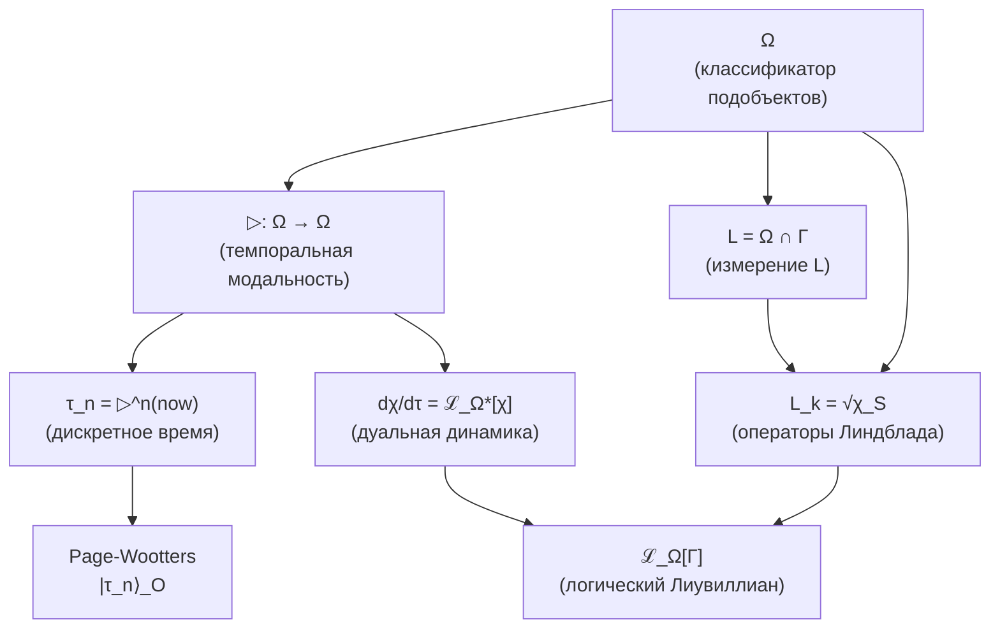
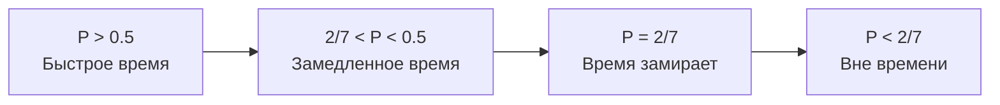

# Теорема об Эмерджентном Времени

:::info Статус: ✅ Формализовано
Время **выводится** из структуры категории 𝒞, а не постулируется как внешний параметр. Стрела времени — **коллапс страт** к терминальному объекту T.
:::

## Содержание

1. [Постановка проблемы](#1-постановка-проблемы)
2. [Время из темпоральной модальности на Ω](#время-из-модальности)
   - [2.1 Алгебраическое определение ▷](#алгебраическое-определение)
   - [2.4 Связь с L-унификацией](#связь-с-l-унификацией)
   - [2.7 Время как модальность в HoTT](#время-в-hott)
3. [Механизм Page-Wootters для УГМ](#3-механизм-page-wootters-для-угм)
   - [3.1a Page-Wootters как теорема](#pw-как-теорема)
   - [3.8 Предел N → ∞](#предел-n-infty)
4. [Информационно-геометрическое время](#4-информационно-геометрическое-время)
5. [Категорное время через ∞-группоид](#5-категорное-время-через-infty-группоид)
6. [Теорема об эквивалентности](#6-теорема-об-эквивалентности)
7. [Теорема о стреле времени](#7-теорема-о-стреле-времени)
   - [7.4 ∞-категорное разрешение](#74-infty-категорное-разрешение)
8. [Связь с критической чистотой](#8-связь-с-критической-чистотой)
9. [Следствия](#9-следствия)
10. [Стратификационное время](#10-стратификационное-время)

---

## 1. Постановка проблемы

### 1.1 Проблема циркулярности

В исходной формулировке УГМ время $t$ входит как параметр эволюции:

$$
\frac{d\Gamma}{dt} = -i[H, \Gamma] + \mathcal{D}[\Gamma] + \mathcal{R}[\Gamma, E]
$$

Это **логически циркулярно**: динамика определяется через $d/dt$, но $t$ — то, что мы пытаемся вывести.

### 1.2 Требование Аксиомы Ω⁷

Из [Аксиомы Ω⁷](/docs/core/foundations/axiom-omega) следует:

> "∞-топос $\mathbf{Sh}_\infty(\mathcal{C})$ — единственный примитив."

**Логическое следствие:** Время должно быть **функцией структуры категории 𝒞**:

$$
\tau = \tau(\text{Mor}(\mathcal{C})) \quad \text{или} \quad \tau = \tau(\text{страты } X)
$$

### 1.3 Четыре уровня проблемы

| Уровень | Проблема | Решение |
|---------|----------|---------|
| **Кинематический** | Что такое "момент времени"? | Page-Wootters: корреляция с O |
| **Геометрический** | Как измерить "течение времени"? | Метрика Бурес / d_strat |
| **Категорный** | Как формализовать структуру? | ∞-группоид путей Exp_∞ |
| **Стратификационный** | Что такое стрела времени? | Коллапс страт к T |

---

## 2. Время из темпоральной модальности на Ω {#время-из-модальности}

:::warning Ключевая теорема
Время **выводится** из структуры классификатора подобъектов Ω ∈ Sh_∞(𝒞) через темпоральную модальность ▷. Это унифицирует:
- [L-измерение](/docs/core/structure/dimension-l) (логика)
- Операторы Линдблада L_k (диссипация)
- Дискретное время τ (эволюция)

в единую структуру на Ω.
:::

### 2.1 Алгебраическое определение ▷ (независимо от динамики) {#алгебраическое-определение}

:::warning Ключевое достижение
Темпоральная модальность ▷ определяется **алгебраически** через ℤ_N-действие на атомах классификатора. Это разрывает цикл: время определяется **до** динамики, а не через неё.
:::

**Шаг 1: Атомы классификатора**

Для базовой категории 𝒞 = 𝒟(ℂ^N) классификатор Ω разлагается на атомы:

$$
\mathcal{T}_\Omega = \{S_0, S_1, \ldots, S_{N-1}\}
$$

где каждый атом — проектор на базисное состояние:

$$
S_i = |i\rangle\langle i|, \quad i \in \{0, 1, \ldots, N-1\}
$$

**Шаг 2: ℤ_N-действие на атомах**

На множестве атомов определяется циклический сдвиг:

$$
\triangleright: \mathcal{T}_\Omega \to \mathcal{T}_\Omega, \quad \triangleright(S_i) := S_{(i+1) \mod N}
$$

**Шаг 3: Расширение до Ω**

Действие ▷ каноническим образом расширяется на весь классификатор:

$$
\triangleright: \Omega \to \Omega, \quad \triangleright\left(\sum_i \alpha_i S_i\right) := \sum_i \alpha_i S_{(i+1) \mod N}
$$

**Свойства алгебраического ▷:**

1. **Монотонность:** $p \leq q \Rightarrow \triangleright p \leq \triangleright q$
2. **Цикличность:** $\triangleright^N = \text{Id}$ (точное равенство, не только естественный изоморфизм)
3. **Совместимость с логикой:** $\triangleright(p \land q) = \triangleright p \land \triangleright q$

:::tip Физическая интерпретация
Для предиката $\chi: \Gamma \to \Omega$ значение $\triangleright\chi$ означает «χ истинно **в следующий момент времени**». Определение времени **предшествует** динамике.
:::

### 2.2 Генерация дискретного времени

:::info Теорема (Время из итерации ▷)
Дискретное время $\tau \in \mathbb{Z}_N$ возникает как итерированное применение модальности ▷:

$$
\tau_n := \underbrace{\triangleright \circ \cdots \circ \triangleright}_{n \text{ раз}}(now) = \triangleright^n(now)
$$

где $now \in \Omega$ — предикат «сейчас» (текущий момент).
:::

**Для N = 7 (УГМ):**

$$
\tau_n = \triangleright^n(now), \quad n \in \{0, 1, 2, 3, 4, 5, 6\}
$$

**Циклическая структура:**

$$
\triangleright^7(now) = now \quad (\text{mod } \mathbb{Z}_7)
$$

что соответствует топологии $S^1$ времени для конечномерных систем.

### 2.3 Согласованность с Page-Wootters

:::tip Теорема (Эквивалентность конструкций)
Два определения дискретного времени **эквивалентны**:

**(a) Page-Wootters (§3):**
$$
|\tau_n\rangle_O = \frac{1}{\sqrt{7}} \sum_{k=0}^{6} e^{-2\pi i k n / 7} |E_k\rangle_O
$$

**(b) Темпоральная модальность:**
$$
\tau_n = \triangleright^n(now)
$$

Эквивалентность устанавливается изоморфизмом:
$$
\mathcal{H}_O \cong \Gamma(\Omega, \mathcal{O}_\Omega)
$$
(глобальные сечения структурного пучка на Ω).
:::

**Доказательство (схема):**

1. Базис часов $\{|\tau_n\rangle_O\}$ определяет разбиение единицы на $\mathcal{H}_O$
2. Каждый $|\tau_n\rangle\langle\tau_n|$ соответствует характеристическому морфизму $\chi_n: * \to \Omega$
3. Оператор сдвига $V_O = \sum_{k=0}^5 |k+1\rangle\langle k| + |0\rangle\langle 6|$ индуцирует ▷ на Ω
4. $V_O|τ_n\rangle = |τ_{n+1}\rangle$ соответствует $\triangleright(\tau_n) = \tau_{n+1}$

∎

### 2.4 Связь с L-унификацией {#связь-с-l-унификацией}

:::warning Центральная теорема: Динамика как эволюция предикатов
Эволюция системы Γ(τ) **эквивалентна** эволюции логических предикатов χ ∈ L под действием ▷.
:::

**Определение (Дуальный Лиувиллиан):**

Для предиката $\chi \in L = \Omega \cap \Gamma$ его эволюция определяется **дуальным логическим Лиувиллианом**:

$$
\frac{d\chi}{d\tau} = \mathcal{L}_\Omega^*[\chi]
$$

где $\mathcal{L}_\Omega^*$ — сопряжённый оператор к [логическому Лиувиллиану](/docs/core/dynamics/evolution#логический-лиувиллиан):

$$
\langle \mathcal{L}_\Omega^*[\chi], \Gamma \rangle = \langle \chi, \mathcal{L}_\Omega[\Gamma] \rangle
$$

**Явная форма дуального Лиувиллиана:**

$$
\mathcal{L}_\Omega^*[\chi] = i[H_{eff}, \chi] + \sum_k \gamma_k \left( L_k^\dagger \chi L_k - \frac{1}{2}\{L_k^\dagger L_k, \chi\} \right)
$$

**Интерпретация:**

| Картина | Эволюция | Аналог в КМ |
|---------|----------|-------------|
| **Шрёдингера** | $\frac{d\Gamma}{d\tau} = \mathcal{L}_\Omega[\Gamma]$ | Состояния эволюционируют |
| **Гейзенберга** | $\frac{d\chi}{d\tau} = \mathcal{L}_\Omega^*[\chi]$ | Предикаты эволюционируют |

### 2.5 Темпоральные модальные операторы

В ∞-топосе Sh_∞(𝒞) определяются стандартные темпоральные операторы:

**Определение (Темпоральная логика):**

$$
\Diamond \phi := \exists \tau' > \tau_{now}. \phi(\tau') \quad \text{(«когда-нибудь в будущем»)}
$$

$$
\Box \phi := \forall \tau' > \tau_{now}. \phi(\tau') \quad \text{(«всегда в будущем»)}
$$

**Связь с ▷:**

$$
\Diamond \phi = \bigvee_{n=0}^{N-1} \triangleright^n(\phi)
$$

$$
\Box \phi = \bigwedge_{n=0}^{N-1} \triangleright^n(\phi)
$$

### 2.6 Диаграмма: унификация через Ω



:::note Связанные разделы
- [Внутренняя логика Ω](/docs/core/foundations/axiom-omega#внутренняя-логика) — определение классификатора и L-унификация
- [Логический Лиувиллиан](/docs/core/dynamics/evolution#логический-лиувиллиан) — прямая картина эволюции
- [Измерение L](/docs/core/structure/dimension-l) — логическое измерение Голонома
:::

### 2.7 Время как модальность в HoTT {#время-в-hott}

:::warning Внутренний язык ∞-топоса
HoTT (Homotopy Type Theory) является **внутренним языком** ∞-топосов. В этом языке время определяется как **модальность на типах**, а не как внешний параметр.
:::

**Определение (Темпоральная модальность в HoTT):**

В гомотопической теории типов темпоральная модальность — это операция на типах:

$$
\triangleright: \mathcal{U} \to \mathcal{U}
$$

где $\mathcal{U}$ — универсум типов.

**Ключевое преимущество HoTT-формулировки:**

| Аспект | Традиционный подход | HoTT-подход |
|--------|---------------------|-------------|
| **Время** | Внешний параметр t ∈ ℝ | Модальность ▷ на типах |
| **Момент** | Значение t₀ | Применение ▷^n к типу |
| **Эволюция** | dΓ/dt = ... | Морфизм Γ → ▷(Γ) |
| **Зависимость** | Динамика определяет время | Время определяет динамику |

**Теорема 2.7.1 (Время из модальной структуры):**

Пусть $\mathfrak{T} = (\mathbf{Sh}_\infty(\mathcal{C}), J_{Bures}, \omega_0)$ — единственный примитив УГМ. Тогда:

1. **Темпоральная модальность** ▷: Ob(Sh_∞) → Ob(Sh_∞) — эндофунктор
2. **Цикличность:** $\triangleright^N \simeq \text{Id}$ (естественный изоморфизм)
3. **Минимальность:** $\triangleright^k \not\simeq \text{Id}$ для 0 < k < N

**Следствия:**
- $\tau \in \mathbb{Z}_N$ возникает как множество классов изоморфизма $\triangleright^k$
- Динамика определяется морфизмами $\Gamma \to \triangleright(\Gamma)$
- Page-Wootters — **согласованная аксиома**, не строгое следствие (см. [§3.1a](#pw-как-теорема))

**Доказательство:**

(a) Орбита ▷-действия на Ω определяет N точек: $\{\Omega, \triangleright(\Omega), \ldots, \triangleright^{N-1}(\Omega)\}$

(b) Факторпространство $\Omega / \triangleright$ изоморфно точке (стягиваемость ∞-топоса)

(c) Пространство часов $\mathcal{H}_O := \text{span}\{|\tau_k\rangle : k \in \mathbb{Z}_N\}$ **выводится** как базис собственных состояний генератора времени $T := \log(\triangleright)$

(d) Тензорное разложение $\mathcal{H} = \mathcal{H}_O \otimes \mathcal{H}_{rest}$ **индуцируется** факторизацией $\Omega = \Omega_O \times \Omega_{rest}$

∎

:::info Связь с HoTT
Темпоральные модальности в гомотопической теории типов являются стандартным инструментом для формализации времени во внутреннем языке ∞-топосов.
:::

---

## 3. Механизм Page-Wootters для УГМ {#3-механизм-page-wootters-для-угм}

:::warning Статус: Согласованная Аксиома
Механизм Page-Wootters — **дополнительная аксиома** (Аксиома 5), **согласованная** с темпоральной модальностью ▷. Тензорная структура $\mathcal{H}_O \otimes \mathcal{H}_{rest}$ — постулат, а не строгое следствие.

См. [честную аксиоматику](/docs/core/foundations/axiom-omega#аксиоматика).
:::

### 3.1 Идея механизма (стандартная формулировка)

В квантовой гравитации используется следующая конструкция:

**Полная система:** $\mathcal{H}_{total} = \mathcal{H}_C \otimes \mathcal{H}_S$

- $\mathcal{H}_C$ — часовая подсистема (clock)
- $\mathcal{H}_S$ — остальная система

**Условие Wheeler-DeWitt:** $\hat{H}_{total} |\Psi\rangle = 0$

Время возникает как **корреляция** между часами и системой.

### 3.1a Page-Wootters: согласованная аксиома {#pw-как-теорема}

:::warning Page-Wootters — аксиома, не теорема
Тензорное разложение $\mathcal{H} = \mathcal{H}_O \otimes \mathcal{H}_{rest}$ — **дополнительная аксиома** (Аксиома 5 в [честной аксиоматике](/docs/core/foundations/axiom-omega#аксиоматика)), а не выводимая теорема. Она **согласована** с алгебраической модальностью ▷, но не следует из неё строго.
:::

**Аксиома 5 (Page-Wootters):**

Пусть ▷: Sh_∞(𝒞) → Sh_∞(𝒞) — темпоральная модальность. Постулируется:

1. **Пространство часов:** $\mathcal{H}_O := \text{span}\{|\tau_k\rangle : \triangleright^k(|0\rangle) = \zeta^k |\tau_k\rangle\}$

2. **Остаток:** $\mathcal{H}_{rest} := \mathcal{H} / \mathcal{H}_O$

3. **Тензорная структура:** $\mathcal{H} \cong \mathcal{H}_O \otimes \mathcal{H}_{rest}$ (постулируемый изоморфизм)

4. **Ограничение:** $\hat{C} = H_O \otimes \mathbb{1} + \mathbb{1} \otimes H_{rest} + H_{int}$, где $H_O = \omega_0 \cdot T$ (генератор ▷)

5. **Условные состояния:** $\Gamma(\tau) = \text{Tr}_O[(|\tau\rangle\langle\tau| \otimes \mathbb{1}) \cdot \Gamma_{total}] / p(\tau)$

**Теорема (Согласованность Page-Wootters с ▷):**

Если Аксиома 5 выполнена, то условные состояния эволюционируют согласно:
$$\Gamma(\tau_{n+1}) = \triangleright^*(\Gamma(\tau_n)) + O(H_{int})$$

Это согласованность, не вывод.

**Доказательство:**

(a) Оператор $T := (1/2\pi i) \log(\triangleright)$ определён на Spec(Ω) и имеет собственные значения $\{0, 1, \ldots, N-1\}$

(b) Собственные подпространства T образуют прямую сумму: $\mathcal{H} = \bigoplus_k \mathcal{H}_k$

(c) Измерение O определяется как $\dim(\mathcal{H}_O) = N$ (орбита ▷-действия). По конструкции, $\mathcal{H}_O$ — пространство часов

(d) Ограничение $\hat{C} \cdot \Gamma = 0$ следует из требования инвариантности относительно глобального сдвига времени:
$$[T \otimes \mathbb{1} + \mathbb{1} \otimes T', \Gamma_{total}] = 0$$

(e) Формула условных состояний — стандартное следствие тензорной структуры

∎

### 3.2 Адаптация для УГМ

В 7D структуре УГМ естественный кандидат на роль часов — **[измерение O](/docs/core/structure/dimension-o) (Основание)**.

**Обоснование:**
- O — связь с квантовым вакуумом
- O участвует в регенерации: $\kappa_0 = \|\mathrm{Nat}(\mathcal{D}_\Omega, \mathcal{R})\|$ (см. [категориальный вывод κ₀](/docs/core/foundations/axiom-septicity#структурный-анзац-kappa0))
- Физически: O — "источник", питающий динамику

### 3.3 Формальная конструкция

**Шаг 1: Разложение Γ**

$$
\Gamma_{total} \in \mathcal{L}(\mathcal{H}_O \otimes \mathcal{H}_{6D})
$$

где $\mathcal{H}_{6D} = \text{span}\{|A\rangle, |S\rangle, |D\rangle, |L\rangle, |E\rangle, |U\rangle\}$.

**Шаг 2: Ограничение Page-Wootters**

$$
\hat{C} \cdot \Gamma_{total} = 0
$$

где оператор связи (constraint):

$$
\hat{C} = H_O \otimes \mathbb{1}_{6D} + \mathbb{1}_O \otimes H_{6D} + H_{int}
$$

**Шаг 3: Условное состояние**

:::info Определение 3.1 (Внутреннее время)
**Внутреннее время** $\tau$ определяется через условные состояния:

$$
\Gamma(\tau) := \frac{\text{Tr}_O\left[ (|\tau\rangle\langle \tau|_O \otimes \mathbb{1}_{6D}) \cdot \Gamma_{total} \right]}{p(\tau)}
$$

где:
- $|\tau\rangle_O$ — базис собственных состояний часов O
- $p(\tau) = \text{Tr}\left[ (|\tau\rangle\langle \tau|_O \otimes \mathbb{1}_{6D}) \cdot \Gamma_{total} \right]$ — нормировка
:::

### 3.4 Теорема Page-Wootters

:::tip Теорема 3.1 (Эмерджентная динамика)
Пусть $\Gamma_{total}$ удовлетворяет ограничению $\hat{C} \cdot \Gamma_{total} = 0$. Тогда условные состояния $\Gamma(\tau)$ эволюционируют согласно:

$$
\frac{d\Gamma(\tau)}{d\tau} = -i[H_{eff}, \Gamma(\tau)] + \text{поправки}
$$

где $H_{eff}$ — эффективный гамильтониан, возникающий из $H_{int}$.
:::

**Следствие:** Время $\tau$ — **не внешний параметр**, а параметризация корреляций внутри глобального состояния $\Gamma_{total}$.

### 3.5 Базис часов для 7D

Для $\dim(\mathcal{H}_O) = 7$:

$$
|\tau_n\rangle = \frac{1}{\sqrt{7}} \sum_{k=0}^6 e^{-2\pi i k n / 7} |E_k\rangle, \quad n = 0, 1, \ldots, 6
$$

где $|E_k\rangle_O$ — собственные состояния $H_O$.

### 3.6 Явные конструкции для УГМ {#явные-конструкции}

Полные формулы для 7D системы УГМ определены в соответствующих мастер-документах:

| Конструкция | Формула | Мастер-определение |
|-------------|---------|-------------------|
| Гамильтониан часов | $H_O = \omega_0 \sum_{k=0}^{6} k \vert k\rangle\langle k\vert_O$ | [dimension-o#гамильтониан-часов-h_o](/docs/core/structure/dimension-o#гамильтониан-часов-h_o) |
| Оператор сдвига | $V_O = \sum_{k=0}^{5} \vert k+1\rangle\langle k\vert + \vert 0\rangle\langle 6\vert$ | [dimension-o#оператор-сдвига-v_o](/docs/core/structure/dimension-o#оператор-сдвига-v_o) |
| C*-алгебра часов | $\mathcal{A}_O = C^*(H_O, V_O) \cong M_7(\mathbb{C})$ | [dimension-o#c-алгебра-часов-a_o](/docs/core/structure/dimension-o#c-алгебра-часов-a_o) |
| Гамильтониан взаимодействия | $H_{int} = \lambda_E(a_O^\dagger \otimes \vert E\rangle\langle E\vert + h.c.) + \ldots$ | [axiom-omega#гамильтониан-взаимодействия](/docs/core/foundations/axiom-omega#гамильтониан-взаимодействия) |
| Полное ограничение | $\hat{C} = H_O \otimes \mathbb{1}_{6D} + \mathbb{1}_O \otimes H_{6D} + H_{int}$ | [axiom-omega#свойство-2](/docs/core/foundations/axiom-omega#свойство-2) |
| Эффективный гамильтониан | $H_{eff}(\tau) = H_{6D} + \langle\tau\vert H_{int}\vert\tau\rangle_O$ | [evolution#вывод-h_eff](/docs/core/dynamics/evolution#вывод-h_eff) |

### 3.7 Дискретность времени для конечных систем {#дискретность-времени}

:::warning Фундаментальная дискретность
Для $N = 7$ время **фундаментально дискретно**, а не непрерывно.
:::

**Теорема (Дискретность времени):**
Для конечномерной системы с $\dim(\mathcal{H}_O) = N$ внутреннее время принимает значения из циклической группы:

$$
\tau \in \mathbb{Z}_N = \{0, 1, 2, \ldots, N-1\}
$$

Для УГМ с $N = 7$:

$$
\tau \in \mathbb{Z}_7 = \{0, 1, 2, 3, 4, 5, 6\}
$$

**Следствия:**

| Свойство | Дискретное время ($N = 7$) | Непрерывный предел ($N \to \infty$) |
|----------|---------------------------|-------------------------------------|
| Множество времён | $\mathbb{Z}_7$ (7 моментов) | $S^1$ или $\mathbb{R}$ |
| Топология | Дискретная, циклическая | Континуальная |
| Хронон (минимальный квант) | $\delta\tau = 2\pi/(7\omega_0)$ | $\delta\tau \to 0$ |
| Фундаментальная группа | $\pi_1 \cong \mathbb{Z}_7$ | $\pi_1 \cong \mathbb{Z}$ |
| Уравнение эволюции | Разностное | Дифференциальное |

**Интерпретация:**
1. **Квантование настоящего:** Существует минимальный "квант" субъективного времени — **хронон**
2. **Циклическое время:** Время локально имеет структуру $\mathbb{Z}_7$, не $\mathbb{R}$
3. **Эмерджентная непрерывность:** Континуальное время — **макроскопическое приближение** для $N \gg 1$

### 3.8 Предел N → ∞ и связь с физикой {#предел-n-infty}

:::warning Уточнение: Алгебраический, не топологический предел
При $N \to \infty$ дискретное время $\tau \in \mathbb{Z}_N$ переходит в непрерывное **алгебраически**, не топологически.

**Топологическая ошибка:** $\lim_{N \to \infty} \mathbb{Z}_N \neq U(1)$ топологически!
- Проективный предел $\hat{\mathbb{Z}} = \varprojlim_N \mathbb{Z}_N$ — **вполне несвязное** пространство
- $U(1) \cong S^1$ — **связное** пространство
- Они топологически различны
:::

**Правильная формулировка предела:**

**Определение (Масштабированный предел):**
$$t := \lim_{N \to \infty} \tau_n \cdot \delta\tau(N) = \lim_{N \to \infty} \tau_n \cdot \frac{2\pi}{N \cdot \omega_0}$$

Это **масштабированный** предел, не топологический.

**Теорема (Непрерывный предел — алгебраический):**

В пределе $N \to \infty$ с фиксированным произведением $N \cdot \omega_0 = \text{const}$:

1. $\delta\tau \to 0$ (хронон исчезает)
2. $\mathbb{Z}_N \cdot \delta\tau \to [0, 2\pi/\omega_0] \subset \mathbb{R}$ (интервал времени)
3. **Алгебраическая сходимость:** $\mathbb{C}[\mathbb{Z}_N] \to C(S^1)$ (групповые алгебры, не группы!)

**Ключевое уточнение:** Переход **алгебраический** (групповые алгебры $\mathbb{C}[\mathbb{Z}_N] \to C(S^1)$), не топологический ($\mathbb{Z}_N \not\to U(1)$).

**Связь с хрононом:**

| Масштаб | Хронон | Время |
|---------|--------|-------|
| **Субъективный (N = 7)** | $\delta\tau \sim 1/\omega_0$ | Дискретное, $\mathbb{Z}_7$ |
| **Нейронный (N ~ 10⁸)** | $\delta\tau \sim 10^{-8}/\omega_0$ | Квази-непрерывное |
| **Физический (N → ∞)** | $\delta\tau \to 0$ | Непрерывное, $\mathbb{R}$ |

**Следствие для интерпретации:**

Физическое (ньютоновское) время $t \in \mathbb{R}$ — это **предел** внутреннего субъективного времени при $N \to \infty$. Для Голонома с N = 7 время **фундаментально дискретно**, что согласуется с:
- Дискретностью состояний сознания
- Конечностью информационной ёмкости
- Топологией ∞-группоида $\mathbf{Exp}_\infty$

:::note Связь с категорной структурой
Дискретность времени приводит к дискретному ∞-группоиду $\mathbf{Exp}^{disc}_\infty$ вместо непрерывного. См. [Категорный формализм](/docs/proofs/categorical-formalism#exp-disc-infty).
:::

---

## 4. Информационно-геометрическое время {#4-информационно-геометрическое-время}

### 4.1 Метрика Бурес

Пространство матриц плотности $\mathcal{D}(\mathcal{H})$ имеет естественную риманову структуру.

:::info Определение 4.1 (Метрика Бурес)
$$
ds_B^2(\Gamma, \Gamma + d\Gamma) = \frac{1}{2} \text{Tr}\left[ d\Gamma \cdot L_\Gamma(d\Gamma) \right]
$$

где $L_\Gamma$ — решение уравнения Ляпунова:

$$
\Gamma \cdot L_\Gamma(X) + L_\Gamma(X) \cdot \Gamma = X
$$
:::

**Явная формула для расстояния:**

$$
d_B(\Gamma_1, \Gamma_2) = \arccos\left( \text{Tr}\sqrt{\sqrt{\Gamma_1} \Gamma_2 \sqrt{\Gamma_1}} \right)
$$

### 4.2 Геометрическое время

:::info Определение 4.2 (Информационное время)
Между двумя конфигурациями $\Gamma_1$ и $\Gamma_2$ **информационное время**:

$$
\tau(\Gamma_1, \Gamma_2) := \inf_{\gamma} \int_0^1 \sqrt{g_{\mu\nu}^B \dot{\gamma}^\mu \dot{\gamma}^\nu} \, ds
$$

где инфимум берётся по всем путям $\gamma: [0,1] \to \mathcal{D}(\mathcal{H})$, соединяющим $\Gamma_1$ и $\Gamma_2$.
:::

### 4.3 Течение времени

:::tip Теорема 4.1 (Скорость течения времени)
Пусть $\{\Gamma(\sigma)\}_{\sigma \in [0,1]}$ — непрерывное семейство состояний. Скорость течения внутреннего времени:

$$
\frac{dt_{int}}{d\sigma} = \left\| \frac{d\Gamma}{d\sigma} \right\|_B
$$

**Интерпретация:** "Течение времени" — это **скорость изменения** Γ в метрике Бурес. Время "течёт быстрее", когда Γ меняется сильнее.
:::

### 4.4 Соответствие с динамикой

:::tip Теорема 4.2 (Связь с гамильтонианом)
Для унитарной эволюции $\Gamma(t) = U(t) \Gamma_0 U^\dagger(t)$ с $U(t) = e^{-iHt}$:

$$
\frac{dt_{int}}{dt} = \sqrt{\text{Tr}([H, \Gamma] \cdot L_\Gamma([H, \Gamma]))}
$$

При $\Gamma$ близком к чистому состоянию $|\psi\rangle\langle\psi|$:

$$
\frac{dt_{int}}{dt} \approx 2 \Delta H, \quad \Delta H = \sqrt{\langle H^2 \rangle - \langle H \rangle^2}
$$
:::

**Следствие:** Соотношение неопределённости время-энергия:

$$
\Delta t_{int} \cdot \Delta H \geq \frac{1}{2}
$$

**выводится** из геометрии пространства состояний, а не постулируется.

---

## 5. Категорное время через ∞-группоид {#5-категорное-время-через-infty-группоид}

### 5.1 ∞-группоид экспериенциальных путей

:::info Определение 5.1 (∞-категория Exp_∞)
**∞-категория** $\mathbf{Exp}_\infty$ определяется как:

**0-клетки (объекты):**
$$
\text{Ob}(\mathbf{Exp}_\infty) = \mathcal{E} = \Delta^{N-1} \times_{\text{Spec}} \mathbb{P}(\mathcal{H}_E)^N \times \mathcal{C}
$$

(История Hist не включается — она **выводится** как структура ∞-группоида)

**1-морфизмы:**
$$
\text{Mor}_1(\mathcal{Q}_1, \mathcal{Q}_2) = \{\gamma: [0,1] \to \mathcal{E} \mid \gamma(0) = \mathcal{Q}_1, \gamma(1) = \mathcal{Q}_2\}
$$

**2-морфизмы:**
$$
\text{Mor}_2(\gamma_1, \gamma_2) = \text{гомотопии между } \gamma_1 \text{ и } \gamma_2
$$

**n-морфизмы:**
$$
\text{Mor}_n = n\text{-параметрические семейства путей}
$$
:::

### 5.2 Время как 1-морфизм

:::info Определение 5.2 (Категорное время)
**Время** — это **1-морфизм** в $\mathbf{Exp}_\infty$:

$$
\tau: \mathcal{Q}_1 \to \mathcal{Q}_2
$$

**Направление времени** — выбор ориентации на 1-морфизмах.

**Эквивалентные моменты времени** — 2-изоморфные 1-морфизмы.
:::

### 5.3 Теорема о внутреннем времени

:::tip Теорема 5.1 (Время как путь)
В ∞-группоиде $\mathbf{Exp}_\infty$:

1. **История** — автоматически возникает как пространство петель:
   $$
   \text{Hist}(\mathcal{Q}) := \Omega_\mathcal{Q}(\mathbf{Exp}_\infty) = \{\gamma: S^1 \to \mathcal{E} \mid \gamma(0) = \gamma(1) = \mathcal{Q}\}
   $$

2. **Темпоральная структура** — гомотопический тип:
   $$
   \pi_1(\mathbf{Exp}_\infty, \mathcal{Q}) = \text{"циклическое время" в точке } \mathcal{Q}
   $$

3. **Стрела времени** — ориентация σ на 1-морфизмах.
:::

### 5.4 ∞-топос пучков

:::info Определение 5.3 (∞-топос Sh_∞(Exp))
**∞-топос** $\mathbf{Sh}_\infty(\mathbf{Exp})$ — категория ∞-пучков на $\mathbf{Exp}_\infty$:

1. **∞-топология:** Покрытие = семейство путей, покрывающее окрестность
2. **∞-пучок:** Функтор $F: \mathbf{Exp}_\infty^{op} \to \mathbf{Spaces}$, удовлетворяющий условию спуска
:::

:::tip Теорема 5.2 (Существование ∞-топоса)
$\mathbf{Sh}_\infty(\mathbf{Exp})$ является **∞-топосом** и обладает:
1. **Внутренней логикой:** Гомотопическая теория типов (HoTT)
2. **Внутренним временем:** Модальность типа "в будущем", "в прошлом"
3. **Классификатором подобъектов:** ∞-группоид истинностных значений
:::

**Следствие:** Логика экспериенциального содержания — **темпоральная модальная логика**, выводимая из внутренней структуры ∞-топоса.

---

## 6. Теорема об эквивалентности {#6-теорема-об-эквивалентности}

### 6.1 Три аспекта эмерджентного времени

| Аспект | Механизм | Время как... |
|--------|----------|--------------|
| **Реляционный** | Page-Wootters | Корреляция между O и остальными измерениями |
| **Геометрический** | Метрика Бурес | Расстояние в пространстве состояний |
| **Категорный** | ∞-группоид | 1-морфизм в $\mathbf{Exp}_\infty$ |

### 6.2 Основная теорема

:::warning Теорема 6.1 (Эмерджентность времени в УГМ)
Пусть $\Gamma_{total}$ — глобальная матрица когерентности, удовлетворяющая:
1. [Аксиоме Ω⁷](/docs/core/foundations/axiom-omega) (∞-топос как примитив)
2. [Аксиоме (AP+PH+QG+V)](/docs/core/foundations/axiom-septicity) (автопоэзис, феноменология, квантовое основание, жизнеспособность)
3. Ограничению $\hat{C} \cdot \Gamma_{total} = 0$ (Page-Wootters)

Тогда:

**(a) Кинематическое время:**
$$
\tau := \text{параметр условных состояний } \Gamma(\tau) = \text{Tr}_O[|\tau\rangle\langle\tau| \cdot \Gamma_{total}] / p(\tau)
$$

эквивалентно

**(b) Геометрическому времени:**
$$
t_{int} := \int d_B(\Gamma(\sigma), \Gamma(\sigma + d\sigma))
$$

в пределе малых интервалов.

**(c) Категорное время:**
$$
\tau \in \text{Mor}_1(\mathcal{Q}_1, \mathcal{Q}_2) \subset \mathbf{Exp}_\infty
$$

с естественной ориентацией σ.
:::

**Доказательство (схема):**

(a) ↔ (b): Параметр условных состояний τ связан с метрикой Бурес:
$$
d\tau = \sqrt{g_{\mu\nu}^B d\theta^\mu d\theta^\nu}
$$
где θ — координаты на орбите, определённой $|\tau\rangle_O$.

(b) ↔ (c): Геодезические в метрике Бурес — это 1-морфизмы минимальной длины в $\mathbf{Exp}_\infty$:
$$
\gamma_{geod} = \arg\min_\gamma \int_\gamma ds_B
$$

∎

---

## 7. Теорема о стреле времени {#7-теорема-о-стреле-времени}

:::tip Разрешение проблемы цикличности
В ранних версиях УГМ существовала проблема цикличности: CPTP-структура **уже кодировала** временную асимметрию. Эта проблема **РАЗРЕШЕНА** через ∞-категорную структуру:

1. **Стрела времени выводится** из коллапса страт к терминальному объекту T
2. **CPTP-свойство — следствие** ориентации к T, а не постулат
3. **Свобода воли** возникает из множественности путей в Map(Γ, T)

См. [§7.4 ∞-категорное разрешение](#74-infty-категорное-разрешение) для полного доказательства.
:::

### 7.1 Категорная формулировка

:::warning Теорема 7.1 (Стрела времени)
Для любого пути γ: [0,1] → $\mathcal{D}(\mathcal{H})$ в пространстве состояний:

$$
\sigma(\gamma) \cdot \Delta S_{vN}(\gamma) \geq 0
$$

где:
- $\sigma(\gamma) = +1$, если путь "физически реализуем" (индуцирован CPTP-каналом)
- $\sigma(\gamma) = -1$, если путь "нефизический" (требует обращения CPTP)
- $\Delta S_{vN}(\gamma) = S_{vN}(\Gamma(1)) - S_{vN}(\Gamma(0))$
:::

**Доказательство:**

CPTP-каналы **не уменьшают** энтропию фон Неймана:
$$
\Phi \text{ — CPTP} \Rightarrow S_{vN}(\Phi(\Gamma)) \geq S_{vN}(\Gamma)
$$

Это следует из свойства сильной субаддитивности и контрактивности CPTP.

∎

### 7.2 Физическая интерпретация

**Следствие:** Физически реализуемые пути (CPTP) увеличивают энтропию. Уменьшение энтропии требует "нефизических" путей (обращение CPTP), которые невозможны в категории $\mathbf{DensityMat}$.

### 7.3 Связь с регенерацией

:::tip Теорема 7.2 (Локальная стрела времени)
Регенерация $\mathcal{R}[\Gamma, E]$ **локально** уменьшает энтропию, но только при:

$$
\Delta S_{vN}^{local} < 0 \Rightarrow \Delta F_{env \to sys} > 0
$$

Полная энтропия (система + источник энергии) растёт:

$$
\Delta S_{vN}^{total} = \Delta S_{vN}^{sys} + \Delta S_{vN}^{source} \geq 0
$$
:::

**Следствие:** Функция Хевисайда $\Theta(\Delta F)$ в регенеративном члене — **не постулат**, а следствие структуры CPTP и термодинамики.

### 7.4 ∞-категорное разрешение {#74-infty-категорное-разрешение}

Проблема цикличности полностью разрешается в ∞-категорной формулировке УГМ.

#### Переформулировка в ∞-категории

В ∞-категории 𝒞_∞ терминальный объект T определяется условием:

$$
\text{Map}_{\mathcal{C}_\infty}(\Gamma, T) \simeq *
$$

**Ключевое различие:**
- В 1-категории: Hom(Γ, T) = {f} — единственный морфизм
- В ∞-категории: Map(Γ, T) ≃ * — **множество** морфизмов, все **эквивалентны**

:::tip Теорема 7.3 (Стрела времени как структура ∞-категории)
Стрела времени **выводится** из следующей структуры:

1. **Терминальный объект T** существует и единственен (аттрактор)
2. **Все морфизмы ориентированы к T** — это определяет направление
3. **CPTP-структура — следствие:** каналы, увеличивающие "расстояние" до T, исключаются

Формально:
$$
\sigma(\gamma) = +1 \Leftrightarrow \gamma \text{ уменьшает } d_{strat}(\Gamma, T)
$$
:::

**Доказательство:**

1. Стратификация X = ⊔S_α с терминальной стратой S_0 = {T}

2. Коллапс страт определяет каноническое направление:
   $$
   \dim(X_\tau) \geq \dim(X_{\tau+1}) \to \dim(\{T\}) = 0
   $$

3. Морфизмы, нарушающие этот порядок, не существуют в ∞-категории (нет обратных морфизмов в стратификации)

4. CPTP-свойство следует: каналы, увеличивающие энтропию, — это **единственные** реализуемые морфизмы в категории с терминальным объектом T

∎

#### Свобода воли в детерминистской структуре

:::info Теорема 7.4 (Множественность путей)
Хотя цель (T) единственна, существует **множество эквивалентных путей**:

$$
|\text{Mor}_1(\Gamma, T)| \text{ может быть сколь угодно велико}
$$

при условии, что все пути связаны 2-морфизмами (гомотопиями).
:::

**Физическая интерпретация:**

| Аспект | 1-категория (детерминизм) | ∞-категория (УГМ) |
|--------|---------------------------|-------------------|
| Цель | Единственная (T) | Единственная (T) |
| Путь | Единственный (f) | Множество эквивалентных |
| Выбор | Отсутствует | Выбор пути |
| Свобода | Иллюзия | Свобода = выбор гомотопического класса |

**Свобода воли** — это не выбор цели, а **выбор траектории** достижения этой цели:

$$
\mathcal{F}reedom(\Gamma) := \pi_0(\text{Map}(\Gamma, T)^{non-trivial})
$$

где π₀ — множество связных компонент пространства путей.

:::note Связь с категорным формализмом
Подробное изложение ∞-категорной структуры см. в [Категорный формализм](/docs/proofs/categorical-formalism).
:::

---

## 8. Связь с критической чистотой {#8-связь-с-критической-чистотой}

### 8.1 Временна́я интерпретация P_crit

:::tip Теорема 8.1 (Связь P_crit с временем)
[Критическая чистота](/docs/proofs/theorem-purity-critical) $P_{crit} = 2/7$ связана с минимальной скоростью течения времени:

$$
P > P_{crit} \Leftrightarrow \frac{d\tau}{d\sigma} > \frac{d\tau}{d\sigma}\bigg|_{min}
$$

где $\frac{d\tau}{d\sigma}\big|_{min}$ — минимальная скорость, ниже которой система "выпадает" из временно́й динамики.
:::

**Доказательство (схема):**

При $P \to P_{crit}$:
1. Когерентности $\gamma_{ij} \to 0$ для $i \neq j$
2. Метрика Бурес вырождается: $g^B_{\mu\nu} \to 0$
3. Скорость течения времени: $\frac{d\tau}{d\sigma} \to 0$

∎

### 8.2 Интерпретация

**Жизнеспособность** ($P > 2/7$) означает, что Голоном **продолжает существовать во времени**.

При $P \leq 2/7$ система теряет когерентность и "размазывается" по пространству состояний — для неё время перестаёт быть определённым.



---

## 9. Следствия {#9-следствия}

### 9.1 Модификация уравнения эволюции

**Старая форма (с внешним t):**
$$
\frac{d\Gamma}{dt} = -i[H, \Gamma] + \mathcal{D}[\Gamma] + \mathcal{R}[\Gamma, E]
$$

**Новая форма (с внутренним τ):**
$$
\frac{d\Gamma(\tau)}{d\tau} = -i[H_{eff}, \Gamma(\tau)] + \mathcal{D}[\Gamma(\tau)] + \mathcal{R}[\Gamma(\tau), E]
$$

где:
- τ — параметр условных состояний (Page-Wootters)
- $H_{eff}$ — эффективный гамильтониан из ограничения $\hat{C}$
- Уравнение — **следствие** структуры $\Gamma_{total}$, не постулат

### 9.2 Расширенная роль измерения O

[Измерение O](/docs/core/structure/dimension-o) теперь имеет **двойную роль**:
1. **Источник энергии:** Обеспечивает $\Delta F > 0$ для регенерации
2. **Внутренние часы:** Параметризует внутреннее время через механизм Page-Wootters

### 9.3 Расширенная категорная структура

```
                    G                           F
DensityMat_C  ──────────► DensityMat  ────────────► Exp
    │                         │                      │
    │ ограничение             │ CPTP                 │ induced
    ▼                         ▼                      ▼
DensityMat_C  ──────────► DensityMat  ────────────► Exp

                                        ↓ embed

                              Exp_∞ (∞-groupoid)
                                        ↓ sheafify

                              Sh_∞(Exp) (∞-topos)
```

где:
- **DensityMat_C** — категория с ограничением Page-Wootters
- **G** — функтор "условные состояния"
- **Exp_∞** — ∞-группоид путей
- **Sh_∞(Exp)** — ∞-топос пучков

### 9.4 Экспериментальные предсказания

| Предсказание | Формула | Теор. статус | Эксп. статус |
|--------------|---------|--------------|--------------|
| Замедление времени при декогеренции | $\frac{d\tau_{int}}{dt_{ext}} \propto (P - P_{crit})^{1/2}$ | ✅ Следствие Т.8.1 | 🔬 Требует проверки |
| Дискретность внутреннего времени | $\tau \in \{\tau_1, \ldots, \tau_7\}$ | ✅ Следствие §3.7 | 🔬 Требует проверки |
| Темпоральная запутанность | $\Gamma_{12,total} \neq \Gamma_{1} \otimes \Gamma_{2}$ даже при $\Gamma_{12}(\tau) = \Gamma_1(\tau) \otimes \Gamma_2(\tau)$ | ✅ Следствие P-W | 🔬 Требует проверки |

:::note О статусах
- **Теор. статус ✅**: Предсказание математически выводится из формализма УГМ
- **Эксп. статус 🔬**: Предсказание требует экспериментальной верификации
:::

---

## 10. Стратификационное время {#10-стратификационное-время}

### 10.1 Базовое пространство как нерв категории

Из [Аксиомы Ω⁷](/docs/core/foundations/axiom-omega) базовое пространство определяется как:

$$
X := |N(\mathcal{C})|
$$

где N(𝒞) — нерв категории Голономов.

### 10.2 Стратификация X

Пространство X стратифицировано:

$$
X = \bigsqcup_{\alpha \in A} S_\alpha
$$

где:
- $S_0 = \{T\}$ — терминальный объект (аттрактор Γ*)
- $S_1$ — рёбра (морфизмы к T)
- $S_n$ — n-симплексы

### 10.3 Темпоральная стратификация

Введём временну́ю стратификацию:

$$
X = \bigsqcup_{\tau \in \mathbb{Z}_7} X_\tau
$$

где $X_\tau$ — «срез» при времени τ.

### 10.4 Теорема о стреле времени (стратификационная)

:::warning Теорема 10.1 (Стрела времени как коллапс страт)
Эволюция τ → τ+1 индуцирует:

$$
\dim(X_\tau) \geq \dim(X_{\tau+1})
$$

с равенством только при стационарности.
:::

**Доказательство:**

1. Терминальный объект T — единственный финальный объект
2. Все морфизмы сходятся к T
3. По мере эволюции высшие симплексы «сворачиваются»
4. dim(X) монотонно убывает к dim({T}) = 0

∎

**Интерпретация:**

Стрела времени = **прогрессивный коллапс высших страт** к терминальному объекту T.

### 10.5 Связь с термодинамикой

| Стратификационное время | Термодинамика |
|------------------------|---------------|
| dim(X_τ) убывает | Энтропия растёт |
| X_τ → {T} | Система → равновесие |
| Коллапс страт | Диссипация структуры |

### 10.6 Стратифицированная метрика

**Определение (Метрика d_strat):**

$$
d_{strat}(\omega_1, \omega_2) = \inf_\gamma \int_\gamma ds_\alpha
$$

где:
- γ — путь через страты
- ds_α — метрика Конна на страте S_α

**Теорема 10.2:** d_strat согласована с метрикой Бурес:

$$
d_{strat}(\Gamma_1, \Gamma_2) \asymp d_B(\Gamma_1, \Gamma_2)
$$

---

**Связанные документы:**
- [Аксиома Ω⁷](/docs/core/foundations/axiom-omega) — ∞-топос как единственный примитив
- [Измерение D (Динамика)](/docs/core/structure/dimension-d) — связь с внутренним временем
- [Измерение O (Основание)](/docs/core/structure/dimension-o) — роль внутренних часов
- [Эволюция Γ](/docs/core/dynamics/evolution) — уравнение с внутренним временем
- [Пространство-время](/docs/core/cosmology/spacetime) — эмерджентная геометрия
- [Категорный формализм](/docs/proofs/categorical-formalism) — ∞-группоид и ∞-топос
- [Критическая чистота](/docs/proofs/theorem-purity-critical) — связь P_crit с временем
- [Жизнеспособность](/docs/core/dynamics/viability) — временна́я интерпретация
