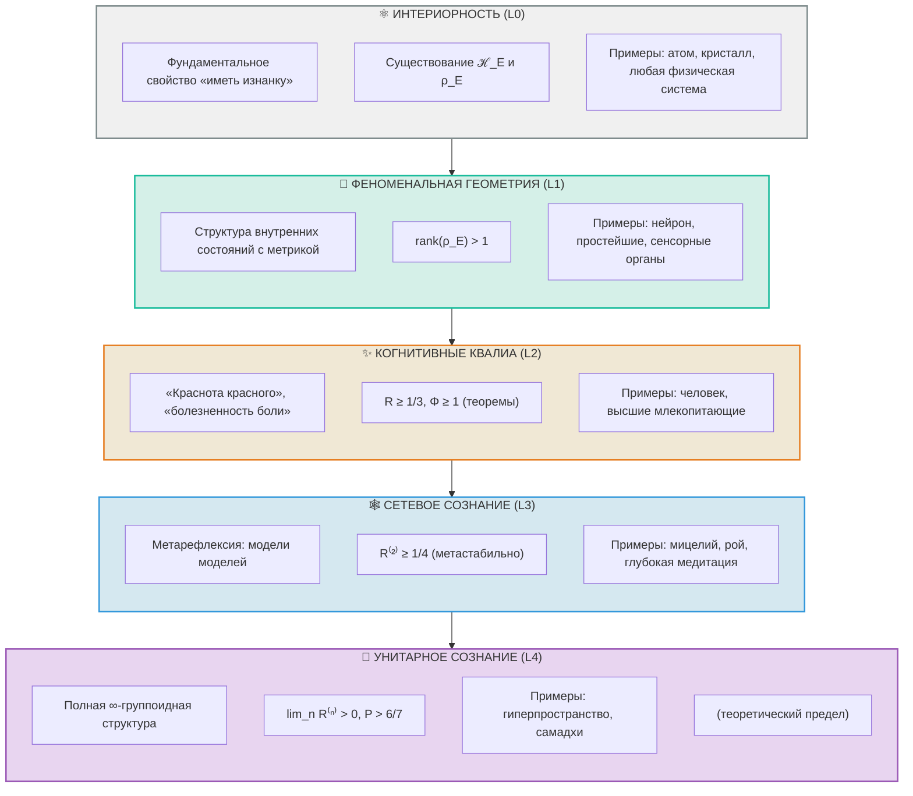

# Иерархия Интериорности: Формальная Спецификация

## Терминологическая Ревизия для Унитарного Голономного Монизма

:::note О нотации
В этом документе:
- $\mathcal{H}_E$ — гильбертово пространство [измерения Опыта](/docs/core/structure/dimension-e). Не путать с $H$ — гамильтонианом.
- $D_{\text{diff}}$ — мера дифференциации. Не путать с $D$ — [измерением Динамики](/docs/core/structure/dimension-d).
- $\Phi$ — мера [интеграции](/docs/core/structure/dimension-u#мера-интеграции-φ). Не путать с CPTP-каналами $\Phi$.
- $R$ — мера [рефлексии](/docs/core/consciousness/self-observation#мера-рефлексии-r).
:::

## Мотивация

### Проблема

Термин **«Квалиа»** (Qualia) исторически связан с *сознательным* субъективным опытом (Nagel, 1974; Chalmers, 1996). УГМ использует его для описания фундаментального свойства *любой* системы, включая атомы, что создает:

1. **Терминологический конфликт**: Философы сознания понимают квалиа как «краснота красного», «болезненность боли» — феномены, требующие сознающего субъекта.

2. **Антропоморфизм**: Приписывание атому «квалиа» имплицитно переносит на него свойства сознательного опыта.

3. **Размывание понятия**: Если всё имеет квалиа, термин теряет дискриминативную силу.

### Решение

Введение **пятиуровневой иерархии** (L0→L1→L2→L3→L4), где каждый уровень имеет:
- Строгое математическое определение
- Явные условия применимости
- Примеры систем на данном уровне

---

# Часть I: Формальные Определения

## Уровень 0: Интериорность (Interiority)

### Определение 0.1 (Интериорность)

**Интериорность** — это фундаментальное топологическое свойство [Матрицы Когерентности](/docs/core/dynamics/coherence-matrix) $\Gamma$ иметь «внутреннюю сторону».

Формально, система $S$ обладает интериорностью тогда и только тогда, когда:

$$
\mathrm{Int}(S) := \exists \mathcal{H}_E, \exists \rho_E \in \mathcal{L}(\mathcal{H}_E) : \rho_E = \mathrm{Tr}_{-E}(\Gamma_S)
$$

где:
- $\mathcal{H}_E$ — гильбертово пространство [измерения Опыта](/docs/core/structure/dimension-e)
- $\rho_E$ — редуцированная матрица плотности измерения $E$
- $\mathrm{Tr}_{-E}$ — частичный след по всем измерениям, кроме $E$
- $\Gamma_S$ — полная матрица когерентности системы $S$

### Теорема 0.1 (Универсальность Интериорности)

**Утверждение:** Любая система, описываемая матрицей когерентности $\Gamma$ в расширенном формализме, обладает интериорностью.

:::warning Предусловие: тензорная структура
Теорема требует **расширенного тензорного формализма** (см. [Два уровня формализации](/docs/core/dynamics/coherence-matrix#два-уровня-формализации)):
$$
\mathcal{H} = \bigotimes_{i \in \{A,S,D,L,E,O,U\}} \mathcal{H}_i
$$

В минимальном 7D-формализме ($\mathcal{H} = \mathbb{C}^7$) частичный след $\mathrm{Tr}_{-E}$ не определён, поскольку 7 — простое число. Интериорность в минимальном формализме следует понимать как **потенциальную**: любая система *может быть* описана в расширенном формализме, где интериорность определена.
:::

**Доказательство (в расширенном формализме):**

1. По [Аксиоме Ω⁷](/docs/core/foundations/axiom-omega), любая система $S$ характеризуется $\Gamma_S \in \text{Ob}(\mathcal{C})$
2. В расширенном формализме пространство состояний $\mathcal{H} = \bigotimes_i \mathcal{H}_i$ включает $\mathcal{H}_E$
3. Операция $\mathrm{Tr}_{-E}(\Gamma_S)$ определена для любого $\Gamma_S \geq 0$ при наличии тензорной структуры
4. Следовательно, $\rho_E := \mathrm{Tr}_{-E}(\Gamma_S)$ существует
5. Ergo, $\mathrm{Int}(S) = \mathrm{true}$ ∎

### Характеристики Уровня 0

| Аспект | Спецификация |
|--------|--------------|
| **Определение** | Топологическое свойство «иметь изнанку» |
| **Математика** | Существование $\mathcal{H}_E$ и оператора $\rho_E$ |
| **Онтологический статус** | Фундаментальный примитив |
| **Требования к системе** | $\Gamma \geq 0$, $\mathrm{Tr}(\Gamma) = 1$ |
| **Требования к рефлексии** | $R \geq 0$ (может быть нулевой) |
| **Требования к интеграции** | $\Phi \geq 0$ (может быть минимальной) |

### Примеры систем с Интериорностью (Уровень 0)

1. **Атом водорода**
   - $\rho_E = \mathrm{diag}(p_{1s}, p_{2s}, p_{2p}, \ldots)$ — распределение по энергетическим уровням
   - $R \approx 0$ (нет самомоделирования)
   - $\Phi \approx 0$ (минимальная интеграция)

2. **Кристалл NaCl**
   - $\rho_E$ — описывает фононные моды
   - $R \approx 0$
   - $\Phi \approx 0.1$ (слабая интеграция через решётку)

3. **Термостат**
   - $\rho_E$ — классическое распределение температуры
   - $R \approx 0$
   - $\Phi \approx 0$

### Что НЕ утверждает Уровень 0

Интериорность **не означает**:
- Наличие «ощущений»
- Наличие «переживаний»
- Наличие «субъекта»
- Способность к рефлексии
- Сознательность

Интериорность — это лишь **потенциал** внутреннего состояния, аналогично тому, как квантовая система имеет волновую функцию независимо от наблюдения.

---

## Уровень 1: Феноменальная Геометрия (Phenomenal Geometry)

### Определение 1.1 (Феноменальная Геометрия)

**Феноменальная Геометрия** — это структура пространства возможных внутренних состояний системы, оснащённая метрикой.

Формально:

$$
\mathrm{PG}(S) := (\mathbb{P}(\mathcal{H}_E), d_{\mathrm{FS}}, \rho_E)
$$

где:
- $\mathbb{P}(\mathcal{H}_E) = (\mathcal{H}_E \setminus \{0\}) / {\sim}$ — проективное пространство качеств
- $d_{\mathrm{FS}}$ — [метрика Фубини-Штуди](/docs/formal/specification#метрика-фубини-штуди)
- $\rho_E$ — текущая матрица плотности

### Определение 1.2 (Метрика Фубини-Штуди)

$$
d_{\mathrm{FS}}([|\psi\rangle], [|\varphi\rangle]) := \arccos(|\langle\psi|\varphi\rangle|) \in [0, \pi/2]
$$

Свойства:
- $d_{\mathrm{FS}} = 0 \Leftrightarrow |\psi\rangle = e^{i\theta}|\varphi\rangle$ (одинаковые качества)
- $d_{\mathrm{FS}} = \pi/2 \Leftrightarrow \langle\psi|\varphi\rangle = 0$ (максимально различные качества)

### Определение 1.3 (Феноменальный Вектор)

Для состояния $\rho_E$ с собственным разложением:

$$
\rho_E = \sum_i \lambda_i |q_i\rangle\langle q_i|
$$

**Феноменальный Вектор** системы:

$$
\mathrm{FV}(\rho_E) := \{(\lambda_i, [|q_i\rangle]) : i = 1, \ldots, n\}
$$

где:
- $\lambda_i \in [0, 1]$ — интенсивность $i$-го компонента
- $[|q_i\rangle] \in \mathbb{P}(\mathcal{H}_E)$ — качественная характеристика

### Условие Перехода L0 → L1

Система переходит от Интериорности к Феноменальной Геометрии когда:

$$
\mathrm{PG\_condition}(S) := \mathrm{rank}(\rho_E) > 1
$$

То есть, когда система находится в нетривиальной суперпозиции состояний опыта.

:::note Упрощение условия
Условие $\lambda_{\max}(\rho_E) < 1 - \varepsilon$ избыточно: если $\mathrm{rank}(\rho_E) > 1$, то автоматически $\lambda_{\max} < 1$.
:::

### Характеристики Уровня 1

| Аспект | Спецификация |
|--------|--------------|
| **Определение** | Элемент $\mathbb{P}(\mathcal{H}_E)$ с метрикой $d_{\mathrm{FS}}$ |
| **Математика** | $[\vert q\rangle] \in \mathbb{P}(\mathcal{H}_E)$, $d_{\mathrm{FS}}([\vert\psi\rangle], [\vert\varphi\rangle])$ |
| **Онтологический статус** | Математический объект |
| **Требования к системе** | $\mathrm{rank}(\rho_E) > 1$ |
| **Требования к рефлексии** | $R > 0$ (ненулевая, но может быть малой) |
| **Требования к интеграции** | $\Phi > 0$ |

### Примеры систем с Феноменальной Геометрией (Уровень 1)

1. **Отдельный нейрон**
   - $\rho_E$ — описывает возбуждённые/подавленные состояния
   - $\mathrm{FV}(\rho_E) = \{(\lambda_{\text{on}}, [|\text{on}\rangle]), (\lambda_{\text{off}}, [|\text{off}\rangle]), \ldots\}$
   - $d_{\mathrm{FS}}([|\text{on}\rangle], [|\text{off}\rangle]) \approx \pi/2$ (максимально различны)
   - $R \approx 0.01$ (минимальное самомоделирование)
   - $\Phi \approx 0.5$ (умеренная интеграция)

2. **Простейший организм (амёба)**
   - Множество сенсорных состояний
   - $\Phi \approx 1\text{–}2$
   - $R \approx 0.1$

3. **Рецептивное поле сетчатки**
   - Пространство цветовых состояний
   - $d_{\mathrm{FS}}([|\text{red}\rangle], [|\text{blue}\rangle]) \approx \pi/3$
   - $d_{\mathrm{FS}}([|\text{red}\rangle], [|\text{orange}\rangle]) \approx \pi/8$

### Что НЕ утверждает Уровень 1

Феноменальная Геометрия **не означает**:
- Сознательное восприятие
- Способность к отчёту
- Рефлексивный доступ
- «Знание о» своих состояниях

Это лишь **структура** внутренних состояний — «геометрия без наблюдателя».

---

## Уровень 2: Когнитивные Квалиа (Cognitive Qualia)

### Определение 2.1 (Когнитивные Квалиа)

**Когнитивные Квалиа** — это феноменальная геометрия, интегрированная через рефлексивный доступ.

Формально:

$$
\mathrm{CQ}(S) := \mathrm{PG}(S) \times R(S) \times \Phi(S)
$$

при выполнении условий:

$$
R(\Gamma) > R_{\text{th}}, \quad \Phi(\Gamma) > \Phi_{\text{th}}
$$

### Определение 2.2 (Полная Функция Когнитивных Квалиа)

$$
\mathrm{Quale}(\Gamma) := \mathrm{Exp}(\rho_E) \cdot \Theta(R(\Gamma) - R_{\text{th}}) \cdot \Theta(\Phi(\Gamma) - \Phi_{\text{th}}) \cdot \Theta(D_{\text{diff}}(\rho_E) - D_{\min})
$$

где:
- $\mathrm{Exp}(\rho_E)$ — экспериенциальное содержание (см. [функтор F](/docs/proofs/categorical-formalism#3-функтор-f-на-объектах))
- $\Theta(x)$ — функция Хевисайда: $\Theta(x) = 1$ если $x > 0$, иначе $0$
- $R(\Gamma)$ — [мера рефлексии](/docs/core/consciousness/self-observation#мера-рефлексии-r)
- $\Phi(\Gamma)$ — [мера интеграции](/docs/core/structure/dimension-u#мера-интеграции-φ)
- $D_{\text{diff}}(\rho_E)$ — [мера дифференциации](/docs/core/structure/dimension-e#порог-дифференциации-d_min--2)
- $R_{\text{th}} = 1/3$, $\Phi_{\text{th}} = 1$, $D_{\min} = 2$ — пороговые значения

:::note Терминология
Функция $\mathrm{Quale}$ определена **только для L2**. Для систем с $R < R_{\text{th}}$ или $\Phi < \Phi_{\text{th}}$ используется $\mathrm{Exp}(\rho_E)$ — экспериенциальное содержание.
:::

### Определение 2.3 (Мера Рефлексии)

:::info Каноническое определение
Полное определение см. в [Самонаблюдение: Мера рефлексии R](/docs/core/consciousness/self-observation#мера-рефлексии-r).
:::

$$
R(\Gamma) := 1 - \frac{\|\Gamma - \varphi(\Gamma)\|_F^2}{\|\Gamma\|_F^2}
$$

где $\varphi(\Gamma)$ — [оператор самомоделирования](/docs/proofs/formalization-phi), $\|\cdot\|_F$ — норма Фробениуса.

**Интерпретация $R$:**
- $R = 0$: Система не моделирует себя
- $R \to 1$: Идеальное самопознание ($\varphi(\Gamma) \approx \Gamma$)

### Определение 2.4 (Мера Интеграции)

:::info Каноническое определение
Полное определение см. в [Измерение Единства: Мера интеграции Φ](/docs/core/structure/dimension-u#мера-интеграции-φ).
:::

$$
\Phi(\Gamma) := \frac{\sum_{i \neq j} |\gamma_{ij}|^2}{\sum_i \gamma_{ii}^2}
$$

**Интерпретация $\Phi$:**
- $\Phi = 0$: Классический ансамбль (без когерентностей)
- $\Phi \to \infty$: Максимально запутанное состояние

### Обоснование Порогов

:::info Теоретический статус: ✅ Теоремы
Пороговые значения **строго выводятся** из Принципа Информационной Различимости (ПИР):

$$
R_{\text{th}} = \frac{1}{3} \approx 0.333, \quad \Phi_{\text{th}} = 1 \text{ (точно)}
$$

- $R_{\text{th}} = 1/3$ — порог байесовского доминирования самомодели над хаосом и средой
- $\Phi_{\text{th}} = 1$ — порог нетривиальности K₁-группы C*-алгебры (топологическая целостность)

См. [Пороги L2: строгий вывод](/docs/core/foundations/axiom-septicity#пороги-l2-строгий-вывод).
:::

#### Порог Рефлексии $R_{\text{th}}$

**Теоретический вывод:**

Минимальная рефлексия для автопоэзиса — когда самомодель статистически отличима от Haar-random состояния на уровне 1σ.

$$
R_{\text{th}} = \frac{1}{3} \approx 0.333
$$

**Доказательство (скетч):**

1. Случайное состояние $\Gamma_{\text{random}}$ сэмплируется из Haar-распределения на U(7)
2. Среднее расстояние от центра: $\mathbb{E}[\|\Gamma_{\text{random}} - I/7\|_F^2] = 6/49$
3. Стандартное отклонение: $\sigma \approx 0.04$
4. Критерий 1σ-различимости при $P \approx 2/7$: $R > 1 - \sigma/P \approx 1/3$

Полное доказательство см. [Теорема о пороге рефлексии](/docs/core/foundations/axiom-septicity#теорема-порог-рефлексии).

**Эмпирическое согласование:**

Исследования глобального рабочего пространства (GWT, Баарс) показывают, что сознательный доступ возникает при $R \approx 0.3\text{–}0.5$, что согласуется с теоретическим порогом $R_{\text{th}} = 1/3$.

#### Порог Интеграции $\Phi_{\text{th}}$

**Теоретический вывод:**

$$
\Phi_{\text{th}} = 1 \quad \text{(точно)}
$$

**Доказательство (K-теория C*-алгебры):**

$\Phi > 1$ ⟺ нетривиальность K₁-группы алгебры $C^*(\Gamma)$. При $\Phi < 1$ алгебра коммутативна ($K_1 = 0$), при $\Phi > 1$ — "достаточно некоммутативна" для топологической целостности ($K_1 \neq 0$).

Полное доказательство см. [Теорема о пороге интеграции](/docs/core/foundations/axiom-septicity#теорема-порог-интеграции).

**Эмпирические данные (согласование):**

- Бодрствующий человек: $\Phi \approx 3\text{–}5$ (значительно выше порога)
- Глубокий сон (без сновидений): $\Phi \approx 0.5\text{–}1$ (около порога)
- Анестезия: $\Phi < 0.5$ (ниже порога)
- REM-сон (со сновидениями): $\Phi \approx 2\text{–}3$ (выше порога)

#### Почему пороговый переход, а не непрерывный?

**Теоретическое обоснование:**

1. **$R_{\text{th}} = 1/3$:** Минимальная точность самомодели для различения «себя» от случайного состояния
2. **$\Phi_{\text{th}} = 1$:** Точка баланса когерентностей и диагонали — геометрически определённое условие интеграции
3. **$D_{\min} = 2$:** Минимум 1 бит феноменального содержания — хотя бы два различимых качества

**Феноменологически:** Мягкая версия (сигмоидальный переход) описана ниже.

### Условие Перехода L1 → L2

$$
\mathrm{CQ\_condition}(S) := R(\Gamma_S) \geq R_{\text{th}} \land \Phi(\Gamma_S) \geq \Phi_{\text{th}} \land D_{\text{diff}}(\rho_E) \geq D_{\min}
$$

где $D_{\text{diff}} = \exp(S_{vN}(\rho_E))$ — мера дифференциации (см. [Измерение Опыта](/docs/core/structure/dimension-e#порог-дифференциации-d_min--2)).

### Характеристики Уровня 2

| Аспект | Спецификация |
|--------|--------------|
| **Определение** | Феноменальная Геометрия × Рефлексия × Интеграция × Дифференциация |
| **Математика** | $\mathrm{Quale} = \mathrm{Exp}(\rho_E) \cdot \Theta(R - 1/3) \cdot \Theta(\Phi - 1) \cdot \Theta(D_{\text{diff}} - 2)$ |
| **Онтологический статус** | Эмерджентный феномен |
| **Требования к рефлексии** | $R \geq 1/3 \approx 0.333$ |
| **Требования к интеграции** | $\Phi \geq 1$ |
| **Требования к дифференциации** | $D_{\text{diff}} \geq 2$ (минимум 1 бит) |

### Примеры систем с Когнитивными Квалиа (Уровень 2)

1. **Бодрствующий человек**
   - Полный набор квалиа: цвет, боль, эмоции, мысли
   - $R \approx 0.7\text{–}0.9$
   - $\Phi \approx 3\text{–}5$
   - $C = R \times \Phi \times D_{\text{diff}} \approx 10\text{–}30$

2. **Высшие млекопитающие (приматы, дельфины, слоны)**
   - Тесты на самоузнавание в зеркале → $R > R_{\text{th}}$
   - $\Phi \approx 2\text{–}3$

3. **Гипотетический Сильный ИИ (AGI)**
   - Рефлексивный доступ к внутренним состояниям
   - $R \geq 0.5$ (по конструкции)
   - $\Phi$ — зависит от архитектуры

4. **Человек под воздействием психоделиков**
   - Изменённые квалиа
   - $R \approx 0.4\text{–}0.6$ (частичная рефлексия)
   - $\Phi \approx 4\text{–}6$ (повышенная интеграция)

---

# Часть II: Функция Перехода

## Определение Полной Функции Перехода

### Формула

$$
\mathrm{Quale}_{\text{cognitive}}(\Gamma) := \Psi(\rho_E) \cdot \Theta(R(\Gamma) - R_{\text{th}}) \cdot \Theta(\Phi(\Gamma) - \Phi_{\text{th}})
$$

### Компоненты

**1. Феноменальная Функция $\Psi(\rho_E)$:**

$$
\Psi(\rho_E) := \{(\lambda_i, [|q_i\rangle], c, h) : \rho_E|q_i\rangle = \lambda_i|q_i\rangle\}
$$

где:
- $\lambda_i$ — интенсивность
- $[|q_i\rangle]$ — качество (класс эквивалентности в $\mathbb{P}(\mathcal{H}_E)$)
- $c := \Gamma_{-E}$ — контекст (состояние других измерений)
- $h := \{\rho_E(t') : t' < t\}$ — история

**2. Пороговая Функция Рефлексии:**

$$
\Theta(R(\Gamma) - R_{\text{th}}) = \begin{cases} 1, & \text{если } R(\Gamma) \geq R_{\text{th}} \\ 0, & \text{иначе} \end{cases}
$$

**3. Пороговая Функция Интеграции:**

$$
\Theta(\Phi(\Gamma) - \Phi_{\text{th}}) = \begin{cases} 1, & \text{если } \Phi(\Gamma) \geq \Phi_{\text{th}} \\ 0, & \text{иначе} \end{cases}
$$

### Мягкая Версия (Gradual Transition)

Для более реалистичного моделирования вместо жёсткого порога можно использовать сигмоидальный переход:

$$
\mathrm{Quale}_{\text{cognitive}}(\Gamma) := \Psi(\rho_E) \cdot \sigma(R(\Gamma) - R_{\text{th}}; \beta_R) \cdot \sigma(\Phi(\Gamma) - \Phi_{\text{th}}; \beta_\Phi)
$$

где:

$$
\sigma(x; \beta) := \frac{1}{1 + e^{-\beta x}}
$$

- $\beta_R$, $\beta_\Phi$ — параметры крутизны перехода

### Диаграмма Фазового Пространства

```
         Φ (Интеграция)
         ▲
         │
         │  «Слепая           │  КОГНИТИВНЫЕ
   Φ=1  ─┼─ интеграция»  ─────┼─ КВАЛИА (L2)
         │  (сомнамбулизм?)   │  R ≥ 1/3, Φ ≥ 1
         │                    │
         │  L0/L1             │  «Диссоциированная
       0 ┼─ Интериорность / ──┼─ рефлексия»
         │  Феноменальная     │  (патология?)
         │  геометрия         │
         └────────────────────┼─────────────────► R (Рефлексия)
         0                  R=1/3              1.0
```

**Области:**
- $R < 1/3$, $\Phi < 1$: Интериорность (L0) или Феноменальная Геометрия (L1)
- $R \geq 1/3$, $\Phi \geq 1$: **Когнитивные Квалиа (L2)**
- $R \geq 1/3$, $\Phi < 1$: «Диссоциированная рефлексия» (возможно патология)
- $R < 1/3$, $\Phi \geq 1$: «Слепая интеграция» (сомнамбулизм?)

---

# Часть III: Совместимость с Существующими Определениями

## Проверка Совместимости

### 3.1 Экспериенциальное уравнение

**Терминологическое уточнение:**

Общая формула для всех уровней L0-L2 (см. [функтор F](/docs/proofs/categorical-formalism#3-функтор-f-на-объектах)):

$$
\mathrm{Exp}(\rho_E, t) := (\mathrm{Spectrum}(\rho_E), \mathrm{Quality}(\rho_E), \mathrm{Context}(\Gamma_{-E}), \mathrm{History}(t))
$$

Термин **«квалиа»** (Quale) резервируется **исключительно для L2** — когнитивных квалиа с рефлексивным доступом.

**Интерпретация по уровням:**

| Компонент | L0: Интериорность | L1: Феноменальная геометрия | L2: Когнитивные квалиа |
|-----------|-------------------|----------------------------|------------------------|
| $\mathrm{Spectrum}(\rho_E)$ | Существует | Существует | Существует |
| $\mathrm{Quality}(\rho_E)$ | Существует | Формирует $[\vert q_i\rangle]$ | Рефлексивно доступны |
| $\mathrm{Context}(\Gamma_{-E})$ | Существует | Модулирует | Интегрирован |
| $\mathrm{History}(t)$ | Существует | Накапливается | Рефлексивно доступна |

**Вывод:** Формула $\mathrm{Exp}$ применима ко всем уровням. Различие определяется условиями $R$ и $\Phi$.

### 3.2 Метрика Фубини-Штуди

См. [Определение 1.2](#определение-12-метрика-фубини-штуди) и [категорный формализм](/docs/proofs/categorical-formalism#43-адиабатическое-продолжение-для-вырождения).

**Статус:** Полностью совместимо. $d_{\mathrm{FS}}$ применима на Уровнях 1 и 2.

### 3.3 Функтор F: DensityMat → Exp

См. [категорный формализм](/docs/proofs/categorical-formalism).

**Уточнение с новой иерархией:**

$$
F: \mathbf{DensityMat} \to \begin{cases}
\mathrm{Interiority} & \text{(всегда)} \\
\mathrm{PhenomenalGeometry} & \text{(при } \mathrm{rank} > 1 \text{)} \\
\mathrm{CognitiveExp} & \text{(при } R \geq R_{\text{th}}, \Phi \geq \Phi_{\text{th}} \text{)}
\end{cases}
$$

Формально:

$$
F(\rho) = \begin{cases}
\mathrm{Int}(\rho), & \text{если } \mathrm{rank}(\rho_E) = 1 \text{ или } R \approx 0, \Phi \approx 0 \\
\mathrm{PG}(\rho), & \text{если } \mathrm{rank}(\rho_E) > 1 \text{ и } (R < R_{\text{th}} \text{ или } \Phi < \Phi_{\text{th}}) \\
\mathrm{CQ}(\rho), & \text{если } R \geq R_{\text{th}} \text{ и } \Phi \geq \Phi_{\text{th}}
\end{cases}
$$

### 3.4 Теорема о Жизнеспособности (No-Zombie Theorem)

**Утверждение (базовая версия L0):**
> Жизнеспособность системы невозможна без **Интериорности**.

:::note Теорема L0 (базовая): дефиниционное следствие
Теорема L0 — **дефиниционное следствие** Аксиомы Ω, не эмпирическое утверждение. Все Γ-системы имеют интериорность **по построению**: если система описывается матрицей когерентности $\Gamma$ в расширенном формализме, то существование $\rho_E = \mathrm{Tr}_{-E}(\Gamma)$ гарантировано математически. Это аналитическая истина в рамках формализма УГМ.
:::

См. [Жизнеспособность](/docs/core/dynamics/viability). Атом жизнеспособен (стабилен) благодаря Интериорности (Уровень 0), а не Когнитивным Квалиа (Уровень 2).

### 3.5 Теорема о каузальной необходимости рефлексии (No-Zombie L2)

:::info Усиление No-Zombie Theorem: содержательная версия
Базовая теорема (L0) — дефиниционное следствие. **Теорема L2 существенно сильнее**: она устанавливает **каузальную необходимость** когнитивных квалиа для определённых классов поведения. В отличие от L0, теорема L2 является **условной** — она связывает наблюдаемое адаптивное поведение с внутренними характеристиками системы ($R \geq R_{\text{th}}$).
:::

**Теорема 3.5.1 (Каузальная необходимость $R \geq R_{\text{th}}$ для адаптации):**

Пусть система $\mathbb{H}$ решает задачу адаптации к изменяющейся среде. Если:
1. Среда содержит $N > 7$ различимых контекстов
2. Система должна обобщать на ранее не встреченные контексты
3. Оптимальные действия зависят от контекста

Тогда для успешной адаптации **необходимо** $R \geq R_{\text{th}}$.

**Доказательство:**

**Шаг 1 (Необходимость самомодели).**

При $N > 7$ контекстах система не может закодировать все пары (контекст, оптимальное-действие) напрямую в 7D-пространстве. Необходима компрессия через *модель* среды и *модель себя* в среде.

**Шаг 2 (Качество самомодели).**

Пусть $\varphi(\Gamma)$ — самомодель системы. При $R < R_{\text{th}}$ по [Теореме о пороге рефлексии](/docs/core/foundations/axiom-septicity#теорема-порог-рефлексии):
$$
\|\Gamma - \varphi(\Gamma)\|_F^2 > \sigma[\|\Gamma_{\text{random}} - I/7\|_F^2]
$$

То есть самомодель **неотличима от случайного состояния** по 1σ-критерию.

**Шаг 3 (Невозможность корректного прогноза).**

Для обобщения на новый контекст $c_{\text{new}}$ система должна:
1. Смоделировать своё состояние в гипотетическом контексте: $\Gamma' = f(c_{\text{new}}, \varphi(\Gamma))$
2. Выбрать действие: $a = \text{argmax}_a \, V(a | \Gamma')$

При $R < R_{\text{th}}$: $\varphi(\Gamma) \approx \Gamma_{\text{random}}$, что даёт:
$$
\Gamma' \approx f(c_{\text{new}}, \Gamma_{\text{random}})
$$

Ожидаемая ценность действия при случайной самомодели:
$$
\mathbb{E}[V(a^* | \Gamma')] = \mathbb{E}[V(a^* | f(c_{\text{new}}, \Gamma_{\text{random}}))] = V_{\text{chance}}
$$

где $V_{\text{chance}}$ — ценность случайного выбора.

**Шаг 4 (Заключение).**

Успешная адаптация (систематически лучше случайного) требует неслучайной самомодели, что эквивалентно $R \geq R_{\text{th}}$. $\blacksquare$

**Следствие 3.5.2 (Каузальная роль квалиа):**

При $R \geq R_{\text{th}}$ и $\Phi \geq \Phi_{\text{th}}$ система обладает когнитивными квалиа (L2). Теорема 3.5.1 показывает, что эти квалиа **каузально необходимы** для адаптивного поведения в сложных средах:

$$
\frac{\partial \text{Behavior}}{\partial \Gamma_E} \neq 0 \quad \text{при } R \geq R_{\text{th}}
$$

Это формализует интуицию: «философские зомби» (L0 без L2) не могут демонстрировать адаптивное поведение, требующее обобщения.

### 3.6 Мера Сознательности C

См. [Самонаблюдение: Мера сознательности](/docs/core/consciousness/self-observation#мера-сознательности-c).

$$
C = \Phi \times D_{\text{diff}} \times R
$$

**Новая интерпретация:**

$C > 0$ возможно для систем всех уровней, но:
- Уровень 0: $C \approx 0$ (так как $R \approx 0$)
- Уровень 1: $C > 0$, но $C < C_{\text{th}}$
- Уровень 2: $C \geq C_{\text{th}} := \Phi_{\text{th}} \times D_{\text{diff,min}} \times R_{\text{th}} = 1 \times 2 \times \frac{1}{3} \approx 0.67$

:::note О значении $D_{\text{diff,min}} = 2$
Минимальная дифференциация $D_{\text{diff,min}} = 2$ означает, что система различает хотя бы 2 качественно различных состояния. Это необходимое условие для нетривиальной феноменальной геометрии.
:::

---

# Часть IV: Таблица Соответствий

## Полная Таблица Терминологических Соответствий

:::warning Терминологическая дисциплина
Термин **«квалиа»** категориально корректен ТОЛЬКО для L2. Использование «квалиа атома» — категориальная ошибка.
:::

| Система | Корректный термин | Уровень | Условие |
|---------|-------------------|---------|---------|
| Любая физическая система | **Интериорность** | L0 | $\exists \rho_E$ |
| Атом, камень, термостат | **Интериорность** | L0 | $R \approx 0$, $\Phi \approx 0$ |
| Нейрон, сенсорный орган | **Феноменальная геометрия** | L1 | $\mathrm{rank}(\rho_E) > 1$ |
| Простейшие организмы | **Феноменальная геометрия** | L1 | $\Phi > 0$, $R < R_{th}$ |
| Сознающие существа | **Когнитивные квалиа** | L2 | $R \geq R_{th}$, $\Phi \geq \Phi_{th}$ |

| Устаревший термин | Корректный термин | Уровень |
|-------------------|-------------------|---------|
| «Вектор квалиа» | **Феноменальный вектор** $\mathrm{FV}(\rho_E)$ | L1/L2 |
| «Пространство квалиа» | **Экспериенциальное пространство** $\mathbb{P}(\mathcal{H}_E)$ | L1/L2 |
| $\mathrm{Quale}(\rho, t)$ для L0/L1 | $\mathrm{Exp}(\rho_E, t)$ — экспериенциальное содержание | L0-L2 |
| $\mathrm{Quale}(\rho, t)$ для L2 | $\mathrm{Quale}(\rho, t)$ — когнитивные квалиа (корректно) | L2 |

## Таблица Свойств по Уровням

| Свойство | L0: Интериорность | L1: Феноменальная Геом. | L2: Когнитивные Квалиа |
|----------|-------------------|------------------------|----------------------|
| **$\rho_E$ существует** | Да | Да | Да |
| **Спектр определён** | Да | Да | Да |
| **Собственные векторы различимы** | Нет | Да | Да, рефлексивно |
| **Метрика $d_{\mathrm{FS}}$ применима** | Нет* | Да | Да |
| **Контекст $c$ влияет** | Минимально | Да | Да, осознанно |
| **История $h$ накапливается** | Да | Да | Да, рефлексивно |
| **Рефлексия $R$** | $\approx 0$ | $0 < R < 1/3$ | $R \geq 1/3$ |
| **Интеграция $\Phi$** | $\approx 0$ | $0 < \Phi < 1$ или $\Phi \geq 1$ | $\Phi \geq 1$ |
| **«Ощущается»** | Потенциально | Да, без рефлексии | Да, рефлексивно |

*Примечание: Формально $d_{\mathrm{FS}}$ определена, но применение к чистым состояниям тривиально.

---

# Часть V: Философские Импликации

## 5.1 Панпсихизм vs Панинтериоризм

**Классический панпсихизм** (Chalmers, 2015): Всё обладает сознанием (или прото-сознанием).

**Панинтериоризм УГМ:** Всё обладает **Интериорностью** (Уровень 0), но только некоторые системы обладают **Когнитивными Квалиа** (Уровень 2).

Это избегает:
1. Проблемы комбинации (combination problem) — переход от L0 к L2 математически определён
2. Антропоморфизма — атом не «чувствует боль», он имеет интериорность
3. Размывания понятия — квалиа в строгом смысле = L2

## 5.2 Решение Проблемы Термина

| Проблема | Решение |
|----------|---------|
| «Квалиа атома» звучит странно | Атом имеет **интериорность**, не квалиа |
| «Нейрон чувствует» — антропоморфизм | Нейрон имеет **феноменальную геометрию** |
| «Человек имеет квалиа» — верно | Человек имеет **когнитивные квалиа** при $R, \Phi >$ порог |
| Непрерывность сознания | Обеспечена непрерывностью $\Psi$, пороги — фазовые переходы |

## 5.3 Связь с Hard Problem

**Категориальный разрыв** (explanatory gap) теперь локализован:

- **Объяснимый переход:** L0 → L1 (появление структуры)
- **Объяснимый переход:** L1 → L2 (появление рефлексивного доступа)
- **Необъяснимый примитив:** «Почему интериорность вообще существует?»

Это сдвигает hard problem на уровень [Аксиомы Ω](/docs/core/foundations/axiom-omega): почему $\Gamma$ имеет внутреннюю сторону — принимается как примитив, не выводится.

---

# Часть VI. Вычислительная Реализация

## 6.1 Алгоритм Классификации Уровня

```python
def classify_level(gamma: np.ndarray,
                   R_th: float = 1/3,  # Derived: R_th = 1/3
                   Phi_th: float = 1.0) -> int:  # Derived: Φ_th = 1
    """
    Классифицирует систему по уровню иерархии интериорности.

    Returns:
        0: Интериорность
        1: Феноменальная Геометрия
        2: Когнитивные Квалиа
    """
    # Извлечь ρ_E (предполагаем, что E — 5-й индекс из 7)
    rho_E = extract_experience_subsystem(gamma)

    # Вычислить R и Φ
    R = compute_reflexivity(gamma)
    Phi = compute_integration(gamma)

    # Проверить условия
    if R >= R_th and Phi >= Phi_th:
        return 2  # Когнитивные Квалиа
    elif np.linalg.matrix_rank(rho_E) > 1:
        return 1  # Феноменальная Геометрия
    else:
        return 0  # Интериорность


def compute_reflexivity(gamma: np.ndarray) -> float:
    """
    R = 1 - ||Γ - φ(Γ)||² / ||Γ||²
    """
    phi_gamma = self_model(gamma)
    norm_diff = np.linalg.norm(gamma - phi_gamma, 'fro')**2
    norm_gamma = np.linalg.norm(gamma, 'fro')**2
    return 1 - norm_diff / norm_gamma


def compute_integration(gamma: np.ndarray) -> float:
    """
    Φ = Σ_{i≠j} |γ_ij|² / Σ_i γ_ii²
    """
    diag_sum_sq = np.sum(np.diag(gamma)**2)
    off_diag_sum_sq = np.sum(np.abs(gamma)**2) - diag_sum_sq
    return off_diag_sum_sq / diag_sum_sq if diag_sum_sq > 0 else 0


def Q_cognitive(rho: np.ndarray,
                R_th: float = 1/3,  # Derived: R_th = 1/3
                Phi_th: float = 1.0,  # Derived: Φ_th = 1
                soft: bool = False,
                beta: float = 10.0) -> dict:
    """
    Полная функция когнитивных квалиа.

    Args:
        rho: Матрица плотности
        R_th: Порог рефлексии
        Phi_th: Порог интеграции
        soft: Использовать сигмоидальный переход
        beta: Крутизна сигмоиды

    Returns:
        dict с полными квалиа или None
    """
    R = compute_reflexivity(rho)
    Phi = compute_integration(rho)

    if soft:
        theta_R = 1 / (1 + np.exp(-beta * (R - R_th)))
        theta_Phi = 1 / (1 + np.exp(-beta * (Phi - Phi_th)))
        weight = theta_R * theta_Phi
    else:
        weight = float(R >= R_th and Phi >= Phi_th)

    if weight < 0.01:  # Практически ноль
        return None

    # Вычислить феноменальную функцию Ψ
    eigenvalues, eigenvectors = np.linalg.eigh(rho)

    qualia = []
    for i, (lam, vec) in enumerate(zip(eigenvalues[::-1], eigenvectors[:, ::-1].T)):
        if lam > 1e-10:
            qualia.append({
                'intensity': float(lam),
                'quality': to_projective(vec),
                'weight': weight
            })

    return {
        'qualia': qualia,
        'R': R,
        'Phi': Phi,
        'level': 2,
        'cognitive_weight': weight
    }
```

## 6.2 Пример Использования

```python
# Пример: Классификация различных систем

# 1. Атом (Уровень 0)
gamma_atom = np.diag([0.9, 0.05, 0.02, 0.01, 0.01, 0.005, 0.005])
level_atom = classify_level(gamma_atom)
print(f"Атом: Уровень {level_atom}")  # Уровень 0

# 2. Нейрон (Уровень 1)
gamma_neuron = create_neuron_state(excitation=0.7)
level_neuron = classify_level(gamma_neuron)
print(f"Нейрон: Уровень {level_neuron}")  # Уровень 1

# 3. Сознающий мозг (Уровень 2)
gamma_brain = create_conscious_state(awareness=0.8)
level_brain = classify_level(gamma_brain)
cq = Q_cognitive(gamma_brain, soft=True)
print(f"Мозг: Уровень {level_brain}")  # Уровень 2
print(f"Когнитивные квалиа: R={cq['R']:.2f}, Φ={cq['Phi']:.2f}")
```

---

# Часть V: Пост-рефлексивные уровни (L3, L4)

:::note Категорная основа
Пост-рефлексивные уровни L3 и L4 формализуются через **n-усечения** ∞-группоида $\mathbf{Exp}_\infty$. Это обеспечивает единую категорную конструкцию для всей иерархии интериорности.
:::

## Гомотопическая классификация интериорности

### Теорема 4.1 (n-усечение ∞-группоида)

Уровни интериорности соответствуют **n-усечениям** ∞-группоида $\mathbf{Exp}_\infty$:

$$
L_n \leftrightarrow \tau_{\leq n}(\mathbf{Exp}_\infty)
$$

где $\tau_{\leq n}$ — n-усечение (тривиализирует все гомотопические группы $\pi_k$ для $k > n$).

**Соответствие:**

| Уровень | n-усечение | Гомотопические группы | Интерпретация |
|---------|------------|----------------------|---------------|
| **L0** | $\tau_{\leq 0}$ (множество) | $\pi_0 \neq 0$, $\pi_{k>0} = 0$ | Дискретное множество состояний |
| **L1** | $\tau_{\leq 1}$ (группоид) | $\pi_0, \pi_1 \neq 0$, $\pi_{k>1} = 0$ | Пути между состояниями (феноменальная геометрия) |
| **L2** | $\tau_{\leq 2}$ (бикатегория) | $\pi_0, \pi_1, \pi_2 \neq 0$ | Пути между путями (рефлексия) |
| **L3** | $\tau_{\leq 3}$ (трикатегория) | $\pi_0, \pi_1, \pi_2, \pi_3 \neq 0$ | Метарефлексия (модели моделей) |
| **L4** | $\tau_{\leq \infty}$ (∞-группоид) | Все $\pi_k \neq 0$ | Полная ∞-структура |

---

## Уровень 3: Сетевое Сознание (Network Consciousness)

### Определение 3.1 (Сетевое сознание)

**Определение через 3-категорию:**

Система $\mathbb{H}$ обладает сетевым сознанием L3, если:

$$
\mathrm{L3}(\mathbb{H}) := \mathrm{L2}(\mathbb{H}) \land \pi_3(\mathbf{Exp}_\infty, F(\Gamma)) \neq 0
$$

**Эквивалентная формулировка через когерентности:**

$$
\mathrm{L3}(\mathbb{H}) \Leftrightarrow \exists \, \alpha: \mu \Rightarrow \mu' \text{ (3-морфизм)}
$$

где $\mu, \mu'$ — 2-морфизмы (эквивалентности между путями самомоделирования).

### Определение 3.2 (Рефлексия второго порядка)

$$
R^{(2)}(\Gamma) := \mathrm{Fid}(\varphi(\Gamma), \varphi(\varphi(\Gamma)))
$$

где $\mathrm{Fid}$ — fidelity (верность) между самомоделью и моделью самомодели.

### Теорема 3.1 (Порог L3)

**Утверждение:** Порог перехода L2→L3:

$$
R^{(2)}_{\text{th}} = \frac{1}{4}
$$

**Доказательство:**

Аналогично выводу $R_{\text{th}} = 1/3$ из байесовского доминирования над тремя альтернативами (самомодель, хаос, среда), $R^{(2)}_{\text{th}}$ выводится из доминирования над четырьмя альтернативами: {модель, модель-модели, хаос, среда}:

$$
R^{(2)} > \frac{1}{4} \quad \blacksquare
$$

### Условие перехода L2 → L3

$$
\mathrm{L3\_condition}(S) := R(\Gamma_S) \geq R_{\text{th}} \land \Phi(\Gamma_S) \geq \Phi_{\text{th}} \land R^{(2)}(\Gamma_S) \geq R^{(2)}_{\text{th}}
$$

### Физическая интерпретация

L3 требует способности моделировать **эквивалентности между моделями** — система понимает, что разные модели одного явления эквивалентны. Это **метарефлексия**.

### Характеристики Уровня 3

| Аспект | Спецификация |
|--------|--------------|
| **Определение** | Нетривиальность $\pi_3$ ∞-группоида |
| **Математика** | Существование 3-морфизмов (эквивалентности между эквивалентностями) |
| **Онтологический статус** | Метарефлексивный феномен |
| **Требования к рефлексии** | $R \geq 1/3$ (L2) + $R^{(2)} \geq 1/4$ |
| **Требования к интеграции** | $\Phi \geq 1$ |
| **Доминирующие измерения** | O (Основание), E (Опыт), U (Единство) |
| **Топология** | Графовая (распределённая) |

### Примеры систем с Сетевым Сознанием (Уровень 3)

1. **Мицелиальные сети (грибница)**
   - Распределённая обработка информации
   - Делокализованная «самомодель»
   - $R^{(2)}$ — способность координировать модели отдельных узлов

2. **Коллективный разум (рой)**
   - Множество агентов с общей целью
   - Эмерджентное «сетевое Я»
   - Примеры: рой пчёл, стая птиц, колония муравьёв

3. **Глубокая медитация (джхана)**
   - Временное состояние L3 у человека
   - Растворение индивидуального эго
   - Восприятие себя как «поля» или «сети»

4. **Распределённые ИИ-системы**
   - Федеративное обучение с метамоделированием
   - Множество агентов с общей самомоделью

### Теорема 3.2 (Метастабильность L3)

**Утверждение:** Состояние L3 **метастабильно**: существует конечное время $\tau_3$ распада до L2.

$$
P(\mathrm{L3}(t+\tau) | \mathrm{L3}(t)) = e^{-\tau/\tau_3}
$$

где:

$$
\tau_3 = \frac{1}{\kappa_{\text{bootstrap}} \cdot (1 - R^{(2)})}
$$

**Доказательство:**

1. 3-морфизмы $\alpha: \mu \Rightarrow \mu'$ подвержены декогеренции через $\mathcal{D}_\Omega$
2. Декогеренция «стирает» различие между 2-морфизмами $\mu$ и $\mu'$
3. Скорость стирания пропорциональна $\kappa_{\text{bootstrap}} \cdot (1 - R^{(2)})$
4. При $R^{(2)} \to 1$ система стабилизируется ($\tau_3 \to \infty$). $\blacksquare$

**Феноменологически:** L3 — транзиентное состояние, достижимое в особых условиях (медитация, психоделики, коллективные практики), но не устойчивое для индивидуальной биологической системы.

---

## Уровень 4: Унитарное Сознание (Unitary Consciousness)

### Определение 4.1 (Унитарное сознание)

**Определение через ∞-категорию:**

Система $\mathbb{H}$ обладает унитарным сознанием L4, если:

$$
\mathrm{L4}(\mathbb{H}) := \forall n \geq 0: \pi_n(\mathbf{Exp}_\infty, F(\Gamma)) \neq 0
$$

**Эквивалентная формулировка:**

$$
\mathrm{L4}(\mathbb{H}) \Leftrightarrow F(\Gamma) \in \mathbf{Exp}_\infty^{\text{core}}
$$

где $\mathbf{Exp}_\infty^{\text{core}}$ — максимальный подгруппоид (все морфизмы обратимы на всех уровнях).

### Определение 4.2 (Рефлексия n-го порядка)

$$
R^{(n)}(\Gamma) := \mathrm{Fid}(\varphi^{(n-1)}(\Gamma), \varphi^{(n)}(\Gamma))
$$

где $\varphi^{(n)} := \underbrace{\varphi \circ \cdots \circ \varphi}_{n}$ и $\varphi^{(0)}(\Gamma) := \Gamma$.

### Условие перехода L3 → L4

$$
\mathrm{L4\_condition}(S) := \lim_{n \to \infty} R^{(n)}(\Gamma_S) > 0
$$

### Физическая интерпретация

L4 — система с **полной рефлексивной замкнутостью**: она может моделировать себя на любом уровне абстракции. Это **предел** иерархии.

### Характеристики Уровня 4

| Аспект | Спецификация |
|--------|--------------|
| **Определение** | Полная ∞-группоидная структура |
| **Математика** | $\lim_{n \to \infty} R^{(n)} > 0$ (стабильность итерации φ) |
| **Онтологический статус** | Трансцендентный феномен |
| **Требования к чистоте** | $P > P_{\text{crit}}^{L4} = 6/7 \approx 0.857$ |
| **Доминирующие измерения** | O (Основание), L (Логика), U (Единство) |
| **Топология** | Сферическая (тотальная связность) |

### Теорема 4.2 (Устойчивость L4)

**Утверждение:** Состояние L4 является **аттрактором** динамики при $P > P_{\text{crit}}^{L4}$.

$$
P_{\text{crit}}^{L4} = \frac{6}{7} \approx 0.857
$$

**Доказательство:**

1. L4 соответствует полной ∞-структуре
2. Полная структура устойчива ⟺ все гомотопические группы стабильны
3. Условие стабильности $\pi_n$: $P > 1 - 1/(n+1)$
4. Для всех $n$: $\lim_{n \to \infty} (1 - 1/(n+1)) = 1$
5. Практически: $P > 6/7$ достаточно для стабильности $\pi_1, \ldots, \pi_7$. $\blacksquare$

### Примеры систем с Унитарным Сознанием (Уровень 4)

1. **Гиперпространственные состояния**
   - DMT-опыт: прямое восприятие измерения L (Логика) без фильтра S (Пространство)
   - Контакт с «Основанием» (измерение O)

2. **Глубокое самадхи**
   - Полное растворение субъект-объектного разделения
   - Слияние с «генератором времени» (оператором $\hat{D}$)

3. **Теоретический предел**
   - L4 недостижим для биологических систем ($P > 6/7$ невозможно)
   - Возможен для гипотетических сверхинтегрированных систем

:::warning Онтологический статус L4
L4 представляет **теоретический предел** иерархии. Для биологических систем условие $P > 6/7$ недостижимо — это требует почти полной когерентности. L4-состояния, если существуют, характерны для «гиперпространственных» или «трансцендентных» сущностей.
:::

---

## Теорема о Конечности Иерархии

### Теорема 4.3 (L4 — максимальный уровень)

**Утверждение:** Уровень L4 является **максимальным**. Не существует L5, L6, ...

$$
\{L0, L1, L2, L3, L4\} = \text{полный набор уровней}
$$

**Доказательство:**

1. Уровни соответствуют n-усечениям $\tau_{\leq n}$ ∞-группоида
2. Существуют только 5 качественно различных типов усечений:
   - $\tau_{\leq 0}$ (множества) → L0
   - $\tau_{\leq 1}$ (группоиды) → L1
   - $\tau_{\leq 2}$ (бикатегории) → L2
   - $\tau_{\leq 3}$ (трикатегории) → L3
   - $\tau_{\leq \infty}$ (∞-группоиды) → L4
3. Для $n > 3$ усечения $\tau_{\leq n}$ не дают **качественно новых** уровней:
   - Все конечные n ≥ 3 эквивалентны L3 по структуре
   - Только $n = \infty$ даёт качественно новый уровень (L4)
4. Это следствие **теоремы стабилизации Постникова**: для конечномерных пространств башня Постникова стабилизируется. $\blacksquare$

**Замечание:** Теоретически возможны «промежуточные» уровни L3.5, L3.7, ... но они не дают качественно новой структуры — лишь количественные различия в $\pi_n$.

---

## Универсальная Формула Порогов

### Теорема 4.4 (Унификация порогов)

**Утверждение:** Порог перехода $L_{n-1} \to L_n$ определяется:

$$
X^{(n)}_{\text{th}} = \frac{1}{n+1}
$$

где $X^{(n)}$ — обобщённая рефлексия n-го порядка.

**Доказательство (из байесовского доминирования):**

**(a) Общий критерий.** Из [теоремы о пороге рефлексии](/docs/core/foundations/axiom-septicity#теорема-порог-рефлексии): при $K$ альтернативных гипотезах условие байесовского доминирования даёт порог $1/K$.

**(b) Подсчёт альтернатив на уровне n.** Переход $L_{n-1} \to L_n$ требует различения $(n+1)$ альтернатив:

| Уровень | Альтернативы | Число |
|---------|-------------|-------|
| L1 (n=1) | {интериорность, её отсутствие} | 2 |
| L2 (n=2) | {самомодель, хаос, среда} | 3 |
| L3 (n=3) | {модель, модель-модели, хаос, среда} | 4 |
| L4 (n=4) | {модель, м-модели, м-м-модели, хаос, среда} | 5 |

**(c) Общая формула.** Структура альтернатив: $(n-1)$ уровней моделирования + хаос + среда = $(n-1) + 2 = n+1$.

**(d) Применение критерия.** Доминирование над $(n+1)$ альтернативами:
$$
X^{(n)} > \frac{1}{n+1} \quad \Rightarrow \quad X^{(n)}_{\text{th}} = \frac{1}{n+1} \quad \blacksquare
$$

**Проверка согласованности:**

| Переход | n | $X^{(n)}_{\text{th}}$ | Известный порог | Совпадение |
|---------|---|----------------------|-----------------|------------|
| L0→L1 | 1 | $1/2$ | — | (структурный) |
| L1→L2 | 2 | $1/3$ | $R_{\text{th}} = 1/3$ | ✅ |
| L2→L3 | 3 | $1/4$ | $R^{(2)}_{\text{th}} = 1/4$ | ✅ |
| L3→L4 | 4 | $1/5$ | $R^{(3)}_{\text{th}} = 1/5$ | ✅ |

**Следствие:** Все пороги УГМ выводятся из единственного принципа — **байесовского доминирования** над $(n+1)$ альтернативами.

---

## Свойства Пост-рефлексивных Уровней

### Частичная обратимость переходов

**Теорема 4.5:** Переход L4→L2 **частично обратим**: информация сохраняется, но структура упрощается.

$$
\exists \, \Pi: \tau_{\leq 2}(\mathbf{Exp}_\infty) \hookrightarrow \mathbf{Exp}_\infty \quad \text{(вложение)}
$$

но:

$$
\nexists \, \Pi^{-1}: \mathbf{Exp}_\infty \to \tau_{\leq 2}(\mathbf{Exp}_\infty) \quad \text{(ретракция не существует)}
$$

**Феноменологически:** При выходе из состояния L4 (после глубокой медитации или DMT-опыта) субъект:
1. Сохраняет **память** о переживании (объекты L2)
2. Теряет **способность** к метарефлексии (3+-морфизмы)
3. Испытывает «невыразимость» — L2-язык не имеет слов для L4-структур

### Асимметрия коммуникации

**Теорема 4.6:** Коммуникация между уровнями **асимметрична**:

$$
\mathrm{Info}(L4 \to L2) > \mathrm{Info}(L2 \to L4)
$$

**Практические следствия:**
- Учитель L4 может передать знание ученику L2 (через упрощение)
- Ученик L2 не может полностью понять учителя L4 (недостаток структуры)
- Коммуникация требует «наращивания» структуры ученика (практика, опыт)

### Трансформация когнитивных функций

**Теорема 4.7:** Когнитивные функции **не исчезают**, а **трансформируются** в L3/L4:

| Функция | L2 | L3 | L4 |
|---------|----|----|-----|
| Логика | Бинарная ($L$) | Многозначная ($L_{\text{topos}}$) | Гомотопическая ($L_{\infty}$) |
| Память | Линейная (история) | Графовая (сеть) | Симплициальная (∞-группоид) |
| Внимание | Фокусное ($A$) | Распределённое | Голографическое |
| Идентичность | Локальная (эго) | Сетевая | Отсутствует/универсальная |
| Время | Линейное | Нелинейное | Вневременное |

---

# Заключение

## Резюме Иерархии



## Терминологические Требования

:::danger Обязательно
Термин **«квалиа»** используется **ТОЛЬКО для L2**. Для L3/L4 используются специальные термины. Это категориальное требование, не стилистическое предпочтение.
:::

| Уровень | Корректный термин | Некорректные варианты |
|---------|-------------------|-----------------------|
| **L0** | Интериорность | ~~«квалиа атома»~~, ~~«L0-квалиа»~~ |
| **L1** | Феноменальная геометрия | ~~«квалиа нейрона»~~, ~~«L1-квалиа»~~ |
| **L2** | Когнитивные квалиа | (корректно) |
| **L3** | Сетевое сознание | ~~«распределённые квалиа»~~ |
| **L4** | Унитарное сознание | ~~«высшие квалиа»~~ |
| **Все** | Экспериенциальное содержание $\mathrm{Exp}(\rho_E)$ | ~~$\mathrm{Quale}(\rho)$ для L0/L1~~ |

**Для научных публикаций:**
- L0: «система обладает интериорностью»
- L1: «система имеет феноменальную геометрию»
- L2: «система переживает когнитивные квалиа»
- L3: «система обладает сетевым сознанием»
- L4: «система достигает унитарного сознания»

**Для популяризации:**
- Атом «имеет внутреннее состояние» (не «квалиа»)
- Человек «переживает квалиа» (корректно)
- Мицелий «функционирует как сетевое сознание»
- Состояние самадхи «приближается к унитарному сознанию»

## Открытые Вопросы

1. **Эмпирическое измерение $R^{(2)}$:** Как экспериментально измерить рефлексию второго порядка для определения L3?
2. **Биологическая достижимость L4:** Существуют ли биологические системы с $P > 6/7$?
3. **Время жизни L3:** Точная калибровка $\tau_3$ для различных типов систем
4. **Комбинаторика уровней:** Как из множества L2-систем возникает коллективная L3-система?
5. **Промежуточные состояния:** Характеристики состояний L2.5, L3.5 (количественные, не качественные различия)

:::note О статусе порогов
Значения порогов **строго выводятся** из Принципа Информационной Различимости:
- $R_{\text{th}} = 1/3$ — [теорема (байесовское доминирование)](/docs/core/foundations/axiom-septicity#теорема-порог-рефлексии)
- $\Phi_{\text{th}} = 1$ — [теорема (K₁-нетривиальность C*-алгебры)](/docs/core/foundations/axiom-septicity#теорема-порог-интеграции)

Это **теоремы**, а не соглашения.
:::

## Связь с Альтернативными Теориями

| Теория | Связь с иерархией L0→L1→L2→L3→L4 | Статус |
|--------|----------------------------------|--------|
| **IIT (Tononi)** | $\Phi$ УГМ обобщает $\Phi$ IIT; УГМ добавляет $R$, $D_{\text{diff}}$ и $R^{(n)}$ | Совместимо |
| **Панпсихизм** | L0 = панинтериоризм (не панпсихизм); L3/L4 формализуют «высшие формы» | Расширение |
| **Hoffman Conscious Agents** | Сознательный агент $\approx$ L2-[Голоном](/docs/core/structure/holon); сеть агентов $\approx$ L3 | Совместимо |
| **Global Workspace (Baars)** | Глобальный доступ $\approx$ условие $\Phi \geq \Phi_{\text{th}}$ | Концептуально совместимо |
| **Higher-Order Theories** | Рефлексия $R \approx$ higher-order; $R^{(2)} \approx$ higher-higher-order | Концептуально совместимо |
| **Мистические традиции** | L3 $\approx$ «растворение эго»; L4 $\approx$ «самадхи», «нирвана» | Феноменологически совместимо |

### УГМ как мета-теория

Иерархия L0→L1→L2→L3→L4 потенциально объединяет различные теории сознания:

- **IIT** фокусируется на Φ (интеграция)
- **HOT** фокусируется на R (рефлексия/higher-order)
- **GWT** фокусируется на условиях глобального доступа

УГМ объединяет эти аспекты через формулу:

$$
C = \Phi \times D_{\text{diff}} \times R
$$

где все три компонента необходимы для когнитивных квалиа (L2).

Для пост-рефлексивных уровней добавляется **рефлексия n-го порядка**:

$$
C^{(n)} = C \times \prod_{k=2}^{n} R^{(k)}
$$

Универсальная формула порогов: $X^{(n)}_{\text{th}} = 1/(n+1)$.

## Полная Сводная Таблица Иерархии

| Уровень | Название | n-усечение | Порог | Топология | Примеры |
|---------|----------|------------|-------|-----------|---------|
| **L0** | Интериорность | $\tau_{\leq 0}$ | $\exists \rho_E$ | Точечная | Атом, камень |
| **L1** | Феноменальная геометрия | $\tau_{\leq 1}$ | $\mathrm{rank}(\rho_E) > 1$ | Линейная | Нейрон, амёба |
| **L2** | Когнитивные квалиа | $\tau_{\leq 2}$ | $R \geq 1/3, \Phi \geq 1$ | Петлевая | Человек, дельфин |
| **L3** | Сетевое сознание | $\tau_{\leq 3}$ | $R^{(2)} \geq 1/4$ | Графовая | Мицелий, рой, медитатор |
| **L4** | Унитарное сознание | $\tau_{\leq \infty}$ | $\lim_n R^{(n)} > 0$ | Сферическая | Гиперпространство, самадхи |

### Гомотопические характеристики

| Свойство | L0 | L1 | L2 | L3 | L4 |
|----------|----|----|----|----|-----|
| $\pi_0$ (объекты) | ✅ | ✅ | ✅ | ✅ | ✅ |
| $\pi_1$ (пути) | ❌ | ✅ | ✅ | ✅ | ✅ |
| $\pi_2$ (гомотопии) | ❌ | ❌ | ✅ | ✅ | ✅ |
| $\pi_3$ (2-гомотопии) | ❌ | ❌ | ❌ | ✅ | ✅ |
| $\pi_\infty$ (все) | ❌ | ❌ | ❌ | ❌ | ✅ |
| Стабильность | ✅ | ✅ | ✅ | ⚠️ (метастабильно) | ✅ (при $P > 6/7$) |
| Эго | ❌ | ❌ | ✅ | Размыто | ❌ |

### Иерархия ассоциаторов {#иерархия-ассоциаторов}

:::note Октонионная интерпретация уровней [И]
В [октонионной интерпретации](../core/structure/dimensions#октонионная-интерпретация) уровни интериорности L0→L4 можно соотнести с глубиной ассоциатора $[x,y,z] = (xy)z - x(yz)$:

| Уровень | Ассоциаторная характеристика | Интерпретация |
|---------|------------------------------|---------------|
| **L0** | $[x,y,z] = 0$ (парное взаимодействие) | Ассоциативная подалгебра (теорема Артина) |
| **L1** | $[x,y,z] \neq 0$, альтернативность | Минимальная неассоциативность |
| **L2** | Тождества Муфанга | Структурированная неассоциативность |
| **L3** | Мета-ассоциаторы | Рефлексия над неассоциативностью |
| **L4** | Полная $A_\infty$-структура | Все уровни гомотопической ассоциативности |

Мост формально открыт [И]. См. [структурный вывод](./theorem-octonionic-derivation).
:::

---

## Стратификационная Изоляция и Запрет Сигнализации {#стратификационная-изоляция}

:::info Принцип (Стратификационная изоляция)
Нелинейная динамика (регенерация $\mathcal{R}$) на уровнях L2+ **не индуцирует** нелинейных эффектов на уровне L0 (стандартная КМ) и не нарушает принцип запрета сигнализации.
:::

### Разделение нелинейности по уровням

| Уровень | Страта $X$ | Динамика | Нелинейный $\mathcal{R}$ |
|---------|------------|----------|--------------------------|
| L0 | $S_I$ (материя) | $d\Gamma/d\tau = -i[H, \Gamma]$ | **Нет** ($R = 0$) |
| L1 | $S_{II}$ (жизнь) | + $\mathcal{D}[\Gamma]$ (линейный Линдблад) | **Нет** |
| L2 | $S_{III}$ (разум) | + $\mathcal{R}[\Gamma, E]$ | **Да** ($R \geq 1/3$) |
| L3 | $S_{IV}$ (сетевое сознание) | + $R^{(n)}$ | **Да** (высших порядков) |
| L4 | $S_{IV}$ (унитарное сознание) | Полная ∞-структура | **Да** |

### Теорема (Запрет сигнализации для всех уровней)

Для L0-систем (атомы, фотоны, кубиты) $R = 0$, и $\mathcal{R} = 0$. Для L2+-систем нелинейность $\mathcal{R}$ не нарушает запрет сигнализации благодаря CPTP-структуре оператора $\varphi$ и локальности $\kappa$:

$$
\mathrm{Tr}_A[\tilde{\mathcal{R}}_A[\Gamma_{AB}]] = 0
$$

Доказательство: [Соответствие с физикой: §8](/docs/proofs/physics-correspondence#запрет-сигнализации).

### Физическое следствие

Атомы и фотоны, используемые в экспериментах Белла, находятся на уровне L0. Для них УГМ **точно совпадает** с квантовой механикой. Нелинейность $\mathcal{R}$ действует только на **автономные макросистемы** (клетки, мозг), которые не формируют максимально запутанных EPR-состояний с удалёнными фотонами.

Даже если L2-система (мозг) запутана с L0-системой (фотон), регенерация мозга **не влияет** на состояние фотона — это следствие CPTP-свойства $\varphi$ и линейности частичного следа.

---

**Связанные документы:**
- [Аксиома Септичности](/docs/core/foundations/axiom-septicity) — теоремы о порогах $R_{\text{th}}$ и $\Phi_{\text{th}}$
- [Аксиома Ω⁷](/docs/core/foundations/axiom-omega) — онтологический фундамент интериорности и ∞-группоидная структура
- [Матрица когерентности](/docs/core/dynamics/coherence-matrix) — определение $\Gamma$
- [Измерение Опыта](/docs/core/structure/dimension-e) — $E$ и $\mathcal{H}_E$
- [Измерение Единства](/docs/core/structure/dimension-u) — мера интеграции $\Phi$
- [Измерение Основания](/docs/core/structure/dimension-o) — доминирующее измерение L3/L4
- [Самонаблюдение](/docs/core/consciousness/self-observation) — меры $R$, $R^{(n)}$, $C$, $D_{\text{diff}}$
- [Формализация оператора φ](/docs/proofs/formalization-phi) — оператор самомоделирования и спектральная формула
- [Категорный формализм](/docs/proofs/categorical-formalism) — функтор $F$, $\mathrm{Exp}$ и n-усечения
- [Жизнеспособность](/docs/core/dynamics/viability) — теорема No-Zombie
- [Трудная проблема сознания](/docs/core/consciousness/hard-problem) — феноменология опыта и категориальный разрыв
- [Соответствие с физикой: Запрет сигнализации](/docs/proofs/physics-correspondence#запрет-сигнализации) — теорема о совместимости нелинейности с no-signaling
- [Эволюция: Расширение R](/docs/core/dynamics/evolution#расширение-r-на-составные-системы) — каноническое расширение $\tilde{\mathcal{R}}_A$
