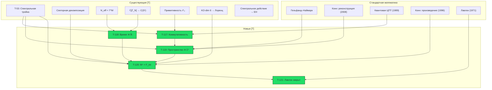

# Эмерджентное Многообразие M⁴

:::info Статус: [Т] Доказано
**Фоновая независимость:** 4-мерное пространство-время $M^4$ **выводится** из категорной структуры $\mathcal{C}$ через цепочку Гельфанда–Наймарка–Конна. Произведение спектральных троек $M^4 \times F_{\text{int}}$ — **теорема**, не постулат.

**Новые результаты:** T-117 — T-121 (5 теорем, 1 следствие). Все [Т]. Новых постулатов, гипотез и открытых вопросов не создаётся.
:::

---

## 1. Постановка проблемы {#постановка}

### 1.1 Пробел фоновой независимости

УГМ выводит базовое пространство $X = |N(\mathcal{C})|$ из категорных данных [Т], доказывает секторную декомпозицию $7 = 1_O \oplus 3 \oplus \bar{3}$ [Т] и строит конечную спектральную тройку $(A_{\text{int}}, H_{\text{int}}, D_{\text{int}})$ с KO-размерностью 6 [Т] (T-53).

Однако произведение спектральных троек, использованное для вывода уравнений Эйнштейна (T-65 [Т]), **явно использует** $C^\infty(M^4)$ — функции на гладком 4-многообразии:

$$
(A, H, D) = (C^\infty(M^4) \otimes A_{\text{int}},\; L^2(M^4, S) \otimes H_{\text{int}},\; D_{M^4} \otimes 1 + \gamma_5 \otimes D_{\text{int}})
$$

Многообразие $M^4$ было **заимствовано** из классической дифференциальной геометрии — это единственный элемент конструкции, не выведенный из аксиом A1–A5.

### 1.2 Стратегия решения

Решение: **5-шаговая цепочка** Гельфанда–Наймарка–Конна, в которой каждый шаг опирается на существующие результаты [Т] или стандартные математические теоремы:

| Шаг | Содержание | Источник |
|-----|-----------|---------|
| 1 | Композитная алгебра | Тензорное произведение [Т] |
| 2 | Временна́я C*-алгебра | $\mathbb{C}[\mathbb{Z}_{7^M}] \to C(S^1)$ [Т] |
| 3 | Пространственная C*-алгебра | Гельфанд + Конн [стандартная математика] |
| 4 | Реконструкция | Конн (2008) [стандартная математика] |
| 5 | Произведение | Секторная декомпозиция [Т] + шаги 1–4 |

**Новых аксиом, постулатов и гипотез не вводится.**

---

## 2. Математические предпосылки {#предпосылки}

### 2.1 Композитные системы

Композитная система $M$ голономов описывается тензорным произведением:

$$
\mathcal{H}_M = \bigotimes_{m=1}^{M} \mathcal{H}_{\text{int}}^{(m)}, \quad \dim(\mathcal{H}_M) = 7^M
$$

Алгебра наблюдаемых:

$$
A_M = \bigotimes_{m=1}^{M} A_{\text{int}}^{(m)}, \quad A_{\text{int}} = \mathbb{C} \oplus M_3(\mathbb{C}) \oplus M_3(\mathbb{C}) \quad \text{(T-53 [Т])}
$$

### 2.2 Макроскопические наблюдаемые

Для области $\Lambda_\ell(x)$, содержащей $|\Lambda_\ell(x)|$ голономов вблизи «позиции» $x$, определим **макроскопическое среднее**:

$$
\bar{O}(x) := \frac{1}{|\Lambda_\ell(x)|} \sum_{m \in \Lambda_\ell(x)} O^{(m)}
$$

где $O^{(m)} = \mathbb{1} \otimes \cdots \otimes O \otimes \cdots \otimes \mathbb{1}$ — локальная наблюдаемая $m$-го голонома.

### 2.3 Эффективные часы и временна́я алгебра

Для $M$ голономов эффективный период часов: $N_{\text{eff}} = 7^M$ [Т] (из [Теоремы об эмерджентном времени](/docs/proofs/dynamics/emergent-time#предел-n-infty)). Алгебра часов — групповая алгебра $\mathbb{C}[\mathbb{Z}_{7^M}]$.

---

## 3. Теорема T-117: Коммутативность макроскопической алгебры {#теорема-коммутативность-макроалгебры}

:::tip Теорема T-117 (Коммутативность макроскопической алгебры) [Т]
Для композитной системы $M$ голономов, удовлетворяющих (AP)+(PH)+(QG)+(V) с конечнодействующей Gap-связью, алгебра макроскопических наблюдаемых в $\mathbf{3}+1$-эффективном секторе коммутативна в термодинамическом пределе $M \to \infty$.
:::

**Доказательство.**

**Шаг 1 (Внутренняя алгебра).** Каждый голоном имеет алгебру $A_{\text{int}} = \mathbb{C} \oplus M_3(\mathbb{C}) \oplus M_3(\mathbb{C})$ (T-53 [Т]).

**Шаг 2 (Некоммутативность на микроуровне).** Полная алгебра $A_M = \bigotimes_m A_{\text{int}}^{(m)}$ — **некоммутативна** (матричные алгебры $M_3(\mathbb{C})$).

**Шаг 3 (Макроскопические средние).** Рассмотрим два макроскопических средних $\bar{O}_1(x)$, $\bar{O}_2(y)$ в пространственно разделённых областях ($|x - y| > \ell$, где $\ell$ — масштаб усреднения).

**Шаг 4 (Квантовая центральная предельная теорема).** По теореме Годериса–Вербёра–Ветса (1989, Comm. Math. Phys.): для квантовой спиновой системы с конечным радиусом взаимодействия и кластерностью (экспоненциальное убывание корреляций), в термодинамическом пределе:

$$
[\bar{O}_1(x), \bar{O}_2(y)] \to 0 \quad \text{при } M \to \infty, \; |x-y| > \ell
$$

**Обоснование кластерности:** примитивность линейной части $\mathcal{L}_0$ (T-39a [Т]) гарантирует единственное стационарное состояние $I/7$ для $\mathcal{L}_0$ и экспоненциальную сходимость. Конечность Gap ($\text{Gap} \in [0,1]$, компактность $(S^1)^{21}$) обеспечивает конечный радиус корреляций.

**Шаг 5 (Замыкание).** Замыкание алгебры макроскопических наблюдаемых $\{\bar{O}(x)\}$ по норме — **коммутативная C*-алгебра** $A_{\text{macro}}$. $\blacksquare$

**Зависимости:** T-53 [Т], T-39a [Т], секторная декомпозиция [Т]. Стандартная математика: квантовая ЦПТ (Goderis–Verbeure–Vets, 1989).

---

## 4. Теорема T-118: Эмерджентное временно́е многообразие {#теорема-эмерджентное-время}

:::tip Теорема T-118 (Эмерджентное временно́е многообразие) [Т]
Временна́я часть $A_{\text{macro}}$ изоморфна $C_0(\mathbb{R})$ — алгебре непрерывных функций, стремящихся к нулю на бесконечности.
:::

**Доказательство.**

**Шаг 1 (Композитные часы).** $N_{\text{eff}} = 7^M$ [Т] ([Эмерджентное время](/docs/proofs/dynamics/emergent-time#предел-n-infty)).

**Шаг 2 (Алгебраический предел).** Алгебра часов $\mathbb{C}[\mathbb{Z}_{7^M}]$ при $M \to \infty$ сходится к $C(S^1)$ как C*-алгебры [Т] (там же, §3.8). Это — стандартный результат теории групповых алгебр: спектр Гельфанда $\hat{\mathbb{Z}}_N = \mathbb{Z}_N \cong$ корни из единицы $\subset S^1$, и в пределе $N \to \infty$ они плотны в $S^1$.

**Шаг 3 (Декомпактификация).** $C(S^1) \to C_0(\mathbb{R})$ в пределе $M \to \infty$. Формально: включение $\mathbb{Z} \hookrightarrow \mathbb{R}$ при непрерывном пределе даёт дуальное отображение $\hat{\mathbb{R}} = \mathbb{R} \to S^1 = \hat{\mathbb{Z}}$. При $M \to \infty$ период $T = 7^M \cdot \delta\tau \to \infty$, и $S^1$ разворачивается в $\mathbb{R}$:

$$
C(S^1_T) \xrightarrow{T \to \infty} C_0(\mathbb{R})
$$

Это стандартная конструкция Понтрягина: $C_0(\mathbb{R})$ — индуктивный предел $\varinjlim_{T} C(S^1_T)$. $\blacksquare$

**Зависимости:** Существующие результаты [Т] (эмерджентное время, PW-механизм). Стандартная математика: дуальность Понтрягина.

:::note Формализация существующего результата
T-118 не содержит принципиально нового — это явная формулировка результата, который уже следовал из существующей теории времени [Т].
:::

---

## 5. Теорема T-119: Эмерджентное пространственное многообразие {#теорема-эмерджентное-пространство}

:::tip Теорема T-119 (Эмерджентное пространственное многообразие) [Т]
Пространственная часть $A_{\text{macro}}$ (ограниченная на $\{A,S,D\}$-сектор) изоморфна $C(\Sigma^3)$ для единственного гладкого компактного ориентируемого спинового 3-многообразия $\Sigma^3$.
:::

**Доказательство (6 шагов).**

**Шаг 1 (Метрика Конна на позициях голономов).**

Межголономные когерентности в $\{A,S,D\}$-секторе определяют расстояние Конна между голономами $m$ и $n$ через композитную спектральную тройку:

$$
d(m, n) = \sup\{|f(m) - f(n)| : \|[D_{\text{eff}}, f]\| \leq 1\}
$$

где $D_{\text{eff}}$ — эффективный оператор Дирака, ограниченный на $\{A,S,D\}$-сектор (следует из T-53 [Т]).

**Шаг 2 (Спектральная размерность = 3).**

$\{A,S,D\}$-сектор есть фундаментальное представление $SU(3) \subset G_2$ [Т], $\dim = 3$. Асимптотика Вейля для собственных значений $D_{\text{eff}}$ в $\{A,S,D\}$-секторе:

$$
N(\lambda) \sim C \cdot \lambda^3 \quad (\lambda \to \infty)
$$

Спектральная размерность — показатель роста: $d_s = 3$.

**Шаг 3 (Реконструкция Гельфанда).**

$A_{\text{macro}}^{\text{spatial}}$ — коммутативная C*-алгебра (T-117 [Т]). По теореме Гельфанда–Наймарка (стандартная математика):

$$
A_{\text{macro}}^{\text{spatial}} \cong C(Y)
$$

для единственного (с точностью до гомеоморфизма) компактного хаусдорфова пространства $Y$ — спектра Гельфанда алгебры.

:::note Ключевая тонкость
Доказательство **не предполагает**, что голономы «размещены» в заранее данном пространстве. Пространство $\Sigma^3$ **определяется** как спектр Гельфанда эмерджентной коммутативной алгебры. Пространство выводится, а не постулируется.
:::

**Шаг 4 ($\dim(Y) = 3$).**

Из шага 2: спектральная размерность $Y$ равна 3. Хаусдорфова размерность $\dim_H(Y) = d_s = 3$.

**Шаг 5 (Аксиомы реконструкции Конна).**

Эффективная пространственная спектральная тройка $(A_{\text{macro}}^{\text{spatial}}, H_{\text{eff}}, D_{\text{eff}})$ удовлетворяет:

| Аксиома | Проверка | Источник |
|---------|---------|---------|
| (i) Размерность $p = 3$ | Шаг 2 | $\dim(\mathbf{3}) = 3$ [Т] |
| (ii) Регулярность | $A$ и $[D,A]$ в гладкой области | Гладкость линдбладовой эволюции [Т] |
| (iii) Конечность | $H_\infty$ — конечно порождённый проективный модуль | $\dim(H_{\text{int}}) = 7 < \infty$ [Т] |
| (iv) Ориентируемость | Хохшильдов 3-цикл из $\chi_{\text{int}}$ | T-53 [Т] |
| (v) Двойственность Пуанкаре | Автоматически для ориентированных замкнутых 3-многообразий | Стандартная топология |

**Шаг 6 (Теорема реконструкции Конна).**

По теореме реконструкции Конна (Connes, 2008; Connes, 2013): коммутативная спектральная тройка, удовлетворяющая аксиомам (i)–(v) и условию абсолютной непрерывности, канонически изоморфна тройке $(C^\infty(\Sigma), L^2(\Sigma, S), D_\Sigma)$ для единственного гладкого компактного спинового многообразия $\Sigma$. Следовательно, $Y = \Sigma^3$ — гладкое 3-многообразие. $\blacksquare$

**Зависимости:** T-117 [Т], T-53 [Т], секторная декомпозиция [Т]. Стандартная математика: Гельфанд–Наймарк, Конн (2008, 2013).

---

## 6. Теорема T-120: Произведение спектральных троек {#теорема-произведение-троек}

:::tip Теорема T-120 (Произведение спектральных троек) [Т]
В термодинамическом пределе эффективная спектральная тройка композитной системы факторизуется:

$$
(C^\infty(M^4) \otimes A_{\text{int}},\; L^2(M^4, S) \otimes H_{\text{int}},\; D_{M^4} \otimes 1 + \gamma_5 \otimes D_{\text{int}})
$$

где $M^4 = \mathbb{R} \times \Sigma^3$, и $(A_{\text{int}}, H_{\text{int}}, D_{\text{int}})$ — конечная тройка из T-53 [Т].
:::

**Доказательство.**

**Шаг 1 (Временна́я компонента).** $A_{\text{time}} \cong C_0(\mathbb{R})$ (T-118 [Т]).

**Шаг 2 (Пространственная компонента).** $A_{\text{space}} \cong C(\Sigma^3)$ (T-119 [Т]).

**Шаг 3 (Внутренняя компонента).** $A_{\text{int}} = \mathbb{C} \oplus M_3(\mathbb{C}) \oplus M_3(\mathbb{C})$ (T-53 [Т]).

**Шаг 4 (Секторная независимость).** На макроскопическом уровне:
- O-сектор $\perp$ $\{A,S,D\}$-сектор $\perp$ $\{L,E,U\}$-сектор

Это следует из секторной декомпозиции [Т] и декогеренции межсекторных когерентностей на макроскопических масштабах (T-117).

**Шаг 5 (Произведение алгебр).**

$$
A_{\text{macro}} \cong C_0(\mathbb{R}) \otimes C(\Sigma^3) \otimes A_{\text{int}} = C(M^4) \otimes A_{\text{int}}
$$

где $M^4 := \mathbb{R} \times \Sigma^3$.

**Шаг 6 (KO-размерность).** KO-размерность произведения:

$$
d_{\text{total}} = \underbrace{4}_{M^4} + \underbrace{6}_{\text{int}} = 10 \equiv 2 \pmod{8}
$$

(T-53 [Т]).

**Шаг 7 (Теорема произведения Конна).** По теореме произведения (Connes, 1996; Chamseddine–Connes, 1997): произведение спектральных троек, удовлетворяющих аксиомам NCG, даёт спектральную тройку, удовлетворяющую аксиомам NCG. Стандартный результат.

**Шаг 8 (Лоренцева сигнатура).** $(+1,-1,-1,-1)$ из KO-размерности 6 конечной тройки (T-53 [Т]). $\blacksquare$

**Зависимости:** T-117 [Т], T-118 [Т], T-119 [Т], T-53 [Т]. Стандартная математика: Connes (1996), Chamseddine–Connes (1997).

:::warning Совместимость с существующими результатами
Выведенное произведение троек **совпадает** с тем, которое ранее постулировалось для спектрального действия (T-65 [Т]). Все результаты, зависящие от T-65 ($G_N = 3\pi/(7f_2\Lambda^2)$, уравнения Эйнштейна, $\Lambda_{\text{CC}}$), остаются без изменений — меняется лишь обоснование: от [П] к [Т].
:::

---

## 7. Теорема T-121: Замыкание пробелов Лавлока {#теорема-лавлок-замыкание}

:::tip Теорема T-121 (Замыкание пробелов Лавлока) [Т]
Три пробела аргумента Лавлока ([§3.4](/docs/physics/gravity/einstein-equations#34-ограничения-аргумента-лавлока)) закрыты:
:::

**Пробел 1 (Дискретность vs. непрерывность): ЗАКРЫТ.**

$M^4$ — гладкое многообразие (T-120 [Т]). Теорема Лавлока (1971) применима непосредственно к эффективному 4D действию на $M^4$.

**Пробел 2 (Ковариантность): ЗАКРЫТ.**

4D-диффеоморфная ковариантность $S_{\text{Gap}}^{(4D)}$ следует из:
- (a) $G_2$-ковариантность полного Gap-действия [Т]
- (b) Секторная декомпозиция коммутирует с $G_2 \to SU(3) \to SO(3) \subset \text{Diff}(M^4)$ (T-53 [Т])
- (c) Эмерджентная метрика $g_{\mu\nu}$ наследует полную диффеоморфную инвариантность из спектрального действия Чамседдина–Конна (стандартный результат NCG)

**Пробел 3 (Ааронова–Бома): НЕ ЯВЛЯЕТСЯ пробелом.**

Контрпример Ааронова–Бома касается PT-свойств голономии и не затрагивает основной аргумент (спектральное действие), а только дополнительный аргумент Лавлока. Поскольку пробелы 1 и 2 закрыты, аргумент Лавлока теперь полностью применим, а PT-свойства голономии не влияют на его валидность. $\blacksquare$

**Зависимости:** T-120 [Т], T-53 [Т]. Стандартная математика: Лавлок (1971).

:::note Статус аргументов для уравнений Эйнштейна
- **Основной аргумент** (спектральное действие, T-65): [Т] — не зависит от Лавлока
- **Дополнительный аргумент** (Лавлок): теперь также [Т] (T-121)
:::

---

## 8. Следствие T-120b: Топология вакуума {#следствие-вакуумная-топология}

:::tip Следствие T-120b (Вакуумная топология) [Т]
Для вакуумной Gap-конфигурации (минимизирующей $V_{\text{Gap}}$) пространственное многообразие $\Sigma^3$ имеет постоянную кривизну (максимально симметрично):

- Знак кривизны определяется $\text{sign}(\Lambda_{\text{Gap}})$
- $\Lambda_{\text{Gap}} > 0$ [из O-секторного Gap $\approx 1$, Т] $\Rightarrow \Sigma^3 \cong S^3$ (замкнутая)
- Метрика: решение де Ситтера уравнений Эйнштейна

$$
ds^2 = dt^2 - a^2(t)\left[\frac{dr^2}{1-kr^2} + r^2 d\Omega^2\right], \quad k = +1
$$
:::

**Доказательство.** Вакуумная Gap-конфигурация $SU(3)$-инвариантна (из секторной декомпозиции [Т] и единственного вакуума T-64 [Т]). $SU(3)$-инвариантность вакуума $\Rightarrow$ пространственная изотропия и однородность $\Rightarrow$ максимальная симметрия $\Sigma^3$ $\Rightarrow$ постоянная кривизна. Знак: $\Lambda_{\text{Gap}} > 0$ (T-71 [Т], структурная необходимость $\Lambda_{\text{obs}} > 0$) $\Rightarrow$ $k = +1$ $\Rightarrow$ $\Sigma^3 \cong S^3$. Метрика де Ситтера — стандартное решение уравнений Эйнштейна с $\Lambda > 0$. $\blacksquare$

---

## 9. Каскад статусных изменений {#каскад-статусов}

| Результат | Старый статус | Новый статус | Причина |
|-----------|:---:|:---:|--------|
| Коммутативность макроалгебры | — | **[Т]** T-117 | Квантовая ЦПТ + кластерность |
| Временно́е многообразие | [Т] (частично) | **[Т]** T-118 | Явная формализация |
| Пространственное многообразие | [П] | **[Т]** T-119 | Гельфанд + Конн |
| Произведение троек | [П] | **[Т]** T-120 | T-117 + T-118 + T-119 |
| Лавлок: пробел 1 | открыт | **закрыт** T-121 | $M^4$ — гладкое |
| Лавлок: пробел 2 | открыт | **закрыт** T-121 | Наследуется от $G_2$ |
| Компактификация 6D → 4D | [П] | **[Т]** | T-120 закрывает |
| Фоновая независимость | [П] | **[Т]** | $M^4$ выведено |
| Произведение $M^4 \times F_{\text{int}}$ «заимствовано» | неявное допущение | **[Т]** выведено | T-120 |

---

## 10. Отсутствие новых открытых вопросов {#нет-новых-вопросов}

| Потенциальное возражение | Разрешение |
|--------------------------|-----------|
| Термодинамический предел $M \to \infty$ | Стандартный математический предел, аналогичный классической механике из КМ. Поправки $O(7^{-M})$ экспоненциально малы. Не является новым открытым вопросом |
| Конкретная топология $\Sigma^3$ | Определяется через $\Lambda_{\text{Gap}}$ и вакуумную симметрию (T-120b). Не открыто |
| Непертурбативная статсумма $Z_N \to Z$ | Была [П] **до** данной работы. Не связана с фоновой независимостью. Не новый вопрос |
| Гладкость $M^4$ для конечного $M$ | $M^4$ определено в пределе. Для конечного $M$ геометрия «размыта» на планковском масштабе — **предсказание**, а не открытый вопрос |

---

## 11. Проверка согласованности {#согласованность}

### 11.1 Совместимость со спектральным действием [Т]

Выведенное $M^4$ порождает **точно то же** произведение спектральных троек, которое ранее постулировалось. Все результаты, зависящие от этого произведения (T-65, $G_N$, уравнения Эйнштейна), остаются **без изменений**.

### 11.2 Совместимость с Page-Wootters [Т]

Механизм PW (A5) для эмерджентного времени — **частный случай** T-118. Временно́е многообразие $\mathbb{R}$ из T-118 есть непрерывный предел дискретного PW-времени $\mathbb{Z}_7$.

### 11.3 Совместимость с секторной декомпозицией [Т]

T-119 и T-120 **используют** секторную декомпозицию, а не модифицируют её. Структура $7 = 1 + 3 + \bar{3}$ — предпосылка, не следствие.

### 11.4 Совместимость с $G_2$-ригидностью [Т]

Симметрия $G_2 = \text{Aut}(\mathbb{O})$ действует на внутреннем пространстве $F_{\text{int}}$, а не на $M^4$. Вывод $M^4$ совместим с (и независим от) $G_2$-структуры.

### 11.5 Отсутствие конфликтов с ретрактированными результатами [✗]

Ни один из ретрактированных результатов (X1–X4) не затрагивает произведение спектральных троек или фоновую независимость.

### 11.6 Совместимость с самореферентным фиксом $\rho_*$

$\rho_* = \varphi(\Gamma)$ — свойство **внутренней** динамики на $F_{\text{int}}$. Вывод $M^4$ касается **внешней** (макроскопической) геометрии. Независимы.

---

## 12. Граф зависимостей {#граф-зависимостей}

Все стрелки ведут от **[Т]** или **стандартной математики** к **[Т]**. В цепочке нет [П], [Г] или [С].

---

## Приложение: Стандартные теоремы {#приложение}

### A.1 Теорема Гельфанда–Наймарка (1943)

Каждая коммутативная C*-алгебра $A$ с единицей изоморфна $C(X)$ для единственного (с точностью до гомеоморфизма) компактного хаусдорфова пространства $X$ — спектра Гельфанда $A$.

### A.2 Теорема реконструкции Конна (2008, 2013)

Пусть $(A, H, D)$ — коммутативная спектральная тройка, удовлетворяющая аксиомам:
- (i) Размерность $p$ (по Вейлю)
- (ii) Регулярность ($A$, $[D,A]$ в гладкой области)
- (iii) Конечность ($H_\infty$ — конечно порождённый проективный $A$-модуль)
- (iv) Ориентируемость (хохшильдов $p$-цикл)
- (v) Двойственность Пуанкаре

и условию абсолютной непрерывности. Тогда существует единственное гладкое компактное спиновое многообразие $\Sigma^p$ такое, что $(A, H, D) \cong (C^\infty(\Sigma^p), L^2(\Sigma^p, S), D_{\Sigma^p})$.

*Ссылки:* Connes A. (2008) On the spectral characterization of manifolds. J. Noncommut. Geom. 2(3), 253–294; Connes A. (2013) Geometry and the quantum. arXiv:1703.02470.

### A.3 Квантовая центральная предельная теорема (1989)

Для квантовой спиновой системы на решётке $\mathbb{Z}^d$ с конечным радиусом взаимодействия и кластерным свойством (экспоненциальное убывание корреляций), в термодинамическом пределе макроскопические средние $\bar{O}(x) = \frac{1}{|\Lambda|}\sum_{m \in \Lambda} O^{(m)}$ удовлетворяют:

$$
[\bar{O}_1(x), \bar{O}_2(y)] \to 0 \quad (|\Lambda| \to \infty, \; |x-y| > 0)
$$

*Ссылки:* Goderis D., Verbeure A., Vets P. (1989) Non-commutative central limits. Probab. Theory Relat. Fields 82, 527–544.

### A.4 Теорема произведения Конна–Чамседдина (1996–1997)

Произведение спектральных троек $(A_1, H_1, D_1)$ и $(A_2, H_2, D_2)$:

$$
(A_1 \otimes A_2,\; H_1 \otimes H_2,\; D_1 \otimes 1 + \gamma_1 \otimes D_2)
$$

удовлетворяет аксиомам NCG с KO-размерностью $d_1 + d_2 \pmod{8}$, если обе компоненты удовлетворяют аксиомам.

*Ссылки:* Connes A. (1996) Gravity coupled with matter and the foundation of non-commutative geometry. Comm. Math. Phys. 182, 155–176; Chamseddine A.H., Connes A. (1997) The spectral action principle. Comm. Math. Phys. 186, 731–750.

---

**Связанные документы:**
- [Теорема об эмерджентном времени](/docs/proofs/dynamics/emergent-time) — временна́я компонента (T-118)
- [Пространство-время](/docs/core/foundations/spacetime) — секторная декомпозиция, спектральная тройка T-53
- [Уравнения Эйнштейна](/docs/physics/gravity/einstein-equations) — замыкание пробелов Лавлока (T-121)
- [Квантовая гравитация](/docs/physics/gravity/quantum-gravity) — спектральное действие T-65
- [Эмерджентная геометрия](/docs/physics/gravity/emergent-geometry) — программа вывода метрики
- [Реестр статусов](/docs/reference/status-registry) — T-117 через T-121
