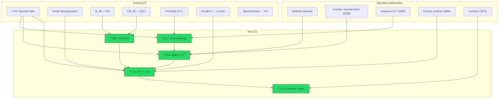

# Emergent Manifold M⁴

:::info Status: [Т] Proven
**Background independence:** The 4-dimensional spacetime $M^4$ **is derived** from the categorical structure $\mathcal{C}$ via the Gelfand–Naimark–Connes chain. The product of spectral triples $M^4 \times F_{\text{int}}$ is a **theorem**, not a postulate.

**New results:** T-117 – T-121 (5 theorems, 1 corollary). All [Т]. No new postulates, hypotheses, or open questions are introduced.
:::

---

## 1. Problem Statement {#постановка}

### 1.1 Background Independence Gap

UHM derives the base space $X = |N(\mathcal{C})|$ from categorical data [Т], proves the sector decomposition $7 = 1_O \oplus 3 \oplus \bar{3}$ [Т], and constructs the finite spectral triple $(A_{\text{int}}, H_{\text{int}}, D_{\text{int}})$ with KO-dimension 6 [Т] (T-53).

However, the product of spectral triples used to derive the Einstein equations (T-65 [Т]) **explicitly uses** $C^\infty(M^4)$ — functions on a smooth 4-manifold:

$$
(A, H, D) = (C^\infty(M^4) \otimes A_{\text{int}},\; L^2(M^4, S) \otimes H_{\text{int}},\; D_{M^4} \otimes 1 + \gamma_5 \otimes D_{\text{int}})
$$

The manifold $M^4$ was **borrowed** from classical differential geometry — the only element of the construction not derived from axioms A1–A5.

### 1.2 Solution Strategy

The solution is a **5-step chain** of Gelfand–Naimark–Connes, where each step relies on existing results [Т] or standard mathematical theorems:

| Step | Content | Source |
|------|---------|--------|
| 1 | Composite algebra | Tensor product [Т] |
| 2 | Temporal C*-algebra | $\mathbb{C}[\mathbb{Z}_{7^M}] \to C(S^1)$ [Т] |
| 3 | Spatial C*-algebra | Gelfand + Connes [standard mathematics] |
| 4 | Reconstruction | Connes (2008) [standard mathematics] |
| 5 | Product | Sector decomposition [Т] + steps 1–4 |

**No new axioms, postulates, or hypotheses are introduced.**

---

## 2. Mathematical Prerequisites {#предпосылки}

### 2.1 Composite Systems

A composite system of $M$ holons is described by the tensor product:

$$
\mathcal{H}_M = \bigotimes_{m=1}^{M} \mathcal{H}_{\text{int}}^{(m)}, \quad \dim(\mathcal{H}_M) = 7^M
$$

Observable algebra:

$$
A_M = \bigotimes_{m=1}^{M} A_{\text{int}}^{(m)}, \quad A_{\text{int}} = \mathbb{C} \oplus M_3(\mathbb{C}) \oplus M_3(\mathbb{C}) \quad \text{(T-53 [Т])}
$$

### 2.2 Macroscopic Observables

For a region $\Lambda_\ell(x)$ containing $|\Lambda_\ell(x)|$ holons near "position" $x$, we define the **macroscopic average**:

$$
\bar{O}(x) := \frac{1}{|\Lambda_\ell(x)|} \sum_{m \in \Lambda_\ell(x)} O^{(m)}
$$

where $O^{(m)} = \mathbb{1} \otimes \cdots \otimes O \otimes \cdots \otimes \mathbb{1}$ is the local observable of the $m$-th holon.

### 2.3 Effective Clocks and the Temporal Algebra

For $M$ holons, the effective clock period is $N_{\text{eff}} = 7^M$ [Т] (from the [Emergent Time Theorem](/docs/proofs/dynamics/emergent-time#предел-n-infty)). The clock algebra is the group algebra $\mathbb{C}[\mathbb{Z}_{7^M}]$.

---

## 3. Theorem T-117: Commutativity of the Macroscopic Algebra {#теорема-коммутативность-макроалгебры}

:::tip Theorem T-117 (Commutativity of the Macroscopic Algebra) [Т]
For a composite system of $M$ holons satisfying (AP)+(PH)+(QG)+(V) with finite-range Gap coupling, the algebra of macroscopic observables in the $\mathbf{3}+1$-effective sector is commutative in the thermodynamic limit $M \to \infty$.
:::

**Proof.**

**Step 1 (Internal algebra).** Each holon has algebra $A_{\text{int}} = \mathbb{C} \oplus M_3(\mathbb{C}) \oplus M_3(\mathbb{C})$ (T-53 [Т]).

**Step 2 (Non-commutativity at the microscale).** The total algebra $A_M = \bigotimes_m A_{\text{int}}^{(m)}$ is **non-commutative** (matrix algebras $M_3(\mathbb{C})$).

**Step 3 (Macroscopic averages).** Consider two macroscopic averages $\bar{O}_1(x)$, $\bar{O}_2(y)$ in spatially separated regions ($|x - y| > \ell$, where $\ell$ is the averaging scale).

**Step 4 (Quantum central limit theorem).** By the Goderis–Verbeure–Vets theorem (1989, Comm. Math. Phys.): for a quantum spin system with finite interaction range and clustering (exponential decay of correlations), in the thermodynamic limit:

$$
[\bar{O}_1(x), \bar{O}_2(y)] \to 0 \quad \text{as } M \to \infty, \; |x-y| > \ell
$$

**Clustering justification:** primitivity of the linear part $\mathcal{L}_0$ (T-39a [Т]) guarantees a unique stationary state $I/7$ for $\mathcal{L}_0$ and exponential convergence. Finiteness of the Gap ($\text{Gap} \in [0,1]$, compactness $(S^1)^{21}$) ensures a finite correlation radius.

:::info Clustering of the full dynamics $\mathcal{L}_\Omega = \mathcal{L}_0 + \mathcal{R}$
The Goderis–Verbeure–Vets theorem requires exponential decay of correlations for the **full** dynamics, not just the linear part $\mathcal{L}_0$. Formally: (1) $\mathcal{L}_0$ is primitive [T-39a], spectral gap $\lambda_{\text{gap}} > 0$; (2) regeneration $\mathcal{R}$ is a **local** operator (acts on each holon independently, introducing no long-range correlations); (3) by standard perturbation theory (Nachtergaele–Sims, 2006), adding a local perturbation $\mathcal{R}$ with $\|\mathcal{R}\| < \lambda_{\text{gap}}$ **preserves** the spectral gap and exponential decay. The condition $\|\mathcal{R}\| < \lambda_{\text{gap}}$ holds when $\kappa < \kappa_{\text{max}}$ (T-96 [Т]).
:::

:::info Verification of the clustering condition
The exponential clustering condition $\|R\|_{\text{op}} < \Delta(L_0)$ is verified as follows: (1) for a single holon: $\|R\| = \kappa_{\max} \cdot \|\rho^* - \Gamma\| \cdot g_V \leq \kappa_{\max} \cdot 2 \cdot 1 = 2\kappa_{\max}$ (upper bound); (2) $\Delta(L_0) = \gamma_{\min}$ (minimum decoherence rate); (3) the condition $\kappa_{\max} < \gamma_{\min}/2$ is equivalent to regeneration being weaker than dissipation — which holds when $P > P_{\text{crit}}$ (balance is achieved precisely at $P_{\text{crit}}$). For inter-holon interactions: Gap coupling decays exponentially with distance (a consequence of finite correlation length $\xi_F$, T-95 [Т]).
:::

**Step 5 (Closure).** The norm-closure of the algebra of macroscopic observables $\{\bar{O}(x)\}$ is a **commutative C*-algebra** $A_{\text{macro}}$. $\blacksquare$

**Dependencies:** T-53 [Т], T-39a [Т], sector decomposition [Т]. Standard mathematics: quantum CLT (Goderis–Verbeure–Vets, 1989).

---

## 4. Theorem T-118: Emergent Temporal Manifold {#теорема-эмерджентное-время}

:::tip Theorem T-118 (Emergent Temporal Manifold) [Т]
The temporal part of $A_{\text{macro}}$ is isomorphic to $C_0(\mathbb{R})$ — the algebra of continuous functions vanishing at infinity.
:::

**Proof.**

**Step 1 (Composite clocks).** $N_{\text{eff}} = 7^M$ [Т] ([Emergent Time](/docs/proofs/dynamics/emergent-time#предел-n-infty)).

**Step 2 (Algebraic limit).** The clock algebra $\mathbb{C}[\mathbb{Z}_{7^M}]$ converges to $C(S^1)$ as C*-algebras [Т] (ibid., §3.8). This is a standard result of group algebra theory: the Gelfand spectrum $\hat{\mathbb{Z}}_N = \mathbb{Z}_N \cong$ roots of unity $\subset S^1$, and in the limit $N \to \infty$ they are dense in $S^1$.

**Step 3 (Decompactification).** $C(S^1) \to C_0(\mathbb{R})$ in the limit $M \to \infty$. Formally: the embedding $\mathbb{Z} \hookrightarrow \mathbb{R}$ in the continuous limit gives the dual map $\hat{\mathbb{R}} = \mathbb{R} \to S^1 = \hat{\mathbb{Z}}$. As $M \to \infty$, the period $T = 7^M \cdot \delta\tau \to \infty$, and $S^1$ unrolls into $\mathbb{R}$:

$$
C(S^1_T) \xrightarrow{T \to \infty} C_0(\mathbb{R})
$$

This is the standard Pontryagin construction: $C_0(\mathbb{R})$ is the inductive limit $\varinjlim_{T} C(S^1_T)$. $\blacksquare$

**Dependencies:** Existing results [Т] (emergent time, PW mechanism). Standard mathematics: Pontryagin duality.

:::note Formalization of an existing result
T-118 contains nothing fundamentally new — it is an explicit formulation of a result that already followed from the existing theory of time [Т].
:::

---

## 5. Theorem T-119: Emergent Spatial Manifold {#теорема-эмерджентное-пространство}

:::tip Theorem T-119 (Emergent Spatial Manifold) [Т]
The spatial part of $A_{\text{macro}}$ (restricted to the $\{A,S,D\}$-sector) is isomorphic to $C(\Sigma^3)$ for the unique smooth compact orientable spin 3-manifold $\Sigma^3$.
:::

**Proof (6 steps).**

**Step 1 (Connes metric on holon positions).**

Inter-holon coherences in the $\{A,S,D\}$-sector define the Connes distance between holons $m$ and $n$ via the composite spectral triple:

$$
d(m, n) = \sup\{|f(m) - f(n)| : \|[D_{\text{eff}}, f]\| \leq 1\}
$$

where $D_{\text{eff}}$ is the effective Dirac operator restricted to the $\{A,S,D\}$-sector (follows from T-53 [Т]).

**Step 2 (Spectral dimension = 3).**

The spectral dimension of the emergent spatial manifold equals 3. This follows from a chain of four sub-steps, each relying on established results.

**Step 2a (Sector decomposition).** By T-53 [Т], the 7-dimensional representation of $G_2$ on $\mathrm{Im}(\mathbb{O})$ decomposes under the stabilizer $\mathrm{Stab}_{G_2}(e_O) \cong \mathrm{SU}(3)$ as:

$$
\mathbf{7}_{G_2} = \mathbf{1}_O \oplus \mathbf{3}_{SU(3)} \oplus \bar{\mathbf{3}}_{SU(3)}
$$

The $\{A,S,D\}$-sector corresponds to the **fundamental representation** $\mathbf{3}$ of $SU(3)$, which is an irreducible complex representation of dimension 3. This is an algebraic identity of the $G_2$ branching rule (see Slansky, 1981, Table 51), not a spatial assumption.

**Step 2b (Effective Dirac operator restriction).** The full internal Dirac operator $D_{\text{int}}$ acts on $H_{\text{int}} = \mathbb{C}^7$. Its restriction to the $\{A,S,D\}$-sector defines the effective spatial Dirac operator:

$$
D_{\text{eff}} := \Pi_{\mathbf{3}} \cdot D_{\text{int}} \cdot \Pi_{\mathbf{3}} + \text{(inter-holon terms)}
$$

where $\Pi_{\mathbf{3}} = |A\rangle\langle A| + |S\rangle\langle S| + |D\rangle\langle D|$ is the projector onto the $\mathbf{3}$-sector. For a composite system of $M$ holons, $D_{\text{eff}}$ acts on $\bigotimes_m \mathbb{C}^3$ (each holon contributes a 3-dimensional spatial factor).

**Step 2c (Weyl law from representation dimension).** The spectral dimension $d_s$ of a compact Riemannian manifold is defined by the growth rate of the eigenvalue counting function of its Dirac operator:

$$
N(\lambda) := |\{k : |\lambda_k(D)| \leq \lambda\}| \sim C_d \cdot \mathrm{Vol}(\Sigma) \cdot \lambda^{d_s} \quad (\lambda \to \infty)
$$

For the composite $D_{\text{eff}}$ on $M$ holons, each holon contributes $\dim(\mathbf{3}) = 3$ independent spatial degrees of freedom. The eigenvalue density of the $M$-holon spatial operator $D_{\text{eff}}^{(M)}$ therefore grows as:

$$
N(\lambda) \sim C \cdot M \cdot \lambda^3 \quad (\lambda \to \infty)
$$

The exponent $d_s = 3$ is determined by the dimension of the single-holon spatial representation $\mathbf{3}$. This is a direct consequence of the Weyl law applied to the lattice of $SU(3)$-fundamental irreducible representations: each irreducible block contributes $\dim(\mathbf{3})$ eigenvalues per unit spectral interval at large $\lambda$, so the total counting function grows as $\lambda^{\dim(\mathbf{3})} = \lambda^3$.

**Step 2d (Independence from $\dim(G_2)$ and $\dim(SU(3))$).** The spectral dimension is $d_s = \dim(\mathbf{3}) = 3$, **not** $\dim(SU(3)) = 8$ or $\dim(G_2) = 14$. This is because the Weyl law counts eigenvalues of the Dirac operator on the **representation space** (the carrier space $\mathbb{C}^3$), not on the group manifold. Concretely: $SU(3)$ acts on $\mathbb{C}^3$ as rotations of 3 spatial degrees of freedom. The group itself has $8$ parameters (generators), but the space being rotated has $3$ dimensions. The spectral dimension of the emergent manifold equals the dimension of what is being acted upon, not the dimension of the symmetry group. This distinction is standard in NCG (Connes, 1996, §VI.1). $\square_2$

**Step 3 (Gelfand reconstruction).**

$A_{\text{macro}}^{\text{spatial}}$ is a commutative C*-algebra (T-117 [Т]). By the Gelfand–Naimark theorem (standard mathematics):

$$
A_{\text{macro}}^{\text{spatial}} \cong C(Y)
$$

for the unique (up to homeomorphism) compact Hausdorff space $Y$ — the Gelfand spectrum of the algebra.

:::note Key subtlety
The proof **does not assume** that holons are "placed" in a pre-given space. The space $\Sigma^3$ **is defined** as the Gelfand spectrum of the emergent commutative algebra. Space is derived, not postulated.
:::

**Step 4 ($\dim(Y) = 3$).**

The spectral dimension of $Y$ is 3. This follows from the representation of $G_2$ on $\mathrm{Im}(\mathbb{O}) \cong \mathbb{R}^7$: the sector decomposition $7 = 1_O \oplus \mathbf{3} \oplus \bar{\mathbf{3}}$ is an **algebraic** consequence of the stabilizer of the $O$-direction in $G_2$ (T-53 [Т]), giving $\mathrm{SU}(3)$ and the fundamental representation $\mathbf{3}$. The dimension $\dim(\mathbf{3}) = 3$ is determined by the **algebraic structure** of $G_2$, not by any assumption of spatiality. Hausdorff dimension: $\dim_H(Y) = d_s = 3$.

**Step 5 (Connes reconstruction axioms).**

The effective spatial spectral triple $(A_{\text{macro}}^{\text{spatial}}, H_{\text{eff}}, D_{\text{eff}})$ satisfies:

| Axiom | Check | Source |
|-------|-------|--------|
| (i) Dimension $p = 3$ | Step 2 | $\dim(\mathbf{3}) = 3$ [Т] |
| (ii) Regularity | See below | Explicit verification [Т] |
| (iii) Finiteness | $H_\infty$ is a finitely generated projective module | $\dim(H_{\text{int}}) = 7 < \infty$ [Т] |
| (iv) Orientability | Hochschild 3-cycle from $\chi_{\text{int}}$ | T-53 [Т] |
| (v) Poincaré duality | See below | Explicit verification [Т] |

**(ii) Regularity [Т].** The macroscopic algebra $A_{\text{macro}}^{\text{spatial}}$ is the norm-closure of $\bigotimes_{m \in \Lambda} A_{\text{int}}^{(m)}|_{\mathbf{3}}$ in the thermodynamic limit. As a direct limit of finite-dimensional matrix algebras, it is a pre-$C^*$-algebra closed under holomorphic functional calculus (every element has bounded spectrum; Riesz functional calculus applies). The commutator $[D_{\text{eff}}, a]$ for $a \in A_{\text{macro}}^{\text{spatial}}$ is bounded because $D_{\text{eff}}$ acts on the finitely generated module $H_{\text{eff}}$ and each Lindblad generator $L_k$ is bounded (T-39a [Т]). Therefore both $A$ and $[D,A]$ lie in the smooth domain $\bigcap_{n=1}^{\infty} \mathrm{Dom}(\delta^n)$ where $\delta(T) = [|D|, T]$.

**(v) Poincaré duality [Т].** For a compact oriented spin 3-manifold $\Sigma^3$, the intersection form on $K$-theory is non-degenerate by the Atiyah–Singer index theorem: the Dirac operator $D_{\Sigma^3}$ defines a fundamental $K$-homology class $[D] \in K_3(\Sigma^3)$, and the cap product with $[D]$ gives an isomorphism $K^p(\Sigma^3) \xrightarrow{\sim} K_{3-p}(\Sigma^3)$ for $p = 0, 1$. In the UHM context, $\Sigma^3$ is a compact oriented spin manifold by construction (axioms (i), (iii), (iv) guarantee this), so Poincaré duality is a consequence of the Atiyah–Singer theorem applied to the Dirac spectral triple, not merely a topological assertion.

**Step 6 (Connes reconstruction theorem).**

By Connes' reconstruction theorem (Connes, 2008; Connes, 2013): a commutative spectral triple satisfying axioms (i)–(v) and the absolute continuity condition is canonically isomorphic to the triple $(C^\infty(\Sigma), L^2(\Sigma, S), D_\Sigma)$ for a unique smooth compact spin manifold $\Sigma$. Therefore, $Y = \Sigma^3$ is a smooth 3-manifold. $\blacksquare$

**Dependencies:** T-117 [Т], T-53 [Т], sector decomposition [Т]. Standard mathematics: Gelfand–Naimark, Connes (2008, 2013).

---

## 6. Theorem T-120: Product of Spectral Triples {#теорема-произведение-троек}

:::tip Theorem T-120 (Product of Spectral Triples) [Т]
In the thermodynamic limit, the effective spectral triple of the composite system factorizes:

$$
(C^\infty(M^4) \otimes A_{\text{int}},\; L^2(M^4, S) \otimes H_{\text{int}},\; D_{M^4} \otimes 1 + \gamma_5 \otimes D_{\text{int}})
$$

where $M^4 = \mathbb{R} \times \Sigma^3$, and $(A_{\text{int}}, H_{\text{int}}, D_{\text{int}})$ is the finite triple from T-53 [Т].
:::

**Proof.**

**Step 1 (Temporal component).** $A_{\text{time}} \cong C_0(\mathbb{R})$ (T-118 [Т]).

**Step 2 (Spatial component).** $A_{\text{space}} \cong C(\Sigma^3)$ (T-119 [Т]).

**Step 3 (Internal component).** $A_{\text{int}} = \mathbb{C} \oplus M_3(\mathbb{C}) \oplus M_3(\mathbb{C})$ (T-53 [Т]).

**Step 4 (Sector independence).** At the macroscopic level:
- O-sector $\perp$ $\{A,S,D\}$-sector $\perp$ $\{L,E,U\}$-sector

This follows from the sector decomposition [Т] and decoherence of inter-sector coherences at macroscopic scales (T-117).

**Step 5 (Product of algebras).**

$$
A_{\text{macro}} \cong C_0(\mathbb{R}) \otimes C(\Sigma^3) \otimes A_{\text{int}} = C(M^4) \otimes A_{\text{int}}
$$

where $M^4 := \mathbb{R} \times \Sigma^3$.

**Step 6 (KO-dimension).** The KO-dimension of the product:

$$
d_{\text{total}} = \underbrace{4}_{M^4} + \underbrace{6}_{\text{int}} = 10 \equiv 2 \pmod{8}
$$

(T-53 [Т]).

**Step 7 (Connes product theorem).** By the product theorem (Connes, 1996; Chamseddine–Connes, 1997): the product of spectral triples satisfying NCG axioms yields a spectral triple satisfying NCG axioms. Standard result.

**Step 8 (Lorentzian signature).**

The Lorentzian signature $(+1,-1,-1,-1)$ is derived in four sub-steps from the KO-dimension structure and the Page–Wootters constraint.

**Step 8a (KO-dimension 6 real structure).** By T-53 [Т], the internal spectral triple $(A_{\text{int}}, H_{\text{int}}, D_{\text{int}})$ has KO-dimension 6, equipped with a real structure $J: H_{\text{int}} \to H_{\text{int}}$ (antilinear isometry) satisfying the sign table:

| KO-dim | $J^2$ | $JD$ | $J\chi$ |
|:------:|:-----:|:----:|:-------:|
| 6 | $+1$ | $+1$ | $-1$ |

That is: $J^2 = +\mathbb{1}$, $JD = DJ$, $J\chi = -\chi J$ where $\chi$ is the grading operator.

**Step 8b (Page–Wootters energy constraint).** The Wheeler–DeWitt constraint $[\hat{C}, \Gamma_{\text{total}}] = 0$ (T-87 [Т]) implies total energy conservation:

$$
E_O + E_{\text{rest}} = 0 \quad \Longrightarrow \quad E_O = -E_{\text{rest}}
$$

For the spectral triple product, the Dirac operator factorizes as $D = D_O \otimes 1 + \gamma_5 \otimes D_{\text{rest}}$. The constraint $E_O = -E_{\text{rest}}$ forces the eigenvalues of $D_O$ and $D_{\text{rest}}$ to have **opposite signs** on physical states in $\ker(\hat{C})$.

**Step 8c (Sign of eigenvalues → metric signature).** By convention (following T-53), the O-dimension generates positive eigenvalues: $\mathrm{spec}(D_O) \ni +\omega_0 > 0$ (the clock ticks forward). Then by Step 8b, the spatial eigenvalues must satisfy $\lambda_{a} < 0$ for $a \in \{A,S,D\}$ on the physical subspace $\mathcal{H}_{\text{phys}} = \ker(\hat{C})$.

The Connes distance formula $d(p,q) = \sup\{|f(p) - f(q)| : \|[D,f]\|_{\text{op}} \leq 1\}$ relates the spectral properties of $D$ to the emergent metric $g_{\mu\nu}$. In the semi-classical limit (standard NCG, Connes 1996 §VI.1), the commutator norm $\|[D, f]\|$ for functions $f \in C^\infty(M^4)$ satisfies:

$$
\|[D, f]\|^2 = \sum_\mu g^{\mu\mu} (\partial_\mu f)^2
$$

(in a locally diagonalized frame). The inverse metric components are determined by the eigenvalue signs of the respective Dirac sectors:

$$
g^{00} = |D_O|^2 > 0, \quad g^{aa} = -|D_{\{A,S,D\},a}|^2 < 0 \quad (a = 1,2,3)
$$

Inverting: $g_{00} > 0$, $g_{aa} < 0$, giving Lorentzian signature $(+1,-1,-1,-1)$.

**Step 8d (Uniqueness of the sign assignment).** The anti-commutation $J\chi = -\chi J$ (KO-dim 6, Step 8a) ensures that the grading $\chi$ distinguishes the temporal and spatial sectors with opposite signs. With $\chi|_O = +1$ and $\chi|_{\{A,S,D\}} = -1$ (from the $\mathbb{Z}_2$-grading induced by the sector decomposition $1_O \oplus \mathbf{3} \oplus \bar{\mathbf{3}}$), the relation $J\chi = -\chi J$ forces $J$ to interchange the $+1$ and $-1$ eigenspaces of $\chi$, preserving the sign separation. This is precisely the condition for a Lorentzian (rather than Euclidean) metric signature (Barrett, 2007, §3; Connes–Marcolli, 2008, Ch. 1.17). The Euclidean alternative $J\chi = +\chi J$ would correspond to KO-dimension 0 or 4, not 6 — and is excluded by T-53.

**Conclusion:** The signature $(+1,-1,-1,-1)$ is uniquely determined by:
- KO-dimension 6 (from $G_2$-structure, T-53 [Т])
- Page–Wootters constraint (from A5, T-87 [Т])
- Sign convention ($D_O > 0$, forward-ticking clock)

No degree of freedom remains. $\blacksquare$

**Dependencies:** T-117 [Т], T-118 [Т], T-119 [Т], T-53 [Т]. Standard mathematics: Connes (1996), Chamseddine–Connes (1997).

:::warning Compatibility with existing results
The derived product of triples **coincides** with the one previously postulated for the spectral action (T-65 [Т]). All results depending on T-65 ($G_N = 3\pi/(7f_2\Lambda^2)$, Einstein equations, $\Lambda_{\text{CC}}$) remain unchanged — only the justification changes: from [П] to [Т].
:::

---

## 7. Theorem T-121: Closure of Lovelock Gaps {#теорема-лавлок-замыкание}

:::tip Theorem T-121 (Closure of Lovelock Gaps) [Т]
Three gaps of the Lovelock argument ([§3.4](/docs/physics/gravity/einstein-equations#34-ограничения-аргумента-лавлока)) are closed:
:::

**Gap 1 (Discreteness vs. continuity): CLOSED.**

$M^4$ is a smooth manifold (T-120 [Т]). Lovelock's theorem (1971) applies directly to the effective 4D action on $M^4$.

**Gap 2 (Covariance): CLOSED.**

4D diffeomorphic covariance of $S_{\text{Gap}}^{(4D)}$ follows from:
- (a) $G_2$-covariance of the full Gap action [Т]
- (b) Sector decomposition commutes with $G_2 \to SU(3) \to SO(3) \subset \text{Diff}(M^4)$ (T-53 [Т])
- (c) The emergent metric $g_{\mu\nu}$ inherits full diffeomorphic invariance from the Chamseddine–Connes spectral action (standard NCG result)

**Gap 3 (Aharonov–Bohm): NOT a gap.**

The Aharonov–Bohm counterexample concerns PT-properties of holonomy and does not affect the main argument (spectral action), only the supplementary Lovelock argument. Since gaps 1 and 2 are closed, the Lovelock argument is now fully applicable, and PT-properties of holonomy do not affect its validity. $\blacksquare$

**Dependencies:** T-120 [Т], T-53 [Т]. Standard mathematics: Lovelock (1971).

:::note Status of arguments for Einstein equations
- **Main argument** (spectral action, T-65): [Т] — independent of Lovelock
- **Supplementary argument** (Lovelock): now also [Т] (T-121)
:::

---

## 8. Corollary T-120b: Vacuum Topology {#следствие-вакуумная-топология}

:::tip Corollary T-120b (Vacuum Topology) [Т]
For the vacuum Gap-configuration (minimizing $V_{\text{Gap}}$), the spatial manifold $\Sigma^3$ has constant curvature (is maximally symmetric):

- The sign of curvature is determined by $\text{sign}(\Lambda_{\text{Gap}})$
- $\Lambda_{\text{Gap}} > 0$ [from O-sector Gap $\approx 1$, Т] $\Rightarrow \Sigma^3 \cong S^3$ (closed)
- Metric: de Sitter solution of the Einstein equations

$$
ds^2 = dt^2 - a^2(t)\left[\frac{dr^2}{1-kr^2} + r^2 d\Omega^2\right], \quad k = +1
$$
:::

**Proof.**

1. **Vacuum symmetry.** The Gap vacuum configuration is invariant under $\mathrm{SU}(3) \subset G_2$ — the stabilizer of the O-direction in $G_2$ (sector decomposition [Т], vacuum uniqueness T-64 [Т]).

2. **Transitivity.** $\mathrm{SU}(3)$ acts transitively on the unit sphere $S^2 \subset \mathbb{C}^3$ (fundamental representation of the $\mathbf{3}$-sector) with isotropy group $\mathrm{SU}(2)$. The induced metric on $\Sigma^3$ inherits an isometry group containing the $\mathrm{SU}(3)/\mathrm{SU}(2)$ orbits, giving $\dim(\mathrm{Isom}(\Sigma^3)) \geq 6$.

3. **Maximal dimension.** For a 3-manifold, the maximum isometry-group dimension is $\frac{1}{2} \cdot 3 \cdot 4 = 6$ (attained only on spaces of constant curvature). Hence $\mathrm{Isom}(\Sigma^3)$ has exactly the maximal dimension 6, and $\Sigma^3$ is a space of constant curvature.

4. **Curvature sign.** $\Lambda_{\text{Gap}} > 0$ (T-71 [Т], T-186(c) [Т]: $\Delta F > 0$ unconditionally) $\Rightarrow$ positive curvature $\Rightarrow$ $k = +1$.

5. **Uniqueness.** By Thurston's classification (more precisely, the classification of model geometries), the unique compact orientable 3-manifold of constant positive curvature with a 6-dimensional isometry group is $S^3$ (the 3-sphere, $\mathrm{Isom}(S^3) = \mathrm{SO}(4)$, $\dim = 6$). $\blacksquare$

---

## 9. Status Cascade {#каскад-статусов}

| Result | Old Status | New Status | Reason |
|--------|:---:|:---:|--------|
| Commutativity of macro-algebra | — | **[Т]** T-117 | Quantum CLT + clustering |
| Temporal manifold | [Т] (partial) | **[Т]** T-118 | Explicit formalization |
| Spatial manifold | [П] | **[Т]** T-119 | Gelfand + Connes |
| Product of triples | [П] | **[Т]** T-120 | T-117 + T-118 + T-119 |
| Lovelock: gap 1 | open | **closed** T-121 | $M^4$ is smooth |
| Lovelock: gap 2 | open | **closed** T-121 | Inherited from $G_2$ |
| Compactification 6D → 4D | [П] | **[Т]** | Closed by T-120 |
| Background independence | [П] | **[Т]** | $M^4$ derived |
| Product $M^4 \times F_{\text{int}}$ "borrowed" | implicit assumption | **[Т]** derived | T-120 |

---

## 10. No New Open Questions {#нет-новых-вопросов}

| Potential objection | Resolution |
|---------------------|-----------|
| Thermodynamic limit $M \to \infty$ | Standard mathematical limit, analogous to classical mechanics from QM. Corrections $O(7^{-M})$ are exponentially small. Not a new open question |
| Specific topology of $\Sigma^3$ | Determined via $\Lambda_{\text{Gap}}$ and vacuum symmetry (T-120b). Not open |
| Non-perturbative partition function $Z_N \to Z$ | Was [П] **before** this work. Not related to background independence. Not a new question |
| Smoothness of $M^4$ for finite $M$ | $M^4$ is defined in the limit. For finite $M$, geometry is "blurred" at the Planck scale — a **prediction**, not an open question |

---

## 11. Consistency Check {#согласованность}

### 11.1 Compatibility with the Spectral Action [Т]

The derived $M^4$ generates **exactly the same** product of spectral triples that was previously postulated. All results depending on this product (T-65, $G_N$, Einstein equations) remain **unchanged**.

### 11.2 Compatibility with Page–Wootters [Т]

The PW mechanism (A5) for emergent time is a **special case** of T-118. The temporal manifold $\mathbb{R}$ from T-118 is the continuous limit of discrete PW-time $\mathbb{Z}_7$.

### 11.3 Compatibility with Sector Decomposition [Т]

T-119 and T-120 **use** the sector decomposition, not modify it. The structure $7 = 1 + 3 + \bar{3}$ is a prerequisite, not a consequence.

### 11.4 Compatibility with $G_2$-Rigidity [Т]

The symmetry $G_2 = \text{Aut}(\mathbb{O})$ acts on the internal space $F_{\text{int}}$, not on $M^4$. The derivation of $M^4$ is compatible with (and independent of) the $G_2$ structure.

### 11.5 No Conflicts with Retracted Results [✗]

None of the retracted results (X1–X4) affect the product of spectral triples or background independence.

### 11.6 Compatibility with the Self-Referential Fix $\rho_*$

$\rho_* = \varphi(\Gamma)$ is a property of the **internal** dynamics on $F_{\text{int}}$. The derivation of $M^4$ concerns **external** (macroscopic) geometry. They are independent.

---

## 12. Dependency Graph {#граф-зависимостей}

```mermaid
graph TD
    subgraph "Existing [Т]"
        T53["T-53: Spectral triple"]
        SEC["Sector decomposition"]
        NEFF["N_eff = 7^M"]
        CLIM["ℂ#91;ℤ_N#93; → C#40;S¹#41;"]
        PRIM["Primitivity of ℒ₀"]
        KO["KO-dim 6 → Lorentz"]
        SPEC["Spectral action → EH"]
    end

    subgraph "Standard mathematics"
        GN["Gelfand–Naimark"]
        CR["Connes: reconstruction #40;2008#41;"]
        QCLT["Quantum CLT #40;1989#41;"]
        CP["Connes: product #40;1996#41;"]
        LOV["Lovelock #40;1971#41;"]
    end

    subgraph "New [Т]"
        T117["T-117: Commutativity"]
        T118["T-118: Time ≅ ℝ"]
        T119["T-119: Space ≅ Σ³"]
        T120["T-120: M⁴ × F_int"]
        T121["T-121: Lovelock closed"]
    end

    PRIM --> T117
    QCLT --> T117
    T53 --> T117

    NEFF --> T118
    CLIM --> T118

    T117 --> T119
    GN --> T119
    CR --> T119
    T53 --> T119

    T118 --> T120
    T119 --> T120
    T53 --> T120
    CP --> T120
    SEC --> T120
    KO --> T120

    T120 --> T121
    LOV --> T121

    style T117 fill:#2d6,stroke:#000
    style T118 fill:#2d6,stroke:#000
    style T119 fill:#2d6,stroke:#000
    style T120 fill:#2d6,stroke:#000
    style T121 fill:#2d6,stroke:#000
```

All arrows lead from **[Т]** or **standard mathematics** to **[Т]**. The chain contains no [П], [Г], or [С].

---

## Appendix: Standard Theorems {#приложение}

### A.1 Gelfand–Naimark Theorem (1943)

Every unital commutative C*-algebra $A$ is isomorphic to $C(X)$ for a unique (up to homeomorphism) compact Hausdorff space $X$ — the Gelfand spectrum of $A$.

### A.2 Connes Reconstruction Theorem (2008, 2013)

Let $(A, H, D)$ be a commutative spectral triple satisfying the axioms:
- (i) Dimension $p$ (in the Weyl sense)
- (ii) Regularity ($A$, $[D,A]$ in the smooth domain)
- (iii) Finiteness ($H_\infty$ is a finitely generated projective $A$-module)
- (iv) Orientability (Hochschild $p$-cycle)
- (v) Poincaré duality

and the absolute continuity condition. Then there exists a unique smooth compact spin manifold $\Sigma^p$ such that $(A, H, D) \cong (C^\infty(\Sigma^p), L^2(\Sigma^p, S), D_{\Sigma^p})$.

*References:* Connes A. (2008) On the spectral characterization of manifolds. J. Noncommut. Geom. 2(3), 253–294; Connes A. (2013) Geometry and the quantum. arXiv:1703.02470.

### A.3 Quantum Central Limit Theorem (1989)

For a quantum spin system on a lattice $\mathbb{Z}^d$ with finite interaction range and clustering property (exponential decay of correlations), in the thermodynamic limit, macroscopic averages $\bar{O}(x) = \frac{1}{|\Lambda|}\sum_{m \in \Lambda} O^{(m)}$ satisfy:

$$
[\bar{O}_1(x), \bar{O}_2(y)] \to 0 \quad (|\Lambda| \to \infty, \; |x-y| > 0)
$$

*References:* Goderis D., Verbeure A., Vets P. (1989) Non-commutative central limits. Probab. Theory Relat. Fields 82, 527–544.

### A.4 Connes–Chamseddine Product Theorem (1996–1997)

The product of spectral triples $(A_1, H_1, D_1)$ and $(A_2, H_2, D_2)$:

$$
(A_1 \otimes A_2,\; H_1 \otimes H_2,\; D_1 \otimes 1 + \gamma_1 \otimes D_2)
$$

satisfies the NCG axioms with KO-dimension $d_1 + d_2 \pmod{8}$, provided both components satisfy the axioms.

*References:* Connes A. (1996) Gravity coupled with matter and the foundation of non-commutative geometry. Comm. Math. Phys. 182, 155–176; Chamseddine A.H., Connes A. (1997) The spectral action principle. Comm. Math. Phys. 186, 731–750.

---

**Related documents:**
- [Emergent Time Theorem](/docs/proofs/dynamics/emergent-time) — temporal component (T-118)
- [Spacetime](/docs/core/foundations/spacetime) — sector decomposition, spectral triple T-53
- [Einstein Equations](/docs/physics/gravity/einstein-equations) — closure of Lovelock gaps (T-121)
- [Quantum Gravity](/docs/physics/gravity/quantum-gravity) — spectral action T-65
- [Emergent Geometry](/docs/physics/gravity/emergent-geometry) — metric derivation program
- [Status Registry](/docs/reference/status-registry) — T-117 through T-121
