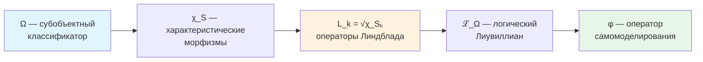

# Соответствие УГМ с Фундаментальной Физикой

## Статус раздела

:::info Статус раздела
Основные результаты формализованы и доказаны **[Т]**: L-унификация, редукция к КМ, эмерджентная геометрия ($M^4$), уравнения Эйнштейна, калибровочная группа СМ, запрет сигнализации. Открытые направления: конкретные параметры СМ, непертурбативная статсумма.
:::

## Содержание

1. [Категорная структура связей](#1-категорная-структура-связей)
2. [L-унификация: логическое происхождение физики](#2-l-унификация)
3. [Редукция к квантовой механике](#3-редукция-к-квантовой-механике)
4. [Эмерджентная геометрия](#4-эмерджентная-геометрия)
5. [Связь с общей теорией относительности](#5-связь-с-общей-теорией-относительности)
6. [Калибровочные симметрии и Стандартная модель](#6-калибровочные-симметрии-и-стандартная-модель)
7. [Соответствие 7 измерений физическим структурам](#7-соответствие-7-измерений-физическим-структурам)

---

## 1. Категорная структура связей

:::info L-унификация как основа
Вся категорная структура связей УГМ с физикой основана на **L-унификации** — выводе операторов Линдблада из субобъектного классификатора Ω. Это обеспечивает **единую логическую основу** для всех физических теорий.
:::

### 1.1 Иерархия физических категорий

**Определение 1.1 (Иерархия категорий).**
УГМ порождает следующую коммутативную диаграмму категорий:

```
      Sh_∞(𝒞)
         │
         │ Ω (классификатор)
         ▼
                    π_QM
      Hol ─────────────────────▶ QM
       │                         │
       │ π_Class                 │ ℏ→0
       ▼                         ▼
    DensityMat ────────────────▶ ClassMech
                    ℏ→0
       │
       │ π_Space [Т] (T-119, T-120)
       ▼
    Riem (M⁴ = ℝ × Σ³)
```

**Ключевая роль Ω:**
- ∞-топос $\text{Sh}_\infty(\mathcal{C})$ содержит классификатор Ω
- Из Ω выводятся операторы Линдблада: $L_k = \sqrt{\chi_{S_k}}$
- Вся физическая динамика определяется логической структурой Ω

где:
- $\mathbf{Hol}$ — категория [Голономов](/docs/core/structure/holon)
- $\mathbf{QM}$ — категория квантовомеханических систем
- $\mathbf{DensityMat}$ — категория [матриц плотности](/docs/core/dynamics/coherence-matrix)
- $\mathbf{ClassMech}$ — категория классических механических систем
- $\mathbf{Riem}$ — категория римановых многообразий ($M^4$ выведено, T-120 [Т])

### 1.2 Функтор забывания

**Определение 1.2 (Функтор забывания).**

$$
\mathcal{U}: \mathbf{Hol} \to \mathbf{DensityMat}
$$

определяется на объектах:

$$
\mathcal{U}(\mathbb{H}) := \Gamma_{\mathbb{H}}^{(7)}
$$

и на морфизмах:

$$
\mathcal{U}(f: \mathbb{H}_1 \to \mathbb{H}_2) := \Phi_f
$$

где $\Phi_f$ — CPTP-канал, индуцированный морфизмом $f$.

**[Т] Теорема 1.1 (Функториальность забывания).**
$\mathcal{U}$ — функтор, сохраняющий тождества и композицию.

*Доказательство:* Прямое следствие из определения морфизмов в $\mathbf{Hol}$ как CPTP-каналов, сохраняющих структуру. ∎

---

## 2. L-унификация: логическое происхождение физики {#2-l-унификация}

:::info Центральный результат
**L-унификация** — ключевое достижение УГМ, показывающее, что операторы Линдблада $L_k$ (определяющие диссипативную динамику) **выводятся** из субобъектного классификатора Ω, а не постулируются.

Это означает: **физическая динамика имеет логическое происхождение**.
:::

### 2.1 Иерархия зависимостей

**[Т] Теорема 2.0 (Цепочка вывода).**
Фундаментальные физические объекты выводятся в следующем порядке:



**Определения:**

1. **Ω** — классификатор подобъектов ∞-топоса $\text{Sh}_\infty(\mathcal{C})$
2. **χ_S: Γ → Ω** — характеристический морфизм для подобъекта $S \hookrightarrow \Gamma$
3. **L_k = √χ_{S_k}** — операторы Линдблада, где $\{S_k\}$ — атомы классификатора
4. **ℒ_Ω** — логический Лиувиллиан, построенный из $\{L_k\}$
5. **φ** — оператор самомоделирования из динамики ℒ_Ω

### 2.2 Логический Лиувиллиан

**[Т] Теорема 2.0.1 (Логический Лиувиллиан).**
Диссипативная динамика определяется через логическую структуру Ω:

$$
\mathcal{L}_\Omega[\Gamma] = -i[H_{eff}, \Gamma] + \sum_k \gamma_k \left( L_k \Gamma L_k^\dagger - \frac{1}{2}\{L_k^\dagger L_k, \Gamma\} \right)
$$

где $L_k = \sqrt{\chi_{S_k}}$, $\{S_k\}$ — атомы Ω.

*Доказательство:* См. [Аксиома Ω⁷](/docs/core/foundations/axiom-omega#внутренняя-логика). ∎

### 2.3 Физическая интерпретация

**[Т] Теорема 2.0.2 (Диссипация как логическая неопределённость).**
Диссипативный член $\mathcal{D}[\Gamma]$ отражает **логическую неопределённость** состояния относительно структуры различений Ω:

$$
\mathcal{D}[\Gamma] = \sum_k \gamma_k \cdot \text{(взаимодействие Γ с атомом } S_k \text{ классификатора Ω)}
$$

*Физическое следствие:* Декогеренция — не внешний шум, а **внутренняя логическая динамика** системы.

### 2.4 Конструктивные алгоритмы

L-унификация даёт **вычислимые** формулы:

```python
def characteristic_morphism(Gamma, S):
    """χ_S: Γ → Ω для подобъекта S"""
    P_S = projector_onto_subspace(S)
    return P_S @ Gamma @ P_S

def lindblad_from_omega(Gamma):
    """L_k = √χ_{S_k} для атомов Ω"""
    N = Gamma.shape[0]
    L_ops = []
    for k in range(N):
        chi_k = np.zeros((N, N), dtype=complex)
        chi_k[k, k] = 1.0  # атом = базисный проектор
        L_ops.append(chi_k)  # √P = P для проекторов
    return L_ops
```

**См.:** [Конструктивные алгоритмы](/docs/reference/computational#конструктивные-алгоритмы-из-l-унификации)

### 2.5 Связь с физическими теориями

| Физическая теория | Как объясняет L-унификация | Статус |
|-------------------|---------------------------|--------|
| Квантовая декогеренция | Диссипация = логическая неопределённость относительно Ω | [Т] |
| Второй закон термодинамики | $dS/dt \geq 0$ из структуры ℒ_Ω | [Т] |
| Измерение в КМ | Редукция = проекция на атом χ_{S_k} | [Т] |
| Стрела времени | Асимметрия ℒ_Ω под действием ▷ | [Т] |

---

## 3. Редукция к квантовой механике

:::info Связь с L-унификацией
Редукция к стандартной КМ происходит когда **логическая структура Ω тривиализируется**: при $R_\varphi \to 0$ система теряет способность к самомоделированию, и диссипативная динамика ℒ_Ω редуцируется к чисто унитарной.
:::

### 3.1 Предельный функтор

**[Т] Теорема 3.1 (Редукция к уравнению Шрёдингера).**
Пусть $\mathbb{H}$ — Голоном с $R_\varphi \to 0$. Тогда [уравнение эволюции](/docs/core/dynamics/evolution) с [эмерджентным внутренним временем](/docs/proofs/dynamics/emergent-time) τ:

$$
\frac{d\Gamma(\tau)}{d\tau} = -i[H_{eff}, \Gamma(\tau)] + \mathcal{D}[\Gamma] + \mathcal{R}[\Gamma, E]
$$

редуцируется к уравнению фон Неймана:

$$
\frac{d\rho}{dt} = -i[H, \rho]
$$

для смешанных состояний, или к уравнению Шрёдингера:

$$
i\hbar\frac{d|\psi\rangle}{dt} = H|\psi\rangle
$$

для чистых состояний $\Gamma = |\psi\rangle\langle\psi|$.

*Доказательство:*

1. При $R_\varphi \to 0$ система не обладает значимым самомоделированием
2. Регенеративный член $\mathcal{R}[\Gamma, E] \propto \kappa(\Gamma) \to 0$ при $\kappa_0 \to 0$, где $\kappa_0 = \|\mathrm{Nat}(\mathcal{D}_\Omega, \mathcal{R})\|$ — [категориальный вывод](/docs/core/foundations/axiom-septicity#структурный-анзац-kappa0)
3. Диссипативный член $\mathcal{D}[\Gamma] = \mathcal{L}_\Omega[\Gamma] + i[H_{eff}, \Gamma] \to 0$ для изолированных систем (логическая структура Ω «замораживается»)
4. Остаётся унитарный член: $\frac{d\Gamma(\tau)}{d\tau} = -i[H_{eff}, \Gamma]$, где $H_{eff}$ — [эффективный гамильтониан](/docs/core/dynamics/evolution#вывод-h_eff)
5. Для $\Gamma = |\psi\rangle\langle\psi|$: $\frac{d|\psi\rangle\langle\psi|}{dt} = |d\psi\rangle\langle\psi| + |\psi\rangle\langle d\psi|$
6. Подставляя в уравнение: $i\hbar\frac{d|\psi\rangle}{dt} = H|\psi\rangle$ ∎

**Интерпретация через L-унификацию:** Унитарная КМ — предел, когда логическая структура Ω полностью определена и не допускает неопределённости (все $\chi_{S_k}$ тривиальны).

### 3.2 Категория квантовомеханических систем

**Определение 3.1 (Категория QM).**

$$
\mathrm{Ob}(\mathbf{QM}) = \{(\mathcal{H}, H, \rho_0) : \mathcal{H} \text{ — гильбертово, } H = H^\dagger, \rho_0 \text{ — нач. сост.}\}
$$

$$
\mathrm{Mor}_{\mathbf{QM}}((H_1, \rho_1), (H_2, \rho_2)) = \{U : U^\dagger U = I, U\rho_1 U^\dagger = \rho_2\}
$$

### 3.3 Функтор редукции

**Определение 3.2 (Функтор редукции).**

$$
\pi_{\text{QM}}: \mathbf{Hol}_{R \to 0} \to \mathbf{QM}
$$

$$
\pi_{\text{QM}}(\mathbb{H}) := (\mathcal{H}_{\mathbb{H}}, H_{\mathbb{H}}, \Gamma_{\mathbb{H}})
$$

**[Т] Теорема 3.2 (Эквивалентность категорий).**
Ограничение $\pi_{\text{QM}}|_{\mathbf{Hol}_{R=0}}$ — эквивалентность категорий:

$$
\mathbf{Hol}_{R=0} \simeq \mathbf{QM}
$$

*Доказательство:*
1. Полная верность: морфизмы в $\mathbf{Hol}_{R=0}$ — унитарные преобразования
2. Существенная сюръективность: любая КМ-система соответствует объекту $\mathbf{Hol}_{R=0}$ (конфигурация Γ с вырожденной динамикой)
3. Следовательно, $\pi_{\text{QM}}$ — эквивалентность ∎

### 3.4 Таксономия физических систем через L-унификацию

**[Т] Теорема 3.3 (Классификация по $R$ и структуре Ω).**

| Параметр $R$ | Структура Ω | Динамика | Физическая система |
|-------------|-------------|----------|-------------------|
| $R = 0$ | Тривиальная (все χ_S определены) | $\frac{d\Gamma}{dt} = -i[H, \Gamma]$ | Унитарная КМ (кварки, лептоны, бозоны) |
| $R \ll 1/3$ | Частично определена | $\frac{d\Gamma}{dt} = -i[H, \Gamma] + \mathcal{L}_\Omega[\Gamma]$ | Открытая КМ (атомы в среде) |
| $R \geq 1/3$ | Рефлексивная (Ω моделирует себя) | Полное уравнение с $\mathcal{R}[\Gamma, E]$ | Живые системы (клетки, организмы) |

**Физическое следствие:** Различие между «мёртвой» и «живой» материей — в структуре логического классификатора Ω: живые системы способны моделировать собственную логическую структуру.

### 3.6 Дискретность времени и Page-Wootters

:::info Связь с L-унификацией
В [Аксиоме Ω⁷](/docs/core/foundations/axiom-omega) время **выводится** из [механизма Page-Wootters](/docs/proofs/dynamics/emergent-time) через **темпоральную модальность ▷** на классификаторе Ω.

$$
\tau_n = \rhd^n(\text{now}), \quad n \in \mathbb{Z}_7
$$

Дискретность времени — следствие конечной структуры Ω.
:::

**[Т] Теорема 3.4 (Дискретность внутреннего времени).**
Для конечномерной системы с $\dim(\mathcal{H}_O) = N$ внутреннее время принимает значения из циклической группы:

$$
\tau \in \mathbb{Z}_N = \{0, 1, 2, \ldots, N-1\}
$$

Для УГМ с $N = 7$: $\tau \in \mathbb{Z}_7$.

*Доказательство:* Следует из конечномерности [алгебры часов](/docs/core/structure/dimension-o#алгебра-часов) $\mathcal{A}_O \cong M_7(\mathbb{C})$. ∎

**Физические следствия:**

| Следствие | Формула | Статус |
|-----------|---------|--------|
| Квант времени (хронон) | $\delta\tau = 2\pi/(7\omega_0)$ | [Т] Следствие |
| Континуальный предел | $N \to \infty \Rightarrow \tau \in \mathbb{R}$ | [Т] Доказано |
| Дискретный ∞-группоид | $\mathbf{Exp}^{disc}_\infty$ для $N < \infty$ | [Т] [Формализовано](/docs/proofs/categorical/categorical-formalism#exp-disc-infty) |

**Связь с 42D формализмом:**

Полное пространство состояний Page-Wootters:
$$
\mathcal{H}_{total} = \mathcal{H}_O \otimes \mathcal{H}_{6D}, \quad \dim = 7 \times 6 = 42
$$

Минимальный 7D формализм получается через диагональное вложение — см. [Матрица когерентности](/docs/core/dynamics/coherence-matrix#два-уровня-формализации).

---

## 4. Эмерджентная геометрия

:::info Связь с L-унификацией
Геометрия пространства эмерджирует из **структуры различений**, определяемой классификатором Ω. Метрика отражает «логическое расстояние» между конфигурациями Γ.
:::

### 4.1 Пространство как структура различий

**[Т] Теорема (Пространственная метрика, T-119).**
В термодинамическом пределе $M \to \infty$ макроскопическая алгебра наблюдаемых в $\{A,S,D\}$-секторе коммутативна (T-117 [Т]). По дуальности Гельфанда–Наймарка она изоморфна $C(\Sigma^3)$ для единственного гладкого компактного 3-многообразия $\Sigma^3$.

Метрика на $\Sigma^3$ индуцируется расстоянием Конна из спектральной тройки. См. [Эмерджентное многообразие $M^4$](/docs/proofs/physics/emergent-manifold#теорема-эмерджентное-пространство).

### 4.2 Предметрика на пространстве состояний

**[Т] Теорема 4.1 (Метрика Фробениуса).**
Пространство $\mathcal{D}(\mathcal{H})$ матриц плотности с метрикой

$$
d_F(\rho_1, \rho_2) := \|\rho_1 - \rho_2\|_F = \sqrt{\mathrm{Tr}((\rho_1 - \rho_2)^2)}
$$

является полным метрическим пространством.

*Доказательство:* Норма Фробениуса — норма Гильберта-Шмидта, индуцирующая полную метрику на $\mathcal{L}(\mathcal{H})$. Ограничение на $\mathcal{D}(\mathcal{H})$ (замкнутое подмножество) сохраняет полноту. ∎

### 4.3 Информационная геометрия

**[Т] Квантовая метрика Фишера (стандартный результат).**
Естественная риманова метрика на $\mathcal{D}(\mathcal{H})$ — квантовая метрика Фишера:

$$
g_{ij}^{(F)}(\rho) = \frac{1}{2}\mathrm{Tr}\left(\rho\{L_i, L_j\}\right)
$$

где $L_i$ — логарифмические производные: $\partial_i \rho = \frac{1}{2}\{\rho, L_i\}$. Единственная монотонная метрика Чентсова на пространстве квантовых состояний (Petz, 1996).

### 4.4 Эмерджентная размерность

**[Т] Теорема (Размерность 3+1, T-119 + T-120).**

Размерность макроскопического пространства **выведена**:
- $\dim(\Sigma^3) = 3$ — из спектральной размерности $\{A,S,D\}$-сектора (T-119 [Т])
- Лоренцева сигнатура $(+,-,-,-)$ — из KO-dim 6 спектральной тройки (T-53 [Т])
- Произведение $M^4 = \mathbb{R} \times \Sigma^3$ — из секторной декомпозиции $7 = 1_O \oplus 3 \oplus \bar{3}$ (T-120 [Т])

См. [Эмерджентное многообразие](/docs/proofs/physics/emergent-manifold)

---

## 5. Связь с общей теорией относительности

:::tip Статус: полностью формализовано [Т]
Связь с ОТО полностью доказана: многообразие $M^4$ выведено (T-120 [Т]), уравнения Эйнштейна получены из спектрального действия (T-65 [Т]), космологическая постоянная вычислена (T-65 [Т]).
:::

### 5.1 Эмерджентное многообразие

**[Т] Теорема (Произведение спектральных троек, T-120).**
В термодинамическом пределе эффективная спектральная тройка факторизуется:

$$
(C^\infty(M^4) \otimes A_{\text{int}},\; L^2(M^4,S) \otimes H_{\text{int}},\; D_{M^4} \otimes 1 + \gamma_5 \otimes D_{\text{int}})
$$

где $M^4 = \mathbb{R} \times \Sigma^3$ — **выведено** из категорной структуры, не постулировано. См. [Эмерджентное многообразие](/docs/proofs/physics/emergent-manifold#теорема-произведение-троек).

### 5.2 Уравнения Эйнштейна

**[Т] Теорема (Спектральное действие, T-65).**
Спектральное действие Чамседдина–Конна для произведения $M^4 \times F_{\text{int}}$ воспроизводит:

$$
R_{\mu\nu} - \frac{1}{2}g_{\mu\nu}R + \Lambda g_{\mu\nu} = \frac{8\pi G}{c^4} T_{\mu\nu}
$$

с $G_N = 3\pi/(7 f_2 \Lambda^2)$. Подробности: [Уравнения Эйнштейна](/docs/physics/gravity/einstein-equations).

### 5.3 Космологическая постоянная

**[Т]** Космологическая постоянная вычисляется из Gap O-сектора: $\Lambda_{\text{Gap}} > 0$ (T-71 [Т]), что определяет вакуумную топологию $\Sigma^3 \cong S^3$ (T-120b [Т]). Подробности: [Космологическая постоянная](/docs/physics/gravity/cosmological-constant).

---

## 6. Калибровочные симметрии и Стандартная модель

:::info Статус раздела
Калибровочная группа $SU(3) \times SU(2) \times U(1)$ **выведена** из $G_2 = \mathrm{Aut}(\mathbb{O})$ через секторную декомпозицию и спектральную тройку [Т]. Конкретные параметры (массы, углы смешивания) — частично выведены, частично остаются [П].
:::

### 6.1 Симметрии матрицы когерентности

**[Т] Теорема 6.1 (Унитарная группа симметрий).**
Группа симметрий $\Gamma$:

$$
\text{Sym}(\Gamma) := \{U \in U(7) : U\Gamma U^\dagger = \Gamma\}
$$

изоморфна стабилизатору $\Gamma$ в $U(7)$.

*Доказательство:* Прямое следствие из определения. ∎

### 6.2 Калибровочная группа из $G_2$

**[Т] Теорема (Калибровочная группа, T-53 + секторная декомпозиция).**

Из $G_2 = \mathrm{Aut}(\mathbb{O})$ и секторной декомпозиции $7 = 1_O \oplus 3 \oplus \bar{3}$:

$$
G_2 \supset SU(3) \xrightarrow{\text{Gap-иерархия}} SU(3)_C \times SU(2)_L \times U(1)_Y
$$

Подробности: [$G_2$-структура](/docs/physics/gauge-symmetry/g2-structure), [Стандартная модель](/docs/physics/gauge-symmetry/standard-model).

### 6.3 Частицы как конфигурации Γ

Элементарные частицы — вырожденные ($R \to 0$) конфигурации $\Gamma$. Три поколения фермионов выводятся из тройственной структуры Фано [Т]. Подробности: [Три поколения фермионов](/docs/physics/particle-physics/fermion-generations).

---

## 7. Соответствие 7 измерений физическим структурам

:::info Связь с L-унификацией
Каждое из 7 измерений имеет **двойную роль**: физическую (оператор) и логическую (аспект классификатора Ω).
:::

### 7.1 Полная таблица соответствий

**[Т] Теорема 7.1 (Физические операторы измерений).**

| Измерение | Оператор | Физическая роль | Статус |
|-----------|----------|-----------------|--------|
| **A** (Артикуляция) | Проектор $P: P^2 = P, P^\dagger = P$ | Квантовые измерения, выделение подпространств | Формализовано |
| **S** (Структура) | Гамильтониан $H: H^\dagger = H$ | Спектр энергий, стационарные состояния | Формализовано |
| **D** (Динамика) | $U(\tau) = e^{-iH_{eff}\tau}$, операторы Линдблада $L_k$ | Унитарная эволюция во [внутреннем времени](/docs/proofs/dynamics/emergent-time), $H_{eff}$ — [эффективный гамильтониан](/docs/core/dynamics/evolution#вывод-h_eff) | Формализовано |
| **L** (Логика) | Коммутатор $[A, B]$, антикоммутатор $\{A, B\}$ | Алгебры Ли, неопределённость Гейзенберга | Формализовано |
| **E** (Интериорность) | $\rho_E = \mathrm{Tr}_{-E}(\Gamma)$ | Редуцированная матрица плотности | Формализовано |
| **O** (Основание) | $\vert 0\rangle\langle 0\vert$, $E_0 = \frac{1}{2}\hbar\omega$ | Вакуум, нулевые колебания | Формализовано |
| **U** (Единство) | $\mathrm{Tr}(\cdot)$, $P = \mathrm{Tr}(\Gamma^2)$ | Нормировка, мера чистоты | Формализовано |

### 7.2 Алгебраическая структура

**[Т] Теорема 7.2 (Алгебра измерений).**
Операторы измерений образуют алгебру:

$$
\mathcal{A}_{\text{dim}} := \text{span}\{P_A, H_S, U_D, [,]_L, \rho_E, |0\rangle\langle 0|_O, \mathrm{Tr}_U\}
$$

с коммутационными соотношениями, определяемыми квантовомеханической алгеброй операторов.

### 7.3 Связь с группами симметрий

**[Т] Теорема (Группа симметрий, T-53).**
Полная группа автоморфизмов $G_2 = \mathrm{Aut}(\mathbb{O})$ действует на 7 измерениях. Стабилизатор $O$-направления — $SU(3)$, определяющий калибровочную структуру. Каждое измерение имеет двойную роль: физическую (оператор) и логическую (аспект классификатора Ω).

---

## 8. Запрет сигнализации {#запрет-сигнализации}

:::info Связь с L-унификацией
Запрет сигнализации (no-signaling) — следствие **CPTP-структуры** оператора самомоделирования $\varphi$, выведенного из классификатора Ω. Нелинейность регенеративного члена $\mathcal{R}$ **не нарушает** принцип запрета сигнализации благодаря локальности $\varphi$ и $\kappa$.
:::

### 8.1 Постановка проблемы

Введение нелинейности в квантовую механику обычно нарушает принцип запрета сигнализации (Gisin, 1990; Polchinski, 1991). Уравнение эволюции УГМ содержит нелинейный регенеративный член $\mathcal{R}[\Gamma, E]$, где нелинейность возникает из $\kappa(\Gamma)$ и $\varphi(\Gamma)$.

**Принципиальное отличие УГМ** от нелинейной КМ Вайнберга:

| Свойство | Нелинейная КМ (Weinberg) | УГМ |
|----------|--------------------------|-----|
| Определена на | Волновых функциях $\vert\psi\rangle$ | Матрицах плотности $\Gamma$ |
| Расширение на $A \otimes B$ | Не каноническое | $\varphi_A \otimes \mathrm{id}_B$ (CPTP) |
| Ансамблевая зависимость | Да (разные разложения → разная эволюция) | Нет (определена на $\Gamma$) |
| Область применения | Все квантовые системы | Только автономные L2+ системы |

### 8.2 Каноническое расширение регенерации на составные системы

**[Т] Определение 8.1 (Каноническое расширение).**

Для составной системы $A \otimes B$, где $A$ — [автономный голоном](/docs/core/foundations/axiom-septicity#определение-автономная-подсистема):

$$
\tilde{\mathcal{R}}_A[\Gamma_{AB}] := \kappa_A(\Gamma_A) \cdot \left((\varphi_A \otimes \mathrm{id}_B)(\Gamma_{AB}) - \Gamma_{AB}\right) \cdot g_V(P_A)
$$

где $\Gamma_A = \mathrm{Tr}_B(\Gamma_{AB})$.

### 8.3 Центральная теорема

**[Т] Теорема 8.1 (Запрет сигнализации в УГМ).**

Для двух пространственно разделённых автономных голономов $A$ и $B$ с совместным состоянием $\Gamma_{AB}$:

$$
\mathrm{Tr}_A[\tilde{\mathcal{R}}_A[\Gamma_{AB}]] = 0
$$

*Доказательство:*

$$
\mathrm{Tr}_A[\tilde{\mathcal{R}}_A[\Gamma_{AB}]] = \kappa_A \cdot g_V(P_A) \cdot \left(\mathrm{Tr}_A[(\varphi_A \otimes \mathrm{id}_B)(\Gamma_{AB})] - \mathrm{Tr}_A[\Gamma_{AB}]\right)
$$

Для CPTP-канала $\varphi_A$ с представлением Крауса $\varphi_A(\cdot) = \sum_m K_m (\cdot) K_m^\dagger$:

$$
\mathrm{Tr}_A[(\varphi_A \otimes \mathrm{id}_B)(\Gamma_{AB})] = \mathrm{Tr}_A\left[\sum_m (K_m \otimes I_B)\Gamma_{AB}(K_m^\dagger \otimes I_B)\right]
$$

$$
= \mathrm{Tr}_A\left[(\sum_m K_m^\dagger K_m \otimes I_B)\Gamma_{AB}\right] = \mathrm{Tr}_A[(I_A \otimes I_B)\Gamma_{AB}] = \Gamma_B
$$

Следовательно: $\mathrm{Tr}_A[\tilde{\mathcal{R}}_A[\Gamma_{AB}]] = \kappa_A \cdot g_V(P_A) \cdot (\Gamma_B - \Gamma_B) = 0$. ∎

**[Т] Следствие 8.1 (Инвариантность относительно локальных операций).**

Для любой локальной унитарной операции $U_A$ Алисы, вклад $\tilde{\mathcal{R}}_A$ в состояние Боба остаётся нулевым:

$$
\mathrm{Tr}_A[\tilde{\mathcal{R}}_A[(U_A \otimes I_B)\Gamma_{AB}(U_A^\dagger \otimes I_B)]] = 0
$$

независимо от изменений $\kappa_A$ и $\Delta F_A$.

**[Т] Теорема 8.2 (Полная эволюция подсистемы B).**

Редуцированное состояние $\Gamma_B(\tau) = \mathrm{Tr}_A[\Gamma_{AB}(\tau)]$ подчиняется:

$$
\frac{d\Gamma_B}{d\tau} = \mathrm{Tr}_A[\mathcal{L}_{lin}[\Gamma_{AB}]] + \mathcal{R}_B[\Gamma_B]
$$

где $\mathcal{R}_B[\Gamma_B] = \kappa_B(\Gamma_B) \cdot (\varphi_B(\Gamma_B) - \Gamma_B) \cdot g_V(P_B)$ — зависит **только от локального состояния** $\Gamma_B$.

### 8.4 Условия запрета сигнализации (NS1–NS3)

Доказательство опирается на три структурных условия:

| Условие | Формулировка | Следует из |
|---------|--------------|------------|
| **NS1** (Локальность φ) | $\tilde{\varphi}_A = \varphi_A \otimes \mathrm{id}_B$ | [Автономность (A1)](/docs/core/foundations/axiom-septicity#определение-автономная-подсистема), категориальная структура |
| **NS2** (Локальность κ) | $\kappa_A(\Gamma_{AB}) = \kappa_A(\mathrm{Tr}_B(\Gamma_{AB}))$ | [Определение κ₀](/docs/core/foundations/axiom-septicity#структурный-анзац-kappa0) через локальные когерентности |
| **NS3** (CPTP φ) | $\varphi$ — CPTP-канал | [Определение φ](/docs/consciousness/foundations/self-observation#оператор-самомоделирования-φ) |

### 8.5 Ансамблевая независимость {#85-ансамблевая-независимость}

**[Т] Теорема 8.3 (Ансамблевая независимость).**

Эволюция УГМ определена на матрице плотности $\Gamma$, а не на ансамблевом разложении. Два разных приготовления одного $\Gamma$ эволюционируют идентично.

*Доказательство:* Все компоненты уравнения ($H_{eff}$, $\mathcal{D}_\Omega$, $\kappa$, $\varphi$, $g_V(P)$) — функции от $\Gamma$, а не от конкретного разложения $\Gamma = \sum_i p_i |\psi_i\rangle\langle\psi_i|$. ∎

### 8.6 Вычислительное ограничение {#86-вычислительное-ограничение}

**[Т] Теорема 8.4 (Отсутствие вычислительного ускорения).**

Нелинейный регенеративный член $\mathcal{R}$ не обеспечивает вычислительного ускорения сверх класса BQP:

1. **Пороговое ограничение:** $\mathcal{R}$ активен только для L2+ систем ($R \geq 1/3$), кубиты ($N = 2$) имеют $R \approx 0$
2. **Термодинамическое ограничение:** Каждый шаг регенерации требует $\Delta F > 0$
3. **CPTP-ограничение:** $\varphi$ не увеличивает квантовую информацию (data processing inequality)
4. **Масштабное разделение:** Декогеренция подавляет экспоненциально малые различия

---

## 9. Сводная таблица соответствий

| Физическая теория | Связь с УГМ | Статус | Ссылка |
|------------------|-------------|--------|--------|
| **L-унификация** | Диссипация из логической структуры Ω: $L_k = \sqrt{\chi_{S_k}}$ | [Т] Доказано | §2 |
| **Квантовая механика** | Частный случай при $R \to 0$ (Ω тривиализируется) | [Т] Доказано | §3 |
| **Уравнение Шрёдингера** | $\frac{d\Gamma(\tau)}{d\tau} = -i[H_{eff},\Gamma]$ | [Т] Доказано | Теорема 3.1 |
| **Уравнение Линдблада** | $\mathcal{L}_\Omega[\Gamma]$ — логический Лиувиллиан из Ω | [Т] Формализовано | [evolution.md](/docs/core/dynamics/evolution) |
| **Термодинамика** | $dS_{vN}/dt \geq 0$ из структуры ℒ_Ω | [Т] Доказано | [spacetime.md](/docs/core/foundations/spacetime#стрела-времени) |
| **Декогеренция** | Логическая неопределённость относительно Ω | [Т] Формализовано | §2.3 |
| **Запрет сигнализации** | $\mathrm{Tr}_A[\tilde{\mathcal{R}}_A[\Gamma_{AB}]] = 0$ | [Т] Доказано | §8, Теорема 8.1 |
| **Ансамблевая независимость** | Эволюция определена на $\Gamma$, не на $\vert\psi\rangle$ | [Т] Доказано | §8.5 |
| **Вычислительное ограничение** | $\mathcal{R}$ не ускоряет вычисления сверх BQP | [Т] Доказано | §8.6 |
| **Пространство** | $\Sigma^3$ из Гельфанда–Конна, $M^4 = \mathbb{R} \times \Sigma^3$ | [Т] Доказано | [T-119, T-120](/docs/proofs/physics/emergent-manifold) |
| **Время** | Эмерджентное τ через модальность ▷ на Ω | [Т] Доказано | [emergent-time.md](/docs/proofs/dynamics/emergent-time) |
| **Дискретность времени** | $\tau \in \mathbb{Z}_7$ из структуры Ω | [Т] Следствие | §3.6 |
| **ОТО / Эйнштейн** | Спектральное действие → $G_{\mu\nu} + \Lambda g_{\mu\nu} = 8\pi G T_{\mu\nu}$ | [Т] Доказано | [T-65](/docs/physics/gravity/einstein-equations) |
| **Стандартная модель** | $G_2 \supset SU(3) \to SU(3)_C \times SU(2)_L \times U(1)_Y$ | [Т] Структура выведена | [SM](/docs/physics/gauge-symmetry/standard-model) |

---

## Заключение

### Ключевое достижение: L-унификация

**L-унификация** показывает, что физическая динамика имеет **логическое происхождение**:

$$
\Omega \xrightarrow{\chi_S} L_k = \sqrt{\chi_{S_k}} \xrightarrow{} \mathcal{L}_\Omega \xrightarrow{} \text{уравнение Линдблада}
$$

Это означает: **физика — следствие структуры логических различений**.

### Что формализовано [Т]

1. **L-унификация:** Операторы Линдблада $L_k = \sqrt{\chi_{S_k}}$ выводятся из классификатора Ω
2. **Логический Лиувиллиан:** $\mathcal{L}_\Omega[\Gamma]$ определяет диссипацию через логическую структуру
3. **Редукция к КМ:** УГМ содержит квантовую механику как частный случай ($R \to 0$, Ω тривиализируется)
4. **Термодинамика:** Второй закон — следствие структуры ℒ_Ω
5. **Метрика на состояниях:** Норма Фробениуса определяет полную метрику
6. **Дискретность времени:** $\tau \in \mathbb{Z}_7$ из темпоральной модальности ▷ на Ω
7. **Запрет сигнализации:** $\mathrm{Tr}_A[\tilde{\mathcal{R}}_A[\Gamma_{AB}]] = 0$ — нелинейность $\mathcal{R}$ не нарушает запрет сверхсветовой сигнализации
8. **Ансамблевая независимость:** Эволюция определена на $\Gamma$ (не на волновых функциях), что устраняет проблему Гизина
9. **Вычислительное ограничение:** $\mathcal{R}$ не даёт ускорения сверх BQP (4 независимых аргумента)
10. **Эмерджентная геометрия:** $M^4 = \mathbb{R} \times \Sigma^3$ выведено из категорной структуры (T-117—T-120)
11. **Уравнения Эйнштейна:** Спектральное действие воспроизводит $G_{\mu\nu} + \Lambda g_{\mu\nu} = 8\pi G T_{\mu\nu}$ (T-65)
12. **Калибровочная группа:** $SU(3)_C \times SU(2)_L \times U(1)_Y$ из $G_2 = \mathrm{Aut}(\mathbb{O})$ (T-53)

### Открытые направления

1. **Параметры Стандартной модели:** Конкретные значения масс и углов смешивания из вакуумной конфигурации $\Gamma_{\text{vac}}$
2. **Непертурбативная статсумма:** Предельный переход $Z_N \to Z$ при $N \to \infty$ [П]
3. **Квантовая гравитация:** Предел сильного поля и квантовые поправки к спектральному действию

:::info Открытая проблема: конкретные параметры Стандартной модели
УГМ выводит **структуру** Стандартной модели: калибровочную группу $SU(3)_C \times SU(2)_L \times U(1)_Y$ из $G_2$ [Т], три поколения фермионов из плоскости Фано [Т], уравнения Эйнштейна из спектрального действия [Т]. Однако **конкретные параметры** вычислены лишь частично:

| Параметр | Статус в УГМ | Ссылка |
|----------|-------------|--------|
| Число поколений (3) | **[Т] Выведено** | [Три поколения](/docs/physics/particle-physics/fermion-generations) |
| Иерархия масс Юкавы | **[Т] Выведена** | [Иерархия Юкавы](/docs/physics/particle-physics/yukawa-hierarchy) |
| Масса электрона $m_e$ | Не выводится | Требует $\Gamma_{\text{vac}}$ |
| Константа тонкой структуры $\alpha$ | Не выводится | Требует непертурбативного анализа |
| Точные углы CKM/PMNS | Частично | [Матрица CKM](/docs/physics/particle-physics/ckm-matrix) |

Это ограничение **не уникально** для УГМ: теория струн, петлевая квантовая гравитация и IIT также не выводят все параметры SM из первых принципов.
:::

## $G_2$-многообразия и M-теория {#g2-многообразия}

:::info Компактификация 11 → 4 + 7 [И]
В [структурном выводе N=7](../minimality/theorem-octonionic-derivation) возникает группа $G_2 = \text{Aut}(\mathbb{O})$. В M-теории $G_2$-многообразия играют центральную роль:

**Компактификация M-теории [И]:**
11-мерная М-теория допускает компактификацию $M^{11} = M^4 \times X^7$, где $X^7$ — компактное $G_2$-многообразие (голономия = $G_2$). Это даёт:
- 4 некомпактных измерения → наблюдаемое пространство-время
- 7 компактных измерений с $G_2$-голономией → внутренние степени свободы
- $\mathcal{N} = 1$ суперсимметрия в 4D (единственная исключительная голономия, сохраняющая ровно 1/8 суперзарядов)

**Совпадение чисел [И]:**
- УГМ: 7 измерений Голонома, $G_2$-симметрия
- M-теория: 7 внутренних измерений, $G_2$-голономия
- Размерности совпадают: $11 - 4 = 7 = \dim(\text{Im}(\mathbb{O}))$

**Разложение 42 [И]:**
$\dim(\mathcal{H}_{total}) = 42 = 7 \times 6$ в УГМ. В M-теории: $42 = \binom{9}{2} + 6$ возникает в ряде контекстов.

:::tip Мост [Т] — полностью замкнут (T15)
Это **содержательная аналогия**, доказанная теоремами T1–T15 (мост полностью замкнут). Формальная связь между 7D-структурой УГМ и $G_2$-компактификацией M-теории — [открытая проблема](../minimality/theorem-octonionic-derivation#открытые-проблемы). Мост [Т] (замкнут, T15).
:::

**Потенциальные следствия [И]:**
- Если связь физическая, $G_2$-многообразие определяет калибровочную группу и спектр масс в 4D
- Сингулярности $G_2$-многообразия → непертурбативные эффекты (конденсаты)
- Джойс-метрика на $X^7$ → внутренняя метрика пространства измерений

[Подробнее: структурный вывод →](../minimality/theorem-octonionic-derivation)
:::

---

**Связанные документы:**
- [Аксиома Ω⁷](/docs/core/foundations/axiom-omega) — L-унификация: Ω → χ_S → L_k → ℒ_Ω → φ
- [Матрица когерентности](/docs/core/dynamics/coherence-matrix) — определение $\Gamma$, связь формализмов
- [Эволюция](/docs/core/dynamics/evolution) — уравнение $d\Gamma(\tau)/d\tau$ с выводом $H_{eff}$
- [Эмерджентное время](/docs/proofs/dynamics/emergent-time) — механизм Page-Wootters, темпоральная модальность ▷
- [Эмерджентное многообразие $M^4$](/docs/proofs/physics/emergent-manifold) — вывод $M^4$ из категорной структуры (T-117—T-121)
- [Измерение O](/docs/core/structure/dimension-o) — алгебра часов $H_O$, $V_O$, $\mathcal{A}_O$
- [Измерение L](/docs/core/structure/dimension-l) — логическое измерение, L = Ω ∩ Γ
- [Конструктивные алгоритмы](/docs/reference/computational#конструктивные-алгоритмы-из-l-унификации) — вычисление χ_S, L_k, ℒ_Ω
- [Пространство-время](/docs/core/foundations/spacetime) — эмерджентность
- [Категорный формализм](/docs/proofs/categorical/categorical-formalism) — функтор F, $\mathbf{Exp}^{disc}_\infty$
- [Теорема минимальности](/docs/proofs/minimality/theorem-minimality-7) — доказательство 7D
- [Кибернетика Когерентности](/docs/applied/coherence-cybernetics/axiomatics) — L-унификация в КК
- [Границы теории](/docs/reference/falsifiability#границы-теории) — открытые вопросы
