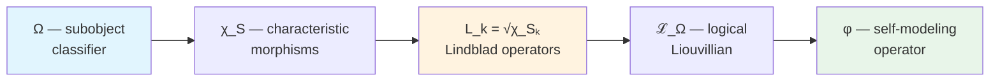

# UHM Correspondence with Fundamental Physics

## Section Status

:::info Section Status
The main results are formalized and proven **[Т]**: L-unification, reduction to QM, emergent geometry ($M^4$), Einstein equations, SM gauge group, no-signaling. Open directions: concrete SM parameters, non-perturbative partition function.
:::

## Contents

1. [Categorical Structure of Connections](#1-категорная-структура-связей)
2. [L-Unification: the Logical Origin of Physics](#2-l-унификация)
3. [Reduction to Quantum Mechanics](#3-редукция-к-квантовой-механике)
4. [Emergent Geometry](#4-эмерджентная-геометрия)
5. [Connection to General Relativity](#5-связь-с-общей-теорией-относительности)
6. [Gauge Symmetries and the Standard Model](#6-калибровочные-симметрии-и-стандартная-модель)
7. [Correspondence of 7 Dimensions to Physical Structures](#7-соответствие-7-измерений-физическим-структурам)

---

## 1. Categorical Structure of Connections {#1-категорная-структура-связей}

:::info L-unification as the foundation
The entire categorical structure connecting UHM with physics is based on **L-unification** — the derivation of Lindblad operators from the subobject classifier Ω. This provides a **unified logical foundation** for all physical theories.
:::

### 1.1 Hierarchy of Physical Categories

**Definition 1.1 (Category hierarchy).**
UHM generates the following commutative diagram of categories:

```
      Sh_∞(C)
         │
         │ Ω (classifier)
         ▼
                    π_QM
      Hol ─────────────────────▶ QM
       │                         │
       │ π_Class                 │ ℏ→0
       ▼                         ▼
    DensityMat ────────────────▶ ClassMech
                    ℏ→0
       │
       │ π_Space [Т] (T-119, T-120)
       ▼
    Riem (M⁴ = ℝ × Σ³)
```

**Key role of Ω:**
- The ∞-topos $\text{Sh}_\infty(\mathcal{C})$ contains the classifier Ω
- Lindblad operators are derived from Ω: $L_k = \sqrt{\chi_{S_k}}$
- All physical dynamics is determined by the logical structure of Ω

where:
- $\mathbf{Hol}$ — category of [Holons](/docs/core/structure/holon)
- $\mathbf{QM}$ — category of quantum-mechanical systems
- $\mathbf{DensityMat}$ — category of [density matrices](/docs/core/dynamics/coherence-matrix)
- $\mathbf{ClassMech}$ — category of classical mechanical systems
- $\mathbf{Riem}$ — category of Riemannian manifolds ($M^4$ derived, T-120 [Т])

### 1.2 Forgetful Functor

**Definition 1.2 (Forgetful functor).**

$$
\mathcal{U}: \mathbf{Hol} \to \mathbf{DensityMat}
$$

is defined on objects:

$$
\mathcal{U}(\mathbb{H}) := \Gamma_{\mathbb{H}}^{(7)}
$$

and on morphisms:

$$
\mathcal{U}(f: \mathbb{H}_1 \to \mathbb{H}_2) := \Phi_f
$$

where $\Phi_f$ is the CPTP channel induced by morphism $f$.

**[Т] Theorem 1.1 (Functoriality of forgetting).**
$\mathcal{U}$ is a functor preserving identities and composition.

*Proof:* Direct consequence of the definition of morphisms in $\mathbf{Hol}$ as CPTP channels preserving structure. ∎

---

## 2. L-Unification: the Logical Origin of Physics {#2-l-унификация}

:::info Central result
**L-unification** is the key achievement of UHM, showing that Lindblad operators $L_k$ (which define dissipative dynamics) are **derived** from the subobject classifier Ω, not postulated.

This means: **physical dynamics has a logical origin**.
:::

### 2.1 Dependency Hierarchy

**[Т] Theorem 2.0 (Derivation chain).**
Fundamental physical objects are derived in the following order:


```mermaid
graph LR
    O["Ω — subobject<br/>classifier"] --> CHI["χ_S — characteristic<br/>morphisms"]
    CHI --> LK["L_k = √χ_Sₖ<br/>Lindblad operators"]
    LK --> LO["ℒ_Ω — logical<br/>Liouvillian"]
    LO --> PHI["φ — self-modeling<br/>operator"]

    style O fill:#e1f5fe
    style LK fill:#fff3e0
    style PHI fill:#e8f5e9
```

**Definitions:**

1. **Ω** — subobject classifier of the ∞-topos $\text{Sh}_\infty(\mathcal{C})$
2. **χ_S: Γ → Ω** — characteristic morphism for the subobject $S \hookrightarrow \Gamma$
3. **L_k = √χ_{S_k}** — Lindblad operators, where $\{S_k\}$ are atoms of the classifier
4. **ℒ_Ω** — logical Liouvillian constructed from $\{L_k\}$
5. **φ** — self-modeling operator from the dynamics of ℒ_Ω

### 2.2 Logical Liouvillian

**[Т] Theorem 2.0.1 (Logical Liouvillian).**
Dissipative dynamics is defined via the logical structure of Ω:

$$
\mathcal{L}_\Omega[\Gamma] = -i[H_{eff}, \Gamma] + \sum_k \gamma_k \left( L_k \Gamma L_k^\dagger - \frac{1}{2}\{L_k^\dagger L_k, \Gamma\} \right)
$$

where $L_k = \sqrt{\chi_{S_k}}$, $\{S_k\}$ are atoms of Ω.

*Proof:* See [Axiom Ω⁷](/docs/core/foundations/axiom-omega#внутренняя-логика). ∎

### 2.3 Physical Interpretation

**[Т] Theorem 2.0.2 (Dissipation as logical uncertainty).**
The dissipative term $\mathcal{D}[\Gamma]$ reflects the **logical uncertainty** of the state relative to the structure of distinctions of Ω:

$$
\mathcal{D}[\Gamma] = \sum_k \gamma_k \cdot \text{(interaction of Γ with atom } S_k \text{ of classifier Ω)}
$$

*Physical consequence:* Decoherence is not external noise, but the **internal logical dynamics** of the system.

### 2.4 Constructive Algorithms

L-unification provides **computable** formulas:

```python
def characteristic_morphism(Gamma, S):
    """χ_S: Γ → Ω for subobject S"""
    P_S = projector_onto_subspace(S)
    return P_S @ Gamma @ P_S

def lindblad_from_omega(Gamma):
    """L_k = √χ_{S_k} for atoms of Ω"""
    N = Gamma.shape[0]
    L_ops = []
    for k in range(N):
        chi_k = np.zeros((N, N), dtype=complex)
        chi_k[k, k] = 1.0  # atom = basis projector
        L_ops.append(chi_k)  # √P = P for projectors
    return L_ops
```

**See:** [Constructive Algorithms](/docs/reference/computational#конструктивные-алгоритмы-из-l-унификации)

### 2.5 Connection to Physical Theories

| Physical theory | How L-unification explains it | Status |
|-----------------|-------------------------------|--------|
| Quantum decoherence | Dissipation = logical uncertainty relative to Ω | [Т] |
| Second law of thermodynamics | $dS/dt \geq 0$ from the structure of ℒ_Ω | [Т] |
| Measurement in QM | Reduction = projection onto atom χ_{S_k} | [Т] |
| Arrow of time | Asymmetry of ℒ_Ω under action of ▷ | [Т] |

---

## 3. Reduction to Quantum Mechanics {#3-редукция-к-квантовой-механике}

:::info Connection to L-unification
Reduction to standard QM occurs when the **logical structure Ω trivializes**: at $R_\varphi \to 0$ the system loses its capacity for self-modeling, and the dissipative dynamics ℒ_Ω reduces to purely unitary.
:::

### 3.1 Limit Functor

**[Т] Theorem 3.1 (Reduction to the Schrödinger equation).**
Let $\mathbb{H}$ be a Holon with $R_\varphi \to 0$. Then the [evolution equation](/docs/core/dynamics/evolution) with [emergent internal time](/docs/proofs/dynamics/emergent-time) τ:

$$
\frac{d\Gamma(\tau)}{d\tau} = -i[H_{eff}, \Gamma(\tau)] + \mathcal{D}[\Gamma] + \mathcal{R}[\Gamma, E]
$$

reduces to the von Neumann equation:

$$
\frac{d\rho}{dt} = -i[H, \rho]
$$

for mixed states, or to the Schrödinger equation:

$$
i\hbar\frac{d|\psi\rangle}{dt} = H|\psi\rangle
$$

for pure states $\Gamma = |\psi\rangle\langle\psi|$.

*Proof:*

1. At $R_\varphi \to 0$ the system has no significant self-modeling
2. The regenerative term $\mathcal{R}[\Gamma, E] \propto \kappa(\Gamma) \to 0$ as $\kappa_0 \to 0$, where $\kappa_0 = \|\mathrm{Nat}(\mathcal{D}_\Omega, \mathcal{R})\|$ — [categorical derivation](/docs/core/foundations/axiom-septicity#структурный-анзац-kappa0)
3. The dissipative term $\mathcal{D}[\Gamma] = \mathcal{L}_\Omega[\Gamma] + i[H_{eff}, \Gamma] \to 0$ for isolated systems (the logical structure Ω "freezes")
4. The unitary term remains: $\frac{d\Gamma(\tau)}{d\tau} = -i[H_{eff}, \Gamma]$, where $H_{eff}$ is the [effective Hamiltonian](/docs/core/dynamics/evolution#вывод-h_eff)
5. For $\Gamma = |\psi\rangle\langle\psi|$: $\frac{d|\psi\rangle\langle\psi|}{dt} = |d\psi\rangle\langle\psi| + |\psi\rangle\langle d\psi|$
6. Substituting into the equation: $i\hbar\frac{d|\psi\rangle}{dt} = H|\psi\rangle$ ∎

**Interpretation via L-unification:** Unitary QM is the limit in which the logical structure Ω is fully determined and admits no uncertainty (all $\chi_{S_k}$ are trivial).

### 3.2 Category of Quantum-Mechanical Systems

**Definition 3.1 (Category QM).**

$$
\mathrm{Ob}(\mathbf{QM}) = \{(\mathcal{H}, H, \rho_0) : \mathcal{H} \text{ is a Hilbert space}, H = H^\dagger, \rho_0 \text{ — initial state}\}
$$

$$
\mathrm{Mor}_{\mathbf{QM}}((H_1, \rho_1), (H_2, \rho_2)) = \{U : U^\dagger U = I, U\rho_1 U^\dagger = \rho_2\}
$$

### 3.3 Reduction Functor

**Definition 3.2 (Reduction functor).**

$$
\pi_{\text{QM}}: \mathbf{Hol}_{R \to 0} \to \mathbf{QM}
$$

$$
\pi_{\text{QM}}(\mathbb{H}) := (\mathcal{H}_{\mathbb{H}}, H_{\mathbb{H}}, \Gamma_{\mathbb{H}})
$$

**[Т] Theorem 3.2 (Equivalence of categories).**
The restriction $\pi_{\text{QM}}|_{\mathbf{Hol}_{R=0}}$ is an equivalence of categories:

$$
\mathbf{Hol}_{R=0} \simeq \mathbf{QM}
$$

*Proof:*
1. Full faithfulness: morphisms in $\mathbf{Hol}_{R=0}$ are unitary transformations
2. Essential surjectivity: every QM system corresponds to an object of $\mathbf{Hol}_{R=0}$ (a configuration Γ with degenerate dynamics)
3. Therefore, $\pi_{\text{QM}}$ is an equivalence ∎

### 3.4 Taxonomy of Physical Systems via L-Unification

**[Т] Theorem 3.3 (Classification by $R$ and structure of Ω).**

| Parameter $R$ | Structure of Ω | Dynamics | Physical system |
|---------------|---------------|----------|-----------------|
| $R = 0$ | Trivial (all χ_S defined) | $\frac{d\Gamma}{dt} = -i[H, \Gamma]$ | Unitary QM (quarks, leptons, bosons) |
| $R \ll 1/3$ | Partially defined | $\frac{d\Gamma}{dt} = -i[H, \Gamma] + \mathcal{L}_\Omega[\Gamma]$ | Open QM (atoms in a medium) |
| $R \geq 1/3$ | Reflexive (Ω models itself) | Full equation with $\mathcal{R}[\Gamma, E]$ | Living systems (cells, organisms) |

**Physical consequence:** The difference between "dead" and "living" matter lies in the structure of the logical classifier Ω: living systems are capable of modeling their own logical structure.

### 3.6 Discreteness of Time and Page–Wootters

:::info Connection to L-unification
In [Axiom Ω⁷](/docs/core/foundations/axiom-omega), time is **derived** from the [Page–Wootters mechanism](/docs/proofs/dynamics/emergent-time) via the **temporal modality ▷** on the classifier Ω.

$$
\tau_n = \rhd^n(\text{now}), \quad n \in \mathbb{Z}_7
$$

The discreteness of time is a consequence of the finite structure of Ω.
:::

**[Т] Theorem 3.4 (Discreteness of internal time).**
For a finite-dimensional system with $\dim(\mathcal{H}_O) = N$, internal time takes values from the cyclic group:

$$
\tau \in \mathbb{Z}_N = \{0, 1, 2, \ldots, N-1\}
$$

For UHM with $N = 7$: $\tau \in \mathbb{Z}_7$.

*Proof:* Follows from the finite-dimensionality of the [clock algebra](/docs/core/structure/dimension-o#алгебра-часов) $\mathcal{A}_O \cong M_7(\mathbb{C})$. ∎

**Physical consequences:**

| Consequence | Formula | Status |
|-------------|---------|--------|
| Quantum of time (chronon) | $\delta\tau = 2\pi/(7\omega_0)$ | [Т] Corollary |
| Continuous limit | $N \to \infty \Rightarrow \tau \in \mathbb{R}$ | [Т] Proven |
| Discrete ∞-groupoid | $\mathbf{Exp}^{disc}_\infty$ for $N < \infty$ | [Т] [Formalized](/docs/proofs/categorical/categorical-formalism#exp-disc-infty) |

**Connection to the 42D formalism:**

Full Page–Wootters state space:
$$
\mathcal{H}_{total} = \mathcal{H}_O \otimes \mathcal{H}_{6D}, \quad \dim = 7 \times 6 = 42
$$

The minimal 7D formalism is obtained via diagonal embedding — see [Coherence Matrix](/docs/core/dynamics/coherence-matrix#two-levels-of-formalization).

---

## 4. Emergent Geometry {#4-эмерджентная-геометрия}

:::info Connection to L-unification
Spatial geometry emerges from the **structure of distinctions** defined by classifier Ω. The metric reflects the "logical distance" between configurations Γ.
:::

### 4.1 Space as a Structure of Distinctions

**[Т] Theorem (Spatial metric, T-119).**
In the thermodynamic limit $M \to \infty$, the macroscopic algebra of observables in the $\{A,S,D\}$-sector is commutative (T-117 [Т]). By Gelfand–Naimark duality it is isomorphic to $C(\Sigma^3)$ for the unique smooth compact 3-manifold $\Sigma^3$.

The metric on $\Sigma^3$ is induced by the Connes distance from the spectral triple. See [Emergent Manifold $M^4$](/docs/proofs/physics/emergent-manifold#теорема-эмерджентное-пространство).

### 4.2 Pre-metric on the State Space

**[Т] Theorem 4.1 (Frobenius metric).**
The space $\mathcal{D}(\mathcal{H})$ of density matrices with metric

$$
d_F(\rho_1, \rho_2) := \|\rho_1 - \rho_2\|_F = \sqrt{\mathrm{Tr}((\rho_1 - \rho_2)^2)}
$$

is a complete metric space.

*Proof:* The Frobenius norm is the Hilbert–Schmidt norm, inducing a complete metric on $\mathcal{L}(\mathcal{H})$. Restriction to $\mathcal{D}(\mathcal{H})$ (a closed subset) preserves completeness. ∎

### 4.3 Information Geometry

**[Т] Quantum Fisher metric (standard result).**
The natural Riemannian metric on $\mathcal{D}(\mathcal{H})$ is the quantum Fisher metric:

$$
g_{ij}^{(F)}(\rho) = \frac{1}{2}\mathrm{Tr}\left(\rho\{L_i, L_j\}\right)
$$

where $L_i$ are logarithmic derivatives: $\partial_i \rho = \frac{1}{2}\{\rho, L_i\}$. The unique monotone Chentsov metric on the space of quantum states (Petz, 1996).

### 4.4 Emergent Dimensionality

**[Т] Theorem (Dimension 3+1, T-119 + T-120).**

The dimension of macroscopic space is **derived**:
- $\dim(\Sigma^3) = 3$ — from the spectral dimension of the $\{A,S,D\}$-sector (T-119 [Т])
- Lorentzian signature $(+,-,-,-)$ — from KO-dim 6 of the spectral triple (T-53 [Т])
- Product $M^4 = \mathbb{R} \times \Sigma^3$ — from the sector decomposition $7 = 1_O \oplus 3 \oplus \bar{3}$ (T-120 [Т])

See [Emergent Manifold](/docs/proofs/physics/emergent-manifold)

---

## 5. Connection to General Relativity {#5-связь-с-общей-теорией-относительности}

:::tip Status: fully formalized [Т]
The connection to GR is fully proven: the manifold $M^4$ is derived (T-120 [Т]), the Einstein equations are obtained from the spectral action (T-65 [Т]), and the cosmological constant is computed (T-65 [Т]).
:::

### 5.1 Emergent Manifold

**[Т] Theorem (Product of spectral triples, T-120).**
In the thermodynamic limit the effective spectral triple factorizes:

$$
(C^\infty(M^4) \otimes A_{\text{int}},\; L^2(M^4,S) \otimes H_{\text{int}},\; D_{M^4} \otimes 1 + \gamma_5 \otimes D_{\text{int}})
$$

where $M^4 = \mathbb{R} \times \Sigma^3$ is **derived** from the categorical structure, not postulated. See [Emergent Manifold](/docs/proofs/physics/emergent-manifold#теорема-произведение-троек).

### 5.2 Einstein Equations

**[Т] Theorem (Spectral action, T-65).**
The Chamseddine–Connes spectral action for the product $M^4 \times F_{\text{int}}$ reproduces:

$$
R_{\mu\nu} - \frac{1}{2}g_{\mu\nu}R + \Lambda g_{\mu\nu} = \frac{8\pi G}{c^4} T_{\mu\nu}
$$

with $G_N = 3\pi/(7 f_2 \Lambda^2)$. Details: [Einstein Equations](/docs/physics/gravity/einstein-equations).

### 5.3 Cosmological Constant

**[Т]** The cosmological constant is computed from the Gap of the O-sector: $\Lambda_{\text{Gap}} > 0$ (T-71 [Т]), which determines the vacuum topology $\Sigma^3 \cong S^3$ (T-120b [Т]). Details: [Cosmological Constant](/docs/physics/gravity/cosmological-constant).

---

## 6. Gauge Symmetries and the Standard Model {#6-калибровочные-симметрии-и-стандартная-модель}

:::info Section Status
The gauge group $SU(3) \times SU(2) \times U(1)$ is **derived** from $G_2 = \mathrm{Aut}(\mathbb{O})$ via the sector decomposition and spectral triple [Т]. Specific parameters (masses, mixing angles) — partially derived, partially remain [П].
:::

### 6.1 Symmetries of the Coherence Matrix

**[Т] Theorem 6.1 (Unitary symmetry group).**
The symmetry group of $\Gamma$:

$$
\text{Sym}(\Gamma) := \{U \in U(7) : U\Gamma U^\dagger = \Gamma\}
$$

is isomorphic to the stabilizer of $\Gamma$ in $U(7)$.

*Proof:* Direct consequence of the definition. ∎

### 6.2 Gauge Group from $G_2$

**[Т] Theorem (Gauge group, T-53 + sector decomposition).**

From $G_2 = \mathrm{Aut}(\mathbb{O})$ and the sector decomposition $7 = 1_O \oplus 3 \oplus \bar{3}$:

$$
G_2 \supset SU(3) \xrightarrow{\text{Gap hierarchy}} SU(3)_C \times SU(2)_L \times U(1)_Y
$$

Details: [$G_2$-structure](/docs/physics/gauge-symmetry/g2-structure), [Standard Model](/docs/physics/gauge-symmetry/standard-model).

### 6.3 Particles as Configurations Γ

Elementary particles are degenerate ($R \to 0$) configurations $\Gamma$. Three generations of fermions are derived from the triadic Fano structure [Т]. Details: [Three Generations of Fermions](/docs/physics/particle-physics/fermion-generations).

---

## 7. Correspondence of 7 Dimensions to Physical Structures {#7-соответствие-7-измерений-физическим-структурам}

:::info Connection to L-unification
Each of the 7 dimensions has a **dual role**: physical (as an operator) and logical (as an aspect of classifier Ω).
:::

### 7.1 Full Correspondence Table

**[Т] Theorem 7.1 (Physical operators of dimensions).**

| Dimension | Operator | Physical role | Status |
|-----------|----------|---------------|--------|
| **A** (Articulation) | Projector $P: P^2 = P, P^\dagger = P$ | Quantum measurements, subspace selection | Formalized |
| **S** (Structure) | Hamiltonian $H: H^\dagger = H$ | Energy spectrum, stationary states | Formalized |
| **D** (Dynamics) | $U(\tau) = e^{-iH_{eff}\tau}$, Lindblad operators $L_k$ | Unitary evolution in [internal time](/docs/proofs/dynamics/emergent-time), $H_{eff}$ — [effective Hamiltonian](/docs/core/dynamics/evolution#вывод-h_eff) | Formalized |
| **L** (Logic) | Commutator $[A, B]$, anticommutator $\{A, B\}$ | Lie algebras, Heisenberg uncertainty | Formalized |
| **E** (Interiority) | $\rho_E = \mathrm{Tr}_{-E}(\Gamma)$ | Reduced density matrix | Formalized |
| **O** (Foundation) | $\vert 0\rangle\langle 0\vert$, $E_0 = \frac{1}{2}\hbar\omega$ | Vacuum, zero-point oscillations | Formalized |
| **U** (Unity) | $\mathrm{Tr}(\cdot)$, $P = \mathrm{Tr}(\Gamma^2)$ | Normalization, purity measure | Formalized |

### 7.2 Algebraic Structure

**[Т] Theorem 7.2 (Algebra of dimensions).**
The operators of dimensions form an algebra:

$$
\mathcal{A}_{\text{dim}} := \text{span}\{P_A, H_S, U_D, [,]_L, \rho_E, |0\rangle\langle 0|_O, \mathrm{Tr}_U\}
$$

with commutation relations determined by the quantum-mechanical algebra of operators.

### 7.3 Connection to Symmetry Groups

**[Т] Theorem (Symmetry group, T-53).**
The full automorphism group $G_2 = \mathrm{Aut}(\mathbb{O})$ acts on the 7 dimensions. The stabilizer of the $O$-direction is $SU(3)$, determining the gauge structure. Each dimension has a dual role: physical (as an operator) and logical (as an aspect of classifier Ω).

---

## 8. No-Signaling {#запрет-сигнализации}

:::info Connection to L-unification
The no-signaling principle is a consequence of the **CPTP structure** of the self-modeling operator $\varphi$, derived from classifier Ω. The nonlinearity of the regenerative term $\mathcal{R}$ **does not violate** the no-signaling principle due to the locality of $\varphi$ and $\kappa$.
:::

### 8.1 Problem Statement

Introducing nonlinearity into quantum mechanics typically violates the no-signaling principle (Gisin, 1990; Polchinski, 1991). The UHM evolution equation contains a nonlinear regenerative term $\mathcal{R}[\Gamma, E]$, where the nonlinearity arises from $\kappa(\Gamma)$ and $\varphi(\Gamma)$.

**The fundamental difference of UHM** from Weinberg's nonlinear QM:

| Property | Nonlinear QM (Weinberg) | UHM |
|----------|-------------------------|-----|
| Defined on | Wave functions $\vert\psi\rangle$ | Density matrices $\Gamma$ |
| Extension to $A \otimes B$ | Not canonical | $\varphi_A \otimes \mathrm{id}_B$ (CPTP) |
| Ensemble dependence | Yes (different decompositions → different evolution) | No (defined on $\Gamma$) |
| Domain of applicability | All quantum systems | Only autonomous L2+ systems |

### 8.2 Canonical Extension of Regeneration to Composite Systems

**[Т] Definition 8.1 (Canonical extension).**

For a composite system $A \otimes B$, where $A$ is an [autonomous holon](/docs/core/foundations/axiom-septicity#определение-автономная-подсистема):

$$
\tilde{\mathcal{R}}_A[\Gamma_{AB}] := \kappa_A(\Gamma_A) \cdot \left((\varphi_A \otimes \mathrm{id}_B)(\Gamma_{AB}) - \Gamma_{AB}\right) \cdot g_V(P_A)
$$

where $\Gamma_A = \mathrm{Tr}_B(\Gamma_{AB})$.

### 8.3 Central Theorem

**[Т] Theorem 8.1 (No-signaling in UHM).**

For two spatially separated autonomous holons $A$ and $B$ with joint state $\Gamma_{AB}$:

$$
\mathrm{Tr}_A[\tilde{\mathcal{R}}_A[\Gamma_{AB}]] = 0
$$

*Proof:*

$$
\mathrm{Tr}_A[\tilde{\mathcal{R}}_A[\Gamma_{AB}]] = \kappa_A \cdot g_V(P_A) \cdot \left(\mathrm{Tr}_A[(\varphi_A \otimes \mathrm{id}_B)(\Gamma_{AB})] - \mathrm{Tr}_A[\Gamma_{AB}]\right)
$$

For a CPTP channel $\varphi_A$ with Kraus representation $\varphi_A(\cdot) = \sum_m K_m (\cdot) K_m^\dagger$:

$$
\mathrm{Tr}_A[(\varphi_A \otimes \mathrm{id}_B)(\Gamma_{AB})] = \mathrm{Tr}_A\left[\sum_m (K_m \otimes I_B)\Gamma_{AB}(K_m^\dagger \otimes I_B)\right]
$$

$$
= \mathrm{Tr}_A\left[(\sum_m K_m^\dagger K_m \otimes I_B)\Gamma_{AB}\right] = \mathrm{Tr}_A[(I_A \otimes I_B)\Gamma_{AB}] = \Gamma_B
$$

Therefore: $\mathrm{Tr}_A[\tilde{\mathcal{R}}_A[\Gamma_{AB}]] = \kappa_A \cdot g_V(P_A) \cdot (\Gamma_B - \Gamma_B) = 0$. ∎

**[Т] Corollary 8.1 (Invariance under local operations).**

For any local unitary operation $U_A$ by Alice, the contribution of $\tilde{\mathcal{R}}_A$ to Bob's state remains zero:

$$
\mathrm{Tr}_A[\tilde{\mathcal{R}}_A[(U_A \otimes I_B)\Gamma_{AB}(U_A^\dagger \otimes I_B)]] = 0
$$

regardless of changes in $\kappa_A$ and $\Delta F_A$.

**[Т] Theorem 8.2 (Full evolution of subsystem B).**

The reduced state $\Gamma_B(\tau) = \mathrm{Tr}_A[\Gamma_{AB}(\tau)]$ obeys:

$$
\frac{d\Gamma_B}{d\tau} = \mathrm{Tr}_A[\mathcal{L}_{lin}[\Gamma_{AB}]] + \mathcal{R}_B[\Gamma_B]
$$

where $\mathcal{R}_B[\Gamma_B] = \kappa_B(\Gamma_B) \cdot (\varphi_B(\Gamma_B) - \Gamma_B) \cdot g_V(P_B)$ — depends **only on the local state** $\Gamma_B$.

### 8.4 No-Signaling Conditions (NS1–NS3)

The proof rests on three structural conditions:

| Condition | Statement | Follows from |
|-----------|-----------|-------------|
| **NS1** (Locality of φ) | $\tilde{\varphi}_A = \varphi_A \otimes \mathrm{id}_B$ | [Autonomy (A1)](/docs/core/foundations/axiom-septicity#определение-автономная-подсистема), categorical structure |
| **NS2** (Locality of κ) | $\kappa_A(\Gamma_{AB}) = \kappa_A(\mathrm{Tr}_B(\Gamma_{AB}))$ | [Definition of κ₀](/docs/core/foundations/axiom-septicity#структурный-анзац-kappa0) via local coherences |
| **NS3** (CPTP φ) | $\varphi$ is a CPTP channel | [Definition of φ](/docs/consciousness/foundations/self-observation#оператор-самомоделирования-φ) |

### 8.5 Ensemble Independence {#85-ансамблевая-независимость}

**[Т] Theorem 8.3 (Ensemble independence).**

The UHM evolution is defined on the density matrix $\Gamma$, not on its ensemble decomposition. Two different preparations of the same $\Gamma$ evolve identically.

*Proof:* All components of the equation ($H_{eff}$, $\mathcal{D}_\Omega$, $\kappa$, $\varphi$, $g_V(P)$) are functions of $\Gamma$, not of any specific decomposition $\Gamma = \sum_i p_i |\psi_i\rangle\langle\psi_i|$. ∎

### 8.6 Computational Bound {#86-вычислительное-ограничение}

**[Т] Theorem 8.4 (Absence of computational speedup).**

The nonlinear regenerative term $\mathcal{R}$ does not provide computational speedup beyond the class BQP:

1. **Threshold bound:** $\mathcal{R}$ is active only for L2+ systems ($R \geq 1/3$); qubits ($N = 2$) have $R \approx 0$
2. **Thermodynamic bound:** Each regeneration step requires $\Delta F > 0$
3. **CPTP bound:** $\varphi$ does not increase quantum information (data processing inequality)
4. **Scale separation:** Decoherence suppresses exponentially small differences

---

## 9. Summary Table of Correspondences

| Physical theory | Connection to UHM | Status | Reference |
|-----------------|-------------------|--------|-----------|
| **L-unification** | Dissipation from logical structure Ω: $L_k = \sqrt{\chi_{S_k}}$ | [Т] Proven | §2 |
| **Quantum mechanics** | Special case at $R \to 0$ (Ω trivializes) | [Т] Proven | §3 |
| **Schrödinger equation** | $\frac{d\Gamma(\tau)}{d\tau} = -i[H_{eff},\Gamma]$ | [Т] Proven | Theorem 3.1 |
| **Lindblad equation** | $\mathcal{L}_\Omega[\Gamma]$ — logical Liouvillian from Ω | [Т] Formalized | [evolution.md](/docs/core/dynamics/evolution) |
| **Thermodynamics** | $dS_{vN}/dt \geq 0$ from the structure of ℒ_Ω | [Т] Proven | [spacetime.md](/docs/core/foundations/spacetime#стрела-времени) |
| **Decoherence** | Logical uncertainty relative to Ω | [Т] Formalized | §2.3 |
| **No-signaling** | $\mathrm{Tr}_A[\tilde{\mathcal{R}}_A[\Gamma_{AB}]] = 0$ | [Т] Proven | §8, Theorem 8.1 |
| **Ensemble independence** | Evolution defined on $\Gamma$, not on $\vert\psi\rangle$ | [Т] Proven | §8.5 |
| **Computational bound** | $\mathcal{R}$ does not accelerate computation beyond BQP | [Т] Proven | §8.6 |
| **Space** | $\Sigma^3$ from Gelfand–Connes, $M^4 = \mathbb{R} \times \Sigma^3$ | [Т] Proven | [T-119, T-120](/docs/proofs/physics/emergent-manifold) |
| **Time** | Emergent τ via modality ▷ on Ω | [Т] Proven | [emergent-time.md](/docs/proofs/dynamics/emergent-time) |
| **Discreteness of time** | $\tau \in \mathbb{Z}_7$ from the structure of Ω | [Т] Corollary | §3.6 |
| **GR / Einstein** | Spectral action → $G_{\mu\nu} + \Lambda g_{\mu\nu} = 8\pi G T_{\mu\nu}$ | [Т] Proven | [T-65](/docs/physics/gravity/einstein-equations) |
| **Standard Model** | $G_2 \supset SU(3) \to SU(3)_C \times SU(2)_L \times U(1)_Y$ | [Т] Structure derived | [SM](/docs/physics/gauge-symmetry/standard-model) |

---

## Conclusion

### Key Achievement: L-Unification

**L-unification** shows that physical dynamics has a **logical origin**:

$$
\Omega \xrightarrow{\chi_S} L_k = \sqrt{\chi_{S_k}} \xrightarrow{} \mathcal{L}_\Omega \xrightarrow{} \text{Lindblad equation}
$$

This means: **physics is a consequence of the structure of logical distinctions**.

### What Has Been Formalized [Т]

1. **L-unification:** Lindblad operators $L_k = \sqrt{\chi_{S_k}}$ are derived from classifier Ω
2. **Logical Liouvillian:** $\mathcal{L}_\Omega[\Gamma]$ defines dissipation via the logical structure
3. **Reduction to QM:** UHM contains quantum mechanics as a special case ($R \to 0$, Ω trivializes)
4. **Thermodynamics:** The second law is a consequence of the structure of ℒ_Ω
5. **Metric on states:** The Frobenius norm defines a complete metric
6. **Discreteness of time:** $\tau \in \mathbb{Z}_7$ from the temporal modality ▷ on Ω
7. **No-signaling:** $\mathrm{Tr}_A[\tilde{\mathcal{R}}_A[\Gamma_{AB}]] = 0$ — the nonlinearity of $\mathcal{R}$ does not violate the prohibition on superluminal signaling
8. **Ensemble independence:** Evolution is defined on $\Gamma$ (not on wave functions), resolving the Gisin problem
9. **Computational bound:** $\mathcal{R}$ provides no speedup beyond BQP (4 independent arguments)
10. **Emergent geometry:** $M^4 = \mathbb{R} \times \Sigma^3$ derived from categorical structure (T-117—T-120)
11. **Einstein equations:** The spectral action reproduces $G_{\mu\nu} + \Lambda g_{\mu\nu} = 8\pi G T_{\mu\nu}$ (T-65)
12. **Gauge group:** $SU(3)_C \times SU(2)_L \times U(1)_Y$ from $G_2 = \mathrm{Aut}(\mathbb{O})$ (T-53)

### Open Directions

1. **Standard Model parameters:** Specific values of masses and mixing angles from the vacuum configuration $\Gamma_{\text{vac}}$
2. **Non-perturbative partition function:** The limiting transition $Z_N \to Z$ as $N \to \infty$ [П]
3. **Quantum gravity:** The strong-field limit and quantum corrections to the spectral action

:::info Open problem: concrete parameters of the Standard Model
UHM derives the **structure** of the Standard Model: the gauge group $SU(3)_C \times SU(2)_L \times U(1)_Y$ from $G_2$ [Т], three generations of fermions from the Fano plane [Т], and the Einstein equations from the spectral action [Т]. However, **specific parameters** are only partially computed:

| Parameter | Status in UHM | Reference |
|-----------|--------------|-----------|
| Number of generations (3) | **[Т] Derived** | [Three Generations](/docs/physics/particle-physics/fermion-generations) |
| Yukawa mass hierarchy | **[Т] Derived** | [Yukawa Hierarchy](/docs/physics/particle-physics/yukawa-hierarchy) |
| Electron mass $m_e$ | Not derived | Requires $\Gamma_{\text{vac}}$ |
| Fine structure constant $\alpha$ | Not derived | Requires non-perturbative analysis |
| Exact CKM/PMNS angles | Partial | [CKM Matrix](/docs/physics/particle-physics/ckm-matrix) |

This limitation is **not unique** to UHM: string theory, loop quantum gravity, and IIT also do not derive all SM parameters from first principles.
:::

## $G_2$-Manifolds and M-Theory {#g2-многообразия}

:::info Compactification 11 → 4 + 7 [И]
In the [structural derivation of N=7](../minimality/theorem-octonionic-derivation), the group $G_2 = \text{Aut}(\mathbb{O})$ arises. In M-theory, $G_2$-manifolds play a central role:

**M-theory compactification [И]:**
11-dimensional M-theory admits a compactification $M^{11} = M^4 \times X^7$, where $X^7$ is a compact $G_2$-manifold (holonomy = $G_2$). This gives:
- 4 non-compact dimensions → observable spacetime
- 7 compact dimensions with $G_2$-holonomy → internal degrees of freedom
- $\mathcal{N} = 1$ supersymmetry in 4D (the unique exceptional holonomy preserving exactly 1/8 of supercharges)

**Numerical coincidence [И]:**
- UHM: 7 Holon dimensions, $G_2$-symmetry
- M-theory: 7 internal dimensions, $G_2$-holonomy
- Dimensions coincide: $11 - 4 = 7 = \dim(\text{Im}(\mathbb{O}))$

**Decomposition 42 [И]:**
$\dim(\mathcal{H}_{total}) = 42 = 7 \times 6$ in UHM. In M-theory: $42 = \binom{9}{2} + 6$ arises in a number of contexts.

:::tip Bridge [Т] — fully closed (T15)
This is a **substantive analogy**, proven by theorems T1–T15 (the bridge is fully closed). The formal connection between the 7D structure of UHM and the $G_2$-compactification of M-theory is an [open problem](../minimality/theorem-octonionic-derivation#открытые-проблемы). Bridge [Т] (closed, T15).
:::

**Potential consequences [И]:**
- If the connection is physical, the $G_2$-manifold determines the gauge group and mass spectrum in 4D
- Singularities of the $G_2$-manifold → non-perturbative effects (condensates)
- Joyce metric on $X^7$ → internal metric of the space of dimensions

[More: structural derivation →](../minimality/theorem-octonionic-derivation)
:::

---

**Related documents:**
- [Axiom Ω⁷](/docs/core/foundations/axiom-omega) — L-unification: Ω → χ_S → L_k → ℒ_Ω → φ
- [Coherence Matrix](/docs/core/dynamics/coherence-matrix) — definition of $\Gamma$, connection between formalisms
- [Evolution](/docs/core/dynamics/evolution) — equation $d\Gamma(\tau)/d\tau$ with derivation of $H_{eff}$
- [Emergent Time](/docs/proofs/dynamics/emergent-time) — Page–Wootters mechanism, temporal modality ▷
- [Emergent Manifold $M^4$](/docs/proofs/physics/emergent-manifold) — derivation of $M^4$ from categorical structure (T-117—T-121)
- [Dimension O](/docs/core/structure/dimension-o) — clock algebra $H_O$, $V_O$, $\mathcal{A}_O$
- [Dimension L](/docs/core/structure/dimension-l) — logical dimension, L = Ω ∩ Γ
- [Constructive Algorithms](/docs/reference/computational#конструктивные-алгоритмы-из-l-унификации) — computation of χ_S, L_k, ℒ_Ω
- [Spacetime](/docs/core/foundations/spacetime) — emergence
- [Categorical Formalism](/docs/proofs/categorical/categorical-formalism) — functor F, $\mathbf{Exp}^{disc}_\infty$
- [Minimality Theorem](/docs/proofs/minimality/theorem-minimality-7) — proof of 7D
- [Coherence Cybernetics](/docs/applied/coherence-cybernetics/axiomatics) — L-unification in CC
- [Theory Boundaries](/docs/reference/falsifiability#границы-теории) — open questions
