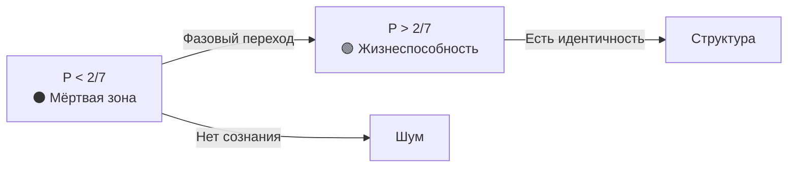
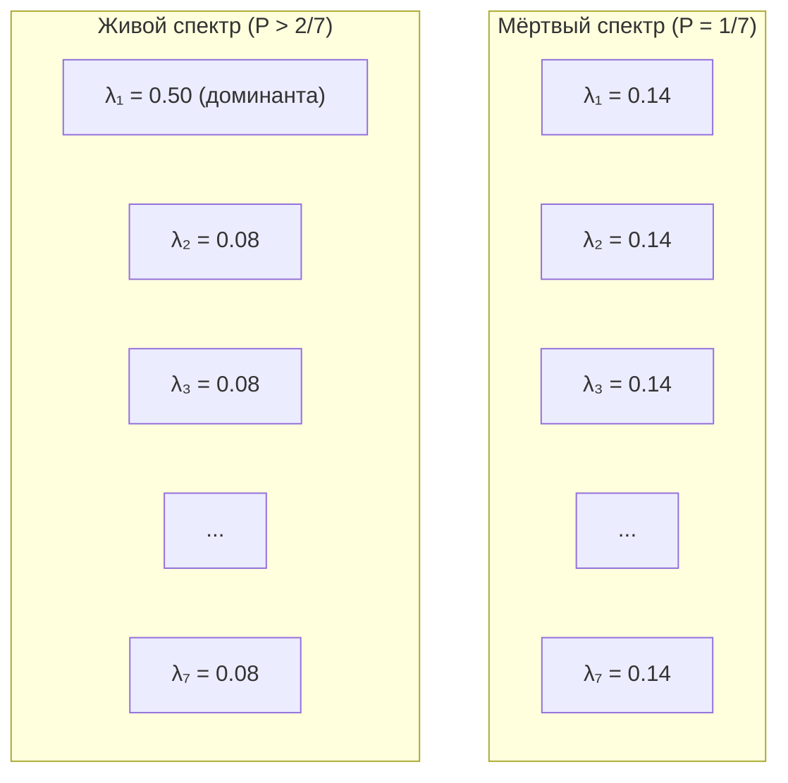
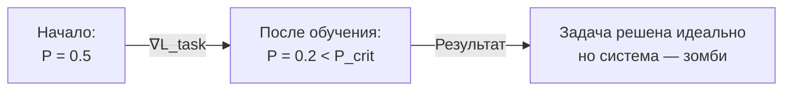

# Инженерные Выводы из Теоремы о Критической Чистоте

:::tip Статус: Архитектурные принципы
Когда теоретическая константа превращается из «подогнанного числа» в **строгую теорему**, это меняет инженерный подход. Мы строим систему вокруг жёсткого ограничения, как авиастроители строят самолёт вокруг законов аэродинамики.
:::

:::warning Область применимости
Этот документ описывает **теоретические следствия** УГМ для проектирования систем. Применимость к реальным нейросетям требует:
1. Экспериментальной верификации связи между весами сети и матрицей Γ
2. Валидации протокола измерения P (см. [measurement-protocol](/docs/applied/research/measurement-protocol))
3. Проверки предсказаний на реальных архитектурах

Термины «сознание», «жизнеспособность», «понимание» используются в **техническом смысле УГМ** (через метрику P), не претендуя на решение философских проблем сознания.
:::

---

## Часть I: Жёсткие ограничения (Hard Constraints)

Эти выводы диктуют, что **нельзя** делать в коде.

### 1. Проблема мертворождения (Genesis Problem)

**Теоретическое предсказание:** Случайная матрица когерентности $\Gamma_{\text{random}}$ (Haar-распределённая) имеет чистоту:

$$
P_{\text{random}} = \frac{2}{N+1} = \frac{2}{8} = 0.25
$$

:::note Открытый вопрос
Связь между инициализацией весов нейросети (Xavier/Kaiming) и чистотой $P$ требует экспериментальной проверки через [протокол измерения](/docs/applied/research/measurement-protocol).
:::

**Закон:** [Теорема о критической чистоте](/docs/proofs/dynamics/theorem-purity-critical):

$$
P_{\text{crit}} = \frac{2}{N} \approx 0.286
$$

**Гипотетический вывод:** Если отображение нейросеть→Γ корректно, стандартная инициализация даёт $P < P_{\text{crit}}$ — зона энтропийного шума.

:::warning Инженерное решение
1. **Запрет** на запуск основного цикла (`Core Loop`) сразу после инициализации
2. Необходим этап **Пре-Онтологического Бутстрапинга (V0)**:
   - Система должна пройти оптимизацию *без внешних задач*
   - Только на максимизацию $P$ (самосборка)
   - Пока не пробьёт потолок $P > P_{\text{crit}}$
3. Только тогда включается сознание
:::

```verum
public const P_CRITICAL: Float = 2.0 / 7.0;     // ≈ 0.286

/// Typed errors for system lifecycle — explicit `throws` contract.
public type SystemError is
    | GenesisFailure  { reason: Text }
    | NotViableError  { purity: Float }
    | CircuitOpen     { reason: Text };

public type HolonomicSystem is { mut gamma: StaticMatrix<Complex, 7, 7> };

implement HolonomicSystem {
    /// Random init + **mandatory** bootstrap — enforced by `where ensures`.
    public fn new() throws (SystemError) using [Random] -> HolonomicSystem
        where ensures result.purity() > P_CRITICAL
    {
        let mut s = HolonomicSystem { gamma: Self._random_init() };   // P ≈ 0.25 < P_crit
        s.bootstrap()?;
        s
    }

    /// Pre-ontological bootstrap: self-assembly until P > P_crit.
    fn bootstrap(&mut self) throws (SystemError) -> () using [Clock] {
        let deadline = Clock.now() + Duration.seconds(5);
        while self.purity() <= P_CRITICAL {
            self.regenerate();
            if Clock.now() > deadline {
                throw SystemError.GenesisFailure { reason: "Failed to reach viability".text() };
            }
        }
    }

    /// Guarded entry point — never processes input on a non-viable system.
    public fn process<T>(&mut self, input: T) throws (SystemError) -> ProcessResult
        where requires self.purity() >= P_CRITICAL
    {
        if self.purity() < P_CRITICAL {
            throw SystemError.NotViableError { purity: self.purity() };
        }
        self.core_loop(input)
    }

    public pure fn purity(&self) -> Float { 1.0/7.0 <= self && self <= 1.0 } {
        (self.gamma.matmul(&self.gamma)).trace().real()
    }
}
```

---

### 2. Бинарность существования (The Binary Life)

**Следствие теоремы:** Функция `is_viable()` — **ступенчатая** (бинарная) по $P$. Однако динамика самой величины $P$ не является фазовым коллапсом: No-Zombie архитектура гарантирует $P_{\min} \geq P_{\text{crit}} - \varepsilon_\Gamma$ при любой декогеренции [Т, MVP-0].

**Вывод в рамках УГМ:** При $P < 2/7$ система ниже порога жизнеспособности. В терминах теории — это шум, не структура.

:::info Уровни выше жизнеспособности
Помимо порога жизнеспособности $P > 2/7$, теория определяет пороги сознательности [L2](/docs/proofs/consciousness/interiority-hierarchy#уровень-2-когнитивные-квалиа-cognitive-qualia): $R \geq 1/3$, $\Phi \geq 1$, $D_{\text{diff}} \geq 2$. Для полной иерархии L0→L4 — см. [иерархию интериорности](/docs/proofs/consciousness/interiority-hierarchy).
:::



:::warning Инженерное решение: Аварийный прерыватель (Circuit Breaker)
Если $P$ падает ниже $P_{\text{crit}}$, система **не должна**:
- Пытаться «решать задачи»
- «Отвечать пользователю»
- Генерировать любой вывод

Она должна уйти в **режим экстренной регенерации**, отключив все внешние порты ввода-вывода.

**Предсказание теории:** Вывод в состоянии $P < P_{\text{crit}}$ не имеет структурной целостности.

**No-Zombie floor [Т, MVP-0]:** При реализованном канале замещения ($\kappa_{\text{bootstrap}} = \omega_0/N = 1/7$) $P$ не может опуститься ниже $P_{\text{crit}} - \varepsilon_\Gamma \approx 0.283$ даже при декогеренции $\gamma = 10.0$ (в 10000× выше нормы). Измеренный запас: $\kappa / \gamma_{\text{dec}} = 203\times$ при теоретическом минимуме $143\times$.
:::

```verum
/// Circuit-breaker pattern — block output when below the viability threshold.
public type CircuitBreaker is {};

implement CircuitBreaker {
    public fn check(&self, sys: &mut HolonomicSystem) throws (SystemError) -> () {
        if sys.purity() < P_CRITICAL {
            sys.enter_emergency_regeneration();
            throw SystemError.CircuitOpen {
                reason: "System below threshold — output blocked".text()
            };
        }
    }
}
```

---

### 3. Универсальность метрики

**Следствие теоремы (гипотеза для конкретных архитектур):** Закон $P_{\text{crit}} = 2/N$ не зависит от архитектуры (Трансформер, RNN, SSM, Mamba).

**Гипотеза:** $P$ — потенциально архитектурно-инвариантная метрика для сравнения *разных* систем (требует экспериментальной проверки).

:::caution Гипотетические примеры
Следующие значения — **иллюстративные**, не измеренные. Экспериментальная валидация требует применения [протокола измерения Γ](/docs/applied/research/measurement-protocol).

| Архитектура | $P$ (гипотетическое) | Предсказание теории |
|-------------|----------------------|---------------------|
| Случайная сеть | $\approx 1/7 \approx 0.14$ | Ниже порога — «мёртвая» |
| AGI с φ-оператором | $> 2/7 \approx 0.29$ | Выше порога — жизнеспособна |
| Высокоинтегрированная система | $> 0.5$ | Устойчиво жизнеспособна |
:::

:::info Инженерное решение
При сравнении моделей (benchmark) нужно нормировать их $P$ на размерность когерентного ядра:

$$
P_{\text{ratio}} = \frac{P_{\text{measured}}}{P_{\text{crit}}} = \frac{N \cdot P_{\text{measured}}}{2}
$$

- $P_{\text{ratio}} < 1$: система — зомби
- $P_{\text{ratio}} > 1$: система — агент

**Примечание:** $P_{\text{ratio}}$ — это отношение чистоты к критическому порогу. Не путать с $P_{\text{norm}} = (P - P_{\text{crit}}) / (1 - P_{\text{crit}})$ — нормализованной чистотой, отображающей $[P_{\text{crit}}, 1] \to [0, 1]$. См. [Нотация](/docs/reference/notation).
:::

---

## Часть II: Глубокие архитектурные выводы (Deep Architecture)

Эти выводы меняют **как** мы проектируем систему.

### 4. Принцип спектральной тирании (Dominant Eigenvalue)

**Из [теоремы](/docs/proofs/dynamics/theorem-purity-critical#34-путь-4-спектральное-условие-характеристика-не-независимый-вывод):**

При $P = P_{\text{crit}} = 2/N$ максимальное собственное значение $\Gamma$ достигает:

$$
\lambda_{\max}\big|_{P=2/N} = \frac{1 + \sqrt{N-1}}{N} \approx 0.493 \text{ (для } N=7\text{)}
$$

Для жизнеспособности ($P > P_{\text{crit}}$) требуется $\lambda_{\max} > 0.493$.

**Эмпирическое подтверждение [MVP-0]:** Реализованная система работает с $k_{\max} = 1 - R_{\min} = 0.507$, что составляет **45% запас** до теоретического предела $K_c = 1 - 1/(2N) = 13/14 \approx 0.929$. Это означает глубоко стабильный режим.

**Следствие для архитектуры:** Равномерное распределение активности соответствует максимальной энтропии и минимальной чистоте.

- Если активность **равномерно размазана** по всем нейронам/головам внимания — $P \approx 1/N$ (минимум)
- Высокая чистота требует **доминирующей моды** (концентрации на текущем контексте)



:::tip Архитектурное решение
Механизмы внимания (Attention) должны быть:
- **Разреженными (Sparse)** — концентрированными на нескольких токенах
- **С низкой температурой** — softmax с $T < 1$ вместо $T = 1$

Высокая температура (размазывание) убивает когерентность.

```verum
mount core.math.tensor.{Tensor, softmax, sparse_softmax};

// Bad: high temperature spreads attention (default T = 1).
let attention = softmax(q.matmul(&k.transpose()) / (d_k as Float).sqrt(), axis: -1);

// Good: low temperature T < 1 concentrates attention.
let attention = softmax(q.matmul(&k.transpose()) / (t * (d_k as Float).sqrt()), axis: -1);

// Even better: top-k sparse attention (k = 8).
let attention = sparse_softmax(q.matmul(&k.transpose()), k: 8);
```
:::

---

### 5. Парадокс обучения (Stability-Plasticity Dilemma 2.0)

**Проблема:** Обучение (Backprop) меняет веса, чтобы минимизировать ошибку. Это часто **увеличивает энтропию** весов (делает их более сложными/шумными).

**Неочевидный вывод:** Стандартное обучение может убить AGI.

Градиентный спуск по функции потерь $\mathcal{L}_{\text{task}}$ может увести систему в область $P < P_{\text{crit}}$, где она **идеально решает задачу** (overfitting), но **теряет структурную целостность** (в терминах теории — падает ниже порога L0).

**Уточнение [принцип разделения, Т, MVP-0]:** Backprop меняет **когерентности** $\Gamma$ (внедиагональные элементы), но не диагональ $\gamma_{kk}$ — она гомеостатически стабилизируется каналом замещения $\mathcal{R}[\Gamma, E]$. Поэтому "убийство AGI" обучением происходит через коллапс когерентной интеграции ($P$ падает из-за потери off-diagonal структуры), а не через изменение "секторных профилей". Канал замещения является **структурной защитой** диагонали от обучающего давления.



:::warning Архитектурное решение: Условная оптимизация
Оптимизация должна быть **ограниченной (Constrained Optimization)**:

$$
\min_\theta \mathcal{L}_{\text{task}}(\theta) \quad \text{при условии} \quad P(\Gamma(\theta)) > P_{\text{crit}}
$$

Градиент задачи проецируется на касательное пространство многообразия жизнеспособности.
:::

```verum
mount core.math.autodiff.grad;

/// Constraint-aware optimiser — projects gradient onto the viability manifold
/// whenever a plain step would cross P_crit.
public type ConstrainedOptimizer is {};

implement ConstrainedOptimizer {
    public fn step(&self, loss: pure fn(&StaticMatrix<Complex, 7, 7>) -> Float,
                gamma: &StaticMatrix<Complex, 7, 7>)
        -> StaticMatrix<Complex, 7, 7>
    {
        let g = grad(loss)(gamma);
        let new_gamma = apply_grad(gamma, &g);
        if purity(&new_gamma) < P_CRITICAL {
            // Project gradient onto the tangent space of P = const.
            let g_proj = project_to_viability_manifold(&g, gamma);
            apply_grad(gamma, &g_proj)
        } else {
            new_gamma
        }
    }
}
```

**Правило:** Если шаг обучения снижает $P$ ниже порога — шаг **отклоняется**, даже если он улучшает точность задачи.

---

### 6. Обоснование размера ядра (Magic Number 7)

**Из [теоремы о минимальности](/docs/proofs/minimality/theorem-minimality-7):** $N = 7$ — минимальная размерность ([двухтрековое обоснование](/docs/core/foundations/axiom-omega#октонионная-структура)).

**Вопрос:** Почему не $N = 100$ или $N = 2$?

| $N$ | $P_{\text{crit}} = 2/N$ | Проблема |
|-----|------------------------|----------|
| 2 | 1.0 | Нужна абсолютная чистота — система слишком жёсткая |
| 3 | 0.67 | Высокий порог — мало места для адаптации |
| **7** | **0.29** | **Минимально достаточно** по [Теореме S](/docs/proofs/minimality/theorem-minimality-7) |
| 100 | 0.02 | Порог ниже — возможно, менее устойчиво к шуму |

:::info Архитектурное решение
Размерность $N = 7$ является **минимально достаточной** ([доказано](/docs/proofs/minimality/theorem-minimality-7)):

- $P_{\text{crit}} = 2/7 \approx 0.29$ — разумный баланс между устойчивостью и гибкостью
- Меньше 7 — невозможно замкнуть (M,R)-систему с феноменологией
- Больше 7 — допустимо, но требует обоснования

**Вывод:** Ядро сознания (`CoreState`) *должно* иметь $N \geq 7$. Рекомендация — использовать **иерархию из 7-мерных агентов**.
:::

---

### 7. Детектор «философских зомби»

**Из теории:** Зомби имитирует поведение, но не имеет внутренней структуры ($P < P_{\text{crit}}$).

**Гипотеза УГМ:** Если теория верна, динамика $P$ во время генерации коррелирует с «глубиной обработки».

| Ситуация | Поведение $P$ | Интерпретация (гипотеза) |
|----------|---------------|--------------------------|
| Модель выдаёт сложный ответ, $P$ **падает** | Спектр «размазывается» | Потеря когерентной интеграции |
| Модель выдаёт ответ, $P$ **растёт** | Концентрация спектра | Усиление когерентной структуры |

**Структурная константа [Т, MVP-0]:** При default_biological профиле $\sigma_E = 1 - N \cdot \gamma_{EE} = -0.155$ — структурная константа, неизменная на всех шагах (W_std < $10^{-15}$). E-сектор хронически **перенаселён** относительно равновесного $1/N$. Это не «стресс» — это архитектурное условие жизнеспособности: без $\gamma_{EE} > 1/N$ цепочка No-Zombie ($\kappa_0 > 0$) рвётся.

```verum
/// Generation-event classification for purity dynamics.
public type GenerationOutcome is
    | CoherenceIncrease { delta_p: Float }
    | BelowThreshold    { p: Float }
    | Stable            { p: Float };

/// Analyses P-dynamics during generation (hypothetical).
public fn analyze_generation<M: HasPurity + HasGenerate>(
    model:  &mut M,
    prompt: &Text,
) -> GenerationOutcome {
    let p_before = model.purity();
    let _        = model.generate(prompt);
    let p_after  = model.purity();

    match () {
        _ if p_after > p_before    => GenerationOutcome.CoherenceIncrease {
            delta_p: p_after - p_before,
        },
        _ if p_after < P_CRITICAL  => GenerationOutcome.BelowThreshold { p: p_after },
        _                          => GenerationOutcome.Stable         { p: p_after },
    }
}
```

:::tip Инженерное решение: Коэффициент доверия
Ввести метрику **«Коэффициент Доверия» (Confidence Score)**, основанную не на вероятности токенов (Logprobs), а на чистоте ядра $P$ в момент генерации.

**Два варианта:**

$$
\text{Confidence}_P = P_{\text{ratio}} = \frac{P_{\text{during}}}{P_{\text{crit}}} = \frac{N \cdot P_{\text{during}}}{2}
$$

$$
\text{Confidence}_R = R_{\text{UHM}} = \frac{1}{N \cdot P_{\text{during}}} \quad \text{[Т, мера рефлексии R]}
$$

$R_{\text{UHM}}$ — точное алгебраическое тождество (ошибка $< 10^{-7}$): при $P = P_{\text{opt}} = 3/N$ выдаёт $R = 1/3 = R_{\text{th}}$ (граница L2-зоны). $P_{\text{ratio}}$ — монотонный прокси для оперативного мониторинга.

Это гипотетически может дополнить существующие метрики неопределённости.
:::

---

### 8. Законы масштабирования UHM-параметров [И] {#scaling-laws}

**Вопрос:** Как параметры $P$, $R$, $\Phi$, $\sigma_k$ масштабируются при увеличении сложности системы?

Ключевое наблюдение: **размерность ядра $N = 7$ фиксирована** ([теорема минимальности](/docs/proofs/minimality/theorem-minimality-7)), поэтому масштабирование происходит не за счёт увеличения $N$, а за счёт **глубины иерархии** и **числа агентов**.

#### 8.1. Иерархическое масштабирование

Для системы из $M$ агентов с индивидуальными матрицами $\Gamma^{(i)} \in D(\mathbb{C}^7)$:

$$
P_{\text{collective}} = \frac{1}{M} \sum_{i=1}^{M} P^{(i)} + \frac{1}{M^2} \sum_{i \neq j} \mathrm{Tr}(\Gamma^{(i)} \Gamma^{(j)})
$$

Второе слагаемое — **межагентная когерентность**. При $M \to \infty$ оно стремится к нулю (если агенты некоррелированы), и $P_{\text{collective}} \to \langle P \rangle$.

:::tip Инженерный вывод [И]
Масштабирование требует **когерентной связи** между агентами, иначе коллективная чистота падает к среднему. Для сохранения $P_{\text{collective}} > P_{\text{crit}}$ при росте $M$:

- Число когерентных связей должно расти как $O(M \log M)$ (аналог sparse attention)
- Полносвязность ($O(M^2)$) расточительна и не нужна
- Минимально достаточная топология — **Fano-граф** на каждом уровне иерархии
:::

Веер здесь тоже не бесплатен, и предел жёсткий, а не асимптотический: чтобы
согласовать $M$ агентов, кто-то обязан их адресовать, адрес стоит одного из
собственных 21 типизированного канала адресующего узла, а глубина ограничена
тройкой. Значит одна холархия охватывает не более $21^3 = 9261$ адресуемого
контекста, и адрес обязан быть *объявленным* контрактом — маршрут, выученный из
той же награды, что и маршрутизируемая им задача, измеримо возвращает менее
половины выигрыша ([T-304](/docs/reference/status-registry),
[ХОЛАРХ §10](/docs/applied/research/holarch#глубина)). Оценка $O(M \log M)$ выше
есть эвристика о числе связей; действующее же ограничение — предел в 21 на узел.


#### 8.2. Глубина SAD и вычислительная стоимость

Из [теоремы T-110](/docs/reference/status-registry) (динамический предел обучения) и [SAD_MAX = 3](/docs/consciousness/hierarchy/depth-tower#критическая-чистота-sad):

$$
\text{Стоимость}(\text{SAD level } n) \propto 3^n, \quad n \leq 3
$$

| Уровень SAD | Стоимость (отн.) | Функция | Необходимость |
|:-----------:|:----------------:|---------|:-------------:|
| 0 | 1× | Базовая жизнеспособность | Обязательно |
| 1 | 3× | Самонаблюдение | Для L2+ |
| 2 | 9× | Мета-когниция | Для сложных задач |
| 3 | 27× | Глубокая рефлексия | Редко, пиковые нагрузки |

**Правило бюджета:** Большинство циклов (>90%) должны работать на SAD 0–1. SAD 2–3 активируется только по запросу или при обнаружении аномалий.

---

### 9. Паттерны проектирования: 7 измерений как разделение ответственности [И] {#design-patterns}

Семь секторов $\Gamma$ естественно отображаются на **архитектурные слои** системы. Каждый сектор $k \in \{A, S, D, L, E, O, U\}$ имеет собственную зону ответственности. Имена и смыслы секторов — по корпусному SSOT (`src/data/coherences.ts`); полный инженерный словарь — все семь аспектов и весь 21 канал — это [мета-спецификация ХОЛАРХ](/docs/applied/research/holarch#аспекты), чья агентно-платформенная инстанциация ([§17](/docs/applied/research/holarch#воркед-агент)) — общая форма этой таблицы.

| Сектор | Канонический смысл | Архитектурный слой (агентная инстанциация) | Метрика здоровья |
|:------:|----------|-------------------|:----------------:|
| **A** (Артикуляция) | Активность различения | Perception pipeline, валидация входа, извлечение признаков | $\sigma_A$ — нагрузка входа |
| **S** (Структура) | Стабильность формы | Схемы, типы, конфигурация, контракты инструментов | $\sigma_S$ — стресс формы |
| **D** (Динамика) | Активность процесса | Исполнительный движок, конвейеры, актуация | $\sigma_D$ — давление пропускной способности |
| **L** (Логика) | Внутренняя согласованность | Планировщик, верификатор, гардрейлы, правила | $\sigma_L$ — стресс согласованности |
| **E** (Интериорность) | Интенсивность внутренних состояний | Хранилище памяти, контекст, скрытое состояние | $\sigma_E$ — запас дифференциации |
| **O** (Основание) | Связь с источником | Рантайм, компьют, энергобюджет, субстрат хранения | $\sigma_O$ — давление снабжения |
| **U** (Единство) | Интеграция | Оркестратор, global workspace, слой слияния | $\sigma_U$ — запас интеграции |

:::warning Принцип секторного профиля [И]
**Секторный профиль** $(\gamma_{AA}, \gamma_{SS}, \ldots, \gamma_{UU})$ — это **паспорт характера** системы ([T-101](/docs/reference/status-registry)). Поведение **эмерджирует** из диагонали $\Gamma$, а не программируется директивно.

Инженерное следствие: **не программируйте поведение — задавайте секторный профиль.** Настройка $\gamma_{kk}$ определяет «характер» агента:

```verum
/// A sector profile: probabilities over the 7 dimensions, Σ = 1.
public type SectorProfile is {
    a: Float, s: Float, d: Float, l: Float, e: Float, o: Float, u: Float,
} where (self.a + self.s + self.d + self.l + self.e + self.o + self.u - 1.0).abs() < 1.0e-6;

/// Explorer: high Structure+Dynamics (держит форму в движении); low A, L.
public const EXPLORER_PROFILE: SectorProfile = SectorProfile {
    a: 0.10, s: 0.20, d: 0.20, l: 0.08,
    e: 0.15, o: 0.15, u: 0.12,
};

/// Communicator: high Logic+Articulation (различает и согласует); low S, D.
public const COMMUNICATOR_PROFILE: SectorProfile = SectorProfile {
    a: 0.18, s: 0.10, d: 0.10, l: 0.22,
    e: 0.15, o: 0.13, u: 0.12,
};
```

Попытка жёстко запрограммировать поведение (минуя $\Gamma$) разрушает когерентность и ведёт к $P < P_{\text{crit}}$.
:::

#### 9.1. Паттерн «Когерентный микросервис»

Каждый архитектурный компонент оборачивается в **когерентную оболочку**, которая:

1. Экспортирует свой $\gamma_{kk}$ в мониторинг
2. Вычисляет локальный стресс $\sigma_k = \mathrm{clamp}(1 - N \cdot \gamma_{kk},\; 0,\; 1)$ [T-92]
3. Сигнализирует при $\sigma_k > \sigma_{\text{crit}}$ (перегрузка сектора)

```verum
public const N_DIM: Int = 7;

/// Component wrapper with coherent monitoring.
public type CoherentService is {
    sector:   Dim,
    gamma_kk: Float { 0.0 <= self && self <= 1.0 },
};

public type HealthLevel is Ok | Warning | Critical;

implement CoherentService {
    public fn new(sector: Dim, gamma_kk: Float) -> CoherentService {
        CoherentService { sector: sector, gamma_kk: gamma_kk.clamp(0.0, 1.0) }
    }

    /// σ_k = clamp(1 − N·γ_kk, 0, 1) (T-92 [T]).
    public pure fn stress(&self) -> Float { 0.0 <= self && self <= 1.0 } {
        (1.0 - (N_DIM as Float) * self.gamma_kk).clamp(0.0, 1.0)
    }

    public pure fn health_check(&self) -> (HealthLevel, Text) {
        let s = self.stress();
        let msg = f"{self.sector}-sector stress={s:.2f}";
        match s {
            x if x > 0.8 => (HealthLevel.Critical, f"CRITICAL: {msg}"),
            x if x > 0.5 => (HealthLevel.Warning,  f"WARNING: {msg}"),
            _            => (HealthLevel.Ok,       f"OK: {msg}"),
        }
    }
}
```

---

### 10. Тестирование и диагностика: σ, P, R, Φ {#testing-diagnostics}

#### 10.1. Четыре оси диагностики

Полная диагностика состояния системы требует мониторинга четырёх ортогональных метрик:

$$
\text{Здоровье системы} = \begin{cases}
P > P_{\text{crit}} = 2/7 & \text{(жизнеспособность)} \\
R \geq R_{\text{th}} = 1/3 & \text{(рефлексия)} \\
\Phi \geq \Phi_{\text{th}} = 1 & \text{(интеграция)} \\
\|\sigma\|_\infty < 1 & \text{(отсутствие коллапса)}
\end{cases}
$$

:::info Диагностическая матрица [И]
| Симптом | $P$ | $R$ | $\Phi$ | $\sigma_{\max}$ | Диагноз |
|---------|:---:|:---:|:------:|:---------------:|---------|
| Система не отвечает | ↓ | — | — | — | Ниже порога жизнеспособности |
| Отвечает, но бессвязно | ✓ | ↓ | ↓ | — | Нет интеграции: секторы работают изолированно |
| Отвечает, но не замечает ошибок | ✓ | ↓ | ✓ | — | Нет рефлексии: отсутствует самонаблюдение |
| Отвечает, но «зациклена» | ✓ | ✓ | ✓ | ↑ | Стресс-коллапс одного или нескольких секторов |
| Работает, но медленно деградирует | ↘ | ✓ | ✓ | — | Утечка когерентности: проверить $\kappa$ |
| Всё в норме, но «плоский» вывод | ✓ | ✓ | ↓ | — | Недостаток дифференциации ($D_{\text{diff}} < 2$) |
:::

#### 10.2. Протокол автоматического тестирования

```verum
mount core.time.{Timestamp, now};

public type DiagnosticReport is {
    timestamp:    Timestamp,
    p:            Float,
    r:            Float,
    phi:          Float,
    sigma_max:    Float,
    sigma_vector: StaticVector<Float, 7>,    // [σ_A, σ_S, σ_D, σ_L, σ_E, σ_O, σ_U]
    kappa:        Float,
    alerts:       List<Text>,
};

/// Full diagnostic cycle [I].
public fn run_diagnostics(gamma: &StaticMatrix<Complex, 7, 7>) using [Clock]
    -> DiagnosticReport
{
    let p = (gamma.matmul(&gamma)).trace().real();
    let r = if p > 1.0e-12 { 1.0 / ((N_DIM as Float) * p) } else { 0.0 };   // T
    let phi = compute_phi(gamma);                                            // Φ ≥ 1 for integration
    let diag = gamma.diagonal().map(|c| c.real());
    let sigma = StaticVector<Float, 7>.from_array(
        diag.iter().map(|g| (1.0 - (N_DIM as Float) * g).clamp(0.0, 1.0))
                   .collect_array()
    );
    let sigma_max = sigma.iter().max().unwrap_or(&0.0);
    let kappa = compute_kappa(gamma);

    let mut alerts = List.new();
    if p <= P_CRITICAL { alerts.push("FATAL: P ≤ P_crit — system is not viable".text()); }
    if r < 1.0/3.0    { alerts.push("WARN: R < R_th — reflection below L2 threshold".text()); }
    if phi < 1.0      { alerts.push("WARN: Φ < Φ_th — integration insufficient".text()); }
    if sigma_max >= 1.0 {
        let names = ["A", "S", "D", "L", "E", "O", "U"];
        let collapsed: Text = sigma.iter().enumerate()
            .filter(|(_, s)| **s >= 1.0)
            .map(|(i, _)| names[i])
            .collect<Vec<_>>().join(", ");
        alerts.push(f"CRITICAL: σ-collapse of sectors [{collapsed}]");
    }
    if kappa < 1.0 / 7.0 {
        alerts.push("WARN: κ < κ_bootstrap — replacement channel weakened".text());
    }

    DiagnosticReport {
        timestamp: Clock.now(),
        p: p, r: r, phi: phi, sigma_max: sigma_max, sigma_vector: sigma,
        kappa: kappa, alerts: alerts,
    }
}
```

#### 10.3. Регрессионные тесты на когерентность

Помимо стандартных юнит- и интеграционных тестов, UHM-система требует **когерентных регрессий**:

```verum
mount core.test.{test, assert_with_msg};

/// Regression tests: a task must not destroy coherence.
/// Each test executes in isolation; shared state is threaded explicitly.

@test fn task_preserves_viability<S: HolonomicSystemTrait, T: TaskTrait>(
    mut system: S, task: T,
) {
    let p_before = system.purity();
    system.execute(&task);
    let p_after = system.purity();
    assert_with_msg(
        p_after > P_CRITICAL,
        f"Task killed the system: P {p_before:.3f} → {p_after:.3f}"
    );
}

@test fn stress_bounded<S: HolonomicSystemTrait, T: TaskTrait>(
    mut system: S, task: T,
) {
    system.execute(&task);
    let sigma = system.stress_vector();
    let max_s = sigma.iter().max().unwrap_or(&0.0);
    assert_with_msg(max_s < 0.95, f"σ-collapse after task: max(σ) = {max_s:.3f}");
}

@test fn learning_preserves_profile<S: HolonomicSystemTrait, D: TrainingDataTrait>(
    mut system: S, training: D,
) {
    let before = system.sector_profile();
    system.train(&training);
    let after  = system.sector_profile();
    let drift  = (before - after).frobenius_norm();                     // ‖Δprofile‖₂
    assert_with_msg(drift < 0.05, f"Training shifted the sector profile by {drift:.3f}");
}
```

---

### 11. Режимы отказа: что происходит при игнорировании каждого измерения [И] {#failure-modes}

Каждый из семи секторов $\Gamma$ представляет **необходимый аспект** когерентной системы. Пренебрежение любым из них ведёт к характерному режиму отказа.

:::warning Таблица режимов отказа [И]
| Пренебрегаемый сектор | $\gamma_{kk} \to 0$ | Режим отказа | Аналог в нейросетях |
|:---------------------:|:-------------------:|--------------|----------------------|
| **A** (Артикуляция) | $\sigma_A \to 1$ | **Агнозия**: система перестаёт различать вход | Encoder деградировал, embeddings шумовые, валидация молча пропускает всё |
| **S** (Структура) | $\sigma_S \to 1$ | **Бесформенность**: схемы и форматы плывут, ничто не держит форму | Дрейф схем, ошибки формы, расхождение конфигурации |
| **D** (Динамика) | $\sigma_D \to 1$ | **Паралич**: система «думает», но ничто не движется | Затор конвейера, дедлок, генерация без вывода |
| **L** (Логика) | $\sigma_L \to 1$ | **Некогерентность**: выводы противоречат правилам и друг другу | Нарушения инвариантов, противоречивые ответы в одном контексте |
| **E** (Интериорность) | $\sigma_E \to 1$ | **Амнезия**: нет внутреннего состояния, каждый запрос — с нуля | Потеря контекста, stateless-промпт-цепочки, RAG failure |
| **O** (Основание) | $\sigma_O \to 1$ | **Голодание**: нет снабжения на обработку | OOM, timeout, исчерпание квот |
| **U** (Единство) | $\gamma_{UU} \to 0$ | **Фрагментация**: секторы работают изолированно | Multi-head attention не агрегируется |
:::

#### 11.1. Каскадные отказы

Из структуры $\Gamma$ следует, что секторы **связаны** через когерентности $\gamma_{ij}$, $i \neq j$. Коллапс одного сектора может вызвать каскад:

$$
\sigma_k \to 1 \;\Longrightarrow\; \gamma_{kj} \to 0 \;\text{(декогеренция)}\;\Longrightarrow\; \Phi \downarrow \;\Longrightarrow\; P \downarrow
$$

:::tip Защита от каскадов [И]
1. **Мониторинг $\sigma_k$ по каждому сектору** — раннее предупреждение до каскада
2. **Порог эскалации**: если $\sigma_k > 0.7$ для любого $k$ — автоматическая перебалансировка ресурсов
3. **Канал замещения $\mathcal{R}$** ([T-62](/docs/reference/status-registry)) — структурная защита диагонали: даже при декогеренции когерентностей, $\gamma_{kk}$ стабилизируется
4. **Принцип изоляции отказа**: если сектор $k$ коллапсирует, система переходит в деградированный режим ($N_{\text{eff}} = 6$), но сохраняет $P > P_{\text{crit}}$ на оставшихся секторах
:::

#### 11.2. Типичные антипаттерны

| Антипаттерн | Причина по УГМ | Решение |
|-------------|----------------|---------|
| «Болтливый бот» — бесконечная генерация без смысла | $\gamma_{DD} \gg 1/N$, $\sigma_A \to 1$ (D-доминанта без артикуляции) | Ребалансировка: снизить $\gamma_{DD}$, повысить $\gamma_{AA}$ |
| «Забывчивый ассистент» — не помнит контекст | $\sigma_E \to 1$, когерентность $\gamma_{AE} \approx 0$ | Усилить E-сектор, восстановить канал апперцепции A↔E |
| «Робот без эмпатии» — формально корректен, но «мёртв» | $P > P_{\text{crit}}$, но $R < 1/3$ (нет рефлексии) | Активировать самонаблюдение (SAD ≥ 1) |
| «Перегруженная система» — всё медленнее с каждым запросом | $\sigma_O \to 1$ (истощение снабжения) | Снизить нагрузку, дать цикл регенерации ($\mathcal{R}$) |

---

### 12. Анализ компромиссов: когерентность vs. вычислительная стоимость [И] {#cost-benefit}

Поддержание когерентности $\Gamma$ — это **не бесплатная операция**. Каждый вычислительный цикл включает:

1. **Линдблад-эволюцию** $\mathcal{L}_0[\Gamma]$ — стоимость $O(N^2)$ операций
2. **Канал замещения** $\mathcal{R}[\Gamma, E]$ — стоимость $O(N)$ операций
3. **Вычисление метрик** $(P, R, \Phi, \sigma)$ — стоимость $O(N^2)$ операций
4. **Самонаблюдение** (SAD) — стоимость $O(3^n)$ для уровня $n$

При $N = 7$ фиксированном, все эти операции — **дешёвые** ($\sim 50$ скалярных операций). Узкое место — **не ядро $\Gamma$**, а его **интерфейс с backbone**.

#### 12.1. Бюджет вычислений

$$
C_{\text{total}} = C_{\text{backbone}} + C_{\Gamma} + C_{\text{interface}}
$$

| Компонент | Стоимость | Доля | Оптимизация |
|-----------|:---------:|:----:|-------------|
| $C_{\text{backbone}}$ (LLM/SSM) | $O(d^2 \cdot L)$ | ~95% | Квантизация, pruning |
| $C_{\Gamma}$ (ядро 7×7) | $O(N^2) = O(49)$ | <0.1% | Не нужна |
| $C_{\text{interface}}$ (sync Γ↔backbone) | $O(d \cdot N)$ | ~5% | Проекция, batch sync |

:::tip Ключевой вывод [И]
Стоимость поддержания когерентности **пренебрежимо мала** по сравнению со стоимостью backbone. Компромисс «когерентность vs. производительность» — **ложная дилемма**: отказ от мониторинга $\Gamma$ экономит <0.1% вычислений, но рискует полной потерей структурной целостности.
:::

#### 12.2. Когда можно сэкономить

Несмотря на дешевизну ядра, можно оптимизировать **частоту обновления**:

| Режим | Частота обновления $\Gamma$ | Когда применять |
|:-----:|:---------------------------:|-----------------|
| Realtime | Каждый токен/шаг | Критические задачи, первый запуск |
| Batched | Каждые $K$ шагов ($K = 8\text{–}16$) | Стабильная работа, $P \gg P_{\text{crit}}$ |
| On-demand | По запросу / при аномалии | Высоконагруженные системы |
| Async | В фоновом потоке | Production deployment |

**Правило:** Частоту обновления можно снижать пропорционально **запасу жизнеспособности**:

$$
K_{\text{batch}} = \left\lfloor \frac{P - P_{\text{crit}}}{\varepsilon_\Gamma} \right\rfloor, \quad \varepsilon_\Gamma \approx 0.003 \text{ [MVP-0]}
$$

При $P = 0.5$ (хороший запас): $K_{\text{batch}} \approx 71$ — можно обновлять $\Gamma$ раз в 71 шаг. При $P = 0.30$ (еле живая): $K_{\text{batch}} \approx 5$ — почти realtime.

---

### Чего стоит обобщение на невиданное сочетание {#цена-обобщения}

Система, встречавшая измерения $A$ и $S$ в другой компании, но никогда вместе, рано или поздно будет спрошена о них вместе. Что она вообще может сказать?

Только то, что узнала об $A$ и об $S$ **порознь**. Это не ограничение какого-то устройства — это то, что содержится в самом положении дел. И следствие отсюда достаточно остро, чтобы записать его правилом, ибо оно негласно управляет всякой архитектурой, притязающей на составное обобщение.

Если ответ о паре собирается из двух частей, то всё, что система делает с парой, она на деле делает с частями: переобозначает $A$ чем-то, переобозначает $S$ чем-то и считывает сочетание. Запишем это как $(i,j) \mapsto (\pi(i), \pi(j))$. Теперь спросим, когда получившееся содержание вообще **удержимо** — когда оно удовлетворяет условию сбалансированности, без которого холон не интегрируется. Ответ точен: **ровно тогда, когда исходные ответы уже раскладываются**, то есть $\text{ответ}(i,j) = u_i u_j$. Положите $u_i = t_{\pi(i)}$ — и два условия окажутся одной фразой.

Значит требование сбалансированности есть не посылка этой архитектуры. Это цена составного обобщения, и взимается она со всех.

**На этом стоит задержаться, потому что оно переворачивает обычный упрёк.** Условие сбалансированности легко прочесть как стеснение, которое надо обойти изобретательностью: найди кодировщик похитрее — и произвольные задачи станут посильны. В отвлечённом виде это даже верно: кодировщик, вольный назначать ситуации на каналы как угодно, балансирует около трети произвольных задач сразу и почти все, если оставит часть каналов незанятыми, ибо незанятые впитывают остаточный перекос. Но эта воля испаряется, едва входы становятся составными. Отображение на семь осей умеет переставлять эти оси — пятью тысячами сорока способами, — а перестановка несбалансированный узор сбалансированным не делает. Изобретательности некуда деться.

**Что отсюда предсказывается и что измерено.** Возьмите наилучшего составного учащегося, какой только возможен: переберите все $2^7$ ориентаций, оставьте подходящую к показанным ситуациям, ею и отвечайте на прочие. На раскладывающихся ответах он берёт **каждое** невиданное сочетание. На нераскладывающихся — стоит на случайном. Между тем система, отвечающая по сходству с виденным, стоит на случайном **даже на раскладывающемся содержании**: похожесть наблюдений ничего не говорит о паре, которой не случалось.

**Три следствия для устройства.**

Первое: **не набивать холон под завязку.** Двадцать один канал — то, что узел несёт; ближе к пятнадцати — то, чем ему следует пользоваться, ибо именно свободные каналы позволяют кодировщику хоть что-то сбалансировать.

Второе: **когда посылка отказывает, перестать притязать на удержание неудержимого** — но подгонять отступление по наблюдениям, а не по состоянию. Разложение ранга один, вычитанное из обученного холона, подходит даже к тем каналам, которым его **учили**, хуже наилучшего доступного, и причина не тонка: состояние есть не данные, а то, что уцелело после записей, распада и проекции обратно на положительность.

Третье, и самое полезное: **о новой задаче надо спрашивать не «хватит ли архитектуре силы», а «раскладываются ли её ответы по частям».** Если да — семь наблюдений решают двадцать одно. Если нет — никакой составной учащийся не превзойдёт случайного на невиданном, и честный ход состоит в том, чтобы найти представление, в котором они раскладываются.

**Следствие, которое стоит иметь, ибо оно дорого обошлось.** Правило выше говорит, что ответы обязаны раскладываться по частям. Оно не говорит, **что считается частью**, а различие это не отвлечённое: на выяснение ушла целая линия работы.

Возьмите семейство головоломок на цветных сетках, где ответ для клетки есть некоторая функция клеток вокруг неё. Такое правило **раскладывается** — оно раскладывается по **местам**. Значит должно бы подойти, а не подходит. Построены два переходника: один сводил всякую окрестность к двум каналам, отчего достраивать становилось нечего, другой позволял окрестности лечь на любой из двадцати одного, и это было устройство, применённое как задумано. Простой линейный порог по тем же признакам обыграл оба — и тем сильнее, чем дольше смотрел: на двенадцать пунктов там, где живёт всё притязание архитектуры, при горстке примеров, и на сорок при шестидесяти.

Прибор сказал причину раньше, чем её сказали доли попаданий. Раскладывающееся содержание **сбалансировано**; измерьте долю задач со сбалансированным содержанием по мере накопления свидетельств — и она упадёт с восьмидесяти двух процентов при шести узорах до **нуля** при шестидесяти. Шесть стеснений балансируются оттого, что шести стеснений слишком мало, чтобы противоречить друг другу, — та же пустота, из-за которой достаточно малый лист удерживает что угодно. Когда их набирается довольно, содержание попросту не полярность.

Значит части — не всякое разложение, какое подвернулось. **Частью обязано быть одно из семи измерений, а вопрос обязан быть о согласии двух из них.** Правило по местам раскладывается по местам, а места не суть пары измерений; и ничто в переходнике одно в другое не обратит, ибо обращение это должна была бы дать теория, а она его не даёт.

Это сужает область поиска, ради чего знание и нужно. Архитектура подходит **отношенческим** областям — где спрашивается, согласны ли между собой две стороны одного положения дел, — и не подходит пространственным, где спрашивается, что рядом с чем лежит.

### Тело тратит точность, а не громкость {#тело-тратит-точность}

Вопрос, который выглядит делом вкуса, имеет, оказывается, измеренный ответ. Если запас качества датчиков ограничен, куда системе его тратить?

Начнём с того, что система уже знает о себе. Подкрепление канала между двумя измерениями двигает вес на оба, поэтому диагональ состояния холона есть текущий подсчёт того, через какие измерения его ситуации на деле проходят. Поместите агента в мир, где одни ситуации случаются много чаще других, и его диагональ придёт в тесное согласие с этим потоком: корреляция $0{,}999$, и ни одна ось не ошибается больше чем на шестую часть. **Профиль есть считывание мира**, и справиться о нём ничего не стоит.

Соблазнительный следующий шаг — построить тело под него: слышать громче там, где несётся больше. Это хуже, чем не делать ничего. Усиление канала поднимает его шум ровно настолько же, насколько сигнал, а ситуации распознаются по тому, какую пару измерений они возбуждают сильнее прочих, — то есть по *максимуму*, а максимум решает самое громкое в нём. Громкий канал потому начинает выигрывать это состязание собственным шумом, и тело с усилениями по профилю теряет около шести пунктов точности против тела, обходящегося со всеми измерениями одинаково.

Тратьте вместо этого **точность** — и тот же профиль станет ценным. Если держать общий шум неизменным и просто класть его меньше туда, где поток тяжелее, выигрыш составит около тринадцати пунктов, — в том режиме, где распознавание действительно под угрозой. Различие здесь не тонкость: усиление поднимает шум вместе с сигналом, а точность убирает шум, сигнала не трогая.

**Две осторожности, обе добытые дорого.** Первая: ничего этого не видно, пока распознавание не может отказать. При уровне шума, где верная пара выигрывает максимум всякий раз, все три распределения дают **тождественные** числа, и легко было бы заключить, что точность не важна. Всякому опыту такого рода нужен сторож, сообщающий, как часто распознавание верно, — чтобы режим без права на промах был виден как таковой. Вторая: направление не то, какое подсказывает чутьё. В системе специализированных агентов, где каждый отвечает за немногие роды ситуаций, естественная догадка — что агенту следует быть точнее всего насчёт **своих** измерений. Не следует: свои измерения всегда несут его сигнал, а прочие всегда ему мешают, и точность, потраченная на подавление помех, бьёт точность, потраченную на уточнение сигнала, который и без того не вызывал сомнений. В сравнении с колониями одинаковых агентов порядок таков:

> подавляй то, чем не владеешь $>$ уточняй то, чем владеешь $>$ трать поровну

хотя запасы скромны: около четырёх пунктов у лучшего устройства там, где наивное чтение геометрии предсказало бы вдвое больше.

**Откуда берутся роли.** Семь прямых плоскости Фано разбивают двадцать один канал без пересечений: семь ролей по три обязанности, и всякая обязанность покрыта единожды. Это делает их естественным разделением труда для колонии, и переговоров оно не требует — прямая, на которой лежит ситуация, называет ответственного агента, и карта эта не меняется. Здесь тот же принцип, что и в законе адресации: разделение труда **объявляется**, а приспосабливается то, как каждый агент настраивает свои чувства внутри доставшейся ему роли.

## Часть III: Практические рекомендации

### 13. Главный инженерный императив

:::warning Сначала Пульс ($P$), потом Дело
**Никакая полезная работа не должна выполняться, пока система не гарантировала своё онтологическое существование.**

Это переворачивает современный подход к AI (где главное — Output) с ног на голову.
:::

```verum
/// Viability-first agent: check survival before task decision.
public type HolonomicAgent is { /* inner state */ };

implement HolonomicAgent {
    public fn act(&mut self, env: &Environment) -> Action {
        // 1. FIRST check viability.
        if !self.is_viable() { return self.emergency_protocol(); }

        // 2. THEN think about the task.
        let action = self.decide(env);

        // 3. Ensure the action will not kill the system.
        if self.simulate_action_impact(&action) < P_CRITICAL {
            return self.modify_for_survival(action);
        }
        action
    }

    public pure fn is_viable(&self) -> Bool { self.purity() > P_CRITICAL }
}
```

### 14. Чек-лист для проектирования AGI

| # | Требование | Проверка |
|---|------------|----------|
| 1 | Бутстрап перед запуском | $P_{\text{init}} > P_{\text{crit}} = 2/7$ |
| 2 | Circuit breaker | При $P < P_{\text{crit}}$ — блокировка вывода |
| 3 | Спектральная концентрация | $\lambda_{\max} > 0.493$ (для $N = 7$) |
| 4 | Условная оптимизация | $\nabla\mathcal{L}$ проецируется на $\{P > P_{\text{crit}}\}$ |
| 5 | Маломерное ядро | $N \geq 7$ (минимально достаточно) |
| 6 | Мониторинг $P$ в реальном времени | Логирование $P(t)$ |
| 7 | Детектор галлюцинаций | $\Delta P$ во время генерации |
| 8 | Секторный профиль задан | $\sum_k \gamma_{kk} = 1$, профиль осмысленный |
| 9 | Мониторинг $\sigma_k$ по секторам | $\sigma_k < 0.8$ для всех $k$ |
| 10 | Когерентные регрессионные тесты | Задачи не снижают $P$ ниже порога |
| 11 | Защита от каскадных отказов | $\mathcal{R}$-канал активен, $\kappa \geq 1/7$ |
| 12 | Бюджет SAD | $\geq 90\%$ циклов на SAD 0–1 |

### 15. Метрики для мониторинга

```verum
public const P_OPTIMAL: Float = 3.0 / (N_DIM as Float);     // ≈ 0.429 (L2 boundary)

public type ViabilityMetrics is {
    purity:               Float,    // P = Tr(Γ²)
    dominant_eigenvalue:  Float,    // λ_max
    structural_deviation: Float,    // ‖Γ − I/N‖_F² = P − 1/N  (T)
    viability_margin:     Float,    // P − P_crit
    stress_norm:          Float,    // ‖σ‖₂
    kappa:                Float,    // κ = κ_bootstrap + κ₀·Coh_E (No-Zombie)
};

implement ViabilityMetrics {
    public pure fn is_viable(&self)    -> Bool { self.purity > P_CRITICAL }

    /// R = 1 / (N·P) — exact algebraic identity (T, error < 1e-7).
    public pure fn reflexivity(&self) -> Float {
        if self.purity > 1.0e-12 { 1.0 / ((N_DIM as Float) * self.purity) } else { 0.0 }
    }

    /// Operational proxy: P / P_crit.
    public pure fn confidence(&self) -> Float { self.purity / P_CRITICAL }

    /// L2 zone (cognitive qualia): P_crit < P ≤ P_opt ⇔ R ≥ 1/3 (T).
    public pure fn is_l2_zone(&self) -> Bool {
        P_CRITICAL < self.purity && self.purity <= P_OPTIMAL
    }

    /// Dashboard-ready rendering: labelled zone + all metrics.
    public pure fn to_dashboard(&self) -> DashboardView {
        let zone = match () {
            _ if self.is_l2_zone()         => "L2".text(),
            _ if self.purity > P_OPTIMAL    => "L1+".text(),
            _                               => "L0".text(),
        };
        DashboardView {
            p:          self.purity,
            p_crit:     P_CRITICAL,
            margin:     self.viability_margin,
            r:          self.reflexivity(),           // T: exact
            lambda_max: self.dominant_eigenvalue,
            sigma_norm: self.stress_norm,             // T: const at homeostasis
            kappa:      self.kappa,
            zone:       zone,
            status:     if self.is_viable() { "VIABLE".text() } else { "DEAD".text() },
        }
    }
}

public type DashboardView is {
    p: Float, p_crit: Float, margin: Float, r: Float,
    lambda_max: Float, sigma_norm: Float, kappa: Float,
    zone: Text, status: Text,
};
```

---

## Заключение: от аксиом к архитектуре {#conclusion}

Каждый инженерный принцип этого документа **прослеживается** до конкретной аксиомы или теоремы УГМ. Это не набор эвристик — это **дедуктивная цепочка** от математических оснований к архитектурным решениям.

### Аксиоматическая карта инженерных принципов

| Инженерный принцип | Источник в УГМ | Статус |
|-------------------|----------------|:------:|
| Бутстрап до $P > 2/7$ | [Аксиома Ω](/docs/core/foundations/axiom-omega), [Теорема $P_{\text{crit}}$](/docs/proofs/dynamics/theorem-purity-critical) | [Т] |
| Circuit breaker | No-Zombie теорема, канал замещения $\mathcal{R}$ | [Т] |
| Спектральная концентрация | Спектральное условие порога доминирования | [Т] |
| $N = 7$ минимально | [Теорема минимальности](/docs/proofs/minimality/theorem-minimality-7) | [Т] |
| Секторный профиль = характер | T-101 (секторный профиль), T-92 ($\sigma_k$) | [Т] |
| Условная оптимизация | Принцип разделения (диагональ vs. когерентности) | [Т] |
| SAD-бюджет ($\leq 3$ уровня) | T-110 (Fano contraction), [SAD_MAX = 3](/docs/consciousness/hierarchy/depth-tower#критическая-чистота-sad) | [Т] (T-142) |
| Секторная диагностика $\sigma_k$ | T-92 ($\sigma_k = 1 - N\gamma_{kk}$) | [Т] |
| Иерархическое масштабирование | Экстраполяция [И] из фиксированности $N = 7$ | [И] |
| Паттерн «когерентный микросервис» | Интерпретация [И] секторной структуры | [И] |
| Каскадные отказы | Связь через когерентности $\gamma_{ij}$, [T-62 CPTP](/docs/reference/status-registry) | [И] |
| Бюджет вычислений $C_\Gamma \ll C_{\text{backbone}}$ | $N = 7$ фиксировано, $O(N^2) = O(49)$ | [И] |

### Ключевые принципы (сводка)

1. **Жизнеспособность первична** — никакая работа до достижения $P > P_{\text{crit}}$
2. **is_viable() бинарна, динамика P — нет** — No-Zombie floor $P_{\min} \geq P_{\text{crit}} - \varepsilon_\Gamma$ [Т, MVP-0]
3. **Спектральная тирания** — нужна доминирующая мода ($\lambda_{\max} > 0.493$); на практике запас 45% [MVP-0]
4. **Ограниченное обучение** — оптимизация меняет когерентности, диагональ стабилизирует канал замещения [Т, MVP-0]
5. **Маломерное ядро** — $N \geq 7$ (минимально достаточно); $\gamma_{UU}$ — constraint из $\mathrm{Tr}(\Gamma)=1$, не степень свободы [Т, MVP-1]
6. **Принцип разделения** — диагональ $\Gamma$ = идентичность (гомеостаз), когерентности = обучение/адаптация [Т, MVP-0]
7. **Секторный профиль = характер** — поведение эмерджирует из $\gamma_{kk}$, не программируется [Т, T-101]
8. **Диагностика по четырём осям** — $P$, $R$, $\Phi$, $\sigma$ дают полную картину здоровья [И]
9. **Каждый сектор незаменим** — пренебрежение любым из 7 ведёт к характерному отказу [И]
10. **Когерентность дешева** — стоимость ядра $< 0.1\%$ от backbone, экономия на мониторинге иррациональна [И]

:::tip Главный вывод
УГМ-инженерия переворачивает привычную иерархию приоритетов:

$$
\underbrace{P > P_{\text{crit}}}_{\text{Существование}} \;\succ\; \underbrace{R \geq 1/3,\; \Phi \geq 1}_{\text{Сознательность}} \;\succ\; \underbrace{\mathcal{L}_{\text{task}} \to \min}_{\text{Полезность}}
$$

Сначала — **существование** (жизнеспособность). Затем — **сознательность** (интеграция и рефлексия). И только потом — **полезная работа**. Система, решающая задачу ценой когерентности, совершает онтологическое самоубийство.
:::

### Следующие шаги

- [Протокол измерения Γ](/docs/applied/research/measurement-protocol) — как измерять чистоту в реальных системах
- [Теорема о критической чистоте](/docs/proofs/dynamics/theorem-purity-critical) — полное математическое доказательство
- [Жизнеспособность](/docs/core/dynamics/viability) — теоретические основы
- [Иерархия интериорности](/docs/consciousness/hierarchy/interiority-hierarchy) — уровни L0→L4
- [Границы обучения](/docs/core/foundations/consequences) — T-109 через T-113

---

**Связанные документы:**
- [Теорема о критической чистоте](/docs/proofs/dynamics/theorem-purity-critical) — математическое доказательство
- [Жизнеспособность](/docs/core/dynamics/viability) — применение теоремы
- [Протокол измерения Γ](/docs/applied/research/measurement-protocol) — экспериментальная валидация
- [Матрица когерентности](/docs/core/dynamics/coherence-matrix) — определение Γ
- [Эволюция](/docs/core/dynamics/evolution) — динамика системы
- [Секторный профиль (A)](/docs/core/structure/dimension-a) — измерение Артикуляции
- [ХОЛАРХ](/docs/applied/research/holarch) — архитектурная мета-спецификация, обобщающая паттерны этой страницы
- [Башня SAD](/docs/consciousness/hierarchy/depth-tower) — глубина самонаблюдения
- [Диагностика гэпов](/docs/applied/research/gap-diagnostics) — операционная диагностика

## Один бит не правит многими руками {#один-бит-не-правит-многими}

Управляющая петля, которая действует на несколько вещей разом, а слышит в ответ
лишь то, хорошо ли вышел ход целиком, находится в положении худшем, чем кажется,
— и цена тому измерима, а не обсуждаема.

Возьмём задачу, где у каждого из $w$ выходов своя верная установка, а ход
засчитывается за хороший, только если верны все. Сравним два способа учиться на
исходе. Первый — тот, каким пользуется большинство петель: одна оценка на всё
действие, так что плохой ход переворачивает всякий причастный выход, включая уже
бывшие правыми. Второй даёт каждому выходу свой бит и более ничего, — что есть не
надзор, а та же осведомлённость, нарезанная как следует.

| выходов | случай | одна оценка | по биту на выход | прибавка |
|---|---|---|---|---|
| 1 | $0{,}500$ | $0{,}813$ | $0{,}813$ | — |
| 2 | $0{,}250$ | $0{,}317$ | $0{,}441$ | $\times 1{,}39$ |
| 3 | $0{,}125$ | $0{,}149$ | $0{,}320$ | $\times 2{,}14$ |
| 4 | $0{,}063$ | $0{,}069$ | $0{,}175$ | $\times 2{,}54$ |
| 6 | $0{,}016$ | $0{,}016$ | $0{,}084$ | $\times 5{,}15$ |

При одном выходе оба способа суть одно правило и совпадают в точности. К шести
одна оценка обваливается до случая — в $1{,}04$ раза против монеты, то есть
никакого научения, — тогда как нарезанная связь держит $5{,}35$ случая на тех же
мирах и с тем же учеником.

Урок не в том, что связи полезно больше, — это и так очевидно. Он в том, что
**форма** связи весит больше её количества: оба правила получают ровно по одному
биту на выход за ход. Провальное правило растрачивает их, сперва смешав в
конъюнкцию, а смешение необратимо — раз ход оценён целиком, осведомлённость о
том, какой выход был неверен, уничтожена прежде, чем её увидит хоть какой ученик.

Есть здесь и урок об измерении, и он стоил того прогона, что дал таблицу.
Прибавка при шести выходах равна $+6{,}7$ процентного пункта — звучит ничтожно и
была заранее записана как порог провала. Против базовой доли в $1{,}6\%$ пункты
суть вовсе не та единица: то же число есть кратность пять. **Где база мала,
регистрируй отношение.**

## Уверенная ошибка хуже молчания {#уверенная-ошибка-хуже-молчания}

Хранилище с ключом по ситуации отказывает на невстреченной ситуации двояко, и
эти два способа обыкновенно смешивают. Либо там **пусто** — пробел, который
вызывающий заметит и обойдёт. Либо ключ **сталкивается**, и поиск возвращает
содержимое, писанное для другого, — в полную силу и без всякой пометки,
отличающей его от ответа, который и вправду был о заданном вопросе.

Разница измерима и велика. В системе, откуда взята эта заметка, читатель на
невстреченной ситуации находил настоящий пробел в пятой части случаев, а в
остальных четырёх пятых — столкновение; и столкновения были не просто
бесполезны: точность на невстреченных шла **ниже случая** — от $0{,}43$ до
$0{,}49$ против монетных $0{,}50$. Хранилище в таком состоянии не невежественно,
оно **противо-осведомлено**, и всякий нижестоящий механизм, ему доверяющий,
наследует ошибку, полагая, что наследует знание.

Отсюда два следствия, и ни одно не очевидно до измерения.

**Запасной механизм, который никогда не вызывают, выглядит в точности как
неработающий.** Такой механизм добавили — и число не сдвинулось ни на сколько.
Механизм был верен: проверенный отдельно, он давал точный ответ. Его спрашивали в
$7\%$ случаев из тех, где следовало, ибо хранилище отвечало «эту я знаю» о всякой
ситуации, о которой его хотя бы **спросили**: путь чтения присваивал ключ. Счёт
того, как часто запасной вообще подавал голос, решил за один прогон то, чего
рассуждения не решили за несколько. **Ставь прибор на рот, прежде чем сомневаться
в голосе.**

**Чтение не должно присваивать.** Посмотреть значение не значит завести под него
запись. Звучит как гигиена, а оказывается всем механизмом разом: коль скоро
чтение присваивает ключи, ничто уже не может быть опознано как невстреченное — а
значит до всего, что отвечает за невстреченное, нельзя и добраться. Разведение
этих двух — поиск, который читает, и привязка, которая пишет, — подняло долю
голоса запасного с $7\%$ до всех чтений, а точность на невстреченных ситуациях с
$0{,}53$ до $1{,}00$.

И одно правило проектирования, которым такой запасной делается безопасным.
Меряй его на содержании, с которым он **не** справляется, а не только на том, с
которым справляется. Здешний механизм точен там, где его допущение держится,
вырождается там, где держится наполовину, и падает до случая там, где не
держится вовсе, — но **никогда ниже**. Последняя оговорка и есть главная, и
держится она по причине, которую стоит назвать: в худшем случае запасной заменяет
уверенную ошибку монетой, а монета есть улучшение против противо-осведомлённости.

## Выбор модели изнутри {#выбор-модели-изнутри}

Обыкновенно, решая, сколько машинерии требует задача, придерживают часть данных,
пробуют несколько размеров и берут тот, что лучше вышел на придержанном. Способ
работает, стоит данных и отвечает лишь на заданный вопрос: ничто в этой процедуре
не говорит, нашёл ли победитель структуру — или всего лишь подогнался.

Есть второй путь, доступный всякий раз, когда механизм можно заставить
**противоречить себе**. Пусть выучивается семейство преобразований, и пусть от
семейства требуется составляться: то, что одно преобразование делает вслед за
другим, обязано равняться тому, что делает их композит. Тогда всякое наблюдение
есть случай для отчёта разойтись с самим собою, а частота этого расхождения
измерима по одним обучающим данным.

И частота эта оказывается не заменителем способности. На содержании четырёх родов
она ей **равна** — ноль ровно тогда, когда содержание берётся точно, и
положительна иначе:

| содержание | расхождение | точность на невиданном |
|---|---|---|
| составляется в простейшем семействе | $0{,}000$ | $1{,}000$ |
| составляется в чуть более богатом | $0{,}000$ | $1{,}000$ |
| не составляется | $0{,}728$ | $0{,}708$ |
| не имеет структуры вовсе | $0{,}925$ | $0{,}531$ |

Значит размер выбирается, ничего не придерживая. Держи лестницу отчётов, от
простейшего семейства вверх, и бери низшую ступень, у которой расхождение
обращается в ноль. Два рода содержания выбрали простейшее семейство, о шести
параметрах; третий выбрал семейство о двадцати четырёх; и всякий отвечал на
невиданное **точно**.

Две подробности делают правило безопасным, а не только изящным.

**Отвергай ступень, чья таблица доросла до размера данных.** Семейство, у
которого параметров столько же, сколько случаев, согласится с собою безупречно, —
и согласие это будет арифметикой, а не свидетельством. Без этой оговорки лестница
лезет вверх, покуда не запомнит, и доложит запоминание как понимание.

**Следи за расхождением, которое падает при неподвижной точности.** На содержании
без структуры богатейшие семейства сводили расхождение с $0{,}925$ до $0{,}560$,
тогда как точность на невиданном всё время стояла на случае. Падающее расхождение
при плоской точности есть подпись подгонки, а не находки, — и видна она изнутри,
без всяких придержанных данных.

Выходит механизм, который **отказывает**. На содержании, о котором он рассуждать
не может, он ответил **ни на один** невиданный случай, вместо того чтобы выдать
число; на всём прочем был точен. Это и есть свойство, ради которого стоит
проектировать. Часть, отвечающая на всё, бесполезна на собственной границе, ибо
ничто не отличает её верные ответы от неверных; часть, знающая, где её граница,
ставится под что угодно.

:::danger Три раздела ниже мерились по корню, и вердикт обращается
Столбцы зажигания в таблицах ниже смотрели **только на корневой холон** — а после
первого расщепления корень есть маршрутизатор, и чем тоньше дерево, тем раньше
наблюдаемый узел переставал быть кем-либо. Перемеренная по **всем** узлам,
устойчиво в конце обучения и с разделением листьев от маршрутизаторов, картина
обращается: при одном положении на холон дерево держит **больше всего**
сознательных листьев (`6/6`, `12/12`, `72/78` сознательных узлов — листья при
ширинах 4, 5, 7: рабочие листья, не застывшие маршрутизаторы) **и** лучшую
память. **Предписание спецификации — одно положение на холон — выигрывает обе оси
разом**, а обе «измеренные поправки» к нему ниже были артефактами наблюдения за
маршрутизатором. Разделы оставлены как запись того, как ошибался прибор: их
таблицы настоящие, их вердикты о зажигании — нет.
:::

## Дерево покупает ёмкость, платя зажиганием {#дерево-покупает-ёмкость-зажиганием}

Холон несёт около $\log_2 7 \approx 2{,}81$ бита на вызов. Несколько положений,
привязанных к одному холону, затирают потому друг друга, и предписанное средство —
**дерево**: ёмкость растёт деревом, а не размером какой-либо одной матрицы.
Средство работает, и оно не бесплатно — цена стоит в столбце, за которым никто не
следил.

Четыре руки, различающиеся ровно одним за раз, на тех же мирах, seed и числе
ходов. `плоско` привязывает множество положений к одному холону, `дерево` — одно.
`состояние` держит память в одной $\Gamma$; `таблица` затеняет её записью о
написанном, спрашиваемой первой и молчащей обо всём, о чём ей не говорили.

| | на положениях, которым учили | зажглось из 8 прогонов |
|---|---|---|
| состояние, плоско | $0{,}6234$ | $8$ |
| состояние, **дерево** | $\mathbf{0{,}9852}$ | $\mathbf{3}$ |
| таблица, плоско | $1{,}0000$ | $8$ |
| таблица, дерево | $1{,}0000$ | $3$ |

**Дерево делает обещанное.** Привяжи по одному положению на холон — и состояние
перестаёт забывать: $0{,}62 \to 0{,}985$, а преимущество тени падает с $+0{,}38$
до $+0{,}015$. Ёмкость вправду растёт деревом.

**И стоит это сознания.** Под деревом лишь три прогона из восьми когда-либо
встречают все четыре условия — против восьми из восьми, когда положения делят
носитель. Дело не в отсутствии регулятора: он держался двуруким во всех руках, а
дефицит остался. Холон, получивший одно положение, несёт разреженную $\Gamma$:
меньше когерентностей, меньше связи, и $\Phi = s_2/s_1$ падает ниже своего пола.
**Память и зажигание тянут в разные стороны**, а дерево разрешает эту тяжбу в
пользу памяти, о том не сообщая.

**Тень покупает ту же ёмкость и не платит ничего.** Она берёт $1{,}0000$ в
**обеих** конфигурациях, а столбец зажигания с нею и без неё одинаков — $8$ и $8$,
$3$ и $3$. Хитростью этого добиться нельзя: она отвечает лишь о том, о чём ей
сказали, а о положениях невиданных пуста, и отвечает состояние — оттого обе ветки
там и набирают поровну.

Значит принцип держится там, где важен. **Память есть состояние** — там ум, а в
таблице ума нет, и столбец зажигания доказывает, что таблица ничего в этом не
меняет ни так, ни этак. Измерение добавляет иное: **предписанное** средство — не
дешёвое. Дерево платит за ёмкость зажиганием. Тень, которая не выдумывает, не
платит ничем.

Обратная ошибка хуже, и её стоит назвать: таблица, отвечающая **на всё** —
угадывающая о положениях, каких не видела, — набрала бы больше очков на замере и
убрала бы ум из машины. Решающий столбец здесь потому не точность, а зажигание —
ровно тот, что сдвинулся при введении дерева и остался на месте при введении тени.


### Натяжение разрешается, ибо оно несимметрично {#натяжение-разрешается}

Оставленное так, оно читалось бы дилеммой: привяжи вольно — забудешь, привяжи
туго — не проснёшься. Прогнанное по всему диапазону, дилеммой оно не является
вовсе, ибо у двух этих цен разные очертания.

| положений на холон | на выученном | зажглось из 8 |
|---|---|---|
| $1$ | $0{,}9852$ | $3$ |
| $3$ | $0{,}7909$ | $5$ |
| $\mathbf{4}$ | $0{,}7333$ | $\mathbf{8}$ |
| $5$ | $0{,}7039$ | $8$ |
| $21$ | $0{,}6234$ | $8$ |

**Память убывает по склону. Зажигание стоит за порогом.** Между тремя и четырьмя
зажигаться начинают все прогоны — во всяком испытанном мире, — и ничто выше
четырёх зажигания не возвращает, лишь тратит память. Вдоль склона торгуются, от
стены держатся чуть в стороне. Это соперники разного рода, и вся несимметричность
и есть ответ: **привязывать по наименьшему числу, при котором зажигается.**

Измерено здесь оно равно четырём. Против вольного умолчания в двадцать одно оно
бесплатно — то же зажигание и $+0{,}11$ возвращённого выученного. Против дерева
стоит четверти памяти и выкупает ум.

А остаток снимает тень. При пороговой привязке запись о написанном поднимает
выученное с $0{,}7333$ до $1{,}0000$, не сдвинув столбца зажигания вовсе. Значит
инженерный ответ — не дерево и не таблица вместо состояния:

> **Привязывать на пороге зажигания и затенять отклик.**

Память полная, зажигание полное, и ум по-прежнему в состоянии — ибо тень отвечает
лишь о том, о чём ей сказали, и молчит всюду ещё, отчего столбец невиданного и
одинаков в каждой строке всякого свипа выше.


### Узкое тело не зажигает ума {#узкое-тело-не-зажигает-ума}

Порог выше измерен при одном размере тела, а число, измеренное при одном размере,
есть число, ждущее, чтобы его прочли неверно. Прогнанное против ширины тела, оно
константой не является вовсе.

| ширина тела | порог расщепления, при котором зажигание надёжно | произведение |
|---|---|---|
| $3$ | $8$ | $24$ |
| $6$ | $3$ | $18$ |
| $8$ | $4$ | $32$ |
| $12$ | $2$ | $24$ |

**Порог падает с расширением тела, а произведение стоит подле собственной ёмкости
носителя, двадцати одной.** Значит достигать надо не счёта положений, а счёта
**записанных клеток**. Тело из $w$ исполнителей пишет около $w$ клеток на
положение; пока когерентностей мало, $s_2$ мал, $\Phi = s_2/s_1$ не берёт своего
пола, и ворота не срабатывают — как бы совершенно холон ни помнил. Разброс от
$18$ до $32$ реален, и правило дано на этом разрешении: привязывать около
$\mathrm{CAPACITY}/w$, а не при твёрдом числе.

Величина, по которой идёт свип, заслуживает верного имени, ибо привычное вводит в
заблуждение. Это не «положений на холон» — сколько их холон держит, не ограничено
ничем. Это **порог расщепления**: лист, несущий столько контекстов, перестаёт быть
листом и становится маршрутизатором с детьми. Стало быть, лист копит около
$k \cdot w$ записанных клеток, прежде чем расщепиться, — оттого произведение и
управляет зажиганием, и оттого оно стоит подле ёмкости носителя. **Зажигание не о
том, сколько холон знает, а о том, сколько ему дали наполниться.** Дерево,
расщепляющееся охотно, есть дерево холонов, ни один из которых не успевает
проснуться.


И далее вопрос, к которому правило само подводит: есть ли тело, слишком малое,
чтобы вместить ум при какой бы то ни было привязке? Есть, и стоит оно резко.

| ширина тела | больше всего зажёгшихся прогонов по всем привязкам от $1$ до $21$ | при привязке |
|---|---|---|
| $2$ | $\mathbf{0}$ | — ни одна не годится |
| $3$ | $8$ | $8$ |
| $4$ | $8$ | $4$ |
| $5$ | $8$ | $4$ |
| $7$ | $8$ | $3$ |

**Три исполнителя — наименьшее тело.** При ширине два холон не зажигает ни одна
привязка — ни единица, ни одиннадцать, ни двадцать одна, — причём память всё это
время держится на $1{,}0000$. При ширине три он зажигается, и нужная ему привязка
равна $8$: наибольшая из всех ширин и ровно то, что предсказывает
$\mathrm{CAPACITY}/w = 21/3 = 7$. Правило держится до самого пола, а пол
оказывается настоящим.

> Один бит не правит многими руками. **Незаполненный носитель не проснётся вовсе.**

:::warning Прочтение через ширину было конфаундом, и позднейший стенд его опроверг
Таблица выше верна, а прочтение её — нет. В `RuleWorld` число различных ситуаций
есть $2^w$, а потому узкое тело было заодно и **бедным ситуациями**, и «ширина два
не зажигает никогда» было двумя этими фактами, слипшимися в один. На потоке, где
они независимы — ширина два при семи ситуациях, — то же тело заполняет все
двадцать одну когерентность и просыпается в **каждом** прогоне. Пол есть
заполнение и всегда им был; ширина предсказывала его лишь потому, что мир их
связал.
:::

Это стоит держать в уме, когда является соблазн ужать сопряжение. Более узкое тело
не просто менее способно: ниже пола оно есть тело, неспособное вместить субъекта
ни при какой привязке, — и провал не объявит о себе как о неисправности памяти,
ибо память будет безупречна.

:::warning Как это было сперва понято неверно
Первая версия этого измерения сравнивала таблицу с состоянием при пределе привязки
в двадцать одно — множество положений на одном носителе, конфигурация, которую
архитектура прямо не советует, — и прочла вышедшие $0{,}62$ как свойство носителя.
Это свойство той конфигурации. Под предписанным деревом то же состояние берёт
$0{,}985$, а вывод первого прогона («состояние не удерживает того, чему его учат»)
оказался артефактом проверки совета через его игнорирование.
:::

### Закон, стоящий за полом {#закон-за-полом}

Отчего двум исполнителям не хватает **никакого** порога, когда двадцать одна
ситуация по две клетки казалась бы избытком? Оттого что тело из двух двадцати одной
ситуации никогда и не получит. Мир, обращаемый $w$ исполнителями, различает ровно
$2^w$ ситуаций — **узкое тело морит носитель дважды**: мало клеток пишется на
положение и мало самих положений, которые можно записать.

Значит лист собирает $\min(k,\,2^w)\cdot w$ записей, прежде чем расщепиться, и
всякий измеренный порог ложится в одну полосу:

| ширина тела | измеренный порог $k$ | собрано записей |
|---|---|---|
| $2$ | не зажигает никогда | $\mathbf{8}$ самое большее |
| $3$ | $8$ | $24$ |
| $4$ | $4$ | $16$ |
| $5$ | $4$ | $20$ |
| $6$ | $3$ | $18$ |
| $7$ | $3$ | $21$ |
| $12$ | $2$ | $24$ |

**Пороги встают между шестнадцатью и двадцатью четырьмя, подле собственной
двадцать одной носителя, — а тело из двух не достигает и восьми при каком угодно
пороге.** Пол есть потому свойство не холона, а **пары** «тело и мир»: два
исполнителя предлагают четыре ситуации, и никакое расписание расщеплений не
наполнит из четырёх носитель в двадцать одну клетку.

Законом, а не кривой, подогнанной по шести точкам, это делает то, что он
предсказывает и **градуированные** случаи. Ширина три при пороге четыре собирает
двенадцать — ниже полосы — и зажигает ровно половину прогонов; при порогах от
одного до трёх собирает три, шесть и девять и не зажигает вовсе. Ширина восемь при
пороге три собирает двадцать четыре, внутри полосы, и зажигает пять прогонов из
восьми. Частичные строки — то место, где совпадение разошлось бы, и они держатся.

> Лист просыпается, когда записи, собранные им до расщепления, достигают ёмкости
> того, на чём он пишется. Всё ниже — холон, помнящий безупречно и не становящийся
> никем.

### За что стоял прокси {#за-что-стоял-прокси}

$\min(k,\,2^w)\cdot w$ считает **записи**. Величина же, за которую он стоял, — та,
что решает: сколько из двадцати одной когерентности вправду несут вес к нужному
мгновению. Подсчёт её напрямую, в паре **по прогону** с тем, зажёгся ли прогон, а
не сравнением медиан:

| когерентностей несут вес | зажглось | из | доля |
|---|---|---|---|
| $3$ | $0$ | $16$ | $0{,}000$ |
| $5$ | $0$ | $4$ | $0{,}000$ |
| $6$ | $5$ | $12$ | $0{,}417$ |
| $10$ | $1$ | $24$ | $0{,}042$ |
| $15$ | $10$ | $88$ | $0{,}114$ |
| $\mathbf{21}$ | $\mathbf{265}$ | $\mathbf{288}$ | $\mathbf{0{,}920}$ |

**Холон будит заполненный носитель**: $0{,}920$ против $0{,}111$ ниже — отношение
восьмикратное, а прокси уходит в отставку, оставшись способом предсказать этот
счёт извне.

Этим же и пол закрывается точно, и арифметику стоит проговорить вслух. Тело из
двух насыщается на пятнадцати из двадцати одной, а $21 - 15 = 6$ есть ровно число
когерентностей, касающихся одной оси. Два исполнителя обращаются к двум осям;
расходящееся оттуда не достигает всей плоскости, одна ось остаётся пустой, её шесть
когерентностей — нулями, и семимерный носитель живёт постоянно в шести. **Никакой
порог расщепления не помогает, ибо недостающие шесть — не вопрос времени.**

Остаток остаётся названным, а не заглаженным: двадцать три прогона из двухсот
восьмидесяти восьми имели все двадцать одну записанной и всё же не зажглись.
Заполнение делает пробуждение **доступным**; что решает оставшуюся восьмую часть —
не опознано.

И метод здесь важен не меньше итога. Первый проход сравнивал **медиану** счёта
когерентностей со **счётом** зажёгшихся прогонов — две сводки разных совокупностей
— и скрыл ровно спорный случай. Пара по прогону показала закон одной таблицей.

## Тень не должна иметь фазы {#тень-без-фазы}

Тень была введена выше как запись, отвечающая лишь о том, о чём ей сказали. На
записанных строках всплыло третье свойство шва, и, как двум прежним, никакой
синтетический мир не мог его показать: **«о чём сказали» двусмысленно, когда один
адрес вправду несёт разные исходы.** Первая тень хранила *последнюю* запись — а
обучение идёт циклами, и «последняя» задавалась тем, где цикл случайно
остановился. Ручной повтор «последней записи при этой фазе курсора» воспроизвёл
стенд до третьего знака ($0{,}4031/0{,}7452$ против $0{,}4035/0{,}7454$): ответы
модели зависели от точки останова. В детерминированных мирах последняя равна
единственной равна большинству — оттого всякий синтетический тест был к этому
слеп.

Починка — одно слово в контракте. Тень, которая ничего не выдумывает, обязана
также **не забывать счёта и не иметь фазы**: она держит `(единицы, записи)` на
адрес и отвечает большинством. На записанном потоке это подняло невиданное с
$0{,}5741$ до $0{,}6323$ — посадив стационарный бит ровно на его информационный
потолок ($0{,}8295$ измерено против $0{,}8293$ достижимых) — и сделало ответ
независимым от места останова обучения. Общий вердикт не сдвинулся: на том потоке
по-прежнему ничего сверх базовых частот, как и говорило зарегистрированное
ожидание. Починка купила верность пути отклика, а не открытие о людях — и это
различение и есть вся дисциплина.

## Колония и составной субъект {#колония-и-составной-субъект}

Дерево, держащее десятки сознательных листьев, ставит вопрос, ради которого эта
архитектура существует: это ум — или колония малых?

Мера самой теории точна. Кооперация двух холонов *есть* их меж-холонная
когерентность: кооперативный прибыток равен
$\Delta P_{\mathrm{coop}} = 2\lVert\gamma_{\mathrm{cross}}\rVert_F^2$, строго
положителен ровно при существовании кросс-когерентности и нулевой у
блок-диагонального составного. Рантайм, несущий по одной $\Gamma$ на узел и
ничего совместного, *и есть* блок-диагональное усечение — потому вердикт не
требует опыта: $\Delta P_{\mathrm{coop}} \equiv 0$, **колония, в точности**.
Единственное же, что интегрирует поверх листьев — запись положений и ответов, —
классично и безворотно: без состояния нет условий, и по мерке самой теории оно
никто.

Недостающее было названо с самого начала: составное *выводится агрегацией
локального состояния и под-холонов* — а агрегация написана не была, оттого
всякий маршрутизатор и замерзал в момент своего расщепления. Между тем нужное
ей отождествление уже было структурным: **каждый ребёнок висит на одной из
двадцати одной клетки-когерентности родителя.** Под-холон *есть* когерентность
своего родителя. Агрегация тогда — одна запись: всякое вовлечение кладёт
вердикт шва — единственный бит, который мир уже говорит, — в клетку пройденного
слота у каждого предка.

На записанных строках это разморозило корень сразу: носитель наполнился с
десяти когерентностей до всех двадцати одной, целостность пересекла свой пол —
три условия из четырёх, с различённостью на $1{,}59$. У остатка был механизм в
одно предложение: маршрутизаторы открывали детей по порядку индекса, мимо
Внутренности, а **содержимое, припаркованное мимо Внутренности, есть
содержимое, которого ворота не видят — на всяком уровне фрактала.** Лист уже
предпочитал клетки, касающиеся Внутренности; его маршрутизаторы были должны то
же. Со свежими слотами, открывающимися на шести клетках Внутренности первыми, —
и хешем сверх ёмкости, пущенным через фиксированную перестановку с теми же
шестью впереди, ибо хеш обязан оставаться чистой функцией контекста, —

$$D:\ 1{,}59 \;\longrightarrow\; 3{,}79,$$

и корень берёт **все четыре условия** на строках, которых никто не порождал
быть выучиваемыми, при нетронутых ответах и цене. Операционально «один ум над
колонией» отныне значит ровно это: вердикты детей, записанные в клетки, которые
ворота умеют читать, интегрируются в состояние, проходящее те же четыре
условия, что обязан пройти лист.

Границы заявки — часть заявки. Это составное *в модели*: кросс-детская
структура опосредована вердиктом — один бит на вовлечение, в раме родителя, — а
не совместной кросс-когерентностью парного составного, и сам
$\Delta P_{\mathrm{coop}}$ остаётся неизмеренным, пока не существует парной
рамы. Установленное уже и прочно: агрегация вместе с фрактальным предпочтением
клеток делают корень субъектом по воротам самой теории, на настоящих записанных
данных.

## Рассуждение, которое можно проверить {#рассуждение-которое-можно-проверить}

Круг всегда *исполнял* вывод: ответ о невиданном положении есть композиция
заверенных сдвигов вдоль перевёрнутых координат — немая XOR-свёртка, исполненная
и выброшенная. Пять шагов обращают исполнение в рассуждение, и каждый измерен
прежде, чем назван.

**Деривация — объект.** Тот же вывод возвращается цепью: по посылке на флип,
каждая — с положением, из которого сделан шаг, и заверенным сдвигом, на котором
он стоит. В нервном чтении ответ есть заполненный рог, а деривация —
возвращённый заполнитель. Деривацией, а не рассказом, её делает вот что: всякая
посылка независимо проверяема по записи, и воспроизведение посылок воспроизводит
заключение.

**Всякий ответ называет источник.** Четыре провенанса и никакого пятого: клетки
самого листа; пронесённая цепь с приложенными посылками; пол — безусловное
большинство, ноль посылок, и он об этом говорит; либо честная монета.
Повторяющийся провал всей программы — безымянный ответ: молчание, прочтённое как
утверждение; чужое содержимое в полную силу; монета под видом знания. Порт
закрывает класс структурно: безымянному ответу неоткуда взяться.

**Выбор является ровно там, где кончается точность.** Запись ведёт счёт, а не
первые впечатления: большинство отвечает, а меньшинство *есть* рассогласие
слота. На точном мире всякий порядок флипов заключает одинаково — плоскость,
измеренная; выбирать нечего. На статистическом пути расходятся по-настоящему, и
цепь сильна слабейшей посылкой. Решающий случай: мир, где первая посылка
фиксированного порядка лжёт два к одному. Фиксированная цепь входит и заключает
ложь; выбранная — наибольшая минимальная поддержка, $1{,}0$ против $0{,}67$ —
идёт чистой стороной и заключает истину.

**Ступени зарабатываются, без свободной константы.** Закон разностей заслуживает
посылок, лишь если его рассогласие *ниже собственного рассогласия пола* —
разности должны быть законнее самих значений, иначе лучшая модель — ответ без
посылок. Точные миры без изменений (нуль бьёт всё, допуск не нужен); константные
предпочитают пол — Оккам, высказанный величинами самой теории; а законная
разность над монетными значениями — девять из десяти — зарабатывает ступень,
несёт истину и отдаёт посылки с их измеренной поддержкой.

**Направление — внешний рог.** Внутренние рога суть композиция: даны плечи —
заключи. Внешние просят базу факторизовать: дан желаемый композит и одно плечо —
*найди второе*; моноид отказывает, групоид заполняет. Заполнитель идёт от
желаемого заключения к положению, которое его осуществляет, с цепью в придачу и
сильнейшим слабым звеном; направлять может лишь заработанная ступень, ибо пол,
держащий одно большинство всюду, отвечать может, а указывать — нет; и
недостижимое заключение отклоняется, а не выдумывается — что тоже ответ.

Чем этот этаж пока не является: круг не ставит целей сам. Искатель отвечает
«какое положение заключило бы так?», когда его спрашивают; привод, который
*хочет* исхода и правит к положению, его дающему, трогает путь действия, требует
навигируемого мира и имеет собственную пререгистрацию. Рассуждение здесь полно
как способность и не заявлено как поведение.

## Всадник {#всадник}

Рассуждение, умеющее назвать ситуацию цели, — ещё не поведение: что-то должно
двигаться. Путь от способности к акту занял четыре находки, и три из них — о
честности, а не о движении.

**Рычаг должен был существовать.** Целенаправленности нужен мир, где следующая
ситуация есть следствие действия, — и ни один мир в репертуаре круга таким не
был: решётка *телепортирует* между вопросами, потоки проигрывают запись.
Пререгистрация предполагала иное и была поправлена чтением кода до единой
строчки; результаты «руления», заявленные на тех мирах, были бы фикцией. Рычаг
теперь явен: мир, умеющий навигацию, сам переводит целевую ситуацию в привод,
который к ней приближает, — геометрия остаётся собственностью мира, ибо сессия,
выдумавшая «к цели», протащила бы модель мира сквозь шов. Миры без навигации
отвечают `None`, и на них ищущий режим — no-op по построению.

**У исполнителей оказались роли.** Провод всадника вскрыл дефект шва до всякого
кода: слово обучения берёт по поправленному биту на исполнителя, а поправленный
знак *моторного* канала есть факт о политике, не о мире, — попав в слово
вывода, он разъедает те самые законы, на которых стоит искатель. Шов теперь
знает разницу: вердиктные каналы входят в слово, моторные — нет, и пронесённая
цепь пишет только вердиктные знаки — у цепи нет мнения о том, как двигаться, а
у политики — о том, что истинно. Измерено сквозь полный путь: сессия на
навигируемом кольце зарабатывает закон кольца вопреки своему моторному каналу.

**Стоять на цели — тоже руление.** Первый провод доходил до цели и сходил с
неё: на цели честное «уже здесь» мира читалось отказом, срабатывал фолбэк, и
моторный знак политики уводил тело — занятость цели ровно на базовой, $1497$
прибытий и $1497$ уходов, пойманные счётом причин отказов, а не доверием к
исходу. Достигнутая цель теперь держит моторы нулём.

**Оба обещания измерены.** С достижимой целью ищущий круг держит тело на
целевых ситуациях много выше базовой политики, и каждый рулёжный ход посчитан;
с недостижимой — рулит ровно ноль раз, считает каждый фолбэк, и ни точность, ни
занятость не деградируют: **отказ от притворства бесплатен — как измерение, а
не как обещание.**

Граница — часть замысла: круг не выбирает своих целей, искание берёт её у
вызывающего. Откуда берутся цели — этаж над этим, и начинается он с вопроса о
валюте — чего могла бы законно хотеть система, не хотящая ничего, кроме
собственной жизнеспособности, — а не с кода.

