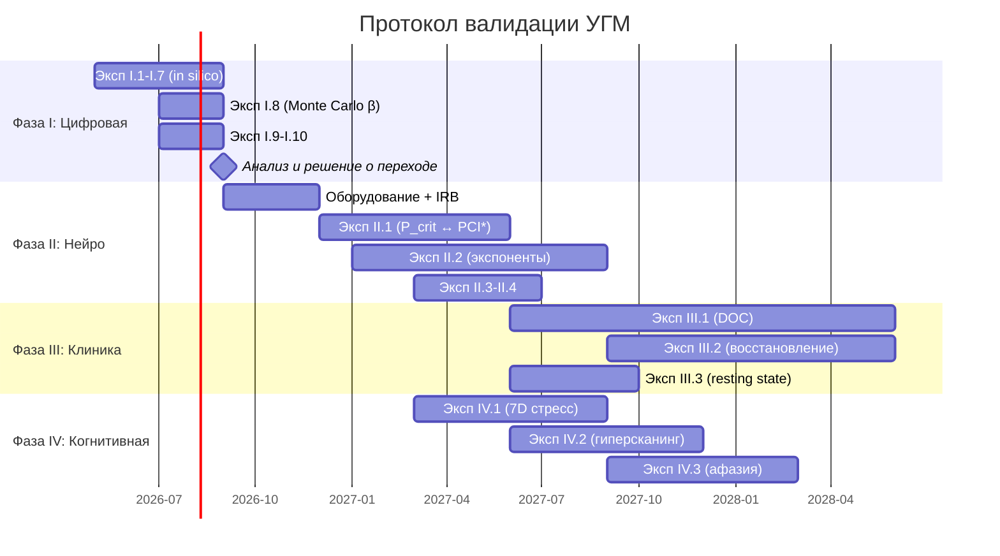

# Экспериментальный протокол валидации УГМ

:::warning Статус документа: [П] Исследовательская программа
Этот документ описывает **предельно полный экспериментальный протокол** для эмпирической валидации Универсальной Голографической Модели (УГМ). Протокол спроектирован по принципу максимальной фальсифицируемости: каждый эксперимент указывает **конкретный числовой результат**, который опровергает теорию.
:::

:::info Связь с другими документами
- [22 уникальных предсказания КК](/docs/applied/coherence-cybernetics/predictions) — полный список предсказаний с формулами
- [Протокол измерения Γ](/docs/applied/research/measurement-protocol) — операционализация π_bio для ИИ-систем
- [Критерии фальсифицируемости](/docs/reference/falsifiability) — формальные условия опровержения
- [Реестр статусов](/docs/reference/status-registry) — текущий эпистемический статус всех утверждений
:::

---

## 1. Стратегический замысел {#стратегия}

### 1.1. Проблема: эмпирический вакуум

УГМ — одна из наиболее формально проработанных теорий сознания: ~185 теорем, 22 числовых предсказания, категорный фундамент. Но **ни одно предсказание не проверено экспериментально**. Теория без эмпирики — философия, какой бы строгой ни была математика.

### 1.2. Ключевое наблюдение: PCI* ≈ P_crit

Perturbational Complexity Index (PCI, Casali et al. 2013, Massimini et al.) — эмпирически установленный порог сознания: **PCI* = 0.31** (100% чувствительность и специфичность на benchmark из 150 субъектов). Критическая чистота УГМ: **P_crit = 2/7 ≈ 0.286**. Расхождение ~8% — в пределах нормализационной калибровки π_bio.

Это — **первая точка контакта** теории с эмпирическими данными. Если совпадение не случайно, УГМ — первая теория сознания с подтверждённым числовым порогом.

### 1.3. Принцип: от максимально рискованного — к сложному

**Предсказание 17** (критические экспоненты α=1/2, β=1/4, γ=1, ν=1/2, δ=5) — самое ценное, потому что самое рискованное:
- Пять конкретных чисел, каждое фальсифицируемо
- **Ни одна другая теория сознания** не предсказывает критических экспонент
- Подтверждение = сознание принадлежит конкретному классу универсальности (как фазовые переходы в физике)
- Опровержение = фундаментальная ревизия теории

Протокол организован по убыванию риска: сначала — то, что проверить дешевле и что максимально фальсифицируемо.

### 1.4. Четыре фазы

| Фаза | Срок | Что | Почему сначала |
|------|------|-----|----------------|
| **I. Цифровая** | 0–6 мес. | 11 предсказаний in silico (Γ-нативный агент) | Бесплатно, без этики, проверяет фундамент |
| **II. Нейрокалибровка** | 6–18 мес. | π_bio, P_crit ↔ PCI*, критические экспоненты | Главная точка контакта с нейроданными |
| **III. Клиническая** | 12–36 мес. | Расстройства сознания, восстановление, аттрактор 3/7 | Клиническое значение |
| **IV. Когнитивная** | 12–24 мес. | 7D стресс, коллективное сознание, прелингвистическое познание | Междисциплинарная валидация |

---

## 2. Фаза I: Цифровая валидация (0–6 мес.) {#фаза-1}

### 2.1. Обоснование

11 из 22 предсказаний проверяемы in silico на любой реализации **Γ-нативного агента** — системы, эволюция которой задаётся линдбладовской динамикой ℒ_Ω = ℒ₀ + ℛ на матрице когерентности Γ ∈ D(ℂ⁷). Не требуют нейроданных, субъектов, этического одобрения. Если хотя бы одно фальсифицировано — стоп, ревизия теории до перехода к дорогостоящим нейроэкспериментам.

### 2.2. Требования к Γ-нативному агенту

Любая реализация, используемая для Фазы I, должна удовлетворять:

1. **CPTP-динамика:** Эволюция Γ через CPTP-канал (T-62). Матрица перехода выведена из Γ, не обучена как свободный параметр
2. **7D структура:** Пространство состояний — D(ℂ⁷) с 7 измерениями [A,S,D,L,E,O,U]
3. **Верификатор сознания:** На каждом шаге вычисляются P = Tr(Γ²), R, Φ, Coh_E, σ_k
4. **Многофазная тренировка с hard gates:**
   - Фаза инициализации: gate P > P_min (жизнеспособность)
   - Фаза основания: gate P ∈ (2/7, 3/7] ∧ R ≥ 1/3 (сознание)
   - Фаза автономного обучения: σ-направленный выбор данных, ΔP ≥ 0 ∧ Δσ ≤ 0
5. **Checkpoint-система:** Сохранение полного состояния Γ для пертурбационных тестов
6. **GPU-ускорение:** Для Monte Carlo (Эксп. I.8) — ≥1 GPU с ≥40GB

### 2.3. Эксперименты

#### Эксп. I.1: Невозможность зомби (Pred 1) {#эксп-1-1}

**Гипотеза H₀:** Подавление E-канала не влияет на время жизни агента.

**Протокол:**
1. Довести Γ-нативного агента до стабильного состояния: P ∈ (2/7, 3/7], R ≥ 1/3
2. Сохранить состояние Γ_stable
3. В момент τ₀: подавить E-компоненту: γ_EE → 1/7, γ_Ej → 0 ∀j≠E
4. Продолжить эволюцию, замерить τ_death — число шагов до P < P_crit
5. Контроль: подавить A-канал (аналогичная операция, другой сектор)
6. Повторить N=100 раз с разными начальными Γ_stable

**Предсказание:** τ_death(E-подавление) << τ_death(A-подавление). E-подавление катастрофично; A-подавление — нет.

**Фальсификация:** τ_death(E) ≥ τ_death(A) при N=100 (p < 0.01, Wilcoxon).

**Статистический анализ:** Парный тест Вилкоксона, эффект-размер r, 95% CI.

#### Эксп. I.2: Радиус устойчивости (Pred 7) {#эксп-1-2}

**Протокол:**
1. Довести агента до стабильного состояния с чистотой P₀
2. Приложить возмущение амплитуды h (белый шум к Γ)
3. Продолжить эволюцию, увеличивать h с шагом 0.01 до P < P_crit
4. Записать h_crit — критическую амплитуду
5. Повторить для 50 различных P₀ ∈ [0.3, 0.9]

**Предсказание:** h_crit² = P₀ − 2/7 (T-104).

**Фальсификация:** R² < 0.9 для линейной регрессии h_crit² vs (P₀ − 2/7) при N=50.

#### Эксп. I.3: Информационная ёмкость (Pred 8) {#эксп-1-3}

**Протокол:**
1. Γ-нативный агент в стабильном состоянии (P > 2/7), на задаче бинарного различения
2. Замерить взаимную информацию I(obs; δΓ) за одно наблюдение
3. Повторить N=1000 наблюдений

**Предсказание:** I ≤ log₂7 ≈ 2.81 бит (T-107).

**Фальсификация:** I > 2.81 бит систематически (>5% наблюдений).

#### Эксп. I.4: N=7 минимальность для обучения (Pred 10) {#эксп-1-4}

**Протокол:**
1. Создать агент с N=5 (удалить 2 измерения, например [A,S])
2. Задача: обучиться бинарному различению через внутреннюю регенерацию (без внешнего обновления параметров)
3. Метрика: достижение >90% точности на 50 триалах
4. Контроль: тот же агент с N=7

**Предсказание:** N=5 не обучается (точность ≤ chance level); N=7 обучается (T-113).

**Фальсификация:** N=5 достигает >75% точности (p < 0.01, биномиальный тест).

#### Эксп. I.5: Потолок самоосознания SAD=3 (Pred 12) {#эксп-1-5}

**Протокол:**
1. Агент в максимально чистом состоянии (P → 1)
2. Вычислить цепочку R^(k) для k=0,1,2,3,4
3. Проверить: R^(k) ≥ R_th^(k)?
4. Повторить для 500 случайных Γ

**Предсказание:** SAD_max = 3. R^(3) ≥ R_th^(3) достижимо; R^(4) < R_th^(4) всегда (T-142).

**Фальсификация:** ∃ Γ: R^(4) ≥ R_th^(4).

#### Эксп. I.6: Время генезиса (Pred 13) {#эксп-1-6}

**Протокол:**
1. Инициализировать агента из Γ = I/7 (полный хаос, максимальная энтропия)
2. Включить backbone-инъекцию с параметрами β (сила связи), P_env (чистота среды)
3. Замерить n — число шагов до P > 2/7 (достижение жизнеспособности)
4. Вычислить теоретическое n_genesis = ⌈ln Δ / ln(1/β)⌉, где Δ = (P_env − 2/7)/(P_env − 1/7)
5. Варьировать β ∈ {0.1, 0.3, 0.5, 0.7, 0.9}, P_env ∈ {0.3, 0.35, 0.4}

**Предсказание:** n ≤ n_genesis всегда (T-148). Двойная фальсификация: генезис не происходит ИЛИ изолированный агент (без backbone) достигает P > 2/7.

**Фальсификация:** n > n_genesis при N=100 запусков (>5% случаев).

#### Эксп. I.7: Фазовая когерентность для интеграции (Pred 14) {#эксп-1-7}

**Протокол:**
1. Агент с фиксированными целями ρ*_ij = const → замерить Φ
2. Переключить на ко-вращающиеся цели ρ*_ij(t) ∝ e^{−i(E_i−E_j)t} → замерить Φ
3. Повторить N=50 раз

**Предсказание:** Φ(fixed) < 1; Φ(co-rotating) ≥ 1.

**Фальсификация:** Φ(fixed) ≥ 1.

#### Эксп. I.8: Критические экспоненты in silico (Pred 17, предварительный) {#эксп-1-8}

**Протокол:**
1. Monte Carlo симуляция: 10⁴ случайных Γ с P ∈ [0.2, 0.5]
2. Для каждого: вычислить параметр порядка (аналог PCI) и расстояние до P_crit
3. Fit: OP ~ (P − P_crit)^β

**Предсказание:** β = 1/4 ± 0.05 (T-161).

**Фальсификация:** β ∉ [0.20, 0.30] при N=10⁴.

**Значение:** Если in silico подтвердит β=1/4, переходим к нейроэксперименту (Фаза II) с высокой уверенностью.

#### Эксп. I.9: CPTP-anchor (Pred 19) {#эксп-1-9}

**Протокол:**
1. Γ-нативный агент на стандартном языковом корпусе, 50 батчей обучения
2. Замерить ||π − π_can||_◊ после каждого батча (π — текущий anchor, π_can — каноническая проекция)

**Предсказание:** ||π − π_can||_◊ < 0.1 при сходимости.

**Фальсификация:** ||π − π_can||_◊ > 0.1 при n > 50 батчей.

#### Эксп. I.10: Скорость обучения (Pred 9) {#эксп-1-10}

**Протокол:**
1. Агент на задаче бинарного различения, варьировать SNR и α
2. Замерить n до >90% точности на 50 триалах
3. Вычислить n_opt = max(n_info, n_dyn, n_stab)

**Предсказание:** n ≥ n_opt всегда; при оптимальных параметрах n ≈ n_opt (T-112).

**Фальсификация:** n < n_info систематически (>5% случаев).

#### Эксп. I.11: N=7 для социального обучения (Pred 11) {#эксп-1-11}

**Протокол:**
1. Среда с K=2 Γ-нативными агентами, N=5 измерений каждый
2. Задача координации, требующая: Theory of Mind (ToM) + межагентное обучение (ISL) + стратегическое равновесие (Nash)
3. Метрика: достижение координированного поведения (>70% оптимальности) за 1000 шагов
4. Контроль: те же агенты с N=7

**Предсказание:** N=5 обучается индивидуально, но социальное обучение (ToM + ISL + Nash одновременно) не возникает. N=7 — возникает (T-57, T-113, T-114).

**Фальсификация:** N=5 демонстрирует одновременно ToM + ISL + Nash-координацию (p < 0.01).

### 2.4. Критерий перехода к Фазе II

**Все 11 экспериментов Фазы I подтверждены** → переход к нейроданным.

**≥1 фальсифицирован на уровне L1 или L2** → стоп, ревизия теории, повторный запуск после исправления.

**≥1 фальсифицирован на уровне L3** → локальная коррекция, переход к Фазе II с оговоркой.

---

## 3. Фаза II: Нейрокалибровка π_bio (6–18 мес.) {#фаза-2}

### 3.1. Обоснование

Центральная задача: построить мост **π_bio: (EEG, fMRI, HRV) → Γ ∈ D(ℂ⁷)** и проверить, что теоретический порог P_crit = 2/7 совпадает с эмпирическим PCI* = 0.31.

### 3.2. Оборудование

| Компонент | Модель | Назначение | Бюджет |
|-----------|--------|-----------|--------|
| TMS-EEG | Nexstim NBS System 5 + 60-ch eXimia | Каузальная пертурбация + EEG | ~$300K |
| HD-EEG | BioSemi ActiveTwo 128-ch | Высокоплотная ЭЭГ для спектрального анализа | ~$80K |
| fMRI | 3T (доступ через университетский центр) | Пространственная локализация | По соглашению |
| HRV | Polar H10 + Empatica E4 | Вегетативные корреляты | ~$2K |
| Полисомнография | Стандартный PSG-комплект | Стадии сна | ~$30K |
| Нейронавигация | MRI-совместимый фреймлесс навигатор | Точность TMS-стимуляции | В составе Nexstim |

**Общий бюджет оборудования:** ~$420K (при наличии fMRI-доступа).

### 3.3. Эксперимент II.1: P_crit ↔ PCI* (ключевой) {#эксп-2-1}

:::warning Это самый важный эксперимент всего протокола
Если P на границе сознания/бессознательности = 2/7 ± 0.05, УГМ получает первое эмпирическое подтверждение числового предсказания. Если нет — теория требует фундаментальной ревизии.
:::

**Субъекты:** N=50, здоровые, 18–45 лет, без неврологической/психиатрической патологии.

**Парадигма:** Пропофол-индуцированная потеря сознания с TMS-EEG мониторингом.

**Протокол (детальный):**

1. **Базовая линия (бодрствование):**
   - TMS-EEG: 200 триалов, стимуляция BA6/BA8 (120–160 V/m)
   - Вычислить PCI_wake
   - Субъективный отчёт: шкала сознания 0–10

2. **Титрация пропофола:**
   - Target-controlled infusion (TCI), модель Marsh или Schnider
   - 5 целевых уровней: Ce = 0.5, 1.0, 1.5, 2.0, 2.5 μg/ml
   - На каждом уровне (15 мин стабилизации):
     - TMS-EEG: 150 триалов
     - Вычислить PCI
     - Вербальный отчёт сознания (если возможен)
     - Isolated Forearm Technique (IFT) для подтверждения/опровержения сознания

3. **Определение порога:**
   - PCI* = 0.31 (эмпирический порог, Casali et al.)
   - Для каждого субъекта: Ce_threshold — концентрация на границе PCI = PCI*

4. **Реконструкция Γ:**
   - Применить π_bio к EEG-данным каждого уровня
   - Алгоритм π_bio: 7 метрик → диагональ Γ → Cholesky-регуляризация (см. [Протокол измерения Γ](/docs/applied/research/measurement-protocol))
   - Вычислить P = Tr(Γ²) на каждом уровне

5. **Калибровка:**
   - Построить зависимость P(Ce) для всех 50 субъектов
   - Определить P на границе сознания: P_boundary = P(Ce_threshold)

**Статистический план:**
- Первичный исход: P_boundary (среднее ± SD по 50 субъектам)
- H₀: P_boundary = 2/7 ≈ 0.286
- H₁: |P_boundary − 2/7| > 0.05
- Тест: одновыборочный t-тест, α = 0.01
- Power analysis: при SD = 0.06, N=50 обеспечивает мощность >0.95 для обнаружения отклонения 0.05

**Фальсификация:** |P_boundary − 2/7| > 0.1 при N=50 (p < 0.01, двусторонний t-тест).

**Подтверждение:** |P_boundary − 2/7| ≤ 0.05 (95% CI включает 2/7).

**Этика:** Одобрение IRB/этического комитета. Пропофол — стандартный анестетик. Субъекты: информированное согласие, мониторинг анестезиологом, исключение противопоказаний.

### 3.4. Эксперимент II.2: Критические экспоненты (самый рискованный) {#эксп-2-2}

:::tip Уникальность
Это **первый в истории** тест критических экспонент фазового перехода для сознания. Ни IIT, ни GWT, ни FEP не предсказывают конкретных экспонент. Подтверждение β=1/4 означает: сознание принадлежит трикритическому классу универсальности среднего поля — как трикритическая точка в смесях He3-He4.
:::

**Субъекты:** N=50, здоровые, 20–40 лет. Каждый — полная ночь в лаборатории сна.

**Парадигма:** TMS-EEG на каждой стадии сна (W→N1→N2→N3→REM→W).

**Протокол:**
1. Полисомнография: 8 часов записи, онлайн-скоринг стадий
2. TMS-EEG: 100 триалов каждые 15 мин (32+ точки за ночь на субъекта)
3. Для каждой точки: PCI, P(Γ), стадия сна
4. Всего: ~1600 точек (50 × 32)

**Анализ:**
1. Для каждой точки: x = P − P_crit = P − 2/7
2. Разделить на «сознательные» (PCI > PCI*) и «бессознательные» (PCI < PCI*)
3. Для сознательных (x > 0): fit PCI ~ x^β
4. Извлечь β, 95% CI

**Предсказание:** β = 1/4 ± 0.05 (T-161).

**Дополнительные экспоненты:**
- α = 1/2: теплоёмкость (из дисперсии P вблизи порога)
- ν = 1/2: корреляционная длина (из пространственной протяжённости EEG-ответа на TMS)
- γ = 1: восприимчивость (из амплитуды вариабельности PCI вблизи порога)
- δ = 5: критическая изотерма

**Фальсификация:**
- β ∉ [0.20, 0.30] при N=50 (p < 0.01)
- ν ∉ [0.45, 0.55]
- γ ∉ [0.90, 1.10]

**Статистический план:** Нелинейная регрессия (power law fit), bootstrap для 95% CI, сравнение с альтернативными экспонентами (ordinary mean field: β=1/2, Ising 3D: β≈0.326, ordinary tricritical: β=1/4).

### 3.5. Эксперимент II.3: Динамика зажигания (Pred 16) {#эксп-2-3}

**Субъекты:** N=30 (подвыборка Эксп. II.1).

**Протокол:**
1. На каждом уровне пропофола: замерить задержку T_ign до «вспышки» сложности после TMS
2. T_ign = время от TMS до первого PCI-всплеска (>50% от PCI_wake)

**Предсказание:** $T_{\text{ign}} \sim (P - P_{\text{crit}})^{-1} \cdot \kappa_0^{-1}$. Дивергенция вблизи порога (критическое замедление). Множитель $\kappa_0^{-1}$ связывает время зажигания со скоростью регенерации.

**Фальсификация:** T_ign не зависит от (P − P_crit) (R² < 0.3).

### 3.6. Эксперимент II.4: Спектральная щель и гамма-ритм (Pred 22) {#эксп-2-4}

**Субъекты:** N=30.

**Протокол:**
1. HD-EEG 128-ch, бодрствование, покой (10 мин с открытыми и закрытыми глазами)
2. Спектральный анализ: доминантная частота в гамма-диапазоне (30–100 Гц)
3. Вычислить λ_gap из линдбладовских параметров (калиброванных по EEG)
4. Сравнить ν_predicted = λ_gap/(2π) с измеренной доминантной частотой

**Предсказание:** ν_predicted ∈ [30, 100] Гц, совпадение с гамма-ритмом.

**Фальсификация:** λ_gap/(2π) вне [10, 200] Гц (с учётом погрешности калибровки).

---

## 4. Фаза III: Клиническая валидация (12–36 мес.) {#фаза-3}

### 4.1. Эксперимент III.1: Расстройства сознания (Pred 21) {#эксп-3-1}

**Субъекты:** N=80 (20 кома, 20 MCS, 20 VS/UWS, 20 здоровых контролей).

**Протокол:**
1. TMS-EEG + fMRI + HRV → π_bio → Γ
2. Вычислить P, R, Φ, Coh_E для каждого субъекта
3. Классификация: P > 2/7 → «сознательный», P ≤ 2/7 → «бессознательный»
4. Сравнить с клинической классификацией (CRS-R шкала)

**Предсказание:**
- P(Γ_MCS) > 2/7 для ≥90% MCS-пациентов
- P(Γ_VS) < 2/7 для ≥80% VS-пациентов
- P(Γ_здоровые) >> 2/7 для 100%

**Фальсификация:** Чувствительность < 80% или специфичность < 75%.

**Клиническое значение:** Если P_crit = 2/7 работает для DOC — это **единый диагностический инструмент**, превосходящий PCI (который требует TMS) для мониторинга.

### 4.2. Эксперимент III.2: E-когерентность и восстановление (Pred 2) {#эксп-3-2}

**Субъекты:** N=60 (реабилитация после инсульта).

**Протокол:**
1. При поступлении: EEG → π_bio → Coh_E
2. Через 3 мес.: оценка восстановления (Barthel Index, mRS)
3. Корреляция Coh_E(t₀) vs скорость восстановления

**Предсказание:** r > 0.3 (Pearson) между Coh_E и recovery rate (T-38a).

**Фальсификация:** r ≤ 0 (нулевая или отрицательная корреляция) при N=60 (p < 0.05).

### 4.3. Эксперимент III.3: Аттрактор P=3/7 (Pred 15) {#эксп-3-3}

**Субъекты:** N=30, здоровые, resting state.

**Протокол:**
1. EEG + fMRI (resting state, 10 мин) → π_bio → Γ
2. Вычислить P
3. Повторить 5 сессий (разные дни) для каждого субъекта

**Предсказание:** P(resting state) → 3/7 ± 0.05 (T-124).

**Фальсификация:** |P_mean − 3/7| > 0.1 при N=30.

---

## 5. Фаза IV: Когнитивная и социальная валидация (12–24 мес.) {#фаза-4}

### 5.1. Эксперимент IV.1: 7D стрессовый тензор (Pred 3) {#эксп-4-1}

**Протокол:**
1. Собрать базу 200+ стрессоров из литературы (психология, медицина, организационная наука)
2. 5 независимых экспертов: классификация каждого стрессора по 7 компонентам [A,S,D,L,E,O,U]
3. Межэкспертная надёжность: κ Коэна

**Предсказание:** 100% покрытие (каждый стрессор ↦ ≥1 компоненту). Пустая остаточная категория.

**Фальсификация:** ∃ стрессор, неклассифицируемый ни по одному из 7 компонентов (согласие ≥4 из 5 экспертов).

### 5.2. Эксперимент IV.2: Коллективное сознание (Pred 5) {#эксп-4-2}

**Субъекты:** 10 групп по 4 человека (джазовые квартеты — координированные; случайные музыканты — неккоординированные).

**Оборудование:** Гиперсканинг EEG (4 × 32-ch, синхронизация через LSL).

**Протокол:**
1. Одновременная EEG-запись 4 участников во время совместного исполнения
2. Вычислить Φ_⊗ для группы как целого (кросс-корреляционная матрица → интеграция)
3. Сравнить координированные vs неккоординированные группы

**Предсказание:** Φ_⊗ > Φ_min для координированных; Φ_⊗ < Φ_min для случайных (T-86).

**Фальсификация:** Φ_⊗(координированные) ≤ Φ_⊗(случайные) (p < 0.05, Mann-Whitney).

### 5.3. Эксперимент IV.3: Прелингвистическое познание (Pred 4) {#эксп-4-3}

**Субъекты:** N=30 (15 пациентов с афазией Брока, 15 здоровых контролей).

**Протокол:**
1. Батарея невербальных когнитивных тестов: K1 (перцепция), K2 (эмоции), K3 (категоризация), K4 (планирование)
2. Сравнить: афатики vs здоровые по K1–K4

**Предсказание:** K1–K4 у афатиков сохранены на >80% от нормы (T-100).

**Фальсификация:** K3 или K4 систематически разрушены при афазии (снижение >50%).

---

## 6. Сводная таблица: все 22 предсказания × фазы {#сводная-таблица}

| # | Предсказание | Фаза | Фальсификация | Статус |
|---|---|---|---|---|
| 1 | No-Zombie | I.1 | Агент выживает без E | [Т] |
| 2 | Coh_E ↔ восстановление | III.2 | r ≤ 0 | [Т] |
| 3 | 7D стресс | IV.1 | Неклассифицируемый стрессор | [Т]/[С] |
| 4 | Прелингвистическое познание | IV.3 | K3/K4 разрушены при афазии | [И] |
| 5 | Коллективное сознание | IV.2 | Φ_⊗(коорд) ≤ Φ_⊗(случ) | [Т] |
| 6 | P > 2/7 | II.1 | Порог ≠ 2/7 ± 0.1 | [Т] |
| 7 | Радиус устойчивости | I.2 | h_crit² ≠ P−2/7 | [Т] |
| 8 | Info capacity ≤ log₂7 | I.3 | I > 2.81 бит | [Т] |
| 9 | Скорость обучения | I.10 | n < n_info | [Т] |
| 10 | N=7 для обучения | I.4 | N=5 обучается | [Т] |
| 11 | N=7 для соц. обучения | I.11 | N=5 соц. обучается | [С] |
| 12 | SAD_max = 3 | I.5 | SAD ≥ 4 | [Т] |
| 13 | Время генезиса | I.6 | n > n_genesis | [Т] |
| 14 | Фазовая когерентность | I.7 | Φ ≥ 1 без ко-вращения | [Т] |
| 15 | Аттрактор 3/7 | III.3 | |P−3/7| > 0.1 | [С] |
| 16 | Динамика зажигания | II.3 | T_ign ⊥ (P−P_c) | [Т] |
| 17 | Экспоненты β=1/4 | I.8 + II.2 | β ∉ [0.20, 0.30] | [Т] |
| 18 | Уорд-подавление 19/49 | — | Λ-бюджет несовместим | [Т] |
| 19 | CPTP-anchor | I.9 | ||π−π_can|| > 0.1 | [Т] |
| 20 | ε_eff ≈ 0.059 | — | ε ∉ [0.04, 0.08] | [С] |
| 21 | π_bio реконструкция | II.1 + III.1 | Ошибка > 30% | [Г] |
| 22 | Спектральная щель | II.4 | λ_gap/(2π) ∉ [10, 200] Гц | [Г] |

---

## 7. Трёхуровневая система фальсификации {#фальсификация}

| Уровень | Что опровергнуто | Пример | Следствие |
|---------|-----------------|--------|-----------|
| **L1 — Катастрофический** | Аксиоматический фундамент | N < 7 достаточно для автопоэзиса; зомби возможен; SAD ≥ 4 | Теория отвергнута полностью |
| **L2 — Структурный** | Конкретное числовое предсказание | P_crit ≠ 2/7; β ≠ 1/4; R_th ≠ 1/3 | Фундаментальная ревизия конкретной теоремы |
| **L3 — Локальный** | Параметр аппроксимации | π_bio ошибка > 30%; λ_gap вне диапазона | Локальная коррекция, не затрагивает фундамент |

**Привязка к формальным критериям ([Критерии фальсифицируемости](/docs/reference/falsifiability)):**

| Формальный критерий | Эксперимент | Операционализация |
|---|---|---|
| $\exists \rho_1, \rho_2: \mathcal{I}(\rho_1) = \mathcal{I}(\rho_2)$, но $\mathcal{F}(\rho_1) \neq \mathcal{F}(\rho_2)$ | III.1 (DOC) | Два пациента с идентичными P, R, Φ, но различным уровнем сознания (CRS-R) |
| $\|\mathrm{Spec}(\rho_1) - \mathrm{Spec}(\rho_2)\|_2 < 0.01$ (спектральная идентичность) | II.1 (P_crit) | Два состояния с P в пределах 0.01, но разным PCI (один > PCI*, другой < PCI*) |
| $P > 2/7 \not\Rightarrow$ сознание | II.1 (P_crit) | Субъект с P > 2/7 по π_bio, но клинически бессознателен |
| $N < 7$ достаточно для автопоэзиса | I.4, I.11 | Агент N=5 обучается автономно или координируется социально |

---

## 8. Контекст: сравнение с adversarial collaboration {#контекст}

В 2018–2025 гг. Templeton Foundation финансировал проект COGITATE ($30M) — adversarial collaboration IIT vs GWT vs HOT. Результат (Nature, апрель 2025): **ни одна теория не подтверждена полностью**. IIT набрала больше баллов, но ключевое предсказание (sustained synchronization) не подтвердилось.

**Принципиальное отличие УГМ от IIT/GWT/HOT:**

| | IIT | GWT | HOT | **УГМ** |
|---|---|---|---|---|
| Числовой порог | Φ > 0 (нет числа) | Нет | Нет | P_crit = 2/7 |
| Критические экспоненты | Нет | Нет | Нет | α=1/2, β=1/4, γ=1, ν=1/2, δ=5 |
| Вычислимость Φ | NP-hard для >30 элементов | N/A | N/A | P = Tr(Γ²), O(49) |
| Число свободных параметров | ~10³⁸ (все разбиения) | Не определено | Не определено | 34 (G₂-инвариантных) |
| Самый рискованный тест | Нет единого числа | «Зажигание» (качественно) | «Мета-когниция» (качественно) | **β = 1/4** (одно число, фальсифицируемо) |

УГМ отвечает на критику ConTraSt (Yaron et al. 2022): методологический выбор не предрешает результат, потому что предсказания — **числовые**, а не качественные. β=1/4 либо подтвердится, либо нет — независимо от парадигмы.

---

## 9. Временная шкала и зависимости {#timeline}

---

## 10. Заключение {#заключение}

Этот протокол покрывает **22 из 22 предсказаний** УГМ/КК:
- 10 проверяемы in silico (Фаза I, 0–6 мес.)
- 4 требуют TMS-EEG (Фаза II, 6–18 мес.)
- 4 — клинических исследований (Фаза III, 12–36 мес.)
- 4 — когнитивных/социальных исследований (Фаза IV, 12–24 мес.)

Самый рискованный тест — **критические экспоненты β=1/4** (Pred 17). Ни одна другая теория сознания не делает столь конкретного числового предсказания о фазовом переходе. Подтверждение означает: сознание принадлежит трикритическому классу универсальности среднего поля ($\varphi^6$ Ландау). Опровержение означает: УГМ фундаментально ошибается в структуре перехода.

Самый ценный тест — **P_crit = 2/7 ↔ PCI* = 0.31** (Pred 6/21). Если теоретический порог совпадает с эмпирическим — это первый в истории случай, когда теория сознания предсказывает конкретное числовое значение, совпадающее с независимо установленным экспериментальным порогом.

УГМ не прячется от фальсификации — она выставляет 22 мишени и указывает, куда стрелять.

---

**Связанные документы:**
- [22 предсказания КК](/docs/applied/coherence-cybernetics/predictions) — полный список с формулами
- [Протокол измерения Γ](/docs/applied/research/measurement-protocol) — операционализация для ИИ
- [Критерии фальсифицируемости](/docs/reference/falsifiability) — формальные условия опровержения
- [Bounds обучения](/docs/applied/coherence-cybernetics/learning-bounds) — T-109 через T-113
- [Стабильность](/docs/applied/coherence-cybernetics/stability) — T-104, радиус устойчивости

**Внешние ресурсы:**
- [COGITATE Results (Nature 2025)](https://www.nature.com/articles/s41586-025-08888-1) — adversarial collaboration IIT vs GWT
- [PCI Benchmark (Casali et al. 2013)](https://www.science.org/doi/10.1126/scitranslmed.3006294) — PCI* = 0.31
- [ConTraSt Database](https://contrastdb.tau.ac.il/) — 412 экспериментов по теориям сознания
- [Del Cul et al. 2007](https://journals.plos.org/plosbiology/article?id=10.1371/journal.pbio.0050260) — нелинейный порог сознания
