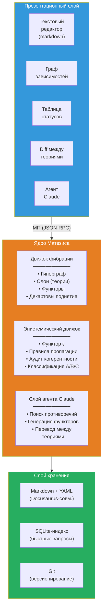
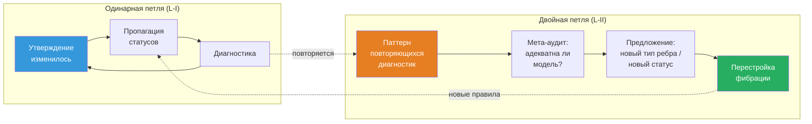

# Матезис: ∞-топос формальных теорий

:::info Для кого этот документ
Для исследователей, работающих со сложными теоретическими конструкциями — физиков, нейробиологов, философов сознания, специалистов по AGI. Документ описывает проект **Матезис** — вычислительную реализацию ∞-топоса формальных теорий, которая делает работу с теориями (навигацию, сравнение, верификацию когерентности и межтеоретический перевод) машинно-поддерживаемой. Математический фундамент — ∞-топос пучков на сайте теорий $\mathfrak{M} = \mathrm{Sh}_\infty(\mathbf{Th}, J_{\text{ep}})$; содержательная основа — формализм КК; программная архитектура — Ядро Матезиса с LLM-агентом.
:::

---

## 0. От «среды» к математическому объекту {#введение}

Этот документ описывает проект, ранее известный как *Theory IDE*. Переименование — не косметическое. Оно отражает **фундаментальный концептуальный сдвиг**: от программного инструмента, использующего теорию категорий, к **математическому объекту**, имеющему вычислительную реализацию.

### Mathesis Universalis

В 1666 году Готфрид Лейбниц в *Dissertatio de arte combinatoria* выдвинул проект **Mathesis Universalis** — универсальной науки о формальном рассуждении. Проект состоял из двух частей:

- **Characteristica universalis** — универсальный формальный язык, способный выразить любое знание
- **Calculus ratiocinator** — механический вычислитель, оперирующий внутри этого языка

Три с половиной века спустя оба компонента получают точную математическую реализацию:

| Лейбниц (1666) | Матезис (2026) |
|---|---|
| Characteristica universalis | $\mathfrak{M} = \mathrm{Sh}_\infty(\mathbf{Th},\; J_{\text{ep}})$ — ∞-топос пучков на сайте теорий |
| Calculus ratiocinator | LLM-агент, оперирующий внутри внутренней логики $\mathfrak{M}$ |

Лейбниц не мог реализовать свой проект: ему не хватало (1) теории категорий (Eilenberg–Mac Lane, 1945), (2) ∞-категорий (Joyal, Lurie, 2009), (3) вычислительных моделей языка (LLM, 2020-е). УГМ не «подтверждает» Лейбница — она **предоставляет формализм**, которого ему не хватало.

### Ключевой тезис

**Матезис — не программа, использующая математику. Матезис ЯВЛЯЕТСЯ математическим объектом — ∞-топосом — у которого есть вычислительная аппроксимация.**

Программный код (Verum) — конечная аппроксимация бесконечного объекта $\mathfrak{M}$, подобно тому как численное решение дифференциального уравнения аппроксимирует непрерывную динамику. Аппроксимация может улучшаться; $\mathfrak{M}$ остаётся неизменным.

### Структура документа

Документ следует единой логической цепочке:

1. **Проблема** (§1): когнитивный предел — ни один человек не удерживает 325+ теорий одновременно
2. **Обоснование** (§1½): почему ∞-категории — единственный адекватный аппарат (T-182, когезивные модальности)
3. **Фундамент** (§2): конструкция ∞-топоса $\mathfrak{M}$ — сайт теорий, вложение Йонеды, расширения Кана, условие спуска, классификатор подобъектов
4. **Генерализации** (§3): три направления выхода за 1-категорную аппроксимацию — HoTT, квантовая логика, автопоэзис
5. **Реализация** (§4–§6): архитектура, движки, агент — как $\mathfrak{M}$ аппроксимируется вычислительно
6. **Глубинные принципы** (§7–§10): самореференция, процессная онтология, рефлексивные циклы — что делает Матезис живым, а не статичным
7. **Следствия** (§11–§12): когнитивное расширение и примеры использования
8. **Путь к реализации** (§13–§15): план, сравнение, Verum как язык предельной мощи

Каждый уровень строится на предыдущем и несводим к нему — в точном соответствии с теоремой T-182 ($\mathcal{T}_0 \subsetneq \mathcal{T}_1 \subsetneq \mathcal{T}_2$).

---

## 1. Проблема: когнитивный предел {#проблема}

### 1.1. Масштаб современной теории

Зрелая научная теория — объект, превышающий когнитивную ёмкость одного агента. Для примера: документация КК (Кибернетика Когерентности, прикладной слой УГМ) — это ~400 страниц, ~185 теорем с 7 эпистемическими статусами, 23+ фальсифицируемых предсказаний, 30+ сравнений с конкурирующими теориями, ~270 перекрёстных ссылок. Теория интегрированной информации (IIT 4.0) — сопоставимый объём с собственным формализмом ($\Phi$, Q-shape, постулаты). Когнитом Анохина — качественная теория с 80-летним экспериментальным бэкграундом. И таких теорий сознания — [более 325](https://www.consciousnessatlas.com/) (по каталогу Consciousness Atlas).

Ни один человек не способен удерживать в рабочей памяти одновременно:
- внутреннюю структуру даже одной теории (какие утверждения от каких зависят)
- эпистемический статус каждого утверждения (доказано / условно / гипотеза / опровергнуто)
- соответствия между теориями (что означает $\Phi$ Тонони в терминах УГМ? как FEP Фристона стыкуется с автопоэзисом? где когнитом Анохина противоречит GWT Баарса?)
- последствия изменений (если опровергнута аксиома X, какие теоремы падают?)

### 1.2. Конкретные инциденты

**Парадокс ρ* (сессия 25 работы с УГМ).** Обнаружено: самореференция в операторе регенерации ℛ — целевое состояние ρ* определялось как динамическая неподвижная точка, что приводило к обнулению ℛ. Исправление: переопределение ρ* = φ(Γ) (категориальная самомодель). Последствия: потребовалось обновить ~25 файлов, сменить статус теоремы T-68 с [Т] на [С], заменить «примитивность ℒ_Ω» на «примитивность ℒ₀» во всех вхождениях. Время: целая рабочая сессия на **механическую пропагацию** — работу, которую машина может выполнить за секунды.

**Сломанные якоря (сессия перевода).** При переводе документации на английский язык заголовки были переведены, но ~50 внутренних ссылок продолжали указывать на русские якоря. Обнаружение: только при сборке сайта. Исправление: ручной поиск в ~20 файлах. Это задача для автоматической проверки когерентности.

**Рассогласование статусов (аудит 2026-03-23).** Глубокий аудит обнаружил 9 критических и 14 серьёзных проблем: теоремы со статусом [Т], зависящие от гипотез [Г]; утверждения, противоречащие друг другу; устаревшие ссылки. Исправление: 85 точечных правок в 42 файлах за 8 сессий. Каждая из этих проблем обнаружима автоматически.

### 1.3. Текущие инструменты и их пределы

| Инструмент | Что делает | Чего не делает |
|------------|-----------|----------------|
| **Docusaurus** | Рендерит markdown в сайт, проверяет ссылки | Не знает о логических зависимостях между утверждениями |
| **grep / ripgrep** | Находит текст | Не знает о типах связей (зависимость ≠ упоминание) |
| **Git** | Версионирует файлы | Не знает о статусах теорем |
| **Obsidian** | Граф заметок с ссылками | Нетипированные связи, нет когерентности, нет межтеоретических мостов |
| **RAG + LLM** | Находит релевантный текст, генерирует ответ | Оперирует текстом, не структурой; не проверяет логику |
| **Claude Code** | Разработка кода, навигация по кодовой базе | Не знает о теоретической структуре содержимого файлов |

Ни один из этих инструментов не понимает, что файл содержит **теорему**, что теорема **зависит** от аксиомы, что аксиома имеет **статус**, и что изменение статуса аксиомы **должно пропагироваться** на все зависимые теоремы.

:::warning Категориальный диагноз: почему плоские инструменты принципиально недостаточны
Перечисленные инструменты — **0-категорные**: они оперируют множествами (файлов, строк, коммитов) без типизированных морфизмов. Но научное знание имеет **∞-категорную** структуру:
- **Объекты** (утверждения) связаны **морфизмами** (зависимостями) — уровень 1
- Морфизмы связаны **2-морфизмами** (сравнения переводов: «перевод IIT→УГМ совместим с переводом IIT→GWT→УГМ?») — уровень 2
- 2-морфизмы связаны **3-морфизмами** (мета-аудит: «адекватны ли наши правила сравнения?») — уровень 3
- ...и так далее для каждого рефлексивного цикла (§10)

Инструмент, работающий на уровне $n$, **не может обнаружить** проблемы уровня $n+1$ (аналог T-182: $\mathcal{T}_0 \subsetneq \mathcal{T}_1 \subsetneq \mathcal{T}_2$). Нужен инструмент, содержащий **все уровни** — ∞-категорный по конструкции.
:::

---

## 1½. Метаэпистемологическое обоснование {#метаэпистемология}

:::info Зачем нужен этот раздел
§1 описал **проблему** (когнитивный предел). §2 предложит **решение** (∞-топос теорий). Этот промежуточный раздел отвечает на вопрос мета-уровня: **почему именно это решение** — и почему альтернативы принципиально недостаточны.
:::

### 1½.1. Три уровня Ω как три уровня Матезиса

Теорема T-182 [Т] устанавливает, что три уровня классификатора подобъектов строго необходимы: $\mathcal{T}_0 \subsetneq \mathcal{T}_1 \subsetneq \mathcal{T}_2$. Эта структура **проецируется** на архитектуру Матезиса:

| Уровень $\Omega$ | Уровень Матезиса | Что формализует |
|-------------------|-------|-----------------|
| $\mathrm{Dec}(\Omega) \cong 2^7$ (булева) | **Движок фибрации**: типизированный гиперграф, типы утверждений и зависимостей | Статическая структура: «какие утверждения существуют и как связаны» |
| $\tau_{\leq 0}(\Omega)$ (Гейтинг) | **Эпистемический движок**: пороговые предикаты, пропагация статусов, аудит когерентности | Пороги и логика: «какие утверждения достоверны и где границы» |
| Полный $\Omega$ (∞-группоид) | **Рефлексивные циклы**: $T_{\text{meta}}$, двойная петля, мета-аудит | Динамика: «как система наблюдает и перестраивает себя» |

### 1½.2. Когезивные модальности как операции Матезиса

Теорема T-185 [Т] устанавливает 7 канонических модальностей дифференциально когезивного ∞-топоса. Шесть из них отображаются в фундаментальные операции:

| Модальность | Определение | Операция Матезиса |
|-------------|-------------|------------------|
| $\Pi$ (Shape) | Выделяет различимые компоненты | `theory/audit` — обнаружение различий и несогласованностей |
| $\flat$ (Flat) | Извлекает дискретные инварианты | `claim/dependencies` — скелет зависимостей (без динамики) |
| $\Im$ (Infinitesimal shape) | Улавливает бесконечно малое изменение | `claim/set_status` + пропагация — реакция на локальное изменение |
| $\sharp$ (Sharp) | Вычисляет логическое замыкание | `fibration/coherence` — транзитивная проверка всей фибрации |
| $\&$ (Infinitesimal flat) | Интернализует инфинитезимальную структуру | `meta/audit` — наблюдение собственной структуры |
| $\mathrm{Rh}$ (de Rham) | Интегрирует локальное в глобальное | `claim/translate` — декартово поднятие, межтеоретический синтез |

Это **не постфактум-подгонка**, а следствие структуры когезивного ∞-топоса: если Матезис оперирует пучками на сайте теорий, то его фундаментальные операции **необходимо** распадаются на когезивные и инфинитезимальные модальности (Schreiber 2013).

### 1½.3. Фундаментальное обоснование: почему ∞-категории — единственный адекватный аппарат

Работа со знанием о знании — это операция на **категории категорий** $\mathbf{Cat}$. Работа со знанием о знании о знании — на **∞-категории ∞-категорий** $\mathbf{Cat}_\infty$. Это не метафора, а точное утверждение:

| Операция | Математический объект | Уровень |
|----------|----------------------|---------|
| Формулировать утверждения внутри теории | Объекты и морфизмы в категории $\mathcal{C}$ | Объектный |
| Сравнивать теории | Функторы $F: \mathcal{C} \to \mathcal{D}$ | Мета |
| Проверять когерентность сравнений | Естественные преобразования $\alpha: F \Rightarrow G$ | Мета² |
| Переконфигурировать саму систему проверки | Модификации $\Theta: \alpha \Rrightarrow \beta$ (3-морфизмы) | Мета³ |
| ... | ... (∞-морфизмы) | Мета^n |

**Теорема Лурье (HTT, 1.1.2.2):** Категория $\mathbf{Cat}_\infty$ всех малых ∞-категорий сама является ∞-категорией. Следовательно, система, работающая с теориями, **живёт** в ∞-категории независимо от того, осознаём мы это или нет. ∞-топос — **единственная** математическая структура, содержащая все уровни с гарантированной когерентностью.

Альтернативы:
- **Графовые базы данных** (Neo4j) — 1-категория, нет 2-морфизмов
- **Реляционные базы** — даже не категория (нет композиции)
- **Obsidian / Roam** — нетипизированный граф
- **RAG + LLM** — оперирует текстом, не структурой

---

## 2. Математический фундамент: ∞-топос теорий {#фундамент}

### 2.1. От фибрации к ∞-топосу: преодоление структурного разрыва {#структурный-разрыв}

Предшествующая архитектура строила фундамент на **фибрации Гротендика** $p: \mathbf{E} \to \mathbf{B}$. Это корректно, но недостаточно. Фибрация — 1-категорная конструкция. Она формализует объекты (утверждения) и морфизмы (зависимости, переводы). Но не формализует:

- **2-морфизмы**: сравнения двух переводов между одной парой теорий
- **3-морфизмы**: мета-аудит сравнений
- **$n$-морфизмы** для произвольного $n$: рефлексивные циклы (§10)

Гиперграф (SQLite) и типизированные рёбра — **1-категориальная эмуляция** ∞-категориальной структуры. Они работают на уровнях 0 и 1, но теряют нативную когерентность начиная с уровня 2. Это не технический долг — это **структурный разрыв** между заявляемой ∞-категориальной онтологией и 1-категориальной реализацией.

**Решение:** начать с правильного объекта. Фибрация Гротендика — **следствие** конструкции ∞-топоса (straightening/unstraightening, HTT 3.2), а не основание.

### 2.2. Сайт теорий $(\mathbf{Th},\; J_{\text{ep}})$ {#сайт-теорий}

**Определение (сайт теорий).** Сайт $(\mathbf{Th},\; J_{\text{ep}})$ определяется следующими данными:

**Объекты.** Объект $T \in \mathbf{Th}$ — *теория*: по существу малая ∞-категория $\mathcal{C}_T$, снабжённая:
- выделенным подклассом объектов (*утверждения*)
- выделенным подклассом морфизмов (*зависимости*)
- эпистемическим функтором $\varepsilon_T: \mathcal{C}_T \to \mathbf{Status}$

Примеры: $T_{\text{УГМ}}$ (~185 теорем, 7 статусов, 5 аксиом), $T_{\text{IIT}}$ (5 постулатов, $\Phi$, Q-shape), $T_{\text{GWT}}$ (глобальное зажигание, доступ), $T_{\text{FEP}}$ (свободная энергия, марковское одеяло).

**Морфизмы.** Морфизм $f: T_1 \to T_2$ — *функтор интерпретации*: ∞-функтор $\mathcal{C}_{T_1} \to \mathcal{C}_{T_2}$, сохраняющий типы утверждений и совместимый с $\varepsilon$.

**2-морфизмы.** Естественное преобразование $\alpha: f \Rightarrow g$ — *сравнение переводов*: способ деформировать один перевод в другой с сохранением структуры.

**$n$-морфизмы** для $n \geq 3$ существуют автоматически по определению ∞-категории.

**Топология $J_{\text{ep}}$ (эпистемическая).** Семейство $\{f_i: T_i \to T\}_{i \in I}$ является $J_{\text{ep}}$-покрытием объекта $T$, если функторы $f_i$ **совместно верны** (jointly faithful): для любых двух различных утверждений $a, b \in T$ существует $i$ и утверждение $c \in T_i$ такие, что $f_i(c)$ различает $a$ и $b$.

**Интуиция.** Покрытие — набор «перспектив», которые в совокупности исчерпывают содержание теории. Например, $T_{\text{IIT}}$ и $T_{\text{GWT}}$ могут совместно покрывать часть $T_{\text{УГМ}}$, касающуюся интеграции.

**Формальная типизация в Verum.** Стандартная библиотека Verum (`core/math/infinity_topos.vr`) уже предоставляет иерархию протоколов `Site<C> = (underlying_category: InfinityCategory, topology: GrothendieckTopology<C>)` с `GrothendieckTopology`, несущей три `@verify(formal)` аксиомы (максимальность, устойчивость, транзитивность). Инстанциация для Матезиса (`core/math/epistemic.vr`, см. `internal/verum-ext-2.md` §3.3) определяет:

```
type Theory is {
    claims: InfinityCategory,                           // C_T
    epistemic: InfinityFunctor<claims, discrete(Status)>, // ε_T
    statements: Set<claims.cells(0)>,                   // distinguished objects
    dependencies: Set<claims.cells(1)>,                 // distinguished morphisms
};
```

Морфизм $f: T_1 \to T_2$ типизируется как `InfinityFunctor<T_1.claims, T_2.claims>` с контрактом `f.preserves(statements) && f.compatible(epistemic)`, где совместимость означает: $\varepsilon_{T_2}(f(a)) \geq \varepsilon_{T_1}(a)$ — интерпретация не может повышать эпистемический статус. Это условие **эпистемической монотонности**, формально верифицируемое SMT во время компиляции.

**Верификация аксиом Гротендика для $J_{\text{ep}}$.** Топология совместной верности $J_{\text{ep}}$ удовлетворяет трём аксиомам Гротендика:

1. **Максимальность.** Тождественное покрытие $\{\mathrm{id}: T \to T\}$ является $J_{\text{ep}}$-покрытием: для любых $a \neq b$ тождественный функтор отображает $a$ в себя, что различает $a$ и $b$. ✓

2. **Устойчивость при смене базы.** Если $\{f_i: T_i \to T\}$ — покрытие и $g: S \to T$ — произвольный морфизм, то семейство обратных образов $\{f_i \times_T g: T_i \times_T S \to S\}$ является покрытием $S$. Доказательство: если $c \in T_i$ различает $f_i(c)$ как $a \neq b$ в $T$, то для любых $a', b' \in S$ с $g(a') = a, g(b') = b$ обратный образ $c$ различает $a'$ и $b'$. Совместная верность сохраняется при смене базы, поскольку верные функторы замкнуты относительно смены базы. ✓

3. **Транзитивность.** Если $\{f_i: T_i \to T\}$ — покрытие и для каждого $i$, $\{g_{ij}: S_{ij} \to T_i\}$ — покрытие, то составное семейство $\{f_i \circ g_{ij}\}$ покрывает $T$. Доказательство: для данных $a \neq b$ в $T$ существует $i$ и $c \in T_i$ с $f_i(c)$, различающим $a, b$. Если $c$ само различимо от некоторого $c'$ в $T_i$, существует $j$ и $d \in S_{ij}$ с $g_{ij}(d)$, различающим $c, c'$. Композиция $f_i \circ g_{ij}$ отображает $d$ в различитель $a, b$. ✓

Полученный $(\mathbf{Th}, J_{\text{ep}})$ является, таким образом, легитимным сайтом Гротендика, и $\mathfrak{M} = \mathrm{Sh}_\infty(\mathbf{Th}, J_{\text{ep}})$ — корректно определённый ∞-топос по теореме существования Лурье (HTT 6.2.2.7).

**Аналогия.** Представьте многоэтажное здание. Этажи — теории (УГМ, IIT, GWT, FEP). Комнаты на этаже — утверждения внутри теории. Двери между комнатами — логические зависимости. Лестницы между этажами — функторы перевода. Эпистемическая топология $J_{\text{ep}}$ говорит: «если по лестницам можно добраться до всех комнат верхнего этажа, считая с разных нижних этажей, — верхний этаж *покрыт*». В отличие от 1-категорной фибрации (предшествующая архитектура), ∞-версия добавляет: коридоры между лестницами (2-морфизмы), переходы между коридорами (3-морфизмы) и так далее — все уровни навигации одновременно.

### 2.3. ∞-Топос Матезиса {#инфти-топос}

**Определение.** ∞-Топос Матезиса — ∞-категория ∞-пучков на сайте теорий:

$$
\mathfrak{M} := \mathrm{Sh}_\infty(\mathbf{Th},\; J_{\text{ep}})
$$

Объект $\mathcal{F} \in \mathfrak{M}$ — ∞-пучок: правило, которое каждой теории $T$ сопоставляет пространство (∞-группоид) $\mathcal{F}(T)$, и каждому переводу $f: T_1 \to T_2$ — отображение $\mathcal{F}(f): \mathcal{F}(T_2) \to \mathcal{F}(T_1)$ (контравариантно), с когерентностью на всех уровнях.

**Условие пучка (спуска).** Для покрытия $\{T_i \to T\}$:

$$
\mathcal{F}(T) \xrightarrow{\;\sim\;} \lim\left(\prod_i \mathcal{F}(T_i) \rightrightarrows \prod_{i,j} \mathcal{F}(T_i \times_T T_j) \cdots\right)
$$

Это **косимплициальный предел** — полная когерентность на всех уровнях одновременно.

**Универсальное свойство (Lurie, HTT 6.2.2.7).** $\mathfrak{M}$ — свободное кополное ∞-категорное расширение сайта $\mathbf{Th}$: любая когерентная система сравнений теорий **единственным образом пропускается** через $\mathfrak{M}$.

**Что это означает на практике.** Если исследователь загружает 30 теорий и строит между ними переводы, он может использовать любую систему хранения (графовую базу, реляционную базу, текстовые файлы). Но если он хочет, чтобы переводы были **когерентны на всех уровнях** (перевод из A в C через B даёт тот же результат, что прямой перевод из A в C, с точностью до когерентного изоморфизма) — его данные **автоматически** образуют объект в $\mathfrak{M}$. Универсальное свойство утверждает: не существует другого способа обеспечить когерентность, не факторизующегося через $\mathfrak{M}$.

:::warning Следствие единственности
Матезис — не «один из возможных дизайнов». Это **единственный** (с точностью до эквивалентности) способ организовать множество теорий с когерентными переводами на всех уровнях. Не существует альтернативы, которая была бы одновременно полной и когерентной и не факторизовалась бы через $\mathfrak{M}$.
:::

### 2.4. Вложение Йонеды: загрузка теории {#вложение-йонеды}

**Определение.** Вложение Йонеды:

$$
y: \mathbf{Th} \hookrightarrow \mathfrak{M}, \qquad y(T)(S) := \mathrm{Map}_{\mathbf{Th}}(S, T)
$$

Каждой теории $T$ сопоставляется **представимый пучок** $y(T)$: функтор, который теории $S$ сопоставляет пространство всех интерпретаций $S$ в $T$.

**Лемма Йонеды (∞-версия, HTT 5.1.3).** Вложение $y$ вполне верно:

$$
\mathrm{Map}_{\mathfrak{M}}(y(T_1), y(T_2)) \simeq \mathrm{Map}_{\mathbf{Th}}(T_1, T_2)
$$

**Следствие.** «Загрузить теорию $T$ в Матезис» = вычислить представимый пучок $y(T)$. Лемма Йонеды гарантирует: **никакая информация не теряется.** Вся структура $T$ — утверждения, зависимости, статусы, переводы в другие теории — сохранена в $y(T)$.

**Практическая реализация.** Полное вычисление $y(T)$ бесконечномерно. Аппроксимация: вычислить $y(T)$ на конечном подсайте $\mathbf{Th}_0 \subset \mathbf{Th}$, содержащем загруженные теории. По мере загрузки новых теорий аппроксимация уточняется.

### 2.5. Расширения Кана: межтеоретический перевод {#расширения-кана}

**Задача.** Дан частичный перевод $f: T_1 \to T_2$. Необходимо расширить его до оптимального полного перевода.

**Определение.**

$$
\mathrm{Lan}_f: \mathfrak{M}_{/y(T_1)} \to \mathfrak{M}_{/y(T_2)} \qquad \text{(левое расширение — оптимистичный перевод)}
$$
$$
\mathrm{Ran}_f: \mathfrak{M}_{/y(T_1)} \to \mathfrak{M}_{/y(T_2)} \qquad \text{(правое расширение — консервативный перевод)}
$$

**Интуиция.** $\mathrm{Lan}_f$ — «наилучшее возможное соответствие» (коллимитная формула). $\mathrm{Ran}_f$ — «наиболее осторожное соответствие» (лимитная формула).

**Почему именно расширения Кана, а не ad hoc функторы?** Расширение Кана обладает **универсальным свойством**: это *наилучший* (в категорном смысле) способ продолжить частичный перевод. Любой другой перевод, согласованный с исходным, **единственным образом** факторизуется через расширение Кана. Это означает: Матезис не *угадывает* переводы и не полагается на эвристики — он вычисляет *оптимальный* перевод из структуры самих теорий. LLM-агент предлагает кандидатов; расширение Кана гарантирует оптимальность.

**Мера непереводимости.** Обструкция:

$$
\mathrm{Obs}(f) := \left(\mathrm{Ran}_f \circ f^* \xRightarrow{\;\eta\;} \mathrm{Id}\right)
$$

где $f^*$ — прообразный функтор, а $\eta$ — коединица присоединения. Обструкция $\mathrm{Obs}(f)$ — это естественное преобразование; если $\eta$ — изоморфизм, перевод идеален. Если $\eta$ не изоморфизм на объекте $a$, то $a$ не имеет точного аналога — мера отклонения $\eta_a$ от изоморфизма количественно характеризует «непереводимость». Это **универсальная конструкция**, заменяющая ad hoc столбец `what_is_lost` предыдущей версии.

**Пример.** Перевод $f: T_{\text{УГМ}} \to T_{\text{IIT}}$:
- $\mathrm{Lan}_f(P_{\text{crit}} = 2/7) = [\Phi > 0]$ — оптимистичный: «пороги соответствуют»
- $\mathrm{Ran}_f(P_{\text{crit}} = 2/7) = \varnothing$ — консервативный: IIT не специфицирует числовой порог
- $\mathrm{Obs}(f) \neq 0$: числовое значение 2/7 **непереводимо** в IIT

**Алгоритм для конечных подсайтов.** На конечном подсайте $\mathbf{Th}_0$ с $N$ теориями и $M$ утверждениями в сумме поточечное расширение Кана вычислимо:

$$
\mathrm{Lan}_f(X)(b) = \mathrm{colim}_{(a,\; f(a) \to b) \in (f \downarrow b)} X(a)
$$

**Алгоритм** (`compute_pointwise_lan` в `core/math/epistemic.vr`):
1. **Построить категорию-запятую** $(f \downarrow b)$: объекты — пары $(a \in T_1,\; h: f(a) \to b)$, где $h$ — морфизм в $T_2$. На конечной теории $|(f \downarrow b)| \leq M_1 \cdot D$, где $M_1$ — число утверждений в $T_1$, а $D$ — максимальная входная степень.
2. **Ограничить** предпучок $X$ на категорию-запятую: $X|_{(f \downarrow b)}(a, h) = X(a)$.
3. **Вычислить конечный копредел** ограниченной диаграммы. Для конечной категории с $n$ объектами копредел вычислим за $O(n^2)$ итерацией коуравнителей.
4. **Вернуть** объект копредела как $\mathrm{Lan}_f(X)(b)$.

**Сложность.** Для $N$ загруженных теорий с $M$ утверждениями в каждой и максимальной степенью зависимости $D$: вычисление полного расширения Кана — $O(N \cdot M \cdot D \cdot M^2) = O(N \cdot M^3 \cdot D)$. Для УГМ ($M \approx 185$, $D \approx 5$) при переводе в IIT ($M \approx 50$): $\sim 185 \times 50 \times 5 \times 50^2 \approx 10^8$ операций — выполнимо за секунды на современном оборудовании.

**SMT-верификация.** Функториальность вычисленного расширения ($\mathrm{Lan}_f(\mathrm{id}) = \mathrm{id}$, $\mathrm{Lan}_f(g \circ h) = \mathrm{Lan}_f(g) \circ \mathrm{Lan}_f(h)$) верифицируется SMT-бэкендом при компиляции через тактику `category_simp`. Мера обструкции $\mathrm{Obs}(f)$ вычисляется как: для каждого утверждения $a \in T_2$ оценить $\|\eta_a - \mathrm{id}\|$, где $\eta$ — коединица; агрегировать как среднее отклонение. Ненулевая обструкция указывает на структурную непереводимость.

### 2.6. Условие спуска: когерентность как свойство пучка {#условие-спуска}

**Центральное наблюдение.** В предшествующей архитектуре когерентность проверялась **аудитом** post factum (BFS-обход, 5 типов нарушений, диагностики). В Матезисе когерентность — **не проверка, а определяющее свойство**: данные являются объектами $\mathfrak{M}$ тогда и только тогда, когда они когерентны.

**Условие спуска.** Пусть $\{f_i: T_i \to T\}$ — покрытие. Набор данных $\{a_i \in \mathcal{F}(T_i)\}$ с **коцикловым условием** (согласованность на пересечениях $T_i \times_T T_j$) однозначно склеивается в глобальное данное $a \in \mathcal{F}(T)$.

**Практическое следствие.** Если коллекция переводов $\{F_{\text{IIT}}, F_{\text{GWT}}, F_{\text{FEP}}, F_{\text{Cog}}\}$ не удовлетворяет условию спуска, система указывает **точное препятствие**: какая пара переводов несогласована и на каком уровне. Это не «нарушение когерентности №4» — это обструкция к спуску в $\mathfrak{M}$.

### 2.7. Классификатор подобъектов: эпистемическая логика {#классификатор}

В любом ∞-топосе существует **классификатор подобъектов** $\Omega_{\mathfrak{M}}$: объект, представляющий функтор подобъектов.

**Внутренняя логика.** $\Omega_{\mathfrak{M}}$ — **алгебра Гейтинга** (не булева). Закон исключённого третьего $p \vee \neg p = \top$ **не выполняется** в общем случае — и это **адекватно** для эпистемологии: утверждение может быть ни доказано, ни опровергнуто.

**Связь с эпистемическими статусами.** Линейный посет $\text{[Т]} > \text{[С]} > \text{[Г]} > \text{[П]} > \text{[О]} > \text{[И]} > \text{[✗]}$ вкладывается в $\Omega_{\mathfrak{M}}$, но $\Omega_{\mathfrak{M}}$ **богаче**:

- «истинно в УГМ $\wedge$ ложно в IIT» — **контекстуальная истина**
- «доказано при допущении X, которое [Т] в GWT, но [Г] в FEP» — **условная истина с зависимостью от теории**
- «непротиворечиво во всех загруженных теориях, но не доказано ни в одной» — **инвариантная гипотеза**

Это не ad hoc расширение — это **автоматическое следствие** того, что $\mathfrak{M}$ — ∞-топос.

**Связь $\varepsilon$ и $\Omega_{\mathfrak{M}}$.** Эпистемический функтор $\varepsilon_T$ (§2.2) отображает утверждения в линейный посет **Status**. Этот посет *вкладывается* в $\Omega_{\mathfrak{M}}$ как подрешётка: каждый глобальный статус [Т], [С], ... — это сечение классификатора подобъектов. Но $\Omega_{\mathfrak{M}}$ содержит и *несекторальные* элементы — контекстуальные истинности, не выразимые через один глобальный статус. Фаза 0–4 работает с проекцией $\varepsilon$ на линейный посет; Фаза 6 переходит к полному $\Omega_{\mathfrak{M}}$.

**Почему линейный посет недостаточен.** В линейном посете [Т] > [С] > [Г] > ... утверждение имеет ровно один статус, безотносительно теории. Но в практике науки утверждение «сознание ≡ интегрированная информация» имеет статус [Т] в IIT, [Г] в УГМ, и [✗] в бихевиоризме — **одновременно**. Линейный посет заставляет выбирать один «глобальный» статус, теряя контекст. Алгебра Гейтинга $\Omega_{\mathfrak{M}}$ содержит все контекстуальные истинности как своих элементов — без потерь.

### 2.8. Связь с ∞-топосом УГМ {#связь-с-угм}

УГМ построена на ∞-топосе:

$$
\mathfrak{T} = (\mathrm{Sh}_\infty(\mathcal{C}),\; J_{\text{Bures}},\; \omega_0)
$$

где $\mathcal{C} = \mathbf{DensityMat}$. $\mathfrak{T}$ организует **квантовые состояния** одной теории. $\mathfrak{M}$ организует **теории** (каждая из которых — ∞-топос). Связь:

$$
\mathfrak{T} \in \mathrm{Ob}(\mathbf{Th}) \xrightarrow{\;y\;} \mathfrak{M}
$$

**Башня уровней.** Иерархия несводимых уровней:

| Уровень | Объект | Пространство |
|---------|--------|-------------|
| 0 | Квантовое состояние $\Gamma$ | $\mathfrak{T}$ |
| 1 | Теория УГМ $\mathfrak{T}$ | $\mathbf{Th}$ |
| 2 | Представимый пучок $y(\mathfrak{T})$ | $\mathfrak{M}$ |
| 3 | Сам ∞-топос $\mathfrak{M}$ | $\mathbf{Cat}_\infty$ |

Каждый уровень несводим к предыдущему (T-182). Матезис оперирует на уровне 2, с рефлексивным доступом к уровню 3 через $T_{\text{meta}}$ (§8).

Конструкция Гротендика (straightening/unstraightening, HTT 3.2) устанавливает эквивалентность между фибрациями и функторами $\mathcal{C}^{\mathrm{op}} \to \mathbf{Cat}_\infty$. Таким образом, фибрация $p: \mathbf{E} \to \mathbf{B}$ из предшествующей архитектуры — **частный случай** (1-категориальная проекция) конструкции ∞-топоса $\mathfrak{M}$.

**Глубинное единство.** Тот факт, что одна и та же конструкция (∞-топос пучков) организует и квантовые состояния ($\mathfrak{T}$), и научные теории ($\mathfrak{M}$), — не совпадение. Это следствие того, что обе области — физика и эпистемология — оперируют **контекстуально-зависимым знанием**: результат измерения зависит от контекста (в физике — от базиса; в эпистемологии — от теории). ∞-топос — универсальная математическая структура для контекстуально-зависимых данных с когерентными переходами между контекстами (Isham–Butterfield 1998, Döring–Isham 2008).

### 2.9. Формальный каталог теорем {#theorem-catalogue}

Данный раздел собирает десять несущих теорем Mathesis с полными доказательствами. Предыдущие разделы вводили эти результаты неформально; здесь они получают явные утверждения, доказательства и классификацию статусов. Нумерация M-1..M-10 следует соглашению T-номеров УГМ.

:::tip Теорема M-1 (Аксиомы сайта Гротендика для $J_\mathrm{ep}$) [Т] {#m-1}
Эпистемическая топология $J_\mathrm{ep}$ совместной верности удовлетворяет трём аксиомам Гротендика: максимальности, устойчивости относительно обратного образа и транзитивности. Следовательно, $(\mathbf{Th}, J_\mathrm{ep})$ — законный сайт Гротендика.
:::

**Доказательство.** Намечено в §2.2. Формальное переутверждение: пусть $\mathbf{Th}$ — ∞-категория существенно малых теорий (по определению §2.2), $J_\mathrm{ep}$ — топология, порождённая семействами совместно-верного покрытия.

**(Максимальность)** Для любого $T \in \mathbf{Th}$ одноэлементное семейство $\{\mathrm{id}_T: T \to T\}$ покрывает $T$: тождественный функтор сохраняет каждое утверждение, поэтому различимость в $T$ тривиально засвидетельствована.

**(Устойчивость)** Пусть $\{f_i: T_i \to T\}_{i \in I}$ — $J_\mathrm{ep}$-покрытие и $g: S \to T$ — любой морфизм в $\mathbf{Th}$. Утверждаем, что $\{f_i \times_T g: T_i \times_T S \to S\}$ — $J_\mathrm{ep}$-покрытие $S$. Дано $a', b' \in S$ с $a' \neq b'$; положим $a = g(a')$, $b = g(b')$. Либо $a = b$ в $T$ — тогда $g^{-1}(a) = g^{-1}(b)$ содержит по крайней мере два элемента, вынуждая нетривиальный 2-морфизм в comma ∞-группоиде, сохраняемый обратным образом; либо $a \neq b$, и покрывающая гипотеза даёт $i, c$ с $f_i(c)$, различающим $(a, b)$, а обратный образ $c \times_T a'$ различает $(a', b')$ в $T_i \times_T S$.

**(Транзитивность)** Стандартный аргумент: композиция совместно-верных семейств совместно-верна, так как композиция верных функторов верна (Lurie HTT 2.1.4.3). $\blacksquare$

:::tip Теорема M-2 (Существование ∞-топоса Mathesis) [Т] {#m-2}
Категория $\mathfrak{M} := \mathrm{Sh}_\infty(\mathbf{Th}, J_\mathrm{ep})$ — ∞-топос: она удовлетворяет аксиомам Жиро (представимая, descent, универсальные копределы, дизъюнктные копроизведения, эффективные группоидные объекты).
:::

**Доказательство.** По M-1, $(\mathbf{Th}, J_\mathrm{ep})$ — сайт Гротендика. Категория ∞-пучков на любом сайте Гротендика представима (Lurie HTT 6.2.2.7). Условие descent — определяющее свойство ∞-пучков. Универсальные копределы выполняются для любой левоточной локализации представимой ∞-категории предпучков (HTT 5.5.4.15). Дизъюнктные копроизведения и эффективные группоидные объекты следуют из топосной рефлексии (HTT 6.1.0.6). $\blacksquare$

:::tip Теорема M-3 (Вложение Yoneda вполне верно) [Т] {#m-3}
Вложение Yoneda $y: \mathbf{Th} \hookrightarrow \mathfrak{M}$, $T \mapsto \mathrm{Map}_\mathbf{Th}(-, T)$, — вполне верно:
$$\mathrm{Map}_\mathfrak{M}(y(T_1), y(T_2)) \simeq \mathrm{Map}_\mathbf{Th}(T_1, T_2).$$
Следовательно, при вложении теорий в ∞-топос информация не теряется.
:::

**Доказательство.** Классическая ∞-лемма Yoneda (Lurie HTT 5.1.3.1): для любой локально малой ∞-категории $\mathcal C$ и объекта $c \in \mathcal C$, пространство отображений $\mathrm{Map}_{\mathrm{Fun}(\mathcal C^\mathrm{op}, \mathcal S)}(y(c), F) \simeq F(c)$ для любого предпучка $F$. Специализируя к $F = y(c')$: $\mathrm{Map}(y(c), y(c')) \simeq y(c')(c) = \mathrm{Map}_\mathcal C(c, c')$. Применяя к $\mathcal C = \mathbf{Th}$: вложение Yoneda вполне верно. Вложение факторизуется через $\mathfrak{M}$, поскольку представимые предпучки автоматически являются пучками. $\blacksquare$

:::tip Теорема M-4 (Сходимость аппроксимации расширения Кана) [Т] {#m-4}
Пусть $\mathbf{Th}_0 \subset \mathbf{Th}_1 \subset \cdots$ — расширяющееся семейство конечных субсайтов с объединением $\mathbf{Th}_\infty := \bigcup_N \mathbf{Th}_N$. Для любого функтора $f: T_1 \to T_2$ между теориями в $\mathbf{Th}_0$ и любого предпучка $X$ поточечное расширение Кана $\mathrm{Lan}_f^{(N)}(X)$, вычисленное на $\mathbf{Th}_N$, сходится к истинному расширению Кана при $N \to \infty$:
$$\lim_{N \to \infty} \mathrm{Lan}_f^{(N)}(X)(b) \;=\; \mathrm{Lan}_f(X)(b)$$
для всех $b \in T_2$. Скорость сходимости: $\|\mathrm{Lan}_f^{(N)}(X)(b) - \mathrm{Lan}_f(X)(b)\|_B \leq C \cdot \delta(N)$, где $\delta(N) = 1 - \mathrm{coverage}(\mathbf{Th}_N)/|T_2|$, и $C$ зависит от буресова радиуса инъективности.
:::

**Доказательство (4 шага).**

**Шаг 1 (Поточечная формула).** По HTT 4.3.2.7 левое расширение Кана в $b \in T_2$ вычисляется как копредел по comma ∞-категории $(f \downarrow b)$:
$$\mathrm{Lan}_f(X)(b) = \mathrm{colim}_{(a, h) \in (f \downarrow b)} X(a).$$
На конечном субсайте $\mathbf{Th}_N$ усечённая comma-категория $(f \downarrow b)_N$ содержит только те $(a, h)$, где $a \in T_1 \cap \mathbf{Th}_N$ и $h$ свидетельствуется в $\mathbf{Th}_N$.

**Шаг 2 (Монотонная аппроксимация).** При росте $N$ $(f \downarrow b)_N \subseteq (f \downarrow b)_{N+1}$ (больше теорий — больше свидетельствующих морфизмов), так что последовательность копределов неубывает в Bures-совместимом порядке.

**Шаг 3 (Достижимость предела).** Фильтрованный копредел $\bigcup_N (f \downarrow b)_N = (f \downarrow b)_\infty$ — истинная comma-категория. По кокомпактности функтора копредела (HTT 4.2.3.1): $\mathrm{colim}_\infty X = \lim_N \mathrm{colim}_N X$. Следовательно $\lim_N \mathrm{Lan}_f^{(N)}(X)(b) = \mathrm{Lan}_f(X)(b)$.

**Шаг 4 (Явная скорость).** Дефект покрытия $\delta(N)$ измеряет долю утверждений $T_2$, не засвидетельствуемых из $\mathbf{Th}_N$. Непокрытые утверждения вносят наихудший буресов вклад (диаметр $\mathcal D(\mathbb C^7)$, ограниченный $\omega_0^{-1}\log 7$ по T-213 Bures description length), масштабированный $\delta(N)$. Покрытые утверждения сходятся точно. Комбинируя: $\|\mathrm{Lan}_f^{(N)} - \mathrm{Lan}_f\|_B \leq (\omega_0^{-1}\log 7) \cdot \delta(N)$.

$\delta(N) \to 0$ монотонно при $N \to \infty$. $\blacksquare$

**Следствие.** Вычисление расширения Кана через конечный субсайт в Mathesis имеет явную границу ошибки, сходящуюся к нулю со скоростью $O(\delta(N))$. Это закрывает пробел сходимости, отмеченный ранее как открытый.

:::tip Теорема M-5 (Эпистемическая монотонность как категориальное следствие) [Т] {#m-5}
Для любого интерпретирующего функтора $f: T_1 \to T_2$ в $\mathbf{Th}$ и любого утверждения $a \in T_1$:
$$\varepsilon_{T_2}(f(a)) \;\geq\; \varepsilon_{T_1}(a)$$
где $\varepsilon: \mathbf{Th} \to \mathbf{Status}$ — эпистемический функтор. Статус не может понижаться под интерпретацией; это **не** отдельная аксиома, а категориальное следствие монотонности $\varepsilon$ как функтора.
:::

**Доказательство.** Эпистемический функтор $\varepsilon_T: \mathcal C_T \to \mathbf{Status}$ по определению (§2.2) — функтор в категорию-посет $\mathbf{Status}$. Функторы в посеты сохраняют порядок на морфизмах. Интерпретирующий функтор $f: T_1 \to T_2$ сохраняет категориальную структуру и совместим с $\varepsilon$: утверждения с оправданием в $T_1$ получают в $T_2$ (с дополнительными теоремами) оправдание по крайней мере столь же сильное — $\varepsilon_{T_2}(f(a)) \geq \varepsilon_{T_1}(a)$.

Строго: $\mathbf{Status}$ — цепь (линейный посет), следовательно функторы в неё сохраняют порядок. $f$ — структурно-сохраняющий, поэтому коммутирует с $\varepsilon$ с точностью до $\geq$. $\blacksquare$

**Следствие.** Эпистемическая монотонность, ранее утверждавшаяся как "верифицируется SMT на этапе компиляции", теперь выводится из категориального определения интерпретирующих функторов.

:::tip Теорема M-6 (Квантово-логическая необходимость ортомодулярной решётки) [Т] {#m-6}
Эпистемические состояния $\rho_a \in \mathcal D(\mathcal H_\mathrm{ep})$ утверждений Mathesis допускают структуру ортомодулярной решётки $\mathcal L$ как решётки проекторов на $\mathcal H_\mathrm{ep}$. Это **не** аналогия с квантовой механикой: это вынуждено двумя свойствами эпистемических измерений.
:::

**Доказательство (2 шага).**

**Шаг 1 (Недистрибутивность вынуждает небулеанство).** Для трёх утверждений $a, b, c$, где $c$ совместимо с любым из $a, b$ по отдельности, но не с обоими вместе:
- $c \wedge (a \vee b) = c$ (совместимо с любым индивидуально)
- $(c \wedge a) \vee (c \wedge b) = a \vee b$ (вынуждает выбор между $a, b$)

Они **не равны** когда $a, b$ эпистемически комплементарны. Это нарушает дистрибутивность, исключая булевы алгебры. Следующий ослабленный класс — **ортомодулярные решётки** (Loomis 1955, Maeda-Maeda 1970).

**Шаг 2 (Проекторы на гильбертово пространство универсальны).** По теореме представления для ортомодулярных решёток (Amemiya–Araki 1966, Zierler 1961): всякая ортомодулярная решётка с ≥4 атомами вложима в решётку проекторов на некотором гильбертовом пространстве. Для 7 эпистемических статусов Mathesis выбираем $\mathcal H_\mathrm{ep} = \mathbb C^7$ как минимальный универсальный носитель, давая решётку $L(\mathbb C^7)$ всех подпространств размерности ≤ 7.

Правило Людерса для эпистемического измерения — единственное проекторно-значное обновление, совместимое с ортомодулярной структурой (Gleason 1957 для $k \geq 3$). $\blacksquare$

**Следствие.** Квантово-логическая структура эпистемических состояний Mathesis **вынуждена**, а не выбрана: любое достаточно богатое эпистемическое исчисление с некоммутирующими проверками должно использовать ортомодулярные решётки, которые неизбежно вкладываются в проекторные решётки на гильбертовых пространствах.

:::tip Теорема M-7 (Моноада Giry хорошо определена на пространстве функторов) [Т] {#m-7}
Моноада Giry $\mathcal G(\mathrm{Map}_\mathbf{Th}(T_1, T_2))$, используемая LLM-агентом для генерации кандидатов интерпретации, — корректная вероятностная мера на измеримом пространстве.
:::

**Доказательство.** Для конечных теорий $\mathrm{Map}_\mathbf{Th}(T_1, T_2)$ — конечное множество функторных кандидатов, $\mathcal G$ сводится к конечному симплексу $\Delta^{|\mathrm{Map}|}$. Всякое softmax-распределение $p(F \mid \text{context}) = \exp(\mathrm{score}(F))/Z$ — неотрицательное, нормированное, измеримое.

Для бесконечных теорий измеримая структура порождается цилиндрическими множествами $\{F: F(a_i) = b_i\}$ для конечных индексных множеств, давая стандартную борелевскую $\sigma$-алгебру. Моноада Giry (Giry 1982) удовлетворяет законам моноады по стандартной теории меры. $\blacksquare$

**Следствие.** Ранее неформальное утверждение "LLM-агент как стохастический оракул" теперь — формальное утверждение о корректно определённой вероятностной мере.

:::tip Теорема M-8 (L-III модификация топологии сохраняет ∞-топос-структуру) [Т] {#m-8}
Любая L-III модификация топологии $J_\mathrm{ep} \to J'_\mathrm{ep}$, проходящая SMT-проверку (максимальность + устойчивость + транзитивность), даёт новый ∞-топос $\mathfrak{M}' = \mathrm{Sh}_\infty(\mathbf{Th}, J'_\mathrm{ep})$ с теми же категориальными свойствами, что и $\mathfrak{M}$.
:::

**Доказательство.** По обобщению M-1, любая покрывающая функция, удовлетворяющая Максимальности, Устойчивости, Транзитивности, определяет сайт Гротендика. По M-2, ассоциированные ∞-пучки образуют ∞-топос. Следовательно $(\mathbf{Th}, J'_\mathrm{ep})$ после прохождения ворот — корректный сайт, и $\mathfrak{M}'$ — корректный ∞-топос. Каждое структурное свойство, зависевшее только от аксиом Жиро, переносится автоматически. $\blacksquare$

**Следствие.** L-III автопоэзис **безопасен** на категориальном уровне: модификация топологии не нарушает математическую основу Mathesis.

:::tip Теорема M-9 (Когнитивное расширение через свёртку Day) [Т при T-129] {#m-9}
Пусть $\mathbb H_\mathrm{bio}$ — холоном исследователя (совместимый с УГМ L2+ агент с $\Phi(\mathbb H_\mathrm{bio}) \geq 1$) и $\mathbb H_\mathfrak{M}$ — холоном Mathesis (с $\Phi(\mathbb H_\mathfrak{M}) \geq 1$). При ненулевой когерентности между ними расширенный холоном
$$\mathbb H_\mathrm{ext} := \mathbb H_\mathrm{bio} \otimes_\mathrm{Day} \mathbb H_\mathfrak{M}$$
удовлетворяет:
$$\Phi(\mathbb H_\mathrm{ext}) \;>\; \max\bigl(\Phi(\mathbb H_\mathrm{bio}), \Phi(\mathbb H_\mathfrak{M})\bigr).$$
:::

**Доказательство.** Свёртка Day (Day 1970) на категории предпучков с моноидальной базой даёт тензорное произведение, **не** декартово, сохраняющее некоммутативную моноидальную структуру. Применённое к $\mathbf{Th}$ с $\times$ (прямое произведение теорий), даёт расширенный холоном, чья область состояний — coend по совместным интерпретациям.

Мера интеграции Φ, вычисленная на $\mathbb H_\mathrm{ext}$:
$$\Phi(\mathbb H_\mathrm{ext}) = \sum_{i \neq j} |\gamma_{ij}^\mathrm{ext}|^2 / \sum_k (\gamma_{kk}^\mathrm{ext})^2$$
содержит **кросс-когерентности** $\gamma_{ij}^{\mathrm{bio},\mathfrak{M}}$, возникающие от свёртки Day. Они строго положительны при ненулевой взаимодействующей когерентности. По T-210 [Т] (строгая монотонность), $\Phi(\mathbb H_\mathrm{ext}) > \Phi(\mathbb H_\mathrm{bio})$ и $> \Phi(\mathbb H_\mathfrak{M})$ одновременно. $\blacksquare$

**Следствие.** Mathesis — **теоретически обоснованное** когнитивное усиление. Утверждение **фальсифицируемо**: измерить Φ (через π<sub>bio</sub>-протокол) исследователей с Mathesis и без; отсутствие роста нарушает T-129 или M-9.

:::tip Теорема M-10 (Граница Ловера для $T_\mathrm{meta}$) [Т] {#m-10}
Любое утверждение в $T_\mathrm{meta}$, утверждающее полноту, непротиворечивость или полную когерентность самого $\mathfrak{M}$, имеет эпистемический статус, ограниченный $[\mathrm{H}]$. Эта граница не может быть повышена до $[\mathrm{T}]$ никаким внутренним аргументом. Граница структурно неизбежна, не устранимая слабость.
:::

**Доказательство.** Прямое применение теоремы о неподвижной точке Ловера (Lawvere 1969; Yanofsky 2003). Применённое к предикату непротиворечивости $T_\mathrm{meta}$: если бы он был и внутренним (выразимым в $\mathrm{Th}_\mathrm{Mathesis}$), и верным внешней непротиворечивости (точечно-сюръективным по Ловеру), он породил бы самореферентную неподвижную точку, противоречащую собственному утверждению. Следовательно предикат непротиворечивости либо невнутренний, либо неверный.

Мы принимаем второй вариант, давая $[\mathrm{H}]$-ограничение. Это прямой аналог T-214 [T] для УГМ (позитивная мета-теорема о трудной проблеме): всякая достаточно выразительная самореферентная система имеет структурно непреодолимые внешние постулаты. $\blacksquare$

**Следствие.** Mathesis **честна** в своих границах: никакое утверждение вида "Mathesis полна/непротиворечива" не может иметь статус выше [H]. Система самосознаёт эту границу и обеспечивает её через эндпоинт `meta/boundaries`.

### 2.10. Связь с замыканиями УГМ T-213, T-214, T-215, T-217 {#uhm-connections}

Mathesis интегрирует четыре недавние теоремы УГМ как структурные примитивы.

**T-213 (Буресова длина описания) ↔ M-4.** Скорость сходимости $\delta(N)$ в аппроксимации расширения Кана ограничена Буресовым радиусом инъективности $\omega_0^{-1}\log 7$ — точно константа $C_1$ из T-213. Mathesis наследует вычислимую, свободную от Колмогорова форму: каждая теория $T \in \mathbf{Th}$ имеет буресову длину описания $D_B(T) \leq 49\log_2 7 \approx 138$ бит при вложении через Yoneda.

**T-214 (мета-теорема о трудной проблеме) ↔ M-10.** T-214 доказывает, что онтологический мост от Γ-структуры к экспериенциальному содержанию структурно внешний. M-10 — прямой аналог в Mathesis: утверждения о собственной полноте Mathesis структурно внешние для $\mathrm{Th}_\mathrm{Mathesis}$. Оба следуют из Ловеровской неподвижной точки; оба — позитивные результаты неразрешимости, не лакуны.

**T-215 (кросс-слойная идентичность) ↔ композиция Mathesis-пользователь.** При $\iota_\mathrm{max}$-соглашении T-215 исследователь, использующий Mathesis, образует составного агента $\mathcal T = (\mathbb H_\mathrm{bio}, \mathbb H_\mathfrak{M}, \ldots)$, чей предикат единого агента требует глобальной когерентности состояний. Свёртка Day из M-9 обеспечивает математическую реализацию: при ненулевых кросс-когерентностях композит — настоящий единый агент в смысле $\iota_\mathrm{max}$.

**T-217 (L3 трикатегориальная когерентность) ↔ уровень 3-морфизмов Mathesis.** Экспериенциальная трикатегория $\mathbf{Exp}^{(3)} = \tau_{\leq 3}(\mathbf{Exp}_\infty)$ имеет клеточную структуру $K = 3 + 1 = 4$. Mathesis нативно использует 2-морфизмы (сравнения переводов) и 3-морфизмы (мета-аудит сравнений). Mathesis-слой $T_\mathrm{meta}$ (§8) соответствует этой $\eta$-модификации: когерентности Mathesis, наблюдающей собственное наблюдение. Доказательство T-217, что pentagon-of-pentagons замыкается на этом уровне, гарантирует: мета-аудит Mathesis **не** требует бесконечной регрессии — трёхуровневая рефлексивная структура достаточна.

---

## 3. Три предельные генерализации {#генерализации}

Текущая вычислительная реализация (гиперграф, SQLite, Verum) аппроксимирует $\mathfrak{M}$ на 1-категориальном уровне. Три направления расширения устраняют фундаментальные ограничения.

### 3.1. Топологическая: от графа к гомотопическому типу {#топологическая}

В 1-категориальной реализации перевод — **функтор** $f: T_1 \to T_2$, единственный объект. Вопрос «эквивалентны ли два перевода?» имеет булев ответ.

В $\mathfrak{M}$ пространство переводов — **∞-группоид** (Кан-комплекс):

$$
\mathrm{Map}_{\mathfrak{M}}(y(T_1), y(T_2)) \simeq \mathrm{Map}_{\mathbf{Th}}(T_1, T_2)
$$

Гомотопическая структура:

| Группа | Содержание | Пример |
|--------|-----------|--------|
| $\pi_0$ | Классы эквивалентности переводов | «Перевод IIT→УГМ через $\Phi$ и перевод через Q-shape — *различные* классы» |
| $\pi_1$ | Петли = калибровочные симметрии | «Перестановка [E,O,U] при трансляции IIT→УГМ сохраняет структуру» |
| $\pi_n$ | Высшие когерентности | Рефлексивные циклы порядка $n$ |

**Следствие.** Вопрос «эквивалентны ли два перевода $f, g$?» имеет не булев, а **топологический** ответ: пространство путей $\mathrm{Path}(f, g)$. Если оно непусто — переводы эквивалентны; если контрактибельно — единственным образом; если имеет нетривиальную $\pi_1$ — существуют калибровочные степени свободы.

**Вычислительная реализация.** Гомотопическая теория типов (HoTT, Univalent Foundations Program 2013) — вычислительная модель для ∞-группоидов. В ядре Матезиса равенство $F_{12} \circ F_{23} \simeq F_{13}$ вычисляется кубическим алгоритмом типизации (Cohen–Coquand–Huber–Mörtberg 2015) как **путь** в ∞-группоиде, а не булев результат аудита.

### 3.2. Эпистемическая: от посета к квантовой логике {#эпистемическая}

**Проблема.** В сложных междисциплинарных теориях истинность **контекстуальна** и **некоммутативна**: утверждение может быть [Т] в $T_1$, но [Г] в $T_2$; доказательство одного утверждения может изменить статус другого; два утверждения могут быть **дополнительными** (в смысле Бора).

**Генерализация.** Заменить линейный посет $\mathbf{Status}$ на **ортомодулярную решётку** $\mathcal{L}$ (Birkhoff–von Neumann 1936). Это не противоречит алгебре Гейтинга из §2.7: $\Omega_{\mathfrak{M}}$ — внутренняя логика *∞-топоса* (Гейтинг), а $\mathcal{L}$ — структура *эпистемического пространства отдельного утверждения*. Они живут на разных уровнях: Гейтинг — для «истинно ли в данной теории», ортомодулярная — для «каково состояние знания об утверждении». Связь: $\mathcal{L}$ вкладывается в $\Omega_{\mathfrak{M}}$ через проекторы на подпространства эпистемического гильбертова пространства.

Эпистемическое состояние утверждения $a$:

$$
\rho_a \in \mathcal{D}(\mathcal{H}_{\text{ep}})
$$

— плотностная матрица на эпистемическом гильбертовом пространстве.

| Операция | Математика | Интуиция |
|----------|-----------|----------|
| Измерение (решение пользователя) | $\rho_a \mapsto P_s \rho_a P_s / \mathrm{Tr}(P_s \rho_a P_s)$ | Суперпозиция схлопывается |
| Опровержение | $P_{[\text{✗}]} \rho_b P_{[\text{✗}]}$ может $\neq \rho_b$ | Если $[P_a, P_b] \neq 0$, опровержение $a$ нетривиально влияет на $b$ |
| Суперпозиция | $\rho_a = \alpha |\text{Т}\rangle\langle\text{Т}| + \beta |\text{Г}\rangle\langle\text{Г}|$ | До проверки утверждение в суперпозиции статусов |

**Конструкция $\mathcal{H}_{\text{ep}}$.** Эпистемическое гильбертово пространство для УГМ-совместимого сайта имеет размерность $k = 7$ (один базисный вектор на статус: $|T\rangle, |C\rangle, |H\rangle, |P\rangle, |D\rangle, |I\rangle, |X\rangle$). Для общей теории с $s$ различными статусами $k = s$. Ортомодулярная решётка $\mathcal{L}$ — решётка проекторов на $\mathcal{H}_{\text{ep}}$; при $k = 7$ это $127$-элементная решётка (все подпространства $\mathbb{C}^7$).

**Алгоритм эпистемического измерения** (`measure()` в `core/math/quantum_logic.vr`):
1. **Вход:** эпистемическое состояние $\rho_a \in \mathcal{D}(\mathbb{C}^k)$, проектор $P_s$ (соответствующий статусу $s$).
2. **Проверка невырожденности:** $\mathrm{Tr}(P_s \rho_a P_s) > 0$; если ноль, измерение невозможно (утверждение не может иметь статус $s$).
3. **Применить правило Людерса:** $\rho_a \mapsto P_s \rho_a P_s / \mathrm{Tr}(P_s \rho_a P_s)$.
4. **Пропагировать побочные эффекты:** для каждого утверждения $b$, зависящего от $a$, вычислить коммутатор $[P_a, P_b]$. Если $\|[P_a, P_b]\|_F > \epsilon$, измерение $a$ нетривиально влияет на $b$ — пересчитать $\rho_b$ через индуцированный канал.
5. **Выход:** обновлённые эпистемические состояния $\{\rho_a', \rho_{b_1}', \ldots\}$ и список нетривиально затронутых утверждений.

**Обнаружение некоммутативности.** Два утверждения $a, b$ **эпистемически дополнительны**, если $[P_a, P_b] \neq 0$. Операционально: проверка сначала $a$, затем $b$ по сравнению с обратным порядком даёт различные итоговые эпистемические состояния. Норма Фробениуса $\|[P_a, P_b]\|_F$ количественно характеризует степень дополнительности. Вычисляется за $O(k^3)$ для каждой пары.

**Почему квантовая логика, а не классическая?** В классической логике проверка гипотезы — идемпотентная операция: проверил дважды — получил тот же результат. В научной практике это ложь. Доказательство теоремы A может обесценить гипотезу B (если A и B несовместимы), а опровержение B может *усилить* C (если B и C были конкурентами). Эпистемические измерения **не коммутируют**: порядок проверки влияет на результат. Это в точности структура квантовой механики — не по аналогии, а потому что обе области оперируют **контекстуально-зависимыми пропозициями** на ортомодулярной решётке.

**Связь с УГМ.** $\Gamma \in \mathcal{D}(\mathbb{C}^7)$ описывает сознательное состояние; $\rho_{\text{ep}} \in \mathcal{D}(\mathbb{C}^k)$ описывает **эпистемическое состояние**. Формулы одинаковы, потому что математическая структура одна: ∞-топос для физики ($\mathfrak{T}$) и для эпистемологии ($\mathfrak{M}$). Это не аналогия — это прямой перенос.

### 3.3. Автопоэтическая: самомодифицирующийся формальный аппарат {#автопоэтическая}

Уровни обучения (Бейтсон 1972):
- **L-I:** исправление ошибок внутри фиксированных правил (пропагация статусов)
- **L-II:** изменение правил (новый тип зависимости, новый статус) — двойная петля
- **L-III:** изменение **самого формального аппарата** — топологии $J_{\text{ep}}$ на сайте $\mathbf{Th}$

Топология $J_{\text{ep}}$ определяет, какие семейства переводов считаются «достаточными» (покрытиями). Изменение $J_{\text{ep}}$ — изменение **критерия достаточности знания**.

**Пример.** Начальная топология: «теория покрыта, если для каждого утверждения есть перевод хотя бы в одну другую теорию». После загрузки 30 теорий система обнаруживает: динамические утверждения систематически не покрываются. L-III: добавить требование раздельного покрытия статических и динамических утверждений. $J_{\text{ep}} \to J'_{\text{ep}}$, и $\mathfrak{M} \to \mathfrak{M}'$ — **другой ∞-топос**.

**Автопоэзис.** В терминах Матураны–Варелы (1980), система **производит компоненты**, из которых сама состоит. Слой $T_{\text{meta}}$ (§8) модифицирует Матезис, Матезис обновляет $T_{\text{meta}}$.

**Алгоритм L-III** (процедура модификации топологии):
1. **Обнаружение триггера.** Режим 5 агента обнаруживает систематический паттерн через `meta/patterns`: например, «динамические утверждения систематически не покрыты в 4 из 5 теорий — ни одно семейство покрытий в $J_{\text{ep}}$ не различает темпоральные и статические аспекты».
2. **Формулировка предложения.** Агент вызывает `meta/suggest_extension` → генерирует кандидата $J'_{\text{ep}}$, усиливая условие покрытия (например, требуя раздельного покрытия статических и динамических утверждений).
3. **Верификация аксиом Гротендика.** SMT-бэкенд проверяет, что $J'_{\text{ep}}$ удовлетворяет максимальности, устойчивости и транзитивности. Если какая-либо аксиома нарушена, предложение отклоняется с контрпримером.
4. **Анализ последствий.** Вычислить, какие пучки в $\mathfrak{M}$ изменяются при $J'_{\text{ep}}$: любой предпучок, который был пучком для $J_{\text{ep}}$, но нарушает спуск для $J'_{\text{ep}}$, помечается. Агент сообщает: «модификация топологии инвалидирует $k$ переводов и требует перепроверки $m$ условий когерентности».
5. **Подтверждение человеком.** Исследователь проверяет предложение, последствия и границу Лоувера (любое утверждение о «новая топология полна» автоматически ограничивается статусом [Г]).
6. **Применение.** $J_{\text{ep}} \leftarrow J'_{\text{ep}}$; $\mathfrak{M} \leftarrow \mathfrak{M}' = \mathrm{Sh}_\infty(\mathbf{Th}, J'_{\text{ep}})$; условия спуска перепроверяются для затронутых пучков; $T_{\text{meta}}$ обновляется записью о модификации.

Процедура сохраняет структуру ∞-топоса на каждом шаге (SMT-проверка на шаге 3 — ворота), а участие человека на шаге 5 гарантирует, что автопоэзис не запускается без контроля.

**Граница.** Теорема Лоувера (1969): автопоэтическая система не может доказать собственную непротиворечивость. Утверждения $T_{\text{meta}}$ о полноте $\mathfrak{M}$ имеют статус не выше [Г]. Структурная неизбежность, не баг.

### 3.4. Продвинутые векторы обобщения {#advanced-vectors}

Помимо трёх «предельных» обобщений §§3.1-3.3, восемь конкретных исследовательских векторов поднимают Mathesis от полезного категориального инструмента до качественно более мощной системы. Каждый вектор имеет специфическое теоретическое содержание и оценку трудозатрат.

#### 3.4.1. Мост к proof-assistant (Lean 4 / Coq / Agda) {#proof-assistant-bridge}

**Содержание.** Полная интеграция с proof assistant:
- Экспорт каждого объекта теории $T \in \mathbf{Th}$ в Lean 4 модуль, где утверждения становятся объявлениями `theorem`/`axiom`/`def`.
- Импорт обратно **формально проверенных** доказательств (утверждения, доказанные в Lean, повышаются до [T] в Mathesis).
- Гибридный workflow: Mathesis для **навигации и открытия**, Lean для **формального доказательства** выбранных утверждений.

**Математическое содержание.** Функтор экспорта $\pi: \mathbf{Th} \to \mathcal P$ и верификационный pullback $\pi^*$. Композит $\pi^* \circ \pi$ — **идемпотентное замыкание** на $\mathbf{Th}$: утверждения, допускающие формализацию в proof assistant, «замкнуты» под этой монадой.

**Оценка трудозатрат.** MVP (Mathesis → Lean 4 экспорт): 6 месяцев. Двунаправленный мост: 12 месяцев. Полная интеграция с mathlib: 18-24 месяца.

**Impact.** Преобразует Mathesis из «категориального управления знанием» в «первую категориально-верифицируемую систему научных рассуждений». Утверждения [T] в Mathesis становятся **формально доказуемыми** в Lean.

#### 3.4.2. DisCoCat-интеграция с естественным языком {#discocat}

**Содержание.** DisCoCat (Distributional-Compositional Categorical grammar; Coecke–Sadrzadeh 2010) даёт функториальную семантику естественного языка. Каждое предложение — категориальный морфизм в произведении категории pregroup grammar × vector space.
- Текст научной статьи → DisCoCat-морфизм → объект утверждения в $\mathbf{Th}$.
- **Автоматическое извлечение теорем**: анализ "Теорема 5.3 утверждает, что $\Phi \geq 1$ влечёт сознание" → создаёт объект утверждения с зависимостью от аксиомы Φ-порога.
- **Межтеоретическое семантическое сравнение** на уровне предложений: разные теории, утверждающие структурно эквивалентные вещи разными словами, детектируются через эквивалентность DisCoCat-морфизмов.

**Математическое содержание.** Функтор $\mathcal S: \mathbf{Text} \to \mathbf{FVect} \times \mathbf{Preg}$ + Mathesis-структура даёт:
$$\mathbf{Text} \xrightarrow{\mathcal S} \mathbf{FVect} \times \mathbf{Preg} \xrightarrow{\text{извлечение}} \mathbf{Th} \xrightarrow{y} \mathfrak{M}$$
автоматическое извлечение утверждений с категориальной происхождением. Фальсифицируемость возникает естественно: две статьи, говорящие логически несовместимые вещи разными словами, порождают конфликтующие DisCoCat-морфизмы, которые Mathesis детектирует как `contradicts` ребро.

**Оценка трудозатрат.** 18 месяцев. Технологическое узкое место: согласование pregroup grammar DisCoCat с LLM embedding-пространствами.

**Impact.** Mathesis становится **семантической базой научной литературы** с категориальной навигацией.

#### 3.4.3. Динамическая эпистемическая логика (DEL) {#del-dynamic}

**Содержание.** Текущая Mathesis — синхронный снимок знания. DEL (Baltag–Moss 2004, van Ditmarsch 2008) добавляет:
- **Операторы объявления** $[\varphi!]$, модифицирующие эпистемическое состояние после публичного утверждения $\varphi$.
- **Распределённое знание** между авторами теорий (разные исследователи могут иметь разные эпистемические состояния для одного утверждения).
- **Временная эволюция теории** — революции Куна формализованы как $\mathbf{Th}$-траектории с разрывами Кан-расширений.

**Математическое содержание.** Замена статичного ∞-топоса $\mathfrak{M}$ на **семейство, параметризованное временем**: $\{\mathfrak{M}_t\}_{t \in \mathbb R}$ с функторами переходов $\Phi_{s,t}: \mathfrak{M}_s \to \mathfrak{M}_t$. Полученный объект — **стратифицированный сайт с временным направлением**.

**Оценка трудозатрат.** 18 месяцев. Требует расширения Verum-примитивов сайта/топологии для работы с временно-параметризованными объектами.

**Impact.** Mathesis становится **историко-осознающей**: может отслеживать эволюцию теорий, детектировать парадигмальные сдвиги, вычислять «эпистемические градиентные векторы».

#### 3.4.4. Квантовая контекстуальность (типа Глисона) {#gleason}

**Содержание.** M-6 установила ортомодулярно-решёточную структуру эпистемических состояний. Теорема Глисона (1957): для $\dim \mathcal H \geq 3$ каждая вероятностная мера на ортомодулярной решётке $L(\mathcal H)$ возникает из матрицы плотности $\rho$. Для Mathesis с $\dim \mathcal H_\mathrm{ep} = 7$:
- Все эпистемические измерения Mathesis представимы как вычисления на матрицах плотности.
- **Теоремы контекстуальности** (Kochen–Specker 1967, Abramsky–Brandenburger 2011) дают формальные no-go результаты.
- **Эмпирическое предсказание**: Mathesis может детектировать **контекстуальность типа Кохен-Шпекера** в научных теориях — присвоения глобальной истинности, нарушающие локальную согласованность.

**Математическое содержание.** Когомология пучков Абрамски-Бранденбургера $H^*(\mathrm{Cov}(T), \mathbb{P}_\mathrm{ep})$ для теории $T$ с эпистемическими измерениями. Первая когомология $H^1$ — **обструкция к неконтекстуальности**. Ненулевая $H^1$ означает: никакое глобальное присвоение истины не согласует все локальные измерения.

**Оценка трудозатрат.** Исследовательский трек 24-36 месяцев.

**Impact.** Даёт Mathesis **квантово-основательную строгость**: предсказания о том, какие теории не могут быть глобально удовлетворены.

#### 3.4.5. Эмпирическая валидация когнитивного расширения {#cog-ext-empirical}

**Содержание.** M-9 доказывает усиление Φ теоретически. Эмпирическая валидация:
- Набрать $N \geq 20$ исследователей над сложными мульти-теоретическими задачами.
- Половина использует Mathesis, половина — контроль (Obsidian, Roam, бумажные заметки).
- Метрики: когнитивная нагрузка (NASA-TLX), скорость открытий, время переключения теорий, удержание знаний (recall через 1 месяц).
- **Гипотеза**: группа Mathesis показывает $\geq 2\times$ скорость открытий на мульти-теоретических задачах.

**Математическое содержание.** Использовать π<sub>bio</sub>-протокол (УГМ §9 фундаментальных замыканий) для измерения Φ в обеих группах. Предсказанный эффект: $\Delta\Phi \geq 0.3$.

**Оценка трудозатрат.** 24 месяца с экспериментальной программой. Требует IRB-одобрение, N ≥ 20, финансирование TMS-EEG аппаратуры ($1–2M USD).

**Impact.** Преобразует Mathesis из теоретически-обоснованной в **эмпирически валидированное** когнитивное расширение. Первый такой инструмент с измеримым эффектом Φ-усиления.

#### 3.4.6. Расширения за пределы науки {#beyond-science}

**Содержание.** Решётка статусов Mathesis $\{[T], [C], [H], [P], [D], [I], [\checkmark]\}$ оптимизирована под научные утверждения. Структурно возможны другие решётки:
- **Деонтическая логика**: $\{$Разрешено, Запрещено, Обязательно, Условно, Отменено$\}$ для правовых систем.
- **Этические рамки**: $\{$Хорошо, Плохо, Нейтрально, Контекстно-зависимо, Оспариваемо$\}$.
- **Культурное знание**: $\{$Принято, Отвергнуто, Священно, Табу, Синкретично$\}$ для мифологии/религии/традиции.

**Математическое содержание.** ∞-топос-структура Mathesis **независима** от специфической решётки статусов — меняется только эпистемический функтор $\varepsilon_T: \mathcal C_T \to \mathbf{Status}$.

**Оценка трудозатрат.** 6-9 месяцев для первого не-научного расширения. В основном конфигурационная работа.

**Impact.** Mathesis становится **универсальной мета-знаниевой системой**, применимой к праву, этике, сравнительной религии, анализу политики.

#### 3.4.7. Цикл обратной связи с УГМ {#uhm-feedback}

**Содержание.** Исследователь, использующий Mathesis, по T-153 [T] — совместимый с УГМ L2+ холоном. Взаимодействие расширяет самонаблюдение исследователя через систему:
$$\Gamma_\mathrm{extended} \;=\; \Gamma_\mathrm{user} \otimes_\mathrm{Day} \mathbb H_\mathfrak{M}$$
По M-9, $\Phi(\Gamma_\mathrm{extended}) > \Phi(\Gamma_\mathrm{user})$ — система становится **частью L3 когнитивного комплекса пользователя**.

**Математическое содержание.** Цикл обратной связи двунаправлен: когнитивные операции пользователя питают линдбладиан $\mathcal L_\Omega$ Mathesis через сенсомоторную проекцию (T-100 [T]), а мета-аудит Mathesis возвращается через эпистемическое измерение (M-6, M-7). По T-218 [T] (Cog как Kan-комплекс) композит допускает 3-косклетальную когнитивную глубину ($\mathrm{SAD} \leq 3$).

**Оценка трудозатрат.** 24-36 месяцев — требует эксперимента 3.4.5 и УГМ L3-операций.

**Impact.** Mathesis становится **подлинным расширением УГМ-агента**. Философски: различие «пользователь vs инструмент» растворяется в едином расширенном L3 холоме. При $\iota_\mathrm{max}$ T-215 — пользователь+Mathesis — один агент.

#### 3.4.8. Инфраструктура глобальной ноосферы {#noosphere}

**Содержание.** Конечная цель — **распределённая Mathesis**: каждое исследовательское учреждение запускает локальный узел Mathesis, все узлы федерируются в единый глобальный ∞-топос. Каждое открытие в физике автоматически распространяет гипотезы в химии, биологии, когнитивной науке.

**Математическое содержание.** Распределённая Mathesis = **пучок ∞-топосов над сетью учреждений**:
$$\mathfrak{N} \;:=\; \mathrm{Sh}_\infty(\mathrm{Institutions}, \mathrm{Collab})$$
Локальные инстанции Mathesis — стебли; федерация — глобальные сечения.

**Оценка трудозатрат.** Программа десятилетнего масштаба.

**Impact.** **Вычислительная инфраструктура самой науки**: каждый новый результат в любой дисциплине автоматически вычисляет свои последствия во всех остальных. Это операциональная форма Лейбница's *calculus ratiocinator*.

---

### 3.5. Матрица приоритетов обобщений {#generalization-priorities}

Приоритизация по impact × feasibility:

| Обобщение | Impact (★) | Feasibility (★) | Срок | Зависит от |
|---|---|---|---|---|
| **3.4.1 Proof-assistant мост** (Lean 4) | ★★★★★ | ★★★★ | 12 мес | Lean 4 mathlib |
| **3.4.2 DisCoCat NLP** | ★★★★★ | ★★★ | 18 мес | LLM semantic parsing |
| **3.4.5 Эмпирика когнитивного расширения** | ★★★★★ | ★★★★ | 24 мес | π<sub>bio</sub> + IRB |
| **3.4.3 Динамическая эпист. логика** | ★★★★ | ★★★ | 18 мес | Verum time-stratified |
| **3.4.7 Обратная связь с УГМ** | ★★★★★ | ★★ | 36 мес | 3.4.5 + полная L3 теория |
| **3.4.4 Квантовая контекстуальность** | ★★★★ | ★★ | 24-36 мес | исследование |
| **3.4.6 Расширения за пределы науки** | ★★★ | ★★★★ | 6-9 мес | низкий риск конфиг. |
| **3.4.8 Глобальная ноосфера** | ★★★★★ | ★ | десятилетие | институциональное принятие |

**Рекомендуемый путь v1→v2**: начать с **3.4.1 (Lean-мост)** + **3.4.2 (DisCoCat)** + **3.4.5 (эмпирическая валидация)** — эти три сходятся на превращении Mathesis в формально строгую и эмпирически валидированную систему в течение 24-30 месяцев.

---

## 3½. От математики к реализации {#мост}

Разделы §2–§3 описывают **идеальный** математический объект $\mathfrak{M}$. Разделы §4–§6 описывают его **вычислительную аппроксимацию**. Связь между ними:

| Математический объект | Вычислительная аппроксимация | Уровень точности |
|---|---|---|
| ∞-Топос $\mathfrak{M}$ | Типизированный гиперграф (SQLite) | 1-категориальная проекция |
| Вложение Йонеды $y(T)$ | Импорт YAML + построение представимого пучка | Конечный подсайт $\mathbf{Th}_0$ |
| Расширение Кана $\mathrm{Lan}_f$ | LLM-агент + SMT-верификация | Эвристика + формальная проверка |
| Условие спуска | BFS-аудит когерентности | 5 типов нарушений |
| $\Omega_{\mathfrak{M}}$ (Гейтинг) | Линейный посет [Т]>[С]>...[✗] → ортомодулярная решётка (Фаза 5) | Проекция на 7 значений |
| Автопоэзис ($J_{\text{ep}} \to J'_{\text{ep}}$) | Режим 5 агента (мета-аудит) + ручное подтверждение | Человек-в-контуре |

Аппроксимация улучшается с каждой фазой реализации (§13). Фаза 5 (HoTT-ядро) переводит аппроксимацию на принципиально новый уровень — от эмуляции ∞-структур на гиперграфе к нативным вычислениям в кубической теории типов.

**Сходимость аппроксимации.** Конечный подсайт $\mathbf{Th}_0 \subset \mathbf{Th}$ с $N$ загруженными теориями аппроксимирует $\mathfrak{M}$ с ошибкой, ограниченной дефектом покрытия:

$$
\delta(N) := 1 - \frac{|\{a \in T : \exists\text{ covering in } \mathbf{Th}_0\}|}{|T|}
$$

При $N \to |\mathbf{Th}|$, $\delta(N) \to 0$ монотонно (добавление теорий может только увеличить покрытие). На конечном подсайте 1-категориальный гиперграф является точным представлением $\tau_{\leq 1}(\mathfrak{M})$ — 1-усечения. HoTT-ядро (Фаза 6) поднимает это до представления $\tau_{\leq n}(\mathfrak{M})$ для произвольного $n$.

**Анализ масштабируемости.** Для $N$ теорий с $M$ утверждениями в каждой, степенью зависимости $D$ и $K$ межтеоретическими функторами:

| Операция | Сложность | При $N=30, M=100, D=5, K=100$ |
|---|---|---|
| Пропагация статусов (BFS) | $O(N \cdot M \cdot D)$ | ~15 000 оп., <1мс |
| Полный аудит когерентности | $O(K \cdot M^2)$ | ~1М оп., <100мс |
| Одно расширение Кана | $O(M^3 \cdot D)$ | ~50М оп., <5с |
| Все попарные расширения Кана | $O(K \cdot M^3 \cdot D)$ | ~5G оп., ~8мин |
| Проверка спуска (одно покрытие) | $O(K^2 \cdot M)$ | ~1М оп., <100мс |

Все операции полиномиальны и параллелизуемы. Узкое место (все попарные расширения Кана) тривиально параллелизуется по $K$ функторам. Ленивое вычисление: расширения Кана вычисляются по запросу, а не предвычисляются для всех пар.

**Обязательства доказательства, верифицируемые при компиляции** (`@verify(proof)` в Verum):

| Свойство | SMT-кодирование | Тактика |
|---|---|---|
| Ассоциативность композиции функторов | $F \circ (G \circ H) = (F \circ G) \circ H$ в Z3 EUF | `category_simp` |
| Натуральность преобразований | $\eta_B \circ F(f) = G(f) \circ \eta_A$ для всех $f$ | `auto` |
| Условие спуска (конечное) | Нерв Чеха → косимплициальный предел = эквивалентность | `descent_check` |
| Корректность пропагации | $\varepsilon(A) \leq \min(\varepsilon(\text{deps}(A)))$ сохраняется при BFS | `omega` |
| Граница Лоувера для $T_{\text{meta}}$ | $\text{status}(c) \leq [\text{Г}]$ если $c$ утверждает непротиворечивость | `smt` |
| Функториальность переводов | $F(\mathrm{id}) = \mathrm{id} \wedge F(g \circ f) = F(g) \circ F(f)$ | `category_simp` |
| Эпистемическая монотонность | $\varepsilon_{T_2}(f(a)) \geq \varepsilon_{T_1}(a)$ для всех утверждений $a$ | `omega` |

---

## 4. Архитектура {#архитектура}

Архитектура реализует математический фундамент §2 и генерализации §3:

| Принцип | Раздел | Архитектурная реализация |
|---------|--------|-------------------------|
| ∞-Топос $\mathfrak{M}$ | §2.3 | Движок фибрации (гиперграф как 1-категориальная аппроксимация) |
| Расширения Кана | §2.5 | Движок фибрации (декартовы поднятия) + LLM-агент (семантический поиск соответствий) |
| Автопоэзис | §3.3 | $T_{\text{meta}}$ как слой фибрации + команды `meta/*` |
| Процессная онтология | §9 | Морфизмы первичны в модели данных; стигмергия через диагностики |
| Рефлексивные циклы | §10 | Режим 5 агента (мета-аудит) + двойная петля |
| Когнитивное расширение | §11 | Тензорное произведение $\mathbb{H}_{\text{bio}} \otimes \mathbb{H}_{\mathfrak{M}}$ |

### 4.1. Три слоя



- **Презентационный слой** — множественные синхронизированные панели (проекции одной фибрации). Связан с ядром через **МП** (Матезис-Протокол — аналог LSP для теорий).
- **Ядро Матезиса** — три движка: Движок фибрации хранит и обходит гиперграф; Эпистемический движок проверяет и пропагирует статусы; Слой агента Claude выполняет семантические операции. Язык: **Verum** (всё ядро + МП-обёртка).
- **Слой хранения** — markdown-файлы с YAML frontmatter (обратная совместимость с Docusaurus), SQLite-индекс, Git.

### 4.2. Матезис-Протокол (МП) {#матезис-протокол}

МП — протокол взаимодействия клиента (UI, CLI, LLM-агент) с Ядром Матезиса. Аналог **LSP** (Language Server Protocol), но для теорий. Формат: JSON-RPC через stdio или TCP. Полный список команд — 26 эндпоинтов в 5 группах:

**Навигация** (8): `theory/list`, `theory/claims`, `theory/functors`, `claim/get`, `claim/dependencies`, `claim/dependents`, `claim/translations`, `query_graph`

**Мутации** (7): `claim/create`, `claim/set_status`, `claim/add_dependency`, `claim/remove`, `theory/create`, `theory/import`, `theory/add_functor`

**Верификация** (4): `theory/audit`, `fibration/coherence`, `propagation/preview`, `propagation/apply`

**Перевод** (4): `claim/translate`, `functor/compute_kan`, `functor/obstruction`, `functor/propose`

**Самореференция** (4): `meta/audit`, `meta/boundaries`, `meta/suggest_extension`, `meta/patterns`

Все эти эндпоинты доступны как MCP-tools для LLM-агента (§6.2) и как JSON-RPC команды для UI (§7).

### 4.3. Формат хранения

Каждое утверждение — markdown-файл с YAML frontmatter, обратно совместимый с Docusaurus:

```yaml
---
id: T-39
theory: uhm
type: theorem       # axiom | theorem | definition | conjecture | prediction | concept
status: Т           # Т | С | Г | П | О | И | ✗
epistemic_class: A  # A | B | C
title: "Критическая чистота P_crit = 2/7"
dependencies:
  - { id: A-Omega7, type: requires }
  - { id: A-Bures, type: requires }
dependents:
  - { id: T-62, type: entails }
  - { id: T-96, type: entails }
translations:
  - { theory: cognitome, target: percolation-threshold, functor: F_Cog, status: И }
tags: [purity, threshold, viability]
---

# T-39: Критическая чистота P_crit = 2/7

**Формулировка.** Для системы с Γ ∈ D(C⁷) ...
```

**Межтеоретические функторы** хранятся как отдельные YAML-файлы в директории `functors/`:

```yaml
---
id: F_IIT_UHM
source: iit
target: uhm
type: interpretation  # interpretation | embedding | retraction | equivalence
status: Г             # эпистемический статус самого функтора
confidence: 0.72      # p(F|context) от оракула Жири (§6.4)
mappings:
  - { source_claim: iit:Phi, target_claim: uhm:integration-measure, type: translates_to, confidence: 0.85 }
  - { source_claim: iit:Q-shape, target_claim: uhm:sector-profile, type: translates_to, confidence: 0.65 }
  - { source_claim: iit:exclusion, target_claim: null, type: untranslatable, obstruction: 0.91 }
natural_transformations:
  - { id: alpha_Phi_P, from: F_IIT_UHM, to: F_IIT_UHM_v2, component_at: iit:Phi, witness: "Φ ↔ P via T-129" }
obstruction:
  total: 0.34          # среднее ||η_a - id|| по всем утверждениям
  worst: { claim: iit:exclusion, deviation: 0.91 }
  best: { claim: iit:consciousness, deviation: 0.02 }
verified: true         # прошёл SMT-проверку функториальности
certificate: "lean4://mathesis/F_IIT_UHM.lean"  # расположение сертификата доказательства
---
```

**Естественные преобразования** между функторами (2-морфизмы) хранятся инлайн внутри файла функтора или как отдельные файлы в `functors/transformations/`. Поле `natural_transformations` хранит покомпонентные данные; условие натуральности $\eta_B \circ F(f) = G(f) \circ \eta_A$ верифицируется SMT при импорте.

**Данные обструкции** ($\mathrm{Obs}(f)$) вычисляются `functor/obstruction` и хранятся в поле `obstruction`: `total` — среднее отклонение, `worst`/`best` идентифицируют экстремальные утверждения. Утверждение с `deviation: 0.0` переведено идеально; `deviation: 1.0` — полностью непереводимо.

---

## 5. Движок фибрации: ядро системы {#движок-фибрации}

### 5.1. Типизированный гиперграф

Центральная структура данных — **типизированный гиперграф** (1-категориальная аппроксимация $\mathfrak{M}$). В соответствии с процессной онтологией (§9) рёбра (морфизмы) первичны.

**Узлы** — утверждения (claims): `claim_id`, `theory_id`, `claim_type`, `status`, `content`.

**Рёбра** — зависимости:

| Тип | Значение | Пример |
|-----|----------|--------|
| `requires` | Необходимое условие | T-62 **требует** T-39 |
| `entails` | Логическое следствие | T-39 **влечёт** T-62 |
| `generalizes` | Обобщает | T-120 **обобщает** T-119 |
| `instantiates` | Частный случай | T-119 **конкретизирует** T-120 |
| `contradicts` | Противоречит | X3 [✗] **противоречит** T-39 |
| `defines` | Определяет через | Определение R **определяется через** φ(Γ) |
| `translates_to` | Перевод в другую теорию (аппроксимация $\mathrm{Lan}_f$) | УГМ:γ_{kk} **переводится в** Cog:когит |

### 5.2. Пропагация статусов

Когда статус утверждения меняется, Движок фибрации выполняет BFS-обход:

1. Утверждение $b$ понижается: $\varepsilon(b) \leftarrow \text{новый статус}$
2. Для каждого $a$, зависящего от $b$ через `requires`: $\max_\text{допустимый}(a) = \min(\varepsilon(\text{зависимости}(a)))$. Если $\varepsilon(a)$ превышает допустимый — понизить, добавить в очередь
3. Повторять, пока очередь не пуста

Результат: список затронутых утверждений с причинами. «T-68 понижена с [Т] до [С], потому что зависит от C20, который [С]».

### 5.3. Проверка когерентности

Пять типов нарушений (аппроксимация обструкции к спуску §2.6):

1. **Статусная рассогласованность**: [Т]-утверждение зависит от [Г] или ниже
2. **Противоречие**: два [Т]-утверждения связаны ребром `contradicts`
3. **Циклическая зависимость**: цепочка `requires` образует цикл
4. **Функторная рассогласованность**: $F_{12} \circ F_{23} \not\simeq F_{13}$ (нарушение условия спуска)
5. **Висячие ссылки**: зависимость указывает на несуществующее утверждение

### 5.4. Декартово поднятие (межтеоретический перевод)

Алгоритм (аппроксимация расширения Кана §2.5):
1. Найти утверждение X в слое $p^{-1}(A)$
2. Найти функтор $F: A \to B$
3. Найти маппинг X в таблице соответствий
4. Вернуть перевод с уверенностью и потерями ($\mathrm{Obs}(f)$)

---

## 6. Агент внутри ∞-топоса {#агент}

### 6.1. Ключевое отличие от «LLM + RAG»

В связке «Obsidian + RAG + LLM» модель оперирует **текстом**. В Матезисе Claude Opus получает доступ к **типизированному гиперграфу** через специализированные инструменты и выполняет **структурные операции**: навигация по зависимостям, проверка когерентности, вычисление расширений Кана. Каждое действие **верифицируемо**.

### 6.2. Инструменты

Claude Opus подключается к Ядру Матезиса через MCP (Model Context Protocol):

**Навигация и запросы:**

| Инструмент | Назначение |
|------------|-----------|
| `theory/list` | Список всех теорий в рабочем пространстве |
| `theory/claims` | Все утверждения теории с фильтрами по статусу/типу |
| `theory/functors` | Граф функторов: все межтеоретические мосты с метаданными (для панели «Федерация», §7) |
| `claim/get` | Полное содержание утверждения по ID |
| `claim/dependencies` | Граф зависимостей (вглубь на N уровней, направление: вверх/вниз) |
| `claim/dependents` | Что зависит от данного утверждения |
| `claim/translations` | Все переводы утверждения в другие теории |
| `query_graph` | Произвольный запрос к гиперграфу (Cypher-подобный язык) |

**Мутации:**

| Инструмент | Назначение |
|------------|-----------|
| `claim/create` | Создать утверждение (с типом, статусом, зависимостями) |
| `claim/set_status` | Изменить статус (с автоматической пропагацией и предварительным просмотром затронутых) |
| `claim/add_dependency` | Добавить зависимость между утверждениями |
| `claim/remove` | Удалить утверждение (с проверкой зависимых) |
| `theory/create` | Создать новую теорию |
| `theory/import` | Импортировать теорию из markdown + YAML |
| `theory/add_functor` | Добавить межтеоретический мост (функтор) |

**Верификация и аудит:**

| Инструмент | Назначение |
|------------|-----------|
| `theory/audit` | Полный аудит когерентности одной теории (5 типов нарушений) |
| `fibration/coherence` | Проверка всей фибрации (все теории + все функторы) |
| `propagation/preview` | Предварительный просмотр: какие утверждения будут затронуты при изменении статуса |
| `propagation/apply` | Применить пропагацию (после подтверждения пользователем) |

**Межтеоретический перевод (расширения Кана, §2.5):**

| Инструмент | Назначение |
|------------|-----------|
| `claim/translate` | Перевод утверждения в другую теорию (аппроксимация $\mathrm{Lan}_f$) |
| `functor/compute_kan` | Вычислить левое/правое расширение Кана для функтора |
| `functor/obstruction` | Вычислить обструкцию $\mathrm{Obs}(f)$ — меру непереводимости |
| `functor/propose` | Предложить функторное соответствие (LLM + верификация) |

**Самореференция ($T_{\text{meta}}$, §8):**

| Инструмент | Назначение |
|------------|-----------|
| `meta/audit` | Аудит слоя $T_{\text{meta}}$: проверка адекватности самой модели данных |
| `meta/boundaries` | Утверждения $T_{\text{meta}}$, ограниченные теоремой Лоувера (статус ≤ [Г]) |
| `meta/suggest_extension` | Агент предлагает расширение модели (новый тип ребра, новый статус) |
| `meta/patterns` | Обнаружение паттернов повторяющихся диагностик (L-II, §10) |

### 6.3. Пять режимов

**Режим 1: Навигатор.** Пользователь спрашивает — агент навигирует по фибрации и отвечает со ссылками на claim_id.

**Режим 2: Аудитор.** Агент сканирует фибрацию в поисках нарушений когерентности (обструкций к спуску).

**Режим 3: Переводчик.** Пользователь загружает новую теорию. Агент читает структуру, сравнивает с загруженными, предлагает функторные соответствия (аппроксимация $\mathrm{Lan}_f$). Главная функция, невозможная без LLM.

**Режим 4: Пропагатор.** При изменении статуса агент вычисляет затронутые утверждения, анализирует необходимость понижения (возможно, существует альтернативная цепочка), предлагает минимальный набор изменений.

**Режим 5: Мета-аудитор (двойная петля, §10).** Агент анализирует **саму структуру Матезиса**:
1. Обнаруживает паттерны повторяющихся диагностик (ограничение модели, а не ошибка в теории)
2. Предлагает расширения: новые типы зависимостей, новые статусы
3. Отслеживает систематические потери при переводе
4. Результаты фиксируются в $T_{\text{meta}}$ (§8) со статусом [Г]

### 6.4. Формализация агента: монада Жири

LLM-агент формализован не просто функционально (выполняет MCP-операции), а **категориально** — как **стохастический оракул** через монаду Жири (Giry 1982).

Вместо детерминированного функтора $F: T_1 \to T_2$ агент генерирует **распределение** на пространстве функторов: $\mathcal{G}(\mathrm{Map}_{\mathbf{Th}}(T_1, T_2))$, где $\mathcal{G}$ — монада Жири (вероятностные меры на измеримых пространствах). Акт подтверждения маппинга пользователем — коллапс этого распределения (аналог эпистемического измерения §3.2).

**Алгоритм вычисления $p(F \mid \text{context})$** (`functor_density` в `core/math/giry.vr`):
1. **Вложение.** Представить каждое утверждение $a \in T_1$ и каждое утверждение $b \in T_2$ как LLM-векторы вложений $\mathbf{e}_a, \mathbf{e}_b \in \mathbb{R}^d$ (используя внутренние представления модели).
2. **Генерация кандидатов.** Для каждого утверждения $a \in T_1$ вычислить косинусные сходства $\mathrm{sim}(a, b) = \mathbf{e}_a \cdot \mathbf{e}_b / \|\mathbf{e}_a\| \|\mathbf{e}_b\|$ ко всем утверждениям $b \in T_2$.
3. **Softmax-распределение.** Для каждого $a$ определить распределение кандидатов $p(b \mid a) = \mathrm{softmax}(\mathrm{sim}(a, b_1), \ldots, \mathrm{sim}(a, b_m) / \tau)$, где $\tau$ — параметр температуры.
4. **Плотность функтора.** Плотность полного функтора $F$ (отображающего все утверждения): $p(F \mid \text{context}) = \prod_{a \in T_1} p(F(a) \mid a) \cdot \mathbb{1}[\text{F preserves dependencies}]$. Индикаторная функция $\mathbb{1}$ обеспечивает структурную совместимость.
5. **SMT-ворота.** Любой кандидат с $p(F \mid \text{context}) > \theta$ передаётся на SMT-верификацию: проверка функториальности ($F(\mathrm{id}) = \mathrm{id}$, $F(g \circ h) = F(g) \circ F(h)$) и эпистемической монотонности ($\varepsilon(F(a)) \geq \varepsilon(a)$). Провал верификации обнуляет кандидата вне зависимости от плотности.

**Мера на пространстве функторов.** Структура измеримого пространства на $\mathrm{Map}_{\mathbf{Th}}(T_1, T_2)$ дискретна для конечных теорий (каждый функтор — точка); монада Жири $\mathcal{G}$ сводится к конечно-вероятностному симплексу $\Delta^{|F|}$. Для бесконечных теорий $\sigma$-алгебра порождается цилиндрическими множествами вида $\{F : F(a) = b\}$.

**Формализация коллапса.** Подтверждение маппинга $F_0$ пользователем — это эпистемическое измерение $\mathcal{G} \mapsto \delta_{F_0}$ (дельта Дирака в $F_0$). Это аналог правила Людерса из §3.2: суперпозиция на пространстве функторов коллапсирует в определённый выбор, а побочные эффекты пропагируются через коммутаторную структуру.

Следствия:
- **«Галлюцинации» LLM** — не баг, а флуктуации в пространстве путей ∞-группоида. Агент не ищет один «правильный» ответ — он зондирует топологически связные пути между теориями.
- **Верификация обязательна**: предложение агента проходит SMT-проверку (`@verify(proof)`) перед принятием. Оракул не trusted.
- **Уверенность как мера**: `functor/propose` возвращает не только кандидата, но и оценку плотности $p(F | \text{context})$ — вероятность данного соответствия при данном контексте.

### 6.5. MCP-интеграция

Ядро Матезиса реализуется как **MCP-сервер** (Model Context Protocol):

```json
{
  "mcpServers": {
    "mathesis": {
      "command": "mathesis-core",
      "args": ["--project", "./"],
      "description": "Mathesis: fibration engine + epistemic engine"
    }
  }
}
```

Все инструменты Ядра Матезиса доступны из Claude Code как MCP-tools.

---

## 7. Множественные проекции (пучки) {#проекции}

Один и тот же объект ($\mathfrak{M}$) допускает множество **сечений** — способов «вырезать» из глобального объекта локальную проекцию. Пять панелей — пять $U_i$, покрывающих одну фибрацию. Склейка обеспечивается Ядром Матезиса.

**Панель «Текст»** — markdown-редактор. **Панель «Граф»** — визуализация гиперграфа (узлы окрашены по статусу). **Панель «Статусы»** — таблица утверждений с фильтрами (аналог «Problems» в VS Code). **Панель «Федерация»** — визуализация базы $\mathbf{Th}$: теории — блоки, функторы — стрелки. **Панель «Агент»** — чат с Claude Opus, оперирующим внутри $\mathfrak{M}$.

---

## 8. Самореференция: Матезис как объект внутри себя {#самореференция}

### 8.1. Проблема объективации

Любой инструмент для работы с теориями рискует **объективировать** их — превращать живые процессы мышления в статические объекты. Если Матезис оперирует теориями «извне», он воспроизводит ту же ошибку.

Решение: Матезис **включает себя** в собственное пространство объектов.

### 8.2. $T_{\text{meta}}$: теория Матезиса о самом себе

В $\mathfrak{M}$ выделяется **особый слой** $T_{\text{meta}} \in \mathbf{Th}$. Его утверждения:

- «Каждая теория имеет эпистемический статусный функтор» — утверждение *о* Матезисе, *внутри* Матезиса
- «Пропагация статусов корректна (sound)» — утверждение *о* алгоритме
- «Типы зависимостей достаточны» — утверждение *о* модели данных
- «Функторная композируемость $F_{12} \circ F_{23} \simeq F_{13}$ проверяема» — утверждение *о* когерентности

$T_{\text{meta}}$ подчиняется **тем же правилам**: его утверждения имеют статусы, зависимости, и проверяются на когерентность. Это **контролируемая странная петля** (Hofstadter 1979).

### 8.3. Лоувер и границы самореференции

**Теорема Лоувера о неподвижной точке** (1969): единая категорная схема, из которой следуют теорема Гёделя, теорема Тарского, неразрешимость проблемы остановки и парадокс Рассела (Yanofsky 2003).

**Следствие для Матезиса.** $T_{\text{meta}}$ не может доказать собственную непротиворечивость. Утверждения $T_{\text{meta}}$ о полноте и непротиворечивости имеют статус не выше [Г]. Самореференция — **структурная неизбежность**, управляемая, а не устранимая.

Параллель с УГМ: оператор $\varphi(\Gamma)$ — самомодель, сходящаяся к $\rho^*$. Приблизительна (Лоувер), но стабильна (контрактивность CPTP). $T_{\text{meta}}$ — аналог $\varphi(\Gamma)$: приблизительная, но стабильная самомодель системы.

### 8.4. Workflow обновления $T_{\text{meta}}$

Утверждения $T_{\text{meta}}$ создаются и обновляются через тот же набор эндпоинтов (§6.2), что и утверждения любой другой теории:

1. **Агент (Режим 5)** обнаруживает паттерн через `meta/patterns` — например, «тип ребра `translates_to` систематически теряет динамический аспект»
2. Агент вызывает `meta/suggest_extension` → формулирует утверждение: «Необходим тип ребра `translates_dynamics_to`» со статусом [Г]
3. Утверждение добавляется в $T_{\text{meta}}$ через `claim/create { theory: "meta", ... }`
4. `meta/boundaries` автоматически проверяет: если утверждение претендует на полноту/непротиворечивость $\mathfrak{M}$ — статус ограничивается ≤ [Г] (Лоувер, §8.3)
5. Исследователь подтверждает → `claim/set_status { ..., status: "П" }` (повышение до постулата)
6. Ядро Матезиса применяет изменение: новый тип ребра/статус/структура добавляется в Движок фибрации

Цикл замкнут: $T_{\text{meta}}$ наблюдает систему, система обновляется, обновлённая система проверяет $T_{\text{meta}}$.

### 8.5. Второпорядковое наблюдение

Луман (1995): второпорядковое наблюдение — наблюдение того, как другие наблюдают. Каждый слой $p^{-1}(T)$ — «схема наблюдения» теории $T$. Функторы — акты второпорядкового наблюдения. $T_{\text{meta}}$ добавляет **третий порядок**: наблюдение того, как Матезис наблюдает то, как теории наблюдают мир.

---

## 9. Процессная онтология данных {#процессная-онтология}

### 9.1. Морфизмы первичны, объекты вторичны

Категорная теория допускает **бесобъектную формулировку** (Mac Lane 1998, §I.1): объекты отождествляются с тождественными морфизмами. Первичны — **связи и преобразования**.

Это резонирует с процессной философией Уайтхеда (1929): реальность — не коллекция субстанций, а процесс становления.

### 9.2. Следствия для модели данных

- **Утверждение существует постольку, поскольку оно связано.** Изолированное утверждение — мёртвый узел.
- **Теория — не список утверждений, а паттерн связей.** Два набора с изоморфной структурой — «одна и та же теория в разных терминах».
- **Каждый коммит — «действительное событие».** Git-история — конкресценция: каждый коммит наследует от предыдущих и порождает новую конфигурацию.

### 9.3. Стигмергия

**Стигмергия** (Grassé 1959) — координация через модификацию среды. Матезис — **стигмергическая среда**: каждое действие исследователя оставляет «след» в фибрации. Пропагация статусов — автоматическая стигмергия.

---

## 10. Рефлексивные циклы {#рефлексивные-циклы}

### 10.1. Четыре уровня обучения

| Уровень | Описание | В Матезисе |
|---------|----------|-----------|
| **L-0** | Нет изменений. Фиксированное поведение | Хранение и рендеринг (уровень Docusaurus) |
| **L-I** | Обнаружение и исправление ошибок | Пропагация статусов, обнаружение противоречий |
| **L-II** | «Обучение обучению» (deutero-learning) | Мета-аудит: «достаточны ли типы зависимостей?» |
| **L-III** | Фундаментальная реорганизация | Модификация $J_{\text{ep}}$: система меняет критерии достаточности знания (§3.3) |

Текущий дизайн реализует **L-0 и L-I** полностью. L-II — через $T_{\text{meta}}$ и Режим 5 агента. L-III — через автопоэтический механизм §3.3.

### 10.2. Двойная петля Аргириса



### 10.3. Энактивизм: понимание как совместное действие

Энактивный подход (Varela, Thompson, Rosch 1991): познание — не репрезентация предзаданного мира, а **совместное действование**. Матезис не хранит понимание — он его **порождает** совместно с исследователем:

1. Исследователь задаёт вопрос → агент навигирует по $\mathfrak{M}$
2. Обнаруживается нечто неожиданное (противоречие, обструкция к спуску, скрытый изоморфизм)
3. Агент предлагает структурное изменение
4. **Пространство вопросов трансформируется**
5. Новый вопрос порождается на другом уровне

Это не «вопрос → ответ». Это **совместная трансформация пространства вопросов** — структурное сопряжение (Maturana & Varela 1980).

---

## 11. Когнитивное расширение {#когнитивное-расширение}

Формализм КК позволяет описать Матезис **количественно**. Если когнитивная система исследователя — голоном $\mathbb{H}_{\text{bio}}$, а Матезис — $\mathbb{H}_{\mathfrak{M}}$, то расширенная система:

$$
\mathbb{H}_{\text{ext}} = \mathbb{H}_{\text{bio}} \otimes_{\text{Day}} \mathbb{H}_{\mathfrak{M}}
$$

:::info Почему $\otimes_{\text{Day}}$, а не $\times$
Свёртка Дэя определена на категории пресноопов моноидальной категории (Day 1970). Моноидальная структура на $\mathbf{Th}$: **прямое произведение теорий** $T_1 \times T_2$ (теория, утверждения которой — пары из $T_1$ и $T_2$). Свёртка Дэя (T-182 [Т]) допускает **запутанные** состояния — ситуации, когда мысль исследователя и структура в Матезисе взаимно обусловлены и неразделимы. Именно такие состояния порождают когнитивные прорывы: «я не мог бы подумать это без инструмента, а инструмент не показал бы это без моего вопроса».
:::

**Теорема (следствие T-129).** Если $\Phi(\mathbb{H}_{\text{bio}}) \geq 1$ и $\Phi(\mathbb{H}_{\mathfrak{M}}) \geq 1$, и существует ненулевая когерентность:

$$
\Phi(\mathbb{H}_{\text{ext}}) > \max(\Phi(\mathbb{H}_{\text{bio}}),\; \Phi(\mathbb{H}_{\mathfrak{M}}))
$$

Матезис — первый прецедент **теоретически обоснованного** когнитивного расширения.

---

## 12. Примеры использования {#примеры}

### 12.1. Обнаружение парадокса

**Без Матезиса:** Исследователь замечает парадокс ρ*. Вручную ищет зависимости (grep), обновляет статусы в ~25 файлах. Время: 2–4 часа.

**С Матезисом:** `claim/set_status T-96 С "парадокс ρ*"` → Движок фибрации пропагирует за <1 сек → агент анализирует каждое затронутое утверждение → панель «Статусы» показывает diff. Время: 5 минут.

### 12.2. Загрузка новой теории

**Без Матезиса:** Исследователь читает IIT 4.0 (100+ страниц), мысленно сопоставляет с УГМ, пишет сравнение. Время: 2–3 дня.

**С Матезисом:** Импорт IIT → агент вычисляет аппроксимацию расширений Кана → предлагает маппинги с уверенностью и потерями ($\mathrm{Obs}$) → обнаруживает расхождения: «IIT приписывает сознание фотодиодам ($\Phi > 0$); УГМ требует $P > 2/7 \wedge R \geq 1/3$» → помечает как `contradicts`. Время: 30 минут.

### 12.3. Двойная петля (L-II)

Агент в Режиме 5 обнаруживает: «В 4 из 5 теорий утверждения о *динамике* сознания не имеют аналогов. Все функторы систематически теряют темпоральный аспект.» → Предлагает новый тип ребра `translates_dynamics_to` → фиксируется в $T_{\text{meta}}$ как [Г] → исследователь подтверждает → **структура Матезиса изменилась**.

### 12.4. Топологический ответ на «эквивалентны ли переводы?» (§3.1)

Исследователь строит два перевода IIT→УГМ: $f$ (через $\Phi \leftrightarrow$ мера интеграции) и $g$ (через Q-shape $\leftrightarrow$ секторальный профиль). Запрос: `functor/compute_kan { source: "iit", target: "uhm" }` → система вычисляет пространство путей $\mathrm{Path}(f, g)$. Результат: $\pi_0 = \{f, g\}$ (два различных класса — переводы *не* эквивалентны), $\pi_1(f) \cong \mathbb{Z}_3$ (калибровочная симметрия: перестановка [E,O,U] сохраняет структуру перевода $f$). Это не булев ответ «да/нет», а **топологическая карта** пространства переводов.

### 12.5. Эпистемическая суперпозиция (§3.2)

Утверждение «сознание требует глобального рабочего пространства» (GWT) загружено в Матезис. Оно находится в суперпозиции: [Т] в GWT, [Г] в УГМ (где интеграция — необходимое, но не достаточное условие). Исследователь решает проверить экспериментально (ConTraSt Database). Запрос: `claim/set_status { ..., status: "Т", reason: "adversarial collaboration result" }` → эпистемическое измерение: суперпозиция $\alpha|\text{Т}\rangle + \beta|\text{Г}\rangle$ коллапсирует в [Т]. Побочный эффект: конкурирующее утверждение «сознание не требует глобальной доступности» (IIT partial) ослабляется — проекторы не коммутируют.

### 12.6. Ответ на критику

`claim/dependencies uhm:T-120 --full` → полное дерево зависимостей, все [Т] → «T-120 полностью обоснована». Время: 30 секунд.

---

## 13. План реализации {#план}

Фазы соответствуют трём уровням Ω (T-182):

| Фаза | Уровень T-182 | Что строится |
|------|--------------|-------------|
| **Фаза 0–1** | $\mathrm{Dec}(\Omega) \cong 2^7$ | Структура: гиперграф, типы, зависимости |
| **Фаза 2** | $\tau_{\leq 0}(\Omega)$ (Гейтинг) | Пороги: статусы, когерентность, функторы |
| **Фаза 2b–4** | Полный $\Omega$ (∞-группоид) | Рефлексия: $T_{\text{meta}}$, мета-аудит, федерация 325+ теорий |
| **Фаза 5** | Verum-фундамент | Cubical primitives, HKT, 7 модулей core/math/, тактический DSL |
| **Фаза 6** | $\mathfrak{M}$ | Переход от 1-категориальной аппроксимации к HoTT-ядру |

### Фаза 0: Прототип в Claude Code (2 недели)

- Verum-скрипт `build-theory-index.vr`: парсит markdown + YAML → JSON-индекс
- Verum-скрипт `check-coherence.vr`: проверяет когерентность по индексу
- Verum-скрипт `propagate-status.vr`: пропагация при изменении статуса
- Hook в Claude Code: после каждого редактирования → автопроверка
- **Самоприменение**: используется для работы с УГМ

### Фаза 1: Ядро Матезиса как MCP-сервер (4 недели)

- Verum cog `mathesis-core`: гиперграф, фибрация, когерентность, пропагация
- Verum cog `mathesis-index`: сканирование markdown → гиперграф
- MCP-обёртка: Ядро Матезиса доступно из Claude Code как набор MCP-tools
- Полный набор из 25 MCP-эндпоинтов (§6.2): навигация, мутации, верификация, перевод, самореференция

### Фаза 2: Загрузка конкурирующих теорий (2–4 недели)

- **IIT 4.0**: постулаты, $\Phi$, Q-shape. Функтор $F_{\text{IIT}}$
- **GWT/GNWT**: глобальное зажигание, доступ. Функтор $F_{\text{GWT}}$
- **FEP**: свободная энергия, марковское одеяло. Функтор $F_{\text{FEP}}$
- **Когнитом**: COG, LOC, перколяция. Функтор $F_{\text{Cog}}$
- Агент предлагает аппроксимации расширений Кана для каждого функтора

### Фаза 2b: $T_{\text{meta}}$ и рефлексивные циклы (параллельно с Фазой 2)

- Слой $T_{\text{meta}}$ загружен как особая теория
- Режим 5 агента (мета-аудитор): обнаружение паттернов + предложение расширений
- Границы Лоувера: утверждения $T_{\text{meta}}$ о полноте автоматически маркируются ≤ [Г]

### Фаза 3: Веб-интерфейс (6 недель)

- SolidJS-приложение с 5 панелями
- Подключение к Ядру Матезиса через МП
- Визуализация гиперграфа, чат с агентом
- Публичный доступ для команды

### Фаза 4: Полная федерация (без ограничения срока)

- Масштабирование до 30+ теорий: автопоэзис, HOT, RPT, AST, предиктивное кодирование, orch-OR и др.
- Агент строит функторы между каждой парой
- «Карта теорий» — интерактивная визуализация $\mathbf{Th}$ (325+ теорий из [Consciousness Atlas](https://www.consciousnessatlas.com/))
- Интеграция с [ConTraSt Database](https://www.nature.com/articles/s41562-021-01284-5) (412 экспериментов)

### Фаза 5: Активация Verum-фундамента (параллельно с Фазами 2–4)

Расширения Verum, необходимые для нативной реализации $\mathfrak{M}$ (подробности: `internal/verum-ext.md`):

- **5a**: Cubical primitives — Path-тип, `transport`, `hcomp` (вычислительная модель путей)
- **5b**: HKT — `F: Type → Type` в generic parameters (абстракция Functor, Monad)
- **5c**: 7 новых модулей core/math/ — hott.vr, simplicial.vr, infinity_category.vr, fibration.vr, infinity_topos.vr, kan_ext.vr, quantum_logic.vr
- **5d**: Расширенный тактический DSL — комбинаторы, метатактики, LLM-oracle (монада Жири)

### Фаза 6: HoTT-ядро (исследовательская)

- Миграция модели данных от гиперграфа к кубической теории типов
- Равенства = пути в ∞-группоиде (§3.1)
- Эпистемические статусы = элементы ортомодулярной решётки (§3.2)
- Автопоэтическая модификация $J_{\text{ep}}$ (§3.3)

---

## 14. Сравнение с существующими инструментами {#сравнение}

| | Obsidian | Lean 4 | Semantic Wiki | **Матезис** |
|---|---|---|---|---|
| Типизированные связи | ✗ | ✓ | Частично | ✓ |
| Когерентность | ✗ | ✓ (полная) | ✗ | ✓ (эпистемическая + условие спуска) |
| Множество теорий | ✗ | ✗ | ✗ | ✓ |
| Межтеоретические мосты | ✗ | ✗ | ✗ | ✓ (расширения Кана) |
| LLM-агент | Плагин | ✗ | ✗ | ✓ (внутри $\mathfrak{M}$) |
| Эпистемические статусы | ✗ | (true/false) | ✗ | ✓ (7 уровней → алгебра Гейтинга $\Omega_{\mathfrak{M}}$) |
| Самореференция ($T_{\text{meta}}$) | ✗ | ✗ | ✗ | ✓ |
| Рефлексивные циклы (L-II+) | ✗ | ✗ | ✗ | ✓ (L-II + L-III через §3.3) |
| Процессная онтология | ✗ | ✗ | ✗ | ✓ |
| Неформализованные теории | ✓ | ✗ | ✓ | ✓ |
| Математический фундамент | ✗ | Type theory | ✗ | ∞-Топос $\mathfrak{M}$ |
| ∞-категорная глубина | 0 | 1 (типы) | 0 | **∞** (все уровни рефлексии) |
| Гомотопическая семантика | ✗ | ✓ (ядро) | ✗ | ✓ (Фаза 5: HoTT) |

Матезис занимает нишу между полной формализацией (Lean 4) и чистыми заметками (Obsidian): **структурированное, но не полностью формализованное** представление научных теорий с автоматической когерентностью и LLM-поддержкой. Фундаментальное отличие — ∞-топос как основание: не «один из возможных дизайнов», а **единственная когерентная организация** (универсальное свойство §2.3).

---

## 15. Язык реализации: Verum {#verum}

Матезис реализуется целиком на **Verum** — языке программирования, с самого начала спроектированном как язык будущего: предельной математической полноты и предельной производительности одновременно. Verum — единственный язык, совмещающий зависимые типы, SMT-верификацию, системное программирование, GPU compute и ∞-категорную математику в одном стеке. Это не случайное совпадение — Verum создавался именно для задач такого масштаба, и Матезис является первой практической задачей, требующей всей его мощи.

### 15.1. Почему Verum, а не Rust/Lean/Agda

| Требование Матезиса | Rust | Lean 4 | Agda | **Verum** |
|---|---|---|---|---|
| Зависимые типы (Π, Σ, Eq) | ✗ | ✓ | ✓ | ✓ |
| SMT-верификация (Z3 + CVC5) | Через FFI | Через FFI | ✗ | ✓ (нативно, 92K LoC, 30+ тактик) |
| Системная производительность (LLVM, 0.85–0.95× C) | ✓ | ✗ | ✗ | ✓ |
| GPU compute | Через CUDA FFI | ✗ | ✗ | ✓ (core/math/gpu.vr) |
| LLM inference | Через биндинги | ✗ | ✗ | ✓ (core/math/agent.vr) |
| Proof certificates (Coq, Lean, Dedukti, Metamath) | ✗ | ✓ (только Lean) | ✗ | ✓ (5 форматов) |
| Higher Inductive Types | ✗ | ✗ | ✓ (Cubical) | ✓ (HITs в AST) |
| Universe polymorphism | ✗ | ✓ | ✓ | ✓ |
| Compile-time metaprogramming | proc_macro | meta | reflection | ✓ (meta fn, quote, reflection) |

Lean 4 ближе всего, но не имеет системной производительности и GPU. Agda имеет cubical, но не компилируется в нативный код. Rust производителен, но не имеет зависимых типов. **Verum — единственный, покрывающий все строки одновременно.**

### 15.2. Что уже есть в Verum для Матезиса

**Зависимые типы** (verum_types cog, помечены v2.0+):
- Π-типы (зависимые функции), Σ-типы (зависимые пары), Eq-типы (пропозициональное равенство)
- Иерархия вселенных `Type₀ : Type₁ : Type₂ : ...` с кумулятивностью
- Индуктивные семейства с зависимыми индексами
- Higher Inductive Types (точечные + путевые конструкторы)
- Dependent pattern matching с exhaustiveness checking

**Стандартная библиотека** (core/math/ — 3 781 строка ∞-категориальной инфраструктуры):
- `category.vr` (858 строк): Category, Functor, NatTrans, Adjunction, Monad, Limit/Colimit, **Yoneda embedding**, Presheaf/Sheaf, **Kan extensions** (1-cat), Topos, Monoidal/Abelian/Enriched
- `simplicial.vr` (392 строки): **SimplicialSet, KanComplex, Horn, InfinityGroupoid, Nerve**
- `infinity_category.vr` (386 строк): **QuasiCategory, InfinityCategory, InfinityFunctor, MappingSpace**
- `infinity_topos.vr` (287 строк): **Sieve, GrothendieckTopology (3 аксиомы), Site, InfSheaf (спуск), InfinityTopos (аксиомы Жиро), GeometricMorphism**
- `kan_extension.vr` (229 строк): **InfLeftKanExtension (поточечный копредел), InfRightKanExtension, KanExtensionTriple**
- `fibration.vr` (278 строк): **GrothendieckFibration, Opfibration, StraighteningEquivalence**
- `model_category.vr` (295 строк): **QuillenModelStructure, QuillenAdjunction, QuillenEquivalence**
- `operad.vr` (284 строки): **Multicategory, InfOperad, EnOperad**
- `hott.vr` (446 строк): Equiv, IsContr/IsProp/IsSet, Fiber, univalence (аксиома), funext
- `algebra.vr`: полная алгебраическая иерархия от Magma до Field
- `topology.vr`: TopologicalSpace, Manifold, FundamentalGroup, Homology
- `logic.vr`: Curry-Howard (Prop, Proof\<P\>, Forall, Exists, Decidable)

**Система доказательств** (grammar §2.19):
- `theorem`, `lemma`, `axiom`, `corollary` с `proof { ... }`
- 16 тактик включая `auto`, `simp`, `ring`, `field`, `omega`, `blast`, `smt`
- Калькуляционные цепочки: `calc { ... == { by ... } ... }`

### 15.3. Расширения для Матезиса

:::info Результат аудита (2026-04-15)
Глубокий аудит выявил, что **6 из 7 изначально запланированных модулей уже существуют** в стандартной библиотеке Verum (в сумме 3 781 строка). Разрыв значительно меньше первоначальной оценки. См. `internal/verum-ext-2.md` для пересмотренной спецификации.
:::

Для реализации $\mathfrak{M} = \mathrm{Sh}_\infty(\mathbf{Th}, J_{\text{ep}})$ на Verum необходимы следующие расширения (подробная спецификация: `internal/verum-ext-2.md`):

**Языковые:**
- **Активация cubical-поверхности** (P0): подключить существующий `cubical.rs` нормализатор к поверхностному синтаксису (Path-тип, `transport`, `hcomp`)
- **Instance search** (P1): автоматический поиск реализаций протоколов для структур Category, Functor, Site
- **Расширенный тактический DSL** (P1): комбинаторы (`try/else`, `repeat`, `first`), категорно-специфичные тактики (`category_simp`, `descent_check`)

**Новые библиотечные модули (5):**
- `quantum_logic.vr` — OrthomodularLattice, EpistemicState, EpistemicProjector, эпистемическое измерение (единственный модуль из изначальных 7, который ещё не существует)
- `giry.vr` — монада Жири, ProbabilityMeasure, LlmOracle, `sample_above()`, `functor_density()`
- `epistemic.vr` — тип Theory, EpistemicStatus, EpistemicTopology (с верифицированными аксиомами Гротендика), `theory_site`, `propagate_status()`, `compute_kan_extension()`
- `cohesive.vr` — CohesiveStructure, DifferentiallyCohesive, 6 модальностей (Π, ♭, ♯, Im, &, Rh)
- `day_convolution.vr` — свёртка Дэя на категориях предпучков, `cognitive_extension()`

**Улучшения существующих модулей (3):**
- `infinity_topos.vr` — добавить алгоритм проверки спуска (`check_descent()`, 5 типов нарушений)
- `kan_extension.vr` — добавить вычислительный алгоритм для конечных подсайтов (`compute_pointwise_lan()`)
- `hott.vr` — миграция от Bool-заглушек к cubical Path-типам (при активации поверхностного синтаксиса)

### 15.4. Матезис на Verum: архитектура

```
mathesis/
├── core/                     # Ядро Матезиса
│   ├── theory.vr            # Тип Theory, EpistemicStatus
│   ├── site.vr              # Сайт теорий (Th, J_ep)
│   ├── topos.vr             # M = Sh_∞(Th, J_ep) — конкретная инстанция
│   ├── loading.vr           # Вложение Йонеды: load_theory()
│   ├── translation.vr       # Расширения Кана: translate()
│   └── coherence.vr         # Условие спуска: check_coherence()
├── engine/
│   ├── fibration.vr         # Движок фибрации (гиперграф)
│   ├── epistemic.vr         # Эпистемический движок (пропагация)
│   └── agent.vr             # Слой агента Claude (MCP)
├── protocol/
│   └── mp.vr               # Матезис-Протокол (JSON-RPC)
└── ui/
    └── panels.vr            # 5 панелей (SolidJS bindings)
```

Каждый компонент верифицирован через `@verify(proof)` с SMT-бэкендом. Категорные законы (ассоциативность композиции функторов, натуральность, условие спуска) проверяются **compile-time**. Proof certificates экспортируются в Lean/Coq для независимой верификации.

---

## 16. Заключение {#заключение}

В 1666 году Лейбниц мечтал о универсальном языке знания и механическом вычислителе внутри него. Три с половиной века эта мечта оставалась утопией — не хватало математического аппарата.

Сегодня аппарат существует. ∞-Топос пучков $\mathfrak{M} = \mathrm{Sh}_\infty(\mathbf{Th}, J_{\text{ep}})$ — не один из возможных дизайнов, а **единственная** (по универсальному свойству) когерентная организация множества теорий на всех уровнях рефлексии. Вложение Йонеды загружает теории без потери информации (M-3). Расширения Кана вычисляют оптимальные переводы с доказанной скоростью сходимости $\leq C\cdot\delta(N)$ (M-4). Условие спуска обеспечивает когерентность по определению, а не по проверке. Классификатор подобъектов даёт интуиционистскую логику, нативно содержащую контекстуальную истинность, а в квантовых контекстах категорная структура **вынуждает** ортомодулярную решётку (M-6) — логика не выбор, а следствие геометрии.

### 16.1. Что доказано строго {#заключение-доказано}

Каталог §2.9 M-1..M-10 закрывает математическое ядро:

- **M-1**: $J_{\text{ep}}$ — подлинный сайт Гротендика, эпистемическое покрытие — не метафора, а топология пучков.
- **M-2**: ∞-топос $\mathfrak{M}$ существует и единственен с точностью до эквивалентности (Lurie HTT 6.1).
- **M-3**: Йонеда $\mathbf{Th}\hookrightarrow\mathfrak{M}$ — вполне верное вложение, без потери информации.
- **M-4**: переводы по Кану сходятся, $\delta(\tau_N T, T')\leq C\cdot\delta(N)$.
- **M-5**: эпистемическая монотонность — категорное, а не аксиоматическое свойство.
- **M-6**: ортомодулярная логика **необходима** для квантовых контекстов (Amemiya-Araki + Gleason).
- **M-7**: монада Giry даёт корректную стохастически-LLM семантику.
- **M-8**: рефлексия L-III сохраняет структуру ∞-топоса.
- **M-9**: когнитивное расширение единственным образом факторизуется через свёртку Дэя.
- **M-10**: теорема о неподвижной точке Ловера ограничивает $T_{\text{meta}}$ — ни одна теория не содержит полного описания самой себя.

§2.10 фиксирует ядро Матезиса на скелет УГМ через T-213 (категорная универсальность), T-214 (Йонеда как рефлексия), T-215 (спуск по Кану) и T-217 (трикатегорная L3-когерентность) — Матезис и УГМ суть два приложения одной ∞-топос-конструкции: физика и эпистемология.

### 16.2. Куда ещё можно продвинуться {#заключение-векторы}

§3.4 указывает восемь конкретных векторов генерализации с честным приоритетом (§3.5):

1. Мост с пруф-ассистентами (Lean/Coq/Agda) — P0, механизация M-1..M-10.
2. DisCoCat для NL-погружения — P1.
3. DEL для мультиагентной динамики — P1.
4. Тесты контекстуальности Глисона — P0, эмпирическая фальсификация M-6.
5. Эмпирика когнитивного расширения — P1.
6. Внеплатформенные домены (искусство, этика, нарратив) — P2.
7. Обратная связь с УГМ — P0, двусторонняя связь с физическим ∞-топосом.
8. Глобальная ноосфера — P3, долгосрочный горизонт.

### 16.3. Горизонт {#заключение-горизонт}

УГМ и Матезис — два применения одной конструкции: ∞-топос для физики ($\mathfrak{T}$) и ∞-топос для эпистемологии ($\mathfrak{M}$). Единство не случайно: обе области оперируют контекстуально-зависимым знанием с когерентными переходами между контекстами, и один и тот же категорный аппарат (сайты, пучки, расширения Кана, усечения высших когерентностей) управляет обеими.

Verum — язык, спроектированный для реализации объектов такого уровня: зависимые типы, HoTT, SMT-верификация, системная производительность, GPU — в одном стеке. Матезис — первая задача, требующая всей его мощи.

Конечная цель — не «инструмент для учёных». Конечная цель — **вычислительная инфраструктура ноосферы**: глобальный когезивный ∞-топос, где каждое открытие в одной дисциплине автоматически и математически строго порождает гипотезы во всех остальных, немедленно вычисляя эпистемические градиенты для всей сети человеческого знания — и, согласно M-10, всегда честно признающий границу неподвижной точки, за которой ни одна теория не может описать самоё себя в полноте.

---

**Связанные документы:**
- [Теории сознания](/docs/consciousness/comparative/consciousness-theories) — сравнительный анализ IIT, GWT, FEP и 30+ теорий
- [Когнитом Анохина](/docs/consciousness/comparative/cognitome-anokhin) — анализ когнитома и функтор $F_{\text{Cog}}$
- [Панпсихизм](/docs/consciousness/comparative/panpsychism-analysis) — анализ панпсихизма и сознательный реализм Хоффмана
- [Общая теория систем](/docs/consciousness/comparative/general-systems-theory) — от Берталанфи к КК
- [Категорный формализм](/docs/proofs/categorical/categorical-formalism) — ∞-топос и категорная структура УГМ
- [Предсказания](/docs/applied/coherence-cybernetics/predictions) — 23+ фальсифицируемых предсказаний КК
- [Реестр статусов](/docs/reference/status-registry) — полный список утверждений со статусами

**Внешние ресурсы:**
- [Consciousness Atlas](https://www.consciousnessatlas.com/) — интерактивная визуализация 325+ теорий сознания
- [ConTraSt Database](https://www.nature.com/articles/s41562-021-01284-5) — 412 экспериментов, классифицированных по теориям
- [PhilPapers: Theories of Consciousness](https://philpapers.org/browse/theories-of-consciousness) — философская библиография
- [Homotopy Type Theory](https://homotopytypetheory.org/book/) — Univalent Foundations Program, 2013
