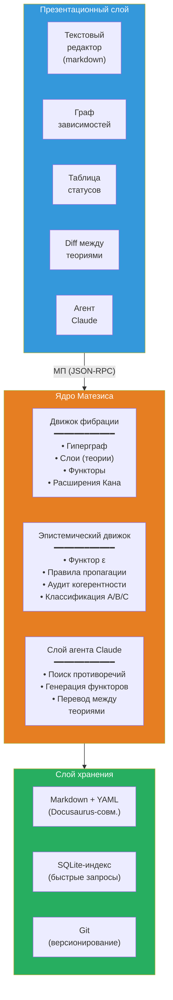
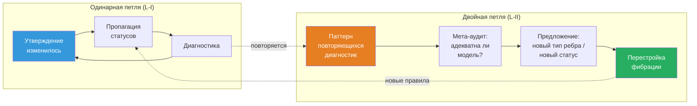

# Матезис: ∞-топос формальных теорий

:::info Для кого этот документ
Для исследователей, работающих со сложными теоретическими конструкциями — физиков, нейробиологов, философов сознания, специалистов по AGI. Документ описывает проект **Матезис** — вычислительную реализацию ∞-топоса формальных теорий, которая делает работу с теориями (навигацию, сравнение, верификацию когерентности и межтеоретический перевод) машинно-поддерживаемой. Математический фундамент — ∞-топос пучков на сайте теорий $\mathfrak{M} = \mathrm{Sh}_\infty(\mathbf{Th}, J_{\text{ep}})$; содержательная основа — формализм КК; программная архитектура — Ядро Матезиса с LLM-агентом.
:::

---

## 0. От «среды» к математическому объекту {#введение}

Этот документ описывает проект, ранее известный как *Theory IDE*. Переименование — не косметическое. Оно отражает **фундаментальный концептуальный сдвиг**: от программного инструмента, использующего теорию категорий, к **математическому объекту**, имеющему вычислительную реализацию.

### Mathesis Universalis

В 1666 году Готфрид Лейбниц в *Dissertatio de arte combinatoria* выдвинул проект **Mathesis Universalis** — универсальной науки о формальном рассуждении. Проект состоял из двух частей:

- **Characteristica universalis** — универсальный формальный язык, способный выразить любое знание
- **Calculus ratiocinator** — механический вычислитель, оперирующий внутри этого языка

Три с половиной века спустя оба компонента получают точную математическую реализацию:

| Лейбниц (1666) | Матезис (2026) |
|---|---|
| Characteristica universalis | $\mathfrak{M} = \mathrm{Sh}_\infty(\mathbf{Th},\; J_{\text{ep}})$ — ∞-топос пучков на сайте теорий |
| Calculus ratiocinator | LLM-агент, оперирующий внутри внутренней логики $\mathfrak{M}$ |

Лейбниц не мог реализовать свой проект: ему не хватало (1) теории категорий (Eilenberg–Mac Lane, 1945), (2) ∞-категорий (Joyal, Lurie, 2009), (3) вычислительных моделей языка (LLM, 2020-е). УГМ не «подтверждает» Лейбница — она **предоставляет формализм**, которого ему не хватало.

### Ключевой тезис

**Матезис — не программа, использующая математику. Матезис ЯВЛЯЕТСЯ математическим объектом — ∞-топосом — у которого есть вычислительная аппроксимация.**

Программный код (Verum) — конечная аппроксимация бесконечного объекта $\mathfrak{M}$, подобно тому как численное решение дифференциального уравнения аппроксимирует непрерывную динамику. Аппроксимация может улучшаться; $\mathfrak{M}$ остаётся неизменным.

### Структура документа

Документ следует единой логической цепочке:

1. **Проблема** (§1): когнитивный предел — ни один человек не удерживает 325+ теорий одновременно
2. **Обоснование** (§1½): почему ∞-категории — единственный адекватный аппарат (T-182, когезивные модальности)
3. **Фундамент** (§2): конструкция ∞-топоса $\mathfrak{M}$ — сайт теорий, вложение Йонеды, расширения Кана, условие спуска, классификатор подобъектов
4. **Генерализации** (§3): три направления выхода за 1-категорную аппроксимацию — HoTT, квантовая логика, автопоэзис
5. **Реализация** (§4–§6): архитектура, движки, агент — как $\mathfrak{M}$ аппроксимируется вычислительно
6. **Глубинные принципы** (§7–§10): самореференция, процессная онтология, рефлексивные циклы — что делает Матезис живым, а не статичным
7. **Следствия** (§11–§12): когнитивное расширение и примеры использования
8. **Путь к реализации** (§13–§15): план, сравнение, Verum как язык предельной мощи

Каждый уровень строится на предыдущем и несводим к нему — в точном соответствии с теоремой T-182 ($\mathcal{T}_0 \subsetneq \mathcal{T}_1 \subsetneq \mathcal{T}_2$).

---

## 1. Проблема: когнитивный предел {#проблема}

### 1.1. Масштаб современной теории

Зрелая научная теория — объект, превышающий когнитивную ёмкость одного агента. Для примера: документация КК (Кибернетика Когерентности, прикладной слой УГМ) — это ~400 страниц, ~185 теорем с 7 эпистемическими статусами, 23+ фальсифицируемых предсказаний, 30+ сравнений с конкурирующими теориями, ~270 перекрёстных ссылок. Теория интегрированной информации (IIT 4.0) — сопоставимый объём с собственным формализмом ($\Phi$, Q-shape, постулаты). Когнитом Анохина — качественная теория с 80-летним экспериментальным бэкграундом. И таких теорий сознания — [более 325](https://www.consciousnessatlas.com/) (по каталогу Consciousness Atlas).

Ни один человек не способен удерживать в рабочей памяти одновременно:
- внутреннюю структуру даже одной теории (какие утверждения от каких зависят)
- эпистемический статус каждого утверждения (доказано / условно / гипотеза / опровергнуто)
- соответствия между теориями (что означает $\Phi$ Тонони в терминах УГМ? как FEP Фристона стыкуется с автопоэзисом? где когнитом Анохина противоречит GWT Баарса?)
- последствия изменений (если опровергнута аксиома X, какие теоремы падают?)

### 1.2. Конкретные инциденты

**Парадокс ρ* (сессия 25 работы с УГМ).** Обнаружено: самореференция в операторе регенерации ℛ — целевое состояние ρ* определялось как динамическая неподвижная точка, что приводило к обнулению ℛ. Исправление: переопределение ρ* = φ(Γ) (категориальная самомодель). Последствия: потребовалось обновить ~25 файлов, сменить статус теоремы T-68 с [Т] на [С], заменить «примитивность ℒ_Ω» на «примитивность ℒ₀» во всех вхождениях. Время: целая рабочая сессия на **механическую пропагацию** — работу, которую машина может выполнить за секунды.

**Сломанные якоря (сессия перевода).** При переводе документации на английский язык заголовки были переведены, но ~50 внутренних ссылок продолжали указывать на русские якоря. Обнаружение: только при сборке сайта. Исправление: ручной поиск в ~20 файлах. Это задача для автоматической проверки когерентности.

**Рассогласование статусов (аудит 2026-03-23).** Глубокий аудит обнаружил 9 критических и 14 серьёзных проблем: теоремы со статусом [Т], зависящие от гипотез [Г]; утверждения, противоречащие друг другу; устаревшие ссылки. Исправление: 85 точечных правок в 42 файлах за 8 сессий. Каждая из этих проблем обнаружима автоматически.

### 1.3. Текущие инструменты и их пределы

| Инструмент | Что делает | Чего не делает |
|------------|-----------|----------------|
| **Docusaurus** | Рендерит markdown в сайт, проверяет ссылки | Не знает о логических зависимостях между утверждениями |
| **grep / ripgrep** | Находит текст | Не знает о типах связей (зависимость ≠ упоминание) |
| **Git** | Версионирует файлы | Не знает о статусах теорем |
| **Obsidian** | Граф заметок с ссылками | Нетипированные связи, нет когерентности, нет межтеоретических мостов |
| **RAG + LLM** | Находит релевантный текст, генерирует ответ | Оперирует текстом, не структурой; не проверяет логику |
| **Claude Code** | Разработка кода, навигация по кодовой базе | Не знает о теоретической структуре содержимого файлов |

Ни один из этих инструментов не понимает, что файл содержит **теорему**, что теорема **зависит** от аксиомы, что аксиома имеет **статус**, и что изменение статуса аксиомы **должно пропагироваться** на все зависимые теоремы.

:::warning Категориальный диагноз: почему плоские инструменты принципиально недостаточны
Перечисленные инструменты — **0-категорные**: они оперируют множествами (файлов, строк, коммитов) без типизированных морфизмов. Но научное знание имеет **∞-категорную** структуру:
- **Объекты** (утверждения) связаны **морфизмами** (зависимостями) — уровень 1
- Морфизмы связаны **2-морфизмами** (сравнения переводов: «перевод IIT→УГМ совместим с переводом IIT→GWT→УГМ?») — уровень 2
- 2-морфизмы связаны **3-морфизмами** (мета-аудит: «адекватны ли наши правила сравнения?») — уровень 3
- ...и так далее для каждого рефлексивного цикла (§10)

Инструмент, работающий на уровне $n$, **не может обнаружить** проблемы уровня $n+1$ (аналог T-182: $\mathcal{T}_0 \subsetneq \mathcal{T}_1 \subsetneq \mathcal{T}_2$). Нужен инструмент, содержащий **все уровни** — ∞-категорный по конструкции.
:::

---

## 1½. Метаэпистемологическое обоснование {#метаэпистемология}

:::info Зачем нужен этот раздел
§1 описал **проблему** (когнитивный предел). §2 предложит **решение** (∞-топос теорий). Этот промежуточный раздел отвечает на вопрос мета-уровня: **почему именно это решение** — и почему альтернативы принципиально недостаточны.
:::

### 1½.1. Метастемология: за пределами протоколов рациональности

Андрей Чурилов ([«Метастемология. Вместо манифеста»](https://anticomplexity.org/posts/metastemologiya-vmesto-manifesta/), 2025) выдвигает радикальный тезис: проблема современного знания — **не** в нехватке данных и **не** в ошибках рассуждений, а в **архитектуре самих когнитивных протоколов**. Протокол сам — объект, подлежащий реконфигурации.

Ключевые концепции Чурилова, резонирующие с Матезисом:

| Чурилов | Матезис | Математический аналог |
|---------|---------|----------------------|
| **Стема** — терминологический мост между теориями | **Расширение Кана** $\mathrm{Lan}_f$ — универсальный перевод утверждений | Морфизм в базе $\mathbf{Th}$ |
| **Импульсная сеть** — динамическая сеть с нормирующей механикой | **∞-пучок** $\mathcal{F} \in \mathfrak{M}$ с условием спуска | Слой фибрации $p^{-1}(T)$ |
| **Метатекстовый процессор** — новый класс устройств для работы со знанием | **Матезис** как целое: $\mathfrak{M}$ + вычислительное ядро + LLM-агент | $\infty$-топос $\mathfrak{M}$ |
| **Переконфигурация рациональности** — изменение протоколов, а не работа внутри них | **L-III** (§3.3): модификация топологии $J_{\text{ep}}$ | Башня Постникова: $\tau_{\leq n+1} \to \tau_{\leq n}$ |
| **Исполняемое знание на шине актантной сети** | **MCP-интеграция**: Ядро Матезиса как исполняемая модель теории | Пучок $\mathcal{F} \in \mathfrak{M}$ |

Чурилов не использует категорную математику эксплицитно, но его архитектура **изоморфна** категорной. Матезис — **реализация** метастемологической программы на категорном фундаменте.

### 1½.2. Три уровня Ω как три уровня Матезиса

Теорема T-182 [Т] устанавливает, что три уровня классификатора подобъектов строго необходимы: $\mathcal{T}_0 \subsetneq \mathcal{T}_1 \subsetneq \mathcal{T}_2$. Эта структура **проецируется** на архитектуру Матезиса:

| Уровень $\Omega$ | Уровень Матезиса | Что формализует |
|-------------------|-------|-----------------|
| $\mathrm{Dec}(\Omega) \cong 2^7$ (булева) | **Движок фибрации**: типизированный гиперграф, типы утверждений и зависимостей | Статическая структура: «какие утверждения существуют и как связаны» |
| $\tau_{\leq 0}(\Omega)$ (Гейтинг) | **Эпистемический движок**: пороговые предикаты, пропагация статусов, аудит когерентности | Пороги и логика: «какие утверждения достоверны и где границы» |
| Полный $\Omega$ (∞-группоид) | **Рефлексивные циклы**: $T_{\text{meta}}$, двойная петля, мета-аудит | Динамика: «как система наблюдает и перестраивает себя» |

### 1½.3. Когезивные модальности как операции Матезиса

Теорема T-185 [Т] устанавливает 7 канонических модальностей дифференциально когезивного ∞-топоса. Шесть из них отображаются в фундаментальные операции:

| Модальность | Определение | Операция Матезиса |
|-------------|-------------|------------------|
| $\Pi$ (Shape) | Выделяет различимые компоненты | `theory/audit` — обнаружение различий и несогласованностей |
| $\flat$ (Flat) | Извлекает дискретные инварианты | `claim/dependencies` — скелет зависимостей (без динамики) |
| $\Im$ (Infinitesimal shape) | Улавливает бесконечно малое изменение | `claim/setStatus` + пропагация — реакция на локальное изменение |
| $\sharp$ (Sharp) | Вычисляет логическое замыкание | `fibration/coherence` — транзитивная проверка всей фибрации |
| $\&$ (Infinitesimal flat) | Интернализует инфинитезимальную структуру | `meta/audit` — наблюдение собственной структуры |
| $\mathrm{Rh}$ (de Rham) | Интегрирует локальное в глобальное | `claim/translate` — декартово поднятие, межтеоретический синтез |

Это **не постфактум-подгонка**, а следствие структуры когезивного ∞-топоса: если Матезис оперирует пучками на сайте теорий, то его фундаментальные операции **необходимо** распадаются на когезивные и инфинитезимальные модальности (Schreiber 2013).

### 1½.4. Фундаментальное обоснование: почему ∞-категории — единственный адекватный аппарат

Работа со знанием о знании — это операция на **категории категорий** $\mathbf{Cat}$. Работа со знанием о знании о знании — на **∞-категории ∞-категорий** $\mathbf{Cat}_\infty$. Это не метафора, а точное утверждение:

| Операция | Математический объект | Уровень |
|----------|----------------------|---------|
| Формулировать утверждения внутри теории | Объекты и морфизмы в категории $\mathcal{C}$ | Объектный |
| Сравнивать теории | Функторы $F: \mathcal{C} \to \mathcal{D}$ | Мета |
| Проверять когерентность сравнений | Естественные преобразования $\alpha: F \Rightarrow G$ | Мета² |
| Переконфигурировать саму систему проверки | Модификации $\Theta: \alpha \Rrightarrow \beta$ (3-морфизмы) | Мета³ |
| ... | ... (∞-морфизмы) | Мета^n |

**Теорема Лурье (HTT, 1.1.2.2):** Категория $\mathbf{Cat}_\infty$ всех малых ∞-категорий сама является ∞-категорией. Следовательно, система, работающая с теориями, **живёт** в ∞-категории независимо от того, осознаём мы это или нет. ∞-топос — **единственная** математическая структура, содержащая все уровни с гарантированной когерентностью.

Альтернативы:
- **Графовые базы данных** (Neo4j) — 1-категория, нет 2-морфизмов
- **Реляционные базы** — даже не категория (нет композиции)
- **Obsidian / Roam** — нетипизированный граф
- **RAG + LLM** — оперирует текстом, не структурой

---

## 2. Математический фундамент: ∞-топос теорий {#фундамент}

### 2.1. От фибрации к ∞-топосу: преодоление структурного разрыва {#структурный-разрыв}

Предшествующая архитектура строила фундамент на **фибрации Гротендика** $p: \mathbf{E} \to \mathbf{B}$. Это корректно, но недостаточно. Фибрация — 1-категорная конструкция. Она формализует объекты (утверждения) и морфизмы (зависимости, переводы). Но не формализует:

- **2-морфизмы**: сравнения двух переводов между одной парой теорий
- **3-морфизмы**: мета-аудит сравнений
- **$n$-морфизмы** для произвольного $n$: рефлексивные циклы (§10)

Гиперграф (SQLite) и типизированные рёбра — **1-категориальная эмуляция** ∞-категориальной структуры. Они работают на уровнях 0 и 1, но теряют нативную когерентность начиная с уровня 2. Это не технический долг — это **структурный разрыв** между заявляемой ∞-категориальной онтологией и 1-категориальной реализацией.

**Решение:** начать с правильного объекта. Фибрация Гротендика — **следствие** конструкции ∞-топоса (straightening/unstraightening, HTT 3.2), а не основание.

### 2.2. Сайт теорий $(\mathbf{Th},\; J_{\text{ep}})$ {#сайт-теорий}

**Определение (сайт теорий).** Сайт $(\mathbf{Th},\; J_{\text{ep}})$ определяется следующими данными:

**Объекты.** Объект $T \in \mathbf{Th}$ — *теория*: по существу малая ∞-категория $\mathcal{C}_T$, снабжённая:
- выделенным подклассом объектов (*утверждения*)
- выделенным подклассом морфизмов (*зависимости*)
- эпистемическим функтором $\varepsilon_T: \mathcal{C}_T \to \mathbf{Status}$

Примеры: $T_{\text{УГМ}}$ (~185 теорем, 7 статусов, 5 аксиом), $T_{\text{IIT}}$ (5 постулатов, $\Phi$, Q-shape), $T_{\text{GWT}}$ (глобальное зажигание, доступ), $T_{\text{FEP}}$ (свободная энергия, марковское одеяло).

**Морфизмы.** Морфизм $f: T_1 \to T_2$ — *функтор интерпретации*: ∞-функтор $\mathcal{C}_{T_1} \to \mathcal{C}_{T_2}$, сохраняющий типы утверждений и совместимый с $\varepsilon$.

**2-морфизмы.** Естественное преобразование $\alpha: f \Rightarrow g$ — *сравнение переводов*: способ деформировать один перевод в другой с сохранением структуры.

**$n$-морфизмы** для $n \geq 3$ существуют автоматически по определению ∞-категории.

**Топология $J_{\text{ep}}$ (эпистемическая).** Семейство $\{f_i: T_i \to T\}_{i \in I}$ является $J_{\text{ep}}$-покрытием объекта $T$, если функторы $f_i$ **совместно верны** (jointly faithful): для любых двух различных утверждений $a, b \in T$ существует $i$ и утверждение $c \in T_i$ такие, что $f_i(c)$ различает $a$ и $b$.

**Интуиция.** Покрытие — набор «перспектив», которые в совокупности исчерпывают содержание теории. Например, $T_{\text{IIT}}$ и $T_{\text{GWT}}$ могут совместно покрывать часть $T_{\text{УГМ}}$, касающуюся интеграции.

**Аналогия.** Представьте многоэтажное здание. Этажи — теории (УГМ, IIT, GWT, FEP). Комнаты на этаже — утверждения внутри теории. Двери между комнатами — логические зависимости. Лестницы между этажами — функторы перевода. Эпистемическая топология $J_{\text{ep}}$ говорит: «если по лестницам можно добраться до всех комнат верхнего этажа, считая с разных нижних этажей, — верхний этаж *покрыт*». В отличие от 1-категорной фибрации (предшествующая архитектура), ∞-версия добавляет: коридоры между лестницами (2-морфизмы), переходы между коридорами (3-морфизмы) и так далее — все уровни навигации одновременно.

### 2.3. ∞-Топос Матезиса {#инфти-топос}

**Определение.** ∞-Топос Матезиса — ∞-категория ∞-пучков на сайте теорий:

$$
\mathfrak{M} := \mathrm{Sh}_\infty(\mathbf{Th},\; J_{\text{ep}})
$$

Объект $\mathcal{F} \in \mathfrak{M}$ — ∞-пучок: правило, которое каждой теории $T$ сопоставляет пространство (∞-группоид) $\mathcal{F}(T)$, и каждому переводу $f: T_1 \to T_2$ — отображение $\mathcal{F}(f): \mathcal{F}(T_2) \to \mathcal{F}(T_1)$ (контравариантно), с когерентностью на всех уровнях.

**Условие пучка (спуска).** Для покрытия $\{T_i \to T\}$:

$$
\mathcal{F}(T) \xrightarrow{\;\sim\;} \lim\left(\prod_i \mathcal{F}(T_i) \rightrightarrows \prod_{i,j} \mathcal{F}(T_i \times_T T_j) \cdots\right)
$$

Это **косимплициальный предел** — полная когерентность на всех уровнях одновременно.

**Универсальное свойство (Lurie, HTT 6.2.2.7).** $\mathfrak{M}$ — свободное кополное ∞-категорное расширение сайта $\mathbf{Th}$: любая когерентная система сравнений теорий **единственным образом пропускается** через $\mathfrak{M}$.

**Что это означает на практике.** Если исследователь загружает 30 теорий и строит между ними переводы, он может использовать любую систему хранения (графовую базу, реляционную базу, текстовые файлы). Но если он хочет, чтобы переводы были **когерентны на всех уровнях** (перевод из A в C через B даёт тот же результат, что прямой перевод из A в C, с точностью до когерентного изоморфизма) — его данные **автоматически** образуют объект в $\mathfrak{M}$. Универсальное свойство утверждает: не существует другого способа обеспечить когерентность, не факторизующегося через $\mathfrak{M}$.

:::warning Следствие единственности
Матезис — не «один из возможных дизайнов». Это **единственный** (с точностью до эквивалентности) способ организовать множество теорий с когерентными переводами на всех уровнях. Не существует альтернативы, которая была бы одновременно полной и когерентной и не факторизовалась бы через $\mathfrak{M}$.
:::

### 2.4. Вложение Йонеды: загрузка теории {#вложение-йонеды}

**Определение.** Вложение Йонеды:

$$
y: \mathbf{Th} \hookrightarrow \mathfrak{M}, \qquad y(T)(S) := \mathrm{Map}_{\mathbf{Th}}(S, T)
$$

Каждой теории $T$ сопоставляется **представимый пучок** $y(T)$: функтор, который теории $S$ сопоставляет пространство всех интерпретаций $S$ в $T$.

**Лемма Йонеды (∞-версия, HTT 5.1.3).** Вложение $y$ полностью верно:

$$
\mathrm{Map}_{\mathfrak{M}}(y(T_1), y(T_2)) \simeq \mathrm{Map}_{\mathbf{Th}}(T_1, T_2)
$$

**Следствие.** «Загрузить теорию $T$ в Матезис» = вычислить представимый пучок $y(T)$. Лемма Йонеды гарантирует: **никакая информация не теряется.** Вся структура $T$ — утверждения, зависимости, статусы, переводы в другие теории — сохранена в $y(T)$.

**Практическая реализация.** Полное вычисление $y(T)$ бесконечномерно. Аппроксимация: вычислить $y(T)$ на конечном подсайте $\mathbf{Th}_0 \subset \mathbf{Th}$, содержащем загруженные теории. По мере загрузки новых теорий аппроксимация уточняется.

### 2.5. Расширения Кана: межтеоретический перевод {#расширения-кана}

**Задача.** Дан частичный перевод $f: T_1 \to T_2$. Необходимо расширить его до оптимального полного перевода.

**Определение.**

$$
\mathrm{Lan}_f: \mathfrak{M}_{/y(T_1)} \to \mathfrak{M}_{/y(T_2)} \qquad \text{(левое расширение — оптимистичный перевод)}
$$
$$
\mathrm{Ran}_f: \mathfrak{M}_{/y(T_1)} \to \mathfrak{M}_{/y(T_2)} \qquad \text{(правое расширение — консервативный перевод)}
$$

**Интуиция.** $\mathrm{Lan}_f$ — «наилучшее возможное соответствие» (коллимитная формула). $\mathrm{Ran}_f$ — «наиболее осторожное соответствие» (лимитная формула).

**Почему именно расширения Кана, а не ad hoc функторы?** Расширение Кана обладает **универсальным свойством**: это *наилучший* (в категорном смысле) способ продолжить частичный перевод. Любой другой перевод, согласованный с исходным, **единственным образом** факторизуется через расширение Кана. Это означает: Матезис не *угадывает* переводы и не полагается на эвристики — он вычисляет *оптимальный* перевод из структуры самих теорий. LLM-агент предлагает кандидатов; расширение Кана гарантирует оптимальность.

**Мера непереводимости.** Обструкция:

$$
\mathrm{Obs}(f) := \mathrm{Ran}_f \circ f^* - \mathrm{Id}
$$

где $f^*$ — прообразный функтор. $\mathrm{Obs}(f) = 0$ — перевод идеален. $\mathrm{Obs}(f) \neq 0$ — существуют утверждения, не имеющие точного аналога. Это **универсальная конструкция**, заменяющая ad hoc столбец `what_is_lost` предыдущей версии.

**Пример.** Перевод $f: T_{\text{УГМ}} \to T_{\text{IIT}}$:
- $\mathrm{Lan}_f(P_{\text{crit}} = 2/7) = [\Phi > 0]$ — оптимистичный: «пороги соответствуют»
- $\mathrm{Ran}_f(P_{\text{crit}} = 2/7) = \varnothing$ — консервативный: IIT не специфицирует числовой порог
- $\mathrm{Obs}(f) \neq 0$: числовое значение 2/7 **непереводимо** в IIT

### 2.6. Условие спуска: когерентность как свойство пучка {#условие-спуска}

**Центральное наблюдение.** В предшествующей архитектуре когерентность проверялась **аудитом** post factum (BFS-обход, 5 типов нарушений, диагностики). В Матезисе когерентность — **не проверка, а определяющее свойство**: данные являются объектами $\mathfrak{M}$ тогда и только тогда, когда они когерентны.

**Условие спуска.** Пусть $\{f_i: T_i \to T\}$ — покрытие. Набор данных $\{a_i \in \mathcal{F}(T_i)\}$ с **коцикловым условием** (согласованность на пересечениях $T_i \times_T T_j$) однозначно склеивается в глобальное данное $a \in \mathcal{F}(T)$.

**Практическое следствие.** Если коллекция переводов $\{F_{\text{IIT}}, F_{\text{GWT}}, F_{\text{FEP}}, F_{\text{Cog}}\}$ не удовлетворяет условию спуска, система указывает **точное препятствие**: какая пара переводов несогласована и на каком уровне. Это не «нарушение когерентности №4» — это обструкция к спуску в $\mathfrak{M}$.

### 2.7. Классификатор подобъектов: эпистемическая логика {#классификатор}

В любом ∞-топосе существует **классификатор подобъектов** $\Omega_{\mathfrak{M}}$: объект, представляющий функтор подобъектов.

**Внутренняя логика.** $\Omega_{\mathfrak{M}}$ — **алгебра Гейтинга** (не булева). Закон исключённого третьего $p \vee \neg p = \top$ **не выполняется** в общем случае — и это **адекватно** для эпистемологии: утверждение может быть ни доказано, ни опровергнуто.

**Связь с эпистемическими статусами.** Линейный посет $\text{[Т]} > \text{[С]} > \text{[Г]} > \text{[П]} > \text{[О]} > \text{[И]} > \text{[✗]}$ вкладывается в $\Omega_{\mathfrak{M}}$, но $\Omega_{\mathfrak{M}}$ **богаче**:

- «истинно в УГМ $\wedge$ ложно в IIT» — **контекстуальная истина**
- «доказано при допущении X, которое [Т] в GWT, но [Г] в FEP» — **условная истина с зависимостью от теории**
- «непротиворечиво во всех загруженных теориях, но не доказано ни в одной» — **инвариантная гипотеза**

Это не ad hoc расширение — это **автоматическое следствие** того, что $\mathfrak{M}$ — ∞-топос.

**Почему линейный посет недостаточен.** В линейном посете [Т] > [С] > [Г] > ... утверждение имеет ровно один статус, безотносительно теории. Но в практике науки утверждение «сознание ≡ интегрированная информация» имеет статус [Т] в IIT, [Г] в УГМ, и [✗] в бихевиоризме — **одновременно**. Линейный посет заставляет выбирать один «глобальный» статус, теряя контекст. Алгебра Гейтинга $\Omega_{\mathfrak{M}}$ содержит все контекстуальные истинности как своих элементов — без потерь.

### 2.8. Связь с ∞-топосом УГМ {#связь-с-угм}

УГМ построена на ∞-топосе:

$$
\mathfrak{T} = (\mathrm{Sh}_\infty(\mathcal{C}),\; J_{\text{Bures}},\; \omega_0)
$$

где $\mathcal{C} = \mathbf{DensityMat}$. $\mathfrak{T}$ организует **квантовые состояния** одной теории. $\mathfrak{M}$ организует **теории** (каждая из которых — ∞-топос). Связь:

$$
\mathfrak{T} \in \mathrm{Ob}(\mathbf{Th}) \xrightarrow{\;y\;} \mathfrak{M}
$$

**Башня уровней.** Иерархия несводимых уровней:

| Уровень | Объект | Пространство |
|---------|--------|-------------|
| 0 | Квантовое состояние $\Gamma$ | $\mathfrak{T}$ |
| 1 | Теория УГМ $\mathfrak{T}$ | $\mathbf{Th}$ |
| 2 | Представимый пучок $y(\mathfrak{T})$ | $\mathfrak{M}$ |
| 3 | Сам ∞-топос $\mathfrak{M}$ | $\mathbf{Cat}_\infty$ |

Каждый уровень несводим к предыдущему (T-182). Матезис оперирует на уровне 2, с рефлексивным доступом к уровню 3 через $T_{\text{meta}}$ (§8).

Конструкция Гротендика (straightening/unstraightening, HTT 3.2) устанавливает эквивалентность между фибрациями и функторами $\mathcal{C}^{\mathrm{op}} \to \mathbf{Cat}_\infty$. Таким образом, фибрация $p: \mathbf{E} \to \mathbf{B}$ из предшествующей архитектуры — **частный случай** (1-категориальная проекция) конструкции ∞-топоса $\mathfrak{M}$.

**Глубинное единство.** Тот факт, что одна и та же конструкция (∞-топос пучков) организует и квантовые состояния ($\mathfrak{T}$), и научные теории ($\mathfrak{M}$), — не совпадение. Это следствие того, что обе области — физика и эпистемология — оперируют **контекстуально-зависимым знанием**: результат измерения зависит от контекста (в физике — от базиса; в эпистемологии — от теории). ∞-топос — универсальная математическая структура для контекстуально-зависимых данных с когерентными переходами между контекстами (Isham–Butterfield 1998, Döring–Isham 2008).

---

## 3. Три предельные генерализации {#генерализации}

Текущая вычислительная реализация (гиперграф, SQLite, Verum) аппроксимирует $\mathfrak{M}$ на 1-категориальном уровне. Три направления расширения устраняют фундаментальные ограничения.

### 3.1. Топологическая: от графа к гомотопическому типу {#топологическая}

В 1-категориальной реализации перевод — **функтор** $f: T_1 \to T_2$, единственный объект. Вопрос «эквивалентны ли два перевода?» имеет булев ответ.

В $\mathfrak{M}$ пространство переводов — **∞-группоид** (Кан-комплекс):

$$
\mathrm{Map}_{\mathfrak{M}}(y(T_1), y(T_2)) \simeq \mathrm{Map}_{\mathbf{Th}}(T_1, T_2)
$$

Гомотопическая структура:

| Группа | Содержание | Пример |
|--------|-----------|--------|
| $\pi_0$ | Классы эквивалентности переводов | «Перевод IIT→УГМ через $\Phi$ и перевод через Q-shape — *различные* классы» |
| $\pi_1$ | Петли = калибровочные симметрии | «Перестановка [E,O,U] при трансляции IIT→УГМ сохраняет структуру» |
| $\pi_n$ | Высшие когерентности | Рефлексивные циклы порядка $n$ |

**Следствие.** Вопрос «эквивалентны ли два перевода $f, g$?» имеет не булев, а **топологический** ответ: пространство путей $\mathrm{Path}(f, g)$. Если оно непусто — переводы эквивалентны; если контрактибельно — единственным образом; если имеет нетривиальную $\pi_1$ — существуют калибровочные степени свободы.

**Вычислительная реализация.** Гомотопическая теория типов (HoTT, Univalent Foundations Program 2013) — вычислительная модель для ∞-группоидов. В ядре Матезиса равенство $F_{12} \circ F_{23} \simeq F_{13}$ вычисляется кубическим алгоритмом типизации (Cohen–Coquand–Huber–Mörtberg 2015) как **путь** в ∞-группоиде, а не булев результат аудита.

### 3.2. Эпистемическая: от посета к квантовой логике {#эпистемическая}

**Проблема.** В сложных междисциплинарных теориях истинность **контекстуальна** и **некоммутативна**: утверждение может быть [Т] в $T_1$, но [Г] в $T_2$; доказательство одного утверждения может изменить статус другого; два утверждения могут быть **дополнительными** (в смысле Бора).

**Генерализация.** Заменить линейный посет $\mathbf{Status}$ на **ортомодулярную решётку** $\mathcal{L}$ (Birkhoff–von Neumann 1936). Эпистемическое состояние утверждения $a$:

$$
\rho_a \in \mathcal{D}(\mathcal{H}_{\text{ep}})
$$

— плотностная матрица на эпистемическом гильбертовом пространстве.

| Операция | Математика | Интуиция |
|----------|-----------|----------|
| Измерение (решение пользователя) | $\rho_a \mapsto P_s \rho_a P_s / \mathrm{Tr}(P_s \rho_a P_s)$ | Суперпозиция схлопывается |
| Опровержение | $P_{[\text{✗}]} \rho_b P_{[\text{✗}]}$ может $\neq \rho_b$ | Если $[P_a, P_b] \neq 0$, опровержение $a$ нетривиально влияет на $b$ |
| Суперпозиция | $\rho_a = \alpha |\text{Т}\rangle\langle\text{Т}| + \beta |\text{Г}\rangle\langle\text{Г}|$ | До проверки утверждение в суперпозиции статусов |

**Почему квантовая логика, а не классическая?** В классической логике проверка гипотезы — идемпотентная операция: проверил дважды — получил тот же результат. В научной практике это ложь. Доказательство теоремы A может обесценить гипотезу B (если A и B несовместимы), а опровержение B может *усилить* C (если B и C были конкурентами). Эпистемические измерения **не коммутируют**: порядок проверки влияет на результат. Это в точности структура квантовой механики — не по аналогии, а потому что обе области оперируют **контекстуально-зависимыми пропозициями** на ортомодулярной решётке.

**Связь с УГМ.** $\Gamma \in \mathcal{D}(\mathbb{C}^7)$ описывает сознательное состояние; $\rho_{\text{ep}} \in \mathcal{D}(\mathbb{C}^k)$ описывает **эпистемическое состояние**. Формулы одинаковы, потому что математическая структура одна: ∞-топос для физики ($\mathfrak{T}$) и для эпистемологии ($\mathfrak{M}$). Это не аналогия — это прямой перенос.

### 3.3. Автопоэтическая: самомодифицирующийся формальный аппарат {#автопоэтическая}

Уровни обучения (Бейтсон 1972):
- **L-I:** исправление ошибок внутри фиксированных правил (пропагация статусов)
- **L-II:** изменение правил (новый тип зависимости, новый статус) — двойная петля
- **L-III:** изменение **самого формального аппарата** — топологии $J_{\text{ep}}$ на сайте $\mathbf{Th}$

Топология $J_{\text{ep}}$ определяет, какие семейства переводов считаются «достаточными» (покрытиями). Изменение $J_{\text{ep}}$ — изменение **критерия достаточности знания**.

**Пример.** Начальная топология: «теория покрыта, если для каждого утверждения есть перевод хотя бы в одну другую теорию». После загрузки 30 теорий система обнаруживает: динамические утверждения систематически не покрываются. L-III: добавить требование раздельного покрытия статических и динамических утверждений. $J_{\text{ep}} \to J'_{\text{ep}}$, и $\mathfrak{M} \to \mathfrak{M}'$ — **другой ∞-топос**.

**Автопоэзис.** В терминах Матураны–Варелы (1980), система **производит компоненты**, из которых сама состоит. Слой $T_{\text{meta}}$ (§8) модифицирует Матезис, Матезис обновляет $T_{\text{meta}}$.

**Граница.** Теорема Лоувера (1969): автопоэтическая система не может доказать собственную непротиворечивость. Утверждения $T_{\text{meta}}$ о полноте $\mathfrak{M}$ имеют статус не выше [Г]. Структурная неизбежность, не баг.

---

## 3½. От математики к реализации {#мост}

Разделы §2–§3 описывают **идеальный** математический объект $\mathfrak{M}$. Разделы §4–§6 описывают его **вычислительную аппроксимацию**. Связь между ними:

| Математический объект | Вычислительная аппроксимация | Уровень точности |
|---|---|---|
| ∞-Топос $\mathfrak{M}$ | Типизированный гиперграф (SQLite) | 1-категориальная проекция |
| Вложение Йонеды $y(T)$ | Импорт YAML + построение представимого пучка | Конечный подсайт $\mathbf{Th}_0$ |
| Расширение Кана $\mathrm{Lan}_f$ | LLM-агент + SMT-верификация | Эвристика + формальная проверка |
| Условие спуска | BFS-аудит когерентности | 5 типов нарушений |
| $\Omega_{\mathfrak{M}}$ (Гейтинг) | Линейный посет [Т]>[С]>...[✗] → ортомодулярная решётка (Фаза 5) | Проекция на 7 значений |
| Автопоэзис ($J_{\text{ep}} \to J'_{\text{ep}}$) | Режим 5 агента (мета-аудит) + ручное подтверждение | Человек-в-контуре |

Аппроксимация улучшается с каждой фазой реализации (§13). Фаза 5 (HoTT-ядро) переводит аппроксимацию на принципиально новый уровень — от эмуляции ∞-структур на гиперграфе к нативным вычислениям в кубической теории типов.

---

## 4. Архитектура {#архитектура}

Архитектура реализует математический фундамент §2 и генерализации §3:

| Принцип | Раздел | Архитектурная реализация |
|---------|--------|-------------------------|
| ∞-Топос $\mathfrak{M}$ | §2.3 | Движок фибрации (гиперграф как 1-категориальная аппроксимация) |
| Расширения Кана | §2.5 | Эпистемический движок (пропагация, аудит) + LLM-агент (семантические переводы) |
| Автопоэзис | §3.3 | $T_{\text{meta}}$ как слой фибрации + команды `meta/*` |
| Процессная онтология | §9 | Морфизмы первичны в модели данных; стигмергия через диагностики |
| Рефлексивные циклы | §10 | Режим 5 агента (мета-аудит) + двойная петля |
| Когнитивное расширение | §11 | Тензорное произведение $\mathbb{H}_{\text{bio}} \otimes \mathbb{H}_{\mathfrak{M}}$ |

### 4.1. Три слоя



- **Презентационный слой** — множественные синхронизированные панели (проекции одной фибрации). Связан с ядром через **МП** (Матезис-Протокол — аналог LSP для теорий).
- **Ядро Матезиса** — три движка: Движок фибрации хранит и обходит гиперграф; Эпистемический движок проверяет и пропагирует статусы; Слой агента Claude выполняет семантические операции. Язык: **Verum** (всё ядро + МП-обёртка).
- **Слой хранения** — markdown-файлы с YAML frontmatter (обратная совместимость с Docusaurus), SQLite-индекс, Git.

### 4.2. Матезис-Протокол (МП) {#матезис-протокол}

МП — протокол взаимодействия клиента с Ядром Матезиса. Аналог **LSP** (Language Server Protocol), но для теорий. Формат: JSON-RPC через stdio или TCP.

**Навигация:**
- `theory/list` — список всех теорий в рабочем пространстве
- `theory/claims { theory_id }` — все утверждения теории
- `claim/dependencies { claim_id }` — от чего зависит утверждение
- `claim/dependents { claim_id }` — что зависит от утверждения
- `claim/translate { claim_id, target_theory }` — расширение Кана: перевод в другую теорию

**Мутации:**
- `claim/setStatus { claim_id, new_status, reason }` — изменить статус (с автоматической пропагацией)
- `claim/addDependency { source, target, type }` — добавить зависимость
- `theory/addFunctor { source, target, mappings }` — добавить межтеоретический мост

**Диагностики:**
- `theory/audit { theory_id }` — полный аудит когерентности
- `fibration/coherence` — проверка всей фибрации (все теории + все функторы)

**Самореференция (§8):**
- `meta/audit` — аудит слоя $T_{\text{meta}}$
- `meta/boundaries` — утверждения $T_{\text{meta}}$, ограниченные теоремой Лоувера (статус ≤ [Г])
- `meta/suggest_extension` — агент предлагает расширения модели

### 4.3. Формат хранения

Каждое утверждение — markdown-файл с YAML frontmatter, обратно совместимый с Docusaurus:

```yaml
---
id: T-39
theory: uhm
type: theorem       # axiom | theorem | definition | conjecture | prediction | concept
status: Т           # Т | С | Г | П | О | И | ✗
epistemic_class: A  # A | B | C
title: "Критическая чистота P_crit = 2/7"
dependencies:
  - { id: A-Omega7, type: requires }
  - { id: A-Bures, type: requires }
dependents:
  - { id: T-62, type: entails }
  - { id: T-96, type: entails }
translations:
  - { theory: cognitome, target: percolation-threshold, functor: F_Cog, status: И }
tags: [purity, threshold, viability]
---

# T-39: Критическая чистота P_crit = 2/7

**Формулировка.** Для системы с Γ ∈ D(C⁷) ...
```

---

## 5. Движок фибрации: ядро системы {#движок-фибрации}

### 5.1. Типизированный гиперграф

Центральная структура данных — **типизированный гиперграф** (1-категориальная аппроксимация $\mathfrak{M}$). В соответствии с процессной онтологией (§9) рёбра (морфизмы) первичны.

**Узлы** — утверждения (claims): `claim_id`, `theory_id`, `claim_type`, `status`, `content`.

**Рёбра** — зависимости:

| Тип | Значение | Пример |
|-----|----------|--------|
| `requires` | Необходимое условие | T-62 **требует** T-39 |
| `entails` | Логическое следствие | T-39 **влечёт** T-62 |
| `generalizes` | Обобщает | T-120 **обобщает** T-119 |
| `instantiates` | Частный случай | T-119 **конкретизирует** T-120 |
| `contradicts` | Противоречит | X3 [✗] **противоречит** T-39 |
| `defines` | Определяет через | Определение R **определяется через** φ(Γ) |
| `translates_to` | Перевод в другую теорию (аппроксимация $\mathrm{Lan}_f$) | УГМ:γ_{kk} **переводится в** Cog:когит |

### 5.2. Пропагация статусов

Когда статус утверждения меняется, Движок фибрации выполняет BFS-обход:

1. Утверждение $b$ понижается: $\varepsilon(b) \leftarrow \text{новый статус}$
2. Для каждого $a$, зависящего от $b$ через `requires`: $\max_\text{допустимый}(a) = \min(\varepsilon(\text{зависимости}(a)))$. Если $\varepsilon(a)$ превышает допустимый — понизить, добавить в очередь
3. Повторять, пока очередь не пуста

Результат: список затронутых утверждений с причинами. «T-68 понижена с [Т] до [С], потому что зависит от C20, который [С]».

### 5.3. Проверка когерентности

Пять типов нарушений (аппроксимация обструкции к спуску §2.6):

1. **Статусная рассогласованность**: [Т]-утверждение зависит от [Г] или ниже
2. **Противоречие**: два [Т]-утверждения связаны ребром `contradicts`
3. **Циклическая зависимость**: цепочка `requires` образует цикл
4. **Функторная рассогласованность**: $F_{12} \circ F_{23} \not\simeq F_{13}$ (нарушение условия спуска)
5. **Висячие ссылки**: зависимость указывает на несуществующее утверждение

### 5.4. Декартово поднятие (межтеоретический перевод)

Алгоритм (аппроксимация расширения Кана §2.5):
1. Найти утверждение X в слое $p^{-1}(A)$
2. Найти функтор $F: A \to B$
3. Найти маппинг X в таблице соответствий
4. Вернуть перевод с уверенностью и потерями ($\mathrm{Obs}(f)$)

---

## 6. Агент внутри ∞-топоса {#агент}

### 6.1. Ключевое отличие от «LLM + RAG»

В связке «Obsidian + RAG + LLM» модель оперирует **текстом**. В Матезисе Claude Opus получает доступ к **типизированному гиперграфу** через специализированные инструменты и выполняет **структурные операции**: навигация по зависимостям, проверка когерентности, вычисление расширений Кана. Каждое действие **верифицируемо**.

### 6.2. Инструменты

Claude Opus подключается к Ядру Матезиса через Anthropic tool_use API:

| Инструмент | Назначение |
|------------|-----------|
| `query_graph` | Запрос к гиперграфу |
| `get_claim` | Полное содержание утверждения |
| `get_dependencies` | Граф зависимостей (вглубь на N уровней) |
| `find_translations` | Все переводы утверждения в другие теории |
| `check_coherence` | Проверка когерентности подграфа |
| `propose_status_change` | Предложить изменение статуса |
| `propose_functor` | Предложить функторное соответствие (аппроксимация Кана) |

### 6.3. Пять режимов

**Режим 1: Навигатор.** Пользователь спрашивает — агент навигирует по фибрации и отвечает со ссылками на claim_id.

**Режим 2: Аудитор.** Агент сканирует фибрацию в поисках нарушений когерентности (обструкций к спуску).

**Режим 3: Переводчик.** Пользователь загружает новую теорию. Агент читает структуру, сравнивает с загруженными, предлагает функторные соответствия (аппроксимация $\mathrm{Lan}_f$). Главная функция, невозможная без LLM.

**Режим 4: Пропагатор.** При изменении статуса агент вычисляет затронутые утверждения, анализирует необходимость понижения (возможно, существует альтернативная цепочка), предлагает минимальный набор изменений.

**Режим 5: Мета-аудитор (двойная петля, §10).** Агент анализирует **саму структуру Матезиса**:
1. Обнаруживает паттерны повторяющихся диагностик (ограничение модели, а не ошибка в теории)
2. Предлагает расширения: новые типы зависимостей, новые статусы
3. Отслеживает систематические потери при переводе
4. Результаты фиксируются в $T_{\text{meta}}$ (§8) со статусом [Г]

### 6.4. MCP-интеграция

Ядро Матезиса реализуется как **MCP-сервер** (Model Context Protocol):

```json
{
  "mcpServers": {
    "mathesis": {
      "command": "mathesis-core",
      "args": ["--project", "./"],
      "description": "Mathesis: fibration engine + epistemic engine"
    }
  }
}
```

Все инструменты Ядра Матезиса доступны из Claude Code как MCP-tools.

---

## 7. Множественные проекции (пучки) {#проекции}

Один и тот же объект ($\mathfrak{M}$) допускает множество **сечений** — способов «вырезать» из глобального объекта локальную проекцию. Пять панелей — пять $U_i$, покрывающих одну фибрацию. Склейка обеспечивается Ядром Матезиса.

**Панель «Текст»** — markdown-редактор. **Панель «Граф»** — визуализация гиперграфа (узлы окрашены по статусу). **Панель «Статусы»** — таблица утверждений с фильтрами (аналог «Problems» в VS Code). **Панель «Федерация»** — визуализация базы $\mathbf{Th}$: теории — блоки, функторы — стрелки. **Панель «Агент»** — чат с Claude Opus, оперирующим внутри $\mathfrak{M}$.

---

## 8. Самореференция: Матезис как объект внутри себя {#самореференция}

### 8.1. Проблема объективации

Любой инструмент для работы с теориями рискует **объективировать** их — превращать живые процессы мышления в статические объекты. Если Матезис оперирует теориями «извне», он воспроизводит ту же ошибку.

Решение: Матезис **включает себя** в собственное пространство объектов.

### 8.2. $T_{\text{meta}}$: теория Матезиса о самом себе

В $\mathfrak{M}$ выделяется **особый слой** $T_{\text{meta}} \in \mathbf{Th}$. Его утверждения:

- «Каждая теория имеет эпистемический статусный функтор» — утверждение *о* Матезисе, *внутри* Матезиса
- «Пропагация статусов корректна (sound)» — утверждение *о* алгоритме
- «Типы зависимостей достаточны» — утверждение *о* модели данных
- «Функторная композируемость $F_{12} \circ F_{23} \simeq F_{13}$ проверяема» — утверждение *о* когерентности

$T_{\text{meta}}$ подчиняется **тем же правилам**: его утверждения имеют статусы, зависимости, и проверяются на когерентность. Это **контролируемая странная петля** (Hofstadter 1979).

### 8.3. Лоувер и границы самореференции

**Теорема Лоувера о неподвижной точке** (1969): единая категорная схема, из которой следуют теорема Гёделя, теорема Тарского, неразрешимость проблемы остановки и парадокс Рассела (Yanofsky 2003).

**Следствие для Матезиса.** $T_{\text{meta}}$ не может доказать собственную непротиворечивость. Утверждения $T_{\text{meta}}$ о полноте и непротиворечивости имеют статус не выше [Г]. Самореференция — **структурная неизбежность**, управляемая, а не устранимая.

Параллель с УГМ: оператор $\varphi(\Gamma)$ — самомодель, сходящаяся к $\rho^*$. Приблизительна (Лоувер), но стабильна (контрактивность CPTP). $T_{\text{meta}}$ — аналог $\varphi(\Gamma)$: приблизительная, но стабильная самомодель системы.

### 8.4. Второпорядковое наблюдение

Луман (1995): второпорядковое наблюдение — наблюдение того, как другие наблюдают. Каждый слой $p^{-1}(T)$ — «схема наблюдения» теории $T$. Функторы — акты второпорядкового наблюдения. $T_{\text{meta}}$ добавляет **третий порядок**: наблюдение того, как Матезис наблюдает то, как теории наблюдают мир.

---

## 9. Процессная онтология данных {#процессная-онтология}

### 9.1. Морфизмы первичны, объекты вторичны

Категорная теория допускает **бесобъектную формулировку** (Mac Lane 1998, §I.1): объекты отождествляются с тождественными морфизмами. Первичны — **связи и преобразования**.

Это резонирует с процессной философией Уайтхеда (1929): реальность — не коллекция субстанций, а процесс становления.

### 9.2. Следствия для модели данных

- **Утверждение существует постольку, поскольку оно связано.** Изолированное утверждение — мёртвый узел.
- **Теория — не список утверждений, а паттерн связей.** Два набора с изоморфной структурой — «одна и та же теория в разных терминах».
- **Каждый коммит — «действительное событие».** Git-история — конкресценция: каждый коммит наследует от предыдущих и порождает новую конфигурацию.

### 9.3. Стигмергия

**Стигмергия** (Grassé 1959) — координация через модификацию среды. Матезис — **стигмергическая среда**: каждое действие исследователя оставляет «след» в фибрации. Пропагация статусов — автоматическая стигмергия.

---

## 10. Рефлексивные циклы {#рефлексивные-циклы}

### 10.1. Четыре уровня обучения

| Уровень | Описание | В Матезисе |
|---------|----------|-----------|
| **L-0** | Нет изменений. Фиксированное поведение | Хранение и рендеринг (уровень Docusaurus) |
| **L-I** | Обнаружение и исправление ошибок | Пропагация статусов, обнаружение противоречий |
| **L-II** | «Обучение обучению» (deutero-learning) | Мета-аудит: «достаточны ли типы зависимостей?» |
| **L-III** | Фундаментальная реорганизация | Модификация $J_{\text{ep}}$: система меняет критерии достаточности знания (§3.3) |

Текущий дизайн реализует **L-0 и L-I** полностью. L-II — через $T_{\text{meta}}$ и Режим 5 агента. L-III — через автопоэтический механизм §3.3.

### 10.2. Двойная петля Аргириса



### 10.3. Энактивизм: понимание как совместное действие

Энактивный подход (Varela, Thompson, Rosch 1991): познание — не репрезентация предзаданного мира, а **совместное действование**. Матезис не хранит понимание — он его **порождает** совместно с исследователем:

1. Исследователь задаёт вопрос → агент навигирует по $\mathfrak{M}$
2. Обнаруживается нечто неожиданное (противоречие, обструкция к спуску, скрытый изоморфизм)
3. Агент предлагает структурное изменение
4. **Пространство вопросов трансформируется**
5. Новый вопрос порождается на другом уровне

Это не «вопрос → ответ». Это **совместная трансформация пространства вопросов** — структурное сопряжение (Maturana & Varela 1980).

---

## 11. Когнитивное расширение {#когнитивное-расширение}

Формализм КК позволяет описать Матезис **количественно**. Если когнитивная система исследователя — голоном $\mathbb{H}_{\text{bio}}$, а Матезис — $\mathbb{H}_{\mathfrak{M}}$, то расширенная система:

$$
\mathbb{H}_{\text{ext}} = \mathbb{H}_{\text{bio}} \otimes_{\text{Day}} \mathbb{H}_{\mathfrak{M}}
$$

:::info Почему $\otimes_{\text{Day}}$, а не $\times$
Свёртка Дэя (T-182 [Т]) допускает **запутанные** состояния — ситуации, когда мысль исследователя и структура в Матезисе взаимно обусловлены и неразделимы. Именно такие состояния порождают когнитивные прорывы: «я не мог бы подумать это без инструмента, а инструмент не показал бы это без моего вопроса».
:::

**Теорема (следствие T-129).** Если $\Phi(\mathbb{H}_{\text{bio}}) \geq 1$ и $\Phi(\mathbb{H}_{\mathfrak{M}}) \geq 1$, и существует ненулевая когерентность:

$$
\Phi(\mathbb{H}_{\text{ext}}) > \max(\Phi(\mathbb{H}_{\text{bio}}),\; \Phi(\mathbb{H}_{\mathfrak{M}}))
$$

Матезис — первый прецедент **теоретически обоснованного** когнитивного расширения.

---

## 12. Примеры использования {#примеры}

### 12.1. Обнаружение парадокса

**Без Матезиса:** Исследователь замечает парадокс ρ*. Вручную ищет зависимости (grep), обновляет статусы в ~25 файлах. Время: 2–4 часа.

**С Матезисом:** `claim/setStatus T-96 С "парадокс ρ*"` → Движок фибрации пропагирует за <1 сек → агент анализирует каждое затронутое утверждение → панель «Статусы» показывает diff. Время: 5 минут.

### 12.2. Загрузка новой теории

**Без Матезиса:** Исследователь читает IIT 4.0 (100+ страниц), мысленно сопоставляет с УГМ, пишет сравнение. Время: 2–3 дня.

**С Матезисом:** Импорт IIT → агент вычисляет аппроксимацию расширений Кана → предлагает маппинги с уверенностью и потерями ($\mathrm{Obs}$) → обнаруживает расхождения: «IIT приписывает сознание фотодиодам ($\Phi > 0$); УГМ требует $P > 2/7 \wedge R \geq 1/3$» → помечает как `contradicts`. Время: 30 минут.

### 12.3. Двойная петля (L-II)

Агент в Режиме 5 обнаруживает: «В 4 из 5 теорий утверждения о *динамике* сознания не имеют аналогов. Все функторы систематически теряют темпоральный аспект.» → Предлагает новый тип ребра `translates_dynamics_to` → фиксируется в $T_{\text{meta}}$ как [Г] → исследователь подтверждает → **структура Матезиса изменилась**.

### 12.4. Ответ на критику

`claim/dependencies uhm:T-120 --full` → полное дерево зависимостей, все [Т] → «T-120 полностью обоснована». Время: 30 секунд.

---

## 13. План реализации {#план}

Фазы соответствуют трём уровням Ω (T-182):

| Фаза | Уровень T-182 | Что строится |
|------|--------------|-------------|
| **Фаза 0–1** | $\mathrm{Dec}(\Omega) \cong 2^7$ | Структура: гиперграф, типы, зависимости |
| **Фаза 2** | $\tau_{\leq 0}(\Omega)$ (Гейтинг) | Пороги: статусы, когерентность, функторы |
| **Фаза 2b–4** | Полный $\Omega$ (∞-группоид) | Рефлексия: $T_{\text{meta}}$, мета-аудит, федерация 325+ теорий |
| **Фаза 5** | $\mathfrak{M}$ | Переход от 1-категориальной аппроксимации к HoTT-ядру |

### Фаза 0: Прототип в Claude Code (2 недели)

- Скрипт `build-theory-index.ts`: парсит markdown + YAML → JSON-индекс
- Скрипт `check-coherence.ts`: проверяет когерентность по индексу
- Скрипт `propagate-status.ts`: пропагация при изменении статуса
- Hook в Claude Code: после каждого редактирования → автопроверка
- **Самоприменение**: используется для работы с УГМ

### Фаза 1: Ядро Матезиса как MCP-сервер (4 недели)

- Verum cog `mathesis-core`: гиперграф, фибрация, когерентность, пропагация
- Verum cog `mathesis-index`: сканирование markdown → гиперграф
- MCP-обёртка: Ядро Матезиса доступно из Claude Code как набор MCP-tools
- Claude Opus получает инструменты: `query_graph`, `check_coherence`, `propose_functor`

### Фаза 2: Загрузка конкурирующих теорий (2–4 недели)

- **IIT 4.0**: постулаты, $\Phi$, Q-shape. Функтор $F_{\text{IIT}}$
- **GWT/GNWT**: глобальное зажигание, доступ. Функтор $F_{\text{GWT}}$
- **FEP**: свободная энергия, марковское одеяло. Функтор $F_{\text{FEP}}$
- **Когнитом**: COG, LOC, перколяция. Функтор $F_{\text{Cog}}$
- Агент предлагает аппроксимации расширений Кана для каждого функтора

### Фаза 2b: $T_{\text{meta}}$ и рефлексивные циклы (параллельно с Фазой 2)

- Слой $T_{\text{meta}}$ загружен как особая теория
- Режим 5 агента (мета-аудитор): обнаружение паттернов + предложение расширений
- Границы Лоувера: утверждения $T_{\text{meta}}$ о полноте автоматически маркируются ≤ [Г]

### Фаза 3: Веб-интерфейс (6 недель)

- SolidJS-приложение с 5 панелями
- Подключение к Ядру Матезиса через МП
- Визуализация гиперграфа, чат с агентом
- Публичный доступ для команды

### Фаза 4: Полная федерация (без ограничения срока)

- Масштабирование до 30+ теорий: автопоэзис, HOT, RPT, AST, предиктивное кодирование, orch-OR и др.
- Агент строит функторы между каждой парой
- «Карта теорий» — интерактивная визуализация $\mathbf{Th}$ (325+ теорий из [Consciousness Atlas](https://www.consciousnessatlas.com/))
- Интеграция с [ConTraSt Database](https://www.nature.com/articles/s41562-021-01284-5) (412 экспериментов)

### Фаза 5: HoTT-ядро (исследовательская)

- Миграция модели данных от гиперграфа к кубической теории типов
- Равенства = пути в ∞-группоиде (§3.1)
- Эпистемические статусы = элементы ортомодулярной решётки (§3.2)
- Автопоэтическая модификация $J_{\text{ep}}$ (§3.3)

---

## 14. Сравнение с существующими инструментами {#сравнение}

| | Obsidian | Lean 4 | Semantic Wiki | **Матезис** |
|---|---|---|---|---|
| Типизированные связи | ✗ | ✓ | Частично | ✓ |
| Когерентность | ✗ | ✓ (полная) | ✗ | ✓ (эпистемическая + условие спуска) |
| Множество теорий | ✗ | ✗ | ✗ | ✓ |
| Межтеоретические мосты | ✗ | ✗ | ✗ | ✓ (расширения Кана) |
| LLM-агент | Плагин | ✗ | ✗ | ✓ (внутри $\mathfrak{M}$) |
| Эпистемические статусы | ✗ | (true/false) | ✗ | ✓ (7 уровней → алгебра Гейтинга $\Omega_{\mathfrak{M}}$) |
| Самореференция ($T_{\text{meta}}$) | ✗ | ✗ | ✗ | ✓ |
| Рефлексивные циклы (L-II+) | ✗ | ✗ | ✗ | ✓ (L-II + L-III через §3.3) |
| Процессная онтология | ✗ | ✗ | ✗ | ✓ |
| Неформализованные теории | ✓ | ✗ | ✓ | ✓ |
| Математический фундамент | ✗ | Type theory | ✗ | ∞-Топос $\mathfrak{M}$ |
| ∞-категорная глубина | 0 | 1 (типы) | 0 | **∞** (все уровни рефлексии) |
| Гомотопическая семантика | ✗ | ✓ (ядро) | ✗ | ✓ (Фаза 5: HoTT) |

Матезис занимает нишу между полной формализацией (Lean 4) и чистыми заметками (Obsidian): **структурированное, но не полностью формализованное** представление научных теорий с автоматической когерентностью и LLM-поддержкой. Фундаментальное отличие — ∞-топос как основание: не «один из возможных дизайнов», а **единственная когерентная организация** (универсальное свойство §2.3).

---

## 15. Язык реализации: Verum {#verum}

Матезис реализуется целиком на **Verum** — языке программирования, с самого начала спроектированном как язык будущего: предельной математической полноты и предельной производительности одновременно. Verum — единственный язык, совмещающий зависимые типы, SMT-верификацию, системное программирование, GPU compute и ∞-категорную математику в одном стеке. Это не случайное совпадение — Verum создавался именно для задач такого масштаба, и Матезис является первой практической задачей, требующей всей его мощи.

### 15.1. Почему Verum, а не Rust/Lean/Agda

| Требование Матезиса | Rust | Lean 4 | Agda | **Verum** |
|---|---|---|---|---|
| Зависимые типы (Π, Σ, Eq) | ✗ | ✓ | ✓ | ✓ |
| SMT-верификация (Z3 + CVC5) | Через FFI | Через FFI | ✗ | ✓ (нативно, 92K LoC, 30+ тактик) |
| Системная производительность (LLVM, 0.85–0.95× C) | ✓ | ✗ | ✗ | ✓ |
| GPU compute | Через CUDA FFI | ✗ | ✗ | ✓ (core/math/gpu.vr) |
| LLM inference | Через биндинги | ✗ | ✗ | ✓ (core/math/agent.vr) |
| Proof certificates (Coq, Lean, Dedukti, Metamath) | ✗ | ✓ (только Lean) | ✗ | ✓ (5 форматов) |
| Higher Inductive Types | ✗ | ✗ | ✓ (Cubical) | ✓ (HITs в AST) |
| Universe polymorphism | ✗ | ✓ | ✓ | ✓ |
| Compile-time metaprogramming | proc_macro | meta | reflection | ✓ (meta fn, quote, reflection) |

Lean 4 ближе всего, но не имеет системной производительности и GPU. Agda имеет cubical, но не компилируется в нативный код. Rust производителен, но не имеет зависимых типов. **Verum — единственный, покрывающий все строки одновременно.**

### 15.2. Что уже есть в Verum для Матезиса

**Зависимые типы** (verum_types cog, помечены v2.0+):
- Π-типы (зависимые функции), Σ-типы (зависимые пары), Eq-типы (пропозициональное равенство)
- Иерархия вселенных `Type₀ : Type₁ : Type₂ : ...` с кумулятивностью
- Индуктивные семейства с зависимыми индексами
- Higher Inductive Types (точечные + путевые конструкторы)
- Dependent pattern matching с exhaustiveness checking

**Стандартная библиотека** (core/math/):
- `category.vr` (738 строк): Category, Functor, NatTrans, Adjunction, Monad, Limit/Colimit, **Yoneda embedding**, Presheaf/Sheaf, **Kan extensions**, Topos, EnrichedCategory
- `algebra.vr`: полная алгебраическая иерархия от Magma до Field
- `topology.vr`: TopologicalSpace, Manifold, FundamentalGroup, Homology
- `logic.vr`: Curry-Howard (Prop, Proof\<P\>, Forall, Exists, Decidable)

**Система доказательств** (grammar §2.19):
- `theorem`, `lemma`, `axiom`, `corollary` с `proof { ... }`
- 16 тактик включая `auto`, `simp`, `ring`, `field`, `omega`, `blast`, `smt`
- Калькуляционные цепочки: `calc { ... == { by ... } ... }`

### 15.3. Расширения для Матезиса

Для реализации $\mathfrak{M} = \mathrm{Sh}_\infty(\mathbf{Th}, J_{\text{ep}})$ на Verum необходимы следующие расширения (подробная спецификация: `internal/verum-ext.md`):

**Языковые:**
- **Cubical primitives** (P0): Path-тип, `transport`, `hcomp` — вычислительная модель путей в ∞-группоидах
- **HKT** (P0): `F: Type → Type` в generic parameters — абстракция над Functor, Monad
- **Расширенный тактический DSL** (P1): комбинаторы (`try/else`, `repeat`, `first`), метатактики, LLM-oracle

**Библиотечные (7 новых модулей core/math/):**
- `hott.vr` — Equiv, IsContr/IsProp/IsSet, Univalence, funext
- `simplicial.vr` — SimplicialSet, KanComplex, Horn
- `infinity_category.vr` — QuasiCategory, InfinityFunctor, MappingSpace
- `fibration.vr` — GrothendieckFibration, CartesianFibration, Straightening
- `infinity_topos.vr` — Site, GrothendieckTopology, InfinitySheaf, **InfinityTopos**
- `kan_ext.vr` — LeftKan, RightKan, KanObstruction
- `quantum_logic.vr` — OrthomodularLattice, EpistemicState

### 15.4. Матезис на Verum: архитектура

```
mathesis/
├── core/                     # Ядро Матезиса
│   ├── theory.vr            # Тип Theory, EpistemicStatus
│   ├── site.vr              # Сайт теорий (Th, J_ep)
│   ├── topos.vr             # M = Sh_∞(Th, J_ep) — конкретная инстанция
│   ├── loading.vr           # Вложение Йонеды: load_theory()
│   ├── translation.vr       # Расширения Кана: translate()
│   └── coherence.vr         # Условие спуска: check_coherence()
├── engine/
│   ├── fibration.vr         # Движок фибрации (гиперграф)
│   ├── epistemic.vr         # Эпистемический движок (пропагация)
│   └── agent.vr             # Слой агента Claude (MCP)
├── protocol/
│   └── mp.vr               # Матезис-Протокол (JSON-RPC)
└── ui/
    └── panels.vr            # 5 панелей (SolidJS bindings)
```

Каждый компонент верифицирован через `@verify(proof)` с SMT-бэкендом. Категорные законы (ассоциативность композиции функторов, натуральность, условие спуска) проверяются **compile-time**. Proof certificates экспортируются в Lean/Coq для независимой верификации.

---

## 16. Заключение {#заключение}

В 1666 году Лейбниц мечтал о универсальном языке знания и механическом вычислителе внутри него. Три с половиной века эта мечта оставалась утопией — не хватало математического аппарата.

Сегодня аппарат существует. ∞-Топос пучков $\mathfrak{M} = \mathrm{Sh}_\infty(\mathbf{Th}, J_{\text{ep}})$ — не один из возможных дизайнов, а **единственная** (по универсальному свойству) когерентная организация множества теорий на всех уровнях рефлексии. Вложение Йонеды загружает теории без потери информации. Расширения Кана вычисляют оптимальные переводы. Условие спуска обеспечивает когерентность по определению, а не по проверке. Классификатор подобъектов даёт интуиционистскую логику, нативно содержащую контекстуальную истинность.

УГМ и Матезис — два применения одной конструкции: ∞-топос для физики ($\mathfrak{T}$) и ∞-топос для эпистемологии ($\mathfrak{M}$). Единство не случайно: обе области оперируют контекстуально-зависимым знанием с когерентными переходами между контекстами.

Verum — язык, спроектированный для реализации объектов такого уровня: зависимые типы, HoTT, SMT-верификация, системная производительность, GPU — в одном стеке. Матезис — первая задача, требующая всей его мощи.

Конечная цель — не «инструмент для учёных». Конечная цель — **вычислительная инфраструктура ноосферы**: глобальный когезивный ∞-топос, где каждое открытие в одной дисциплине автоматически и математически строго порождает гипотезы во всех остальных, немедленно вычисляя эпистемические градиенты для всей сети человеческого знания.

---

**Связанные документы:**
- [Теории сознания](/docs/consciousness/comparative/consciousness-theories) — сравнительный анализ IIT, GWT, FEP и 30+ теорий
- [Когнитом Анохина](/docs/consciousness/comparative/cognitome-anokhin) — анализ когнитома и функтор $F_{\text{Cog}}$
- [Панпсихизм](/docs/consciousness/comparative/panpsychism-analysis) — анализ панпсихизма и сознательный реализм Хоффмана
- [Общая теория систем](/docs/consciousness/comparative/general-systems-theory) — от Берталанфи к КК
- [Категорный формализм](/docs/proofs/categorical/categorical-formalism) — ∞-топос и категорная структура УГМ
- [Предсказания](/docs/applied/coherence-cybernetics/predictions) — 23+ фальсифицируемых предсказаний КК
- [Реестр статусов](/docs/reference/status-registry) — полный список утверждений со статусами

**Внешние ресурсы:**
- [Consciousness Atlas](https://www.consciousnessatlas.com/) — интерактивная визуализация 325+ теорий сознания
- [ConTraSt Database](https://www.nature.com/articles/s41562-021-01284-5) — 412 экспериментов, классифицированных по теориям
- [PhilPapers: Theories of Consciousness](https://philpapers.org/browse/theories-of-consciousness) — философская библиография
- [Homotopy Type Theory](https://homotopytypetheory.org/book/) — Univalent Foundations Program, 2013
