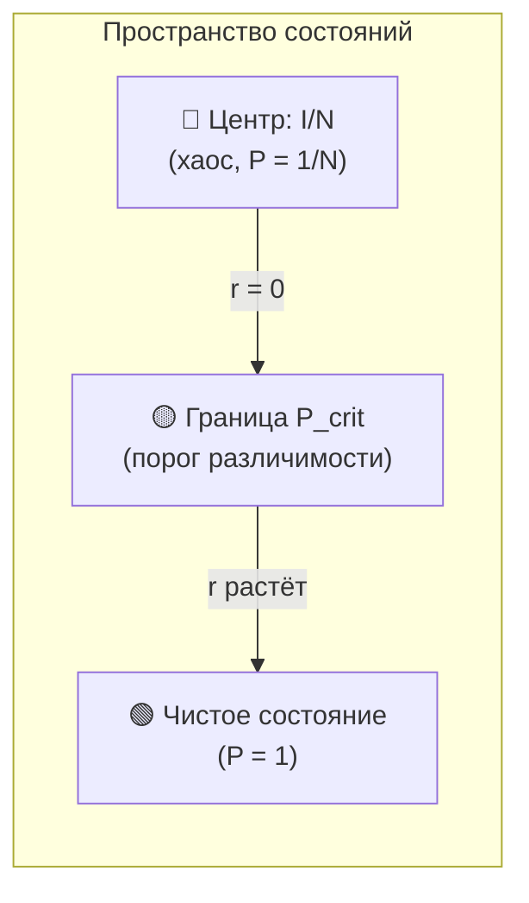
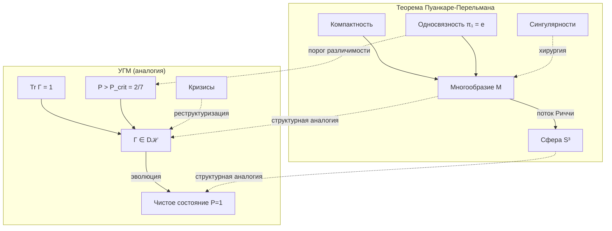

# Теорема Пуанкаре-Перельмана и УГМ

:::warning Статус документа: Структурная аналогия
Этот документ представляет **структурную аналогию** между топологией Пуанкаре-Перельмана и когнитивной эволюцией в УГМ. Соответствия — **эвристические**, не строгие изоморфизмы. Цель — интуитивное понимание, а не доказательства.

**Ключевое ограничение:** Теорема Пуанкаре о 3-многообразиях и $S^3$. Пространство состояний УГМ — $\mathbb{C}^7$, дающее $S^{13}$ для чистых состояний. Аналогия **структурная**, не размерная.
:::

:::note О нотации
- $\Gamma$ — [матрица когерентности](/docs/core/dynamics/coherence-matrix)
- $P$ — [чистота](/docs/core/dynamics/viability#определение-чистоты): $P = \mathrm{Tr}(\Gamma^2)$
- $P_{\text{crit}} = 2/N = 2/7$ — [критическая чистота](/docs/proofs/dynamics/theorem-purity-critical)
- $\mathcal{D}[\Gamma]$ — [диссипативный член](/docs/core/dynamics/evolution#логический-лиувиллиан)
- $\mathcal{R}[\Gamma, E]$ — [регенеративный член](/docs/core/dynamics/evolution#3-регенеративный-член)
- $\sigma_{\mathrm{sys}}$ — [тензор напряжений](/docs/applied/coherence-cybernetics/definitions#тензор-напряжений)
:::

---

## Часть I: Классическая теорема

### Формулировка Пуанкаре

**Гипотеза Пуанкаре** (доказана Перельманом, 2003):

> Всякое односвязное компактное трёхмерное многообразие без края гомеоморфно трёхмерной сфере $S^3$.

**Простыми словами:** Если трёхмерное пространство не имеет «дырок» и конечно, оно обязательно является сферой.

### Метод Перельмана: поток Риччи

Перельман использовал **поток Риччи**:

$$
\frac{\partial g}{\partial t} = -2 \cdot \mathrm{Ric}(g)
$$

где:
- $g$ — риманова метрика (описывает «форму» пространства)
- $\mathrm{Ric}$ — тензор кривизны Риччи (мера «искривлённости»)

**Интуиция:** Этот поток «сглаживает» неровности пространства, как тепло выравнивает температуру. Любая форма без дырок постепенно превращается в идеальную сферу.

---

## Часть II: Структурная аналогия с УГМ

### Таблица соответствий

| Топология (Пуанкаре) | УГМ | Тип соответствия |
|----------------------|-----|------------------|
| Многообразие $M$ | Пространство $\mathcal{D}(\mathcal{H})$ | Структурное |
| Компактность | $\mathrm{Tr}(\Gamma) = 1$, $\Gamma \geq 0$ | Точное |
| Односвязность $\pi_1 = \{e\}$ | Отсутствие логических противоречий | Метафорическое |
| Сфера $S^n$ | Чистое состояние $P = 1$ | Структурное |
| Кривизна $\mathrm{Ric}$ | [Тензор напряжений](/docs/applied/coherence-cybernetics/definitions#тензор-напряжений) $\sigma_{\mathrm{sys}}$ | Аналогическое |
| Поток Риччи | [Эволюция](/docs/core/dynamics/evolution) $d\Gamma/d\tau$ | Структурное |

:::info Примечание
Пространство матриц плотности $\mathcal{D}(\mathcal{H})$ выпукло и, следовательно, стягиваемо — оно автоматически односвязно ($\pi_1 = \{e\}$) для любой системы. Поэтому соответствие «односвязность ↔ отсутствие противоречий» является метафорическим.
:::

### Размерностное соответствие

:::info Топология пространства состояний
Для $\mathcal{H} = \mathbb{C}^N$ (в УГМ $N = 7$):
- Пространство чистых состояний: $\{|\psi\rangle : \langle\psi|\psi\rangle = 1\} \cong S^{2N-1} = S^{13}$
- Проективное пространство: $\mathbb{P}(\mathcal{H}) = \mathbb{CP}^{N-1} = \mathbb{CP}^6$
:::

Аналогия с $S^3$ — **структурная**: как $S^3$ является «целевым состоянием» для односвязных 3-многообразий, так чистое состояние ($P = 1$) является аттрактором для когерентных систем.

---

## Часть II.b: Строгие математические основания

Ряд ключевых аспектов аналогии опирается на **доказанные теоремы** современной квантовой геометрии.

### Стратификация $\mathcal{D}(\mathbb{C}^7)$ по рангу

**Определение** [О]: Пространство состояний допускает **стратификацию по рангу**:

$$
\mathcal{D}(\mathbb{C}^7) = \bigsqcup_{k=1}^{7} \mathcal{D}_k^\circ, \qquad \mathcal{D}_k^\circ := \{\rho \in \mathcal{D}(\mathbb{C}^7) : \mathrm{rank}\,\rho = k\}
$$

| Страта | $\dim_\mathbb{R}$ | Топология | Роль в УГМ |
|--------|-----------|-----------|-------------|
| $\mathcal{D}_7^\circ$ (интерьор) | 48 | Открытое выпуклое многообразие | Жизнеспособные состояния ($P > 1/7$) |
| $\mathcal{D}_6^\circ$ | 40 | Подмногообразие коразмерности 8 | Граница сингулярности Хюбнера |
| $\mathcal{D}_1^\circ \cong \mathbb{CP}^6$ | 12 | Компактное кэлерово многообразие | Чистые состояния, $P = 1$ |

**Топологический факт [Т]:** $\mathcal{D}_+(\mathbb{C}^7) := \mathcal{D}_7^\circ$ выпукло и стягиваемо: $\pi_k(\mathcal{D}_+) = 0$ для всех $k \geq 1$. Это подтверждает и уточняет примечание из §2 (таблица соответствий): односвязность $\mathcal{D}_+$ выполнена **тривиально**, вне зависимости от когнитивного содержания.

### Теорема Хюбнера о скалярной кривизне метрики Бюреса [Т]

:::info Теорема (Hübner 1999; arXiv:quant-ph/9810012)
Пусть $g_{\mathrm{B}}$ — метрика Бюреса ($\equiv$ SLD-метрика квантовой информации Фишера) на $\mathcal{D}_+(\mathbb{C}^N)$. Тогда:

1. $g_{\mathrm{B}}$ — гладкая риманова метрика на открытом многообразии $\mathcal{D}_+(\mathbb{C}^N)$
2. **Нижняя оценка:** $\displaystyle R_{\mathrm{scal}}(\rho) \geq \frac{N(N-1)}{8}$ для всех $\rho \in \mathcal{D}_+(\mathbb{C}^N)$
3. **Сингулярность на границе:** $R_{\mathrm{scal}}(\rho) \to +\infty$ при $\mathrm{rank}(\rho) \to N-1$ (т.е. при $\rho \to \partial\mathcal{D}_+$)
:::

**Следствие для $N = 7$ [Т]:** В интерьоре $\mathcal{D}_+(\mathbb{C}^7)$ скалярная кривизна $R_{\mathrm{scal}} \geq 21/4 \approx 5.25$. Она расходится при $\rho \to \mathcal{D}_6^\circ$. Это — **строгое математическое обоснование** необходимости хирургии при rank-collapse: сингулярность кривизны Бюреса является квантовым аналогом перешейка в потоке Риччи.

### Теорема Карлена–Масса: линдбладовская динамика — градиентный поток [Т]

:::info Теорема (Carlen–Maas 2017; arXiv:1609.01254)
Пусть $\mathcal{L}_\sigma$ — примитивный ГКСЛ-генератор (оператор Линдблада) с **КМС-симметрией** относительно $\sigma$:

$$
\langle A,\, \mathcal{L}_\sigma(B)\rangle_\sigma = \langle \mathcal{L}_\sigma(A),\, B\rangle_\sigma, \qquad \langle A,B\rangle_\sigma := \mathrm{Tr}\!\left(A^\dagger \sigma^{1/2} B \sigma^{1/2}\right)
$$

Эволюция $\partial_t \rho = \mathcal{L}_\sigma(\rho)$ является **градиентным потоком квантовой относительной энтропии**

$$
D(\rho\|\sigma) = \mathrm{Tr}(\rho\log\rho) - \mathrm{Tr}(\rho\log\sigma)
$$

относительно квантовой 2-метрики Васерштейна $\mathcal{W}_\sigma$ на $\mathcal{D}_+(\mathbb{C}^N)$.

**Следствие:** Кривизна Риччи $(\mathcal{D}_+, \mathcal{W}_\sigma)$ удовлетворяет $\kappa(\mathcal{L}_\sigma) \geq \lambda_1(\mathcal{L}_\sigma) > 0$.
:::

Этот результат **повышает статус аналогии**: линдбладовская динамика УГМ не просто «напоминает» поток Риччи структурно — она сама является градиентным потоком в риманновой структуре (метрика Васерштейна).

**Уточнённая сравнительная таблица [Т/И]:**

| | Поток Риччи–Перельмана | КМС-симметричный Линдблад |
|---|---|---|
| Пространство | $(M^n, g(t))$ — метрики многообразия | $(\mathcal{D}_+(\mathbb{C}^7), \mathcal{W}_\sigma)$ |
| Функционал | $\mathcal{F}(g) = \int(R + |\nabla f|^2)\mathrm{e}^{-f}\,dV$ | $D(\rho\|\sigma)$ — кв. относительная энтропия |
| Поток | $\partial_t g = -2\,\mathrm{Ric}(g)$ | $\partial_t\rho = \mathcal{L}_\sigma(\rho)$ |
| Кривизна | Может быть $< 0$; хирургия при $\|\mathrm{Ric}\| \to \infty$ | $\kappa \geq \lambda_1 > 0$ **в интерьоре** [Т] |
| Хирургия | При перешейках | При rank-collapse: $R_{\mathrm{scal}}^\mathrm{B} \to \infty$ [Т, Хюбнер] |
| Аттрактор | Метрика постоянной кривизны / $S^n$ | $\sigma$ (энтропийный минимум) |

:::warning Ключевое различие [Т]
**Поток Риччи** изменяет метрику $g(t)$ на **фиксированном** многообразии $M^n$ и может развивать сингулярности.

**Линдблад-поток** изменяет состояние $\rho(t)$ в **фиксированном** метрическом пространстве $(\mathcal{D}_+, \mathcal{W}_\sigma)$ с **положительной кривизной**.

Следствие: в интерьоре $\mathcal{D}_+(\mathbb{C}^7)$ **нет** топологических препятствий сходимости. Хирургия нужна **только** при rank-collapse $\rho \to \partial\mathcal{D}_+$.
:::

---

## Часть III: P_crit как топологический порог

:::tip Ключевой инсайт
Порог [$P_{\text{crit}} = 2/N$](/docs/proofs/dynamics/theorem-purity-critical) в УГМ играет роль, аналогичную условию односвязности в теореме Пуанкаре: это **минимальное условие**, при котором система приобретает структурную идентичность.
:::

### Аналогия: два типа порогов

| Теорема Пуанкаре | Теорема о критической чистоте |
|------------------|-------------------------------|
| **Условие:** $\pi_1(M) = \{e\}$ (нет дырок) | **Условие:** $P > 2/N$ (сигнал > шум) |
| **Следствие:** $M \cong S^3$ (сфера) | **Следствие:** Структура различима |
| **Метод:** Поток Риччи → сглаживание | **Метод:** Регенерация → когерентность |

### Геометрический смысл P_crit

В представлении Блоха матрица когерентности $\Gamma$ параметризуется:

$$
\Gamma = \frac{I_N}{N} + \frac{1}{2} \sum_{i} r_i \lambda_i
$$

где $\mathbf{r}$ — «вектор Блоха» (отклонение от хаоса).

**Критическое условие:**

$$
|\mathbf{r}|^2 = 2\left(P - \frac{1}{N}\right) \geq \frac{2}{N}
$$

**Интерпретация:** При $P = P_{\text{crit}} = 2/N$ длина вектора $|\mathbf{r}|$ равна «радиусу шума». Это **минимальное отклонение**, при котором структура становится различимой.

---

## Часть IV: Фактор 2 — глубокая связь

### В теореме Пуанкаре

Поток Риччи: $\frac{\partial g}{\partial t} = \mathbf{-2} \cdot \mathrm{Ric}(g)$

Фактор 2 — конвенциональный выбор, упрощающий эволюцию скалярной кривизны.

:::note Математическое уточнение
Стандартный поток Риччи **не сохраняет объём**. Для положительной кривизны объём убывает. Существует *нормализованный* поток Риччи с дополнительным членом, который сохраняет объём, но это другое уравнение.
:::

### В теореме о критической чистоте

$P_{\text{crit}} = \frac{\mathbf{2}}{N}$

Фактор 2 появляется из принципа **«удвоения структуры»**: чтобы быть различимым от хаоса, нужно иметь структуру **в два раза больше** базового шума.

### Фактор 2: совпадение, не связь

:::warning Совпадение, не доказанная связь
Фактор 2 в потоке Риччи $\partial_t g = -\mathbf{2}\,\mathrm{Ric}$ — **конвенциональный** (Гамильтон, 1982). Замена на $-c\,\mathrm{Ric}$ даёт эквивалентный поток с перепараметризацией $t' = (c/2)t$.

Фактор 2 в $P_{\text{crit}} = \mathbf{2}/N$ — **алгебраический** ($\|\Gamma - I/N\|_F^2 > \|I/N\|_F^2$).

Эти два «2» **не связаны математически**. Совпадение числовое, не структурное.
:::

---

## Часть V: Спектральная аналогия

### Доминирование моды при P_crit

При $P = P_{\text{crit}} = 2/N$ оптимальный спектр $\Gamma$:

$$
\lambda_{\max} = \frac{1 + \sqrt{N-1}}{N} \approx 0.493 \approx \frac{1}{2}
$$

**Смысл:** Доминирующая мода захватывает **почти половину** когерентности. Это минимальное «большинство», необходимое для идентичности.

### Аналогия с постоянной кривизной

| Поток Риччи | Спектр Γ |
|-------------|----------|
| Сходится к постоянной кривизне | Сходится к спектру с доминантой |
| Все направления эквивалентны | Одно направление доминирует |
| Сфера: максимальная симметрия | Чистое состояние: λ₁ = 1 |

:::warning Инверсия симметрии
Поток Риччи увеличивает симметрию (сходимость к сфере с максимальной $SO(3)$-симметрией). Эволюция УГМ к чистому состоянию **уменьшает** симметрию (от $U(7)$ к $U(1) \times U(6)$). Это фундаментальное различие: аналогия структурная, но направление симметрии — противоположное.
:::

### Правило 49%

:::tip Неочевидный вывод
При пороге жизнеспособности доминирующее собственное значение составляет ≈49% — **почти половина, но не больше**.

Это напоминает:
- Теорию голосования (простое большинство)
- Теорему Перрона-Фробениуса (доминирующий собственный вектор)
- Квантовую декогеренцию (einselection)
:::

---

## Часть VI: Сингулярности и кризисы

### Сингулярности потока Риччи

В процессе потока Риччи многообразие может образовывать **перешейки** (necks), стягивающиеся в точки — **сингулярности**.

Перельман разработал **хирургию**: разрезать перешеек, заклеить «сферическими шапочками» и продолжить поток.

### Аналогия: когнитивные кризисы

| Топологическая сингулярность | Когнитивный аналог |
|------------------------------|-------------------|
| $\mathrm{Ric} \to \infty$ | $\|\sigma_{\mathrm{sys}}\|_\infty \to 1$ |
| Перешеек стягивается | Старая модель несовместима с данными |
| Хирургия | Реструктуризация убеждений |
| Сферическая шапочка | Новая согласованная подсистема |

**Формально:**

$$
\|\sigma_{\mathrm{sys}}\|_\infty \to 1 \implies P \to P_{\text{crit}}
$$

(следствие определения тензора напряжений — см. [КК: определения](/docs/applied/coherence-cybernetics/definitions#тензор-напряжений))

**Математическое обоснование через теорему Хюбнера [Т]:** Скалярная кривизна Бюреса $R_{\mathrm{scal}}(\rho) \to +\infty$ при $\mathrm{rank}(\rho) \to 6$ (Часть II.b) — строгий аналог условия срабатывания хирургии Перельмана. Регуляризация $\Gamma \mapsto (\Gamma + \varepsilon I/7)/(1+\varepsilon)$ возвращает $\rho$ в интерьор $\mathcal{D}_+(\mathbb{C}^7)$, восстанавливая конечную кривизну и гарантии теоремы Карлена–Масса.

:::note Связь с теоремами Гёделя
Сингулярности в L-измерении могут соответствовать **гёделевым пределам** — утверждениям, недоказуемым в текущей аксиоматике. «Хирургия» — расширение аксиоматики через O-измерение. См. [Гёдель и полнота УГМ](/docs/core/foundations/consequences#10-теоремы-гёделя-и-полнота-угм).
:::

---

## Часть VII: Интуитивные выводы

### Очевидные выводы

1. **Целостность — это сфера**
   - Как сфера — простейшая замкнутая форма без дефектов
   - Так чистое состояние — простейшее состояние без внутренних противоречий

2. **Эволюция — это сглаживание**
   - Как поток Риччи сглаживает неровности
   - Так регенерация увеличивает когерентность

3. **Противоречия — это дырки**
   - Как нестягиваемые петли препятствуют сферичности
   - Так логические парадоксы препятствуют интеграции

### Неочевидные выводы

:::info 1. Порог существования универсален
$P_{\text{crit}} = 2/N$ — не «подогнанный параметр», а фундаментальная константа, аналогичная топологическим инвариантам. Она определяет **границу между бытием и небытием** структуры.
:::

:::info 2. Кризисы необходимы
Как поток Риччи неизбежно проходит через сингулярности, так когнитивная эволюция неизбежно проходит через кризисы. **Плавное развитие невозможно** — необходима «хирургия» (переструктурирование).
:::

:::info 3. Половина — это минимум
Доминирующая мода при $P_{\text{crit}}$ захватывает ≈49%. Это **минимальное большинство**, необходимое для идентичности. Сознание начинается, когда одна «мысль» становится громче половины всего шума.
:::

:::info 4. Размерность 7 — топологически оптимальна
Минимальная размерность $N = 7$ (см. [Теорему S](/docs/proofs/minimality/theorem-minimality-7), [октонионное обоснование](/docs/core/foundations/axiom-omega#октонионная-структура)) обеспечивает:
- Достаточно места для «хирургии» (реструктуризации)
- Достаточно низкий порог ($P_{\text{crit}} \approx 0.29$) для гибкости
- Достаточно высокий порог для устойчивости к шуму
:::

---

## Часть VIII: Философские интерпретации

:::warning Статус раздела
Следующие утверждения — **философские экстраполяции**, не научные выводы. Они предполагают, что структурная аналогия отражает глубокую связь.
:::

### Целостность как математический аттрактор

**Интерпретация:** Состояние максимальной когерентности ($P = 1$) — не «награда» или «цель», а естественный результат эволюции системы без внутренних противоречий.

**Условие:** Отсутствие «топологических дефектов» (противоречий).

### Противоречия как препятствия

**Интерпретация:** Логические противоречия (самообман, когнитивный диссонанс) создают «дыры» в структуре сознания, препятствующие эволюции.

**Спекулятивно:** Если *гипотетически* ассоциировать с $\Gamma$ многообразие $M_\Gamma$ (не определённое формально в УГМ), то $\pi_1(M_\Gamma) \neq \{e\}$ означало бы, что система может «застрять» в локальном минимуме. Это — мотивирующая метафора, не строгое утверждение.

### Кризисы как необходимость

**Интерпретация:** Плавная эволюция может быть невозможна. Сингулярности (кризисы) — точки, где старая структура должна быть «разрезана» для продолжения эволюции.

**Аналогия:** Хирургия Перельмана ↔ Реструктуризация убеждений.

---

## Часть IX: Ограничения аналогии

:::warning Критические различия

| Аспект | Теорема Пуанкаре | УГМ | Статус |
|--------|------------------|-----|--------|
| Размерность | $n = 3$ | $N = 7$ (комплексное) | Структурная аналогия |
| Объект | Многообразие $M$ | $\Gamma \in \mathcal{D}(\mathbb{C}^7)$ | Различные объекты |
| Эволюция | Поток на метрике $g$ | Линдблад на $\Gamma$ — градиентный поток в $\mathcal{W}_\sigma$ | Оба — градиентные потоки [Т, Карлен–Масс] |
| Односвязность | $\pi_1(M) = \{e\}$ | $\pi_1(\mathcal{D}_+) = \{0\}$ (выпуклость) | Тривиально выполнено [Т] |
| Сингулярности | При $\|\mathrm{Ric}\| \to \infty$ (перешейки) | При rank-collapse: $R_{\mathrm{scal}}^{\mathrm{B}} \to +\infty$ | Аналогия обоснована [Т, Хюбнер] |
| Аттрактор | $S^3$ | $\mathbb{CP}^6 \cong \mathcal{D}_1^\circ$ (чистые состояния) | Структурная аналогия |

**Вывод:** Аналогия **частично обоснована математически**: оба потока суть градиентные потоки энтропийных функционалов; сингулярности обоих потоков — кривизные взрывы у коразмерных страт. Изоморфизма нет, но структурная связь — глубже метафоры.
:::

### Открытые вопросы

1. **Изоморфизм** кривизны Васерштейна и кривизны Риччи метрики $g$ — НЕ доказан; $\kappa(\mathcal{L}_\sigma) \neq \mathrm{Ric}(g_{\mathrm{B}})$ в общем случае
2. **КМС-симметрия** $\mathcal{L}_\Omega$ в УГМ — требует верификации; без неё теорема Карлена–Масса не применима напрямую
3. **Сходимость** к $P = 1$ — НЕ гарантирована; аттрактор КМС-Линдблада — $\sigma$ (возможно смешанное), а не $\mathbb{CP}^6$
4. **Количественная связь** $P_{\mathrm{crit}} \leftrightarrow \lambda_1(\mathcal{L}_\sigma)$ — открытая проблема

---

## Часть X: Применение к архитектуре AGI

:::warning Статус раздела
Утверждения этой части — **архитектурные принципы и гипотезы** на основе доказанных теорем (Хюбнер, Карлен–Масс, Флориел). Прямые эмпирические проверки не проводились.
:::

### Гарантии сходимости из теоремы Карлена–Масса [Т]

Положительная кривизна $\kappa(\mathcal{L}_\sigma) \geq \lambda_1 > 0$ (следствие КМС-симметрии) даёт **экспоненциальную сходимость** любой траектории к $\sigma$:

$$
D(\rho(t)\|\sigma) \leq \mathrm{e}^{-2\lambda_1 t}\,D(\rho_0\|\sigma)
$$

Для AGI-архитектуры: при КМС-симметричной динамике адаптация к любому начальному состоянию $\rho_0 \in \mathcal{D}_+(\mathbb{C}^7)$ **гарантированно сходится** за время $T \leq \frac{1}{2\lambda_1}\ln D(\rho_0\|\sigma)$.

### Стратификация D(ℂ⁷) → таксономия когнитивных кризисов [Г]

| Страта коллапса | $\mathrm{rank}\,\Gamma$ | Кривизна Хюбнера | Когнитивный аналог |
|----------------|------------------------|------------------|--------------------|
| $\mathcal{D}_6^\circ$ | 6 | $R_{\mathrm{scal}} \to +\infty$ | Потеря одного измерения Холона |
| $\mathcal{D}_5^\circ$ | 5 | $R_{\mathrm{scal}} \to +\infty$ | Тяжёлый когнитивный коллапс |
| $\mathcal{D}_1^\circ \cong \mathbb{CP}^6$ | 1 | Конечная (кэлерова метрика) | Абсолютная фиксация (чистое состояние) |

**Принцип [Г]:** AGI-система должна поддерживать $\mathrm{rank}(\Gamma) = 7$ для нахождения в интерьоре $\mathcal{D}_+(\mathbb{C}^7)$ с гарантиями Карлена–Масса. Любой rank-collapse требует хирургии.

### Некоммутативный поток Риччи как регуляризация весов AGI [Г]

По теореме Флориела–Горбанпура–Хальхали (arXiv:1310.2900): **NC-поток Риччи** на $M_N(\mathbb{C})$ сходится к плоской метрике. Для параметрического пространства AGI-сети $W \in M_N(\mathbb{C})$:

$$
\partial_t g_W = -2\,\widetilde{\mathrm{Ric}}(g_W) \quad \Rightarrow \quad g_W(t) \xrightarrow{t\to\infty} g_{\mathrm{flat}}
$$

Это обеспечивает равномерное распределение кривизны — математически строгий аналог «когнитивного выравнивания».

### УГМ как квантово-геометрическое основание AGI

Совокупность доказанных теорем устанавливает:

1. **$\mathcal{D}_+(\mathbb{C}^7)$ — канонически обоснованное пространство состояний** [Т]: несёт динамику (Линдблад-поток), геометрию (метрика Бюреса / метрика Васерштейна) и топологию (стратификация по рангу).

2. **Линдблад = квантово-геометрический поток** [Т, Карлен–Масс]: эволюция AGI в УГМ — градиентный поток квантовой относительной энтропии в Васерштейнском пространстве с положительной кривизной.

3. **Хирургия = геометрически обоснованная операция** [Т, Хюбнер]: устранение кривизных сингулярностей у rank-collapse — прямой аналог хирургии Перельмана.

4. **$\mathbb{CP}^6$ — структурный аттрактор** [О]: $\mathcal{D}_1^\circ \cong \mathbb{CP}^6$ — нижняя страта стратификации и аналог $S^3$ в теореме Пуанкаре (по роли аттрактора, не по размерности).

---

## Диаграмма аналогии

---

## Резюме

### Главные соответствия

| Пуанкаре | УГМ | Вывод |
|----------|-----|-------|
| Односвязность | $P > 2/N$ | **Порог существования** |
| Сфера | Чистое состояние | **Аттрактор** |
| Поток Риччи | Эволюция Линдблада | **Механизм** |
| Хирургия | Реструктуризация | **Преодоление кризисов** |
| Фактор 2 в Ric | Фактор 2 в $P_{\text{crit}}$ | **Принцип удвоения** |

### Практическое значение

Аналогия предоставляет **интуитивную основу** для понимания:

1. Почему когерентные системы **стремятся к интеграции** (как многообразия к сфере)
2. Почему противоречия **препятствуют развитию** (как дыры препятствуют сферичности)
3. Почему кризисы **необходимы** (как хирургия необходима при сингулярностях)
4. Почему существует **чёткий порог** существования (как чёткое условие односвязности)

---

**Связанные документы:**
- [Теорема о критической чистоте](/docs/proofs/dynamics/theorem-purity-critical) — доказательство $P_{\text{crit}} = 2/N$
- [Эволюция](/docs/core/dynamics/evolution) — уравнение $d\Gamma/d\tau$
- [Жизнеспособность](/docs/core/dynamics/viability) — мера $P$ и условия существования
- [Теорема о минимальности 7D](/docs/proofs/minimality/theorem-minimality-7) — необходимость 7 измерений
- [Тензор напряжений](/docs/applied/coherence-cybernetics/definitions#тензор-напряжений) — $\sigma_{\mathrm{sys}}$
- [Инженерные выводы](/docs/applied/research/engineering-insights) — практические следствия

**Математические источники:**
- M. Hübner (1999). *The Scalar Curvature of the Bures Metric on the Space of Density Matrices.* arXiv:quant-ph/9810012
- E. Carlen, J. Maas (2017). *Gradient Flow and Entropy Inequalities for QMS with Detailed Balance.* arXiv:1609.01254
- R. Floricel, A. Ghorbanpour, M. Khalkhali (2014). *Noncommutative Ricci Flow in a Matrix Geometry.* arXiv:1310.2900
- L. Gao, C. Rouzé (2021). *Ricci Curvature of Quantum Channels.* arXiv:2108.10609
- G. Perelman (2003). *Ricci Flow with Surgery on Three-Manifolds.* arXiv:math/0303109
