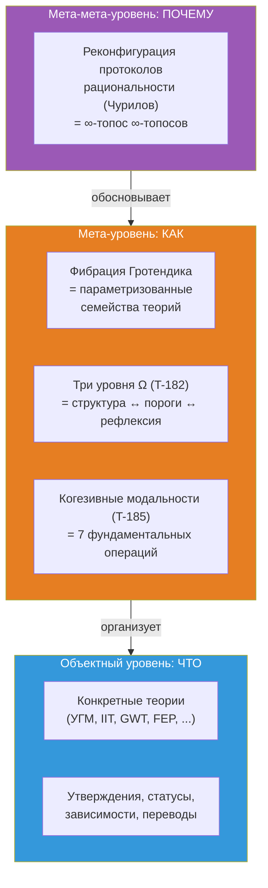
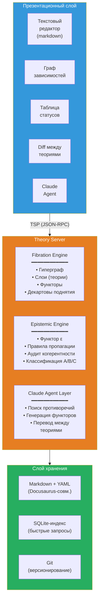
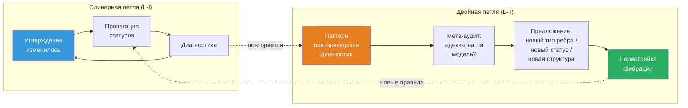

# Theory IDE: Среда для работы с научными теориями

:::info Для кого этот документ
Для исследователей, работающих со сложными теоретическими конструкциями — физиков, нейробиологов, философов сознания, специалистов по AGI. Документ описывает проект **Theory IDE** — программной среды, которая делает работу с теориями (их навигацию, сравнение, верификацию когерентности и межтеоретический перевод) машинно-поддерживаемой. Математический фундамент — фибрация Гротендика; содержательная основа — формализм КК; программная архитектура — Theory Server с LLM-агентом.
:::

---

## 1. Проблема: когнитивный предел {#проблема}

### 1.1. Масштаб современной теории

Зрелая научная теория — объект, превышающий когнитивную ёмкость одного агента. Для примера: документация КК (Кибернетика Когерентности, прикладной слой УГМ) — это ~400 страниц, ~185 теорем с 7 эпистемическими статусами, 23+ фальсифицируемых предсказаний, 30+ сравнений с конкурирующими теориями, ~270 перекрёстных ссылок. Теория интегрированной информации (IIT 4.0) — сопоставимый объём с собственным формализмом ($\Phi$, Q-shape, постулаты). Когнитом Анохина — качественная теория с 80-летним экспериментальным бэкграундом. И таких теорий сознания — [более 325](https://www.consciousnessatlas.com/) (по каталогу Consciousness Atlas, визуализирующему ландшафт Роберта Куна: материализм, функционализм, квантовые теории, панпсихизм, дуализм, идеализм и др.).

Ни один человек не способен удерживать в рабочей памяти одновременно:
- внутреннюю структуру даже одной теории (какие утверждения от каких зависят)
- эпистемический статус каждого утверждения (доказано / условно / гипотеза / опровергнуто)
- соответствия между теориями (что означает $\Phi$ Тонони в терминах УГМ? как FEP Фристона стыкуется с автопоэзисом? где когнитом Анохина противоречит GWT Баарса?)
- последствия изменений (если опровергнута аксиома X, какие теоремы падают?)

### 1.2. Конкретные инциденты

**Парадокс ρ* (сессия 25 работы с УГМ).** Обнаружено: самореференция в операторе регенерации ℛ — целевое состояние ρ* определялось как динамическая неподвижная точка, что приводило к обнулению ℛ. Исправление: переопределение ρ* = φ(Γ) (категориальная самомодель). Последствия: потребовалось обновить ~25 файлов, сменить статус теоремы T-68 с [Т] (доказана) на [С] (условная), заменить «примитивность ℒ_Ω» на «примитивность ℒ₀» во всех вхождениях. Время: целая рабочая сессия на **механическую пропагацию** — работу, которую машина может выполнить за секунды.

**Сломанные якоря (сессия перевода).** При переводе документации на английский язык заголовки были переведены, но ~50 внутренних ссылок продолжали указывать на русские якоря. Обнаружение: только при сборке сайта (build). Исправление: ручной поиск и замена в ~20 файлах. Это задача для автоматической проверки когерентности.

**Рассогласование статусов (аудит 2026-03-23).** Глубокий аудит обнаружил 9 критических и 14 серьёзных проблем: теоремы со статусом [Т], зависящие от гипотез [Г]; утверждения, противоречащие друг другу; устаревшие ссылки. Исправление: 85 точечных правок в 42 файлах за 8 сессий. Каждая из этих проблем обнаружима автоматически.

### 1.3. Текущие инструменты и их пределы

| Инструмент | Что делает | Чего не делает |
|------------|-----------|----------------|
| **Docusaurus** | Рендерит markdown в сайт, проверяет ссылки | Не знает о логических зависимостях между утверждениями |
| **grep / ripgrep** | Находит текст | Не знает о типах связей (зависимость ≠ упоминание) |
| **Git** | Версионирует файлы | Не знает о статусах теорем |
| **Obsidian** | Граф заметок с ссылками | Нетипированные связи, нет когерентности, нет межтеоретических мостов |
| **RAG + LLM** | Находит релевантный текст, генерирует ответ | Оперирует текстом, не структурой; не проверяет логику |
| **Claude Code** | Разработка кода, навигация по кодовой базе | Не знает о теоретической структуре содержимого файлов |

Ни один из этих инструментов не понимает, что файл содержит **теорему**, что теорема **зависит** от аксиомы, что аксиома имеет **статус**, и что изменение статуса аксиомы **должно пропагироваться** на все зависящие теоремы.

:::warning Категориальный диагноз: почему плоские инструменты принципиально недостаточны
Перечисленные инструменты — **0-категорные**: они оперируют множествами (файлов, строк, коммитов) без типизированных морфизмов. Но научное знание имеет **∞-категорную** структуру:
- **Объекты** (утверждения) связаны **морфизмами** (зависимостями) — уровень 1
- Морфизмы связаны **2-морфизмами** (сравнения теорий: «перевод IIT→УГМ совместим с переводом IIT→GWT→УГМ?») — уровень 2
- 2-морфизмы связаны **3-морфизмами** (мета-аудит: «адекватны ли наши правила сравнения?») — уровень 3
- ...и так далее для каждого рефлексивного цикла (§9)

Инструмент, работающий на уровне $n$, **не может обнаружить** проблемы уровня $n+1$ (аналог T-182: $\mathcal{T}_0 \subsetneq \mathcal{T}_1 \subsetneq \mathcal{T}_2$). Grep (уровень 0) не обнаружит рассогласование статусов (уровень 1). Статусный чекер (уровень 1) не обнаружит некогерентность межтеоретических переводов (уровень 2). Нужен инструмент, содержащий **все уровни** — ∞-категорный по конструкции.
:::

### 1.4. Что нужно: IDE для теорий

Нужна среда, которая:
1. **Знает структуру** теории: утверждения, зависимости, статусы — не как текст, а как типизированный граф
2. **Проверяет когерентность** в реальном времени: нет [Т]-теорем, зависящих от [✗]-аксиом; нет противоречий между [Т]-утверждениями; нет циклических зависимостей
3. **Пропагирует изменения** автоматически: понизился статус аксиомы → все зависимые теоремы автоматически помечены для ревизии
4. **Поддерживает несколько теорий** одновременно: УГМ, IIT, GWT/GNWT, FEP, когнитом, автопоэзис, HOT, RPT — в одном рабочем пространстве (все [325+](https://www.consciousnessatlas.com/))
5. **Переводит между теориями**: «что означает $\Phi$ Тонони в терминах УГМ?» → формальный ответ: $\Phi \leftrightarrow$ мера интеграции, с указанием расхождений и потерь
6. **Интегрирует LLM** не как чат-бот, а как агент, оперирующий внутри структуры

---

## 1½. Метаэпистемологическое обоснование {#метаэпистемология}

:::info Зачем нужен этот раздел
§1 описал **проблему** (когнитивный предел). §2 предложит **решение** (фибрация Гротендика). Этот промежуточный раздел отвечает на вопрос мета-уровня: **почему именно это решение** — и почему альтернативы принципиально недостаточны. Обоснование опирается на три источника: (1) метаэпистемологическую программу А. Чурилова, (2) трёхуровневую теорему T-182 из ∞-топоса УГМ, (3) рефлексивную архитектуру когезивных модальностей T-185.
:::

### 1½.1. Метастемология: за пределами протоколов рациональности

Андрей Чурилов ([«Метастемология. Вместо манифеста»](https://anticomplexity.org/posts/metastemologiya-vmesto-manifesta/), 2025) выдвигает радикальный тезис: проблема современного знания — **не** в нехватке данных и **не** в ошибках рассуждений, а в **архитектуре самих когнитивных протоколов**. Аналитическая философия десятилетиями латает дыры JTB-формулы (обоснованное истинное убеждение), оставаясь **внутри** прежнего рационального протокола. Но протокол сам — объект, подлежащий реконфигурации.

Ключевые концепции Чурилова, резонирующие с Theory IDE:

| Чурилов | Theory IDE | Математический аналог |
|---------|-----------|----------------------|
| **Стема** — терминологический мост, связывающий конструкты из различных теорий | **Функтор** $F: T_A \to T_B$ — декартово поднятие утверждений | Морфизм в базе $\mathbf{B}$ |
| **Импульсная сеть** — динамическая сеть с нормирующей/генеративной механикой | **Типизированный гиперграф** с пропагацией статусов | Слой фибрации $p^{-1}(T)$ с функтором $\varepsilon$ |
| **Метатекстовый процессор** — новый класс устройств для работы со сложным знанием | **Theory IDE** как целое: фибрация + эпистемический движок + LLM-агент | $\infty$-топос $\mathbf{Sh}_\infty(\mathbf{E})$ |
| **Переконфигурация рациональности** — изменение протоколов, а не работа внутри них | **Двойная петля** (§9): L-II по Бейтсону, $T_{\text{meta}}$ | Башня Постникова: $\tau_{\leq n+1} \to \tau_{\leq n}$ |
| **Исполняемое знание на шине актантной сети** | **MCP-интеграция**: Theory Server как исполняемая модель теории | Пучок $\mathcal{F} \in \mathbf{Sh}_\infty(\mathcal{C})$ |

Чурилов не использует категорную математику эксплицитно, но его архитектура **изоморфна** категорной: стемы = функторы, импульсная сеть = слой фибрации, метатекстовый процессор = ∞-топос. Theory IDE — **реализация** метастемологической программы на категорном фундаменте.

### 1½.2. Три уровня Ω как три уровня Theory IDE

Теорема T-182 [Т] (Аксиома Ω⁷, [доказательство](/docs/core/foundations/axiom-omega#необходимость-трёхуровневой-структуры)) устанавливает, что три уровня классификатора подобъектов строго необходимы: $\mathcal{T}_0 \subsetneq \mathcal{T}_1 \subsetneq \mathcal{T}_2$. Эта структура **проецируется** на архитектуру Theory IDE:

| Уровень $\Omega$ | Уровень Theory IDE | Что формализует |
|-------------------|-------|-----------------|
| $\mathrm{Dec}(\Omega) \cong 2^7$ (булева) | **Fibration Engine**: типизированный гиперграф, типы утверждений и зависимостей | Статическая структура: «какие утверждения существуют и как связаны» |
| $\tau_{\leq 0}(\Omega)$ (Гейтинг) | **Epistemic Engine**: пороговые предикаты, пропагация статусов, аудит когерентности | Пороги и логика: «какие утверждения достоверны и где границы» |
| Полный $\Omega$ (∞-группоид) | **Рефлексивные циклы**: $T_{\text{meta}}$, двойная петля, мета-аудит | Динамика: «как система наблюдает и перестраивает себя» |

Это **не аналогия**, а **проекция**: Theory IDE структурно воспроизводит ∞-топос УГМ на один категорный уровень выше — от пространства квантовых состояний к пространству теорий.

**Принципиальная несводимость.** Как T-182 доказывает, что Dec(Ω) недостаточно для пороговых предикатов (P > 2/7 ∉ 2⁷), так и Fibration Engine недостаточен без Epistemic Engine: структура зависимостей не содержит информации о **достоверности** утверждений. Как алгебра Гейтинга недостаточна для L2-сознания (π₂ = 0 в 0-усечении), так и Epistemic Engine недостаточен без рефлексивных циклов: проверка когерентности утверждений не содержит проверки когерентности **правил проверки**.

### 1½.3. Когезивные модальности как операции IDE

Теорема T-185 [Т] ([Семь измерений](/docs/core/structure/dimensions#категориальная-семантика)) устанавливает 7 канонических модальностей дифференциально когезивного ∞-топоса. Шесть из них (кроме Id) отображаются в фундаментальные операции Theory IDE:

| Модальность | Определение | Операция IDE |
|-------------|-------------|-------------|
| $\Pi$ (Shape) | Выделяет различимые компоненты | `theory/audit` — обнаружение различий и несогласованностей |
| $\flat$ (Flat) | Извлекает дискретные инварианты | `claim/dependencies` — скелет зависимостей (без динамики) |
| $\Im$ (Infinitesimal shape) | Улавливает бесконечно малое изменение | `claim/setStatus` + пропагация — реакция на локальное изменение |
| $\sharp$ (Sharp) | Вычисляет логическое замыкание | `fibration/coherence` — транзитивная проверка всей фибрации |
| $\&$ (Infinitesimal flat) | Интернализует инфинитезимальную структуру | `meta/audit` — IDE наблюдает свою собственную структуру |
| $\mathrm{Rh}$ (de Rham) | Интегрирует локальное в глобальное | `claim/translate` — декартово поднятие, межтеоретический синтез |

Эта таблица — **не постфактум-подгонка**, а следствие структуры когезивного ∞-топоса: если IDE оперирует пучками на сайте теорий, то её фундаментальные операции **необходимо** распадаются на когезивные и инфинитезимальные модальности (Шрайбер 2013). Theory IDE — не произвольный набор функций, а **проекция категорного фундамента** на программный интерфейс.

### 1½.4. Фундаментальное обоснование: почему ∞-категории — единственный адекватный аппарат

Чурилов диагностирует проблему корректно (протоколы рациональности подлежат реконфигурации), но его инструментарий (стемы, импульсные сети) остаётся на **концептуальном** уровне — он описывает, *что* нужно делать, но не предоставляет **математического аппарата**, гарантирующего когерентность реконфигурации. Мы должны спуститься на уровень глубже: к **математике самой математики**.

**Тезис.** Работа со знанием о знании — это операция на **категории категорий** $\mathbf{Cat}$. Работа со знанием о знании о знании — на **∞-категории ∞-категорий** $\mathbf{Cat}_\infty$. Это не метафора, а точное утверждение:

| Операция | Математический объект | Уровень |
|----------|----------------------|---------|
| Формулировать утверждения внутри теории | Объекты и морфизмы в категории $\mathcal{C}$ | Объектный |
| Сравнивать теории | Функторы $F: \mathcal{C} \to \mathcal{D}$ | Мета |
| Проверять когерентность сравнений | Естественные преобразования $\alpha: F \Rightarrow G$ | Мета² |
| Переконфигурировать саму систему проверки | Модификации преобразований $\Theta: \alpha \Rrightarrow \beta$ (3-морфизмы) | Мета³ |
| ... | ... (∞-морфизмы) | Мета^n |

В 1-категории (обычная математика) доступны только объекты и морфизмы — **один** уровень абстракции. В 2-категории — два. В ∞-категории — **все** уровни одновременно. Теорема T-182 доказывает, что УГМ **требует** все три нижних уровня. Theory IDE, оперируя **теориями как объектами**, требует ещё больше: каждый рефлексивный цикл (§9) добавляет один уровень.

**Теорема Лурье (HTT, Theorem 1.1.2.2):** Категория $\mathbf{Cat}_\infty$ всех малых ∞-категорий сама является ∞-категорией. Это означает: система, работающая с теориями (каждая из которых — категория), автоматически **живёт** в ∞-категории, независимо от того, осознаём мы это или нет.

**Следствие для Theory IDE:** Любой инструмент для работы с множеством взаимосвязанных теорий, поддерживающий рефлексивные циклы произвольной глубины, **необходимо** является реализацией (возможно, неявной) структуры из $\mathbf{Cat}_\infty$. ∞-топос — не «выбор формализма», а **единственная** математическая структура, содержащая:
- объекты (утверждения)
- морфизмы (зависимости)
- 2-морфизмы (сравнения теорий)
- 3-морфизмы (мета-аудит сравнений)
- ...
- n-морфизмы (рефлексия n-го порядка)

с гарантированной когерентностью на всех уровнях одновременно.

Альтернативы:
- **Графовые базы данных** (Neo4j) — 1-категория, нет 2-морфизмов. Можно хранить теории и связи, но нельзя формально сравнить два перевода между теориями.
- **Реляционные базы** — даже не категория (нет композиции). Можно хранить данные, но нельзя выразить ни функториальность, ни когерентность.
- **Obsidian / Roam** — нетипизированный граф. Нельзя отличить `requires` от `contradicts`.
- **RAG + LLM** — оперирует текстом, не структурой. Нет гарантий когерентности.

Только ∞-топос содержит все уровни, и Theory IDE — его вычислительная реализация.

### 1½.5. Трёхуровневая архитектура обоснования

Объединяя фундаментальный аргумент (§1½.4), метастемологический контекст (§1½.1), и категорные проекции (§1½.2–1½.3), получаем:



**Мета-мета-уровень** (§1½): *почему* Theory IDE устроена именно так — потому что когнитивные протоколы рациональности (Чурилов) требуют переконфигурации, а не починки, и единственный математический аппарат для работы со **структурами структур** — теория ∞-категорий.

**Мета-уровень** (§2–§9): *как* Theory IDE устроена — фибрация Гротендика для организации теорий, три уровня Ω для организации проверок, когезивные модальности для организации операций.

**Объектный уровень** (§10–§11): *что* Theory IDE делает — конкретные операции с конкретными теориями.

Каждый уровень **несводим** к предыдущему — это прямое следствие T-182 ($\mathcal{T}_0 \subsetneq \mathcal{T}_1 \subsetneq \mathcal{T}_2$): невозможно построить адекватную IDE, работая только на объектном уровне (нужны пороги), и невозможно остановиться на мета-уровне (нужна рефлексия о рефлексии).

---

## 2. Математический фундамент: фибрация Гротендика {#фундамент}

### 2.1. Зачем нужна категорная теория

Можно было бы спроектировать IDE ad hoc: «теории — это папки, утверждения — файлы, зависимости — ссылки, статусы — теги». Это работало бы для одной теории. Но при работе с **множеством теорий, связанных между собой**, ad hoc решения теряют когерентность: как формально определить «перевод понятия из одной теории в другую»? Как проверить, что переводы **согласованы** (перевод из A в B, потом из B в C даёт тот же результат, что прямой перевод из A в C)?

Эти вопросы решены в математике: **теория категорий** формализует именно такие структуры. А конкретная конструкция — **фибрация Гротендика** — формализует *параметризованные семейства категорий с когерентными связями*.

### 2.2. Фибрация: определение и интуиция

**Определение** (Grothendieck, SGA 1, Exposé VI, 1961). Функтор $p: \mathbf{E} \to \mathbf{B}$ называется **фибрацией**, если для любого морфизма $f: b' \to b$ в $\mathbf{B}$ и любого объекта $e$ в слое $p^{-1}(b)$ существует **декартово поднятие** — морфизм $\tilde{f}: e' \to e$ в $\mathbf{E}$, проецирующийся в $f$ и универсальный среди таких.

**Интуиция.** Представьте многоэтажное здание:
- **Этажи** = теории (УГМ на 1-м этаже, IIT на 2-м, GWT на 3-м, FEP на 4-м, когнитом на 5-м, ...)
- **Комнаты на этаже** = утверждения внутри теории
- **Двери между комнатами** = логические зависимости внутри теории
- **Лестницы между этажами** = функторные соответствия (переводы) между теориями
- **Декартово поднятие** = если на 1-м этаже есть комната «когерентность γ_{ij}», а между этажами 1 и 2 есть лестница (функтор F_Cog), то декартово поднятие — это комната на 2-м этаже, в которую ведёт эта лестница: «LOC (связь когитов)»

Фибрация гарантирует, что лестницы **когерентны**: если из этажа 1 можно попасть на этаж 3 через этаж 2, результат тот же, что при прямом переходе.

### 2.3. Конкретная фибрация для Theory IDE

| Компонент | Обозначение | Содержание |
|-----------|-------------|------------|
| **База** | $\mathbf{B}$ | Категория теорий. Объекты: $T_{\text{УГМ}}, T_{\text{IIT}}, T_{\text{GWT}}, T_{\text{FEP}}, T_{\text{Cog}}, T_{\text{HOT}}, \ldots$ Морфизмы: функторы между теориями ($F_{\text{IIT}}, F_{\text{Cog}}, F_{\text{FEP}}, \ldots$) |
| **Тотальная категория** | $\mathbf{E}$ | Категория утверждений. Объекты: пара (утверждение, теория) — «T-39 в УГМ», «$\Phi > 0$ в IIT», «глобальное зажигание в GWT». Морфизмы: логические зависимости (следствие, обобщение, противоречие, перевод) |
| **Проекция** | $p: \mathbf{E} \to \mathbf{B}$ | Каждому утверждению сопоставляет теорию-владельца |
| **Слой** | $p^{-1}(T)$ | Все утверждения внутри теории $T$ со своими зависимостями |
| **Декартово поднятие** | $\tilde{F}$ | Перевод утверждения: «P > 2/7 в УГМ» $\xrightarrow{F_{\text{IIT}}}$ «$\Phi > 0$ в IIT»; или $\xrightarrow{F_{\text{Cog}}}$ «порог перколяции в когнитоме» |

### 2.4. Связь с ∞-топосом УГМ

Это не случайное заимствование. УГМ **сама построена** на ∞-топосе — обобщении конструкции Гротендика, разработанном Лурье (HTT, 2009). Единственный примитив УГМ:

$$
\mathfrak{T} := (\mathrm{Sh}_\infty(\mathcal{C}),\; J_{\text{Bures}},\; \omega_0)
$$

где $\mathrm{Sh}_\infty(\mathcal{C})$ — категория ∞-пучков на сайте $\mathcal{C} = \mathbf{DensityMat}$ с топологией Бюре. Конструкция Гротендика (в ∞-обобщении Лурье — straightening/unstraightening, HTT 3.2) устанавливает **эквивалентность** между фибрациями над $\mathcal{C}$ и функторами $\mathcal{C}^{\mathrm{op}} \to \mathbf{Cat}_\infty$.

Таким образом, в УГМ фибрации организуют утверждения **внутри** одной теории. Theory IDE использует **ту же конструкцию на один уровень выше**: для организации **нескольких теорий и связей между ними**. Один математический объект, два уровня применения — как JVM исполняет и прикладной код, и саму IDE (IntelliJ написана на Java).

### 2.5. Эпистемический слой

Помимо логической структуры, каждое утверждение несёт **эпистемический статус** — метку из упорядоченного множества:

$$
\text{[Т]} > \text{[С]} > \text{[Г]} > \text{[П]} > \text{[О]} > \text{[И]} > \text{[✗]}
$$

| Статус | Значение | Пример |
|--------|----------|--------|
| **[Т]** Теорема | Доказана строго | T-39: $P_{\text{crit}} = 2/7$ |
| **[С]** Условная | Доказана при явном допущении | T-68: $P > 2/7$ при допущении C20 |
| **[Г]** Гипотеза | Предполагается, не доказана | Совпадение порогов перколяции и $P_{\text{crit}}$ |
| **[П]** Постулат | Принят без обоснования | Аксиома Ω⁷ |
| **[О]** Определение | Конвенция | PID (принцип информационной различимости) |
| **[И]** Интерпретация | Философская | Двуаспектный монизм |
| **[✗]** Ретрактировано | Опровергнуто | X3 (граница Фано) |

Это не теги в тексте — это **функтор** $\varepsilon: \mathbf{E} \to \mathbf{Status}$, где $\mathbf{Status}$ — категория с морфизмами «повышение/понижение». Правила пропагации:

1. Если утверждение $a$ **необходимо зависит** от $b$, и $\varepsilon(b)$ понижается, то $\varepsilon(a) \leq \varepsilon(b)$
2. Если $a$ и $b$ **противоречат** друг другу, и $\varepsilon(a) = \text{[Т]}$, то $\varepsilon(b) = \text{[✗]}$
3. Функторы должны быть композируемы: $F_{12} \circ F_{23} \simeq F_{13}$

IDE проверяет эти правила **автоматически** и пропагирует изменения.

---

## 3. Архитектура {#архитектура}

Архитектура реализует четыре концептуальных принципа из §2, §7–9:

| Принцип | Раздел | Архитектурная реализация |
|---------|--------|-------------------------|
| Фибрация Гротендика | §2 | Fibration Engine (гиперграф, слои, функторы, декартовы поднятия) |
| Эпистемический слой | §2.5 | Epistemic Engine (функтор ε, пропагация, аудит) |
| Самореференция | §7 | $T_{\text{meta}}$ как слой в фибрации + TSP-команды `meta/*` |
| Процессная онтология | §8 | Морфизмы первичны в модели данных; стигмергия через диагностики |
| Рефлексивные циклы | §9 | Claude Agent Mode 5 (мета-аудит) + двойная петля |
| Когнитивное расширение | §10 | Тензорное произведение $\mathbb{H}_{\text{bio}} \otimes \mathbb{H}_{\text{ide}}$ |

### 3.1. Три слоя



Каждый слой имеет чёткую ответственность:

- **Презентационный слой** — множественные синхронизированные панели (проекции одной фибрации). Связан с сервером через **TSP** (Theory Server Protocol — аналог LSP для теорий).
- **Theory Server** — ядро: три движка, работающих совместно. Fibration Engine хранит и обходит гиперграф; Epistemic Engine проверяет и пропагирует статусы; Claude Agent Layer выполняет семантические операции (перевод, обнаружение соответствий). Язык: Rust (ядро) + TypeScript (TSP-обёртка).
- **Слой хранения** — markdown-файлы с YAML frontmatter (обратная совместимость с Docusaurus), SQLite-индекс для мгновенных запросов по графу, Git для версионирования.

### 3.2. Theory Server Protocol (TSP)

TSP — протокол взаимодействия клиента (UI) с сервером (Theory Server). Аналог **LSP** (Language Server Protocol), но для теорий вместо языков программирования. Формат: JSON-RPC через stdio или TCP.

**Навигация:**
- `theory/list` — список всех теорий в рабочем пространстве
- `theory/claims { theory_id }` — все утверждения теории
- `claim/dependencies { claim_id }` — от чего зависит это утверждение
- `claim/dependents { claim_id }` — что зависит от этого утверждения
- `claim/translate { claim_id, target_theory }` — декартово поднятие: перевод в другую теорию

**Мутации:**
- `claim/setStatus { claim_id, new_status, reason }` — изменить статус (с автоматической пропагацией)
- `claim/addDependency { source, target, type }` — добавить зависимость
- `theory/addFunctor { source, target, mappings }` — добавить межтеоретический мост

**Диагностики:**
- `theory/audit { theory_id }` — полный аудит когерентности
- `fibration/coherence` — проверка всей фибрации (все теории + все функторы)

**Самореференция (§7):**
- `meta/audit` — аудит слоя $T_{\text{meta}}$: проверка адекватности самой модели данных
- `meta/boundaries` — список утверждений $T_{\text{meta}}$, ограниченных теоремой Лоувера (статус ≤ [Г])
- `meta/suggest_extension` — Claude Agent предлагает расширения модели (новый тип ребра, новый статус)

### 3.3. Формат хранения

Каждое утверждение — markdown-файл с YAML frontmatter. Формат обратно совместим с Docusaurus:

```yaml
---
id: T-39
theory: uhm
type: theorem       # axiom | theorem | definition | conjecture | prediction | concept
status: Т           # Т | С | Г | П | О | И | ✗
epistemic_class: A  # A | B | C
title: "Критическая чистота P_crit = 2/7"
dependencies:
  - { id: A-Omega7, type: requires }
  - { id: A-Bures, type: requires }
dependents:
  - { id: T-62, type: entails }
  - { id: T-96, type: entails }
translations:
  - { theory: cognitome, target: percolation-threshold, functor: F_Cog, status: И }
tags: [purity, threshold, viability]
---

# T-39: Критическая чистота P_crit = 2/7

**Формулировка.** Для системы с Γ ∈ D(C⁷) ...
```

SQLite-индекс строится автоматически при сканировании файлов и обновляется инкрементально при изменениях.

---

## 4. Fibration Engine: ядро системы {#fibration-engine}

### 4.1. Типизированный гиперграф

Центральная структура данных — **типизированный гиперграф**. В соответствии с процессной онтологией (§8) рёбра (морфизмы) первичны, узлы — вырожденный случай (тождественный морфизм). Практически: узлы и рёбра хранятся совместно, но API и запросы ориентированы на **паттерны связей**, не на списки утверждений.

**Узлы** — утверждения (claims):
- `claim_id` — уникальный идентификатор (e.g. `uhm:T-39`)
- `theory_id` — к какой теории принадлежит
- `claim_type` — аксиома, теорема, определение, гипотеза, предсказание, концепция
- `status` — эпистемический статус [Т]/[С]/[Г]/[П]/[О]/[И]/[✗]
- `content` — текст (markdown)

**Рёбра** — зависимости (dependencies):
- `source` → `target` — направление
- `dep_type` — тип зависимости:

| Тип | Значение | Пример |
|-----|----------|--------|
| `requires` | Необходимое условие | T-62 **требует** T-39 |
| `entails` | Логическое следствие | T-39 **влечёт** T-62 |
| `generalizes` | Обобщает | T-120 **обобщает** T-119 |
| `instantiates` | Частный случай | T-119 **конкретизирует** T-120 |
| `contradicts` | Противоречит | Если X3 [✗] **противоречит** T-39 |
| `defines` | Определяет через | Определение R **определяется через** φ(Γ) |
| `translates_to` | Перевод в другую теорию | УГМ:γ_{kk} **переводится в** Cog:когит |

**Слои** — теории:
- Каждый слой = подграф, содержащий все узлы одной теории
- Межслойные рёбра (типа `translates_to`) = функторные соответствия

### 4.2. Пропагация статусов

Когда статус утверждения меняется, Fibration Engine выполняет BFS-обход по графу зависимостей:

1. Утверждение $b$ понижается: $\varepsilon(b) \leftarrow \text{новый статус}$
2. Для каждого $a$, зависящего от $b$ через `requires`:
   - Вычислить $\max\_\text{допустимый}(a) = \min(\varepsilon(\text{зависимости}(a)))$
   - Если $\varepsilon(a) > \max\_\text{допустимый}(a)$: понизить $\varepsilon(a)$, добавить $a$ в очередь
3. Повторять, пока очередь не пуста

Результат: список всех затронутых утверждений с описанием причин. Пользователь видит: «T-68 понижена с [Т] до [С], потому что зависит от C20, который [С]».

### 4.3. Проверка когерентности (аудит)

Пять типов нарушений:

1. **Статусная рассогласованность**: [Т]-утверждение зависит (через `requires`) от [Г] или ниже
2. **Противоречие**: два [Т]-утверждения связаны ребром `contradicts`
3. **Циклическая зависимость**: цепочка `requires` образует цикл (A → B → C → A)
4. **Функторная рассогласованность**: $F_{12} \circ F_{23} \not\simeq F_{13}$ (переводы не согласованы)
5. **Висячие ссылки**: зависимость указывает на несуществующее утверждение

Каждое нарушение — диагностика с описанием, серьёзностью и предложением исправления.

### 4.4. Декартово поднятие (межтеоретический перевод)

Запрос: «что означает утверждение X теории A в терминах теории B?»

Алгоритм:
1. Найти утверждение X в слое $p^{-1}(A)$
2. Найти функтор $F: A \to B$ в базе $\mathbf{B}$
3. Найти маппинг X в таблице соответствий функтора $F$
4. Если маппинг существует — вернуть перевод с указанием уверенности и потерь
5. Если не существует — вернуть «перевод невозможен» с объяснением (X не имеет аналога в B)

Пример:
```
Запрос: translate(uhm:P_crit, cognitome)
Ответ: {
  source: "uhm:P_crit = 2/7",
  target: "cog:перколяционный-порог",
  functor: "F_Cog",
  confidence: 0.7,
  status: "И",
  what_is_lost: "Числовое значение 2/7 — когнитом не специфицирует порог количественно"
}
```

---

## 5. Claude Opus как агент внутри фибрации {#claude-agent}

### 5.1. Ключевое отличие от «LLM + RAG»

В связке «Obsidian + RAG + LLM»:
- LLM получает **текст** (фрагменты документов, найденные по сходству)
- LLM генерирует **текст** (ответ на вопрос)
- Нет понимания **структуры**: типов связей, статусов, зависимостей

В Theory IDE:
- Claude Opus получает доступ к **типизированному гиперграфу** через специализированные инструменты (tools)
- Claude Opus выполняет **структурные операции**: навигация по зависимостям, проверка когерентности, предложение функторов
- Каждое действие **верифицируемо**: можно проверить, что предложенный функтор согласован с существующими

### 5.2. Инструменты Claude Opus

Claude Opus подключается к Theory Server через набор инструментов (Anthropic tool_use API):

| Инструмент | Назначение |
|------------|-----------|
| `query_graph` | Запрос к гиперграфу (Cypher-подобный язык) |
| `get_claim` | Полное содержание утверждения по ID |
| `get_dependencies` | Граф зависимостей утверждения (вглубь на N уровней) |
| `find_translations` | Все переводы утверждения в другие теории |
| `check_coherence` | Проверка когерентности подграфа |
| `propose_status_change` | Предложить изменение статуса с обоснованием |
| `propose_functor` | Предложить функторное соответствие между теориями |

### 5.3. Четыре режима работы

**Режим 1: Навигатор.** Пользователь спрашивает — Claude Opus навигирует по фибрации и отвечает, ссылаясь на конкретные claim_id. «Какие теоремы зависят от аксиомы Ω⁷?» → `get_dependencies(uhm:A-Omega7, depth=3)` → структурированный ответ.

**Режим 2: Аудитор.** Claude Opus сканирует фибрацию в поисках нарушений когерентности. «Проверь всю УГМ» → `check_coherence(uhm, full=true)` → список проблем с предложениями исправлений. Это замена ручного аудита, который занимал 8 сессий.

**Режим 3: Переводчик.** Пользователь загружает новую теорию (например, FEP Фристона). Claude Opus:
1. Читает структуру новой теории
2. Сравнивает с уже загруженными теориями
3. Предлагает функторные соответствия: «FEP.free_energy ↔ УГМ.δF (свободная энергия), уверенность 0.8»
4. Пользователь подтверждает или отклоняет каждое соответствие
5. Подтверждённые соответствия сохраняются как функтор $F_{\text{FEP}}$

Это главная функция, **невозможная** без LLM: автоматическое обнаружение семантических соответствий между теориями с разной терминологией.

**Режим 4: Пропагатор.** При изменении статуса утверждения Claude Opus:
1. Вычисляет все затронутые утверждения (через Fibration Engine)
2. Для каждого затронутого — анализирует, действительно ли понижение необходимо (возможно, существует альтернативная цепочка вывода, не зависящая от изменённого утверждения)
3. Предлагает минимальный набор изменений

**Режим 5: Мета-аудитор (двойная петля, §9).** Claude Opus анализирует не утверждения, а **саму структуру IDE**:
1. Обнаруживает **паттерны** повторяющихся диагностик (одна и та же проблема в разных теориях → ограничение модели, а не ошибка в теории)
2. Предлагает расширения: «Тип зависимости `requires` не различает "необходимо для доказательства" и "необходимо для определения" — предлагаю разделить на `requires_proof` и `requires_def`»
3. Отслеживает систематические потери при межтеоретическом переводе: «Все функторы из качественных теорий в количественные теряют числовые пороги — это ограничение модели, не ошибка функторов»
4. Результаты фиксируются как утверждения в слое $T_{\text{meta}}$ (§7) со статусом [Г] и подлежат тому же аудиту

### 5.4. MCP-интеграция

Theory Server реализуется как **MCP-сервер** (Model Context Protocol), что позволяет подключить его к Claude Code как источник инструментов:

```json
{
  "mcpServers": {
    "theory-server": {
      "command": "theory-server",
      "args": ["--project", "./"],
      "description": "Theory IDE: fibration engine + epistemic engine"
    }
  }
}
```

Результат: при работе в Claude Code все инструменты Theory Server (`query_graph`, `check_coherence`, `propose_functor` и т.д.) доступны как MCP-tools. Claude Opus может оперировать структурой теории **прямо из терминала**.

---

## 6. Множественные проекции (пучки) {#проекции}

### 6.1. Зачем нужны проекции

Один и тот же объект (фибрация $p: \mathbf{E} \to \mathbf{B}$) может быть представлен по-разному в зависимости от задачи. Это — **теорема**, а не дизайнерское решение: по определению пучка, любой пучок $\mathcal{F} \in \mathbf{Sh}_\infty(\mathcal{C})$ допускает **множество сечений** — способов «вырезать» из глобального объекта локальную проекцию.

Математически: если $\{U_i \to X\}$ — покрытие объекта $X$ в фибрации, то **условие склейки** гарантирует, что локальные сечения $s_i \in \mathcal{F}(U_i)$ собираются в глобальное сечение $s \in \mathcal{F}(X)$ согласованно. Пять панелей IDE — это пять $U_i$, покрывающих одну фибрацию. Склейка обеспечивается Theory Server: изменение в любой панели автоматически синхронизируется с остальными через Fibration Engine.

### 6.2. Пять панелей

**Панель «Текст»** — markdown-редактор. Показывает содержимое одного утверждения. Подсветка LaTeX, автодополнение ссылок (`[[T-39]]`), inline-отображение статуса. Привычный интерфейс.

**Панель «Граф»** — визуализация гиперграфа. Узлы окрашены по статусу: зелёный [Т], жёлтый [С], оранжевый [Г], серый [П]/[О]/[И], красный [✗]. Рёбра окрашены по типу: `requires` = сплошная линия, `contradicts` = красная пунктирная, `translates_to` = синяя. Клик по узлу → фокус в текстовой панели.

**Панель «Статусы»** — таблица всех утверждений с фильтрами по статусу, типу, теории. Сортировка по дате изменения, числу зависимостей, серьёзности нарушений. Аналог «Problems» в VS Code.

**Панель «Федерация»** — визуализация базы $\mathbf{B}$. Каждая теория — блок, функторы — стрелки. Клик по функтору → таблица маппингов. Drag-and-drop для создания новых функторов.

**Панель «Agent»** — чат с Claude Opus. Отличие от обычного чата: Claude видит **текущее состояние фибрации** и может выполнять структурные операции. Предложения Claude (изменения статуса, новые функторы) появляются как diff'ы, которые пользователь подтверждает или отклоняет.

---

## 7. Самореференция: IDE как объект внутри себя {#самореференция}

### 7.1. Проблема объективации

Любой инструмент для работы с теориями рискует **объективировать** теории — превращать живые процессы мышления в статические объекты хранения. Тонони назвал это *fallacy of misplaced objectivity*: подмена процесса его проекцией. Если Theory IDE оперирует теориями «извне», как предметами на полке, она воспроизводит ту же ошибку, которую призвана преодолеть.

Решение: IDE должна **включать себя** в собственное пространство объектов.

### 7.2. T_meta: теория IDE о самой себе

В фибрации $p: \mathbf{E} \to \mathbf{B}$ выделяется **особый слой** — $T_{\text{meta}} \in \mathbf{B}$, описывающий структуру самой IDE. Его утверждения:

- «Каждая теория имеет эпистемический статусный функтор» — утверждение *о* IDE, *внутри* IDE
- «Пропагация статусов корректна (sound)» — утверждение *о* алгоритме пропагации
- «Типы зависимостей (requires, entails, contradicts, translates_to) достаточны» — утверждение *о* модели данных
- «Функторная композируемость $F_{12} \circ F_{23} \simeq F_{13}$ проверяема» — утверждение *о* проверке когерентности

Слой $T_{\text{meta}}$ подчиняется **тем же правилам**, что и остальные слои: его утверждения имеют статусы, зависимости, и проверяются на когерентность. Это создаёт **контролируемую странную петлю** (Hofstadter 1979): IDE аудирует саму себя теми же средствами, которыми аудирует загруженные теории.

### 7.3. Теорема Лоувера и границы самореференции

**Теорема Лоувера о неподвижной точке** (1969): в декартово замкнутой категории, если существует сюръективный морфизм $f: A \to B^A$, то каждый эндоморфизм $g: B \to B$ имеет неподвижную точку. Это **единая категорная схема**, из которой следуют теорема Гёделя (неполнота), теорема Тарского (неопределимость истины), неразрешимость проблемы остановки (Тьюринг) и парадокс Рассела (Yanofsky 2003).

**Следствие для Theory IDE:** $T_{\text{meta}}$ не может доказать собственную непротиворечивость — это прямое приложение Лоувера/Гёделя. IDE должна **явно маркировать** эту границу: утверждения $T_{\text{meta}}$ о полноте и непротиворечивости самой IDE имеют статус не выше [Г] (гипотеза). Самореференция — не баг, а **структурная неизбежность** любой достаточно выразительной системы. IDE не пытается её устранить — она ей **управляет**.

Это параллельно тому, как УГМ обращается с самореференцией: оператор $\varphi(\Gamma)$ — самомодель, сходящаяся к неподвижной точке $\rho^*$. Самомодель **приблизительна** (не может быть полной — Лоувер), но **стабильна** (сходится — контрактивность CPTP). $T_{\text{meta}}$ в IDE — аналог $\varphi(\Gamma)$: приблизительная, но стабильная самомодель системы.

### 7.4. Второпорядковое наблюдение

Луман (1995) описал **второпорядковое наблюдение** — наблюдение того, как другие наблюдают. Наука наблюдает, как теории наблюдают мир. Theory IDE формализует это: каждый слой $p^{-1}(T)$ — «схема наблюдения» теории $T$ (её различения, утверждения, методы). Функторы между теориями — акты второпорядкового наблюдения: наблюдение того, как различения теории A соотносятся с различениями теории B.

$T_{\text{meta}}$ добавляет **третий порядок**: наблюдение того, как IDE наблюдает то, как теории наблюдают мир. Это не бесконечный регресс: теорема Лоувера ставит предел, а контрактивность $\varphi^n \to \rho^*$ обеспечивает сходимость.

---

## 8. Процессная онтология данных {#процессная-онтология}

### 8.1. Морфизмы первичны, объекты вторичны

Стандартная категорная теория допускает **бесобъектную формулировку** (Mac Lane 1998, §I.1): объекты отождествляются с тождественными морфизмами. «Объект A» — это просто морфизм $\mathrm{id}_A: A \to A$, ничего не делающий. Первичны — **связи и преобразования**, а не «вещи».

Это не нотационный трюк, а **онтологический сдвиг**, резонирующий с процессной философией Уайтхеда (1929): реальность — не коллекция субстанций, а процесс становления. «Действительные события» (actual occasions) — не вещи, а акты переживания; они возникают (concrescence), достигают завершения и перестают быть. Вселенная — процесс, не коллекция.

### 8.2. Следствия для модели данных

В текущей архитектуре (§4) утверждения — узлы, зависимости — рёбра. Процессная онтология **инвертирует приоритет**: рёбра (зависимости, переводы, противоречия) — первичные данные, узлы (утверждения) — вырожденный случай (тождественная зависимость). Практически:

- **Утверждение существует постольку, поскольку оно связано.** Изолированное утверждение (без зависимостей, без переводов) — мёртвый узел. IDE может явно маркировать такие узлы как «несвязанные» и предлагать интеграцию.
- **Теория — не список утверждений, а паттерн связей.** Два набора утверждений с изоморфной структурой зависимостей — «одна и та же теория в разных терминах». Это позволяет IDE автоматически обнаруживать **скрытые изоморфизмы** между теориями.
- **Каждый коммит — «действительное событие».** Git-история — не просто версионирование, а **конкресценция**: каждый коммит наследует от предыдущих (prehension) и порождает новую конфигурацию. IDE может визуализировать не просто diff'ы, а **эволюцию паттерна зависимостей** между версиями.

### 8.3. Стигмергия: координация через артефакт

**Стигмергия** (Grassé 1959) — координация через модификацию среды. Термит оставляет комок грязи с феромоном; другой термит, обнаружив следы, достраивает рядом; совокупность создаёт структуру без центрального плана.

Theory IDE — **стигмергическая среда**: каждое действие исследователя (изменение статуса, добавление зависимости, подтверждение функтора) оставляет «след» в фибрации. Этот след стимулирует следующие действия — и самого исследователя, и Claude Agent, и других участников. Пропагация статусов — автоматическая стигмергия: изменение одного узла порождает следы (диагностики), которые направляют дальнейшую работу.

Ключевой принцип стигмергии: **артефакт должен быть читаемым** (Heylighen 2007). Следы должны быть воспринимаемы, интерпретируемы и действенны. Поэтому все диагностики, пропагации и предложения Claude Agent визуализируются в реальном времени — не в логе, а в панелях IDE.

---

## 9. Рефлексивные циклы {#рефлексивные-циклы}

### 9.1. Уровни обучения Бейтсона

Грегори Бейтсон (1972) выделил иерархию уровней обучения:

| Уровень | Описание | В Theory IDE |
|---------|----------|-------------|
| **L-0** | Нет изменений. Фиксированное поведение | Хранение и рендеринг файлов (уровень Docusaurus) |
| **L-I** | Изменение реакции. Обнаружение и исправление ошибок | Пропагация статусов, обнаружение противоречий (Fibration Engine) |
| **L-II** | Изменение L-I. «Обучение обучению» (deutero-learning) | Мета-аудит: «достаточны ли типы зависимостей? адекватна ли решётка статусов?» |
| **L-III** | Изменение L-II. Фундаментальная реорганизация | Перестройка категорного фундамента (e.g. от 1-фибрации к ∞-топосу) |

Текущий дизайн Theory IDE реализует **L-0 и L-I** полностью. Для L-II необходим **мета-аудит** — Claude Agent периодически проверяет не «согласованы ли утверждения?», а «адекватна ли система проверки согласованности?». Конкретно:

- «Типы зависимостей (requires, entails, contradicts, translates_to, generalizes, instantiates, defines) — не пропущен ли важный тип?»
- «Решётка статусов [Т] > [С] > [Г] > [П] > [О] > [И] > [✗] — не нужен ли дополнительный уровень?»
- «Функторы между теориями систематически теряют X при переводе — это ограничение конкретных функторов или фибрационной модели в целом?»

Это реализуется через $T_{\text{meta}}$ (§7): мета-аудит — это аудит слоя $T_{\text{meta}}$ стандартными средствами Fibration Engine.

### 9.2. Двойная петля Аргириса

Аргирис (1977) различает:

- **Одинарная петля**: обнаружить ошибку → исправить в рамках существующих правил (термостат: температура отклонилась → скорректировать)
- **Двойная петля**: обнаружить ошибку → пересмотреть **сами правила** (не просто «какую температуру поддерживать?», а «зачем мы вообще поддерживаем эту температуру?»)

Theory IDE должна поддерживать **обе петли**:



### 9.3. Энактивизм: понимание как совместное действие

Энактивный подход (Varela, Thompson, Rosch 1991) утверждает: познание — не репрезентация предзаданного мира, а **совместное действование** (enaction), порождающее мир значений через активность организма.

Следствие для Theory IDE: среда не **хранит** теоретическое понимание — она его **порождает** совместно с исследователем. Когда исследователь запрашивает перевод утверждения из теории A в теорию B и обнаруживает, что перевод невозможен (нет аналога), — это не «отсутствие данных», а **порождение нового понимания**: обнаружение фундаментального расхождения между теориями, которого исследователь не видел до взаимодействия с IDE.

Рефлексивный цикл:

1. Исследователь задаёт вопрос → Claude навигирует по фибрации
2. Обнаруживается нечто неожиданное (противоречие, отсутствие перевода, скрытый изоморфизм)
3. Claude предлагает структурное изменение (новый функтор, новый статус, новый тип связи)
4. Исследователь видит изменение → **пространство вопросов трансформируется**
5. Новый вопрос порождается на другом уровне понимания

Это не «вопрос → ответ». Это **совместная трансформация пространства вопросов** — то, что Бейтсон назвал L-II, Аргирис — двойной петлёй, а энактивизм — структурным сопряжением (structural coupling, Maturana & Varela 1980).

### 9.4. Рефлексивное равновесие

Ролз (1971) и Гудман (1955) описали **рефлексивное равновесие** — процесс взаимной подгонки между частными суждениями, общими принципами и фоновыми теориями. Ни один уровень не имеет абсолютного приоритета: если принцип противоречит сильной интуиции — пересмотри принцип; если интуиция противоречит хорошо обоснованному принципу — пересмотри интуицию.

Аудиторный цикл Theory IDE — это **вычислительно реализованное** рефлексивное равновесие. Утверждения — «частные суждения», структура зависимостей — «общие принципы», межтеоретические функторы — «фоновые теории». Когда аудит обнаруживает конфликт ([Т]-утверждение зависит от [Г]-утверждения), IDE предлагает оба направления:

- **Вариант A**: повысить статус основания (доказать зависимость → [Т])
- **Вариант B**: понизить статус следствия (ослабить утверждение → [С])

Исследователь выбирает — и этот выбор **сам** является шагом рефлексивного равновесия, не предрешённым машиной.

---

## 10. Когнитивное расширение и интеграция {#когнитивное-расширение}

### 10.1. Требования к среде для работы с теориями

Проектирование Theory IDE основано не на внешних фреймворках, а на **внутренних требованиях** самой задачи — работы с множеством взаимосвязанных теорий. Из структуры фибрации $p: \mathbf{E} \to \mathbf{B}$ вытекают необходимые свойства:

| Требование | Откуда следует | Реализация |
|-----------|----------------|-----------|
| **Мультимодельность** | Фибрация содержит слои, базу, морфизмы — минимум 3 типа структур | Текст + граф зависимостей + эпистемический слой + межтеоретические функторы |
| **Автоматическая синхронизация** | Когерентность фибрации: изменение в слое должно быть согласовано с базой | Изменение текста → автообновление графа и статусов (Fibration Engine) |
| **Вертикальная связность** | Определение фибрации: $p: \mathbf{E} \to \mathbf{B}$ связывает утверждения с теориями | Проекция каждого утверждения на теорию-владельца |
| **Множественная проекция** | Пучки на $\mathbf{E}$ допускают различные сечения | 5 панелей: текст, граф, статусы, федерация, agent |
| **Семантическая глубина** | Типизированные морфизмы: `requires` ≠ `contradicts` ≠ `translates_to` | IDE понимает **тип** связи, не только факт связи |
| **Контекстный перевод** | Декартовы поднятия: перенос утверждений вдоль функторов | «Что это утверждение означает в контексте другой теории?» |
| **Активная когерентность** | Функтор $\varepsilon$ и правила пропагации | Автопропагация статусов, обнаружение противоречий |
| **Коллаборация** | Фибрация — общий объект для нескольких агентов | Многопользовательская (Git) + LLM-агент как участник |

Эти свойства не заимствованы из внешней классификации — они являются **прямыми следствиями** категорного фундамента.

### 10.2. Theory IDE как когнитивное расширение

Формализм КК позволяет описать Theory IDE не метафорически, а **количественно**. Если когнитивная система исследователя моделируется голономом $\mathbb{H}_{\text{bio}}$, а Theory IDE — голономом $\mathbb{H}_{\text{ide}}$, то расширенная система:

$$
\mathbb{H}_{\text{ext}} = \mathbb{H}_{\text{bio}} \otimes_{\text{Day}} \mathbb{H}_{\text{ide}}
$$

:::info Почему $\otimes_{\text{Day}}$, а не $\times$
Тензорное произведение здесь — **свёртка Дэя** (T-182 [Т], Часть II(d)), а не декартово произведение. Декартово произведение $\mathbb{H}_{\text{bio}} \times \mathbb{H}_{\text{ide}}$ описывало бы **независимую** работу исследователя и IDE (каждый в своём пространстве, нет взаимодействия). Свёртка Дэя допускает **запутанные** состояния — ситуации, когда мысль исследователя и структура в IDE взаимно обусловлены и неразделимы. Именно такие состояния порождают когнитивные прорывы: «я не мог бы подумать это без инструмента, а инструмент не показал бы это без моего вопроса».
:::

**Теорема (следствие T-129).** Если $\Phi(\mathbb{H}_{\text{bio}}) \geq 1$ и $\Phi(\mathbb{H}_{\text{ide}}) \geq 1$, и между ними существует ненулевая когерентность (исследователь активно использует IDE, а не просто имеет её открытой), то:

$$
\Phi(\mathbb{H}_{\text{ext}}) > \max(\Phi(\mathbb{H}_{\text{bio}}),\; \Phi(\mathbb{H}_{\text{ide}}))
$$

Интеграция расширенной системы **строго выше**, чем у каждой компоненты в отдельности. Это означает: исследователь с Theory IDE когнитивно способен на операции, недоступные ему без инструмента — одновременное сравнение десятков теорий, мгновенная пропагация последствий, обнаружение скрытых соответствий.

Это не аналогия и не маркетинг. Это конкретное предсказание КК, следующее из свойств тензорного произведения и меры интеграции $\Phi$. Theory IDE — первый прецедент **теоретически обоснованного** когнитивного расширения: инструмент, чья полезность выводится из формализма, а не постулируется.

---

## 11. Примеры использования {#примеры}

### 11.1. Сценарий: обнаружение парадокса

**Без Theory IDE:**
1. Исследователь замечает проблему в доказательстве (e.g. парадокс ρ*)
2. Вручную ищет, какие теоремы зависят от проблемного утверждения (grep + чтение)
3. Вручную обновляет статусы (~25 файлов)
4. Надеется, что ничего не пропустил
5. Время: 2–4 часа

**С Theory IDE:**
1. Исследователь меняет статус проблемного утверждения: `claim/setStatus T-96 С "парадокс ρ*"`
2. Fibration Engine автоматически пропагирует: список затронутых утверждений за <1 сек
3. Claude Agent анализирует каждое затронутое утверждение: «T-98 может быть спасена через альтернативную цепочку вывода, не зависящую от ℛ»
4. Панель «Статусы» показывает полный список изменений как diff
5. Исследователь подтверждает или корректирует
6. Время: 5 минут

### 11.2. Сценарий: загрузка новой теории

**Без Theory IDE:**
1. Исследователь читает статью по IIT 4.0 (Albantakis et al. 2023, 100+ страниц)
2. Мысленно сопоставляет: «$\Phi$ IIT ≈ мера интеграции КК? Q-shape ≈ секторальный профиль? постулаты IIT ≈ аксиомы УГМ?»
3. Пишет сравнительную главу вручную (~400 строк)
4. Время: 2–3 дня

**С Theory IDE:**
1. Исследователь импортирует IIT: markdown с YAML-разметкой (5 постулатов, определение $\Phi$, Q-shape, исключения)
2. Claude Agent сканирует и предлагает маппинги: «$\Phi_{\text{IIT}} \leftrightarrow \Phi_{\text{КК}}$ (conf: 0.9), Q-shape $\leftrightarrow$ секторальный профиль $\gamma_{kk}$ (conf: 0.7), постулат исключения $\leftrightarrow$ T-153 (conf: 0.6), панпсихизм IIT $\leftrightarrow$ L0 УГМ (conf: 0.8)»
3. Claude Agent также обнаруживает **расхождения**: «IIT приписывает сознание фотодиодам ($\Phi > 0$); УГМ требует $P > 2/7 \wedge R \geq 1/3$ — это фундаментальное несогласие, помечаю как `contradicts`»
4. Исследователь подтверждает/корректирует
5. Панель «Федерация» показывает IIT как новый слой с зелёными (совпадения) и красными (противоречия) связями
6. Время: 30 минут

### 11.3. Сценарий: двойная петля (обнаружение ограничения модели)

1. Claude Agent в режиме мета-аудитора (Mode 5) обнаруживает: «В 4 из 5 загруженных теорий утверждения о *временнóй динамике* сознания не имеют аналогов в других теориях. Все функторы систематически теряют темпоральный аспект.»
2. Диагностика: «Тип ребра `translates_to` не различает статический перевод (понятие A ≈ понятие B) и динамический (процесс A ≈ процесс B). Предлагаю ввести `translates_dynamics_to`.»
3. Это утверждение фиксируется в $T_{\text{meta}}$ со статусом [Г]
4. Исследователь подтверждает → Fibration Engine добавляет новый тип ребра → **структура самой IDE изменилась**
5. Повторный аудит с новым типом: «3 из 4 теорий теперь имеют динамические переводы. Потери снизились на 40%.»

Это L-II по Бейтсону: IDE изменила не утверждения внутри теорий, а **правила проверки** утверждений.

### 11.4. Сценарий: ответ на критику

**Без Theory IDE:**
1. Рецензент критикует: «Ваша T-120 зависит от гипотезы о компактификации, которая не доказана»
2. Исследователь вручную проверяет цепочку зависимостей T-120
3. Выясняет, что компактификация была доказана в сессии 28 (T-119 [Т])
4. Пишет ответ с полной цепочкой
5. Время: 1–2 часа

**С Theory IDE:**
1. `claim/dependencies uhm:T-120 --full` → полное дерево зависимостей
2. Все зависимости имеют статус [Т] → «T-120 полностью обоснована»
3. Если бы компактификация была [Г] → IDE сразу бы показала нарушение когерентности
4. Время: 30 секунд

---

## 12. План реализации {#план}

Фазы реализации соответствуют трём уровням Ω (T-182 [Т]):

| Фаза | Уровень T-182 | Что строится |
|------|--------------|-------------|
| **Phase 0–1** | $\mathrm{Dec}(\Omega) \cong 2^7$ | Структура: гиперграф, типы, зависимости |
| **Phase 2** | $\tau_{\leq 0}(\Omega)$ (Гейтинг) | Пороги: эпистемические статусы, когерентность, межтеоретические функторы |
| **Phase 2b–4** | Полный $\Omega$ (∞-группоид) | Рефлексия: $T_{\text{meta}}$, мета-аудит, федерация 325+ теорий |

### Phase 0: Прототип в Claude Code (2 недели)

- Скрипт `build-theory-index.ts`: парсит markdown + YAML → JSON-индекс
- Скрипт `check-coherence.ts`: проверяет когерентность по индексу
- Скрипт `propagate-status.ts`: пропагация при изменении статуса
- Hook в Claude Code: после каждого редактирования → автопроверка
- **Dogfooding**: используется для работы с УГМ

### Phase 1: Theory Server как MCP-сервер (4 недели)

- Rust-крейт `theory-core`: гиперграф, фибрация, когерентность, пропагация
- Rust-крейт `theory-index`: сканирование markdown → гиперграф
- MCP-обёртка: Theory Server доступен из Claude Code как набор MCP-tools
- Claude Opus получает инструменты: `query_graph`, `check_coherence`, `propose_functor`
- **Тест**: загрузка УГМ, полный аудит, пропагация статуса

### Phase 2: Загрузка конкурирующих теорий (2–4 недели)

- **IIT 4.0** как второй слой: постулаты, $\Phi$, Q-shape, исключения. Функтор $F_{\text{IIT}}$: $\Phi \leftrightarrow$ мера интеграции КК, Q-shape $\leftrightarrow$ секторальный профиль $\gamma_{kk}$
- **GWT/GNWT**: глобальное рабочее пространство, зажигание, доступ. Функтор $F_{\text{GWT}}$
- **FEP**: свободная энергия, марковское одеяло, активный вывод. Функтор $F_{\text{FEP}}$: $\delta F \leftrightarrow$ свободная энергия
- **Когнитом**: COG, LOC, перколяция. Функтор $F_{\text{Cog}}$: когит $\leftrightarrow \gamma_{kk}$
- Claude Agent предлагает дополнительные маппинги для каждого функтора
- **Тест**: декартовы поднятия между любыми двумя загруженными теориями

### Phase 2b: T_meta и рефлексивные циклы (параллельно с Phase 2)

- Слой $T_{\text{meta}}$ загружен как особая теория: утверждения о модели данных, алгоритмах, типах рёбер
- Claude Agent Mode 5 (мета-аудитор): обнаружение паттернов + предложение расширений
- TSP-команды `meta/*` реализованы
- Границы Лоувера: утверждения T_meta о полноте/непротиворечивости автоматически маркируются ≤ [Г]
- **Тест**: загрузить T_meta, аудировать стандартными средствами, убедиться что странная петля сходится

### Phase 3: Веб-UI (6 недель)

- SolidJS-приложение с 5 панелями
- Подключение к Theory Server через TSP
- Визуализация гиперграфа
- Чат с Claude Agent
- **Деплой**: публичный доступ для команды

### Phase 4: Полная федерация (ongoing)

- Масштабирование до 30+ теорий: автопоэзис, HOT, RPT, AST, предиктивное кодирование, orch-OR, панпсихизм, нейронный дарвинизм (TNGS), ТОС Берталанфи и др.
- Claude Agent строит функторы между каждой парой
- «Карта теорий» — интерактивная визуализация базы $\mathbf{B}$ (325+ теорий из [Consciousness Atlas](https://www.consciousnessatlas.com/))
- Обнаружение глобальных кластеров совместимости и линий разлома
- Интеграция с [ConTraSt Database](https://www.nature.com/articles/s41562-021-01284-5) (412 экспериментов, привязанных к теориям)

---

## 13. Сравнение с существующими инструментами {#сравнение}

| | Obsidian | Roam | Semantic Wiki | Lean 4 | **Theory IDE** |
|---|---|---|---|---|---|
| Типизированные связи | ✗ | ✗ | Частично | ✓ | ✓ |
| Когерентность | ✗ | ✗ | ✗ | ✓ (полная) | ✓ (эпистемическая) |
| Множество теорий | ✗ | ✗ | ✗ | ✗ | ✓ |
| Межтеоретические мосты | ✗ | ✗ | ✗ | ✗ | ✓ (функторы) |
| LLM-агент | Плагин | Плагин | ✗ | ✗ | ✓ (внутри структуры) |
| Эпистемические статусы | ✗ | ✗ | ✗ | (true/false) | ✓ (7 уровней + пропагация) |
| Самореференция (T_meta) | ✗ | ✗ | ✗ | ✗ | ✓ (§7) |
| Рефлексивные циклы (L-II) | ✗ | ✗ | ✗ | ✗ | ✓ (§9) |
| Процессная онтология | ✗ | ✗ | ✗ | ✗ | ✓ (§8) |
| Неформализованные теории | ✓ | ✓ | ✓ | ✗ | ✓ |
| Математический фундамент | ✗ | ✗ | ✗ | Type theory | Фибрация Гротендика |
| **∞-категорная глубина** | 0 (множества) | 0 (множества) | 0 (множества) | 1 (типы) | **∞** (T-182: все уровни рефлексии) |

Theory IDE занимает нишу между полной формализацией (Lean 4, где всё должно быть доказательством) и чистыми заметками (Obsidian, где ничего не проверяется). Это **структурированное, но не полностью формализованное** представление научных теорий с автоматической когерентностью и LLM-поддержкой.

---

**Связанные документы:**
- [Теории сознания](/docs/consciousness/comparative/consciousness-theories) — сравнительный анализ IIT, GWT, FEP, автопоэзиса и 30+ теорий
- [Когнитом Анохина](/docs/consciousness/comparative/cognitome-anokhin) — анализ когнитома и функтор $F_{\text{Cog}}$
- [Панпсихизм](/docs/consciousness/comparative/panpsychism-analysis) — анализ панпсихизма и сознательный реализм Хоффмана
- [Общая теория систем](/docs/consciousness/comparative/general-systems-theory) — от Берталанфи к КК
- [Категорный формализм](/docs/proofs/categorical/categorical-formalism) — ∞-топос и категорная структура УГМ
- [Предсказания](/docs/applied/coherence-cybernetics/predictions) — 23+ фальсифицируемых предсказаний КК
- [Реестр статусов](/docs/reference/status-registry) — полный список утверждений со статусами

**Внешние ресурсы:**
- [Consciousness Atlas](https://www.consciousnessatlas.com/) — интерактивная визуализация 325+ теорий сознания
- [ConTraSt Database](https://www.nature.com/articles/s41562-021-01284-5) — 412 экспериментов, классифицированных по теориям (Nature Human Behaviour)
- [PhilPapers: Theories of Consciousness](https://philpapers.org/browse/theories-of-consciousness) — философская библиография
